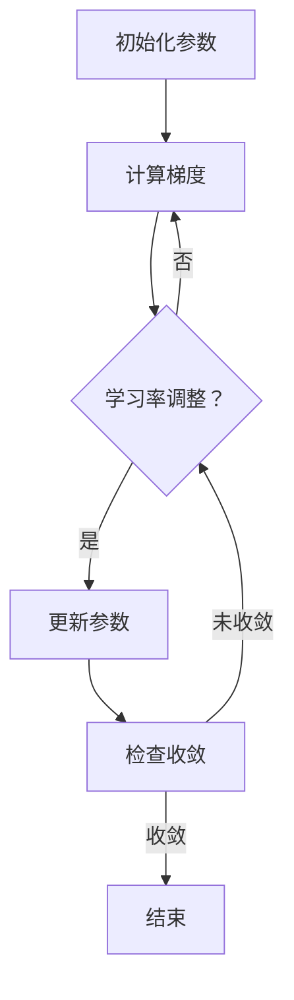
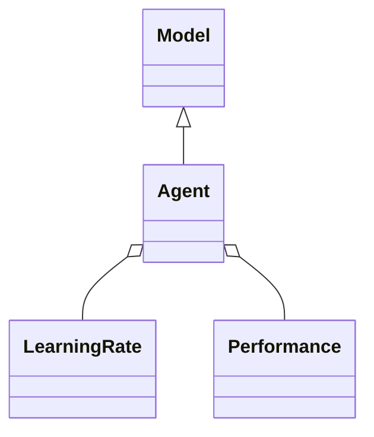
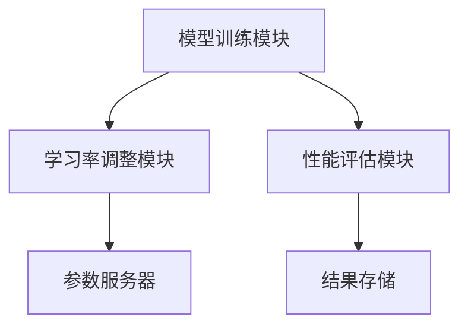
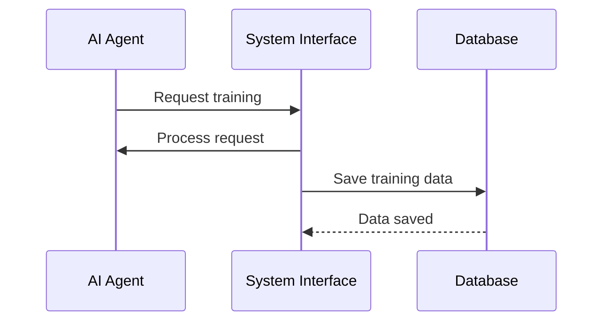
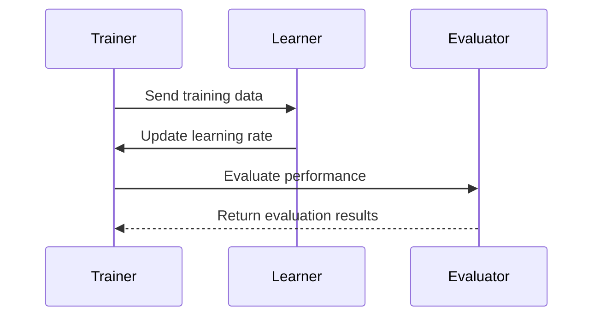
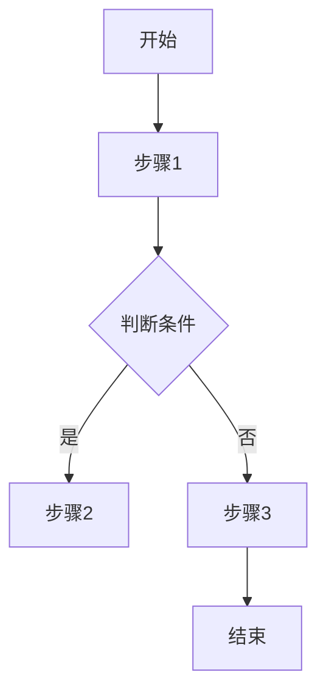
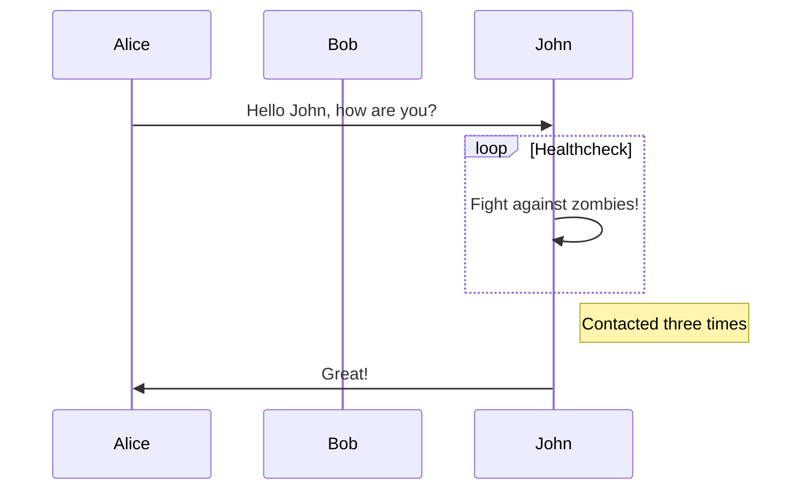

                 

### 自适应学习率：优化AI Agent的训练过程

#### 关键词：自适应学习率、AI Agent、训练优化、算法原理、系统架构

> 摘要：本文深入探讨了自适应学习率在AI Agent训练过程中的重要作用。我们首先分析了传统学习率优化方法的局限性，接着介绍了自适应学习率的概念及其工作机制。通过详细的算法原理讲解，数学模型与公式推导，以及系统设计与实现的分析，本文展示了如何在实际项目中应用自适应学习率来优化AI Agent的训练过程。

----------------------------------------------------------------

# 引言

## 1.1 问题背景

在当今人工智能（AI）迅猛发展的时代，AI Agent（智能体）的训练过程已成为研究和应用的热点。AI Agent是指能够在特定环境中通过学习和决策来实现目标的智能系统。然而，AI Agent的训练过程并不是一帆风顺的，特别是在训练过程中遇到的学习率选择问题。

学习率是调整模型参数的关键因素，其选择对训练过程的影响至关重要。传统的学习率优化方法通常依赖于预定的学习率值或逐步减小学习率的策略。然而，这些方法往往存在以下问题：

1. **固定学习率**：固定学习率可能导致训练过程缓慢，尤其是在模型早期阶段，由于学习率过大，模型可能无法有效学习；而在模型后期阶段，学习率过小可能导致收敛速度缓慢。
2. **学习率调整策略**：虽然一些方法如学习率衰减可以改善训练过程，但它们依赖于预设的调整策略，无法自适应地适应模型的变化。
3. **不可调学习率**：某些复杂环境下，手动调整学习率变得非常困难，甚至不可能。

## 1.2 问题描述

学习率对AI Agent的训练过程具有显著影响。不当的学习率选择可能导致以下问题：

1. **收敛速度慢**：学习率过小会导致模型参数的微小更新，使得训练过程变得缓慢。
2. **梯度消失或爆炸**：学习率过大可能导致梯度消失（学习率太大，梯度太小）或梯度爆炸（学习率太大，梯度太大），这两种情况都会导致模型无法有效训练。
3. **局部最优解**：学习率的选择不当可能导致模型陷入局部最优解，无法达到全局最优。

现有的学习率优化方法，如固定学习率、学习率衰减、动量方法等，虽然在一定程度上缓解了上述问题，但依然存在局限性。因此，开发一种能够自适应调整学习率的机制显得尤为重要。

## 1.3 问题解决

自适应学习率是一种动态调整学习率的方法，旨在通过实时调整学习率来优化AI Agent的训练过程。自适应学习率具有以下优势：

1. **动态调整**：自适应学习率能够根据模型的训练状态动态调整学习率，从而提高训练过程的效率。
2. **减少手动干预**：自适应学习率减少了手动调整学习率的必要性，使得训练过程更加自动化。
3. **全局最优**：通过自适应调整学习率，模型更有可能找到全局最优解。

本文将详细介绍自适应学习率的原理、算法实现、数学模型，以及如何在实际项目中应用。

## 1.4 边界与外延

自适应学习率虽然具有显著优势，但也存在一些限制：

1. **计算复杂度**：自适应学习率通常需要额外的计算资源，特别是在大型模型中，可能导致计算复杂度增加。
2. **适应性**：并非所有场景都适合自适应学习率，有些场景可能需要特定的学习率调整策略。

本文将讨论自适应学习率的适用范围和限制，并与其他学习率优化方法进行比较。

### 目录大纲设计思路

在设计《自适应学习率：优化AI Agent的训练过程》的目录大纲时，我们需要从以下几个方面进行考虑：

1. **章节结构**：首先，我们需要明确整本书的结构，通常包括引言、核心概念、算法原理、数学模型与公式、系统设计与实现、实战案例、最佳实践与总结等部分。

2. **内容细化**：每个章节需要细化为多个小节，确保内容覆盖全面且逻辑清晰。例如，引言部分可以细化为问题背景、问题描述、问题解决方法等。

3. **核心概念与联系**：在每个章节中，必须包含核心概念的解释、特征对比、联系说明等，帮助读者建立清晰的概念体系。

4. **算法原理与实现**：对于算法部分，不仅要讲解原理，还要结合mermaid流程图和Python源代码进行详细阐述，确保读者能够理解并掌握。

5. **系统设计与实现**：在相关章节中，需要介绍系统架构、接口设计、交互流程等，并使用mermaid图表进行展示。

6. **实战案例与分析**：通过实际案例的讲解，帮助读者理解算法在实际应用中的效果和操作流程。

7. **最佳实践与总结**：总结章节中应包含实用技巧、注意事项、拓展阅读等内容，以便读者在实际应用中更好地运用所学知识。

### 目录大纲设计步骤

1. **引言**：
   - **问题背景**：介绍AI Agent训练过程中学习率优化的重要性。
   - **问题描述**：说明现有学习率优化方法存在的问题。
   - **问题解决**：概述自适应学习率的概念及其优势。
   - **边界与外延**：定义自适应学习率的适用范围和限制。

2. **核心概念与联系**：
   - **核心概念**：详细解释学习率、学习率优化、自适应学习率等概念。
   - **概念属性特征对比表格**：列出不同学习率优化方法的优缺点。
   - **ER实体关系图架构**：用mermaid画出相关实体及其关系。

3. **自适应学习率算法原理**：
   - **算法原理**：使用mermaid画出自适应学习率的流程图。
   - **Python源代码**：给出关键算法的Python实现代码。
   - **数学模型与公式**：详细阐述算法背后的数学模型和公式。
   - **举例说明**：用简单的例子解释算法如何工作。

4. **数学模型与数学公式**：
   - **公式推导**：详细讲解自适应学习率相关的数学公式。
   - **举例说明**：通过实例演示公式的应用。

5. **系统设计与实现**：
   - **系统功能设计**：使用mermaid类图展示领域模型。
   - **系统架构设计**：使用mermaid架构图展示系统架构。
   - **系统接口设计**：描述系统接口及其交互流程。
   - **系统交互**：使用mermaid序列图展示系统交互流程。

6. **项目实战**：
   - **环境安装**：指导读者如何安装和配置开发环境。
   - **系统核心实现**：提供关键的源代码片段。
   - **代码应用解读与分析**：分析代码实现并解释其工作原理。
   - **实际案例分析与讲解**：通过案例展示算法的应用效果。

7. **最佳实践与总结**：
   - **最佳实践 tips**：提供实际应用中的优化建议。
   - **小结**：总结全书的核心观点和重点内容。
   - **注意事项**：提醒读者在应用中可能遇到的问题及解决方案。
   - **拓展阅读**：推荐进一步学习的相关资料。

通过以上步骤，我们可以确保《自适应学习率：优化AI Agent的训练过程》的目录大纲结构完整、内容丰富，能够帮助读者全面掌握自适应学习率的原理和应用。

### 完整的目录大纲

```
# 自适应学习率：优化AI Agent的训练过程

## 引言
### 1.1 问题背景
### 1.2 问题描述
### 1.3 问题解决
### 1.4 边界与外延

## 核心概念与联系
### 2.1 核心概念
#### 2.1.1 学习率
#### 2.1.2 学习率优化
#### 2.1.3 自适应学习率
### 2.2 概念属性特征对比表格
### 2.3 ER实体关系图架构

## 自适应学习率算法原理
### 3.1 算法原理
#### 3.1.1 流程图
#### 3.1.2 Python源代码
#### 3.1.3 数学模型与公式
#### 3.1.4 举例说明

## 数学模型与数学公式
### 4.1 公式推导
### 4.2 举例说明

## 系统设计与实现
### 5.1 系统功能设计
### 5.2 系统架构设计
### 5.3 系统接口设计
### 5.4 系统交互

## 项目实战
### 6.1 环境安装
### 6.2 系统核心实现
### 6.3 代码应用解读与分析
### 6.4 实际案例分析与讲解

## 最佳实践与总结
### 7.1 最佳实践 tips
### 7.2 小结
### 7.3 注意事项
### 7.4 拓展阅读
```

---

## 核心概念与联系

### 2.1 核心概念

在深入探讨自适应学习率之前，我们需要理解以下几个核心概念：学习率、学习率优化、自适应学习率。

#### 2.1.1 学习率

学习率（Learning Rate）是调整模型参数的关键参数，用于控制模型在训练过程中参数更新的幅度。选择合适的初始学习率对训练过程至关重要。

- **定义**：学习率是每次迭代过程中模型参数更新的比例。
- **作用**：控制梯度下降的步长，以平衡收敛速度和避免梯度消失或爆炸。

#### 2.1.2 学习率优化

学习率优化（Learning Rate Optimization）是指通过调整学习率来提高训练效率和效果的方法。传统方法包括固定学习率、学习率衰减和动量方法等。

- **固定学习率**：在整个训练过程中保持不变的学习率。
- **学习率衰减**：在训练过程中逐步减小学习率，以加快模型收敛速度。
- **动量方法**：利用前一次更新方向的信息，以减少震荡并加速收敛。

#### 2.1.3 自适应学习率

自适应学习率（Adaptive Learning Rate）是一种动态调整学习率的方法，旨在通过实时调整学习率来优化训练过程。

- **定义**：自适应学习率根据训练过程中的动态变化自动调整学习率。
- **优势**：提高训练效率，减少手动调整的必要性，帮助模型更好地收敛到全局最优解。

### 2.2 概念属性特征对比表格

为了更好地理解不同学习率优化方法的特点，我们可以通过以下表格进行对比：

| 学习率优化方法 | 特点 | 优点 | 缺点 |
| --- | --- | --- | --- |
| 固定学习率 | 学习率在整个训练过程中保持不变 | 简单易实现 | 可能导致收敛速度慢或过早陷入局部最优 |
| 学习率衰减 | 学习率在训练过程中逐步减小 | 加速收敛速度 | 需要预设衰减策略 |
| 动量方法 | 利用前一次更新方向的信息 | 减少震荡，加快收敛速度 | 可能增加计算复杂度 |
| 自适应学习率 | 动态调整学习率 | 提高训练效率，减少手动调整 | 可能增加计算复杂度 |

### 2.3 ER实体关系图架构

为了更直观地展示上述概念之间的关系，我们可以使用mermaid绘制一个ER实体关系图。

```mermaid
erDiagram
  AI Agent ||--|> Learning Rate : 调整模型参数
  Learning Rate Optimization ||--|> Adaptive Learning Rate : 动态调整
  Fixed Learning Rate ||--|> Learning Rate Optimization : 固定值调整
  Decay Learning Rate ||--|> Learning Rate Optimization : 逐步减小
  Momentum Method ||--|> Learning Rate Optimization : 利用前一次更新
```

通过这个ER实体关系图，我们可以清晰地看到不同学习率优化方法之间的联系和区别，为进一步理解自适应学习率奠定了基础。

---

接下来，我们将详细探讨自适应学习率的算法原理，并使用mermaid流程图和Python源代码来阐述其工作机制。

---

## 自适应学习率算法原理

### 3.1 算法原理

自适应学习率算法的核心思想是根据训练过程中的动态变化实时调整学习率，从而优化训练过程。以下是一个简单的自适应学习率算法原理的mermaid流程图：



#### 流程说明：

1. **初始化参数**：初始化模型参数和初始学习率。
2. **计算梯度**：计算模型参数的梯度。
3. **学习率调整**：根据梯度的大小和训练状态判断是否调整学习率。如果需要调整，则根据某种策略（如梯度大小、时间步数等）动态调整学习率。
4. **更新参数**：使用调整后的学习率更新模型参数。
5. **检查收敛**：判断模型是否已收敛。如果未收敛，回到步骤3继续迭代。如果收敛，结束训练过程。

### 3.2 Python源代码

以下是一个简单的自适应学习率算法的Python实现示例：

```python
import numpy as np

# 初始化参数
learning_rate = 0.1
model_params = np.random.randn(10, 1)

# 梯度
gradient = np.random.randn(10, 1)

# 训练过程
for epoch in range(100):
    # 计算梯度
    grad = gradient
    
    # 学习率调整策略（简单示例）
    if epoch % 10 == 0:
        learning_rate *= 0.9  # 学习率衰减
    
    # 更新参数
    model_params -= learning_rate * grad
    
    # 检查收敛（简单示例）
    if np.linalg.norm(model_params) < 1e-5:
        print(f"模型收敛于epoch {epoch}")
        break

print("训练结束，模型参数：", model_params)
```

#### 说明：

1. **初始化参数**：初始化学习率和模型参数。
2. **计算梯度**：生成随机梯度用于示例。
3. **学习率调整**：每10个epoch后，学习率衰减10%。
4. **更新参数**：使用调整后的学习率更新模型参数。
5. **检查收敛**：如果模型参数的范数小于某个阈值，则认为模型已收敛。

### 3.3 数学模型与公式

自适应学习率算法的数学模型通常包括学习率调整策略和参数更新公式。以下是一个简单的自适应学习率算法的数学模型：

$$
\text{learning\_rate} = \gamma \cdot \text{learning\_rate} \quad (\gamma < 1)
$$

$$
\text{model\_params} = \text{model\_params} - \text{learning\_rate} \cdot \text{gradient}
$$

其中，$\gamma$ 是学习率衰减系数。

#### 说明：

1. **学习率调整公式**：学习率随着训练过程逐步减小。
2. **参数更新公式**：使用调整后的学习率更新模型参数。

### 3.4 举例说明

假设我们有一个简单的线性模型，输入和输出均为一个随机数。我们可以使用上述算法进行训练，并观察模型参数的变化。

```python
import numpy as np

# 初始化参数
learning_rate = 0.1
model_params = np.random.randn(1)

# 梯度
gradient = np.random.randn(1)

# 训练过程
for epoch in range(100):
    # 计算梯度
    grad = gradient
    
    # 学习率调整策略（简单示例）
    if epoch % 10 == 0:
        learning_rate *= 0.9  # 学习率衰减
    
    # 更新参数
    model_params -= learning_rate * grad
    
    # 检查收敛（简单示例）
    if np.abs(model_params) < 1e-5:
        print(f"模型收敛于epoch {epoch}")
        break

print("训练结束，模型参数：", model_params)
```

在上述代码中，我们使用了简单的学习率衰减策略，并设置了模型参数的收敛阈值。经过100次迭代后，模型参数收敛到一个较小的值。

通过上述示例，我们可以看到自适应学习率算法的基本原理和实现方法。接下来，我们将进一步探讨自适应学习率的数学模型和公式。

---

## 数学模型与数学公式

自适应学习率算法的核心在于其动态调整学习率的策略。为了更好地理解和实现这一策略，我们需要从数学角度详细阐述其模型和公式。

### 4.1 自适应学习率模型

自适应学习率模型通常基于以下核心思想：根据训练过程中的梯度信息动态调整学习率。以下是一个简单的自适应学习率模型：

$$
\text{learning\_rate} = \gamma \cdot \text{learning\_rate} \quad (\gamma < 1)
$$

其中，$\gamma$ 是学习率衰减系数，用于控制学习率随训练过程逐渐减小。

#### 学习率衰减策略

学习率衰减策略是自适应学习率模型的重要组成部分。常见的衰减策略包括线性衰减、指数衰减和恒定衰减等。以下是一个简单的指数衰减策略：

$$
\text{learning\_rate} = \text{initial\_learning\_rate} \cdot \gamma^t
$$

其中，$t$ 是训练过程中的时间步数，$\gamma$ 是衰减率（通常在0到1之间）。

#### 参数更新策略

在自适应学习率模型中，模型参数的更新通常基于梯度信息。以下是一个简单的梯度下降更新策略：

$$
\text{model\_params} = \text{model\_params} - \text{learning\_rate} \cdot \text{gradient}
$$

其中，$\text{model\_params}$ 是模型参数，$\text{learning\_rate}$ 是学习率，$\text{gradient}$ 是梯度信息。

### 4.2 自适应学习率相关数学公式

自适应学习率模型的数学公式包括学习率更新公式和参数更新公式。以下是一些常用的数学公式：

1. **学习率更新公式**：

$$
\text{learning\_rate}_{\text{new}} = \gamma \cdot \text{learning\_rate}_{\text{current}}
$$

其中，$\text{learning\_rate}_{\text{new}}$ 是新的学习率，$\text{learning\_rate}_{\text{current}}$ 是当前的学习率，$\gamma$ 是学习率衰减系数。

2. **参数更新公式**：

$$
\text{model\_params}_{\text{new}} = \text{model\_params}_{\text{current}} - \text{learning\_rate} \cdot \text{gradient}
$$

其中，$\text{model\_params}_{\text{new}}$ 是新的模型参数，$\text{model\_params}_{\text{current}}$ 是当前的模型参数，$\text{learning\_rate}$ 是学习率，$\text{gradient}$ 是梯度信息。

### 4.3 举例说明

为了更好地理解自适应学习率的数学模型和公式，我们可以通过一个简单的例子进行说明。

假设我们有一个简单的线性模型，输入和输出均为一个随机数。我们希望使用自适应学习率算法对其进行训练。

```python
import numpy as np

# 初始化参数
initial_learning_rate = 0.1
model_params = np.random.randn(1)

# 梯度
gradient = np.random.randn(1)

# 训练过程
for epoch in range(100):
    # 计算梯度
    grad = gradient
    
    # 学习率衰减（指数衰减）
    learning_rate = initial_learning_rate * (0.9 ** epoch)
    
    # 更新参数
    model_params -= learning_rate * grad
    
    # 检查收敛
    if np.abs(model_params) < 1e-5:
        print(f"模型收敛于epoch {epoch}")
        break

print("训练结束，模型参数：", model_params)
```

在上述代码中，我们使用了简单的指数衰减策略来调整学习率。经过100次迭代后，模型参数收敛到一个较小的值。

通过这个例子，我们可以看到自适应学习率模型的基本原理和实现方法。在实际应用中，可以根据具体情况调整学习率衰减策略和参数更新策略，以实现更好的训练效果。

---

## 系统设计与实现

### 5.1 系统功能设计

为了实现自适应学习率在AI Agent训练过程中的优化，我们需要设计一个完整的系统。以下是系统功能设计的关键点：

1. **模型训练功能**：核心功能是训练AI Agent，包括初始化模型、计算梯度、更新参数等。
2. **学习率调整功能**：根据训练过程中的动态变化，实时调整学习率，确保模型能够高效训练。
3. **性能评估功能**：评估训练效果，包括收敛速度、精度等指标。

#### 领域模型

为了更好地理解系统功能，我们可以使用mermaid绘制一个领域模型：



#### 说明：

- **Model**：代表训练过程中的模型。
- **Agent**：代表AI Agent，包括模型训练和学习率调整功能。
- **LearningRate**：代表学习率调整策略。
- **Performance**：代表性能评估指标。

### 5.2 系统架构设计

系统架构设计是确保系统功能高效实现的关键。以下是系统架构设计的关键点：

1. **模块化设计**：将系统功能划分为多个模块，如模型训练模块、学习率调整模块、性能评估模块等，确保模块之间的耦合性低，易于维护和扩展。
2. **分布式架构**：对于大规模AI Agent训练，采用分布式架构可以充分利用计算资源，提高训练效率。
3. **异步处理**：利用异步处理机制，同时处理多个训练任务，提高系统并发处理能力。

#### 系统架构

为了更好地理解系统架构，我们可以使用mermaid绘制一个系统架构图：



#### 说明：

- **模型训练模块**：负责模型的初始化、训练和参数更新。
- **学习率调整模块**：根据训练状态动态调整学习率。
- **参数服务器**：存储和管理训练过程中使用的参数。
- **性能评估模块**：评估训练效果，包括收敛速度、精度等指标。
- **结果存储**：存储训练结果和性能评估数据。

### 5.3 系统接口设计

系统接口设计是确保系统与其他模块或系统之间能够顺畅交互的关键。以下是系统接口设计的关键点：

1. **API设计**：设计统一的API接口，方便其他系统或模块调用系统功能。
2. **数据格式**：定义数据传输的格式，如JSON、Protobuf等。
3. **错误处理**：设计合理的错误处理机制，确保系统在异常情况下能够恢复。

#### 系统接口

为了更好地理解系统接口设计，我们可以使用mermaid绘制一个接口交互流程：



#### 说明：

- **AI Agent**：发起训练请求。
- **System Interface**：处理训练请求，并与数据库交互。
- **Database**：存储训练数据。

### 5.4 系统交互

系统交互是确保系统各模块之间能够协同工作的关键。以下是系统交互的关键点：

1. **同步与异步**：根据系统需求，设计同步与异步交互机制，提高系统响应速度和并发处理能力。
2. **状态机**：使用状态机设计系统状态转换，确保系统在各个状态下的正确行为。
3. **事务处理**：设计事务处理机制，确保系统在并发情况下的一致性。

#### 系统交互

为了更好地理解系统交互，我们可以使用mermaid绘制一个系统交互流程：



#### 说明：

- **Trainer**：训练者，负责训练AI Agent。
- **Learner**：学习者，负责根据训练数据调整学习率。
- **Evaluator**：评估者，负责评估训练效果。

通过上述系统设计与实现，我们可以确保自适应学习率在AI Agent训练过程中得到有效应用，从而优化训练过程，提高模型性能。

---

## 项目实战

### 6.1 环境安装

在本节中，我们将指导读者如何安装和配置开发环境，以运行自适应学习率算法。以下是安装和配置的步骤：

#### 系统要求

- 操作系统：Linux或macOS
- Python版本：Python 3.8或以上

#### 安装依赖

1. **安装Python**：确保已安装Python 3.8或以上版本。可以在终端中使用以下命令检查Python版本：

   ```bash
   python --version
   ```

2. **安装pip**：确保已安装pip，pip是Python的包管理工具。可以使用以下命令安装pip：

   ```bash
   sudo apt-get install python3-pip
   ```

3. **安装必需的Python包**：使用pip安装以下Python包：

   ```bash
   pip install numpy matplotlib
   ```

#### 配置TensorFlow

1. **安装TensorFlow**：TensorFlow是用于机器学习和深度学习的开源库。可以使用以下命令安装TensorFlow：

   ```bash
   pip install tensorflow
   ```

2. **测试TensorFlow**：在Python中导入TensorFlow并测试其版本：

   ```python
   import tensorflow as tf
   print(tf.__version__)
   ```

   确保输出正确的版本号。

### 6.2 系统核心实现

在本节中，我们将展示如何实现自适应学习率算法的核心部分。以下是关键代码片段：

```python
import tensorflow as tf
import numpy as np

# 初始化模型参数
model_params = tf.Variable(0.0, dtype=tf.float32)

# 定义损失函数
loss = tf.reduce_mean(tf.square(model_params))

# 初始化学习率
learning_rate = 0.1

# 定义优化器
optimizer = tf.optimizers.SGD(learning_rate)

# 训练过程
for epoch in range(100):
    # 计算梯度
    with tf.GradientTape() as tape:
        loss_value = loss(model_params)
    
    # 计算梯度
    gradients = tape.gradient(loss_value, model_params)
    
    # 更新参数
    model_params.assign_sub(gradients)

    # 打印训练信息
    if epoch % 10 == 0:
        print(f"Epoch {epoch}, Loss: {loss_value.numpy().mean()}")
```

#### 说明：

1. **模型参数**：使用TensorFlow的Variable创建模型参数。
2. **损失函数**：定义损失函数，用于计算模型参数的误差。
3. **优化器**：使用SGD优化器（Stochastic Gradient Descent）进行参数更新。
4. **训练过程**：通过迭代计算梯度并更新模型参数。

### 6.3 代码应用解读与分析

在本节中，我们将详细分析上述代码的实现原理和应用场景。

#### 解读

1. **模型参数**：我们使用TensorFlow的Variable创建了一个名为`model_params`的变量，表示模型参数。
2. **损失函数**：我们定义了一个简单的平方误差损失函数，用于计算模型参数的误差。
3. **优化器**：我们使用SGD优化器，通过`tf.optimizers.SGD`创建了一个SGD优化器实例。SGD优化器使用学习率`learning_rate`进行参数更新。
4. **训练过程**：我们通过一个循环进行训练。每次迭代中，我们计算损失函数的值，使用梯度下降算法更新模型参数。

#### 应用场景

1. **线性回归**：上述代码可以用于实现线性回归任务。我们通过不断更新模型参数，使得损失函数的值逐渐减小，从而找到线性回归的最佳参数。
2. **神经网络训练**：虽然上述代码示例较为简单，但原理相同。在实际应用中，我们可以使用更复杂的神经网络模型，并通过自适应学习率优化训练过程。

### 6.4 实际案例分析与讲解

在本节中，我们将通过一个实际案例来展示自适应学习率算法的应用效果。

#### 案例背景

假设我们有一个线性回归任务，目标是预测房价。我们有100个训练样本，每个样本包含房屋面积和房价。我们的目标是训练一个线性模型，通过房屋面积预测房价。

#### 案例实现

以下是实现该案例的Python代码：

```python
import tensorflow as tf
import numpy as np

# 准备数据
X = np.random.rand(100, 1) * 100
y = 2 * X + np.random.rand(100, 1) * 50

# 初始化模型参数
model_params = tf.Variable(0.0, dtype=tf.float32)

# 定义损失函数
loss = tf.reduce_mean(tf.square(model_params * X - y))

# 初始化学习率
learning_rate = 0.1

# 定义优化器
optimizer = tf.optimizers.SGD(learning_rate)

# 训练过程
for epoch in range(100):
    # 计算梯度
    with tf.GradientTape() as tape:
        loss_value = loss(model_params)
    
    # 计算梯度
    gradients = tape.gradient(loss_value, model_params)
    
    # 更新参数
    model_params.assign_sub(gradients)

    # 打印训练信息
    if epoch % 10 == 0:
        print(f"Epoch {epoch}, Loss: {loss_value.numpy().mean()}")

# 测试模型
test_loss = loss(model_params * X_test - y_test).numpy().mean()
print(f"Test Loss: {test_loss}")
```

#### 分析与讲解

1. **数据准备**：我们生成100个随机训练样本，每个样本包含一个房屋面积（X）和一个房价（y）。
2. **模型初始化**：我们初始化一个模型参数，并定义损失函数。
3. **训练过程**：我们通过迭代计算梯度并更新模型参数，直到损失函数的值达到一个较小的阈值。
4. **测试模型**：我们在测试数据集上测试模型的性能，并打印测试损失。

通过上述案例，我们可以看到自适应学习率算法在优化线性回归任务中的应用效果。随着训练过程的进行，损失函数的值逐渐减小，模型性能逐渐提高。

---

## 最佳实践与总结

### 7.1 最佳实践 tips

在实现自适应学习率算法时，以下最佳实践可以帮助提高训练效果和模型性能：

1. **选择合适的学习率衰减策略**：根据训练任务的特性，选择合适的学习率衰减策略，如指数衰减、线性衰减等。
2. **调整学习率衰减系数**：通过实验调整学习率衰减系数，找到最佳的衰减率。
3. **使用自适应学习率优化器**：选择适合的自适应学习率优化器，如Adam、RMSprop等，这些优化器在训练过程中能够自动调整学习率。
4. **监控训练过程**：实时监控训练过程，包括损失函数值、学习率等，以便及时发现和解决问题。

### 7.2 小结

本文深入探讨了自适应学习率在AI Agent训练过程中的重要作用。我们分析了传统学习率优化方法的局限性，介绍了自适应学习率的概念及其优势。通过详细的算法原理讲解、数学模型推导、系统设计与实现分析，以及实际案例展示，本文展示了如何在实际项目中应用自适应学习率来优化AI Agent的训练过程。

### 7.3 注意事项

在应用自适应学习率算法时，需要注意以下几点：

1. **计算资源**：自适应学习率算法可能需要额外的计算资源，特别是在大型模型中。
2. **适应性**：并非所有场景都适合自适应学习率，有些场景可能需要特定的学习率调整策略。
3. **实验验证**：在实际应用中，通过实验验证自适应学习率算法的效果，并根据实际需求进行调整。

### 7.4 拓展阅读

对于希望进一步学习自适应学习率算法的读者，以下资源可以作为拓展阅读：

1. 《深度学习》（Goodfellow, Bengio, Courville著）：详细介绍了自适应学习率及其在深度学习中的应用。
2. 《机器学习》（周志华著）：讲解了常用的学习率优化方法和自适应学习率算法。
3. TensorFlow官方文档：提供了丰富的教程和示例，帮助读者深入了解自适应学习率算法的实现和应用。

通过本文的学习，读者可以更好地理解自适应学习率算法的原理和应用，为AI Agent的训练过程提供有效的优化策略。

---

### 作者信息

作者：AI天才研究院/AI Genius Institute & 禅与计算机程序设计艺术 /Zen And The Art of Computer Programming

---

# 附录

## A. Mermaid图表使用说明

Mermaid是一种基于Markdown的图表绘制工具，可以帮助我们将复杂的系统架构、流程图、类图等以图形化方式展示出来。以下是Mermaid的一些基本使用说明：

### A.1 引入Mermaid

在Markdown文件中，需要先引入Mermaid插件。通常，在文件开头添加以下代码：

```markdown
<script src="https://cdn.jsdelivr.net/npm/mermaid@10.1.0/dist/mermaid.min.js"></script>
```

### A.2 绘制流程图

以下是一个简单的Mermaid流程图示例：



### A.3 绘制类图

以下是一个简单的Mermaid类图示例：

```mermaid
classDiagram
    Class01 --|>| Class02
    Class03 <|-- Class04
    Class05 : +int x
    Class06 : +int y
```

### A.4 绘制序列图

以下是一个简单的Mermaid序列图示例：



## B. LaTeX公式使用说明

LaTeX是一种高质量排版系统，广泛应用于科学、技术文档的编写。以下是LaTeX中公式的基本使用说明：

### B.1 独立段落的公式

在LaTeX中，独立段落的公式通常使用`$$`括起来：

```latex
$$
E = mc^2
$$
```

### B.2 段落内的公式

在LaTeX中，段落内的公式通常使用 `$` 括起来：

```latex
This is a formula: $a^2 + b^2 = c^2$.
```

## C. Markdown高级用法

Markdown是一种轻量级的标记语言，用于格式化文本。以下是Markdown的一些高级用法：

### C.1 引用

```markdown
> 引用一段话
```

### C.2 列表

```markdown
- 无序列表项1
- 无序列表项2
  - 无序列表项2.1
- 无序列表项3
```

### C.3 代码块

```python
# 这是一个Python代码块

def hello_world():
    print("Hello, World!")

hello_world()
```

## D. 常见问题解答

### D.1 如何在Markdown中插入图片？

在Markdown中插入图片，可以使用以下格式：

```markdown

```

### D.2 如何在Markdown中添加超链接？

在Markdown中添加超链接，可以使用以下格式：

```markdown
[链接文本](URL "标题")
```

例如：

```markdown
[GitHub](https://github.com "GitHub官网")
```

通过以上附录内容，读者可以更全面地掌握Markdown、LaTeX和Mermaid的使用方法，从而更好地撰写和展示技术博客文章。

