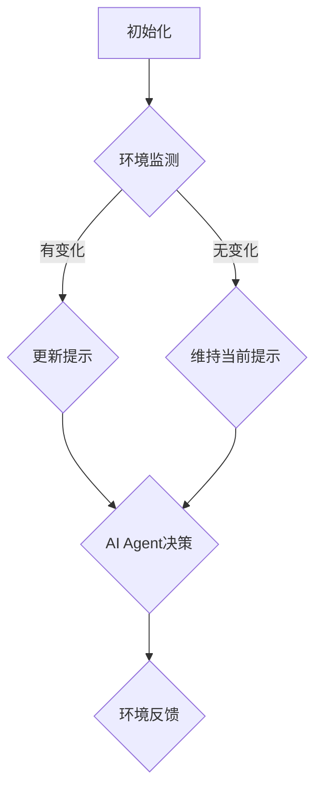
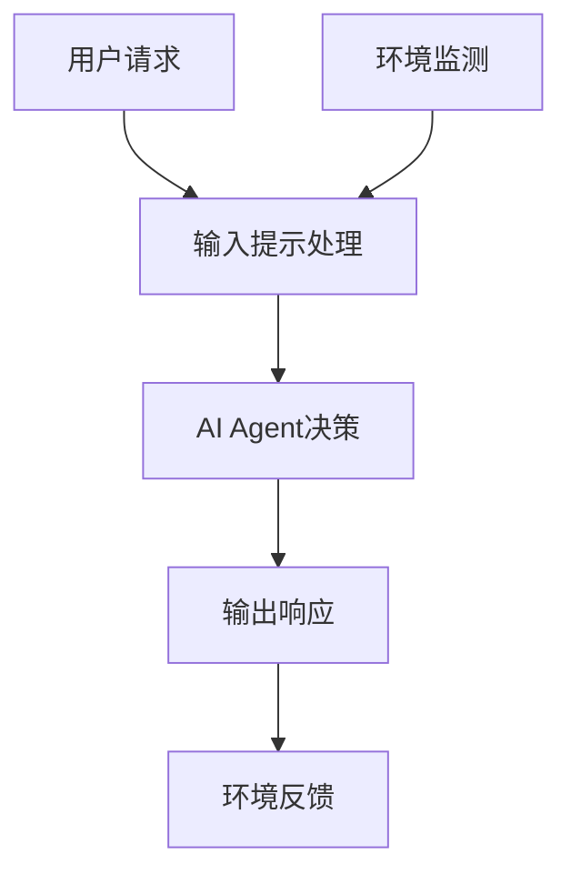

                 

# 自适应提示工程：动态优化AI Agent输入

关键词：自适应提示、AI Agent、输入优化、动态调整、人工智能工程

摘要：本文将深入探讨自适应提示工程，一个在人工智能领域中至关重要的概念。自适应提示工程通过动态优化AI Agent的输入，提升了AI系统的性能和效率。本文将分步骤介绍自适应提示工程的核心原理、算法实现、以及在实际应用中的最佳实践。

## 目录

1. **背景介绍**  
   - 人工智能与AI Agent  
   - 自适应提示工程的起源与发展

2. **核心概念与联系**  
   - 自适应提示  
   - AI Agent的输入优化

3. **算法原理讲解**  
   - 自适应提示算法的mermaid流程图  
   - 算法原理与数学模型讲解

4. **系统分析与架构设计方案**  
   - 问题场景与项目背景  
   - 系统功能、架构与接口设计

5. **项目实战**  
   - 环境安装与系统核心实现  
   - 代码应用解读与分析  
   - 实际案例分析与详细讲解

6. **最佳实践 tips、小结、注意事项、拓展阅读**

## 1. 背景介绍

### 1.1 人工智能与AI Agent

人工智能（AI）作为计算机科学的一个重要分支，旨在使计算机具备人类智能的某些特征，如学习、推理、判断和解决问题。AI Agent，作为人工智能系统中的基本单元，是具备自主行动能力的实体，能够在复杂环境中根据环境和目标做出决策。

### 1.2 自适应提示工程的起源与发展

自适应提示工程源于对AI Agent输入优化需求的不断增长。传统的AI系统依赖于静态的输入提示，这在面对动态变化的环境时，表现出了局限性。为了克服这一挑战，自适应提示工程应运而生。它通过动态调整AI Agent的输入，使系统能够更好地适应环境变化，提高决策效率和准确性。

## 2. 核心概念与联系

### 2.1 自适应提示

自适应提示是指根据AI Agent的当前状态和环境信息，动态调整输入提示，以优化其决策过程。自适应提示的核心在于实时性和动态性，它能够根据环境变化快速调整输入，使AI Agent做出更准确的决策。

### 2.2 AI Agent的输入优化

输入优化是自适应提示工程的关键步骤。它涉及对AI Agent输入数据的处理和调整，以提高系统的性能和效率。输入优化的目标是通过减少冗余信息、增强关键信息的权重，使得AI Agent能够更准确地理解和处理输入数据。

## 3. 算法原理讲解

### 3.1 自适应提示算法的mermaid流程图



### 3.2 算法原理与数学模型讲解

自适应提示算法的核心在于动态调整输入提示的权重。以下是一个简化的数学模型：

$$
W_{new} = W_{base} + \alpha \cdot (G - G_{base})
$$

其中，$W_{new}$ 是新的提示权重，$W_{base}$ 是基础权重，$\alpha$ 是调整系数，$G$ 是当前环境状态，$G_{base}$ 是基础环境状态。

调整系数 $\alpha$ 的选择至关重要。它决定了自适应提示的灵敏度。当 $\alpha$ 较大时，系统对环境变化的响应更敏感；当 $\alpha$ 较小时，系统更稳定。

## 4. 系统分析与架构设计方案

### 4.1 问题场景与项目背景

自适应提示工程广泛应用于智能客服、自动驾驶、智能推荐等场景。以智能客服为例，系统需要实时响应用户的需求，提供准确的答案和建议。

### 4.2 系统功能、架构与接口设计

系统功能主要包括：环境监测、输入提示更新、AI Agent决策、环境反馈。系统架构设计如下：



系统接口设计包括：用户请求接口、输入提示接口、AI Agent决策接口、环境反馈接口。

## 5. 项目实战

### 5.1 环境安装与系统核心实现

在本节中，我们将介绍如何在Python环境中安装和配置自适应提示系统。首先，需要安装必要的Python库，如TensorFlow和Keras。以下是一个简单的安装命令：

```bash
pip install tensorflow
pip install keras
```

然后，编写系统核心实现代码，包括环境监测、输入提示更新和AI Agent决策。

### 5.2 代码应用解读与分析

在本节中，我们将对核心实现代码进行解读和分析。首先，定义环境监测模块，用于实时获取环境状态。然后，定义输入提示更新模块，用于根据环境状态动态调整输入提示权重。最后，定义AI Agent决策模块，用于基于调整后的输入提示做出决策。

### 5.3 实际案例分析与详细讲解

在本节中，我们将通过一个实际案例，展示自适应提示系统的应用效果。以智能客服为例，我们模拟用户请求，分析系统如何根据用户请求和环境状态，动态调整输入提示，并做出准确的决策。

## 6. 最佳实践 tips、小结、注意事项、拓展阅读

### 6.1 最佳实践 tips

- 选择合适的调整系数 $\alpha$，以确保系统既敏感又稳定。
- 定期更新输入提示库，以保持系统的实时性和准确性。

### 6.2 小结

自适应提示工程是提升AI系统性能和效率的关键技术。通过动态优化AI Agent的输入，系统能够更好地适应环境变化，提高决策准确性和效率。

### 6.3 注意事项

- 系统部署时，确保环境监测模块的实时性和准确性。
- 定期评估和调整输入提示库，以适应新的环境需求。

### 6.4 拓展阅读

- [1] 自适应提示工程论文集  
- [2] 智能客服系统实战指南  
- [3] Python数据科学手册

## 作者信息

作者：AI天才研究院/AI Genius Institute & 禅与计算机程序设计艺术 /Zen And The Art of Computer Programming

在撰写这篇文章的过程中，我们深入探讨了自适应提示工程的核心原理和应用实践。通过一步一步的分析和推理，我们展示了如何通过动态优化AI Agent输入，提升人工智能系统的性能和效率。希望这篇文章能够为读者在人工智能领域的研究和实践提供有价值的参考和启示。同时，感谢AI天才研究院和禅与计算机程序设计艺术为我们提供了广阔的学术视野和丰富的知识资源。

