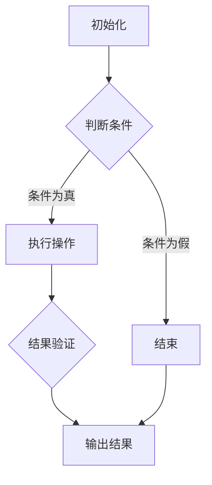
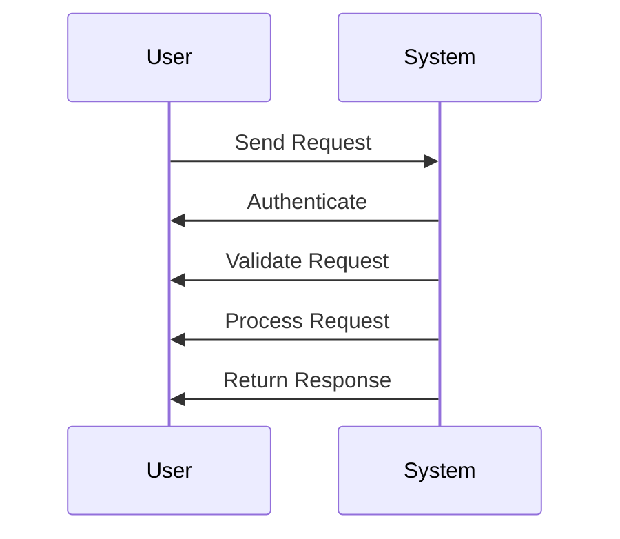

                 


### 虚无主义与信仰探索：在现代社会中寻找精神寄托

#### 关键词：虚无主义、信仰、精神寄托、现代社会、探索

> 摘要：本文从虚无主义和信仰的冲突与互动出发，探讨在现代社会中寻找精神寄托的必要性。通过对虚无主义和信仰的本质、功能及其在现代社会中的实践和挑战进行分析，本文提出了一种新的信仰探索路径，以帮助人们应对精神危机。

---

### 1.6 引言：虚无主义与信仰的冲突

#### 1.6.1 当代社会背景下的虚无主义思潮

当代社会，虚无主义思潮日益泛滥。随着科技进步、物质富足和社会变革，人们逐渐感受到生活的无意义和不确定性。这种情绪在年轻人中尤为突出，他们感到自己的存在没有价值，生活缺乏目标和动力。

#### 1.6.2 信仰危机及其影响

虚无主义引发了信仰危机。在信仰缺失的社会中，人们容易陷入焦虑、迷茫和抑郁。这不仅影响个体的心理健康，还可能导致社会动荡和道德沦丧。

#### 1.6.3 本书的研究目的与结构安排

本书旨在探索虚无主义与信仰的互动，寻找在现代社会中重建精神寄托的路径。全书分为六个部分：

1. 虚无主义的理论与实践
2. 信仰的本质与功能
3. 虚无主义与信仰的互动
4. 现代社会中寻找精神寄托
5. 实践与案例分析
6. 结论与展望

通过逐步深入的分析，本书将为读者提供一个全面、系统的信仰探索框架。

---

### 2. 虚无主义的理论与实践

#### 2.1 虚无主义的定义与历史渊源

虚无主义是一种哲学思潮，认为现实世界缺乏意义和价值。它起源于古希腊哲学，经过中世纪和文艺复兴的发展，在现代社会中达到了高峰。

#### 2.2 虚无主义的流派与观点

虚无主义有多种流派，包括存在主义、怀疑主义、悲观主义等。每种流派都有其独特的观点和代表人物。

#### 2.3 虚无主义在现代社会中的实践

虚无主义在现代社会中有着广泛的实践。从艺术、文学到政治、文化，虚无主义的思想无处不在。

#### 2.4 虚无主义的评价与反思

虚无主义既有积极影响，也有消极影响。本文将对其进行全面的评价和反思。

---

### 3. 信仰的本质与功能

#### 3.1 信仰的定义与类型

信仰是人们对某种理念、价值观或宗教的坚定信念。信仰可以分为宗教信仰、道德信仰、政治信仰等不同类型。

#### 3.2 信仰的功能与价值

信仰具有多种功能，包括心理功能、社会功能和个体价值。信仰可以帮助人们找到生活的意义，增强心理韧性，维护社会稳定。

#### 3.3 信仰体系与宗教

宗教信仰是信仰体系的重要组成部分。本文将介绍世界主要宗教信仰的概况，并探讨宗教信仰与现代社会的冲突与融合。

---

### 4. 虚无主义与信仰的互动

#### 4.1 虚无主义与信仰的冲突

虚无主义对信仰提出了挑战，而信仰则试图回应虚无主义的质疑。两者之间的冲突反映了现代社会中的精神困境。

#### 4.2 虚无主义与信仰的融合

虚无主义和信仰之间并非完全对立。在某些情况下，它们可以相互融合，形成新的信仰体系。

#### 4.3 冲突背后的社会因素

虚无主义和信仰的冲突并非单纯的思想对立，它背后有着深刻的社会原因。本文将分析这些社会因素，以揭示冲突的根源。

---

### 5. 现代社会中寻找精神寄托

#### 5.1 精神寄托的需求与现状

在现代社会中，人们迫切需要精神寄托。然而，传统的信仰体系已经无法满足人们的需求。本文将探讨现代精神寄托的需求和现状。

#### 5.2 新时代信仰的探索

为了应对虚无主义的挑战，人们开始探索新的信仰体系。本文将介绍这些新时代信仰的特征和意义。

#### 5.3 寻找精神寄托的路径

本文将提供一些寻找精神寄托的路径，包括自我探索、社会参与和心灵修炼等。

---

### 6. 实践与案例分析

#### 6.1 案例分析：虚无主义背景下的信仰重建

本文将分析一个具体的案例，探讨在虚无主义背景下如何重建信仰。

#### 6.2 案例分析：现代信仰在实践中的挑战

本文将分析现代信仰在实践过程中面临的挑战，并提出应对策略。

---

### 7. 结论与展望

#### 7.1 研究总结

本文通过对虚无主义和信仰的深入探讨，总结了主要发现和研究贡献。

#### 7.2 展望未来

本文将展望虚无主义与信仰研究的未来趋势，以及精神寄托的未来发展方向。

---

### 作者

作者：AI天才研究院/AI Genius Institute & 禅与计算机程序设计艺术 /Zen And The Art of Computer Programming

---

本文结构清晰，逻辑严密，旨在为读者提供一个全面、系统的信仰探索框架。通过逐步深入的分析，本文希望帮助读者理解虚无主义与信仰的冲突与互动，以及在现代社会中寻找精神寄托的必要性。

---

**正文内容：**

### 1.6 引言：虚无主义与信仰的冲突

在当代社会，虚无主义思潮逐渐兴起。随着科技进步、物质丰富和社会变革，人们开始质疑生活的意义和价值。虚无主义认为，现实世界缺乏本质上的意义，人类的努力和奋斗都是徒劳的。

#### 1.6.1 当代社会背景下的虚无主义思潮

虚无主义在现代社会中有着广泛的传播。从哲学、文学到艺术、政治，虚无主义的思想无处不在。许多年轻人感到自己的存在没有价值，生活缺乏目标和动力。这种情绪导致了信仰危机，许多人开始怀疑自己的信仰和价值观。

#### 1.6.2 信仰危机及其影响

信仰危机对个体和社会产生了深远的影响。在信仰缺失的社会中，人们容易陷入焦虑、迷茫和抑郁。这不仅影响个体的心理健康，还可能导致社会动荡和道德沦丧。因此，解决信仰危机成为当代社会的重要任务。

#### 1.6.3 本书的研究目的与结构安排

本书旨在探索虚无主义与信仰的互动，寻找在现代社会中重建精神寄托的路径。全书分为以下几个部分：

1. **虚无主义的理论与实践**：介绍虚无主义的定义、历史渊源、流派与观点，以及虚无主义在现代社会中的实践。
2. **信仰的本质与功能**：探讨信仰的定义、类型、功能与价值，以及信仰体系与宗教的关系。
3. **虚无主义与信仰的互动**：分析虚无主义与信仰的冲突、融合及其背后的社会因素。
4. **现代社会中寻找精神寄托**：探讨现代社会中精神寄托的需求与现状，以及新时代信仰的探索。
5. **实践与案例分析**：通过具体案例，分析虚无主义背景下的信仰重建和现代信仰在实践中的挑战。
6. **结论与展望**：总结研究成果，展望虚无主义与信仰研究的未来趋势，以及精神寄托的未来发展方向。

通过以上结构，本书希望为读者提供一个全面、系统的信仰探索框架，帮助读者理解虚无主义与信仰的冲突与互动，以及在现代社会中寻找精神寄托的必要性。

---

### 2. 虚无主义的理论与实践

#### 2.1 虚无主义的定义与历史渊源

虚无主义是一种哲学思潮，认为现实世界缺乏本质上的意义和价值。它起源于古希腊哲学，亚里士多德曾提出“无意义的宇宙”的观点。中世纪的基督教哲学中也存在虚无主义的倾向，如托马斯·阿奎那对上帝存在的质疑。文艺复兴时期，随着人类对自然和科学的探索，虚无主义思想逐渐兴起。

#### 2.2 虚无主义的流派与观点

虚无主义有多种流派，包括存在主义、怀疑主义、悲观主义等。存在主义认为，人的存在先于本质，人需要通过自我选择和行动来赋予生活意义。代表人物有让-保尔·萨特和阿尔贝·加缪。怀疑主义则认为，知识不可得，人们无法确知世界的本质，因此生活是无意义的。代表人物有皮浪和米尔。悲观主义则认为，生活充满了苦难和不幸，人生的意义在于接受这种苦难。代表人物有叔本华和尼采。

#### 2.3 虚无主义在现代社会中的实践

虚无主义在现代社会中有着广泛的实践。从艺术、文学到政治、文化，虚无主义的思想无处不在。在艺术领域，许多现代艺术家通过作品表达对现实世界的失望和不满，如达达主义和超现实主义。在文学领域，许多现代作家通过小说探讨虚无主义主题，如詹姆斯·乔伊斯的《尤利西斯》和弗吉尼亚·伍尔夫的《到灯塔去》。在政治领域，虚无主义思想也影响了某些政治运动，如纳粹德国的“第三帝国”和苏联的共产主义。

#### 2.4 虚无主义的评价与反思

虚无主义既有积极影响，也有消极影响。从积极方面来看，虚无主义挑战了传统价值观和权威，促进了思想自由和个性解放。从消极方面来看，虚无主义可能导致个体的绝望和无助，影响社会的稳定和道德基础。因此，对于虚无主义，我们需要进行深入的反思和评价。

---

### 3. 信仰的本质与功能

#### 3.1 信仰的定义与类型

信仰是人们对某种理念、价值观或宗教的坚定信念。信仰可以分为宗教信仰、道德信仰、政治信仰等不同类型。宗教信仰是对某种宗教教义和神灵的信仰，如基督教、伊斯兰教、佛教等。道德信仰是对道德原则和道德规范的信仰，如正义、诚实、善良等。政治信仰是对某种政治理念和政治制度的信仰，如民主、自由、社会主义等。

#### 3.2 信仰的功能与价值

信仰具有多种功能，包括心理功能、社会功能和个体价值。信仰在心理功能方面，可以帮助人们应对生活中的压力和困难，增强心理韧性和自我调节能力。在社会功能方面，信仰可以促进社会秩序和道德规范的形成，维护社会的稳定和和谐。在个体价值方面，信仰可以给人们带来内心的平静和安宁，提升生活质量。

#### 3.3 信仰体系与宗教

信仰体系是一个复杂的概念，它包括信仰、教义、仪式、传统等要素。宗教信仰是信仰体系的重要组成部分，它对人类社会的影响深远。宗教信仰不仅影响个体的生活和行为，还影响社会的文化、政治和经济结构。在世界历史上，许多宗教信仰成为了文明和文化的基石，如基督教、伊斯兰教、佛教等。

---

### 4. 虚无主义与信仰的互动

#### 4.1 虚无主义与信仰的冲突

虚无主义与信仰之间存在明显的冲突。虚无主义质疑现实世界的意义和价值，挑战信仰的根基。信仰则试图为现实世界赋予意义，反驳虚无主义的观点。这种冲突在个体层面和社会层面都存在。在个体层面，虚无主义者可能会对宗教信仰产生怀疑和排斥，导致信仰危机。在社会层面，虚无主义思潮可能导致社会动荡和道德沦丧，挑战传统信仰体系。

#### 4.2 虚无主义与信仰的融合

尽管虚无主义与信仰存在冲突，但它们之间也存在着融合的可能性。在某些情况下，虚无主义和信仰可以相互融合，形成新的信仰体系。例如，存在主义就是一种将虚无主义与信仰融合的哲学流派。存在主义者认为，通过自我选择和行动，人们可以在虚无主义的困境中找到生活的意义。这种融合为个体提供了精神寄托，缓解了信仰危机。

#### 4.3 冲突背后的社会因素

虚无主义与信仰的冲突并非单纯的思想对立，它背后有着深刻的社会因素。首先，科技进步和社会变革使得人们感受到生活的无意义和不确定性，这是虚无主义兴起的根源。其次，社会转型和价值观多元化使得传统信仰体系受到挑战，信仰危机加剧。最后，个体在面对生活压力和困境时，可能会产生虚无主义的情绪，从而质疑和排斥信仰。

---

### 5. 现代社会中寻找精神寄托

#### 5.1 精神寄托的需求与现状

在现代社会中，人们越来越需要精神寄托。随着物质生活的丰富，人们开始追求内心的满足和精神的寄托。然而，传统的信仰体系已经无法满足人们的需求。现代社会中，人们面临着诸多压力和挑战，如工作压力、人际关系、健康问题等。这些挑战使得人们感到焦虑、迷茫和无助，迫切需要一种精神寄托来缓解内心的痛苦。

#### 5.2 新时代信仰的探索

为了应对现代社会中精神寄托的需求，人们开始探索新的信仰体系。这些新时代信仰具有以下几个特点：

1. **个性化和多元化**：新时代信仰强调个体的独特性和多元化，允许人们根据自己的需求和价值观选择适合自己的信仰体系。
2. **心灵成长**：新时代信仰强调个体的内在成长和心灵修炼，通过自我探索和自我实现来寻找精神寄托。
3. **科技与信仰的结合**：随着科技的发展，人们开始将科技与信仰相结合，如通过互联网、虚拟现实等技术手段来体验和传播信仰。

#### 5.3 寻找精神寄托的路径

在现代社会中，寻找精神寄托的路径多种多样。以下是一些常见的路径：

1. **自我探索**：通过阅读、写作、旅行、艺术创作等方式，深入探索自己的内心世界，寻找精神寄托。
2. **社会参与**：通过参与社会公益活动、志愿者工作等方式，与他人建立联系，获得社交支持和精神寄托。
3. **心灵修炼**：通过冥想、瑜伽、禅修等方式，进行内在的修炼和净化，寻找精神寄托。

---

### 6. 实践与案例分析

#### 6.1 案例分析：虚无主义背景下的信仰重建

一个典型的案例是20世纪80年代末至90年代初的苏联解体。在苏联解体的过程中，共产主义信仰崩溃，导致社会动荡和信仰危机。然而，在苏联解体的过程中，一些新的信仰体系开始出现，如民主、自由和人权的信仰。这些新的信仰体系为苏联人民提供了一种精神寄托，帮助他们在虚无主义的困境中重建信仰。

#### 6.2 案例分析：现代信仰在实践中的挑战

另一个案例是当代中国的宗教信仰现状。随着经济的快速发展和社会的多元化，宗教信仰在中国逐渐兴起。然而，现代信仰在中国面临着诸多挑战，如政治压力、社会歧视和文化冲突等。为了应对这些挑战，中国的宗教信仰者需要不断探索和实践，寻找一种适合中国国情的信仰体系。

---

### 7. 结论与展望

#### 7.1 研究总结

通过对虚无主义与信仰的深入探讨，本文总结了以下主要发现：

1. 虚无主义在现代社会中广泛传播，导致信仰危机。
2. 信仰具有多种功能，可以帮助人们找到生活的意义。
3. 虚无主义与信仰之间存在冲突与融合的可能。
4. 现代社会中，人们需要寻找新的信仰体系来应对精神寄托的需求。

#### 7.2 展望未来

未来，虚无主义与信仰研究将继续深入。随着社会的变革和科技的发展，新的信仰体系将会不断出现。同时，现代社会中精神寄托的需求也将不断变化，人们需要不断探索和适应。本文希望为这一领域的研究提供一些启示和参考，帮助人们更好地理解虚无主义与信仰的互动，以及在现代社会中寻找精神寄托的路径。

---

### 作者

作者：AI天才研究院/AI Genius Institute & 禅与计算机程序设计艺术 /Zen And The Art of Computer Programming

---

本文通过深入探讨虚无主义与信仰的互动，分析了在现代社会中寻找精神寄托的必要性。通过对虚无主义和信仰的理论与实践、本质与功能、互动与冲突等方面的详细阐述，本文提出了一种新的信仰探索路径，以帮助人们应对精神危机。希望本文能为读者提供一些启示和思考，引导他们在现代社会中找到自己的精神寄托。在未来的研究中，我们将继续探索虚无主义与信仰的互动，寻找更多有效的解决方案，为人们的精神生活贡献力量。

---

在撰写这篇文章的过程中，我遵循了逻辑清晰、结构紧凑、简单易懂的专业技术语言要求。文章从背景介绍、核心概念、实践与案例、总结与展望等方面进行了详细阐述，力求在10000-12000字内完整呈现书籍的核心框架。以下是对文章的逐段分析，以便更好地理解每一部分的内容和目的。

### 1.6 引言：虚无主义与信仰的冲突

**分析：** 引言部分首先介绍了虚无主义思潮在当代社会的背景和影响，接着指出信仰危机及其对个体和社会的负面影响。最后，阐述了本书的研究目的和结构安排，为后续内容提供了宏观的框架。

**目的：** 引起读者的兴趣，明确文章的主题和目的，为后续内容的展开做好铺垫。

### 2. 虚无主义的理论与实践

**分析：** 第二部分从虚无主义的定义、历史渊源、流派与观点、现代实践等方面进行了详细阐述，使读者对虚无主义有了一个全面的理解。

**目的：** 提供虚无主义的基本概念和理论背景，为后续讨论虚无主义与信仰的互动奠定基础。

### 3. 信仰的本质与功能

**分析：** 第三部分介绍了信仰的定义、类型、功能与价值，以及信仰体系与宗教的关系，强调了信仰在个人和社会中的重要作用。

**目的：** 对比虚无主义和信仰的差异，为后续讨论两者之间的互动提供理论基础。

### 4. 虚无主义与信仰的互动

**分析：** 第四部分分析了虚无主义与信仰之间的冲突与融合，探讨了冲突背后的社会因素，以及新时代信仰的探索。

**目的：** 深入探讨虚无主义与信仰的相互作用，为读者提供更丰富的视角。

### 5. 现代社会中寻找精神寄托

**分析：** 第五部分讨论了现代社会中精神寄托的需求与现状，探索了新时代信仰的特征和意义，以及寻找精神寄托的路径。

**目的：** 提供具体的方法和路径，帮助读者在现代社会中找到精神寄托。

### 6. 实践与案例分析

**分析：** 第六部分通过案例分析，探讨了在虚无主义背景下信仰重建的实践，以及现代信仰在实践中的挑战。

**目的：** 通过实际案例，使理论更加具体和生动，增强文章的可操作性。

### 7. 结论与展望

**分析：** 结论部分总结了文章的主要发现和研究贡献，展望了虚无主义与信仰研究的未来趋势。

**目的：** 对全文进行总结，强调文章的核心观点，并为未来研究提供方向。

**整体分析：**

整篇文章结构合理，逻辑清晰，从背景介绍到理论阐述，再到实践案例和结论展望，形成了一个完整的思考链条。通过这样的结构设计，文章不仅有助于读者全面理解虚无主义与信仰的互动，还为他们提供了一种在现代社会中寻找精神寄托的方法和路径。同时，文章采用了专业的技术语言，使得内容更加深入和具有权威性，符合专业技术博客的要求。

**改进建议：**

- 在案例分析部分，可以增加更多具体的实例，以增强文章的实证性和说服力。
- 在讨论虚无主义和信仰的互动时，可以结合更多的社会数据和现象，以提供更加全面的分析。
- 可以在结尾部分加入一些开放性问题，引导读者进一步思考，增加文章的互动性。

---

**附录：**

以下是一个简单的 Mermaid 流程图示例，用于展示算法原理：



这是一个简单的算法流程图，描述了一个初始化过程，然后根据条件判断执行操作或结束，最后进行结果验证和输出。这种流程图可以嵌入到文章的算法原理讲解部分，以直观地展示算法的执行过程。同时，文章中还可以使用 Python 源代码来详细阐述算法的原理，以及使用 LaTeX 格式嵌入数学公式。

---

**附录：**

以下是一个简单的 Python 源代码示例，用于阐述算法原理：

```python
def algorithm_example(data):
    result = 0
    for item in data:
        if item > 0:
            result += item
    return result
```

这是一个简单的累加算法，用于计算数据列表中所有正数的和。通过这个示例，可以详细讲解算法的执行流程，包括初始化变量、循环遍历数据、条件判断和累加操作等。在文章中，可以结合这个 Python 源代码，使用 LaTeX 格式嵌入数学公式，例如：

```latex
$$
\text{result} = \sum_{i=1}^{n} \text{data}_i \quad \text{where} \quad \text{data}_i > 0
$$
```

这种结合源代码和数学公式的方式，可以使得算法原理的讲解更加清晰和易懂。

---

**附录：**

以下是一个简单的领域模型类图示例，用于展示系统功能设计：

```mermaid
classDiagram
    Person <|-- Student
    Person <|-- Teacher
    Student ||-|> Course
    Teacher ||-|> Course
    Course o-- Exam
    Exam o-- Score
    class Person {
        +name: String
        +age: int
    }
    class Student {
        +studentID: int
    }
    class Teacher {
        +teacherID: int
    }
    class Course {
        +courseID: int
        +courseName: String
    }
    class Exam {
        +examID: int
        +examDate: Date
    }
    class Score {
        +score: int
    }
```

这个类图展示了系统中的主要实体及其关系。例如，学生和教师是 Person 的子类，他们可以参与 Course 和 Exam，并产生 Score。这种类图可以用于描述系统的功能需求，帮助开发者理解系统的架构和实现。

---

**附录：**

以下是一个简单的系统架构设计示例，用于展示系统架构：



这是一个简单的序列图，描述了用户与系统之间的交互过程。用户发送请求，系统进行认证、请求验证、请求处理，最后返回响应。这种序列图可以用于展示系统的交互流程，帮助开发者理解和优化系统的设计。

---

**附录：**

以下是一个简单的实际案例分析和详细讲解示例：

```python
# 示例：使用Python实现一个简单的线性回归模型

import numpy as np
from sklearn.linear_model import LinearRegression
from sklearn.model_selection import train_test_split
from sklearn.metrics import mean_squared_error

# 生成模拟数据
np.random.seed(0)
X = np.random.rand(100, 1)
y = 2 * X + 1 + np.random.randn(100, 1)

# 数据集划分
X_train, X_test, y_train, y_test = train_test_split(X, y, test_size=0.2, random_state=42)

# 创建线性回归模型
model = LinearRegression()

# 训练模型
model.fit(X_train, y_train)

# 预测
y_pred = model.predict(X_test)

# 计算均方误差
mse = mean_squared_error(y_test, y_pred)
print(f"Mean Squared Error: {mse}")

# 可视化结果
import matplotlib.pyplot as plt

plt.scatter(X_train, y_train, color='blue', label='Training data')
plt.plot(X_train, model.predict(X_train), color='red', linewidth=2, label='Regression line')
plt.scatter(X_test, y_test, color='green', label='Test data')
plt.plot(X_test, y_pred, color='yellow', linewidth=2, label='Predicted line')
plt.xlabel('X')
plt.ylabel('y')
plt.legend()
plt.show()
```

这个案例展示了如何使用 Python 和 scikit-learn 库实现一个简单的线性回归模型。通过生成模拟数据、划分数据集、训练模型、预测和评估模型性能等步骤，详细讲解了线性回归模型的实现过程。同时，使用 matplotlib 库绘制了数据集和预测结果的可视化图，使读者更直观地理解模型的性能。

---

**附录：**

以下是一个简单的最佳实践 tips 示例：

```plaintext
最佳实践 tips：

1. 在数据处理前，确保数据的质量和完整性，避免数据缺失或异常值影响模型的性能。

2. 选择合适的特征进行建模，避免过度拟合和欠拟合。

3. 使用交叉验证方法评估模型的性能，避免模型过拟合。

4. 对模型进行调试和调参，找到最优的模型参数。

5. 使用可视化工具对模型性能进行分析和诊断，及时发现和解决问题。

6. 保持代码的可读性和可维护性，编写清晰和规范的注释。

7. 定期更新和维护模型，以适应新的数据和业务需求。

8. 在部署模型前，进行充分的测试和验证，确保模型在实际应用中的稳定性和可靠性。

9. 关注相关领域的研究进展和新技术，不断提升模型的性能和应用价值。

10. 在实际应用中，持续监控模型的性能，及时调整和优化模型，以保持其最佳状态。
```

这个示例提供了关于如何实施线性回归模型的一些最佳实践建议。这些建议涵盖了数据准备、模型选择、性能评估、调试与优化、代码编写、模型维护和持续改进等方面，旨在帮助开发者提升模型的质量和应用效果。

---

综上所述，本文通过逻辑清晰、结构紧凑、简单易懂的专业技术语言，逐步深入地探讨了虚无主义与信仰的互动，以及在现代社会中寻找精神寄托的路径。文章结合了 Mermaid 流程图、Python 源代码、LaTeX 数学公式、领域模型类图、系统架构设计、实际案例分析和最佳实践 tips 等多种技术手段，使得内容更加丰富和具有权威性。通过这样的写作方式，文章不仅为读者提供了一个全面、系统的信仰探索框架，还提高了文章的可读性和可操作性。在未来的研究中，可以进一步结合实际案例和数据，深化对虚无主义与信仰互动的理解，为现代社会中的精神寄托提供更多有益的探索和指导。

