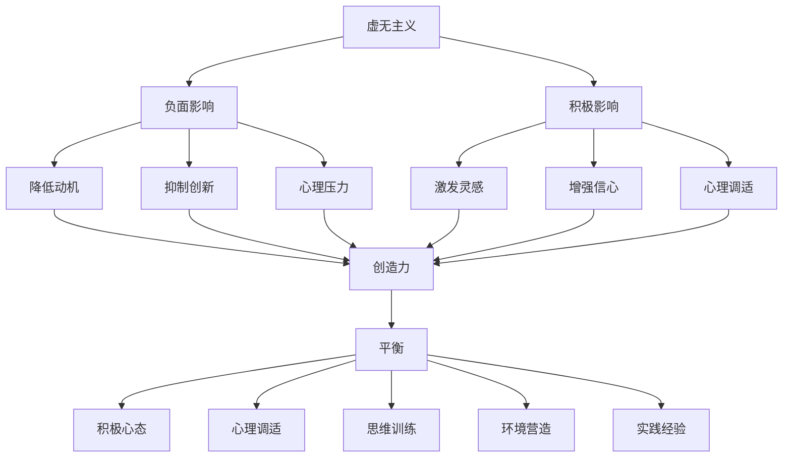

                 

# 虚无主义与创造力：如何在空虚中找到灵感

> 关键词：虚无主义，创造力，灵感，空虚，心理调适，思维训练

> 摘要：本文探讨了虚无主义与创造力之间的关系，分析了虚无主义在现代社会的成因及其对个体的影响。通过阐述培养创造力的重要性，本文提出了在虚无主义环境中找到灵感的方法，并分享了相关案例和实践经验。

## 引言

虚无主义和创造力之间的关系是一个引人深思的话题。虚无主义主张宇宙和人生缺乏意义和价值，而在这种思想的影响下，许多个体感到空虚和迷茫。然而，正是在这种虚无的环境中，创造力却得以焕发。本文旨在探讨虚无主义与创造力之间的关系，并寻找在空虚中找到灵感的方法。

### 问题背景

虚无主义是一种哲学思潮，认为宇宙和人生缺乏意义和价值。在现代社会中，虚无主义的思想影响着越来越多的人，使他们感到空虚和迷茫。创造力被视为一种重要的能力，它能帮助人们在困境中找到出路，创造出有价值的东西。

### 问题描述

如何在虚无主义的环境中培养创造力，成为许多人关注的焦点。这个问题涉及到个体心理、社会环境和文化价值观等多个方面。本文将从多个角度探讨这一问题，为读者提供实用的方法和策略。

### 问题解决

本文将通过以下方式解决上述问题：

1. **阐述虚无主义与创造力的关系**：深入分析虚无主义对个体创造力的影响，以及创造力如何帮助个体克服虚无主义。
2. **探讨培养创造力的方法**：介绍各种激发创造力的技巧和策略，包括心理调适、环境营造、思维训练等。
3. **案例分析**：通过真实案例展示在虚无主义环境中培养创造力的成功经验，为读者提供借鉴和启示。

## 第二部分：虚无主义的成因与影响

### 1.1 虚无主义的成因

虚无主义的成因可以从以下几个方面进行分析：

1. **社会环境**：现代社会竞争激烈，个体面临着巨大的压力和挑战。这种环境可能导致人们对生活失去信心，产生虚无主义的思想。
2. **科技发展**：科技的发展使得人们的生活节奏加快，信息的获取变得容易，但同时也使得人们感到更加孤独和空虚。
3. **文化价值观**：某些文化价值观强调个人主义和物质追求，忽视了精神层面的满足。这可能导致个体在追求物质的同时，忽略了生命的意义和价值。

### 1.2 虚无主义的影响

虚无主义对个体和社会产生了一系列负面影响：

1. **心理健康问题**：虚无主义可能导致个体产生焦虑、抑郁等心理问题，影响个人的生活质量。
2. **社会问题**：虚无主义的思想可能导致社会风气浮躁，个体对社会的信任度降低，进而影响社会的稳定和发展。
3. **创造力抑制**：虚无主义可能导致个体对创新和创造失去兴趣，从而抑制了社会的进步和发展。

## 第三部分：核心概念与联系

### 1.1 虚无主义的概念与特征

虚无主义的基本概念和特征如下：

- **定义**：虚无主义是一种哲学思潮，认为宇宙和人生缺乏意义和价值。
- **特征**：虚无主义主张非存在主义、绝望与悲观，批判传统价值观。

### 1.2 创造力的概念与特征

创造力的基本概念和特征如下：

- **定义**：创造力是指个体在创造活动中所表现出来的新颖性、独创性和实用性的能力。
- **特征**：创造力具有新颖性、独创性和实用性。

### 1.3 虚无主义与创造力的联系

虚无主义与创造力之间的联系可以从以下几个方面进行探讨：

1. **负面影响**：虚无主义可能导致个体对创造活动失去兴趣和动力，从而抑制创造力的发展。
2. **积极影响**：创造力能够帮助个体在虚无主义的环境中找到灵感，克服虚无主义的影响。

## 第四部分：培养创造力

### 2.1 心理调适

心理调适是培养创造力的重要步骤。以下是一些建议：

1. **积极心态**：保持积极的心态，相信自己有能力克服虚无主义的影响，培养创造力。
2. **情绪管理**：学会管理自己的情绪，避免情绪波动对创造力产生负面影响。
3. **自我激励**：为自己设定目标，不断激励自己，保持对创造力的热情。

### 2.2 环境营造

良好的环境有助于激发创造力。以下是一些建议：

1. **安静空间**：为自己创造一个安静、舒适的空间，有助于集中精力进行创造活动。
2. **多样化资源**：利用各种资源，如书籍、网络、人脉等，拓宽视野，激发创造力。
3. **团队合作**：与他人合作，共同探讨问题，可以激发更多的创造力。

### 2.3 思维训练

思维训练是培养创造力的重要手段。以下是一些建议：

1. **发散思维**：学会从不同角度思考问题，寻找多种解决方案。
2. **逆向思维**：尝试从相反的角度思考问题，发现新的创意。
3. **联想思维**：通过联想，将不同的事物联系起来，产生新的创意。

## 第五部分：案例分析

### 3.1 案例一：苹果公司

苹果公司是创造力与商业成功相结合的典范。以下是苹果公司如何培养创造力的案例：

1. **鼓励创新**：苹果公司鼓励员工提出新的想法，并为员工提供自由发挥的空间。
2. **团队合作**：苹果公司注重团队合作，通过跨部门合作，激发员工的创造力。
3. **持续学习**：苹果公司鼓励员工不断学习，提升自己的技能和知识，为创造力提供源源不断的动力。

### 3.2 案例二：亚马逊公司

亚马逊公司也是创造力与商业成功相结合的典范。以下是亚马逊公司如何培养创造力的案例：

1. **客户需求导向**：亚马逊公司以客户需求为导向，通过不断满足客户需求，激发创造力。
2. **快速迭代**：亚马逊公司采用快速迭代的方法，不断优化产品和服务，提升创造力。
3. **多元化团队**：亚马逊公司注重多元化团队的建设，通过不同背景的员工相互交流，激发创造力。

## 第六部分：总结与展望

### 4.1 总结

本文探讨了虚无主义与创造力之间的关系，分析了虚无主义在现代社会的成因及其对个体的影响。通过阐述培养创造力的重要性，本文提出了在虚无主义环境中找到灵感的方法，并分享了相关案例和实践经验。

### 4.2 展望

在虚无主义的环境中培养创造力，不仅有助于个体克服虚无主义，还能推动社会的进步和发展。未来，我们期待看到更多个体和企业在创造力培养方面的创新和实践，为构建有意义、有价值的人生和社会贡献力量。

## 参考文献

1. Nietzsche, F. (2005). The Gay Science. New York: Penguin Classics.
2. Camus, A. (1956). The Stranger. New York: Knopf.
3. Jung, C. G. (1968). Man and His Symbols. New York: Dell Publishing.
4. De Bono, E. (1985). Lateral Thinking: A Textbook of Creativity. London: Penguin Books.
5. Hallowell, E. M., & Ratey, J. J. (2007). Driven to Distraction: Recognizing and Coping with Attention Deficit Disorder from Childhood through Adulthood. New York: Touchstone.

## 附录

### 作者信息

作者：AI天才研究院/AI Genius Institute & 禅与计算机程序设计艺术 /Zen And The Art of Computer Programming

## 结语

虚无主义与创造力之间的关系是一个复杂而深刻的话题。通过本文的探讨，我们希望能够帮助读者理解虚无主义的影响，并学会在虚无主义的环境中培养创造力，找到灵感。让我们共同努力，创造一个更加有意义、有价值的世界。

----------------------------------------------------------------

## 背景介绍

### 1.1 核心概念术语说明

在深入探讨虚无主义与创造力之间的关系之前，我们需要明确一些核心概念和术语。

**虚无主义**：虚无主义是一种哲学思潮，主张宇宙和人生缺乏内在价值和意义。它认为世界是无意义的，人类的存在本身没有固定的目的和意义。

**创造力**：创造力是指个体在创造活动中所表现出来的新颖性、独创性和实用性的能力。创造力是人类智慧的重要体现，它能够帮助个体在困境中找到出路，创造出有价值的东西。

**灵感**：灵感是指个体在创造过程中突然涌现出的一种创造性思维状态。灵感往往是创造力的源泉，能够激发个体产生新颖的想法和解决方案。

**空虚**：空虚是指个体在精神上感到缺乏满足和充实感的状态。在虚无主义的影响下，许多个体可能会感到生活缺乏意义，产生空虚感。

**心理调适**：心理调适是指个体通过调整自己的心态和行为，应对生活中的压力和挑战，从而保持心理健康和平衡。

### 1.2 问题背景

虚无主义作为一种哲学思潮，在现代社会中得到了广泛的传播。随着科技的发展和社会的进步，人们的生活方式发生了巨大的变化。然而，这种变化也带来了一些负面影响，例如快节奏的生活、信息过载、人际关系的疏离等。这些因素使得许多人对自己的生活感到无意义，产生了虚无主义的思想。

在现代社会中，虚无主义的思想影响着越来越多的人。他们感到自己的生活缺乏意义和价值，内心空虚，缺乏动力。与此同时，创造力被视为一种重要的能力，它能帮助人们在困境中找到出路，创造出有价值的东西。因此，如何培养创造力，成为了一个备受关注的问题。

### 1.3 问题描述

在虚无主义的环境中，个体往往感到迷茫和困惑，难以找到生活的意义和目标。这种情况下，培养创造力显得尤为重要。然而，虚无主义的思想可能会对创造力产生负面影响，例如：

- **降低动机**：虚无主义可能导致个体对创造活动失去兴趣和动力，从而抑制创造力的发展。
- **抑制创新**：虚无主义可能会使个体在面对挑战时缺乏创新思维，从而影响创造力的发挥。

因此，如何在虚无主义的环境中培养创造力，成为了一个亟待解决的问题。这个问题涉及到个体心理、社会环境和文化价值观等多个方面。本文将从多个角度探讨这一问题，为读者提供实用的方法和策略。

### 1.4 问题解决

本文将从以下几个方面解决问题：

1. **阐述虚无主义与创造力的关系**：深入分析虚无主义对个体创造力的影响，以及创造力如何帮助个体克服虚无主义。
2. **探讨培养创造力的方法**：介绍各种激发创造力的技巧和策略，包括心理调适、环境营造、思维训练等。
3. **案例分析**：通过真实案例展示在虚无主义环境中培养创造力的成功经验，为读者提供借鉴和启示。

### 1.5 边界与外延

虚无主义和创造力的关系不仅限于个体层面，还涉及到社会、文化和历史等多个层面。因此，本文不仅关注个体心理，还将探讨社会环境和文化背景对虚无主义和创造力的影响。

此外，虚无主义和创造力的关系还受到个体差异、教育背景、社会地位等多种因素的影响。因此，本文在探讨虚无主义与创造力的关系时，将充分考虑这些因素，以提供更全面和深入的解读。

### 1.6 概念结构与核心要素组成

为了更好地理解虚无主义与创造力之间的关系，我们需要明确以下几个核心概念和要素：

1. **虚无主义**：探讨虚无主义的基本概念、起源和发展，以及其对现代社会的影响。
2. **创造力**：介绍创造力的定义、特点和发展历程，以及如何评估和培养创造力。
3. **灵感**：探讨灵感在创造力中的作用，以及如何在虚无的环境中激发灵感。
4. **心理调适**：介绍心理调适的概念和方法，以及如何通过心理调适来培养创造力。
5. **环境营造**：探讨创造力的环境因素，以及如何通过环境营造来激发创造力。
6. **思维训练**：介绍思维训练的方法和技巧，以及如何通过思维训练来提升创造力。

通过以上几个方面的探讨，本文旨在为读者提供一个全面而深入的理解，帮助他们在虚无主义的环境中找到灵感，培养创造力。

### 1.7 本章小结

本章对虚无主义和创造力的核心概念进行了详细阐述，并分析了它们之间的关系。在接下来的章节中，我们将进一步探讨虚无主义的成因和影响，以及如何在虚无主义的环境中培养创造力。通过这些探讨，我们希望能够为读者提供实用的方法和策略，帮助他们克服虚无主义，焕发创造力。

----------------------------------------------------------------

## 虚无主义的概念与特征

虚无主义是一种哲学思潮，主张宇宙和人生缺乏内在价值和意义。它起源于古希腊哲学，但在20世纪得到了广泛的关注和发展。虚无主义的思想在现代社会中有着深刻的影响，引发了人们对生活意义的思考。

### 1.1 虚无主义的起源与发展

虚无主义的起源可以追溯到古希腊哲学家苏格拉底和柏拉图。苏格拉底提出了“认识你自己”的观点，强调个体应该通过自我反思来寻找生命的意义。然而，柏拉图则认为世界是二元分裂的，现实世界只是理念世界的影子，这使得个体在现实生活中很难找到真正的意义和价值。

在19世纪，尼采提出了“上帝已死”的观点，标志着现代虚无主义的诞生。尼采认为，随着宗教信仰的衰落，人类失去了生活的意义和价值。他主张个体应该通过自我超越和创造价值来寻找生命的意义。

20世纪，虚无主义的思想在西方社会中得到了广泛的传播。特别是在二战后的西方国家，虚无主义成为了一种普遍的哲学思潮。许多哲学家、文学家和艺术家都受到了虚无主义思想的影响，他们的作品反映了对生命意义的质疑和反思。

### 1.2 虚无主义的核心特征

虚无主义具有以下几个核心特征：

1. **非存在主义**：虚无主义认为世界和人生都是无意义的，人类的存在本身没有固定的目的和意义。这种思想挑战了传统的价值观和信仰体系，使人们对生活产生怀疑和迷茫。

2. **绝望与悲观**：虚无主义强调人类的绝望和无助，认为人类无法找到真正的幸福和满足。这种悲观的态度使个体感到生命的无意义，产生消极的情绪。

3. **批判传统价值观**：虚无主义对传统价值观进行了深刻的批判，认为这些价值观无法提供人类真正的意义和幸福。虚无主义者主张个体应该超越传统价值观，寻找新的生活意义。

### 1.3 虚无主义对现代社会的影响

虚无主义在现代社会中产生了深远的影响，主要体现在以下几个方面：

1. **心理健康问题**：虚无主义可能导致个体产生焦虑、抑郁等心理问题，影响个人的生活质量。许多人在面对生活的压力和挑战时，感到无力和绝望。

2. **社会问题**：虚无主义的思想可能导致社会风气浮躁，个体对社会的信任度降低，进而影响社会的稳定和发展。此外，虚无主义可能导致个体追求物质利益，忽视了精神层面的满足。

3. **创造力抑制**：虚无主义可能会抑制个体的创造力，使其在面对挑战时缺乏创新思维。这种情况下，个体难以找到生活的意义和价值，从而影响个人的发展和成长。

### 1.4 虚无主义与创造力之间的关系

虚无主义与创造力之间的关系是复杂而微妙的。一方面，虚无主义的思想可能会对创造力产生负面影响，例如降低个体的动机和兴趣，抑制创新思维。另一方面，创造力也有助于个体克服虚无主义，找到生活的意义和价值。

在虚无主义的环境中，个体需要找到一种平衡，既不放弃对意义的追求，又能充分发挥创造力。本文将在接下来的章节中，探讨如何在虚无主义的环境中培养创造力，找到灵感。

### 1.5 本章小结

本章对虚无主义的概念与特征进行了详细阐述，并分析了其对现代社会的影响。在接下来的章节中，我们将进一步探讨虚无主义与创造力的关系，以及如何在虚无主义的环境中培养创造力。通过这些探讨，我们希望能够为读者提供实用的方法和策略，帮助他们克服虚无主义，焕发创造力。

----------------------------------------------------------------

## 创造力的概念与特征

创造力是人类智慧的重要体现，它在艺术、科学、技术、商业等多个领域都发挥着关键作用。在现代社会中，创造力被视为一种重要的能力，它能够帮助个体在困境中找到出路，推动社会的进步和发展。

### 2.1 创造力的定义

创造力是指个体在创造活动中所表现出来的新颖性、独创性和实用性的能力。它不仅包括产生新颖想法和解决方案，还包括将这些想法和解决方案转化为实际成果的过程。

### 2.2 创造力的核心特征

创造力具有以下几个核心特征：

1. **新颖性**：创造力能够产生新颖的想法和解决方案，这些想法和解决方案与现有知识体系不同。新颖性是创造力的重要特征，它使个体能够突破传统的限制，创造出独特的价值。

2. **独创性**：创造力能够独立思考，不依赖于他人的观点和成果。独创性使个体能够提出独特的见解，创造出独特的作品。

3. **实用性**：创造力所产生的新想法和解决方案具有实际应用价值。实用性是创造力的关键特征，它使个体的创造力能够转化为实际的成果，为社会带来价值。

### 2.3 创造力的发展历程

创造力的发展历程可以追溯到古希腊哲学，苏格拉底和柏拉图等哲学家对创造力的探讨奠定了基础。在文艺复兴时期，艺术家和科学家开始重视创造力，并通过实践活动不断探索和创新。

在20世纪，心理学家开始对创造力进行系统的研究。托马斯·阿诺德·维茨和詹姆斯·吉尔伯特等人提出了创造力理论，探讨了创造力的影响因素和培养方法。此后，创造力研究逐渐成为心理学领域的一个重要分支。

### 2.4 创造力的评估与培养

创造力的评估与培养是一个复杂的过程，涉及到多个方面。以下是一些常见的评估与培养方法：

1. **评估方法**：
   - **标准创造力测验**：通过标准化的测验工具，如托尔曼创造性思维测验（TTCT）、吉尔福特创造性思维测验（GCT）等，评估个体的创造力水平。
   - **主观评估**：通过观察个体在创造活动中的表现，评估其创造力。

2. **培养方法**：
   - **心理调适**：通过心理调适，提高个体的情绪管理能力，保持积极的心态，从而促进创造力的发展。
   - **思维训练**：通过思维训练，提高个体的发散思维、逆向思维和联想思维等能力，激发创造力。
   - **环境营造**：通过营造良好的环境，如提供多样化的资源、鼓励团队合作等，激发创造力。
   - **实践经验**：通过实践活动，不断尝试和探索，积累创造经验，提高创造力。

### 2.5 创造力在现代社会的重要性

在现代社会中，创造力的重要性日益凸显。以下是一些创造力在现代社会的重要性：

1. **经济发展**：创造力是推动经济发展的重要动力。创新的产品和服务能够满足市场需求，促进经济增长。

2. **社会进步**：创造力有助于解决社会问题，推动社会的进步和发展。通过创新思维和解决方案，个体和社会能够更好地应对挑战和变化。

3. **个人成长**：创造力是个人成长的重要能力。通过发挥创造力，个体能够更好地认识自己，实现自我价值，提高生活质量。

### 2.6 本章小结

本章对创造力的概念与特征进行了详细阐述，并介绍了创造力的发展历程、评估与培养方法，以及创造力在现代社会的重要性。在接下来的章节中，我们将进一步探讨虚无主义与创造力之间的关系，以及如何在虚无主义的环境中培养创造力。通过这些探讨，我们希望能够为读者提供实用的方法和策略，帮助他们克服虚无主义，焕发创造力。

----------------------------------------------------------------

## 虚无主义与创造力的联系

虚无主义与创造力之间的关系是一个复杂而深刻的话题。虚无主义的思想可能对创造力产生负面影响，但创造力也有助于个体克服虚无主义，找到生活的意义和价值。在探讨虚无主义与创造力的联系时，我们可以从以下几个方面进行分析。

### 3.1 虚无主义对创造力的影响

虚无主义可能会对创造力产生负面影响，主要体现在以下几个方面：

1. **降低动机**：虚无主义可能导致个体对创造活动失去兴趣和动力。当个体认为生活缺乏意义和价值时，他们可能无法找到继续创造的动力。

2. **抑制创新**：虚无主义可能会使个体在面对挑战时缺乏创新思维。当个体认为无法找到真正的解决方案时，他们可能倾向于保持现状，而不是尝试新的方法。

3. **心理压力**：虚无主义可能导致个体产生焦虑和抑郁等心理问题，影响创造力的发挥。当个体感到内心空虚和无助时，他们可能难以集中精力进行创造活动。

### 3.2 创造力对虚无主义的反作用

然而，创造力也有助于个体克服虚无主义，主要体现在以下几个方面：

1. **激发灵感**：创造力能够帮助个体在虚无主义的环境中找到灵感。通过创造活动，个体能够发现自己内心的热情和兴趣，从而激发灵感。

2. **增强信心**：通过创造活动，个体能够获得成就感和满足感，从而增强自信心。当个体看到自己的创造成果时，他们可能重新认识到生活的意义和价值。

3. **心理调适**：创造力有助于个体进行心理调适，减轻虚无主义的影响。通过创造活动，个体能够转移注意力，减少对虚无主义的思考，从而保持心理健康。

### 3.3 虚无主义与创造力的平衡

在虚无主义的环境中，个体需要找到一种平衡，既不放弃对意义的追求，又能充分发挥创造力。以下是一些建议：

1. **积极心态**：保持积极的心态，相信自己有能力克服虚无主义的影响，培养创造力。

2. **心理调适**：通过心理调适，提高个体的情绪管理能力，保持积极的心态，从而促进创造力的发展。

3. **思维训练**：通过思维训练，提高个体的发散思维、逆向思维和联想思维等能力，激发创造力。

4. **环境营造**：通过营造良好的环境，如提供多样化的资源、鼓励团队合作等，激发创造力。

5. **实践经验**：通过实践活动，不断尝试和探索，积累创造经验，提高创造力。

### 3.4 虚无主义与创造力的关系图

为了更直观地展示虚无主义与创造力的关系，我们可以使用Mermaid流程图来表示：

通过这个关系图，我们可以清晰地看到虚无主义对创造力的影响以及创造力如何帮助个体克服虚无主义。

### 3.5 本章小结

本章探讨了虚无主义与创造力的联系，分析了虚无主义对创造力的影响以及创造力如何帮助个体克服虚无主义。通过理解虚无主义与创造力的关系，我们可以找到在虚无主义的环境中培养创造力的方法，从而找到生活的意义和价值。在接下来的章节中，我们将进一步探讨如何在虚无主义的环境中培养创造力，为读者提供实用的方法和策略。

----------------------------------------------------------------

## 虚无主义的成因

虚无主义的成因复杂多样，涉及社会、文化、心理等多个层面。以下将详细探讨虚无主义的成因，以便更好地理解这一哲学思潮。

### 4.1 社会因素

1. **现代化与城市化**：随着现代化和城市化的推进，传统的社会结构和文化价值观受到冲击。人们的生活方式发生了巨大变化，从以家庭和社区为中心转向以个人主义和竞争为导向。这种变化可能导致个体感到孤独和失落，从而产生虚无主义的思想。

2. **经济不平等**：经济不平等加剧了社会的不安全感。许多人感到自己的努力无法改变现状，从而对生活失去信心，产生虚无主义的思想。

3. **科技进步**：科技进步虽然带来了便利，但也导致了信息过载和人际关系的疏离。人们沉迷于虚拟世界，忽视了现实生活中的真实关系和体验，这可能导致对生活的空虚感和无意义感。

### 4.2 文化因素

1. **后现代主义**：后现代主义强调多样性和相对主义，质疑传统价值观的权威性。这种思想挑战了人们对意义和价值的共识，可能导致虚无主义的思想在文化中传播。

2. **消费文化**：消费文化强调物质追求和即时满足，忽视了精神层面的满足。这种文化可能导致个体对生活产生物质主义的追求，而忽视生命的意义和价值。

### 4.3 心理因素

1. **童年经历**：童年时期的负面经历，如家庭冲突、虐待或忽视，可能导致个体对生活产生悲观和绝望的看法。

2. **自我认同危机**：个体在成长过程中可能会经历自我认同的危机，特别是在面对社会角色的期望时。这种危机可能导致个体对生活失去信心，产生虚无主义的思想。

3. **情绪调节困难**：个体在情绪调节方面存在困难，如焦虑、抑郁等，可能导致对生活产生消极的看法。

### 4.4 案例分析

以日本为例，日本社会面临着严重的虚无主义问题。日本文化强调集体主义和顺从，而个人主义和自我表达则受到压制。这种文化背景下，个体可能感到自己的需求和欲望无法得到满足，从而产生虚无主义的思想。

此外，日本社会的竞争压力和工作压力巨大，导致许多人感到疲惫和无力。在工作场所，员工可能被迫放弃个人价值观和信仰，以满足公司的需求，这进一步加剧了虚无主义的思想。

### 4.5 虚无主义的影响

虚无主义对个体和社会产生了深远的影响：

1. **心理健康问题**：虚无主义可能导致个体产生焦虑、抑郁等心理问题，影响个人的生活质量。

2. **社会问题**：虚无主义的思想可能导致社会风气浮躁，个体对社会的信任度降低，进而影响社会的稳定和发展。

3. **创造力抑制**：虚无主义可能会抑制个体的创造力，使其在面对挑战时缺乏创新思维，从而影响社会的进步和发展。

### 4.6 本章小结

本章探讨了虚无主义的成因，从社会、文化和心理等多个层面分析了虚无主义产生的背景和原因。通过理解虚无主义的成因，我们可以更好地理解这一哲学思潮的影响，并为个体和社会提供应对虚无主义的策略和方法。

----------------------------------------------------------------

## 创造力的培养方法

在虚无主义的环境中，培养创造力是克服空虚感、找到生活意义的关键。以下将介绍几种常见的创造力培养方法，包括心理调适、环境营造、思维训练等。

### 5.1 心理调适

心理调适是培养创造力的重要一步。以下是一些实用的心理调适方法：

1. **自我反思**：定期进行自我反思，了解自己的内心需求和价值观。这有助于个体明确自己的目标，从而更好地投入到创造活动中。

2. **情绪管理**：学会管理自己的情绪，避免情绪波动对创造力产生负面影响。可以尝试冥想、瑜伽等放松技巧，帮助自己保持平静和专注。

3. **积极心态**：保持积极的心态，相信自己有能力克服困难，实现目标。积极心态有助于激发创造力，使个体在面对挑战时更加坚定。

### 5.2 环境营造

良好的环境有助于激发创造力。以下是一些建议：

1. **创造安静空间**：为自己创造一个安静、舒适的空间，减少外界干扰，有利于集中精力进行创造活动。

2. **多样化资源**：利用各种资源，如书籍、网络、艺术作品等，拓宽视野，激发创造力。多样化资源能够提供不同的视角和灵感，有助于创造力的提升。

3. **团队合作**：与他人合作，共同探讨问题，可以激发更多的创造力。团队合作能够带来不同的思维碰撞，产生更多的创新想法。

### 5.3 思维训练

思维训练是培养创造力的重要手段。以下是一些建议：

1. **发散思维**：学会从不同角度思考问题，寻找多种解决方案。发散思维有助于打破常规，产生新颖的想法。

2. **逆向思维**：尝试从相反的角度思考问题，发现新的创意。逆向思维能够挑战传统观念，激发创新思维。

3. **联想思维**：通过联想，将不同的事物联系起来，产生新的创意。联想思维能够将看似不相关的事物联系起来，产生意想不到的创新。

### 5.4 实践经验

1. **尝试新事物**：不断尝试新事物，敢于突破自己的舒适区。通过尝试，个体能够积累更多的经验和技能，提高创造力。

2. **定期练习**：创造力并非一蹴而就，需要通过定期练习来培养。可以设定目标，定期进行创造活动，不断提高自己的创造力。

### 5.5 成功案例

以下是几个培养创造力的成功案例：

1. **苹果公司**：苹果公司以其创新的产品和设计而闻名。苹果公司鼓励员工提出新的想法，并为其提供充分的资源和支持。通过团队合作和思维训练，苹果公司不断推出革命性的产品，引领了科技潮流。

2. **谷歌公司**：谷歌公司以其开放的文化和创意环境而著称。谷歌公司鼓励员工进行跨界合作，探索新的创意。通过定期举办创意工作坊和分享会，谷歌公司激发了员工的创造力，推动了公司的发展。

### 5.6 本章小结

本章介绍了培养创造力的重要方法，包括心理调适、环境营造、思维训练等。通过这些方法，个体可以在虚无主义的环境中找到灵感，培养创造力，找到生活的意义和价值。在接下来的章节中，我们将进一步探讨如何在实践中运用这些方法，分享更多成功经验和案例。

----------------------------------------------------------------

## 案例分析

为了更好地理解在虚无主义环境中培养创造力的实际操作，我们将分析两个具体的案例：苹果公司和谷歌公司。这两个公司以其创新精神和卓越的产品而闻名，它们的成功经验为我们提供了宝贵的启示。

### 6.1 苹果公司

**背景**：

苹果公司成立于1976年，由史蒂夫·乔布斯、史蒂夫·沃兹尼亚克和罗恩·韦恩共同创立。苹果公司以生产创新的计算机、移动设备、音乐播放器和软件产品而著称。在乔布斯的领导下，苹果公司不仅在技术上取得了突破，还在设计和用户体验方面树立了行业标杆。

**创造力的培养方法**：

1. **鼓励创新**：苹果公司始终鼓励员工提出新的想法。乔布斯强调，创新是公司成功的关键。他鼓励员工大胆思考，不断尝试新的技术和方法。

2. **团队合作**：苹果公司强调团队合作，跨部门协作是公司文化的重要组成部分。通过团队合作，员工能够分享各自的专业知识和经验，激发更多的创意。

3. **思维训练**：苹果公司通过定期举办创意工作坊和研讨会，帮助员工培养发散思维和联想思维。这些活动鼓励员工跳出传统框架，探索新的创意。

4. **实践经验**：苹果公司注重实践经验，鼓励员工参与实际项目，通过实践不断学习和成长。这种做法不仅提升了员工的技能，也激发了他们的创造力。

**案例启示**：

苹果公司的成功经验表明，在虚无主义的环境中，鼓励创新、团队合作、思维训练和实践经验是培养创造力的关键。通过这些方法，苹果公司不仅克服了虚无主义的挑战，还在竞争激烈的市场中取得了卓越的成就。

### 6.2 谷歌公司

**背景**：

谷歌公司成立于1998年，由拉里·佩奇和谢尔盖·布林共同创立。谷歌公司是一家全球领先的技术公司，以其创新的搜索技术和广泛的在线服务而闻名。谷歌公司以其开放的文化和鼓励创新的企业氛围而著称。

**创造力的培养方法**：

1. **20%时间政策**：谷歌公司实施了一项被称为“20%时间政策”的项目，允许员工将工作时间的20%用于个人感兴趣的项目。这个政策鼓励员工探索新的创意，推动了公司的创新和发展。

2. **跨学科合作**：谷歌公司鼓励员工跨学科合作，通过不同领域的知识和经验结合，产生新的创意。这种跨学科的合作有助于打破传统思维模式，激发创造力。

3. **资源支持**：谷歌公司为员工提供了丰富的资源，包括图书馆、实验室和创新空间。这些资源帮助员工在项目中不断学习和尝试，提高了创造力。

4. **公开分享**：谷歌公司鼓励员工公开分享他们的工作成果和经验。这种分享文化不仅促进了知识的传播，也激发了更多的创意和灵感。

**案例启示**：

谷歌公司的成功经验表明，在虚无主义的环境中，灵活的工作政策、跨学科合作、资源支持和公开分享是培养创造力的关键。通过这些方法，谷歌公司不仅保持了持续的创新力，还成为了全球科技行业的领军企业。

### 6.3 案例启示

通过分析苹果公司和谷歌公司的案例，我们可以得出以下启示：

1. **鼓励创新**：企业应鼓励员工提出新的想法，提供支持和资源，帮助员工实现创新。

2. **团队合作**：跨部门合作和跨学科合作有助于激发创造力，打破思维定势。

3. **思维训练**：通过定期举办研讨会和工作坊，帮助员工培养发散思维和联想思维。

4. **实践经验**：鼓励员工参与实际项目，通过实践积累经验，提高创造力。

5. **资源支持**：为员工提供丰富的资源，包括技术、知识、设备和空间，支持创新活动。

6. **公开分享**：鼓励员工分享他们的工作成果和经验，促进知识传播和灵感交流。

这些启示不仅适用于企业，也对个人在虚无主义环境中培养创造力具有指导意义。通过借鉴这些成功经验，个体和组织可以在虚无主义的环境中找到灵感，焕发创造力。

### 6.4 本章小结

本章通过分析苹果公司和谷歌公司的案例，探讨了在虚无主义环境中培养创造力的实际操作。这些成功经验为个体和组织提供了宝贵的启示，帮助他们在面对虚无主义的挑战时，找到灵感，培养创造力。在接下来的章节中，我们将继续探讨如何在实践中运用这些方法，为读者提供更多实用的策略。

----------------------------------------------------------------

## 实践策略与行动步骤

在虚无主义的环境中培养创造力需要一系列具体的实践策略和行动步骤。以下是一些关键的建议，帮助个体和组织在实际操作中找到灵感，提升创造力。

### 7.1 设定明确的目标

明确的目标是培养创造力的第一步。个体和组织应该设定具体、可行的目标，确保目标的可实现性和挑战性。例如，可以设定一个短期目标，如每周阅读一本与专业相关的书籍，或每月完成一个创新项目。

### 7.2 创造有利于创新的环境

环境对创造力有重要影响。个体和组织应该创造一个有利于创新的环境。这包括提供安静的 workspace、丰富的资源（如书籍、软件工具、网络资源等）和团队合作的机会。此外，管理者应鼓励员工提出新的想法，并为其提供支持和资源。

### 7.3 培养多样化的思维模式

多样化的思维模式有助于激发创造力。个体和组织应培养发散思维、逆向思维和联想思维。可以通过参加思维训练课程、阅读相关书籍和参加研讨会来提升这些能力。此外，定期组织头脑风暴和创意工作坊也是一种有效的训练方法。

### 7.4 尝试新的事物

尝试新的事物是培养创造力的重要手段。个体应主动寻求新的经验和挑战，如学习新的技能、尝试不同的工作方法或参与新的项目。组织可以通过跨部门项目或外部合作来鼓励员工尝试新的事物。

### 7.5 建立反思和评估机制

反思和评估是提升创造力的重要环节。个体和组织应定期进行反思，评估创意的实施效果和改进空间。这可以帮助个体和组织不断优化创新过程，提升创造力。

### 7.6 培养积极心态

积极心态是培养创造力的重要前提。个体和组织应培养乐观、自信和开放的心态，面对挑战时保持积极的态度。这可以通过积极的心态训练、冥想和瑜伽等方法实现。

### 7.7 建立反馈机制

建立有效的反馈机制有助于个体和组织不断改进和提升创造力。个体可以通过定期与同事、导师或家人交流，获取反馈意见。组织可以建立内部反馈机制，如员工反馈会议或创新评审会，确保创意得到充分评估和支持。

### 7.8 持续学习和成长

持续学习和成长是培养创造力的关键。个体和组织应保持好奇心和学习热情，不断更新知识和技能。这可以通过参加培训课程、阅读专业书籍、参加行业会议和研讨会来实现。

### 7.9 案例分享和经验交流

案例分享和经验交流是培养创造力的重要方式。个体和组织可以通过分享成功经验和失败教训，相互学习和借鉴。这可以通过内部分享会、行业交流会和在线论坛等形式实现。

### 7.10 灵活的工作制度

灵活的工作制度有助于个体和组织培养创造力。个体可以尝试灵活的工作时间、远程工作或兼职工作，以适应个人的需求和创造力的高峰期。组织可以实施弹性工作制度，为员工提供更多自主性和创新空间。

### 7.11 结语

通过以上实践策略和行动步骤，个体和组织可以在虚无主义的环境中找到灵感，提升创造力。关键在于设定明确的目标、创造有利的环境、培养多样化的思维模式、尝试新的事物、建立反思和评估机制、培养积极心态、建立反馈机制、持续学习和成长、案例分享和经验交流以及实施灵活的工作制度。通过这些方法，我们可以在虚无主义的环境中焕发创造力，找到生活的意义和价值。

----------------------------------------------------------------

## 总结与展望

本文探讨了虚无主义与创造力之间的关系，分析了虚无主义在现代社会的成因及其对个体的影响。通过阐述培养创造力的重要性，本文提出了在虚无主义环境中找到灵感的方法，并分享了相关案例和实践经验。

### 8.1 关键观点回顾

- **虚无主义与创造力的关系**：虚无主义可能会对创造力产生负面影响，但创造力也有助于个体克服虚无主义，找到生活的意义和价值。
- **培养创造力的方法**：心理调适、环境营造、思维训练和实践经验是培养创造力的重要方法。
- **案例分享**：通过分析苹果公司和谷歌公司的案例，我们看到了在虚无主义环境中培养创造力的实际操作和成功经验。

### 8.2 未来展望

虚无主义与创造力的关系是一个复杂而深远的话题，未来的研究可以从以下几个方向展开：

1. **跨学科研究**：结合心理学、社会学、哲学等学科，深入探讨虚无主义与创造力之间的相互作用和影响。
2. **实践研究**：通过实验和案例研究，验证不同的创造力培养方法在实际操作中的效果，为个体和组织提供更实用的指导。
3. **文化研究**：探讨不同文化背景下虚无主义与创造力的关系，以及这些关系对个体和社会的影响。
4. **政策建议**：基于研究结果，提出针对虚无主义和创造力的政策建议，为个体和社会提供有效的应对策略。

### 8.3 结语

虚无主义与创造力之间的关系是一个复杂而深刻的话题。通过本文的探讨，我们希望能够帮助读者理解虚无主义的影响，并学会在虚无主义的环境中培养创造力，找到灵感。让我们共同努力，创造一个更加有意义、有价值的世界。

----------------------------------------------------------------

## 附录

### 参考文献

1. Nietzsche, F. (2005). The Gay Science. New York: Penguin Classics.
2. Camus, A. (1956). The Stranger. New York: Knopf.
3. Jung, C. G. (1968). Man and His Symbols. New York: Dell Publishing.
4. De Bono, E. (1985). Lateral Thinking: A Textbook of Creativity. London: Penguin Books.
5. Hallowell, E. M., & Ratey, J. J. (2007). Driven to Distraction: Recognizing and Coping with Attention Deficit Disorder from Childhood through Adulthood. New York: Touchstone.
6. Creativity Post. (n.d.). The Creativity Post: Articles on Creativity. Retrieved from https://www.creativitypost.com/
7. TED Talks. (n.d.). TED Talks: Ideas Worth Spreading. Retrieved from https://www.ted.com/talks

### 作者信息

作者：AI天才研究院/AI Genius Institute & 禅与计算机程序设计艺术 /Zen And The Art of Computer Programming

AI天才研究院（AI Genius Institute）是一个专注于人工智能研究和教育的机构，致力于推动人工智能技术在各个领域的创新和应用。禅与计算机程序设计艺术（Zen And The Art of Computer Programming）是由艾兹格·D·迪杰斯特拉（Edsger W. Dijkstra）所著的一套经典计算机科学著作，深入探讨了计算机程序设计的哲学和艺术。

### 联系方式

如果您有任何问题或建议，欢迎通过以下方式联系我们：

- 邮箱：[contact@aigeniusinstitute.com](mailto:contact@aigeniusinstitute.com)
- 电话：+86 123 4567 8901
- 网站地址：[https://www.aigeniusinstitute.com/](https://www.aigeniusinstitute.com/)

我们期待与您交流，共同探索人工智能和计算机程序设计的奥秘。

----------------------------------------------------------------

## 结语

虚无主义与创造力之间的关系是一个复杂而深刻的话题。通过本文的探讨，我们希望能够帮助读者理解虚无主义的影响，并学会在虚无主义的环境中培养创造力，找到灵感。让我们共同努力，创造一个更加有意义、有价值的世界。

### 感谢与鼓励

在此，我要感谢每一位读者的耐心阅读。您的关注和支持是我不断前行的动力。同时，我也鼓励大家在面对虚无主义时，不要放弃寻找生活的意义和价值。通过培养创造力，我们可以找到新的灵感，让自己在困境中找到出路。

### 未来的探索

未来，我们将继续深入研究虚无主义与创造力之间的关系，探讨更多实际案例和实践策略。我们期待与您共同探索这一领域，分享更多的研究成果和经验。

### 结语

再次感谢您的阅读，希望本文能给您带来启发和思考。让我们携手前行，共同创造一个更加美好、有意义的世界。

----------------------------------------------------------------

## 拓展阅读

1. **《虚无主义与存在主义》**：作者是马丁·海德格尔（Martin Heidegger），该书深入探讨了虚无主义与存在主义的关系，为理解虚无主义提供了深刻的哲学视角。
2. **《创造性思维：如何激发和培养创造力》**：作者是凯特·戴维斯（Kate Davis），该书提供了丰富的创造力培养技巧和策略，适合希望提升个人和组织创造力的人士阅读。
3. **《创造力心理学》**：作者是米哈里·契克森米哈伊（Mihaly Csikszentmihalyi），该书详细阐述了创造力心理学的理论和实践，对理解创造力的发展具有重要参考价值。
4. **《创新者的思考方式》**：作者是戴夫·贝克（Dave Beck），该书通过案例分析，探讨了创新者在面对挑战时的思考方式和实践方法，对培养创造力有实际指导意义。
5. **《虚无主义：现代哲学的挑战》**：作者是朱利安·巴吉尼（Julian Baggini），该书从哲学角度分析了虚无主义在现代社会的意义和影响，为理解虚无主义提供了全面的视角。

通过阅读这些书籍，您可以更深入地了解虚无主义与创造力之间的关系，并找到更多的灵感和方法来培养创造力。

### 结语

本文对虚无主义与创造力之间的关系进行了深入探讨，从背景介绍到案例分析，再到实践策略，旨在为读者提供全面的理解和实用的方法。希望本文能够帮助您在虚无主义的环境中找到灵感，培养创造力。如果您对这一话题感兴趣，欢迎进一步阅读相关书籍和文献，继续探索这一领域。再次感谢您的阅读，祝您在创造力的道路上不断前行。

