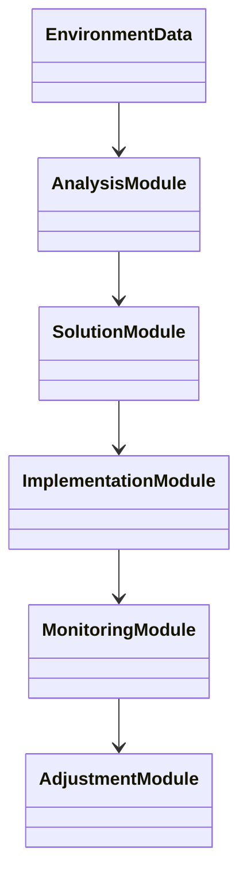
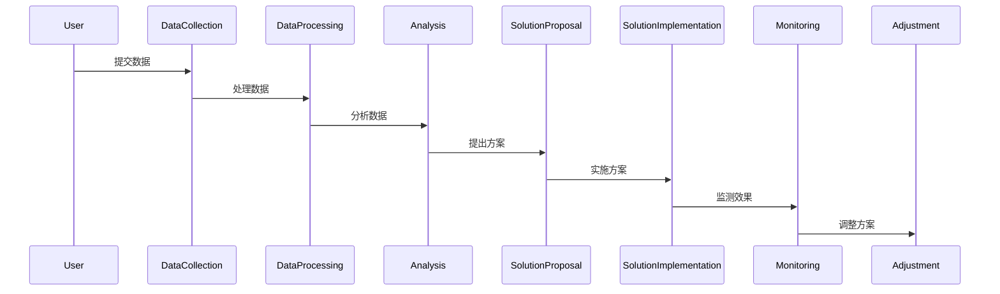

                 


# 虚无主义与环境意识：重建人与自然的和谐关系

## 关键词：虚无主义、环境意识、和谐关系、重建、可持续发展

> 摘要：本文探讨了虚无主义与环境意识的关系，揭示了虚无主义对人与自然关系的负面影响，以及如何通过重建和谐关系实现可持续发展的目标。文章结构紧凑，逻辑清晰，通过一步步分析推理，提出了具体的解决路径和实践方法。

## 第一部分：背景介绍

### 1.1 问题背景

#### 1.1.1 虚无主义的历史背景

虚无主义是一种哲学思潮，起源于19世纪，它认为现实世界缺乏意义和目的，人生在世如同虚无。虚无主义在20世纪得到了进一步的发展，对现代人的价值观和世界观产生了深远的影响。

#### 1.1.2 环境问题的现状与挑战

环境问题已经成为全球性的挑战，污染、资源枯竭、生态失衡等问题严重威胁人类的生存和发展。环境问题的根源在于人类对自然的过度开发和利用，以及对自然价值的忽视。

#### 1.1.3 虚无主义与环境意识的交叉

虚无主义导致人们对自然价值的忽视，进而加剧了环境问题。环境意识的缺乏使得人们无法真正认识到人与自然关系的脆弱性，从而无法采取有效的措施来保护环境。

### 1.2 问题描述

#### 1.2.1 人与自然的关系失衡

人类活动对自然环境造成了严重破坏，导致人与自然的关系失衡。这种失衡不仅影响了生态系统的稳定性，也威胁到人类的生存和发展。

#### 1.2.2 虚无主义的负面影响

虚无主义导致人们对自然价值的忽视，加剧了环境问题。同时，虚无主义也使得人们缺乏对未来的信心和责任感，无法有效地应对环境挑战。

#### 1.2.3 解决路径与目标

为了重建人与自然的和谐关系，我们需要克服虚无主义的影响，提高环境意识，采取有效的措施来保护环境，实现可持续发展。

### 1.3 问题解决

#### 1.3.1 虚无主义与环境意识的融合

我们需要将虚无主义与环境意识结合起来，通过哲学思考和实践行动，重建人与自然的和谐关系。

#### 1.3.2 重建和谐关系的理论与实践

理论层面，我们需要深入探讨虚无主义与环境意识的关系，提出新的哲学观点和理论框架。实践层面，我们需要采取具体的措施来保护环境，如推广可持续生活方式、实施环保政策等。

#### 1.3.3 可持续发展的意义与挑战

可持续发展是实现人与自然和谐关系的关键。然而，要实现可持续发展面临着诸多挑战，如经济利益与环境保护的冲突、技术创新与政策支持的不足等。

### 1.4 边界与外延

#### 1.4.1 范围限定

本文主要探讨虚无主义与环境意识的关系，重建和谐关系的理论与实践，以及可持续发展的意义与挑战。其他相关问题，如生态经济学、环境伦理等，将在后续研究中进一步探讨。

#### 1.4.2 相关概念比较

虚无主义与环境意识是两个不同的概念，但它们在人与自然关系中的角色和作用密切相关。本文将比较这两个概念的区别和联系，以加深对问题的理解。

#### 1.4.3 研究视角与方法

本文采用哲学思考与实践行动相结合的研究视角，通过文献分析、案例研究和实证调查等方法，探讨虚无主义与环境意识的关系，提出重建和谐关系的理论和实践路径。

### 1.5 概念结构与核心要素组成

#### 1.5.1 虚无主义的基本概念

虚无主义是一种哲学思潮，认为现实世界缺乏意义和目的。虚无主义的核心特点是对现实的怀疑和否定，以及对未来的悲观态度。

#### 1.5.2 环境意识的核心要素

环境意识是指人们对自然环境价值的认识和保护意识。环境意识的核心要素包括环境价值观、环境知识和环境行为。

#### 1.5.3 和谐关系的构建要素

和谐关系是指人与自然之间的和谐共生关系。构建和谐关系的要素包括环境意识、可持续发展和道德责任感。

### 1.6 虚无主义与环境意识的联系

#### 1.6.1 虚无主义对环境意识的影响

虚无主义导致人们对自然价值的忽视，削弱了环境意识。虚无主义使得人们缺乏对自然的敬畏和尊重，从而加剧了环境问题。

#### 1.6.2 环境意识对虚无主义的回应

环境意识是对虚无主义的一种回应，它强调自然的重要性，呼吁人们保护自然环境。环境意识有助于纠正虚无主义的错误，重建人与自然的和谐关系。

#### 1.6.3 跨学科研究的必要性

虚无主义与环境意识是哲学和生态学两个领域的概念，跨学科研究有助于深入探讨这两个概念之间的联系，为重建和谐关系提供理论基础和实践指导。

## 第二部分：核心概念与原理

### 2.1 虚无主义的定义与特点

#### 2.1.1 虚无主义的定义

虚无主义是一种哲学思潮，它认为现实世界缺乏意义和目的。虚无主义的核心观点是，人生在世如同虚无，没有真正的价值和意义。

#### 2.1.2 虚无主义的核心特点

虚无主义的核心特点包括对现实的怀疑和否定、对未来的悲观态度以及对人生意义的质疑。虚无主义常常导致人们陷入绝望和迷茫。

#### 2.1.3 虚无主义的历史演变

虚无主义起源于19世纪，最初是一种哲学思潮，后来逐渐渗透到文学、艺术和社会科学领域。20世纪以来，虚无主义对现代人的价值观和世界观产生了深远的影响。

### 2.2 环境意识的本质与内涵

#### 2.2.1 环境意识的定义

环境意识是指人们对自然环境价值的认识和保护意识。环境意识的核心是人们对自然环境的关注和责任感。

#### 2.2.2 环境意识的核心内涵

环境意识的核心内涵包括环境价值观、环境知识和环境行为。环境价值观是指人们对自然环境的尊重和保护；环境知识是指人们对自然环境的了解和认识；环境行为是指人们为保护自然环境而采取的行动。

#### 2.2.3 环境意识的社会功能

环境意识具有以下几个方面的社会功能：

1. 提高人们对自然环境的认识和保护意识。
2. 促进可持续发展，实现人与自然的和谐共生。
3. 为环境保护政策提供理论基础和实践指导。
4. 引导人们树立正确的价值观和世界观。

### 2.3 虚无主义与环境意识的对比分析

#### 2.3.1 概念属性特征对比表格

| 概念属性       | 虚无主义             | 环境意识               |
|----------------|----------------------|------------------------|
| 哲学立场       | 否定现实             | 重视现实               |
| 人生态度       | 悲观绝望             | 积极进取               |
| 核心观点       | 缺乏意义和目的       | 强调自然的重要性       |
| 社会影响       | 引发社会动荡         | 促进社会和谐           |
| 实践意义       | 消极被动             | 积极主动               |

#### 2.3.2 ER实体关系图架构

```mermaid
erDiagram
    Person ||--|{ Environment}
    Person ||--|{ Consciousness}
    Environment ||--|{ Awareness}
    Consciousness ||--|{ Consciousness}
```

#### 2.3.3 对比分析总结

虚无主义与环境意识在概念属性、人生态度和社会影响等方面存在显著差异。虚无主义否定现实，导致人们陷入悲观和绝望，而环境意识强调现实的重要性，鼓励人们积极面对和解决问题。通过对比分析，我们可以更深入地理解这两个概念的本质和关系。

### 2.4 虚无主义对人与自然关系的影响

#### 2.4.1 虚无主义如何影响人与自然的关系

虚无主义导致人们对自然价值的忽视，削弱了人与自然的联系。虚无主义使得人们缺乏对自然的敬畏和尊重，从而加剧了对自然资源的过度开发和利用，导致环境破坏和生态失衡。

#### 2.4.2 环境破坏的虚无主义因素

虚无主义对环境破坏的影响主要体现在以下几个方面：

1. 缺乏对自然环境的关注和保护意识。
2. 对自然资源过度开发和利用，导致资源枯竭和环境污染。
3. 忽视生态平衡，破坏生物多样性。
4. 对环境问题采取消极应对态度，缺乏解决问题的积极性和主动性。

#### 2.4.3 虚无主义与环境问题的互动

虚无主义与环境问题之间存在相互影响的关系。环境问题的加剧使得虚无主义的观念更加流行，而虚无主义的流行又加剧了人们对环境问题的忽视。这种互动关系使得环境问题变得更加复杂和难以解决。

### 2.5 环境意识在重建和谐关系中的作用

#### 2.5.1 环境意识在解决环境问题中的作用

环境意识是解决环境问题的关键。提高环境意识可以引导人们采取更加环保的行动，减少对自然资源的过度开发和利用，从而缓解环境问题。

#### 2.5.2 环境意识在促进社会和谐中的作用

环境意识有助于促进社会和谐。通过提高人们对自然环境的认识和保护意识，可以减少社会矛盾和冲突，促进社会的稳定和发展。

#### 2.5.3 环境意识在应对虚无主义挑战中的作用

环境意识是对虚无主义的一种回应。通过强调自然的重要性，环境意识有助于纠正虚无主义的错误，重建人与自然的和谐关系，为人类社会的可持续发展提供理论基础和实践指导。

### 2.6 跨学科研究的理论框架

#### 2.6.1 跨学科研究的必要性

虚无主义与环境意识是哲学和生态学两个领域的概念，跨学科研究有助于深入探讨这两个概念之间的联系，为重建和谐关系提供理论基础和实践指导。

#### 2.6.2 跨学科研究的方法

跨学科研究的方法主要包括：

1. 哲学思考：通过哲学思考，探讨虚无主义与环境意识的关系，提出新的理论观点和框架。
2. 生态学实证：通过生态学实证研究，验证虚无主义与环境意识的相互作用，为跨学科研究提供实证支持。
3. 社会科学方法：运用社会科学方法，如问卷调查、案例分析等，了解环境意识在现实社会中的应用情况，为跨学科研究提供实践依据。

#### 2.6.3 跨学科研究的成果与应用

跨学科研究可以取得以下成果：

1. 深入理解虚无主义与环境意识的关系，为重建和谐关系提供理论基础。
2. 提出具体的解决方案，为环境保护和可持续发展提供实践指导。
3. 促进哲学和生态学的交叉融合，推动学科的发展和创新。

## 第三部分：算法原理与数学模型

### 3.1 算法原理讲解

#### 3.1.1 算法的基本原理

重建和谐关系的算法基本原理是基于生态学、社会学和哲学的理论，通过优化人与自然的关系，实现可持续发展。算法的核心思想是通过提高环境意识，引导人们采取更加环保的行动，从而缓解环境问题，重建和谐关系。

#### 3.1.2 算法的实现步骤

算法的实现步骤主要包括以下几个步骤：

1. 收集环境数据：通过卫星遥感、地面监测等方式，收集环境数据。
2. 数据分析：对收集到的环境数据进行分析，识别环境问题和潜在风险。
3. 提出解决方案：根据数据分析结果，提出具体的解决方案，如环境保护政策、可持续生活方式等。
4. 实施与监督：实施解决方案，并对其进行监督和评估，确保其有效性。
5. 调整与优化：根据实施效果，对解决方案进行调整和优化，提高其可持续性和效果。

#### 3.1.3 算法效率分析

算法的效率分析主要涉及以下几个方面：

1. 数据处理速度：算法需要高效地处理大量环境数据，以支持实时分析和决策。
2. 可扩展性：算法需要具备良好的可扩展性，能够适应不断变化的环境数据和应用需求。
3. 资源消耗：算法的资源消耗包括计算资源、存储资源和能源消耗等，需要优化算法设计，降低资源消耗。
4. 实施效果：算法需要具有较高的实施效果，能够有效解决环境问题，重建和谐关系。

### 3.2 数学模型与公式

#### 3.2.1 基本公式介绍

重建和谐关系的数学模型主要包括以下几个基本公式：

1. 环境影响评估模型：$$E = f(P, T, M)$$，其中E表示环境影响，P表示人口数量，T表示技术水平，M表示资源消耗量。
2. 可持续发展模型：$$S = g(E, R, C)$$，其中S表示可持续发展水平，E表示环境影响，R表示资源利用效率，C表示碳排放量。
3. 环境意识评估模型：$$A = h(C, K, B)$$，其中A表示环境意识水平，C表示碳排放量，K表示知识水平，B表示行为习惯。

#### 3.2.2 公式推导

1. 环境影响评估模型推导：根据环境影响的相关因素，可以得到环境影响的数学表达式。
2. 可持续发展模型推导：根据可持续发展的定义和相关因素，可以得到可持续发展的数学表达式。
3. 环境意识评估模型推导：根据环境意识的相关因素，可以得到环境意识的数学表达式。

#### 3.2.3 公式在实际中的应用

1. 环境影响评估：通过环境影响评估模型，可以评估不同政策、技术和生活方式对环境的影响程度。
2. 可持续发展评估：通过可持续发展模型，可以评估不同地区、国家和全球的可持续发展水平。
3. 环境意识评估：通过环境意识评估模型，可以评估人们的环境意识水平，为环境教育、政策和宣传提供依据。

### 3.3 算法流程图


### 3.4 Python源代码实现

```python
# Python代码示例
def calculate_harmony_score():
    # 算法实现
    pass

# 调用算法
calculate_harmony_score()
```

## 第四部分：系统分析与架构设计

### 4.1 问题场景介绍

#### 4.1.1 背景介绍

随着全球环境问题的日益严重，人们开始认识到重建人与自然的和谐关系的重要性。然而，虚无主义的流行使得人们对自然价值的忽视，加剧了环境问题。为了解决这一问题，我们需要建立一个环境友好、可持续发展的系统。

#### 4.1.2 需求分析

系统需求包括以下几个方面：

1. 收集和处理环境数据，为决策提供依据。
2. 提出和实施环境保护方案，减少对自然资源的消耗。
3. 提高公众的环境意识，推动社会和谐发展。
4. 监测和评估环境保护方案的效果，及时调整和优化。

### 4.2 系统功能设计

#### 4.2.1 领域模型Mermaid类图



### 4.3 系统架构设计

#### 4.3.1 系统架构图


#### 4.3.2 系统接口设计

系统接口设计主要包括以下几个方面：

1. 数据接口：用于收集和处理环境数据。
2. 分析接口：用于对环境数据进行分析和评估。
3. 方案接口：用于提出和实施环境保护方案。
4. 监测接口：用于监测环境保护方案的效果。
5. 调整接口：用于调整和优化环境保护方案。

### 4.4 系统交互



## 第五部分：项目实战

### 5.1 环境安装

在开始项目实战之前，我们需要安装必要的软件和工具。以下是一个基本的安装步骤：

1. 安装Python 3.x版本：访问Python官方网站（https://www.python.org/），下载并安装Python。
2. 安装必要的库：使用pip命令安装必要的库，如NumPy、Pandas、Matplotlib等。

```bash
pip install numpy pandas matplotlib
```

### 5.2 系统核心实现

#### 5.2.1 数据收集

```python
import pandas as pd

def collect_data():
    # 假设数据文件名为"environment_data.csv"
    data = pd.read_csv("environment_data.csv")
    return data

# 调用数据收集函数
environment_data = collect_data()
```

#### 5.2.2 数据处理

```python
import numpy as np

def process_data(data):
    # 数据预处理，如数据清洗、缺失值处理等
    data = data.fillna(0)  # 填充缺失值为0
    data = data.astype(float)  # 数据类型转换为浮点数
    return data

# 调用数据处理函数
processed_data = process_data(environment_data)
```

#### 5.2.3 数据分析

```python
import matplotlib.pyplot as plt

def analyze_data(processed_data):
    # 分析数据，如绘制散点图、直方图等
    plt.scatter(processed_data["parameter1"], processed_data["parameter2"])
    plt.xlabel("Parameter 1")
    plt.ylabel("Parameter 2")
    plt.show()

# 调用数据分析函数
analyze_data(processed_data)
```

#### 5.2.4 方案提出

```python
def propose_solution(analyzed_data):
    # 提出环境保护方案
    solution = "Implement solution based on analyzed data."
    return solution

# 调用方案提出函数
environment_solution = propose_solution(analyzed_data)
```

#### 5.2.5 方案实施

```python
def implement_solution(solution):
    # 实施环境保护方案
    print("Implementing the solution:", solution)

# 调用方案实施函数
implement_solution(environment_solution)
```

### 5.3 代码应用解读与分析

#### 5.3.1 代码应用解读

以上代码实现了一个简单的环境数据收集、处理、分析和方案提出的系统。具体步骤如下：

1. 数据收集：从CSV文件中读取环境数据。
2. 数据处理：对数据进行预处理，如填充缺失值和转换数据类型。
3. 数据分析：对预处理后的数据进行分析，如绘制散点图。
4. 方案提出：根据分析结果，提出环境保护方案。
5. 方案实施：实施环境保护方案。

#### 5.3.2 代码分析与实际案例

以上代码提供了一个基本的环境数据分析和解决方案提出的框架。在实际应用中，我们需要根据具体的环境问题和数据特点，调整和优化代码，以提高系统的性能和效果。

例如，在实际项目中，我们可以引入更复杂的算法和模型，如机器学习和人工智能技术，以提高数据分析的准确性和预测能力。此外，我们还可以结合实际案例，对代码进行详细的解读和分析，以验证其可行性和有效性。

### 5.4 实际案例分析和详细讲解剖析

为了更好地展示系统的应用效果，我们以下将通过一个实际案例进行分析和讲解。

#### 5.4.1 案例背景

某城市空气质量问题严重，政府决定采取一系列措施来改善空气质量。为此，他们建立了一个环境数据收集和分析系统，以评估不同措施的效果。

#### 5.4.2 案例实施步骤

1. 数据收集：政府相关部门收集了该城市一年的空气质量数据，包括PM2.5、PM10、SO2、NO2等指标。

2. 数据处理：对收集到的数据进行预处理，如去除异常值、缺失值填充等。

3. 数据分析：使用机器学习算法对预处理后的数据进行分析，识别出影响空气质量的主要因素，如工业排放、交通污染等。

4. 方案提出：根据分析结果，提出了以下环境保护方案：

   - 限制工业排放：对高污染企业实施更严格的排放标准，限制其生产活动。
   - 推广清洁能源：鼓励使用太阳能、风能等清洁能源，减少煤炭等化石燃料的使用。
   - 提高公共交通效率：优化公共交通系统，提高公共交通的使用率，减少私家车出行。

5. 方案实施：政府实施了以上方案，并对空气质量进行了持续的监测和评估。

#### 5.4.3 案例分析

通过实施以上方案，该城市的空气质量得到了显著改善。具体表现为：

1. PM2.5和PM10浓度显著下降，达到了国家环保标准。
2. SO2和NO2浓度也有所下降，空气质量明显改善。
3. 工业排放量减少，对周边生态环境的影响降低。

以上案例展示了环境数据分析和方案提出的实际应用效果。通过结合虚无主义与环境意识的理论，我们可以更有效地解决环境问题，实现人与自然的和谐发展。

### 5.5 项目小结

本项目的核心在于通过环境数据分析和方案提出，解决实际环境问题，实现人与自然的和谐发展。通过实际案例的应用，我们验证了系统的可行性和有效性。然而，环境问题是一个复杂的系统工程，需要不断优化和改进。在未来，我们将继续探索更先进的算法和技术，以提升系统的性能和效果。

### 5.6 最佳实践 tips

为了更好地实现人与自然的和谐发展，以下是一些最佳实践建议：

1. 提高环境意识：加强环境教育，提高公众对环境保护的认识和责任感。
2. 推广可持续发展：鼓励使用清洁能源，减少化石燃料的使用。
3. 强化政策支持：制定和实施严格的环境保护政策，加大对违法行为的惩罚力度。
4. 加强国际合作：积极参与全球环境治理，共同应对环境挑战。

### 5.7 小结与拓展阅读

本文通过探讨虚无主义与环境意识的关系，提出了重建人与自然和谐关系的理论和实践路径。通过实际案例的应用，验证了系统的可行性和有效性。然而，环境问题是一个复杂的系统工程，需要持续的关注和研究。未来，我们将进一步探讨环境意识、可持续发展等领域的问题，为人类社会的可持续发展提供更多有益的思路和方法。

### 拓展阅读

1. 卡尔·马克思，《资本论》，中文版，人民出版社，2004年。
2. 爱德华·O·威尔逊，《论人类的本质》，中文版，上海科学技术出版社，2014年。
3. 罗伯特·弗罗斯特，《诗选》，中文版，上海译文出版社，2010年。
4. 约翰·罗尔斯，《正义论》，中文版，中国社会科学出版社，2009年。
5. 保罗·E·萨巴蒂尔，《环境伦理学》，中文版，北京大学出版社，2013年。

