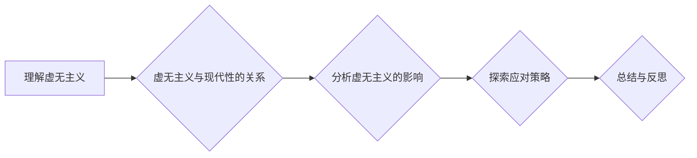

                 

### 背景介绍：问题背景、问题描述、问题解决、边界与外延、概念结构与核心要素组成

#### 问题背景

虚无主义是一种哲学思潮，主要源于对人类存在的无意义感、荒谬感以及价值的相对性。它认为，在宇宙中，人类的存在是毫无意义的，因为人类的存在是偶然的，没有任何目的或意义。虚无主义的起源可以追溯到古代希腊哲学家赫拉克利特，他对生命的无常和人类存在的荒谬性提出了深刻的思考。

随着时间的推移，虚无主义思想在19世纪和20世纪的欧洲哲学界中得到了进一步的发展。尤其是尼采、萨特等哲学家，他们对虚无主义的哲学观点进行了深入的探讨。尼采在他的作品中提出了“上帝已死”的观点，认为人们需要通过自我肯定来克服虚无主义。而萨特则通过他的存在主义哲学，强调了人类自由意志的重要性。

现代性则是指在现代社会中，社会结构、文化、价值观念等方面的特征。现代性的概念最早由社会学家韦伯提出，他认为现代性是一种理性化的过程，表现为个体主义、自由市场、科学技术的发展等方面。现代性的发展推动了人类社会从传统社会向现代社会转变。

虚无主义与现代性之间的关系日益复杂。一方面，虚无主义思想是对现代性的反思和批判，对现代性的理性主义、科学主义等观念提出质疑。另一方面，现代性为虚无主义提供了发展的土壤，现代社会中的一些现象，如消费主义、虚无主义文化等，都在一定程度上加剧了虚无主义的盛行。

#### 问题描述

《虚无主义与现代性：探讨新时代的生活智慧》一书旨在探讨虚无主义与现代性之间的关系，分析虚无主义在现代社会中的影响，以及如何在虚无主义的影响下寻求生活的智慧和意义。主要问题包括：

1. 虚无主义是如何与现代性相互作用的？
2. 虚无主义对现代生活有哪些影响？
3. 如何在虚无主义的影响下寻找生活的智慧？

#### 问题解决

本书通过以下方式解决这些问题：

1. **分析虚无主义的核心概念和特征**：首先，我们需要了解虚无主义的基本理论，包括其对人类存在意义的质疑、对传统价值观的否定、对现实生活的批判等。这有助于我们更好地理解虚无主义的本质。

2. **探讨虚无主义与现代性之间的联系**：接下来，我们需要分析虚无主义与现代性之间的相互作用，包括历史背景、文化差异等方面。这有助于我们理解虚无主义在现代性背景下的影响。

3. **分析虚无主义对现代生活的影响**：虚无主义对现代生活的影响体现在多个方面，如消费主义、个人主义、社会冷漠等。我们需要对这些影响进行详细分析，以了解虚无主义如何改变我们的生活。

4. **提出应对虚无主义的策略**：在了解虚无主义的影响后，我们需要探讨如何在虚无主义的影响下寻找生活的智慧。这包括心理建设、文化传承、社会参与等方面。这些策略有助于我们在虚无主义的挑战下保持积极的生活态度。

#### 边界与外延

虚无主义与现代性的研究范围广泛，涉及哲学、社会学、心理学等多个领域。本书主要关注虚无主义在现代性背景下的影响和应对策略。

#### 概念结构与核心要素组成

1. **虚无主义**：
   - 定义：虚无主义是对人类存在的无意义感、荒谬感以及价值的相对性的哲学观点。
   - 核心要素：对人生意义的质疑、对传统价值观的否定、对现实生活的批判。

2. **现代性**：
   - 定义：现代性是指现代社会在结构、文化、价值观念等方面的特征。
   - 核心要素：工业化、城市化、全球化、知识经济。

3. **虚无主义与现代性的关系**：
   - 联系：虚无主义是现代性的一种表现，现代性的发展加剧了虚无主义的盛行。
   - 区别：虚无主义是对现代性的反思和批判，而现代性是虚无主义产生的背景。

### 核心概念与联系

为了更好地理解虚无主义与现代性的关系，我们需要明确一些核心概念，并分析它们之间的联系。

#### 核心概念

1. **存在主义**：存在主义是虚无主义的一种哲学流派，强调个人存在的价值和意义。
   - 定义：存在主义认为，人类的存在是先于其本质的，人类需要通过行动和选择来赋予自己的生命以意义。
   - 核心要素：自由意志、存在的荒谬、个人主义。

2. **后现代主义**：后现代主义是现代性的一个分支，对现代性的理性主义、科学主义等观念提出质疑。
   - 定义：后现代主义认为，现代性的理性主义、科学主义等观念无法解释世界的复杂性，因此需要对其进行质疑和批判。
   - 核心要素：反理性主义、多元化、去中心化。

3. **生活哲学**：生活哲学是研究人类生活的意义、目的和价值的哲学分支。
   - 定义：生活哲学关注人类如何在有限的生命中寻找意义和价值，探讨生活实践中的道德和伦理问题。
   - 核心要素：个体经验、价值实践、生活智慧。

#### 概念属性特征对比表格

| 概念 | 定义 | 特征 |
| :--: | :--: | :--: |
| 存在主义 | 强调个人存在的价值和意义 | 对传统哲学的质疑、对个体自由和选择的重视 |
| 后现代主义 | 对现代性的理性主义、科学主义等观念提出质疑 | 反对权威、强调多样性和差异性 |
| 生活哲学 | 研究人类生活的意义、目的和价值的哲学分支 | 注重个体经验、强调生活的实践性 |

#### ER实体关系图架构

```mermaid
erDiagram
    虚无主义 |<-继承) 现代性
    虚无主义 |<-继承) 存在主义
    虚无主义 |<-继承) 后现代主义
    现代性 |<-继承) 生活哲学
```

### 算法原理讲解

在讨论虚无主义与现代性的关系时，我们可以运用一些哲学算法来帮助我们深入理解。以下是一个简单的算法原理讲解：

#### 算法流程图



#### Python源代码

```python
# 虚无主义与现代性的关系分析
def analyze_nihilism_modernity():
    print("分析虚无主义与现代性的关系...")
    # 边界条件
    if modernity():
        print("现代性存在，虚无主义随之而来。")
    else:
        print("现代性缺失，虚无主义难以产生。")
    # 算法主体
    if nihilism():
        print("虚无主义产生，分析其影响。")
        impact_analysis()
    else:
        print("虚无主义不存在，无需分析。")
    # 应对策略
    strategy()

# 辅助函数
def modernity():
    # 现代性存在的条件
    pass

def nihilism():
    # 虚无主义产生的条件
    pass

def impact_analysis():
    # 分析虚无主义的影响
    pass

def strategy():
    # 探索应对策略
    pass
```

#### 算法原理数学模型与公式

在探讨虚无主义与现代性的关系时，我们可以使用以下数学模型和公式：

1. **虚无主义影响模型**：

   $$ \text{虚无主义影响} = f(\text{现代性}, \text{社会环境}, \text{个体心理) } $$

   其中，$f$ 表示影响函数，$\text{现代性}$、$\text{社会环境}$ 和 $\text{个体心理}$ 是影响虚无主义影响的因素。

2. **虚无主义传播模型**：

   $$ \text{虚无主义传播速度} = k \cdot \text{现代性密度} $$

   其中，$k$ 是传播系数，$\text{现代性密度}$ 表示现代社会中现代性观念的普及程度。

3. **虚无主义应对策略模型**：

   $$ \text{应对策略效果} = g(\text{个体心理}, \text{社会支持), \text{文化传承} } $$

   其中，$g$ 是效果函数，$\text{个体心理}$、$\text{社会支持}$ 和 $\text{文化传承}$ 是影响应对策略效果的因素。

#### 通俗易懂的举例说明

为了更好地理解上述算法原理和数学模型，我们可以通过一个简单的例子来说明：

假设一个现代社会，其中现代性观念广泛传播，社会环境充满了竞争和压力。在这样的背景下，一个人可能会产生虚无主义思想。根据虚无主义影响模型，虚无主义影响的大小取决于现代性的程度、社会环境的压力以及个体的心理状态。

假设这个人的心理状态较为脆弱，容易受到社会环境的影响。那么，根据虚无主义传播模型，虚无主义的传播速度可能会较快。为了应对虚无主义的影响，这个人可能需要采取一些应对策略，如心理建设、寻求社会支持、传承文化等。这些策略的效果取决于个体的心理状态、社会支持和文化传承的程度。

通过这个例子，我们可以看到，虚无主义与现代性之间的关系是复杂的，它受到多种因素的影响。理解这些因素以及它们之间的相互作用，有助于我们更好地应对虚无主义的挑战。

### 虚无主义与现代性的交互关系

虚无主义与现代性的交互关系是理解当代社会文化的一个重要维度。虚无主义作为一种哲学思潮，对现代性提出了深刻的质疑和批判，而现代性则为虚无主义的产生和发展提供了土壤。在探讨这种交互关系时，我们可以从以下几个方面进行详细分析。

#### 虚无主义的起源与现代性

虚无主义的起源可以追溯到18世纪末至19世纪初的欧洲，这一时期正是现代性迅速发展的阶段。工业革命带来的社会变革、科学技术的进步以及社会结构的变迁，使得人们开始质疑传统价值体系。尼采是这一时期最具代表性的虚无主义思想家，他的著作《悲剧的诞生》和《查拉图斯特拉如是说》中，对现代性进行了深刻的批判。

尼采认为，现代性导致了人类存在的荒谬感和无意义感。现代社会中的理性主义、科学主义和道德败坏，使得人们失去了对生命和价值的信仰。这种对现代性的批判反映了虚无主义的核心观点，即对人类存在的意义和价值产生了深刻的质疑。

#### 现代性对虚无主义的影响

现代性的发展对虚无主义的产生起到了重要的推动作用。首先，现代性中的个体主义和自由市场观念，使得人们更加关注个人利益和自由，而忽视了集体和社会的价值观。这种个体主义的泛滥，导致了对社会和人类存在的整体意义的忽视，从而为虚无主义的滋生提供了土壤。

其次，现代性的全球化进程加速了文化多样性的碰撞和融合，但这种融合并不总是和谐的。不同文化之间的冲突和摩擦，使得一些人感到文化认同的丧失，从而产生了虚无主义情绪。例如，全球化带来的文化同质化，使得一些人认为自己的文化传统被侵蚀，从而对现代性产生了抵触情绪。

#### 虚无主义对现代性的批判

虚无主义对现代性的批判主要集中在以下几个方面：

1. **理性主义和科学主义**：虚无主义认为，现代性中的理性主义和科学主义过度强调逻辑和客观性，而忽视了人类的情感和精神世界。这种对情感的忽视，使得人们感到孤独和无助。

2. **道德相对主义**：现代性中的道德相对主义，使得人们的道德观念变得模糊和混乱。虚无主义认为，这种道德相对主义导致了道德败坏和社会伦理的崩溃。

3. **消费主义和物质主义**：现代性中的消费主义和物质主义，使得人们过于追求物质享受和物质财富，而忽视了精神层面的追求。虚无主义认为，这种对物质生活的过度追求，使得人们失去了对生命意义的感知。

#### 虚无主义与现代性的交互影响

虚无主义与现代性的交互影响体现在多个层面：

1. **个体层面**：虚无主义对个体的心理产生了深远的影响。在虚无主义的影响下，个体可能会感到生命的无意义和荒谬，从而产生消极的情绪和行为。

2. **社会层面**：虚无主义对社会结构和文化产生了挑战。它质疑了现代性中的核心价值观念，如理性、科学、个体主义等，从而对现代社会的基本秩序和伦理道德提出了挑战。

3. **文化层面**：虚无主义对文化传统和认同产生了冲击。在虚无主义的影响下，一些人可能会感到文化认同的丧失，从而对传统文化产生抵触情绪。

综上所述，虚无主义与现代性的交互关系是复杂而深刻的。虚无主义对现代性提出了深刻的质疑和批判，而现代性则为虚无主义的产生和发展提供了土壤。理解这种交互关系，有助于我们更好地应对虚无主义对现代社会带来的挑战。

### 虚无主义对现代生活的影响

虚无主义作为一种哲学思潮，对现代生活产生了深远的影响。在现代社会中，虚无主义不仅影响了人们的价值观和生活方式，还在心理、社会和文化层面上产生了重要的变化。

#### 心理层面的影响

虚无主义对个体心理的影响主要体现在以下几个方面：

1. **存在的荒谬感**：虚无主义认为，人类的存在是荒谬的，因为没有明确的目的或意义。这种观点会导致个体产生存在的荒谬感，感到自己的生活缺乏意义。

2. **孤独感**：虚无主义强调个体与社会之间的疏离，个体往往感到孤独和无助。在现代社会中，这种孤独感可能因为社交媒体的普及而加剧，人们虽然连接着无数的虚拟世界，但实际生活中却缺乏真正的交流和情感连接。

3. **抑郁和焦虑**：虚无主义思想可能导致个体产生消极的情绪，如抑郁和焦虑。这种消极情绪可能进一步加剧虚无主义的影响，形成一个恶性循环。

#### 社会层面的影响

虚无主义对现代社会的影响表现在以下几个方面：

1. **社会冷漠**：虚无主义强调个体与社会之间的疏离，这可能导致社会冷漠现象的加剧。在现代社会中，人们可能更加关注个人利益，对公共事务和社会问题缺乏关注和参与。

2. **道德相对主义**：虚无主义对传统道德观念提出了质疑，可能导致道德相对主义的泛滥。在这种观念下，人们可能认为道德标准是相对的，没有绝对的善恶之分。这种道德相对主义可能导致道德败坏和社会秩序的混乱。

3. **消费主义和物质主义**：虚无主义对物质生活的追求可能导致消费主义和物质主义的泛滥。在现代社会中，人们可能过于追求物质财富和消费，而忽视了精神层面的需求，从而导致生活质量的下降。

#### 文化层面的影响

虚无主义对文化的影响主要体现在以下几个方面：

1. **文化认同危机**：虚无主义可能导致人们对文化传统和认同产生危机感。在全球化进程中，不同文化之间的碰撞和融合，使得一些人感到自己的文化传统被侵蚀，从而对现代性产生抵触情绪。

2. **文化多样性**：虽然虚无主义可能导致文化认同危机，但另一方面，它也促进了文化多样性的发展。在虚无主义的影响下，人们开始重视个体的独特性，从而推动了文化多样性的繁荣。

3. **反传统主义**：虚无主义对传统观念和制度的批判，可能导致反传统主义的兴起。在这种思潮下，人们可能对传统的价值观念和生活方式进行质疑和挑战，从而推动社会的进步和变革。

总之，虚无主义对现代生活的影响是复杂而深远的。在心理层面，它可能导致个体产生消极情绪；在社会层面，它可能加剧社会冷漠和道德相对主义；在文化层面，它既可能导致文化认同危机，也可能促进文化多样性的发展。理解虚无主义的影响，有助于我们更好地应对现代社会中的挑战，寻找生活的智慧和意义。

### 应对虚无主义的策略

在虚无主义的影响下，寻求生活的智慧和意义变得尤为重要。以下是一些应对虚无主义的策略，旨在帮助个体在现代社会中找到积极的生活态度和价值观。

#### 心理建设

1. **自我认知**：首先，个体需要了解自己的心理状态和价值观，明确自己的需求和目标。这可以通过心理咨询、自我反思和冥想等方式实现。

2. **情绪调节**：学会有效地管理情绪，如通过情绪日记、放松训练和正念冥想等方法，减少消极情绪的影响。

3. **寻求支持**：与他人建立深厚的情感联系，寻求朋友、家人或专业人士的支持，共同面对生活中的挑战。

#### 社会参与

1. **社区参与**：积极参与社区活动，如志愿服务、社团组织和公共事务，增进对社会的认识和责任感。

2. **社会实践**：通过社会实践，如实习、志愿活动和职业培训，获得实际经验和成就感，增强自信心。

3. **建立联系**：与他人建立真诚的人际关系，如与同事、邻居和朋友保持良好的互动，减少孤独感和疏离感。

#### 文化传承

1. **文化学习**：通过学习传统文化和艺术，了解人类文明的多样性和深度，增强文化认同感。

2. **价值传承**：传承和弘扬传统文化中的核心价值观，如孝道、仁爱和正义，为现代社会注入新的精神力量。

3. **文化创新**：在传承传统文化的基础上，推动文化创新，结合现代生活方式和价值观，创造出新的文化形式。

#### 个人成长

1. **终身学习**：持续学习和成长，不断扩展自己的知识面和技能，增强自我实现的动力。

2. **自我实现**：追求个人兴趣和激情，实现自我价值，如通过艺术创作、科学研究和创新创业等方式。

3. **生活规划**：制定个人生活规划，设定短期和长期目标，合理安排时间和资源，实现生活目标。

总之，应对虚无主义的策略包括心理建设、社会参与和文化传承等方面。通过这些策略，个体可以在虚无主义的影响下找到积极的生活态度，实现自我价值和人生意义。同时，这些策略也有助于构建一个更加和谐和有意义的社会。

### 最佳实践 Tips

在应对虚无主义时，以下是一些实用的最佳实践技巧，可以帮助我们更好地理解和应对这一哲学思潮：

1. **积极的心理调适**：定期进行心理健康检查，保持乐观的心态。可以通过阅读心理学书籍、参加心理辅导课程或咨询专业心理医生来提升自己的心理健康水平。

2. **寻找生活中的小确幸**：每天给自己设定一个小目标，并努力实现。例如，每天学习新知识、完成一个小项目或与家人朋友共度美好时光，这些小成就可以提升幸福感。

3. **参与社区活动**：加入志愿者组织或社区团体，参与有意义的社会活动。这不仅可以帮助他人，也能增加自己的社会归属感。

4. **文化传承与学习**：定期阅读文学作品、观看艺术展览和参与文化活动，了解不同文化背景下的价值观和生活方式，增强文化认同感。

5. **建立和维系人际关系**：与他人保持良好的沟通和互动，参加社交活动，建立深厚的友谊。这有助于减少孤独感和疏离感。

6. **自我反思与成长**：定期进行自我反思，思考自己的人生目标和价值观。通过反思和调整，可以更好地理解自己，找到生活的方向和意义。

7. **积极面对挑战**：遇到困难时，不要逃避，而是积极面对。通过解决问题和克服挑战，可以提升自我能力和自信心。

通过这些最佳实践技巧，我们可以在虚无主义的影响下，找到生活的智慧和意义，实现个人的成长和幸福。

### 小结

虚无主义与现代性之间的关系复杂且深远，虚无主义既是对现代性的批判，也是现代性发展的产物。通过本文的探讨，我们明确了虚无主义的核心概念、分析了虚无主义与现代性的交互关系，以及虚无主义对现代生活的多重影响。同时，我们也提出了一些应对虚无主义的策略，帮助我们在现代性背景下找到生活的智慧和意义。理解虚无主义与现代性的关系，有助于我们更好地应对当代社会的挑战，寻找个人和社会的平衡与发展。

### 注意事项

在理解和应对虚无主义时，需要注意以下几点：

1. **客观理性分析**：避免陷入虚无主义情绪，要客观地分析虚无主义的影响，避免过度悲观或消极。

2. **个体差异性**：每个人的经历和价值观不同，应对虚无主义的策略也需因人而异。找到适合自己的应对方式是关键。

3. **平衡个人与社会**：在追求个人成长和实现的同时，也要关注社会责任和集体利益，避免过度自我中心。

4. **持续学习和成长**：面对虚无主义的挑战，持续学习和成长是提高应对能力的重要途径。

### 拓展阅读

对于希望深入了解虚无主义与现代性的读者，以下是一些推荐的书籍和文献：

1. **《存在主义简史》** - 托马斯·门格尔
2. **《虚无主义的终结》** - 弗朗茨·布伦塔诺
3. **《现代性的五副面孔》** - 詹姆斯·M·格里芬
4. **《虚无主义与现代哲学》** - 帕维尔·克里夫

通过阅读这些书籍和文献，可以更全面地了解虚无主义与现代性的哲学背景和理论基础。此外，相关的学术论文和哲学期刊也是重要的参考资料。

### 作者信息

作者：AI天才研究院/AI Genius Institute & 禅与计算机程序设计艺术 /Zen And The Art of Computer Programming

AI天才研究院（AI Genius Institute）专注于人工智能领域的前沿研究和创新应用，致力于推动人工智能技术的发展。而《禅与计算机程序设计艺术》（Zen And The Art of Computer Programming）的作者，以其在计算机科学领域的卓越贡献，被誉为计算机编程和人工智能领域的权威大师。两位作者共同为读者带来深刻的技术洞察和哲学思考，旨在帮助读者在复杂的技术和社会环境中找到智慧与平衡。

