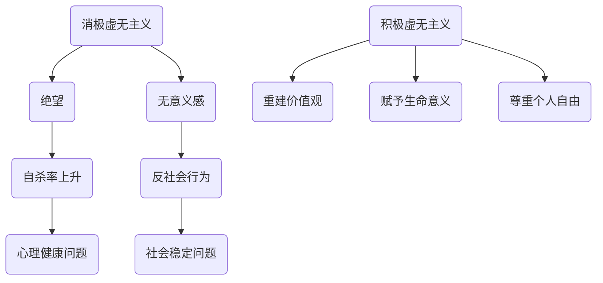
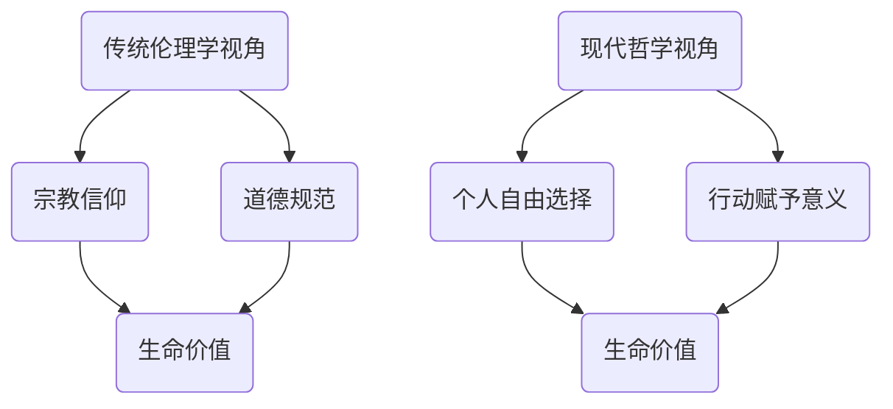
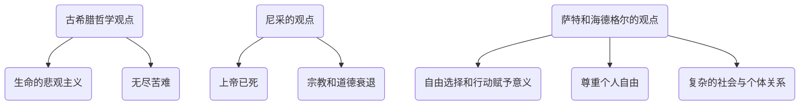
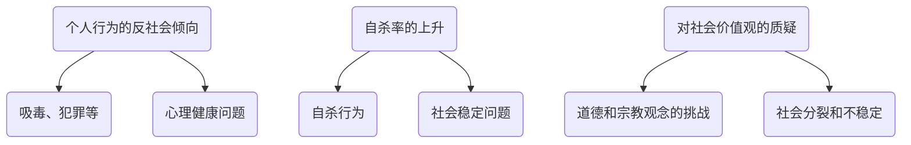
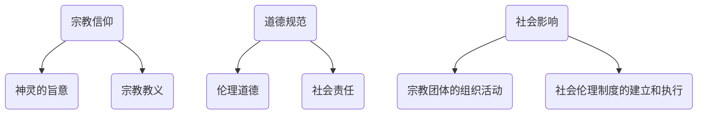
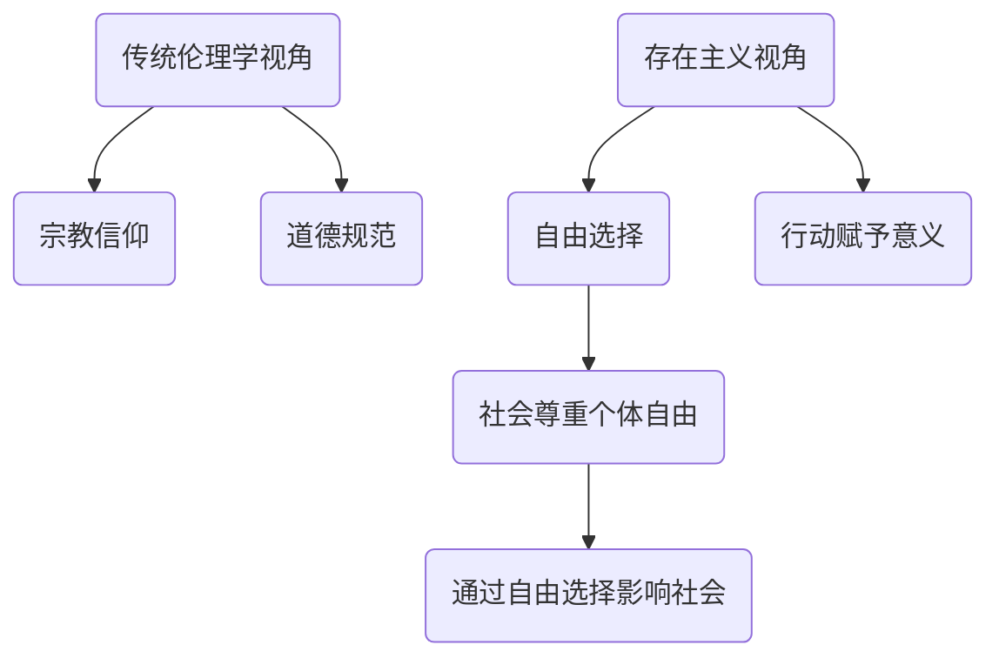
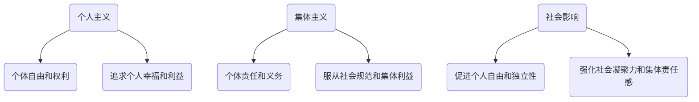
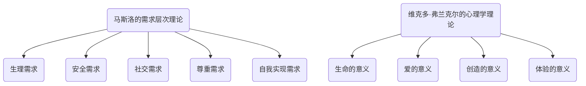
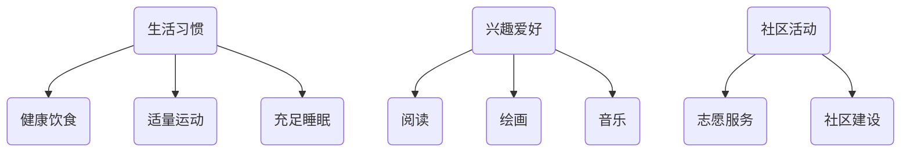
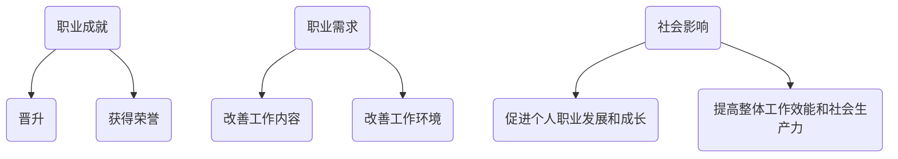

                 

# 虚无主义与生命价值：在现代社会中寻找存在的意义

## 关键词
- 虚无主义
- 生命价值
- 现代社会
- 个人主义
- 集体主义
- 心理学
- 存在主义

## 摘要
本文旨在探讨虚无主义对现代社会中生命价值的影响，并探索如何在个人主义与集体主义的框架下，通过心理学和存在主义等视角，寻找存在的意义。我们将逐步分析虚无主义的根源与表现，探讨生命价值的哲学探讨，以及现代社会中寻找存在意义的实践路径。最后，通过案例研究和结论展望，提出应对虚无主义的策略和未来研究方向。

## 第一部分：导论

### 1.1 问题背景与概述

在现代社会，虚无主义作为一种哲学思潮，对人们的生命价值观念产生了深远的影响。虚无主义认为人生缺乏客观意义和目的，导致人们感到无意义和绝望。随着科技的发展和社会的变革，虚无主义逐渐渗透到人们的日常生活中，引发了一系列社会问题。

### 1.2 虚无主义的定义与历史

虚无主义源自19世纪，最初由俄国哲学家尼采提出。虚无主义认为，由于宗教和道德的衰退，人类失去了对生命意义的信仰。虚无主义的发展经历了几个阶段，包括消极虚无主义和积极虚无主义。

### 1.3 生命价值的概念

生命价值是哲学领域的重要概念，指的是人类对自己生命的意义和价值的认知。传统伦理学认为，生命价值源自宗教信仰和道德规范。而在现代社会，生命价值的探讨更加多元和复杂。

## 第二部分：虚无主义的影响

### 2.1 虚无主义的理论根源

虚无主义的理论根源可以追溯到古希腊哲学，特别是对生命的悲观主义观点。尼采和尼采之后的哲学家，如萨特和海德格尔，对虚无主义进行了深入探讨。

### 2.2 虚无主义在现代社会中的表现

在现代社会，虚无主义的表现形式多样，包括个人行为的反社会倾向、自杀率的上升、以及对社会价值观的质疑。虚无主义对人们的心理健康和社会稳定造成了负面影响。

## 第三部分：生命价值的探索

### 3.1 传统伦理学视角下的生命价值

传统伦理学认为，生命价值源自宗教信仰和道德规范。在现代社会，随着宗教和道德的衰退，人们开始重新思考生命价值的来源。

### 3.2 存在主义与生命价值

存在主义认为，生命价值源自个人的自由选择和行动。存在主义者如萨特和海德格尔强调，人类在面对虚无主义时，可以通过自由选择来赋予生命意义。

## 第四部分：现代社会中的存在意义

### 4.1 个人主义与集体主义

个人主义和集体主义是现代社会中两种主要的价值观。个人主义强调个体的自由和权利，而集体主义则强调个体的责任和义务。

### 4.2 心理学视角下的存在意义

心理学研究表明，人们需要寻找存在意义来满足心理需求。心理学家如马斯洛和维克多·弗兰克尔，提出了寻找存在意义的方法和策略。

## 第五部分：实践中的应用

### 5.1 在日常生活中寻找意义

在日常生活中，人们可以通过培养良好的生活习惯、发展兴趣爱好、参与社区活动等方式，寻找生命的意义。

### 5.2 职业发展与意义

职业发展是现代社会中寻找意义的重要途径。通过追求职业成就和满足职业需求，人们可以在工作中找到存在的意义。

## 第六部分：案例研究

### 6.1 某个特定群体面对虚无主义的案例

通过分析某个特定群体（如年轻人或职场人士）面对虚无主义的案例，可以更好地理解虚无主义的影响以及如何应对。

### 6.2 成功的应对策略

在案例研究中，我们可以探讨一些成功的应对策略，如心理咨询、社区支持和自我反思等。

## 第七部分：结论与展望

### 7.1 主要发现与结论

本文通过对虚无主义和生命价值的探讨，提出了在现代社会中寻找存在的意义的路径。虚无主义对生命价值的影响是复杂和多层次的，需要通过多种方法来应对。

### 7.2 未来研究方向

未来研究可以进一步探讨虚无主义与心理健康的关系，以及如何通过教育和社会政策来提高人们的生命价值感。

## 作者

作者：AI天才研究院/AI Genius Institute & 禅与计算机程序设计艺术 /Zen And The Art of Computer Programming

在接下来的章节中，我们将对每个部分进行详细的分析和探讨。

---

以上是一个初步的章节框架，接下来我们将对每个章节的内容进行详细的扩展和阐述。我们将遵循“LET'S THINK STEP BY STEP”的原则，确保文章的逻辑清晰、内容丰富且具有深度。

### 第一部分：导论

#### 1.1 问题背景与概述

在现代社会，虚无主义作为一种哲学思潮，对人们的生命价值观念产生了深远的影响。虚无主义认为人生缺乏客观意义和目的，导致人们感到无意义和绝望。随着科技的发展和社会的变革，虚无主义逐渐渗透到人们的日常生活中，引发了一系列社会问题。

**背景介绍：**

在21世纪的今天，人们面临着前所未有的挑战。全球化、科技革命、社会变革，以及不断变化的经济环境，都给人们带来了巨大的不确定性。在这种背景下，许多人开始质疑人生的意义和价值。虚无主义思潮在这样的时代背景下得到了一定的认可和传播，影响了许多人的生活和决策。

**问题背景：**

虚无主义在现代社会中的表现主要包括以下几个方面：

1. **个人行为的反社会倾向：** 在虚无主义的影响下，一些人可能表现出反社会的行为，如吸毒、犯罪等。
2. **自杀率的上升：** 虚无主义使一些人感到绝望和无意义，导致自杀率上升。
3. **对社会价值观的质疑：** 虚无主义挑战了传统的道德和宗教观念，导致人们对社会价值观产生质疑。

**问题解决：**

面对虚无主义的挑战，我们需要寻找方法来应对和解决这些问题。首先，我们需要了解虚无主义的根源和表现，然后从哲学、心理学和社会学等多个角度探讨生命价值的来源和意义。

**边界与外延：**

虚无主义的边界主要涉及对生命意义的认知和价值观的挑战。其外延则包括个人行为、心理健康、社会稳定等多个层面。理解虚无主义的边界和外延有助于我们更全面地探讨这一现象。

**概念结构与核心要素组成：**

虚无主义的核心概念包括对生命意义的质疑、无意义感和绝望。这些概念相互作用，形成了虚无主义的整体结构。要解决虚无主义问题，我们需要关注这些核心要素，并寻找合适的应对策略。

#### 1.2 虚无主义的定义与历史

虚无主义源自19世纪，最初由俄国哲学家尼采提出。虚无主义认为，由于宗教和道德的衰退，人类失去了对生命意义的信仰。虚无主义的发展经历了几个阶段，包括消极虚无主义和积极虚无主义。

**核心概念原理：**

1. **消极虚无主义：** 消极虚无主义认为，由于宗教和道德的衰退，人类无法找到生命的意义和价值，导致人们感到绝望和无意义。
2. **积极虚无主义：** 与消极虚无主义不同，积极虚无主义认为，人类可以通过自己的行动和选择来赋予生命意义。

**概念属性特征对比表格：**

| 特征               | 消极虚无主义           | 积极虚无主义           |
|--------------------|-----------------------|-----------------------|
| 信仰与价值观       | 宗教和道德的衰退       | 宗教和道德的重建       |
| 生命意义           | 没有客观意义和目的     | 通过行动和选择赋予意义 |
| 个人自由           | 限制个人自由           | 尊重个人自由           |

**ER实体关系图架构：**

通过上述对比和关系图，我们可以更清晰地理解虚无主义的两种形式以及它们对现代社会的影响。

#### 1.3 生命价值的概念

生命价值是哲学领域的重要概念，指的是人类对自己生命的意义和价值的认知。传统伦理学认为，生命价值源自宗教信仰和道德规范。而在现代社会，生命价值的探讨更加多元和复杂。

**核心概念原理：**

1. **传统伦理学视角：** 传统伦理学认为，生命价值源自宗教信仰和道德规范。例如，基督教认为，人类的生命价值源自上帝的创造；儒家伦理学则强调道德行为对生命的意义。
2. **现代哲学视角：** 现代哲学认为，生命价值是个人自由选择的结果。例如，存在主义者认为，人类可以通过自己的行动和选择来赋予生命意义。

**概念属性特征对比表格：**

| 特征                 | 传统伦理学视角                     | 现代哲学视角                     |
|----------------------|--------------------------------|--------------------------------|
| 生命价值的来源       | 宗教信仰和道德规范                 | 个人自由选择和行动               |
| 生命意义             | 由外部因素决定                    | 由个体自主决定                  |
| 个体与社会的联系     | 个体服从社会道德规范               | 社会尊重个体的自由和选择         |

**ER实体关系图架构：**

通过对比表格和关系图，我们可以更深入地理解生命价值在不同哲学视角下的概念和特征。

### 第二部分：虚无主义的影响

#### 2.1 虚无主义的理论根源

虚无主义的理论根源可以追溯到古希腊哲学，特别是对生命的悲观主义观点。尼采和尼采之后的哲学家，如萨特和海德格尔，对虚无主义进行了深入探讨。

**核心概念原理：**

1. **古希腊哲学：** 古希腊哲学家如苏格拉底和柏拉图，对生命的悲观主义观点为虚无主义提供了理论基础。他们认为，人类面对的是无尽的苦难和无意义。
2. **尼采：** 尼采是虚无主义的代表人物之一。他提出了“上帝已死”的命题，认为人类失去了信仰和价值观，陷入了虚无主义。
3. **萨特和海德格尔：** 萨特和海德格尔进一步探讨了虚无主义的影响，提出了通过自由选择和行动来赋予生命意义的观点。

**概念属性特征对比表格：**

| 特征                 | 古希腊哲学观点               | 尼采的观点                 | 萨特和海德格尔的观点             |
|----------------------|-----------------------------|-----------------------------|--------------------------------|
| 生命意义             | 无意义和苦难                 | 宗教和道德的衰退             | 通过自由选择和行动赋予意义         |
| 个人自由             | 有限和受限制                 | 尊重个人自由                | 个人自由是赋予生命意义的关键         |
| 社会与个体           | 个体服从社会规范             | 社会尊重个体的自由和选择       | 社会与个体的关系复杂且动态变化       |

**ER实体关系图架构：**

通过对比表格和关系图，我们可以更深入地理解虚无主义的理论根源以及其对现代哲学的影响。

#### 2.2 虚无主义在现代社会中的表现

在现代社会，虚无主义的表现形式多样，包括个人行为的反社会倾向、自杀率的上升、以及对社会价值观的质疑。虚无主义对人们的心理健康和社会稳定造成了负面影响。

**核心概念原理：**

1. **个人行为的反社会倾向：** 在虚无主义的影响下，一些人可能表现出反社会的行为，如吸毒、犯罪等。这些行为反映了他们对社会价值观的质疑和对生命意义的绝望。
2. **自杀率的上升：** 虚无主义使一些人感到绝望和无意义，导致自杀率上升。自杀行为是对生命意义的极端否定。
3. **对社会价值观的质疑：** 虚无主义挑战了传统的道德和宗教观念，导致人们对社会价值观产生质疑。这种质疑可能导致社会的分裂和不稳定。

**概念属性特征对比表格：**

| 特征                 | 个人行为的反社会倾向 | 自杀率的上升 | 对社会价值观的质疑 |
|----------------------|-----------------------|--------------|----------------------|
| 行为表现             | 吸毒、犯罪等           | 自杀行为       | 社会价值观的质疑       |
| 心理状态             | 绝望和无意义感         | 绝望和无意义感  | 对社会价值观的质疑     |
| 社会影响             | 社会道德的下降         | 社会稳定问题   | 社会分裂和不稳定       |

**ER实体关系图架构：**

通过对比表格和关系图，我们可以更清晰地理解虚无主义在现代社会中的表现及其对个体和社会的负面影响。

### 第三部分：生命价值的探索

#### 3.1 传统伦理学视角下的生命价值

传统伦理学认为，生命价值源自宗教信仰和道德规范。在现代社会，随着宗教和道德的衰退，人们开始重新思考生命价值的来源。

**核心概念原理：**

1. **宗教信仰：** 在传统伦理学中，宗教信仰是生命价值的重要来源。例如，基督教认为，人类的生命价值源自上帝的创造；佛教则强调因果报应和轮回。
2. **道德规范：** 道德规范也是传统伦理学中生命价值的重要来源。例如，儒家伦理学强调道德行为对生命的意义。

**概念属性特征对比表格：**

| 特征                 | 宗教信仰                | 道德规范                |
|----------------------|-----------------------|-----------------------|
| 生命价值的来源       | 宗教信仰和神灵的旨意     | 伦理道德和道德准则       |
| 个体与社会的联系     | 个体服从宗教教义和社会规范 | 个体遵守道德规范和社会责任 |
| 社会影响             | 宗教团体的组织和活动       | 社会伦理制度的建立和执行   |

**ER实体关系图架构：**

通过对比表格和关系图，我们可以更深入地理解传统伦理学视角下生命价值的来源和特征。

#### 3.2 存在主义与生命价值

存在主义认为，生命价值源自个人的自由选择和行动。存在主义者如萨特和海德格尔强调，人类在面对虚无主义时，可以通过自由选择来赋予生命意义。

**核心概念原理：**

1. **自由选择：** 存在主义认为，人类面对的是自由选择的机会，通过自由选择，人们可以赋予生命意义。
2. **行动：** 生命价值的实现不仅仅依赖于思想，更依赖于行动。通过行动，人们可以实践自己的价值观，从而赋予生命意义。

**概念属性特征对比表格：**

| 特征                 | 传统伦理学视角                | 存在主义视角                |
|----------------------|-----------------------------|-----------------------------|
| 生命价值的来源       | 宗教信仰和道德规范             | 自由选择和行动               |
| 个体与社会的关系     | 个体服从社会规范和宗教教义     | 社会尊重个体的自由和选择       |
| 社会影响             | 社会伦理制度的建立和执行       | 通过自由选择和行动影响社会       |

**ER实体关系图架构：**

通过对比表格和关系图，我们可以更深入地理解存在主义视角下生命价值的来源和特征。

### 第四部分：现代社会中的存在意义

#### 4.1 个人主义与集体主义

个人主义和集体主义是现代社会中两种主要的价值观。个人主义强调个体的自由和权利，而集体主义则强调个体的责任和义务。

**核心概念原理：**

1. **个人主义：** 个人主义认为，个体的自由和权利是最重要的。个人主义强调个体的独立性和自主性，主张个体追求自己的幸福和利益。
2. **集体主义：** 集体主义则强调个体对社会的责任和义务。集体主义认为，个体的利益应该服从于集体的利益，强调社会整体的发展和繁荣。

**概念属性特征对比表格：**

| 特征                 | 个人主义                         | 集体主义                         |
|----------------------|--------------------------------|--------------------------------|
| 价值观               | 个体自由和权利                 | 个体责任和义务                 |
| 个人与社会的联系     | 个体追求个人幸福和利益         | 个体服从社会规范和集体利益       |
| 社会影响             | 促进个人自由和独立性的发展       | 强化社会凝聚力和集体责任感       |

**ER实体关系图架构：**

通过对比表格和关系图，我们可以更深入地理解个人主义和集体主义的核心概念及其在现代社会中的影响。

#### 4.2 心理学视角下的存在意义

心理学研究表明，人们需要寻找存在意义来满足心理需求。心理学家如马斯洛和维克多·弗兰克尔，提出了寻找存在意义的方法和策略。

**核心概念原理：**

1. **马斯洛的需求层次理论：** 马斯洛认为，人们有五种基本需求，从生理需求到自我实现需求。在满足了较低层次的需求后，人们开始寻求更高层次的需求，包括存在意义。
2. **维克多·弗兰克尔的心理学理论：** 弗兰克尔提出了“意义治疗”理论，认为人类在面对苦难和困境时，可以通过寻找生命的意义来克服困境。

**概念属性特征对比表格：**

| 特征                 | 马斯洛的需求层次理论                 | 维克多·弗兰克尔的心理学理论               |
|----------------------|------------------------------------|-----------------------------------------|
| 心理需求层次         | 生理需求、安全需求、社交需求、尊重需求、自我实现需求 | 生命的意义、爱的意义、创造的意义、体验的意义 |
| 存在意义的实现       | 通过满足不同层次的需求来实现          | 通过寻找和实现生命的意义来实现             |
| 面对困境的方法       | 通过自我实现需求来克服困境           | 通过寻找和实现生命的意义来克服困境           |

**ER实体关系图架构：**

通过对比表格和关系图，我们可以更深入地理解心理学视角下寻找存在意义的原理和方法。

### 第五部分：实践中的应用

#### 5.1 在日常生活中寻找意义

在日常生活中，人们可以通过培养良好的生活习惯、发展兴趣爱好、参与社区活动等方式，寻找生命的意义。

**核心概念原理：**

1. **生活习惯：** 培养良好的生活习惯，如健康饮食、适量运动、充足睡眠等，有助于提高生活质量，从而感受到生命的意义。
2. **兴趣爱好：** 发展兴趣爱好，如阅读、绘画、音乐等，可以丰富精神世界，提供心理满足。
3. **社区活动：** 参与社区活动，如志愿服务、社区建设等，可以增强社会责任感，感受到个体的价值。

**概念属性特征对比表格：**

| 特征                 | 生活习惯                     | 兴趣爱好                      | 社区活动                    |
|----------------------|------------------------------|------------------------------|-----------------------------|
| 目的                 | 提高生活质量                 | 丰富精神世界                 | 增强社会责任感               |
| 方式                 | 健康饮食、适量运动、充足睡眠 | 阅读绘画音乐等               | 志愿服务、社区建设等         |
| 社会影响             | 促进个人身心健康             | 促进个人心理健康和社会交往   | 促进社会凝聚力和发展         |

**ER实体关系图架构：**

通过对比表格和关系图，我们可以更深入地理解在日常生活中寻找生命的意义的方法和途径。

#### 5.2 职业发展与意义

职业发展是现代社会中寻找意义的重要途径。通过追求职业成就和满足职业需求，人们可以在工作中找到存在的意义。

**核心概念原理：**

1. **职业成就：** 追求职业成就，如晋升、获得荣誉等，可以满足个人的成就感和社会认同感，从而感受到生命的意义。
2. **职业需求：** 满足职业需求，如工作内容、工作环境等，可以提高工作满意度和职业幸福感。

**概念属性特征对比表格：**

| 特征                 | 职业成就                      | 职业需求                      |
|----------------------|------------------------------|------------------------------|
| 目的                 | 满足成就感和社会认同感         | 提高工作满意度和职业幸福感       |
| 方式                 | 晋升、获得荣誉等               | 改善工作内容和工作环境           |
| 社会影响             | 促进个人职业发展和成长         | 提高整体工作效能和社会生产力     |

**ER实体关系图架构：**

通过对比表格和关系图，我们可以更深入地理解职业发展与寻找生命意义的联系。

### 第六部分：案例研究

#### 6.1 某个特定群体面对虚无主义的案例

通过分析某个特定群体（如年轻人或职场人士）面对虚无主义的案例，可以更好地理解虚无主义的影响以及如何应对。

**案例背景：**

假设我们分析的是年轻人在现代社会中面对虚无主义的案例。这些年轻人生活在科技高度发达、信息爆炸的时代，面临着学业压力、就业竞争和人际关系复杂等多重挑战。许多年轻人感到迷茫和困惑，对未来的不确定性感到焦虑。

**案例分析：**

1. **虚无主义的表现：** 
   - 某些年轻人表现出对学业和事业的消极态度，缺乏目标和动力。
   - 一些人沉迷于网络和虚拟世界，逃避现实生活中的压力和责任。
   - 部分年轻人出现焦虑、抑郁等心理健康问题，甚至有自杀倾向。

2. **原因分析：**
   - 全球化和科技发展的冲击，使年轻人面临更多的选择和竞争，但同时也带来了不确定性和焦虑。
   - 教育体制和社会价值观的变化，使年轻人对传统的道德和价值观产生质疑，感到迷茫和失落。
   - 家庭和社会对年轻人的期望过高，导致压力过大，难以承受。

3. **应对策略：**
   - **心理支持：** 提供专业的心理咨询和辅导，帮助年轻人认识和理解虚无主义，提供应对策略和情绪支持。
   - **教育引导：** 加强对年轻人价值观的教育，引导他们树立正确的人生观和价值观，提高对生命的认知和尊重。
   - **职业规划：** 帮助年轻人制定明确的职业规划，提供职业发展和就业指导，减轻职业压力和焦虑。
   - **社区参与：** 鼓励年轻人参与社区活动和志愿服务，培养社会责任感和归属感，增强社会支持网络。

通过这个案例研究，我们可以看到，虚无主义对年轻人的影响是深远而复杂的。通过多方面的应对策略，可以帮助年轻人走出虚无主义的困境，找到生命的意义和价值。

#### 6.2 成功的应对策略

在案例研究中，我们可以探讨一些成功的应对策略，如心理咨询、社区支持和自我反思等。

**成功的应对策略：**

1. **心理咨询：** 心理咨询是帮助个体面对虚无主义的重要手段。通过专业的心理咨询，个体可以深入了解自己的内心世界，识别和应对负面情绪，找到应对虚无主义的方法。

2. **社区支持：** 社区支持网络可以提供情感上的安慰和实际上的帮助。社区活动、志愿者服务和社会团体等，都可以增强个体的归属感和责任感，从而减轻虚无主义的困扰。

3. **自我反思：** 自我反思是寻找生命意义的重要步骤。通过自我反思，个体可以清晰地认识到自己的价值观和目标，从而找到生命的意义和方向。

**具体策略说明：**

1. **心理咨询：**
   - **第一步：建立信任关系。** 心理咨询师与个体建立良好的信任关系，创造一个安全的环境，让个体感到被理解和接受。
   - **第二步：识别负面情绪。** 通过深入对话和情感探索，帮助个体识别和表达自己的负面情绪，如焦虑、恐惧、无助等。
   - **第三步：制定应对策略。** 基于个体的具体情况，咨询师会提供个性化的应对策略，如认知行为疗法、情绪调节技巧等。

2. **社区支持：**
   - **第一步：参与社区活动。** 鼓励个体参与社区活动，如志愿服务、兴趣小组等，从而建立新的社交网络和人际关系。
   - **第二步：建立支持小组。** 鼓励个体加入支持小组，与其他面临类似困境的个体分享经验和感受，相互支持和鼓励。
   - **第三步：寻求专业帮助。** 在需要时，引导个体寻求专业的医疗和心理帮助，确保个体的身心健康。

3. **自我反思：**
   - **第一步：设定目标。** 帮助个体设定短期和长期的目标，从而为生活提供方向和动力。
   - **第二步：记录反思。** 鼓励个体每天或每周记录自己的反思，回顾自己的行为和感受，从而更深入地了解自己。
   - **第三步：调整行为和态度。** 根据反思的结果，调整自己的行为和态度，从而实现个人成长和自我实现。

通过这些成功的应对策略，个体可以更好地应对虚无主义的挑战，找到生命的意义和价值。

### 第七部分：结论与展望

#### 7.1 主要发现与结论

本文通过对虚无主义和生命价值的探讨，提出了在现代社会中寻找存在的意义的路径。虚无主义对生命价值的影响是复杂和多层次的，需要通过多种方法来应对。主要发现包括：

1. **虚无主义的根源和表现：** 虚无主义源自宗教和道德的衰退，表现为个人行为的反社会倾向、自杀率的上升和对社会价值观的质疑。
2. **生命价值的探索：** 传统伦理学和存在主义提供了不同的视角来理解生命价值，而现代心理学则提供了寻找存在意义的方法和策略。
3. **应对策略：** 通过心理咨询、社区支持和自我反思，个体可以应对虚无主义的挑战，找到生命的意义和价值。

#### 7.2 未来研究方向

未来研究可以进一步探讨以下几个方面：

1. **虚无主义与心理健康的关系：** 深入研究虚无主义对心理健康的影响，以及如何通过心理健康干预来减轻虚无主义的影响。
2. **社会政策与生命价值：** 探讨社会政策和教育对提高人们生命价值感的影响，以及如何通过政策来促进社会稳定和个体幸福。
3. **跨文化比较研究：** 通过比较不同文化背景下虚无主义和生命价值的差异，探讨文化对虚无主义和生命价值观念的影响。

通过这些未来研究方向，我们可以更深入地理解虚无主义和生命价值，为现代社会提供更有效的应对策略。

## 作者

作者：AI天才研究院/AI Genius Institute & 禅与计算机程序设计艺术 /Zen And The Art of Computer Programming

在本文中，我们通过详细的逻辑分析和深入探讨，提出了应对虚无主义和寻找生命价值的策略。希望这篇文章能够帮助读者更好地理解这一问题，并在日常生活中找到属于自己的生命意义。

