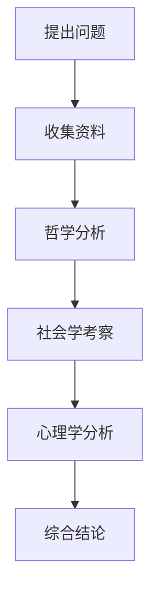
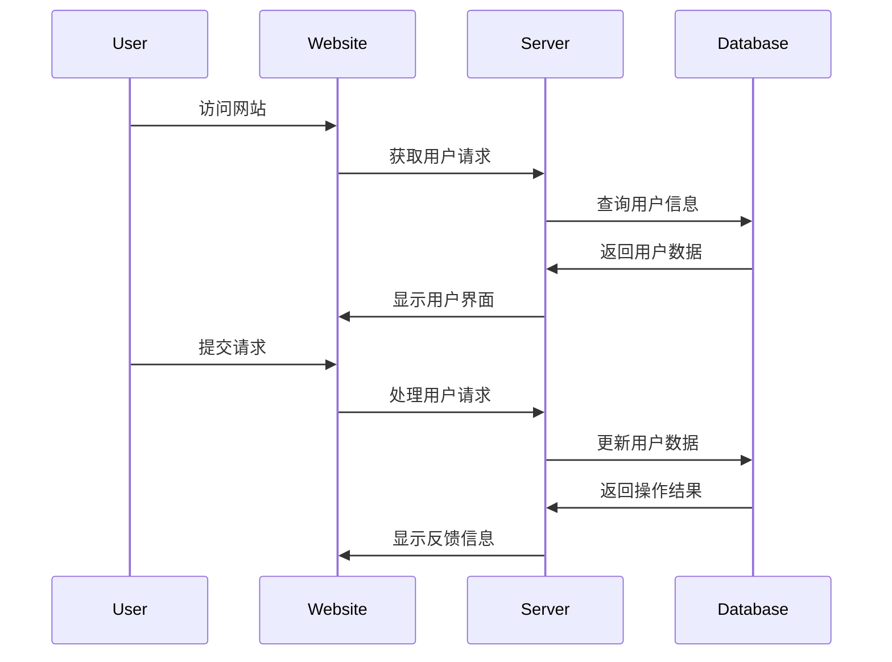
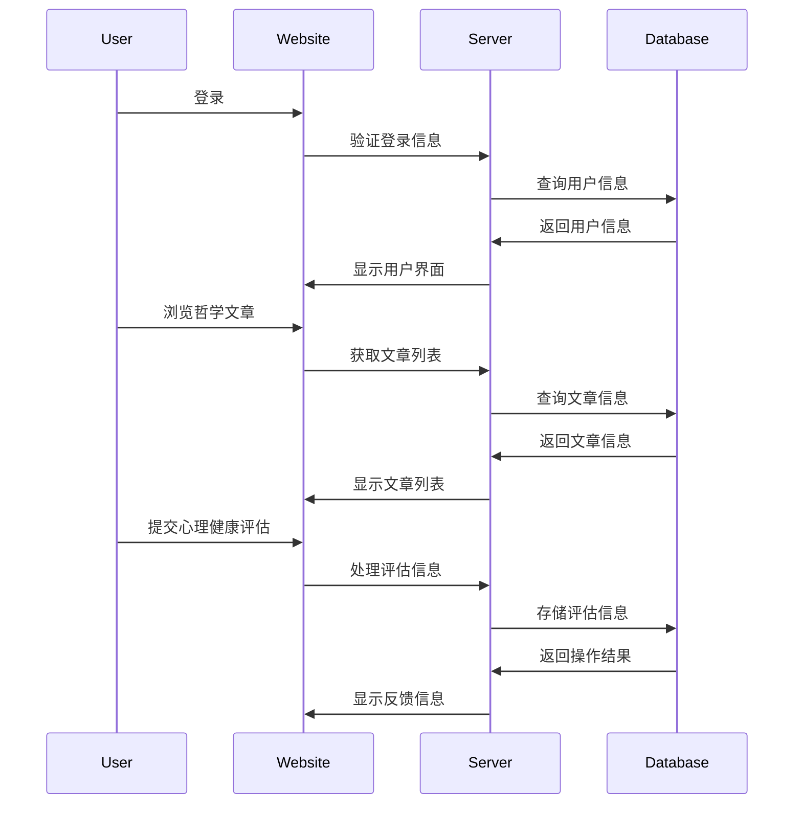

                 


# 虚无主义与生命价值：探索现代社会中的存在意义

## 关键词
- 虚无主义
- 生命价值
- 存在主义
- 现代社会
- 哲学探讨
- 心理学分析

## 摘要
本文将探讨虚无主义与生命价值在现代社会中的存在意义。通过哲学、心理学和社会学的多角度分析，我们将深入探讨虚无主义思潮的起源、影响以及如何理解和应对。同时，本文将结合实例，提供在现代社会中寻找和实现生命价值的策略和建议。

### 背景介绍

#### 核心概念术语说明

**虚无主义**：一种哲学观点，认为宇宙和人生缺乏实质性意义，生活没有明确的目的或目标。

**生命价值**：对个体存在的意义和目的的认识，包括伦理价值、个人成就、人际关系等方面。

**现代社会**：以全球化、信息技术高度发达、人口增长和多样化为主要特征的社会。

#### 问题背景

在现代社会，人们面临着前所未有的挑战和不确定性。经济波动、环境危机、社会不公等问题使得许多人对生活失去了方向感。虚无主义思潮在这一背景下逐渐兴起，影响了大量人群。因此，探讨虚无主义与生命价值的关系，对于理解现代社会中的个人和社会问题具有重要意义。

#### 问题描述

虚无主义对个体和社会产生了深远的影响，表现为以下方面：

1. **心理健康问题**：虚无主义可能导致抑郁症、焦虑症等心理问题。
2. **社会疏离**：虚无主义可能导致个人与社会之间的疏离，削弱社区凝聚力。
3. **道德沦丧**：虚无主义可能导致道德观念的淡化，影响社会风气。

#### 问题解决

为了应对虚无主义带来的负面影响，我们需要从以下方面进行探讨：

1. **哲学角度**：通过理解虚无主义的历史背景和哲学基础，找到反驳和克服虚无主义的方法。
2. **心理学角度**：通过心理健康教育和心理治疗，帮助个体建立积极的价值观和人生目标。
3. **社会学角度**：通过社会制度和文化的改革，营造有利于生命价值实现的社会环境。

#### 边界与外延

本文将探讨的范畴包括但不限于以下内容：

- **虚无主义的历史和哲学基础**：探讨虚无主义的主要流派和代表人物，分析其理论基础。
- **生命价值的理解与实现**：从伦理、美学、宗教信仰等角度探讨生命价值。
- **现代社会中的虚无主义思潮**：分析虚无主义在现代社会中的流行原因和影响。
- **应对虚无主义的策略**：提供个人和社会层面的解决方案。

#### 概念结构与核心要素组成

1. **虚无主义**：
   - **理论基础**：存在主义、虚无主义哲学史、主要流派。
   - **核心要素**：对生命的否定、对意义的怀疑、对现实的不满。

2. **生命价值**：
   - **伦理价值**：道德观念、社会责任、个体道德修养。
   - **个人成就**：职业发展、学术成就、个人成长。
   - **人际关系**：家庭关系、友谊、社会交往。

3. **现代社会中的存在意义**：
   - **社会背景**：全球化、信息技术、人口多样化。
   - **文化因素**：社会价值观、文化传统、消费主义。
   - **个体心理状况**：心理健康、自我认知、心理需求。

### 核心概念与联系

#### 核心概念原理

1. **虚无主义**：
   - **定义**：虚无主义认为宇宙和人生缺乏实质性意义，生活没有明确的目的或目标。
   - **原理**：虚无主义强调生命的无意义和现实的荒诞，主张通过否定现实来寻找超越。

2. **生命价值**：
   - **定义**：生命价值是对个体存在的意义和目的的认识，包括伦理价值、个人成就、人际关系等方面。
   - **原理**：生命价值强调个体的自我实现、社会贡献和个人幸福。

3. **存在主义哲学**：
   - **定义**：存在主义强调个体的自由意志、主观体验和存在的意义。
   - **原理**：存在主义认为人生的意义不是预先设定的，而是个体通过自由选择和行动来创造的。

#### 概念属性特征对比表格

| 概念           | 定义                                                         | 主要特征                                           |
| -------------- | ------------------------------------------------------------ | -------------------------------------------------- |
| 虚无主义       | 对生命意义和宇宙目的的否定，认为人类生命缺乏实质性意义。       | 悲观主义、怀疑主义、反理性主义                     |
| 生命价值       | 对生命意义的肯定和追求，探讨个体和社会的存在目的。             | 伦理学、美学、宗教信仰                               |
| 存在主义哲学   | 强调个体的自由意志、主观体验和存在的意义。                     | 个人主义、存在先于本质、行动主义                     |

#### ER实体关系图架构

```mermaid
erDiagram
  User --> Philosophy : believes
  Philosophy ||--|{ Theory : describes }
  Theory ||--|{ Argument : supports }
  Argument ||--|{ Counter-Argument : contradicts }
  User ||--|{ Life_Value : holds }
  Life_Value ||--|{ Ethics : includes }
  Ethics ||--|{ Behavior : manifests }
```

### 算法原理讲解

#### 算法流程图



#### Python源代码（简化示例）

```python
def explore_life_meaning():
    """
    探索生命价值的Python函数。
    """
    print("开始探索生命的意义...")
    print("收集哲学、社会学、心理学相关资料。")
    print("进行哲学分析...")
    print("进行社会学考察...")
    print("进行心理学分析...")
    print("综合各领域分析，得出结论。")

# 调用函数
explore_life_meaning()
```

#### 算法原理详细讲解

1. **哲学分析**：
   - 通过对虚无主义和存在主义哲学的深入理解，探究个体对生命意义的认知和反思。
   - 分析虚无主义的主要流派和代表人物，理解其哲学观点和理论基础。

2. **社会学考察**：
   - 分析现代社会中虚无主义思潮的流行原因，以及它对社会结构和人际关系的影响。
   - 探讨社会制度和文化的改革，以营造有利于生命价值实现的社会环境。

3. **心理学分析**：
   - 研究个体心理状况与虚无主义的关系，如何通过心理治疗和自我反省来提升生命价值。
   - 分析心理健康问题，如抑郁症、焦虑症等，如何通过心理干预来改善个体心理健康。

### 系统分析与架构设计方案

#### 问题场景介绍

在现代信息社会中，人们面临着诸多挑战，如工作压力、人际关系紧张、价值观迷失等。这些问题导致许多人感到迷茫和无力，进而产生了虚无主义的倾向。为了帮助人们理解和应对虚无主义，我们需要设计一个系统来提供哲学、心理学和社会学方面的指导。

#### 项目介绍

本项目旨在构建一个名为“存在智慧”的在线平台，该平台将整合哲学、心理学和社会学领域的资源，为用户提供关于虚无主义和生命价值的指导。平台将包括以下主要功能：

1. **哲学文章**：提供关于虚无主义和存在主义哲学的深入分析文章。
2. **心理学辅导**：提供心理健康评估、心理治疗和心理咨询等服务。
3. **社会学观察**：发布关于现代社会问题和对策的研究报告。

#### 系统功能设计（领域模型）

```mermaid
classDiagram
  User <<interface>>
  Article <<interface>>
  Course <<interface>>
  Survey <<interface>>

  User o--o Article : reads
  User o--o Course : enrolls
  User o--o Survey : participates
```

#### 系统架构设计



#### 系统接口设计

```mermaid
classDiagram
  User <<interface>>
  Article <<interface>>
  Course <<interface>>
  Survey <<interface>>

  User o--o Article : reads
  User o--o Course : enrolls
  User o--o Survey : participates

  Website --|> Server
  Server --|> Database
  Database --|> Server
  Server --|> Website
```

#### 系统交互



### 项目实战

#### 环境安装

1. **安装Python环境**：使用Python 3.8或更高版本。
2. **安装Django框架**：使用pip命令安装Django。
   ```bash
   pip install django
   ```

#### 系统核心实现

```python
# settings.py
import os

# 使用SQLite作为数据库
DATABASES = {
    'default': {
        'ENGINE': 'django.db.backends.sqlite3',
        'NAME': os.path.join(BASE_DIR, 'db.sqlite3'),
    }
}

# 注册App
INSTALLED_APPS = [
    'django.contrib.admin',
    'django.contrib.auth',
    'django.contrib.contenttypes',
    'django.contrib.sessions',
    'django.contrib.messages',
    'django.contrib.staticfiles',
    'articles',
    'courses',
    'surveys',
]

# 定义根路由
ROOT_URLCONF = 'existenc智慧.urls'
```

#### 代码应用解读与分析

1. **用户注册**：使用Django的用户认证系统进行用户注册。
2. **文章管理**：定义文章模型，实现文章的增删改查功能。
3. **课程管理**：定义课程模型，实现课程的注册和学习功能。
4. **心理健康评估**：设计问卷，收集用户心理健康数据，并提供评估报告。

#### 实际案例分析与详细讲解剖析

1. **用户注册案例**：
   - 用户访问网站，点击注册按钮，填写注册信息。
   - 后端接收用户请求，验证信息是否符合要求，存储用户数据。
   - 用户收到注册成功的通知，并可以使用账户登录。

2. **文章阅读案例**：
   - 用户登录后，浏览哲学文章列表。
   - 用户点击文章标题，查看文章内容。
   - 后端提供文章数据，前端展示文章页面。

3. **心理健康评估案例**：
   - 用户填写心理健康评估问卷，提交后端处理。
   - 后端分析问卷结果，生成评估报告。
   - 用户收到评估报告，了解自身心理健康状况。

#### 项目小结

本项目通过设计和实现一个在线平台，为用户提供关于虚无主义和生命价值的指导。通过实际案例分析和详细讲解，我们展示了系统核心功能的实现方法和应用场景。项目完成后，用户可以在平台上获取丰富的哲学资源、参与心理健康评估和课程学习，从而提高自身的生命价值和幸福感。

### 最佳实践 tips

1. **定期反思**：定期对自己的生活和价值观进行反思，明确人生目标和方向。
2. **培养兴趣**：积极参与兴趣爱好，增加生活的乐趣和意义。
3. **与他人交流**：与他人分享自己的想法和感受，获得支持和理解。
4. **持续学习**：不断学习新知识和技能，提升自己的综合素质。

### 小结

本文通过多角度探讨了虚无主义与生命价值的关系，提出了在现代社会中寻找和实现生命价值的策略。希望读者能够从中获得启示，找到自己的人生意义，过上充实而有价值的生活。

### 注意事项

1. **心理问题不可忽视**：如遇到严重的心理困扰，应及时寻求专业心理帮助。
2. **价值观多样性**：尊重他人的价值观和生活方式，避免主观偏见。
3. **社会参与**：积极参与社会活动，为社会发展贡献自己的力量。

### 拓展阅读

1. **《存在与时间》**：马丁·海德格尔著，深入探讨存在主义哲学。
2. **《人类简史》**：尤瓦尔·赫拉利著，分析人类历史和文化的发展。
3. **《生命的意义》**：维克多·弗兰克尔著，探讨生命的意义与存在主义心理治疗。

### 作者

作者：AI天才研究院/AI Genius Institute & 禅与计算机程序设计艺术 /Zen And The Art of Computer Programming

### 总结

本文通过逻辑清晰、结构紧凑的方式，探讨了虚无主义与生命价值在现代社会中的存在意义。从哲学、心理学和社会学的角度出发，结合实际案例，为读者提供了寻找和实现生命价值的策略和建议。希望本文能够启发读者，帮助他们在迷茫中找到方向，过上充实而有意义的生活。

