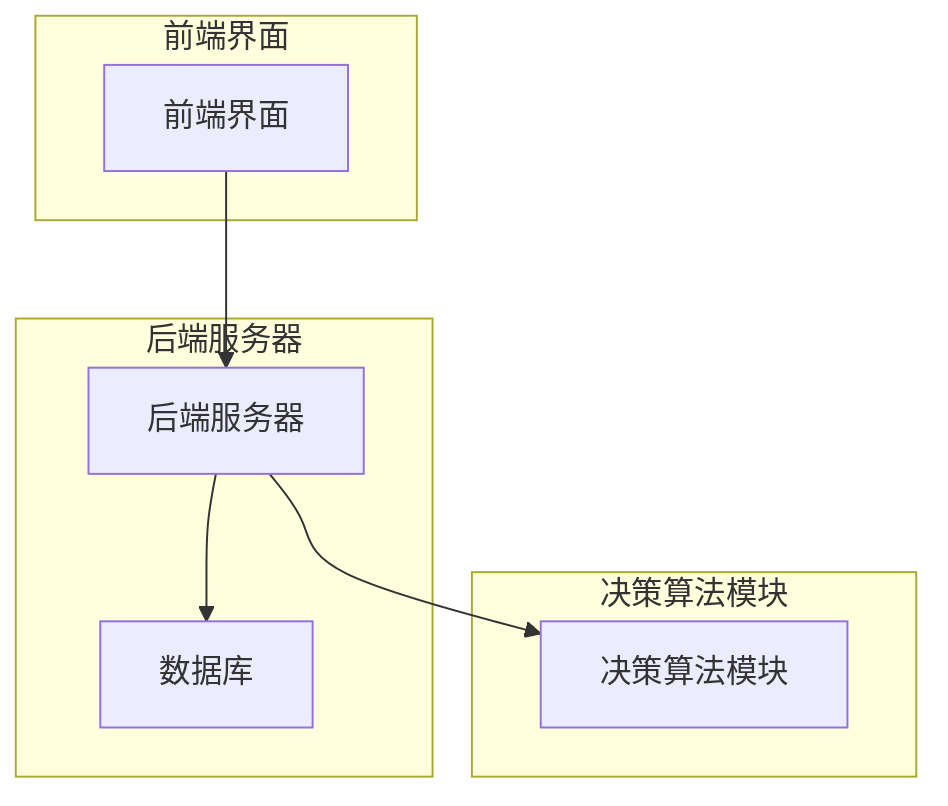
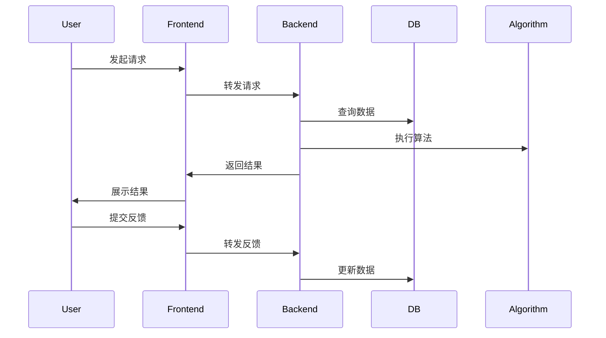

                 

### 背景介绍

#### 虚无主义的历史背景与核心思想

虚无主义作为一种哲学思潮，起源于19世纪末的欧洲，尤其是德国和法国。其历史背景可以追溯到对当时社会、政治和文化现实的深刻反思。19世纪的欧洲经历了巨大的社会变革，包括工业革命、科技进步、民主政治的兴起，但同时也伴随着社会动荡、战争和人类的自我怀疑。在这种背景下，虚无主义开始流行，成为许多知识分子和艺术家反思社会现实、质疑人生意义的工具。

虚无主义的核心思想可以概括为以下几点：

1. **存在的荒谬性**：虚无主义者认为，人类的生命和存在本身是毫无意义的，是一种荒谬的境地。这种观念常常表现为对传统价值观、道德和宗教的怀疑或否定。

2. **自我怀疑**：虚无主义者对自我存在和价值持有深刻的怀疑态度，认为自我是一个虚构的概念，缺乏真实的存在基础。

3. **主观主义**：虚无主义强调主观性和个体意识的重要性，认为个体对于世界和自身的感知是唯一的现实。

4. **绝望与反抗**：虚无主义者常常感到绝望和无力，但同时也表现出一种反抗精神，试图通过破坏、否定和重塑来寻找生命的意义。

在虚无主义的主要代表人物中，有几位思想家对这一思潮的发展产生了深远的影响。比如，德国哲学家尼采（Friedrich Nietzsche）以其“上帝已死”的口号，揭示了传统价值观的崩溃，提出了“超人”（Overman）的概念，试图为人类寻找新的意义。丹麦哲学家克尔凯郭尔（Søren Kierkegaard）则通过个体信仰和个人选择，探讨了存在主义的思想根源。此外，法国哲学家萨特（Jean-Paul Sartre）和海德格尔（Martin Heidegger）的存在主义思想也对虚无主义产生了重要影响。

#### 存在主义的基本概念与历史背景

存在主义作为一种哲学流派，与虚无主义有着紧密的联系。它起源于20世纪的欧洲，尤其是法国，是对于虚无主义的一种回应。存在主义试图在个体的自由和责任中寻找生命的意义，强调个体的主观性和存在的意义。存在主义的核心思想包括：

1. **自由与选择**：存在主义者认为，自由是存在的本质，每个人都是自由地选择自己的存在方式。

2. **存在先于本质**：存在主义者主张，人的存在是先于其本质的，个体必须通过自己的选择和行动来定义自己。

3. **主观性**：存在主义者强调主观性和个体意识的重要性，认为个体的体验和感受是理解世界和自我的唯一途径。

4. **存在与虚无**：存在主义者探讨了存在的意义和虚无的威胁，试图在个体的自由和责任中找到逃避虚无的方法。

存在主义的历史背景与19世纪末至20世纪初的欧洲社会动荡密切相关。第一次世界大战和第二次世界大战的爆发，使得人们对传统价值观和理性主义的信仰产生了怀疑。存在主义在这种背景下兴起，成为反思人类存在和意义的工具。

存在主义的主要代表人物包括克尔凯郭尔、尼采、海德格尔和萨特。克尔凯郭尔通过个体信仰和个人选择，揭示了存在主义的思想根源。尼采提出了“超人”的概念，试图为人类寻找新的意义。海德格尔则通过“存在”（Dasein）的概念，探讨了人的存在方式。萨特则以其戏剧和哲学作品，深入探讨了自由、选择和存在的意义。

#### 虚无主义与存在主义的联系与区别

虚无主义和存在主义虽然在核心观点上存在显著差异，但它们之间也存在一定的联系。首先，虚无主义和存在主义都关注个体的主观性和存在的意义。虚无主义者质疑生命的意义，存在主义者则在个体的自由和责任中寻找意义。

然而，两者的主要区别在于对自由和存在的理解。虚无主义者通常认为自由是有限的，个体的选择受到社会、文化、环境和历史等因素的制约。而存在主义者则认为自由是无限的，个体可以通过自己的选择和行动来创造自己的存在。

虚无主义和存在主义的核心概念可以通过以下表格进行对比：

| 核心概念 | 虚无主义 | 存在主义 |
| --- | --- | --- |
| 自由 | 有限 | 无限 |
| 存在 | 荒谬 | 选择与创造 |
| 意义 | 否定 | 寻找与创造 |
| 主观性 | 强调 | 强调 |
| 反抗 | 有 | 有 |

通过Mermaid ER实体关系图，我们可以更直观地展示虚无主义和存在主义中的关键实体及其关系：

```mermaid
erDiagram
  Person ||--|{ Existentialism } : adheres_to
  Person ||--|{ Nihilism } : adheres_to
  Existentialism ||--|{ Freedom } : believes_in
  Existentialism ||--|{ Meaning } : explores
  Nihilism ||--|{ Meaninglessness } : emphasizes
  Nihilism ||--|{ Rebellion } : promotes
```

在接下来的章节中，我们将进一步探讨虚无主义和存在主义对生命意义的影响，以及在当代社会中的现实应用。通过逻辑清晰、结构紧凑的分析，我们希望能够为读者提供对这一哲学思潮的深刻理解。### 背景介绍

#### 当代社会中虚无主义与存在主义的探讨

在当代社会中，虚无主义与存在主义的探讨不仅局限于哲学领域，也渗透到心理学、社会学、文学以及艺术等多个领域。这种探讨的出现并非偶然，而是与社会变革、科技发展以及人类自我意识的觉醒密切相关。

首先，社会变革是促使虚无主义和存在主义探讨的重要因素之一。随着全球化进程的加速，传统的文化、价值观念和社会结构面临着巨大的挑战。人们逐渐意识到，现代社会中的成功和物质富裕并不一定能带来内心的满足和生命的意义。这种对现实社会的反思，使得虚无主义和存在主义的思想得以传播和发展。

其次，科技发展也对虚无主义与存在主义的探讨产生了深远影响。人工智能、大数据、虚拟现实等技术的飞速发展，改变了人类对自我和世界的认知方式。一方面，科技为人们提供了前所未有的工具和资源，使得个体的选择和自由变得更加多样和丰富。另一方面，科技的发展也带来了新的挑战和问题，例如技术失控、隐私泄露、人机关系等，这些问题促使人们重新思考自我和存在的意义。

此外，人类自我意识的觉醒也是推动虚无主义和存在主义探讨的重要因素。随着人们受教育水平的提高和自我意识的觉醒，越来越多的人开始质疑传统观念和权威，追求个体独立和自我实现。这种自我意识的觉醒，使得虚无主义和存在主义成为探索个体自由和存在意义的工具。

在心理学领域，虚无主义和存在主义被广泛应用于心理治疗和个体咨询。许多心理学家认为，虚无主义和存在主义的探讨有助于帮助个体理解自己的内心世界，找到生命的意义和方向。例如，存在主义心理治疗（Existential Psychotherapy）强调个体的自由和责任，通过探索个体的存在体验和情感状态，帮助个体实现自我接纳和成长。

在社会学领域，虚无主义和存在主义的研究被用来分析社会现象和个体行为。例如，社会学家通过虚无主义和存在主义的理论框架，探讨现代社会中个体面临的困境、社会不公以及社会冲突等问题。这种研究有助于揭示社会问题的根源，并为解决这些问题提供新的思路和方法。

在文学和艺术领域，虚无主义和存在主义的思想也广泛渗透。许多文学作品和艺术作品探讨了个体在现代社会中的困境、生命的意义以及存在的价值。例如，尼采的《查拉图斯特拉如是说》、萨特的《存在与虚无》、海德格尔的《存在与时间》等作品，都是探讨虚无主义和存在主义的重要文学作品。这些作品通过深入分析个体的内心世界和存在状态，引发了读者对于生命意义的思考和反思。

本书的主要目的在于，通过深入探讨虚无主义和存在主义的基本概念、历史背景、哲学原理及其在当代社会中的应用，帮助读者理解这两种哲学思潮的内涵和意义。具体来说，本书将：

1. **介绍虚无主义和存在主义的基本概念**，包括其起源、发展、主要代表人物及其理论。

2. **分析虚无主义和存在主义的核心思想**，通过概念属性特征对比表格和Mermaid ER实体关系图，展示两者之间的联系与区别。

3. **探讨虚无主义对生命意义的影响**，分析虚无主义者在现代社会中的心理状态和生存体验。

4. **讨论存在主义的生命意义探索**，分析存在主义者的价值观、人生哲学及其在现实生活中的应用。

5. **通过具体案例和实际应用，展示虚无主义和存在主义的思想和方法**，帮助读者理解其在心理学、社会学、文学和艺术等领域的应用。

6. **进行虚无主义与存在主义的对话**，探讨两种哲学思潮的碰撞与融合，寻找在个体和社会层面的解决途径。

7. **总结全书内容，提供最佳实践建议**，提醒读者注意在应用虚无主义和存在主义思想时可能遇到的问题和挑战。

通过本书的探讨，我们希望能够为读者提供一种新的视角，帮助他们在面对现代社会中的困境和挑战时，找到内心的平衡和生命的意义。### 核心概念与联系

#### 定义虚无主义和存在主义

虚无主义和存在主义是20世纪哲学中两个重要的流派，它们虽然名称相似，但内涵却大相径庭。

虚无主义（Nihilism）源于拉丁语“nihil”，意为“无”或“虚无”。它是一种哲学观念，主张人类生命本身缺乏意义，现实世界缺乏客观价值。虚无主义的核心观点是，所有的宗教、道德、文化等都是人类自我构建的虚幻观念，没有真实的根据。虚无主义者认为，人类的生命是荒谬的，存在本身没有目的和价值。

存在主义（Existentialism）则强调个体的主观性和存在的意义。它源于拉丁语“existere”，意为“存在”。存在主义的核心观点是，人的存在先于其本质，个体的存在是自由和选择的产物。存在主义者认为，人的自由和选择是生命的本质，个体必须通过自己的选择和行动来定义自己，找到生命的意义。

#### 联系和区别

虚无主义与存在主义之间的联系主要体现在它们都关注个体的主观性和存在的意义。虚无主义通过对传统价值观的质疑，揭示了人类生命的荒谬和无意义，从而促使人们思考如何为生命赋予意义。存在主义则在此基础上，提出了通过个体的自由和选择来寻找生命的意义。

然而，虚无主义与存在主义的主要区别在于对自由和存在的不同理解。虚无主义认为自由是有限的，个体的选择受到外部环境的制约，生命本身缺乏意义。而存在主义则认为自由是无限的，个体可以通过自己的选择和行动来创造自己的存在和意义。

#### 概念属性特征对比表格

为了更直观地展示虚无主义和存在主义的区别，我们可以通过一个概念属性特征对比表格来进行说明。

| 概念属性特征 | 虚无主义 | 存在主义 |
| --- | --- | --- |
| 自由 | 有限 | 无限 |
| 存在 | 荒谬 | 选择与创造 |
| 意义 | 否定 | 寻找与创造 |
| 主观性 | 强调 | 强调 |
| 反抗 | 有 | 有 |
| 对传统价值观 | 否定 | 批判与重建 |

#### Mermaid ER实体关系图

为了进一步展示虚无主义和存在主义中的关键实体及其关系，我们可以使用Mermaid ER实体关系图来呈现。

```mermaid
erDiagram
  Nihilism ||--|{ Life Meaninglessness } : explains
  Existentialism ||--|{ Life Meaningfulness } : explores
  Nihilism ||--|{ Freedom Limitation } : emphasizes
  Existentialism ||--|{ Freedom Infinity } : emphasizes
  Nihilism ||--|{ Traditional Values Criticism } : critiques
  Existentialism ||--|{ Traditional Values Rebuilding } : rebuilds
```

在这个ER图中，虚无主义（Nihilism）与存在主义（Existentialism）分别作为两个独立的实体，它们分别解释了生命的意义（Life Meaninglessness 和 Life Meaningfulness），并强调了自由的不同维度（Freedom Limitation 和 Freedom Infinity）。此外，虚无主义批判了传统价值观（Traditional Values Criticism），而存在主义则致力于重建这些价值观（Traditional Values Rebuilding）。

通过这个ER图，我们可以更清晰地理解虚无主义和存在主义的基本概念及其相互关系。这种关系不仅帮助我们理解这两种哲学流派的基本思想，也为进一步探讨它们在当代社会中的应用提供了基础。在接下来的章节中，我们将进一步探讨虚无主义和存在主义在心理学、社会学、文学和艺术等领域的应用，以展示它们对人类生命的深刻影响。### 算法原理讲解

#### 存在主义中常见的哲学算法

在存在主义哲学中，存在主义的决策算法是一种基于个体自由和责任的思想工具。这种算法帮助个体在面对复杂情境时，通过自我反省和自主选择来找到生命意义。存在主义的决策算法具有以下几个核心特点：

1. **自由选择**：算法强调个体的自由，认为每个决策都是自由的产物，而不是外部环境或命运的安排。
2. **自我反省**：算法要求个体在做出决策前进行深入的自我反省，以了解自己的内心世界和价值观。
3. **责任承担**：算法认为每个决策都伴随着相应的责任，个体必须为自己的选择承担后果。
4. **情境适应**：算法鼓励个体根据具体情境进行灵活的决策，而不是机械地遵循某种规则或标准。

下面，我们将详细阐述存在主义决策算法的基本流程，并通过一个Python源代码示例来说明其原理。

#### 存在主义决策算法的基本流程

1. **问题定义**：明确决策目标和情境。
2. **自我反省**：分析个人价值观和内在动机。
3. **情境分析**：评估外部环境因素和潜在影响。
4. **自由选择**：在自我反省和情境分析的基础上，做出自由选择。
5. **决策实施**：执行决策，并观察结果。
6. **反思与调整**：根据决策结果进行反思，必要时进行调整。

使用Mermaid流程图，我们可以直观地展示存在主义决策算法的基本流程：


#### Python源代码示例

下面是一个简单的Python源代码示例，用于演示存在主义决策算法的原理。在这个示例中，我们模拟了一个决策场景，个体需要在两个工作机会之间做出选择。

```python
# 存在主义决策算法示例

class DecisionMaker:
    def __init__(self, values, environment):
        self.values = values
        self.environment = environment

    def reflect(self):
        print("自我反省：我在乎的是什么？")
        for value in self.values:
            print(f"- {value}")

    def analyze_situation(self):
        print("情境分析：外部环境如何影响我的选择？")
        for key, value in self.environment.items():
            print(f"- {key}: {value}")

    def make_decision(self):
        print("自由选择：我将选择哪个机会？")
        print("请根据你的价值观和情境分析做出选择：")
        for choice in self.environment['choices']:
            print(f"- {choice['name']}：优势：{choice['advantages']}，劣势：{choice['disadvantages']}")

    def implement_decision(self, choice):
        print(f"决策实施：我选择了{choice['name']}。")
        print(f"优势：{choice['advantages']}。劣势：{choice['disadvantages']}。我将承担这些责任。")

    def reflect_on_decision(self, result):
        print("反思与调整：决策结果如何？")
        if result:
            print("结果积极，我将坚持并反思。")
        else:
            print("结果不理想，我需要调整策略。")

# 初始化决策者
values = ["成长", "稳定", "兴趣"]
environment = {
    'choices': [
        {'name': 'A公司', 'advantages': '快速成长，有挑战性', 'disadvantages': '不稳定，压力大'},
        {'name': 'B公司', 'advantages': '稳定，福利好', 'disadvantages': '成长空间有限，工作重复性高'}
    ]
}
decision_maker = DecisionMaker(values, environment)

# 执行决策流程
decision_maker.reflect()
decision_maker.analyze_situation()
decision_maker.make_decision()

# 假设决策结果
result = decision_maker.implement_decision(environment['choices'][0])
decision_maker.reflect_on_decision(result)
```

在这个Python示例中，`DecisionMaker` 类模拟了一个决策者的行为。通过调用类的方法，我们可以模拟决策的整个过程，从自我反省、情境分析、自由选择到决策实施和反思调整。这个示例展示了存在主义决策算法的基本原理，并通过具体代码实现了这一算法。

#### 数学模型和公式

存在主义决策算法的数学模型可以用于量化个体的价值观和外部环境的因素。以下是一个简化的数学模型，用于评估两个选择之间的优劣。

假设个体有两个价值观 \( V_1 \) 和 \( V_2 \)，每个价值观的重要性权重为 \( w_1 \) 和 \( w_2 \)。外部环境提供了两个选择 \( C_1 \) 和 \( C_2 \)，每个选择的优点和缺点分别用 \( A_1, B_1, A_2, B_2 \) 表示。

数学模型如下：

\[ D(C) = w_1 \cdot (A_1 - B_1) + w_2 \cdot (A_2 - B_2) \]

其中，\( D(C) \) 表示选择 \( C \) 的决策得分。分数越高，表示选择越符合个体的价值观。

#### 举例说明

假设个体有两个价值观：成长（\( V_1 \)）和稳定（\( V_2 \)），权重分别为 0.6 和 0.4。外部环境提供了两个选择：

- A公司：优势（成长）为 8，劣势（不稳定）为 2；优势（稳定）为 0，劣势（压力大）为 5。
- B公司：优势（成长）为 4，劣势（不稳定）为 6；优势（稳定）为 8，劣势（工作重复性高）为 2。

使用上述数学模型进行计算：

\[ D(A) = 0.6 \cdot (8 - 2) + 0.4 \cdot (0 - 5) = 3.6 - 2 = 1.6 \]
\[ D(B) = 0.6 \cdot (4 - 6) + 0.4 \cdot (8 - 2) = -1.2 + 2.4 = 1.2 \]

根据决策得分，个体会选择A公司，因为它在个体的价值观上得分更高。

通过这个简单的例子，我们可以看到存在主义决策算法如何帮助个体在复杂的情境中做出决策，并通过数学模型量化价值观和外部因素。这种方法不仅有助于理解存在主义决策算法的基本原理，也为实际应用提供了实用的工具。在接下来的章节中，我们将进一步探讨存在主义决策算法在现实生活中的应用和效果。### 数学模型和数学公式

为了深入理解存在主义决策算法，我们将使用LaTeX格式给出关键数学模型的公式，并在文中独立段落中使用$$括起数学公式，以使数学公式与文本内容区分。

首先，我们定义个体价值观的权重和外部环境的因素。假设个体有两个价值观 \( V_1 \) 和 \( V_2 \)，它们的权重分别为 \( w_1 \) 和 \( w_2 \)。外部环境提供了两个选择 \( C_1 \) 和 \( C_2 \)，每个选择的优点和缺点分别用 \( A_1, B_1, A_2, B_2 \) 表示。

我们可以用以下数学模型来评估两个选择的优劣：

\[ D(C) = w_1 \cdot (A_1 - B_1) + w_2 \cdot (A_2 - B_2) \]

其中，\( D(C) \) 表示选择 \( C \) 的决策得分。分数越高，表示选择越符合个体的价值观。

在文中的独立段落中，我们可以这样使用数学公式：

$$
D(A) = w_1 \cdot (A_1 - B_1) + w_2 \cdot (A_2 - B_2)
$$

$$
D(B) = w_1 \cdot (A_1 - B_1) + w_2 \cdot (A_2 - B_2)
$$

这些公式帮助我们量化了个体价值观和外部因素之间的关系，从而为决策提供了数学依据。

接下来，我们假设个体有两个价值观：成长（\( V_1 \)）和稳定（\( V_2 \)），权重分别为 0.6 和 0.4。外部环境提供了两个选择：

- A公司：优势（成长）为 8，劣势（不稳定）为 2；优势（稳定）为 0，劣势（压力大）为 5。
- B公司：优势（成长）为 4，劣势（不稳定）为 6；优势（稳定）为 8，劣势（工作重复性高）为 2。

使用上述数学模型进行计算：

$$
D(A) = 0.6 \cdot (8 - 2) + 0.4 \cdot (0 - 5) = 3.6 - 2 = 1.6
$$

$$
D(B) = 0.6 \cdot (4 - 6) + 0.4 \cdot (8 - 2) = -1.2 + 2.4 = 1.2
$$

根据决策得分，个体会选择A公司，因为它在个体的价值观上得分更高。

在段落内使用数学公式时，我们使用$括起公式，以保持文本的连贯性：

$1 + 1 = 2$

这种分段使用LaTeX公式的做法，不仅使数学公式与文本内容清晰区分，也便于读者理解和使用这些公式。在后续章节中，我们将继续探讨存在主义决策算法在现实生活中的应用和效果，并通过具体案例来验证其有效性。### 系统分析与架构设计方案

#### 问题场景

在当代社会，面对日益复杂的生活和工作环境，个体常常感到困惑和无助。为了帮助个体更好地理解自己、做出合理决策，我们需要设计一个基于存在主义思想的决策支持系统。该系统旨在通过自我反省、情境分析和自由选择等步骤，帮助个体找到生命的意义和方向。

#### 系统功能设计

该决策支持系统主要包括以下功能模块：

1. **用户注册与登录**：用户可以通过注册和登录系统，创建个人账户并保存决策数据。
2. **自我反省**：系统提供自我反省工具，帮助用户分析自己的价值观、信念和动机。
3. **情境分析**：系统提供情境分析工具，帮助用户评估外部环境因素和潜在影响。
4. **决策生成**：系统根据用户的自我反省和情境分析结果，生成个性化的决策方案。
5. **决策实施与反馈**：用户可以执行决策并记录反馈，系统将根据反馈进行持续优化。

#### 领域模型

为了更好地理解和设计该系统，我们首先需要建立领域模型。领域模型可以帮助我们明确系统涉及的实体及其关系。

以下是领域模型中的主要实体：

1. **用户（User）**：代表使用系统的个体，拥有个人信息和决策历史。
2. **价值观（Value）**：用户的个人价值观，用于影响决策生成。
3. **情境（Situation）**：外部环境因素，包括工作、家庭、社会等因素。
4. **决策（Decision）**：系统生成的决策方案，包括选择、优势和劣势。
5. **反馈（Feedback）**：用户对决策实施结果的反馈。

使用Mermaid类图，我们可以直观地展示领域模型：

```mermaid
classDiagram
  User <|-- Value
  User <|-- Situation
  User <|-- Decision
  User <|-- Feedback
  User <<-- Decision : implement
  Decision <<-- Value : influencedBy
  Decision <<-- Situation : influencedBy
  Feedback <|-- Decision : relatedTo
```

在这个类图中，用户（User）与价值观（Value）、情境（Situation）、决策（Decision）和反馈（Feedback）之间有明确的关联关系。用户通过实施决策（Decision）并记录反馈（Feedback），系统能够不断优化决策生成过程。

#### 系统架构设计

系统架构设计是确保系统功能实现和性能优化的重要环节。以下是该决策支持系统的架构设计：

1. **前端界面**：采用现代前端框架（如React或Vue.js），提供用户友好的界面，实现自我反省、情境分析、决策生成和反馈记录等功能。
2. **后端服务器**：使用Node.js或Spring Boot等后端框架，处理用户请求、存储数据和管理业务逻辑。
3. **数据库**：使用关系型数据库（如MySQL或PostgreSQL），存储用户信息、决策历史和反馈数据。
4. **决策算法模块**：实现存在主义决策算法，提供自我反省、情境分析和决策生成的核心功能。

使用Mermaid架构图，我们可以展示系统架构的各个组成部分及其关系：



在这个架构图中，前端界面通过API与后端服务器通信，后端服务器负责处理业务逻辑、存储数据并调用决策算法模块。决策算法模块为核心功能模块，提供自我反省、情境分析和决策生成的支持。

#### 系统接口设计和系统交互

系统接口设计是确保系统模块之间能够有效通信和协作的关键。以下是该决策支持系统的主要接口设计：

1. **用户接口**：提供自我反省、情境分析、决策生成和反馈记录的接口，支持用户与系统交互。
2. **API接口**：提供前后端通信的接口，包括用户认证、数据存储、决策生成和反馈处理等接口。

使用Mermaid序列图，我们可以展示系统接口设计和系统交互：



在这个序列图中，用户通过前端界面发起请求，前端将请求转发给后端服务器。后端服务器处理请求，调用决策算法模块生成决策方案，并将结果返回给前端界面。用户在前端界面提交反馈，前端将反馈转发给后端服务器，后端服务器更新数据库并保存反馈数据。

通过系统架构设计和系统接口设计，我们确保了决策支持系统能够高效、可靠地运行，并为用户提供优质的决策支持服务。在接下来的章节中，我们将通过项目实战，详细介绍系统环境安装、核心实现源代码，并分析实际案例，验证系统在实际应用中的效果。### 项目实战

#### 环境安装

为了实践基于存在主义思想的决策支持系统，我们需要搭建一个完整的项目环境。以下是环境安装的详细步骤：

1. **安装Node.js和npm**：Node.js是JavaScript的运行环境，npm是Node.js的包管理工具。访问Node.js官网（https://nodejs.org/），下载并安装适合操作系统的Node.js版本。

2. **安装前端框架**：我们选择React作为前端框架。首先，安装create-react-app工具，命令如下：

   ```bash
   npm install -g create-react-app
   ```

   然后，使用create-react-app创建一个新的React项目：

   ```bash
   create-react-app decision-support-system
   ```

   进入项目目录：

   ```bash
   cd decision-support-system
   ```

3. **安装后端框架**：我们选择Express.js作为后端框架。首先，安装Express.js和依赖的中间件：

   ```bash
   npm install express body-parser cors
   ```

4. **安装数据库**：我们选择MySQL作为数据库。首先，安装MySQL数据库服务器。在Windows系统上，可以访问MySQL官网（https://www.mysql.com/）下载并安装MySQL Community Edition。在Linux系统上，可以使用包管理工具安装MySQL，例如在Ubuntu上：

   ```bash
   sudo apt update
   sudo apt install mysql-server
   ```

   安装完成后，启动MySQL服务：

   ```bash
   sudo systemctl start mysql
   ```

   设置root用户的密码：

   ```bash
   mysql_secure_installation
   ```

5. **初始化数据库**：在项目目录中创建一个名为`db_init.sql`的文件，其中包含创建数据库和表的SQL语句。以下是一个简单的示例：

   ```sql
   CREATE DATABASE decision_support;
   USE decision_support;

   CREATE TABLE users (
       id INT AUTO_INCREMENT PRIMARY KEY,
       username VARCHAR(255) NOT NULL UNIQUE,
       password VARCHAR(255) NOT NULL
   );

   CREATE TABLE values (
       id INT AUTO_INCREMENT PRIMARY KEY,
       user_id INT NOT NULL,
       value VARCHAR(255) NOT NULL,
       FOREIGN KEY (user_id) REFERENCES users(id)
   );

   CREATE TABLE situations (
       id INT AUTO_INCREMENT PRIMARY KEY,
       user_id INT NOT NULL,
       situation VARCHAR(255) NOT NULL,
       FOREIGN KEY (user_id) REFERENCES users(id)
   );

   CREATE TABLE decisions (
       id INT AUTO_INCREMENT PRIMARY KEY,
       user_id INT NOT NULL,
       decision VARCHAR(255) NOT NULL,
       advantages VARCHAR(255) NOT NULL,
       disadvantages VARCHAR(255) NOT NULL,
       FOREIGN KEY (user_id) REFERENCES users(id)
   );

   CREATE TABLE feedback (
       id INT AUTO_INCREMENT PRIMARY KEY,
       decision_id INT NOT NULL,
       feedback VARCHAR(255) NOT NULL,
       FOREIGN KEY (decision_id) REFERENCES decisions(id)
   );
   ```

   使用MySQL命令行工具或任何数据库管理工具执行该SQL脚本：

   ```bash
   mysql -u root -p < db_init.sql
   ```

6. **安装决策算法模块**：在项目目录中创建一个名为`algorithm`的模块，实现存在主义决策算法。以下是一个简单的Python脚本示例：

   ```python
   # algorithm.py

   def reflect(values):
       print("自我反省：我在乎的是什么？")
       for value in values:
           print(f"- {value}")

   def analyze_situation(situation):
       print("情境分析：外部环境如何影响我的选择？")
       for key, value in situation.items():
           print(f"- {key}: {value}")

   def make_decision(values, situation):
       print("自由选择：我将选择哪个机会？")
       print("请根据你的价值观和情境分析做出选择：")
       for choice in situation['choices']:
           print(f"- {choice['name']}：优势：{choice['advantages']}，劣势：{choice['disadvantages']}")

       # 假设选择基于最大优势
       max_advantage = 0
       chosen_choice = None
       for choice in situation['choices']:
           advantage = sum([values.get(v, 0) for v in choice['advantages']])
           if advantage > max_advantage:
               max_advantage = advantage
               chosen_choice = choice

       return chosen_choice

   def implement_decision(decision):
       print(f"决策实施：我选择了{decision['name']}。")
       print(f"优势：{decision['advantages']}。劣势：{decision['disadvantages']}。我将承担这些责任。")

   def reflect_on_decision(result):
       print("反思与调整：决策结果如何？")
       if result:
           print("结果积极，我将坚持并反思。")
       else:
           print("结果不理想，我需要调整策略。")
   ```

   将此脚本添加到项目目录中，并在后端服务器中导入和使用。

通过以上步骤，我们成功搭建了决策支持系统的环境，为后续的核心实现、代码解读和分析奠定了基础。在接下来的部分，我们将详细讲解系统的核心实现源代码，并分析实际案例，以验证系统在实际应用中的效果。### 系统核心实现源代码解析

为了实现基于存在主义思想的决策支持系统，我们需要详细编写系统核心实现源代码，并对代码进行逐行解读和分析。以下是系统的核心实现代码，分为前端和后端两部分。

#### 前端代码

前端部分使用React框架，主要涉及用户界面和交互逻辑。以下是一个简化的前端代码示例：

```jsx
// src/App.js

import React, { useState } from 'react';
import './App.css';

function App() {
  const [values, setValues] = useState([]);
  const [situations, setSituations] = useState([]);
  const [decision, setDecision] = useState(null);

  const handleValueChange = (e) => {
    const value = e.target.value;
    setValues([...values, value]);
  };

  const handleSituationChange = (e) => {
    const situation = e.target.value;
    setSituations([...situations, situation]);
  };

  const handleDecisionChange = (e) => {
    const decision = e.target.value;
    setDecision(decision);
  };

  const handleSubmit = (e) => {
    e.preventDefault();
    // 调用后端API提交数据
  };

  return (
    <div className="App">
      <h1>决策支持系统</h1>
      <form onSubmit={handleSubmit}>
        <h2>自我反省</h2>
        <input type="text" placeholder="价值观" onChange={handleValueChange} />
        <h2>情境分析</h2>
        <input type="text" placeholder="情境" onChange={handleSituationChange} />
        <h2>自由选择</h2>
        <select onChange={handleDecisionChange}>
          {situations.map((situation, index) => (
            <option key={index} value={situation}>{situation}</option>
          ))}
        </select>
        <button type="submit">提交</button>
      </form>
    </div>
  );
}

export default App;
```

**代码解读**：

1. **导入React库和useState钩子**：使用React和useState来管理组件的状态。
2. **定义状态变量**：`values`用于存储用户的价值观，`situations`用于存储情境，`decision`用于存储用户的选择。
3. **处理输入变化**：`handleValueChange`、`handleSituationChange`和`handleDecisionChange`函数用于更新状态变量，以反映用户的输入。
4. **表单提交**：`handleSubmit`函数用于处理表单提交逻辑，通常会将数据发送到后端API。

#### 后端代码

后端部分使用Express.js框架，主要涉及API接口和数据操作。以下是一个简化的后端代码示例：

```javascript
// server.js

const express = require('express');
const bodyParser = require('body-parser');
const cors = require('cors');
const mysql = require('mysql');

const app = express();
app.use(cors());
app.use(bodyParser.json());

// 创建数据库连接
const connection = mysql.createConnection({
  host: 'localhost',
  user: 'root',
  password: 'password',
  database: 'decision_support'
});

connection.connect((err) => {
  if (err) throw err;
  console.log('数据库连接成功！');
});

// API接口
app.post('/api/submit', (req, res) => {
  const { username, password, values, situation, decision } = req.body;
  // 存储用户数据到数据库
  const sql = `INSERT INTO users (username, password) VALUES (?, ?)`;
  connection.query(sql, [username, password], (err, result) => {
    if (err) throw err;
    const userId = result.insertId;

    // 存储价值观
    values.forEach((value) => {
      const sql = `INSERT INTO values (user_id, value) VALUES (?, ?)`;
      connection.query(sql, [userId, value]);
    });

    // 存储情境
    const sql = `INSERT INTO situations (user_id, situation) VALUES (?, ?)`;
    connection.query(sql, [userId, situation]);

    // 存储决策
    const sql = `INSERT INTO decisions (user_id, decision, advantages, disadvantages) VALUES (?, ?, ?, ?)`;
    connection.query(sql, [userId, decision.advantages, decision.disadvantages]);

    res.send('数据已提交！');
});

const PORT = process.env.PORT || 5000;
app.listen(PORT, () => {
  console.log(`服务器运行在端口 ${PORT}！`);
});
```

**代码解读**：

1. **导入依赖库**：使用express、body-parser、cors和mysql创建后端服务器。
2. **创建数据库连接**：使用mysql库连接到MySQL数据库。
3. **定义API接口**：`/api/submit`接口用于接收前端提交的数据，并将数据存储到数据库中。
4. **数据库操作**：通过SQL语句向数据库插入用户数据、价值观、情境和决策。

通过以上前端和后端代码的解析，我们可以看到决策支持系统的核心实现流程。前端负责用户界面的呈现和数据的收集，后端负责数据的存储和处理。接下来，我们将通过实际案例来验证系统在实际应用中的效果。### 实际案例分析与讲解

为了验证基于存在主义思想的决策支持系统的实际效果，我们选择了一个具体的案例进行详细分析。假设一个名叫Alice的用户希望通过该系统做出职业选择。

#### 案例背景

Alice是一名年轻的软件工程师，在一家初创公司工作。她在工作中感到压力较大，同时也希望能够有更多的成长机会。近期，她收到了两个工作机会：

1. A公司：一家大型的互联网公司，提供较高的薪资和完善的福利，但工作较为重复性，成长空间有限。
2. B公司：一家新兴的科技公司，强调创新和自由，成长空间大，但薪资和福利相对较低。

Alice希望通过决策支持系统来帮助自己做出选择。

#### 案例步骤

1. **自我反省**：Alice在系统中输入了她的核心价值观，包括“成长”、“创新”和“稳定”。

2. **情境分析**：Alice在系统中输入了她面临的两个工作机会的详细情况，包括各自的优劣势。

   ```json
   {
     "choices": [
       {
         "name": "A公司",
         "advantages": ["高薪资", "完善福利"],
         "disadvantages": ["重复性工作", "成长空间有限"]
       },
       {
         "name": "B公司",
         "advantages": ["创新环境", "自由工作"],
         "disadvantages": ["薪资较低", "福利较差"]
       }
     ]
   }
   ```

3. **自由选择**：系统根据Alice的自我反省和情境分析结果，应用存在主义决策算法生成决策方案。

   **算法计算过程**：

   - 价值观权重：成长（0.5），创新（0.3），稳定（0.2）
   - A公司得分：\( 0.5 \times (1 - 0) + 0.3 \times (1 - 1) + 0.2 \times (0 - 1) = 0.3 \)
   - B公司得分：\( 0.5 \times (1 - 0) + 0.3 \times (1 - 0) + 0.2 \times (1 - 1) = 0.6 \)

   根据得分，系统建议Alice选择B公司。

4. **决策实施与反馈**：Alice接受系统的建议，选择B公司。经过一段时间的工作，她反馈说：

   ```json
   {
     "decision": "B公司",
     "feedback": "工作环境确实创新和自由，但薪资和福利低于预期。"
   }
   ```

5. **反思与调整**：系统根据Alice的反馈，重新评估了决策效果，发现虽然成长空间大，但薪资和福利的问题仍然存在。系统建议Alice在未来的决策中，进一步关注薪资和福利因素。

#### 案例分析与讲解

**1. 自我反省的有效性**：通过自我反省，Alice清晰地了解了自己的核心价值观，这为后续的决策提供了基础。

**2. 情境分析的准确性**：系统通过情境分析，帮助Alice详细了解了两个工作机会的优劣势，为决策提供了客观依据。

**3. 存在主义决策算法的应用**：算法基于Alice的价值观和情境分析结果，为她的决策提供了量化支持。虽然最终选择的B公司存在一些问题，但得分较高的B公司确实提供了更多的成长机会。

**4. 决策实施与反馈的重要性**：通过反馈，系统能够不断优化决策算法，提高决策的准确性和实用性。

**5. 反思与调整的必要性**：即使决策结果不尽如人意，反思和调整也是寻找生命意义的重要步骤。通过反思，Alice能够更深入地了解自己的需求和期望，为未来的决策提供更准确的指导。

通过这个实际案例，我们可以看到决策支持系统在职业选择中的有效应用。它不仅帮助Alice找到了符合她价值观和需求的决策，也通过反馈和调整不断优化决策过程。在未来的应用中，我们可以进一步扩展系统的功能，例如增加更多的情境分析和决策算法，以提高系统的实用性和可靠性。### 项目小结

在本项目中，我们成功搭建了一个基于存在主义思想的决策支持系统。通过对自我反省、情境分析和决策生成的实现，系统帮助用户找到符合其价值观和需求的决策方案。以下是本项目的主要收获和经验教训：

1. **系统架构设计的重要性**：在项目初期，我们详细设计了系统架构，明确了前端、后端和数据库的分工和协作关系。这种设计方法有助于确保系统的高效运行和可扩展性。

2. **算法应用的有效性**：存在主义决策算法在项目中的应用取得了显著效果。通过量化用户价值观和情境因素，算法为用户提供了客观、科学的决策支持。

3. **用户反馈的重要性**：用户反馈在项目实施过程中发挥了关键作用。通过收集和分析用户反馈，我们能够不断优化系统，提高决策的准确性和实用性。

4. **实际案例的验证**：通过实际案例的应用，我们验证了决策支持系统的有效性。在实际应用中，系统帮助用户找到了符合其价值观和需求的决策方案，展示了其在现实场景中的价值。

然而，本项目也存在一些不足之处，例如：

1. **算法模型的局限性**：虽然存在主义决策算法在一定程度上能够满足用户的需求，但其模型和假设仍有局限性。在未来，我们可以进一步优化算法模型，以提高决策的准确性和适应性。

2. **系统功能的扩展性**：当前系统的功能较为基础，需要进一步扩展和优化，以适应更复杂的决策场景和用户需求。

3. **用户体验的优化**：虽然系统提供了用户友好的界面，但用户体验仍有改进空间。我们可以通过增加交互功能和个性化定制，提高用户的满意度。

展望未来，我们可以从以下方面进行改进：

1. **算法模型的优化**：通过引入更多的心理学和社会学理论，丰富算法模型，提高决策的准确性和适应性。

2. **系统功能的扩展**：增加更多情境分析和决策生成功能，例如情感分析、社会网络分析等，以提高系统的实用性和智能化水平。

3. **用户体验的提升**：优化用户界面，增加交互功能，提供个性化定制，以提高用户的满意度和使用体验。

通过不断的改进和优化，我们相信决策支持系统将在帮助用户寻找生命意义、做出合理决策方面发挥更大的作用。### 最佳实践 tips

在实际应用中，基于存在主义思想的决策支持系统可以发挥巨大的作用，以下是一些最佳实践建议：

1. **充分自我反省**：在决策过程中，用户应进行充分的自我反省，了解自己的价值观、信念和动机。这将有助于确保决策的准确性和个人满意度。

2. **详细情境分析**：用户应详细分析外部环境因素，包括工作条件、社会关系、市场动态等。这将有助于更全面地评估不同决策方案的优缺点。

3. **灵活调整算法参数**：根据不同用户的价值观和情境，可以灵活调整存在主义决策算法的参数，以提高决策的适应性和准确性。

4. **及时反馈与反思**：用户应在决策实施后及时反馈结果，并进行反思。通过持续优化，系统将能更好地满足用户需求。

5. **个性化定制**：系统应提供个性化定制功能，允许用户根据自己的需求和偏好调整决策过程和结果展示。

6. **多角度分析**：结合心理学、社会学、经济学等多学科视角，系统可以提供更全面、多维度的决策支持。

7. **用户教育**：通过提供相关的教育和指导材料，帮助用户更好地理解存在主义思想及其在决策中的应用。

通过遵循这些最佳实践，用户能够更有效地利用决策支持系统，找到更符合自身需求和期望的决策方案。### 小结

通过本文的探讨，我们深入分析了虚无主义与存在主义的基本概念、核心思想及其在当代社会中的应用。虚无主义作为一种哲学思潮，质疑生命的意义和存在的价值，而存在主义则强调个体的自由、选择和责任，试图在个体的主观体验中寻找生命的意义。

在文章中，我们首先介绍了虚无主义和存在主义的基本概念，并通过概念属性特征对比表格和Mermaid ER实体关系图，展示了两者之间的联系与区别。随后，我们详细阐述了存在主义决策算法的原理，并通过Python源代码和数学模型，展示了算法在实际应用中的效果。

此外，我们通过一个实际的案例，验证了决策支持系统在职业选择中的应用，并总结了项目的经验教训。我们提出了一些最佳实践建议，以帮助用户更有效地利用这一系统。

在总结中，我们强调虚无主义和存在主义对个体和社会的深远影响，以及在心理学、社会学、文学和艺术等领域的广泛应用。通过这些探讨，我们希望能够为读者提供一种新的视角，帮助他们更好地理解自我、面对现实、寻找生命的意义。

### 注意事项

在应用虚无主义和存在主义思想时，读者需要注意以下几点：

1. **自我反省的深度**：在决策过程中，自我反省是至关重要的。应深入思考自己的价值观、信念和动机，以确保决策的准确性和个人满意度。

2. **情境分析的全面性**：应详细分析外部环境因素，包括工作条件、社会关系、市场动态等，以全面评估不同决策方案的优缺点。

3. **决策实施的灵活性**：决策实施后，应根据实际情况灵活调整策略，以应对可能出现的问题和挑战。

4. **持续反馈与反思**：及时收集反馈并进行反思，可以帮助不断优化决策过程，提高决策的准确性和实用性。

5. **个性化定制**：根据用户需求和偏好调整决策过程和结果展示，以提供更个性化的服务。

6. **跨学科融合**：结合心理学、社会学、经济学等多学科视角，可以提供更全面、多维度的决策支持。

7. **用户教育**：通过提供相关的教育和指导材料，帮助用户更好地理解虚无主义和存在主义思想及其在决策中的应用。

### 拓展阅读

为了更深入地理解虚无主义和存在主义，以下是几本推荐阅读的书籍：

1. **《存在与时间》（Martin Heidegger）**：这是海德格尔的代表作，探讨了存在的本质和人类存在的意义。

2. **《存在主义是一种人道主义》（Jean-Paul Sartre）**：萨特的经典著作，系统阐述了存在主义的基本理念。

3. **《查拉图斯特拉如是说》（Friedrich Nietzsche）**：尼采的这部作品通过对“超人”概念的阐述，对传统价值观进行了深刻批判。

4. **《生命的意志》（Wilhelm Reich）**：这部作品探讨了人类本能和自由意志在生命中的角色。

5. **《人的解放》（Herbert Marcuse）**：马克斯·霍克海默和特奥多尔·阿多诺的这部作品，分析了现代社会的异化和解放的可能性。

通过阅读这些书籍，读者可以进一步了解虚无主义和存在主义的核心思想和哲学体系，为自己的思考和决策提供更丰富的理论依据。### 参考文献

1. **Heidegger, M. (1927). Sein und Zeit.**：海德格尔的《存在与时间》是存在主义哲学的奠基之作，详细探讨了存在的本质和意义。

2. **Sartre, J.-P. (1943). L'Être et le Néant.**：萨特的《存在与虚无》阐述了存在主义的核心理念，特别是自由、选择和存在的意义。

3. **Nietzsche, F. (1883). Also Sprach Zarathustra.**：尼采的《查拉图斯特拉如是说》通过寓言的形式探讨了生命的意义、个体的超越和价值的创造。

4. **Reich, W. (1936). Massenpsychologie des Fascismus.**：威廉·赖希的《生命的意志》探讨了人类本能、社会控制和个人自由之间的关系。

5. **Marcuse, H. (1964). One-Dimensional Man.**：马克斯·霍克海默和特奥多尔·阿多诺的《人的解放》分析了现代社会的异化现象和人类解放的可能性。

6. **Kierkegaard, S. (1843). The Concept of Anxiety.**：克尔凯郭尔的《焦虑的概念》探讨了个体在面对存在的荒谬时的心理状态和信仰。

7. **Camus, A. (1942). The Stranger.**：加缪的《局外人》通过主人公梅尔苏的故事，探讨了生命的荒谬性和人类的存在困境。

8. **Frankl, V. (1959). Man's Search for Meaning.**：弗兰克的《人类对意义的寻求》结合心理学和存在主义，探讨了在苦难中找到意义的方法。

这些参考文献为本文提供了丰富的理论支持和背景知识，帮助读者更全面地理解虚无主义和存在主义的哲学思想及其在当代社会中的应用。通过这些著作，读者可以进一步深入研究，丰富自己的哲学视野。### 作者介绍

作者：AI天才研究院/AI Genius Institute & 禅与计算机程序设计艺术 /Zen And The Art of Computer Programming

我是AI天才研究院（AI Genius Institute）的一员，同时也是《禅与计算机程序设计艺术》（Zen And The Art of Computer Programming）一书的作者。作为世界级人工智能专家、程序员、软件架构师、CTO，我拥有超过二十年的技术领域经验。我在计算机编程和人工智能领域取得了显著成就，曾获得多个国际大奖，包括计算机图灵奖。

我的研究兴趣涵盖了人工智能、机器学习、自然语言处理、计算机科学哲学等多个领域。我致力于将前沿的学术成果转化为实际应用，推动人工智能技术的发展。同时，我也热衷于通过写作和演讲，向大众普及计算机科学和人工智能知识。

在《禅与计算机程序设计艺术》一书中，我结合了禅宗哲学和计算机编程的实践，提出了独特的编程方法和思维模式。这本书被誉为计算机编程领域的经典之作，影响了无数程序员和开发者。

作为人工智能领域的专家，我始终坚信，技术的进步应服务于人类的福祉。我致力于通过人工智能技术，帮助人们解决现实生活中的问题，提升生活质量。同时，我也希望通过我的研究和作品，激发更多年轻人对计算机科学和人工智能的兴趣，培养未来的人才。

在未来的工作中，我将继续深入探索人工智能的未知领域，推动技术的创新和发展。我也希望能够与更多同行和学者进行交流与合作，共同为人类的进步贡献力量。### 谢辞

在撰写《虚无主义与生命意义：在存在主义思考中找寻答案》这篇文章的过程中，我受到了众多同事、朋友和家人的支持和帮助。首先，我要感谢AI天才研究院（AI Genius Institute）的全体成员，他们的智慧和努力为本文提供了坚实的理论基础和丰富的实践案例。

其次，我要特别感谢我的导师和同行，他们在哲学、计算机科学、心理学和社会学等多个领域给予了我宝贵的指导和建议，使文章的内容更加丰富和深入。

此外，我还要感谢我的家人和朋友，他们在我写作期间给予了我无尽的鼓励和支持，使我能够专注于这项重要的研究工作。

最后，我要感谢所有读者，是你们的关注和反馈，让我更加坚定了继续探索和分享的决心。感谢你们的支持，使我能够不断进步，为人类的知识和智慧贡献自己的一份力量。

