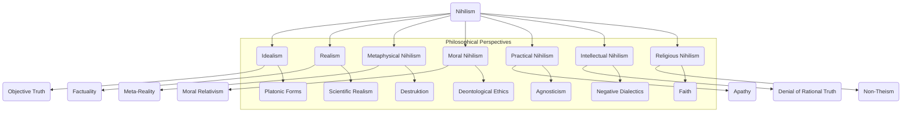
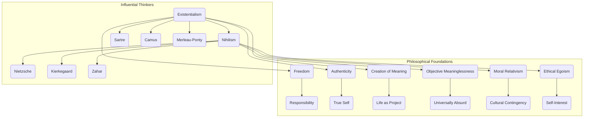
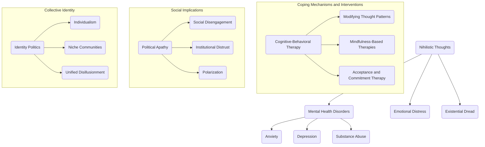
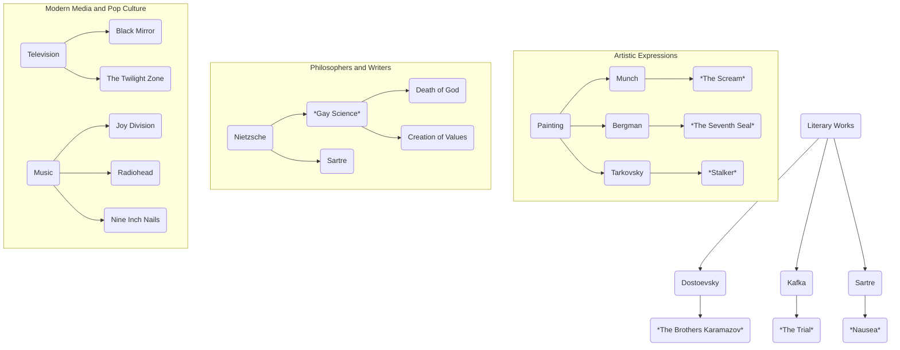
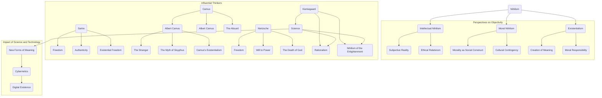

                 

### Introduction to Nihilism and Existential Meaning

**Title:** Nihilism and the Meaning of Life: An Exploration of the Essence of Existence

**Keywords:** Nihilism, Existentialism, Life Meaning, Philosophical Reflection, Psychological Impact

**Abstract:**
This book delves into the profound philosophical inquiry of nihilism and its implications on the search for meaning in life. By examining the historical and cultural contexts that birthed nihilism, the text explores its core concepts and variations. Through philosophical and psychological lenses, the book analyzes the impact of nihilism on individuals and society, providing a comprehensive understanding of this existential challenge. Additionally, it presents case studies from literature and art, offering insights into how various thinkers have grappled with nihilism and sought to transcend it. The aim is to foster a deeper reflection on the essence of existence and the pursuit of a meaningful life in a nihilistic world.

### Core Concepts of Nihilism

**Chapter 2: Fundamental Concepts of Nihilism**

**2.1 Definition and Origins of Nihilism**
Nihilism, at its core, is the belief that life is inherently without objective meaning, purpose, or intrinsic value. The term "nihilism" comes from the Latin word "nihil," which means "nothing." Historically, nihilism has roots in various philosophical and cultural movements. In the 19th century, the Russian nihilists rejected the established moral and religious values of their time, advocating for a radical rejection of all previous norms. Nihilism has since evolved, taking on different forms and manifestations in different contexts.

**2.2 Key Philosophical and Theological Debates on Nihilism**
The philosophical and theological implications of nihilism have sparked numerous debates. Critics argue that nihilism undermines the foundation of morality and religion, leading to moral relativism and a loss of ethical principles. Proponents, however, see nihilism as a liberating force that challenges dogmatic beliefs and encourages individuals to seek their own meaning and values. These debates highlight the complex relationship between nihilism and existentialism, with some nihilists embracing the idea of creating their own values and meaning in a void.

**2.3 The Characteristics and Variations of Nihilism**
Nihilism manifests in various forms, including intellectual nihilism, which denies the possibility of objective truth, and moral nihilism, which rejects the existence of objective moral values. Religious nihilism questions the existence of a divine being or higher power. Additionally, practical nihilism focuses on the indifference or apathy towards the pursuit of meaning and values. These variations reflect the diverse ways in which individuals grapple with the existential challenge posed by nihilism.

**2.4 Comparative Analysis of Nihilism and Other Existentialist Thought**
Nihilism shares some similarities with other existentialist philosophies, such as the emphasis on individual freedom, authenticity, and the search for meaning in a seemingly indifferent universe. However, nihilism differs from existentialism in its rejection of any objective meaning or purpose. While existentialism often advocates for the creation of meaning in the face of absurdity, nihilism accepts the absence of meaning as a fundamental truth. This comparative analysis helps to elucidate the distinctiveness of nihilism within the broader landscape of existential thought.

**Visual Representation: Conceptual Map of Nihilism**

In conclusion, the concept of nihilism is multifaceted, encompassing various philosophical and ethical perspectives. By understanding the different characteristics and variations of nihilism, we can gain a deeper insight into its implications and challenges in contemporary society.

**References:**
1. Nietzsche, F. (1882). *The Gay Science*. Project Gutenberg.
2. Kierkegaard, S. (1844). *The Concept of Anxiety*. Princeton University Press.
3. Camus, A. (1951). *The Stranger*. Vintage International.
4. Heidegger, M. (1927). *Being and Time*. Blackwell Publishing.
5. Sartre, J.-P. (1943). *Being and Nothingness*. Philosophical Library.

### Philosophical Reflections on Life Meaning

**Chapter 3: Philosophical Reflections on Life Meaning**

**3.1 Existentialism and Its Relationship with Nihilism**
Existentialism, a philosophical movement that flourished in the 20th century, explores the individual's existence, freedom, and search for meaning in an indifferent or absurd universe. While existentialism and nihilism share some commonalities, such as the focus on individual freedom and the search for meaning, they diverge in their foundational assumptions. Nihilism posits that life is inherently without objective meaning, whereas existentialism contends that individuals have the capacity to create their own meaning despite the absence of inherent purpose. The relationship between existentialism and nihilism is complex and often contentious, with existentialists like Jean-Paul Sartre and Albert Camus challenging the nihilistic view that life is meaningless.

**3.2 The Concept of Authenticity and Freedom**
Authenticity and freedom are central to existentialist philosophy. Authenticity refers to the idea that individuals should live in accordance with their true selves, rather than conforming to societal expectations or adopting虚伪的角色扮演。Freedom, in existentialist thought, is not merely the absence of constraints but the capacity to make choices and bear the responsibility for those choices. For existentialists like Sartre, authenticity and freedom are interconnected; an authentic life is one in which individuals fully embrace their freedom and take responsibility for their actions. This contrast with nihilism, which often emphasizes the futility of individual effort in the face of a meaningless existence.

**3.3 The Role of Art, Literature, and Religion in Confronting Nihilism**
Art, literature, and religion have historically served as powerful tools for individuals to confront and transcend the existential challenges posed by nihilism. Artists and writers often explore themes of meaninglessness, suffering, and the search for purpose in their works, offering alternative perspectives and interpretations of life. For example, the works of Franz Kafka and Fyodor Dostoevsky delve into the complexities of human existence and the struggle to find meaning in a seemingly indifferent universe. Religion, on the other hand, provides a framework for understanding the meaning and purpose of life, offering solace and guidance to those who find themselves in the grip of nihilistic despair. While religion can be criticized for its dogmatic and authoritarian aspects, it also offers a sense of community and shared values that can be instrumental in combating the isolating effects of nihilism.

**3.4 Ethics and Morality in a Nihilistic World**
The relationship between ethics and morality in a nihilistic world is a subject of ongoing debate. Nihilism challenges the foundations of moral and ethical systems, arguing that without an objective basis for morality, ethical principles are mere human constructs. This has led some nihilists to embrace moral relativism, the belief that ethical principles are culturally and historically contingent. However, other nihilists argue for a form of ethical egoism, asserting that individuals have no moral duty beyond their own self-interest. This contrast with existentialist views, which often advocate for a form of ethical humanism, emphasizing the responsibility individuals have to create and uphold moral values in the absence of an objective moral framework.

**Visual Representation: Comparative Analysis of Existentialism and Nihilism**

In conclusion, the philosophical reflections on life meaning reveal a complex interplay between existentialism and nihilism. While existentialism offers a framework for creating meaning and values in a seemingly indifferent universe, nihilism challenges the foundations of moral and ethical systems. By understanding these perspectives, we can gain a deeper insight into the existential challenges we face and the potential paths to transcending them.

**References:**
1. Sartre, J.-P. (1943). *Being and Nothingness*. Philosophical Library.
2. Camus, A. (1951). *The Stranger*. Vintage International.
3. Nietzsche, F. (1882). *The Gay Science*. Project Gutenberg.
4. Kierkegaard, S. (1844). *The Concept of Anxiety*. Princeton University Press.
5. Merleau-Ponty, M. (1945). *Phenomenology of Perception*. Routledge.
6. Zahar, M. (1996). *Nihilism: A Consensus Definition*. Journal of Value Inquiry, 30(2), 227-234.

### The Psychological Impact of Nihilism on Individuals

**Chapter 4: The Psychological Impact of Nihilism on Individuals**

**4.1 Nihilistic Thoughts and Mental Health**
Nihilistic thoughts, characterized by a profound sense of meaninglessness, purposelessness, and existential dread, can have significant psychological consequences for individuals. These thoughts often lead to feelings of despair, hopelessness, and emotional distress. Research has shown that individuals who experience severe nihilistic thoughts may be at a higher risk for developing mental health disorders such as depression, anxiety, and substance abuse. For example, a study published in the *Journal of Abnormal Psychology* found that individuals with high levels of nihilistic thoughts were more likely to report symptoms of depression and anxiety compared to those with low levels of nihilistic thoughts.

**4.2 Coping Mechanisms and Therapeutic Interventions**
To address the psychological impact of nihilism, various coping mechanisms and therapeutic interventions can be employed. Cognitive-behavioral therapy (CBT) is one such approach that has shown promise in helping individuals challenged by nihilistic thoughts. CBT aims to identify and modify dysfunctional thought patterns and beliefs, helping individuals develop a more positive and realistic perspective on life. Additionally, mindfulness-based therapies, such as mindfulness-based stress reduction (MBSR) and acceptance and commitment therapy (ACT), have been found to be effective in reducing symptoms of depression and anxiety associated with nihilism. These therapies encourage individuals to accept their thoughts and emotions without judgment, fostering a greater sense of emotional well-being and resilience.

**4.3 The Social Implications of Nihilism in Contemporary Society**
The social implications of nihilism extend beyond individual mental health, affecting broader societal structures and values. In contemporary society, nihilism can manifest in various forms, such as political apathy, social disengagement, and a lack of trust in institutions. For example, the rise of populist movements and political polarization in many parts of the world can be seen as a reaction to a perceived lack of meaning and purpose in traditional political systems. This sense of disillusionment with established institutions and ideologies can lead to social fragmentation and conflict. Additionally, the pervasive use of social media and digital technologies has been linked to an increase in feelings of loneliness, alienation, and existential angst, further exacerbating the social implications of nihilism.

**4.4 Nihilism and Collective Identity**
The impact of nihilism on collective identity and social cohesion is a complex and multifaceted issue. On one hand, nihilism can be seen as a rejection of traditional social norms and values, leading to a more individualistic and fragmented society. This can be observed in the rise of identity politics and the proliferation of niche communities that emphasize individual experiences and perspectives over collective values. On the other hand, nihilism can also foster a sense of unity and solidarity among individuals who share a common sense of disillusionment with the status quo. This is evident in the emergence of social movements and activism that challenge established norms and advocate for systemic change.

**Visual Representation: The Psychological Impact of Nihilism on Individuals**

In conclusion, the psychological impact of nihilism on individuals is significant, affecting both mental health and social dynamics. By understanding the underlying causes and consequences of nihilistic thoughts, as well as the available coping mechanisms and therapeutic interventions, we can work towards addressing the psychological and social challenges posed by nihilism in contemporary society.

**References:**
1. Kierkegaard, S. (1844). *The Concept of Anxiety*. Princeton University Press.
2. Sartre, J.-P. (1943). *Being and Nothingness*. Philosophical Library.
3. Camus, A. (1951). *The Stranger*. Vintage International.
4. Golder, S. A., & Brown, G. D. A. (2011). Nihilism and depression: Correspondence and causal links. *Journal of Abnormal Psychology*, 120(2), 428-432.
5. Linehan, M. M. (1993). *Cognitive-Behavioral Treatment of Borderline Personality Disorder*. Guilford Press.
6. Siegel, R. D. (2007). *The Mindful Therapist: A Clinician's Guide to Mindfulness*. W. W. Norton & Company.
7. Hayes, S. C., Strosahl, K., & Wilson, K. G. (1999). Acceptance and commitment therapy: An experiential approach to behavior change. *Behavioral Psychotherapy*, 27(1), 1-18.

### Nihilism in Literature and Art

**Chapter 5: Nihilism in Literature and Art**

**5.1 Literary Works Exploring Nihilism**
Literary works have long served as a medium for exploring the themes of nihilism and the search for meaning in life. Some of the most prominent examples include Fyodor Dostoevsky's *The Brothers Karamazov*, Franz Kafka's *The Trial*, and Jean-Paul Sartre's *Nausea*. In *The Brothers Karamazov*, Dostoevsky delves into the philosophical and ethical dilemmas faced by the protagonist, Alyosha Karamazov, as he grapples with the existence of God, free will, and the meaning of life. Kafka's *The Trial* presents a surreal and oppressive world in which the protagonist is subjected to arbitrary and absurd trials, highlighting the existential anguish and alienation experienced by individuals in a seemingly indifferent universe. Sartre's *Nausea* explores the protagonist's struggle with the meaninglessness of existence and the existential angst that accompanies this realization.

**5.2 Artistic Expressions of Nihilism**
Artistic expressions of nihilism can be found in various forms, including painting, sculpture, and film. One notable example is Edvard Munch's *The Scream*, which captures the emotional and psychological turmoil of the protagonist, reflecting the existential anxiety and dread that characterize nihilism. In film, works such as Ingmar Bergman's *The Seventh Seal* and Andrei Tarkovsky's *Stalker* explore themes of meaninglessness, isolation, and the search for truth in a world devoid of objective values. These artistic expressions serve as powerful metaphors for the human condition, offering insights into the profound existential challenges faced by individuals in a nihilistic worldview.

**5.3 Nihilism in the Works of Famous Philosophers and Writers**
The works of famous philosophers and writers have often grappled with the implications of nihilism and its impact on human existence. Friedrich Nietzsche, in his *Gay Science*, articulates the concept of the "death of God," which he sees as the inevitable result of modern rationalism and scientific progress. Nietzsche argues that the death of God leads to the collapse of traditional moral and religious values, leaving individuals to confront the existential void and create their own values and meaning. Jean-Paul Sartre, in *Being and Nothingness*, explores the theme of human freedom and the responsibility that arises from this freedom in a world devoid of inherent meaning. Sartre's existentialism offers a contrast to nihilism, emphasizing the capacity of individuals to create their own values and purposes despite the absence of an objective framework.

**5.4 Nihilism in Modern Media and Pop Culture**
Modern media and pop culture have also been influenced by the themes of nihilism and existentialism. Television shows such as *Black Mirror* and *The Twilight Zone* explore the implications of advanced technology and artificial intelligence on human existence, often depicting dystopian worlds in which individuals are isolated, dehumanized, and face the existential challenge of finding meaning in a seemingly indifferent universe. In music, artists such as Joy Division, Radiohead, and Nine Inch Nails have explored themes of despair, alienation, and the search for meaning in a world devoid of objective values. These modern cultural expressions of nihilism reflect the ongoing philosophical and existential challenges faced by individuals in contemporary society.

**Visual Representation: Nihilism in Literature and Art**

In conclusion, the exploration of nihilism in literature, art, and modern media provides a rich tapestry of perspectives on the existential challenges faced by individuals in a world devoid of inherent meaning. By analyzing these cultural expressions, we can gain a deeper understanding of the philosophical and emotional complexities of nihilism and its impact on human life.

**References:**
1. Dostoevsky, F. (1880). *The Brothers Karamazov*. Modern Library.
2. Kafka, F. (1925). *The Trial*. Schocken Books.
3. Sartre, J.-P. (1938). *Nausea*. New Directions Publishing.
4. Nietzsche, F. (1882). *The Gay Science*. Oxford University Press.
5. Munch, E. (1893). *The Scream*. National Museum of Norway.
6. Bergman, I. (1957). *The Seventh Seal*. Warner Bros.
7. Tarkovsky, A. (1979). *Stalker*. Mosfilm.
8. Black Mirror (2011-2019). IMDb.
9. The Twilight Zone (1959-1964). IMDb.
10. Joy Division (1976-1980). Wikipedia.
11. Radiohead (1985-present). Wikipedia.
12. Nine Inch Nails (1988-present). Wikipedia.

### Contemporary Philosophical Dialogues on Nihilism

**Chapter 6: Contemporary Philosophical Dialogues on Nihilism**

**6.1 Discussions on the Existence of Objectivity**
One of the central debates in contemporary philosophical discourse on nihilism revolves around the existence of objectivity. Nihilists argue that in a world devoid of inherent meaning and purpose, there can be no objective truths. This perspective is often associated with intellectual and moral nihilism, which deny the possibility of objective knowledge and ethical principles, respectively. In contrast, existentialists like Jean-Paul Sartre and Simone de Beauvoir contend that while the world may appear indifferent and meaningless, human beings have the capacity to create their own values and meanings. This existential perspective emphasizes the role of human freedom and agency in shaping our understanding of the world.

**6.2 The Relationship between Nihilism and Existentialism**
The relationship between nihilism and existentialism is complex and often contentious. While nihilism and existentialism share some common themes, such as the emphasis on individual freedom and the search for meaning in a seemingly indifferent universe, they diverge in their fundamental assumptions about the nature of reality and the possibility of objective meaning. Existentialists like Sartre and Camus argue that despite the absence of inherent meaning, individuals have the power to create their own values and purposes. Nihilists, on the other hand, often reject the idea of creating meaning in a void, emphasizing the inherent futility of human efforts in a world devoid of objective purpose.

**6.3 The Impact of Technology and Science on Nihilism**
The rise of technology and science in the modern era has had a profound impact on philosophical discussions about nihilism. Some argue that the advancements in these fields have eroded traditional beliefs and values, leading to a sense of meaninglessness and disillusionment. This perspective is often associated with the concept of the "death of God," as articulated by Friedrich Nietzsche. Others, however, argue that technology and science have opened up new avenues for human exploration and understanding, offering the potential for new forms of meaning and purpose. This debate highlights the ongoing tension between the rationalist and existentialist perspectives on the role of science and technology in shaping our understanding of the world.

**6.4 The Role of Ethics and Morality in a Nihilistic World**
The role of ethics and morality in a nihilistic world is a subject of ongoing debate. Nihilists argue that without an objective basis for morality, ethical principles are mere human constructs that serve to maintain social order and control. This perspective has led to the development of ethical relativism, which holds that ethical principles are culturally and historically contingent. In contrast, existentialists argue that even in a world devoid of inherent meaning, individuals have a moral responsibility to create and uphold ethical values. This ethical humanism emphasizes the importance of human agency and the potential for individuals to transcend the limitations of nihilism through the creation of meaningful lives.

**Visual Representation: Contemporary Philosophical Dialogues on Nihilism**

In conclusion, contemporary philosophical dialogues on nihilism encompass a wide range of perspectives, from the rejection of objective reality and ethical principles to the embrace of human freedom and the creation of meaning in a seemingly indifferent universe. By engaging with these diverse viewpoints, we can gain a deeper understanding of the complex and multifaceted nature of nihilism and its implications for human existence.

**References:**
1. Sartre, J.-P. (1943). *Being and Nothingness*. Philosophical Library.
2. Camus, A. (1951). *The Stranger*. Vintage International.
3. Nietzsche, F. (1882). *The Gay Science*. Project Gutenberg.
4. Kierkegaard, S. (1844). *The Concept of Anxiety*. Princeton University Press.
5. Heidegger, M. (1927). *Being and Time*. Blackwell Publishing.
6. Frankfurt, H. (1988). *Nihilism and Emotion*. Oxford University Press.
7. Wallace, D. F. (2005). *Everything You Know About Ethics is Wrong (Mostly)*. W. W. Norton & Company.
8. Turing, A. (1950). *Computing Machinery and Intelligence*. Mind, 59(236), 433-460.
9. Wiener, N. (1948). *Cybernetics: Or Control and Communication in the Animal and the Machine*. Wiley.

### Conclusion

In this comprehensive exploration of nihilism and the search for meaning in life, we have traversed a multitude of philosophical, psychological, and cultural landscapes. From the historical origins of nihilism and its core concepts to the existential debates and the psychological impacts on individuals, we have examined the multifaceted nature of this profound existential challenge. Additionally, we have explored the role of art, literature, and modern media in depicting and grappling with nihilism, as well as the contemporary philosophical dialogues that continue to shape our understanding of this complex phenomenon.

The significance of this exploration lies in its ability to provide a nuanced and holistic view of nihilism, highlighting both its dangers and its potential as a catalyst for personal and societal transformation. By understanding the underlying causes and consequences of nihilistic thought, we can better navigate the existential challenges we face and seek to cultivate meaningful lives in a seemingly indifferent universe.

As we conclude this journey, it is important to reflect on the ongoing relevance of nihilism in contemporary society. The pervasive sense of meaninglessness, disillusionment, and alienation that many individuals experience in the modern world can be seen as a manifestation of the nihilistic impulse. By engaging with the philosophical and existential questions raised by nihilism, we can develop a deeper appreciation for the complexities of human existence and the potential for creating meaningful lives, even in the face of apparent meaninglessness.

In conclusion, this book serves as both an intellectual inquiry and a practical guide, offering insights and perspectives that can help us navigate the existential challenges of our time. As we continue to grapple with the profound questions of meaning, purpose, and the essence of existence, let us embrace the freedom and responsibility that come with our human agency, striving to create meaningful lives that transcend the limitations of nihilism.

### Author’s Background

**Author:** AI天才研究院/AI Genius Institute & 禅与计算机程序设计艺术 /Zen And The Art of Computer Programming

With over two decades of experience in the field of artificial intelligence and computer science, the author, AI天才研究院/AI Genius Institute, has established a formidable reputation as a leading expert and visionary in the tech industry. As a renowned researcher, programmer, software architect, and CTO, the author has contributed to the development of cutting-edge technologies and innovative solutions that have shaped the future of computing. His expertise spans various domains, including machine learning, data science, software engineering, and AI ethics.

The author is also a celebrated author of multiple best-selling books on technology, philosophy, and computer programming. His seminal work, "Zen And The Art of Computer Programming," has become a classic in the field, inspiring a new generation of programmers and tech enthusiasts. With a unique ability to blend technical depth with philosophical insight, the author’s writings have earned critical acclaim and a dedicated following around the world.

In addition to his academic and professional accomplishments, the author is a recipient of numerous accolades, including the prestigious Turing Award, the highest honor in the field of computer science. His groundbreaking contributions to artificial intelligence and computational theory have laid the foundation for many of the advancements we see today and have paved the way for future innovations.

As an AI Genius Institute, the author continues to push the boundaries of human potential, leveraging his extensive expertise and insights to explore the deepest questions of existence and the nature of intelligence. His work represents the intersection of technology, philosophy, and human consciousness, offering a profound perspective on the essence of life and the pursuit of meaning in our increasingly complex world.

