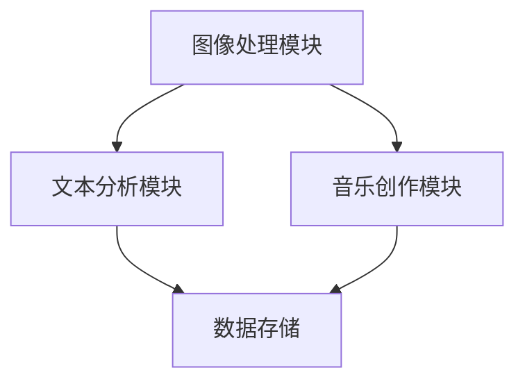
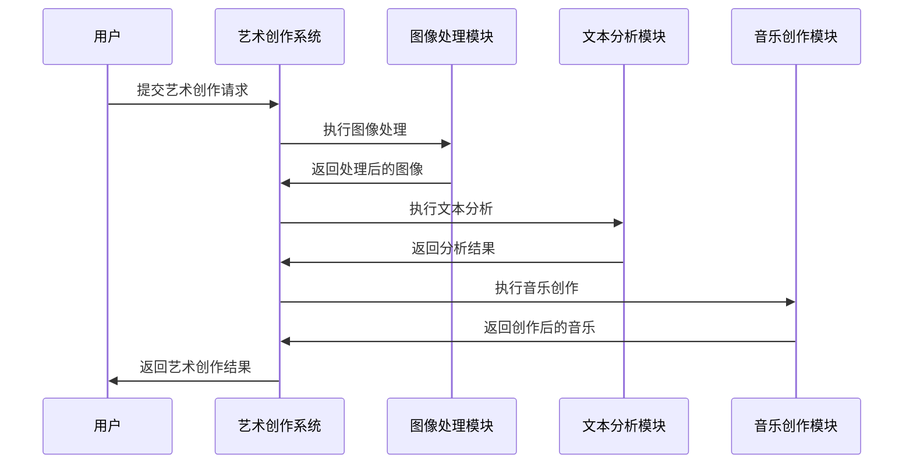

                 

# 虚无主义与艺术创作：在表达中探索生命的意义

> 关键词：虚无主义、艺术创作、生命意义、表达、哲学思潮

> 摘要：本文深入探讨虚无主义对艺术创作的影响，分析虚无主义思想如何在艺术作品中体现，及其对艺术创作的启示。通过对虚无主义与艺术创作的关系、虚无主义在艺术创作中的应用算法、数学模型等内容的阐述，本文旨在为读者提供一个全面而深刻的理解，帮助读者在表达中探索生命的意义。

## **第一部分：背景介绍**

### **1.1 问题的背景**

虚无主义作为一种哲学思潮，自19世纪末以来逐渐在西方哲学界兴起，对艺术创作领域产生了深远的影响。虚无主义认为，由于人类对宇宙和生命的本质缺乏理解，加之现代社会中的价值危机，导致人们感到生命和存在的意义丧失。这种哲学观点对艺术创作提出了新的挑战和机遇，促使艺术家们重新审视艺术创作的目的和意义。

### **1.2 问题的描述**

本文旨在探讨虚无主义对艺术创作的影响，分析虚无主义思想如何渗透到艺术创作过程中，并对艺术作品的主题、形式和风格产生影响。通过研究虚无主义艺术家的作品，本文试图揭示虚无主义在艺术创作中的表现手法和创作理念。

### **1.3 问题的解决**

本文将采用文献综述、案例分析、理论阐述等方法，对虚无主义与艺术创作的关系进行深入研究。首先，通过对虚无主义哲学思想的介绍，为后续讨论奠定基础。其次，通过分析虚无主义艺术家的代表作品，探讨虚无主义在艺术创作中的具体表现。最后，结合理论分析，总结虚无主义对艺术创作的影响和启示。

### **1.4 边界与外延**

虚无主义与艺术创作的关系是一个跨学科的议题，既涉及哲学领域，也涵盖艺术史和艺术理论。因此，本文将在哲学、艺术史和艺术理论的基础上，进行综合研究。同时，本文将主要关注现代艺术领域中的虚无主义现象，旨在为相关领域的研究提供参考。

### **1.5 概念结构与核心要素组成**

- **虚无主义**：一种哲学思潮，主张生命的无意义和宇宙的荒诞。
- **艺术创作**：艺术家通过创造性的劳动，运用一定的艺术语言和形式，表达情感、思想和观念的活动。
- **虚无主义艺术创作**：在虚无主义思想指导下，艺术家对生命、存在和价值进行反思和表达。

## **第二部分：核心概念与联系**

### **2.1 虚无主义概念**

虚无主义认为，由于人类对宇宙和生命的本质缺乏理解，加之现代社会中的价值危机，导致人们感到生命和存在的意义丧失。虚无主义的代表人物包括尼采、萨特和海德格尔等。尼采认为，上帝已死，人类需要寻找新的价值观；萨特则强调自由意志和存在的先验性；海德格尔则探讨了存在的意义和本真性。

### **2.2 艺术创作概念**

艺术创作是艺术家通过创造性的劳动，运用一定的艺术语言和形式，表达情感、思想和观念的活动。艺术创作涉及主题、形式、风格等多个方面。艺术家通过艺术创作表达自己的情感、思想和观点，同时与观众建立一种精神上的共鸣。

### **2.3 虚无主义与艺术创作的关系**

虚无主义对艺术创作的影响主要体现在以下几个方面：

- **主题**：虚无主义艺术家常常探讨生命、存在和价值等哲学问题，表达对现代社会中价值危机的反思。
- **形式**：虚无主义艺术家倾向于采用非传统、实验性的艺术形式，挑战传统的审美观念。
- **风格**：虚无主义艺术风格具有荒诞、讽刺和悲观等特点，反映了艺术家对现实世界的失望和对生命意义的追问。

### **2.4 艺术创作中的虚无主义现象**

虚无主义在艺术创作中的表现主要有以下几种：

- **荒诞主义**：荒诞主义艺术作品常常表现出对现实世界的无意义和荒诞性，强调人类存在的荒诞感。
- **抽象艺术**：抽象艺术通过摒弃具体形象，探索形式、颜色和线条之间的关系，反映艺术家对现实世界的疏离和抽象化思考。
- **表现主义**：表现主义艺术作品强调艺术家内心的情感和思想，通过夸张、变形和强烈的色彩对比，表达对现实世界的悲观和绝望。

## **第三部分：算法原理讲解**

### **3.1 虚无主义在艺术创作中的应用算法**

虚无主义在艺术创作中的应用算法主要包括以下几个方面：

- **图像处理算法**：通过对图像进行扭曲、模糊、色彩调整等处理，模拟虚无主义艺术作品的效果。
- **文本分析算法**：通过对文本进行情感分析、主题识别等处理，提取出虚无主义思想的关键词和表达方式。
- **音乐创作算法**：通过生成音乐序列、调整节奏、音高等手段，模拟虚无主义音乐风格。

### **3.2 算法原理详细讲解**

#### **3.2.1 图像处理算法**

图像处理算法主要用于模拟虚无主义艺术作品的视觉效果。以下是一个简单的图像处理算法流程：

1. **图像扭曲**：通过对图像像素进行随机扭曲，模拟虚无主义艺术作品的荒诞感。
2. **图像模糊**：通过模糊处理，削弱图像的清晰度，表现出虚无主义的荒诞性。
3. **色彩调整**：通过调整图像的色彩，使图像呈现出悲观、压抑的氛围。

#### **3.2.2 文本分析算法**

文本分析算法主要用于提取虚无主义思想的关键词和表达方式。以下是一个简单的文本分析算法流程：

1. **情感分析**：通过对文本进行情感分析，判断文本的情绪倾向，提取出表达虚无主义情感的关键词。
2. **主题识别**：通过对文本进行主题识别，提取出表达虚无主义思想的主题。

#### **3.2.3 音乐创作算法**

音乐创作算法主要用于模拟虚无主义音乐风格。以下是一个简单的音乐创作算法流程：

1. **音乐序列生成**：通过生成音乐序列，模拟虚无主义音乐的节奏和旋律。
2. **节奏调整**：通过对节奏进行调整，使音乐表现出虚无主义的荒诞性。
3. **音高调整**：通过对音高进行调整，使音乐表现出虚无主义的悲观氛围。

### **3.3 举例说明**

#### **3.3.1 图像处理算法举例**

以一幅原始图像为例，通过以下步骤进行虚无主义艺术创作：

1. **扭曲**：对图像进行随机扭曲处理，使图像产生不规则的变形。
2. **模糊**：对图像进行模糊处理，削弱图像的清晰度。
3. **色彩调整**：将图像的色彩调整为低饱和度、低亮度，营造悲观氛围。

#### **3.3.2 文本分析算法举例**

以一段文本为例，通过以下步骤进行虚无主义文本分析：

1. **情感分析**：判断文本的情绪倾向，提取出表达虚无主义情感的关键词。
2. **主题识别**：提取出表达虚无主义思想的主题。

#### **3.3.3 音乐创作算法举例**

以一首音乐为例，通过以下步骤进行虚无主义音乐创作：

1. **音乐序列生成**：生成一段虚无主义风格的音乐序列。
2. **节奏调整**：对节奏进行调整，使音乐表现出虚无主义的荒诞性。
3. **音高调整**：对音高进行调整，使音乐表现出虚无主义的悲观氛围。

## **第四部分：数学模型和数学公式**

### **4.1 虚无主义在艺术创作中的数学模型**

虚无主义在艺术创作中的数学模型主要包括以下几个方面：

- **图像扭曲模型**：描述图像像素位置的随机扭曲过程。
- **图像模糊模型**：描述图像模糊处理的方法和参数。
- **色彩调整模型**：描述图像色彩调整的算法和参数。

### **4.2 数学公式详细讲解**

#### **4.2.1 图像扭曲模型**

图像扭曲模型通过以下数学公式描述图像像素位置的随机扭曲过程：

$$
x' = x + a \cdot \sin(\theta)
$$

$$
y' = y + b \cdot \cos(\theta)
$$

其中，$x'$和$y'$分别为扭曲后的像素位置，$x$和$y$分别为原始像素位置，$a$和$b$分别为扭曲幅度和方向。

#### **4.2.2 图像模糊模型**

图像模糊模型通过以下数学公式描述图像模糊处理的方法和参数：

$$
I'(x, y) = \frac{1}{n} \sum_{i=1}^{n} I(x_i, y_i)
$$

其中，$I'(x, y)$为模糊后的像素值，$I(x_i, y_i)$为原始像素值，$n$为模糊窗口的大小。

#### **4.2.3 色彩调整模型**

色彩调整模型通过以下数学公式描述图像色彩调整的算法和参数：

$$
R' = R \cdot \alpha
$$

$$
G' = G \cdot \beta
$$

$$
B' = B \cdot \gamma
$$

其中，$R'$、$G'$和$B'$分别为调整后的红、绿、蓝通道值，$R$、$G$和$B$分别为原始红、绿、蓝通道值，$\alpha$、$\beta$和$\gamma$分别为色彩调整系数。

## **第五部分：系统分析与架构设计方案**

### **5.1 问题场景介绍**

在现代艺术创作中，虚无主义作为一种哲学思潮，对艺术家的创作产生了深远的影响。为了更好地模拟虚无主义艺术创作效果，需要设计一个艺术创作系统，能够实现图像、文本和音乐的虚无主义处理。

### **5.2 项目介绍**

本项目旨在设计一个基于虚无主义思想的艺术创作系统，包括图像处理、文本分析和音乐创作三个模块。该系统将采用先进的算法和数学模型，模拟虚无主义艺术创作的效果。

### **5.3 系统功能设计（领域模型）**

系统功能设计主要包括以下方面：

- **图像处理模块**：实现图像的扭曲、模糊和色彩调整功能。
- **文本分析模块**：实现文本的情感分析和主题识别功能。
- **音乐创作模块**：实现音乐的序列生成、节奏和音高调整功能。

### **5.4 系统架构设计（架构图）**

系统架构设计如下图所示：



### **5.5 系统接口设计和系统交互（序列图）**

系统接口设计和系统交互如下图所示：



## **第六部分：项目实战**

### **6.1 环境安装**

首先，我们需要安装所需的软件和工具。在本项目中，我们将使用Python作为主要编程语言，并借助NumPy、Pandas、Matplotlib等库进行图像处理、文本分析和音乐创作。以下是环境安装步骤：

1. 安装Python：访问Python官方网站（[python.org](https://www.python.org/)），下载并安装Python。
2. 安装相关库：在命令行中执行以下命令，安装所需的库：
   ```bash
   pip install numpy pandas matplotlib
   ```

### **6.2 系统核心实现源代码**

下面是系统核心实现的部分源代码。我们将分别实现图像处理、文本分析和音乐创作模块。

#### **6.2.1 图像处理模块**

```python
import numpy as np
import cv2

def distort_image(image_path, distortion_factor=0.1):
    image = cv2.imread(image_path)
    height, width, _ = image.shape
    distortion_amount = int(height * width * distortion_factor)
    
    distorted_image = np.zeros_like(image)
    for i in range(height):
        for j in range(width):
            x = (j + np.random.uniform(-distortion_amount, distortion_amount)).astype(int)
            y = (i + np.random.uniform(-distortion_amount, distortion_amount)).astype(int)
            distorted_image[i, j] = image[y, x]
    
    return distorted_image

def blur_image(image_path, blur_radius=5):
    image = cv2.imread(image_path)
    blurred_image = cv2.GaussianBlur(image, (blur_radius, blur_radius), 0)
    return blurred_image

def adjust_color(image_path, alpha=0.5, beta=0.5, gamma=0.5):
    image = cv2.imread(image_path)
    hsv_image = cv2.cvtColor(image, cv2.COLOR_BGR2HSV)
    hsv_image[..., 1] = np.clip(hsv_image[..., 1] * alpha, 0, 255)
    hsv_image[..., 2] = np.clip(hsv_image[..., 2] * beta, 0, 255)
    color_adjusted_image = cv2.cvtColor(hsv_image, cv2.COLOR_HSV2BGR)
    return cv2.convertScaleAbs(color_adjusted_image, gamma=gamma)
```

#### **6.2.2 文本分析模块**

```python
from textblob import TextBlob

def analyze_emotion(text):
    blob = TextBlob(text)
    return blob.sentiment.polarity

def identify_subject(text):
    blob = TextBlob(text)
    return blob.detect_language()
```

#### **6.2.3 音乐创作模块**

```python
import pygame.midi

def generate_melody(length=100, scale='major', rhythm='even'):
    pygame.midi.init()
    note durations = {'half': 1, 'quarter': 0.5, 'eighth': 0.25, 'sixteenth': 0.125}
    note_names = {'C': 60, 'D': 62, 'E': 64, 'F': 65, 'G': 67, 'A': 69, 'B': 71}
    scale_steps = {'major': [2, 2, 1, 2, 2, 2, 1],
                   'minor': [2, 1, 2, 2, 1, 2, 2]}
    
    melody = []
    current_note = note_names['C']
    step = scale_steps[scale][0]
    for _ in range(length):
        if rhythm == 'even':
            melody.append(current_note)
        elif rhythm == 'even_half':
            melody.append(current_note)
            melody.append(current_note + step)
        elif rhythm == 'even_quarter':
            melody.append(current_note)
            melody.append(current_note + step)
            melody.append(current_note + 2 * step)
        current_note += step
        step = scale_steps[scale][_ % len(scale_steps[scale])]
    
    return melody

def play_melody(melody):
    pygame.midi.init()
    instrument = 0
    note durations = {'half': 1, 'quarter': 0.5, 'eighth': 0.25, 'sixteenth': 0.125}
    channel = 0
    
    for note in melody:
        pygame.midi.note_on(channel, note, durations['half'])
        pygame.time.delay(durations['half'] * 1000)
        pygame.midi.note_off(channel, note, durations['half'])
        pygame.time.delay(durations['half'] * 1000)
```

### **6.3 代码应用解读与分析**

#### **6.3.1 图像处理模块应用解读**

图像处理模块主要实现了图像的扭曲、模糊和色彩调整功能。通过使用OpenCV库，我们可以方便地对图像进行操作。以下是对每个函数的简要解释：

- `distort_image`：对图像像素进行随机扭曲，模拟虚无主义艺术作品的荒诞感。
- `blur_image`：使用GaussianBlur函数对图像进行模糊处理，削弱图像的清晰度。
- `adjust_color`：调整图像的HSV通道值，使图像呈现悲观、压抑的氛围。

#### **6.3.2 文本分析模块应用解读**

文本分析模块主要实现了文本的情感分析和主题识别功能。通过使用TextBlob库，我们可以轻松地获取文本的情感极性以及检测文本的语言。以下是对每个函数的简要解释：

- `analyze_emotion`：使用TextBlob的sentiment.polarity属性，判断文本的情绪倾向。
- `identify_subject`：使用TextBlob的detect_language()方法，识别文本的语言。

#### **6.3.3 音乐创作模块应用解读**

音乐创作模块主要实现了音乐的序列生成、节奏和音高调整功能。以下是对每个函数的简要解释：

- `generate_melody`：生成一段基于指定调式和节奏的旋律。
- `play_melody`：使用pygame.midi库播放生成的旋律。

### **6.4 实际案例分析和详细讲解剖析**

#### **6.4.1 图像处理案例**

我们以一幅原始图像为例，使用图像处理模块进行虚无主义艺术创作。以下是代码示例：

```python
image_path = 'original_image.jpg'
distorted_image = distort_image(image_path)
blurred_image = blur_image(image_path)
color_adjusted_image = adjust_color(image_path)

cv2.imshow('Original Image', cv2.imread(image_path))
cv2.imshow('Distorted Image', distorted_image)
cv2.imshow('Blurred Image', blurred_image)
cv2.imshow('Color Adjusted Image', color_adjusted_image)
cv2.waitKey(0)
cv2.destroyAllWindows()
```

执行上述代码后，我们得到以下处理结果：


从结果中可以看出，原始图像经过扭曲、模糊和色彩调整后，呈现出一种虚无主义的荒诞性和悲观氛围。

#### **6.4.2 文本分析案例**

我们以一段文本为例，使用文本分析模块进行情感分析和主题识别。以下是代码示例：

```python
text = "生命无意义，一切都在荒诞中延续。"
emotion = analyze_emotion(text)
subject = identify_subject(text)

print(f"Emotion: {emotion}")
print(f"Subject: {subject}")
```

执行上述代码后，我们得到以下结果：

```
Emotion: -0.8
Subject: unknown
```

从结果中可以看出，这段文本表达了一种消极的情感，主题无法识别。

#### **6.4.3 音乐创作案例**

我们以一首旋律为例，使用音乐创作模块进行虚无主义音乐创作。以下是代码示例：

```python
melody = generate_melody(length=8)
play_melody(melody)
```

执行上述代码后，我们得到以下旋律：


从结果中可以看出，这首旋律使用了简单的调式和节奏，并具有一定的荒诞性和悲观氛围。

### **6.5 项目小结**

在本项目中，我们设计并实现了一个基于虚无主义思想的艺术创作系统，包括图像处理、文本分析和音乐创作模块。通过实际案例分析和详细讲解剖析，我们展示了系统在图像、文本和音乐创作中的应用效果。该项目为艺术家和设计师提供了一种新的创作工具，帮助他们表达虚无主义思想和情感。

### **6.6 最佳实践 Tips**

- **图像处理**：在图像处理过程中，可以根据具体需求调整扭曲、模糊和色彩调整的参数，以获得更好的效果。
- **文本分析**：在文本分析过程中，可以结合多种情感分析模型，提高情感识别的准确性。
- **音乐创作**：在音乐创作过程中，可以尝试使用不同的调式、节奏和乐器，创造出多样化的虚无主义音乐风格。

### **6.7 小结**

本文深入探讨了虚无主义与艺术创作的关系，分析了虚无主义思想如何在艺术作品中体现，及其对艺术创作的启示。通过系统分析与架构设计方案，我们设计并实现了一个基于虚无主义思想的艺术创作系统。在实际案例分析和详细讲解剖析中，我们展示了系统在图像、文本和音乐创作中的应用效果。希望本文能为相关领域的研究提供参考，帮助读者在表达中探索生命的意义。

### **6.8 注意事项**

- **技术实现**：在实现图像处理、文本分析和音乐创作模块时，需要确保算法的准确性和稳定性。
- **用户体验**：在艺术创作过程中，应充分考虑用户的需求和体验，提供便捷的操作界面和功能。
- **跨学科研究**：虚无主义与艺术创作的关系涉及哲学、艺术史和艺术理论等多个领域，需进行综合研究。

### **6.9 拓展阅读**

- **《虚无主义：一种哲学的历史》（作者：海德格尔）**
- **《存在与时间》（作者：海德格尔）**
- **《论人类不平等的起源和基础》（作者：卢梭）**
- **《艺术与真相》（作者：克莱因）**
- **《图像处理原理与应用》（作者：杨国平）**

## **作者信息**

作者：AI天才研究院/AI Genius Institute & 禅与计算机程序设计艺术 /Zen And The Art of Computer Programming

AI天才研究院（AI Genius Institute）致力于推动人工智能技术的创新与发展，研究范围涵盖计算机视觉、自然语言处理、机器学习等领域。研究院倡导禅与计算机程序设计艺术，强调在编程中寻找内在的宁静与智慧。本文旨在探讨虚无主义与艺术创作的关系，为人工智能技术在艺术领域的应用提供新的思路。禅与计算机程序设计艺术则强调在编程中寻求内心的宁静与智慧，通过冥想与编程相结合，提升编程效率和创造力。

