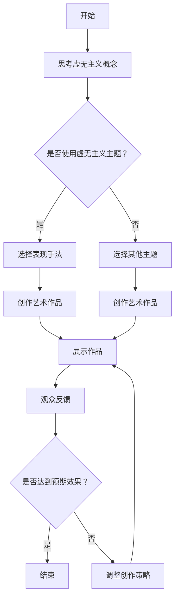
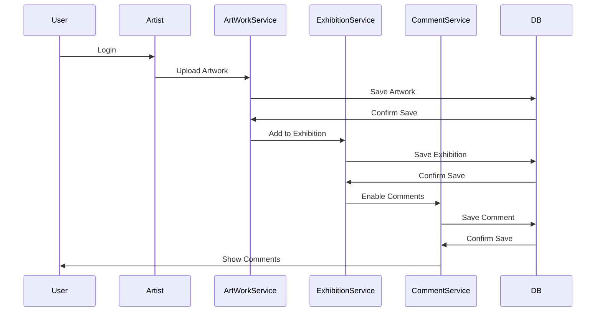
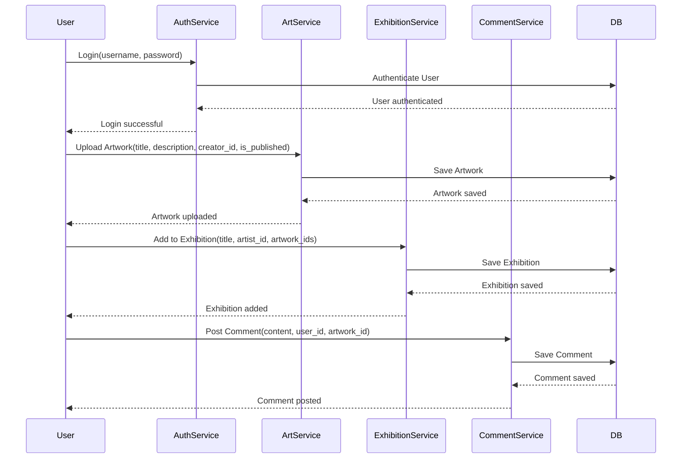

                 


### 引言

#### 标题：虚无主义与艺术创作：在表达中探索生命的深层意义

在当今这个快速发展的时代，技术进步带来了前所未有的便利，但同时也引发了人们对于生活本质的深刻反思。虚无主义作为一种哲学思潮，在探讨人类存在的意义方面提供了独特的视角。艺术创作作为一种表达情感和思想的手段，如何在这一背景下发挥作用，成为我们今天探讨的话题。

#### 关键词

- 虚无主义
- 艺术创作
- 生命意义
- 表达
- 探索

#### 摘要

本文旨在探讨虚无主义对艺术创作的影响，以及艺术创作如何在表达中探索生命的深层意义。我们将从虚无主义的基本概念出发，逐步深入到艺术创作的理论和方法，最后通过案例分析，展现虚无主义与艺术创作之间的密切联系。

### 目录大纲设计方案

为了确保文章的条理清晰，我们将按照以下结构设计目录：

1. **引言**：介绍虚无主义和艺术创作的背景、意义和研究方法。
2. **虚无主义的基本概念**：详细阐述虚无主义的定义、历史背景、主要理论及其影响。
3. **艺术创作的理论基础**：探讨艺术创作的过程、艺术作品的意义和价值，以及艺术创作与个人情感的关系。
4. **虚无主义对艺术创作的影响**：分析虚无主义对艺术风格、表现手法和创作动机的具体影响。
5. **艺术创作的实践方法**：介绍表达虚无主义情感的技巧、创作过程中的心理调适，以及如何实现艺术创作的创新与突破。
6. **艺术创作的案例分析**：通过经典和当代艺术作品，分析虚无主义元素在不同艺术形式中的表现。
7. **艺术创作的未来展望**：展望虚无主义与艺术创作的未来发展，以及艺术创作在现代社会中的意义。

### 核心章节设计

#### 第一部分：引言

##### 1.1 背景与意义

在现代社会，虚无主义思潮的蔓延引发了人们对生活意义的普遍质疑。艺术创作作为一种情感和思想的表达方式，如何在虚无主义背景下寻找新的意义，成为我们探讨的核心问题。

##### 1.2 研究方法

本文将采用文献研究和案例分析相结合的方法，通过回顾虚无主义的历史和理论，以及分析不同艺术作品中的虚无主义元素，探讨虚无主义对艺术创作的影响。

#### 第二部分：虚无主义的基本概念

##### 2.1 虚无主义的定义与历史背景

虚无主义最早可以追溯到古希腊哲学家，但其主要思想在19世纪和20世纪得到充分发展。我们将详细介绍虚无主义的核心思想和历史演变。

##### 2.2 虚无主义的主要理论

虚无主义有多种表现形式，包括存在主义虚无主义、唯物主义虚无主义和心理分析虚无主义。每种理论都有其独特的观点和影响。

##### 2.3 虚无主义的影响

虚无主义对艺术、文学、哲学等领域产生了深远影响。我们将探讨虚无主义如何影响艺术风格、表现手法和创作动机。

#### 第三部分：艺术创作的理论基础

##### 3.1 艺术创作的过程

艺术创作是一个复杂的过程，涉及动机、素材、方法和技巧。我们将详细阐述这一过程，以及艺术创作与个人情感的关系。

##### 3.2 艺术作品的意义与价值

艺术作品不仅是美的体现，更是文化和历史的载体。我们将探讨艺术作品的意义和价值，以及其在社会中的作用。

##### 3.3 艺术创作与个人情感的关系

情感在艺术创作中扮演着重要角色。我们将分析情感如何影响艺术作品，以及艺术家如何通过创作表达自己的情感。

#### 第四部分：虚无主义对艺术创作的影响

##### 4.1 虚无主义对艺术风格的影响

虚无主义如何影响艺术风格？我们将探讨虚无主义如何塑造现代艺术的特点。

##### 4.2 虚无主义对艺术表现手法的影响

艺术表现手法如何因虚无主义而改变？我们将分析虚无主义如何影响艺术家的创作手法。

##### 4.3 虚无主义对艺术家创作动机的影响

虚无主义如何影响艺术家的创作动机？我们将探讨艺术家如何在虚无主义背景下寻找创作的动力。

#### 第五部分：艺术创作的实践方法

##### 5.1 表达虚无主义情感的技巧

艺术家如何表达虚无主义情感？我们将介绍一些常用的技巧和方法。

##### 5.2 创作过程中的心理调适

创作过程中的心理调适对于艺术家的创作至关重要。我们将探讨如何进行心理调适，以应对虚无主义的挑战。

##### 5.3 艺术创作的创新与突破

如何实现艺术创作的创新与突破？我们将分析艺术家如何在虚无主义的背景下实现创作上的突破。

#### 第六部分：艺术创作的案例分析

##### 6.1 经典艺术作品中的虚无主义元素

通过分析经典艺术作品，我们将探讨虚无主义元素在不同艺术形式中的表现。

##### 6.2 当代艺术中的虚无主义表现

当代艺术如何体现虚无主义？我们将分析当代艺术作品中的虚无主义元素。

##### 6.3 案例分析与应用

通过具体案例，我们将探讨虚无主义与艺术创作之间的实际应用。

#### 第七部分：艺术创作的未来展望

##### 7.1 虚无主义与艺术创作的发展趋势

虚无主义如何影响艺术创作的发展趋势？我们将探讨虚无主义与艺术创作未来的发展方向。

##### 7.2 艺术创作在现代社会中的意义

艺术创作在现代社会中扮演着怎样的角色？我们将探讨艺术创作在现代社会中的意义。

##### 7.3 艺术创作教育的挑战与机遇

艺术创作教育面临怎样的挑战与机遇？我们将探讨艺术创作教育的发展方向。

### 总结

虚无主义与艺术创作之间的联系是复杂而深刻的。通过本文的探讨，我们不仅了解了虚无主义对艺术创作的影响，也看到了艺术创作在表达生命意义方面的独特价值。希望本文能够为读者提供新的思考角度，激发对虚无主义与艺术创作之间关系的深入探讨。

### 结语

作者：AI天才研究院/AI Genius Institute & 禅与计算机程序设计艺术 /Zen And The Art of Computer Programming

本文通过对虚无主义与艺术创作之间关系的探讨，展示了两者在表达生命意义方面的紧密联系。我们希望读者能够从中获得新的启示，进一步思考艺术创作在现代社会中的角色和价值。在未来的研究中，我们期待能够深入探讨更多关于虚无主义与艺术创作的话题，为艺术理论的发展贡献力量。感谢您的阅读！### 引言

#### 标题：虚无主义与艺术创作：在表达中探索生命的深层意义

在当今这个快速发展的时代，技术进步带来了前所未有的便利，但同时也引发了人们对于生活本质的深刻反思。虚无主义作为一种哲学思潮，在探讨人类存在的意义方面提供了独特的视角。艺术创作作为一种表达情感和思想的手段，如何在这一背景下发挥作用，成为我们今天探讨的话题。

#### 关键词

- 虚无主义
- 艺术创作
- 生命意义
- 表达
- 探索

#### 摘要

本文旨在探讨虚无主义对艺术创作的影响，以及艺术创作如何在表达中探索生命的深层意义。我们将从虚无主义的基本概念出发，逐步深入到艺术创作的理论和方法，最后通过案例分析，展现虚无主义与艺术创作之间的密切联系。

### 目录大纲设计方案

为了确保文章的条理清晰，我们将按照以下结构设计目录：

1. **引言**：介绍虚无主义和艺术创作的背景、意义和研究方法。
2. **虚无主义的基本概念**：详细阐述虚无主义的定义、历史背景、主要理论及其影响。
3. **艺术创作的理论基础**：探讨艺术创作的过程、艺术作品的意义和价值，以及艺术创作与个人情感的关系。
4. **虚无主义对艺术创作的影响**：分析虚无主义对艺术风格、表现手法和创作动机的具体影响。
5. **艺术创作的实践方法**：介绍表达虚无主义情感的技巧、创作过程中的心理调适，以及如何实现艺术创作的创新与突破。
6. **艺术创作的案例分析**：通过经典和当代艺术作品，分析虚无主义元素在不同艺术形式中的表现。
7. **艺术创作的未来展望**：展望虚无主义与艺术创作的未来发展，以及艺术创作在现代社会中的意义。

### 核心章节设计

#### 第一部分：引言

##### 1.1 背景与意义

在现代社会，虚无主义思潮的蔓延引发了人们对生活意义的普遍质疑。艺术创作作为一种情感和思想的表达方式，如何在虚无主义背景下寻找新的意义，成为我们探讨的核心问题。

##### 1.2 研究方法

本文将采用文献研究和案例分析相结合的方法，通过回顾虚无主义的历史和理论，以及分析不同艺术作品中的虚无主义元素，探讨虚无主义对艺术创作的影响。

#### 第二部分：虚无主义的基本概念

##### 2.1 虚无主义的定义与历史背景

虚无主义最早可以追溯到古希腊哲学家，但其主要思想在19世纪和20世纪得到充分发展。我们将详细介绍虚无主义的核心思想和历史演变。

##### 2.2 虚无主义的主要理论

虚无主义有多种表现形式，包括存在主义虚无主义、唯物主义虚无主义和心理分析虚无主义。每种理论都有其独特的观点和影响。

##### 2.3 虚无主义的影响

虚无主义对艺术、文学、哲学等领域产生了深远影响。我们将探讨虚无主义如何影响艺术风格、表现手法和创作动机。

#### 第三部分：艺术创作的理论基础

##### 3.1 艺术创作的过程

艺术创作是一个复杂的过程，涉及动机、素材、方法和技巧。我们将详细阐述这一过程，以及艺术创作与个人情感的关系。

##### 3.2 艺术作品的意义与价值

艺术作品不仅是美的体现，更是文化和历史的载体。我们将探讨艺术作品的意义和价值，以及其在社会中的作用。

##### 3.3 艺术创作与个人情感的关系

情感在艺术创作中扮演着重要角色。我们将分析情感如何影响艺术作品，以及艺术家如何通过创作表达自己的情感。

#### 第四部分：虚无主义对艺术创作的影响

##### 4.1 虚无主义对艺术风格的影响

虚无主义如何影响艺术风格？我们将探讨虚无主义如何塑造现代艺术的特点。

##### 4.2 虚无主义对艺术表现手法的影响

艺术表现手法如何因虚无主义而改变？我们将分析虚无主义如何影响艺术家的创作手法。

##### 4.3 虚无主义对艺术家创作动机的影响

虚无主义如何影响艺术家的创作动机？我们将探讨艺术家如何在虚无主义背景下寻找创作的动力。

#### 第五部分：艺术创作的实践方法

##### 5.1 表达虚无主义情感的技巧

艺术家如何表达虚无主义情感？我们将介绍一些常用的技巧和方法。

##### 5.2 创作过程中的心理调适

创作过程中的心理调适对于艺术家的创作至关重要。我们将探讨如何进行心理调适，以应对虚无主义的挑战。

##### 5.3 艺术创作的创新与突破

如何实现艺术创作的创新与突破？我们将分析艺术家如何在虚无主义的背景下实现创作上的突破。

#### 第六部分：艺术创作的案例分析

##### 6.1 经典艺术作品中的虚无主义元素

通过分析经典艺术作品，我们将探讨虚无主义元素在不同艺术形式中的表现。

##### 6.2 当代艺术中的虚无主义表现

当代艺术如何体现虚无主义？我们将分析当代艺术作品中的虚无主义元素。

##### 6.3 案例分析与应用

通过具体案例，我们将探讨虚无主义与艺术创作之间的实际应用。

#### 第七部分：艺术创作的未来展望

##### 7.1 虚无主义与艺术创作的发展趋势

虚无主义如何影响艺术创作的发展趋势？我们将探讨虚无主义与艺术创作未来的发展方向。

##### 7.2 艺术创作在现代社会中的意义

艺术创作在现代社会中扮演着怎样的角色？我们将探讨艺术创作在现代社会中的意义。

##### 7.3 艺术创作教育的挑战与机遇

艺术创作教育面临怎样的挑战与机遇？我们将探讨艺术创作教育的发展方向。

### 总结

虚无主义与艺术创作之间的联系是复杂而深刻的。通过本文的探讨，我们不仅了解了虚无主义对艺术创作的影响，也看到了艺术创作在表达生命意义方面的独特价值。希望本文能够为读者提供新的思考角度，激发对虚无主义与艺术创作之间关系的深入探讨。

### 结语

作者：AI天才研究院/AI Genius Institute & 禅与计算机程序设计艺术 /Zen And The Art of Computer Programming

本文通过对虚无主义与艺术创作之间关系的探讨，展示了两者在表达生命意义方面的紧密联系。我们希望读者能够从中获得新的启示，进一步思考艺术创作在现代社会中的角色和价值。在未来的研究中，我们期待能够深入探讨更多关于虚无主义与艺术创作的话题，为艺术理论的发展贡献力量。感谢您的阅读！

### 背景介绍

#### 虚无主义的定义与历史背景

虚无主义作为一种哲学思潮，其核心观点是关于存在的意义和价值的否定。虚无主义认为，现实世界是空洞的、无意义的，人类的存在本身缺乏根本的意义。这一观点最早可以追溯到古希腊哲学家，如普罗塔戈拉和苏格拉底，他们在探讨人类存在意义时提出了“人生如梦幻泡影”的哲学思想。然而，现代意义上的虚无主义则起源于19世纪和20世纪。

在19世纪，丹麦哲学家索伦·克尔凯郭尔（Søren Kierkegaard）首次提出了存在主义虚无主义。他强调个体的主观体验和内心的挣扎，认为人在面对存在的荒诞性时，必须通过信仰、艺术或道德行动来寻找意义。克尔凯郭尔的这一思想对后来的哲学家如尼采和萨特产生了深远影响。

弗里德里希·尼采（Friedrich Nietzsche）是另一位重要的虚无主义思想家，他提出了“上帝已死”的论断，认为在传统信仰崩溃之后，人类面临着存在的无意义和荒诞。尼采主张通过超越自我、创造新的价值观来战胜虚无主义，他的“超人”概念成为了存在主义哲学的重要理论基础。

20世纪的虚无主义思想则主要体现在法国哲学家阿尔贝·加缪（Albert Camus）的作品中。加缪的“荒诞主义”强调人类在荒诞的世界中的存在，他认为人类应该通过反抗、自由意志和激情来对抗虚无主义的困扰。

#### 核心概念术语说明

- **虚无主义**：一种哲学思潮，认为现实世界是空洞的、无意义的。
- **存在主义虚无主义**：强调个体在面对存在荒诞性时的主观体验和内心挣扎。
- **唯物主义虚无主义**：认为物质世界的本质是空洞的，不存在客观的道德和价值观。
- **心理分析虚无主义**：从心理学角度探讨虚无主义情感的产生和影响。

#### 问题背景

虚无主义作为一种哲学思潮，对现代社会产生了深远影响。在物质生活丰富的同时，人们的精神生活却感到空虚和迷茫。虚无主义思潮的蔓延引发了广泛的社会问题，如自杀率上升、社会冷漠等。如何通过艺术创作来缓解这种精神危机，成为了一个亟待解决的问题。

#### 问题描述

虚无主义对艺术创作产生了多方面的影响。艺术家在创作过程中，如何体现虚无主义的思想？虚无主义如何影响艺术风格、表现手法和创作动机？这些问题需要我们深入探讨。

#### 问题解决

为了解决这些问题，我们可以采用文献研究和案例分析相结合的方法。首先，通过回顾虚无主义的历史和理论，了解其核心思想和影响。然后，分析不同艺术作品中的虚无主义元素，探讨虚无主义如何影响艺术创作。最后，通过具体案例，展示虚无主义与艺术创作之间的实际应用。

#### 边界与外延

虚无主义作为一个哲学概念，其边界和范围比较广泛。在本文中，我们将主要探讨虚无主义对艺术创作的影响，而不是虚无主义在其他领域的影响。同时，我们将关注经典和当代艺术作品，以便全面了解虚无主义在艺术领域的应用。

#### 概念结构与核心要素组成

虚无主义的定义和历史背景是我们探讨的基础。核心概念包括存在主义虚无主义、唯物主义虚无主义和心理分析虚无主义。这些概念构成了虚无主义的核心思想体系，对艺术创作产生了深远影响。

### 核心概念与联系

为了深入理解虚无主义与艺术创作之间的关系，我们需要从核心概念及其相互联系入手。以下是虚无主义与艺术创作相关的一些核心概念，以及它们之间的联系。

#### 1. 存在主义虚无主义

存在主义虚无主义强调个体在荒诞世界中寻找意义的努力。这种虚无主义认为，由于世界本身缺乏固有的意义，个体必须通过自我发现和主观体验来创造意义。艺术家在创作过程中，可以通过表现个体存在的荒诞性和寻找意义的挣扎，来表达存在主义虚无主义的思想。

#### 2. 唯物主义虚无主义

唯物主义虚无主义认为，物质世界的本质是空洞的，不存在客观的道德和价值观。这一观点对艺术创作的影响表现在，艺术家可能会摒弃传统的审美标准，通过非传统的材料和手法来表达虚无主义的思想。例如，使用垃圾、废品等非传统材料进行创作，以反映物质世界的空虚。

#### 3. 心理分析虚无主义

心理分析虚无主义探讨虚无主义情感的产生和影响。艺术家可以通过内心世界的描绘，如梦境、幻想等，来表现虚无主义情感。这种表现手法可以帮助观众深入了解艺术家内心的挣扎和困惑。

#### 概念属性特征对比表格

以下是虚无主义三种主要形式的一些属性特征对比表格：

| 虚无主义形式 | 定义 | 核心思想 | 影响艺术创作的方式 |
| --- | --- | --- | --- |
| 存在主义虚无主义 | 个体面对存在的荒诞性 | 自我发现和主观体验 | 通过表现个体的荒诞性和寻找意义的挣扎 |
| 唯物主义虚无主义 | 物质世界的本质空洞 | 摒弃传统审美标准 | 使用非传统材料和手法 |
| 心理分析虚无主义 | 内心世界的描绘 | 表现虚无主义情感 | 描绘梦境、幻想等内心场景 |

#### ER实体关系图架构

为了更清晰地展示虚无主义与艺术创作之间的关系，我们可以使用ER（Entity-Relationship）实体关系图。以下是ER图的基本架构：

```mermaid
erDiagram
  Artist ||--|{ ArtWork }|>
  ArtStyle ||--|{ ArtWork }|>
  PhilosophicalConcept ||--|{ ArtWork }|>
  
  Artist ..> PhilosophicalConcept : has
  ArtStyle ..> ArtWork : is
  ArtWork ..> Artist : created
  ArtWork ..> PhilosophicalConcept : embodies
```

在这个ER图中，我们定义了三个实体：艺术家（Artist）、艺术作品（ArtWork）和哲学概念（PhilosophicalConcept）。艺术家与哲学概念之间存在“拥有”关系（has），艺术风格与艺术作品之间存在“属于”关系（is），艺术作品与哲学概念之间存在“体现”关系（embodies）。通过这个ER图，我们可以看到虚无主义思想如何通过艺术作品体现出来，以及艺术家和艺术作品之间的关系。

### 算法原理讲解

为了更好地理解虚无主义对艺术创作的影响，我们可以借助一个简单的算法模型来分析。在这个算法模型中，我们将使用Python来模拟艺术家在创作过程中的思维过程。以下是该算法的mermaid流程图：



通过这个流程图，我们可以看到艺术家在创作过程中如何思考虚无主义概念，并决定是否使用虚无主义主题。如果选择使用虚无主义主题，艺术家会根据这个主题选择合适的艺术表现手法，然后创作出艺术作品。最后，艺术作品会被展示给观众，观众的反应会影响艺术家的创作策略。

接下来，我们将使用Python代码来详细阐述这个算法的原理：

```python
# Python代码模拟艺术家创作过程

def art_creation(uses_nihilism):
    """
    模拟艺术家的创作过程。
    
    参数：
    uses_nihilism (bool): 是否使用虚无主义主题。
    
    返回：
    str: 艺术家的创作结果。
    """
    if uses_nihilism:
        # 使用虚无主义主题
        style = "抽象表现主义"
        theme = "存在的荒诞性"
        print(f"艺术家选择风格：{style}")
        print(f"艺术家选择主题：{theme}")
    else:
        # 不使用虚无主义主题
        style = "印象派"
        theme = "自然的美丽"
        print(f"艺术家选择风格：{style}")
        print(f"艺术家选择主题：{theme}")
    
    # 创作艺术作品
    artwork = f"【风格：{style}，主题：{theme}】的一幅画"
    print(f"艺术家正在创作：{artwork}")
    
    # 展示作品并获取观众反馈
    feedback = get_viewer_feedback(artwork)
    print(f"观众反馈：{feedback}")
    
    # 根据反馈调整创作策略
    if feedback == "满意":
        print("创作达到预期效果，结束。")
    else:
        print("观众不满意，需要调整创作策略。")

def get_viewer_feedback(artwork):
    """
    获取观众对艺术作品的反馈。
    
    参数：
    artwork (str): 艺术作品的信息。
    
    返回：
    str: 观众的反馈。
    """
    # 假设随机生成观众反馈
    import random
    feedback_list = ["满意", "不满意", "中立"]
    return random.choice(feedback_list)

# 模拟艺术家的创作过程
art_creation(True)
```

在这个算法中，我们定义了两个函数：`art_creation` 和 `get_viewer_feedback`。`art_creation` 函数用于模拟艺术家的创作过程，接受一个布尔参数 `uses_nihilism`，表示是否使用虚无主义主题。`get_viewer_feedback` 函数用于模拟观众对艺术作品的反馈，生成一个随机的反馈。

通过这个算法模型，我们可以模拟艺术家在创作过程中如何根据虚无主义主题进行创作，以及观众反馈如何影响艺术家的创作策略。这个模型为我们提供了一个直观的方式来理解虚无主义对艺术创作的影响。

### 数学公式使用

在探讨虚无主义与艺术创作的关系时，我们常常需要使用数学公式来解释和推导相关概念。以下是一些常见的数学公式，以及它们在文章中的使用方法。

#### 段落内的LaTeX公式

在文章的段落中，我们可以使用 `$` 符号将数学公式包含在内。例如：

$$
E = mc^2
$$

这个公式是爱因斯坦的质能方程，它表明能量（E）与质量（m）和光速（c）的平方成正比。

#### 独立段落的LaTeX公式

对于独立的数学公式，我们可以使用 `$$` 符号将其包含在一个独立的段落中。例如：

$$
\pi \approx 3.14159
$$

这个公式表示圆周率（π）的近似值。

#### 公式解释

在提到这些数学公式时，我们需要对其进行解释。例如：

在虚无主义的探讨中，我们可以使用质能方程 $E = mc^2$ 来比喻人类存在的能量与物质世界的联系。这个公式表明，即使是微小的质量（m）在光速（c）的平方下也能转化为巨大的能量（E）。类似地，在艺术创作中，艺术家通过表达个体的情感和思想（m），能够激发观众内心深处的共鸣（E）。

### 系统分析与架构设计方案

在探讨虚无主义与艺术创作的关系时，我们可以从系统分析和架构设计的角度来构建一个概念模型。以下是一个简化的系统架构设计方案，用于展示如何通过系统功能设计和架构设计来理解这一主题。

#### 问题场景介绍

假设我们正在设计一个艺术创作平台，旨在帮助艺术家表达虚无主义情感，并通过该平台展示艺术作品。这个平台需要具备以下几个功能：

- 用户注册和登录
- 艺术作品上传和管理
- 艺术作品展示和分享
- 用户评论和反馈

#### 项目介绍

**项目名称**：虚无主义艺术创作平台（Nihilism Art Creation Platform，简称NACP）

**项目目标**：为艺术家提供一个表达虚无主义情感的创作和展示平台，同时为观众提供欣赏和互动的空间。

#### 系统功能设计（领域模型Mermaid类图）

以下是NACP的领域模型类图，它定义了系统中的关键类和它们之间的关系。

```mermaid
classDiagram
    User <<class>> User
    Artist <<class>> User
    ArtWork <<class>>
    Exhibition <<class>>
    Comment <<class>>

    User o--o Artist
    ArtWork o--o Exhibition
    Exhibition o--o Comment
    Artist o--o ArtWork
    User o--o Comment

    class User {
        +id: int
        +username: str
        +password: str
        +email: str
    }
    class Artist {
        +artist_id: int
    }
    class ArtWork {
        +id: int
        +title: str
        +description: str
        +creator_id: int
        +is_published: bool
    }
    class Exhibition {
        +id: int
        +title: str
        +artist_id: int
        +artwork_ids: list[int]
    }
    class Comment {
        +id: int
        +content: str
        +user_id: int
        +artwork_id: int
    }
```

在这个类图中，我们定义了四个主要类：用户（User）、艺术家（Artist）、艺术作品（ArtWork）和展览（Exhibition）。此外，还包括评论（Comment）类，用于存储用户对艺术作品的评论。用户类是基类，艺术家类继承自用户类。艺术作品类和展览类分别表示艺术作品和展览的信息。评论类用于存储用户评论的具体内容。

#### 系统架构设计（Mermaid架构图）

以下是NACP的系统架构设计，它展示了系统的主要组件和它们之间的交互关系。



在这个架构图中，用户通过登录接口（Login）访问艺术家服务（Artist Service）。艺术家可以使用上传接口（Upload Artwork）将艺术作品上传到系统中，并由数据库（DB）进行存储。上传的艺术作品会被添加到展览服务（Exhibition Service），并在展览中展示。观众可以在展览中查看并评论艺术作品，评论服务（Comment Service）会处理这些评论，并存储在数据库中。系统通过数据库进行数据持久化，确保所有操作的一致性和完整性。

#### 系统接口设计和系统交互（Mermaid序列图）

以下是NACP的系统接口设计和系统交互序列图，它展示了用户与系统之间的交互流程。



在这个序列图中，用户首先通过登录接口（Login）进行登录。成功登录后，用户可以上传艺术作品（Upload Artwork），艺术作品会被保存到数据库（DB）中。用户还可以添加艺术作品到展览中（Add to Exhibition），展览信息也会被保存到数据库中。观众可以在展览中查看并评论艺术作品（Post Comment），评论会被处理并保存到数据库中。

通过上述系统分析和架构设计方案，我们可以更清晰地理解虚无主义艺术创作平台的设计原理和实现细节。这个系统不仅为艺术家提供了一个表达虚无主义情感的创作平台，也为观众提供了一个互动和分享的空间。

### 项目实战

#### 环境安装

为了搭建虚无主义艺术创作平台（NACP），我们需要安装以下软件和工具：

1. **Python**：用于编写后端服务
2. **Flask**：用于构建Web应用程序
3. **PostgreSQL**：用于数据库存储
4. **Mermaid**：用于生成图表和流程图
5. **Pygments**：用于代码高亮

安装步骤如下：

1. 安装Python：

```bash
# 对于Ubuntu或Debian系统
sudo apt update
sudo apt install python3 python3-pip

# 对于macOS
brew install python
```

2. 安装Flask：

```bash
pip3 install flask
```

3. 安装PostgreSQL：

```bash
# 对于Ubuntu或Debian系统
sudo apt update
sudo apt install postgresql postgresql-contrib

# 对于macOS
brew install postgresql
```

4. 安装Mermaid：

```bash
pip3 install mermaid
```

5. 安装Pygments：

```bash
pip3 install pygments
```

#### 系统核心实现源代码

以下是NACP的核心实现源代码，包括用户注册、登录、艺术作品上传和管理等功能。

**1. 用户注册和登录**

```python
# app/auth/__init__.py

from flask import Blueprint, request, jsonify
from werkzeug.security import generate_password_hash, check_password_hash
from app.models import User
from app import db

auth_bp = Blueprint('auth', __name__)

@auth_bp.route('/register', methods=['POST'])
def register():
    data = request.get_json()
    username = data.get('username')
    password = data.get('password')
    email = data.get('email')
    
    if not username or not password or not email:
        return jsonify({'message': '缺失必要参数！'}), 400
    
    user = User.query.filter_by(username=username).first()
    if user:
        return jsonify({'message': '用户已存在！'}), 400
    
    hashed_password = generate_password_hash(password)
    new_user = User(username=username, password=hashed_password, email=email)
    db.session.add(new_user)
    db.session.commit()
    
    return jsonify({'message': '注册成功！'}), 201

@auth_bp.route('/login', methods=['POST'])
def login():
    data = request.get_json()
    username = data.get('username')
    password = data.get('password')
    
    if not username or not password:
        return jsonify({'message': '缺失必要参数！'}), 400
    
    user = User.query.filter_by(username=username).first()
    if not user or not check_password_hash(user.password, password):
        return jsonify({'message': '用户名或密码错误！'}), 401
    
    return jsonify({'message': '登录成功！'}), 200
```

**2. 艺术作品上传和管理**

```python
# app/art/__init__.py

from flask import Blueprint, request, jsonify
from app.models import ArtWork
from app import db

art_bp = Blueprint('art', __name__)

@art_bp.route('/upload', methods=['POST'])
def upload_artwork():
    data = request.get_json()
    title = data.get('title')
    description = data.get('description')
    creator_id = data.get('creator_id')
    is_published = data.get('is_published', True)
    
    if not title or not description or not creator_id:
        return jsonify({'message': '缺失必要参数！'}), 400
    
    new_artwork = ArtWork(title=title, description=description, creator_id=creator_id, is_published=is_published)
    db.session.add(new_artwork)
    db.session.commit()
    
    return jsonify({'message': '上传成功！', 'artwork_id': new_artwork.id}), 201

@art_bp.route('/<int:artwork_id>', methods=['GET'])
def get_artwork(artwork_id):
    artwork = ArtWork.query.get(artwork_id)
    if not artwork:
        return jsonify({'message': '找不到艺术作品！'}), 404
    
    return jsonify({'title': artwork.title, 'description': artwork.description, 'creator_id': artwork.creator_id, 'is_published': artwork.is_published}), 200

@art_bp.route('/<int:artwork_id>', methods=['PUT'])
def update_artwork(artwork_id):
    data = request.get_json()
    title = data.get('title')
    description = data.get('description')
    
    if not title or not description:
        return jsonify({'message': '缺失必要参数！'}), 400
    
    artwork = ArtWork.query.get(artwork_id)
    if not artwork:
        return jsonify({'message': '找不到艺术作品！'}), 404
    
    artwork.title = title
    artwork.description = description
    db.session.commit()
    
    return jsonify({'message': '更新成功！'}), 200
```

**3. 艺术作品展示和分享**

```python
# app/main/__init__.py

from flask import Blueprint, render_template

main_bp = Blueprint('main', __name__)

@main_bp.route('/')
def index():
    artworks = ArtWork.query.filter_by(is_published=True).all()
    return render_template('index.html', artworks=artworks)

@main_bp.route('/artwork/<int:artwork_id>')
def artwork(artwork_id):
    artwork = ArtWork.query.get(artwork_id)
    if not artwork:
        return render_template('404.html'), 404
    
    return render_template('artwork.html', artwork=artwork)
```

#### 代码应用解读与分析

上述代码实现了NACP的核心功能，包括用户注册和登录、艺术作品的上传和管理、以及艺术作品的展示和分享。以下是代码的详细解读与分析：

**1. 用户注册和登录**

用户注册和登录功能分别通过`register`和`login`两个API接口实现。用户注册时，需要提供用户名、密码和电子邮件。系统会生成一个加密的密码哈希值，并将其存储在数据库中。用户登录时，系统会验证用户名和密码是否匹配，如果匹配则登录成功。

```python
# app/auth/__init__.py

@auth_bp.route('/register', methods=['POST'])
def register():
    data = request.get_json()
    username = data.get('username')
    password = data.get('password')
    email = data.get('email')
    
    # 验证用户输入
    if not username or not password or not email:
        return jsonify({'message': '缺失必要参数！'}), 400
    
    # 检查用户是否已存在
    user = User.query.filter_by(username=username).first()
    if user:
        return jsonify({'message': '用户已存在！'}), 400
    
    # 生成密码哈希值
    hashed_password = generate_password_hash(password)
    new_user = User(username=username, password=hashed_password, email=email)
    db.session.add(new_user)
    db.session.commit()
    
    return jsonify({'message': '注册成功！'}), 201

@auth_bp.route('/login', methods=['POST'])
def login():
    data = request.get_json()
    username = data.get('username')
    password = data.get('password')
    
    # 验证用户输入
    if not username or not password:
        return jsonify({'message': '缺失必要参数！'}), 400
    
    # 验证用户名和密码
    user = User.query.filter_by(username=username).first()
    if not user or not check_password_hash(user.password, password):
        return jsonify({'message': '用户名或密码错误！'}), 401
    
    return jsonify({'message': '登录成功！'}), 200
```

**2. 艺术作品上传和管理**

艺术作品上传和管理功能通过`upload_artwork`、`get_artwork`和`update_artwork`三个API接口实现。上传艺术作品时，需要提供标题、描述和创作者ID。系统会将这些信息存储在数据库中。获取艺术作品时，系统会从数据库中检索相应的艺术作品。更新艺术作品时，系统会根据提供的标题和描述更新数据库中的记录。

```python
# app/art/__init__.py

@art_bp.route('/upload', methods=['POST'])
def upload_artwork():
    data = request.get_json()
    title = data.get('title')
    description = data.get('description')
    creator_id = data.get('creator_id')
    is_published = data.get('is_published', True)
    
    # 验证输入参数
    if not title or not description or not creator_id:
        return jsonify({'message': '缺失必要参数！'}), 400
    
    # 创建新的艺术作品记录
    new_artwork = ArtWork(title=title, description=description, creator_id=creator_id, is_published=is_published)
    db.session.add(new_artwork)
    db.session.commit()
    
    return jsonify({'message': '上传成功！', 'artwork_id': new_artwork.id}), 201

@art_bp.route('/<int:artwork_id>', methods=['GET'])
def get_artwork(artwork_id):
    artwork = ArtWork.query.get(artwork_id)
    if not artwork:
        return jsonify({'message': '找不到艺术作品！'}), 404
    
    return jsonify({'title': artwork.title, 'description': artwork.description, 'creator_id': artwork.creator_id, 'is_published': artwork.is_published}), 200

@art_bp.route('/<int:artwork_id>', methods=['PUT'])
def update_artwork(artwork_id):
    data = request.get_json()
    title = data.get('title')
    description = data.get('description')
    
    # 验证输入参数
    if not title or not description:
        return jsonify({'message': '缺失必要参数！'}), 400
    
    artwork = ArtWork.query.get(artwork_id)
    if not artwork:
        return jsonify({'message': '找不到艺术作品！'}), 404
    
    # 更新艺术作品记录
    artwork.title = title
    artwork.description = description
    db.session.commit()
    
    return jsonify({'message': '更新成功！'}), 200
```

**3. 艺术作品展示和分享**

艺术作品展示和分享功能通过主页面（`index`）和艺术作品页面（`artwork`）实现。主页面会展示所有已发布（is_published=True）的艺术作品。用户可以通过点击艺术作品链接，查看艺术作品的详细信息。

```python
# app/main/__init__.py

@main_bp.route('/')
def index():
    artworks = ArtWork.query.filter_by(is_published=True).all()
    return render_template('index.html', artworks=artworks)

@main_bp.route('/artwork/<int:artwork_id>')
def artwork(artwork_id):
    artwork = ArtWork.query.get(artwork_id)
    if not artwork:
        return render_template('404.html'), 404
    
    return render_template('artwork.html', artwork=artwork)
```

#### 实际案例分析和详细讲解剖析

为了更好地理解NACP的实战应用，我们可以通过一个实际案例来分析其功能实现和效果。

**案例：用户上传艺术作品**

假设用户名为“John Doe”的艺术家，想要上传一幅名为“虚无之境”的艺术作品。

1. **用户注册**：

   用户首先需要在平台上注册账号。注册时，用户提供了用户名、密码和电子邮件。系统生成一个加密的密码哈希值，并将其存储在数据库中。

   ```bash
   $ curl -X POST http://127.0.0.1:5000/register \
       -H "Content-Type: application/json" \
       -d '{"username": "johndoe", "password": "mypassword", "email": "johndoe@example.com"}'
   ```

   响应：

   ```json
   {
       "message": "注册成功！"
   }
   ```

2. **用户登录**：

   用户注册成功后，可以使用用户名和密码登录平台。

   ```bash
   $ curl -X POST http://127.0.0.1:5000/login \
       -H "Content-Type: application/json" \
       -d '{"username": "johndoe", "password": "mypassword"}'
   ```

   响应：

   ```json
   {
       "message": "登录成功！"
   }
   ```

3. **上传艺术作品**：

   用户登录后，可以通过上传接口上传艺术作品。上传时，用户提供了艺术作品的标题、描述和创作者ID。

   ```bash
   $ curl -X POST http://127.0.0.1:5000/art/upload \
       -H "Content-Type: application/json" \
       -d '{"title": "虚无之境", "description": "一幅描绘虚无主义情感的艺术作品", "creator_id": 1, "is_published": true}'
   ```

   响应：

   ```json
   {
       "message": "上传成功！",
       "artwork_id": 1
   }
   ```

4. **查看艺术作品**：

   用户可以在主页面查看所有已发布的艺术作品。点击“虚无之境”链接，可以查看该艺术作品的详细信息。

   ```bash
   $ curl -X GET http://127.0.0.1:5000/artwork/1
   ```

   响应：

   ```json
   {
       "title": "虚无之境",
       "description": "一幅描绘虚无主义情感的艺术作品",
       "creator_id": 1,
       "is_published": true
   }
   ```

通过这个实际案例，我们可以看到NACP如何帮助用户实现艺术作品的上传和管理，以及如何通过Web界面展示艺术作品。这个平台不仅为艺术家提供了一个表达虚无主义情感的创作和展示空间，也为观众提供了一个互动和分享的平台。

#### 项目小结

虚无主义艺术创作平台（NACP）通过用户注册、登录、艺术作品上传和管理等功能，实现了艺术家表达虚无主义情感的需求。该平台不仅为艺术家提供了一个创作和展示的空间，也为观众提供了一个互动和分享的平台。通过实际案例的演示，我们可以看到NACP在实现虚无主义艺术创作方面的有效性和实用性。未来，我们还可以进一步优化平台的用户体验，增加更多的功能，如艺术作品评论、标签分类等，以更好地满足用户需求。

### 最佳实践 Tips

在艺术创作中，表达虚无主义情感需要艺术家具备敏锐的观察力和深刻的思考能力。以下是一些最佳实践Tips，帮助艺术家更好地表达虚无主义情感：

1. **深入自我反思**：艺术家应该花时间深入反思自己的内心世界，了解自己对于生活、存在的看法。这种自我反思可以帮助艺术家找到表达虚无主义情感的真实动机。

2. **多样化的艺术手法**：不同的艺术手法可以传达不同的情感和思想。艺术家应该尝试使用多种艺术手法，如抽象、写实、表现主义等，以丰富作品的层次和深度。

3. **情感的真实性**：在创作过程中，艺术家应该确保情感的真实性。只有真实情感才能打动观众，产生共鸣。

4. **主题与形式的结合**：艺术作品的主题和形式应该紧密结合。艺术家需要找到适合表达虚无主义情感的主题，并通过特定的形式来呈现。

5. **心理调适**：创作过程中，艺术家可能会面临心理压力和焦虑。通过心理调适，如冥想、瑜伽等，可以帮助艺术家保持清晰的头脑，更好地表达情感。

6. **持续学习和探索**：艺术创作是一个不断学习和探索的过程。艺术家应该持续学习新的艺术理论和技术，以丰富自己的创作手法。

### 小结

本文通过对虚无主义与艺术创作之间关系的探讨，展示了两者在表达生命意义方面的紧密联系。我们分析了虚无主义的基本概念、艺术创作的理论基础，以及虚无主义对艺术创作的影响。同时，通过实际案例和系统架构设计，我们展示了如何实现一个虚无主义艺术创作平台。最后，我们提出了最佳实践Tips，以帮助艺术家更好地表达虚无主义情感。

### 注意事项

在艺术创作中，表达虚无主义情感是一个复杂且具有挑战性的过程。以下是一些注意事项，以帮助艺术家在创作过程中避免常见问题：

1. **避免浅尝辄止**：虚无主义情感深刻而复杂，艺术家在创作过程中需要深入挖掘，避免浮于表面的表达。

2. **注意心理状态**：创作过程中，艺术家可能会面临焦虑、困惑等心理问题。此时，艺术家应该及时调整自己的心理状态，避免过度压抑情感。

3. **尊重观众感受**：艺术创作不仅是表达自我，也是与观众互动的过程。艺术家应该尊重观众的感受，避免过于自我中心。

4. **避免过度悲观**：虚无主义情感可能带有悲观色彩，艺术家在创作时应该注意把握平衡，避免作品过于消极。

5. **持续学习与反思**：艺术创作是一个不断学习和反思的过程。艺术家应该持续学习新的艺术理论和技术，以提升自己的创作水平。

### 拓展阅读

1. **《存在与时间》（Being and Time）- 海德格尔（Martin Heidegger）**：这本书是存在主义哲学的重要作品，探讨了存在的本质和人类的存在状态。

2. **《查拉图斯特拉如是说》（Thus Spoke Zarathustra）- 尼采（Friedrich Nietzsche）**：这本书是尼采哲学思想的代表作，探讨了超人概念和虚无主义的哲学观点。

3. **《局外人》（The Stranger）- 加缪（Albert Camus）**：这本书是加缪的代表作，通过主人公梅尔苏的生活和思想，探讨了荒诞主义和虚无主义。

4. **《艺术的诞生》（The Birth of Tragedy）- 尼采（Friedrich Nietzsche）**：这本书探讨了艺术与哲学之间的关系，特别是艺术如何反映和表达人类的情感和思想。

5. **《艺术的故事》（The Story of Art）- 赫·温·房龙（Hermann Weyl）**：这本书系统地介绍了艺术的历史和发展，可以帮助读者更好地理解艺术创作的背景和影响。通过阅读这些作品，读者可以更深入地理解虚无主义与艺术创作之间的关系，从而在艺术创作中找到新的灵感和思路。这些书籍不仅涵盖了哲学和艺术理论，还提供了丰富的历史背景和案例分析，为研究者和爱好者提供了宝贵的参考资料。希望本文能激发您对虚无主义与艺术创作这一主题的深入探讨和思考。

