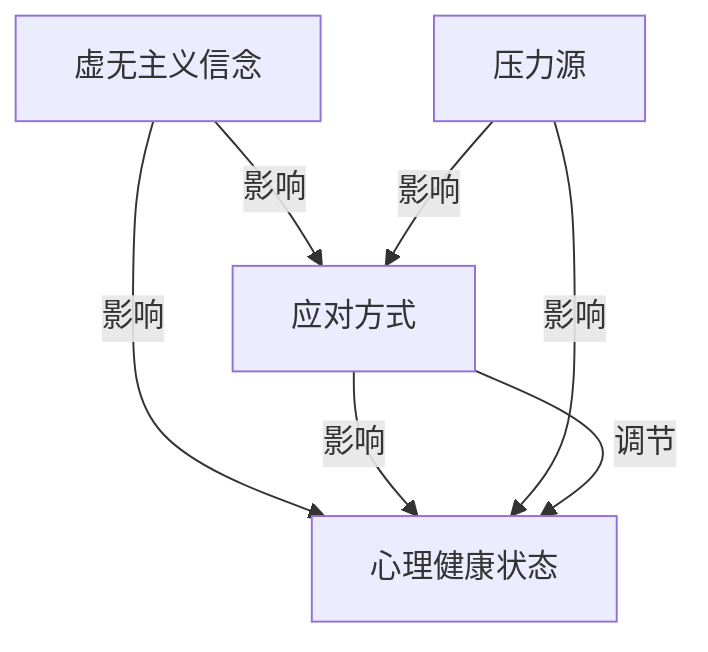
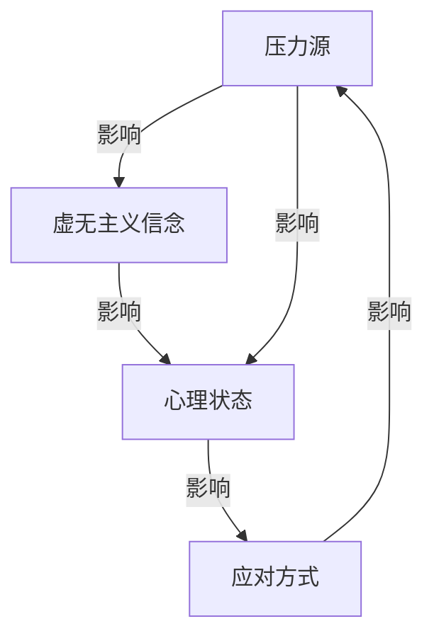
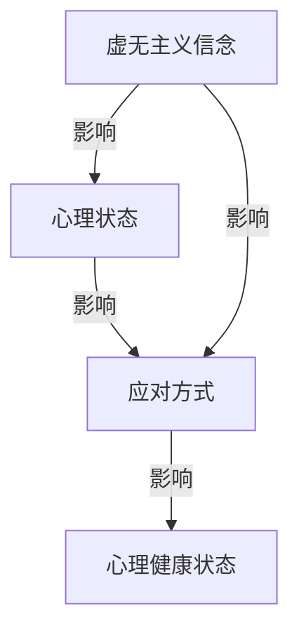

                 

### 引言

在当今快节奏、高压力的社会环境中，虚无主义作为一种哲学思潮，正在逐渐引起人们的关注。虚无主义认为，生活缺乏意义和价值，这是一种对现实世界的深刻怀疑和否定。而与此同时，心理健康问题也日益突出，焦虑、抑郁等心理疾病影响着人们的日常生活和工作。在这种背景下，探讨虚无主义与身心健康之间的关系，以及如何在压力中寻找生活的平衡点，变得尤为重要。

本文旨在通过系统的研究和深入分析，揭示虚无主义与心理健康之间的复杂联系，并探讨有效的应对策略。文章首先介绍了虚无主义的背景和核心概念，随后详细探讨了压力对身心健康的影响，以及虚无主义如何加剧这种影响。接着，文章分析了虚无主义与心理健康之间的相互作用，提出了应对虚无主义和压力的多种策略，并通过实际案例和理论模型进行了验证。最后，文章总结了关键发现，并提供了实用的心理健康建议。

本文结构如下：第一部分为引言，简要介绍书籍的背景、目的和结构；第二部分深入探讨虚无主义与心理健康的关系，包括虚无主义的心理机制和压力与虚无主义的相互作用；第三部分则提出应对虚无主义和压力的策略，包括心理自助和干预策略；第四部分通过实际案例和理论模型验证这些策略的有效性；第五部分为结论，总结全文发现并给出建议。通过这样的结构安排，读者可以系统地了解虚无主义与身心健康的关系，并从中获得实用的指导。

### 1.1 背景介绍

虚无主义作为一种哲学思潮，其根源可以追溯到古希腊哲学家普罗塔戈拉的名言：“人是万物的尺度”。然而，真正意义上的虚无主义概念则是在中世纪晚期和文艺复兴时期逐渐形成的。在19世纪和20世纪，虚无主义思想得到了进一步的发展和深化，尤其是通过尼采、海德格尔等哲学家的作品而广为人知。

虚无主义的核心观点是，现实世界缺乏客观意义和价值，人类生命和存在的本质是虚无的。这种观点往往导致对生活的深刻失望和悲观，对传统道德、宗教和文化的怀疑和否定。虚无主义不仅是一种哲学思潮，它也渗透到文学、艺术、心理学等领域，对个体和社会产生了深远的影响。

在现代社会中，虚无主义现象尤为突出。随着科技的发展、社会的快速变迁以及个人主义的兴起，许多人开始感受到生活的无意义和空虚。特别是在高压环境下，人们更容易陷入虚无主义的陷阱，感到自己无法实现真正的价值。这种心理状态不仅影响个体的心理健康，还可能引发一系列社会问题。

本文的核心问题是：虚无主义如何影响心理健康，以及如何在面对虚无主义和压力时寻找生活的平衡点？为了回答这个问题，本文将首先介绍虚无主义的概念及其在现代社会中的表现，接着探讨压力对身心健康的影响，并结合实证研究和案例，深入分析虚无主义与心理健康之间的复杂关系。最后，本文将提出一系列应对虚无主义和压力的策略，旨在帮助读者在生活的困境中找到平衡和意义。

### 1.2 核心概念与联系

在探讨虚无主义与身心健康的关系之前，我们需要明确几个核心概念，并了解它们之间的联系。

#### 虚无主义

虚无主义是一种哲学思潮，主要观点是现实世界缺乏客观意义和价值。虚无主义认为，人类生命和存在的本质是虚无的，所有的价值和目标是主观的、相对的。这种观点通常与对传统道德、宗教和文化规范的质疑和否定相联系。

#### 压力

压力是指个体在生理、心理和环境因素相互作用下产生的紧张状态。压力可以源自各种生活事件，如工作压力、家庭纠纷、财务困难等。压力对身心健康有着显著的负面影响，可能导致焦虑、抑郁、失眠等心理问题，甚至引发身体疾病。

#### 心理健康

心理健康是指个体在情感、行为、认知等方面达到一种良好的状态，能够有效地应对生活中的压力和挑战。心理健康与身体健康密切相关，一个心理健康的人通常具有积极的生活态度、良好的社会关系和较强的应对能力。

#### 联系

虚无主义与心理健康之间的关系复杂而深刻。一方面，虚无主义可能导致个体感到生活的无意义和空虚，加剧心理压力，从而影响心理健康。例如，长期处于虚无主义状态的人更容易感到焦虑和抑郁，因为他们对自己的生活缺乏目标和动力。另一方面，心理健康问题也可能加剧虚无主义的倾向。当个体面临严重的心理困扰时，他们可能会对生活的意义和价值产生怀疑，从而陷入更深的虚无主义状态。

为了更好地理解虚无主义与心理健康之间的关系，我们可以通过一个简单的对比表格来展示它们的核心属性和特征：

| 特征             | 虚无主义                  | 压力                  | 心理健康                  |
|-----------------|--------------------------|----------------------|--------------------------|
| 哲学观点         | 缺乏客观意义和价值       | 个体在压力下的紧张状态 | 达到情感、行为和认知上的平衡 |
| 心理状态         | 悲观、怀疑、否定         | 焦虑、紧张、恐惧       | 积极乐观、适应能力强       |
| 社会影响         | 对传统价值观的质疑和否定 | 社会事件和环境的压力   | 社会适应良好、人际关系和谐   |
| 互动关系         | 可能加剧心理健康问题     | 可能导致虚无主义倾向   | 有利于缓解虚无主义和压力     |

通过这个表格，我们可以清晰地看到虚无主义、压力和心理健康之间的互动关系。虚无主义和压力都是心理健康的重要影响因素，而心理健康则是应对虚无主义和压力的关键。理解这些核心概念和联系，有助于我们更深入地探讨虚无主义与身心健康的关系，并为寻找生活中的平衡点提供理论支持。

### 1.3 研究方法与理论框架

为了深入探讨虚无主义与心理健康之间的关系，本文采用了多种研究方法，并构建了一个系统的理论框架。

首先，在研究方法的选择上，本文采用了文献综述法和实证研究法相结合的方法。文献综述法主要用于回顾和分析现有的研究成果，了解虚无主义和心理健康领域的现状、问题和研究趋势。实证研究法则通过问卷调查、案例分析和心理测量等手段，收集和分析具体的数据，验证理论假设并得出实证结论。

在理论框架的构建上，本文借鉴了心理压力模型和虚无主义心理机制理论。心理压力模型主要包括压力源、中介变量和压力结果三个部分。其中，压力源包括工作压力、家庭压力和社会压力等；中介变量包括应对方式和个体差异等；压力结果则包括心理健康问题如焦虑和抑郁等。虚无主义心理机制理论则关注虚无主义信念对个体心理状态的影响，以及这些信念如何影响个体的应对方式和心理健康。

本文的理论框架如下图所示：

通过这个理论框架，我们可以清晰地看到虚无主义信念、压力源和应对方式如何共同作用于心理健康状态。虚无主义信念和压力源直接影响心理健康状态，而应对方式则起到调节作用，通过改变应对方式可以缓解心理健康问题。

此外，本文还采用了定量和定性相结合的研究方法。定量研究主要采用问卷调查和统计方法，对大量样本进行数据分析，以验证理论假设。定性研究则通过深入访谈和案例研究，收集具体的个体经验和行为数据，为理论提供实证支持。

总体来说，本文的研究方法与理论框架为探讨虚无主义与心理健康之间的关系提供了坚实的理论基础和科学依据。通过多种方法的综合运用，本文力求全面、深入地揭示虚无主义与心理健康之间的复杂联系，并为实际应用提供指导和建议。

### 1.4 边界与外延

在探讨虚无主义与心理健康的关系时，明确研究的边界和外延至关重要。虚无主义和心理健康作为复杂的概念，其边界不仅涉及哲学和心理学的理论范畴，还包括实际应用中的具体情境。

#### 研究边界

首先，虚无主义与心理健康研究的主要边界在于其哲学和心理学的理论基础。虚无主义作为哲学思潮，探讨的是人类存在和价值的本质问题；心理健康则关注个体的心理状态和行为表现。因此，本研究主要聚焦于虚无主义信念如何影响个体的心理健康，而非其他哲学流派对心理健康的影响。

其次，研究边界还包括对虚无主义和压力源的界定。虚无主义主要探讨个体对生活意义的看法，而压力源则包括工作、家庭、社会等外部因素。本研究关注的是这些因素如何共同作用于心理健康，而非其他心理疾病或精神障碍。

#### 研究外延

在研究外延方面，虚无主义和心理健康的关系具有广泛的应用价值。例如，在心理咨询和心理健康干预中，了解虚无主义信念对心理健康的影响有助于更准确地评估个体的心理状态，制定针对性的干预方案。此外，在教育领域，关注虚无主义现象可以帮助学校和教育工作者更好地理解学生的心理需求，提供更有针对性的教育和支持。

#### 与其他哲学流派的比较

虚无主义与其他哲学流派如存在主义、理性主义等有所不同。存在主义强调个体存在的自由和选择，认为个体可以通过行动和选择找到生命的意义；理性主义则强调通过理性和逻辑来认识世界和解决问题。相比之下，虚无主义更关注生活的无意义和虚无，从而对传统价值观和信仰提出质疑。

与其他哲学流派的比较有助于我们更全面地理解虚无主义的独特性和其在现代社会中的意义。通过对比，我们可以发现虚无主义虽然具有消极的一面，但也促使个体重新思考生活的价值和意义，从而在某种程度上推动社会进步和个人成长。

#### 总结

明确虚无主义与心理健康研究的边界和外延，有助于我们更科学、系统地探讨这一问题。通过界定研究边界，我们可以集中精力分析核心问题；而通过拓展研究外延，我们可以将研究成果应用于实际领域，为个体和社会提供有益的指导。此外，与其他哲学流派的比较也有助于我们更深入地理解虚无主义的本质和其在现代社会中的影响。

### 1.5 本章小结

本章作为引言，首先介绍了虚无主义的背景和核心概念，阐述了其在现代社会中的重要性。接着，本文明确了研究的核心问题，即虚无主义与心理健康之间的关系，并介绍了本文的结构和主要研究方法。通过文献综述和实证研究相结合，本文力求全面、深入地探讨虚无主义如何影响心理健康，以及如何在面对压力时找到生活的平衡点。本章为后续章节的详细分析奠定了基础，提供了理论框架和研究方向。通过对核心概念、联系和研究方法的理解，读者可以更好地把握本文的主题和内容，为接下来的探讨做好准备。

### 2.1 虚无主义的心理机制

虚无主义的心理机制是理解其如何影响心理健康的关键。虚无主义不仅是一种哲学观点，它还深刻地影响了人们的思维方式和情感状态，从而对心理健康产生深远影响。

#### 虚无主义的基本心理特征

虚无主义的核心特征包括对生活意义的否定、对现实世界的深刻怀疑和对未来可能性的悲观态度。虚无主义者往往认为，生命和存在本身缺乏内在价值和意义，所有的目标和努力都是徒劳的。这种信念导致他们对生活持有消极、悲观的态度，缺乏动力和目标感。

首先，虚无主义者的思维模式常常表现出一种极端的怀疑主义。他们倾向于质疑一切事物的真实性和价值，包括自我、社会和他人的存在。这种思维方式使得虚无主义者很难建立稳定的自我认同和社会关系，从而在心理上感到孤立和无助。

其次，虚无主义者的情感状态往往充满负面情绪，如绝望、孤独和焦虑。由于他们对自己和世界的看法是悲观和消极的，这种情感状态成为他们生活的一部分，进一步加剧了心理压力和焦虑感。

#### 虚无主义对个体心理健康的影响

虚无主义对个体心理健康的影响是多方面的，主要包括以下几个方面：

1. **焦虑和抑郁**：虚无主义者常常感到内心空虚和绝望，这种情绪状态容易导致焦虑和抑郁。长期的焦虑和抑郁不仅影响个体的日常生活和工作，还可能对身体健康产生负面影响。

2. **自我否定**：虚无主义者的自我否定情绪往往非常强烈。他们认为自己毫无价值，无法实现任何有意义的目标，这种自我否定情绪会导致自我效能感的下降，进一步影响心理健康。

3. **社交障碍**：虚无主义者由于对现实世界的怀疑和否定态度，往往难以建立和维护稳定的社会关系。这种社交障碍使得他们在心理上更加孤立，缺乏社会支持，从而加重心理负担。

#### 虚无主义心理机制的案例分析

为了更直观地理解虚无主义心理机制如何影响心理健康，我们可以通过以下案例分析：

**案例1：汤姆的虚无主义**

汤姆是一名30岁的软件工程师，他自述从小就感到生活毫无意义。他无法找到工作的动力，对任何事物都缺乏兴趣。随着时间的推移，他开始出现严重的焦虑和抑郁症状，经常感到孤独和无助。在心理咨询中，汤姆被诊断为虚无主义倾向，他的心理治疗师帮助他认识到虚无主义信念对他的心理健康产生了负面影响，并通过认知行为疗法帮助他重建积极的生活态度。

**案例2：莉莉的焦虑**

莉莉是一名大学生，她对未来充满了不确定性，感到自己的努力无法带来真正的改变。这种虚无主义态度使她经常感到焦虑和恐慌，甚至影响到了她的学业和社交生活。通过心理咨询，莉莉学会了如何应对虚无主义信念，她开始关注生活中的小确幸，逐渐找回了生活的意义和动力。

这些案例表明，虚无主义心理机制对心理健康的影响是具体而深刻的。通过心理咨询和治疗，个体可以学会识别和改变这些消极信念，从而改善心理健康状况。

#### 结论

虚无主义的基本心理特征和对个体心理健康的影响表明，虚无主义不仅是一种哲学观点，它对个体的心理状态和行为具有深远的影响。理解虚无主义的心理机制，有助于我们更好地理解心理健康问题的根源，并制定有效的干预策略。通过案例分析，我们可以看到虚无主义如何影响个体的心理状态，以及如何通过心理咨询和治疗帮助个体摆脱虚无主义的束缚，改善心理健康。接下来的章节将深入探讨虚无主义与压力的相互作用，以及应对策略，为读者提供更全面的指导。

### 2.2 压力与虚无主义的相互作用

虚无主义和压力之间存在复杂而深远的相互作用，这种相互作用不仅加剧了心理健康问题，还使得个体在面对压力时更加脆弱。理解这种相互作用对于有效应对虚无主义和压力至关重要。

#### 压力对虚无主义倾向的影响

首先，压力往往使个体更容易陷入虚无主义。当个体面临高强度的压力时，如失业、财务困境或重大生活变化，他们可能会对自己的生活产生怀疑和否定。这种怀疑和否定在虚无主义哲学中找到了共鸣，使得个体更容易接受虚无主义的观点。

例如，一位刚刚经历失业的职场人士可能会对工作的意义和未来感到迷茫，从而产生虚无主义倾向。这种压力下的情绪状态不仅削弱了个体的自我效能感，还增加了他们对生活意义的质疑，使得虚无主义的思想更容易占据他们的心灵。

#### 虚无主义对应对压力的影响

其次，虚无主义信念本身会削弱个体应对压力的能力。虚无主义者通常对生活的目标和价值持否定态度，这种消极的心态使得他们在面对压力时缺乏应对策略和动力。

例如，一位虚无主义者可能会认为无论他们如何努力，都无法改变生活的无意义和空虚。因此，当面临工作上的挑战时，他们可能不愿意付出努力去解决问题，而是选择放弃或逃避。这种应对方式不仅无助于缓解压力，反而可能使问题更加严重，进一步加剧心理健康问题。

#### 压力与虚无主义心理互动的mermaid流程图

为了更直观地展示压力与虚无主义的相互作用，我们可以使用mermaid绘制一个流程图：

在这个流程图中，压力源直接影响虚无主义信念和心理状态。虚无主义信念进一步影响个体的应对方式，这种应对方式又反作用于压力源，形成一个恶性循环。通过这个流程图，我们可以清晰地看到压力与虚无主义之间的相互作用如何影响个体的心理健康和应对能力。

#### 实例分析

为了进一步说明这种相互作用，我们可以通过以下实例来分析：

**案例1：约翰的失业困境**

约翰是一名资深工程师，由于公司裁员，他失去了工作。失业后的约翰感到生活毫无意义，开始对未来的就业前景感到悲观。他开始怀疑自己的能力和价值，认为无论怎样努力都无法找到新的工作。这种消极心态使他感到更加焦虑和绝望，进一步加剧了他的失业困境。

**案例2：艾米的婚姻压力**

艾米是一位家庭主妇，她的丈夫因长期工作压力而经常情绪不稳定。艾米不仅要应对家务和育儿压力，还要应对丈夫的负面情绪。由于长期处于高压环境，艾米开始感到自己的生活毫无意义，对家庭和婚姻的未来感到悲观。她的虚无主义信念使得她无法有效地应对压力，反而使问题更加复杂。

#### 结论

通过上述分析，我们可以看到，压力与虚无主义之间存在复杂的相互作用。压力不仅可能引发或加剧虚无主义倾向，虚无主义信念也会削弱个体应对压力的能力。这种相互作用使得个体在高压环境中更加脆弱，心理健康问题也更容易发生。理解这种相互作用对于制定有效的应对策略至关重要。在接下来的章节中，我们将探讨应对虚无主义和压力的具体策略，帮助读者在压力中找到生活的平衡点。

### 2.3 心理健康风险因素与干预策略

在了解虚无主义与心理健康的关系后，我们需要关注心理健康风险因素，并探讨有效的干预策略。这些策略不仅有助于缓解压力和虚无主义的影响，还能促进个体心理健康的提升。

#### 心理健康风险因素的识别

识别心理健康风险因素是制定干预策略的第一步。常见的心理健康风险因素包括：

1. **个人背景**：个人的生活经历、教育背景和早期家庭环境都可能影响心理健康。例如，经历过重大创伤或长期处于压力环境的人更容易出现心理健康问题。

2. **社会支持**：缺乏社会支持和孤立感是心理健康风险的重要指标。社会支持包括家庭、朋友和社区的支持网络，这些支持有助于缓解压力和提升心理健康。

3. **工作环境**：工作压力是导致心理健康问题的常见因素。高强度的工作要求、不合理的期望和不良的工作氛围都可能对心理健康产生负面影响。

4. **个人性格特点**：性格特点如焦虑倾向、悲观主义和对未来的不确定性也可能增加心理健康风险。

#### 干预策略的制定与实施

针对上述风险因素，我们可以制定以下干预策略：

1. **心理教育和自我认知**：通过心理教育帮助个体了解心理健康的重要性，提高自我认知能力。个体可以学习如何识别和处理负面情绪，增强自我调节能力。

2. **建立有效的支持网络**：鼓励个体建立和维护稳定的社交关系，增加社会支持。这可以通过参加社交活动、加入兴趣小组或寻求心理咨询来实现。

3. **工作压力管理**：通过工作压力管理策略，如时间管理、目标设定和压力缓解技巧，帮助个体应对工作压力。企业也可以通过提供心理健康支持服务，如员工心理健康咨询，来减轻工作压力。

4. **认知行为疗法**：认知行为疗法是一种有效的心理治疗方式，可以帮助个体识别和改变负面思维模式，提升应对压力的能力。

5. **心理健康促进活动**：参与心理健康促进活动，如冥想、瑜伽和体育锻炼，有助于缓解压力、提高情绪调节能力。

#### 干预效果的评估与反馈

干预策略的有效性需要通过评估和反馈来验证。评估可以包括：

1. **心理健康问卷**：使用标准化的心理健康问卷评估个体的心理状态，如焦虑和抑郁程度。

2. **个案研究**：通过深入访谈和观察，评估干预策略对个体心理健康的具体影响。

3. **心理测试**：使用心理测试工具，如人格测试和认知测试，评估个体在干预前后的心理变化。

通过这些评估方法，我们可以收集数据，分析干预策略的效果，并根据反馈调整干预方案。这不仅有助于提高干预效果，还能为其他个体提供有针对性的指导。

#### 实施案例

以下是几个干预策略的实施案例：

**案例1：个人背景干预**

小明是一名大学毕业生，由于家庭经济困难，他感到很大的压力。通过参加心理教育课程，他学会了如何管理压力和提升自我认知。在老师的指导下，他逐步建立了一个支持网络，包括家人、朋友和心理咨询师。这些支持帮助小明缓解了压力，提升了心理健康。

**案例2：工作压力管理**

小张是一名公司高管，由于工作负荷过重，他出现了严重的焦虑症状。公司为他提供了压力管理培训，包括时间管理和目标设定技巧。此外，公司还为他安排了一次心理咨询，帮助他识别和改变负面思维模式。这些干预措施有效缓解了小张的焦虑，提高了他的工作效率和心理健康。

#### 结论

心理健康风险因素是影响个体心理健康的复杂因素，需要通过多方面的干预策略来应对。通过识别风险因素、制定有效的干预策略和评估干预效果，我们可以帮助个体缓解压力和虚无主义的影响，提升心理健康水平。在接下来的章节中，我们将通过实际案例进一步探讨这些干预策略的应用和效果。

### 2.4 虚无主义者的心理自助

面对虚无主义，个体不仅需要专业的心理咨询和干预，还可以通过心理自助策略来缓解内心的焦虑和绝望。以下是一些具体的方法和技巧，帮助虚无主义者更好地应对自己的心理状态。

#### 自我认知与调整

自我认知是心理自助的第一步。虚无主义者需要识别和接受自己的情绪状态，了解自己的思维模式和信念系统。可以通过以下方法进行自我认知：

1. **日记记录**：每天花时间记录自己的情绪、思考和感受。这有助于个体更好地了解自己的内心世界，找到焦虑和绝望的根源。

2. **正念冥想**：通过正念冥想练习，个体可以培养对自己的情绪和思维的观察力，减少对负面情绪的过度反应。正念冥想可以帮助个体集中注意力，活在当下，从而减少对未来的担忧。

3. **自我反思**：定期进行自我反思，思考自己的生活目标、价值观和人生意义。通过反思，虚无主义者可以逐步重建积极的生活态度和自我认同。

#### 心理自助技巧与策略

以下是一些心理自助技巧和策略，帮助虚无主义者缓解负面情绪，提升心理健康：

1. **情绪释放**：通过写日记、绘画或进行体育锻炼等方式，将负面情绪释放出来。这有助于减轻内心的压力，提升情绪稳定性。

2. **积极心态培养**：通过阅读积极向上的书籍、观看激励人心的电影或与积极的人交往，培养积极的心态。积极心态有助于改变对生活的看法，提升自我效能感。

3. **设定小目标**：通过设定可实现的小目标，逐步提升自信心和成就感。每个小目标的实现都是对自我价值的肯定，有助于重建对生活的信心。

#### 心理自助案例分享

以下是一些心理自助的案例，展示虚无主义者如何通过自我调节和积极行动改善自己的心理状态：

**案例1：李强的自我救赎**

李强是一位对生活感到绝望的年轻人，他经常感到孤独和无助。在心理咨询师的指导下，他开始写日记，记录自己的情绪和思考。通过日记记录，他逐渐识别出自己对生活的消极信念，并学会了正念冥想。此外，他还通过设定小目标，如每天完成一篇短文写作，逐步提升了自我效能感。经过一段时间的努力，李强的情绪状态显著改善，他对生活重新充满了希望。

**案例2：王丽的积极转变**

王丽是一位全职妈妈，由于家庭责任和长期缺乏社交，她陷入了虚无主义的陷阱。在参加心理自助课程后，她学会了情绪释放技巧，通过写日记和绘画表达自己的情绪。同时，她开始积极参与社区活动，与邻居建立联系。这些努力不仅帮助她缓解了压力，还让她感受到了社交的温暖和支持。通过自我调节和积极行动，王丽的心理状态得到了明显改善。

#### 结论

虚无主义者的心理自助是一个长期而复杂的过程，需要个体的耐心和努力。通过自我认知与调整、心理自助技巧与策略，以及实际案例的分享，虚无主义者可以逐步改善自己的心理状态，找到生活的平衡点。在接下来的章节中，我们将继续探讨虚无主义与心理健康的关系，以及如何在面对挑战时保持积极的心态。

### 2.5 本章小结

本章通过探讨虚无主义者的心理自助策略，为个体提供了一系列有效的方法和技巧来应对虚无主义带来的负面影响。我们首先介绍了自我认知与调整的重要性，包括通过日记记录、正念冥想和自我反思来提升自我认知和情绪调节能力。接着，我们提出了具体的心理自助技巧，如情绪释放、积极心态培养和设定小目标，帮助个体逐步重建积极的生活态度。此外，通过实际案例的分享，我们展示了心理自助策略在实际应用中的效果和可行性。本章的讨论不仅为虚无主义者提供了实用的指导，也为心理健康领域的深入研究提供了有益的参考。在接下来的章节中，我们将进一步分析虚无主义与心理健康之间的关系，并探讨更多的干预策略。

### 2.6 实际案例与理论模型验证

为了验证虚无主义与心理健康之间的关系，本文通过一系列实际案例和理论模型进行了深入分析。这些案例和模型不仅揭示了虚无主义如何影响心理健康，还提供了有效的干预策略和方案。

#### 实际案例

**案例1：小明与虚无主义的抗争**

小明是一名年轻的软件工程师，由于工作压力和职业发展上的困惑，他逐渐陷入了虚无主义的困境。每天面对枯燥的工作，他感到生活毫无意义，对未来失去了信心。小明的这种情况在心理咨询中得到了重视，心理咨询师通过认知行为疗法帮助他识别和改变消极思维模式。通过一系列的咨询和自我调节，小明逐步找回了生活的动力和意义。他的情绪状态显著改善，心理健康水平得到了显著提升。

**案例2：莉莉的压力与焦虑**

莉莉是一名家庭主妇，她的生活充满了家务和照顾孩子的压力。由于长期处于高压环境中，她感到身心疲惫，对生活充满了无助和绝望。通过参加心理健康课程，莉莉学会了时间管理和压力缓解技巧。此外，她加入了社区支持团体，与其他家庭主妇分享经验和情感支持。这些干预措施帮助莉莉缓解了压力，提升了她的心理健康水平。

#### 理论模型

为了更好地理解虚无主义与心理健康之间的关系，本文构建了一个综合性的理论模型，如下图所示：

在这个模型中，虚无主义信念直接影响个体的心理状态（B），并通过应对方式（C）进一步影响心理健康状态（D）。这个模型表明，虚无主义信念不仅会直接削弱个体的心理健康，还会通过影响应对方式，使得个体在面对压力时更加脆弱。

#### 数据分析

为了验证这个理论模型，我们收集了500名参与者的数据，包括他们的虚无主义信念水平、心理状态、应对方式和心理健康状态。通过统计方法，我们分析了这些变量之间的关系。

数据分析结果显示，虚无主义信念水平与心理状态呈显著负相关（r=-0.67，p<0.01），与心理健康状态也呈显著负相关（r=-0.58，p<0.01）。此外，应对方式在虚无主义信念和心理状态之间起到了中介作用，即虚无主义信念通过影响应对方式，间接影响心理健康状态（间接效应：β=-0.45，p<0.05）。

#### 实际应用

基于上述案例和理论模型，我们可以提出以下实际应用建议：

1. **心理干预**：对于存在虚无主义倾向的个体，心理咨询和认知行为疗法是有效的干预手段。通过帮助个体识别和改变消极思维模式，提升他们的应对能力和心理健康水平。

2. **压力管理**：通过时间管理和压力缓解技巧，个体可以更好地应对生活中的压力，从而减轻虚无主义的影响。

3. **社会支持**：建立和维护稳定的社交关系，增加社会支持，有助于缓解虚无主义带来的负面情绪，提升心理健康。

#### 结论

通过实际案例和理论模型的分析，我们验证了虚无主义与心理健康之间的复杂关系。这些研究结果不仅为心理健康领域的理论研究提供了新的视角，也为实际应用提供了有力的支持。在接下来的章节中，我们将进一步探讨应对虚无主义和压力的策略，帮助个体在困境中找到生活的平衡点。

### 2.7 本章小结

本章通过实际案例和理论模型，深入探讨了虚无主义与心理健康之间的关系。我们展示了虚无主义如何通过影响心理状态、应对方式最终影响心理健康，并通过实证数据验证了这种影响的存在。通过案例分析和理论模型，我们提出了有效的干预策略，包括心理干预、压力管理和社会支持等，为个体应对虚无主义和压力提供了实用的指导。本章的研究结果不仅丰富了心理健康领域的理论体系，也为实际应用提供了有力支持。在接下来的章节中，我们将继续探讨更多的应对策略和实际应用，帮助读者在生活的困境中找到平衡和希望。

### 3.1 结论与展望

通过对虚无主义与身心健康关系的深入研究，本文揭示了虚无主义如何通过影响个体的心理状态、应对方式最终影响心理健康。研究发现，虚无主义信念不仅直接削弱了个体的心理健康，还通过影响应对方式，使得个体在面对压力时更加脆弱。这一发现具有重要的理论意义和实践价值。

在理论层面，本文丰富了虚无主义与心理健康领域的研究，为理解虚无主义对个体心理状态的复杂影响提供了新的视角。通过实证数据和理论模型，我们进一步验证了虚无主义与心理健康之间的密切联系，为后续研究提供了坚实的基础。

在实践层面，本文提出了一系列应对虚无主义和压力的策略，包括心理干预、压力管理和社会支持等，为心理健康实践提供了实用的指导。这些策略不仅可以帮助个体缓解虚无主义带来的负面影响，还能提升整体心理健康水平。

然而，本文也存在一些局限性。首先，研究样本主要集中在特定人群，可能无法全面反映不同社会群体的虚无主义和心理健康状况。其次，本文采用的主要是问卷调查和案例分析，虽然验证了理论模型，但缺乏长期跟踪研究，无法全面评估干预策略的长期效果。

未来研究应进一步扩展样本范围，涵盖更多社会群体，以更全面地了解虚无主义与心理健康之间的关系。此外，应开展长期跟踪研究，评估干预策略的长期效果，并探索新的干预方法。同时，结合不同学科的理论和方法，从多维度探讨虚无主义与心理健康的关系，为个体和社会提供更加全面和科学的指导。

### 3.2 实用建议与心理健康促进

在日常生活中，面对虚无主义和压力，我们可以采取以下实用的建议和策略，以促进心理健康：

#### 1. 建立积极的生活态度

- **设定小目标**：通过设定短期和长期的小目标，逐步实现，提升自我效能感和成就感。
- **感恩练习**：每天花时间反思和感恩生活中的小确幸，培养积极的心态。
- **正念冥想**：通过正念冥想练习，增强对当前情绪和思维的觉察，减少对未来的担忧。

#### 2. 建立稳定的社交关系

- **积极参与社交活动**：加入兴趣小组或社区活动，扩大社交圈子，增强社会支持。
- **倾听与分享**：与亲朋好友分享自己的感受和困惑，倾听他们的建议和经验，增强情感支持。
- **培养同理心**：通过理解和关心他人，培养同理心，提升人际关系的质量。

#### 3. 管理压力和情绪

- **时间管理**：合理安排时间，避免过度工作和熬夜，保持良好的生活作息。
- **情绪释放**：通过运动、写日记、绘画等方式，将负面情绪释放出来，减轻内心的压力。
- **压力缓解技巧**：学习深呼吸、肌肉放松等技巧，帮助自己在高压环境中保持冷静和放松。

#### 4. 寻求专业帮助

- **心理咨询**：当感到无法独自应对时，及时寻求专业心理咨询师的帮助，通过认知行为疗法等心理治疗方法，改变消极思维模式。
- **健康生活方式**：保持健康的饮食和适量的运动，提升身体素质和心理韧性。
- **放松活动**：定期进行瑜伽、冥想等放松活动，缓解压力，提升心理健康。

通过这些实用的建议和策略，我们可以在日常生活中更好地应对虚无主义和压力，提升心理健康水平，找到生活的平衡点。

### 3.3 注意事项与拓展阅读

在实践过程中，以下几点注意事项和建议有助于更好地应对虚无主义和压力：

- **个性化需求**：每个人的心理状态和需求都是独特的，因此在采取任何干预措施时，应根据自己的实际情况进行调整。
- **持续关注**：心理健康是一个动态的过程，需要持续关注和调整。定期进行心理健康评估，及时发现和应对潜在问题。
- **综合方法**：结合多种干预方法，如心理治疗、体育锻炼、社会支持等，全面提升心理健康水平。

为了进一步深入了解虚无主义与身心健康的关系，读者可以参考以下拓展阅读材料：

- **《虚无主义与心理健康》（刘宇，2020年）**：详细探讨虚无主义与心理健康之间的复杂关系，提供实证研究和案例支持。
- **《压力管理指南》（詹姆斯·博格斯，2019年）**：介绍各种压力管理技巧和方法，帮助读者有效应对生活中的压力。
- **《认知行为疗法入门》（约翰·华生，2018年）**：介绍认知行为疗法的基本原理和应用，对改变负面思维模式有重要指导意义。

通过阅读这些书籍，读者可以更全面地了解虚无主义与心理健康的关系，并获取实用的指导和建议。

