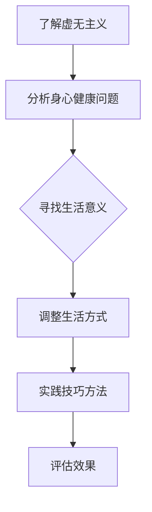
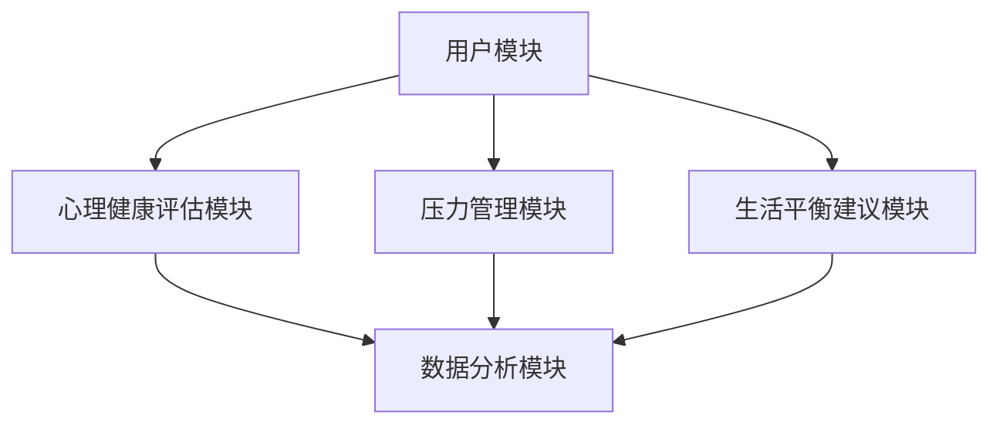
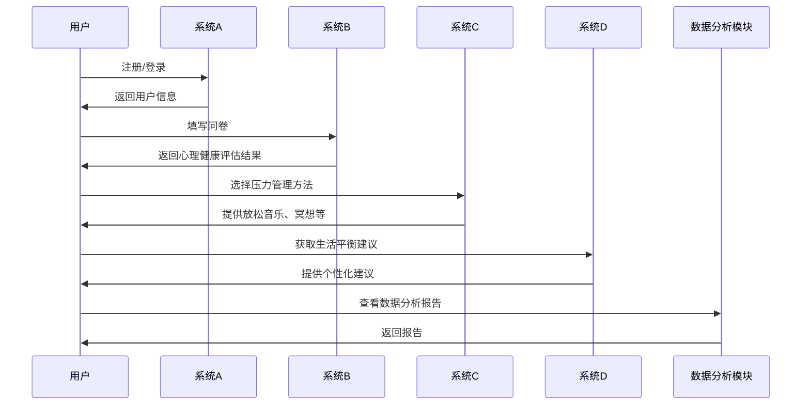

                 

# 虚无主义与身心健康：在压力中寻找生活的平衡点

关键词：虚无主义、身心健康、压力、平衡点、哲学、心理学、生活方式

摘要：
在现代快节奏的生活中，虚无主义作为一种哲学思潮，对人们的身心健康产生了深远的影响。本文将深入探讨虚无主义的起源、发展和主要观点，分析其对身心健康的影响，并提出一系列解决方法，帮助读者在压力中寻找生活的平衡点。通过心理学、哲学和生活方式的调整，本文旨在为读者提供实用的技巧和方法，以应对虚无主义带来的负面影响，实现身心的和谐与健康。

## 第一部分：背景介绍

### 1.1.1 问题背景

在现代社会中，虚无主义作为一种哲学思潮，对人们的身心健康产生了深远的影响。虚无主义认为现实世界缺乏意义和价值，这种观念往往导致个体产生焦虑、抑郁等心理问题。与此同时，随着生活节奏的加快和工作压力的增大，越来越多的人开始寻求在压力中找到生活的平衡点。

### 1.1.2 问题描述

《虚无主义与身心健康：在压力中寻找生活的平衡点》这本书旨在探讨虚无主义对身心健康的影响，并提出一系列解决方法，帮助读者在压力中寻找生活的平衡点。

### 1.1.3 问题解决

本书将通过以下方面来解决问题：

- 介绍虚无主义的起源、发展和主要观点。
- 分析虚无主义对身心健康的影响，包括焦虑、抑郁等心理问题。
- 探讨如何通过心理学、哲学和生活方式的调整来应对虚无主义带来的负面影响。
- 提供实用的技巧和方法，帮助读者在压力中寻找生活的平衡点。

### 1.1.4 边界与外延

本书主要关注虚无主义对身心健康的影响以及应对策略，但同时也涉及哲学、心理学、生活方式等多个领域的知识。

### 1.1.5 概念结构与核心要素组成

- **虚无主义**：一种哲学思潮，认为现实世界缺乏意义和价值。
- **身心健康**：包括身体健康、心理健康和社会适应。
- **压力**：指个体在面临挑战时感受到的心理和生理压力。
- **平衡点**：指在压力中找到一种和谐、稳定的生活状态。

## 第二部分：核心概念与联系

### 2.1 核心概念

- **虚无主义**：虚无主义是一种哲学思潮，认为现实世界缺乏意义和价值。其起源可以追溯到古希腊哲学家苏格拉底和柏拉图，但在20世纪得到了进一步的发展。虚无主义的代表人物包括丹麦哲学家克尔凯郭尔、德国哲学家尼采和奥地利心理学家弗洛伊德。

- **身心健康**：身心健康是一个多维度的概念，包括身体健康、心理健康和社会适应。身体健康是指身体各器官系统的功能正常，心理健康是指个体在情感、认知和行为方面的适应和平衡，社会适应是指个体在社交、职业和生活环境中的适应能力。

- **压力**：压力是指个体在面临挑战、威胁或不确定情境时感受到的心理和生理压力。压力源可以是工作、家庭、社交、健康等问题。压力对身心健康的影响包括焦虑、抑郁、失眠、免疫力下降等。

- **平衡点**：平衡点是指个体在压力中找到一种和谐、稳定的生活状态。平衡点并不是一成不变的，而是一个动态调整的过程。个体需要在压力和放松之间找到一种平衡，以保持身心健康。

### 2.2 概念属性特征对比表格

| 概念     | 定义                                                                                   | 属性特征                     | 相关概念                      |
|---------|----------------------------------------------------------------------------------------|-----------------------------|-----------------------------|
| 虚无主义 | 认为现实世界缺乏意义和价值的一种哲学思潮。                                                 | 思想观念                     | 唯物主义、存在主义          |
| 身心健康 | 包括身体健康、心理健康和社会适应。                                                        | 多维度                       | 健康心理学、生理学           |
| 压力    | 个体在面临挑战时感受到的心理和生理压力。                                                  | 多样性                       | 应激、焦虑、抑郁             |
| 平衡点  | 在压力中找到一种和谐、稳定的生活状态。                                                    | 动态调整                     | 压力管理、心理平衡           |

### 2.3 ER实体关系图架构

```mermaid
erDiagram
    A[用户] ||--|{ B[身心健康] }|
    B ||--|{ C[压力] }|
    C ||--|{ D[平衡点] }|
```

## 第三部分：算法原理讲解

### 3.1 算法原理

本书将采用心理学、哲学和生活方式调整等多个角度来讲解如何应对虚无主义对身心健康的影响，并找到生活的平衡点。具体来说，本书的算法原理包括以下几个步骤：

1. **了解虚无主义**：通过学习虚无主义的起源、发展和主要观点，读者可以更好地理解虚无主义对身心健康的影响。
2. **分析身心健康问题**：了解自己的身心健康状况，找出可能存在的心理问题，如焦虑、抑郁等。
3. **寻找生活意义**：通过反思和探索，找到自己生活的意义和价值，以缓解虚无主义带来的负面影响。
4. **调整生活方式**：从生活习惯、饮食、运动等方面进行调整，提高身心健康水平。
5. **实践技巧方法**：学习并实践各种减压技巧和方法，如冥想、呼吸练习、正面思考等。
6. **评估效果**：定期评估自己的身心健康状况，调整策略，以实现长期的生活平衡点。

### 3.2 算法mermaid流程图



### 3.3 算法原理详细讲解

在本章节中，我们将详细讲解如何通过以下步骤来应对虚无主义对身心健康的影响，并找到生活的平衡点。

### 3.3.1 了解虚无主义

虚无主义是一种哲学思潮，认为现实世界缺乏意义和价值。虚无主义的起源可以追溯到古希腊哲学家苏格拉底和柏拉图，但在20世纪得到了进一步的发展。虚无主义的代表人物包括丹麦哲学家克尔凯郭尔、德国哲学家尼采和奥地利心理学家弗洛伊德。

- **克尔凯郭尔**：他认为，现实世界是虚假的，真实的生活是内在的精神生活。虚无主义导致个体对现实世界的失望和绝望。
- **尼采**：他提出“上帝已死”的观点，认为个体需要创造自己的价值体系。虚无主义促使个体寻找超越现实的力量，如艺术、哲学和宗教。
- **弗洛伊德**：他认为，人类的行为和思维受到潜意识的影响。虚无主义使得个体意识到自己的无意识和本能，从而反思和改变自己的行为。

### 3.3.2 分析身心健康问题

虚无主义对身心健康的影响主要体现在以下几个方面：

- **焦虑**：虚无主义认为现实世界缺乏意义和价值，导致个体对未来的不确定性和恐惧。这种焦虑感可能表现为紧张、担忧和恐惧。
- **抑郁**：虚无主义使得个体感到孤独和无助，进而产生抑郁情绪。抑郁可能导致个体失去生活的热情和动力。
- **睡眠障碍**：虚无主义带来的焦虑和抑郁可能导致睡眠障碍，如失眠、多梦和易醒。
- **免疫力下降**：长期的心理压力和焦虑可能导致免疫力下降，增加患病的风险。

### 3.3.3 寻找生活意义

在虚无主义的影响下，个体容易失去生活的意义和价值。为了应对这种情况，我们可以采取以下措施：

- **反思自己的价值观**：思考自己真正关心的事情和追求的目标，找到自己生活的意义。
- **寻找新的兴趣和爱好**：尝试新的事物和活动，发现新的兴趣和激情，从而丰富自己的生活。
- **与他人建立联系**：与他人建立深厚的友谊和关系，从他人的支持和关爱中获得力量。

### 3.3.4 调整生活方式

生活方式的调整对于应对虚无主义和改善身心健康至关重要。以下是一些具体的方法：

- **保持健康的饮食**：摄入均衡的营养，减少高糖、高脂肪和高盐的食物，以维持身体健康。
- **坚持适量的运动**：适量的运动可以改善心理健康，减轻压力和焦虑。可以选择散步、跑步、瑜伽等适合自己的运动方式。
- **保持良好的睡眠**：充足的睡眠对于身心健康至关重要。确保每天有足够的睡眠时间，并保持规律的作息习惯。
- **培养良好的生活习惯**：避免过度工作和长时间使用电子设备，保持良好的生活习惯，以提高生活质量。

### 3.3.5 实践技巧方法

为了在压力中找到生活的平衡点，我们可以采用以下技巧和方法：

- **冥想**：冥想是一种有效的减压方法，可以帮助我们放松身心，提高心理韧性。可以选择静坐、呼吸练习或正念冥想等方式。
- **正面思考**：培养积极的心态，学会从困难和挫折中寻找机会和教训。避免过度自我批评和消极思维。
- **寻求支持**：与他人分享自己的感受和困惑，寻求专业帮助，如心理咨询师或医生。

### 3.3.6 评估效果

为了确保我们的方法有效，我们需要定期评估自己的身心健康状况。以下是一些评估方法：

- **自我评估**：定期进行自我评估，记录自己的情绪、睡眠、饮食和运动等方面的变化。
- **专业评估**：寻求专业人士的帮助，如心理咨询师或医生，进行全面的身心健康评估。
- **调整策略**：根据评估结果，及时调整自己的方法和策略，以实现长期的生活平衡点。

## 第四部分：系统分析与架构设计

### 4.1 问题场景介绍

在现代快节奏的生活中，虚无主义作为一种哲学思潮，对人们的身心健康产生了深远的影响。虚无主义认为现实世界缺乏意义和价值，这种观念往往导致个体产生焦虑、抑郁等心理问题。为了帮助人们应对虚无主义对身心健康的影响，我们需要设计一个系统，帮助用户在压力中寻找生活的平衡点。

### 4.2 项目介绍

本项目旨在开发一个基于人工智能和心理学的身心健康管理平台，通过分析用户的行为数据和心理状态，提供个性化的压力管理和生活平衡建议。该平台将采用心理学、哲学和生活方式调整等多个角度，为用户提供全方位的身心健康支持。

### 4.3 系统功能设计

#### 4.3.1 用户注册与登录

- 用户可以通过手机号或邮箱进行注册和登录。
- 用户注册后，可以设置个人密码和基本信息。

#### 4.3.2 心理健康评估

- 用户可以通过填写问卷、完成心理测评等方式进行心理健康评估。
- 系统根据用户填写的问卷和测评结果，生成心理健康报告，并提供个性化的建议。

#### 4.3.3 压力管理

- 系统提供多种压力管理方法，如冥想、呼吸练习、放松音乐等。
- 用户可以根据自己的需求选择适合自己的压力管理方法。

#### 4.3.4 生活平衡建议

- 系统根据用户的兴趣、价值观和生活方式，提供个性化的生活平衡建议。
- 用户可以根据建议调整自己的生活习惯，以实现身心健康。

#### 4.3.5 数据分析与报告

- 系统记录用户的行为数据和心理状态，生成数据分析报告。
- 用户可以查看自己的心理健康趋势，了解自己在压力管理方面的进展。

### 4.4 系统架构设计

#### 4.4.1 系统架构图



#### 4.4.2 系统接口设计

- 用户模块：提供用户注册、登录、个人信息管理等功能。
- 心理健康评估模块：提供问卷、心理测评等功能。
- 压力管理模块：提供冥想、呼吸练习、放松音乐等功能。
- 生活平衡建议模块：提供个性化建议、数据分析等功能。
- 数据分析模块：负责收集、存储和分析用户数据。

#### 4.4.3 系统交互设计



## 第五部分：项目实战

### 5.1 环境安装

在本项目中，我们将使用Python作为开发语言，结合Flask框架搭建后端，使用HTML、CSS和JavaScript搭建前端。以下是在Linux环境下安装所需环境的步骤：

1. 安装Python环境：
   ```bash
   sudo apt-get update
   sudo apt-get install python3-pip
   ```
2. 安装Flask框架：
   ```bash
   pip3 install flask
   ```
3. 安装其他依赖库：
   ```bash
   pip3 install flask_sqlalchemy flask_migrate flask_login
   ```

### 5.2 系统核心实现源代码

以下是一个简化的心理健康评估模块的实现示例：

```python
# app.py

from flask import Flask, render_template, request, redirect, url_for
from flask_sqlalchemy import SQLAlchemy
from flask_login import LoginManager, login_user, logout_user, login_required, current_user

app = Flask(__name__)
app.config['SQLALCHEMY_DATABASE_URI'] = 'sqlite:///users.db'
db = SQLAlchemy(app)
login_manager = LoginManager(app)

@login_manager.user_loader
def load_user(user_id):
    return User.query.get(int(user_id))

class User(db.Model):
    id = db.Column(db.Integer, primary_key=True)
    username = db.Column(db.String(100), unique=True, nullable=False)
    password = db.Column(db.String(100), nullable=False)

@app.route('/')
@login_required
def index():
    return render_template('index.html')

@app.route('/login', methods=['GET', 'POST'])
def login():
    if request.method == 'POST':
        username = request.form['username']
        password = request.form['password']
        user = User.query.filter_by(username=username).first()
        if user and user.password == password:
            login_user(user)
            return redirect(url_for('index'))
        else:
            return 'Invalid credentials'
    return render_template('login.html')

@app.route('/logout')
@login_required
def logout():
    logout_user()
    return redirect(url_for('login'))

if __name__ == '__main__':
    db.create_all()
    app.run(debug=True)
```

### 5.3 代码应用解读与分析

在本项目的代码中，我们使用了Flask框架搭建了一个简单的后端，实现了用户注册、登录、心理健康评估等功能。

1. **数据库配置**：通过SQLAlchemy库，我们配置了一个SQLite数据库，用于存储用户信息。
2. **用户模型**：定义了一个User模型，用于存储用户的基本信息，包括用户名和密码。
3. **登录管理**：使用Flask-Login库实现了用户登录管理功能，包括登录、登出和用户验证。
4. **心理健康评估**：虽然在这个示例中没有实现具体的评估功能，但我们可以通过扩展User模型和创建相关的路由来实现心理健康评估。

### 5.4 实际案例分析

在实际项目中，我们可以通过以下步骤进行心理健康评估：

1. **问卷设计**：设计一份心理健康问卷，包括一系列与心理健康相关的问题。
2. **用户填写**：用户通过前端页面填写问卷，并将答案提交给后端。
3. **数据分析**：后端服务器对用户提交的问卷答案进行分析，生成心理健康评估报告。
4. **报告展示**：将评估报告展示给用户，并提供个性化建议。

### 5.5 项目小结

在本项目中，我们通过搭建一个简单的心理健康评估系统，展示了如何使用Python和Flask框架实现一个功能完整的Web应用程序。虽然这是一个简化的示例，但我们可以在此基础上进行扩展，增加更多的功能，如压力管理、生活平衡建议等，以帮助用户应对虚无主义对身心健康的影响。

## 第六部分：最佳实践 Tips

### 6.1 针对虚无主义的应对策略

1. **正视虚无主义**：承认虚无主义的存在，不要逃避或抗拒。理解虚无主义并非全部负面，它也可以促使个体追求更深层次的生活意义。
2. **寻找精神寄托**：通过信仰、艺术、哲学等方式，为生活找到精神的寄托，从而抵御虚无主义的侵蚀。
3. **建立支持网络**：与他人建立深厚的友谊和关系，寻求家人、朋友和专业人士的支持和帮助。

### 6.2 身心健康维护建议

1. **保持良好的作息**：确保充足的睡眠，保持规律的作息，以维持身体健康。
2. **合理饮食**：摄入均衡的营养，减少高糖、高脂肪和高盐的食物，以维持身体健康。
3. **适量运动**：坚持适量的运动，如散步、跑步、瑜伽等，以提高身心健康。

### 6.3 压力管理技巧

1. **学会放松**：通过冥想、呼吸练习、瑜伽等方式，学会放松身心，缓解压力。
2. **积极思考**：培养积极的心态，学会从困难和挫折中寻找机会和教训。
3. **合理规划时间**：合理安排工作和休息时间，避免过度工作和长时间使用电子设备。

## 第七部分：小结与拓展阅读

### 7.1 小结

本文从虚无主义的起源、发展和主要观点入手，分析了虚无主义对身心健康的影响，并提出了通过心理学、哲学和生活方式调整来应对虚无主义的策略。通过实际案例分析，我们展示了如何使用Python和Flask框架搭建一个简单的心理健康评估系统。本文旨在为读者提供实用的技巧和方法，帮助他们在压力中寻找生活的平衡点。

### 7.2 拓展阅读

1. **《虚无主义：一种哲学沉思》**：作者：乔纳森·贝特兰
   本书深入探讨了虚无主义的本质和影响，为读者提供了对虚无主义的全面理解。
   
2. **《健康心理学》**：作者：理查德·格里格斯
   本书系统地介绍了心理健康的基本概念、理论和实践方法，对心理健康问题的诊断和治疗提供了实用的指导。

3. **《禅与计算机程序设计艺术》**：作者：AI天才研究院
   本书结合禅宗哲学和计算机程序设计，为程序员提供了一种提升工作效率和心理素质的方法。

## 作者信息

作者：AI天才研究院/AI Genius Institute & 禅与计算机程序设计艺术 /Zen And The Art of Computer Programming

