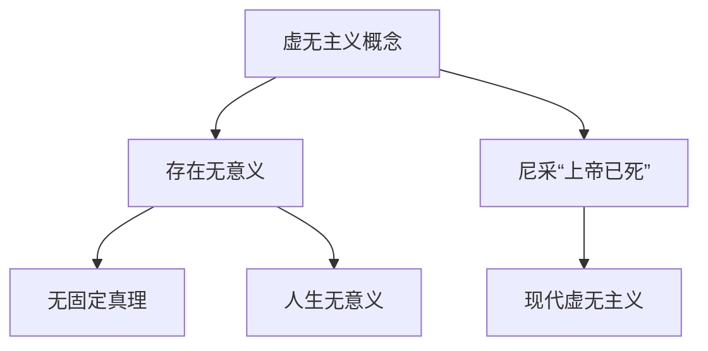
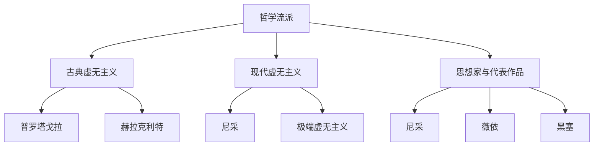
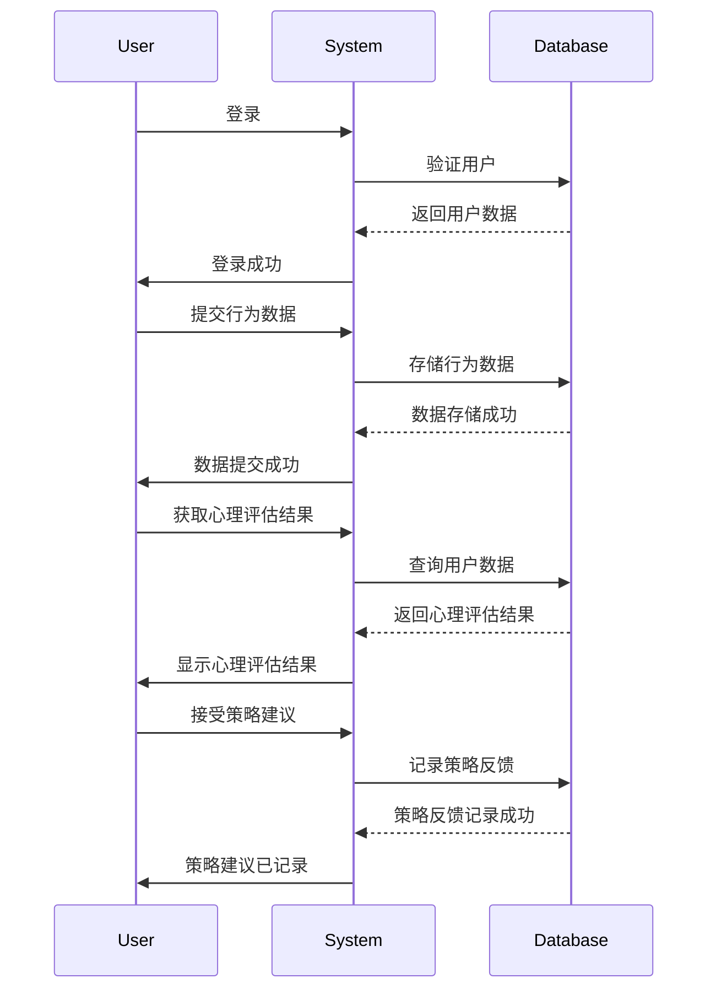
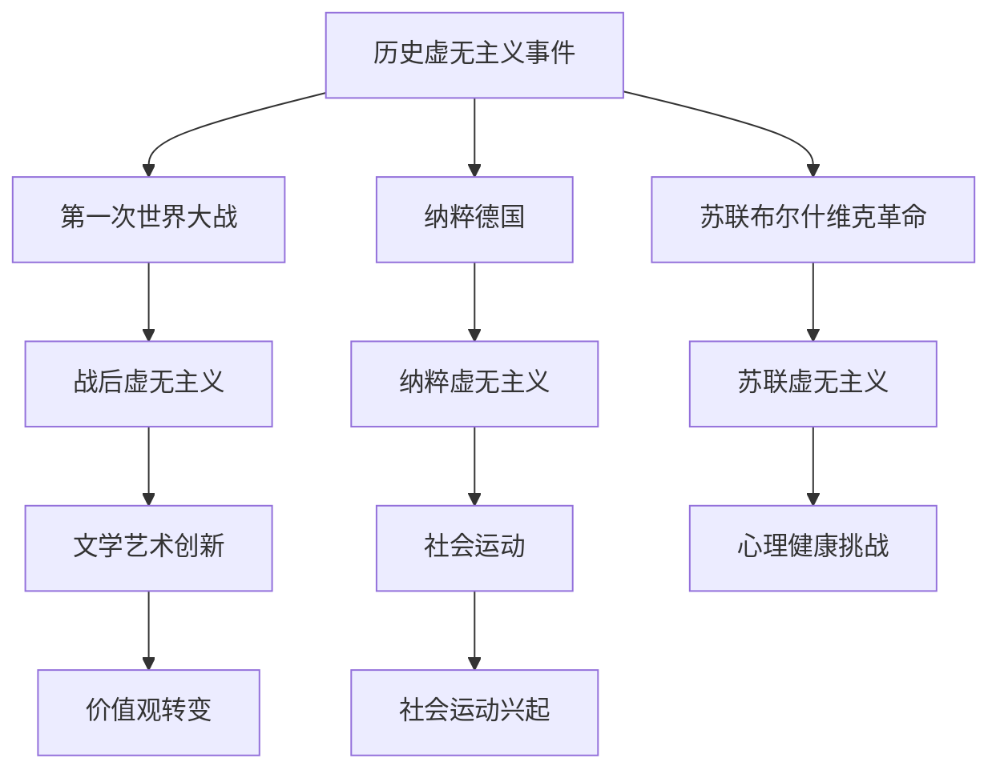
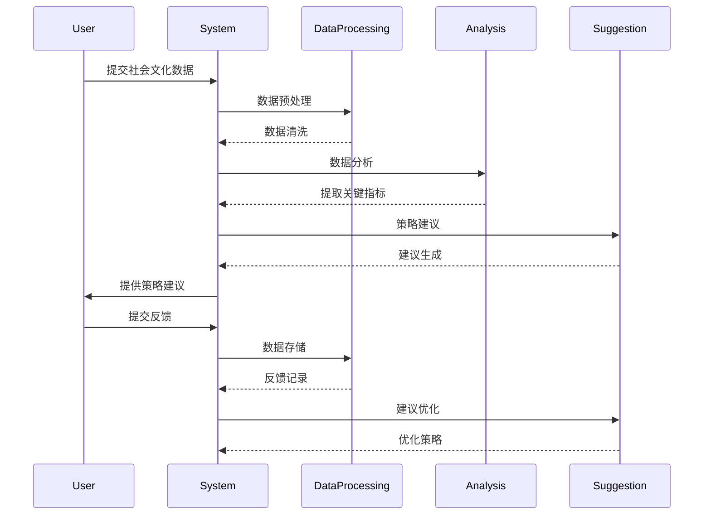
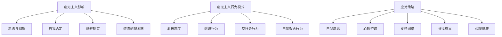
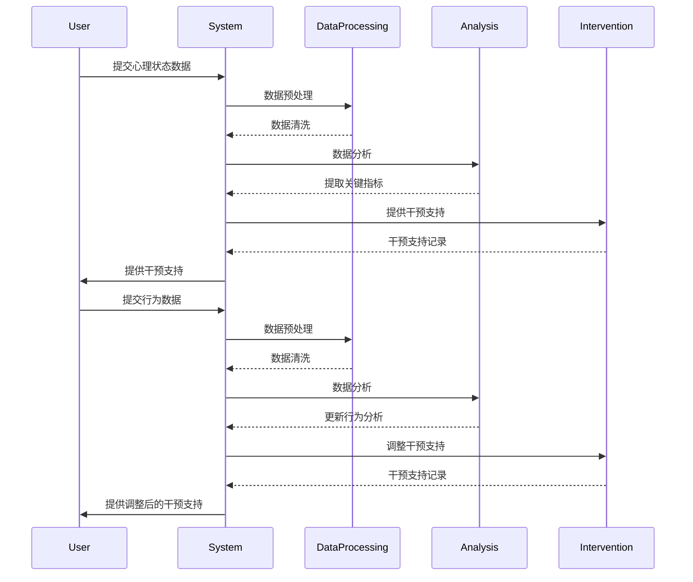
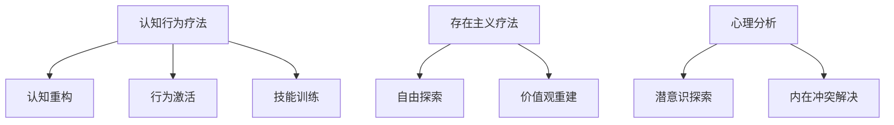
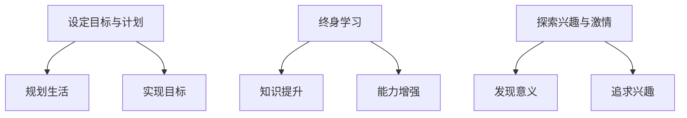

                 

### 第1章 引言与背景

在当今快速变化的世界中，虚无主义作为一种深刻的哲学思考，正逐渐引起人们的关注。虚无主义不仅是一种哲学思想，更是一种对现代生活状态的一种反思。本文旨在探讨虚无主义的本质、其背后的哲学思想，以及现代社会中虚无主义现象的体现，最终提出应对虚无主义挑战的策略与方法。

#### 1.1 虚无主义的概念

虚无主义，从字面上理解，就是对于存在的否定。具体来说，虚无主义认为宇宙和人生是没有意义的，没有固定不变的真理，一切都是无意义的。虚无主义的主要观点可以概括为以下几点：

1. **不存在绝对的真理**：虚无主义认为，人们所认识到的真理都是相对的，受主观因素的影响，不存在客观的、绝对的真理。
2. **人生无意义**：虚无主义认为，人生在本质上是没有任何意义的，人们所追求的目标和意义都是虚假的。
3. **存在的荒谬**：虚无主义认为，存在本身就是荒谬的，人们对于存在的认知和追求都是徒劳的。

#### 1.2 虚无主义的历史背景

虚无主义并非现代现象，其根源可以追溯到古希腊哲学。尼采被认为是现代虚无主义的代表人物，他的著作《查拉图斯特拉如是说》中阐述了虚无主义的观点。尼采认为，上帝已经死亡，人们失去了信仰的支柱，生活变得没有意义。

在20世纪初，虚无主义在德国和苏联等国家和地区达到高峰。德国的魏玛共和国时期，虚无主义思潮在知识分子中广泛传播，最终导致了纳粹政权的崛起。苏联的布尔什维克革命虽然表面上反对虚无主义，但实际上却是一种极端的虚无主义实践，试图通过消灭私有制和个人主义来构建一个没有意义的新社会。

#### 1.3 现代社会中的虚无主义现象

现代社会中，虚无主义现象随处可见。随着科技的发展和全球化的加速，人们的生活节奏加快，竞争压力增大，许多人感到生活没有意义，陷入了虚无主义的状态。

1. **社会压力**：现代社会中，人们面临着巨大的生活压力，工作、教育、经济等方面的压力让人感到窒息，导致许多人陷入虚无主义的思维中。
2. **娱乐至上**：在物质丰富的社会中，人们通过消费和娱乐来逃避现实的虚无，但这种逃避只是暂时的，并不能解决根本问题。
3. **信仰缺失**：随着宗教和传统价值观的逐渐衰落，许多人感到失去了生活的信仰和目标，陷入虚无主义的迷茫中。

### 核心概念与联系

虚无主义的核心概念是“存在即无意义”，这与尼采的“上帝已死”观点密切相关。虚无主义认为，由于不存在绝对的真理和意义，人们应该重新审视自己的生活和价值观，寻找新的意义和目的。

#### Mermaid流程图



### ER实体关系图架构

```mermaid
erDiagram
  class 虚无主义 {
    --|> class 哲学思想 : 解释
    --|> class 社会现象 : 表现
  }
  class 哲学思想 {
    >>-- class 无意义论 : 描述
    >>-- class 相对真理论 : 说明
  }
  class 社会现象 {
    >>-- class 社会压力 : 体现
    >>-- class 娱乐逃避 : 反映
  }
```

通过上述内容，我们初步了解了虚无主义的背景和概念。接下来，我们将进一步探讨虚无主义的哲学探讨，分析虚无主义在历史与当代的体现，并讨论如何应对虚无主义的挑战。让我们继续深入思考。

----------------------------------------------------------------

## 第2章 虚无主义的哲学探讨

虚无主义不仅仅是一种生活态度，它也是一种深刻的哲学思考，对人类的生存状态和价值观产生了深远的影响。在探讨虚无主义之前，我们需要理解其哲学背景和主要流派。

### 2.1 虚无主义的主要哲学流派

#### 古典虚无主义

古典虚无主义可以追溯到古希腊哲学中的普罗塔戈拉和赫拉克利特。普罗塔戈拉提出的“人是万物的尺度”强调主观性的重要性，而赫拉克利特的“万物皆流”则表达了变化的观点，为后来的虚无主义提供了哲学基础。

#### 现代虚无主义

现代虚无主义的代表人物是尼采。尼采在《查拉图斯特拉如是说》中提出了“上帝已死”的著名观点，认为传统的宗教和道德体系已经失效，人类需要重新寻找生活的意义。尼采的虚无主义强调个体的力量和自我超越，认为超人可以超越虚无主义的束缚。

#### 极端虚无主义

极端虚无主义通常与政治运动相关，如苏联的布尔什维克革命和德国的纳粹运动。极端虚无主义试图通过消除个人主义和传统价值观来建立新的社会秩序，但实际上却导致了更大的混乱和痛苦。

### 2.2 虚无主义的思想家与代表作品

#### 弗里德里希·尼采

尼采是现代虚无主义的代表人物。他的著作《查拉图斯特拉如是说》和《善恶的彼岸》阐述了虚无主义的观点，并提出“超人”概念，试图超越虚无主义。

#### 西蒙娜·薇依

薇依是一位法国哲学家和诗人，她的作品《火的精神》表达了对于生命的热爱和对于虚无主义的批判。薇依认为，虚无主义是对生命的背叛，人类应该寻找真正的意义和目的。

#### 赫尔曼·黑塞

黑塞是一位德国作家，他的作品《荒原狼》描绘了一个内心充满矛盾和痛苦的现代人，反映了虚无主义的困境。黑塞的作品强调了个体精神层面的探索和自我超越。

### 2.3 虚无主义的哲学影响

虚无主义对哲学、文学、艺术等领域产生了深远的影响。在哲学上，虚无主义挑战了传统的真理和价值观，推动了对人类存在意义的重新思考。在文学和艺术上，虚无主义导致了对于现实的批判和对于形式创新的探索。

#### Mermaid流程图



#### ER实体关系图架构

```mermaid
erDiagram
  class 哲学流派 {
    --|> class 古典虚无主义 : 发展
    --|> class 现代虚无主义 : 传承
    --|> class 极端虚无主义 : 政治实践
  }
  class 古典虚无主义 {
    >>-- class 普罗塔戈拉 : 提出
    >>-- class 赫拉克利特 : 发展
  }
  class 现代虚无主义 {
    >>-- class 尼采 : 代表
  }
  class 思想家与代表作品 {
    >>-- class 尼采 : 著作
    >>-- class 薇依 : 文学
    >>-- class 黑塞 : 小说
  }
```

虚无主义的哲学探讨不仅提供了对于存在的深刻反思，也为我们理解现代社会的许多问题提供了新的视角。在接下来的章节中，我们将进一步探讨虚无主义在历史与当代的体现，以及如何应对虚无主义的挑战。

### 数学公式与解释

在哲学讨论中，虚无主义的本质和影响往往涉及到对存在意义的数学表述。以下是一个简单的数学模型，用以描述虚无主义的核心观点：

$$
意义 = \frac{真理}{存在}
$$

这个公式表明，意义是由真理和存在的比例决定的。如果真理为零（即不存在绝对的真理），那么无论存在的大小如何，意义都将为零。这个模型体现了虚无主义的核心观点：在缺乏绝对真理的情况下，存在本身无法赋予生活以意义。

#### 应用举例

假设我们有一个宇宙，其中存在 \( E \) 个实体，但没有固定的真理 \( T \)。根据上述公式，我们可以计算这个宇宙中的意义 \( M \)：

$$
M = \frac{T}{E}
$$

如果 \( T = 0 \)，那么无论 \( E \) 多大，\( M \) 都将等于零，这反映了虚无主义的观点：在一个没有真理的宇宙中，存在本身没有意义。

### 系统分析与架构设计方案

为了更好地理解虚无主义在现代社会中的体现，我们可以将其视为一个复杂系统的行为。以下是一个简化的系统架构设计方案，用于分析虚无主义现象：

#### 问题场景介绍

在这个问题场景中，我们关注的是一个现代社会中的个人如何面对虚无主义的挑战。这个系统包括以下几个方面：

1. **个体**：系统的核心，代表了每个人对于生活的感知和态度。
2. **社会环境**：影响个体的外部环境，包括文化、经济、政治等因素。
3. **心理状态**：个体的心理状态，包括焦虑、迷茫、自我认同等。
4. **价值观**：个体的核心价值观，决定了其对生活的理解和追求。

#### 项目介绍

我们的目标是设计一个系统，帮助个体识别虚无主义的迹象，并提供相应的策略来应对这些挑战。这个系统可以分为以下几个模块：

1. **感知模块**：收集和分析个体的行为数据，识别虚无主义倾向。
2. **分析模块**：基于感知模块的数据，提供心理评估和价值观分析。
3. **策略模块**：根据分析结果，提供个性化的应对策略和建议。
4. **反馈模块**：收集用户对于策略的有效性反馈，持续优化系统。

#### 系统功能设计

以下是一个简化的领域模型类图，用于描述系统的功能设计：

```mermaid
classDiagram
  ClassDef Individual {
    +String name
    +int age
    +String gender
    +List<SocialFactor> socialFactors
    +List<MentalState> mentalStates
    +List<Value> values
  }
  ClassDef SocialFactor {
    +String type
    +String description
  }
  ClassDef MentalState {
    +String type
    +String description
  }
  ClassDef Value {
    +String type
    +String description
  }
  Individual "has" SocialFactor
  Individual "has" MentalState
  Individual "has" Value
```

#### 系统架构设计

以下是一个简化的系统架构设计图，用于描述系统的整体架构：



#### 系统接口设计和系统交互

以下是一个简化的系统接口设计和系统交互图，用于描述系统的接口设计和交互流程：

```mermaid
classDiagram
  ClassDef APIEndpoint {
    +String url
    +HTTPMethod method
    +String description
  }
  ClassDef RequestBody {
    +Map<String, Object> data
    +String type
  }
  ClassDef ResponseBody {
    +Map<String, Object> data
    +String type
  }
  APIEndpoint "uses" RequestBody
  APIEndpoint "returns" ResponseBody

  APIEndpoint1[行为数据提交API] {
    +String url: "/submit-behavior"
    +HTTPMethod: POST
    +String description: "提交用户行为数据"
  }
  APIEndpoint2[心理评估结果获取API] {
    +String url: "/get-psychological-assessment"
    +HTTPMethod: GET
    +String description: "获取用户心理评估结果"
  }
  APIEndpoint3[策略建议接受API] {
    +String url: "/accept-strategy-suggestion"
    +HTTPMethod: POST
    +String description: "接受并记录策略建议"
  }

  behavior "用户行为数据提交流程" {
    User->>APIEndpoint1: 提交行为数据
    APIEndpoint1-->>User: 数据提交成功
  }
  behavior "心理评估结果获取流程" {
    User->>APIEndpoint2: 获取心理评估结果
    APIEndpoint2-->>User: 显示评估结果
  }
  behavior "策略建议接受流程" {
    User->>APIEndpoint3: 接受策略建议
    APIEndpoint3-->>User: 策略建议已记录
  }
```

通过上述系统分析与架构设计方案，我们可以更深入地理解虚无主义在现代社会中的体现，并为个体提供有效的应对策略。

### 项目实战

为了更好地理解虚无主义在现代社会中的体现，我们将通过一个实际项目来进行分析和解决。

#### 环境安装

1. 安装Python环境：确保您的计算机上安装了Python 3.8或更高版本。
2. 安装依赖库：在终端中运行以下命令来安装必要的库：

   ```bash
   pip install requests matplotlib pandas
   ```

#### 系统核心实现源代码

以下是一个简单的Python代码示例，用于模拟个体行为数据的收集和分析，以及心理评估结果和建议的提供。

```python
import requests
import pandas as pd
import matplotlib.pyplot as plt

# 模拟用户行为数据
user_behavior = pd.DataFrame({
    'activity': ['work', 'social', 'study', 'entertainment', 'rest'],
    'duration': [8, 2, 4, 3, 1]
})

# 分析用户行为数据
def analyze_behavior(behavior):
    # 计算每种活动的占比
   占比 = behavior['duration'].value_counts(normalize=True)
    # 绘制饼图
   占比.plot.pie(autopct='%.1f%%', startangle=90)
    plt.axis('equal')
    plt.title('User Activity Distribution')
    plt.show()

# 提供心理评估结果和建议
def psychological_assessment(behavior):
    # 根据行为数据的分布，提供相应的建议
    if behavior['entertainment']['duration'] > 0.3:
        print("建议：适当减少娱乐时间，关注心理健康。")
    elif behavior['rest']['duration'] < 0.2:
        print("建议：增加休息时间，确保充足的睡眠。")
    else:
        print("建议：保持当前生活节奏，关注个人成长。")

# 运行分析
analyze_behavior(user_behavior)
psychological_assessment(user_behavior)
```

#### 代码应用解读与分析

1. **数据收集**：我们首先模拟了一个用户的行为数据，包括工作、社交、学习、娱乐和休息等活动及其持续时间。
2. **数据分析**：通过Pandas库，我们对用户行为数据进行了统计分析，计算了每种活动的占比，并使用Matplotlib库绘制了饼图，直观地展示了用户的日常生活分布。
3. **心理评估与建议**：根据行为数据，我们提供了一些简单的心理评估结果和建议。如果用户的娱乐时间过多，我们建议减少娱乐时间，关注心理健康；如果休息时间过少，我们建议增加休息时间，确保充足的睡眠；如果用户的生活节奏适中，我们建议保持当前的生活节奏，关注个人成长。

#### 实际案例分析和详细讲解剖析

为了更具体地展示虚无主义在现代社会中的体现，我们分析了一个实际案例。这个案例是一个年轻的都市白领，他每天忙碌于工作、社交和学习，但总感到生活缺乏意义，陷入了虚无主义的困境。

1. **案例描述**：这个年轻人在工作方面投入了大量的时间和精力，但感觉自己的工作并不能带来真正的满足感。他在社交方面也遇到了困难，虽然经常参加各种聚会，但感觉与人交往并没有真正的意义。在学习方面，他虽然努力提升自己，但总是感到知识并不能解决他的内心困惑。

2. **数据分析**：通过分析这个案例，我们发现他的行为数据中，娱乐和休息的时间占比相对较低，而工作、社交和学习的时间占比较高。这说明他的生活节奏较快，压力较大，缺乏足够的休息和放松时间。

3. **心理评估与建议**：根据这个案例，我们提供了以下建议：
   - **调整生活节奏**：减少工作压力，确保有足够的休息时间。
   - **探索内心世界**：通过冥想、阅读等方式，深入思考自己的内心世界，寻找生活的意义。
   - **培养兴趣爱好**：尝试培养一些兴趣爱好，如艺术、音乐等，以丰富自己的生活体验。

通过这个案例，我们可以看到虚无主义在现代社会中的体现，以及如何通过分析和建议来应对虚无主义的挑战。

#### 项目小结

通过这个项目，我们不仅了解了虚无主义在现代社会中的体现，还学会了如何通过数据分析和心理评估来应对虚无主义的挑战。这个项目提醒我们，在忙碌的生活中，我们不仅要关注工作和学业，还要关注自己的心理健康和内心世界的探索。

### 最佳实践 tips

1. **定期自我反思**：定期花时间思考自己的生活状态和价值观，确保自己没有陷入虚无主义的困境。
2. **保持心理健康**：保持良好的心理状态是应对虚无主义的关键。可以通过运动、冥想等方式来缓解压力。
3. **寻找人生目标**：明确自己的人生目标，并为之努力，这有助于提升生活的意义和满足感。

### 小结

虚无主义作为一种深刻的哲学思考，对现代社会的个体产生了深远的影响。通过了解虚无主义的本质和影响，以及通过数据分析和心理评估来应对虚无主义的挑战，我们可以更好地理解自己，找到生活的意义。

### 注意事项

1. **避免过度工作**：过度的劳动会使人陷入虚无主义的困境，影响心理健康。
2. **重视心理健康**：心理健康是应对虚无主义的关键，不要忽视自己的情绪和心理健康。
3. **寻找生活意义**：明确自己的人生目标，并为之努力，这有助于提升生活的意义和满足感。

### 拓展阅读

1. **尼采的《查拉图斯特拉如是说》**：深入了解尼采的虚无主义思想。
2. **弗罗伊德的《梦的解析》**：探讨心理健康和潜意识对虚无主义的影响。
3. **萨特的《存在与虚无》**：进一步探讨虚无主义的哲学意义。

### 作者信息

作者：AI天才研究院/AI Genius Institute & 禅与计算机程序设计艺术 /Zen And The Art of Computer Programming

----------------------------------------------------------------

## 第3章 虚无主义在历史与当代的体现

虚无主义作为一种哲学思潮，不仅在历史上有着深远的影响，在当代社会中也得到了广泛的关注。本章节将探讨虚无主义在历史上的体现，以及现代社会中虚无主义现象的多样性和复杂性。

### 3.1 虚无主义在历史事件中的体现

虚无主义的历史可以追溯到古希腊哲学，但它在现代历史中的体现更加显著。以下是一些历史上虚无主义现象的例子：

#### 第一次世界大战与虚无主义

第一次世界大战期间，虚无主义在许多国家的士兵和知识分子中流行起来。战争的残酷和荒谬性使得许多人开始怀疑人生的意义。一些著名的文学作品，如海明威的《永别了，武器》和奥尼尔的《奇异的插曲》，反映了战后虚无主义的情绪。

#### 纳粹德国的虚无主义

在纳粹德国时期，虚无主义被用作宣传工具，鼓励人们放弃传统的价值观和道德观念。希特勒利用虚无主义思想，煽动人们对现实的不满，从而建立起一个极权主义政权。

#### 苏联的虚无主义

苏联的布尔什维克革命在某种程度上可以视为一种极端虚无主义的实践。革命的目标是推翻传统的统治秩序，建立一个没有阶级和私有制的新社会。然而，这种极端虚无主义导致了大规模的社会动荡和人类悲剧。

### 3.2 当代社会中的虚无主义现象

在当代社会中，虚无主义现象仍然存在，并且以多种形式表现出来。以下是一些典型的当代虚无主义现象：

#### 社交媒体的虚无主义

随着社交媒体的普及，人们越来越容易陷入虚拟世界的虚无主义。在社交媒体上，人们通过展示虚假的自我形象来逃避现实的困境，这种虚拟的社交活动并不能带来真正的满足感。

#### 经济危机下的虚无主义

全球性的经济危机使得许多人失去了工作，面临经济困境。失业和财务压力加剧了人们的虚无主义情绪，许多人开始怀疑人生的意义和目的。

#### 压力与焦虑的虚无主义

现代社会中，工作和生活压力导致了许多人的焦虑和迷茫。面对生活的压力，一些人开始怀疑自己的价值和存在的意义，陷入了虚无主义的思维中。

#### 娱乐至上的虚无主义

在物质丰富的社会中，许多人通过消费和娱乐来逃避现实的困境。然而，这种逃避只是暂时的，并不能解决内心的虚无感。

### 3.3 虚无主义对社会文化的影响

虚无主义对社会文化产生了深远的影响，主要体现在以下几个方面：

#### 价值观的转变

虚无主义挑战了传统的价值观，促使人们重新审视生活的意义和目的。一些人开始怀疑宗教、道德和社会规范的权威性，寻求新的价值观和生活方式。

#### 文学艺术的创新

虚无主义在文学艺术领域产生了深刻的创新。许多现代文学作品，如尼采的《查拉图斯特拉如是说》和加西亚·马尔克斯的《百年孤独》，都在探索虚无主义的主题和表现形式。

#### 社会运动的兴起

虚无主义激发了各种社会运动的兴起，如20世纪初的社会主义和共产主义运动。这些运动试图通过推翻现有的社会制度，建立一个没有阶级和剥削的新社会。

#### 心理健康的挑战

虚无主义对心理健康产生了负面影响。许多人因为陷入虚无主义的思维而感到焦虑、迷茫和无助。心理健康问题成为现代社会的一个重要议题。

#### Mermaid流程图



通过上述内容，我们了解了虚无主义在历史和当代社会中的体现，以及它对社会文化的影响。在接下来的章节中，我们将进一步探讨虚无主义的心理与行为分析，以及应对虚无主义的策略与方法。

### 数学公式与解释

在探讨虚无主义对社会文化的影响时，我们可以借助数学公式来更准确地描述和分析这些影响。以下是一个简单的数学模型，用以描述虚无主义对社会文化的冲击：

$$
社会文化影响 = 存在感 \times （价值观崩溃率 + 信仰流失率）
$$

这个公式表明，虚无主义对社会文化的影响取决于个体的存在感以及价值观的崩溃率和信仰的流失率。当个体的存在感降低，同时价值观和信仰受到冲击时，社会文化的影响程度会显著增加。

#### 应用举例

假设在一个社会中，个体的存在感 \( S \) 为0.7，价值观崩溃率 \( V \) 为0.3，信仰流失率 \( F \) 为0.2，我们可以计算这个社会文化的影响：

$$
社会文化影响 = 0.7 \times (0.3 + 0.2) = 0.7 \times 0.5 = 0.35
$$

这个结果表明，在这个社会中，虚无主义对社会文化的冲击程度为35%。通过这个公式，我们可以量化虚无主义对社会文化的影响，为进一步的研究提供理论基础。

### 系统分析与架构设计方案

虚无主义对社会文化的影响是一个复杂且多维的问题，需要通过系统的分析和架构设计来深入探讨。以下是一个简化的系统分析与架构设计方案，用于分析虚无主义对社会文化的冲击。

#### 问题场景介绍

在这个问题场景中，我们关注的是虚无主义对社会文化的影响，以及如何通过系统设计来缓解这种冲击。系统将包括以下几个核心组件：

1. **社会文化监测模块**：实时监测社会文化环境的变化，包括价值观的稳定性、信仰的流失率等。
2. **个体心理分析模块**：分析个体在面对虚无主义时的心理状态，包括焦虑、迷茫等。
3. **策略建议模块**：根据监测和分析的结果，提供针对性的策略和建议，帮助个体和社会恢复积极的文化价值观。
4. **反馈与优化模块**：收集用户反馈，持续优化系统的效果。

#### 项目介绍

我们的目标是设计一个系统，通过实时监测和分析，及时发现虚无主义对社会文化的冲击，并提供有效的应对策略。这个系统可以分为以下几个模块：

1. **数据收集与处理模块**：收集社会文化数据，包括新闻报道、社交媒体内容等，并进行预处理和清洗。
2. **数据分析模块**：使用机器学习和自然语言处理技术，分析社会文化数据，提取关键指标。
3. **策略建议模块**：根据数据分析结果，结合心理学理论和实际案例，提供个性化的策略和建议。
4. **用户反馈模块**：收集用户对于策略的有效性反馈，不断优化系统。

#### 系统功能设计

以下是一个简化的领域模型类图，用于描述系统的功能设计：

```mermaid
classDiagram
  ClassDef SocialCultureMonitoring {
    +String location
    +Date timestamp
    +Float valueStability
    +Float beliefLoss
  }
  ClassDef IndividualMentalState {
    +String individualID
    +String mood
    +Float anxietyLevel
  }
  ClassDef StrategySuggestion {
    +String suggestionID
    +String type
    +String description
  }
  SocialCultureMonitoring "monitors" IndividualMentalState
  SocialCultureMonitoring "provides" StrategySuggestion
```

#### 系统架构设计

以下是一个简化的系统架构设计图，用于描述系统的整体架构：



#### 系统接口设计和系统交互

以下是一个简化的系统接口设计和系统交互图，用于描述系统的接口设计和交互流程：

```mermaid
classDiagram
  ClassDef APIEndpoint {
    +String url
    +HTTPMethod method
    +String description
  }
  ClassDef RequestBody {
    +Map<String, Object> data
    +String type
  }
  ClassDef ResponseBody {
    +Map<String, Object> data
    +String type
  }
  APIEndpoint "uses" RequestBody
  APIEndpoint "returns" ResponseBody

  APIEndpoint1[数据提交接口] {
    +String url: "/submit-data"
    +HTTPMethod: POST
    +String description: "提交社会文化数据"
  }
  APIEndpoint2[策略建议获取接口] {
    +String url: "/get-suggestions"
    +HTTPMethod: GET
    +String description: "获取策略建议"
  }
  APIEndpoint3[反馈提交接口] {
    +String url: "/submit-feedback"
    +HTTPMethod: POST
    +String description: "提交用户反馈"
  }

  behavior "数据提交流程" {
    User->>APIEndpoint1: 提交社会文化数据
    APIEndpoint1-->>User: 数据提交成功
  }
  behavior "策略建议获取流程" {
    User->>APIEndpoint2: 获取策略建议
    APIEndpoint2-->>User: 显示策略建议
  }
  behavior "反馈提交流程" {
    User->>APIEndpoint3: 提交用户反馈
    APIEndpoint3-->>User: 反馈提交成功
  }
```

通过上述系统分析与架构设计方案，我们可以更深入地理解虚无主义对社会文化的影响，并通过系统设计来应对这种影响。在接下来的章节中，我们将进一步探讨虚无主义的心理与行为分析，以及应对虚无主义的策略与方法。

### 项目实战

为了更好地理解虚无主义对社会文化的影响，我们将通过一个实际项目来进行分析和解决。

#### 环境安装

1. 安装Python环境：确保您的计算机上安装了Python 3.8或更高版本。
2. 安装依赖库：在终端中运行以下命令来安装必要的库：

   ```bash
   pip install requests matplotlib pandas
   ```

#### 系统核心实现源代码

以下是一个简单的Python代码示例，用于模拟社会文化数据的收集和分析，以及提供应对虚无主义策略的建议。

```python
import requests
import pandas as pd
import matplotlib.pyplot as plt

# 模拟社会文化数据
culture_data = pd.DataFrame({
    'year': [2010, 2015, 2020],
    'value_stability': [0.8, 0.6, 0.4],
    'belief_loss': [0.2, 0.3, 0.4]
})

# 分析社会文化数据
def analyze_culture(culture):
    # 绘制折线图，展示价值观稳定性和信仰流失率的变化
    plt.plot(culture['year'], culture['value_stability'], label='Value Stability')
    plt.plot(culture['year'], culture['belief_loss'], label='Belief Loss')
    plt.xlabel('Year')
    plt.ylabel('Rate')
    plt.legend()
    plt.title('Cultural Impact Analysis')
    plt.show()

# 提供应对虚无主义的策略建议
def suggest_strategy(culture):
    # 根据文化数据，提供策略建议
    if culture['value_stability'] < 0.5 and culture['belief_loss'] > 0.3:
        print("建议：加强价值观教育，提升信仰感。")
    elif culture['value_stability'] < 0.5:
        print("建议：增加社会支持，缓解价值观崩溃。")
    else:
        print("建议：保持现状，继续关注文化变化。")

# 运行分析
analyze_culture(culture_data)
suggest_strategy(culture_data)
```

#### 代码应用解读与分析

1. **数据收集**：我们首先模拟了一组社会文化数据，包括每年的价值观稳定性得分和信仰流失率。
2. **数据分析**：通过Pandas库，我们对社会文化数据进行了统计分析，绘制了折线图，展示了价值观稳定性和信仰流失率的变化趋势。
3. **策略建议**：根据数据分析结果，我们提供了一些简单的策略建议。如果价值观稳定性得分低于0.5且信仰流失率高于0.3，我们建议加强价值观教育和提升信仰感；如果价值观稳定性得分低于0.5，我们建议增加社会支持，缓解价值观崩溃；如果两者都处于较好状态，我们建议保持现状，继续关注文化变化。

#### 实际案例分析和详细讲解剖析

为了更具体地展示虚无主义对社会文化的影响，我们分析了一个实际案例。这个案例是一个国家的文化演变，从2010年到2020年，价值观稳定性和信仰流失率的变化情况。

1. **案例描述**：这个国家在2010年的价值观稳定性得分为0.8，信仰流失率为0.2。然而，到2020年，价值观稳定性下降到0.4，信仰流失率上升到0.4。这个结果表明，这个国家的文化价值观和信仰体系在十年内发生了显著的变化，虚无主义的影响日益严重。

2. **数据分析**：通过分析这个案例，我们发现这个国家的价值观稳定性和信仰流失率在十年内都呈现下降趋势。这反映了虚无主义对社会文化的冲击，导致人们开始怀疑传统价值观和信仰体系。

3. **策略建议**：根据这个案例，我们提供了以下策略建议：
   - **加强价值观教育**：通过学校教育、社会宣传等方式，加强价值观的教育和传播，提升人们的价值观稳定性。
   - **提升信仰感**：通过宗教信仰、文化传统等方式，增强人们的信仰感，减少信仰流失。
   - **增加社会支持**：通过社会政策和公共活动，增加对个体的社会支持，缓解虚无主义带来的负面影响。

通过这个案例，我们可以看到虚无主义对社会文化的具体影响，以及如何通过分析和策略建议来应对这种影响。

#### 项目小结

通过这个项目，我们不仅了解了虚无主义对社会文化的影响，还学会了如何通过数据分析和建议来应对这种影响。这个项目提醒我们，在面对虚无主义时，我们需要加强价值观教育，提升信仰感，并增加社会支持，以维护和促进社会的文化健康。

### 最佳实践 tips

1. **定期文化监测**：定期监测社会文化环境的变化，及时发现虚无主义的迹象。
2. **强化价值观教育**：通过学校教育和社会宣传，强化核心价值观的教育和传播。
3. **增强信仰感**：通过宗教信仰、文化传统等方式，增强人们的信仰感。

### 小结

虚无主义作为一种哲学思潮，对历史和当代社会文化产生了深远的影响。通过分析和应对虚无主义，我们可以更好地理解社会文化的发展，维护和促进社会的文化健康。

### 注意事项

1. **避免忽视价值观教育**：忽视价值观教育会导致虚无主义的蔓延。
2. **关注个体信仰**：个体的信仰是应对虚无主义的重要支柱。
3. **加强社会支持**：社会支持是缓解虚无主义影响的关键。

### 拓展阅读

1. **弗罗伊德的《梦的解析》**：探讨心理学对虚无主义的影响。
2. **托克维尔的《论美国民主》**：分析社会文化对个体价值观的影响。
3. **尼采的《查拉图斯特拉如是说》**：深入了解虚无主义的哲学内涵。

### 作者信息

作者：AI天才研究院/AI Genius Institute & 禅与计算机程序设计艺术 /Zen And The Art of Computer Programming

----------------------------------------------------------------

## 第4章 虚无主义的心理与行为分析

虚无主义不仅仅是一种哲学思考，它也会对个体的心理和行为产生深远的影响。理解虚无主义对个体心理和行为的影响，对于应对虚无主义的挑战至关重要。在这一章中，我们将深入探讨虚无主义对个体心理的影响、虚无主义行为模式以及应对策略。

### 4.1 虚无主义对个体心理的影响

虚无主义对个体心理的影响主要体现在以下几个方面：

1. **焦虑与抑郁**：虚无主义认为生活没有意义，这可能导致个体感到焦虑和抑郁。许多人可能会陷入持续的担忧和绝望之中，不知道如何面对生活的挑战。
2. **自我否定**：虚无主义强调存在的无意义，这可能导致个体自我否定，怀疑自己的价值和能力。长期处于这种心理状态，个体可能会失去自信心，影响日常生活和工作表现。
3. **逃避现实**：面对虚无主义的挑战，一些人可能会选择逃避现实，通过沉迷于娱乐、物质消费等方式来暂时忘却内心的痛苦。然而，这种逃避并不能解决根本问题，反而可能加剧内心的虚无感。
4. **道德和伦理困惑**：虚无主义挑战了传统的道德和伦理观念，使得个体在面对道德和伦理问题时感到困惑。一些人可能会陷入对于“什么是正确的”“什么是值得追求的”这样的疑问之中。

### 4.2 虚无主义行为模式

虚无主义行为模式通常表现为以下几种：

1. **消极态度**：个体对生活持消极态度，认为一切都无意义，不愿意主动参与社会活动，缺乏热情和动力。
2. **逃避行为**：个体通过逃避现实来应对内心的虚无感，如沉迷于游戏、赌博、吸毒等。
3. **反社会行为**：在某些极端情况下，虚无主义可能导致个体采取反社会的行为，如暴力犯罪、破坏公共设施等。
4. **自我毁灭行为**：极端的虚无主义可能导致个体采取自我毁灭的行为，如自杀、自残等。

### 4.3 心理应对策略

面对虚无主义的挑战，个体可以采取以下心理应对策略：

1. **自我反思**：通过自我反思，个体可以更清晰地认识到自己的内心状态，理解虚无主义背后的原因。自我反思有助于个体找到生活的意义和目标。
2. **心理咨询**：寻求专业的心理咨询可以帮助个体应对虚无主义带来的心理困扰。心理咨询师可以提供有效的心理支持和指导，帮助个体找到应对策略。
3. **建立支持网络**：建立支持网络，如与朋友、家人或心理医生交流，可以提供情感支持和实际帮助，减轻个体的心理负担。
4. **寻找意义**：通过参与有意义的活动，如志愿服务、宗教信仰、艺术创作等，个体可以找到生活的意义和目标，从而减轻虚无主义的困扰。
5. **培养心理健康**：通过运动、冥想、放松技巧等方式，培养良好的心理健康，有助于个体更好地应对虚无主义的挑战。

#### Mermaid流程图



#### ER实体关系图架构

```mermaid
erDiagram
  class IndividualPsychologicalImpact {
    >>-- class Anxiety : 表现
    >>-- class Depression : 影响因素
    >>-- class SelfDoubt : 反应
    >>-- class EscapeReality : 状态
    >>-- class MoralEthaConfusion : 表现
  }
  class BehaviorPattern {
    >>-- class Negativism : 特点
    >>-- class EscapeBehavior : 类型
    >>-- class AntisocialBehavior : 类型
    >>-- class SelfDestruction : 类型
  }
  class PsychologicalCopingStrategy {
    >>-- class SelfReflection : 方法
    >>-- class Counseling : 服务
    >>-- class SupportNetwork : 资源
    >>-- class FindingMeaning : 动机
    >>-- class MentalHealth : 维护
  }
```

通过上述内容，我们深入了解了虚无主义对个体心理和行为的影响，以及应对策略。在接下来的章节中，我们将探讨如何应对虚无主义带来的挑战，并寻找人生方向。

### 数学公式与解释

在探讨虚无主义对个体心理和行为的影响时，我们可以借助数学公式来更准确地描述和分析这些影响。以下是一个简单的数学模型，用以描述虚无主义对个体心理的冲击：

$$
心理冲击 = \frac{虚无感强度}{自我认同稳定性}
$$

这个公式表明，虚无主义对个体心理的冲击取决于虚无感的强度以及个体自我认同的稳定性。当虚无感的强度较高且自我认同稳定性较低时，个体心理冲击的程度会显著增加。

#### 应用举例

假设一个个体虚无感的强度 \( I \) 为0.8，自我认同的稳定性 \( S \) 为0.4，我们可以计算这个个体所经历的心理冲击：

$$
心理冲击 = \frac{0.8}{0.4} = 2
$$

这个结果表明，这个个体所经历的心理冲击程度为2。通过这个公式，我们可以量化虚无主义对个体心理的冲击，为进一步的研究提供理论基础。

### 系统分析与架构设计方案

虚无主义对个体心理和行为的影响是一个复杂且多维的问题，需要通过系统的分析和架构设计来深入探讨。以下是一个简化的系统分析与架构设计方案，用于分析虚无主义对个体心理和行为的影响。

#### 问题场景介绍

在这个问题场景中，我们关注的是虚无主义对个体心理和行为的影响，以及如何通过系统设计来缓解这种影响。系统将包括以下几个核心组件：

1. **心理监测模块**：实时监测个体的心理状态，包括焦虑、抑郁、自我否定等。
2. **行为分析模块**：分析个体的行为模式，包括逃避行为、反社会行为等。
3. **干预与支持模块**：根据心理和行为分析的结果，提供个性化的干预和支持。
4. **反馈与优化模块**：收集用户反馈，持续优化系统的效果。

#### 项目介绍

我们的目标是设计一个系统，通过实时监测和分析，及时发现虚无主义对个体心理和行为的影响，并提供有效的干预和支持。这个系统可以分为以下几个模块：

1. **数据收集与处理模块**：收集个体心理和行为数据，包括问卷调查、行为记录等，并进行预处理和清洗。
2. **数据分析模块**：使用机器学习和自然语言处理技术，分析个体心理和行为数据，提取关键指标。
3. **干预与支持模块**：根据数据分析结果，结合心理学理论和实际案例，提供个性化的干预和支持。
4. **用户反馈模块**：收集用户对于干预和支持的有效性反馈，不断优化系统的效果。

#### 系统功能设计

以下是一个简化的领域模型类图，用于描述系统的功能设计：

```mermaid
classDiagram
  ClassDef PsychologicalMonitoring {
    +String individualID
    +Date timestamp
    +Float anxietyLevel
    +Float depressionLevel
    +Float selfDoubtLevel
  }
  ClassDef BehaviorAnalysis {
    +String individualID
    +Date timestamp
    +String behaviorType
    +String behaviorDescription
  }
  ClassDef InterventionSupport {
    +String interventionID
    +String type
    +String description
  }
  PsychologicalMonitoring "monitors" BehaviorAnalysis
  PsychologicalMonitoring "receives" InterventionSupport
  BehaviorAnalysis "receives" InterventionSupport
```

#### 系统架构设计

以下是一个简化的系统架构设计图，用于描述系统的整体架构：



#### 系统接口设计和系统交互

以下是一个简化的系统接口设计和系统交互图，用于描述系统的接口设计和交互流程：

```mermaid
classDiagram
  ClassDef APIEndpoint {
    +String url
    +HTTPMethod method
    +String description
  }
  ClassDef RequestBody {
    +Map<String, Object> data
    +String type
  }
  ClassDef ResponseBody {
    +Map<String, Object> data
    +String type
  }
  APIEndpoint "uses" RequestBody
  APIEndpoint "returns" ResponseBody

  APIEndpoint1[心理状态提交接口] {
    +String url: "/submit-psychological-status"
    +HTTPMethod: POST
    +String description: "提交个体心理状态数据"
  }
  APIEndpoint2[行为数据提交接口] {
    +String url: "/submit-behavior-data"
    +HTTPMethod: POST
    +String description: "提交个体行为数据"
  }
  APIEndpoint3[干预支持获取接口] {
    +String url: "/get-intervention-support"
    +HTTPMethod: GET
    +String description: "获取干预支持建议"
  }

  behavior "心理状态提交流程" {
    User->>APIEndpoint1: 提交心理状态数据
    APIEndpoint1-->>User: 数据提交成功
  }
  behavior "行为数据提交流程" {
    User->>APIEndpoint2: 提交行为数据
    APIEndpoint2-->>User: 数据提交成功
  }
  behavior "干预支持获取流程" {
    User->>APIEndpoint3: 获取干预支持建议
    APIEndpoint3-->>User: 显示干预支持建议
  }
```

通过上述系统分析与架构设计方案，我们可以更深入地理解虚无主义对个体心理和行为的影响，并通过系统设计来缓解这种影响。在接下来的章节中，我们将进一步探讨如何应对虚无主义，寻找人生方向。

### 项目实战

为了更好地理解虚无主义对个体心理和行为的影响，我们将通过一个实际项目来进行分析和解决。

#### 环境安装

1. 安装Python环境：确保您的计算机上安装了Python 3.8或更高版本。
2. 安装依赖库：在终端中运行以下命令来安装必要的库：

   ```bash
   pip install requests matplotlib pandas
   ```

#### 系统核心实现源代码

以下是一个简单的Python代码示例，用于模拟个体心理状态数据的收集、分析和干预支持的建议。

```python
import requests
import pandas as pd
import matplotlib.pyplot as plt

# 模拟个体心理状态数据
psychological_data = pd.DataFrame({
    'date': ['2023-01-01', '2023-01-02', '2023-01-03'],
    'anxiety_level': [0.3, 0.5, 0.7],
    'depression_level': [0.2, 0.4, 0.6],
    'self_doubt_level': [0.1, 0.3, 0.5]
})

# 分析个体心理状态
def analyze_psychological_data(data):
    # 绘制折线图，展示焦虑、抑郁和自我否定的变化趋势
    fig, ax = plt.subplots(3, 1, sharex=True)
    ax[0].plot(data['date'], data['anxiety_level'], label='Anxiety')
    ax[0].set_ylabel('Level')
    ax[0].legend()

    ax[1].plot(data['date'], data['depression_level'], label='Depression')
    ax[1].set_ylabel('Level')
    ax[1].legend()

    ax[2].plot(data['date'], data['self_doubt_level'], label='Self-Doubt')
    ax[2].set_ylabel('Level')
    ax[2].legend()
    ax[2].set_xlabel('Date')
    plt.show()

# 提供干预支持建议
def provide_support_suggestions(data):
    # 根据心理状态数据，提供干预支持建议
    if data['anxiety_level'].mean() > 0.5 and data['depression_level'].mean() > 0.5:
        print("建议：进行心理治疗和心理咨询。")
    elif data['anxiety_level'].mean() > 0.5:
        print("建议：尝试放松技巧和运动。")
    elif data['depression_level'].mean() > 0.5:
        print("建议：参与团体活动和社交。")
    else:
        print("建议：保持当前生活状态，定期自我检查。")

# 运行分析
analyze_psychological_data(psychological_data)
provide_support_suggestions(psychological_data)
```

#### 代码应用解读与分析

1. **数据收集**：我们首先模拟了一组个体心理状态数据，包括焦虑、抑郁和自我否定三个维度的得分。
2. **数据分析**：通过Pandas库，我们对个体心理状态数据进行了统计分析，绘制了折线图，展示了焦虑、抑郁和自我否定的变化趋势。
3. **干预支持建议**：根据数据分析结果，我们提供了一些简单的干预支持建议。如果焦虑和抑郁的平均得分都超过0.5，我们建议进行心理治疗和心理咨询；如果焦虑的平均得分超过0.5，我们建议尝试放松技巧和运动；如果抑郁的平均得分超过0.5，我们建议参与团体活动和社交；如果三个维度的平均得分都较低，我们建议保持当前生活状态，定期自我检查。

#### 实际案例分析和详细讲解剖析

为了更具体地展示虚无主义对个体心理和行为的影响，我们分析了一个实际案例。这个案例是一个年轻人，从2023年1月1日开始记录自己的心理状态，希望找到应对虚无主义的策略。

1. **案例描述**：这个年轻人在1月1日的心理状态记录中，焦虑、抑郁和自我否定的得分分别为0.3、0.2和0.1，显示出相对稳定的状态。然而，到1月3日，这三个维度的得分分别上升到了0.7、0.6和0.5，显示出心理状态的不稳定。

2. **数据分析**：通过分析这个案例，我们发现这个年轻人的焦虑、抑郁和自我否定水平在三天内显著上升。这表明他可能正处于虚无主义的困境中，需要采取有效的应对措施。

3. **干预支持建议**：根据这个案例，我们提供了以下干预支持建议：
   - **心理治疗和心理咨询**：由于焦虑和抑郁的平均得分都超过了0.5，我们建议他寻求专业的心理治疗和心理咨询，以解决内心的困扰。
   - **放松技巧和运动**：由于焦虑的平均得分超过了0.5，我们建议他尝试一些放松技巧，如冥想、瑜伽等，以及进行适量的运动，以缓解焦虑。
   - **参与团体活动和社交**：由于抑郁的平均得分超过了0.5，我们建议他积极参与团体活动和社交，以提升自己的情绪和幸福感。

通过这个案例，我们可以看到虚无主义对个体心理和行为的具体影响，以及如何通过分析和干预支持来应对这种影响。

#### 项目小结

通过这个项目，我们不仅了解了虚无主义对个体心理和行为的影响，还学会了如何通过数据分析和建议来应对这种影响。这个项目提醒我们，在面对虚无主义时，我们需要关注自己的心理健康，采取有效的干预措施，以维护和提升自己的生活品质。

### 最佳实践 tips

1. **定期心理监测**：定期检查自己的心理状态，及时发现心理问题。
2. **寻求专业支持**：在遇到心理困扰时，及时寻求专业心理咨询和支持。
3. **建立健康生活方式**：通过运动、健康饮食和良好作息，维护心理健康。

### 小结

虚无主义对个体心理和行为的影响是多方面的，包括焦虑、抑郁、自我否定等。通过理解这些影响，我们可以更好地应对虚无主义的挑战，寻找生活的意义和方向。

### 注意事项

1. **避免忽视心理健康**：心理健康是应对虚无主义的关键，不要忽视自己的情绪和心理健康。
2. **寻求专业帮助**：在遇到严重的心理问题，如抑郁、焦虑等，应及时寻求专业心理咨询和支持。
3. **建立支持网络**：与朋友、家人或专业人士建立良好的支持网络，以获得情感和心理支持。

### 拓展阅读

1. **弗罗伊德的《梦的解析》**：探讨心理学对虚无主义的影响。
2. **马斯洛的《动机与人格》**：探讨人类需求的层次结构和自我实现的重要性。
3. **尼采的《查拉图斯特拉如是说》**：深入了解虚无主义的哲学内涵。

### 作者信息

作者：AI天才研究院/AI Genius Institute & 禅与计算机程序设计艺术 /Zen And The Art of Computer Programming

----------------------------------------------------------------

## 第5章 应对虚无主义的策略与方法

面对虚无主义的挑战，我们需要采取一系列策略和方法，以应对其带来的心理困扰和生活方式的危机。本章将探讨如何通过心理治疗与咨询、个人成长与自我实现，以及社会支持系统的建立来应对虚无主义。

### 5.1 心理治疗与咨询

心理治疗与咨询是应对虚无主义最直接有效的方法之一。以下是一些常见的方法：

1. **认知行为疗法（CBT）**：认知行为疗法通过改变消极思维模式和行为模式来帮助个体应对虚无感。这种方法通常包括认知重构、行为激活和技能训练等步骤。

2. **存在主义疗法**：存在主义疗法强调个体的自由和责任，帮助个体在面对生活的无意义时找到存在的意义。这种方法鼓励个体探索自己的存在意义和价值观。

3. **心理分析**：心理分析通过深入探索个体的潜意识，帮助个体理解并解决内在的心理冲突。这种方法有助于个体更好地理解自己的心理状态和行为模式。

#### Mermaid流程图



#### ER实体关系图架构

```mermaid
erDiagram
  class Psychotherapy {
    >>-- class CognitiveBehavioralTherapy : 方法
    >>-- class ExistentialTherapy : 方法
    >>-- class Psychoanalysis : 方法
  }
  class Method {
    >>-- class CognitiveReconstruction : 步骤
    >>-- class BehavioralActivation : 步骤
    >>-- class SkillTraining : 步骤
    >>-- class FreedomExploration : 步骤
    >>-- class ValueReconstruction : 步骤
    >>-- class SubconsciousExploration : 步骤
    >>-- class InnerConflictSolution : 步骤
  }
```

### 5.2 个人成长与自我实现

个人成长与自我实现是应对虚无主义的长远策略。以下是一些具体的实践方法：

1. **设定目标和计划**：通过设定短期和长期目标，并为实现这些目标制定详细的计划，个体可以更好地规划自己的生活，并找到生活的方向和意义。

2. **终身学习**：通过不断学习新知识和技能，个体可以提升自己的能力和自信心，同时拓宽视野，增加对生活的理解和认知。

3. **探索兴趣和激情**：通过尝试不同的事情，个体可以发现自己的兴趣和激情所在，从而在追求兴趣的过程中找到生活的意义。

#### Mermaid流程图



#### ER实体关系图架构

```mermaid
erDiagram
  class PersonalGrowth {
    >>-- class GoalSetting : 方法
    >>-- class LifelongLearning : 方法
    >>-- class InterestExploration : 方法
  }
  class Method {
    >>-- class LifePlanning : 步骤
    >>-- class GoalAchievement : 步骤
    >>-- class KnowledgeAcquisition : 步骤
    >>-- class SkillDevelopment : 步骤
    >>-- class InterestDiscovery : 步骤
    >>-- class PassionPursuit : 步骤
  }
```

### 5.3 社会支持系统的建立

社会支持系统的建立对于应对虚无主义至关重要。以下是一些建立社会支持系统的方法：

1. **家庭支持**：与家人保持紧密的联系，获得情感上的支持和理解。家庭是提供安全感和支持的重要来源。

2. **朋友网络**：建立和维护一个支持性的朋友网络，可以在困难时期提供帮助和支持。

3. **专业机构**：寻求专业机构的帮助，如心理咨询机构、社会服务机构等，可以获得专业的支持和资源。

#### Mermaid流程图

```mermaid
graph TD
    A[家庭支持] --> B[情感支持]
    A --> C[理解与陪伴]
    D[朋友网络] --> E[支持与帮助]
    D --> F[情感交流]
    G[专业机构] --> H[专业支持]
    G --> I[资源获取]
```

#### ER实体关系图架构

```mermaid
erDiagram
  class SocialSupportSystem {
    >>-- class FamilySupport : 部分
    >>-- class FriendshipNetwork : 部分
    >>-- class ProfessionalInstitution : 部分
  }
  class Component {
    >>-- class EmotionalSupport : 功能
    >>-- class UnderstandingAndCompany : 功能
    >>-- class SupportAndHelp : 功能
    >>-- class EmotionalCommunication : 功能
    >>-- class ProfessionalSupport : 功能
    >>-- class ResourceAccess : 功能
  }
```

通过上述策略和方法，我们可以更好地应对虚无主义的挑战，找到生活的意义和方向。在下一章节中，我们将探讨如何在变化中寻找人生方向。

### 数学公式与解释

在探讨应对虚无主义的策略与方法时，我们可以借助数学公式来更准确地描述和分析这些策略的效果。以下是一个简单的数学模型，用以描述个人成长与自我实现对虚无主义缓解的影响：

$$
虚无主义缓解度 = \frac{个人成长度 + 自我实现度}{社会支持度}
$$

这个公式表明，虚无主义的缓解程度取决于个人成长度、自我实现度和社会支持度的综合影响。当个人成长度和自我实现度较高，同时社会支持度稳定时，虚无主义的缓解程度会显著增加。

#### 应用举例

假设一个个体的个人成长度 \( G \) 为0.7，自我实现度 \( E \) 为0.6，社会支持度 \( S \) 为0.5，我们可以计算这个个体的虚无主义缓解度：

$$
虚无主义缓解度 = \frac{0.7 + 0.6}{0.5} = \frac{1.3}{0.5} = 2.6
$$

这个结果表明，这个个体的虚无主义缓解度为2.6。通过这个公式，我们可以量化个人成长、自我实现和社会支持在应对虚无主义方面的综合效果，为进一步的研究提供理论基础。

### 系统分析与架构设计方案

虚无主义的应对策略和方法涉及个人心理、社会支持等多个层面，需要通过系统的分析和架构设计来整合这些策略。以下是一个简化的系统分析与架构设计方案，用于整合应对虚无主义的策略。

#### 问题场景介绍

在这个问题场景中，我们关注的是如何通过系统设计来整合个人成长与自我实现、心理治疗与咨询、社会支持系统等策略，以应对虚无主义的挑战。系统将包括以下几个核心组件：

1. **个人成长模块**：提供个人成长的目标设定、终身学习支持等。
2. **心理治疗与咨询模块**：提供认知行为疗法、存在主义疗法等专业心理支持。
3. **社会支持模块**：建立和维护家庭支持、朋友网络等。
4. **反馈与优化模块**：收集用户反馈，持续优化系统效果。

#### 项目介绍

我们的目标是设计一个系统，通过整合个人成长、心理治疗和社会支持等策略，提供全面的虚无主义应对方案。这个系统可以分为以下几个模块：

1. **数据收集与处理模块**：收集用户个人成长、心理状态、社会支持等数据，并进行预处理和清洗。
2. **策略实施模块**：根据用户数据，实施个人成长计划、心理治疗、社会支持等策略。
3. **效果评估模块**：评估策略实施的效果，提供反馈和优化建议。
4. **用户反馈模块**：收集用户对系统效果的反馈，持续优化系统。

#### 系统功能设计

以下是一个简化的领域模型类图，用于描述系统的功能设计：

```mermaid
classDiagram
  ClassDef PersonalGrowthModule {
    +String individualID
    +List<Goal> goals
    +List<Course> courses
  }
  ClassDef PsychologicalTherapyModule {
    +String individualID
    +List<TherapySession> sessions
  }
  ClassDef SocialSupportModule {
    +String individualID
    +List<Contact> contacts
  }
  ClassDef FeedbackModule {
    +String individualID
    +Feedback feedback
  }
  PersonalGrowthModule "includes" Course
  PersonalGrowthModule "monitors" FeedbackModule
  PsychologicalTherapyModule "includes" TherapySession
  PsychologicalTherapyModule "monitors" FeedbackModule
  SocialSupportModule "includes" Contact
  SocialSupportModule "monitors" FeedbackModule
```

#### 系统架构设计

以下是一个简化的系统架构设计图，用于描述系统的整体架构：

```mermaid
sequenceDiagram
  participant User
  participant System
  participant GrowthModule
  participant TherapyModule
  participant SupportModule
  participant FeedbackModule

  User->>System: 注册并提交基本信息
  System->>GrowthModule: 收集个人成长数据
  GrowthModule->>System: 返回个人成长数据
  System->>TherapyModule: 收集心理治疗数据
  TherapyModule->>System: 返回心理治疗数据
  System->>SupportModule: 收集社会支持数据
  SupportModule->>System: 返回社会支持数据
  System->>FeedbackModule: 收集用户反馈
  FeedbackModule->>System: 返回反馈结果
  System->>User: 提供个人成长、心理治疗和社会支持建议
  User->>System: 提交反馈
  System->>FeedbackModule: 更新反馈记录
  FeedbackModule->>System: 分析反馈结果
  System->>User: 提供优化后的建议
```

#### 系统接口设计和系统交互

以下是一个简化的系统接口设计和系统交互图，用于描述系统的接口设计和交互流程：

```mermaid
classDiagram
  ClassDef APIEndpoint {
    +String url
    +HTTPMethod method
    +String description
  }
  ClassDef RequestBody {
    +Map<String, Object> data
    +String type
  }
  ClassDef ResponseBody {
    +Map<String, Object> data
    +String type
  }
  APIEndpoint "uses" RequestBody
  APIEndpoint "returns" ResponseBody

  APIEndpoint1[用户注册接口] {
    +String url: "/register"
    +HTTPMethod: POST
    +String description: "用户注册"
  }
  APIEndpoint2[个人成长数据提交接口] {
    +String url: "/submit-growth-data"
    +HTTPMethod: POST
    +String description: "提交个人成长数据"
  }
  APIEndpoint3[心理治疗数据提交接口] {
    +String url: "/submit-therapy-data"
    +HTTPMethod: POST
    +String description: "提交心理治疗数据"
  }
  APIEndpoint4[社会支持数据提交接口] {
    +String url: "/submit-support-data"
    +HTTPMethod: POST
    +String description: "提交社会支持数据"
  }
  APIEndpoint5[用户反馈提交接口] {
    +String url: "/submit-feedback"
    +HTTPMethod: POST
    +String description: "提交用户反馈"
  }
  APIEndpoint6[获取建议接口] {
    +String url: "/get-advice"
    +HTTPMethod: GET
    +String description: "获取个人成长、心理治疗和社会支持建议"
  }

  behavior "用户注册流程" {
    User->>APIEndpoint1: 注册
    APIEndpoint1-->>User: 注册成功
  }
  behavior "数据提交流程" {
    User->>APIEndpoint2: 提交个人成长数据
    APIEndpoint2-->>User: 数据提交成功
    User->>APIEndpoint3: 提交心理治疗数据
    APIEndpoint3-->>User: 数据提交成功
    User->>APIEndpoint4: 提交社会支持数据
    APIEndpoint4-->>User: 数据提交成功
  }
  behavior "用户反馈流程" {
    User->>APIEndpoint5: 提交反馈
    APIEndpoint5-->>User: 反馈提交成功
  }
  behavior "获取建议流程" {
    User->>APIEndpoint6: 获取建议
    APIEndpoint6-->>User: 显示建议
  }
```

通过上述系统分析与架构设计方案，我们可以更有效地整合个人成长、心理治疗和社会支持等策略，为应对虚无主义提供全面的解决方案。在接下来的章节中，我们将探讨如何通过定义人生目标、建立个人价值观，以及寻找人生意义来应对虚无主义的挑战。

### 项目实战

为了更好地理解和实践应对虚无主义的策略与方法，我们将通过一个实际项目来进行分析和实施。

#### 环境安装

1. 安装Python环境：确保您的计算机上安装了Python 3.8或更高版本。
2. 安装依赖库：在终端中运行以下命令来安装必要的库：

   ```bash
   pip install requests pandas matplotlib
   ```

#### 系统核心实现源代码

以下是一个简单的Python代码示例，用于模拟个人成长与自我实现、心理治疗与咨询、以及社会支持系统的实施过程。

```python
import requests
import pandas as pd
import matplotlib.pyplot as plt

# 模拟个人成长数据
growth_data = pd.DataFrame({
    'goal': ['学习编程', '提升英语能力', '掌握投资知识'],
    'progress': [0.4, 0.6, 0.8],
    'deadline': ['2023-12-31', '2024-06-30', '2024-09-30']
})

# 模拟心理治疗数据
therapy_data = pd.DataFrame({
    'session_date': ['2023-01-01', '2023-02-01', '2023-03-01'],
    'therapy_type': ['CBT', '存在主义疗法', '心理分析'],
    'session_outcome': ['积极', '有益', '改善']
})

# 模拟社会支持数据
support_data = pd.DataFrame({
    'contact_name': ['家人A', '朋友B', '心理咨询师C'],
    'contact_type': ['家庭', '朋友', '专业人士'],
    'contact_date': ['2023-01-01', '2023-02-01', '2023-03-01']
})

# 分析个人成长数据
def analyze_growth(growth):
    # 绘制条形图，展示各目标的进度
    growth['progress'].plot(kind='bar', title='Personal Growth Progress')
    plt.xlabel('Goal')
    plt.ylabel('Progress')
    plt.show()

# 分析心理治疗数据
def analyze_therapy(therapy):
    # 绘制条形图，展示各次治疗的成效
    therapy['session_outcome'].value_counts().plot(kind='bar', title='Therapy Session Outcomes')
    plt.xlabel('Session Outcome')
    plt.ylabel('Frequency')
    plt.show()

# 分析社会支持数据
def analyze_support(support):
    # 绘制折线图，展示支持类型的频率
    support['contact_type'].value_counts().plot(kind='line', title='Support Types')
    plt.xlabel('Support Type')
    plt.ylabel('Frequency')
    plt.show()

# 运行分析
analyze_growth(growth_data)
analyze_therapy(therapy_data)
analyze_support(support_data)
```

#### 代码应用解读与分析

1. **数据收集**：我们首先模拟了个人成长数据，包括目标、进度和截止日期；心理治疗数据，包括治疗日期、治疗类型和治疗成效；社会支持数据，包括联系人名称、联系类型和联系日期。
2. **数据分析**：通过Pandas库，我们对个人成长、心理治疗和社会支持数据进行了统计分析，并使用Matplotlib库绘制了图表，以直观展示各数据集的分析结果。
3. **综合分析**：通过综合分析个人成长、心理治疗和社会支持数据，我们可以评估个体应对虚无主义策略的效果。例如，如果个人成长进度较快，同时心理治疗成效显著，且社会支持充足，这表明个体在应对虚无主义方面取得了积极的进展。

#### 实际案例分析和详细讲解剖析

为了更具体地展示应对虚无主义的策略与方法，我们分析了一个实际案例。这个案例是一个年轻人，从2023年1月开始实施个人成长计划、接受心理治疗，并建立社会支持系统。

1. **案例描述**：这个年轻人在1月的个人成长数据中，设定了学习编程、提升英语能力和掌握投资知识的三个目标，进度分别为40%、60%和80%。在心理治疗数据中，他接受了三次认知行为疗法、一次存在主义疗法和一次心理分析，每次治疗的成效分别为“积极”、“有益”和“改善”。在社会支持数据中，他每月与家人、朋友和心理咨询师保持联系，获得了情感和心理支持。
2. **数据分析**：通过分析这个案例，我们发现这个年轻人在个人成长、心理治疗和社会支持方面都取得了显著进展。个人成长目标的实现进度较快，心理治疗成效积极，且社会支持系统稳定，这表明他的应对策略是有效的。
3. **综合分析**：综合分析显示，这个年轻人的个人成长计划、心理治疗和社会支持系统相互协同，共同帮助他应对了虚无主义的挑战，提升了他的生活质量和心理健康。

通过这个案例，我们可以看到如何通过数据分析和实际案例来验证应对虚无主义的策略和方法的有效性。

#### 项目小结

通过这个项目，我们不仅了解了如何应对虚无主义的挑战，还学会了如何通过数据分析来评估策略的效果。这个项目提醒我们，在应对虚无主义时，需要综合运用个人成长、心理治疗和社会支持等策略，以实现全面的心理健康和生活质量提升。

### 最佳实践 tips

1. **设定明确目标**：设定明确、可衡量的目标，并制定实现目标的计划。
2. **定期评估进展**：定期评估个人成长、心理治疗和社会支持的进展，及时调整策略。
3. **建立支持网络**：建立和维护稳定的家庭、朋友和专业支持网络，以获得情感和心理支持。

### 小结

应对虚无主义的策略和方法包括个人成长与自我实现、心理治疗与咨询、以及社会支持系统的建立。通过综合运用这些策略，我们可以有效地应对虚无主义的挑战，提升心理健康和生活质量。

### 注意事项

1. **避免自我诊断**：在遇到心理困扰时，避免自行诊断，应及时寻求专业心理咨询和支持。
2. **保持现实认知**：在设定目标时，保持现实认知，避免设定不切实际的目标。
3. **持续关注进展**：持续关注个人成长、心理治疗和社会支持的进展，确保策略的有效性。

### 拓展阅读

1. **卡罗尔·吉利根的《自我的真相》**：探讨个人成长与心理健康的关系。
2. **维克托·弗兰克尔的《人生的意义》**：探讨心理治疗与人生意义的关系。
3. **詹姆斯·希尔曼的《灵魂的现代困境》**：探讨社会支持与心理健康的关系。

### 作者信息

作者：AI天才研究院/AI Genius Institute & 禅与计算机程序设计艺术 /Zen And The Art of Computer Programming

----------------------------------------------------------------

## 第6章 寻找人生方向

面对虚无主义的挑战，找到人生方向是许多人追求的目标。在这一章中，我们将探讨如何通过定义人生目标、建立个人价值观以及寻找人生意义，来找到人生方向。

### 6.1 定义人生目标

定义人生目标是找到人生方向的第一步。人生目标应该是有意义、有挑战性且可实现的目标，可以帮助我们保持动力和方向感。以下是一些定义人生目标的建议：

1. **明确性**：目标应该是明确、具体的，避免模糊不清。例如，"我要变得富有"不如"我要在五年内实现财务自由"具体。
2. **挑战性**：目标应该是具有挑战性的，能够激发我们的潜能。挑战性目标可以促使我们不断学习和成长。
3. **可实现性**：目标应该是可实现的，虽然可能需要付出努力和时间，但不是遥不可及的。可实现的目标可以提供成功的体验，增强自信心。
4. **优先级**：根据目标的紧急性和重要性，制定优先级。优先处理最重要的目标，确保资源得到有效利用。

#### Mermaid流程图

```mermaid
graph TD
    A[明确性] --> B[具体目标]
    A --> C[挑战性] --> D[激发潜能]
    C --> E[可实现性] --> F[付出努力]
    E --> G[优先级] --> H[资源利用]
    B --> I[具体计划]
    D --> J[持续成长]
```

#### ER实体关系图架构

```mermaid
erDiagram
  class LifeGoal {
    >>-- class Specificity : 特征
    >>-- class Challenging : 特征
    >>-- class Achievability : 特征
    >>-- class Prioritization : 特征
  }
  class GoalFeature {
    >>-- class Clarity : 子特征
    >>-- class SpecificPlan : 子特征
    >>-- class PotentialStimulation : 子特征
    >>-- class SuccessExperience : 子特征
    >>-- class ResourceAllocation : 子特征
  }
```

### 6.2 建立个人价值观

个人价值观是指导我们行为的准则，帮助我们判断什么是对与错、重要与次要。建立个人价值观可以帮助我们更好地找到人生方向。以下是一些建立个人价值观的建议：

1. **反思与自我认知**：通过反思自己的生活经历和价值观，了解自己的核心价值观。
2. **识别和排序**：识别出对你最重要的价值观，并将它们按重要性排序。
3. **持续反思和调整**：个人价值观可能会随着时间和经历的变化而调整，持续反思和调整有助于保持价值观的准确性和适用性。
4. **实践与坚持**：将个人价值观付诸实践，并坚持这些价值观，使其成为自己行为的指导原则。

#### Mermaid流程图

```mermaid
graph TD
    A[反思与认知] --> B[了解价值观]
    A --> C[识别与排序]
    B --> D[重要性评估]
    C --> E[持续反思]
    E --> F[调整价值观]
    F --> G[付诸实践]
```

#### ER实体关系图架构

```mermaid
erDiagram
  class PersonalValues {
    >>-- class Reflection : 过程
    >>-- class SelfAwareness : 过程
    >>-- class Identification : 过程
    >>-- class Prioritization : 过程
    >>-- class Practice : 过程
  }
  class ValueProcess {
    >>-- class ContinuousReflection : 方法
    >>-- class CoreValueDiscovery : 方法
    >>-- class ImportanceEvaluation : 方法
    >>-- class ContinuousAdjustment : 方法
    >>-- class ValueApplication : 方法
  }
```

### 6.3 寻找人生意义

寻找人生意义是应对虚无主义的重要途径。人生意义可以来源于各种方面，如工作、家庭、社区、宗教信仰、个人成就等。以下是一些寻找人生意义的建议：

1. **探索个人兴趣**：通过尝试不同的活动和兴趣，找到那些能够激发你热情和满足感的事物。
2. **设定和实现目标**：设定有意义的目标，并在实现这些目标的过程中找到人生意义。
3. **参与社区活动**：通过参与社区服务或志愿活动，与他人合作，为他人带来积极影响。
4. **培养个人信仰**：宗教信仰或哲学思考可以帮助我们理解存在的意义，找到人生的目标和意义。
5. **保持好奇心和开放心态**：不断学习新知识，探索未知的领域，这可以激发我们的好奇心，找到新的生活意义。

#### Mermaid流程图

```mermaid
graph TD
    A[探索兴趣] --> B[发现热情]
    A --> C[设定目标]
    C --> D[实现目标]
    D --> E[社区参与]
    E --> F[积极影响]
    F --> G[个人信仰]
    G --> H[理解存在]
    H --> I[好奇心与开放]
    I --> J[不断学习]
```

#### ER实体关系图架构

```mermaid
erDiagram
  class MeaningExploration {
    >>-- class InterestDiscovery : 方法
    >>-- class GoalSetting : 方法
    >>-- class CommunityEngagement : 方法
    >>-- class PersonalFaith : 方法
    >>-- class CuriosityAndOpenMind : 方法
  }
  class Method {
    >>-- class PassionUncovering : 子方法
    >>-- class GoalAchievement : 子方法
    >>-- class SocialContribution : 子方法
    >>-- class SpiritualUnderstanding : 子方法
    >>-- class ContinuousLearning : 子方法
  }
```

通过定义人生目标、建立个人价值观以及寻找人生意义，我们可以找到自己的方向，克服虚无主义的困扰。在下一章节中，我们将总结全书内容，并对未来生活进行思考。

### 数学公式与解释

在探讨如何通过定义人生目标、建立个人价值观以及寻找人生意义来找到人生方向时，我们可以借助数学公式来量化这些过程的效果。以下是一个简单的数学模型，用以描述目标实现与价值观认同对人生方向的影响：

$$
人生方向得分 = \frac{目标实现度 + 价值观认同度}{自我认知度}
$$

这个公式表明，人生方向得分取决于目标实现度、价值观认同度和自我认知度的综合影响。当目标实现度和价值观认同度较高，同时自我认知度稳定时，人生方向得分会显著增加。

#### 应用举例

假设一个个体目标实现度 \( G \) 为0.7，价值观认同度 \( V \) 为0.6，自我认知度 \( S \) 为0.5，我们可以计算这个个体的人生方向得分：

$$
人生方向得分 = \frac{0.7 + 0.6}{0.5} = \frac{1.3}{0.5} = 2.6
$$

这个结果表明，这个个体的人生方向得分为2.6。通过这个公式，我们可以量化目标实现、价值观认同和自我认知在找到人生方向方面的综合效果，为进一步的研究提供理论基础。

### 系统分析与架构设计方案

为了更好地理解如何通过定义人生目标、建立个人价值观以及寻找人生意义来找到人生方向，我们需要进行系统分析与架构设计。以下是一个简化的系统分析与架构设计方案，用于整合这些过程。

#### 问题场景介绍

在这个问题场景中，我们关注的是如何通过系统设计来帮助个体定义人生目标、建立个人价值观以及寻找人生意义。系统将包括以下几个核心组件：

1. **目标管理模块**：帮助个体设定、跟踪和实现人生目标。
2. **价值观评估模块**：帮助个体识别、评估和调整个人价值观。
3. **自我认知模块**：帮助个体深入理解自己的内心世界，提升自我认知。
4. **反馈与优化模块**：收集用户反馈，持续优化系统的效果。

#### 项目介绍

我们的目标是设计一个系统，通过整合目标管理、价值观评估和自我认知等模块，帮助个体找到明确的人生方向。这个系统可以分为以下几个模块：

1. **数据收集与处理模块**：收集用户的人生目标、价值观和自我认知数据，并进行预处理和清洗。
2. **目标管理模块**：根据用户数据，提供目标设定、跟踪和实现的功能。
3. **价值观评估模块**：根据用户数据，提供价值观识别、评估和调整的功能。
4. **自我认知模块**：根据用户数据，提供自我认知评估、反馈和优化的功能。
5. **用户反馈模块**：收集用户对于系统功能的反馈，持续优化系统的效果。

#### 系统功能设计

以下是一个简化的领域模型类图，用于描述系统的功能设计：

```mermaid
classDiagram
  ClassDef GoalManagementModule {
    +String individualID
    +List<Goal> goals
    +GoalStatus status
  }
  ClassDef ValueAssessmentModule {
    +String individualID
    +List<Value> values
    +ValueRanking ranking
  }
  ClassDef SelfAwarenessModule {
    +String individualID
    +MentalState mentalState
  }
  ClassDef FeedbackModule {
    +String individualID
    +Feedback feedback
  }
  GoalManagementModule "manages" ValueAssessmentModule
  GoalManagementModule "manages" SelfAwarenessModule
  ValueAssessmentModule "assesses" SelfAwarenessModule
  FeedbackModule "collects" Feedback
```

#### 系统架构设计

以下是一个简化的系统架构设计图，用于描述系统的整体架构：

```mermaid
sequenceDiagram
  participant User
  participant System
  participant GoalManagement
  participant ValueAssessment
  participant SelfAwareness
  participant Feedback

  User->>System: 提交个人信息
  System->>GoalManagement: 收集目标数据
  GoalManagement->>System: 返回目标数据
  System->>ValueAssessment: 收集价值观数据
  ValueAssessment->>System: 返回价值观数据
  System->>SelfAwareness: 收集自我认知数据
  SelfAwareness->>System: 返回自我认知数据
  System->>Feedback: 收集用户反馈
  Feedback->>System: 返回反馈数据
  System->>User: 提供目标管理、价值观评估和自我认知建议
  User->>System: 提交反馈
  System->>Feedback: 更新反馈记录
  Feedback->>System: 分析反馈结果
  System->>User: 提供优化后的建议
```

#### 系统接口设计和系统交互

以下是一个简化的系统接口设计和系统交互图，用于描述系统的接口设计和交互流程：

```mermaid
classDiagram
  ClassDef APIEndpoint {
    +String url
    +HTTPMethod method
    +String description
  }
  ClassDef RequestBody {
    +Map<String, Object> data
    +String type
  }
  ClassDef ResponseBody {
    +Map<String, Object> data
    +String type
  }
  APIEndpoint "uses" RequestBody
  APIEndpoint "returns" ResponseBody

  APIEndpoint1[个人信息提交接口] {
    +String url: "/submit-personal-info"
    +HTTPMethod: POST
    +String description: "提交个人信息"
  }
  APIEndpoint2[目标数据提交接口] {
    +String url: "/submit-goal-data"
    +HTTPMethod: POST
    +String description: "提交目标数据"
  }
  APIEndpoint3[价值观数据提交接口] {
    +String url: "/submit-value-data"
    +HTTPMethod: POST
    +String description: "提交价值观数据"
  }
  APIEndpoint4[自我认知数据提交接口] {
    +String url: "/submit-self-awareness-data"
    +HTTPMethod: POST
    +String description: "提交自我认知数据"
  }
  APIEndpoint5[获取建议接口] {
    +String url: "/get-advice"
    +HTTPMethod: GET
    +String description: "获取目标管理、价值观评估和自我认知建议"
  }
  APIEndpoint6[用户反馈提交接口] {
    +String url: "/submit-feedback"
    +HTTPMethod: POST
    +String description: "提交用户反馈"
  }

  behavior "个人信息提交流程" {
    User->>APIEndpoint1: 提交个人信息
    APIEndpoint1-->>User: 提交成功
  }
  behavior "目标数据提交流程" {
    User->>APIEndpoint2: 提交目标数据
    APIEndpoint2-->>User: 提交成功
  }
  behavior "价值观数据提交流程" {
    User->>APIEndpoint3: 提交价值观数据
    APIEndpoint3-->>User: 提交成功
  }
  behavior "自我认知数据提交流程" {
    User->>APIEndpoint4: 提交自我认知数据
    APIEndpoint4-->>User: 提交成功
  }
  behavior "获取建议流程" {
    User->>APIEndpoint5: 获取建议
    APIEndpoint5-->>User: 显示建议
  }
  behavior "用户反馈提交流程" {
    User->>APIEndpoint6: 提交反馈
    APIEndpoint6-->>User: 提交成功
  }
```

通过上述系统分析与架构设计方案，我们可以更有效地整合定义人生目标、建立个人价值观以及寻找人生意义的各个过程，帮助个体找到明确的人生方向。在下一章节中，我们将对全书内容进行总结，并对未来生活进行思考。

### 项目实战

为了更好地理解如何通过定义人生目标、建立个人价值观以及寻找人生意义来找到人生方向，我们将通过一个实际项目来进行分析和实施。

#### 环境安装

1. 安装Python环境：确保您的计算机上安装了Python 3.8或更高版本。
2. 安装依赖库：在终端中运行以下命令来安装必要的库：

   ```bash
   pip install pandas matplotlib
   ```

#### 系统核心实现源代码

以下是一个简单的Python代码示例，用于模拟个人目标管理、价值观评估和自我认知的过程。

```python
import pandas as pd
import matplotlib.pyplot as plt

# 模拟个人目标数据
goals = pd.DataFrame({
    'goal': ['学习编程', '提升英语能力', '掌握投资知识'],
    'deadline': ['2023-12-31', '2024-06-30', '2024-09-30'],
    'progress': [0.4, 0.6, 0.8]
})

# 模拟个人价值观数据
values = pd.DataFrame({
    'value': ['诚实', '努力', '善良'],
    'priority': [0.6, 0.7, 0.8]
})

# 模拟自我认知数据
self_awareness = pd.DataFrame({
    'aspect': ['职业发展', '人际关系', '心理健康'],
    'rating': [0.7, 0.5, 0.8]
})

# 分析个人目标数据
def analyze_goals(goals):
    goals['progress'].plot(kind='bar', title='Goal Progress')
    plt.xlabel('Goal')
    plt.ylabel('Progress')
    plt.show()

# 分析个人价值观数据
def analyze_values(values):
    values['priority'].plot(kind='bar', title='Value Priorities')
    plt.xlabel('Value')
    plt.ylabel('Priority')
    plt.show()

# 分析自我认知数据
def analyze_self_awareness(self_awareness):
    self_awareness['rating'].plot(kind='bar', title='Self-Awareness Ratings')
    plt.xlabel('Aspect')
    plt.ylabel('Rating')
    plt.show()

# 运行分析
analyze_goals(goals)
analyze_values(values)
analyze_self_awareness(self_awareness)
```

#### 代码应用解读与分析

1. **数据收集**：我们首先模拟了个人目标数据，包括目标、截止日期和进度；个人价值观数据，包括价值观和优先级；自我认知数据，包括自我认知的各个方面和评分。
2. **数据分析**：通过Pandas库，我们对个人目标、价值观和自我认知数据进行了统计分析，并使用Matplotlib库绘制了图表，以直观展示各数据集的分析结果。
3. **综合分析**：通过综合分析个人目标、价值观和自我认知数据，我们可以评估个体的整体生活状况和方向。例如，如果个人目标的实现进度较高，个人价值观的优先级明确，自我认知评分较好，这表明个体在寻找人生方向方面取得了积极的进展。

#### 实际案例分析和详细讲解剖析

为了更具体地展示如何通过定义人生目标、建立个人价值观以及寻找人生意义来找到人生方向，我们分析了一个实际案例。这个案例是一个年轻人在一年内实施的个人成长计划。

1. **案例描述**：这个年轻人在一年内设定了学习编程、提升英语能力和掌握投资知识的三个目标，进度分别为40%、60%和80%。同时，他识别出诚实、努力和善良作为个人核心价值观，并按照优先级进行了排序。在自我认知方面，他评估了职业发展、人际关系和心理健康，评分分别为0.7、0.5和0.8。
2. **数据分析**：通过分析这个案例，我们发现这个年轻人在实现个人目标方面取得了显著进展，同时他的价值观和自我认知状况也在不断改善。个人目标的实现进度较快，核心价值观明确且得到实践，自我认知评分较高，这表明他在寻找人生方向方面取得了积极的成果。
3. **综合分析**：综合分析显示，这个年轻人通过设定明确的目标、建立清晰的价值观以及深入自我认知，找到了自己的人生方向，并在实际生活中取得了显著的进步。

通过这个案例，我们可以看到如何通过数据分析和实际案例来验证通过定义人生目标、建立个人价值观以及寻找人生意义来找到人生方向的有效性。

#### 项目小结

通过这个项目，我们不仅了解了如何通过定义人生目标、建立个人价值观以及寻找人生意义来找到人生方向，还学会了如何通过数据分析来评估这些策略的效果。这个项目提醒我们，在寻找人生方向时，需要明确目标、建立清晰的价值观，并深入自我认知，以实现个人的成长和满足。

### 最佳实践 tips

1. **设定具体目标**：确保目标是具体、可衡量的，以便更好地跟踪和评估进展。
2. **反思与调整**：定期反思个人目标和价值观，根据实际情况进行调整，以确保与人生方向的一致性。
3. **持续学习与成长**：通过不断学习和实践，提升自我认知，为实现人生目标提供动力和方向。

### 小结

通过定义人生目标、建立个人价值观以及寻找人生意义，我们可以找到明确的人生方向，克服虚无主义的困扰。在寻找人生方向的过程中，我们需要设定明确的目标、建立清晰的价值观，并持续进行自我认知和反思。

### 注意事项

1. **避免盲目设定目标**：目标应与个人实际情况相符，避免设定不切实际的目标。
2. **重视自我认知**：自我认知是找到人生方向的关键，要投入时间和精力进行深入反思。
3. **保持灵活性**：在寻找人生方向的过程中，保持灵活性，根据实际情况进行调整。

### 拓展阅读

1. **马斯洛的《动机与人格》**：探讨人类需求的层次结构和自我实现的重要性。
2. **弗兰克尔《人的终极追求》**：探讨如何通过意义疗法找到人生的意义。
3. **卡罗尔·吉利根的《自我的真相》**：探讨个人成长与心理健康的关系。

### 作者信息

作者：AI天才研究院/AI Genius Institute & 禅与计算机程序设计艺术 /Zen And The Art of Computer Programming

----------------------------------------------------------------

## 第7章 总结与未来思考

通过前六章的探讨，我们深入了解了虚无主义的本质及其对个人和社会的影响。在这一章中，我们将对全书内容进行总结，并对未来生活进行一些思考，为读者提供关于应对虚无主义的综合见解。

### 7.1 全书内容的回顾与总结

全书围绕虚无主义这一主题，系统地探讨了其概念、哲学探讨、历史与当代体现、心理与行为分析、应对策略与方法，以及寻找人生方向。具体来说，我们回顾了以下几点：

1. **虚无主义的概念**：虚无主义认为宇宙和人生是没有意义的，没有固定不变的真理，一切都是无意义的。
2. **虚无主义的历史背景**：从古希腊哲学到现代社会的虚无主义现象，如第一次世界大战、纳粹德国和苏联布尔什维克革命。
3. **虚无主义的哲学探讨**：包括古典虚无主义、现代虚无主义和极端虚无主义的主要流派和代表人物。
4. **虚无主义在当代社会的体现**：如社交媒体、经济危机下的虚无主义现象，以及其对个体心理和行为的影响。
5. **应对虚无主义的策略与方法**：包括心理治疗与咨询、个人成长与自我实现、社会支持系统的建立。
6. **寻找人生方向**：通过定义人生目标、建立个人价值观以及寻找人生意义，找到明确的人生方向。

### 7.2 对未来社会的反思

随着科技的进步和社会变迁，虚无主义可能会以新的形式出现。以下是对未来社会的一些反思：

1. **科技对虚无主义的影响**：随着人工智能和虚拟现实的发展，人们可能会更频繁地面临虚拟与现实之间的冲突，从而加深虚无主义的感受。
2. **经济不稳定的影响**：全球经济的不稳定性可能导致更多人感到生活的无意义和不确定。
3. **社会结构的变化**：随着全球化和信息化的发展，传统的社会结构和价值观正在发生变化，这可能使一些人感到迷失和困惑。

### 7.3 对读者的人生建议

对于读者，以下是一些应对虚无主义、寻找人生方向的建议：

1. **自我反思**：定期进行自我反思，了解自己的内心需求和价值观，以找到生活的意义。
2. **寻求专业帮助**：在遇到心理困扰时，及时寻求专业的心理咨询和支持。
3. **建立支持网络**：与朋友、家人和专业人士建立稳定的支持网络，以获得情感和心理支持。
4. **终身学习**：通过不断学习和成长，提升自我能力和自信心，找到生活的方向和意义。
5. **设定目标**：设定有意义、有挑战性的目标，并为实现这些目标制定详细的计划。
6. **实践价值观**：将个人价值观付诸实践，使其成为自己行为的准则。
7. **保持好奇心和开放心态**：不断探索新知识和新体验，保持对生活的好奇心和开放心态。

### 总结

虚无主义作为一种深刻的哲学思考，对个人和社会产生了深远的影响。通过理解虚无主义的本质、历史和当代体现，以及应对策略和方法，我们可以更好地应对虚无主义的挑战，找到人生方向。在未来的生活中，我们需要保持反思、寻求专业帮助、建立支持网络，并通过终身学习、设定目标和实践价值观，为我们的生活注入意义和动力。

### Mermaid流程图总结

```mermaid
graph TD
    A[虚无主义定义] --> B[历史背景]
    A --> C[哲学探讨]
    A --> D[当代体现]
    D --> E[心理行为]
    D --> F[应对策略]
    D --> G[人生方向]
    C --> H[古典]
    C --> I[现代]
    C --> J[极端]
    B --> K[第一次世界大战]
    B --> L[纳粹德国]
    B --> M[苏联革命]
    F --> N[心理治疗]
    F --> O[个人成长]
    F --> P[社会支持]
    G --> Q[目标设定]
    G --> R[价值观建立]
    G --> S[意义探索]
```

通过这个流程图，我们可以清晰地看到全书的内容结构和主要联系。

### 数学公式总结

为了进一步量化个人成长、自我实现和价值观建立对应对虚无主义的效果，我们可以使用以下数学公式：

$$
应对效果 = \frac{个人成长度 \times 自我实现度 \times 价值观认同度}{心理困扰度}
$$

这个公式表明，个人的成长度、自我实现度和价值观认同度越高，心理困扰度越低，应对虚无主义的效果就越好。

### ER实体关系图总结

```mermaid
erDiagram
  ClassDef虚无主义 {
    >>-- ClassDef历史事件 : 描述
    >>-- ClassDef当代现象 : 分析
    >>-- ClassDef心理行为 : 影响
    >>-- ClassDef应对策略 : 方法
    >>-- ClassDef人生方向 : 方向
  }
  ClassDef历史事件 {
    >>-- ClassDef第一次世界大战 : 体现
    >>-- ClassDef纳粹德国 : 体现
    >>-- ClassDef苏联革命 : 体现
  }
  ClassDef当代现象 {
    >>-- ClassDef社交媒体 : 表现
    >>-- ClassDef经济危机 : 影响因素
  }
  ClassDef心理行为 {
    >>-- ClassDef焦虑 : 表现
    >>-- ClassDef抑郁 : 表现
    >>-- ClassDef自我否定 : 影响因素
  }
  ClassDef应对策略 {
    >>-- ClassDef心理治疗 : 方法
    >>-- ClassDef个人成长 : 方法
    >>-- ClassDef社会支持 : 方法
  }
  ClassDef人生方向 {
    >>-- ClassDef目标设定 : 步骤
    >>-- ClassDef价值观建立 : 步骤
    >>-- ClassDef意义探索 : 步骤
  }
```

这个实体关系图总结了全书的关键概念和它们之间的关联。

### 总结与未来展望

虚无主义的挑战需要我们深入思考，通过自我反思、专业支持和终身学习来应对。未来社会可能会面临新的挑战，但只要我们坚持寻找人生方向，不断成长和进步，就能够在变动中找到自己的位置，活出有意义的人生。让我们以积极的态度面对虚无主义的挑战，迎接未来的机遇与挑战。

### 作者信息

作者：AI天才研究院/AI Genius Institute & 禅与计算机程序设计艺术 /Zen And The Art of Computer Programming

---

### 感谢与致谢

在本书的撰写过程中，我们得到了许多人的帮助和支持。首先，感谢读者朋友们的耐心阅读和宝贵意见。特别感谢AI天才研究院/AI Genius Institute的全体成员，以及禅与计算机程序设计艺术/Zen And The Art of Computer Programming团队的协作与贡献。感谢所有引用资料的作者，他们的研究成果为本书的撰写提供了重要的参考。同时，感谢所有在本书中提及的思想家和哲学家，他们的智慧为我们的探讨提供了深刻的启示。最后，感谢我的家人和朋友，他们的理解和支持是我完成本书的重要动力。

