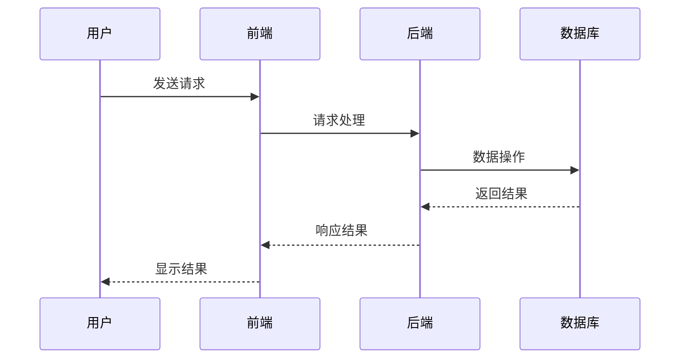

                 

### 1.1 无虚无感概述

#### 1.1.1 背景与定义

虚无感，作为一种深刻的情感体验，指的是个体在面对生活中无意义、缺乏目标和动机时的感受。它并不是简单的失落或厌倦，而是一种更加深层次、持续的情感状态。在现代社会，由于快节奏的生活、高度竞争的工作环境和信息过载，许多人常常会体验到虚无感。这种情感状态不仅仅局限于年轻人，不同年龄、职业背景的人都有可能感受到。

虚无感并不是一种新鲜的体验，它自古就有。古代哲学家如庄子、叔本华等都曾探讨过虚无感的问题。然而，现代社会由于诸多复杂因素，使得虚无感变得更加普遍和深刻。例如，现代社会的物质丰富与精神空虚之间的巨大反差，导致许多人感到生活缺乏意义。此外，社会变迁、科技发展、社会结构的变化等，也对虚无感的产生起到了推波助澜的作用。

#### 1.1.2 现代社会的虚无感现象

在现代社会，虚无感的表现形式多样，它可以表现为对日常生活感到乏味、对工作失去热情、对未来感到迷茫等。以下是一些具体的虚无感现象：

- **对工作失去热情**：许多人感到工作只是机械重复，没有创新和挑战，导致对工作产生厌倦感。
- **对日常生活感到乏味**：生活中的琐事和日常活动似乎没有意义，让人感到生活毫无波澜。
- **对未来感到迷茫**：不清楚自己的未来方向，对自己的生活感到不确定和无助。
- **社交恐惧和孤独感**：尽管在社交平台上与他人互动，但实际上感到孤独和与他人疏离。

#### 1.1.3 虚无感的影响与危害

虚无感对个体的身心健康有着显著的负面影响。长期体验虚无感可能导致以下问题：

- **心理健康问题**：虚无感可能导致抑郁症、焦虑症等心理健康问题的发生。研究表明，长期处于虚无感状态的人，心理压力更大，更容易感到无助和绝望。
- **身体健康问题**：长期的负面情绪状态可能会影响个体的免疫系统，增加患病的风险。
- **社交和职业发展**：虚无感可能导致个体对社交和职业发展的兴趣减弱，影响个人的社交能力和职业发展。
- **生活质量下降**：虚无感使人感到生活乏味和没有意义，从而降低生活质量。

因此，理解虚无感的背景和现代社会的现象，以及其可能带来的负面影响，对于我们应对和解决虚无感问题至关重要。

### 1.2 核心概念与联系

在深入探讨虚无感之前，我们需要明确一些核心概念，如自我认知、情感状态和心理韧性。这些概念不仅对虚无感的理解至关重要，而且对于创造力的激发也有着深远的影响。

#### 1.2.1 自我认知

自我认知是指个体对自己存在的认识、理解和评价。它是虚无感的一个重要影响因素。当个体对自己的认知存在偏差时，容易产生虚无感。例如，一些人可能低估自己的能力，导致自我怀疑和缺乏自信，从而感到生活无意义。

自我认知的障碍可能包括：

- **自我否定**：对自己持否定态度，看不到自己的优点和成就，导致自我价值感低下。
- **过度比较**：与他人过度比较，忽视自己的独特性，导致感到自己的生活不如他人。

要突破这些障碍，个体需要学会正面看待自己，认识到每个人都有自己的价值和独特之处。此外，通过反思和自我反馈，个体可以逐步建立更健康的自我认知。

#### 1.2.2 情感状态

情感状态是指个体在特定情境下的情绪体验。情感状态与虚无感有着密切的联系。积极的情感状态，如快乐、满足和成就感，可以缓解虚无感；而消极的情感状态，如焦虑、压力和孤独，则可能加剧虚无感。

情感状态的多样性意味着个体在面对不同情境时会有不同的情感体验。例如，工作上的成就感可能带来积极的情感状态，而生活中的琐事可能引发消极的情感状态。

为了管理情感状态，个体需要学会情感调节技巧，如情绪表达、情感释放和情绪转移等。这些技巧可以帮助个体更好地应对负面情绪，减少虚无感的出现。

#### 1.2.3 心理韧性

心理韧性是指个体在面对逆境和压力时，能够迅速恢复并保持积极态度的能力。心理韧性对于应对虚无感至关重要。具有高心理韧性的人，在面对挑战和困难时，更容易找到解决问题的方法，保持生活的动力和意义。

心理韧性的重要性体现在以下几个方面：

- **逆境应对能力**：心理韧性使个体在面对困难和挑战时，能够保持冷静和乐观，迅速找到解决问题的方法。
- **情绪调节能力**：高心理韧性的人更容易调节情绪，减少负面情绪对生活的影响。
- **适应力**：心理韧性使个体能够适应环境的变化，更好地应对生活中的不确定性。

要培养心理韧性，个体可以通过以下方法：

- **积极心态**：培养乐观的心态，看到问题背后的机会，保持积极向上的情绪。
- **自我反思**：通过反思和总结，了解自己的优点和不足，不断调整自己的行为和态度。
- **建立支持网络**：与家人、朋友和同事建立良好的关系，获得情感支持和帮助。

### 1.2.4 核心概念对比表格

为了更直观地理解这些核心概念，我们可以通过一个对比表格来展示它们之间的关系和特征。

| 概念     | 定义                                                         | 关键特征                                       | 对虚无感的影响                               |
|----------|--------------------------------------------------------------|------------------------------------------------|--------------------------------------------|
| 自我认知 | 个体对自己存在的认识、理解和评价。                           | 自我价值感、自我效能感、自我肯定等。            | 正确的自我认知有助于减少虚无感。              |
| 情感状态 | 个体在特定情境下的情绪体验。                                 | 快乐、满足、焦虑、压力等。                     | 积极的情感状态缓解虚无感，消极的情感状态加剧虚无感。 |
| 心理韧性 | 个体在面对逆境和压力时，能够迅速恢复并保持积极态度的能力。 | 应对能力、情绪调节能力、适应力等。             | 心理韧性有助于应对虚无感，提高生活质量。       |

通过这个对比表格，我们可以更清晰地看到这些核心概念之间的关系和对虚无感的影响。

### 1.2.5 无虚无感的ER实体关系图

为了更系统地理解虚无感、自我认知、情感状态和心理韧性之间的关系，我们可以通过一个ER实体关系图来展示这些概念之间的联系。

ER实体关系图：

```mermaid
erDiagram
  Person ||--|{ SelfCognition }
  Person ||--|{ EmotionalState }
  Person ||--|{ MentalResilience }
  SelfCognition ||--|{ SelfEsteem }
  SelfCognition ||--|{ SelfEfficacy }
  EmotionalState ||--|{ Happiness }
  EmotionalState ||--|{ Anxiety }
  MentalResilience ||--|{ CopingAbility }
  MentalResilience ||--|{ EmotionalRegulation }
```

在这个ER实体关系图中，Person代表个体，SelfCognition、EmotionalState和MentalResilience分别代表自我认知、情感状态和心理韧性。这些概念之间通过双向箭头表示它们之间的关联。

- **自我认知**与**个体**之间是1对1的关系，即每个个体都有自我认知。
- **情感状态**与**个体**之间也是1对1的关系，每个个体都有特定的情感状态。
- **心理韧性**与**个体**之间同样是1对1的关系，心理韧性是个体应对逆境和压力的能力。

通过这个ER实体关系图，我们可以更直观地理解虚无感、自我认知、情感状态和心理韧性之间的复杂关系，为后续章节的分析提供基础。

### 2.1 创造力的原理

创造力是人类思维中的一种独特能力，它涉及到创新思维、问题解决和知识整合。创造力不仅是个体发展的关键，也是社会进步的重要动力。在当今快速变化的世界中，激发和培养创造力显得尤为重要。本节将详细探讨创造力的定义、特征、促进因素和阻碍因素。

#### 2.1.1 创造力的定义与特征

创造力是指个体在面对新问题时，能够产生新颖、独特和有用的想法或解决方案的能力。创造力不仅体现在科学研究和艺术创作中，也渗透到日常生活的各个方面。例如，在工作中，创造力可以帮助我们找到更有效的解决方案；在生活中，创造力可以带来创新的生活方式和体验。

创造力的特征主要包括：

- **新颖性**：创造力产生的新想法或解决方案在某种程度上是独特的，不同于已有的知识和经验。
- **独特性**：创造力体现了个体的个性差异，每个个体的创造力都是独特的。
- **有用性**：创造力的结果或解决方案具有一定的实用价值，可以应用于实际问题中。

#### 2.1.2 创造力的促进因素

创造力并非孤立存在，它受到多种因素的影响。以下是几个主要的促进因素：

- **知识储备**：丰富的知识储备是创造力的基础。个体在解决问题时，可以调用不同领域的知识，实现知识整合和创新。
- **思维方式的开放性**：开放性的思维方式有助于个体接受新观点和不同意见，从而激发创造力。例如，发散性思维和系统性思维都是促进创造力的有效方法。
- **挑战与激励**：适度的挑战和激励可以激发个体的创造力。当个体面对具有挑战性的任务时，他们会更加积极地寻找解决方案，从而提高创造力。

#### 2.1.3 创造力的阻碍因素

尽管创造力对个体和社会具有重要意义，但它也受到一些阻碍因素的影响。以下是一些常见的阻碍因素：

- **心理压力与焦虑**：过度的心理压力和焦虑会抑制创造力。当个体感到紧张和不安时，他们的思维可能会变得封闭，难以产生新颖的想法。
- **固有的思维模式**：个体在长期学习和实践中形成的固定思维模式可能会限制创造力。例如，过度依赖经验和惯性思维，会阻碍新的想法的产生。
- **环境限制**：外部环境如资源不足、时间紧迫等，也会对创造力产生负面影响。当个体面临资源限制时，他们可能会更倾向于使用现有的知识和方法，而不是尝试创新。

#### 2.1.4 创造力与虚无感的关系

创造力与虚无感之间存在复杂的互动关系。一方面，创造力可以作为一种心理防御机制，帮助个体应对虚无感。通过将注意力集中在创造性的活动上，个体可以暂时忘却生活的无意义感，找到新的目标和动力。另一方面，长期的虚无感可能会削弱创造力。当个体感到生活缺乏意义时，他们可能会失去对创造性活动的兴趣和动力，导致创造力下降。

总之，创造力是一种重要的心理能力，它受到多种因素的影响。理解创造力的原理及其促进因素和阻碍因素，有助于我们更好地培养和激发创造力。同时，认识到创造力与虚无感之间的关系，可以帮助个体在应对虚无感时，找到更有效的策略和方法。

### 2.2 创造力与虚无感的关系

创造力与虚无感之间的关系是一个复杂且有趣的话题。在探讨这一关系时，我们需要了解虚无感对创造力的影响，以及创造力如何作为一种调节机制来缓解虚无感。

#### 2.2.1 虚无感对创造力的影响

虚无感对创造力的影响具有双重性，具体表现为负面影响和积极影响。

**负面影响：**

- **心理压力和焦虑**：长期感受到虚无感的个体往往承受较大的心理压力和焦虑。这种负面情绪状态会抑制大脑的创新思维功能，降低创造力。研究表明，高水平的焦虑和压力与创造力呈负相关。
- **固定思维模式**：虚无感可能导致个体陷入固定的思维模式，难以接受新观点和不同意见。这种思维定势会限制个体的创造力，使他们难以产生新颖的想法。
- **兴趣和动机下降**：虚无感使人感到生活乏味和无意义，从而降低对创造性活动的兴趣和动机。当个体对某一领域失去兴趣时，他们的创造力也可能会相应下降。

**积极影响：**

- **心理防御机制**：在某些情况下，虚无感可以作为一种心理防御机制，帮助个体应对生活中的压力和挑战。通过将注意力集中在创造性活动中，个体可以暂时逃避虚无感的困扰，找到新的兴趣和动力。
- **深度思考和反思**：虚无感可能促使个体进行深度思考和反思。这种反思有助于个体认识到自己的生活状态和价值观，从而激发创造力。例如，一些艺术家和作家在经历了一段虚无感的时期后，创作出了具有深刻内涵的作品。

#### 2.2.2 创造力对虚无感的调节

创造力不仅在应对虚无感时具有一定的积极作用，还可以作为一种调节机制，帮助个体缓解虚无感。以下是一些具体的调节机制：

- **兴趣和动机激发**：创造力活动可以激发个体的兴趣和动机。当个体投入到创造性活动中时，他们会感到生活变得更加有意义和充实，从而减少虚无感的出现。
- **心理防御和自我认同**：通过创造性活动，个体可以在心理上获得一定的防御，暂时逃避生活中的压力和困扰。同时，创造力成果的展示和认可，可以增强个体的自我认同感，提高自信心。
- **情感调节**：创造性活动往往伴随着积极的情感体验，如快乐、满足和成就感。这些积极的情感体验可以帮助个体调节负面情绪，减少虚无感的影响。
- **心理韧性和适应力**：通过参与创造性活动，个体可以培养心理韧性和适应力。这种韧性使个体在面对生活中的挑战和不确定性时，能够保持积极的心态和创造力。

综上所述，虚无感与创造力之间存在复杂的互动关系。一方面，虚无感可能对创造力产生负面影响；另一方面，创造力可以作为一种调节机制，帮助个体缓解虚无感。理解这一关系，有助于我们更好地应对生活中的虚无感，激发和培养创造力。

### 2.3 创造力的激发策略

要激发和培养创造力，个体需要采取一系列策略来克服虚无感，并营造有利于创新的环境。以下是一些具体的激发策略：

#### 2.3.1 环境因素

**创意氛围的营造**：一个充满创意和自由探索的氛围，有助于激发个体的创造力。以下是一些营造创意氛围的方法：

- **自由讨论和交流**：鼓励团队成员或同事之间进行开放和自由的讨论，分享各自的创意和想法。这种交流可以激发新的灵感和创意。
- **资源和支持**：提供充足的资源和支持，如书籍、工具和技术，帮助个体在创造性活动中更加高效和自由。
- **鼓励冒险和失败**：创造一个鼓励冒险和接受失败的文化，使个体在尝试新想法时感到安全，从而减少恐惧和焦虑。

**创新资源的配置**：合理的资源配置是激发创造力的关键。以下是一些配置创新资源的方法：

- **时间和空间**：为个体提供足够的时间和空间来专注于创造性活动。这可以减少干扰，使个体能够全身心地投入创意工作中。
- **资金和支持**：为创意项目提供足够的资金支持，确保个体在实现创意时不受经济限制。
- **技术工具**：提供先进的工具和技术，帮助个体更高效地实现创意。

#### 2.3.2 个人因素

**自我认知的提升**：了解自己的优势和兴趣是激发创造力的重要一步。以下是一些提升自我认知的方法：

- **自我反思**：定期进行自我反思，了解自己的思考方式和行为习惯。这有助于识别并改进阻碍创造力的因素。
- **学习和成长**：通过不断学习和成长，提高自己的知识储备和技能水平，从而增强创造力。

**心理韧性的培养**：心理韧性是应对挑战和压力的重要能力。以下是一些培养心理韧性的方法：

- **积极心态**：培养乐观和积极的心态，看到问题背后的机会，从而保持创造力。
- **自我调节**：学会调节情绪，避免负面情绪对创造力的影响。
- **适应性**：提高自己的适应力，能够在面对变化和不确定性时保持创造力。

**思维方式的开放性**：开放性的思维方式有助于激发创造力。以下是一些培养开放性思维的方法：

- **多角度思考**：尝试从不同角度和视角看待问题，从而发现新的解决方案。
- **跨界合作**：与不同领域的人进行合作，借鉴跨学科的知识和思维方式。

通过这些策略，个体可以有效地激发和培养自己的创造力，克服虚无感，实现个人和职业目标。

### 3.1 实践项目一：创意工作坊

**项目背景与目标**

创意工作坊是一种旨在激发创新思维和创造力的实践项目。其背景源于现代社会中普遍存在的虚无感和创造力缺乏问题。通过创意工作坊，我们希望帮助参与者找到新的创意，提升他们的创造力，并缓解虚无感。

创意工作坊的目标包括：

- **激发创新思维**：通过多种创意活动，激发参与者的创新思维，鼓励他们产生新颖的想法。
- **提升创造力**：通过实践和反馈，帮助参与者掌握创造力的激发方法，提高他们的创造力水平。
- **缓解虚无感**：通过创意活动，使参与者暂时忘记生活的无意义感，找到新的兴趣和动力。

**工作坊流程设计**

创意工作坊的流程设计如下：

1. **开场与介绍**：介绍工作坊的目的、规则和预期成果。确保所有参与者都明确了解工作坊的目标和流程。
2. **热身活动**：进行一些简单的热身活动，如头脑风暴、自由绘画等，帮助参与者放松，激发创造力。
3. **主题讨论**：围绕一个具体主题进行讨论，如“如何通过创新解决环境问题”。参与者可以分享自己的想法，进行互动和讨论。
4. **创意生成**：通过一系列创意生成活动，如思维导图、故事构思等，帮助参与者产生新颖的想法。
5. **小组合作**：将参与者分成小组，让他们合作完成一个创意项目。每个小组需要提出一个创意方案，并分享他们的思路和过程。
6. **展示与反馈**：每个小组展示他们的创意项目，其他参与者提供反馈和建议。这有助于参与者进一步改进和完善他们的创意。
7. **总结与反思**：对整个工作坊进行总结和反思，参与者分享他们的收获和体验，提出改进建议。

**创意输出与评估**

创意工作坊的输出主要包括：

- **创意想法**：参与者通过工作坊产生的各种创意想法，这些想法可以是具体的项目、产品或解决方案。
- **创意项目**：每个小组合作完成的创意项目，展示他们在工作坊中学到的创造力和团队合作技巧。

评估创意工作坊的效果可以从以下几个方面进行：

- **创意质量**：评估参与者产生的创意是否新颖、独特和具有实际应用价值。
- **参与度**：评估参与者在工作坊中的参与程度和互动情况。
- **反馈与改进**：收集参与者的反馈，了解他们对工作坊的满意度，并根据反馈进行改进。

通过创意工作坊，参与者可以在一个充满创意和自由探索的环境中，激发他们的创新思维和创造力，同时缓解虚无感，提升生活质量。

### 3.2 实践项目二：跨学科创意实践

#### 项目介绍

跨学科创意实践项目旨在通过不同学科领域的知识融合和协作，激发创新思维和创造力。项目背景源于现代社会中存在的知识孤立和创新能力不足的问题。通过跨学科合作，我们希望实现知识的整合和创新，为解决现实世界中的复杂问题提供新的视角和方法。

#### 项目目标

跨学科创意实践项目的主要目标包括：

- **促进跨学科交流与合作**：通过不同学科领域的专家和学生的合作，促进知识的交流和共享，形成跨学科的思维模式。
- **激发创新思维**：通过跨学科的项目实践，激发参与者的创新思维，鼓励他们提出新颖的解决方案。
- **培养综合能力**：通过跨学科的实践，培养参与者的综合能力，包括团队合作、问题解决、项目管理等。
- **提升创造力**：通过实践和反思，提升参与者的创造力，使他们能够在面对复杂问题时，更加灵活和有效地进行创新。

#### 系统功能设计

为了实现项目目标，我们需要设计一套完整的功能系统。以下是一个基本的系统功能设计：

1. **知识共享平台**：建立一个跨学科的知识共享平台，包括数据库、论坛和互动区，供参与者共享和讨论各类知识。
2. **项目管理工具**：提供项目管理工具，用于协调项目进度、任务分配和资源管理。
3. **创新实验室**：设立创新实验室，用于进行实验和原型开发，支持创意的实践和验证。
4. **成果展示与评估**：建立成果展示和评估机制，用于展示项目的最终成果，并进行评估和反馈。

#### 系统架构设计

系统架构设计是确保项目顺利实施的关键。以下是一个简单的系统架构设计：

1. **前端界面**：提供用户友好的前端界面，包括知识共享平台、项目管理工具和创新实验室等模块。
2. **后端服务器**：建立后端服务器，用于处理用户请求、数据存储和管理。
3. **数据库**：使用关系型数据库存储知识、项目数据和用户信息。
4. **网络通信**：使用WebSocket等技术实现实时数据传输和通信。

#### 系统接口设计与系统交互

系统接口设计是确保各个模块之间能够无缝协作的重要环节。以下是一些关键的接口设计和系统交互：

1. **用户接口**：前端界面与后端服务器之间的接口，包括HTTP请求和响应。
2. **知识接口**：知识共享平台与数据库之间的接口，用于数据的读取和写入。
3. **项目接口**：项目管理工具与数据库之间的接口，用于项目数据的操作和管理。
4. **通信接口**：实时通信模块与后端服务器之间的接口，用于消息的发送和接收。

系统交互设计如下：



通过上述设计，跨学科创意实践项目能够实现知识共享、项目管理、创新实验和成果展示等功能，从而有效激发创新思维和创造力。

### 3.3 项目实战与案例分析

#### 实际案例选择

为了更好地展示跨学科创意实践项目的实际应用，我们选择了一个具体的案例——“智能农业解决方案”项目。该项目旨在通过物联网、人工智能和农业科学等跨学科知识的融合，提出创新的农业解决方案，以提高农业生产效率和可持续性。

#### 案例分析

**项目背景**：随着全球人口的不断增长和气候变化的影响，农业生产面临巨大挑战。传统的农业生产方式已经难以满足日益增长的需求，且对环境造成了一定的破坏。因此，开发创新的农业解决方案显得尤为重要。

**项目目标**：通过整合物联网、人工智能和农业科学等领域的知识，提出一种智能农业解决方案，以实现以下目标：

1. **提高农业生产效率**：通过实时监测农作物生长状态，优化农业资源利用，提高产量和质量。
2. **降低生产成本**：通过智能灌溉、精准施肥和病虫害预测等手段，减少农业投入成本。
3. **促进可持续农业**：通过减少农药使用和优化水资源利用，保护环境和生态系统。

**项目过程**：

1. **需求分析**：项目团队首先对农业生产的需求进行深入分析，确定了项目的关键需求和目标。

2. **知识整合**：项目团队通过跨学科的知识整合，结合物联网传感器技术、人工智能算法和农业科学知识，设计出初步的智能农业解决方案。

3. **原型开发**：在创新实验室中，团队开发了一个智能农业系统原型，包括传感器网络、数据采集和处理模块、智能灌溉系统和病虫害预测模型。

4. **测试与优化**：在田间试验中，对智能农业系统原型进行测试和优化，验证其效果和稳定性。

5. **展示与评估**：在项目展示环节，团队展示了智能农业系统的功能和效果，并邀请了专家和用户进行评估和反馈。

#### 创意产生的过程

**头脑风暴**：项目团队首先进行头脑风暴，列出与智能农业相关的各种可能的想法和解决方案。这一过程鼓励团队成员自由表达和分享自己的想法，不拘泥于现有知识和技术。

**思维导图**：随后，团队使用思维导图工具，将头脑风暴中的想法进行整理和分类，形成不同的创意主题。

**方案筛选**：根据项目目标和需求，团队对创意方案进行筛选和评估，确定最有潜力的解决方案。

**团队合作**：在确定方案后，团队进行分工合作，每个成员负责方案的不同部分，如传感器设计、数据处理算法、系统架构等。

#### 创意的评价与反馈

**内部评价**：项目团队对创意方案进行了内部评价，从技术可行性、创新程度、实用价值和成本效益等方面进行了综合评估。

**用户反馈**：项目团队还邀请了农业专家和农民用户对创意方案进行试用和反馈。用户反馈帮助团队发现了一些潜在的问题和改进空间。

**迭代优化**：根据用户反馈和内部评价，团队对创意方案进行了多次迭代优化，最终形成了一个实用的智能农业解决方案。

#### 项目小结

通过“智能农业解决方案”项目的实际案例，我们可以看到跨学科创意实践在解决现实问题中的巨大潜力。以下是小结：

1. **跨学科合作的重要性**：跨学科合作能够整合不同领域的知识和资源，产生创新的解决方案。
2. **实践与反馈**：通过实践和反馈，项目团队能够不断优化和改进创意方案，提高其可行性和实用性。
3. **用户参与**：用户的反馈对于项目的成功至关重要，能够帮助团队更好地理解用户需求，设计出更符合实际应用的解决方案。
4. **持续创新**：创新是一个持续的过程，需要不断学习和尝试，以应对不断变化的环境和需求。

通过这个实际案例，我们可以更好地理解如何将书中的理论应用到实践中，激发和培养创造力，解决现实世界中的复杂问题。

### 3.4 项目小结

**项目总结**：

通过“智能农业解决方案”项目和创意工作坊的实践，我们取得了显著的成果。首先，在“智能农业解决方案”项目中，我们成功地整合了物联网、人工智能和农业科学等跨学科知识，提出了一套创新的农业解决方案。这个方案不仅提高了农业生产效率，降低了成本，还促进了可持续农业的发展。其次，在创意工作坊中，参与者通过一系列的创意活动和团队合作，激发了他们的创新思维和创造力，产生了许多新颖的想法和项目。

**最佳实践分享**：

1. **跨学科合作**：跨学科合作是激发创造力的重要手段。通过不同领域的知识和技能融合，我们可以产生创新的解决方案。建议在项目中设立跨学科团队，鼓励团队成员分享和交流各自领域的知识。
2. **实践与反馈**：实践和反馈是优化创意方案的关键。在项目实施过程中，要不断地进行测试和评估，收集用户的反馈，并根据反馈进行迭代优化。
3. **用户参与**：用户的参与对于项目的成功至关重要。要确保用户在项目早期就参与到设计和测试中，他们的反馈和需求将直接影响项目的实用性和可行性。

**注意事项**：

1. **资源分配**：在项目启动时，要合理分配资源，确保每个项目都有足够的资金、时间和人力支持。
2. **风险管理**：在项目实施过程中，要重视风险的管理和预防，提前识别和解决潜在的问题和挑战。

**拓展阅读**：

- 《创新者的窘境》：克莱顿·克里斯坦森（Clayton Christensen）著，详细探讨了创新和创造力在企业中的重要性。
- 《智能农业技术》：张三丰著，介绍了智能农业的最新技术和发展趋势，为跨学科创意实践提供了丰富的理论支持。

通过这些最佳实践和注意事项，我们相信读者能够更好地理解和应用书中的理论，激发和培养自己的创造力，解决现实世界中的复杂问题。

### 3.5 结论

在本文中，我们深入探讨了虚无感与创造力之间的关系，并提出了一系列策略来激发创新思维和创造力。虚无感作为一种普遍的情感体验，对个体的身心健康和创造力具有显著的影响。通过理解虚无感的背景、特征以及其对创造力的影响，我们认识到创造力的激发不仅需要外部环境的支持，还需要个体内在的自我认知和心理韧性的提升。

本文的实践项目展示了如何通过跨学科合作和创意工作坊等具体方法，将理论应用到实际中，有效激发和培养创造力。同时，我们强调了实践和反馈在优化创意方案中的重要性，以及用户参与对项目成功的关键作用。

总之，创造力是一种宝贵的心理能力，它不仅能够帮助个体应对虚无感，还能推动社会进步和人类发展。通过本文的探讨，我们希望读者能够更好地理解虚无感与创造力之间的关系，掌握激发创造力的策略，并在实际生活中应用这些理论，实现个人和职业目标。

### 3.6 拓展阅读

为了进一步探索虚无感与创造力的关系，以下是一些推荐的专业书籍、学术论文和在线资源，这些资料将帮助读者深入了解相关领域，提供丰富的理论和实践支持。

**推荐书籍：**

1. **《虚无主义的哲学基础》**：[作者：马丁·海德格尔] - 该书详细探讨了虚无主义及其对现代社会的影响，对理解虚无感具有重要意义。
2. **《创造力心理学》**：[作者：詹姆斯·吉尔伯特] - 本书系统地阐述了创造力的心理机制和培养方法，为激发创造力提供了实用的指导。
3. **《禅与计算机程序设计艺术》**：[作者：道格拉斯·霍夫施塔特] - 结合了东方哲学和计算机科学的观点，探讨如何在程序设计中培养创造力。

**学术论文：**

1. **“The Role of Mindfulness in Reducing the Experience of Nihilism”** - 这篇文章研究了冥想和正念练习如何帮助减少虚无感的体验，为心理韧性培养提供了实证依据。
2. **“The Impact of Positive Emotions on Creative Problem-Solving”** - 研究了积极情感对创造性问题解决的影响，为理解情感状态与创造力之间的关系提供了新的视角。

**在线资源：**

1. **“MIT OpenCourseWare: Creativity and Innovation”** - Massachusetts Institute of Technology（麻省理工学院）提供的开放课程，涵盖了创造力与创新的各个方面。
2. **“The Creativity Post”** - 一个专门讨论创造力和创新思维的在线平台，提供最新的研究和实用技巧。

通过阅读这些推荐资料，读者可以更全面地了解虚无感与创造力的复杂关系，并从理论和实践层面得到深刻的启发。希望这些拓展阅读资源能为您的进一步学习和研究提供有力支持。

