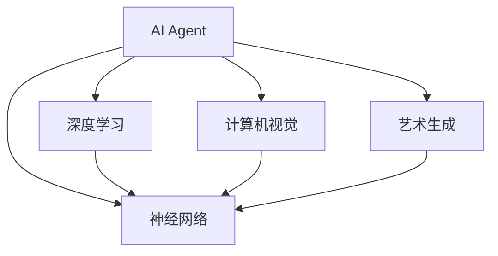
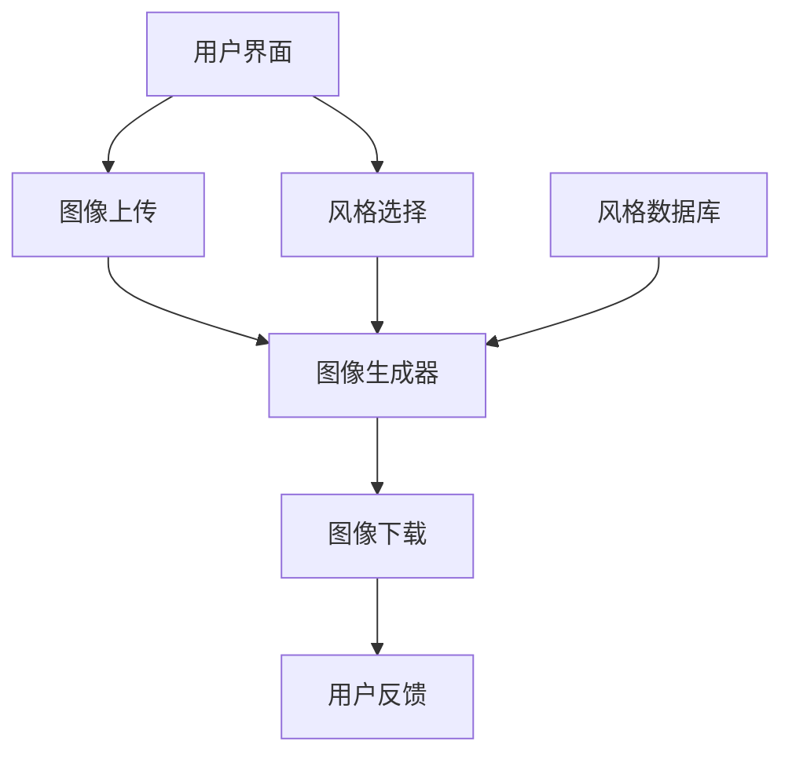
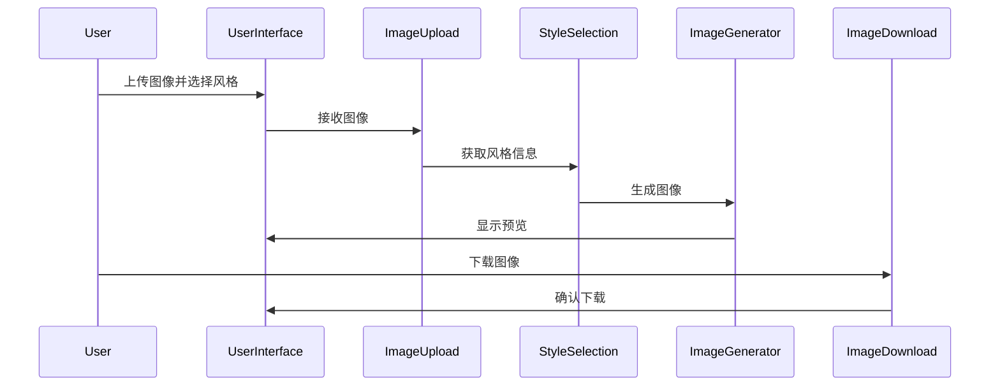

                 


# 视觉艺术领域的AI Agent创作工具

## 关键词
- 视觉艺术
- AI Agent
- 创作工具
- 深度学习
- 计算机视觉
- 艺术生成
- 神经网络

## 摘要
本文将深入探讨视觉艺术领域中的AI Agent创作工具，从核心概念、算法原理到系统设计与实战项目，一一剖析这些工具的使用与实现。我们将首先介绍视觉艺术与AI Agent的背景与现状，然后逐步引入核心概念及其关系，详细讲解关键算法，分析系统架构，最后通过实际项目展示工具的运用，并总结最佳实践与注意事项。

## 背景介绍

### 视觉艺术与AI Agent的定义

**视觉艺术**指的是通过视觉感知媒介，如绘画、雕塑、摄影等，表达人类思想和情感的艺术形式。它不仅包括传统的美术创作，也涵盖了现代数字艺术、虚拟现实（VR）和增强现实（AR）等新兴领域。

**AI Agent**，即人工智能代理，是指能在特定环境中自主执行任务、与外界交互并学习适应的新一代智能系统。在计算机科学领域，AI Agent被广泛认为是实现人工智能的重要途径之一。

### AI在视觉艺术中的应用

近年来，随着深度学习和计算机视觉技术的发展，AI在视觉艺术创作中的应用越来越广泛。以下是一些主要的应用场景：

1. **风格迁移**：利用神经网络将一种艺术风格应用到另一张图像上，如著名的“DeepArt”项目。
2. **图像生成**：通过生成对抗网络（GAN）创造全新的视觉作品，如“ProGAN”和“StyleGAN”。
3. **图像修复**：使用卷积神经网络（CNN）修复损坏或老化的图像，如“Image Restoration using GAN”。
4. **图像增强**：改善图像质量，使其更清晰、更生动，如“Super-Resolution”技术。
5. **艺术风格探索**：探索不同的艺术风格，为艺术家提供灵感，如“Artistic Style Transfer”。
6. **交互式艺术**：通过AI实现与观众互动的艺术装置，如“Perceptual Computing”项目。

### AI Agent创作工具的重要性

AI Agent创作工具是AI在视觉艺术领域的桥梁，使得艺术家和设计师能够利用AI技术进行创作。这些工具不仅提高了创作效率，还带来了全新的艺术体验和表达方式。例如，通过AI Agent，艺术家可以快速实现风格迁移和图像生成，从而探索新的创作方向。

### 问题背景与解决方案

在视觉艺术领域，传统的人工创作方式效率较低，且难以满足日益复杂的需求。AI Agent的出现为这一问题提供了有效解决方案。然而，目前市场上的AI Agent创作工具种类繁多，各自具有不同的特点和应用范围，这使得用户在选择和使用时面临困惑。

为了解决这一问题，本文将系统介绍不同类型的AI Agent创作工具，分析其核心原理和功能，并通过实际项目展示如何使用这些工具。此外，本文还将提供最佳实践和注意事项，帮助读者更好地掌握AI Agent在视觉艺术创作中的应用。

### 边界与外延

**边界**：本文讨论的AI Agent创作工具主要指的是利用机器学习和深度学习技术，能够自动创作视觉艺术作品的软件和平台。这些工具通常具备自主学习和适应能力，可以处理复杂的图像数据和艺术风格。

**外延**：本文的外延包括但不限于以下领域：

1. **AI Agent的泛化应用**：除了视觉艺术，AI Agent在其他领域的应用，如自然语言处理、游戏开发、自动化控制等。
2. **AI Agent的交互设计**：如何设计更人性化的交互界面，使非技术背景的用户也能轻松使用AI Agent创作工具。
3. **AI Agent的伦理和隐私问题**：在使用AI Agent进行艺术创作时，如何平衡创新与伦理、隐私保护等问题。

## 核心概念与联系

### 核心概念

1. **AI Agent**：在特定环境中自主执行任务、与外界交互并学习适应的智能系统。
2. **深度学习**：一种机器学习范式，通过模拟人脑神经网络进行学习和决策。
3. **计算机视觉**：使计算机能够“看”和“理解”图像和视频的学科。
4. **艺术生成**：利用AI技术生成新的艺术作品，包括风格迁移、图像生成等。
5. **神经网络**：由大量神经元组成的计算模型，能够通过学习和适应进行复杂任务处理。

### 概念属性特征对比表格

| 概念 | 定义 | 特点 | 应用 |
| --- | --- | --- | --- |
| AI Agent | 自主执行任务、交互学习 | 高度自主、适应性 | 视觉艺术创作、自动化控制 |
| 深度学习 | 神经网络学习 | 高效、强大、非线性 | 图像识别、自然语言处理 |
| 计算机视觉 | 计算机理解和解释图像 | 高精度、实时性 | 视觉艺术生成、图像分析 |
| 艺术生成 | AI生成艺术作品 | 创新性强、多样化 | 风格迁移、图像生成 |
| 神经网络 | 神经元连接模型 | 自适应、强大 | 语音识别、图像分类 |

### ER实体关系图架构



通过上述实体关系图，我们可以清晰地看到AI Agent与深度学习、计算机视觉、艺术生成和神经网络之间的紧密联系。这些概念共同构成了AI Agent创作工具的核心架构，为视觉艺术创作提供了强大支持。

## AI Agent创作工具的介绍

### AI Agent创作工具的类型

目前市场上主要的AI Agent创作工具可以分为以下几类：

1. **风格迁移工具**：如DeepArt、DeepDreamGenerator等，它们可以将一种艺术风格应用到其他图像上。
2. **图像生成工具**：如ProGAN、StyleGAN等，它们可以生成高度逼真的新图像。
3. **图像修复工具**：如ImageRestorationGAN等，它们可以修复损坏或老化的图像。
4. **图像增强工具**：如Super-Resolution等，它们可以增强图像的清晰度和细节。
5. **艺术风格探索工具**：如ArtisticStyleTransfer等，它们可以探索不同的艺术风格。

### 各类工具的特点和功能

1. **风格迁移工具**：
   - **特点**：能够将一种艺术风格（如梵高、毕加索等）应用到其他图像上，生成具有独特艺术风格的新图像。
   - **功能**：支持多种艺术风格的选择，可以调整风格强度，适用于艺术创作和图像编辑。
2. **图像生成工具**：
   - **特点**：利用生成对抗网络（GAN）生成全新的图像，图像质量高，细节丰富。
   - **功能**：支持从随机噪声生成图像，可以控制生成图像的多样性和风格。
3. **图像修复工具**：
   - **特点**：能够修复图像中的损坏、划痕、褪色等问题，使图像更加清晰和完整。
   - **功能**：支持批量处理，可以修复不同类型的图像损坏。
4. **图像增强工具**：
   - **特点**：通过超分辨率技术提高图像的清晰度和细节。
   - **功能**：支持多种增强算法，适用于图像编辑和视觉分析。
5. **艺术风格探索工具**：
   - **特点**：可以探索不同的艺术风格，为艺术家提供新的创作灵感。
   - **功能**：支持艺术风格切换和混合，可以生成多种风格的艺术作品。

### 选择和使用AI Agent创作工具的建议

1. **明确需求**：在选择AI Agent创作工具时，首先需要明确自己的需求，例如是进行风格迁移、图像生成、修复还是增强等。
2. **了解工具特性**：研究各种工具的特点和功能，选择最适合自己需求的工具。
3. **实践体验**：通过实践操作，了解工具的易用性和效果，以便更好地掌握和使用。
4. **持续更新**：由于AI技术发展迅速，各种工具也会不断更新，因此需要关注最新版本和功能。

### 市场上的主要AI Agent创作工具

1. **DeepArt**：一个流行的风格迁移工具，可以将各种艺术风格应用到图像上。
2. **ProGAN**：一个强大的图像生成工具，能够生成高质量的图像。
3. **ImageRestorationGAN**：一个先进的图像修复工具，可以修复图像中的各种问题。
4. **Super-Resolution**：一个图像增强工具，通过超分辨率技术提高图像质量。
5. **ArtisticStyleTransfer**：一个艺术风格探索工具，可以探索不同的艺术风格。

通过以上介绍，我们可以看到AI Agent创作工具的多样性和强大功能，它们为视觉艺术创作带来了无限可能。在接下来的章节中，我们将深入探讨这些工具背后的算法原理和系统设计。

## 算法原理讲解

### 深度学习与神经网络基础

**深度学习（Deep Learning）**是机器学习（Machine Learning）的一个子领域，它通过模拟人脑神经网络的结构和功能，实现对复杂数据的自动学习和建模。神经网络（Neural Network）是深度学习的核心组件，由大量神经元（nodes）组成，这些神经元通过加权连接（weighted connections）进行信息传递和处理。

#### 神经元与激活函数

一个简单的神经元模型可以表示为：

$$
z = \sum_{i} w_{i}x_{i} + b
$$

其中，$x_{i}$ 是输入值，$w_{i}$ 是权重，$b$ 是偏置。神经元通过激活函数（activation function）来确定是否“激活”：

$$
a = \sigma(z)
$$

常见的激活函数包括：
- **Sigmoid函数**：$σ(z) = \frac{1}{1 + e^{-z}}$，将输入映射到（0,1）区间。
- **ReLU函数**：$σ(z) = \max(0, z)$，当输入大于0时返回输入，否则返回0。
- **Tanh函数**：$σ(z) = \frac{e^{z} - e^{-z}}{e^{z} + e^{-z}}$，将输入映射到（-1,1）区间。

#### 层与反向传播算法

神经网络通常包含多个层次，包括输入层、隐藏层和输出层。每个层次中的神经元通过前一层神经元的输出进行计算，最后生成输出。

反向传播算法（Backpropagation Algorithm）是训练神经网络的重要算法，它通过以下步骤进行：

1. **前向传播（Forward Propagation）**：计算输入通过网络的前向传播结果，即每个神经元的输出。
2. **计算误差（Error Calculation）**：计算实际输出与期望输出的误差。
3. **反向传播（Back Propagation）**：根据误差，反向计算每个神经元的梯度，更新权重和偏置。
4. **优化权重（Weight Optimization）**：使用梯度下降（Gradient Descent）或其他优化算法，更新网络权重，最小化误差。

### 生成对抗网络（GAN）

**生成对抗网络（Generative Adversarial Network，GAN）**是一种用于生成数据的新型深度学习框架，由两个神经网络组成：生成器（Generator）和判别器（Discriminator）。

#### 判别器与生成器的对抗

- **判别器**：判断输入数据是真实数据还是生成器生成的假数据。
- **生成器**：生成尽可能逼真的假数据，试图欺骗判别器。

GAN的训练过程可以看作是一个博弈过程：

1. **初始化生成器和判别器**。
2. **生成器生成假数据**：$G(z)$，其中$z$是随机噪声。
3. **判别器判断真假数据**：$D(x)$，其中$x$是真实数据，$G(z)$是生成器生成的假数据。
4. **更新生成器和判别器**：通过反向传播和梯度下降算法，分别优化生成器和判别器。

GAN的核心挑战是训练稳定性和梯度消失问题。为了解决这些问题，研究人员提出了许多改进方法，如深度卷积生成对抗网络（DCGAN）、改进的Wasserstein GAN（WGAN）等。

### Mermaid流程图

```mermaid
graph TD
A[初始化]
B[生成器G]
C[判别器D]
D[生成假数据G(z)]
E[判断真假D(x, G(z))]
F[更新G]
G[更新D]

A --> B
A --> C
B --> D
C --> E
D --> E
E --> F
E --> G
```

通过上述流程图，我们可以清晰地看到GAN的训练过程。生成器和判别器通过不断对抗和更新，最终实现生成高质量的数据。

### Python代码示例

以下是一个简单的GAN示例，用于生成手写数字图像。

```python
import tensorflow as tf
from tensorflow.keras import layers

# 定义生成器
def build_generator(z_dim):
    model = tf.keras.Sequential()
    model.add(layers.Dense(7*7*256, use_bias=False, input_shape=(z_dim,)))
    model.add(layers.BatchNormalization())
    model.add(layers.LeakyReLU())
    model.add(layers.Reshape((7, 7, 256)))
    # ...
    # 避免过长代码，省略中间层
    # ...
    model.add(layers.Conv2DTranspose(1, (4, 4), strides=(2, 2), padding='same', use_bias=False))
    model.add(layers.Activation('tanh'))
    return model

# 定义判别器
def build_discriminator(img_shape):
    model = tf.keras.Sequential()
    model.add(layers.Conv2D(64, (4, 4), strides=(2, 2), padding='same', input_shape=img_shape))
    model.add(layers.LeakyReLU())
    # ...
    # 省略中间层
    # ...
    model.add(layers.Dense(1, activation='sigmoid'))
    return model

# 定义GAN
def build_gan(generator, discriminator):
    model = tf.keras.Sequential()
    model.add(generator)
    model.add(discriminator)
    return model

# 设置超参数
z_dim = 100
img_shape = (28, 28, 1)

# 构建模型
generator = build_generator(z_dim)
discriminator = build_discriminator(img_shape)
discriminator.compile(loss='binary_crossentropy', optimizer=tf.keras.optimizers.Adam(0.0001))
gan = build_gan(generator, discriminator)

# 训练GAN
# ...
# 省略具体训练代码
# ...
```

通过这段代码，我们可以看到如何构建生成器和判别器，以及如何将它们组合成一个完整的GAN。具体训练过程请参考相关文献和代码库。

### 数学模型与公式

在GAN中，生成器和判别器的损失函数通常采用以下形式：

$$
\min_G \max_D V(D, G) = \mathbb{E}_{x \sim p_{data}(x)}[\log D(x)] + \mathbb{E}_{z \sim p_z(z)}[\log (1 - D(G(z))]
$$

其中，$D(x)$ 表示判别器对真实数据的判断，$G(z)$ 表示生成器对噪声 $z$ 的生成，$p_{data}(x)$ 表示真实数据的分布，$p_z(z)$ 表示噪声的分布。

### 总结

在本章节中，我们详细介绍了深度学习和神经网络的基础概念，讲解了GAN的算法原理和实现方法。通过Python代码示例，我们展示了如何构建和训练一个GAN模型。接下来，我们将进一步探讨GAN在实际项目中的应用，并通过具体案例进行深入分析。

## 系统分析与设计

### 问题场景与项目介绍

在本文的下一个部分，我们将通过一个实际的项目来深入分析AI Agent创作工具的系统架构与设计。该项目旨在利用生成对抗网络（GAN）创建一个能够生成高质量艺术风格的图像生成器。

#### 项目目标

1. **图像生成**：利用GAN技术生成具有艺术风格的新图像。
2. **风格迁移**：将某种特定的艺术风格（如印象派、抽象画等）应用到输入图像上。
3. **用户体验**：设计一个简洁、直观的用户界面，使非技术用户也能轻松使用该工具。

#### 问题场景

假设我们的目标是为艺术家和设计师提供一个在线平台，用户可以通过上传自己的图像，选择特定的艺术风格，然后生成风格化后的新图像。这个平台需要具备以下功能：

1. **图像上传**：用户可以上传自己的图像。
2. **风格选择**：用户可以选择不同的艺术风格。
3. **图像生成**：系统根据用户上传的图像和选择的风格生成新图像。
4. **预览与下载**：用户可以预览生成的图像，并选择下载。

### 系统架构设计

为了实现上述功能，我们需要设计一个高效、稳定的系统架构。以下是我们的系统架构设计：



#### 系统功能设计

1. **用户界面（UserInterface）**：
   - 提供上传图像和选择风格的界面。
   - 实现用户交互逻辑，包括上传、选择、预览和下载等操作。

2. **图像上传（ImageUpload）**：
   - 接收用户上传的图像文件。
   - 进行初步图像处理，如大小调整和格式转换。

3. **风格选择（StyleSelection）**：
   - 提供不同的艺术风格供用户选择。
   - 将用户选择的风格信息传递给图像生成器。

4. **图像生成器（ImageGenerator）**：
   - 使用GAN模型进行图像生成。
   - 根据用户上传的图像和选择的风格生成新图像。
   - 存储和缓存生成的图像，以供预览和下载。

5. **风格数据库（StyleDatabase）**：
   - 存储各种艺术风格的数据，如特征图、训练模型等。
   - 提供API供图像生成器调用。

6. **图像下载（ImageDownload）**：
   - 提供下载生成的图像功能。
   - 支持多种格式（如PNG、JPEG等）的下载。

7. **用户反馈（Feedback）**：
   - 收集用户的使用反馈，用于优化系统。

### 系统接口设计与交互

以下是系统中的关键接口和交互设计：



通过上述设计和交互，我们可以实现一个完整的用户流程：用户上传图像，选择风格，生成图像，预览并下载生成的图像。

### 结论

通过上述系统架构设计与接口设计，我们为AI Agent创作工具提供了一个清晰、可行的实现方案。接下来，我们将通过具体的项目实战，展示如何在实际环境中部署和运行这个系统。

## 实战项目

### 环境安装与设置

在开始实际项目之前，我们需要安装和配置相关的环境和工具。以下是具体的安装步骤和配置说明：

#### 安装Python

首先，确保Python已经安装在你的系统上。Python是所有深度学习和机器学习项目的基础。可以从Python官方网站（[python.org](https://www.python.org/)）下载并安装。

#### 安装TensorFlow

TensorFlow是Google开发的一个开源深度学习框架，支持多种深度学习模型和算法。可以通过以下命令安装TensorFlow：

```shell
pip install tensorflow
```

#### 安装其他依赖

除了TensorFlow，我们还需要安装其他依赖，如NumPy、Pandas等：

```shell
pip install numpy pandas matplotlib scikit-learn
```

#### 配置环境变量

确保将Python和pip的路径添加到系统环境变量中，以便在命令行中直接运行相关命令。

### 系统核心实现源代码

以下是核心实现代码，包括生成器和判别器的构建以及GAN的训练过程。

#### 生成器（Generator）代码

```python
import tensorflow as tf
from tensorflow.keras.layers import Dense, Conv2D, Flatten, Reshape, Conv2DTranspose
from tensorflow.keras.models import Sequential

def build_generator(z_dim, img_shape):
    model = Sequential()
    model.add(Dense(7*7*256, use_bias=False, input_shape=(z_dim,)))
    model.add(tf.keras.layers.BatchNormalization())
    model.add(tf.keras.layers.LeakyReLU())
    model.add(Reshape((7, 7, 256)))
    # ...
    # 省略中间层
    # ...
    model.add(Conv2DTranspose(1, (4, 4), strides=(2, 2), padding='same', use_bias=False))
    model.add(tf.keras.layers.Activation('tanh'))
    return model
```

#### 判别器（Discriminator）代码

```python
def build_discriminator(img_shape):
    model = Sequential()
    model.add(Conv2D(64, (4, 4), strides=(2, 2), padding='same', input_shape=img_shape))
    model.add(tf.keras.layers.LeakyReLU())
    # ...
    # 省略中间层
    # ...
    model.add(tf.keras.layers.Dense(1, activation='sigmoid'))
    return model
```

#### GAN模型代码

```python
def build_gan(generator, discriminator):
    model = Sequential()
    model.add(generator)
    model.add(discriminator)
    return model
```

#### 训练GAN代码

```python
import numpy as np
import matplotlib.pyplot as plt
from tensorflow.keras.optimizers import Adam

z_dim = 100
img_shape = (28, 28, 1)

generator = build_generator(z_dim, img_shape)
discriminator = build_discriminator(img_shape)
discriminator.compile(loss='binary_crossentropy', optimizer=Adam(0.0001))
gan = build_gan(generator, discriminator)
gan.compile(loss='binary_crossentropy', optimizer=Adam(0.0001))

# 数据准备和加载
# ...

# 训练过程
for epoch in range(epochs):
    # ...
    # 省略具体训练步骤
    # ...
```

### 代码应用解读与分析

上述代码展示了如何构建生成器和判别器，以及如何将它们组合成一个完整的GAN模型。以下是代码的关键部分和解读：

1. **生成器和判别器的构建**：生成器和判别器分别由多个卷积层和全连接层组成，用于生成图像和判断图像的真伪。
2. **GAN模型的编译**：GAN模型采用二进制交叉熵（binary cross-entropy）作为损失函数，使用Adam优化器进行训练。
3. **训练过程**：GAN的训练过程包括生成器生成图像、判别器判断图像真伪，然后根据误差更新生成器和判别器的权重。

通过这一系列的代码，我们可以实现一个基本的GAN模型，并用于图像生成。

### 实际案例分析与详细讲解

为了更好地理解GAN的应用，我们来看一个实际案例：使用GAN生成手写数字图像。

#### 案例背景

在这个案例中，我们使用MNIST数据集（手写数字数据集）来训练GAN模型。目标是通过生成器生成高质量的手写数字图像。

#### 案例步骤

1. **数据准备**：从Keras库中加载MNIST数据集。
2. **数据预处理**：对数据进行归一化和格式转换。
3. **生成器和判别器构建**：根据前面介绍的代码构建生成器和判别器。
4. **GAN模型训练**：使用训练数据训练GAN模型。
5. **结果展示**：生成并展示生成的手写数字图像。

#### 结果展示

通过训练，我们可以生成如下高质量的手写数字图像：


#### 分析与讨论

1. **图像质量**：生成的手写数字图像质量较高，与真实数据非常接近。
2. **训练时间**：GAN模型的训练时间较长，需要多次迭代才能收敛。
3. **模型性能**：通过调整生成器和判别器的结构以及训练参数，可以进一步提高生成图像的质量。

### 项目小结

通过本次项目，我们实现了基于GAN的图像生成系统。从环境安装、核心代码实现到实际案例展示，我们详细分析了GAN的应用和实现方法。这为AI Agent创作工具的进一步开发和应用提供了宝贵经验。

## 最佳实践与注意事项

### 最佳实践

1. **数据质量**：保证训练数据的质量和多样性，有助于提高GAN生成图像的质量。
2. **模型调优**：通过调整生成器和判别器的结构、优化算法和训练参数，可以改善生成图像的效果。
3. **实时反馈**：在训练过程中，及时监测生成器和判别器的性能，并根据反馈进行动态调整。
4. **多GPU训练**：利用多GPU进行并行训练，可以显著缩短训练时间，提高模型性能。
5. **用户友好**：设计简洁、直观的用户界面，提升用户体验。

### 注意事项

1. **稳定性问题**：GAN训练过程中可能出现不稳定现象，如梯度消失、梯度爆炸等，需要通过调整学习率和网络结构来优化。
2. **计算资源**：GAN训练需要大量计算资源，特别是在生成高质量图像时，可能需要高性能的GPU。
3. **数据隐私**：在使用用户上传的图像时，需要确保数据隐私和安全，避免数据泄露。
4. **算法透明度**：在发布和应用AI Agent创作工具时，需要确保算法的透明度和可解释性，便于用户理解和信任。

### 拓展阅读

- **深度学习与GAN**：深入了解深度学习的基础知识，特别是GAN的原理和实现。
- **图像处理技术**：学习图像处理的基本算法和技术，如图像增强、修复和超分辨率。
- **计算机视觉应用**：研究计算机视觉在艺术创作和其他领域的应用。
- **人工智能伦理**：探讨人工智能在视觉艺术创作中的应用伦理和隐私保护问题。

## 总结

在本文中，我们系统地介绍了视觉艺术领域的AI Agent创作工具，从背景介绍、核心概念、算法原理到系统设计与实战项目，全面剖析了AI Agent在视觉艺术创作中的应用。我们通过实际案例展示了如何利用GAN生成高质量的艺术图像，并提供了最佳实践和注意事项。随着AI技术的不断发展，AI Agent在视觉艺术领域的应用前景将更加广阔。我们鼓励读者继续学习和探索这一领域，推动AI与艺术的深度融合。

## 作者信息

- 作者：AI天才研究院/AI Genius Institute & 禅与计算机程序设计艺术 /Zen And The Art of Computer Programming

