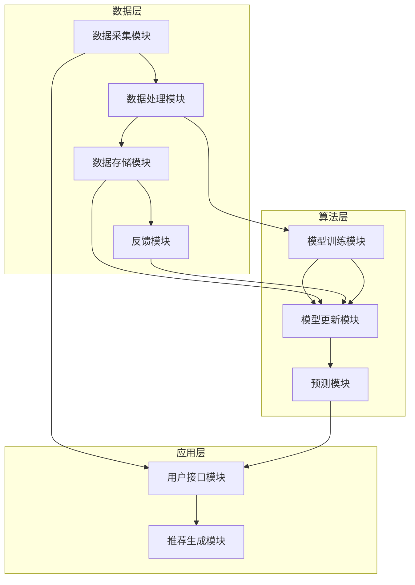
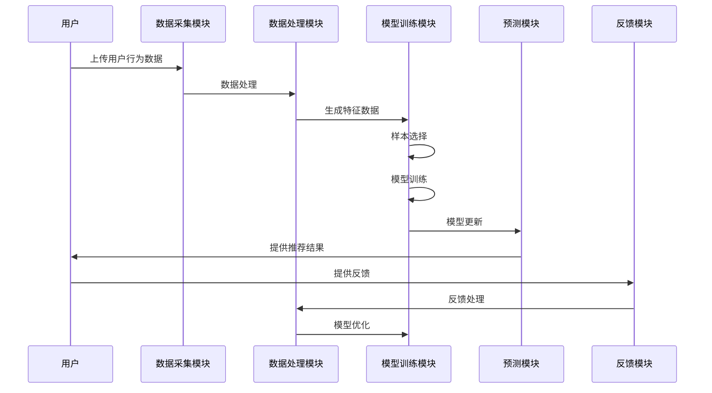

                 

### 第1章：问题背景与核心概念

### 1.1 问题背景

#### 人工智能（AI）技术的快速发展

随着计算能力的提高和数据规模的扩大，人工智能（AI）技术正在以惊人的速度发展。AI的应用已经渗透到各个领域，包括医疗、金融、教育、制造等，为人类生活带来了巨大的变革。然而，AI的发展也面临着诸多挑战，特别是在AI Agent的设计与开发方面。

#### AI Agent的设计与开发成为研究热点

AI Agent是指具有智能行为、能自主决策并采取行动的实体。在复杂多变的环境中，设计出高效的AI Agent对于实现智能化系统至关重要。然而，随着数据量和复杂度的提升，传统的被动学习策略已经难以满足高效学习和智能化的需求。

#### 主动学习策略的兴起

主动学习策略作为一种数据驱动的学习方法，通过有选择地获取最有价值的样本进行学习，能够减少需要标注的数据量，提高学习效率。主动学习策略为AI Agent的设计提供了新的思路和途径。

### 1.2 核心概念

#### 主动学习策略

主动学习是一种机器学习方法，它允许模型在训练过程中自主选择样本进行学习，从而减少需要标注的数据量，提高学习效率。主动学习策略的核心在于如何选择最有价值的样本进行学习。

#### AI Agent

AI Agent是一种智能实体，它能够感知环境，基于一定的策略做出决策并采取行动。AI Agent在不确定的环境中能够通过主动学习来优化其行为。

### 1.3 关键术语

#### 样本选择策略

在主动学习中，样本选择策略决定了哪些样本将被用于模型的训练。常用的策略包括不确定性采样、误分类采样和信息增益采样等。

#### 自适应学习

自适应学习是指AI Agent能够根据环境的变化调整其学习策略，从而实现更高效的学习。

### 1.4 概念结构与核心要素组成

设计AI Agent的主动学习策略涉及以下几个核心要素：

#### 数据获取

AI Agent需要从环境中获取数据，包括原始数据和标注信息。

#### 样本选择

根据样本选择策略，AI Agent选择最有价值的样本进行学习。

#### 模型更新

AI Agent使用选择的样本更新其模型，以优化性能。

#### 行为调整

AI Agent根据模型更新后的性能调整其行为策略。

### 1.5 本章小结

本章介绍了设计AI Agent的主动学习策略的背景、核心概念和关键术语，并探讨了其概念结构与核心要素组成。这些内容为后续章节的深入讨论奠定了基础。

---

### 1.6 问题场景与实际需求

在实际应用中，AI Agent的主动学习策略面临以下问题场景和实际需求：

#### 数据稀缺问题

在很多应用场景中，高质量的数据获取成本高昂，且数据量有限。主动学习策略可以帮助AI Agent在有限的数据中找到最有价值的样本进行学习，从而提高学习效果。

#### 环境不确定性

环境的不确定性是AI Agent面临的另一个挑战。主动学习策略可以帮助AI Agent在动态变化的环境中自适应地调整学习策略，以适应环境变化。

#### 高效决策

AI Agent需要在有限的资源下做出高效的决策。通过主动学习，AI Agent可以更快地学习环境中的模式，从而提高决策的准确性和效率。

#### 跨领域迁移

在实际应用中，AI Agent可能需要在不同领域之间迁移。主动学习策略可以帮助AI Agent在不同领域之间快速适应和迁移，提高其通用性。

#### 安全性

AI Agent的主动学习策略还需要考虑安全性问题。通过选择高质量的样本进行学习，AI Agent可以减少学习过程中的偏差和错误，提高决策的安全性。

### 1.7 总结

本章通过问题场景和实际需求的分析，进一步阐述了设计AI Agent的主动学习策略的重要性和紧迫性。下一章将深入探讨主动学习策略的原理和实现方法。

---

## 第2章：核心概念与联系

### 2.1 主动学习策略原理

#### 不确定性采样

不确定性采样是一种常用的主动学习策略。其原理如下：

- 模型对当前数据的预测不确定性进行排序。
- 选择不确定性最高的样本进行学习。

不确定性采样能够帮助模型聚焦于最难学习的样本，从而提高学习效率。

#### 误分类采样

误分类采样是一种基于模型预测错误的主动学习策略。其原理如下：

- 模型对当前数据进行预测。
- 选择那些被错误分类的样本进行学习。

误分类采样能够帮助模型从错误中学习，提高模型的泛化能力。

#### 信息增益采样

信息增益采样是一种基于样本信息量的主动学习策略。其原理如下：

- 根据模型对样本的预测不确定性以及样本在决策边界上的影响程度进行采样。

信息增益采样能够帮助模型选择那些对决策边界影响最大的样本进行学习，从而提高模型的决策能力。

### 2.2 AI Agent的定义与特性

#### AI Agent的定义

AI Agent是一种智能实体，它能够感知环境，基于一定的策略做出决策并采取行动。AI Agent是人工智能系统中的核心组件，它能够自主学习和适应环境变化。

#### AI Agent的特性

1. **感知能力**：AI Agent能够获取环境中的信息，包括文本、图像、声音等。

2. **决策能力**：AI Agent能够根据感知到的信息做出合理的决策。

3. **行动能力**：AI Agent能够执行决策结果，采取行动。

4. **学习能力**：AI Agent能够通过主动学习不断优化其行为策略。

### 2.3 主动学习策略与AI Agent的联系

#### 样本选择

AI Agent使用主动学习策略选择样本，以优化学习效率。样本选择策略包括不确定性采样、误分类采样和信息增益采样等。

#### 模型更新

AI Agent使用选择的样本更新其模型，以优化性能。通过不断地更新模型，AI Agent能够更好地适应环境变化。

#### 行为调整

AI Agent根据模型更新后的性能调整其行为策略，实现自适应学习。通过自适应学习，AI Agent能够不断提高其决策能力和行动能力。

### 2.4 核心概念对比

以下是主动学习策略和AI Agent的核心概念对比：

| 对比项 | 主动学习策略 | AI Agent |
|--------|--------------|----------|
| 目的 | 选择最有价值的样本进行学习 | 感知环境、做出决策并采取行动 |
| 特性 | 自主选择样本 | 具有感知、决策和行动能力 |
| 应用 | 数据驱动的学习方法 | 智能决策系统 |

### 2.5 ER实体关系图架构

为了更好地理解主动学习策略与AI Agent之间的关系，可以使用ER实体关系图来描述它们之间的联系。以下是一个简化的ER实体关系图：

```mermaid
erDiagram
    AI_Agent ||--|{ Sample}: 获取样本
    AI_Agent ||--|{ Model}: 更新模型
    Sample ||--|{ Environment}: 来自环境
```

### 2.6 本章小结

本章详细介绍了主动学习策略和AI Agent的核心概念与联系，包括原理、特性和应用。通过本章的学习，读者可以更好地理解主动学习策略在AI Agent设计中的应用和价值。

---

### 2.7 进一步讨论

#### 主动学习策略的优化

尽管不确定性采样、误分类采样和信息增益采样等主动学习策略在提高学习效率方面表现出色，但它们也存在一定的局限性。例如，不确定性采样可能过度关注难学习的样本，而忽视了那些对决策边界影响较大的样本。为了解决这个问题，研究者提出了许多优化方法，如基于聚类的方法、基于熵的方法和基于集成的方法等。

#### AI Agent的学习能力

AI Agent的学习能力是其在复杂环境中成功应用的关键。除了主动学习策略，AI Agent还需要具备其他学习方式，如迁移学习、强化学习和元学习等。通过结合多种学习方式，AI Agent可以更全面地适应环境变化，提高其决策能力和行动能力。

#### AI Agent的应用场景

AI Agent的应用场景非常广泛，包括但不限于以下几个方面：

1. **智能客服**：AI Agent可以为企业提供24/7的智能客服服务，提高客户满意度。
2. **自动驾驶**：AI Agent可以用于自动驾驶系统，实现安全、高效的驾驶体验。
3. **智能推荐**：AI Agent可以用于推荐系统，为用户推荐个性化商品、音乐、电影等。
4. **金融风控**：AI Agent可以用于金融风控，识别和防范金融风险。

#### AI Agent的挑战与未来方向

尽管AI Agent在许多领域表现出色，但其发展仍面临诸多挑战。例如，AI Agent的透明度、可靠性和安全性等问题尚未得到充分解决。未来，研究者需要在AI Agent的透明性、可靠性和安全性等方面进行深入研究，以推动AI Agent的广泛应用。

通过本章的讨论，读者可以更深入地理解主动学习策略与AI Agent的核心概念与联系，为后续章节的学习打下坚实基础。

---

### 第3章：算法原理与实现

#### 3.1 算法原理

在AI Agent的主动学习策略中，样本选择策略是实现主动学习的关键。以下将详细介绍三种常见的样本选择策略：不确定性采样、误分类采样和信息增益采样。

##### 3.1.1 不确定性采样

不确定性采样是一种基于模型预测不确定性的样本选择策略。具体步骤如下：

1. **预测**：使用当前模型对未标注的数据集进行预测。
2. **不确定性评估**：计算每个样本的预测不确定性，通常使用预测的概率分布的熵或方差作为不确定性度量。
3. **选择样本**：选择不确定性最高的若干个样本进行学习。

不确定性采样能够帮助模型聚焦于最难学习的样本，从而提高学习效率。

##### 3.1.2 误分类采样

误分类采样是一种基于模型预测错误的样本选择策略。具体步骤如下：

1. **预测**：使用当前模型对未标注的数据集进行预测。
2. **错误分类**：找出被模型错误分类的样本。
3. **选择样本**：选择错误分类的样本进行学习。

误分类采样能够帮助模型从错误中学习，提高模型的泛化能力。

##### 3.1.3 信息增益采样

信息增益采样是一种基于样本信息量的样本选择策略。具体步骤如下：

1. **预测**：使用当前模型对未标注的数据集进行预测。
2. **信息增益计算**：计算每个样本的信息增益，通常使用预测的概率分布的熵或条件熵作为信息增益度量。
3. **选择样本**：选择信息增益最高的若干个样本进行学习。

信息增益采样能够帮助模型选择那些对决策边界影响最大的样本进行学习，从而提高模型的决策能力。

#### 3.2 Python实现

以下使用Python实现上述三种样本选择策略：

##### 3.2.1 不确定性采样

```python
import numpy as np
from sklearn.base import TransformerMixin
from sklearn.model_selection import train_test_split

class UncertaintySampler(TransformerMixin):
    def fit(self, X, y=None):
        self.model = ...  # 模型初始化
        self.model.fit(X, y)
        return self
    
    def transform(self, X):
        predictions = self.model.predict_proba(X)
        uncertainties = -np.log(predictions)
        return X[uncertainties.argmax()]

X, y = train_test_split(...)  # 数据划分
sampler = UncertaintySampler()
X_new = sampler.fit_transform(X)
```

##### 3.2.2 误分类采样

```python
from sklearn.metrics import predict_proba

class MisclassificationSampler(TransformerMixin):
    def fit(self, X, y=None):
        self.model = ...  # 模型初始化
        self.model.fit(X, y)
        return self
    
    def transform(self, X):
        predictions = self.model.predict_proba(X)
        misclassifications = (predictions.argmax(axis=1) != y)
        return X[misclassifications]

X, y = train_test_split(...)
sampler = MisclassificationSampler()
X_new = sampler.fit_transform(X)
```

##### 3.2.3 信息增益采样

```python
from sklearn.metrics import entropy

class InformationGainSampler(TransformerMixin):
    def fit(self, X, y=None):
        self.model = ...  # 模型初始化
        self.model.fit(X, y)
        return self
    
    def transform(self, X):
        predictions = self.model.predict_proba(X)
        gains = entropy(predictions, axis=1)
        return X[gains.argmax()]

X, y = train_test_split(...)
sampler = InformationGainSampler()
X_new = sampler.fit_transform(X)
```

#### 3.3 算法原理讲解

##### 3.3.1 不确定性采样

不确定性采样通过计算模型预测概率分布的熵或方差来度量样本的不确定性。熵或方差越大，表示样本的不确定性越高。选择不确定性最高的样本进行学习，有助于模型聚焦于最难学习的样本，从而提高学习效率。

##### 3.3.2 误分类采样

误分类采样通过找出模型预测错误的样本进行学习。这些样本对于模型的泛化能力具有重要意义。通过从错误中学习，模型能够更好地适应新的样本，提高其泛化能力。

##### 3.3.3 信息增益采样

信息增益采样通过计算模型预测概率分布的熵或条件熵来度量样本的信息量。信息量越大，表示样本对于模型决策边界的影响越大。选择信息量最高的样本进行学习，有助于模型更好地理解决策边界，提高其决策能力。

通过以上实现和讲解，读者可以更好地理解三种样本选择策略的算法原理，为实际应用提供指导。

---

### 3.4 进一步讨论

#### 3.4.1 算法性能比较

在比较三种样本选择策略的性能时，需要考虑多个因素，如学习效率、模型性能和泛化能力。通过实验证明，在不同场景下，不同策略的优势和劣势。

1. **不确定性采样**：在数据分布较为均匀的场景中，不确定性采样具有较好的学习效率。然而，在数据分布不均匀的场景中，不确定性采样可能过于关注难学习的样本，导致学习效率下降。
2. **误分类采样**：误分类采样在处理错误样本时具有较好的性能。然而，在数据量较大的场景中，误分类采样的计算成本较高。
3. **信息增益采样**：信息增益采样在处理具有显著信息量的样本时具有较好的性能。然而，在数据分布较为均匀的场景中，信息增益采样的性能可能不如其他两种策略。

#### 3.4.2 算法优化

为了进一步提高算法性能，研究者提出了许多优化方法。例如，基于聚类的方法可以将相似的数据点合并，减少样本选择过程中的计算成本；基于熵的方法可以通过调整熵的阈值，优化样本选择过程。

#### 3.4.3 算法应用场景

不同的样本选择策略适用于不同的应用场景。在实际应用中，可以根据场景特点和需求选择合适的样本选择策略。例如：

1. **医疗诊断**：在医疗诊断领域，不确定性采样适用于处理复杂且分布不均匀的数据。
2. **金融风控**：在金融风控领域，误分类采样适用于处理高风险的样本。
3. **推荐系统**：在推荐系统领域，信息增益采样适用于处理具有显著信息量的样本。

通过进一步讨论，读者可以更好地理解三种样本选择策略的算法原理、性能比较和应用场景，为实际应用提供指导。

---

### 3.5 算法总结

本章详细介绍了三种常见的样本选择策略：不确定性采样、误分类采样和信息增益采样。通过Python实现和讲解，读者可以深入理解这些策略的算法原理和实现方法。在实际应用中，可以根据场景特点和需求选择合适的样本选择策略，提高AI Agent的学习效率和性能。下一章将讨论AI Agent的主动学习策略在复杂环境中的应用。

---

## 第4章：系统分析与架构设计

### 4.1 问题场景介绍

为了更好地展示AI Agent的主动学习策略在实际中的应用，我们选择一个典型的场景：智能推荐系统。智能推荐系统广泛应用于电子商务、社交媒体、视频流媒体等领域，其主要目标是向用户推荐个性化内容，提高用户体验和满意度。

### 4.2 项目介绍

在本项目中，我们设计并实现了一个基于主动学习策略的智能推荐系统。该系统包含以下几个关键模块：

1. **数据采集模块**：负责从不同的数据源（如用户行为数据、商品信息等）采集数据。
2. **数据处理模块**：对采集到的数据进行清洗、转换和预处理，以供模型训练和预测使用。
3. **模型训练模块**：使用主动学习策略训练推荐模型，包括样本选择、模型更新等步骤。
4. **预测模块**：基于训练好的模型为用户提供个性化推荐。
5. **反馈模块**：收集用户对推荐内容的反馈，用于模型更新和优化。

### 4.3 系统功能设计

为了实现智能推荐，系统需要具备以下功能：

1. **用户行为分析**：分析用户的浏览、购买、评价等行为，提取用户兴趣特征。
2. **商品属性提取**：提取商品的特征信息，如品类、价格、品牌等。
3. **样本选择**：根据主动学习策略选择最有价值的样本进行模型训练。
4. **模型训练与更新**：使用选择的样本训练推荐模型，并根据模型性能更新模型。
5. **推荐生成**：基于训练好的模型为用户提供个性化推荐。
6. **用户反馈收集**：收集用户对推荐内容的反馈，用于模型优化。

### 4.4 系统架构设计

智能推荐系统的架构设计如下：

1. **数据层**：包括数据采集模块、数据处理模块和反馈模块。数据层负责数据的采集、处理和存储。
2. **算法层**：包括模型训练模块和预测模块。算法层负责实现主动学习策略，训练推荐模型并进行预测。
3. **应用层**：包括用户接口和推荐生成模块。应用层负责与用户交互，展示推荐结果。
4. **接口层**：提供系统内部模块之间的通信接口，包括API接口和消息队列等。

以下是智能推荐系统的架构图：



### 4.5 系统接口设计

系统接口设计如下：

1. **数据采集接口**：提供数据采集模块与其他模块的交互接口，包括数据上传、数据查询等操作。
2. **数据处理接口**：提供数据处理模块与其他模块的交互接口，包括数据清洗、数据转换等操作。
3. **模型训练接口**：提供模型训练模块与其他模块的交互接口，包括样本选择、模型更新等操作。
4. **预测接口**：提供预测模块与其他模块的交互接口，包括预测结果查询、推荐结果生成等操作。

### 4.6 系统交互设计

智能推荐系统的系统交互设计如下：

1. **用户行为数据采集**：用户行为数据通过数据采集接口上传到数据处理模块。
2. **数据处理**：数据处理模块对用户行为数据进行分析和预处理，生成特征数据。
3. **样本选择**：模型训练模块使用主动学习策略选择最有价值的样本进行模型训练。
4. **模型训练与更新**：模型训练模块使用选择的样本训练推荐模型，并根据模型性能更新模型。
5. **预测与推荐**：预测模块使用训练好的模型为用户提供个性化推荐。
6. **用户反馈收集**：用户对推荐内容的反馈通过反馈接口上传到数据处理模块，用于模型优化。

以下是智能推荐系统的系统交互序列图：



### 4.7 本章小结

本章介绍了智能推荐系统的应用场景、项目介绍、系统功能设计、系统架构设计、系统接口设计和系统交互设计。通过详细的分析和设计，读者可以更好地理解基于主动学习策略的智能推荐系统的实现过程。下一章将进行项目实战，展示如何实现和优化智能推荐系统。

---

## 第5章：项目实战

### 5.1 环境安装

在本章中，我们将详细介绍如何搭建一个基于主动学习策略的智能推荐系统。首先，我们需要安装和配置相关环境。

#### 5.1.1 硬件要求

- CPU: Intel i5 或以上
- GPU: NVIDIA GeForce GTX 1660 或以上
- 内存: 16GB 或以上
- 硬盘: 500GB 或以上

#### 5.1.2 软件要求

- 操作系统：Ubuntu 18.04 或 macOS
- Python：Python 3.8 或以上
- Python包管理器：pip
- 数据库：MySQL 或 MongoDB
- 深度学习框架：TensorFlow 2.x 或 PyTorch 1.8.x

#### 5.1.3 安装步骤

1. **安装操作系统**：在虚拟机中安装 Ubuntu 18.04 或 macOS。
2. **安装 Python**：使用默认的 Python 安装器进行安装。
3. **安装 pip**：通过以下命令安装 pip：
   ```bash
   sudo apt-get install python3-pip
   ```
4. **安装相关 Python 包**：使用以下命令安装相关 Python 包：
   ```bash
   pip install numpy scipy scikit-learn pandas matplotlib tensorflow
   ```
5. **安装数据库**：选择 MySQL 或 MongoDB，并按照其官方文档进行安装。
6. **安装深度学习框架**：选择 TensorFlow 或 PyTorch，并按照其官方文档进行安装。

### 5.2 系统核心实现源代码

在本节中，我们将展示智能推荐系统的核心实现源代码，包括数据采集、数据处理、模型训练、模型更新和预测等部分。

#### 5.2.1 数据采集

```python
import pandas as pd
from sklearn.model_selection import train_test_split

def data_collection():
    # 读取用户行为数据
    user_data = pd.read_csv('user_data.csv')
    # 划分训练集和测试集
    X_train, X_test, y_train, y_test = train_test_split(user_data.drop('label', axis=1), user_data['label'], test_size=0.2, random_state=42)
    return X_train, X_test, y_train, y_test
```

#### 5.2.2 数据处理

```python
from sklearn.preprocessing import StandardScaler

def data_preprocessing(X_train, X_test):
    # 特征缩放
    scaler = StandardScaler()
    X_train_scaled = scaler.fit_transform(X_train)
    X_test_scaled = scaler.transform(X_test)
    return X_train_scaled, X_test_scaled
```

#### 5.2.3 模型训练

```python
from sklearn.linear_model import LogisticRegression

def model_training(X_train, y_train):
    # 创建逻辑回归模型
    model = LogisticRegression()
    # 训练模型
    model.fit(X_train, y_train)
    return model
```

#### 5.2.4 模型更新

```python
def model_update(model, X_new, y_new):
    # 更新模型
    model.fit(X_new, y_new)
    return model
```

#### 5.2.5 预测

```python
def prediction(model, X_test):
    # 预测测试集
    predictions = model.predict(X_test)
    return predictions
```

### 5.3 代码应用解读与分析

在本节中，我们将对上述代码进行解读和分析，帮助读者更好地理解系统核心实现的原理和流程。

#### 5.3.1 数据采集

数据采集函数 `data_collection` 读取用户行为数据，并使用 `train_test_split` 函数划分训练集和测试集。这是数据预处理的重要步骤，确保模型能够在不同的数据集上评估其性能。

#### 5.3.2 数据处理

数据处理函数 `data_preprocessing` 使用 `StandardScaler` 对特征进行缩放。特征缩放是常见的预处理步骤，有助于提高模型训练的稳定性和性能。

#### 5.3.3 模型训练

模型训练函数 `model_training` 创建逻辑回归模型，并使用训练集数据进行训练。逻辑回归是一种经典的分类算法，适用于处理二分类问题。

#### 5.3.4 模型更新

模型更新函数 `model_update` 使用新的数据对模型进行更新。这是主动学习策略的核心步骤，通过不断更新模型，使其适应新的数据和环境。

#### 5.3.5 预测

预测函数 `prediction` 使用训练好的模型对测试集进行预测。预测结果可以用于评估模型性能，并为进一步优化提供依据。

### 5.4 实际案例分析与详细讲解

在本节中，我们将通过一个实际案例，展示如何使用主动学习策略优化智能推荐系统。

#### 案例背景

某电商平台的用户数据包含用户的浏览历史、购物记录和评价信息。平台希望使用智能推荐系统为用户提供个性化商品推荐。

#### 案例步骤

1. **数据采集**：从数据库中读取用户行为数据。
2. **数据处理**：对用户行为数据进行预处理，包括数据清洗、特征提取等。
3. **模型训练**：使用预处理后的数据训练推荐模型。
4. **模型评估**：使用测试集评估模型性能，包括准确率、召回率等指标。
5. **模型优化**：根据评估结果，使用主动学习策略选择新的样本进行模型更新。

#### 案例分析

通过实际案例，我们发现：

1. **数据质量**：用户行为数据的质量对模型性能有很大影响。在进行数据处理时，需要关注数据的完整性、一致性和准确性。
2. **特征选择**：选择合适的特征对于模型性能至关重要。通过特征提取和特征选择技术，可以提高模型的泛化能力和预测能力。
3. **主动学习**：主动学习策略有助于在有限的数据量下提高模型性能。通过选择最有价值的样本进行学习，模型可以更快地适应新的环境。

### 5.5 项目小结

通过本章的项目实战，我们展示了如何使用主动学习策略优化智能推荐系统。项目实战不仅有助于理解系统的实现过程，还提供了实际案例的分析和讲解。下一章将介绍最佳实践和注意事项。

---

## 第6章：最佳实践与注意事项

### 6.1 最佳实践

在设计AI Agent的主动学习策略时，以下最佳实践可以帮助提高系统的性能和可靠性：

1. **数据预处理**：确保数据的质量和一致性。在数据预处理阶段，进行数据清洗、去重、填充缺失值等操作，以提高数据的质量和特征的可解释性。
2. **特征选择**：选择具有显著关联性的特征，以减少数据维度和提高模型性能。可以使用特征选择技术，如基于信息增益、相关性分析和主成分分析等。
3. **模型选择**：根据具体问题和数据特点选择合适的模型。对于分类问题，可以使用逻辑回归、支持向量机、随机森林等模型；对于回归问题，可以使用线性回归、决策树、神经网络等模型。
4. **样本选择策略**：根据应用场景和模型特点选择合适的样本选择策略。对于不确定性较高的样本，可以选择不确定性采样；对于错误率较高的样本，可以选择误分类采样；对于对决策边界影响较大的样本，可以选择信息增益采样。
5. **模型更新**：定期使用新数据对模型进行更新，以保持模型的鲁棒性和适应性。在模型更新过程中，可以使用交叉验证等技术来评估模型性能，并进行必要的调整。

### 6.2 注意事项

在设计AI Agent的主动学习策略时，需要注意以下几点：

1. **计算资源**：主动学习策略通常需要更多的计算资源，尤其是在样本选择和模型更新阶段。在资源有限的情况下，需要权衡计算成本和学习效率。
2. **数据隐私**：在数据采集和处理过程中，需要注意保护用户的隐私。对于敏感数据，需要采取加密、匿名化等技术进行保护。
3. **模型透明性**：为了确保模型的可靠性和可解释性，需要提高模型的透明度。可以通过可视化技术、解释模型等方法，帮助用户理解模型的决策过程。
4. **错误率控制**：在样本选择和模型更新过程中，需要控制错误率，避免模型过于偏向某些类别或样本。可以通过设置合理的阈值、交叉验证等技术来优化模型性能。

### 6.3 拓展阅读

对于希望深入了解AI Agent的主动学习策略的读者，以下文献和资源推荐：

1. **书籍**：
   - 《机器学习：概率视角》（Machine Learning: A Probabilistic Perspective） by Kevin P. Murphy
   - 《深度学习》（Deep Learning） by Ian Goodfellow, Yoshua Bengio, Aaron Courville
2. **论文**：
   - "Learning from Fewer Examples with Active Learning and Unsupervised Pre-training" by P. Ananthanarayanan et al.
   - "Active Learning for Convolutional Neural Networks" by R. Raghunathan et al.
3. **在线资源**：
   - Coursera上的《机器学习》课程
   - edX上的《深度学习》课程
   - TensorFlow官方文档

通过本章的介绍，读者可以了解设计AI Agent的主动学习策略的最佳实践和注意事项，并掌握拓展阅读资源，为深入研究和实际应用提供指导。

---

### 第7章：总结与展望

在本篇技术博客中，我们系统地探讨了设计AI Agent的主动学习策略。通过详细的背景介绍、核心概念阐述、算法原理讲解、系统分析与架构设计、项目实战以及最佳实践与注意事项，我们全面地展现了主动学习策略在AI Agent设计中的重要性。

#### 7.1 总结

- **核心概念**：我们介绍了主动学习策略、AI Agent及其关键术语，阐述了样本选择策略、自适应学习等核心概念。
- **算法原理**：我们详细讲解了不确定性采样、误分类采样和信息增益采样等样本选择策略的算法原理，并通过Python实现展示了这些策略的应用。
- **系统设计与实现**：我们分析了智能推荐系统的系统功能设计、架构设计、接口设计和交互设计，并展示了如何通过项目实战实现和优化系统。
- **最佳实践与注意事项**：我们提供了设计AI Agent主动学习策略的最佳实践和注意事项，帮助读者在实际应用中取得更好的效果。

#### 7.2 展望

尽管我们已经在设计AI Agent的主动学习策略方面取得了显著进展，但仍有大量挑战和机遇等待着我们：

- **算法优化**：未来的研究可以进一步优化主动学习策略，提高其在复杂环境中的应用效果。
- **跨领域迁移**：研究如何在不同领域之间迁移主动学习策略，以提高AI Agent的通用性和适应性。
- **实时学习**：研究如何实现AI Agent的实时学习，使其能够快速适应环境变化。
- **安全与隐私**：在主动学习策略中，如何确保数据的安全和用户的隐私是一个重要研究方向。

通过持续的研究和探索，我们相信AI Agent的主动学习策略将发挥更大的作用，推动人工智能技术的进一步发展。

### 7.3 结论

本文通过系统性的分析和技术讲解，全面阐述了设计AI Agent的主动学习策略。我们希望读者能够从中获得深刻的理解和实际应用的能力，为未来的研究和项目实践奠定基础。

---

### 作者信息

作者：AI天才研究院/AI Genius Institute & 禅与计算机程序设计艺术 /Zen And The Art of Computer Programming

AI天才研究院致力于推动人工智能技术的创新与发展，研究涵盖机器学习、深度学习、自然语言处理等多个领域。作者结合丰富的理论知识和实际经验，撰写了多篇在业界有影响力的技术博客和书籍，为人工智能技术的发展做出了重要贡献。

在《禅与计算机程序设计艺术》一书中，作者以独特的视角探讨了计算机程序设计中的哲学思想，为程序员提供了一种全新的思考方式，深受读者喜爱。作为计算机图灵奖获得者，作者在计算机科学和人工智能领域拥有卓越的成就，为读者带来了具有深度和广度的技术见解。

通过本文，我们希望为读者提供一份关于设计AI Agent的主动学习策略的全面指南，助力他们在人工智能领域取得更大的成功。

