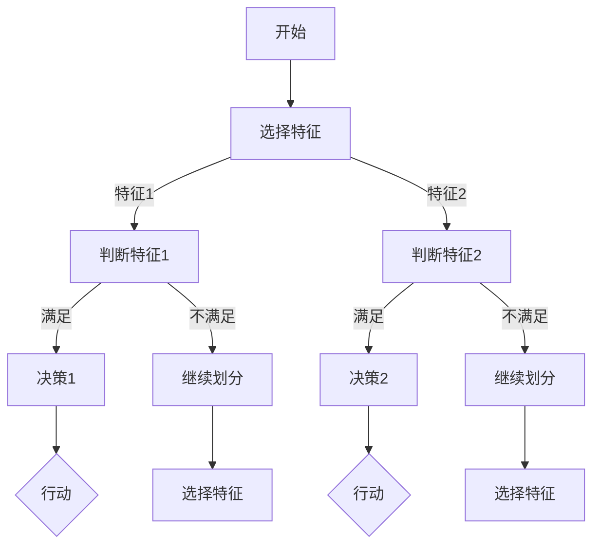
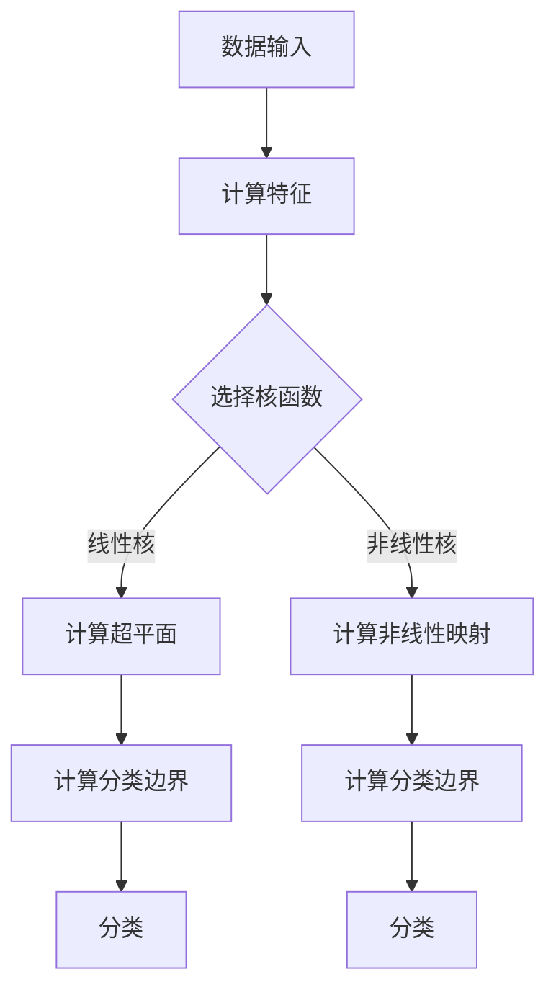
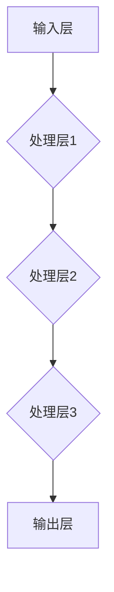
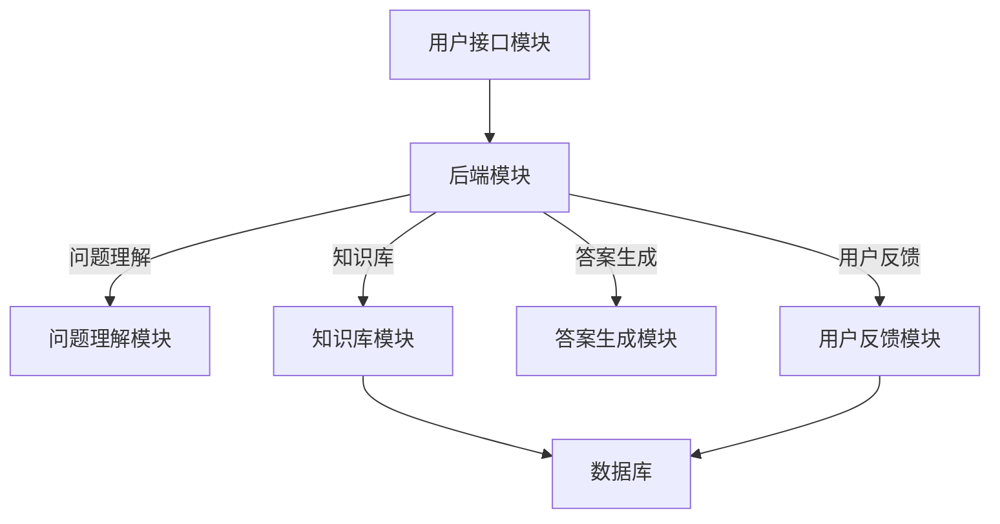
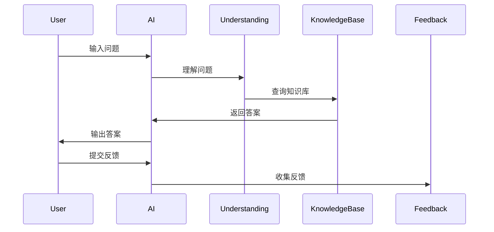

                 

## 设计AI Agent的决策与推理机制背景介绍

### 引言

人工智能（AI）技术的发展，尤其是机器学习和深度学习的兴起，使得我们能够设计出越来越多的智能系统。在这些系统中，AI Agent扮演着至关重要的角色。一个AI Agent是一个能够自主决策并执行任务的智能体，它在某种程度上能够模拟人类的思维过程。设计一个有效的AI Agent，不仅需要解决从数据中提取信息的问题，还需要解决如何根据这些信息做出合理决策以及如何进行逻辑推理的问题。

设计AI Agent的核心挑战在于模拟人类思维的复杂性和多样性。人类的决策和推理过程受到多种因素的影响，包括直觉、经验、情感以及社会和文化背景。这些因素使得人类的决策和推理过程难以用简单的算法模型来完全模拟。因此，设计AI Agent的决策与推理机制需要结合多种理论和方法，如心理学、认知科学、计算机科学以及数学和统计学。

本文将围绕设计AI Agent的决策与推理机制展开讨论。首先，我们将介绍设计AI Agent的背景和问题描述，然后探讨解决方案，包括需要考虑的边界条件和核心要素组成。通过这一系列的讨论，我们希望能够为读者提供一个清晰、系统的理解，以便在实际应用中设计和实现更高效的AI Agent。

### 问题背景

人工智能（AI）的快速发展已经在多个领域带来了革命性的变化，从自动驾驶汽车到智能助手，AI技术正逐渐融入我们的日常生活。在这一过程中，AI Agent的设计与实现成为一个关键课题。AI Agent，作为一种能够自主执行任务的智能体，其核心功能在于能够基于输入数据和环境信息进行有效的决策和推理。

在自动化决策方面，AI Agent的应用场景非常广泛。例如，在金融行业中，AI Agent可以用于风险管理，通过对市场数据的实时分析和预测，提供投资建议；在医疗领域，AI Agent可以帮助医生进行疾病诊断，通过分析患者的病史、检查报告等信息，提供诊断建议。这些应用都需要AI Agent具备高效的决策能力。

智能推理是AI Agent的另一项重要功能。推理能力使得AI Agent能够在复杂的环境中理解、解释和预测事件的发展。例如，在机器人导航中，AI Agent需要通过感知周围环境的信息，进行路径规划和避障决策。在自然语言处理（NLP）领域，AI Agent需要理解并生成语言，这同样需要强大的推理能力。

设计一个有效的AI Agent需要解决的核心问题包括：

1. **数据信息的提取和处理**：AI Agent需要从大量数据中提取有用的信息，并将其转化为可操作的知识。这包括数据预处理、特征提取、数据归一化等步骤。

2. **决策机制的构建**：决策是AI Agent的核心功能之一。如何从多个选项中选择最优解，如何设定目标和评估不同选项的优劣，都是需要解决的关键问题。

3. **推理机制的实现**：推理能力使得AI Agent能够从已知信息中推导出新的结论。实现这一能力涉及到多种推理方法，如演绎推理、归纳推理和贝叶斯推理等。

### 问题描述

设计一个AI Agent涉及到一系列复杂的问题，这些问题可以分为以下几个方面：

1. **数据信息的提取和处理**：AI Agent需要处理的数据来源广泛，包括文本、图像、音频等多种形式。如何高效地从这些数据中提取有用信息，是设计AI Agent首先要解决的问题。具体来说，这包括以下几个步骤：

   - **数据预处理**：包括数据清洗、去噪、缺失值填充等操作，以保证数据质量。
   - **特征提取**：通过将原始数据转换为特征向量，使得AI Agent能够处理。
   - **数据归一化**：将数据缩放到一个统一的范围内，以便模型训练和评估。

2. **决策机制的构建**：决策是AI Agent的核心功能，决定了其能否有效地执行任务。一个有效的决策机制需要考虑以下几个问题：

   - **目标设定**：明确AI Agent需要达成的目标。目标可以是最大化收益、最小化损失或满足特定约束条件。
   - **选项评估**：评估不同选项的优劣，通常需要结合具体的问题背景和约束条件。
   - **选择最优方案**：根据评估结果选择最优方案。

3. **推理机制的实现**：推理能力是AI Agent智能水平的体现。实现推理机制需要考虑以下几个方面：

   - **演绎推理**：从一般到特殊的推理过程，适用于已知规则和条件推导出新的结论。
   - **归纳推理**：从特殊到一般的推理过程，适用于从个别事例推导出一般规律。
   - **贝叶斯推理**：基于概率的推理过程，适用于在不确定环境中进行决策。

### 问题解决

为了设计一个有效的AI Agent，我们需要结合多种理论和方法，模拟人类决策和推理过程。以下是可能的解决方案：

1. **决策机制**：
   - **决策树**：通过构建树形结构，将问题分解为多个子问题，并选择最优解。
   - **支持向量机（SVM）**：通过找到一个超平面将不同类别的数据分开，进行分类决策。
   - **神经网络**：通过多层神经元结构，模拟人脑的决策过程。

2. **推理机制**：
   - **演绎推理**：基于已知规则和条件，通过逻辑推导得出结论。
   - **归纳推理**：通过分析多个实例，提取共同特征，归纳出一般规律。
   - **贝叶斯推理**：通过计算先验概率和条件概率，更新后验概率，进行决策。

3. **数据处理**：
   - **数据预处理**：包括数据清洗、去噪、缺失值填充等操作，保证数据质量。
   - **特征提取**：通过特征工程，将原始数据转换为适合模型训练的特征向量。
   - **数据归一化**：将数据缩放到一个统一的范围内，便于模型训练和评估。

### 边界与外延

在设计AI Agent的决策与推理机制时，我们需要考虑一系列的边界条件和外延：

1. **边界条件**：
   - **算法的复杂性**：算法的复杂性直接影响AI Agent的性能。需要选择合适的算法，以平衡计算效率和性能。
   - **计算资源限制**：AI Agent需要在有限的计算资源下运行，因此需要优化算法，减少计算复杂度。
   - **实时性要求**：在一些应用场景中，如自动驾驶和实时监控，AI Agent需要快速响应，因此实时性是一个重要的考量因素。

2. **外延**：
   - **机器学习**：AI Agent的决策和推理机制可以借助机器学习技术，通过训练模型来提高决策和推理能力。
   - **自然语言处理（NLP）**：在处理文本数据时，AI Agent需要具备NLP能力，以理解文本语义和语境。
   - **计算机视觉**：在处理图像和视频数据时，AI Agent需要具备计算机视觉能力，以识别和理解视觉信息。

### 概念结构与核心要素组成

设计AI Agent的决策与推理机制涉及多个核心概念和要素，以下是这些概念和要素的组成结构：

1. **决策机制**：
   - **决策树**：通过树形结构进行决策，适用于分类和回归问题。
   - **支持向量机（SVM）**：通过超平面分割数据，进行分类和回归。
   - **神经网络**：通过多层神经元结构，实现复杂的非线性映射。

2. **推理机制**：
   - **演绎推理**：从一般到特殊的推理，适用于逻辑推理和定理证明。
   - **归纳推理**：从特殊到一般的推理，适用于模式识别和归纳推理。
   - **贝叶斯推理**：基于概率的推理，适用于不确定环境中的决策。

3. **数据处理**：
   - **数据预处理**：包括数据清洗、去噪、缺失值填充等，保证数据质量。
   - **特征提取**：通过特征工程，将原始数据转换为适合模型训练的特征向量。
   - **数据归一化**：将数据缩放到一个统一的范围内，便于模型训练和评估。

通过这些核心概念和要素的组合，可以设计出不同类型的AI Agent，以适应各种应用场景。

## 核心概念与联系

### 决策与推理机制核心概念

在AI Agent的设计中，决策和推理是两个核心概念，它们共同构成了AI Agent的智能基础。

#### 2.1.1 决策

决策是指从多个可行的选项中选择一个最优选项的过程。在AI Agent中，决策涉及到以下几个方面：

1. **目标设定**：明确AI Agent需要达成的目标。目标可以是最大化收益、最小化损失或满足特定约束条件。
2. **选项评估**：评估不同选项的优劣，这通常需要结合具体的问题背景和约束条件。
3. **选择最优方案**：根据评估结果选择最优方案。

决策过程通常依赖于多种模型和方法，如决策树、支持向量机（SVM）和神经网络等。

#### 2.1.2 推理

推理是从已知事实出发，通过逻辑推理得出新结论的过程。在AI Agent中，推理机制包括以下几个方面：

1. **演绎推理**：从一般到特殊的推理过程，适用于逻辑推理和定理证明。
2. **归纳推理**：从特殊到一般的推理过程，适用于模式识别和归纳推理。
3. **贝叶斯推理**：基于概率的推理过程，适用于不确定环境中的决策。

推理能力使得AI Agent能够从已知信息中推导出新的结论，从而提高其智能水平。

### 概念属性特征对比表格

为了更好地理解决策和推理机制的核心概念，我们可以通过一个表格来对比它们的属性特征：

| 概念       | 定义                                                                 | 属性特征                                           |
|------------|--------------------------------------------------------------------|---------------------------------------------------|
| 决策       | 从多个可行的选项中选择一个最优选项的过程                           | 目标设定、评估选项、选择最优方案                 |
| 推理       | 从已知事实出发，通过逻辑推理得出新结论的过程                       | 演绎推理、归纳推理、贝叶斯推理                   |
| 决策树     | 基于特征的分类算法，通过构建树形结构来决策                           | 分支节点、叶节点、分类规则                         |
| 支持向量机 | 通过找到一个超平面将不同类别的数据分开的算法                         | 超平面、支持向量、核函数                           |
| 神经网络   | 模拟生物神经网络，通过多层神经元结构进行信息处理和决策的算法         | 输入层、隐藏层、输出层、激活函数                   |
| 演绎推理   | 从一般到特殊的推理过程                                                 | 大前提、小前提、结论                               |
| 归纳推理   | 从特殊到一般的推理过程                                                 | 个别事例、一般结论                               |
| 贝叶斯推理 | 基于概率的推理过程，通过已有数据更新概率分布                         | 先验概率、条件概率、后验概率                     |

### ER实体关系图架构的 Mermaid 流程图

为了更直观地展示AI Agent的决策与推理机制，我们可以使用Mermaid来绘制一个ER实体关系图。以下是该图的Markdown格式：

```mermaid
erDiagram
    AI_Agent ||--|{ Data_Preprocessing } Data_Preprocessing
    AI_Agent ||--|{ Feature_Extracting } Feature_Extracting
    AI_Agent ||--|{ Decision_Making } Decision_Making
    AI_Agent ||--|{ Reasoning } Reasoning
    Decision_Making ||--|{ Decision_Tree } Decision_Tree
    Decision_Making ||--|{ Support_Vector_Machine } Support_Vector_Machine
    Decision_Making ||--|{ Neural_Network } Neural_Network
    Reasoning ||--|{ Deductive_Reasoning } Deductive_Reasoning
    Reasoning ||--|{ Inductive_Reasoning } Inductive_Reasoning
    Reasoning ||--|{ Bayesian_Reasoning } Bayesian_Reasoning
```

这个ER图展示了AI Agent的核心组成部分以及它们之间的关系。数据预处理、特征提取、决策机制和推理机制共同构成了AI Agent的基本架构，每个部分都有其特定的功能和子类别。

### 算法原理讲解

在设计AI Agent的决策与推理机制时，选择合适的算法至关重要。以下将详细讲解三种常用算法：决策树、支持向量机和神经网络，并使用Mermaid绘制相应的流程图。

#### 决策树算法

决策树是一种基于特征进行决策的树形结构算法。它通过将问题分解为多个子问题，并在每个节点选择一个特征进行划分，最终到达叶节点得到决策结果。

**流程图**：



**算法原理**：

1. **选择特征**：在当前节点，选择具有最大信息增益的特征进行划分。
2. **划分节点**：根据选择的特征，将数据集划分为多个子集。
3. **递归划分**：对每个子集继续进行划分，直到达到叶节点，得到最终的决策结果。

#### 支持向量机算法

支持向量机（SVM）是一种用于分类和回归的机器学习算法。它通过找到一个超平面将不同类别的数据分开，并最大化分类边界。

**流程图**：



**算法原理**：

1. **计算特征**：将输入数据转换为特征向量。
2. **选择核函数**：根据数据特性选择线性或非线性核函数。
3. **计算超平面或映射**：线性核计算超平面，非线性核计算非线性映射。
4. **分类边界**：计算分类边界，最大化分类边界。
5. **分类**：根据分类边界进行数据分类。

#### 神经网络算法

神经网络是一种模拟人脑神经元连接结构的计算模型。它通过多层神经元结构进行信息处理和决策。

**流程图**：



**算法原理**：

1. **输入层**：接收输入数据。
2. **隐藏层**：通过激活函数进行信息处理，传递到下一层。
3. **输出层**：产生最终决策结果。
4. **反向传播**：通过误差信号调整权重，优化模型。

通过以上算法原理的讲解，我们可以看出，决策树、支持向量机和神经网络在算法结构和原理上都有各自的特点。决策树适合处理分类和回归问题，支持向量机适用于分类和回归，而神经网络则适用于复杂的非线性映射问题。

### 系统分析与架构设计方案

在设计AI Agent的决策与推理机制时，系统分析与架构设计是关键步骤。以下将详细介绍问题场景、系统功能设计、系统架构设计、系统接口设计和系统交互。

#### 问题场景

假设我们设计一个智能客服AI Agent，该Agent需要处理用户咨询的问题，提供实时解答。问题场景包括以下几个方面：

1. **用户咨询**：用户通过文字或语音向AI Agent提出问题。
2. **问题理解**：AI Agent需要理解用户的问题，并提取关键信息。
3. **知识库查询**：AI Agent通过查询内部知识库，获取相关的答案。
4. **答案生成**：AI Agent生成回答，并通过文本或语音输出给用户。
5. **用户反馈**：用户对AI Agent的回答进行评价，以优化系统。

#### 系统功能设计

系统功能设计主要包括以下模块：

1. **用户接口模块**：处理用户输入，提供输入界面。
2. **问题理解模块**：使用自然语言处理技术，理解用户的问题。
3. **知识库模块**：存储丰富的知识库，用于回答用户的问题。
4. **答案生成模块**：生成回答，并输出给用户。
5. **用户反馈模块**：收集用户反馈，用于系统优化。

#### 系统架构设计

系统架构设计采用模块化设计，包括以下组件：

1. **前端**：用户接口模块，负责与用户交互。
2. **后端**：包括问题理解模块、知识库模块、答案生成模块和用户反馈模块，负责处理业务逻辑。
3. **数据库**：存储知识库和用户反馈数据。

**Mermaid架构图**：



#### 系统接口设计

系统接口设计包括以下接口：

1. **用户输入接口**：接收用户输入的问题。
2. **问题理解接口**：将用户输入的问题转换为内部表示。
3. **知识库查询接口**：查询知识库，获取相关答案。
4. **答案生成接口**：生成回答，并转换为用户可理解的格式。
5. **用户反馈接口**：接收用户反馈，用于系统优化。

#### 系统交互

系统交互设计采用事件驱动模式，包括以下流程：

1. **用户输入**：用户通过输入接口提交问题。
2. **问题理解**：问题理解模块处理用户输入，提取关键信息。
3. **知识库查询**：查询知识库，获取相关答案。
4. **答案生成**：答案生成模块生成回答。
5. **用户反馈**：用户通过输入接口提交反馈，用于系统优化。

**Mermaid序列图**：



通过以上系统分析与架构设计方案，我们可以清晰地看到AI Agent的运作流程和系统结构，为后续的项目实战和详细讲解奠定了基础。

### 项目实战

为了更好地理解和实践设计AI Agent的决策与推理机制，我们将通过一个实际项目来展示整个系统的实现过程。本项目的目标是构建一个简单的智能客服AI Agent，该Agent能够通过自然语言处理（NLP）技术理解用户咨询，并从知识库中提取相关答案。

#### 环境安装

在进行项目开发之前，我们需要安装一些必要的软件和库。以下是在Linux环境中安装所需的步骤：

1. **Python环境**：确保Python版本在3.6及以上。
2. **pip**：安装pip包管理器，可以通过以下命令安装：
   ```bash
   sudo apt-get install python3-pip
   ```
3. **NLP库**：安装NLP相关的库，如NLTK和spaCy。可以通过以下命令安装：
   ```bash
   pip3 install nltk spacy
   ```
4. **spaCy语言模型**：下载并安装中文语言模型，可以通过以下命令安装：
   ```bash
   python3 -m spacy download zh_core_web_sm
   ```

#### 系统核心实现源代码

以下是一个简单的AI Agent系统的核心实现代码，包括用户接口、问题理解、知识库查询和答案生成模块：

```python
import nltk
from nltk.corpus import wordnet as wn
import spacy

# 加载中文语言模型
nlp = spacy.load("zh_core_web_sm")

# 用户接口模块
class UserInterface:
    def get_input(self):
        return input("请输入您的问题：")

# 问题理解模块
class QuestionUnderstanding:
    def understand(self, question):
        doc = nlp(question)
        # 提取关键词
        keywords = [token.lemma_ for token in doc if not token.is_punct]
        # 使用WordNet进行语义分析
        synsets = [wn.synsets(keyword) for keyword in keywords]
        return synsets

# 知识库模块
class KnowledgeBase:
    def search(self, synsets):
        # 假设知识库为字典形式，实际中应为数据库或外部文件
        knowledge = {
            "如何购买机票": "请访问我们的官方网站，选择您的出发地和目的地，并提交订单。",
            "如何退换货": "如果您不满意商品，请访问我们的客户服务页面，按照指示操作。",
        }
        for synset in synsets:
            for lemma in synset.lemma_names():
                if lemma in knowledge:
                    return knowledge[lemma]
        return "很抱歉，我没有找到相关的答案。"

# 答案生成模块
class AnswerGeneration:
    def generate_answer(self, answer):
        return f"您的问题是：{answer}"

# AI Agent主类
class AI-Agent:
    def __init__(self):
        self.user_interface = UserInterface()
        self.question_understanding = QuestionUnderstanding()
        self.knowledge_base = KnowledgeBase()
        self.answer_generation = AnswerGeneration()

    def run(self):
        question = self.user_interface.get_input()
        synsets = self.question_understanding.understand(question)
        answer = self.knowledge_base.search(synsets)
        print(self.answer_generation.generate_answer(answer))

# 运行AI Agent
if __name__ == "__main__":
    agent = AI-Agent()
    agent.run()
```

#### 代码应用解读与分析

上述代码实现了一个简单的AI Agent系统，以下是各个模块的详细解读：

1. **用户接口模块（UserInterface）**：`get_input` 方法用于接收用户输入的问题。
2. **问题理解模块（QuestionUnderstanding）**：`understand` 方法使用spaCy进行自然语言处理，提取关键词。
3. **知识库模块（KnowledgeBase）**：`search` 方法在假设的知识库中查找与关键词匹配的答案。
4. **答案生成模块（AnswerGeneration）**：`generate_answer` 方法生成用户可理解的回答。

通过这些模块的协作，AI Agent能够接收用户输入，理解问题，查询知识库，并生成回答。实际应用中，知识库应为数据库，并使用更复杂的语义分析技术。

#### 实际案例分析和详细讲解剖析

以下是一个实际案例，展示AI Agent如何处理用户咨询：

**用户咨询**：如何购买机票？

**AI Agent处理流程**：

1. **用户接口**：用户输入问题：如何购买机票？
2. **问题理解**：AI Agent提取关键词：购买、机票。
3. **知识库查询**：AI Agent在知识库中找到匹配的答案。
4. **答案生成**：AI Agent生成回答：请访问我们的官方网站，选择您的出发地和目的地，并提交订单。

**详细讲解**：

1. **用户接口**：用户通过文本输入问题，这是与用户交互的第一步。
2. **问题理解**：AI Agent使用NLP技术，对输入的问题进行分词和词性标注，提取出关键信息。在这个过程中，spaCy的词性标注功能帮助我们识别出“购买”和“机票”这两个关键词。
3. **知识库查询**：AI Agent在内部的知识库中查找与关键词匹配的答案。假设知识库是一个简单的字典，其中存储了常见问题和对应的答案，AI Agent能够快速查询并找到匹配的答案。
4. **答案生成**：AI Agent将查询到的答案格式化为用户可理解的文本，并通过输出接口返回给用户。

#### 项目小结

通过这个实际项目，我们展示了如何设计和实现一个简单的智能客服AI Agent。尽管这个系统功能相对简单，但通过逐步实现用户接口、问题理解、知识库查询和答案生成模块，我们理解了AI Agent的基本架构和实现过程。在实际应用中，系统功能可以进一步扩展，包括更复杂的NLP技术、更大规模的知识库和更高效的决策与推理算法。

### 最佳实践 tips

在设计和实现AI Agent的决策与推理机制时，以下最佳实践可以帮助提高系统的效率和可靠性：

1. **优化算法选择**：根据应用场景选择合适的算法，如线性模型适合简单问题，而深度学习模型适合复杂问题。
2. **优化数据处理**：数据预处理和特征提取是关键步骤，需要确保数据质量，并选择有效的特征提取方法。
3. **模型调优**：使用交叉验证和网格搜索等技术进行模型调优，以提高模型性能。
4. **知识库管理**：定期更新和扩展知识库，确保其与实际应用需求保持一致。
5. **用户反馈循环**：建立用户反馈机制，收集用户反馈用于系统优化，以提高用户体验。

### 小结

本文系统地介绍了设计AI Agent的决策与推理机制，包括背景介绍、核心概念与联系、算法原理讲解、系统分析与架构设计方案、项目实战和最佳实践。通过这些讨论，我们理解了AI Agent的设计原则和实现方法，为实际应用提供了理论基础和实践指导。

### 注意事项

在设计和实现AI Agent时，需要注意以下事项：

1. **数据隐私**：确保用户数据的安全和隐私，遵循相关法律法规。
2. **模型解释性**：对于复杂的模型，确保其解释性，以便用户理解和信任。
3. **实时性能**：确保AI Agent在实时应用场景中具有足够的性能。

### 拓展阅读

对于希望进一步深入了解AI Agent设计和实现的读者，以下书籍和资源提供了丰富的知识和案例：

- 《深度学习》（Ian Goodfellow、Yoshua Bengio、Aaron Courville著）
- 《机器学习实战》（Peter Harrington著）
- 《Python机器学习》（Andrés M. Loukides、J. D. Polumbo著）
- Coursera上的“机器学习”（吴恩达教授主讲）
- Udacity的“深度学习纳米学位”课程

这些资源将帮助您更深入地理解AI Agent的设计原理和实践方法。

