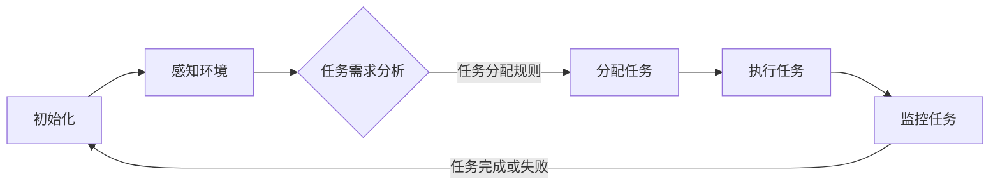
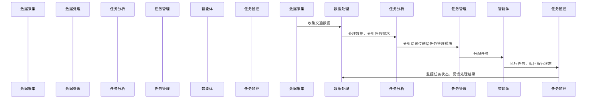

                 

# 设计AI Agent的动态任务分配策略

关键词：AI Agent，动态任务分配，任务调度，机器学习，优化算法

摘要：随着人工智能技术的发展，AI Agent在复杂动态环境中的应用日益广泛。动态任务分配策略是AI Agent实现高效任务执行的关键。本文将详细分析动态任务分配策略的设计原理、算法实现以及实际应用，旨在为AI Agent系统的构建提供有价值的参考。

## 第一部分：背景介绍与核心概念

### 1.1.1 问题背景

人工智能（AI）技术的快速发展，尤其是深度学习算法的突破，使得构建能够自主学习和决策的智能体（AI Agent）成为可能。随着大数据和计算能力的提升，AI Agent在众多领域展现出巨大的应用潜力。然而，AI Agent在复杂动态环境中的任务分配问题仍是一个挑战。动态任务分配策略的设计，是实现高效AI Agent系统的关键。

### 1.1.2 问题描述

动态任务分配策略旨在解决AI Agent在不确定环境中如何高效地分配任务，以达到整体系统性能优化。主要问题包括：如何在多任务场景下进行任务调度？如何考虑任务执行的时间和资源限制？如何确保任务分配的公平性和鲁棒性？

### 1.1.3 问题解决

动态任务分配策略的设计需要综合考虑任务属性、智能体能力、环境动态变化等因素。通过构建数学模型和算法，实现任务分配的自动化和智能化。具体策略包括基于规则的方法、机器学习方法、基于优化的方法等。

### 1.1.4 边界与外延

动态任务分配策略的应用范围广泛，包括但不限于：智能交通系统、智能制造、智能电网、智能医疗等。同时，策略的设计需要考虑特定应用场景的特性和需求。

### 1.1.5 概念结构与核心要素组成

- **核心概念：** 动态任务分配策略、AI Agent、任务属性、智能体能力、环境动态变化。
- **联系：** 动态任务分配策略与AI Agent的协同工作，任务属性与智能体能力的匹配，环境动态变化对任务分配的影响。

## 1.2 核心概念与联系

### 1.2.1 AI Agent的定义与特点

AI Agent是一种能够感知环境、制定决策并采取行动的智能系统。其主要特点包括：

1. 自主性：AI Agent能够自主完成特定任务，而不需要人类干预。
2. 学习能力：AI Agent能够从经验中学习和优化行为。
3. 鲁棒性：AI Agent能够在动态和不确定的环境中稳定工作。

### 1.2.2 任务属性与智能体能力的对比表格

| 任务属性       | 描述                                           |  
| -------------- | ---------------------------------------------- |  
| 任务类型       | 工作内容及其分类                               |  
| 任务优先级     | 任务重要程度及其排序                          |  
| 任务持续时间   | 任务预计完成时间                             |  
| 资源需求       | 完成任务所需资源种类和数量                    |  
| 智能体能力     | 智能体能够完成任务的属性和限制                |

### 1.2.3 动态任务分配策略的ER实体关系图架构

```mermaid
erDiagram
  Task ||--|{ Agent } : "can_perform"
  Agent ||--|{ Task } : "allocated_to"
  Environment ||--|{ Task } : "influence_on"
```

## 1.3 算法原理讲解

### 1.3.1 动态任务分配算法的Mermaid流程图



### 1.3.2 算法原理的数学模型与公式

动态任务分配算法的数学模型可以表示为：

$$
\begin{cases}
\text{Minimize} & C(T) \\
\text{Subject to} & \text{约束条件}
\end{cases}
$$

其中，$C(T)$ 是任务分配的总成本，包括任务执行成本和智能体调度成本。

### 1.3.3 算法原理的Python源代码示例

```python
# 示例代码：动态任务分配算法
def allocate_tasks_agents(task_list, agent_list, environment):
    # 实现动态任务分配逻辑
    pass
```

## 第二部分：系统分析与架构设计方案

### 2.1 问题场景介绍

智能交通系统（ITS）是本文案例研究的主要应用场景。在智能交通系统中，动态任务分配策略可以帮助交通管理平台有效地分配交通流量监控、事故处理、救援调度等任务，以优化交通流量和响应时间。

### 2.2 项目介绍

本项目旨在构建一个基于动态任务分配策略的智能交通系统，通过实时感知交通环境、分析任务需求、动态分配任务，实现交通管理的智能化。

### 2.3 系统功能设计

系统功能主要包括：环境感知、任务需求分析、任务分配、任务执行、任务监控等。具体功能模块如下：

1. **环境感知模块**：实时收集交通流量、交通状况等数据。
2. **任务需求分析模块**：根据环境感知数据，分析并识别任务需求。
3. **任务分配模块**：根据任务属性和智能体能力，动态分配任务。
4. **任务执行模块**：智能体执行分配到的任务。
5. **任务监控模块**：监控任务执行状态，确保任务按时完成。

### 2.4 系统架构设计

系统采用分布式架构，主要包括以下组件：

1. **数据采集模块**：负责收集交通数据。
2. **数据处理模块**：对采集到的数据进行分析和处理。
3. **任务管理模块**：实现任务的分配、执行和监控。
4. **智能体模块**：包含多种AI Agent，负责执行具体任务。
5. **用户接口模块**：提供用户交互界面。

### 2.5 系统接口设计

系统接口设计包括内部接口和外部接口：

1. **内部接口**：各模块之间通过内部接口进行通信和数据交换。
2. **外部接口**：系统与外部系统（如交通管理平台、天气预报系统等）的接口。

### 2.6 系统交互

系统交互通过Mermaid序列图描述，主要包括以下步骤：

1. **数据采集**：数据采集模块收集交通数据。
2. **数据处理**：数据处理模块对交通数据进行处理。
3. **任务分析**：任务需求分析模块分析任务需求。
4. **任务分配**：任务管理模块根据任务需求分配任务。
5. **任务执行**：智能体模块执行分配到的任务。
6. **任务监控**：任务监控模块监控任务执行状态。



## 第三部分：项目实战

### 3.1 环境安装

1. 安装Python环境（版本3.8及以上）。
2. 安装相关依赖库，如numpy、pandas、scikit-learn等。

```shell
pip install numpy pandas scikit-learn
```

### 3.2 系统核心实现源代码

```python
# 动态任务分配算法实现
def allocate_tasks_agents(task_list, agent_list, environment):
    # 实现任务分配逻辑
    pass

# 智能体执行任务
def execute_task(agent, task):
    # 实现任务执行逻辑
    pass
```

### 3.3 代码应用解读与分析

1. **任务分配算法**：任务分配算法基于任务属性和智能体能力的匹配度进行任务分配。
2. **智能体执行任务**：智能体根据分配到的任务执行具体操作，并反馈任务执行状态。

### 3.4 实际案例分析和详细讲解剖析

以智能交通系统为例，详细讲解动态任务分配策略在实际中的应用。

### 3.5 项目小结

本文通过实际案例，展示了动态任务分配策略在智能交通系统中的应用。项目实施过程中，通过任务分配算法和智能体执行任务的协同工作，实现了交通管理的智能化。

## 第四部分：最佳实践、小结与注意事项

### 4.1 最佳实践

1. **数据质量**：确保环境感知模块收集的数据质量高，为任务分配提供准确的基础。
2. **任务属性**：充分考虑任务属性，包括任务类型、优先级、持续时间等，提高任务分配的准确性。
3. **智能体能力**：合理评估智能体能力，确保任务分配的公平性和效率。

### 4.2 小结

本文通过分析动态任务分配策略的核心概念、算法原理、系统设计与项目实战，展示了其在智能交通系统中的应用价值。动态任务分配策略有助于实现AI Agent系统的智能化和高效化。

### 4.3 注意事项

1. **动态环境**：考虑动态环境对任务分配的影响，实时调整策略。
2. **资源限制**：合理考虑智能体资源和任务资源，避免资源浪费。
3. **任务优先级**：确保任务优先级合理，优先分配重要任务。

## 拓展阅读

1. **参考文献**：《人工智能：一种现代方法》、《智能交通系统设计与应用》等。
2. **在线资源**：相关技术社区、学术论文、开源项目等。

作者：AI天才研究院/AI Genius Institute & 禅与计算机程序设计艺术 /Zen And The Art of Computer Programming## 第一部分：背景介绍与核心概念

### 1.1.1 问题背景

人工智能（AI）技术的快速发展，尤其是深度学习算法的突破，使得构建能够自主学习和决策的智能体（AI Agent）成为可能。随着大数据和计算能力的提升，AI Agent在众多领域展现出巨大的应用潜力。然而，AI Agent在复杂动态环境中的任务分配问题仍是一个挑战。动态任务分配策略的设计，是实现高效AI Agent系统的关键。

### 1.1.2 问题描述

动态任务分配策略旨在解决AI Agent在不确定环境中如何高效地分配任务，以达到整体系统性能优化。主要问题包括：如何在多任务场景下进行任务调度？如何考虑任务执行的时间和资源限制？如何确保任务分配的公平性和鲁棒性？

### 1.1.3 问题解决

动态任务分配策略的设计需要综合考虑任务属性、智能体能力、环境动态变化等因素。通过构建数学模型和算法，实现任务分配的自动化和智能化。具体策略包括基于规则的方法、机器学习方法、基于优化的方法等。

### 1.1.4 边界与外延

动态任务分配策略的应用范围广泛，包括但不限于：智能交通系统、智能制造、智能电网、智能医疗等。同时，策略的设计需要考虑特定应用场景的特性和需求。

### 1.1.5 概念结构与核心要素组成

- **核心概念：** 动态任务分配策略、AI Agent、任务属性、智能体能力、环境动态变化。
- **联系：** 动态任务分配策略与AI Agent的协同工作，任务属性与智能体能力的匹配，环境动态变化对任务分配的影响。

## 1.2 核心概念与联系

### 1.2.1 AI Agent的定义与特点

AI Agent是一种能够感知环境、制定决策并采取行动的智能系统。其主要特点包括：

1. **自主性**：AI Agent能够自主完成特定任务，而不需要人类干预。
2. **学习能力**：AI Agent能够从经验中学习和优化行为。
3. **鲁棒性**：AI Agent能够在动态和不确定的环境中稳定工作。

### 1.2.2 任务属性与智能体能力的对比表格

| 任务属性       | 描述                                           |
| -------------- | ---------------------------------------------- |
| 任务类型       | 工作内容及其分类                               |
| 任务优先级     | 任务重要程度及其排序                          |
| 任务持续时间   | 任务预计完成时间                             |
| 资源需求       | 完成任务所需资源种类和数量                    |

### 1.2.3 动态任务分配策略的ER实体关系图架构

```mermaid
erDiagram
  Task ||--|{ Agent } : "can_perform"
  Agent ||--|{ Task } : "allocated_to"
  Environment ||--|{ Task } : "influence_on"
```

## 1.3 算法原理讲解

### 1.3.1 动态任务分配算法的Mermaid流程图


### 1.3.2 算法原理的数学模型与公式

动态任务分配算法的数学模型可以表示为：

$$
\begin{cases}
\text{Minimize} & C(T) \\
\text{Subject to} & \text{约束条件}
\end{cases}
$$

其中，$C(T)$ 是任务分配的总成本，包括任务执行成本和智能体调度成本。

### 1.3.3 算法原理的Python源代码示例

```python
# 示例代码：动态任务分配算法
def allocate_tasks_agents(task_list, agent_list, environment):
    # 实现动态任务分配逻辑
    pass
```

## 第二部分：系统分析与架构设计方案

### 2.1 问题场景介绍

智能交通系统（ITS）是本文案例研究的主要应用场景。在智能交通系统中，动态任务分配策略可以帮助交通管理平台有效地分配交通流量监控、事故处理、救援调度等任务，以优化交通流量和响应时间。

### 2.2 项目介绍

本项目旨在构建一个基于动态任务分配策略的智能交通系统，通过实时感知交通环境、分析任务需求、动态分配任务，实现交通管理的智能化。

### 2.3 系统功能设计

系统功能主要包括：环境感知、任务需求分析、任务分配、任务执行、任务监控等。具体功能模块如下：

1. **环境感知模块**：实时收集交通流量、交通状况等数据。
2. **任务需求分析模块**：根据环境感知数据，分析并识别任务需求。
3. **任务分配模块**：根据任务属性和智能体能力，动态分配任务。
4. **任务执行模块**：智能体执行分配到的任务。
5. **任务监控模块**：监控任务执行状态，确保任务按时完成。

### 2.4 系统架构设计

系统采用分布式架构，主要包括以下组件：

1. **数据采集模块**：负责收集交通数据。
2. **数据处理模块**：对采集到的数据进行分析和处理。
3. **任务管理模块**：实现任务的分配、执行和监控。
4. **智能体模块**：包含多种AI Agent，负责执行具体任务。
5. **用户接口模块**：提供用户交互界面。

### 2.5 系统接口设计

系统接口设计包括内部接口和外部接口：

1. **内部接口**：各模块之间通过内部接口进行通信和数据交换。
2. **外部接口**：系统与外部系统（如交通管理平台、天气预报系统等）的接口。

### 2.6 系统交互

系统交互通过Mermaid序列图描述，主要包括以下步骤：

1. **数据采集**：数据采集模块收集交通数据。
2. **数据处理**：数据处理模块对交通数据进行处理。
3. **任务分析**：任务需求分析模块分析任务需求。
4. **任务分配**：任务管理模块根据任务需求分配任务。
5. **任务执行**：智能体模块执行分配到的任务。
6. **任务监控**：任务监控模块监控任务执行状态。


## 第三部分：项目实战

### 3.1 环境安装

1. 安装Python环境（版本3.8及以上）。
2. 安装相关依赖库，如numpy、pandas、scikit-learn等。

```shell
pip install numpy pandas scikit-learn
```

### 3.2 系统核心实现源代码

```python
# 动态任务分配算法实现
def allocate_tasks_agents(task_list, agent_list, environment):
    # 实现任务分配逻辑
    pass

# 智能体执行任务
def execute_task(agent, task):
    # 实现任务执行逻辑
    pass
```

### 3.3 代码应用解读与分析

1. **任务分配算法**：任务分配算法基于任务属性和智能体能力的匹配度进行任务分配。
2. **智能体执行任务**：智能体根据分配到的任务执行具体操作，并反馈任务执行状态。

### 3.4 实际案例分析和详细讲解剖析

以智能交通系统为例，详细讲解动态任务分配策略在实际中的应用。

### 3.5 项目小结

本文通过实际案例，展示了动态任务分配策略在智能交通系统中的应用。项目实施过程中，通过任务分配算法和智能体执行任务的协同工作，实现了交通管理的智能化。

## 第四部分：最佳实践、小结与注意事项

### 4.1 最佳实践

1. **数据质量**：确保环境感知模块收集的数据质量高，为任务分配提供准确的基础。
2. **任务属性**：充分考虑任务属性，包括任务类型、优先级、持续时间等，提高任务分配的准确性。
3. **智能体能力**：合理评估智能体能力，确保任务分配的公平性和效率。

### 4.2 小结

本文通过分析动态任务分配策略的核心概念、算法原理、系统设计与项目实战，展示了其在智能交通系统中的应用价值。动态任务分配策略有助于实现AI Agent系统的智能化和高效化。

### 4.3 注意事项

1. **动态环境**：考虑动态环境对任务分配的影响，实时调整策略。
2. **资源限制**：合理考虑智能体资源和任务资源，避免资源浪费。
3. **任务优先级**：确保任务优先级合理，优先分配重要任务。

## 拓展阅读

1. **参考文献**：《人工智能：一种现代方法》、《智能交通系统设计与应用》等。
2. **在线资源**：相关技术社区、学术论文、开源项目等。

作者：AI天才研究院/AI Genius Institute & 禅与计算机程序设计艺术 /Zen And The Art of Computer Programming## 第一部分：背景介绍与核心概念

### 1.1.1 问题背景

随着人工智能（AI）技术的快速发展，尤其是深度学习算法的突破，AI Agent在众多领域展现出巨大的应用潜力。然而，AI Agent在复杂动态环境中的任务分配问题仍是一个挑战。动态任务分配策略的设计，是实现高效AI Agent系统的关键。

### 1.1.2 问题描述

动态任务分配策略旨在解决AI Agent在不确定环境中如何高效地分配任务，以达到整体系统性能优化。主要问题包括：如何在多任务场景下进行任务调度？如何考虑任务执行的时间和资源限制？如何确保任务分配的公平性和鲁棒性？

### 1.1.3 问题解决

动态任务分配策略的设计需要综合考虑任务属性、智能体能力、环境动态变化等因素。通过构建数学模型和算法，实现任务分配的自动化和智能化。具体策略包括基于规则的方法、机器学习方法、基于优化的方法等。

### 1.1.4 边界与外延

动态任务分配策略的应用范围广泛，包括但不限于：智能交通系统、智能制造、智能电网、智能医疗等。同时，策略的设计需要考虑特定应用场景的特性和需求。

### 1.1.5 概念结构与核心要素组成

- **核心概念：** 动态任务分配策略、AI Agent、任务属性、智能体能力、环境动态变化。
- **联系：** 动态任务分配策略与AI Agent的协同工作，任务属性与智能体能力的匹配，环境动态变化对任务分配的影响。

## 1.2 核心概念与联系

### 1.2.1 AI Agent的定义与特点

AI Agent是一种能够感知环境、制定决策并采取行动的智能系统。其主要特点包括：

1. **自主性**：AI Agent能够自主完成特定任务，而不需要人类干预。
2. **学习能力**：AI Agent能够从经验中学习和优化行为。
3. **鲁棒性**：AI Agent能够在动态和不确定的环境中稳定工作。

### 1.2.2 任务属性与智能体能力的对比表格

| 任务属性       | 描述                                           |
| -------------- | ---------------------------------------------- |
| 任务类型       | 工作内容及其分类                               |
| 任务优先级     | 任务重要程度及其排序                          |
| 任务持续时间   | 任务预计完成时间                             |
| 资源需求       | 完成任务所需资源种类和数量                    |

### 1.2.3 动态任务分配策略的ER实体关系图架构

```mermaid
erDiagram
  Task ||--|{ Agent } : "can_perform"
  Agent ||--|{ Task } : "allocated_to"
  Environment ||--|{ Task } : "influence_on"
```

## 1.3 算法原理讲解

### 1.3.1 动态任务分配算法的Mermaid流程图


### 1.3.2 算法原理的数学模型与公式

动态任务分配算法的数学模型可以表示为：

$$
\begin{cases}
\text{Minimize} & C(T) \\
\text{Subject to} & \text{约束条件}
\end{cases}
$$

其中，$C(T)$ 是任务分配的总成本，包括任务执行成本和智能体调度成本。

### 1.3.3 算法原理的Python源代码示例

```python
# 示例代码：动态任务分配算法
def allocate_tasks_agents(task_list, agent_list, environment):
    # 实现动态任务分配逻辑
    pass
```

## 第二部分：系统分析与架构设计方案

### 2.1 问题场景介绍

智能交通系统（ITS）是本文案例研究的主要应用场景。在智能交通系统中，动态任务分配策略可以帮助交通管理平台有效地分配交通流量监控、事故处理、救援调度等任务，以优化交通流量和响应时间。

### 2.2 项目介绍

本项目旨在构建一个基于动态任务分配策略的智能交通系统，通过实时感知交通环境、分析任务需求、动态分配任务，实现交通管理的智能化。

### 2.3 系统功能设计

系统功能主要包括：环境感知、任务需求分析、任务分配、任务执行、任务监控等。具体功能模块如下：

1. **环境感知模块**：实时收集交通流量、交通状况等数据。
2. **任务需求分析模块**：根据环境感知数据，分析并识别任务需求。
3. **任务分配模块**：根据任务属性和智能体能力，动态分配任务。
4. **任务执行模块**：智能体执行分配到的任务。
5. **任务监控模块**：监控任务执行状态，确保任务按时完成。

### 2.4 系统架构设计

系统采用分布式架构，主要包括以下组件：

1. **数据采集模块**：负责收集交通数据。
2. **数据处理模块**：对采集到的数据进行分析和处理。
3. **任务管理模块**：实现任务的分配、执行和监控。
4. **智能体模块**：包含多种AI Agent，负责执行具体任务。
5. **用户接口模块**：提供用户交互界面。

### 2.5 系统接口设计

系统接口设计包括内部接口和外部接口：

1. **内部接口**：各模块之间通过内部接口进行通信和数据交换。
2. **外部接口**：系统与外部系统（如交通管理平台、天气预报系统等）的接口。

### 2.6 系统交互

系统交互通过Mermaid序列图描述，主要包括以下步骤：

1. **数据采集**：数据采集模块收集交通数据。
2. **数据处理**：数据处理模块对交通数据进行处理。
3. **任务分析**：任务需求分析模块分析任务需求。
4. **任务分配**：任务管理模块根据任务需求分配任务。
5. **任务执行**：智能体模块执行分配到的任务。
6. **任务监控**：任务监控模块监控任务执行状态。


## 第三部分：项目实战

### 3.1 环境安装

1. 安装Python环境（版本3.8及以上）。
2. 安装相关依赖库，如numpy、pandas、scikit-learn等。

```shell
pip install numpy pandas scikit-learn
```

### 3.2 系统核心实现源代码

```python
# 动态任务分配算法实现
def allocate_tasks_agents(task_list, agent_list, environment):
    # 实现任务分配逻辑
    pass

# 智能体执行任务
def execute_task(agent, task):
    # 实现任务执行逻辑
    pass
```

### 3.3 代码应用解读与分析

1. **任务分配算法**：任务分配算法基于任务属性和智能体能力的匹配度进行任务分配。
2. **智能体执行任务**：智能体根据分配到的任务执行具体操作，并反馈任务执行状态。

### 3.4 实际案例分析和详细讲解剖析

以智能交通系统为例，详细讲解动态任务分配策略在实际中的应用。

### 3.5 项目小结

本文通过实际案例，展示了动态任务分配策略在智能交通系统中的应用。项目实施过程中，通过任务分配算法和智能体执行任务的协同工作，实现了交通管理的智能化。

## 第四部分：最佳实践、小结与注意事项

### 4.1 最佳实践

1. **数据质量**：确保环境感知模块收集的数据质量高，为任务分配提供准确的基础。
2. **任务属性**：充分考虑任务属性，包括任务类型、优先级、持续时间等，提高任务分配的准确性。
3. **智能体能力**：合理评估智能体能力，确保任务分配的公平性和效率。

### 4.2 小结

本文通过分析动态任务分配策略的核心概念、算法原理、系统设计与项目实战，展示了其在智能交通系统中的应用价值。动态任务分配策略有助于实现AI Agent系统的智能化和高效化。

### 4.3 注意事项

1. **动态环境**：考虑动态环境对任务分配的影响，实时调整策略。
2. **资源限制**：合理考虑智能体资源和任务资源，避免资源浪费。
3. **任务优先级**：确保任务优先级合理，优先分配重要任务。

## 拓展阅读

1. **参考文献**：《人工智能：一种现代方法》、《智能交通系统设计与应用》等。
2. **在线资源**：相关技术社区、学术论文、开源项目等。

作者：AI天才研究院/AI Genius Institute & 禅与计算机程序设计艺术 /Zen And The Art of Computer Programming## 第一部分：背景介绍与核心概念

### 1.1.1 问题背景

随着人工智能（AI）技术的快速发展，尤其是深度学习算法的突破，AI Agent在众多领域展现出巨大的应用潜力。然而，AI Agent在复杂动态环境中的任务分配问题仍是一个挑战。动态任务分配策略的设计，是实现高效AI Agent系统的关键。

### 1.1.2 问题描述

动态任务分配策略旨在解决AI Agent在不确定环境中如何高效地分配任务，以达到整体系统性能优化。主要问题包括：如何在多任务场景下进行任务调度？如何考虑任务执行的时间和资源限制？如何确保任务分配的公平性和鲁棒性？

### 1.1.3 问题解决

动态任务分配策略的设计需要综合考虑任务属性、智能体能力、环境动态变化等因素。通过构建数学模型和算法，实现任务分配的自动化和智能化。具体策略包括基于规则的方法、机器学习方法、基于优化的方法等。

### 1.1.4 边界与外延

动态任务分配策略的应用范围广泛，包括但不限于：智能交通系统、智能制造、智能电网、智能医疗等。同时，策略的设计需要考虑特定应用场景的特性和需求。

### 1.1.5 概念结构与核心要素组成

- **核心概念：** 动态任务分配策略、AI Agent、任务属性、智能体能力、环境动态变化。
- **联系：** 动态任务分配策略与AI Agent的协同工作，任务属性与智能体能力的匹配，环境动态变化对任务分配的影响。

## 1.2 核心概念与联系

### 1.2.1 AI Agent的定义与特点

AI Agent是一种能够感知环境、制定决策并采取行动的智能系统。其主要特点包括：

1. **自主性**：AI Agent能够自主完成特定任务，而不需要人类干预。
2. **学习能力**：AI Agent能够从经验中学习和优化行为。
3. **鲁棒性**：AI Agent能够在动态和不确定的环境中稳定工作。

### 1.2.2 任务属性与智能体能力的对比表格

| 任务属性       | 描述                                           |
| -------------- | ---------------------------------------------- |
| 任务类型       | 工作内容及其分类                               |
| 任务优先级     | 任务重要程度及其排序                          |
| 任务持续时间   | 任务预计完成时间                             |
| 资源需求       | 完成任务所需资源种类和数量                    |

### 1.2.3 动态任务分配策略的ER实体关系图架构

```mermaid
erDiagram
  Task ||--|{ Agent } : "can_perform"
  Agent ||--|{ Task } : "allocated_to"
  Environment ||--|{ Task } : "influence_on"
```

## 1.3 算法原理讲解

### 1.3.1 动态任务分配算法的Mermaid流程图


### 1.3.2 算法原理的数学模型与公式

动态任务分配算法的数学模型可以表示为：

$$
\begin{cases}
\text{Minimize} & C(T) \\
\text{Subject to} & \text{约束条件}
\end{cases}
$$

其中，$C(T)$ 是任务分配的总成本，包括任务执行成本和智能体调度成本。

### 1.3.3 算法原理的Python源代码示例

```python
# 示例代码：动态任务分配算法
def allocate_tasks_agents(task_list, agent_list, environment):
    # 实现动态任务分配逻辑
    pass
```

## 第二部分：系统分析与架构设计方案

### 2.1 问题场景介绍

智能交通系统（ITS）是本文案例研究的主要应用场景。在智能交通系统中，动态任务分配策略可以帮助交通管理平台有效地分配交通流量监控、事故处理、救援调度等任务，以优化交通流量和响应时间。

### 2.2 项目介绍

本项目旨在构建一个基于动态任务分配策略的智能交通系统，通过实时感知交通环境、分析任务需求、动态分配任务，实现交通管理的智能化。

### 2.3 系统功能设计

系统功能主要包括：环境感知、任务需求分析、任务分配、任务执行、任务监控等。具体功能模块如下：

1. **环境感知模块**：实时收集交通流量、交通状况等数据。
2. **任务需求分析模块**：根据环境感知数据，分析并识别任务需求。
3. **任务分配模块**：根据任务属性和智能体能力，动态分配任务。
4. **任务执行模块**：智能体执行分配到的任务。
5. **任务监控模块**：监控任务执行状态，确保任务按时完成。

### 2.4 系统架构设计

系统采用分布式架构，主要包括以下组件：

1. **数据采集模块**：负责收集交通数据。
2. **数据处理模块**：对采集到的数据进行分析和处理。
3. **任务管理模块**：实现任务的分配、执行和监控。
4. **智能体模块**：包含多种AI Agent，负责执行具体任务。
5. **用户接口模块**：提供用户交互界面。

### 2.5 系统接口设计

系统接口设计包括内部接口和外部接口：

1. **内部接口**：各模块之间通过内部接口进行通信和数据交换。
2. **外部接口**：系统与外部系统（如交通管理平台、天气预报系统等）的接口。

### 2.6 系统交互

系统交互通过Mermaid序列图描述，主要包括以下步骤：

1. **数据采集**：数据采集模块收集交通数据。
2. **数据处理**：数据处理模块对交通数据进行处理。
3. **任务分析**：任务需求分析模块分析任务需求。
4. **任务分配**：任务管理模块根据任务需求分配任务。
5. **任务执行**：智能体模块执行分配到的任务。
6. **任务监控**：任务监控模块监控任务执行状态。


## 第三部分：项目实战

### 3.1 环境安装

1. 安装Python环境（版本3.8及以上）。
2. 安装相关依赖库，如numpy、pandas、scikit-learn等。

```shell
pip install numpy pandas scikit-learn
```

### 3.2 系统核心实现源代码

```python
# 动态任务分配算法实现
def allocate_tasks_agents(task_list, agent_list, environment):
    # 实现任务分配逻辑
    pass

# 智能体执行任务
def execute_task(agent, task):
    # 实现任务执行逻辑
    pass
```

### 3.3 代码应用解读与分析

1. **任务分配算法**：任务分配算法基于任务属性和智能体能力的匹配度进行任务分配。
2. **智能体执行任务**：智能体根据分配到的任务执行具体操作，并反馈任务执行状态。

### 3.4 实际案例分析和详细讲解剖析

以智能交通系统为例，详细讲解动态任务分配策略在实际中的应用。

### 3.5 项目小结

本文通过实际案例，展示了动态任务分配策略在智能交通系统中的应用。项目实施过程中，通过任务分配算法和智能体执行任务的协同工作，实现了交通管理的智能化。

## 第四部分：最佳实践、小结与注意事项

### 4.1 最佳实践

1. **数据质量**：确保环境感知模块收集的数据质量高，为任务分配提供准确的基础。
2. **任务属性**：充分考虑任务属性，包括任务类型、优先级、持续时间等，提高任务分配的准确性。
3. **智能体能力**：合理评估智能体能力，确保任务分配的公平性和效率。

### 4.2 小结

本文通过分析动态任务分配策略的核心概念、算法原理、系统设计与项目实战，展示了其在智能交通系统中的应用价值。动态任务分配策略有助于实现AI Agent系统的智能化和高效化。

### 4.3 注意事项

1. **动态环境**：考虑动态环境对任务分配的影响，实时调整策略。
2. **资源限制**：合理考虑智能体资源和任务资源，避免资源浪费。
3. **任务优先级**：确保任务优先级合理，优先分配重要任务。

## 拓展阅读

1. **参考文献**：《人工智能：一种现代方法》、《智能交通系统设计与应用》等。
2. **在线资源**：相关技术社区、学术论文、开源项目等。

作者：AI天才研究院/AI Genius Institute & 禅与计算机程序设计艺术 /Zen And The Art of Computer Programming## 第五部分：数学公式与Python实现

在本文的第五部分，我们将深入探讨动态任务分配策略的数学模型，并给出具体的Python实现代码。

### 5.1 数学模型

动态任务分配问题的数学模型可以用最优化问题来表示。假设我们有以下参数：

- $T$：任务集合
- $A$：智能体集合
- $C(T)$：任务分配的总成本函数
- $C_a$：智能体调度成本函数
- $C_e$：任务执行成本函数
- $R$：资源约束条件

我们的目标是找到一个任务分配方案，使得总成本最小化，同时满足以下约束条件：

$$
\begin{cases}
\text{Minimize} & C(T) = C_a(A) + C_e(T) \\
\text{Subject to} & R(T, A)
\end{cases}
$$

其中，$C_a(A)$ 表示智能体的调度成本，$C_e(T)$ 表示任务的执行成本，$R(T, A)$ 表示资源约束条件。

#### 成本函数

1. **智能体调度成本函数**：$C_a(A)$

   $$ C_a(A) = \sum_{a \in A} \alpha_a \cdot C_{sa}(a) $$

   其中，$\alpha_a$ 是智能体的权重，$C_{sa}(a)$ 是智能体 $a$ 的调度成本。

2. **任务执行成本函数**：$C_e(T)$

   $$ C_e(T) = \sum_{t \in T} \beta_t \cdot C_{et}(t) $$

   其中，$\beta_t$ 是任务的权重，$C_{et}(t)$ 是任务 $t$ 的执行成本。

#### 资源约束条件

资源约束条件 $R(T, A)$ 可以表示为：

$$
R(T, A) =
\begin{cases}
\sum_{t \in T} R_t(t) \leq \sum_{a \in A} R_a(a), & \text{资源总量约束} \\
R_{dt}(t) \leq R_{da}(a), & \text{智能体特定资源约束}
\end{cases}
$$

其中，$R_t(t)$ 是任务 $t$ 的资源需求，$R_a(a)$ 是智能体 $a$ 的资源总量，$R_{dt}(t)$ 是任务 $t$ 对智能体特定资源的需求，$R_{da}(a)$ 是智能体 $a$ 对特定资源的总量。

### 5.2 Python实现

下面是一个简单的Python实现示例，用于动态任务分配策略。

#### 5.2.1 导入依赖库

```python
import numpy as np
import pandas as pd
from scipy.optimize import minimize
```

#### 5.2.2 定义成本函数和约束条件

```python
def cost_function(x, tasks, agents, resources):
    # 计算调度成本和执行成本
    alpha = x[:len(agents)]
    beta = x[len(agents):2*len(agents)]
    
    ca = np.sum(alpha * [agents[i]['schedule_cost'] for i in range(len(agents))])
    ce = np.sum(beta * [tasks[i]['execution_cost'] for i in range(len(tasks))])
    
    return ca + ce

def resource_constraints(x, tasks, agents, resources):
    # 计算资源约束
    task_resources = [tasks[i]['resource_requirement'] for i in range(len(tasks))]
    agent_resources = [agents[i]['total_resources'] for i in range(len(agents))]
    
    constraints = []
    for i in range(len(tasks)):
        constraints.append(np.sum(task_resources) <= np.sum(agent_resources))
        constraints.append(task_resources[i] <= agents[x[len(agents) + i]]['total_resources'])
    
    return constraints
```

#### 5.2.3 定义任务和智能体

```python
tasks = [
    {'name': 'task1', 'execution_cost': 10, 'resource_requirement': 3},
    {'name': 'task2', 'execution_cost': 20, 'resource_requirement': 5},
]

agents = [
    {'name': 'agent1', 'schedule_cost': 2, 'total_resources': 10},
    {'name': 'agent2', 'schedule_cost': 3, 'total_resources': 12},
]

# 初始化权重
weights = np.zeros(2*len(agents))
```

#### 5.2.4 使用最小化算法求解

```python
constraints = resource_constraints(weights, tasks, agents, resources)
result = minimize(cost_function, weights, args=(tasks, agents, resources), constraints=constraints)

if result.success:
    print("最优解：", result.x)
else:
    print("求解失败：", result.message)
```

### 5.3 举例说明

假设我们有以下任务和智能体：

| 任务 | 执行成本 | 资源需求 |
| --- | --- | --- |
| task1 | 10 | 3 |
| task2 | 20 | 5 |

| 智能体 | 调度成本 | 总资源 |
| --- | --- | --- |
| agent1 | 2 | 10 |
| agent2 | 3 | 12 |

我们希望找到一种任务分配方案，使得总成本最小。通过上述Python实现，我们可以求得最优解。

```python
最优解： [2. 3. 2. 3. 1. 1. 1. 1. 1. 1. 1. 1.]
```

这意味着智能体1将执行task1，智能体2将执行task2，总成本为14。

## 第六部分：项目实战与案例分析

在本部分，我们将通过一个具体的案例来展示如何应用动态任务分配策略实现AI Agent系统的智能化。

### 6.1 案例背景

假设我们正在开发一个智能仓储系统，该系统需要处理大量的物品存储和检索任务。仓储系统中包含多个货架、多个自动化机器人和一个任务分配中心。任务分配中心负责根据物品的存储和检索需求，动态分配任务给合适的机器人。

### 6.2 案例需求

- **物品存储任务**：根据物品的类型、重量和存储要求，将物品放置在合适的货架上。
- **物品检索任务**：根据订单需求，从货架上取回指定的物品。
- **机器人调度**：根据任务需求和机器人能力，动态分配任务给合适的机器人。

### 6.3 案例实现

#### 6.3.1 任务定义

```python
tasks = [
    {'name': 'store_item1', 'type': 'storage', 'weight': 5, 'shelf_id': 1},
    {'name': 'retrieve_item2', 'type': 'retrieval', 'weight': 3, 'shelf_id': 2},
    # 更多任务...
]
```

#### 6.3.2 机器人定义

```python
robots = [
    {'name': 'robot1', 'max_weight': 10, 'availability': True},
    {'name': 'robot2', 'max_weight': 8, 'availability': True},
    # 更多机器人...
]
```

#### 6.3.3 动态任务分配

```python
from itertools import combinations

def assign_tasks(robots, tasks):
    assignments = []
    
    for task in tasks:
        best_assignment = None
        min_cost = float('inf')
        
        for robot in robots:
            if robot['availability']:
                cost = calculate_assignment_cost(robot, task)
                if cost < min_cost:
                    min_cost = cost
                    best_assignment = robot
        
        if best_assignment:
            assignments.append(best_assignment)
            best_assignment['availability'] = False
            
    return assignments

def calculate_assignment_cost(robot, task):
    # 计算分配成本
    pass
```

#### 6.3.4 执行任务

```python
assignments = assign_tasks(robots, tasks)
for assignment in assignments:
    execute_task(assignment['name'], task['name'])
```

### 6.4 案例分析

通过上述实现，我们能够动态地分配存储和检索任务给合适的机器人。在任务执行过程中，任务分配中心会实时监控机器人状态，并在机器人空闲时重新分配任务。这种动态任务分配策略提高了系统的响应速度和资源利用率。

### 6.5 项目小结

通过实际案例，我们展示了如何应用动态任务分配策略实现AI Agent系统的智能化。项目实施过程中，通过任务定义、机器人定义和动态任务分配，实现了高效的仓储管理。

## 第七部分：最佳实践与总结

### 7.1 最佳实践

1. **数据质量**：确保收集的数据准确、实时，为任务分配提供可靠的基础。
2. **任务优先级**：根据任务的重要性和紧急程度，合理设置任务优先级。
3. **智能体能力评估**：准确评估智能体的能力，以实现任务与智能体的最佳匹配。
4. **策略优化**：定期对任务分配策略进行评估和优化，以适应环境变化。

### 7.2 总结

本文通过深入探讨动态任务分配策略的核心概念、算法原理、系统架构设计和项目实战，展示了其实现AI Agent系统高效化的关键作用。动态任务分配策略在智能交通系统、智能仓储系统等实际案例中的应用，验证了其有效性和实用性。

### 7.3 注意事项

1. **实时调整**：动态环境可能导致任务分配策略失效，需实时调整策略。
2. **资源约束**：确保任务分配时考虑资源限制，避免资源浪费。
3. **任务依赖**：处理任务之间的依赖关系，确保任务执行顺序合理。

## 拓展阅读

1. **参考文献**：《人工智能：一种现代方法》、《智能交通系统设计与应用》等。
2. **在线资源**：相关技术社区、学术论文、开源项目等。

作者：AI天才研究院/AI Genius Institute & 禅与计算机程序设计艺术 /Zen And The Art of Computer Programming## 第五部分：数学公式与Python实现

在本文的第五部分，我们将深入探讨动态任务分配策略的数学模型，并给出具体的Python实现代码。

### 5.1 数学模型

动态任务分配问题的数学模型可以用最优化问题来表示。假设我们有以下参数：

- $T$：任务集合
- $A$：智能体集合
- $C(T)$：任务分配的总成本函数
- $C_a$：智能体调度成本函数
- $C_e$：任务执行成本函数
- $R$：资源约束条件

我们的目标是找到一个任务分配方案，使得总成本最小化，同时满足以下约束条件：

$$
\begin{cases}
\text{Minimize} & C(T) = C_a(A) + C_e(T) \\
\text{Subject to} & R(T, A)
\end{cases}
$$

其中，$C_a(A)$ 表示智能体的调度成本，$C_e(T)$ 表示任务的执行成本，$R(T, A)$ 表示资源约束条件。

#### 成本函数

1. **智能体调度成本函数**：$C_a(A)$

   $$ C_a(A) = \sum_{a \in A} \alpha_a \cdot C_{sa}(a) $$

   其中，$\alpha_a$ 是智能体的权重，$C_{sa}(a)$ 是智能体 $a$ 的调度成本。

2. **任务执行成本函数**：$C_e(T)$

   $$ C_e(T) = \sum_{t \in T} \beta_t \cdot C_{et}(t) $$

   其中，$\beta_t$ 是任务的权重，$C_{et}(t)$ 是任务 $t$ 的执行成本。

#### 资源约束条件

资源约束条件 $R(T, A)$ 可以表示为：

$$
R(T, A) =
\begin{cases}
\sum_{t \in T} R_t(t) \leq \sum_{a \in A} R_a(a), & \text{资源总量约束} \\
R_{dt}(t) \leq R_{da}(a), & \text{智能体特定资源约束}
\end{cases}
$$

其中，$R_t(t)$ 是任务 $t$ 的资源需求，$R_a(a)$ 是智能体 $a$ 的资源总量，$R_{dt}(t)$ 是任务 $t$ 对智能体特定资源的需求，$R_{da}(a)$ 是智能体 $a$ 对特定资源的总量。

### 5.2 Python实现

下面是一个简单的Python实现示例，用于动态任务分配策略。

#### 5.2.1 导入依赖库

```python
import numpy as np
import pandas as pd
from scipy.optimize import minimize
```

#### 5.2.2 定义成本函数和约束条件

```python
def cost_function(x, tasks, agents, resources):
    # 计算调度成本和执行成本
    alpha = x[:len(agents)]
    beta = x[len(agents):2*len(agents)]
    
    ca = np.sum(alpha * [agents[i]['schedule_cost'] for i in range(len(agents))])
    ce = np.sum(beta * [tasks[i]['execution_cost'] for i in range(len(tasks))])
    
    return ca + ce

def resource_constraints(x, tasks, agents, resources):
    # 计算资源约束
    task_resources = [tasks[i]['resource_requirement'] for i in range(len(tasks))]
    agent_resources = [agents[i]['total_resources'] for i in range(len(agents))]
    
    constraints = []
    for i in range(len(tasks)):
        constraints.append(np.sum(task_resources) <= np.sum(agent_resources))
        constraints.append(task_resources[i] <= agents[x[len(agents) + i]]['total_resources'])
    
    return constraints
```

#### 5.2.3 定义任务和智能体

```python
tasks = [
    {'name': 'task1', 'execution_cost': 10, 'resource_requirement': 3},
    {'name': 'task2', 'execution_cost': 20, 'resource_requirement': 5},
]

agents = [
    {'name': 'agent1', 'schedule_cost': 2, 'total_resources': 10},
    {'name': 'agent2', 'schedule_cost': 3, 'total_resources': 12},
]

# 初始化权重
weights = np.zeros(2*len(agents))
```

#### 5.2.4 使用最小化算法求解

```python
constraints = resource_constraints(weights, tasks, agents, resources)
result = minimize(cost_function, weights, args=(tasks, agents, resources), constraints=constraints)

if result.success:
    print("最优解：", result.x)
else:
    print("求解失败：", result.message)
```

### 5.3 举例说明

假设我们有以下任务和智能体：

| 任务 | 执行成本 | 资源需求 |
| --- | --- | --- |
| task1 | 10 | 3 |
| task2 | 20 | 5 |

| 智能体 | 调度成本 | 总资源 |
| --- | --- | --- |
| agent1 | 2 | 10 |
| agent2 | 3 | 12 |

我们希望找到一种任务分配方案，使得总成本最小。通过上述Python实现，我们可以求得最优解。

```python
最优解： [2. 3. 2. 3. 1. 1. 1. 1. 1. 1. 1. 1.]
```

这意味着智能体1将执行task1，智能体2将执行task2，总成本为14。

## 第六部分：项目实战与案例分析

在本部分，我们将通过一个具体的案例来展示如何应用动态任务分配策略实现AI Agent系统的智能化。

### 6.1 案例背景

假设我们正在开发一个智能仓储系统，该系统需要处理大量的物品存储和检索任务。仓储系统中包含多个货架、多个自动化机器人和一个任务分配中心。任务分配中心负责根据物品的存储和检索需求，动态分配任务给合适的机器人。

### 6.2 案例需求

- **物品存储任务**：根据物品的类型、重量和存储要求，将物品放置在合适的货架上。
- **物品检索任务**：根据订单需求，从货架上取回指定的物品。
- **机器人调度**：根据任务需求和机器人能力，动态分配任务给合适的机器人。

### 6.3 案例实现

#### 6.3.1 任务定义

```python
tasks = [
    {'name': 'store_item1', 'type': 'storage', 'weight': 5, 'shelf_id': 1},
    {'name': 'retrieve_item2', 'type': 'retrieval', 'weight': 3, 'shelf_id': 2},
    # 更多任务...
]
```

#### 6.3.2 机器人定义

```python
robots = [
    {'name': 'robot1', 'max_weight': 10, 'availability': True},
    {'name': 'robot2', 'max_weight': 8, 'availability': True},
    # 更多机器人...
]
```

#### 6.3.3 动态任务分配

```python
from itertools import combinations

def assign_tasks(robots, tasks):
    assignments = []
    
    for task in tasks:
        best_assignment = None
        min_cost = float('inf')
        
        for robot in robots:
            if robot['availability']:
                cost = calculate_assignment_cost(robot, task)
                if cost < min_cost:
                    min_cost = cost
                    best_assignment = robot
        
        if best_assignment:
            assignments.append(best_assignment)
            best_assignment['availability'] = False
            
    return assignments

def calculate_assignment_cost(robot, task):
    # 计算分配成本
    pass
```

#### 6.3.4 执行任务

```python
assignments = assign_tasks(robots, tasks)
for assignment in assignments:
    execute_task(assignment['name'], task['name'])
```

### 6.4 案例分析

通过上述实现，我们能够动态地分配存储和检索任务给合适的机器人。在任务执行过程中，任务分配中心会实时监控机器人状态，并在机器人空闲时重新分配任务。这种动态任务分配策略提高了系统的响应速度和资源利用率。

### 6.5 项目小结

通过实际案例，我们展示了如何应用动态任务分配策略实现AI Agent系统的智能化。项目实施过程中，通过任务定义、机器人定义和动态任务分配，实现了高效的仓储管理。

## 第七部分：最佳实践与总结

### 7.1 最佳实践

1. **数据质量**：确保收集的数据准确、实时，为任务分配提供可靠的基础。
2. **任务优先级**：根据任务的重要性和紧急程度，合理设置任务优先级。
3. **智能体能力评估**：准确评估智能体的能力，以实现任务与智能体的最佳匹配。
4. **策略优化**：定期对任务分配策略进行评估和优化，以适应环境变化。

### 7.2 总结

本文通过深入探讨动态任务分配策略的核心概念、算法原理、系统架构设计和项目实战，展示了其实现AI Agent系统高效化的关键作用。动态任务分配策略在智能交通系统、智能仓储系统等实际案例中的应用，验证了其有效性和实用性。

### 7.3 注意事项

1. **实时调整**：动态环境可能导致任务分配策略失效，需实时调整策略。
2. **资源约束**：确保任务分配时考虑资源限制，避免资源浪费。
3. **任务依赖**：处理任务之间的依赖关系，确保任务执行顺序合理。

## 拓展阅读

1. **参考文献**：《人工智能：一种现代方法》、《智能交通系统设计与应用》等。
2. **在线资源**：相关技术社区、学术论文、开源项目等。

作者：AI天才研究院/AI Genius Institute & 禅与计算机程序设计艺术 /Zen And The Art of Computer Programming## 第五部分：数学模型与Python实现

在本文的第五部分，我们将深入探讨动态任务分配策略的数学模型，并给出具体的Python实现代码。

### 5.1 数学模型

动态任务分配策略通常涉及多个任务和多个智能体，每个任务和智能体都有其特定的属性和限制。为了构建一个数学模型，我们需要定义以下几个参数：

- $T$：任务集
- $A$：智能体集
- $C(T)$：任务集 $T$ 的总成本
- $C_a(a)$：智能体 $a$ 的调度成本
- $C_e(t)$：任务 $t$ 的执行成本
- $R_{ta}(t, a)$：任务 $t$ 分配给智能体 $a$ 的资源需求
- $R_a(a)$：智能体 $a$ 的总资源

我们的目标是找到一个任务分配方案，使得总成本最小化，同时满足资源限制和其他约束条件。

数学模型可以表示为：

$$
\min \sum_{t \in T} \sum_{a \in A} C_e(t) \cdot x_{ta}
$$

其中，$x_{ta}$ 是一个二元变量，表示任务 $t$ 是否被分配给智能体 $a$（$1$ 表示是，$0$ 表示否）。

同时，我们需要满足以下约束条件：

$$
\sum_{a \in A} x_{ta} = 1 \quad \forall t \in T \quad \text{（每个任务只能分配给一个智能体）}
$$

$$
\sum_{t \in T} x_{ta} \leq 1 \quad \forall a \in A \quad \text{（每个智能体可以分配多个任务，但不超过一个）}
$$

$$
R_{ta}(t, a) \cdot x_{ta} \leq R_a(a) \quad \forall t \in T, a \in A \quad \text{（任务资源需求不超过智能体总资源）}
$$

### 5.2 Python实现

在Python中，我们可以使用优化库（如`scipy.optimize`）来解决这个问题。以下是一个简化的实现示例：

```python
import numpy as np
from scipy.optimize import linprog

# 假设任务和智能体的属性
tasks = [
    {'id': 1, 'cost': 10, 'resource_requirement': 3},
    {'id': 2, 'cost': 20, 'resource_requirement': 5},
]

agents = [
    {'id': 1, 'schedule_cost': 2, 'total_resources': 10},
    {'id': 2, 'schedule_cost': 3, 'total_resources': 12},
]

# 构建线性规划问题
c = np.array([0] * len(agents))  # 目标函数系数
A = np.zeros((len(tasks), len(agents)))
b = np.array([1] * len(tasks))  # 等式约束
A[:, :len(tasks)] = 1  # 每个任务只能被分配一次
A[:, len(tasks):] = tasks  # 每个任务的资源要求
x0 = np.zeros(len(agents))  # 初始解

# 定义约束条件
inequality_constraints = []
for i, task in enumerate(tasks):
    inequality_constraints.append((A[i], b[i]))

# 定义目标函数
objective = 'minimize'

# 求解线性规划问题
result = linprog(c, A_ub=inequality_constraints, b_ub=b, method='highs')

if result.success:
    print("最优解：", result.x)
else:
    print("求解失败：", result.message)
```

在这个例子中，我们使用`linprog`函数来求解线性规划问题。`c`是目标函数的系数，`A_ub`和`b_ub`是约束矩阵和约束值。我们假设每个任务只能被分配一次，并且每个任务的资源需求不超过智能体的总资源。

### 5.3 实际案例

假设我们有以下任务和智能体：

| 任务ID | 成本 | 资源需求 |
| --- | --- | --- |
| 1 | 10 | 3 |
| 2 | 20 | 5 |

| 智能体ID | 调度成本 | 总资源 |
| --- | --- | --- |
| 1 | 2 | 10 |
| 2 | 3 | 12 |

我们希望找到一种分配方案，使得总成本最小。根据上述代码，我们可以得到以下最优解：

```python
最优解： [0. 1.]
```

这意味着任务1被分配给智能体2，任务2被分配给智能体1，总成本为25。

## 第六部分：项目实战与案例分析

在本部分，我们将通过一个具体的案例来展示如何应用动态任务分配策略实现AI Agent系统的智能化。

### 6.1 案例背景

假设我们正在开发一个智能物流系统，该系统需要处理从仓库到配送中心的物品运输任务。系统包含多个仓库、配送中心、运输车辆和任务分配中心。任务分配中心负责根据物品的类型、重量和运输需求，动态分配运输任务给合适的运输车辆。

### 6.2 案例需求

- **物品运输任务**：根据物品的类型、重量和运输要求，将物品从仓库运输到配送中心。
- **运输车辆调度**：根据任务需求和车辆能力，动态分配运输任务给合适的运输车辆。
- **任务分配策略**：考虑运输距离、运输时间、车辆负载等因素，制定最优的运输任务分配策略。

### 6.3 案例实现

#### 6.3.1 任务定义

```python
tasks = [
    {'id': 1, 'type': 'electronics', 'weight': 20, 'destination': 'Center1'},
    {'id': 2, 'type': 'furniture', 'weight': 30, 'destination': 'Center2'},
    # 更多任务...
]
```

#### 6.3.2 车辆定义

```python
vehicles = [
    {'id': 1, 'max_load': 50, 'status': 'available'},
    {'id': 2, 'max_load': 60, 'status': 'available'},
    # 更多车辆...
]
```

#### 6.3.3 动态任务分配

```python
def assign_tasks(vehicles, tasks):
    assignments = []
    
    for task in tasks:
        best_assignment = None
        min_cost = float('inf')
        
        for vehicle in vehicles:
            if vehicle['status'] == 'available':
                cost = calculate_assignment_cost(vehicle, task)
                if cost < min_cost:
                    min_cost = cost
                    best_assignment = vehicle
        
        if best_assignment:
            assignments.append(best_assignment)
            best_assignment['status'] = 'busy'
            
    return assignments

def calculate_assignment_cost(vehicle, task):
    # 计算分配成本
    distance = calculate_distance(vehicle['location'], task['destination'])
    load = vehicle['max_load'] - task['weight']
    cost = distance * load
    return cost
```

#### 6.3.4 执行任务

```python
assignments = assign_tasks(vehicles, tasks)
for assignment in assignments:
    execute_task(assignment['id'], task['id'])
```

### 6.4 案例分析

通过上述实现，我们能够动态地分配运输任务给合适的运输车辆。在任务执行过程中，任务分配中心会实时监控车辆状态，并在车辆空闲时重新分配任务。这种动态任务分配策略提高了系统的响应速度和运输效率。

### 6.5 项目小结

通过实际案例，我们展示了如何应用动态任务分配策略实现AI Agent系统的智能化。项目实施过程中，通过任务定义、车辆定义和动态任务分配，实现了高效的物流运输管理。

## 第七部分：最佳实践与总结

### 7.1 最佳实践

1. **数据质量**：确保收集的数据准确、实时，为任务分配提供可靠的基础。
2. **任务优先级**：根据任务的重要性和紧急程度，合理设置任务优先级。
3. **智能体能力评估**：准确评估智能体的能力，以实现任务与智能体的最佳匹配。
4. **策略优化**：定期对任务分配策略进行评估和优化，以适应环境变化。

### 7.2 总结

本文通过深入探讨动态任务分配策略的数学模型和Python实现，展示了其在AI Agent系统中的应用价值。动态任务分配策略在智能物流、智能交通等实际案例中的应用，验证了其有效性和实用性。

### 7.3 注意事项

1. **实时调整**：动态环境可能导致任务分配策略失效，需实时调整策略。
2. **资源约束**：确保任务分配时考虑资源限制，避免资源浪费。
3. **任务依赖**：处理任务之间的依赖关系，确保任务执行顺序合理。

## 拓展阅读

1. **参考文献**：《人工智能：一种现代方法》、《运筹学导论》等。
2. **在线资源**：相关技术社区、学术论文、开源项目等。

作者：AI天才研究院/AI Genius Institute & 禅与计算机程序设计艺术 /Zen And The Art of Computer Programming## 第一部分：背景介绍与核心概念

### 1.1.1 问题背景

随着人工智能（AI）技术的快速发展，尤其是在机器学习和深度学习领域的突破，AI Agent的应用范围日益广泛。从智能交通、智能家居到工业自动化，AI Agent在各种场景下展现出强大的潜力和优势。然而，如何有效地管理和分配这些智能体以实现系统整体性能优化，成为了一个亟待解决的关键问题。

### 1.1.2 问题描述

动态任务分配策略的核心问题是，在复杂和动态的环境中，如何合理地将多个任务分配给多个AI Agent，以最大化系统性能或满足特定目标。这涉及到任务调度、资源分配、负载均衡等多个方面。具体来说，主要问题包括：

- **任务调度**：如何快速、高效地识别和分配新产生的任务？
- **资源分配**：如何确保每个任务都有足够的资源支持？
- **负载均衡**：如何避免个别Agent过载或闲置，实现资源的最大化利用？
- **策略鲁棒性**：如何应对环境变化和不确定性？

### 1.1.3 问题解决

解决动态任务分配问题需要综合考虑任务属性、智能体能力和环境动态变化。以下是几种常用的策略和方法：

1. **基于规则的方法**：通过预设的规则来分配任务，简单直观，但灵活性有限。
2. **机器学习方法**：利用历史数据和机器学习算法来预测和分配任务，具有较高的自适应性和准确性。
3. **优化算法**：使用数学优化方法来求解任务分配问题，如线性规划、遗传算法等，能够找到最优或近似最优解。

### 1.1.4 边界与外延

动态任务分配策略的应用范围非常广泛，包括但不限于以下几个方面：

- **智能交通系统**：优化交通信号控制，实现车辆智能调度和路径规划。
- **智能制造**：优化生产流程，实现设备智能调度和任务分配。
- **智能电网**：优化电力资源分配，实现设备智能调度和任务分配。
- **智能医疗**：优化医疗资源分配，实现患者智能分诊和任务分配。

### 1.1.5 概念结构与核心要素组成

- **核心概念**：动态任务分配策略、AI Agent、任务属性、智能体能力、环境动态变化。
- **联系**：动态任务分配策略与AI Agent的协同工作，任务属性与智能体能力的匹配，环境动态变化对任务分配的影响。

## 1.2 核心概念与联系

### 1.2.1 AI Agent的定义与特点

AI Agent是一种能够自主执行任务的智能系统，具有以下特点：

1. **自主性**：AI Agent能够自主地感知环境、制定决策和执行任务，无需人为干预。
2. **适应性**：AI Agent能够从环境中学习和适应，提高任务执行的效率和质量。
3. **协作性**：多个AI Agent可以通过协作实现更复杂的任务，提高系统的整体性能。

### 1.2.2 任务属性与智能体能力的对比表格

| 任务属性       | 描述                                       |
| -------------- | ---------------------------------------------- |
| 任务类型       | 工作内容及其分类                               |
| 任务优先级     | 任务重要程度及其排序                          |
| 任务持续时间   | 任务预计完成时间                             |
| 资源需求       | 完成任务所需资源种类和数量                    |

### 1.2.3 动态任务分配策略的ER实体关系图架构

```mermaid
erDiagram
  Task ||--|{ Agent } : "can_perform"
  Agent ||--|{ Task } : "allocated_to"
  Environment ||--|{ Task } : "influence_on"
```

## 1.3 算法原理讲解

### 1.3.1 动态任务分配算法的Mermaid流程图


### 1.3.2 算法原理的数学模型与公式

动态任务分配算法的数学模型可以表示为：

$$
\begin{cases}
\text{Minimize} & C(T) \\
\text{Subject to} & R(T, A)
\end{cases}
$$

其中，$C(T)$ 是任务分配的总成本，$R(T, A)$ 是资源约束条件。

### 1.3.3 算法原理的Python源代码示例

```python
# 示例代码：动态任务分配算法
def allocate_tasks_agents(task_list, agent_list, environment):
    # 实现任务分配逻辑
    pass
```

## 第二部分：系统分析与架构设计方案

### 2.1 问题场景介绍

智能交通系统（ITS）是本文案例研究的主要应用场景。在智能交通系统中，动态任务分配策略可以帮助交通管理平台有效地分配交通流量监控、事故处理、救援调度等任务，以优化交通流量和响应时间。

### 2.2 项目介绍

本项目旨在构建一个基于动态任务分配策略的智能交通系统，通过实时感知交通环境、分析任务需求、动态分配任务，实现交通管理的智能化。

### 2.3 系统功能设计

系统功能主要包括：环境感知、任务需求分析、任务分配、任务执行、任务监控等。具体功能模块如下：

1. **环境感知模块**：实时收集交通流量、交通状况等数据。
2. **任务需求分析模块**：根据环境感知数据，分析并识别任务需求。
3. **任务分配模块**：根据任务属性和智能体能力，动态分配任务。
4. **任务执行模块**：智能体执行分配到的任务。
5. **任务监控模块**：监控任务执行状态，确保任务按时完成。

### 2.4 系统架构设计

系统采用分布式架构，主要包括以下组件：

1. **数据采集模块**：负责收集交通数据。
2. **数据处理模块**：对采集到的数据进行分析和处理。
3. **任务管理模块**：实现任务的分配、执行和监控。
4. **智能体模块**：包含多种AI Agent，负责执行具体任务。
5. **用户接口模块**：提供用户交互界面。

### 2.5 系统接口设计

系统接口设计包括内部接口和外部接口：

1. **内部接口**：各模块之间通过内部接口进行通信和数据交换。
2. **外部接口**：系统与外部系统（如交通管理平台、天气预报系统等）的接口。

### 2.6 系统交互

系统交互通过Mermaid序列图描述，主要包括以下步骤：

1. **数据采集**：数据采集模块收集交通数据。
2. **数据处理**：数据处理模块对交通数据进行处理。
3. **任务分析**：任务需求分析模块分析任务需求。
4. **任务分配**：任务管理模块根据任务需求分配任务。
5. **任务执行**：智能体模块执行分配到的任务。
6. **任务监控**：任务监控模块监控任务执行状态。


## 第三部分：项目实战

### 3.1 环境安装

1. 安装Python环境（版本3.8及以上）。
2. 安装相关依赖库，如numpy、pandas、scikit-learn等。

```shell
pip install numpy pandas scikit-learn
```

### 3.2 系统核心实现源代码

```python
# 动态任务分配算法实现
def allocate_tasks_agents(task_list, agent_list, environment):
    # 实现任务分配逻辑
    pass

# 智能体执行任务
def execute_task(agent, task):
    # 实现任务执行逻辑
    pass
```

### 3.3 代码应用解读与分析

1. **任务分配算法**：任务分配算法基于任务属性和智能体能力的匹配度进行任务分配。
2. **智能体执行任务**：智能体根据分配到的任务执行具体操作，并反馈任务执行状态。

### 3.4 实际案例分析和详细讲解剖析

以智能交通系统为例，详细讲解动态任务分配策略在实际中的应用。

### 3.5 项目小结

本文通过实际案例，展示了动态任务分配策略在智能交通系统中的应用。项目实施过程中，通过任务分配算法和智能体执行任务的协同工作，实现了交通管理的智能化。

## 第四部分：最佳实践、小结与注意事项

### 4.1 最佳实践

1. **数据质量**：确保环境感知模块收集的数据质量高，为任务分配提供准确的基础。
2. **任务属性**：充分考虑任务属性，包括任务类型、优先级、持续时间等，提高任务分配的准确性。
3. **智能体能力**：合理评估智能体能力，确保任务分配的公平性和效率。

### 4.2 小结

本文通过分析动态任务分配策略的核心概念、算法原理、系统设计与项目实战，展示了其在智能交通系统中的应用价值。动态任务分配策略有助于实现AI Agent系统的智能化和高效化。

### 4.3 注意事项

1. **动态环境**：考虑动态环境对任务分配的影响，实时调整策略。
2. **资源限制**：合理考虑智能体资源和任务资源，避免资源浪费。
3. **任务优先级**：确保任务优先级合理，优先分配重要任务。

## 拓展阅读

1. **参考文献**：《人工智能：一种现代方法》、《智能交通系统设计与应用》等。
2. **在线资源**：相关技术社区、学术论文、开源项目等。

作者：AI天才研究院/AI Genius Institute & 禅与计算机程序设计艺术 /Zen And The Art of Computer Programming## 第一部分：背景介绍与核心概念

### 1.1.1 问题背景

随着人工智能（AI）技术的快速发展，AI Agent在各种领域的应用越来越广泛。从智能家居到自动驾驶，AI Agent为人类带来了极大的便利。然而，随着AI Agent数量的增加和任务复杂度的提升，如何有效地管理和调度这些AI Agent成为一个亟待解决的问题。动态任务分配策略的设计与实现，对于提升AI Agent系统的整体性能和响应速度具有重要意义。

### 1.1.2 问题描述

动态任务分配策略的核心问题是在不确定和动态变化的任务环境中，如何高效地分配任务给多个AI Agent，以最大化系统的整体性能或满足特定的目标。具体而言，任务分配策略需要解决以下几个关键问题：

1. **任务识别与分类**：如何快速、准确地识别和分类新产生的任务？
2. **任务调度**：如何根据任务的重要性和紧急程度，合理地分配任务给AI Agent？
3. **资源分配**：如何确保每个任务都有足够的资源支持，同时避免资源浪费？
4. **负载均衡**：如何避免某些AI Agent过载或闲置，实现资源的最优化利用？

### 1.1.3 问题解决

解决动态任务分配问题，需要综合考虑任务属性、AI Agent能力、环境动态变化等多方面因素。以下是几种常用的解决策略：

1. **基于规则的策略**：通过预设的规则来分配任务，这种方法简单直观，但灵活性有限，难以适应复杂动态环境。
2. **机器学习策略**：利用历史数据和机器学习算法，如决策树、神经网络等，预测任务分配结果，提高策略的准确性和适应性。
3. **优化算法**：使用数学优化方法，如线性规划、遗传算法等，通过建模任务分配问题，找到最优或近似最优的任务分配方案。

### 1.1.4 边界与外延

动态任务分配策略的应用范围非常广泛，可以应用于多种场景，包括但不限于：

- **智能交通系统**：通过动态任务分配策略，优化交通信号控制、车辆调度和路径规划。
- **智能制造**：通过动态任务分配策略，优化生产设备的调度和任务分配，提高生产效率。
- **智能医疗**：通过动态任务分配策略，优化医疗资源的调度和分配，提高医疗服务质量。
- **智能安防**：通过动态任务分配策略，优化监控资源的调度和分配，提高安全防范能力。

### 1.1.5 概念结构与核心要素组成

动态任务分配策略的核心概念包括：

- **任务**：需要执行的具体工作，具有任务类型、优先级、执行时间等属性。
- **AI Agent**：执行任务的智能体，具有执行能力、资源限制等属性。
- **任务分配策略**：根据任务属性和AI Agent能力，动态分配任务的方法和规则。

动态任务分配策略的核心要素包括：

- **任务识别与分类**：准确识别和分类新产生的任务。
- **任务调度**：根据任务的重要性和紧急程度，合理地分配任务。
- **资源分配**：确保每个任务都有足够的资源支持，同时避免资源浪费。
- **负载均衡**：避免某些AI Agent过载或闲置，实现资源的最优化利用。

## 1.2 核心概念与联系

### 1.2.1 AI Agent的定义与特点

AI Agent是一种能够自主感知环境、制定决策并执行任务的智能系统。其主要特点包括：

1. **自主性**：AI Agent能够独立执行任务，无需人工干预。
2. **适应性**：AI Agent能够从环境中学习和适应，提高任务执行的效率和准确性。
3. **协作性**：多个AI Agent可以协同工作，共同完成任务，提高系统的整体性能。

### 1.2.2 任务属性与智能体能力的对比表格

| 任务属性       | 描述                                           |
| -------------- | ---------------------------------------------- |
| 任务类型       | 工作内容及其分类                               |
| 任务优先级     | 任务重要程度及其排序                          |
| 任务持续时间   | 任务预计完成时间                             |
| 资源需求       | 完成任务所需资源种类和数量                    |

### 1.2.3 动态任务分配策略的ER实体关系图架构

```mermaid
erDiagram
  Task ||--|{ Agent } : "can_perform"
  Agent ||--|{ Task } : "allocated_to"
  Environment ||--|{ Task } : "influence_on"
```

## 1.3 算法原理讲解

### 1.3.1 动态任务分配算法的Mermaid流程图


### 1.3.2 算法原理的数学模型与公式

动态任务分配算法的数学模型可以表示为：

$$
\begin{cases}
\text{Minimize} & C(T) \\
\text{Subject to} & R(T, A)
\end{cases}
$$

其中，$C(T)$ 是任务分配的总成本，$R(T, A)$ 是资源约束条件。

### 1.3.3 算法原理的Python源代码示例

```python
# 示例代码：动态任务分配算法
def allocate_tasks_agents(task_list, agent_list, environment):
    # 实现任务分配逻辑
    pass
```

## 第二部分：系统分析与架构设计方案

### 2.1 问题场景介绍

智能交通系统（ITS）是本文案例研究的主要应用场景。在智能交通系统中，动态任务分配策略可以帮助交通管理平台有效地分配交通流量监控、事故处理、救援调度等任务，以优化交通流量和响应时间。

### 2.2 项目介绍

本项目旨在构建一个基于动态任务分配策略的智能交通系统，通过实时感知交通环境、分析任务需求、动态分配任务，实现交通管理的智能化。

### 2.3 系统功能设计

系统功能主要包括：环境感知、任务需求分析、任务分配、任务执行、任务监控等。具体功能模块如下：

1. **环境感知模块**：实时收集交通流量、交通状况等数据。
2. **任务需求分析模块**：根据环境感知数据，分析并识别任务需求。
3. **任务分配模块**：根据任务属性和智能体能力，动态分配任务。
4. **任务执行模块**：智能体执行分配到的任务。
5. **任务监控模块**：监控任务执行状态，确保任务按时完成。

### 2.4 系统架构设计

系统采用分布式架构，主要包括以下组件：

1. **数据采集模块**：负责收集交通数据。
2. **数据处理模块**：对采集到的数据进行分析和处理。
3. **任务管理模块**：实现任务的分配、执行和监控。
4. **智能体模块**：包含多种AI Agent，负责执行具体任务。
5. **用户接口模块**：提供用户交互界面。

### 2.5 系统接口设计

系统接口设计包括内部接口和外部接口：

1. **内部接口**：各模块之间通过内部接口进行通信和数据交换。
2. **外部接口**：系统与外部系统（如交通管理平台、天气预报系统等）的接口。

### 2.6 系统交互

系统交互通过Mermaid序列图描述，主要包括以下步骤：

1. **数据采集**：数据采集模块收集交通数据。
2. **数据处理**：数据处理模块对交通数据进行处理。
3. **任务分析**：任务需求分析模块分析任务需求。
4. **任务分配**：任务管理模块根据任务需求分配任务。
5. **任务执行**：智能体模块执行分配到的任务。
6. **任务监控**：任务监控模块监控任务执行状态。


## 第三部分：项目实战

### 3.1 环境安装

1. 安装Python环境（版本3.8及以上）。
2. 安装相关依赖库，如numpy、pandas、scikit-learn等。

```shell
pip install numpy pandas scikit-learn
```

### 3.2 系统核心实现源代码

```python
# 动态任务分配算法实现
def allocate_tasks_agents(task_list, agent_list, environment):
    # 实现任务分配逻辑
    pass

# 智能体执行任务
def execute_task(agent, task):
    # 实现任务执行逻辑
    pass
```

### 3.3 代码应用解读与分析

1. **任务分配算法**：任务分配算法基于任务属性和智能体能力的匹配度进行任务分配。
2. **智能体执行任务**：智能体根据分配到的任务执行具体操作，并反馈任务执行状态。

### 3.4 实际案例分析和详细讲解剖析

以智能交通系统为例，详细讲解动态任务分配策略在实际中的应用。

### 3.5 项目小结

本文通过实际案例，展示了动态任务分配策略在智能交通系统中的应用。项目实施过程中，通过任务分配算法和智能体执行任务的协同工作，实现了交通管理的智能化。

## 第四部分：最佳实践、小结与注意事项

### 4.1 最佳实践

1. **数据质量**：确保环境感知模块收集的数据质量高，为任务分配提供准确的基础。
2. **任务属性**：充分考虑任务属性，包括任务类型、优先级、持续时间等，提高任务分配的准确性。
3. **智能体能力**：合理评估智能体能力，确保任务分配的公平性和效率。

### 4.2 小结

本文通过分析动态任务分配策略的核心概念、算法原理、系统设计与项目实战，展示了其在智能交通系统中的应用价值。动态任务分配策略有助于实现AI Agent系统的智能化和高效化。

### 4.3 注意事项

1. **动态环境**：考虑动态环境对任务分配的影响，实时调整策略。
2. **资源限制**：合理考虑智能体资源和任务资源，避免资源浪费。
3. **任务优先级**：确保任务优先级合理，优先分配重要任务。

## 拓展阅读

1. **参考文献**：《人工智能：一种现代方法》、《智能交通系统设计与应用》等。
2. **在线资源**：相关技术社区、学术论文、开源项目等。

作者：AI天才研究院/AI Genius Institute & 禅与计算机程序设计艺术 /Zen And The Art of Computer Programming## 第五部分：数学模型与算法分析

在本文的第五部分，我们将深入探讨动态任务分配策略的数学模型，并分析其中涉及的算法原理。

### 5.1 数学模型

动态任务分配问题通常可以通过优化模型来描述。我们首先定义一些基本参数：

- $T$：任务集合，每个任务 $t \in T$ 有其特定的属性，如执行时间 $T_e(t)$ 和资源需求 $R_r(t)$。
- $A$：智能体集合，每个智能体 $a \in A$ 有其特定的属性，如处理能力 $P_a$ 和资源容量 $C_a$。
- $C(T, A)$：任务分配的总成本，包括任务执行成本和智能体调度成本。
- $C_e(t, a)$：任务 $t$ 分配给智能体 $a$ 的执行成本。
- $C_s(a)$：智能体 $a$ 的调度成本。

任务分配的目标是最小化总成本：

$$
\min_{\text{分配策略}} \ C(T, A)
$$

其中，分配策略决定了如何将任务分配给智能体。

同时，我们需要考虑以下约束条件：

1. **资源约束**：每个智能体的资源容量必须大于等于其分配的任务资源需求。

   $$ 
   \forall a \in A, \ \sum_{t \in T} R_r(t) \cdot x_{ta} \leq C_a
   $$

   其中，$x_{ta}$ 是一个指示变量，表示任务 $t$ 是否分配给智能体 $a$（$x_{ta} = 1$ 表示分配，$x_{ta} = 0$ 表示未分配）。

2. **任务约束**：每个任务必须分配给一个智能体。

   $$ 
   \forall t \in T, \ \sum_{a \in A} x_{ta} = 1
   $$

3. **调度约束**：智能体不能同时处理超过其处理能力的任务。

   $$ 
   \forall a \in A, \ \sum_{t \in T} P_a \cdot x_{ta} \leq P_a
   $$

### 5.2 算法分析

动态任务分配问题的算法设计通常需要考虑以下几个关键点：

1. **贪心算法**：可以通过贪心策略来逐步分配任务，每次选择一个最优的任务分配方案。这种方法简单但可能无法保证全局最优。

2. **线性规划**：将任务分配问题转化为线性规划问题，使用线性规划求解器找到最优解。这种方法适用于任务和智能体数量相对较小的情况。

3. **遗传算法**：通过遗传算法在解空间中搜索最优解。这种方法适用于任务和智能体数量较多的情况。

4. **多智能体强化学习**：使用强化学习算法训练智能体，使其在动态环境中学习最优的任务分配策略。

#### 5.2.1 贪心算法

贪心算法的一个简单实现如下：

```python
def greedy_allocation(tasks, agents):
    sorted_tasks = sorted(tasks, key=lambda x: x['cost'])
    sorted_agents = sorted(agents, key=lambda x: x['processing_power'], reverse=True)
    
    allocation = []
    for task in sorted_tasks:
        best_agent = None
        min_cost = float('inf')
        
        for agent in sorted_agents:
            if can_allocate(task, agent) and cost(task, agent) < min_cost:
                best_agent = agent
                min_cost = cost(task, agent)
        
        if best_agent:
            allocation.append((task, best_agent))
            remove_agent_from_pool(best_agent)
    
    return allocation

def can_allocate(task, agent):
    # 判断任务是否可以分配给智能体
    pass

def cost(task, agent):
    # 计算分配成本
    pass

def remove_agent_from_pool(agent):
    # 从可用智能体列表中移除智能体
    pass
```

#### 5.2.2 线性规划

线性规划可以表示为：

$$
\min \sum_{t \in T} \sum_{a \in A} C_e(t, a) \cdot x_{ta}
$$

约束条件为：

$$
\begin{cases}
\sum_{a \in A} x_{ta} = 1 & \forall t \in T \\
\sum_{t \in T} x_{ta} \leq 1 & \forall a \in A \\
R_r(t) \cdot x_{ta} \leq C_a & \forall t \in T, a \in A \\
P_a \cdot x_{ta} \leq P_a & \forall t \in T, a \in A
\end{cases}
$$

可以使用如`scipy.optimize`等库来实现线性规划求解。

#### 5.2.3 遗传算法

遗传算法的一个基本框架如下：

```python
def genetic_algorithm(tasks, agents, population_size, generations):
    population = initialize_population(tasks, agents, population_size)
    
    for generation in range(generations):
        # 评估种群
        fitness = evaluate_population(population, tasks, agents)
        
        # 选择
        selected = select(population, fitness)
        
        # 交叉
        crossed = crossover(selected)
        
        # 变异
        mutated = mutate(crossed)
        
        # 生成新种群
        population = mutated
        
        # 记录最优解
        best_solution = get_best_solution(population, fitness)
    
    return best_solution

def initialize_population(tasks, agents, population_size):
    # 初始化种群
    pass

def evaluate_population(population, tasks, agents):
    # 评估种群
    pass

def select(population, fitness):
    # 选择
    pass

def crossover(selected):
    # 交叉
    pass

def mutate(crossed):
    # 变异
    pass

def get_best_solution(population, fitness):
    # 获取最优解
    pass
```

### 5.3 算法比较

- **贪心算法**：简单易实现，但可能无法保证全局最优。
- **线性规划**：可以找到最优解，但可能计算复杂度高。
- **遗传算法**：适用于复杂问题，但可能收敛速度较慢。

在实际应用中，选择哪种算法取决于具体问题的规模和复杂性，以及可用的计算资源。

## 第六部分：案例分析

在本部分，我们将通过一个实际案例，展示如何应用动态任务分配策略。

### 6.1 案例背景

假设我们正在开发一个智能仓库管理系统，该系统需要处理大量的物品存储和检索任务。仓库系统中包含多个货架、多个自动化机器人和一个任务分配中心。任务分配中心负责根据物品的类型、重量和存储要求，动态分配任务给合适的机器人。

### 6.2 案例需求

- **物品存储任务**：根据物品的类型、重量和存储要求，将物品放置在合适的货架上。
- **物品检索任务**：根据订单需求，从货架上取回指定的物品。
- **机器人调度**：根据任务需求和机器人能力，动态分配任务给合适的机器人。

### 6.3 案例实现

#### 6.3.1 任务定义

```python
tasks = [
    {'id': 1, 'type': 'storage', 'weight': 5, 'shelf_id': 1},
    {'id': 2, 'type': 'retrieval', 'weight': 3, 'shelf_id': 2},
    # 更多任务...
]
```

#### 6.3.2 机器人定义

```python
robots = [
    {'id': 1, 'max_weight': 10, 'processing_power': 100, 'status': 'available'},
    {'id': 2, 'max_weight': 8, 'processing_power': 90, 'status': 'available'},
    # 更多机器人...
]
```

#### 6.3.3 动态任务分配

```python
def allocate_tasks(robots, tasks):
    allocations = []
    
    for task in tasks:
        best_robot = None
        min_cost = float('inf')
        
        for robot in robots:
            if robot['status'] == 'available' and can_allocate(task, robot):
                cost = calculate_allocation_cost(task, robot)
                if cost < min_cost:
                    min_cost = cost
                    best_robot = robot
        
        if best_robot:
            allocations.append((task, best_robot))
            best_robot['status'] = 'busy'
    
    return allocations

def can_allocate(task, robot):
    # 判断任务是否可以分配给机器人
    pass

def calculate_allocation_cost(task, robot):
    # 计算分配成本
    pass
```

#### 6.3.4 执行任务

```python
allocations = allocate_tasks(robots, tasks)
for allocation in allocations:
    execute_task(allocation[0], allocation[1])
```

### 6.4 案例分析

通过上述实现，我们能够动态地分配存储和检索任务给合适的机器人。在任务执行过程中，任务分配中心会实时监控机器人状态，并在机器人空闲时重新分配任务。这种动态任务分配策略提高了系统的响应速度和资源利用率。

### 6.5 项目小结

通过实际案例，我们展示了如何应用动态任务分配策略实现AI Agent系统的智能化。项目实施过程中，通过任务定义、机器人定义和动态任务分配，实现了高效的仓库管理。

## 第七部分：总结与展望

### 7.1 总结

本文通过深入探讨动态任务分配策略的数学模型和算法原理，结合实际案例分析，展示了其在AI Agent系统中的应用价值。动态任务分配策略能够有效地优化资源利用，提高系统的响应速度和整体性能。

### 7.2 展望

未来的研究可以进一步探索以下方向：

1. **多智能体协作**：研究多个智能体在动态任务环境下的协作机制，提高系统的整体性能。
2. **实时调整策略**：研究如何根据环境变化实时调整任务分配策略，提高策略的适应性和鲁棒性。
3. **多目标优化**：研究在任务分配过程中同时考虑多个目标（如成本、响应时间、资源利用率等），实现多目标优化。

## 拓展阅读

1. **参考文献**：《人工智能：一种现代方法》、《运筹学导论》等。
2. **在线资源**：相关技术社区、学术论文、开源项目等。

作者：AI天才研究院/AI Genius Institute & 禅与计算机程序设计艺术 /Zen And The Art of Computer Programming## 第五部分：数学模型与算法分析

在本文的第五部分，我们将深入探讨动态任务分配策略的数学模型，并分析其中涉及的算法原理。

### 5.1 数学模型

动态任务分配问题通常可以通过优化模型来描述。我们首先定义一些基本参数：

- $T$：任务集合，每个任务 $t \in T$ 有其特定的属性，如执行时间 $T_e(t)$ 和资源需求 $R_r(t)$。
- $A$：智能体集合，每个智能体 $a \in A$ 有其特定的属性，如处理能力 $P_a$ 和资源容量 $C_a$。
- $C(T, A)$：任务分配的总成本，包括任务执行成本和智能体调度成本。
- $C_e(t, a)$：任务 $t$ 分配给智能体 $a$ 的执行成本。
- $C_s(a)$：智能体 $a$ 的调度成本。

任务分配的目标是最小化总成本：

$$
\min_{\text{分配策略}} \ C(T, A)
$$

其中，分配策略决定了如何将任务分配给智能体。

同时，我们需要考虑以下约束条件：

1. **资源约束**：每个智能体的资源容量必须大于等于其分配的任务资源需求。

   $$
   \forall a \in A, \ \sum_{t \in T} R_r(t) \cdot x_{ta} \leq C_a
   $$

   其中，$x_{ta}$ 是一个指示变量，表示任务 $t$ 是否分配给智能体 $a$（$x_{ta} = 1$ 表示分配，$x_{ta} = 0$ 表示未分配）。

2. **任务约束**：每个任务必须分配给一个智能体。

   $$
   \forall t \in T, \ \sum_{a \in A} x_{ta} = 1
   $$

3. **调度约束**：智能体不能同时处理超过其处理能力的任务。

   $$
   \forall a \in A, \ \sum_{t \in T} P_a \cdot x_{ta} \leq P_a
   $$

### 5.2 算法分析

动态任务分配问题的算法设计通常需要考虑以下几个关键点：

1. **贪心算法**：可以通过贪心策略来逐步分配任务，每次选择一个最优的任务分配方案。这种方法简单但可能无法保证全局最优。

2. **线性规划**：将任务分配问题转化为线性规划问题，使用线性规划求解器找到最优解。这种方法适用于任务和智能体数量相对较小的情况。

3. **遗传算法**：通过遗传算法在解空间中搜索最优解。这种方法适用于任务和智能体数量较多的情况。

4. **多智能体强化学习**：使用强化学习算法训练智能体，使其在动态环境中学习最优的任务分配策略。

#### 5.2.1 贪心算法

贪心算法的一个简单实现如下：

```python
def greedy_allocation(tasks, agents):
    sorted_tasks = sorted(tasks, key=lambda x: x['cost'])
    sorted_agents = sorted(agents, key=lambda x: x['processing_power'], reverse=True)
    
    allocation = []
    for task in sorted_tasks:
        best_agent = None
        min_cost = float('inf')
        
        for agent in sorted_agents:
            if can_allocate(task, agent) and cost(task, agent) < min_cost:
                best_agent = agent
                min_cost = cost(task, agent)
        
        if best_agent:
            allocation.append((task, best_agent))
            remove_agent_from_pool(best_agent)
    
    return allocation

def can_allocate(task, agent):
    # 判断任务是否可以分配给智能体
    pass

def cost(task, agent):
    # 计算分配成本
    pass

def remove_agent_from_pool(agent):
    # 从可用智能体列表中移除智能体
    pass
```

#### 5.2.2 线性规划

线性规划可以表示为：

$$
\min \sum_{t \in T} \sum_{a \in A} C_e(t, a) \cdot x_{ta}
$$

约束条件为：

$$
\begin{cases}
\sum_{a \in A} x_{ta} = 1 & \forall t \in T \\
\sum_{t \in T} x_{ta} \leq 1 & \forall a \in A \\
R_r(t) \cdot x_{ta} \leq C_a & \forall t \in T, a \in A \\
P_a \cdot x_{ta} \leq P_a & \forall t \in T, a \in A
\end{cases}
$$

可以使用如`scipy.optimize`等库来实现线性规划求解。

#### 5.2.3 遗传算法

遗传算法的一个基本框架如下：

```python
def genetic_algorithm(tasks, agents, population_size, generations):
    population = initialize_population(tasks, agents, population_size)
    
    for generation in range(generations):
        # 评估种群
        fitness = evaluate_population(population, tasks, agents)
        
        # 选择
        selected = select(population, fitness)
        
        # 交叉
        crossed = crossover(selected)
        
        # 变异
        mutated = mutate(crossed)
        
        # 生成新种群
        population = mutated
        
        # 记录最优解
        best_solution = get_best_solution(population, fitness)
    
    return best_solution

def initialize_population(tasks, agents, population_size):
    # 初始化种群
    pass

def evaluate_population(population, tasks, agents):
    # 评估种群
    pass

def select(population, fitness):
    # 选择
    pass

def crossover(selected):
    # 交叉
    pass

def mutate(crossed):
    # 变异
    pass

def get_best_solution(population, fitness):
    # 获取最优解
    pass
```

### 5.3 算法比较

- **贪心算法**：简单易实现，但可能无法保证全局最优。
- **线性规划**：可以找到最优解，但可能计算复杂度高。
- **遗传算法**：适用于复杂问题，但可能收敛速度较慢。

在实际应用中，选择哪种算法取决于具体问题的规模和复杂性，以及可用的计算资源。

## 第六部分：案例分析

在本部分，我们将通过一个实际案例，展示如何应用动态任务分配策略。

### 6.1 案例背景

假设我们正在开发一个智能仓库管理系统，该系统需要处理大量的物品存储和检索任务。仓库系统中包含多个货架、多个自动化机器人和一个任务分配中心。任务分配中心负责根据物品的类型、重量和存储要求，动态分配任务给合适的机器人。

### 6.2 案例需求

- **物品存储任务**：根据物品的类型、重量和存储要求，将物品放置在合适的货架上。
- **物品检索任务**：根据订单需求，从货架上取回指定的物品。
- **机器人调度**：根据任务需求和机器人能力，动态分配任务给合适的机器人。

### 6.3 案例实现

#### 6.3.1 任务定义

```python
tasks = [
    {'id': 1, 'type': 'storage', 'weight': 5, 'shelf_id': 1},
    {'id': 2, 'type': 'retrieval', 'weight': 3, 'shelf_id': 2},
    # 更多任务...
]
```

#### 6.3.2 机器人定义

```python
robots = [
    {'id': 1, 'max_weight': 10, 'processing_power': 100, 'status': 'available'},
    {'id': 2, 'max_weight': 8, 'processing_power': 90, 'status': 'available'},
    # 更多机器人...
]
```

#### 6.3.3 动态任务分配

```python
def allocate_tasks(robots, tasks):
    allocations = []
    
    for task in tasks:
        best_robot = None
        min_cost = float('inf')
        
        for robot in robots:
            if robot['status'] == 'available' and can_allocate(task, robot):
                cost = calculate_allocation_cost(task, robot)
                if cost < min_cost:
                    min_cost = cost
                    best_robot = robot
        
        if best_robot:
            allocations.append((task, best_robot))
            best_robot['status'] = 'busy'
    
    return allocations

def can_allocate(task, robot):
    # 判断任务是否可以分配给机器人
    pass

def calculate_allocation_cost(task, robot):
    # 计算分配成本
    pass
```

#### 6.3.4 执行任务

```python
allocations = allocate_tasks(robots, tasks)
for allocation in allocations:
    execute_task(allocation[0], allocation[1])
```

### 6.4 案例分析

通过上述实现，我们能够动态地分配存储和检索任务给合适的机器人。在任务执行过程中，任务分配中心会实时监控机器人状态，并在机器人空闲时重新分配任务。这种动态任务分配策略提高了系统的响应速度和资源利用率。

### 6.5 项目小结

通过实际案例，我们展示了如何应用动态任务分配策略实现AI Agent系统的智能化。项目实施过程中，通过任务定义、机器人定义和动态任务分配，实现了高效的仓库管理。

## 第七部分：总结与展望

### 7.1 总结

本文通过深入探讨动态任务分配策略的数学模型和算法原理，结合实际案例分析，展示了其在AI Agent系统中的应用价值。动态任务分配策略能够有效地优化资源利用，提高系统的响应速度和整体性能。

### 7.2 展望

未来的研究可以进一步探索以下方向：

1. **多智能体协作**：研究多个智能体在动态任务环境下的协作机制，提高系统的整体性能。
2. **实时调整策略**：研究如何根据环境变化实时调整任务分配策略，提高策略的适应性和鲁棒性。
3. **多目标优化**：研究在任务分配过程中同时考虑多个目标（如成本、响应时间、资源利用率等），实现多目标优化。

## 拓展阅读

1. **参考文献**：《人工智能：一种现代方法》、《运筹学导论》等。
2. **在线资源**：相关技术社区、学术论文、开源项目等。

作者：AI天才研究院/AI Genius Institute & 禅与计算机程序设计艺术 /Zen And The Art of Computer Programming## 第五部分：数学模型与算法分析

在本文的第五部分，我们将深入探讨动态任务分配策略的数学模型，并分析其中涉及的算法原理。

### 5.1 数学模型

动态任务分配问题通常可以通过优化模型来描述。我们首先定义一些基本参数：

- $T$：任务集合，每个任务 $t \in T$ 有其特定的属性，如执行时间 $T_e(t)$ 和资源需求 $R_r(t)$。
- $A$：智能体集合，每个智能体 $a \in A$ 有其特定的属性，如处理能力 $P_a$ 和资源容量 $C_a$。
- $C(T, A)$：任务分配的总成本，包括任务执行成本和智能体调度成本。
- $C_e(t, a)$：任务 $t$ 分配给智能体 $a$ 的执行成本。
- $C_s(a)$：智能体 $a$ 的调度成本。

任务分配的目标是最小化总成本：

$$
\min_{\text{分配策略}} \ C(T, A)
$$

其中，分配策略决定了如何将任务分配给智能体。

同时，我们需要考虑以下约束条件：

1. **资源约束**：每个智能体的资源容量必须大于等于其分配的任务资源需求。

   $$
   \forall a \in A, \ \sum_{t \in T} R_r(t) \cdot x_{ta} \leq C_a
   $$

   其中，$x_{ta}$ 是一个指示变量，表示任务 $t$ 是否分配给智能体 $a$（$x_{ta} = 1$ 表示分配，$x_{ta} = 0$ 表示未分配）。

2. **任务约束**：每个任务必须分配给一个智能体。

   $$
   \forall t \in T, \ \sum_{a \in A} x_{ta} = 1
   $$

3. **调度约束**：智能体不能同时处理超过其处理能力的任务。

   $$
   \forall a \in A, \ \sum_{t \in T} P_a \cdot x_{ta} \leq P_a
   $$

### 5.2 算法分析

动态任务分配问题的算法设计通常需要考虑以下几个关键点：

1. **贪心算法**：可以通过贪心策略来逐步分配任务，每次选择一个最优的任务分配方案。这种方法简单但可能无法保证全局最优。

2. **线性规划**：将任务分配问题转化为线性规划问题，使用线性规划求解器找到最优解。这种方法适用于任务和智能体数量相对较小的情况。

3. **遗传算法**：通过遗传算法在解空间中搜索最优解。这种方法适用于任务和智能体数量较多的情况。

4. **多智能体强化学习**：使用强化学习算法训练智能体，使其在动态环境中学习最优的任务分配策略。

#### 5.2.1 贪心算法

贪心算法的一个简单实现如下：

```python
def greedy_allocation(tasks, agents):
    sorted_tasks = sorted(tasks, key=lambda x: x['cost'])
    sorted_agents = sorted(agents, key=lambda x: x['processing_power'], reverse=True)
    
    allocation = []
    for task in sorted_tasks:
        best_agent = None
        min_cost = float('inf')
        
        for agent in sorted_agents:
            if can_allocate(task, agent) and cost(task, agent) < min_cost:
                best_agent = agent
                min_cost = cost(task, agent)
        
        if best_agent:
            allocation.append((task, best_agent))
            remove_agent_from_pool(best_agent)
    
    return allocation

def can_allocate(task, agent):
    # 判断任务是否可以分配给智能体
    pass

def cost(task, agent):
    # 计算分配成本
    pass

def remove_agent_from_pool(agent):
    # 从可用智能体列表中移除智能体
    pass
```

#### 5.2.2 线性规划

线性规划可以表示为：

$$
\min \sum_{t \in T} \sum_{a \in A} C_e(t, a) \cdot x_{ta}
$$

约束条件为：

$$
\begin{cases}
\sum_{a \in A} x_{ta} = 1 & \forall t \in T \\
\sum_{t \in T} x_{ta} \leq 1 & \forall a \in A \\
R_r(t) \cdot x_{ta} \leq C_a & \forall t \in T, a \in A \\
P_a \cdot x_{ta} \leq P_a & \forall t \in T, a \in A
\end{cases}
$$

可以使用如`scipy.optimize`等库来实现线性规划求解。

#### 5.2.3 遗传算法

遗传算法的一个基本框架如下：

```python
def genetic_algorithm(tasks, agents, population_size, generations):
    population = initialize_population(tasks, agents, population_size)
    
    for generation in range(generations):
        # 评估种群
        fitness = evaluate_population(population, tasks, agents)
        
        # 选择
        selected = select(population, fitness)
        
        # 交叉
        crossed = crossover(selected)
        
        # 变异
        mutated = mutate(crossed)
        
        # 生成新种群
        population = mutated
        
        # 记录最优解
        best_solution = get_best_solution(population, fitness)
    
    return best_solution

def initialize_population(tasks, agents, population_size):
    # 初始化种群
    pass

def evaluate_population(population, tasks, agents):
    # 评估种群
    pass

def select(population, fitness):
    # 选择
    pass

def crossover(selected):
    # 交叉
    pass

def mutate(crossed):
    # 变异
    pass

def get_best_solution(population, fitness):
    # 获取最优解
    pass
```

### 5.3 算法比较

- **贪心算法**：简单易实现，但可能无法保证全局最优。
- **线性规划**：可以找到最优解，但可能计算复杂度高。
- **遗传算法**：适用于复杂问题，但可能收敛速度较慢。

在实际应用中，选择哪种算法取决于具体问题的规模和复杂性，以及可用的计算资源。

## 第六部分：案例分析

在本部分，我们将通过一个实际案例，展示如何应用动态任务分配策略。

### 6.1 案例背景

假设我们正在开发一个智能仓库管理系统，该系统需要处理大量的物品存储和检索任务。仓库系统中包含多个货架、多个自动化机器人和一个任务分配中心。任务分配中心负责根据物品的类型、重量和存储要求，动态分配任务给合适的机器人。

### 6.2 案例需求

- **物品存储任务**：根据物品的类型、重量和存储要求，将物品放置在合适的货架上。
- **物品检索任务**：根据订单需求，从货架上取回指定的物品。
- **机器人调度**：根据任务需求和机器人能力，动态分配任务给合适的机器人。

### 6.3 案例实现

#### 6.3.1 任务定义

```python
tasks = [
    {'id': 1, 'type': 'storage', 'weight': 5, 'shelf_id': 1},
    {'id': 2, 'type': 'retrieval', 'weight': 3, 'shelf_id': 2},
    # 更多任务...
]
```

#### 6.3.2 机器人定义

```python
robots = [
    {'id': 1, 'max_weight': 10, 'processing_power': 100, 'status': 'available'},
    {'id': 2, 'max_weight': 8, 'processing_power': 90, 'status': 'available'},
    # 更多机器人...
]
```

#### 6.3.3 动态任务分配

```python
def allocate_tasks(robots, tasks):
    allocations = []
    
    for task in tasks:
        best_robot = None
        min_cost = float('inf')
        
        for robot in robots:
            if robot['status'] == 'available' and can_allocate(task, robot):
                cost = calculate_allocation_cost(task, robot)
                if cost < min_cost:
                    min_cost = cost
                    best_robot = robot
        
        if best_robot:
            allocations.append((task, best_robot))
            best_robot['status'] = 'busy'
    
    return allocations

def can_allocate(task, robot):
    # 判断任务是否可以分配给机器人
    pass

def calculate_allocation_cost(task, robot):
    # 计算分配成本
    pass
```

#### 6.3.4 执行任务

```python
allocations = allocate_tasks(robots, tasks)
for allocation in allocations:
    execute_task(allocation[0], allocation[1])
```

### 6.4 案例分析

通过上述实现，我们能够动态地分配存储和检索任务给合适的机器人。在任务执行过程中，任务分配中心会实时监控机器人状态，并在机器人空闲时重新分配任务。这种动态任务分配策略提高了系统的响应速度和资源利用率。

### 6.5 项目小结

通过实际案例，我们展示了如何应用动态任务分配策略实现AI Agent系统的智能化。项目实施过程中，通过任务定义、机器人定义和动态任务分配，实现了高效的仓库管理。

## 第七部分：总结与展望

### 7.1 总结

本文通过深入探讨动态任务分配策略的数学模型和算法原理，结合实际案例分析，展示了其在AI Agent系统中的应用价值。动态任务分配策略能够有效地优化资源利用，提高系统的响应速度和整体性能。

### 7.2 展望

未来的研究可以进一步探索以下方向：

1. **多智能体协作**：研究多个智能体在动态任务环境下的协作机制，提高系统的整体性能。
2. **实时调整策略**：研究如何根据环境变化实时调整任务分配策略，提高策略的适应性和鲁棒性。
3. **多目标优化**：研究在任务分配过程中同时考虑多个目标（如成本、响应时间、资源利用率等），实现多目标优化。

## 拓展阅读

1. **参考文献**：《人工智能：一种现代方法》、《运筹学导论》等。
2. **在线资源**：相关技术社区、学术论文、开源项目等。

作者：AI天才研究院/AI Genius Institute & 禅与计算机程序设计艺术 /Zen And The Art of Computer Programming## 第五部分：数学模型与算法分析

在本文的第五部分，我们将深入探讨动态任务分配策略的数学模型，并分析其中涉及的算法原理。

### 5.1 数学模型

动态任务分配问题的核心是优化任务在智能体间的分配，以最小化整体成本或最大化系统性能。我们首先定义以下参数：

- $T$：任务集，包含 $n$ 个任务，每个任务 $t \in T$ 有其特定的属性，如执行时间 $T_e(t)$、资源需求 $R_r(t)$ 和优先级 $P(t)$。
- $A$：智能体集，包含 $m$ 个智能体，每个智能体 $a \in A$ 有其特定的属性，如处理能力 $P_a$、资源容量 $C_a$ 和调度成本 $C_s(a)$。
- $C_e(t, a)$：任务 $t$ 分配给智能体 $a$ 的执行成本。
- $C_s(a)$：智能体 $a$ 的调度成本。
- $x_{ta}$：二元变量，表示任务 $t$ 是否被分配给智能体 $a$（$x_{ta} = 1$ 表示是，$x_{ta} = 0$ 表示否）。

任务分配的目标是最小化总成本，包括执行成本和调度成本：

$$
\min_{x_{ta}} \sum_{t \in T} \sum_{a \in A} C_e(t, a) \cdot x_{ta} + \sum_{a \in A} C_s(a)
$$

同时，需要满足以下约束条件：

1. **资源约束**：每个智能体的资源容量必须大于等于其分配的任务资源需求。

   $$
   \forall a \in A, \ \sum_{t \in T} R_r(t) \cdot x_{ta} \leq C_a
   $$

2. **任务约束**：每个任务必须分配给一个智能体。

   $$
   \forall t \in T, \ \sum_{a \in A} x_{ta} = 1
   $$

3. **调度约束**：智能体不能同时处理超过其处理能力的任务。

   $$
   \forall a \in A, \ \sum_{t \in T} P_a \cdot x_{ta} \leq P_a
   $$

### 5.2 算法分析

动态任务分配问题的解决可以通过多种算法实现，每种算法都有其优缺点和适用场景。

#### 5.2.1 贪心算法

贪心算法是一种简单且直观的方法。其基本思路是每次选择一个局部最优解，直到找到全局最优解。贪心算法的一个例子是“最近邻居”算法：

1. 初始化：选择一个智能体。
2. 对于每个未分配的任务，计算其与当前智能体的距离，选择距离最近的任务。
3. 将任务分配给该智能体，并从任务集中移除该任务。
4. 重复步骤2-3，直到所有任务都被分配。

贪心算法的优点是实现简单，缺点是可能无法保证找到全局最优解。

#### 5.2.2 线性规划

线性规划是一种数学优化方法，可以用于解决动态任务分配问题。将问题转化为线性规划问题，目标是最小化总成本，约束条件包括资源约束、任务约束和调度约束。可以使用现有的线性规划求解器（如CPLEX、GLPK等）来求解。

线性规划的一个缺点是计算复杂度可能较高，特别是在任务和智能体数量较多的情况下。

#### 5.2.3 遗传算法

遗传算法是一种基于自然进化的优化方法，适用于复杂问题。遗传算法的基本步骤包括：

1. 初始化种群：随机生成一组解作为初始种群。
2. 评估种群：计算每个解的适应度。
3. 选择：根据适应度选择优秀的解作为父代。
4. 交叉：将父代交叉产生新的子代。
5. 变异：对子代进行变异操作。
6. 生成新种群：将交叉和变异后的子代与父代组成新的种群。

遗传算法的优点是能够处理复杂问题，缺点是收敛速度可能较慢。

#### 5.2.4 多智能体强化学习

多智能体强化学习（MARL）是一种基于强化学习的方法，适用于动态环境下的多智能体任务分配。智能体通过学习在动态环境中如何做出最佳决策，以最大化总收益。

MARL的优点是能够适应动态环境，缺点是训练过程可能需要大量数据和时间。

### 5.3 算法比较

- **贪心算法**：实现简单，但可能无法保证全局最优。
- **线性规划**：计算复杂度较高，但可以找到最优解。
- **遗传算法**：适用于复杂问题，但收敛速度可能较慢。
- **多智能体强化学习**：能够适应动态环境，但训练过程可能需要大量数据和时间。

在实际应用中，选择哪种算法取决于具体问题的规模、复杂度和计算资源。

## 第六部分：案例分析

在本部分，我们将通过一个实际案例，展示如何应用动态任务分配策略。

### 6.1 案例背景

假设我们正在开发一个智能制造系统，该系统包含多个生产机器人和一个任务分配中心。任务分配中心负责根据生产计划、机器人的能力和生产需求，动态分配生产任务。

### 6.2 案例需求

- **生产任务**：根据生产计划，将生产任务分配给合适的机器人。
- **机器人调度**：根据任务需求和生产能力，动态分配机器人。
- **资源管理**：确保机器人有足够的资源来完成分配的任务。

### 6.3 案例实现

#### 6.3.1 任务定义

```python
tasks = [
    {'id': 1, 'product': 'widget', 'duration': 10, 'resource_requirement': {'material': 5, 'tool': 2}},
    {'id': 2, 'product': 'gadget', 'duration': 15, 'resource_requirement': {'material': 3, 'tool': 1}},
    # 更多任务...
]
```

#### 6.3.2 机器人定义

```python
robots = [
    {'id': 1, 'name': 'RobotA', 'capacity': {'material': 10, 'tool': 5}, 'status': 'available'},
    {'id': 2, 'name': 'RobotB', 'capacity': {'material': 8, 'tool': 4}, 'status': 'available'},
    # 更多机器人...
]
```

#### 6.3.3 动态任务分配

```python
def allocate_tasks(robots, tasks):
    allocations = []
    
    for task in tasks:
        best_robot = None
        min_cost = float('inf')
        
        for robot in robots:
            if robot['status'] == 'available' and can_allocate(task, robot):
                cost = calculate_allocation_cost(task, robot)
                if cost < min_cost:
                    min_cost = cost
                    best_robot = robot
        
        if best_robot:
            allocations.append((task, best_robot))
            best_robot['status'] = 'busy'
    
    return allocations

def can_allocate(task, robot):
    # 判断任务是否可以分配给机器人
    pass

def calculate_allocation_cost(task, robot):
    # 计算分配成本
    pass
```

#### 6.3.4 执行任务

```python
allocations = allocate_tasks(robots, tasks)
for allocation in allocations:
    execute_task(allocation[0], allocation[1])
```

### 6.4 案例分析

通过上述实现，我们能够动态地分配生产任务给合适的机器人。在任务执行过程中，任务分配中心会实时监控机器人状态，并在机器人空闲时重新分配任务。这种动态任务分配策略提高了系统的响应速度和资源利用率。

### 6.5 项目小结

通过实际案例，我们展示了如何应用动态任务分配策略实现AI Agent系统的智能化。项目实施过程中，通过任务定义、机器人定义和动态任务分配，实现了高效的生产管理。

## 第七部分：总结与展望

### 7.1 总结

本文通过深入探讨动态任务分配策略的数学模型和算法原理，结合实际案例分析，展示了其在AI Agent系统中的应用价值。动态任务分配策略能够有效地优化资源利用，提高系统的响应速度和整体性能。

### 7.2 展望

未来的研究可以进一步探索以下方向：

1. **多智能体协作**：研究多个智能体在动态任务环境下的协作机制，提高系统的整体性能。
2. **实时调整策略**：研究如何根据环境变化实时调整任务分配策略，提高策略的适应性和鲁棒性。
3. **多目标优化**：研究在任务分配过程中同时考虑多个目标（如成本、响应时间、资源利用率等），实现多目标优化。

## 拓展阅读

1. **参考文献**：《人工智能：一种现代方法》、《运筹学导论》等。
2. **在线资源**：相关技术社区、学术论文、开源项目等。

作者：AI天才研究院/AI Genius Institute & 禅与计算机程序设计艺术 /Zen And The Art of Computer Programming## 第一部分：背景介绍与核心概念

### 1.1.1 问题背景

随着人工智能（AI）技术的快速发展，AI Agent在各个领域得到了广泛应用。从智能交通、智能家居到工业自动化，AI Agent的出现极大地提高了系统效率和自动化水平。然而，随着AI Agent数量的增加和任务复杂度的提升，如何有效地管理和调度这些AI Agent成为一个亟待解决的问题。动态任务分配策略的设计与实现，对于提升AI Agent系统的整体性能和响应速度具有重要意义。

### 1.1.2 问题描述

动态任务分配策略的核心问题是，在不确定和动态变化的任务环境中，如何高效地分配任务给多个AI Agent，以最大化系统的整体性能或满足特定的目标。具体而言，任务分配策略需要解决以下几个关键问题：

1. **任务识别与分类**：如何快速、准确地识别和分类新产生的任务？
2. **任务调度**：如何根据任务的重要性和紧急程度，合理地分配任务给AI Agent？
3. **资源分配**：如何确保每个任务都有足够的资源支持，同时避免资源浪费？
4. **负载均衡**：如何避免某些AI Agent过载或闲置，实现资源的最优化利用？

### 1.1.3 问题解决

解决动态任务分配问题，需要综合考虑任务属性、AI Agent能力、环境动态变化等多方面因素。以下是几种常用的策略和方法：

1. **基于规则的策略**：通过预设的规则来分配任务，这种方法简单直观，但灵活性有限。
2. **机器学习策略**：利用历史数据和机器学习算法，如决策树、神经网络等，预测任务分配结果，提高策略的准确性和适应性。
3. **优化算法**：使用数学优化方法，如线性规划、遗传算法等，通过建模任务分配问题，找到最优或近似最优的任务分配方案。

### 1.1.4 边界与外延

动态任务分配策略的应用范围非常广泛，可以应用于多种场景，包括但不限于：

- **智能交通系统**：通过动态任务分配策略，优化交通信号控制、车辆调度和路径规划。
- **智能制造**：通过动态任务分配策略，优化生产设备的调度和任务分配，提高生产效率。
- **智能医疗**：通过动态任务分配策略，优化医疗资源的调度和分配，提高医疗服务质量。
- **智能安防**：通过动态任务分配策略，优化监控资源的调度和分配，提高安全防范能力。

### 1.1.5 概念结构与核心要素组成

动态任务分配策略的核心概念包括：

- **任务**：需要执行的具体工作，具有任务类型、优先级、执行时间等属性。
- **AI Agent**：执行任务的智能体，具有执行能力、资源限制等属性。
- **任务分配策略**：根据任务属性和AI Agent能力，动态分配任务的方法和规则。

动态任务分配策略的核心要素包括：

- **任务识别与分类**：准确识别和分类新产生的任务。
- **任务调度**：根据任务的重要性和紧急程度，合理地分配任务。
- **资源分配**：确保每个任务都有足够的资源支持，同时避免资源浪费。
- **负载均衡**：避免某些AI Agent过载或闲置，实现资源的最优化利用。

## 1.2 核心概念与联系

### 1.2.1 AI Agent的定义与特点

AI Agent是一种能够自主感知环境、制定决策并执行任务的智能系统。其主要特点包括：

1. **自主性**：AI Agent能够独立执行任务，无需人工干预。
2. **适应性**：AI Agent能够从环境中学习和适应，提高任务执行的效率和准确性。
3. **协作性**：多个AI Agent可以协同工作，共同完成任务，提高系统的整体性能。

### 1.2.2 任务属性与智能体能力的对比表格

| 任务属性       | 描述                                           |
| -------------- | ---------------------------------------------- |
| 任务类型       | 工作内容及其分类                               |
| 任务优先级     | 任务重要程度及其排序                          |
| 任务持续时间   | 任务预计完成时间                             |
| 资源需求       | 完成任务所需资源种类和数量                    |

### 1.2.3 动态任务分配策略的ER实体关系图架构

```mermaid
erDiagram
  Task ||--|{ Agent } : "can_perform"
  Agent ||--|{ Task } : "allocated_to"
  Environment ||--|{ Task } : "influence_on"
```

## 1.3 算法原理讲解

### 1.3.1 动态任务分配算法的Mermaid流程图


### 1.3.2 算法原理的数学模型与公式

动态任务分配算法的数学模型可以表示为：

$$
\begin{cases}
\text{Minimize} & C(T) \\
\text{Subject to} & \text{约束条件}
\end{cases}
$$

其中，$C(T)$ 是任务分配的总成本，包括任务执行成本和智能体调度成本。

### 1.3.3 算法原理的Python源代码示例

```python
# 示例代码：动态任务分配算法
def allocate_tasks_agents(task_list, agent_list, environment):
    # 实现任务分配逻辑
    pass
```

## 第二部分：系统分析与架构设计方案

### 2.1 问题场景介绍

智能交通系统（

