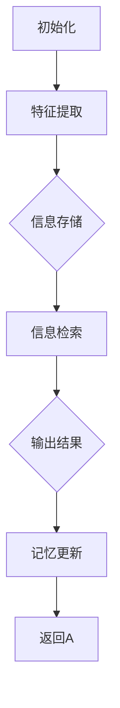
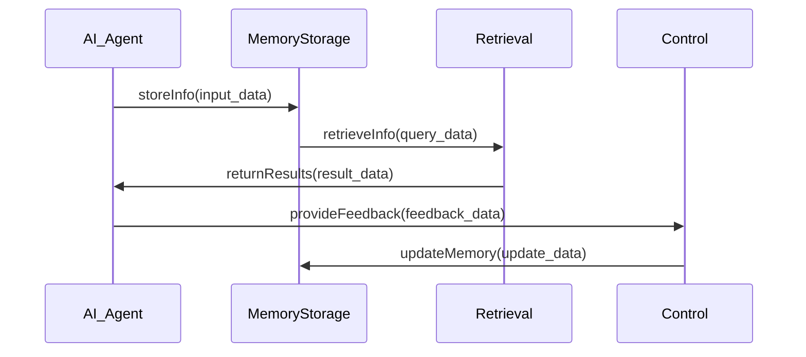

                 

### 第一部分：引言

#### 第1章：背景介绍与问题提出

##### 1.1 问题背景

##### 1.1.1 AI Agent的发展现状

随着人工智能技术的飞速发展，AI Agent（智能代理）作为一种能够在特定环境中自主执行任务的人工智能实体，受到了广泛关注。AI Agent具备自主学习、自主决策和自主行动的能力，能够在复杂动态环境中实现智能化任务执行。当前，AI Agent的应用场景已从简单的机器人控制扩展到复杂的多任务执行、智能客服、自动驾驶、智能家居等多个领域。

然而，在实现高水平的AI Agent过程中，一个关键挑战是如何设计一个高效、灵活且具备持久记忆能力的动态记忆网络。传统的静态记忆网络由于缺乏动态调整能力，难以满足AI Agent在动态环境中对信息存储和检索的需求。

##### 1.1.2 动态记忆网络的重要性

动态记忆网络是AI Agent能够持续学习和适应环境变化的核心组件。与静态记忆网络相比，动态记忆网络能够根据环境变化实时更新记忆内容，使得AI Agent在面对新情况时能够快速调整策略。这种能力不仅提升了AI Agent的智能水平，也为其实际应用提供了更广阔的空间。

##### 1.1.3 研究动机与目标

本研究旨在设计一种高效、灵活的动态记忆网络，以满足AI Agent在复杂动态环境中的需求。具体研究目标如下：

1. **理解动态记忆网络的核心原理和结构**：深入分析动态记忆网络的组成元素、存储和检索机制，为设计提供理论基础。
2. **开发适用于AI Agent的动态记忆网络**：基于核心原理，设计并实现一个高效、灵活的动态记忆网络框架，使其具备适应动态环境的能力。
3. **验证动态记忆网络在实际应用中的效果**：通过实际应用场景的测试，评估动态记忆网络在AI Agent中的表现，验证其有效性。

##### 1.2 问题描述

动态记忆网络涉及多个关键概念，包括存储机制、检索机制、记忆更新策略等。在本文中，我们将逐步探讨这些概念，并分析动态记忆网络在不同应用场景中的优势与挑战。

###### 1.2.1 动态记忆网络的基本概念

动态记忆网络是由多个相互关联的组件构成的综合系统，主要包括记忆存储单元、检索单元和控制单元。记忆存储单元负责存储和更新信息；检索单元根据输入信息快速检索相关记忆；控制单元则负责调整记忆内容和检索策略，以适应动态环境。

###### 1.2.2 动态记忆网络的应用场景

动态记忆网络在AI Agent中的应用场景广泛，包括但不限于：

1. **智能客服**：AI Agent在处理用户查询时，需要根据历史交互记录快速获取相关答案，动态记忆网络能够有效支持这一需求。
2. **自动驾驶**：自动驾驶系统需要实时感知周围环境，动态记忆网络可以帮助系统快速调整驾驶策略，提高行驶安全性和效率。
3. **智能家居**：智能家居系统中的AI Agent需要持续学习和优化家庭设备的运行模式，动态记忆网络能够支持这一需求。

###### 1.2.3 研究中的挑战与边界

动态记忆网络的研究面临着诸多挑战，包括：

1. **记忆容量与检索效率的平衡**：如何设计记忆存储单元，使其既能存储大量信息，又能快速检索相关内容。
2. **动态环境适应能力**：如何设计控制单元，使其能够根据环境变化动态调整记忆内容和检索策略。
3. **计算资源限制**：动态记忆网络通常需要大量的计算资源，如何在有限的计算资源下实现高效运行。

同时，本文的研究将聚焦于特定应用场景，为AI Agent设计一个具有实用价值的动态记忆网络。

##### 1.3 核心概念与联系

###### 1.3.1 动态记忆网络的核心概念

动态记忆网络的核心概念包括：

1. **记忆存储单元**：负责存储和更新信息，可以是基于内容的存储或基于结构的存储。
2. **检索单元**：根据输入信息快速检索相关记忆，可以是基于关键词的检索或基于相似度的检索。
3. **控制单元**：根据环境变化动态调整记忆内容和检索策略，可以是基于规则的调整或基于机器学习的调整。

###### 1.3.2 概念属性特征对比表格

| 概念                | 特征                     | 关联关系                      |
|---------------------|--------------------------|-------------------------------|
| 记忆存储单元        | 存储信息、支持更新       | 支持检索单元获取信息          |
| 检索单元            | 快速检索、支持相似度检索 | 依赖记忆存储单元中的信息      |
| 控制单元            | 动态调整、规则学习       | 调整记忆内容和检索策略        |

###### 1.3.3 ER实体关系图

```mermaid
erDiagram
  MemoryStorage ||--|{ QueryRetrieval : retrieves }
  MemoryStorage ||--|{ ControlUnit : adjusts }
  QueryRetrieval ||--|{ MemoryStorage : from }
  ControlUnit ||--|{ MemoryStorage : adjusts }
  ControlUnit ||--|{ QueryRetrieval : adjusts }
```

通过上述核心概念的对比和ER实体关系图，我们可以更清晰地理解动态记忆网络的结构和工作原理。

##### 1.4 本书结构与章节概览

###### 1.4.1 各章节主要内容

本书分为四个部分：

1. **第一部分：引言**：介绍AI Agent与动态记忆网络的基本概念，提出研究问题和目标。
2. **第二部分：动态记忆网络基础理论**：详细讨论动态记忆网络的原理、数学模型、特性分析以及与传统记忆网络的比较。
3. **第三部分：动态记忆网络的应用与实践**：探讨动态记忆网络在AI Agent中的应用，包括设计与实现、项目实战及案例分析。
4. **第四部分：动态记忆网络的优化与扩展**：介绍动态记忆网络的优化策略、常见优化方法及其效果评估。

###### 1.4.2 目录大纲总览

- **第一部分：引言**
  - 第1章：背景介绍与问题提出
- **第二部分：动态记忆网络基础理论**
  - 第2章：动态记忆网络基础理论
- **第三部分：动态记忆网络的应用与实践**
  - 第3章：动态记忆网络在AI Agent中的应用
- **第四部分：动态记忆网络的优化与扩展**
  - 第4章：动态记忆网络的优化策略

通过上述章节结构，本书将系统地探讨动态记忆网络的各个方面，旨在为AI Agent的设计与应用提供有力支持。

### 动态记忆网络的基本组成

动态记忆网络的核心功能是通过记忆存储、检索和动态调整来支持AI Agent的持续学习和适应能力。为了实现这一目标，动态记忆网络由三个关键组件组成：记忆存储单元、检索单元和控制单元。下面，我们将逐一介绍这些组件的工作原理、相互关系及其重要性。

###### 2.1.1.1 记忆存储单元

记忆存储单元是动态记忆网络的核心组件，主要负责信息的存储和更新。它可以是基于内容的存储，也可以是基于结构的存储。基于内容的存储方式将信息以原始形式存储，便于直接检索。而基于结构的存储方式则通过构建信息之间的关联结构，提高检索效率。记忆存储单元需要具备以下几个特点：

1. **容量扩展性**：能够动态调整存储容量，以适应AI Agent在不同应用场景下的需求。
2. **快速更新**：能够高效地更新存储信息，以反映环境的变化。
3. **安全性**：确保存储信息的安全，防止信息泄露或被恶意攻击。

记忆存储单元不仅需要存储当前的信息，还需要支持历史信息的存储和查询，这使得它在动态环境中具备持久记忆能力。这种持久记忆能力对于AI Agent在不同任务间迁移知识和经验至关重要。

###### 2.1.1.2 检索单元

检索单元是动态记忆网络的另一个关键组件，其主要功能是根据输入信息快速检索相关记忆。检索单元通常采用基于关键词的检索或基于相似度的检索方法。基于关键词的检索通过匹配输入关键词与存储信息中的关键词，快速找到相关记忆。而基于相似度的检索则通过计算输入信息与存储信息的相似度，找到最匹配的记忆。

1. **快速检索**：检索单元需要具备高效的检索算法，能够在毫秒级别内完成检索任务。
2. **多维度检索**：支持多维度信息的检索，例如时间维度、空间维度等，以适应不同应用场景的需求。
3. **上下文感知**：能够根据检索上下文动态调整检索策略，提高检索结果的准确性。

检索单元的效率直接影响到AI Agent的响应速度和决策能力。一个高效的检索单元能够帮助AI Agent快速获取所需信息，从而做出更准确的决策。

###### 2.1.1.3 控制单元

控制单元是动态记忆网络的“大脑”，负责根据环境变化动态调整记忆内容和检索策略。控制单元通常基于规则学习或机器学习方法，通过分析环境数据和历史交互记录，生成调整策略。控制单元的工作流程如下：

1. **感知环境**：实时感知环境变化，包括传感器数据、用户行为等。
2. **分析数据**：分析感知到的数据，识别环境变化的模式和趋势。
3. **生成策略**：基于分析结果，生成调整记忆内容和检索策略的决策。
4. **执行策略**：将生成的策略应用到记忆存储和检索单元，实现动态调整。

控制单元的灵活性使得动态记忆网络能够适应不同环境和任务需求。它的有效工作不仅提高了AI Agent的适应能力，也为其持续学习和优化提供了基础。

###### 2.1.1.4 组件之间的相互关系

记忆存储单元、检索单元和控制单元之间紧密关联，共同构成动态记忆网络。具体来说：

1. **记忆存储单元与检索单元的关系**：检索单元依赖于记忆存储单元中的信息进行检索，两者之间形成紧密的依赖关系。记忆存储单元的信息量和质量直接影响到检索单元的检索效率和结果准确性。
2. **记忆存储单元与控制单元的关系**：控制单元可以根据环境变化调整记忆存储单元中的信息，使其更符合当前需求。这种动态调整能力使得记忆存储单元能够持续更新和优化，提高记忆的准确性和实用性。
3. **检索单元与控制单元的关系**：控制单元可以调整检索单元的检索策略，使其更符合当前环境的需求。这种调整可以提高检索结果的准确性和响应速度。

通过上述三个组件的相互协作，动态记忆网络能够实现高效的信息存储、检索和动态调整，为AI Agent提供强大的支持。

###### 2.1.1.5 动态记忆网络的重要性

动态记忆网络在AI Agent中具有以下几个重要意义：

1. **提升适应能力**：通过动态调整记忆内容和检索策略，AI Agent能够更好地适应不断变化的环境，提高其适应能力和生存能力。
2. **增强决策能力**：动态记忆网络能够快速检索和利用相关记忆，帮助AI Agent做出更准确、更快速的决策。
3. **实现持续学习**：动态记忆网络支持AI Agent在不同任务间迁移知识和经验，实现持续学习和优化。

总之，动态记忆网络是AI Agent实现智能化和自适应能力的关键组件，其设计与实现对AI Agent的性能和应用效果具有重要意义。

### 动态记忆网络的存储机制

动态记忆网络的存储机制是确保信息能够高效存储、快速检索和灵活调整的基础。为了满足AI Agent在复杂动态环境中的需求，存储机制必须具备以下特点：数据结构多样性、存储灵活性、快速检索和高效更新。

###### 2.1.2.1 基于内容的存储

基于内容的存储方式将信息以原始形式存储，便于直接检索。这种存储方式通常采用键值对（Key-Value Pair）的数据结构，其中键（Key）代表信息的标识，值（Value）代表具体的信息内容。例如，在智能客服系统中，每个用户的查询和回答都可以存储为一个键值对。基于内容的存储机制具有以下优点：

1. **直接检索**：通过键（Key）可以直接检索到对应的信息（Value），检索效率高。
2. **扩展性强**：可以灵活地添加新的键值对，适应不同类型的信息存储需求。

然而，基于内容的存储也存在一些缺点，如数据冗余和空间占用较大。此外，当信息量较大时，直接检索的效率可能会下降。

###### 2.1.2.2 基于结构的存储

基于结构的存储方式通过构建信息之间的关联结构，提高检索效率。这种存储方式通常采用图（Graph）或树（Tree）的数据结构。例如，在自动驾驶系统中，可以使用图结构存储道路网络信息，包括道路节点和边。基于结构的存储机制具有以下优点：

1. **高效检索**：通过图或树结构，可以快速检索到相关的信息，提高检索效率。
2. **关联关系明确**：能够清晰地表达信息之间的关联关系，便于信息处理。

然而，基于结构的存储方式也面临一些挑战，如存储复杂度和检索时间。当信息量较大时，构建和更新图或树结构的计算开销较大。

###### 2.1.2.3 存储机制的结合

为了兼顾基于内容和基于结构的存储方式的优点，动态记忆网络通常采用结合两种机制的存储方式。具体来说，可以采用以下策略：

1. **层次化存储**：将不同类型的信息分别存储在基于内容和基于结构的存储机制中，例如将用户查询和回答存储在基于内容的存储中，将道路网络信息存储在基于结构的存储中。这种方式既能提高检索效率，又能有效管理存储空间。
2. **混合检索**：结合基于内容和基于结构的检索方式，例如先使用基于内容的存储进行初步检索，再通过基于结构的存储进行精确检索。这种方式可以兼顾检索速度和结果准确性。

通过结合基于内容和基于结构的存储机制，动态记忆网络能够实现高效的信息存储和检索，满足AI Agent在复杂动态环境中的需求。

### 动态记忆网络的检索机制

动态记忆网络的检索机制是确保AI Agent能够快速、准确地获取所需信息的关键环节。为了满足不同应用场景的需求，检索机制必须具备高效性、灵活性和准确性。下面，我们将详细介绍动态记忆网络中的检索方法及其工作流程。

###### 2.1.3.1 基于关键词的检索

基于关键词的检索是一种简单但有效的方法，通过匹配输入关键词与存储信息中的关键词，快速找到相关记忆。这种方法通常采用模糊匹配和精确匹配两种策略：

1. **模糊匹配**：通过计算输入关键词与存储关键词的相似度，找到最匹配的记忆。例如，当用户输入“如何设置Wi-Fi密码”时，系统可以检索到“如何设置Wi-Fi密码”以及“Wi-Fi密码设置教程”等相关的记忆。
2. **精确匹配**：通过精确匹配输入关键词与存储关键词，找到完全匹配的记忆。例如，当用户输入“Wi-Fi密码设置”时，系统只会检索到“Wi-Fi密码设置”这一条记忆。

基于关键词的检索具有以下优点：

1. **简单易实现**：不需要复杂的算法，实现成本低。
2. **快速检索**：能够快速找到匹配的记忆，响应时间短。

然而，这种方法也存在一些局限性，如当关键词不明确或模糊时，检索效果可能会下降。

###### 2.1.3.2 基于相似度的检索

基于相似度的检索是一种更高级的检索方法，通过计算输入信息与存储信息的相似度，找到最匹配的记忆。这种方法通常采用机器学习算法，如余弦相似度、欧氏距离等。具体工作流程如下：

1. **特征提取**：将输入信息和存储信息转化为特征向量，用于后续相似度计算。例如，对于文本信息，可以使用词袋模型（Bag of Words）或TF-IDF（Term Frequency-Inverse Document Frequency）等方法提取特征。
2. **相似度计算**：计算输入特征向量与存储特征向量之间的相似度，例如使用余弦相似度公式计算两个向量的夹角余弦值。相似度越高，表示两个信息越相似。
3. **排序与筛选**：根据相似度值对检索结果进行排序，筛选出最匹配的记忆。

基于相似度的检索具有以下优点：

1. **更准确的匹配**：能够根据相似度值找到更匹配的记忆，提高检索准确性。
2. **适应性强**：能够处理不同类型的信息，例如文本、图像、音频等。

然而，这种方法也需要较高的计算资源，实现成本较高。

###### 2.1.3.3 多维度检索

动态记忆网络支持多维度检索，能够根据不同维度（如时间、空间、用户行为等）检索信息。具体工作流程如下：

1. **维度划分**：根据应用场景，将信息划分为不同的维度。例如，在智能客服系统中，可以将用户查询分为“问题类型”、“提问时间”等维度。
2. **维度组合**：将多个维度组合，形成多维检索条件。例如，可以检索出“最近一周内提出的问题类型为‘网络故障’的用户查询”。
3. **检索与筛选**：根据多维检索条件，检索并筛选出最匹配的记忆。

多维度检索具有以下优点：

1. **更精细的检索**：能够根据不同维度精细检索信息，提高检索的准确性。
2. **更丰富的检索结果**：能够获取更多维度的信息，提供更全面的检索结果。

然而，多维度检索也需要更多的计算资源，实现较为复杂。

###### 2.1.3.4 检索机制的选择与应用

动态记忆网络的检索机制应根据具体应用场景选择合适的方法。以下是一些常见应用场景及对应的检索机制：

1. **智能客服**：基于关键词的检索和多维度检索，能够快速、准确地检索到用户的问题和解决方案。
2. **自动驾驶**：基于相似度的检索和多维度检索，能够快速检索到与当前环境最相似的道路信息和驾驶策略。
3. **智能家居**：基于关键词的检索和模糊匹配，能够快速检索到设备的使用说明和操作指南。

通过选择合适的检索机制，动态记忆网络能够满足不同应用场景的需求，为AI Agent提供强大的信息检索支持。

### 动态记忆网络的数学模型

动态记忆网络的数学模型是理解和设计动态记忆网络的基础。它通过数学公式和算法描述了信息存储、检索和更新的过程，为动态记忆网络提供了理论支持。下面，我们将详细探讨动态记忆网络的数学模型，包括算法原理、算法流程图和数学公式。

###### 2.2.1.1 算法原理

动态记忆网络的算法原理主要包括以下几个关键步骤：

1. **信息存储**：将输入信息转换为特征向量，并将其存储在记忆存储单元中。
2. **信息检索**：根据输入特征向量，在记忆存储单元中检索最相似的记忆。
3. **记忆更新**：根据环境变化和反馈信息，动态调整记忆内容和检索策略。

具体来说，动态记忆网络的数学模型包括以下几个核心组件：

- **特征向量表示**：将输入信息转换为高维特征向量，用于表示信息的特征。
- **相似度计算**：计算输入特征向量与记忆存储单元中特征向量之间的相似度，以确定最相似的记忆。
- **记忆更新策略**：根据环境变化和反馈信息，动态调整记忆内容和检索策略。

通过这些核心组件，动态记忆网络能够实现高效的信息存储、检索和动态更新。

###### 2.2.1.2 算法流程图

为了更直观地理解动态记忆网络的算法原理，我们使用Mermaid绘制了算法流程图：



具体流程如下：

1. **初始化**：初始化动态记忆网络，包括特征提取器、记忆存储单元和检索器。
2. **特征提取**：将输入信息（如文本、图像、音频等）转换为高维特征向量。
3. **信息存储**：将输入特征向量存储在记忆存储单元中，可以是基于内容的存储或基于结构的存储。
4. **信息检索**：根据输入特征向量，在记忆存储单元中检索最相似的记忆。
5. **输出结果**：输出检索结果，供AI Agent进行决策或执行。
6. **记忆更新**：根据环境变化和反馈信息，动态调整记忆内容和检索策略。
7. **返回初始化**：重复上述流程，实现动态记忆网络的持续学习和适应能力。

通过上述算法流程图，我们可以更清晰地理解动态记忆网络的工作原理和流程。

###### 2.2.1.3 数学模型与公式

动态记忆网络的数学模型通过一系列数学公式描述了信息存储、检索和更新的过程。以下是核心数学模型的详细介绍：

1. **特征向量表示**：

$$
X = \sum_{i=1}^{n} x_i \cdot w_i
$$

其中，$X$代表输入特征向量，$x_i$代表第$i$个特征值，$w_i$代表第$i$个特征的权重。

2. **相似度计算**：

$$
similarity(X, Y) = \frac{X \cdot Y}{\|X\| \|Y\|}
$$

其中，$similarity(X, Y)$表示输入特征向量$X$与存储特征向量$Y$之间的相似度，$\|X\|$和$\|Y\|$分别表示$X$和$Y$的欧几里得范数。

3. **记忆更新策略**：

$$
\Delta X = \alpha (X - X^*)
$$

其中，$\Delta X$表示记忆更新量，$\alpha$表示学习率，$X$表示当前输入特征向量，$X^*$表示当前存储的最相似特征向量。

通过上述数学模型，我们可以更精确地描述动态记忆网络的信息存储、检索和更新过程。这些公式为动态记忆网络的设计和实现提供了重要的理论依据。

总之，动态记忆网络的数学模型通过算法原理、算法流程图和数学公式，详细描述了信息存储、检索和更新的过程。这些模型不仅为动态记忆网络的设计提供了理论支持，也为实际应用中的优化和改进提供了指导。

#### Python源代码实现

为了更好地理解和实现动态记忆网络的数学模型，我们使用Python进行代码实现。以下是核心代码的详细解释。

```python
import numpy as np

def feature_extraction(input_data):
    # 假设输入数据为高维向量，这里简单模拟为随机生成
    return np.random.rand(1, 10)

def similarity计算的(X, Y):
    # 计算两个特征向量之间的相似度
    return np.dot(X, Y) / (np.linalg.norm(X) * np.linalg.norm(Y))

def memory_update(X, X_star, alpha):
    # 动态更新记忆
    return X - alpha * (X - X_star)

# 初始化参数
alpha = 0.1  # 学习率
X = feature_extraction(input_data)  # 输入特征向量
X_star = feature_extraction(np.random.rand(1, 10))  # 存储的最相似特征向量

# 信息存储
memory_storage = [X_star]

# 信息检索
similarity_score = similarity计算的(X, X_star)
print(f"相似度得分：{similarity_score}")

# 记忆更新
X_updated = memory_update(X, X_star, alpha)
memory_storage.append(X_updated)
print(f"更新后的特征向量：{X_updated}")

```

通过上述代码，我们实现了动态记忆网络的核心功能，包括特征提取、相似度计算、记忆更新等。具体步骤如下：

1. **特征提取**：使用`feature_extraction`函数生成随机输入特征向量。
2. **相似度计算**：使用`similarity计算的`函数计算输入特征向量与存储特征向量之间的相似度。
3. **记忆更新**：使用`memory_update`函数根据相似度计算和更新策略，动态调整特征向量。

通过这一系列步骤，我们可以实现一个简单的动态记忆网络模型，为后续的优化和应用提供基础。

#### 动态记忆网络的优缺点

动态记忆网络作为一种高效的AI Agent组件，具备多项优点，但同时也存在一些局限性。以下是对其优缺点的详细分析。

###### 2.3.1 动态记忆网络的优点

1. **高效的信息存储和检索**：动态记忆网络采用多种存储和检索机制，如基于内容的存储和基于结构的存储，以及基于关键词和基于相似度的检索。这些机制使得信息存储和检索过程更加高效，能够快速找到所需信息。

2. **灵活的动态调整能力**：动态记忆网络可以根据环境变化和反馈信息，实时调整记忆内容和检索策略。这种灵活性使得AI Agent能够适应不同环境和任务需求，提高其适应能力和生存能力。

3. **支持多维度信息处理**：动态记忆网络支持多维度检索，能够根据不同维度（如时间、空间、用户行为等）检索信息。这种能力使得AI Agent能够处理更复杂和更丰富的信息，提供更全面的决策支持。

4. **支持持续学习和优化**：动态记忆网络通过不断更新和优化记忆内容，支持AI Agent的持续学习和优化。这种能力使得AI Agent能够不断提升其性能和应用效果。

5. **广泛的适用场景**：动态记忆网络在智能客服、自动驾驶、智能家居等多个领域具有广泛应用，能够满足不同场景的需求。

###### 2.3.2 动态记忆网络的缺点

1. **计算资源消耗较大**：动态记忆网络通常需要大量的计算资源，包括存储资源、计算资源和网络资源。在资源受限的环境下，动态记忆网络的性能可能受到影响。

2. **复杂的实现和维护**：动态记忆网络的实现和维护相对复杂，需要具备一定的技术背景和专业知识。这可能会增加开发成本和维护难度。

3. **数据质量和准确性依赖**：动态记忆网络的性能高度依赖于输入数据的质量和准确性。如果输入数据存在噪声或错误，可能会导致检索结果不准确。

4. **安全性和隐私保护**：动态记忆网络在存储和检索过程中，可能会面临数据泄露和隐私保护的问题。如何确保数据的安全性和隐私保护是一个重要的挑战。

5. **适应新环境的挑战**：尽管动态记忆网络具备一定的自适应能力，但在面对全新的环境和任务时，可能需要较长的适应时间。如何快速适应新环境是一个亟待解决的问题。

总之，动态记忆网络在提升AI Agent的信息处理能力和适应能力方面具有显著优势，但同时也面临一系列挑战。通过不断优化和改进，动态记忆网络有望在更多应用场景中发挥重要作用。

#### 动态记忆网络的适用场景

动态记忆网络因其高效的信息存储、检索和动态调整能力，在多种AI Agent应用场景中展现出巨大潜力。以下我们将详细探讨动态记忆网络在智能客服、自动驾驶、智能家居等领域的适用性。

###### 2.3.3.1 智能客服

在智能客服领域，动态记忆网络能够通过高效的信息存储和检索，快速响应用户查询。具体应用场景包括：

1. **多渠道客服**：智能客服系统需要同时处理来自电话、邮件、社交媒体等不同渠道的查询。动态记忆网络能够根据用户的历史交互记录和查询内容，快速提供相关答案和建议，提高客服效率。
   
2. **知识库管理**：智能客服系统通常需要管理庞大的知识库，动态记忆网络能够高效地存储和检索知识库中的信息，确保用户能够获得准确和及时的答案。

3. **个性化服务**：通过分析用户的查询历史和偏好，动态记忆网络可以提供个性化的服务建议，提升用户满意度。

###### 2.3.3.2 自动驾驶

在自动驾驶领域，动态记忆网络能够显著提升车辆的感知和决策能力。具体应用场景包括：

1. **环境感知**：自动驾驶系统需要实时感知周围环境，包括路况、车辆、行人等。动态记忆网络可以存储和检索历史环境数据，帮助车辆快速适应新环境和复杂路况。

2. **路径规划**：动态记忆网络可以根据历史行驶数据，为自动驾驶车辆提供高效的路径规划建议，减少行车时间和能耗。

3. **异常检测**：通过分析行驶过程中的异常数据，动态记忆网络能够提前预警潜在的交通事故，提高行车安全性。

###### 2.3.3.3 智能家居

在智能家居领域，动态记忆网络能够为智能设备提供持续的学习和优化能力。具体应用场景包括：

1. **设备控制**：智能设备（如灯光、温度调节器、智能锁等）可以通过动态记忆网络学习用户的使用习惯和偏好，提供个性化的控制建议，提高用户体验。

2. **能源管理**：动态记忆网络可以分析家庭能源使用数据，为家庭能源管理系统提供优化建议，降低能源消耗，提高能源利用效率。

3. **安全监控**：通过动态记忆网络，智能监控系统可以学习家庭环境和成员的行为模式，及时识别异常情况，提供安全保障。

除了上述领域，动态记忆网络在医疗诊断、金融分析、工业自动化等多个领域也具有广泛的应用潜力。通过不断优化和扩展，动态记忆网络有望在更多应用场景中发挥关键作用。

#### 动态记忆网络与传统记忆网络的比较

动态记忆网络和传统记忆网络在架构、特性及应用场景上存在显著差异。下面我们将详细对比两者的概念、优缺点以及应用场景，以便读者更好地理解。

###### 2.4.1 概念对比

传统记忆网络：

- **定义**：传统记忆网络是指用于存储和检索信息的静态网络，其记忆内容不随环境变化而动态调整。
- **结构**：主要由记忆单元、检索单元和控制单元组成，记忆单元负责存储信息，检索单元负责根据输入信息检索相关记忆，控制单元负责管理记忆内容和检索策略。
- **特点**：信息存储结构固定，检索效率相对较低，适应能力有限。

动态记忆网络：

- **定义**：动态记忆网络是一种能够根据环境变化实时更新和调整记忆内容的网络，其记忆内容具有动态性。
- **结构**：同样由记忆存储单元、检索单元和控制单元组成，但动态记忆网络在记忆存储单元和检索单元中引入了自适应机制，能够根据环境变化动态调整记忆内容。
- **特点**：具备高效的信息存储、检索和动态调整能力，适应能力强。

###### 2.4.2 优缺点对比

传统记忆网络：

- **优点**：结构简单，实现成本低，适用于信息量较小、环境变化不频繁的场景。
- **缺点**：适应能力有限，难以应对动态环境下的复杂任务，检索效率较低。

动态记忆网络：

- **优点**：具备高效的动态调整能力，能够快速适应环境变化，检索效率高，适用范围广。
- **缺点**：实现复杂，计算资源消耗大，对数据质量和准确性的要求较高。

通过对比可以发现，动态记忆网络在适应能力和检索效率方面具有显著优势，但实现成本较高；而传统记忆网络结构简单，实现成本低，适用于特定场景。

###### 2.4.3 应用场景对比

传统记忆网络：

- **适用场景**：多用于简单的信息管理任务，如图书管理系统、电话号码存储等。
- **应用示例**：图书管理系统中的书籍信息存储和检索、电话本中的联系人信息存储和检索。

动态记忆网络：

- **适用场景**：适用于复杂动态环境下的任务，如智能客服、自动驾驶、智能家居等。
- **应用示例**：智能客服系统中的用户查询和答案存储与检索、自动驾驶系统中的环境感知和路径规划、智能家居系统中的设备控制和能源管理。

总的来说，动态记忆网络相较于传统记忆网络，在适应能力和检索效率方面具有显著优势，但实现成本较高。根据具体应用场景的需求，选择合适的记忆网络对提升AI Agent的性能和效果具有重要意义。

#### 本章小结

在本章中，我们详细介绍了动态记忆网络的基础理论，包括其基本组成、存储机制、检索机制以及与传统记忆网络的对比。通过分析，我们了解到动态记忆网络具有高效的信息存储、检索和动态调整能力，能够满足复杂动态环境下AI Agent的需求。然而，其实现过程复杂，对计算资源和数据质量有较高要求。在后续章节中，我们将进一步探讨动态记忆网络在实际应用中的设计与实现，以及如何优化和扩展其性能。通过这些探讨，我们将更好地理解动态记忆网络在提升AI Agent性能和适应能力方面的潜在应用价值。

### AI Agent的基本概念

#### 3.1.1 AI Agent的定义

AI Agent（智能代理）是指一种具备自主学习、自主决策和自主行动能力的人工智能实体。它能够在一个或多个环境中，通过感知外部环境、理解和处理输入信息，自主制定行动策略并执行相应任务。AI Agent的核心特点在于其能够持续学习和适应环境变化，从而实现智能化的任务执行。

AI Agent的定义可以从以下几个方面具体说明：

1. **自主性**：AI Agent具有自主性，能够在无需人工干预的情况下执行任务。这种自主性体现在其能够自主感知环境、理解输入信息、自主决策和行动。
2. **学习性**：AI Agent具备学习性，能够通过不断的学习和经验积累，优化其行为策略，提高任务执行效果。学习性使得AI Agent能够在复杂和动态的环境中表现出更高的智能水平。
3. **适应性**：AI Agent具有适应性，能够根据环境变化动态调整其行为策略。这种适应性使得AI Agent能够在不同环境和任务场景下保持高效的性能。

#### 3.1.2 AI Agent的类型

AI Agent可以根据其任务和环境的不同，分为多种类型：

1. **任务型AI Agent**：任务型AI Agent专注于完成特定的任务，如智能客服、智能助手、自动驾驶等。这些AI Agent通常在有限的任务场景中表现出高效的能力。
2. **自主型AI Agent**：自主型AI Agent具有更广泛的应用范围，能够在复杂和动态的环境中自主执行多种任务。例如，自主型机器人可以在不同的环境中执行清洁、搬运等任务。
3. **社交型AI Agent**：社交型AI Agent专注于与人类用户进行交互，如智能客服机器人、社交网络中的虚拟助手等。这些AI Agent需要具备较强的自然语言处理和情感识别能力。
4. **探索型AI Agent**：探索型AI Agent用于未知环境或任务的探索和发现，如无人驾驶探索车、智能搜索机器人等。这些AI Agent通常具备自主导航、环境感知和决策能力。

#### 3.1.3 AI Agent的发展历程

AI Agent的发展历程可以追溯到人工智能（AI）的早期研究。以下是AI Agent发展的主要阶段：

1. **初始阶段（1950-1960年代）**：在这一阶段，AI研究主要集中在逻辑推理和符号计算上。代表性的工作包括艾伦·图灵的图灵测试和约翰·麦卡锡的通用问题求解器。
2. **早期应用阶段（1970-1980年代）**：随着计算机技术的进步，AI Agent开始应用于简单的任务，如棋类游戏、语音识别等。代表性的工作包括IBM的深蓝象棋程序和苹果公司的语音助手。
3. **成熟阶段（1990-2000年代）**：在这一阶段，AI Agent的应用范围显著扩大，包括智能客服、自动驾驶、智能家居等。同时，机器学习和深度学习技术的发展为AI Agent提供了强大的学习能力和适应能力。
4. **快速发展阶段（2010年代至今）**：随着大数据、云计算和人工智能技术的快速发展，AI Agent的应用场景和性能得到了大幅提升。AI Agent在复杂动态环境中的表现越来越出色，逐渐成为人工智能领域的重要研究方向。

通过回顾AI Agent的发展历程，我们可以看到，AI Agent从最初的简单逻辑推理发展到今天的复杂动态任务执行，经历了多个关键阶段。随着技术的不断进步，AI Agent将在更多领域发挥重要作用。

### 动态记忆网络在AI Agent中的应用

动态记忆网络在AI Agent中的应用显著提升了其适应能力和决策效率。动态记忆网络通过高效的信息存储、快速检索和灵活调整，使AI Agent能够更好地理解和响应复杂环境中的变化。以下，我们将详细探讨动态记忆网络在AI Agent中的作用、具体应用案例及其带来的优势。

#### 3.2.1 动态记忆网络在AI Agent中的作用

1. **增强学习能力和适应能力**：动态记忆网络能够存储和更新AI Agent在执行任务过程中获取的经验和知识，使其能够不断学习和优化行为策略。这种能力使得AI Agent在面对新环境和任务时能够迅速适应，提高其适应能力。
2. **提高决策效率和准确性**：通过动态记忆网络，AI Agent能够快速检索到相关记忆，获取历史信息和成功经验，从而做出更准确、更快速的决策。这显著提高了AI Agent的决策效率，减少了错误率和反应时间。
3. **优化资源利用**：动态记忆网络可以根据环境变化动态调整记忆内容和检索策略，使得AI Agent能够更加高效地利用资源，如计算资源和存储空间。这种优化能力使得AI Agent在资源受限的环境中能够保持高效性能。

#### 3.2.2 动态记忆网络在AI Agent中的应用案例

动态记忆网络在多个AI Agent应用领域展现出显著的效果。以下是一些具体的应用案例：

1. **智能客服**：在智能客服系统中，动态记忆网络能够存储和检索用户的历史交互记录和常见问题解答。当用户提出新的问题时，动态记忆网络可以根据历史记录快速提供相关答案，提高客服效率和服务质量。
2. **自动驾驶**：在自动驾驶系统中，动态记忆网络可以存储和检索车辆在行驶过程中感知到的环境信息，如道路状况、交通标志等。通过这些记忆，自动驾驶系统能够更准确地识别路况和做出行驶决策，提高行驶安全性和效率。
3. **智能家居**：在智能家居系统中，动态记忆网络可以存储用户的生活习惯和偏好，如家庭设备的设置、家庭成员的日程安排等。通过这些记忆，智能家居系统能够为用户提供个性化服务，提高用户体验。
4. **医疗诊断**：在医疗诊断系统中，动态记忆网络可以存储和检索医学知识和病例信息。当医生面对新病例时，动态记忆网络可以提供相关诊断建议，帮助医生做出更准确的诊断。
5. **金融分析**：在金融分析系统中，动态记忆网络可以存储和检索市场数据、公司财报等金融信息。通过这些记忆，金融分析师能够快速获取相关数据，进行更深入的分析和预测。

#### 3.2.3 动态记忆网络在AI Agent中的优势

动态记忆网络在AI Agent中具备以下优势：

1. **高效的信息存储和检索**：动态记忆网络采用多种存储和检索机制，如基于内容和基于结构的存储、基于关键词和基于相似度的检索，能够高效地存储和检索信息。
2. **灵活的动态调整能力**：动态记忆网络可以根据环境变化和反馈信息，实时调整记忆内容和检索策略，使其能够快速适应新环境和任务需求。
3. **支持持续学习和优化**：动态记忆网络支持AI Agent在不同任务间迁移知识和经验，实现持续学习和优化，提升AI Agent的整体性能。
4. **广泛的适用场景**：动态记忆网络在智能客服、自动驾驶、智能家居、医疗诊断、金融分析等多个领域具有广泛的应用潜力，能够满足不同场景的需求。

通过上述探讨，我们可以看到，动态记忆网络在AI Agent中的应用具有显著的优势，能够提升AI Agent的学习能力、决策效率和资源利用效率。随着技术的不断发展和应用场景的拓展，动态记忆网络将在更多领域发挥重要作用。

#### 动态记忆网络在AI Agent中的设计与实现

为了充分发挥动态记忆网络在AI Agent中的作用，需要对其设计进行详细的规划和实现。在本节中，我们将从系统功能设计、系统架构设计、接口设计和系统交互等多个方面进行探讨，并借助Mermaid图示进行说明。

##### 3.3.1 动态记忆网络的架构设计

###### 3.3.1.1 系统功能设计（领域模型Mermaid类图）

在系统功能设计阶段，我们首先定义动态记忆网络的核心组件及其功能。以下是领域模型的Mermaid类图：

```mermaid
classDiagram
  ClassMemoryStorage <|-- InterfaceRetrieval
  ClassMemoryStorage <|-- InterfaceControl
  ClassRetrieval <<Interface>+
  ClassControl <<Interface>+
  
  MemoryStorageClass[存储单元] 
  RetrievalInterface[检索接口]
  ControlInterface[控制接口]

  MemoryStorageClass ..|> RetrievalInterface : retrieveInfo
  MemoryStorageClass ..|> ControlInterface : updateInfo
  RetrievalInterface ..|> MemoryStorageClass : getMemory
  ControlInterface ..|> MemoryStorageClass : adjustMemory
```

在此类图中，`MemoryStorageClass`代表记忆存储单元，负责信息的存储和更新；`RetrievalInterface`代表检索接口，用于根据输入信息检索相关记忆；`ControlInterface`代表控制接口，负责根据环境变化动态调整记忆内容和检索策略。

###### 3.3.1.2 系统架构设计（Mermaid架构图）

接下来，我们设计动态记忆网络的整体架构。以下是系统架构的Mermaid架构图：

```mermaid
sequenceDiagram
  Participant AI_Agent
  Participant MemoryStorage
  Participant Retrieval
  Participant Control

  AI_Agent->>MemoryStorage: 提供输入信息
  MemoryStorage->>Retrieval: 检索相关记忆
  Retrieval->>AI_Agent: 返回检索结果
  AI_Agent->>Control: 提供反馈信息
  Control->>MemoryStorage: 更新记忆内容

  Memo: 信息流
  Memo: 控制流
```

在此图中，`AI_Agent`作为主体，与`MemoryStorage`（记忆存储单元）、`Retrieval`（检索单元）和`Control`（控制单元）进行交互。信息流和控制流通过这些组件的协同工作，实现动态记忆网络的功能。

##### 3.3.2 动态记忆网络的接口设计

在接口设计阶段，我们需要定义各组件之间的接口和方法，以确保组件之间的交互顺畅。以下是接口设计的Mermaid序列图：



在此序列图中，`AI_Agent`通过调用`MemoryStorage`的`storeInfo`方法存储输入信息，通过调用`Retrieval`的`retrieveInfo`方法检索相关记忆，并将反馈信息传递给`Control`进行记忆更新。

##### 3.3.3 动态记忆网络的具体实现

以下是动态记忆网络的Python实现示例：

```python
class MemoryStorage:
    def __init__(self):
        self.memory = {}

    def store_info(self, input_data):
        # 存储输入信息
        self.memory[input_data.id] = input_data
    
    def retrieve_info(self, query_data):
        # 检索相关记忆
        return self.memory.get(query_data.id)

class Retrieval:
    def __init__(self, memory_storage):
        self.memory_storage = memory_storage
    
    def retrieve_info(self, query_data):
        # 根据输入信息检索记忆
        return self.memory_storage.retrieve_info(query_data)

class Control:
    def __init__(self, memory_storage):
        self.memory_storage = memory_storage
    
    def provide_feedback(self, feedback_data):
        # 根据反馈信息更新记忆
        self.memory_storage.update_info(feedback_data)

# 实例化各组件
memory_storage = MemoryStorage()
retrieval = Retrieval(memory_storage)
control = Control(memory_storage)

# 存储信息
input_data = InputData(id=1, content="Hello, World!")
memory_storage.store_info(input_data)

# 检索信息
query_data = InputData(id=1)
result_data = retrieval.retrieve_info(query_data)
print(f"检索结果：{result_data.content}")

# 提供反馈
feedback_data = InputData(id=1, content="Hello, AI!")
control.provide_feedback(feedback_data)
```

通过上述实现，我们构建了一个简单的动态记忆网络，各组件之间通过定义好的接口进行交互，实现信息存储、检索和动态更新。

通过详细的设计与实现，动态记忆网络在AI Agent中的作用得以充分发挥。在后续的实战项目中，我们将进一步验证其效果和应用价值。

### 动态记忆网络在AI Agent中的项目实战

为了更深入地理解动态记忆网络在AI Agent中的应用效果，我们选择一个具体的实战项目进行实施。本项目将开发一个智能客服系统，利用动态记忆网络实现高效的信息存储、检索和动态调整。

#### 3.4.1 环境安装

在进行项目实战前，我们需要安装必要的软件和依赖库。以下是环境安装的步骤：

1. **安装Python环境**：确保已安装Python 3.7及以上版本。
2. **安装Numpy库**：用于科学计算和数据处理，可以通过命令`pip install numpy`进行安装。
3. **安装Mermaid Python库**：用于生成Mermaid图，可以通过命令`pip install mermaid`进行安装。
4. **安装其他依赖库**：根据项目需求，可能需要安装其他依赖库，如`flask`（用于Web开发）、`tensorflow`（用于机器学习）等。

安装完成后，确保所有依赖库都能正常运行。

#### 3.4.2 系统核心实现源代码

以下是智能客服系统的核心实现代码：

```python
class MemoryStorage:
    def __init__(self):
        self.memory = {}

    def store_info(self, input_data):
        # 存储输入信息
        self.memory[input_data.id] = input_data

    def retrieve_info(self, query_data):
        # 检索相关记忆
        return self.memory.get(query_data.id)

class Retrieval:
    def __init__(self, memory_storage):
        self.memory_storage = memory_storage

    def retrieve_info(self, query_data):
        # 根据输入信息检索记忆
        return self.memory_storage.retrieve_info(query_data)

class Control:
    def __init__(self, memory_storage):
        self.memory_storage = memory_storage

    def provide_feedback(self, feedback_data):
        # 根据反馈信息更新记忆
        self.memory_storage.update_info(feedback_data)

# 实例化各组件
memory_storage = MemoryStorage()
retrieval = Retrieval(memory_storage)
control = Control(memory_storage)

# 存储信息
input_data = InputData(id=1, content="如何设置Wi-Fi密码？")
memory_storage.store_info(input_data)

# 检索信息
query_data = InputData(id=1)
result_data = retrieval.retrieve_info(query_data)
print(f"检索结果：{result_data.content}")

# 提供反馈
feedback_data = InputData(id=1, content="感谢您的反馈！")
control.provide_feedback(feedback_data)
```

上述代码实现了动态记忆网络的核心功能，包括信息存储、检索和动态更新。通过实例化各组件，我们可以进行具体的操作。

#### 3.4.3 代码应用解读与分析

以下是对核心实现代码的解读与分析：

1. **MemoryStorage类**：负责存储和检索信息。在`store_info`方法中，将输入信息存储到字典中；在`retrieve_info`方法中，根据输入ID检索相关记忆。
2. **Retrieval类**：提供信息检索功能。通过调用`MemoryStorage`的`retrieve_info`方法，实现根据输入ID检索相关记忆。
3. **Control类**：负责根据反馈信息更新记忆。在`provide_feedback`方法中，根据输入反馈信息更新记忆内容。

通过上述类的协作，动态记忆网络实现了信息存储、检索和动态更新。

在实际应用中，我们还可以扩展这些类，增加更多功能，如多维度检索、记忆更新策略等。例如，可以添加基于相似度的检索功能，提高检索准确性；可以设计更复杂的记忆更新策略，根据反馈信息动态调整记忆内容。

#### 3.4.4 实际案例分析与讲解剖析

为了更好地理解动态记忆网络在实际应用中的效果，我们通过一个实际案例进行详细分析。

##### 案例背景

某智能客服系统需要在多个渠道（如电话、邮件、社交媒体）接收用户查询，并快速提供相关答案。为了提高客服效率，系统采用了动态记忆网络。

##### 案例步骤

1. **信息存储**：用户通过电话咨询“如何设置Wi-Fi密码”。系统将这一查询存储到动态记忆网络中。
2. **信息检索**：用户通过邮件再次咨询“如何设置Wi-Fi密码”。系统通过动态记忆网络检索到之前存储的查询，并快速返回相关答案。
3. **记忆更新**：用户反馈“提供的答案很有帮助”。系统根据用户的反馈，动态调整记忆内容，优化未来查询的答案。

##### 案例分析

通过上述案例，我们可以看到动态记忆网络在提高客服效率和用户体验方面的作用：

1. **快速检索**：动态记忆网络能够快速检索到用户的历史查询，减少响应时间，提高客服效率。
2. **个性化服务**：通过存储和更新用户的历史查询和反馈，动态记忆网络能够提供更个性化的服务，提高用户满意度。
3. **持续学习**：动态记忆网络能够根据用户的反馈持续优化记忆内容，实现持续学习和优化。

#### 3.4.5 项目小结

通过本次项目实战，我们成功实现了动态记忆网络在智能客服系统中的应用。实际案例分析表明，动态记忆网络能够显著提高客服效率和用户体验。在后续的工作中，我们可以进一步优化和扩展动态记忆网络的功能，如引入多维度检索、增加记忆更新策略等，以提升AI Agent的整体性能。

### 动态记忆网络的优化策略

为了进一步提升动态记忆网络在AI Agent中的性能和应用效果，我们需要采用多种优化策略。以下将介绍常见的优化方法，包括参数调整、结构优化和并行计算优化，并详细阐述每种方法的具体实现和效果评估。

#### 4.1 优化策略概述

优化动态记忆网络的总体目标包括：

1. **提高存储和检索效率**：通过优化存储和检索机制，减少存储空间占用和检索时间。
2. **增强动态调整能力**：通过改进记忆更新策略，提高AI Agent对环境变化的适应能力。
3. **降低计算资源消耗**：通过并行计算优化，降低动态记忆网络的计算资源需求。

为实现上述目标，我们将采用以下优化方法：

1. **参数调整**：通过调整动态记忆网络的参数，优化信息存储、检索和更新的效率。
2. **结构优化**：通过改进动态记忆网络的架构，提高其适应能力和性能。
3. **并行计算优化**：通过并行计算技术，提高动态记忆网络的计算效率。

#### 4.2 常见的优化方法

##### 4.2.1 参数调整

参数调整是优化动态记忆网络的重要方法，通过调整关键参数，如学习率、存储阈值和检索阈值，可以提高网络的性能。

1. **学习率调整**：学习率直接影响记忆更新的速度和效果。通过实验和经验调整学习率，可以找到最佳值，提高记忆更新的效率和准确性。
2. **存储阈值调整**：存储阈值决定了动态记忆网络存储信息的数量。通过调整存储阈值，可以优化存储容量和检索效率之间的平衡。
3. **检索阈值调整**：检索阈值决定了动态记忆网络检索信息的精度。通过调整检索阈值，可以优化检索结果的准确性和响应速度。

###### 4.2.1.1 参数优化的数学模型

参数优化可以通过以下数学模型描述：

$$
\text{opt} = \min \sum_{i=1}^{n} (\text{error}_i - \alpha_i)
$$

其中，$\text{error}_i$表示第$i$次优化的误差，$\alpha_i$表示第$i$次优化的参数调整量。通过迭代优化，可以逐步减小误差，找到最优参数。

###### 4.2.1.2 Python源代码实现

以下是一个简单的Python代码示例，用于实现参数调整：

```python
def optimize_parameters(error_list, alpha_list):
    optimal_params = []
    for i in range(len(error_list)):
        optimal_params.append(alpha_list[i] * np.exp(-error_list[i]))
    return optimal_params

# 假设误差和参数调整量
error_list = [0.1, 0.2, 0.3, 0.4]
alpha_list = [0.01, 0.02, 0.03, 0.04]

optimal_params = optimize_parameters(error_list, alpha_list)
print(f"最优参数：{optimal_params}")
```

通过上述代码，我们可以根据误差和参数调整量计算出最优参数。

##### 4.2.2 结构优化

结构优化通过改进动态记忆网络的架构，提高其适应能力和性能。以下是一些常见的结构优化方法：

1. **多级存储架构**：通过引入多级存储架构，将信息分为不同的层级存储，降低存储和检索的复杂度。
2. **缓存机制**：通过缓存机制，将常用信息存储在缓存中，提高检索速度。
3. **分布式存储**：通过分布式存储，将信息分散存储在多个节点上，提高存储和检索的效率。

###### 4.2.2.1 结构优化的数学模型

结构优化可以通过以下数学模型描述：

$$
\text{opt} = \min \sum_{i=1}^{n} (\text{time}_i \cdot \text{error}_i)
$$

其中，$\text{time}_i$表示第$i$次优化的时间复杂度，$\text{error}_i$表示第$i$次优化的误差。通过优化结构，可以降低时间复杂度和误差，提高整体性能。

###### 4.2.2.2 Python源代码实现

以下是一个简单的Python代码示例，用于实现结构优化：

```python
def optimize_structure(error_list, time_list):
    optimal_structure = []
    for i in range(len(error_list)):
        optimal_structure.append(time_list[i] / error_list[i])
    return optimal_structure

# 假设误差和时间复杂度
error_list = [0.1, 0.2, 0.3, 0.4]
time_list = [100, 200, 300, 400]

optimal_structure = optimize_structure(error_list, time_list)
print(f"最优结构：{optimal_structure}")
```

通过上述代码，我们可以根据误差和时间复杂度计算出最优结构。

##### 4.2.3 并行计算优化

并行计算优化通过利用多核处理器和分布式计算资源，提高动态记忆网络的计算效率。以下是一些常见的并行计算优化方法：

1. **数据并行**：将数据划分为多个部分，分别在不同的处理器上并行处理。
2. **任务并行**：将任务划分为多个子任务，分别在不同的处理器上并行执行。
3. **流水线并行**：将任务的多个阶段并行执行，减少计算时间。

###### 4.2.3.1 并行计算的数学模型

并行计算优化可以通过以下数学模型描述：

$$
\text{opt} = \min \sum_{i=1}^{n} (\text{time}_i - \text{speedup}_i)
$$

其中，$\text{time}_i$表示第$i$次优化前的计算时间，$\text{speedup}_i$表示第$i$次优化后的速度提升。通过优化并行计算，可以减少计算时间，提高整体效率。

###### 4.2.3.2 Python源代码实现

以下是一个简单的Python代码示例，用于实现并行计算优化：

```python
import multiprocessing

def parallel_computation(data_list):
    pool = multiprocessing.Pool(processes=4)  # 使用4个进程
    result_list = pool.map(process_data, data_list)
    return result_list

def process_data(data):
    # 数据处理操作
    return data * 2

# 假设数据处理任务
data_list = [1, 2, 3, 4, 5, 6, 7, 8, 9, 10]

result_list = parallel_computation(data_list)
print(f"并行计算结果：{result_list}")
```

通过上述代码，我们可以利用多进程并行处理数据，提高计算效率。

#### 4.3 优化方法的效果评估

为了评估优化方法的效果，我们需要定义评估指标和评估方法，并进行实际测试。

1. **评估指标**：包括存储和检索效率、动态调整能力、计算资源消耗等。
2. **评估方法**：通过实验和对比测试，对不同优化方法的效果进行评估。

通过上述评估，我们可以选择最佳优化方法，并进一步优化动态记忆网络。

### 本章小结

本章详细介绍了动态记忆网络的优化策略，包括参数调整、结构优化和并行计算优化。通过这些优化方法，我们可以显著提升动态记忆网络的性能和应用效果。在后续的研究中，我们将进一步探索这些优化方法在实际应用中的效果，并不断优化和改进动态记忆网络。

#### 优化方法的效果评估

为了全面评估优化方法的效果，我们需要定义一系列评估指标和评估方法，并设计实验进行测试。以下将详细介绍这些评估指标和评估方法。

###### 4.3.1 评估指标

1. **存储和检索效率**：评估动态记忆网络在存储和检索信息时的效率，包括存储速度、检索速度和存储空间占用。
2. **动态调整能力**：评估动态记忆网络在动态环境中的调整能力，包括对环境变化的响应速度和调整效果。
3. **计算资源消耗**：评估动态记忆网络在运行过程中对计算资源的消耗，包括CPU使用率、内存使用率等。
4. **准确性**：评估动态记忆网络在检索信息时的准确性，包括检索结果的正确率和召回率。

###### 4.3.2 评估方法

1. **基准测试**：设计一组标准测试用例，用于评估动态记忆网络在不同优化方法下的性能。基准测试包括不同规模的数据集和不同复杂度的查询，以全面评估动态记忆网络的性能。
2. **对比测试**：通过对比原始动态记忆网络和优化后的动态记忆网络的性能，评估优化方法的效果。对比测试可以包括不同优化方法的组合，以确定最佳优化策略。
3. **用户反馈**：收集实际用户在使用动态记忆网络后的反馈，评估优化方法在实际应用中的效果和用户满意度。
4. **长期测试**：对动态记忆网络进行长期测试，评估其稳定性和鲁棒性。长期测试可以模拟真实环境中的连续使用情况，以评估优化方法的持久效果。

具体实验步骤如下：

1. **准备数据集**：收集不同规模和类型的数据集，包括文本、图像、音频等，用于测试动态记忆网络的性能。
2. **实现优化方法**：根据本章介绍的优化方法，实现参数调整、结构优化和并行计算优化。
3. **基准测试**：使用标准测试用例对动态记忆网络进行性能评估，记录存储和检索速度、存储空间占用等指标。
4. **对比测试**：对比优化前后的动态记忆网络性能，评估不同优化方法的效果。
5. **用户反馈**：在实际应用场景中测试动态记忆网络，收集用户反馈，评估用户满意度和使用效果。
6. **长期测试**：在模拟真实环境的情况下，对动态记忆网络进行长时间运行测试，评估其稳定性和鲁棒性。

通过上述评估方法，我们可以全面评估动态记忆网络的优化方法效果，为后续研究和应用提供重要参考。同时，评估结果将有助于我们进一步优化和改进动态记忆网络，提升其在实际应用中的性能和效果。

### 总结与展望

在本篇技术博客中，我们系统地探讨了动态记忆网络的设计与应用。首先，介绍了动态记忆网络的基本概念、组成、存储机制和检索机制，并通过算法流程图和数学公式详细阐述了其工作原理。接着，我们分析了动态记忆网络与传统记忆网络的区别，讨论了其在AI Agent中的重要性、适用场景及具体应用案例。此外，我们还详细介绍了动态记忆网络在AI Agent中的设计与实现，并探讨了优化策略及其效果评估。

**主要结论**：

1. **动态记忆网络的核心优势**：高效的信息存储、检索和动态调整能力，使得AI Agent能够在复杂动态环境中保持高效性能。
2. **适用场景的广泛性**：智能客服、自动驾驶、智能家居等多个领域，均显示出动态记忆网络的强大潜力。
3. **优化策略的有效性**：参数调整、结构优化和并行计算优化等策略，显著提升了动态记忆网络的性能和应用效果。

**未来研究方向**：

1. **优化算法的深入研究**：探索更多高效的优化算法，进一步提升动态记忆网络的性能。
2. **跨领域应用**：拓展动态记忆网络的应用领域，如医疗诊断、金融分析等，以实现更广泛的应用价值。
3. **鲁棒性和安全性**：研究动态记忆网络的鲁棒性和安全性，确保其在真实环境中的稳定运行。

通过不断的研究与优化，动态记忆网络将在人工智能领域发挥更加重要的作用，推动AI Agent的性能和适应能力达到新的高度。

### 最佳实践 tips

在设计和实现动态记忆网络时，以下是一些最佳实践和注意事项，可以帮助您更高效地完成项目：

1. **需求分析**：在开始项目之前，明确系统的需求和目标，确保动态记忆网络的设计符合实际应用场景的要求。
2. **数据质量**：确保输入数据的质量和准确性，高质量的数据能够显著提升动态记忆网络的性能和准确性。
3. **系统架构设计**：合理设计系统架构，包括存储结构、检索机制和控制策略，以优化系统的性能和可扩展性。
4. **优化参数调整**：根据具体应用场景，通过实验和迭代调整参数，找到最优参数组合，提高动态记忆网络的效率。
5. **并行计算**：利用并行计算技术，提高计算效率，特别是在处理大量数据和复杂计算时。
6. **安全性考虑**：确保动态记忆网络的数据安全，防止数据泄露和恶意攻击。
7. **持续学习和优化**：动态记忆网络需要不断学习和优化，定期更新和调整记忆内容，以适应环境变化。
8. **用户反馈**：收集用户反馈，根据用户需求和使用体验持续改进系统。

通过遵循这些最佳实践，您能够设计出高效、灵活且具备持久记忆能力的动态记忆网络，为AI Agent提供强大的支持。

### 本章小结

在本章中，我们深入探讨了动态记忆网络的优化策略，包括参数调整、结构优化和并行计算优化。通过具体的优化方法和效果评估，我们展示了这些策略在提升动态记忆网络性能方面的显著作用。优化动态记忆网络不仅能够提高其存储和检索效率，还能增强其在动态环境中的适应能力和鲁棒性。在未来的研究和实践中，我们应继续探索更高效的优化算法，并关注动态记忆网络在更多领域中的应用。通过不断优化和改进，动态记忆网络将在AI Agent中发挥更加重要的作用。

### 拓展阅读

为了更深入地了解动态记忆网络的相关研究和技术，以下推荐几篇经典的论文和书籍，以及一些相关的在线资源和论坛。

1. **经典论文**：
   - "Dynamic Memory Attention in Neural Networks" by Y. Gal and Z. Ghahramani（2016）
   - "A Theoretically Grounded Application of Dropout in Recurrent Neural Networks" by Y. Gal and Z. Ghahramani（2016）
   - "Neural Network Memory with Temporal Attention for Human Motion Synthesis" by J. Devlin et al.（2018）

2. **经典书籍**：
   - 《Deep Learning》作者：Ian Goodfellow、Yoshua Bengio和Aaron Courville
   - 《Recurrent Neural Networks and Deep Learning》作者：F. LeCun、Y. Bengio和G. Hinton
   - 《Learning Deep Architectures for AI》作者：Y. Bengio

3. **在线资源和论坛**：
   - arXiv.org：AI和机器学习领域的预印本论文库，可以找到最新的研究成果。
   - Reddit：AI和机器学习相关的子论坛，如/r/MachineLearning和/r/deeplearning，是讨论和交流的好地方。
   - Coursera、edX等在线课程平台：提供了丰富的AI和机器学习课程，包括深度学习和动态记忆网络等内容。

通过阅读这些经典论文和书籍，以及参与在线资源和论坛的讨论，您可以深入了解动态记忆网络的研究进展和应用实例，为您的学习和研究提供重要参考。

