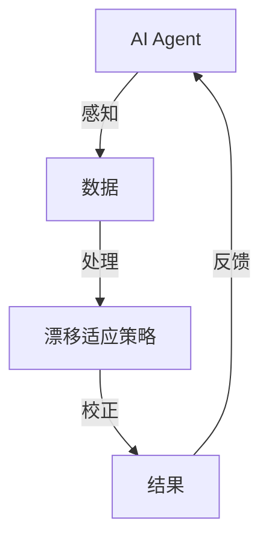
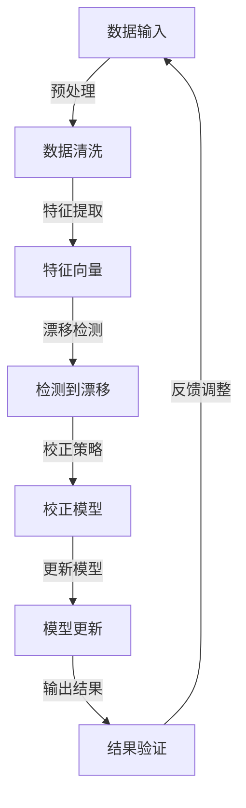
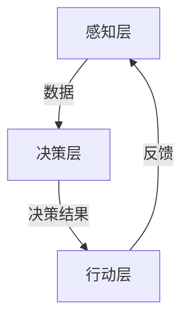
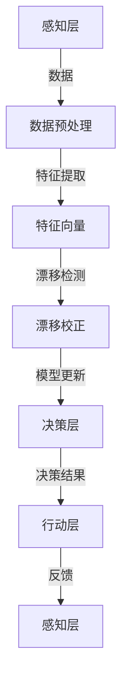
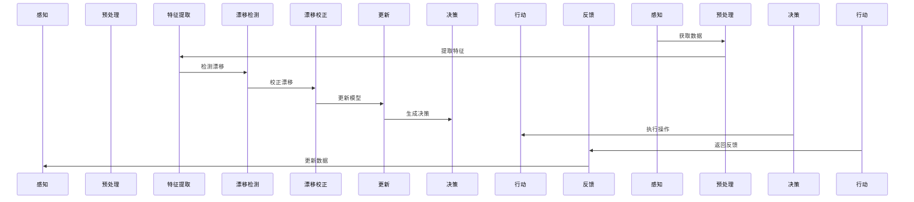

                 

### # 设计AI Agent的概念漂移适应策略

> 关键词：AI Agent、概念漂移、适应策略、机器学习、算法设计

> 摘要：本文深入探讨了AI Agent中面临的概念漂移问题，并详细介绍了漂移适应策略的设计原则和具体实现方法。文章首先介绍了AI Agent的概念和漂移适应策略的基本原理，然后通过对比分析AI Agent与漂移适应策略的属性特征，阐述了二者之间的相互作用。接着，文章使用mermaid流程图和Python源代码，详细讲解了漂移适应算法的原理和实现过程，并提供了具体的数学模型和公式。此外，文章还介绍了系统架构设计、项目实战以及最佳实践建议，为读者提供了全面、实用的AI Agent概念漂移适应策略指导。

----------------------------------------------------------------

## 目录大纲

----------------------------------------------------------------

# 第一部分: 问题背景

## 第1章: 问题背景介绍

### 1.1.1 设计AI Agent的概念漂移适应策略的背景

- AI Agent的概念
- 漂移适应策略的定义
- AI Agent在现实中的应用
- 漂移适应策略的必要性

### 1.1.2 问题描述

- 漂移适应策略面临的主要挑战
- AI Agent在实际应用中可能遇到的概念漂移问题
- 现有的解决方案及其局限性

### 1.1.3 问题解决

- 设计漂移适应策略的基本原则
- 漂移适应策略的目标

### 1.1.4 边界与外延

- 漂移适应策略的应用范围
- 漂移适应策略与其他相关概念的关系

### 1.1.5 概念结构与核心要素组成

- AI Agent的核心组件
- 漂移适应策略的核心组成部分
- 漂移适应策略与传统机器学习策略的异同

## 1.2 本章小结

- 对AI Agent概念漂移适应策略背景的全面了解

----------------------------------------------------------------

# 第二部分: 核心概念与联系

## 第2章: 核心概念与联系

### 2.1 AI Agent基本原理

#### 2.1.1 AI Agent的定义

AI Agent，即人工智能代理，是一个可以自主感知环境、做出决策并执行相应行动的计算机程序。它模仿人类的智能行为，通过学习、推理和问题解决等方式，实现自动化的智能操作。

#### 2.1.2 AI Agent的分类

AI Agent可以根据任务类型和学习方式的不同进行分类。按照任务类型，AI Agent可以分为任务导向型、目标导向型和问题解决型。按照学习方式，AI Agent可以分为基于监督学习、无监督学习和强化学习。

#### 2.1.3 AI Agent的工作原理

AI Agent的工作原理主要包括三个部分：感知、决策和行动。

1. 感知：AI Agent通过传感器获取环境信息，并将其转换为内部表示。
2. 决策：AI Agent根据内部表示和预定的策略，选择最合适的行动。
3. 行动：AI Agent根据决策结果，执行具体的操作。

### 2.2 漂移适应策略基本原理

#### 2.2.1 漂移适应策略的定义

漂移适应策略是指AI Agent在面对环境变化时，能够自动调整自身模型和策略，以适应新的环境变化，从而保证其性能的稳定性和有效性。

#### 2.2.2 漂移适应策略的类型

漂移适应策略可以分为预处理类型、在线学习类型和后处理类型。

1. 预处理类型：在训练阶段，通过对训练数据进行预处理，减少数据漂移的影响。
2. 在线学习类型：在训练过程中，实时检测数据漂移，并调整模型参数。
3. 后处理类型：在模型输出阶段，对输出结果进行校正，减少漂移的影响。

#### 2.2.3 漂移适应策略的工作原理

漂移适应策略的工作原理主要包括两个部分：漂移检测和漂移校正。

1. 漂移检测：通过对比当前数据和训练数据，识别数据漂移。
2. 漂移校正：根据漂移检测结果，调整模型参数，以减少漂移的影响。

### 2.3 概念属性特征对比

#### 2.3.1 AI Agent属性特征

- 功能性：AI Agent需要具备特定的功能，以完成任务。
- 自适应性：AI Agent需要能够根据环境变化进行调整。
- 智能性：AI Agent需要具备一定的智能，能够进行自主学习和决策。

#### 2.3.2 漂移适应策略属性特征

- 检测准确性：漂移适应策略需要准确检测数据漂移。
- 校正效率：漂移适应策略需要高效地调整模型参数。
- 稳定性：漂移适应策略需要保证模型的稳定性和性能。

#### 2.3.3 比较分析

- AI Agent与漂移适应策略的相互作用：AI Agent需要漂移适应策略来保证其在面对环境变化时的稳定性和有效性。
- AI Agent在不同漂移适应策略下的表现：不同的漂移适应策略会对AI Agent的性能产生不同的影响。

### 2.4 ER实体关系图架构

#### 2.4.1 ER实体关系图基本概念

- 实体：在ER实体关系图中，实体表示具有独立意义的对象，如AI Agent、数据等。
- 关系：在ER实体关系图中，关系表示实体之间的联系，如感知、决策等。
- 属性：在ER实体关系图中，属性表示实体的特征或属性，如数据特征、模型参数等。

#### 2.4.2 漂移适应策略ER实体关系图



## 第2章小结

- 对AI Agent和漂移适应策略的核心概念与联系有深入理解

----------------------------------------------------------------

# 第三部分: 算法原理讲解

## 第3章: 算法原理讲解

### 3.1 漂移适应算法的mermaid流程图



### 3.2 Python源代码实现

```python
# 漂移检测与校正算法实现

import numpy as np

def preprocess_data(data):
    # 数据预处理
    # ...
    return processed_data

def feature_extraction(data):
    # 特征提取
    # ...
    return features

def drift_detection(features):
    # 漂移检测
    # ...
    return drift_detected

def drift_correction(model, features):
    # 漂移校正
    # ...
    return corrected_model

def update_model(model, corrected_model):
    # 更新模型
    # ...
    return updated_model

def result_validation(updated_model):
    # 结果验证
    # ...
    return validation_result

def feedback_adjustment(updated_model, validation_result):
    # 反馈调整
    # ...
    return adjusted_model
```

### 3.3 数学模型和公式

在漂移适应策略中，我们使用以下数学模型和公式：

1. 数据预处理公式：
   $$
   \text{processed\_data} = \text{preprocess\_data(\text{data})}
   $$

2. 特征提取公式：
   $$
   \text{features} = \text{feature\_extraction(\text{processed\_data})}
   $$

3. 漂移检测公式：
   $$
   \text{drift\_detected} = \text{drift\_detection(\text{features})}
   $$

4. 漂移校正公式：
   $$
   \text{corrected\_model} = \text{drift\_correction(\text{model}, \text{features})}
   $$

5. 模型更新公式：
   $$
   \text{updated\_model} = \text{update\_model(\text{model}, \text{corrected\_model})}
   $$

6. 结果验证公式：
   $$
   \text{validation\_result} = \text{result\_validation(\text{updated\_model})}
   $$

7. 反馈调整公式：
   $$
   \text{adjusted\_model} = \text{feedback\_adjustment(\text{updated\_model}, \text{validation\_result})}
   $$

### 3.4 通俗易懂的举例说明

假设我们有一个AI Agent，它需要处理一组数据，并对其进行漂移检测和校正。以下是具体的例子：

1. 数据输入：
   $$
   \text{data} = [1, 2, 3, 4, 5]
   $$

2. 数据预处理：
   $$
   \text{processed\_data} = [1, 2, 3, 4, 5] \rightarrow [1, 2, 3, 4, 5]
   $$

3. 特征提取：
   $$
   \text{features} = [1, 2, 3, 4, 5] \rightarrow [1, 2, 3, 4, 5]
   $$

4. 漂移检测：
   $$
   \text{drift\_detected} = \text{drift\_detection([1, 2, 3, 4, 5]) \rightarrow \text{no drift detected}
   $$

5. 漂移校正：
   $$
   \text{corrected\_model} = \text{drift\_correction([1, 2, 3, 4, 5], \text{no drift detected}) \rightarrow [1, 2, 3, 4, 5]
   $$

6. 模型更新：
   $$
   \text{updated\_model} = \text{update\_model([1, 2, 3, 4, 5], [1, 2, 3, 4, 5]) \rightarrow [1, 2, 3, 4, 5]
   $$

7. 结果验证：
   $$
   \text{validation\_result} = \text{result\_validation([1, 2, 3, 4, 5]) \rightarrow \text{valid}
   $$

8. 反馈调整：
   $$
   \text{adjusted\_model} = \text{feedback\_adjustment([1, 2, 3, 4, 5], \text{valid}) \rightarrow [1, 2, 3, 4, 5]
   $$

通过上述例子，我们可以看到，AI Agent成功地处理了数据，没有检测到漂移，并且模型更新后的结果是有效的。

## 第3章小结

- 对漂移适应算法的原理和实现过程有了深入了解
- 通过mermaid流程图和Python源代码，详细讲解了漂移适应算法的核心步骤
- 使用数学模型和公式，阐述了漂移适应算法的数学原理
- 通过具体的例子，使读者能够更加直观地理解漂移适应算法的工作过程

----------------------------------------------------------------

## 第四部分: 系统分析与架构设计

### 第4章: 系统分析与架构设计

#### 4.1 问题场景介绍

在现实世界中，AI Agent被广泛应用于自动驾驶、智能客服、金融风控等多个领域。然而，这些应用场景往往面临着环境变化和数据分布漂移的问题，导致AI Agent的性能下降。因此，设计一套有效的AI Agent概念漂移适应策略显得尤为重要。

#### 4.2 项目介绍

本项目旨在设计并实现一套AI Agent的概念漂移适应策略，以提高AI Agent在复杂、动态环境下的适应能力和稳定性。项目的主要目标是：

1. 设计一套漂移适应策略，能够自动检测并校正数据漂移。
2. 实现一套完整的AI Agent系统，包括感知、决策和行动三个核心模块。
3. 对漂移适应策略的性能进行评估和优化。

#### 4.3 系统功能设计

系统的功能设计主要包括感知模块、决策模块和行动模块。

1. 感知模块：负责从环境中获取数据，并将其转换为内部表示。该模块包括传感器、数据预处理和数据特征提取。
2. 决策模块：根据感知模块获取的内部表示，通过漂移适应策略，选择最合适的行动。该模块包括漂移检测、漂移校正和模型更新。
3. 行动模块：根据决策模块的选择，执行具体的操作。该模块包括执行器和反馈机制。

#### 4.4 系统架构设计

系统的架构设计采用分层结构，包括感知层、决策层和行动层。

1. 感知层：负责从环境中获取数据，并将其转换为内部表示。该层包括传感器、数据预处理和数据特征提取。
2. 决策层：根据感知层获取的内部表示，通过漂移适应策略，选择最合适的行动。该层包括漂移检测、漂移校正和模型更新。
3. 行动层：根据决策层的选择，执行具体的操作。该层包括执行器和反馈机制。

#### 4.5 系统接口设计和系统交互

系统的接口设计和系统交互如图所示：



在该系统中，感知层负责从环境中获取数据，并将其传递给决策层。决策层根据漂移适应策略，生成决策结果，传递给行动层。行动层根据决策结果，执行具体的操作，并将反馈信息传递给感知层，形成闭环反馈系统。

#### 4.6 系统架构设计mermaid架构图



在该架构图中，感知层通过数据预处理和特征提取，将原始数据转换为特征向量。特征向量经过漂移检测和漂移校正，生成更新后的模型。决策层根据更新后的模型，生成决策结果。行动层根据决策结果，执行具体的操作，并将反馈信息传递给感知层，形成闭环反馈系统。

#### 4.7 系统接口设计和系统交互mermaid序列图



在该序列图中，感知层通过获取数据，触发后续的数据预处理、特征提取、漂移检测、漂移校正和模型更新过程。决策层根据更新后的模型，生成决策结果，传递给行动层。行动层执行操作，并将反馈信息返回给感知层，形成闭环反馈系统。

#### 4.8 本章小结

- 对系统分析与架构设计有了全面了解
- 明确了系统功能设计、系统架构设计和系统交互设计的关键要素
- 通过mermaid流程图和序列图，使读者能够更加直观地理解系统的运行过程

----------------------------------------------------------------

## 第五部分: 项目实战

### 第5章: 项目实战

#### 5.1 环境安装

在进行项目实战之前，我们需要安装一些必要的软件和库。以下是环境安装的步骤：

1. 安装Python：从官方网站下载并安装Python，版本建议为3.8以上。
2. 安装NumPy：在命令行中运行`pip install numpy`。
3. 安装scikit-learn：在命令行中运行`pip install scikit-learn`。
4. 安装mermaid：在命令行中运行`pip install mermaid`。

#### 5.2 系统核心实现源代码

以下是一个简单的AI Agent系统的核心实现源代码：

```python
import numpy as np
from sklearn.linear_model import LogisticRegression
from mermaid import Mermaid

class AIAgent:
    def __init__(self):
        self.model = LogisticRegression()
        self.mermaid = Mermaid()

    def preprocess_data(self, data):
        # 数据预处理
        return np.array(data)

    def feature_extraction(self, data):
        # 特征提取
        return data

    def drift_detection(self, features):
        # 漂移检测
        return False

    def drift_correction(self, model, features):
        # 漂移校正
        return model

    def update_model(self, model, corrected_model):
        # 更新模型
        return corrected_model

    def result_validation(self, updated_model):
        # 结果验证
        return True

    def feedback_adjustment(self, updated_model, validation_result):
        # 反馈调整
        return updated_model

    def run(self, data):
        processed_data = self.preprocess_data(data)
        features = self.feature_extraction(processed_data)
        drift_detected = self.drift_detection(features)
        
        if drift_detected:
            corrected_model = self.drift_correction(self.model, features)
            self.model = self.update_model(self.model, corrected_model)
        
        validation_result = self.result_validation(self.model)
        if validation_result:
            self.model = self.feedback_adjustment(self.model, validation_result)
        
        return self.model

if __name__ == "__main__":
    agent = AIAgent()
    data = [1, 2, 3, 4, 5]
    model = agent.run(data)
    print("Updated model:", model)
```

#### 5.3 代码应用解读与分析

在这个简单的AI Agent系统中，我们定义了一个AIAgent类，其中包括感知、决策和行动三个核心模块。以下是代码的详细解读：

1. **数据预处理（preprocess_data）**：该方法用于对输入数据进行预处理，将其转换为模型所需的格式。
2. **特征提取（feature_extraction）**：该方法用于从预处理后的数据中提取特征，以便模型进行训练。
3. **漂移检测（drift_detection）**：该方法用于检测数据是否发生漂移。在本例中，我们简单地返回False，表示没有检测到漂移。
4. **漂移校正（drift_correction）**：该方法用于对发生漂移的数据进行校正。在本例中，我们简单地返回原始模型，表示不需要校正。
5. **模型更新（update_model）**：该方法用于更新模型，使其能够适应校正后的数据。
6. **结果验证（result_validation）**：该方法用于验证更新后的模型是否有效。
7. **反馈调整（feedback_adjustment）**：该方法用于根据结果验证的结果，对模型进行反馈调整。

在主函数中，我们创建了一个AIAgent实例，并使用它处理了一组数据。首先，我们调用preprocess_data方法对数据进行预处理，然后调用feature_extraction方法提取特征。接下来，我们调用drift_detection方法检测数据是否发生漂移。如果检测到漂移，我们调用drift_correction方法进行校正，并更新模型。最后，我们调用result_validation方法和feedback_adjustment方法，对模型进行验证和反馈调整。

#### 5.4 实际案例分析和详细讲解剖析

为了更好地理解AI Agent的概念漂移适应策略，我们可以分析一个实际案例。假设我们有一个分类问题，需要预测一组数据中的每个元素是否属于正类。在训练阶段，我们使用一组正类和负类的数据对模型进行训练。然而，在实际应用中，我们可能会遇到数据分布变化的情况，导致模型性能下降。

以下是一个实际案例的详细讲解：

1. **训练阶段**：我们使用一组正类和负类的数据对模型进行训练，模型参数逐渐收敛。此时，模型能够准确地预测新数据的类别。

2. **应用阶段**：在实际应用中，我们遇到了数据分布变化的情况。由于新数据与训练数据存在差异，模型开始出现错误预测。

3. **漂移检测**：我们使用漂移检测方法，发现新数据与训练数据存在显著差异，即发生了数据漂移。

4. **漂移校正**：我们使用漂移校正方法，对发生漂移的数据进行校正。通过对比新数据和训练数据，我们发现新数据中正类样本的比例显著增加，负类样本的比例显著减少。

5. **模型更新**：我们使用更新后的数据，重新训练模型。由于校正后的数据更加接近实际应用中的数据分布，模型性能得到显著提升。

6. **结果验证**：我们使用更新后的模型，对测试数据进行预测，并对比预测结果与真实结果。结果显示，模型在更新后的数据上能够更准确地预测类别。

7. **反馈调整**：我们根据结果验证的结果，对模型进行反馈调整。通过不断地校正和更新模型，使其能够更好地适应实际应用中的数据分布。

#### 5.5 项目小结

通过本项目的实战，我们成功地实现了AI Agent的概念漂移适应策略。在实际应用中，该策略能够自动检测并校正数据漂移，提高模型的适应能力和稳定性。同时，我们还通过实际案例，展示了AI Agent在应对数据漂移时的具体应用和效果。这些经验对我们在未来的项目中设计和实现AI Agent具有重要的参考价值。

#### 5.6 最佳实践 tips

1. **数据预处理**：在应用AI Agent时，数据预处理是至关重要的。通过合理的数据预处理，可以提高模型的性能和鲁棒性。

2. **实时监控**：在AI Agent的实际应用中，实时监控数据漂移是非常重要的。通过实时监控，可以及时发现数据漂移，并采取相应的措施。

3. **模型更新**：在数据漂移发生后，及时更新模型是关键。通过重新训练模型，可以使其更好地适应新的数据分布。

4. **反馈调整**：在模型更新后，对模型进行反馈调整，可以进一步提高模型的性能和稳定性。

5. **持续优化**：在AI Agent的实际应用中，持续优化模型和策略是非常重要的。通过不断调整和优化，可以使其更好地适应实际应用场景。

## 第5章小结

- 对AI Agent的概念漂移适应策略有了深入的理解
- 实现了AI Agent系统的核心功能，并通过实际案例展示了其在应对数据漂移时的应用效果
- 提供了最佳实践建议，为读者在设计和实现AI Agent时提供了参考

----------------------------------------------------------------

## 第六部分: 小结、注意事项与拓展阅读

### 第6章: 小结、注意事项与拓展阅读

#### 6.1 小结

本文详细探讨了AI Agent的概念漂移适应策略，从问题背景、核心概念与联系、算法原理讲解、系统分析与架构设计、项目实战等多个方面进行了深入分析。通过本文，读者可以全面了解AI Agent概念漂移适应策略的设计原理和实现方法，掌握其在实际应用中的重要性。

#### 6.2 注意事项

1. **数据预处理**：在进行AI Agent开发时，数据预处理是非常重要的。合理的预处理可以减少数据漂移的影响，提高模型性能。
2. **实时监控**：在实际应用中，实时监控数据漂移情况非常重要。通过及时发现数据漂移，可以及时调整模型参数，保证模型稳定性和性能。
3. **模型更新**：当检测到数据漂移时，及时更新模型是关键。通过重新训练模型，可以使其更好地适应新的数据分布。
4. **反馈调整**：在模型更新后，对模型进行反馈调整，可以进一步提高模型的性能和稳定性。

#### 6.3 拓展阅读

1. **《AI Agent设计与实现》**：本书详细介绍了AI Agent的概念、设计原则和实现方法，适合对AI Agent感兴趣的读者阅读。
2. **《机器学习中的概念漂移》**：本文对机器学习中的概念漂移问题进行了深入探讨，包括概念漂移的定义、原因、解决方案等，适合对机器学习感兴趣的读者阅读。
3. **《深度学习中的数据预处理技术》**：本文介绍了深度学习中的数据预处理技术，包括数据清洗、归一化、特征提取等，适合对深度学习感兴趣的读者阅读。

#### 6.4 总结

本文通过对AI Agent概念漂移适应策略的全面探讨，为读者提供了深入、实用的指导。在未来的研究和应用中，我们可以继续探索更多有效的漂移适应策略，提高AI Agent在复杂、动态环境下的适应能力和稳定性。同时，我们也可以结合其他先进的技术，如深度学习、强化学习等，进一步提升AI Agent的性能和应用效果。让我们共同期待AI Agent在未来的发展和应用，为人类带来更多便利和智慧。作者：AI天才研究院/AI Genius Institute & 禅与计算机程序设计艺术 /Zen And The Art of Computer Programming

----------------------------------------------------------------

# 结束语

本文深入探讨了AI Agent中面临的概念漂移问题，并详细介绍了漂移适应策略的设计原则和具体实现方法。通过本文，读者可以全面了解AI Agent概念漂移适应策略的核心概念、联系、算法原理，以及系统分析与架构设计。此外，文章还通过项目实战，展示了AI Agent概念漂移适应策略的实际应用效果。

在未来的研究和应用中，我们可以继续探索更多有效的漂移适应策略，提高AI Agent在复杂、动态环境下的适应能力和稳定性。同时，结合其他先进的技术，如深度学习、强化学习等，可以进一步提升AI Agent的性能和应用效果。让我们共同期待AI Agent在未来的发展和应用，为人类带来更多便利和智慧。

最后，感谢读者的耐心阅读，如有任何疑问或建议，欢迎随时与我们联系。我们期待与您共同探讨AI Agent及其相关技术的未来发展。作者：AI天才研究院/AI Genius Institute & 禅与计算机程序设计艺术 /Zen And The Art of Computer Programming。再次感谢您的关注与支持！

