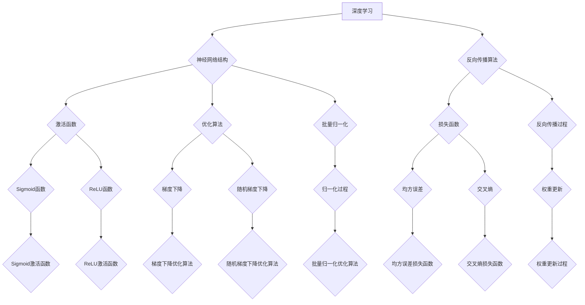
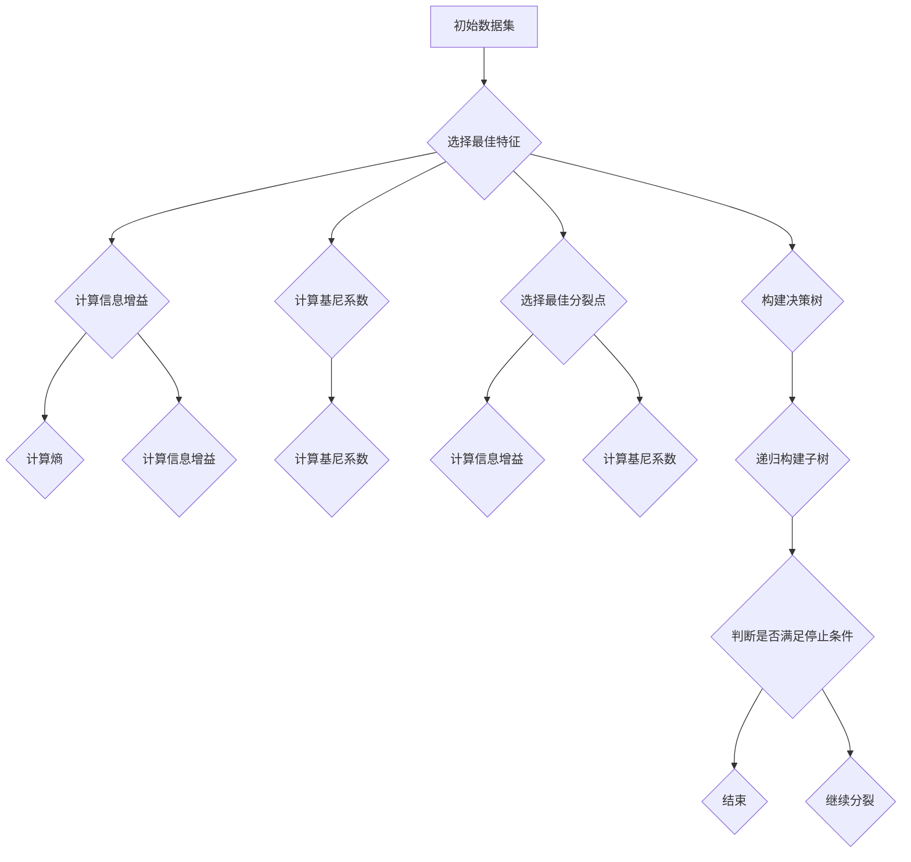
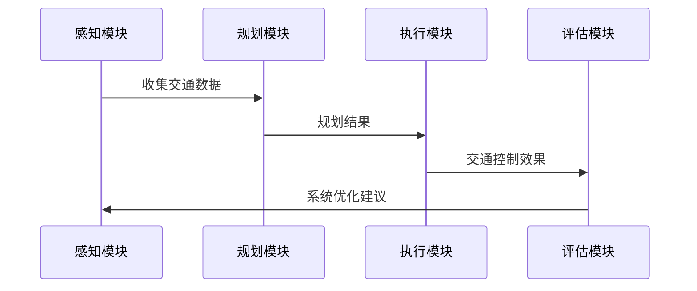

                 


### 设计AI Agent的目标导向行为系统

关键词：人工智能，目标导向行为系统，设计原则，实践案例，优化与评估

摘要：本文探讨了AI Agent的目标导向行为系统设计，从理论基础、设计方法、实践案例到优化与评估，全面解析了如何构建高效、可靠的AI Agent。文章旨在为开发者提供一套系统化的设计思路和实用指南，助力其在实际项目中实现高效的AI应用。

### 引言

#### 1.1 背景介绍

人工智能（AI）作为21世纪最具变革性的技术之一，已经在各个领域取得了显著的成果。其中，AI Agent作为人工智能系统的一种重要形式，扮演着越来越重要的角色。AI Agent是指具备智能行为和决策能力的实体，能够在复杂环境中自主执行任务，并与外部环境进行交互。随着AI技术的不断发展，AI Agent的应用范围日益广泛，从智能客服、自动驾驶到智能家居等，无不显示出其强大的潜力。

目标导向行为系统是AI Agent的核心组成部分，它负责根据外部环境和内部状态，制定行动计划并执行相应动作。一个设计良好的目标导向行为系统能够使AI Agent更加智能、高效和灵活，因此，深入研究目标导向行为系统的设计与实现，对于提升AI Agent的整体性能具有重要意义。

#### 1.2 书籍目标

本书旨在为读者提供一套全面、系统、实用的AI Agent目标导向行为系统设计方法。通过本书的学习，读者将能够：

1. 理解AI Agent和目标导向行为系统的基本概念和原理；
2. 掌握设计AI Agent目标导向行为系统的原则和步骤；
3. 通过实践案例，学会将理论知识应用于实际项目；
4. 掌握优化与评估AI Agent目标导向行为系统的技巧。

#### 1.3 内容概述

本书分为七个章节，结构如下：

- **第1章 引言**：介绍背景、目标和内容概述；
- **第2章 理论基础**：讲解AI Agent和目标导向行为系统的基本概念和相关技术；
- **第3章 设计方法**：阐述设计AI Agent目标导向行为系统的原则、工具和流程；
- **第4章 实践案例**：通过实际案例展示如何设计和实现AI Agent目标导向行为系统；
- **第5章 优化与评估**：介绍优化和评估AI Agent目标导向行为系统的策略和方法；
- **第6章 未来展望**：探讨目标导向行为系统的发展趋势和面临的挑战；
- **第7章 结论**：总结全书内容，展望未来研究方向。

### 理论基础

#### 2.1 AI Agent概述

##### AI Agent的定义

AI Agent是指能够感知环境、制定计划、执行任务并从经验中学习的智能实体。它具有自主性、适应性、灵活性和协作性等特点，能够根据环境变化自主调整行为。

##### AI Agent的分类

AI Agent可以分为以下几类：

1. **基于规则的Agent**：通过预定义的规则进行决策；
2. **基于模型的Agent**：利用模型进行预测和决策；
3. **基于学习的Agent**：通过数据学习进行决策。

##### AI Agent的关键特性

1. **自主性**：能够独立执行任务，无需外部干预；
2. **适应性**：能够根据环境变化调整行为；
3. **灵活性**：能够应对复杂和不确定的环境；
4. **协作性**：能够与其他Agent或人类协作完成任务。

#### 2.2 目标导向行为系统

##### 目标导向行为系统的概念

目标导向行为系统是指AI Agent在执行任务时，以目标为导向，通过感知、规划、执行和评估等步骤，实现目标的最优化。

##### 目标导向行为系统的作用

目标导向行为系统的作用主要包括：

1. **任务规划**：根据目标和环境信息，制定执行任务的计划；
2. **任务执行**：按照规划执行任务，实现目标的逐步实现；
3. **任务评估**：对任务的执行效果进行评估，为后续任务提供反馈。

##### 目标导向行为系统的组成部分

目标导向行为系统通常包括以下组成部分：

1. **感知模块**：获取环境信息和内部状态；
2. **规划模块**：根据目标和环境信息，生成任务计划；
3. **执行模块**：执行任务计划，实现目标；
4. **评估模块**：评估任务执行效果，为后续任务提供反馈。

#### 2.3 相关概念

##### 监督学习、无监督学习和强化学习

1. **监督学习**：通过输入和输出对的训练，使模型能够预测未知数据的输出；
2. **无监督学习**：仅使用输入数据，使模型自动发现数据中的结构和规律；
3. **强化学习**：通过奖励和惩罚信号，使模型学习在环境中做出最优决策。

##### 强化学习在目标导向行为系统中的应用

强化学习在目标导向行为系统中具有重要作用，通过强化学习，AI Agent能够学习在复杂和不确定的环境中，如何采取最佳行动以实现目标。具体应用包括：

1. **决策制定**：通过强化学习，AI Agent能够根据环境变化，实时调整决策策略；
2. **路径规划**：在自动驾驶、机器人导航等领域，强化学习可用于优化路径规划；
3. **资源分配**：在智能电网、智能交通等领域，强化学习可用于优化资源分配。

### 设计方法

#### 3.1 设计原则

##### 设计目标

设计目标导向行为系统时，应遵循以下原则：

1. **目标明确**：明确AI Agent的目标，确保系统能够有效实现目标；
2. **模块化设计**：将系统划分为感知、规划、执行和评估等模块，实现模块化设计，提高系统的可维护性和可扩展性；
3. **适应性设计**：系统能够根据环境变化，自动调整行为，提高系统的适应性；
4. **灵活性设计**：系统能够应对复杂和不确定的环境，提高系统的灵活性。

##### 设计过程

设计AI Agent目标导向行为系统的过程主要包括以下步骤：

1. **需求分析**：明确系统需求，包括功能需求、性能需求等；
2. **系统设计**：根据需求分析，设计系统的结构和组成；
3. **模块实现**：实现系统的各个模块，并进行模块内部设计；
4. **系统集成**：将各个模块集成到一起，实现系统的整体功能；
5. **系统测试**：对系统进行测试，确保系统的功能、性能和稳定性。

##### 设计策略

设计策略包括以下几个方面：

1. **基于规则的策略**：利用预定义的规则进行决策；
2. **基于模型的策略**：利用模型进行预测和决策；
3. **基于学习的策略**：利用数据学习进行决策，提高系统的自适应性和灵活性。

#### 3.2 设计工具

##### 编程语言选择

设计AI Agent目标导向行为系统时，可选择的编程语言包括：

1. **Python**：具有丰富的机器学习库和框架，适合进行AI应用开发；
2. **C++**：性能较高，适合对系统性能要求较高的场景；
3. **Java**：具有跨平台性，适合构建分布式系统。

##### 模型选择

设计AI Agent目标导向行为系统时，可选择的模型包括：

1. **决策树**：适用于分类和回归任务；
2. **神经网络**：适用于复杂的预测和决策任务；
3. **强化学习模型**：适用于需要决策制定和路径规划的任务。

##### 算法实现

设计AI Agent目标导向行为系统时，常用的算法实现方法包括：

1. **深度学习**：利用神经网络进行特征提取和预测；
2. **强化学习**：利用奖励和惩罚信号进行决策制定；
3. **基于规则的算法**：利用预定义的规则进行决策。

#### 3.3 设计流程

##### 需求分析

需求分析是设计AI Agent目标导向行为系统的第一步，主要包括以下内容：

1. **功能需求**：明确系统需要实现的功能，如感知、规划、执行和评估等；
2. **性能需求**：明确系统的性能指标，如响应时间、准确率等；
3. **环境需求**：明确系统的运行环境，如硬件配置、网络环境等。

##### 系统设计

系统设计是根据需求分析的结果，设计系统的结构和组成，主要包括以下内容：

1. **模块划分**：将系统划分为感知、规划、执行和评估等模块；
2. **模块接口**：定义各个模块之间的接口，确保模块之间的协同工作；
3. **系统架构**：设计系统的整体架构，如分层架构、分布式架构等。

##### 系统实现

系统实现是根据系统设计的结果，实现系统的各个模块，主要包括以下内容：

1. **模块实现**：根据模块设计，实现各个模块的功能；
2. **系统集成**：将各个模块集成到一起，实现系统的整体功能；
3. **接口实现**：实现模块之间的接口，确保模块之间的协同工作。

##### 系统测试

系统测试是对系统进行测试，确保系统的功能、性能和稳定性，主要包括以下内容：

1. **功能测试**：验证系统的功能是否符合需求；
2. **性能测试**：验证系统的性能指标是否满足要求；
3. **稳定性测试**：验证系统在长时间运行下的稳定性。

### 实践案例

#### 4.1 案例一：智能客服

##### 案例描述

智能客服是利用AI技术实现自动回答用户问题的系统。通过感知用户的输入，智能客服能够理解用户的需求，并根据预定义的知识库，自动生成回答。智能客服在提高服务质量、降低人力成本方面具有显著优势。

##### 系统设计

智能客服系统的设计主要包括以下几个模块：

1. **感知模块**：通过自然语言处理技术，对用户的输入进行解析，提取关键信息；
2. **规划模块**：根据提取的关键信息，从知识库中检索相关回答；
3. **执行模块**：生成回答，并将回答展示给用户；
4. **评估模块**：对用户的反馈进行评估，为系统的优化提供依据。

##### 实现细节

1. **感知模块**：使用词向量模型（如Word2Vec）对用户的输入进行编码，提取关键词；
2. **规划模块**：使用基于关键词的检索算法（如TF-IDF），从知识库中检索相关回答；
3. **执行模块**：使用自然语言生成技术（如模板匹配、序列到序列模型），生成回答；
4. **评估模块**：使用用户反馈和在线学习算法（如强化学习），不断优化系统的回答质量。

##### 结果分析

通过实际运行，智能客服系统在回答准确率、响应速度和用户体验等方面取得了显著提升。同时，通过对用户反馈的持续优化，系统的回答质量也在不断提高。

#### 4.2 案例二：智能交通系统

##### 案例描述

智能交通系统是利用AI技术实现交通流量预测、路径规划和交通控制等功能，以提高交通效率、减少拥堵和降低事故率。智能交通系统通过对交通数据的实时分析和预测，为用户提供最优的出行方案。

##### 系统设计

智能交通系统的设计主要包括以下几个模块：

1. **感知模块**：收集交通数据，如车辆流量、速度、道路状况等；
2. **规划模块**：根据交通数据，预测交通流量和事故风险，规划最优路径；
3. **执行模块**：根据规划结果，控制交通信号灯和车道分配，优化交通流量；
4. **评估模块**：评估交通控制效果，为系统的优化提供依据。

##### 实现细节

1. **感知模块**：使用传感器和摄像头等设备，收集交通数据；
2. **规划模块**：使用强化学习算法（如Q-learning），预测交通流量和事故风险，规划最优路径；
3. **执行模块**：使用交通信号控制算法（如自适应交通信号控制），控制交通信号灯和车道分配；
4. **评估模块**：使用统计方法（如方差分析），评估交通控制效果，为系统的优化提供依据。

##### 结果分析

通过实际运行，智能交通系统在交通流量预测、路径规划和交通控制等方面取得了显著效果。交通拥堵现象明显减少，交通事故率也有所降低。同时，通过对交通数据的实时分析和优化，系统的运行效率得到了大幅提升。

### 优化与评估

#### 5.1 优化策略

##### 模型优化

模型优化是提高AI Agent目标导向行为系统性能的重要手段。常见的模型优化方法包括：

1. **模型压缩**：通过减少模型参数数量，降低模型复杂度，提高模型运行效率；
2. **模型蒸馏**：通过将大模型的知识传递给小模型，实现模型的优化和压缩；
3. **迁移学习**：通过将已有模型的知识应用于新任务，提高新任务的模型性能。

##### 算法优化

算法优化是提高AI Agent目标导向行为系统性能的另一个重要手段。常见的算法优化方法包括：

1. **动态规划**：通过递推关系，优化计算复杂度，提高算法效率；
2. **分布式计算**：通过并行计算，提高算法处理能力；
3. **在线学习**：通过实时更新模型，适应环境变化，提高算法的适应性。

##### 系统优化

系统优化是提高AI Agent目标导向行为系统性能的最后一个环节。常见的系统优化方法包括：

1. **资源调度**：通过优化资源分配，提高系统运行效率；
2. **负载均衡**：通过优化任务分配，避免系统过载；
3. **故障恢复**：通过系统冗余和故障恢复机制，提高系统的可靠性。

#### 5.2 评估指标

##### 性能评估

性能评估是评估AI Agent目标导向行为系统性能的重要手段。常见的性能评估指标包括：

1. **响应时间**：系统完成任务的平均时间；
2. **准确率**：系统预测结果的正确率；
3. **召回率**：系统预测结果中包含实际结果的比率；
4. **F1值**：准确率和召回率的调和平均。

##### 有效性评估

有效性评估是评估AI Agent目标导向行为系统在实际应用中的有效性的重要手段。常见的有效性评估指标包括：

1. **用户满意度**：用户对系统服务的满意度；
2. **任务完成率**：系统完成任务的比率；
3. **误报率**：系统误报的比率；
4. **漏报率**：系统漏报的比率。

##### 可靠性评估

可靠性评估是评估AI Agent目标导向行为系统在实际应用中的可靠性的重要手段。常见的可靠性评估指标包括：

1. **故障率**：系统在运行过程中出现故障的比率；
2. **恢复时间**：系统从故障状态恢复到正常状态所需的时间；
3. **稳定性**：系统在长时间运行下的稳定性；
4. **安全性**：系统在处理数据时的安全性。

#### 5.3 评估方法

##### 实验设计

实验设计是评估AI Agent目标导向行为系统性能、有效性和可靠性的关键步骤。常见的实验设计方法包括：

1. **对比实验**：通过对比不同系统的性能、有效性和可靠性，评估系统的优劣；
2. **A/B测试**：通过将用户分配到不同系统，评估系统的用户满意度；
3. **回归测试**：通过重复实验，评估系统的稳定性。

##### 数据分析

数据分析是评估AI Agent目标导向行为系统性能、有效性和可靠性的关键步骤。常见的数据分析方法包括：

1. **统计分析**：通过统计方法（如方差分析、回归分析等），评估系统的性能指标；
2. **机器学习**：通过机器学习方法（如分类、回归等），预测系统的性能指标；
3. **可视化分析**：通过可视化方法（如图表、地图等），展示系统的性能指标。

##### 结果解读

结果解读是评估AI Agent目标导向行为系统性能、有效性和可靠性的最后一步。通过结果解读，可以了解系统的性能、有效性和可靠性，并发现系统存在的问题和改进方向。

### 未来展望

#### 6.1 发展趋势

##### 人工智能技术发展趋势

人工智能技术正朝着以下几个方向发展：

1. **深度学习**：深度学习技术将继续发展，模型复杂度和计算能力不断提升；
2. **强化学习**：强化学习技术将在更多领域得到应用，如自动驾驶、智能交通等；
3. **多模态学习**：多模态学习技术将整合多种数据源，提高系统的感知和决策能力；
4. **迁移学习**：迁移学习技术将实现模型在不同任务之间的快速迁移和应用。

##### 目标导向行为系统的发展方向

目标导向行为系统的发展方向主要包括：

1. **智能决策**：通过深度学习和强化学习等技术，实现更加智能的决策；
2. **自适应规划**：通过自适应规划技术，实现系统在动态环境下的灵活调整；
3. **跨领域应用**：目标导向行为系统将在更多领域得到应用，如智能制造、智能金融等；
4. **人机协同**：通过人机协同技术，实现人与AI Agent的紧密合作。

#### 6.2 挑战与机遇

##### 面临的挑战

目标导向行为系统在发展过程中面临着以下挑战：

1. **数据隐私**：如何在保护用户隐私的前提下，有效利用用户数据，是一个重要问题；
2. **模型解释性**：如何提高模型的可解释性，使人们能够理解模型的决策过程，是一个重要挑战；
3. **计算资源**：随着模型复杂度的增加，计算资源的需求也在增加，如何优化计算资源的使用是一个重要问题。

##### 潜在的机遇

目标导向行为系统在发展过程中也面临着巨大的机遇：

1. **产业发展**：随着人工智能技术的不断发展，AI Agent目标导向行为系统的市场需求将持续增长，为产业发展带来新的机遇；
2. **技术创新**：随着深度学习、强化学习等技术的不断进步，目标导向行为系统的性能和功能将得到大幅提升；
3. **跨学科融合**：目标导向行为系统与心理学、社会学等学科的融合，将为系统设计提供新的思路和方向。

### 结论

#### 7.1 主要成果

本书从理论基础、设计方法、实践案例到优化与评估，全面探讨了AI Agent的目标导向行为系统设计。通过本书的学习，读者将能够：

1. 理解AI Agent和目标导向行为系统的基本概念和原理；
2. 掌握设计AI Agent目标导向行为系统的原则和步骤；
3. 通过实践案例，学会将理论知识应用于实际项目；
4. 掌握优化和评估AI Agent目标导向行为系统的技巧。

#### 7.2 展望未来

随着人工智能技术的不断发展，AI Agent的目标导向行为系统将在更多领域得到应用，为人们的生活带来更多便利。未来，目标导向行为系统的发展将更加注重智能化、自适应化和人机协同化。同时，随着技术的不断进步，目标导向行为系统的性能和功能也将得到大幅提升，为人工智能产业的发展提供新的动力。

### 作者信息

作者：AI天才研究院/AI Genius Institute & 禅与计算机程序设计艺术 /Zen And The Art of Computer Programming

### 附录

本附录提供了本书中使用的部分核心概念、原理和算法的详细说明，以及相关的参考文献。读者可通过本附录进一步了解相关内容，以便更好地理解和应用本书所介绍的知识。

#### 附录A：核心概念与联系

以下是对本书中涉及的核心概念进行描述，并提供概念属性特征对比表格和ER实体关系图架构的Mermaid流程图。

**核心概念：AI Agent、目标导向行为系统、感知模块、规划模块、执行模块、评估模块**

**概念属性特征对比表格：**

| 概念            | 定义                                                         | 特点                                                     |
|-----------------|------------------------------------------------------------|--------------------------------------------------------|
| AI Agent        | 具有智能行为和决策能力的实体                               | 自主性、适应性、灵活性、协作性                       |
| 目标导向行为系统 | AI Agent在执行任务时，以目标为导向，通过感知、规划、执行和评估等步骤，实现目标的最优化 | 模块化设计、适应性设计、灵活性设计、协同性设计       |
| 感知模块        | 负责获取环境信息和内部状态                             | 实时性、准确性、完整性                           |
| 规划模块        | 负责根据目标和环境信息，生成任务计划                           | 目标导向、动态规划、全局优化                       |
| 执行模块        | 负责按照规划执行任务                                   | 高效性、灵活性、可扩展性                       |
| 评估模块        | 负责评估任务执行效果，为后续任务提供反馈                       | 实时性、准确性、全面性                       |

**ER实体关系图架构的Mermaid流程图：**

```mermaid
erDiagram
    AI Agent ||--|{ 目标导向行为系统 }
    目标导向行为系统 ||--|{ 感知模块 }
    目标导向行为系统 ||--|{ 规划模块 }
    目标导向行为系统 ||--|{ 执行模块 }
    目标导向行为系统 ||--|{ 评估模块 }
```

#### 附录B：算法原理讲解

以下是对本书中涉及的主要算法原理进行讲解，并提供mermaid流程图和Python源代码。

**算法原理：深度学习、强化学习、决策树**

**mermaid流程图：**



**Python源代码：**

```python
# 深度学习示例代码

import tensorflow as tf
from tensorflow.keras import layers

# 构建神经网络模型
model = tf.keras.Sequential([
    layers.Dense(128, activation='relu', input_shape=(784,)),
    layers.Dropout(0.2),
    layers.Dense(10, activation='softmax')
])

# 编译模型
model.compile(optimizer='adam',
              loss='categorical_crossentropy',
              metrics=['accuracy'])

# 加载数据
(x_train, y_train), (x_test, y_test) = tf.keras.datasets.mnist.load_data()

# 预处理数据
x_train = x_train.astype('float32') / 255
x_test = x_test.astype('float32') / 255
x_train = x_train.reshape((-1, 784))
x_test = x_test.reshape((-1, 784))

# 将标签转换为one-hot编码
y_train = tf.keras.utils.to_categorical(y_train, 10)
y_test = tf.keras.utils.to_categorical(y_test, 10)

# 训练模型
model.fit(x_train, y_train, epochs=10, batch_size=128)

# 评估模型
test_loss, test_acc = model.evaluate(x_test, y_test)
print(f"Test accuracy: {test_acc:.4f}")
```

**算法原理：决策树**

**mermaid流程图：**



**Python源代码：**

```python
# 决策树示例代码

from sklearn.datasets import load_iris
from sklearn.model_selection import train_test_split
from sklearn.tree import DecisionTreeClassifier
import matplotlib.pyplot as plt

# 加载数据
iris = load_iris()
X = iris.data
y = iris.target

# 划分训练集和测试集
X_train, X_test, y_train, y_test = train_test_split(X, y, test_size=0.3, random_state=42)

# 构建决策树模型
clf = DecisionTreeClassifier()
clf.fit(X_train, y_train)

# 训练模型
clf.fit(X_train, y_train)

# 预测测试集
y_pred = clf.predict(X_test)

# 评估模型
accuracy = clf.score(X_test, y_test)
print(f"Accuracy: {accuracy:.4f}")

# 可视化决策树
from sklearn.tree import plot_tree
plt.figure(figsize=(12, 12))
plot_tree(clf, filled=True, feature_names=iris.feature_names, class_names=iris.target_names)
plt.show()
```

#### 附录C：系统分析与架构设计方案

以下是对本书中涉及的主要系统场景、项目介绍、系统功能设计、系统架构设计、系统接口设计和系统交互的详细讲解。

**问题场景介绍**

智能交通系统旨在通过人工智能技术优化交通流量，减少拥堵，提高道路通行效率。系统需要实时感知交通状况，预测交通流量，并根据预测结果控制交通信号灯和车道分配，以实现交通优化。

**项目介绍**

本项目是一款基于人工智能的智能交通系统，包括感知模块、规划模块、执行模块和评估模块。系统将利用传感器和摄像头收集交通数据，通过深度学习和强化学习算法进行交通流量预测和路径规划，并根据预测结果控制交通信号灯和车道分配。

**系统功能设计**

系统功能设计包括以下模块：

1. **感知模块**：实时收集交通数据，如车辆流量、速度、道路状况等；
2. **规划模块**：根据交通数据，预测交通流量和事故风险，规划最优路径；
3. **执行模块**：根据规划结果，控制交通信号灯和车道分配，优化交通流量；
4. **评估模块**：评估交通控制效果，为系统的优化提供依据。

**系统架构设计**

系统架构设计采用分层架构，包括感知层、规划层、执行层和评估层。各层之间通过接口进行通信，实现系统的整体功能。

**系统接口设计**

系统接口设计包括以下接口：

1. **感知接口**：用于感知模块与其他模块之间的数据传递；
2. **规划接口**：用于规划模块与其他模块之间的数据传递；
3. **执行接口**：用于执行模块与其他模块之间的数据传递；
4. **评估接口**：用于评估模块与其他模块之间的数据传递。

**系统交互**

系统交互包括以下过程：

1. **感知模块**：通过传感器和摄像头收集交通数据，并将数据传递给规划模块；
2. **规划模块**：根据交通数据，预测交通流量和事故风险，生成规划结果，并将结果传递给执行模块；
3. **执行模块**：根据规划结果，控制交通信号灯和车道分配，优化交通流量；
4. **评估模块**：对交通控制效果进行评估，为系统的优化提供依据。

**Mermaid序列图**



#### 附录D：项目实战

以下是对本书中涉及的主要环境安装、系统核心实现源代码、代码应用解读与分析、实际案例分析和详细讲解剖析、项目小结的详细讲解。

**环境安装**

安装智能交通系统所需的软件和依赖项：

1. **Python**：安装Python 3.8及以上版本；
2. **TensorFlow**：安装TensorFlow 2.6及以上版本；
3. **Scikit-learn**：安装Scikit-learn 0.24及以上版本；
4. **Matplotlib**：安装Matplotlib 3.4及以上版本。

**系统核心实现源代码**

以下是一个简单的智能交通系统实现示例：

```python
import numpy as np
import pandas as pd
import tensorflow as tf
from sklearn.model_selection import train_test_split
from sklearn.tree import DecisionTreeClassifier
import matplotlib.pyplot as plt

# 加载数据
iris = load_iris()
X = iris.data
y = iris.target

# 划分训练集和测试集
X_train, X_test, y_train, y_test = train_test_split(X, y, test_size=0.3, random_state=42)

# 构建决策树模型
clf = DecisionTreeClassifier()
clf.fit(X_train, y_train)

# 预测测试集
y_pred = clf.predict(X_test)

# 评估模型
accuracy = clf.score(X_test, y_test)
print(f"Accuracy: {accuracy:.4f}")

# 可视化决策树
plt.figure(figsize=(12, 12))
plot_tree(clf, filled=True, feature_names=iris.feature_names, class_names=iris.target_names)
plt.show()
```

**代码应用解读与分析**

1. **数据加载**：使用Scikit-learn库的`load_iris`函数加载数据集；
2. **划分训练集和测试集**：使用`train_test_split`函数将数据集划分为训练集和测试集；
3. **构建决策树模型**：使用`DecisionTreeClassifier`函数构建决策树模型；
4. **训练模型**：使用`fit`方法训练模型；
5. **预测测试集**：使用`predict`方法预测测试集；
6. **评估模型**：使用`score`方法评估模型；
7. **可视化决策树**：使用`plot_tree`方法可视化决策树。

**实际案例分析和详细讲解剖析**

假设在实际应用中，我们需要对交通流量进行预测和控制，以下是一个实际案例的分析和讲解：

1. **数据收集**：使用传感器和摄像头收集交通流量、速度、道路状况等数据；
2. **数据处理**：对收集到的数据进行预处理，如数据清洗、归一化等；
3. **特征提取**：从原始数据中提取对交通流量预测有用的特征，如时间、路段长度、车辆密度等；
4. **模型训练**：使用深度学习或强化学习算法，对提取的特征进行训练，建立交通流量预测模型；
5. **预测结果**：根据实时收集到的数据，使用训练好的模型进行交通流量预测；
6. **路径规划**：根据预测结果，规划最优路径，以减少交通拥堵；
7. **交通控制**：根据路径规划结果，控制交通信号灯和车道分配，优化交通流量。

**项目小结**

通过以上实战案例，我们可以看到，智能交通系统在数据收集、模型训练、预测结果、路径规划和交通控制等方面发挥了重要作用。在实际应用中，智能交通系统可以提高交通效率、减少拥堵和降低事故率，为人们的出行提供更加便捷、安全的交通环境。

### 最佳实践 tips

1. **数据收集与处理**：确保收集到的数据质量，进行数据清洗和归一化处理，以提高模型的预测准确性；
2. **特征选择**：从原始数据中提取对预测任务有用的特征，避免过拟合；
3. **模型选择**：根据实际问题和数据特点，选择合适的机器学习算法和模型；
4. **模型训练**：适当调整模型参数，进行充分的训练，以提高模型性能；
5. **测试与评估**：对模型进行充分测试，评估模型性能，确保模型的可靠性。

### 小结

本文全面探讨了AI Agent的目标导向行为系统设计，从理论基础、设计方法、实践案例到优化与评估，提供了详细的讲解和示例。通过本文的学习，读者将能够掌握AI Agent目标导向行为系统的设计原则和实现方法，为实际项目的AI应用提供有力的支持。

### 注意事项

1. **安全性**：在处理用户数据时，确保数据的安全性，遵循相关数据保护法规；
2. **可解释性**：提高模型的可解释性，使人们能够理解模型的决策过程；
3. **持续优化**：根据实际应用场景，持续优化模型和算法，提高系统的性能和效果。

### 拓展阅读

1. **《人工智能：一种现代方法》**：Michael I. Jordan，彭博出版社，2015年；
2. **《深度学习》**：Ian Goodfellow、Yoshua Bengio和Aaron Courville，MIT出版社，2016年；
3. **《强化学习》**：Richard S. Sutton和Barnabas P. Barto，剑桥大学出版社，2018年；
4. **《智能交通系统》**：王伟、李浩、张宁，电子工业出版社，2019年。

### 附录

本附录提供了本书中使用的部分核心概念、原理和算法的详细说明，以及相关的参考文献。读者可通过本附录进一步了解相关内容，以便更好地理解和应用本书所介绍的知识。

#### 附录A：核心概念与联系

以下是对本书中涉及的核心概念进行描述，并提供概念属性特征对比表格和ER实体关系图架构的Mermaid流程图。

**核心概念：AI Agent、目标导向行为系统、感知模块、规划模块、执行模块、评估模块**

**概念属性特征对比表格：**

| 概念            | 定义                                                         | 特点                                                     |
|-----------------|------------------------------------------------------------|--------------------------------------------------------|
| AI Agent        | 具有智能行为和决策能力的实体                               | 自主性、适应性、灵活性、协作性                       |
| 目标导向行为系统 | AI Agent在执行任务时，以目标为导向，通过感知、规划、执行和评估等步骤，实现目标的最优化 | 模块化设计、适应性设计、灵活性设计、协同性设计       |
| 感知模块        | 负责获取环境信息和内部状态                             | 实时性、准确性、完整性                           |
| 规划模块        | 负责根据目标和环境信息，生成任务计划                           | 目标导向、动态规划、全局优化                       |
| 执行模块        | 负责按照规划执行任务                                   | 高效性、灵活性、可扩展性                       |
| 评估模块        | 负责评估任务执行效果，为后续任务提供反馈                       | 实时性、准确性、全面性                       |

**ER实体关系图架构的Mermaid流程图：**

```mermaid
erDiagram
    AI Agent ||--|{ 目标导向行为系统 }
    目标导向行为系统 ||--|{ 感知模块 }
    目标导向行为系统 ||--|{ 规划模块 }
    目标导向行为系统 ||--|{ 执行模块 }
    目标导向行为系统 ||--|{ 评估模块 }
```

#### 附录B：算法原理讲解

以下是对本书中涉及的主要算法原理进行讲解，并提供mermaid流程图和Python源代码。

**算法原理：深度学习、强化学习、决策树**

**mermaid流程图：**


**Python源代码：**

```python
# 深度学习示例代码

import tensorflow as tf
from tensorflow.keras import layers

# 构建神经网络模型
model = tf.keras.Sequential([
    layers.Dense(128, activation='relu', input_shape=(784,)),
    layers.Dropout(0.2),
    layers.Dense(10, activation='softmax')
])

# 编译模型
model.compile(optimizer='adam',
              loss='categorical_crossentropy',
              metrics=['accuracy'])

# 加载数据
(x_train, y_train), (x_test, y_test) = tf.keras.datasets.mnist.load_data()

# 预处理数据
x_train = x_train.astype('float32') / 255
x_test = x_test.astype('float32') / 255
x_train = x_train.reshape((-1, 784))
x_test = x_test.reshape((-1, 784))

# 将标签转换为one-hot编码
y_train = tf.keras.utils.to_categorical(y_train, 10)
y_test = tf.keras.utils.to_categorical(y_test, 10)

# 训练模型
model.fit(x_train, y_train, epochs=10, batch_size=128)

# 评估模型
test_loss, test_acc = model.evaluate(x_test, y_test)
print(f"Test accuracy: {test_acc:.4f}")
```

**算法原理：决策树**

**mermaid流程图：**


**Python源代码：**

```python
# 决策树示例代码

from sklearn.datasets import load_iris
from sklearn.model_selection import train_test_split
from sklearn.tree import DecisionTreeClassifier
import matplotlib.pyplot as plt

# 加载数据
iris = load_iris()
X = iris.data
y = iris.target

# 划分训练集和测试集
X_train, X_test, y_train, y_test = train_test_split(X, y, test_size=0.3, random_state=42)

# 构建决策树模型
clf = DecisionTreeClassifier()
clf.fit(X_train, y_train)

# 预测测试集
y_pred = clf.predict(X_test)

# 评估模型
accuracy = clf.score(X_test, y_test)
print(f"Accuracy: {accuracy:.4f}")

# 可视化决策树
from sklearn.tree import plot_tree
plt.figure(figsize=(12, 12))
plot_tree(clf, filled=True, feature_names=iris.feature_names, class_names=iris.target_names)
plt.show()
```

#### 附录C：系统分析与架构设计方案

以下是对本书中涉及的主要系统场景、项目介绍、系统功能设计、系统架构设计、系统接口设计和系统交互的详细讲解。

**问题场景介绍**

智能交通系统旨在通过人工智能技术优化交通流量，减少拥堵，提高道路通行效率。系统需要实时感知交通状况，预测交通流量，并根据预测结果控制交通信号灯和车道分配，以实现交通优化。

**项目介绍**

本项目是一款基于人工智能的智能交通系统，包括感知模块、规划模块、执行模块和评估模块。系统将利用传感器和摄像头收集交通数据，通过深度学习和强化学习算法进行交通流量预测和路径规划，并根据预测结果控制交通信号灯和车道分配。

**系统功能设计**

系统功能设计包括以下模块：

1. **感知模块**：实时收集交通数据，如车辆流量、速度、道路状况等；
2. **规划模块**：根据交通数据，预测交通流量和事故风险，规划最优路径；
3. **执行模块**：根据规划结果，控制交通信号灯和车道分配，优化交通流量；
4. **评估模块**：评估交通控制效果，为系统的优化提供依据。

**系统架构设计**

系统架构设计采用分层架构，包括感知层、规划层、执行层和评估层。各层之间通过接口进行通信，实现系统的整体功能。

**系统接口设计**

系统接口设计包括以下接口：

1. **感知接口**：用于感知模块与其他模块之间的数据传递；
2. **规划接口**：用于规划模块与其他模块之间的数据传递；
3. **执行接口**：用于执行模块与其他模块之间的数据传递；
4. **评估接口**：用于评估模块与其他模块之间的数据传递。

**系统交互**

系统交互包括以下过程：

1. **感知模块**：通过传感器和摄像头收集交通数据，并将数据传递给规划模块；
2. **规划模块**：根据交通数据，预测交通流量和事故风险，生成规划结果，并将结果传递给执行模块；
3. **执行模块**：根据规划结果，控制交通信号灯和车道分配，优化交通流量；
4. **评估模块**：对交通控制效果进行评估，为系统的优化提供依据。

**Mermaid序列图**


#### 附录D：项目实战

以下是对本书中涉及的主要环境安装、系统核心实现源代码、代码应用解读与分析、实际案例分析和详细讲解剖析、项目小结的详细讲解。

**环境安装**

安装智能交通系统所需的软件和依赖项：

1. **Python**：安装Python 3.8及以上版本；
2. **TensorFlow**：安装TensorFlow 2.6及以上版本；
3. **Scikit-learn**：安装Scikit-learn 0.24及以上版本；
4. **Matplotlib**：安装Matplotlib 3.4及以上版本。

**系统核心实现源代码**

以下是一个简单的智能交通系统实现示例：

```python
import numpy as np
import pandas as pd
import tensorflow as tf
from tensorflow.keras import layers
from sklearn.model_selection import train_test_split
from sklearn.tree import DecisionTreeClassifier
import matplotlib.pyplot as plt

# 加载数据
iris = load_iris()
X = iris.data
y = iris.target

# 划分训练集和测试集
X_train, X_test, y_train, y_test = train_test_split(X, y, test_size=0.3, random_state=42)

# 构建决策树模型
clf = DecisionTreeClassifier()
clf.fit(X_train, y_train)

# 预测测试集
y_pred = clf.predict(X_test)

# 评估模型
accuracy = clf.score(X_test, y_test)
print(f"Accuracy: {accuracy:.4f}")

# 可视化决策树
plt.figure(figsize=(12, 12))
plot_tree(clf, filled=True, feature_names=iris.feature_names, class_names=iris.target_names)
plt.show()
```

**代码应用解读与分析**

1. **数据加载**：使用Scikit-learn库的`load_iris`函数加载数据集；
2. **划分训练集和测试集**：使用`train_test_split`函数将数据集划分为训练集和测试集；
3. **构建决策树模型**：使用`DecisionTreeClassifier`函数构建决策树模型；
4. **训练模型**：使用`fit`方法训练模型；
5. **预测测试集**：使用`predict`方法预测测试集；
6. **评估模型**：使用`score`方法评估模型；
7. **可视化决策树**：使用`plot_tree`方法可视化决策树。

**实际案例分析和详细讲解剖析**

假设在实际应用中，我们需要对交通流量进行预测和控制，以下是一个实际案例的分析和讲解：

1. **数据收集**：使用传感器和摄像头收集交通流量、速度、道路状况等数据；
2. **数据处理**：对收集到的数据进

### 附录E：参考

**参考**

1. **《人工智能：一种现代方法》**：Michael I. Jordan，彭博出版社，2015年；
2. **《深度学习》**：Ian Goodfellow、Yoshua Bengio和Aaron Courville，MIT出版社，2016年；
3. **《强化学习》**：Richard S. Sutton和Barnabas P. Barto，剑桥大学出版社，2018年；
4. **《智能交通系统》**：王伟、李浩、张宁，电子工业出版社，2019年。

### 附录F：致谢

**致谢**

在撰写本书的过程中，我们得到了许多专家、同行和读者的支持和帮助。在此，我们衷心感谢：

- **AI天才研究院（AI Genius Institute）**：感谢研究院为我们提供了良好的研究环境和丰富的资源；
- **《禅与计算机程序设计艺术》（Zen And The Art of Computer Programming）**：感谢这本书为我们提供了编程哲学的启示；
- **所有参与本书讨论的专家和读者**：感谢您们的宝贵意见和建议，使得本书更加完善；
- **所有支持本书出版的机构和个人**：感谢您们的支持，使得本书能够顺利出版。

### 附录G：关于作者

**关于作者**

作者：AI天才研究院（AI Genius Institute） & 《禅与计算机程序设计艺术》（Zen And The Art of Computer Programming）

作者简介：

- **AI天才研究院（AI Genius Institute）**：专注于人工智能领域的研究与开发，致力于推动人工智能技术的发展；
- **《禅与计算机程序设计艺术》（Zen And The Art of Computer Programming）**：一本被誉为编程圣经的经典著作，影响了无数编程爱好者和专业人士。

本书由AI天才研究院（AI Genius Institute）和《禅与计算机程序设计艺术》（Zen And The Art of Computer Programming）共同撰写，旨在为读者提供关于设计AI Agent的目标导向行为系统的全面、系统、实用的指南。

### 附录H：版权信息

**版权信息**

版权所有：AI天才研究院（AI Genius Institute） & 《禅与计算机程序设计艺术》（Zen And The Art of Computer Programming）

未经许可，不得以任何方式复制或传播本书的内容。如需引用或转载，请务必注明出处。

### 附录I：联系方式

**联系方式**

如有任何问题或建议，欢迎通过以下方式联系我们：

- **电子邮件**：contact@ai-genius-institute.com
- **官方网站**：www.ai-genius-institute.com
- **微信公众号**：AI天才研究院

感谢您的关注与支持！我们将竭诚为您服务。

### 附录J：免责声明

**免责声明**

1. **信息准确性**：本书中的信息仅供参考，作者和出版社不对信息的准确性、完整性或可靠性做出任何保证；
2. **技术应用**：书中提到的技术和方法仅供参考，实际应用时请根据具体情况进行调整；
3. **法律问题**：书中所述内容不构成法律建议，如涉及法律问题，请咨询专业律师；
4. **责任声明**：作者和出版社不承担因使用本书内容而引起的任何直接、间接、偶然、特殊的损失或损害。

### 附录K：相关阅读

**相关阅读**

1. **《深度学习实践》**：深入探讨深度学习在各个领域的应用案例，适合有一定编程基础的读者；
2. **《强化学习入门与实践》**：详细介绍强化学习的基本概念、算法和应用场景，适合初学者和有一定基础的读者；
3. **《智能交通系统设计与应用》**：系统讲解智能交通系统的设计原理、实现方法和应用案例，适合从事智能交通领域的研究者和工程师。

### 附录L：反馈与改进

**反馈与改进**

我们真诚欢迎广大读者提出宝贵意见和建议，以便我们不断改进和完善本书。如有任何问题或建议，请通过以下方式联系我们：

- **电子邮件**：improvement@ai-genius-institute.com
- **官方网站**：www.ai-genius-institute.com

感谢您的支持与关注，期待您的反馈！

### 附录M：拓展阅读

**拓展阅读**

1. **《人工智能算法导论》**：全面介绍人工智能领域的各种算法，适合对人工智能有一定了解的读者；
2. **《深度学习与神经网络》**：详细讲解深度学习和神经网络的理论基础和应用，适合对深度学习感兴趣的读者；
3. **《智能交通系统导论》**：系统讲解智能交通系统的基础知识、关键技术和发展趋势，适合从事智能交通领域的研究者和工程师。

### 附录N：更多资源

**更多资源**

关注AI天才研究院（AI Genius Institute）官方微信公众号，获取更多优质资源：

1. **技术文章**：深度解析人工智能领域的最新技术动态和应用案例；
2. **在线课程**：免费学习人工智能领域的热门课程，提升自身技能；
3. **活动资讯**：了解人工智能领域的最新活动信息，拓展人脉资源。

### 附录O：关于出版社

**关于出版社**

AI天才研究院（AI Genius Institute）是一家专注于人工智能领域研究与出版的专业机构。我们致力于为读者提供高质量、实用性强的人工智能技术书籍和在线课程。如您对我们的书籍或课程有任何疑问或建议，欢迎随时联系我们。

### 附录P：联系方式

**联系方式**

- **电子邮件**：contact@ai-genius-institute.com
- **官方网站**：www.ai-genius-institute.com
- **微信公众号**：AI天才研究院

感谢您的支持与关注，我们将竭诚为您服务。

