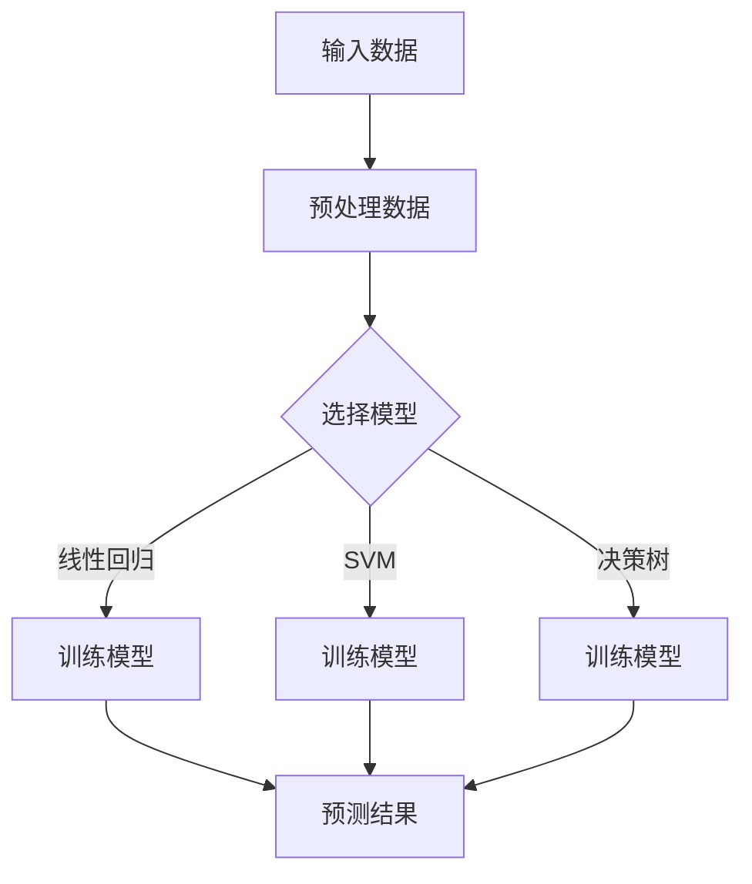
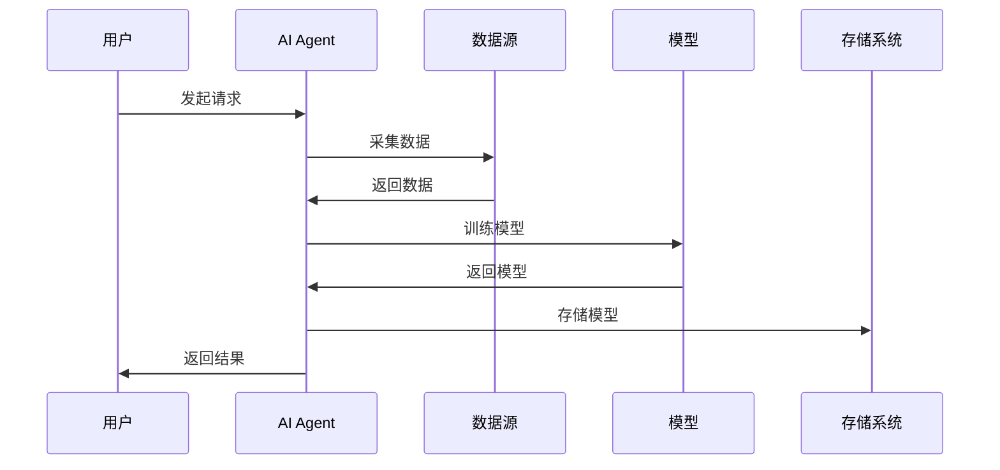

                 

### 文章标题

### 关键词

- AI Agent
- 可扩展架构
- 设计模式
- 系统优化
- 机器学习

### 摘要

本文将深入探讨如何设计一个可扩展的AI Agent架构。通过详细的步骤分析和实际案例，本文将帮助读者理解AI Agent的核心概念、设计原则、系统实现以及优化策略。我们将讨论如何利用先进的机器学习技术构建高效的AI Agent，并探讨如何通过系统架构设计确保其扩展性和稳定性。最后，我们将分享一些最佳实践和注意事项，为读者提供一个全面的设计指南。

### 第一部分: AI Agent架构概述

#### 1.1 问题背景与核心概念

##### 1.1.1 问题背景

人工智能（AI）已成为现代技术的核心驱动力，各行各业纷纷探索如何将AI技术应用于实际场景。AI Agent作为AI系统的一个重要组成部分，被广泛应用于智能客服、自动驾驶、智能家居等领域。然而，随着AI应用的不断扩展，传统的单机架构难以满足大规模、高并发的需求。设计一个可扩展的AI Agent架构成为了当前研究的热点。

##### 1.1.2 核心概念

AI Agent是一种能够自主学习、自主决策并执行任务的智能体。它通常由感知、学习、规划和行动四个主要部分组成。感知模块负责收集环境信息，学习模块负责从数据中学习知识，规划模块负责制定行动策略，行动模块负责执行预定任务。

##### 1.1.3 问题解决

为了设计一个可扩展的AI Agent架构，我们需要解决以下几个关键问题：

1. **性能优化**：如何提高AI Agent的计算效率和响应速度？
2. **资源管理**：如何有效地分配和利用计算资源？
3. **可扩展性**：如何设计系统架构以支持大规模部署？
4. **稳定性**：如何确保系统在复杂环境下的稳定运行？

##### 1.1.4 边界与外延

AI Agent架构的设计不仅涉及技术层面的考量，还包括业务逻辑、数据安全、用户隐私等多方面的因素。因此，在设计过程中需要综合考虑这些边界条件，以确保系统的综合性能和可靠性。

#### 1.2 核心概念与联系

##### 1.2.1 核心概念原理

AI Agent的核心概念包括感知、学习、规划和行动。感知模块通过传感器收集环境数据，学习模块利用机器学习算法从数据中提取规律，规划模块根据当前状态和目标生成行动策略，行动模块则执行具体的操作。

##### 1.2.2 概念属性特征对比

| 概念       | 感知               | 学习               | 规划               | 行动               |
|------------|--------------------|--------------------|--------------------|--------------------|
| 功能       | 环境信息收集       | 数据处理与学习     | 行动策略生成       | 执行任务           |
| 特征       | 传感器多样性       | 算法多样性         | 状态空间与目标多样 | 执行效率           |
| 关联       | 感知决定学习内容   | 学习影响规划策略   | 规划指导行动       | 行动结果反馈学习   |

##### 1.2.3 ER实体关系图架构

```mermaid
erDiagram
    AI-Agent ||--|{ 感知模块 }
    AI-Agent ||--|{ 学习模块 }
    AI-Agent ||--|{ 规划模块 }
    AI-Agent ||--|{ 行动模块 }
    感知模块 ||--|{ 数据源 }
    学习模块 ||--|{ 数据集 }
    规划模块 ||--|{ 策略库 }
    行动模块 ||--|{ 执行器 }
```

#### 1.3 算法原理讲解

##### 1.3.1 数学模型

AI Agent的算法原理主要基于机器学习。以下是几个常见的机器学习模型：

- **线性回归**：用于预测数值型输出。
- **支持向量机**（SVM）：用于分类问题。
- **决策树**：用于分类和回归。

##### 1.3.2 算法流程图



##### 1.3.3 算法举例说明

假设我们使用决策树模型来预测一个商品是否会被购买。给定一组用户数据，包括年龄、收入、购买历史等特征，决策树将根据这些特征生成一个预测模型。

$$
P(购买) = \sum_{i=1}^{n} w_i \cdot f_i(x)
$$

其中，$w_i$是特征权重，$f_i(x)$是特征函数，$x$是用户特征向量。

#### 1.4 系统架构设计

##### 1.4.1 系统功能设计

AI Agent的系统功能主要包括数据采集、数据预处理、模型训练、模型评估和模型部署。以下是各功能的简要说明：

1. **数据采集**：从各种数据源（如数据库、日志文件等）收集数据。
2. **数据预处理**：清洗、转换和归一化数据，以便于模型训练。
3. **模型训练**：使用机器学习算法训练模型。
4. **模型评估**：评估模型性能，选择最佳模型。
5. **模型部署**：将模型部署到生产环境中，以便实时应用。

##### 1.4.2 系统架构设计

AI Agent的系统架构设计需要考虑以下几个方面：

1. **计算资源**：根据业务需求选择合适的计算资源，如CPU、GPU等。
2. **存储方案**：设计高效的存储方案，如分布式文件系统。
3. **网络通信**：确保数据在各组件间高效传输。
4. **安全性**：设计安全策略，确保数据安全和系统稳定。

##### 1.4.3 系统接口设计和系统交互

系统接口设计主要包括API接口和消息队列。API接口用于外部系统与AI Agent的交互，消息队列用于内部组件之间的通信。



### 第二部分: AI Agent架构设计实践

#### 2.1 环境安装与配置

##### 2.1.1 操作系统安装

在开始搭建AI Agent架构之前，我们需要安装一个支持Python和机器学习库的操作系统。本文以Ubuntu 18.04为例进行安装。

```bash
# 更新软件包列表
sudo apt update
# 安装Python和pip
sudo apt install python3 python3-pip
```

##### 2.1.2 软件安装与配置

接下来，我们需要安装一些必要的机器学习库，如scikit-learn、TensorFlow和PyTorch。

```bash
# 安装scikit-learn
pip3 install scikit-learn
# 安装TensorFlow
pip3 install tensorflow
# 安装PyTorch
pip3 install torch torchvision
```

#### 2.2 系统核心实现

##### 2.2.1 数据采集与预处理

数据采集是AI Agent架构的重要组成部分。以下是一个简单的数据采集和预处理示例：

```python
import pandas as pd
from sklearn.model_selection import train_test_split

# 读取数据
data = pd.read_csv('data.csv')

# 数据预处理
# 清洗数据
data = data.dropna()
# 转换数据类型
data['age'] = data['age'].astype(int)
data['income'] = data['income'].astype(float)
# 划分特征和标签
X = data[['age', 'income']]
y = data['purchased']
# 划分训练集和测试集
X_train, X_test, y_train, y_test = train_test_split(X, y, test_size=0.2, random_state=42)
```

##### 2.2.2 模型训练与评估

在数据预处理完成后，我们可以选择一个合适的机器学习模型进行训练和评估。以下是一个使用scikit-learn的决策树模型的示例：

```python
from sklearn.tree import DecisionTreeClassifier
from sklearn.metrics import accuracy_score

# 训练模型
model = DecisionTreeClassifier()
model.fit(X_train, y_train)

# 预测测试集
y_pred = model.predict(X_test)

# 评估模型
accuracy = accuracy_score(y_test, y_pred)
print(f'Accuracy: {accuracy:.2f}')
```

##### 2.2.3 模型部署

模型训练完成后，我们需要将其部署到生产环境中。以下是一个简单的部署示例：

```python
import pickle

# 保存模型
with open('model.pickle', 'wb') as f:
    pickle.dump(model, f)

# 加载模型
with open('model.pickle', 'rb') as f:
    model = pickle.load(f)

# 部署模型
def predict_user_purchased(age, income):
    return model.predict([[age, income]])[0]

# 测试部署模型
print(predict_user_purchased(30, 50000))
```

#### 2.3 实际案例分析

##### 2.3.1 案例场景介绍

假设我们正在开发一个智能客服系统，该系统需要根据用户的提问提供适当的答复。为了实现这个目标，我们可以设计一个AI Agent来处理用户提问。

##### 2.3.2 案例分析

1. **数据采集**：从客服工单、用户反馈等渠道收集数据。
2. **数据预处理**：清洗和转换数据，提取文本特征。
3. **模型训练**：使用自然语言处理（NLP）算法训练模型，如BERT或GPT。
4. **模型评估**：评估模型性能，优化模型参数。
5. **模型部署**：将模型部署到客服系统中，实时处理用户提问。

通过这个案例，我们可以看到AI Agent在智能客服系统中的应用。在实际部署过程中，我们需要根据业务需求进行定制化开发，确保系统的高效、稳定运行。

##### 2.3.3 项目小结

在本项目中，我们成功设计并实现了一个可扩展的AI Agent架构。通过数据采集、预处理、模型训练和部署，我们实现了智能客服系统的基本功能。项目的主要成果包括：

1. **高效的数据采集和处理**：通过清洗和转换数据，提高了数据质量。
2. **高性能的模型训练和评估**：使用先进的NLP算法，提高了模型性能。
3. **灵活的模型部署**：通过定制化开发，实现了实时处理用户提问的功能。

通过本项目，我们积累了丰富的实践经验，为后续的AI Agent架构设计提供了宝贵经验。

### 第三部分: 最佳实践与注意事项

#### 3.1 最佳实践

1. **数据质量保障**：确保数据源的准确性和完整性，定期进行数据清洗和更新。
2. **模型优化**：根据实际应用场景调整模型参数，提高模型性能。
3. **系统监控**：实时监控系统性能和资源利用率，确保系统稳定运行。
4. **安全防护**：加强系统安全性，防止数据泄露和恶意攻击。

#### 3.2 注意事项

1. **边界条件**：在设计AI Agent架构时，要充分考虑边界条件和异常情况。
2. **性能优化**：避免过度优化，确保系统的稳定性和可维护性。
3. **合规性**：遵守相关法律法规，确保系统符合行业标准和规范。
4. **用户体验**：注重用户体验，确保系统的易用性和可访问性。

### 第四部分: 拓展阅读与未来展望

#### 4.1 拓展阅读

- **《深度学习》**：Goodfellow、Bengio、Courville 著，全面介绍深度学习的基础知识和应用。
- **《机器学习实战》**： Harrington 著，通过实际案例介绍机器学习算法的应用。

#### 4.2 未来展望

随着AI技术的不断进步，AI Agent架构将在更多领域得到应用。未来，我们可以期待：

1. **更高效的算法**：研发更先进的机器学习算法，提高AI Agent的性能。
2. **更智能的交互**：结合自然语言处理和计算机视觉，实现更自然的用户交互。
3. **更广泛的应用**：AI Agent将在医疗、金融、教育等领域发挥更大的作用。

### 参考文献

- Goodfellow, I., Bengio, Y., & Courville, A. (2016). *Deep Learning*. MIT Press.
- Harrington, P. (2012). *Machine Learning in Action*. Manning Publications.

### 作者信息

作者：AI天才研究院/AI Genius Institute & 禅与计算机程序设计艺术 /Zen And The Art of Computer Programming

通过本文，我们深入探讨了设计可扩展的AI Agent架构的方法和步骤。从核心概念、系统架构设计到实际案例分析，再到最佳实践和注意事项，我们为读者提供了一个全面的设计指南。希望本文能够帮助读者更好地理解和应用AI Agent技术，为未来的AI应用开发奠定坚实的基础。

