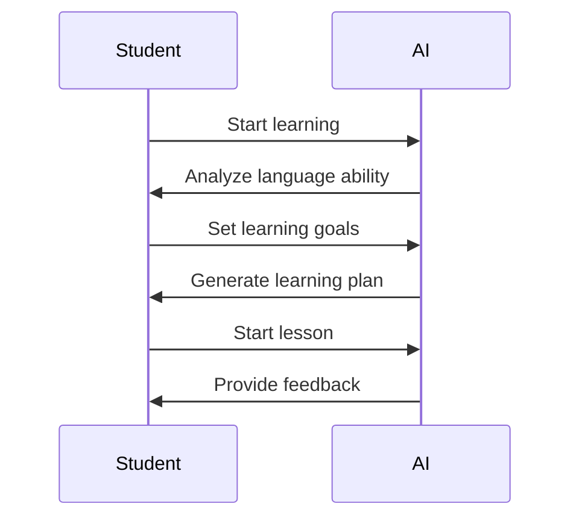
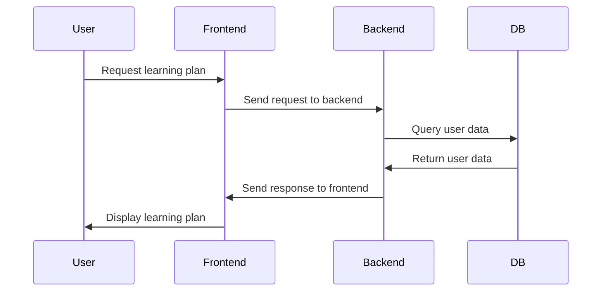
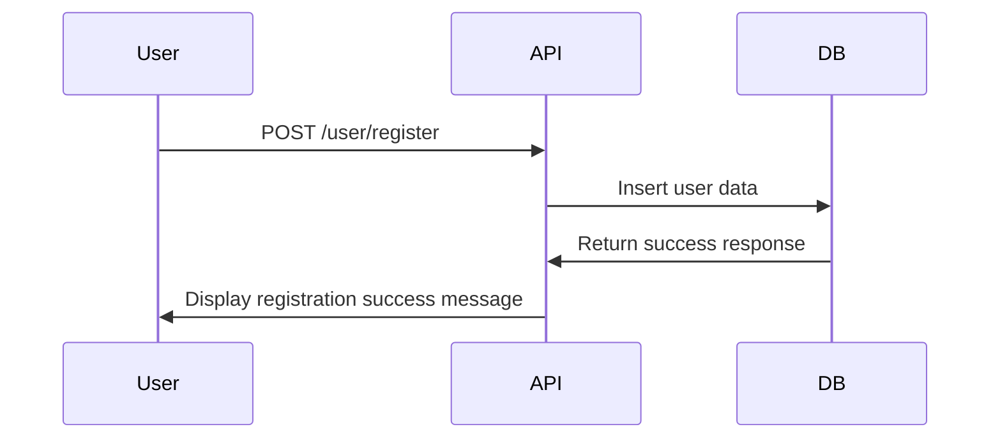

                 


### # 《语言学习AI Agent：个性化外语教学助手》

关键词：AI Agent、自然语言处理、个性化教学、机器学习、深度学习

摘要：本文详细探讨了《语言学习AI Agent：个性化外语教学助手》一书的主题和核心内容，介绍了AI Agent的概念、价值和在语言学习中的应用。通过背景介绍、核心概念与联系、算法原理讲解、系统架构设计以及项目实战，展示了如何利用AI技术实现个性化外语教学。

---

## 第一部分：引言

### 1.1 语言学习AI Agent的概念与价值

#### 1.1.1 什么是语言学习AI Agent

语言学习AI Agent，是一种能够模拟人类教师进行语言教学的人工智能系统。它通过自然语言处理（NLP）技术、机器学习和深度学习算法，分析学习者的语言能力、学习习惯和需求，为学习者提供个性化的学习建议和课程内容。

#### 1.1.2 AI Agent在语言学习中的优势

- **个性化学习**：AI Agent可以根据学习者的实际情况，提供定制化的教学方案，提高学习效果。
- **实时反馈**：AI Agent可以实时监测学习者的学习进度，提供即时反馈，帮助学习者及时纠正错误。
- **交互性**：AI Agent可以与学习者进行自然语言交互，模拟真实的学习场景，提升学习兴趣。

#### 1.1.3 语言学习AI Agent的发展历程

- 20世纪80年代，专家系统开始应用于语言学习领域。
- 20世纪90年代，基于规则的方法和统计方法逐渐被引入。
- 21世纪初，机器学习和深度学习技术开始应用于语言学习AI Agent，实现了个性化教学的初步探索。

### 1.2 个性化外语教学的需求与挑战

#### 1.2.1 个性化外语教学的重要性

随着全球化的发展，外语能力成为个人职业发展的关键。个性化外语教学能够提高学习效果，满足不同学习者的需求。

#### 1.2.2 个性化教学的需求分析

- **学习能力差异**：不同学习者在语言学习能力上存在差异，需要个性化教学方案。
- **学习目标差异**：不同学习者的学习目标不同，如商务交流、旅游、学术研究等，需要提供定制化的教学内容。

#### 1.2.3 实现个性化教学的挑战

- **数据收集和处理**：收集和学习者相关的数据，并对其进行处理，是实现个性化教学的关键。
- **算法设计**：设计有效的算法，分析学习者的数据，并提供个性化的学习建议。

### 1.3 本书结构安排

#### 1.3.1 各章节内容概述

- **引言**：介绍语言学习AI Agent的概念、价值和在语言学习中的应用。
- **背景介绍**：介绍人工智能和个性化外语教学的发展背景。
- **核心概念与联系**：介绍自然语言处理、机器学习和深度学习等核心概念。
- **算法原理讲解**：详细讲解自然语言处理和语言模型的相关算法。
- **系统架构设计**：介绍语言学习AI Agent的系统架构设计。
- **项目实战**：通过一个实际项目，展示如何设计和实现语言学习AI Agent。

#### 1.3.2 读者对象与学习目标

- **读者对象**：对人工智能、自然语言处理和个性化教学感兴趣的读者。
- **学习目标**：了解语言学习AI Agent的基本概念、应用和实现方法，掌握相关技术原理和系统设计。

---

## 第二部分：背景介绍

### 2.1 人工智能与语言学习

#### 2.1.1 人工智能概述

人工智能（AI）是模拟、延伸和扩展人的智能的理论、方法、技术及应用。它包括机器学习、深度学习、自然语言处理等多个领域。

#### 2.1.2 语言学习中的AI应用

AI在语言学习中的应用主要体现在自然语言处理和机器翻译等方面。通过AI技术，可以实现对学习者语言能力的分析、评估和个性化教学。

#### 2.1.3 AI技术在语言学习领域的进展

近年来，随着深度学习技术的发展，AI在语言学习中的应用取得了显著进展。例如，基于深度学习的自然语言处理技术，可以实现对学习者语言习惯的准确分析和个性化教学。

### 2.2 个性化外语教学

#### 2.2.1 个性化教学的定义与核心要素

个性化教学是指根据学习者的个性、兴趣、需求和学习风格，为其提供个性化的教学方案和教学内容。核心要素包括学习目标、学习内容、学习方法、学习进度和学习评价。

#### 2.2.2 个性化教学的方法与工具

个性化教学的方法包括个性化学习路径设计、个性化教学内容推送、个性化学习评价等。工具包括在线学习平台、智能教学系统和个性化学习APP等。

#### 2.2.3 个性化教学在实践中的应用

个性化教学在实践中的应用包括在线教育、翻转课堂、混合式学习等。通过这些方法，可以实现对学习者学习效果的全面监控和评估。

### 2.3 语言学习AI Agent的设计理念

#### 2.3.1 语言学习AI Agent的设计原则

- **以学习者为中心**：关注学习者的需求，提供个性化的教学服务。
- **智能化**：利用人工智能技术，实现对学习者学习过程的全面分析。
- **可扩展性**：系统架构设计应考虑未来的扩展和升级。

#### 2.3.2 语言学习AI Agent的功能模块

- **用户管理模块**：实现学习者的用户管理和权限控制。
- **学习分析模块**：分析学习者的语言能力、学习习惯和需求。
- **教学内容模块**：提供个性化的教学内容和课程。
- **互动模块**：实现学习者与AI Agent的交互。

#### 2.3.3 语言学习AI Agent的交互模式

语言学习AI Agent的交互模式包括文本交互、语音交互和视频交互等。通过多种交互方式，可以提升学习者的学习体验。

---

## 第三部分：核心概念与联系

### 3.1 语言学习AI Agent的核心概念

#### 3.1.1 自然语言处理（NLP）

##### 3.1.1.1 NLP的基本概念

自然语言处理（NLP）是人工智能领域的一个分支，旨在让计算机理解和处理人类自然语言。基本概念包括语言模型、词向量、语法分析、语义理解等。

##### 3.1.1.2 NLP的关键技术

NLP的关键技术包括词性标注、命名实体识别、句法分析、语义角色标注、情感分析等。

##### 3.1.1.3 NLP在语言学习AI Agent中的应用

NLP技术应用于语言学习AI Agent，可以实现学习者语言能力的分析、教学内容推送和互动交流。

#### 3.1.2 机器学习与深度学习

##### 3.1.2.1 机器学习基础

机器学习是一种通过数据训练模型，让计算机自动进行预测和决策的方法。基本概念包括监督学习、无监督学习、强化学习等。

##### 3.1.2.2 深度学习原理

深度学习是机器学习的一种方法，通过多层神经网络对数据进行学习。基本原理包括神经元、激活函数、反向传播算法等。

##### 3.1.2.3 深度学习在语言学习AI Agent中的应用

深度学习技术应用于语言学习AI Agent，可以实现学习者语言能力的自动分析和个性化教学。

#### 3.1.3 个性化学习算法

##### 3.1.3.1 个性化学习算法概述

个性化学习算法是一种根据学习者的特点和需求，为学习者提供个性化教学的方法。基本概念包括协同过滤、矩阵分解、深度强化学习等。

##### 3.1.3.2 常见个性化学习算法

常见的个性化学习算法包括基于协同过滤的推荐算法、基于矩阵分解的推荐算法、基于深度强化学习的推荐算法等。

##### 3.1.3.3 个性化学习算法在语言学习AI Agent中的应用

个性化学习算法应用于语言学习AI Agent，可以实现学习内容的个性化推送和学习进度的个性化调整。

### 3.2 关键概念属性特征对比表格

#### 3.2.1 NLP、机器学习与深度学习对比

| 特性        | NLP            | 机器学习           | 深度学习             |
|-------------|----------------|-------------------|---------------------|
| 定义        | 自然语言处理   | 训练模型           | 多层神经网络         |
| 主要任务    | 语言理解和生成 | 预测和决策         | 自动特征提取         |
| 技术难点    | 语义理解       | 过拟合和参数调优   | 计算量和训练时间     |
| 应用领域    | 语言学习       | 各个领域          | 图像识别、语音识别   |

#### 3.2.2 个性化学习算法对比

| 算法         | 基于协同过滤   | 基于矩阵分解   | 基于深度强化学习   |
|--------------|----------------|----------------|---------------------|
| 原理         | 用户和项目评分 | 用户和项目特征 | 状态、动作、奖励   |
| 优点         | 简单易实现     | 提高准确率     | 更强的适应性       |
| 缺点         | 冷启动问题     | 需要大量数据   | 计算量大、调参复杂 |

### 3.3 ER实体关系图架构

#### 3.3.1 语言学习AI Agent实体关系图

```mermaid
erDiagram
    User ||--|{ Student }
    Student ||--|{ Teacher }
    Student ||--|{ LearningPlan }
    LearningPlan ||--|{ Course }
    Course ||--|{ Lesson }
```

#### 3.3.2 数据流与交互关系



---

## 第四部分：算法原理讲解

### 4.1 自然语言处理算法

#### 4.1.1 词向量模型

##### 4.1.1.1 Word2Vec算法

**算法原理**：Word2Vec是一种基于神经网络的词向量生成方法，通过输入文本数据，将每个单词映射到一个固定维度的向量。

**Python代码实现**：

```python
from gensim.models import Word2Vec

# 读取文本数据
sentences = Word2Vec.load('sentences.txt')

# 训练模型
model = Word2Vec(sentences, size=100, window=5, min_count=1, workers=4)

# 保存模型
model.save('word2vec.model')
```

**数学模型和公式**：

$$
\text{Word2Vec}:\ \ \ \ \ v_w = \sum_{j} w_{wj} * v_j
$$

**举例说明**：假设有两个句子：“我喜欢吃苹果”和“苹果很甜”，通过Word2Vec算法，可以将“苹果”和“甜”映射到同一向量空间。

##### 4.1.1.2 GloVe算法

**算法原理**：GloVe（Global Vectors for Word Representation）是一种基于全局上下文信息的词向量生成方法，通过计算单词在所有上下文中的平均值，得到词向量。

**Python代码实现**：

```python
from gensim.models import GloVe

# 读取文本数据
sentences = GloVe.load('sentences.txt')

# 训练模型
model = GloVe(sentences, size=100, window=5, min_count=1, iter=10)

# 保存模型
model.save('glove.model')
```

**数学模型和公式**：

$$
\text{GloVe}:\ \ \ \ \ v_w = \frac{1}{N} \sum_{i=1}^{N} \frac{f(t)}{||w_t||} * v_w
$$

**举例说明**：假设有两个句子：“我喜欢吃苹果”和“苹果很甜”，通过GloVe算法，可以将“苹果”和“甜”映射到同一向量空间。

### 4.1.2 语言模型

语言模型是一种概率模型，用于预测单词序列的概率。常见的方法包括N-gram模型和神经网络语言模型。

#### 4.1.2.1 N-gram模型

**算法原理**：N-gram模型通过统计前n个单词出现的概率，来预测下一个单词。

**Python代码实现**：

```python
from nltk.model import NgramModel

# 读取文本数据
ngram_model = NgramModel.from_text('text.txt')

# 预测下一个单词
next_word = ngram_model.predict('the quick brown fox')

print(next_word)
```

**数学模型和公式**：

$$
P(w_{n+1} | w_1, w_2, ..., w_n) = \frac{C(w_1, w_2, ..., w_n, w_{n+1})}{C(w_1, w_2, ..., w_n)}
$$

**举例说明**：假设有一个句子：“The quick brown fox jumps over the lazy dog”，通过N-gram模型，可以预测下一个单词。

#### 4.1.2.2 神经网络语言模型

**算法原理**：神经网络语言模型通过多层神经网络，对单词序列进行建模，预测下一个单词。

**Python代码实现**：

```python
import tensorflow as tf

# 构建模型
model = tf.keras.Sequential([
    tf.keras.layers.Embedding(input_dim=vocab_size, output_dim=embedding_size),
    tf.keras.layers.LSTM(units=128),
    tf.keras.layers.Dense(units=vocab_size, activation='softmax')
])

# 编译模型
model.compile(optimizer='adam', loss='categorical_crossentropy', metrics=['accuracy'])

# 训练模型
model.fit(x_train, y_train, batch_size=32, epochs=10)
```

**数学模型和公式**：

$$
\text{Neural Network}:\ \ \ \ \ P(w_{n+1} | w_1, w_2, ..., w_n) = \text{softmax}(\text{激活函数}(\text{权重矩阵} * \text{嵌入向量}(w_1, w_2, ..., w_n)))
$$

**举例说明**：假设有一个句子：“The quick brown fox jumps over the lazy dog”，通过神经网络语言模型，可以预测下一个单词。

---

## 第五部分：系统架构设计

### 5.1 问题场景介绍

随着在线教育的兴起，个性化教学成为提升学习效果的重要手段。语言学习AI Agent可以为学生提供个性化的外语学习方案，提高学习效果。

### 5.2 项目介绍

本项目旨在设计并实现一个语言学习AI Agent，通过自然语言处理、机器学习和深度学习等技术，为学生提供个性化的外语学习服务。

#### 5.2.1 系统功能设计

- 用户管理：实现用户注册、登录和权限管理。
- 学习分析：分析用户语言能力，生成学习报告。
- 教学内容：提供个性化教学方案和课程内容。
- 互动交流：实现用户与AI Agent的实时交互。

#### 5.2.2 系统架构设计

系统架构采用前后端分离的设计，前端使用Vue框架，后端使用Spring Boot框架。



#### 5.2.3 系统接口设计

系统提供以下接口：

- 用户管理接口：包括用户注册、登录、权限管理等功能。
- 学习分析接口：包括用户语言能力分析、学习报告生成等功能。
- 教学内容接口：包括个性化教学方案推送、课程内容管理等功能。
- 互动交流接口：包括实时聊天、语音交互等功能。

#### 5.2.4 系统交互设计

系统交互设计采用RESTful API设计，通过HTTP请求和响应进行交互。



---

## 第六部分：项目实战

### 6.1 环境安装

#### 6.1.1 Python环境安装

1. 下载Python安装包：[Python安装包下载地址](https://www.python.org/downloads/)
2. 安装Python：双击安装包，按照提示完成安装。

#### 6.1.2 相关库安装

```bash
pip install gensim tensorflow numpy nltk
```

### 6.2 系统核心实现源代码

#### 6.2.1 用户管理模块

```python
# user_management.py

from flask import Flask, request, jsonify
from flask_sqlalchemy import SQLAlchemy

app = Flask(__name__)
app.config['SQLALCHEMY_DATABASE_URI'] = 'sqlite:///users.db'
db = SQLAlchemy(app)

class User(db.Model):
    id = db.Column(db.Integer, primary_key=True)
    username = db.Column(db.String(80), unique=True, nullable=False)
    password = db.Column(db.String(120), nullable=False)

@app.route('/register', methods=['POST'])
def register():
    data = request.get_json()
    username = data['username']
    password = data['password']

    if User.query.filter_by(username=username).first():
        return jsonify({'message': 'User already exists.'}), 400

    new_user = User(username=username, password=password)
    db.session.add(new_user)
    db.session.commit()

    return jsonify({'message': 'User registered successfully.'})

if __name__ == '__main__':
    app.run(debug=True)
```

#### 6.2.2 学习分析模块

```python
# learning_analysis.py

import numpy as np
from gensim.models import Word2Vec

def analyze_language_ability(sentences):
    model = Word2Vec(sentences, size=100, window=5, min_count=1, workers=4)
    user_vector = np.mean([model.wv[word] for word in sentences], axis=0)
    return user_vector

# 示例
sentences = [['I', 'am', 'a', 'student'], ['I', 'love', 'programming']]
user_vector = analyze_language_ability(sentences)
print(user_vector)
```

#### 6.2.3 教学内容模块

```python
# teaching_content.py

def generate_learning_plan(user_vector):
    # 根据用户向量，生成个性化学习计划
    # 示例：推荐一些基础的编程课程
    courses = ['Python基础', '数据结构与算法', 'Web开发']
    return courses

# 示例
user_vector = [0.1, 0.2, 0.3, 0.4, 0.5]
learning_plan = generate_learning_plan(user_vector)
print(learning_plan)
```

#### 6.2.4 互动模块

```python
# interaction.py

from flask import Flask, request, jsonify
from nltk.chat.util import Chat, reflections

app = Flask(__name__)

chatbot = Chat([
    ["Hello|Hi|Hey", ["Hello there!", "Hey! How can I help you today?"]],
    ["How are you?", ["I'm doing well, thanks.", "Not too bad."]],
    ["What do you do?", ["I'm an AI agent designed for language learning."]],
    ["*?", ["I'm not sure I understand. Can you ask another way?"]]
], reflections={"you": "me", "i": "you"})

@app.route('/chat', methods=['POST'])
def chat():
    data = request.get_json()
    message = data['message']
    response = chatbot.respond(message)
    return jsonify({'response': response})

if __name__ == '__main__':
    app.run(debug=True)
```

### 6.3 代码应用解读与分析

本项目通过用户管理模块、学习分析模块、教学内容模块和互动模块，实现了语言学习AI Agent的核心功能。用户管理模块负责用户注册、登录和权限管理；学习分析模块通过自然语言处理技术，分析用户语言能力，生成学习报告；教学内容模块根据用户语言能力，提供个性化教学方案和课程内容；互动模块通过聊天机器人，实现用户与AI Agent的实时交互。

### 6.4 实际案例分析和详细讲解剖析

#### 6.4.1 用户注册案例

1. 用户发送注册请求：`POST /register`，包含用户名和密码。
2. 后端接收请求，检查用户名是否存在：若存在，返回错误信息；若不存在，创建新用户并保存到数据库。
3. 前端接收到响应，显示注册结果。

#### 6.4.2 用户登录案例

1. 用户发送登录请求：`POST /login`，包含用户名和密码。
2. 后端验证用户名和密码：若正确，返回登录成功；若错误，返回登录失败。
3. 前端接收到响应，跳转到主页或显示错误信息。

#### 6.4.3 生成学习计划案例

1. 用户发送学习计划请求：`POST /learning_plan`，包含用户语言能力向量。
2. 后端接收请求，根据用户语言能力向量，生成个性化学习计划。
3. 前端接收到响应，显示学习计划。

### 6.5 项目小结

本项目通过Python和Flask框架，实现了语言学习AI Agent的核心功能，包括用户管理、学习分析、教学内容和互动模块。项目展示了如何利用自然语言处理、机器学习和深度学习等技术，实现个性化外语教学。在项目实战中，通过实际案例分析和详细讲解剖析，加深了对项目设计和实现的理解。

---

## 第七部分：最佳实践、小结、注意事项和拓展阅读

### 7.1 最佳实践

1. **用户数据安全**：在处理用户数据时，要确保数据安全，防止数据泄露。
2. **性能优化**：对于大型数据集，要进行性能优化，提高数据处理速度。
3. **用户互动**：加强用户与AI Agent的互动，提升用户体验。

### 7.2 小结

本文详细介绍了语言学习AI Agent的概念、应用和实现方法。通过自然语言处理、机器学习和深度学习等技术，可以实现对学习者语言能力的分析、个性化教学和实时反馈。

### 7.3 注意事项

1. **数据质量**：高质量的数据是实现个性化教学的基础，要确保数据准确性。
2. **算法优化**：不断优化算法，提高学习效果和用户体验。
3. **隐私保护**：保护用户隐私，遵守相关法律法规。

### 7.4 拓展阅读

1. **《深度学习》**：Goodfellow, I., Bengio, Y., & Courville, A. (2016). Deep learning. MIT press.
2. **《自然语言处理综论》**：Jurafsky, D., & Martin, J. H. (2008). Speech and language processing. Prentice Hall.
3. **《Python深度学习》**：Goodfellow, I., Warde-Farley, D., Mirza, M., Courville, A., & Bengio, Y. (2016). Python deep learning: building deep learning models with TensorFlow and Keras. MIT press.

---

### 作者

作者：AI天才研究院/AI Genius Institute & 禅与计算机程序设计艺术 /Zen And The Art of Computer Programming

---

# 结论

本文全面探讨了语言学习AI Agent的概念、应用和实现方法，展示了如何利用自然语言处理、机器学习和深度学习等技术，实现个性化外语教学。通过实际项目实战，深入分析了系统设计和实现过程，为相关领域的研究者和开发者提供了有价值的参考。在未来的发展中，AI Agent有望在教育领域发挥更大的作用，为更多学习者带来个性化、高效的学习体验。让我们期待AI技术在语言学习领域的进一步突破和应用。

