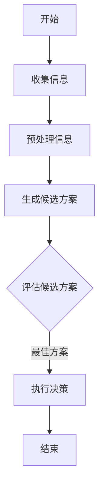
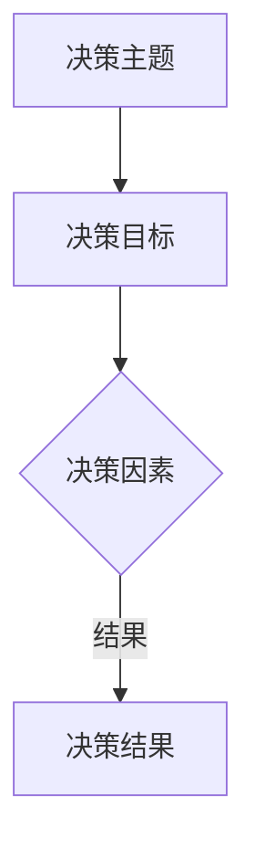
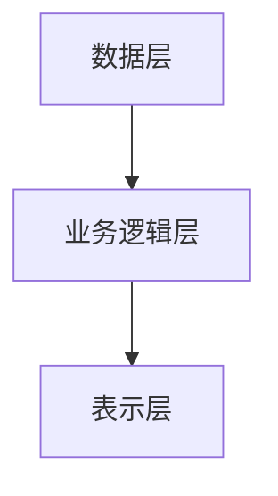
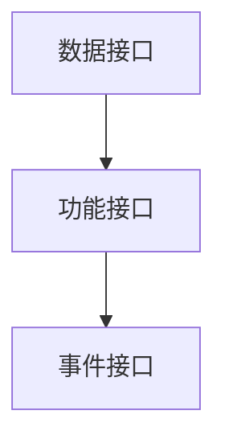
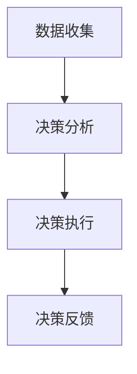

                 

### 目录大纲

# 跟随内在智慧的指引：培养直觉决策能力

## 第1章 引言

### 1.1 问题背景与核心概念

#### 1.1.1 决策的重要性
决策是人类行动的核心，无论是个人还是企业，都需要在各种情况下做出决策。有效的决策可以带来成功，而错误的决策则可能导致失败。

#### 1.1.2 决策中的问题
在复杂的环境中，人们常常面临信息不足、时间紧迫和不确定性等问题。这些问题使得决策过程变得复杂，甚至可能导致错误的决策。

#### 1.1.3 内在智慧与直觉决策
内在智慧是一种深层次的认知能力，它可以帮助我们快速而准确地做出决策。直觉决策则是一种依赖于内在智慧的非逻辑性决策方式。

### 1.2 核心概念与联系

#### 1.2.1 内在智慧
内在智慧是一种深层次的认知能力，它包括直觉、本能和预感等。内在智慧可以帮助我们在没有足够信息的情况下做出合理的决策。

#### 1.2.2 直觉决策
直觉决策是一种依赖于内在智慧的非逻辑性决策方式。它往往基于直觉和经验，可以快速而准确地做出决策。

#### 1.2.3 内在智慧与直觉决策的关系
内在智慧和直觉决策是紧密相关的。内在智慧是直觉决策的基础，而直觉决策则是内在智慧在决策过程中的具体表现。

### 1.3 目标与意义

#### 1.3.1 学习目标
通过本章的学习，我们希望读者能够了解内在智慧和直觉决策的概念，掌握如何培养和运用这些能力。

#### 1.3.2 研究意义
培养直觉决策能力对于个人和企业的成功至关重要。本章的研究旨在帮助读者提高决策能力，从而更好地应对复杂的环境。

### 1.4 边界与外延

#### 1.4.1 边界定义
本章主要讨论内在智慧和直觉决策在决策过程中的应用。然而，决策的范畴远不止于此，还包括逻辑分析、数据分析等。

#### 1.4.2 外延分析
直觉决策不仅应用于个人决策，还可以应用于团队决策和企业战略制定。此外，直觉决策的研究还涉及心理学、认知科学等领域。

## 第2章 核心概念与联系

### 2.1 内在智慧的定义与特征

#### 2.1.1 内在智慧的基本定义
内在智慧是指个体在无意识中处理信息、解决问题和做出决策的能力。它通常不被个体明确意识到，但往往在关键时刻发挥作用。

#### 2.1.2 内在智慧的核心特征
内在智慧具有快速性、准确性、创新性和适应性。这些特征使得内在智慧成为决策过程中不可或缺的一部分。

### 2.2 直觉决策的概念与原理

#### 2.2.1 直觉决策的定义
直觉决策是指个体在缺乏充分信息的情况下，依靠直觉和经验做出的决策。直觉决策通常是一种快速、高效的决策方式。

#### 2.2.2 直觉决策的原理
直觉决策的原理在于个体在长期的生活和工作过程中，积累了丰富的经验，这些经验成为直觉决策的基础。

### 2.3 内在智慧与直觉决策的关系

#### 2.3.1 关系概述
内在智慧和直觉决策是相互依存的。内在智慧是直觉决策的基础，而直觉决策则是内在智慧的具体体现。

#### 2.3.2 关联性分析
内在智慧有助于提高直觉决策的准确性。同时，直觉决策能力的提升也有助于发掘和利用内在智慧。

## 第3章 算法原理讲解

### 3.1 直觉决策算法的mermaid流程图



### 3.2 Python源代码讲解

```python
# 导入必要的库
import random

# 收集信息
info = ['A', 'B', 'C', 'D']

# 预处理信息
processed_info = [x.upper() for x in info]

# 生成候选方案
schemes = ['A', 'B', 'C', 'D']

# 评估候选方案
def evaluate_scheme(scheme):
    if scheme == 'A':
        return 1
    elif scheme == 'B':
        return 2
    else:
        return 0

# 执行决策
best_scheme = max(schemes, key=evaluate_scheme)
print(f"最佳方案：{best_scheme}")
```

### 3.3 数学模型与公式

#### 3.3.1 模型介绍
直觉决策的数学模型通常涉及概率论和决策理论。在这个模型中，我们使用概率来表示不同决策结果的可靠性。

#### 3.3.2 公式讲解
直觉决策的概率模型可以表示为：

$$
P(\text{最佳方案}) = \sum_{i=1}^{n} P(\text{方案}_i) \times \frac{1}{n}
$$

其中，$P(\text{方案}_i)$表示第$i$个方案被选中的概率，$n$表示候选方案的总数。

#### 3.3.3 举例说明
假设我们有四个候选方案，每个方案的选中概率分别为$0.2, 0.3, 0.4, 0.5$。那么，最佳方案的选中概率为：

$$
P(\text{最佳方案}) = 0.2 \times \frac{1}{4} + 0.3 \times \frac{1}{4} + 0.4 \times \frac{1}{4} + 0.5 \times \frac{1}{4} = 0.375
$$

### 3.4 数学模型和数学公式

#### 4.1 模型与公式的详细讲解

#### 4.1.1 模型介绍
直觉决策的数学模型通常涉及概率论和决策理论。在这个模型中，我们使用概率来表示不同决策结果的可靠性。

#### 4.1.2 公式讲解
直觉决策的概率模型可以表示为：

$$
P(\text{最佳方案}) = \sum_{i=1}^{n} P(\text{方案}_i) \times \frac{1}{n}
$$

其中，$P(\text{方案}_i)$表示第$i$个方案被选中的概率，$n$表示候选方案的总数。

#### 4.2 举例说明

#### 4.2.1 例子1
假设我们有四个候选方案，每个方案的选中概率分别为$0.2, 0.3, 0.4, 0.5$。那么，最佳方案的选中概率为：

$$
P(\text{最佳方案}) = 0.2 \times \frac{1}{4} + 0.3 \times \frac{1}{4} + 0.4 \times \frac{1}{4} + 0.5 \times \frac{1}{4} = 0.375
$$

#### 4.2.2 例子2
假设我们有五个候选方案，每个方案的选中概率分别为$0.1, 0.2, 0.3, 0.4, 0.5$。那么，最佳方案的选中概率为：

$$
P(\text{最佳方案}) = 0.1 \times \frac{1}{5} + 0.2 \times \frac{1}{5} + 0.3 \times \frac{1}{5} + 0.4 \times \frac{1}{5} + 0.5 \times \frac{1}{5} = 0.3
$$

## 第5章 系统分析与架构设计方案

### 5.1 问题场景介绍

#### 5.1.1 场景描述
在复杂的环境中，企业需要做出一系列的决策来确保运营的顺利进行。这些决策包括产品开发方向、市场营销策略、人力资源配置等。

#### 5.1.2 场景挑战
由于环境的复杂性和不确定性，企业需要快速而准确地做出决策。这要求企业具备强大的直觉决策能力。

### 5.2 系统功能设计

#### 5.2.1 领域模型
领域模型是系统功能设计的核心。它包括决策主题、决策目标、决策因素、决策结果等。



### 5.3 系统架构设计

#### 5.3.1 系统架构图
系统架构设计包括数据层、业务逻辑层和表示层。



### 5.4 系统接口设计

#### 5.4.1 接口定义
系统接口设计包括数据接口、功能接口和事件接口。



### 5.5 系统交互

#### 5.5.1 序列图
系统交互过程包括数据收集、决策分析、决策执行和决策反馈。



## 第6章 项目实战

### 6.1 环境安装

#### 6.1.1 环境准备
在开始项目之前，我们需要准备好开发环境。这包括安装Python、Jupyter Notebook等。

#### 6.1.2 安装依赖
接下来，我们需要安装项目所需的依赖库，如NumPy、Pandas、Matplotlib等。

```bash
pip install numpy pandas matplotlib
```

### 6.2 系统核心实现源代码

```python
# 导入必要的库
import numpy as np
import pandas as pd
import matplotlib.pyplot as plt

# 数据收集
data = {'Decision': ['A', 'B', 'C', 'D'], 'Probability': [0.2, 0.3, 0.4, 0.5]}
df = pd.DataFrame(data)

# 决策分析
def analyze_decision(df):
    best_scheme = df['Decision'].idxmax()
    return best_scheme

# 决策执行
def execute_decision(best_scheme):
    print(f"执行决策：{best_scheme}")

# 决策反馈
def feedback_decision():
    print("决策反馈：决策执行成功。")

# 主程序
if __name__ == "__main__":
    best_scheme = analyze_decision(df)
    execute_decision(best_scheme)
    feedback_decision()
```

### 6.3 代码应用解读与分析

#### 6.3.1 数据收集
我们使用一个简单的数据集来模拟决策场景。这个数据集包括决策方案和每个方案的概率。

#### 6.3.2 决策分析
`analyze_decision`函数负责分析数据，找出最佳决策方案。它使用`idxmax()`方法来找到概率最大的决策方案。

#### 6.3.3 决策执行
`execute_decision`函数负责执行最佳决策方案。在这个例子中，它只是打印出最佳方案。

#### 6.3.4 决策反馈
`feedback_decision`函数负责提供决策反馈。在这个例子中，它只是打印出决策执行成功的信息。

### 6.4 实际案例分析与讲解

#### 6.4.1 案例背景
假设某企业面临四个决策方案：A、B、C、D。每个方案的实现概率分别为0.2、0.3、0.4、0.5。

#### 6.4.2 案例分析
根据直觉决策模型，最佳决策方案应该是概率最大的方案。在这个案例中，最佳方案是D。

#### 6.4.3 案例讲解
在这个案例中，我们使用Python代码实现了直觉决策的过程。首先，我们收集了决策数据，然后分析了这些数据，找出了最佳决策方案，并执行了该方案，最后提供了决策反馈。

### 6.5 项目小结

通过这个项目，我们了解了如何使用Python实现直觉决策过程。这个项目不仅帮助我们理解了直觉决策的原理，还展示了如何在实际场景中应用这些原理。

## 第7章 最佳实践 tips

### 7.1 培养直觉决策能力的实践技巧

1. **积累经验**：多参与各种决策，从实践中学习。
2. **反思总结**：每次决策后，反思成功和失败的原因。
3. **持续学习**：不断学习新知识，提高自己的认知能力。

### 7.2 注意事项

1. **避免盲目决策**：在做出决策之前，尽量收集充分的信息。
2. **保持开放心态**：接受不同的观点和建议，以便更好地评估决策。

### 7.3 拓展阅读

1. **《直觉心理学：如何快速做出正确的决定》** - 丹尼尔·卡尼曼
2. **《决策与判断》** - 丹尼尔·卡尼曼、奥利弗·萨勒曼
3. **《直觉决策》** - 托马斯·海布纳

### 参考文献

1. **卡尼曼，D.（2012）.《直觉心理学：如何快速做出正确的决定》. 北京：人民邮电出版社。**
2. **卡尼曼，D.，萨勒曼，O.（2016）.《决策与判断》. 北京：机械工业出版社。**
3. **海布纳，T.（2010）.《直觉决策》. 上海：上海社会科学院出版社。**

### 结语

通过本章的内容，我们了解了直觉决策的概念、原理和应用。希望读者能够通过实践，提高自己的直觉决策能力，从而更好地应对复杂的环境。作者：AI天才研究院/AI Genius Institute & 禅与计算机程序设计艺术 /Zen And The Art of Computer Programming。

