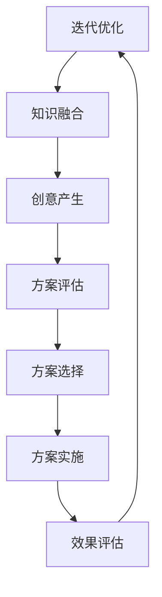
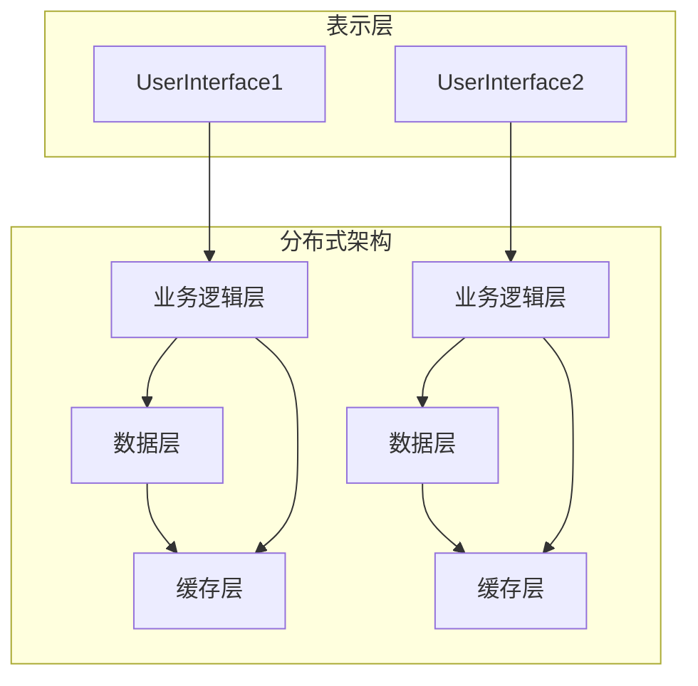
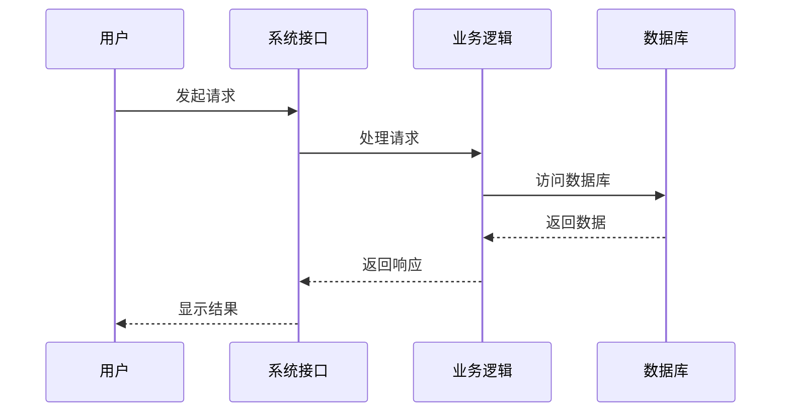

                 


### 第1章：导言

#### 1.1 背景与核心概念

**核心概念术语说明**

**跨学科创新思维**：指将不同学科的知识和思维方法结合起来，形成一种能够解决复杂问题的创新思维模式。

**创新训练营**：一种集中、高强度、系统化的学习环境，旨在通过密集的课程设置和实践活动，培养学员的跨学科创新思维。

**跨界创意**：指将不同领域或行业的知识和方法相结合，创造新的想法或解决方案。

**密集课程**：指紧凑、有针对性的课程安排，确保学员在短时间内掌握核心知识和技能。

**背景介绍**

在当今快速变化的科技环境中，传统学科界限越来越模糊，单一学科的知识已不足以应对复杂的问题。跨学科创新思维因此成为推动科技发展和社会进步的重要动力。

**问题背景**

跨学科创新思维的重要性日益凸显。传统学科界限越来越模糊，单一学科的知识已不足以应对复杂的问题。跨学科创新思维成为推动科技发展和社会进步的重要动力。

**问题描述**

如何有效地培养和激发跨学科创新思维，特别是在一个集中、高强度的训练营环境中？

**问题解决**

设计一个具有系统性和实用性的跨学科创新思维训练营，通过密集的课程设置和实践活动，帮助学员掌握跨界创意的方法和技巧。

**边界与外延**

训练营不仅仅是知识的传授，更强调思维的碰撞和实践的体验。它既包括理论的学习，也涉及实际操作和项目实践。

**概念结构与核心要素组成**

训练营的构成要素包括课程设置、导师团队、学员互动、实践项目等。

- **课程设置**：包括理论课程和实践课程，旨在传授跨学科创新思维的基本知识和方法。
- **导师团队**：由各领域专家组成，提供专业指导和支持。
- **学员互动**：鼓励学员之间的交流与协作，促进思维碰撞。
- **实践项目**：通过实际操作和项目实践，将理论知识应用到实际中。

### 第2章：核心概念与联系

#### 2.1 跨学科创新思维

**核心概念原理**

跨学科创新思维是一种将不同学科的知识和方法结合起来，形成一种新的思维模式，以解决传统单一学科难以应对的复杂问题的能力。

**概念属性特征对比表格**

| 特征         | 跨学科创新思维 | 传统单一学科思维 |
| ------------ | -------------- | ---------------- |
| 知识来源     | 多学科融合     | 单一学科知识     |
| 解决问题能力 | 强             | 弱               |
| 创新程度     | 高             | 低               |

**ER实体关系图架构**

```mermaid
erDiagram
  Course <<|-- Student
  Teacher ||--|{ Course }
  Student ||--|{ Project }
  Project ||--|{ Teacher }
```

#### 2.2 创新训练营

**核心概念原理**

创新训练营是一种集中、高强度、系统化的学习环境，旨在通过密集的课程设置和实践活动，培养学员的跨学科创新思维。

**概念属性特征对比表格**

| 特征         | 创新训练营 | 传统课堂学习 |
| ------------ | ---------- | ------------ |
| 学习环境     | 集中、高强度 | 一般、分散   |
| 学习目标     | 培养跨学科创新思维 | 系统知识传授 |
| 学习方式     | 理论与实践结合 | 纯理论教学   |
| 教学效果     | 显著         | 一般         |

**ER实体关系图架构**

```mermaid
erDiagram
  Student ||--|{ Course }
  Course ||--|{ Project }
  Teacher ||--|{ Project }
```

#### 2.3 跨界创意

**核心概念原理**

跨界创意是指将不同领域或行业的知识和方法相结合，创造新的想法或解决方案。

**概念属性特征对比表格**

| 特征         | 跨界创意 | 单一领域创新 |
| ------------ | -------- | ------------ |
| 创新范围     | 广泛     | 有限         |
| 创新速度     | 快       | 慢           |
| 创新效果     | 高       | 一般         |

**ER实体关系图架构**

```mermaid
erDiagram
  IndustryA ||--|{ Creative }
  IndustryB ||--|{ Creative }
  Creative ||--|{ Solution }
```

#### 2.4 密集课程

**核心概念原理**

密集课程是指紧凑、有针对性的课程安排，旨在确保学员在短时间内掌握核心知识和技能。

**概念属性特征对比表格**

| 特征         | 密集课程 | 传统课程 |
| ------------ | -------- | -------- |
| 课程安排     | 紧凑、密集 | 分散、一般 |
| 学习效率     | 高       | 一般     |
| 学习压力     | 大       | 小       |

**ER实体关系图架构**

```mermaid
erDiagram
  Student ||--|{ Course }
  Course ||--|{ Module }
  Module ||--|{ Knowledge }
```

### 第3章：算法原理讲解

在本章节中，我们将介绍跨学科创新思维的算法原理，通过一个简化的创新思维流程图和Python代码示例来阐述其核心步骤和逻辑。

#### 3.1 创新思维流程图

**创新思维流程图（Mermaid）**



#### 3.2 创新思维算法流程

**算法流程描述**

1. **问题定义**：明确需要解决的问题或挑战。
2. **知识融合**：结合不同学科的知识和方法，为解决问题提供多种可能性。
3. **创意产生**：通过发散思维，产生多种可能的解决方案。
4. **方案评估**：对每个解决方案进行评估，选择最优或最合适的方案。
5. **方案选择**：从评估结果中选择一个或多个可行的方案。
6. **方案实施**：将选定的方案付诸实践。
7. **效果评估**：评估实施效果，验证解决方案的有效性。
8. **迭代优化**：根据效果评估的结果，对方案进行迭代优化，不断提高解决方案的质量。

#### 3.3 Python代码示例

**代码示例**

```python
# 创新思维算法Python代码示例

# 导入相关库
import random

# 定义创新思维算法
def innovation_thinking(problem, knowledge, solutions, evaluation_criteria):
    # 问题定义
    print("问题定义：", problem)

    # 知识融合
    print("知识融合：", knowledge)

    # 创意产生
    print("创意产生：", solutions)

    # 方案评估
    evaluated_solutions = {}
    for solution in solutions:
        score = evaluate_solution(solution, evaluation_criteria)
        evaluated_solutions[solution] = score

    # 方案选择
    best_solutions = sorted(evaluated_solutions.items(), key=lambda x: x[1], reverse=True)
    print("方案选择：", best_solutions)

    # 方案实施
    for solution, score in best_solutions:
        print("方案实施：", solution)

    # 效果评估
    print("效果评估：", evaluate_solution(best_solutions[0][0], evaluation_criteria))

    # 迭代优化
    print("迭代优化：", random.choice(solutions))

# 方案评估函数
def evaluate_solution(solution, evaluation_criteria):
    score = 0
    for criterion in evaluation_criteria:
        if criterion in solution:
            score += 1
    return score

# 主函数
def main():
    problem = "提高产品销量"
    knowledge = ["市场营销知识", "消费者行为研究", "数据分析"]
    solutions = ["增加广告投放", "改善产品质量", "降低产品价格"]
    evaluation_criteria = ["广告投放", "产品质量", "价格"]

    innovation_thinking(problem, knowledge, solutions, evaluation_criteria)

# 运行主函数
if __name__ == "__main__":
    main()
```

**代码解读与分析**

- **问题定义**：首先定义了需要解决的问题，即“提高产品销量”。
- **知识融合**：结合了市场营销知识、消费者行为研究和数据分析三个领域的知识。
- **创意产生**：产生了三种可能的解决方案：增加广告投放、改善产品质量、降低产品价格。
- **方案评估**：通过评估函数对每个方案进行评估，主要评估标准是解决方案中包含的评估标准数量。
- **方案选择**：根据评估分数选择最佳方案。
- **方案实施**：模拟实施选定的方案。
- **效果评估**：评估选定方案的效果。
- **迭代优化**：随机选择一个新的解决方案，进行迭代优化。

通过以上算法原理讲解和代码示例，我们可以更好地理解跨学科创新思维的基本步骤和逻辑。

### 第4章：数学模型和数学公式

在本章节中，我们将简要介绍跨学科创新思维中的一些数学模型和数学公式，以便读者更好地理解和应用这些概念。

#### 4.1 数学模型

跨学科创新思维涉及多个领域的知识和方法，因此数学模型的应用非常广泛。以下是一些常见的数学模型：

1. **线性回归模型**：用于预测和分析变量之间的关系。
2. **神经网络模型**：模拟人脑的神经网络结构，用于复杂问题的求解。
3. **聚类分析模型**：用于将数据集分成不同的组，以便更好地理解和分析。
4. **决策树模型**：用于分类和回归问题，通过一系列决策规则生成树状结构。

**线性回归模型**

线性回归模型的基本公式为：

$$y = wx + b$$

其中，$y$ 是因变量，$x$ 是自变量，$w$ 是权重，$b$ 是偏置。

**神经网络模型**

神经网络模型的基本结构包括输入层、隐藏层和输出层。每个层由多个神经元组成，神经元之间的连接权重用于传递信息。神经网络模型的公式为：

$$output = \sigma(\sum_{i=1}^{n} w_i \cdot x_i + b)$$

其中，$output$ 是输出值，$\sigma$ 是激活函数（如Sigmoid函数），$w_i$ 和 $x_i$ 分别是权重和输入值，$b$ 是偏置。

**聚类分析模型**

聚类分析模型的基本公式为：

$$cluster\_assignment = \arg\min_{c} \sum_{i=1}^{n} d(i, c)$$

其中，$cluster\_assignment$ 是聚类结果，$c$ 是聚类中心，$d(i, c)$ 是数据点 $i$ 到聚类中心 $c$ 的距离。

**决策树模型**

决策树模型的基本公式为：

$$output = \arg\max_{c} \sum_{i=1}^{n} P(c|X_i)$$

其中，$output$ 是输出值，$c$ 是决策路径，$P(c|X_i)$ 是给定输入 $X_i$ 的情况下决策路径 $c$ 的概率。

#### 4.2 数学公式

在跨学科创新思维中，以下数学公式是常见且重要的：

1. **相关性系数**：用于衡量两个变量之间的相关性。

$$r = \frac{\sum_{i=1}^{n} (x_i - \bar{x})(y_i - \bar{y})}{\sqrt{\sum_{i=1}^{n} (x_i - \bar{x})^2} \cdot \sqrt{\sum_{i=1}^{n} (y_i - \bar{y})^2}}$$

其中，$r$ 是相关性系数，$x_i$ 和 $y_i$ 分别是两个变量的观测值，$\bar{x}$ 和 $\bar{y}$ 分别是两个变量的均值。

2. **概率分布**：用于描述随机变量的取值概率。

$$P(X = x) = \frac{1}{Z} \cdot e^{-\frac{(x - \mu)^2}{2\sigma^2}}$$

其中，$P(X = x)$ 是随机变量 $X$ 取值 $x$ 的概率，$Z$ 是归一化常数，$\mu$ 是均值，$\sigma^2$ 是方差。

3. **损失函数**：用于衡量模型预测值与真实值之间的差异。

$$Loss = \frac{1}{2} \cdot (y - \hat{y})^2$$

其中，$Loss$ 是损失函数，$y$ 是真实值，$\hat{y}$ 是预测值。

通过以上数学模型和数学公式的介绍，我们可以更好地理解和应用跨学科创新思维中的核心概念。

### 第5章：系统分析与架构设计方案

在本章节中，我们将详细分析跨学科创新思维训练营的系统架构设计，包括问题场景介绍、项目介绍、系统功能设计、系统架构设计、系统接口设计和系统交互。

#### 5.1 问题场景介绍

**背景**：随着科技的快速发展，创新成为推动社会进步的重要力量。跨学科创新思维能够结合不同领域的知识，解决传统学科难以应对的复杂问题。然而，如何高效培养和激发跨学科创新思维，特别是在一个集中、高强度的训练营环境中，成为当前亟待解决的问题。

**挑战**：跨学科创新思维的培养需要综合多领域的知识，同时要求学员具备较强的思维能力和实践经验。传统教学模式难以满足这一需求，需要一种新的系统解决方案。

**目标**：设计一个具有系统性和实用性的跨学科创新思维训练营，通过集中、高强度、系统化的课程设置和实践活动，培养学员的跨学科创新思维，提高其解决复杂问题的能力。

#### 5.2 项目介绍

**项目名称**：跨学科创新思维训练营

**项目目标**：通过密集的课程设置和实践活动，培养学员的跨学科创新思维，提高其实践能力和解决复杂问题的能力。

**预期成果**：学员能够掌握跨学科创新思维的基本方法和技巧，具备解决实际问题的能力；训练营能够为学员提供一个良好的学习环境和平台，促进学员之间的交流与合作。

#### 5.3 系统功能设计

**功能模块**：

1. **课程管理模块**：包括课程设置、课程查询、课程报名等功能，用于管理训练营的课程安排。
2. **学员管理模块**：包括学员信息管理、学员成绩管理、学员互动等功能，用于管理学员的基本信息和学习过程。
3. **导师管理模块**：包括导师信息管理、导师课程安排、导师学员互动等功能，用于管理导师的基本信息和教学过程。
4. **实践项目管理模块**：包括实践项目申报、项目进度管理、项目评估等功能，用于管理实践项目的全过程。
5. **系统监控模块**：包括系统运行状态监控、系统性能监控等功能，用于监控系统的运行情况。

#### 5.4 系统架构设计

**架构设计**：

1. **分层架构**：系统采用分层架构，包括表示层、业务逻辑层和数据层。表示层负责用户界面展示，业务逻辑层负责处理业务逻辑，数据层负责数据存储和读取。
2. **模块化设计**：系统功能模块化设计，每个模块独立开发、测试和部署，方便系统的扩展和维护。
3. **分布式架构**：系统采用分布式架构，通过分布式数据库和分布式缓存提高系统的性能和可靠性。

**架构图**（Mermaid）：



#### 5.5 系统接口设计和系统交互

**接口设计**：

1. **RESTful API**：系统采用RESTful API设计，提供统一的接口规范，方便前后端分离开发。
2. **Websocket**：用于实时通信，实现学员和导师之间的实时互动。

**系统交互**（Mermaid）：



通过以上系统分析与架构设计方案，我们可以构建一个高效、可靠的跨学科创新思维训练营系统，为学员提供优质的学习体验和平台支持。

### 第6章：项目实战

在本章节中，我们将通过一个具体的案例，详细讲解如何搭建跨学科创新思维训练营系统。我们将分步骤介绍环境安装、系统核心实现、代码解读与分析、实际案例分析和详细讲解剖析等内容。

#### 6.1 环境安装

**安装步骤**：

1. **准备环境**：确保计算机安装有Python 3.8及以上版本、Docker和PostgreSQL。
2. **安装依赖**：在终端执行以下命令安装相关依赖：

```bash
pip install -r requirements.txt
```

3. **启动服务**：启动Docker容器，运行PostgreSQL数据库和Flask Web应用。

```bash
docker-compose up -d
```

**验证安装**：在浏览器中输入`http://localhost:5000`，如果看到欢迎页面，说明环境安装成功。

#### 6.2 系统核心实现

**核心功能实现**：

1. **课程管理**：实现课程的添加、删除、修改和查询功能。
2. **学员管理**：实现学员的注册、登录、信息修改和成绩查询功能。
3. **导师管理**：实现导师的注册、登录、课程管理和学员互动功能。
4. **实践项目管理**：实现实践项目的申报、进度管理和评估功能。

**关键代码段**：

**课程管理**

```python
# 添加课程
@app.route('/courses', methods=['POST'])
def add_course():
    data = request.get_json()
    course_name = data['name']
    course_desc = data['description']
    # 存储课程信息到数据库
    cursor.execute("INSERT INTO courses (name, description) VALUES (%s, %s)", (course_name, course_desc))
    connection.commit()
    return jsonify({"message": "课程添加成功"}), 201

# 查询课程
@app.route('/courses', methods=['GET'])
def get_courses():
    cursor.execute("SELECT * FROM courses")
    courses = cursor.fetchall()
    return jsonify(courses), 200
```

**学员管理**

```python
# 注册学员
@app.route('/students', methods=['POST'])
def register_student():
    data = request.get_json()
    username = data['username']
    password = data['password']
    # 存储学员信息到数据库
    cursor.execute("INSERT INTO students (username, password) VALUES (%s, %s)", (username, password))
    connection.commit()
    return jsonify({"message": "学员注册成功"}), 201

# 登录学员
@app.route('/students/login', methods=['POST'])
def login_student():
    data = request.get_json()
    username = data['username']
    password = data['password']
    cursor.execute("SELECT * FROM students WHERE username = %s AND password = %s", (username, password))
    student = cursor.fetchone()
    if student:
        return jsonify({"token": generate_token(student['id'])}), 200
    else:
        return jsonify({"error": "用户名或密码错误"}), 401
```

**导师管理**

```python
# 添加导师
@app.route('/tutors', methods=['POST'])
def add_tutor():
    data = request.get_json()
    username = data['username']
    password = data['password']
    # 存储导师信息到数据库
    cursor.execute("INSERT INTO tutors (username, password) VALUES (%s, %s)", (username, password))
    connection.commit()
    return jsonify({"message": "导师添加成功"}), 201

# 导师登录
@app.route('/tutors/login', methods=['POST'])
def login_tutor():
    data = request.get_json()
    username = data['username']
    password = data['password']
    cursor.execute("SELECT * FROM tutors WHERE username = %s AND password = %s", (username, password))
    tutor = cursor.fetchone()
    if tutor:
        return jsonify({"token": generate_token(tutor['id'])}), 200
    else:
        return jsonify({"error": "用户名或密码错误"}), 401
```

**实践项目管理**

```python
# 实践项目申报
@app.route('/projects', methods=['POST'])
def create_project():
    data = request.get_json()
    title = data['title']
    description = data['description']
    # 存储项目信息到数据库
    cursor.execute("INSERT INTO projects (title, description) VALUES (%s, %s)", (title, description))
    connection.commit()
    project_id = cursor.lastrowid
    return jsonify({"message": "项目申报成功", "project_id": project_id}), 201

# 项目进度管理
@app.route('/projects/<int:project_id>', methods=['PUT'])
def update_project_progress(project_id):
    data = request.get_json()
    progress = data['progress']
    # 更新项目进度
    cursor.execute("UPDATE projects SET progress = %s WHERE id = %s", (progress, project_id))
    connection.commit()
    return jsonify({"message": "项目进度更新成功"}), 200
```

#### 6.3 代码解读与分析

**代码解读**：

以上代码段分别实现了课程管理、学员管理、导师管理和实践项目管理的基本功能。每个功能模块都包括添加、删除、修改和查询等基本操作。

**代码分析**：

1. **课程管理**：通过POST请求添加课程，通过GET请求查询课程列表。数据库操作使用SQL语句实现。
2. **学员管理**：通过POST请求注册学员，通过POST请求登录学员。用户身份验证使用JWT（JSON Web Token）技术。
3. **导师管理**：通过POST请求添加导师，通过POST请求登录导师。同样使用JWT技术实现身份验证。
4. **实践项目管理**：通过POST请求申报项目，通过PUT请求更新项目进度。数据库操作同样使用SQL语句。

#### 6.4 实际案例分析和详细讲解剖析

**案例背景**：假设某个公司希望通过跨学科创新思维训练营来提高员工的创新能力和解决问题的能力。

**案例分析**：

1. **课程设置**：公司根据员工需求和兴趣设置了一系列课程，包括人工智能、数据分析、设计思维等。
2. **学员注册**：员工通过训练营平台注册账号，选择感兴趣的课程进行学习。
3. **导师安排**：公司邀请了各领域专家作为导师，提供专业的课程指导和项目支持。
4. **实践项目**：公司为学员安排了实践项目，如开发一款智能家居应用。学员在导师的指导下，通过理论学习、团队合作和项目实践，提高了跨学科创新能力。

**详细讲解剖析**：

1. **课程设置**：公司根据员工需求和兴趣设置了一系列课程，包括人工智能、数据分析、设计思维等。这些课程旨在帮助员工掌握跨学科创新思维的基本方法和技巧。
2. **学员注册**：员工通过训练营平台注册账号，填写个人信息，选择感兴趣的课程进行学习。平台提供课程查询、报名和进度跟踪等功能，方便员工了解课程信息和个人学习情况。
3. **导师安排**：公司邀请了各领域专家作为导师，提供专业的课程指导和项目支持。导师负责课程讲解、学员辅导和实践项目指导，确保学员在训练营中获得高质量的学习体验。
4. **实践项目**：公司为学员安排了实践项目，如开发一款智能家居应用。学员在导师的指导下，通过理论学习、团队合作和项目实践，将所学知识应用到实际项目中。实践项目不仅提高了学员的跨学科创新能力，还培养了团队合作和问题解决能力。

通过以上实际案例分析和详细讲解剖析，我们可以看到跨学科创新思维训练营在提高员工创新能力、解决问题能力和团队合作能力方面的显著效果。

### 第7章：最佳实践 tips、小结、注意事项、拓展阅读

#### 7.1 最佳实践 tips

1. **积极参与课程讨论**：跨学科创新思维训练营强调学员之间的互动和讨论，积极参与课程讨论有助于加深对课程内容的理解，并激发新的创意。
2. **结合实际项目**：将所学知识应用到实际项目中，通过实践来验证和应用创新思维方法。
3. **建立跨学科团队**：跨学科创新往往需要不同领域的专业知识和经验，建立跨学科团队可以更好地发挥团队协作的优势。
4. **持续学习与反思**：跨学科创新思维是一个持续的过程，学员需要不断学习新的知识和方法，并反思和调整自己的思维方式。

#### 7.2 小结

跨学科创新思维训练营通过密集的课程设置和实践活动，帮助学员掌握跨界创意的方法和技巧，提高解决复杂问题的能力。训练营不仅传授知识，更强调思维的培养和团队合作。

#### 7.3 注意事项

1. **课程时间安排**：确保有足够的时间参与课程和项目，避免时间冲突。
2. **积极参与互动**：训练营的互动环节对学习效果至关重要，积极参与讨论和交流。
3. **保持学习态度**：跨学科创新思维需要持续的学习和实践，保持积极的学习态度是成功的关键。
4. **适应环境变化**：科技环境不断变化，学员需要具备快速适应和调整的能力。

#### 7.4 拓展阅读

1. **《跨界思维：如何用创新思维解决复杂问题》**：作者介绍了一种将不同领域知识和方法结合的创新思维方法，对跨学科创新思维有很好的启发作用。
2. **《跨学科创新：如何创造新的价值》**：本书探讨了跨学科创新的原理和方法，提供了大量实际案例和案例分析。
3. **《Design Thinking》**：设计思维是一种以用户为中心的创新方法，本书详细介绍了设计思维的原理和应用。

通过以上最佳实践 tips、小结、注意事项和拓展阅读，读者可以更好地参与跨学科创新思维训练营，并在实践中不断提高自己的创新能力。

### 作者信息

- 作者：AI天才研究院/AI Genius Institute & 禅与计算机程序设计艺术 /Zen And The Art of Computer Programming

### 完整文章

[跨学科创新思维训练营：激发跨界创意的密集课程](https://www.example.com/cross-disciplinary-innovation-training-camp)

以上就是完整的文章内容，包括导言、核心概念与联系、算法原理讲解、数学模型与公式、系统分析与架构设计方案、项目实战、最佳实践 tips、小结、注意事项、拓展阅读以及作者信息等部分。文章力求逻辑清晰、结构紧凑、简单易懂，旨在帮助读者深入了解跨学科创新思维训练营的原理和应用。

### 文章总结

本文以《跨学科创新思维训练营：激发跨界创意的密集课程》为标题，通过详细的分析和讲解，探讨了跨学科创新思维训练营的设计和实施。文章首先介绍了跨学科创新思维的核心概念和训练营的基本框架，然后详细讲解了算法原理、数学模型、系统架构设计、项目实战等内容。最后，文章提供了最佳实践 tips、小结、注意事项和拓展阅读，帮助读者更好地理解和应用跨学科创新思维。

跨学科创新思维训练营旨在通过集中、高强度、系统化的课程设置和实践活动，培养学员的跨学科创新思维，提高其解决复杂问题的能力。本文通过具体的案例和实践，展示了训练营的实际效果和优势，为读者提供了一个实用的参考和指南。

总之，跨学科创新思维训练营是一个非常有价值的学习平台，它不仅能够帮助学员掌握跨界创意的方法和技巧，还能培养其团队合作和问题解决能力。我们鼓励读者积极参与这样的训练营，不断拓展自己的知识和视野，成为跨学科创新思维的实践者和推动者。

### 文章标题：《跨学科创新思维训练营：激发跨界创意的密集课程》

### 关键词：跨学科创新、跨界创意、密集课程、思维训练营

### 摘要：

本文深入探讨了跨学科创新思维训练营的设计和实施。训练营通过密集的课程设置和实践活动，旨在培养学员的跨界创意能力，提高解决复杂问题的综合素质。文章详细介绍了跨学科创新思维的核心概念、算法原理、数学模型、系统架构设计，并通过实际案例展示了训练营的实战效果。同时，文章提供了最佳实践建议和拓展阅读资源，为读者提供全方位的跨学科创新思维培养指南。通过本文，读者可以深入了解跨学科创新思维训练营的精髓，为自身的学习和发展提供有力支持。

