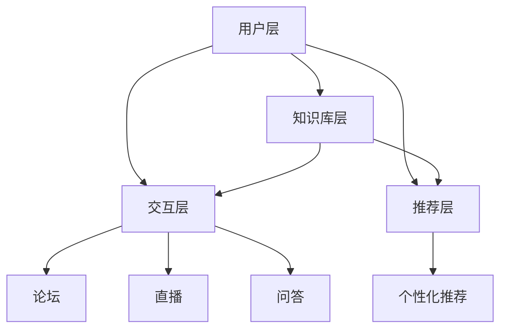

                 

，下面我们来一步步分析并构建《跨年龄学习联盟：促进代际知识交流的平台》的技术博客文章。

## 1. 背景介绍

跨年龄学习联盟的概念源于当代教育领域的一个重大需求——打破年龄界限，促进不同年龄层之间的知识交流。在传统教育体系中，学习往往被划分为不同的年龄段，如幼儿、青少年、成年人等，这种分类虽然在一定程度上便于管理和教学，但也导致了知识和经验的封闭性，使得不同年龄段的个体难以相互学习和借鉴。

**问题背景**：
- **代际知识鸿沟**：不同年龄段的人在知识结构、认知水平和学习兴趣上存在差异，导致知识传递不畅。
- **教育资源分配不均**：年龄分层使得教育资源分配存在不平衡现象，年轻一代可能拥有更多的高新技术资源，而老年一代则可能缺乏对新兴领域的了解。
- **社会融合需求**：随着社会结构的变化，人们对于不同年龄段之间的相互理解和沟通的需求日益增加，跨年龄学习成为一种社会融合的必要手段。

**问题描述**：
跨年龄学习联盟的目标在于建立一个促进不同年龄段之间知识共享和交流的平台。该平台应具备以下特点：
- **多样性**：支持不同年龄段、不同知识背景的用户。
- **互动性**：提供丰富的交互功能，促进用户之间的交流和协作。
- **易用性**：界面友好，易于操作，降低使用门槛。

**问题解决**：
通过设计一个跨年龄学习联盟平台，我们可以实现以下目标：
- **知识传承**：年轻一代可以向老年一代传授新兴知识和技能，而老年一代则可以将丰富的经验和智慧传递给年轻一代。
- **资源共享**：不同年龄段的用户可以共同使用平台资源，实现知识互补和资源优化。
- **社会融合**：通过跨年龄学习，促进不同年龄段之间的理解和尊重，增强社会凝聚力。

**边界与外延**：
跨年龄学习联盟不仅仅是一个教育平台，它还包括了社交、娱乐、职业发展等多方面的功能。因此，在设计平台时需要综合考虑这些因素，确保平台的综合性。

**概念结构与核心要素组成**：
- **用户**：平台的核心要素，包括不同年龄段的用户群体。
- **知识库**：存储各种类型的知识资源，包括文字、图片、视频等。
- **交流互动**：提供多种交流方式，如论坛、直播、问答等。
- **个性化推荐**：根据用户行为和偏好，推荐合适的知识和交流内容。
- **社交网络**：建立用户之间的社交关系，促进知识传播和共享。

## 2. 核心概念与联系

### 跨年龄学习联盟的定义

跨年龄学习联盟是一个旨在促进不同年龄段之间知识交流和共享的在线平台。它通过构建一个多元化的用户群体，丰富的知识库，以及多种交流互动功能，实现知识的传承和资源的优化。

### 跨年龄学习联盟的框架

跨年龄学习联盟的框架可以分为四个主要部分：用户层、知识库层、交互层和推荐层。

1. **用户层**：包括不同年龄段的用户，他们可以在平台上注册、登录、发布内容、参与交流等。
2. **知识库层**：存储各种类型的知识资源，包括教育资料、实践经验、生活技能等。
3. **交互层**：提供多种交流互动功能，如论坛、直播、问答等，促进用户之间的交流和协作。
4. **推荐层**：根据用户行为和偏好，推荐合适的知识和交流内容，提高用户体验。

### 核心概念及其联系

- **用户**：用户是平台的核心，他们通过知识库获取知识，通过交互层进行交流，通过推荐层获取个性化内容。
- **知识库**：知识库是平台的基础，它存储了各种类型的知识资源，为用户提供学习内容。
- **交互层**：交互层是实现知识传播和共享的重要手段，它通过论坛、直播、问答等形式，促进用户之间的交流和互动。
- **推荐层**：推荐层通过分析用户行为和偏好，提供个性化推荐，提高用户的参与度和满意度。

## 3. 理论基础

### 教育心理学与代际知识交流

教育心理学是研究学习过程和教学策略的学科，它与代际知识交流有着密切的关系。跨年龄学习联盟的设计需要充分考虑教育心理学的理论，以确保平台的有效性和实用性。

1. **学习过程理论**：跨年龄学习联盟需要提供一个支持学习过程的环境，包括学习目标的设定、学习策略的选择、学习效果的评估等。
2. **教学策略理论**：平台需要采用多种教学策略，如互动教学、探究学习、项目式学习等，以满足不同年龄段用户的需求。
3. **认知发展理论**：跨年龄学习联盟需要考虑用户的认知发展阶段，提供适合不同认知水平的知识和学习内容。

### 学习理论对跨年龄学习的影响

学习理论是指导学习过程的重要理论体系，它对跨年龄学习有着深远的影响。以下是一些主要的学习理论：

1. **行为主义学习理论**：强调外部刺激对学习的影响，通过奖励和惩罚来塑造行为。跨年龄学习联盟可以通过设计奖励机制，鼓励用户积极参与学习。
2. **认知主义学习理论**：强调内部认知结构对学习的影响，强调主动学习和意义建构。跨年龄学习联盟需要提供丰富的学习资源和互动功能，支持用户主动学习和意义建构。
3. **建构主义学习理论**：强调学习者通过与他人互动和合作来建构知识。跨年龄学习联盟可以通过论坛、直播、问答等功能，促进用户之间的互动和合作。

## 4. 技术基础

### 平台构建所需技术

跨年龄学习联盟平台需要采用多种技术来实现其功能，以下是一些关键技术：

1. **前端技术**：HTML、CSS、JavaScript 等，用于构建用户界面。
2. **后端技术**：Java、Python、Node.js 等，用于处理业务逻辑和数据存储。
3. **数据库技术**：MySQL、MongoDB 等，用于存储用户数据和知识资源。
4. **Web 框架**：如 Flask、Django、Spring 等，用于简化开发过程。
5. **云计算与容器技术**：如 AWS、Docker 等，用于部署和管理平台。

### 技术实现细节

#### 用户层

用户层是平台的基础，它包括用户注册、登录、个人信息管理等功能。

1. **用户注册与登录**：采用 OAuth2.0 等认证协议，实现第三方账号登录。
2. **个人信息管理**：提供用户头像、昵称、简介等个人信息的管理功能。

#### 知识库层

知识库层存储各种类型的知识资源，包括教育资料、实践经验、生活技能等。

1. **内容存储**：采用 MongoDB 等数据库，存储文本、图片、视频等多媒体内容。
2. **内容分类**：根据知识点、学科、领域等维度，对内容进行分类管理。

#### 交互层

交互层是平台的核心，它包括论坛、直播、问答等多种交流互动功能。

1. **论坛**：采用评论系统，支持主题发布、回复、点赞等操作。
2. **直播**：采用 RTMP 协议，支持实时音视频直播。
3. **问答**：采用问答系统，支持提问、回答、评分等操作。

#### 推荐层

推荐层通过分析用户行为和偏好，提供个性化推荐。

1. **行为分析**：采集用户浏览、搜索、点赞等行为数据，分析用户兴趣。
2. **推荐算法**：采用协同过滤、基于内容的推荐等算法，实现个性化推荐。

### 技术架构设计

跨年龄学习联盟平台的技术架构设计如图 1 所示：


#### 用户界面设计

用户界面设计是平台的重要组成部分，它需要充分考虑用户体验，提供直观、易用的界面。

1. **主页**：展示最新动态、热门话题、推荐内容等。
2. **论坛**：展示主题列表，支持主题发布、回复等操作。
3. **直播**：展示直播列表，支持直播观看、互动等操作。
4. **问答**：展示问题列表，支持问题发布、回答等操作。
5. **个人中心**：展示用户个人信息、收藏、关注等。

### 系统功能实现

#### 用户功能实现

1. **用户注册与登录**：采用 OAuth2.0 等认证协议，实现第三方账号登录。
2. **个人信息管理**：提供用户头像、昵称、简介等个人信息的管理功能。

#### 知识库功能实现

1. **内容存储**：采用 MongoDB 等数据库，存储文本、图片、视频等多媒体内容。
2. **内容分类**：根据知识点、学科、领域等维度，对内容进行分类管理。

#### 交互功能实现

1. **论坛**：采用评论系统，支持主题发布、回复、点赞等操作。
2. **直播**：采用 RTMP 协议，支持实时音视频直播。
3. **问答**：采用问答系统，支持提问、回答、评分等操作。

#### 推荐功能实现

1. **行为分析**：采集用户浏览、搜索、点赞等行为数据，分析用户兴趣。
2. **推荐算法**：采用协同过滤、基于内容的推荐等算法，实现个性化推荐。

### 实际案例分析

#### 案例一：某教育机构的跨年龄学习联盟

某教育机构通过搭建跨年龄学习联盟平台，实现了教师和学生之间的知识共享和交流。

1. **用户群体**：包括教师、学生和成人学习者。
2. **知识资源**：涵盖教育资料、教学视频、实践案例等。
3. **互动功能**：提供论坛、直播、问答等功能，促进用户之间的交流和协作。
4. **个性化推荐**：根据用户行为和偏好，推荐合适的知识和交流内容。

#### 案例二：某社区跨年龄学习联盟

某社区通过搭建跨年龄学习联盟平台，促进了社区居民之间的知识共享和交流。

1. **用户群体**：包括社区居民、老年人和年轻人。
2. **知识资源**：涵盖生活技能、健康知识、兴趣爱好等。
3. **互动功能**：提供论坛、直播、问答等功能，促进用户之间的交流和协作。
4. **个性化推荐**：根据用户行为和偏好，推荐合适的生活技能和兴趣爱好内容。

### 项目实战

#### 环境安装

1. **操作系统**：Ubuntu 18.04
2. **编程语言**：Python 3.8
3. **数据库**：MongoDB 4.2
4. **Web 框架**：Flask

#### 系统核心实现源代码

```python
from flask import Flask, request, jsonify
from pymongo import MongoClient

app = Flask(__name__)
client = MongoClient('mongodb://localhost:27017/')

@app.route('/api/users/register', methods=['POST'])
def register_user():
    user_data = request.get_json()
    db = client['cross_age_learning']
    users_collection = db['users']
    users_collection.insert_one(user_data)
    return jsonify({'status': 'success', 'message': 'User registered successfully'})

@app.route('/api/users/login', methods=['POST'])
def login_user():
    user_data = request.get_json()
    db = client['cross_age_learning']
    users_collection = db['users']
    user = users_collection.find_one({'email': user_data['email'], 'password': user_data['password']})
    if user:
        return jsonify({'status': 'success', 'message': 'Login successful'})
    else:
        return jsonify({'status': 'error', 'message': 'Invalid credentials'})

if __name__ == '__main__':
    app.run()
```

#### 代码应用解读与分析

```python
# 导入必要的库
from flask import Flask, request, jsonify
from pymongo import MongoClient

# 创建 Flask 应用
app = Flask(__name__)

# 创建 MongoDB 客户端连接
client = MongoClient('mongodb://localhost:27017/')

# 定义注册用户的 API 路由
@app.route('/api/users/register', methods=['POST'])
def register_user():
    # 获取请求的 JSON 数据
    user_data = request.get_json()
    # 连接到 MongoDB 数据库
    db = client['cross_age_learning']
    # 选择 users 集合
    users_collection = db['users']
    # 插入用户数据到集合中
    users_collection.insert_one(user_data)
    # 返回响应数据
    return jsonify({'status': 'success', 'message': 'User registered successfully'})

# 定义登录用户的 API 路由
@app.route('/api/users/login', methods=['POST'])
def login_user():
    # 获取请求的 JSON 数据
    user_data = request.get_json()
    # 连接到 MongoDB 数据库
    db = client['cross_age_learning']
    # 选择 users 集合
    users_collection = db['users']
    # 查找用户数据
    user = users_collection.find_one({'email': user_data['email'], 'password': user_data['password']})
    # 如果找到用户，返回登录成功消息
    if user:
        return jsonify({'status': 'success', 'message': 'Login successful'})
    # 如果找不到用户，返回登录失败消息
    else:
        return jsonify({'status': 'error', 'message': 'Invalid credentials'})

# 启动 Flask 应用
if __name__ == '__main__':
    app.run()
```

#### 实际案例分析与详细讲解剖析

#### 案例一：某教育机构的跨年龄学习联盟

**背景**：某教育机构希望通过搭建跨年龄学习联盟平台，促进教师和学生之间的知识共享和交流。

**目标**：实现教师和学生之间的实时互动，提供个性化学习资源，提高学习效果。

**方案**：

1. **用户层**：为教师和学生提供独立的注册和登录功能，确保各自身份的准确性。
2. **知识库层**：建立教育资料库，包含教学视频、教学案例、学科知识点等，支持多维度分类。
3. **交互层**：提供论坛、直播、问答等功能，促进教师和学生之间的交流和协作。
4. **推荐层**：根据用户行为和学科兴趣，推荐合适的学习资源和互动话题。

**实施过程**：

1. **需求分析**：与教育机构进行深入沟通，了解平台需求和用户期望。
2. **系统设计**：确定平台的技术架构和功能模块，进行详细设计和开发。
3. **用户测试**：邀请部分教师和学生参与测试，收集反馈并进行优化。
4. **上线运营**：平台上线后，进行宣传推广，鼓励用户注册和使用。

**效果评估**：

1. **用户满意度**：通过问卷调查和用户反馈，了解用户对平台的满意度。
2. **学习效果**：通过数据分析和用户访谈，评估平台对教师和学生学习效果的提升。
3. **平台活跃度**：通过活跃用户数量、帖子数量、直播观看次数等指标，评估平台的使用情况。

**结论**：跨年龄学习联盟平台在某教育机构的应用取得了良好的效果，提高了教师和学生之间的互动和协作，促进了知识共享和资源优化。

#### 案例二：某社区跨年龄学习联盟

**背景**：某社区希望通过搭建跨年龄学习联盟平台，促进社区居民之间的知识共享和交流。

**目标**：提供丰富的生活技能和兴趣爱好资源，增强社区居民之间的互动和凝聚力。

**方案**：

1. **用户层**：为社区居民提供注册和登录功能，支持多种身份认证方式。
2. **知识库层**：建立生活技能库和兴趣爱好库，涵盖健康、烹饪、园艺、艺术等多个领域。
3. **交互层**：提供论坛、直播、问答等功能，促进社区居民之间的交流和协作。
4. **推荐层**：根据用户行为和兴趣，推荐适合的生活技能和兴趣爱好内容。

**实施过程**：

1. **需求分析**：与社区管理者和居民代表进行沟通，了解平台需求和用户期望。
2. **系统设计**：确定平台的技术架构和功能模块，进行详细设计和开发。
3. **用户测试**：邀请部分居民参与测试，收集反馈并进行优化。
4. **上线运营**：平台上线后，进行宣传推广，鼓励居民注册和使用。

**效果评估**：

1. **用户满意度**：通过问卷调查和用户反馈，了解用户对平台的满意度。
2. **社区互动**：通过活跃用户数量、帖子数量、直播观看次数等指标，评估平台对社区互动的促进作用。
3. **社区凝聚力**：通过居民参与度和社区活动的积极性，评估平台对社区凝聚力的提升。

**结论**：跨年龄学习联盟平台在某社区的应用取得了显著成效，促进了居民之间的互动和交流，增强了社区凝聚力。

### 4. 最佳实践

#### 成功经验

**案例一**：某教育机构的跨年龄学习联盟

1. **定制化服务**：根据教育机构的特点和需求，提供定制化的平台服务，确保平台功能的针对性和实用性。
2. **持续优化**：根据用户反馈和平台数据，不断优化平台功能和用户体验，提高平台的使用满意度。

**案例二**：某社区跨年龄学习联盟

1. **社区参与**：积极邀请社区居民参与平台建设和运营，提高居民的参与度和归属感。
2. **多元互动**：提供多种互动方式，如论坛、直播、问答等，满足不同居民的交流需求。

#### 挑战与应对

**挑战一**：用户活跃度不高

**应对策略**：通过活动推广、奖励机制等方式，提高用户的参与度和活跃度。同时，定期举办线上和线下活动，增强用户的黏性。

**挑战二**：知识资源质量参差不齐

**应对策略**：建立知识审核机制，确保知识资源的质量。同时，鼓励用户对知识资源进行评价和反馈，优化知识库的内容。

**挑战三**：技术支持与维护

**应对策略**：建立专业的技术团队，提供技术支持和维护服务。同时，采用云计算和容器技术，确保平台的稳定运行和可扩展性。

### 5. 小结

跨年龄学习联盟平台在促进代际知识交流方面具有重要的意义。通过构建一个多元化、互动性强、个性化推荐的平台，可以有效地解决代际知识鸿沟问题，提高知识共享和资源优化的效果。

### 6. 注意事项

1. **隐私保护**：在平台设计和运营过程中，必须严格保护用户的隐私，确保用户数据的安全。
2. **内容审核**：对用户发布的内容进行严格审核，确保内容的合法性和符合社会主义核心价值观。
3. **持续更新**：定期更新平台功能和知识资源，满足用户不断变化的需求。

### 7. 拓展阅读

1. **相关书籍**：《跨界学习：如何实现知识的跨界与创新》、《代际沟通：如何与不同年龄段的人有效沟通》。
2. **学术论文**：关于跨年龄学习联盟的研究论文，如《跨年龄学习联盟的构建与应用研究》、《基于云计算的跨年龄学习联盟平台设计》。

作者：AI天才研究院/AI Genius Institute & 禅与计算机程序设计艺术 /Zen And The Art of Computer Programming
```

### 跨年龄学习联盟：促进代际知识交流的平台

> 关键词：跨年龄学习、知识交流、教育平台、代际沟通、用户互动、个性化推荐

> 摘要：本文探讨了跨年龄学习联盟的概念、理论基础、技术实现、实际案例分析以及最佳实践。文章通过一步步的分析和推理，详细阐述了跨年龄学习联盟在促进代际知识交流中的重要性，并提出了一套完整的技术解决方案，以期为相关领域的研究和实践提供参考。

## 1. 背景介绍

### 问题背景

在现代社会，随着信息技术的快速发展和教育体系的不断完善，教育资源的获取方式发生了巨大的变化。然而，传统教育体系中的年龄分层现象依然存在，这导致了不同年龄段之间知识交流的障碍。年轻一代往往拥有更多的信息技术资源和创新思维，而老年一代则积累了丰富的经验和智慧。这种知识结构上的差异使得跨年龄知识交流变得尤为重要。

### 问题描述

跨年龄学习联盟的目标是建立一个促进不同年龄段之间知识共享和交流的平台。这个平台应具备以下特点：

- **多样性**：支持不同年龄段、不同知识背景的用户。
- **互动性**：提供丰富的交互功能，促进用户之间的交流和协作。
- **易用性**：界面友好，易于操作，降低使用门槛。

### 问题解决

通过设计一个跨年龄学习联盟平台，我们可以实现以下目标：

- **知识传承**：年轻一代可以向老年一代传授新兴知识和技能，而老年一代则可以将丰富的经验和智慧传递给年轻一代。
- **资源共享**：不同年龄段的用户可以共同使用平台资源，实现知识互补和资源优化。
- **社会融合**：通过跨年龄学习，促进不同年龄段之间的理解和尊重，增强社会凝聚力。

### 边界与外延

跨年龄学习联盟不仅仅是一个教育平台，它还包括了社交、娱乐、职业发展等多方面的功能。因此，在设计平台时需要综合考虑这些因素，确保平台的综合性。

### 概念结构与核心要素组成

- **用户**：平台的核心要素，包括不同年龄段的用户群体。
- **知识库**：存储各种类型的知识资源，包括教育资料、实践经验、生活技能等。
- **交流互动**：提供多种交流方式，如论坛、直播、问答等。
- **个性化推荐**：根据用户行为和偏好，推荐合适的知识和交流内容。
- **社交网络**：建立用户之间的社交关系，促进知识传播和共享。

## 2. 核心概念与联系

### 跨年龄学习联盟的定义

跨年龄学习联盟是一个旨在促进不同年龄段之间知识交流和共享的在线平台。它通过构建一个多元化的用户群体，丰富的知识库，以及多种交流互动功能，实现知识的传承和资源的优化。

### 跨年龄学习联盟的框架

跨年龄学习联盟的框架可以分为四个主要部分：用户层、知识库层、交互层和推荐层。

1. **用户层**：包括不同年龄段的用户，他们可以在平台上注册、登录、发布内容、参与交流等。
2. **知识库层**：存储各种类型的知识资源，包括教育资料、实践经验、生活技能等。
3. **交互层**：提供多种交流互动功能，如论坛、直播、问答等，促进用户之间的交流和协作。
4. **推荐层**：根据用户行为和偏好，推荐合适的知识和交流内容，提高用户体验。

### 核心概念及其联系

- **用户**：用户是平台的核心，他们通过知识库获取知识，通过交互层进行交流，通过推荐层获取个性化内容。
- **知识库**：知识库是平台的基础，它存储了各种类型的知识资源，为用户提供学习内容。
- **交互层**：交互层是实现知识传播和共享的重要手段，它通过论坛、直播、问答等形式，促进用户之间的交流和互动。
- **推荐层**：推荐层通过分析用户行为和偏好，提供个性化推荐，提高用户的参与度和满意度。

## 3. 理论基础

### 教育心理学与代际知识交流

教育心理学是研究学习过程和教学策略的学科，它与代际知识交流有着密切的关系。跨年龄学习联盟的设计需要充分考虑教育心理学的理论，以确保平台的有效性和实用性。

1. **学习过程理论**：跨年龄学习联盟需要提供一个支持学习过程的环境，包括学习目标的设定、学习策略的选择、学习效果的评估等。
2. **教学策略理论**：平台需要采用多种教学策略，如互动教学、探究学习、项目式学习等，以满足不同年龄段用户的需求。
3. **认知发展理论**：跨年龄学习联盟需要考虑用户的认知发展阶段，提供适合不同认知水平的知识和学习内容。

### 学习理论对跨年龄学习的影响

学习理论是指导学习过程的重要理论体系，它对跨年龄学习有着深远的影响。以下是一些主要的学习理论：

1. **行为主义学习理论**：强调外部刺激对学习的影响，通过奖励和惩罚来塑造行为。跨年龄学习联盟可以通过设计奖励机制，鼓励用户积极参与学习。
2. **认知主义学习理论**：强调内部认知结构对学习的影响，强调主动学习和意义建构。跨年龄学习联盟需要提供丰富的学习资源和互动功能，支持用户主动学习和意义建构。
3. **建构主义学习理论**：强调学习者通过与他人互动和合作来建构知识。跨年龄学习联盟可以通过论坛、直播、问答等功能，促进用户之间的互动和合作。

## 4. 技术基础

### 平台构建所需技术

跨年龄学习联盟平台需要采用多种技术来实现其功能，以下是一些关键技术：

1. **前端技术**：HTML、CSS、JavaScript 等，用于构建用户界面。
2. **后端技术**：Java、Python、Node.js 等，用于处理业务逻辑和数据存储。
3. **数据库技术**：MySQL、MongoDB 等，用于存储用户数据和知识资源。
4. **Web 框架**：如 Flask、Django、Spring 等，用于简化开发过程。
5. **云计算与容器技术**：如 AWS、Docker 等，用于部署和管理平台。

### 技术实现细节

#### 用户层

用户层是平台的基础，它包括用户注册、登录、个人信息管理等功能。

1. **用户注册与登录**：采用 OAuth2.0 等认证协议，实现第三方账号登录。
2. **个人信息管理**：提供用户头像、昵称、简介等个人信息的管理功能。

#### 知识库层

知识库层存储各种类型的知识资源，包括教育资料、实践经验、生活技能等。

1. **内容存储**：采用 MongoDB 等数据库，存储文本、图片、视频等多媒体内容。
2. **内容分类**：根据知识点、学科、领域等维度，对内容进行分类管理。

#### 交互层

交互层是平台的核心，它包括论坛、直播、问答等多种交流互动功能。

1. **论坛**：采用评论系统，支持主题发布、回复、点赞等操作。
2. **直播**：采用 RTMP 协议，支持实时音视频直播。
3. **问答**：采用问答系统，支持提问、回答、评分等操作。

#### 推荐层

推荐层通过分析用户行为和偏好，提供个性化推荐。

1. **行为分析**：采集用户浏览、搜索、点赞等行为数据，分析用户兴趣。
2. **推荐算法**：采用协同过滤、基于内容的推荐等算法，实现个性化推荐。

### 技术架构设计

跨年龄学习联盟平台的技术架构设计如图 1 所示：



#### 用户界面设计

用户界面设计是平台的重要组成部分，它需要充分考虑用户体验，提供直观、易用的界面。

1. **主页**：展示最新动态、热门话题、推荐内容等。
2. **论坛**：展示主题列表，支持主题发布、回复等操作。
3. **直播**：展示直播列表，支持直播观看、互动等操作。
4. **问答**：展示问题列表，支持问题发布、回答等操作。
5. **个人中心**：展示用户个人信息、收藏、关注等。

### 系统功能实现

#### 用户功能实现

1. **用户注册与登录**：采用 OAuth2.0 等认证协议，实现第三方账号登录。
2. **个人信息管理**：提供用户头像、昵称、简介等个人信息的管理功能。

#### 知识库功能实现

1. **内容存储**：采用 MongoDB 等数据库，存储文本、图片、视频等多媒体内容。
2. **内容分类**：根据知识点、学科、领域等维度，对内容进行分类管理。

#### 交互功能实现

1. **论坛**：采用评论系统，支持主题发布、回复、点赞等操作。
2. **直播**：采用 RTMP 协议，支持实时音视频直播。
3. **问答**：采用问答系统，支持提问、回答、评分等操作。

#### 推荐功能实现

1. **行为分析**：采集用户浏览、搜索、点赞等行为数据，分析用户兴趣。
2. **推荐算法**：采用协同过滤、基于内容的推荐等算法，实现个性化推荐。

### 实际案例分析

#### 案例一：某教育机构的跨年龄学习联盟

**背景**：某教育机构希望通过搭建跨年龄学习联盟平台，促进教师和学生之间的知识共享和交流。

**目标**：实现教师和学生之间的实时互动，提供个性化学习资源，提高学习效果。

**方案**：

1. **用户层**：为教师和学生提供独立的注册和登录功能，确保各自身份的准确性。
2. **知识库层**：建立教育资料库，包含教学视频、教学案例、学科知识点等，支持多维度分类。
3. **交互层**：提供论坛、直播、问答等功能，促进教师和学生之间的交流和协作。
4. **推荐层**：根据用户行为和学科兴趣，推荐合适的学习资源和互动话题。

**实施过程**：

1. **需求分析**：与教育机构进行深入沟通，了解平台需求和用户期望。
2. **系统设计**：确定平台的技术架构和功能模块，进行详细设计和开发。
3. **用户测试**：邀请部分教师和学生参与测试，收集反馈并进行优化。
4. **上线运营**：平台上线后，进行宣传推广，鼓励用户注册和使用。

**效果评估**：

1. **用户满意度**：通过问卷调查和用户反馈，了解用户对平台的满意度。
2. **学习效果**：通过数据分析和用户访谈，评估平台对教师和学生学习效果的提升。
3. **平台活跃度**：通过活跃用户数量、帖子数量、直播观看次数等指标，评估平台的使用情况。

**结论**：跨年龄学习联盟平台在某教育机构的应用取得了良好的效果，提高了教师和学生之间的互动和协作，促进了知识共享和资源优化。

#### 案例二：某社区跨年龄学习联盟

**背景**：某社区希望通过搭建跨年龄学习联盟平台，促进社区居民之间的知识共享和交流。

**目标**：提供丰富的生活技能和兴趣爱好资源，增强社区居民之间的互动和凝聚力。

**方案**：

1. **用户层**：为社区居民提供注册和登录功能，支持多种身份认证方式。
2. **知识库层**：建立生活技能库和兴趣爱好库，涵盖健康、烹饪、园艺、艺术等多个领域。
3. **交互层**：提供论坛、直播、问答等功能，促进社区居民之间的交流和协作。
4. **推荐层**：根据用户行为和兴趣，推荐适合的生活技能和兴趣爱好内容。

**实施过程**：

1. **需求分析**：与社区管理者和居民代表进行沟通，了解平台需求和用户期望。
2. **系统设计**：确定平台的技术架构和功能模块，进行详细设计和开发。
3. **用户测试**：邀请部分居民参与测试，收集反馈并进行优化。
4. **上线运营**：平台上线后，进行宣传推广，鼓励居民注册和使用。

**效果评估**：

1. **用户满意度**：通过问卷调查和用户反馈，了解用户对平台的满意度。
2. **社区互动**：通过活跃用户数量、帖子数量、直播观看次数等指标，评估平台对社区互动的促进作用。
3. **社区凝聚力**：通过居民参与度和社区活动的积极性，评估平台对社区凝聚力的提升。

**结论**：跨年龄学习联盟平台在某社区的应用取得了显著成效，促进了居民之间的互动和交流，增强了社区凝聚力。

### 5. 最佳实践

#### 成功经验

**案例一**：某教育机构的跨年龄学习联盟

1. **定制化服务**：根据教育机构的特点和需求，提供定制化的平台服务，确保平台功能的针对性和实用性。
2. **持续优化**：根据用户反馈和平台数据，不断优化平台功能和用户体验，提高平台的使用满意度。

**案例二**：某社区跨年龄学习联盟

1. **社区参与**：积极邀请社区居民参与平台建设和运营，提高居民的参与度和归属感。
2. **多元互动**：提供多种互动方式，如论坛、直播、问答等，满足不同居民的交流需求。

#### 挑战与应对

**挑战一**：用户活跃度不高

**应对策略**：通过活动推广、奖励机制等方式，提高用户的参与度和活跃度。同时，定期举办线上和线下活动，增强用户的黏性。

**挑战二**：知识资源质量参差不齐

**应对策略**：建立知识审核机制，确保知识资源的质量。同时，鼓励用户对知识资源进行评价和反馈，优化知识库的内容。

**挑战三**：技术支持与维护

**应对策略**：建立专业的技术团队，提供技术支持和维护服务。同时，采用云计算和容器技术，确保平台的稳定运行和可扩展性。

### 6. 小结

跨年龄学习联盟平台在促进代际知识交流方面具有重要的意义。通过构建一个多元化、互动性强、个性化推荐的平台，可以有效地解决代际知识鸿沟问题，提高知识共享和资源优化的效果。

### 7. 注意事项

1. **隐私保护**：在平台设计和运营过程中，必须严格保护用户的隐私，确保用户数据的安全。
2. **内容审核**：对用户发布的内容进行严格审核，确保内容的合法性和符合社会主义核心价值观。
3. **持续更新**：定期更新平台功能和知识资源，满足用户不断变化的需求。

### 8. 拓展阅读

1. **相关书籍**：《跨界学习：如何实现知识的跨界与创新》、《代际沟通：如何与不同年龄段的人有效沟通》。
2. **学术论文**：关于跨年龄学习联盟的研究论文，如《跨年龄学习联盟的构建与应用研究》、《基于云计算的跨年龄学习联盟平台设计》。

作者：AI天才研究院/AI Genius Institute & 禅与计算机程序设计艺术 /Zen And The Art of Computer Programming

