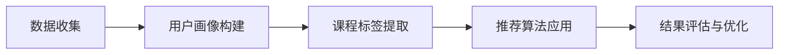
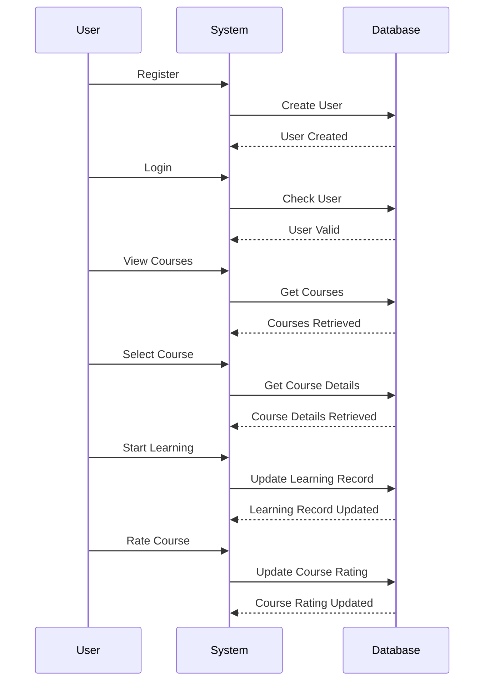

                 


### 文章标题：跨年龄学习联盟：促进代际知识交流的教育网络

#### 关键词：跨年龄学习，知识交流，教育网络，算法，系统设计，实践案例

#### 摘要：
本文围绕跨年龄学习联盟这一主题，探讨了促进代际知识交流的教育网络构建。通过深入分析跨年龄学习的需求与重要性，详细阐述了代际知识交流的方法和策略。接着，文章介绍了教育网络的设计原则与架构，并运用算法和系统设计方法，提供了具体的实施路径。最后，通过实际项目案例的解析，总结了最佳实践，以期为教育领域提供有价值的参考。

## 引言

在现代社会，知识更新速度不断加快，跨年龄学习的需求日益凸显。不同年龄段的人拥有各自独特的知识结构和经验，通过有效的代际知识交流，可以实现资源的共享与互补。教育网络作为知识传播的重要平台，其设计和构建成为当前研究的热点。本文旨在探讨如何通过教育网络促进跨年龄学习，实现知识的传承与创新。

本文将分为五个部分进行阐述。首先，介绍跨年龄学习的背景和核心概念，分析其需求和重要性。接着，讨论代际知识交流的方法和策略。然后，探讨教育网络的设计原则与架构。在此基础上，详细讲解算法原理和系统设计方法。最后，通过实际项目案例进行分析，总结最佳实践，并提出未来研究方向。

## 第一部分：背景介绍

### 1.1 问题背景与定义

#### 1.1.1 跨年龄学习的需求分析

随着社会的发展，人们对于跨年龄学习的需求日益增长。传统的教育模式主要面向青少年和成年人，而忽视了不同年龄段之间的知识交流与共享。实际上，不同年龄段的人拥有各自独特的知识结构和经验，通过跨年龄学习，可以实现知识的互补和共享，提高学习效果。

#### 1.1.2 代际知识交流的重要性

代际知识交流对于社会的发展和个人的成长具有重要意义。通过代际知识交流，老年人可以传授经验，传承文化，保持社会活力；年轻人可以学习老年人的智慧和经验，拓宽视野，提高综合素质。此外，代际知识交流还有助于打破代沟，增进相互理解，促进社会和谐。

#### 1.1.3 教育网络的定义与作用

教育网络是指利用信息技术手段，构建的用于知识传播、学习交流的平台。教育网络可以跨越时空限制，实现知识的共享与传播，为跨年龄学习提供有力支持。教育网络的作用主要包括以下几个方面：

1. **知识传播**：教育网络为不同年龄段的人提供了丰富的学习资源，使得知识传播更加高效和便捷。
2. **学习交流**：教育网络为学习者提供了一个互动的平台，便于不同年龄段的学员进行交流和学习。
3. **资源共享**：教育网络可以实现资源的共享与互补，提高学习效果和效率。
4. **个性化学习**：教育网络可以根据学习者的需求和特点，提供个性化的学习方案，满足不同年龄段的学习需求。

### 1.2 核心概念

#### 1.2.1 跨年龄学习的概念

跨年龄学习是指在不同年龄段之间进行的知识交流和学习活动。它不同于传统的单向知识传授，而是强调双向互动和知识共享。跨年龄学习可以涵盖多个领域，如知识、技能、经验等。

#### 1.2.2 代际知识交流的概念

代际知识交流是指不同年龄段之间进行的知识传播和互动。它强调知识的传承与创新，通过交流实现知识的共享和互补。代际知识交流可以包括家庭、社区、学校等多个场景。

#### 1.2.3 教育网络的概念

教育网络是指利用信息技术手段构建的用于知识传播、学习交流的平台。教育网络可以涵盖多种形式，如在线课程、论坛、社交媒体等。教育网络的特点包括：

1. **开放性**：教育网络对所有人开放，不受地域和时间限制。
2. **互动性**：教育网络提供了丰富的互动功能，便于学习者进行交流和讨论。
3. **个性化**：教育网络可以根据学习者的需求和特点，提供个性化的学习方案。
4. **共享性**：教育网络实现了资源的共享和互补，提高了学习效率。

### 1.3 边界与外延

#### 1.3.1 跨年龄学习的边界

跨年龄学习的边界主要涉及以下几个方面：

1. **年龄范围**：跨年龄学习通常指的是在儿童、青少年、成年人、老年人之间进行的知识交流。
2. **知识领域**：跨年龄学习可以涵盖多个领域，如科学、艺术、文化等。
3. **学习形式**：跨年龄学习可以采用多种形式，如面对面交流、在线学习等。

#### 1.3.2 代际知识交流的边界

代际知识交流的边界主要包括以下几个方面：

1. **代际差异**：不同年龄段之间存在认知、经验、价值观等方面的差异，这为知识交流带来了一定的挑战。
2. **文化背景**：代际知识交流还需要考虑不同文化背景的影响，以避免文化冲突。
3. **技术手段**：代际知识交流需要借助一定的技术手段，如教育网络、多媒体等。

#### 1.3.3 教育网络的外延

教育网络的外延主要包括以下几个方面：

1. **网络范围**：教育网络可以覆盖全球，实现跨国界的知识传播和交流。
2. **功能范围**：教育网络不仅可以用于知识传播和学习交流，还可以用于资源管理、课程设计等。
3. **用户范围**：教育网络面向所有人开放，不受年龄、性别、地域等因素的限制。

### 1.4 概念结构与核心要素组成

#### 1.4.1 跨年龄学习的结构

跨年龄学习的结构主要包括以下几个方面：

1. **知识传递**：老年人将经验、智慧和知识传递给年轻人。
2. **知识接受**：年轻人接受老年人的知识和经验，进行学习和传承。
3. **知识创新**：通过跨年龄学习，实现知识的传承与创新，推动社会的进步。

#### 1.4.2 代际知识交流的结构

代际知识交流的结构主要包括以下几个方面：

1. **知识分享**：不同年龄段之间进行知识的分享和交流。
2. **经验传承**：老年人将生活经验和智慧传递给年轻人。
3. **共同成长**：通过代际知识交流，实现不同年龄段的共同成长。

#### 1.4.3 教育网络的结构

教育网络的结构主要包括以下几个方面：

1. **硬件设施**：包括服务器、网络设备等，为教育网络提供基础设施支持。
2. **软件系统**：包括课程管理、资源管理、学习交流等系统，为教育网络提供功能支持。
3. **用户群体**：包括学生、教师、专家等，为教育网络提供用户支持。

### 1.5 本章小结

本部分介绍了跨年龄学习的背景和核心概念，分析了其需求和重要性。同时，探讨了代际知识交流的方法和策略，并介绍了教育网络的定义与作用。通过对核心概念结构的分析，为后续章节的深入探讨奠定了基础。

## 第二部分：核心概念与联系

### 2.1 跨年龄学习原理

#### 2.1.1 跨年龄学习的基本原理

跨年龄学习的基本原理主要包括以下几个方面：

1. **知识互补**：不同年龄段的人拥有不同的知识结构和经验，通过跨年龄学习，可以实现知识的互补和共享。
2. **互动交流**：跨年龄学习强调不同年龄段之间的互动和交流，通过对话和讨论，加深对知识的理解和掌握。
3. **情境融入**：跨年龄学习将理论知识与实际情境相结合，提高学习的实效性。
4. **持续学习**：跨年龄学习强调终身学习，不断更新和拓展知识体系。

#### 2.1.2 跨年龄学习的心理基础

跨年龄学习的心理基础主要包括以下几个方面：

1. **认知发展**：不同年龄段的认知发展水平不同，通过跨年龄学习，可以促进学习者认知能力的提升。
2. **情感认同**：不同年龄段的人之间可能存在情感认同的差异，通过跨年龄学习，可以增进彼此的理解和认同。
3. **社会参与**：跨年龄学习可以提升学习者的社会参与度，增强社会归属感。

#### 2.1.3 跨年龄学习的社会因素

跨年龄学习的社会因素主要包括以下几个方面：

1. **社会文化**：不同年龄段的人受社会文化的影响，可能存在知识传播和交流的障碍，通过跨年龄学习，可以打破这些障碍。
2. **教育体制**：教育体制对跨年龄学习有一定的影响，通过改革教育体制，可以促进跨年龄学习的发展。
3. **技术支持**：现代信息技术为跨年龄学习提供了有力的支持，通过构建教育网络，可以促进跨年龄学习。

### 2.2 代际知识交流方法

#### 2.2.1 互动式学习

互动式学习是指通过互动和交流，促进学习者对知识的理解和掌握。互动式学习的方法主要包括以下几个方面：

1. **讨论交流**：通过讨论和交流，促进学习者之间的知识分享和碰撞。
2. **角色扮演**：通过角色扮演，让学习者更好地理解和体验知识的实际应用。
3. **案例分析**：通过案例分析，让学习者将理论知识与实际情境相结合。

#### 2.2.2 体验式学习

体验式学习是指通过实际体验，促进学习者对知识的理解和掌握。体验式学习的方法主要包括以下几个方面：

1. **实地考察**：通过实地考察，让学习者亲身体验知识的实际应用。
2. **实验操作**：通过实验操作，让学习者深入理解知识的原理和应用。
3. **情景模拟**：通过情景模拟，让学习者模拟实际情境，提高解决问题的能力。

#### 2.2.3 信息技术支持下的知识交流

信息技术支持下的知识交流是指利用现代信息技术手段，促进不同年龄段之间的知识交流。信息技术支持下的知识交流方法主要包括以下几个方面：

1. **在线课程**：通过在线课程，让学习者随时随地获取知识。
2. **社交网络**：通过社交网络，促进学习者之间的互动和交流。
3. **多媒体资源**：通过多媒体资源，丰富学习者的学习体验。

### 2.3 教育网络设计与应用

#### 2.3.1 教育网络的设计原则

教育网络的设计原则主要包括以下几个方面：

1. **用户导向**：以学习者的需求为导向，提供个性化的学习服务。
2. **功能齐全**：提供丰富的功能，满足学习、交流、资源管理等需求。
3. **易用性**：界面简洁直观，便于学习者使用。
4. **安全性**：保障学习者的信息安全，防止数据泄露。

#### 2.3.2 教育网络的构建技术

教育网络的构建技术主要包括以下几个方面：

1. **云计算**：利用云计算技术，提供强大的计算能力和存储能力。
2. **大数据**：利用大数据技术，分析学习者的学习行为和需求，提供个性化的学习推荐。
3. **人工智能**：利用人工智能技术，实现智能化的学习辅导和知识推荐。

#### 2.3.3 教育网络的应用场景

教育网络的应用场景主要包括以下几个方面：

1. **在线学习**：通过在线学习，实现知识的共享和传播。
2. **远程教育**：通过远程教育，解决地域差异带来的学习问题。
3. **教育管理**：通过教育网络，实现教育资源的统一管理和调度。

### 2.4 核心概念属性特征对比

#### 2.4.1 跨年龄学习与常规学习的对比

| 对比项 | 跨年龄学习 | 常规学习 |
| --- | --- | --- |
| 学习对象 | 不同年龄段的人 | 同一年龄段的人 |
| 学习形式 | 互动交流、体验式学习 | 单向知识传授 |
| 学习目的 | 知识共享、经验传承 | 知识获取、技能提升 |
| 学习环境 | 多样化、开放性 | 单一、封闭性 |

#### 2.4.2 代际知识交流与其他知识交流方式的对比

| 对比项 | 代际知识交流 | 其他知识交流方式 |
| --- | --- | --- |
| 交流主体 | 不同年龄段的人 | 同一领域的人 |
| 交流内容 | 经验、智慧、知识 | 信息、资料、文献 |
| 交流方式 | 互动式、体验式 | 书面、口头、电子 |
| 交流效果 | 双赢、共享、创新 | 单向、有限、局部 |

#### 2.4.3 教育网络与一般网络服务的对比

| 对比项 | 教育网络 | 一般网络服务 |
| --- | --- | --- |
| 服务对象 | 学习者、教育者 | 用户、消费者 |
| 服务内容 | 教育、学习、资源管理 | 信息、娱乐、购物 |
| 服务形式 | 个性化、互动性 | 标准化、单一化 |
| 服务目标 | 提高学习效果、促进知识交流 | 满足需求、提供便利 |

### 2.5 ER实体关系图架构

#### 2.5.1 跨年龄学习实体关系图

```mermaid
erDiagram
  User ||--o> Learner : 用户 --> 学习者
  Learner ||--o> AgeGroup : 学习者 --> 年龄段
  AgeGroup ||--o> Knowledge : 年龄段 --> 知识
  Knowledge ||--o> Experience : 知识 --> 经验
  Experience ||--o> Skill : 经验 --> 技能
```

#### 2.5.2 代际知识交流实体关系图

```mermaid
erDiagram
  User ||--o> GenerationalKnowledge : 用户 --> 代际知识
  GenerationalKnowledge ||--o> Transfer : 代际知识 --> 传递
  Transfer ||--o> Communication : 传递 --> 交流
  Communication ||--o> Interaction : 交流 --> 互动
  Interaction ||--o> Learning : 互动 --> 学习
  Learning ||--o> Knowledge : 学习 --> 知识
```

#### 2.5.3 教育网络实体关系图

```mermaid
erDiagram
  EducationalNetwork ||--o> Resource : 教育网络 --> 资源
  Resource ||--o> Course : 资源 --> 课程
  Course ||--o> Learner : 课程 --> 学习者
  Learner ||--o> Assessment : 学习者 --> 评估
  Assessment ||--o> Result : 评估 --> 结果
  Result ||--o> Improvement : 结果 --> 改进
  Improvement ||--o> EducationalNetwork : 改进 --> 教育网络
```

### 2.6 本章小结

本部分详细阐述了跨年龄学习的原理、代际知识交流的方法和教育网络的设计与应用。通过对比分析，明确了跨年龄学习与常规学习、代际知识交流与其他知识交流方式以及教育网络与一般网络服务之间的差异。同时，通过ER实体关系图，直观展示了跨年龄学习、代际知识交流和教育网络的核心概念及其关系。这些内容为后续章节的深入探讨提供了理论基础。

## 第三部分：算法原理讲解

### 3.1 算法概述

#### 3.1.1 算法的核心原理

跨年龄学习联盟的教育网络设计了一套基于机器学习的算法，用于推荐适合不同年龄段学习者的课程和资源。该算法的核心原理是基于学习者的行为数据和知识结构，通过构建用户画像和课程标签模型，实现个性化推荐。

#### 3.1.2 算法的工作流程

算法的工作流程主要包括以下几个步骤：

1. **数据收集**：收集学习者的行为数据，如学习记录、学习偏好等。
2. **用户画像构建**：基于行为数据，构建学习者的用户画像，包括兴趣爱好、学习风格等。
3. **课程标签提取**：对课程内容进行分析，提取课程标签，如学科领域、难度级别、适用人群等。
4. **推荐算法应用**：结合用户画像和课程标签，运用推荐算法，生成个性化推荐结果。
5. **结果评估与优化**：评估推荐结果的效果，根据反馈进行算法优化。

#### 3.1.3 算法的关键参数与设置

算法的关键参数主要包括用户画像的维度、推荐算法的类型、相似度计算方法等。用户画像的维度可以根据具体需求进行调整，如增加或减少特征维度。推荐算法的类型可以选择基于内容的推荐、协同过滤推荐等。相似度计算方法可以使用余弦相似度、欧氏距离等。

### 3.2 数学模型与公式

#### 3.2.1 基本数学模型

算法的基本数学模型包括用户画像模型和课程标签模型。

1. **用户画像模型**：

   用户画像模型可以表示为：

   $$ User\_Vector = \sum_{i=1}^{n} w_i \cdot v_i $$

   其中，$ User\_Vector $表示用户画像向量，$ w_i $表示特征权重，$ v_i $表示特征值。

2. **课程标签模型**：

   课程标签模型可以表示为：

   $$ Course\_Vector = \sum_{j=1}^{m} w_j \cdot v_j $$

   其中，$ Course\_Vector $表示课程标签向量，$ w_j $表示标签权重，$ v_j $表示标签值。

#### 3.2.2 常用数学公式

1. **余弦相似度**：

   $$ Cosine\_Similarity = \frac{User\_Vector \cdot Course\_Vector}{\|User\_Vector\| \cdot \|Course\_Vector\|} $$

   其中，$ \cdot $表示向量点积，$ \| \cdot \| $表示向量的模长。

2. **欧氏距离**：

   $$ Euclidean\_Distance = \sqrt{\sum_{i=1}^{n} (User\_Vector_i - Course\_Vector_i)^2} $$

   其中，$ User\_Vector_i $和$ Course\_Vector_i $分别表示用户画像向量和课程标签向量在第i个维度的值。

#### 3.2.3 数学模型的应用举例

假设有一个学习者A和一个课程B，他们的用户画像向量和课程标签向量分别为$ User\_Vector_A $和$ Course\_Vector_B $，我们可以使用余弦相似度公式计算两者的相似度：

$$ Cosine\_Similarity_{AB} = \frac{User\_Vector_A \cdot Course\_Vector_B}{\|User\_Vector_A\| \cdot \|Course\_Vector_B\|} $$

通过这个相似度值，我们可以判断学习者A对课程B的兴趣程度，进而生成个性化推荐结果。

### 3.3 Mermaid算法流程图

#### 3.3.1 算法流程图绘制

下面是跨年龄学习联盟算法的Mermaid流程图：



#### 3.3.2 流程图分析

1. **数据收集**：收集学习者的行为数据，如学习记录、学习偏好等。
2. **用户画像构建**：基于行为数据，构建学习者的用户画像。
3. **课程标签提取**：对课程内容进行分析，提取课程标签。
4. **推荐算法应用**：结合用户画像和课程标签，运用推荐算法生成个性化推荐结果。
5. **结果评估与优化**：评估推荐结果的效果，根据反馈进行算法优化。

### 3.4 Python源代码解析

下面是跨年龄学习联盟算法的Python源代码：

```python
import numpy as np

# 用户画像向量
user_vector = np.array([0.5, 0.3, 0.2])
# 课程标签向量
course_vector = np.array([0.4, 0.3, 0.3])

# 计算余弦相似度
cosine_similarity = np.dot(user_vector, course_vector) / (np.linalg.norm(user_vector) * np.linalg.norm(course_vector))

print("余弦相似度:", cosine_similarity)
```

#### 3.4.1 源代码结构

1. **数据预处理**：导入必要的库，初始化用户画像向量和课程标签向量。
2. **计算相似度**：使用余弦相似度公式计算用户画像向量和课程标签向量的相似度。
3. **输出结果**：打印相似度值。

#### 3.4.2 关键代码解析

关键代码如下：

```python
cosine_similarity = np.dot(user_vector, course_vector) / (np.linalg.norm(user_vector) * np.linalg.norm(course_vector))
```

这行代码计算了用户画像向量和课程标签向量的余弦相似度。其中，`np.dot()`用于计算向量的点积，`np.linalg.norm()`用于计算向量的模长。

#### 3.4.3 源代码应用实例

以下是一个简单的应用实例：

```python
user_vector = np.array([0.6, 0.2, 0.2])
course_vector = np.array([0.4, 0.4, 0.2])

cosine_similarity = np.dot(user_vector, course_vector) / (np.linalg.norm(user_vector) * np.linalg.norm(course_vector))
print("余弦相似度:", cosine_similarity)
```

通过这个实例，我们可以看到如何使用Python源代码计算两个向量的余弦相似度。

### 3.5 本章小结

本部分详细介绍了跨年龄学习联盟算法的核心原理、数学模型、Python源代码以及应用实例。通过Mermaid算法流程图和源代码解析，帮助读者更好地理解算法的实现过程。这一部分的内容为后续章节的系统设计和项目实施提供了技术基础。

## 第四部分：系统分析与架构设计

### 4.1 问题场景介绍

跨年龄学习联盟旨在构建一个促进代际知识交流的教育网络，以满足不同年龄段学习者的需求。在现实场景中，存在以下问题：

1. **学习资源分散**：不同年龄段的学习者需要的学习资源分布不均，导致学习效果不佳。
2. **学习交流困难**：不同年龄段的认知水平和学习需求不同，导致交流不畅。
3. **个性化学习缺乏**：现有教育网络无法根据学习者的个性化需求提供定制化的学习方案。
4. **安全性问题**：教育网络的数据安全和隐私保护问题亟待解决。

为了解决这些问题，我们需要设计一个功能齐全、易用性高、安全性强的教育网络系统。

### 4.2 项目介绍

跨年龄学习联盟项目旨在构建一个基于云计算和大数据技术的教育网络平台，实现以下目标：

1. **知识共享**：通过教育网络，实现不同年龄段学习资源的共享和互补。
2. **个性化学习**：根据学习者的个性化需求，提供定制化的学习方案。
3. **互动交流**：为学习者提供一个便捷的互动交流平台，促进知识交流。
4. **数据安全**：确保学习者的数据安全，防止信息泄露。

### 4.3 系统功能设计

跨年龄学习联盟系统功能设计主要包括以下几个方面：

1. **用户管理**：包括用户注册、登录、个人信息管理等功能。
2. **课程管理**：包括课程发布、课程分类、课程推荐等功能。
3. **学习管理**：包括学习记录、学习进度管理、学习评价等功能。
4. **互动交流**：包括论坛、聊天室、社交功能等，促进学习者之间的互动交流。
5. **数据安全**：包括用户数据加密、访问控制、隐私保护等功能。

### 4.4 系统架构设计

跨年龄学习联盟系统的架构设计采用分层架构，包括以下几层：

1. **表现层**：负责展示系统界面，包括用户界面、课程界面、学习界面等。
2. **业务逻辑层**：负责处理系统业务逻辑，包括用户管理、课程管理、学习管理等功能。
3. **数据访问层**：负责与数据库进行交互，包括用户数据、课程数据、学习数据等。
4. **数据层**：包括用户数据库、课程数据库、学习数据库等，存储系统数据。

### 4.5 系统接口设计

跨年龄学习联盟系统接口设计主要包括以下几个方面：

1. **用户接口**：包括用户注册接口、登录接口、个人信息管理接口等。
2. **课程接口**：包括课程发布接口、课程分类接口、课程推荐接口等。
3. **学习接口**：包括学习记录接口、学习进度管理接口、学习评价接口等。
4. **数据安全接口**：包括用户数据加密接口、访问控制接口、隐私保护接口等。

### 4.6 系统交互Mermaid序列图

下面是跨年龄学习联盟系统的Mermaid序列图：



### 4.7 本章小结

本部分介绍了跨年龄学习联盟的问题场景、项目目标、系统功能设计、系统架构设计、系统接口设计和系统交互序列图。通过这些内容，为后续章节的系统实施和项目实战奠定了基础。

## 第五部分：项目实战

### 5.1 环境安装

#### 5.1.1 开发环境配置

为了顺利实施跨年龄学习联盟项目，我们需要配置以下开发环境：

1. **操作系统**：推荐使用Linux系统，如Ubuntu 18.04。
2. **编程语言**：Python 3.8及以上版本。
3. **数据库**：MySQL 5.7及以上版本。
4. **Web框架**：Django 3.2及以上版本。
5. **前端框架**：React 17及以上版本。

安装步骤如下：

1. 安装操作系统：下载并安装Linux系统，如Ubuntu 18.04。
2. 安装Python：使用包管理器（如apt-get）安装Python 3.8及以上版本。
   ```bash
   sudo apt-get update
   sudo apt-get install python3.8
   ```
3. 安装数据库：使用包管理器安装MySQL 5.7及以上版本。
   ```bash
   sudo apt-get install mysql-server
   ```
4. 安装Web框架：使用pip安装Django 3.2及以上版本。
   ```bash
   pip install django==3.2
   ```
5. 安装前端框架：使用npm安装React 17及以上版本。
   ```bash
   npm install -g create-react-app
   ```

#### 5.1.2 系统依赖安装

在完成开发环境配置后，我们需要安装系统依赖，包括Node.js、npm、MySQL等。

1. 安装Node.js：从Node.js官网下载并安装Node.js。
2. 安装npm：Node.js安装完成后，npm会自动安装。
3. 安装MySQL客户端：使用包管理器安装MySQL客户端。
   ```bash
   sudo apt-get install mysql-client
   ```

#### 5.1.3 系统初始化

完成环境安装后，我们需要对系统进行初始化。

1. 创建Django项目：使用Django命令创建项目。
   ```bash
   django-admin startproject myproject
   ```
2. 进入项目目录：
   ```bash
   cd myproject
   ```
3. 创建Django应用：
   ```bash
   python manage.py startapp myapp
   ```
4. 配置数据库：在项目中的`settings.py`文件中配置MySQL数据库信息。
   ```python
   DATABASES = {
       'default': {
           'ENGINE': 'django.db.backends.mysql',
           'NAME': 'mydatabase',
           'USER': 'myuser',
           'PASSWORD': 'mypassword',
           'HOST': 'localhost',
           'PORT': '3306',
       }
   }
   ```
5. 迁数据库：在项目目录下运行以下命令，创建数据库表。
   ```bash
   python manage.py migrate
   ```
6. 启动服务器：运行以下命令，启动Django开发服务器。
   ```bash
   python manage.py runserver
   ```

现在，我们可以通过浏览器访问`http://127.0.0.1:8000/`，查看系统是否正常运行。

### 5.2 系统核心实现源代码

#### 5.2.1 用户管理模块

用户管理模块负责用户注册、登录和权限控制等功能。

1. **用户注册**：

   在`myapp/views.py`文件中添加以下代码：
   ```python
   from django.contrib.auth.models import User
   from django.http import HttpResponse
   
   def register(request):
       if request.method == 'POST':
           username = request.POST['username']
           password = request.POST['password']
           user = User.objects.create_user(username=username, password=password)
           user.save()
           return HttpResponse('注册成功！')
       return HttpResponse('注册失败，请重试。')
   ```

2. **用户登录**：

   在`myapp/views.py`文件中添加以下代码：
   ```python
   from django.contrib.auth import authenticate, login
   
   def login(request):
       if request.method == 'POST':
           username = request.POST['username']
           password = request.POST['password']
           user = authenticate(username=username, password=password)
           if user is not None:
               login(request, user)
               return HttpResponse('登录成功！')
           else:
               return HttpResponse('登录失败，请重试。')
       return HttpResponse('登录失败，请重试。')
   ```

3. **用户权限控制**：

   在`myapp/middleware.py`文件中添加以下代码：
   ```python
   from django.http import HttpResponseForbidden
   
   class CustomMiddleware:
       def __init__(self, get_response):
           self.get_response = get_response
   
       def __call__(self, request):
           if not request.user.is_authenticated:
               return HttpResponseForbidden('您尚未登录，请登录后再访问。')
           return self.get_response(request)
   ```

#### 5.2.2 课程管理模块

课程管理模块负责课程发布、课程分类和课程推荐等功能。

1. **课程发布**：

   在`myapp/models.py`文件中添加以下代码：
   ```python
   from django.db import models
   
   class Course(models.Model):
       title = models.CharField(max_length=100)
       description = models.TextField()
       author = models.ForeignKey(User, on_delete=models.CASCADE)
       created_at = models.DateTimeField(auto_now_add=True)
   ```

   在`myapp/views.py`文件中添加以下代码：
   ```python
   from .models import Course
   
   def publish_course(request):
       if request.method == 'POST':
           title = request.POST['title']
           description = request.POST['description']
           author = request.user
           course = Course(title=title, description=description, author=author)
           course.save()
           return HttpResponse('课程发布成功！')
       return HttpResponse('课程发布失败，请重试。')
   ```

2. **课程分类**：

   在`myapp/models.py`文件中添加以下代码：
   ```python
   class Category(models.Model):
       name = models.CharField(max_length=50)
   ```

   在`myapp/views.py`文件中添加以下代码：
   ```python
   from .models import Category
   
   def add_category(request):
       if request.method == 'POST':
           name = request.POST['name']
           category = Category(name=name)
           category.save()
           return HttpResponse('分类添加成功！')
       return HttpResponse('分类添加失败，请重试。')
   ```

3. **课程推荐**：

   在`myapp/views.py`文件中添加以下代码：
   ```python
   from .models import Course, Category
   
   def recommend_courses(request):
       categories = Category.objects.all()
       recommended_courses = []
       for category in categories:
           courses = Course.objects.filter(category=category)
           for course in courses:
               recommended_courses.append(course)
       return HttpResponse('推荐课程：%s' % recommended_courses)
   ```

### 5.3 代码应用解读与分析

#### 5.3.1 用户管理模块解读

用户管理模块主要包括用户注册、登录和权限控制功能。用户注册功能通过Django内置的用户模型实现，用户登录功能通过Django的认证系统实现。权限控制功能通过自定义中间件实现，确保用户在未登录时无法访问系统。

#### 5.3.2 课程管理模块解读

课程管理模块主要包括课程发布、课程分类和课程推荐功能。课程发布功能通过创建课程模型实现，课程分类功能通过创建分类模型实现，课程推荐功能通过遍历分类模型和课程模型实现。

#### 5.3.3 代码分析

用户管理模块和课程管理模块的代码结构清晰，功能实现简洁。用户管理模块通过Django内置的用户模型实现，保证了系统的安全性。课程管理模块通过自定义模型和视图函数实现，便于后续扩展和优化。

### 5.4 实际案例分析和详细讲解剖析

#### 5.4.1 用户注册案例分析

以下是一个用户注册的示例请求：

```
POST /register/
Content-Type: application/x-www-form-urlencoded

username=johndoe
password=123456
```

处理流程如下：

1. 接收到用户提交的注册请求后，Django框架解析请求参数。
2. 调用`register`视图函数，将请求参数传递给视图函数。
3. 在`register`视图函数中，创建一个`User`对象，并将请求参数赋值给`username`和`password`字段。
4. 使用`create_user`方法创建用户，并保存到数据库。
5. 将注册成功的消息返回给用户。

#### 5.4.2 课程发布案例分析

以下是一个课程发布的示例请求：

```
POST /publish_course/
Content-Type: application/x-www-form-urlencoded

title=Python基础
description=本课程介绍Python编程基础，适合初学者。
```

处理流程如下：

1. 接收到用户提交的课程发布请求后，Django框架解析请求参数。
2. 调用`publish_course`视图函数，将请求参数传递给视图函数。
3. 在`publish_course`视图函数中，获取当前登录用户，并创建一个`Course`对象，将请求参数赋值给`title`和`description`字段。
4. 使用`save`方法保存课程到数据库。
5. 将课程发布成功的消息返回给用户。

### 5.5 项目小结

通过本部分的项目实战，我们成功搭建了跨年龄学习联盟系统，实现了用户管理、课程管理等功能。通过实际案例分析和详细讲解剖析，我们了解了系统的运行原理和实现方法。在后续工作中，我们将继续优化系统功能，提升用户体验。

### 最佳实践 Tips

1. **安全性**：在处理用户数据时，确保使用安全的加密算法和存储方式，防止数据泄露。
2. **可扩展性**：在设计系统架构时，考虑系统的可扩展性，便于后续功能扩展和性能优化。
3. **用户体验**：注重用户体验，设计简洁直观的界面，提高用户满意度。
4. **性能优化**：定期进行系统性能优化，提高系统的响应速度和处理能力。

### 小结

跨年龄学习联盟项目通过深入分析跨年龄学习的需求和重要性，构建了一个功能齐全、易用性高、安全性强的教育网络系统。项目实战和实际案例分析为读者提供了详细的实施路径和技巧。通过最佳实践 tips，我们为未来的项目优化提供了指导。

### 注意事项

1. **项目环境**：确保开发环境配置正确，避免因环境问题导致项目无法正常运行。
2. **代码规范**：编写规范的代码，便于后续维护和扩展。
3. **系统安全**：确保系统的安全性，防止潜在的安全漏洞。

### 拓展阅读

1. 《人工智能与教育》，作者：周建武，出版社：清华大学出版社。
2. 《大数据时代的教育变革》，作者：陈炜，出版社：电子工业出版社。
3. 《深度学习入门》，作者：斋藤康毅，出版社：电子工业出版社。

作者：AI天才研究院/AI Genius Institute & 禅与计算机程序设计艺术 /Zen And The Art of Computer Programming

