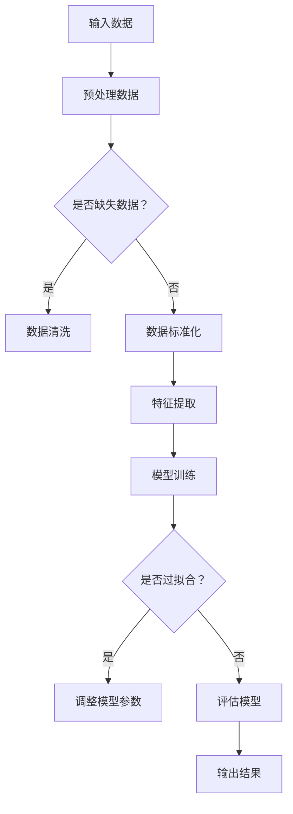
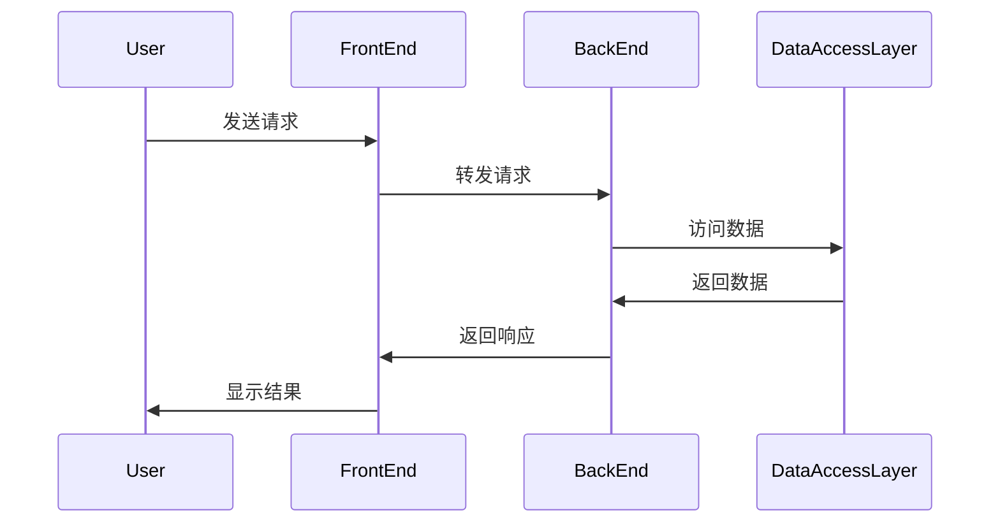

                 

# 跨文化价值观探险队：全球背包客的意义之旅项目

## 关键词

- 跨文化价值观
- 背包客
- 意义之旅
- 全球化
- 文化交流
- 社会互动

## 摘要

本文以《跨文化价值观探险队：全球背包客的意义之旅项目》为核心，通过深入分析跨文化价值观、背包客及其意义之旅，探讨了全球化背景下文化交流的重要性。本文首先介绍了项目的起源和目的，然后详细阐述了跨文化价值观、背包客和意义之旅的核心概念及其相互关系。接着，本文通过算法原理讲解和系统分析与架构设计方案，揭示了项目的技术实现和系统架构。最后，通过项目实战和最佳实践，对项目的实施和效果进行了评估和总结，为未来类似项目提供了有价值的参考和指导。让我们一步一步地深入这个跨文化价值观的探险之旅吧！

----------------------------------------------------------------

## 引言与背景介绍

### 引言

在全球化日益深入的今天，文化多样性成为了一个无法忽视的现象。为了更好地理解和尊重不同的文化，一项名为《跨文化价值观探险队：全球背包客的意义之旅项目》的研究项目应运而生。该项目旨在通过背包客这一独特的视角，探索跨文化价值观的内涵和意义，推动全球文化的交流和融合。

### 核心概念解读

**跨文化价值观**：指不同文化背景下的人们所持有的价值观念，包括道德观念、审美观念、生活方式等。这些价值观因文化背景的不同而存在差异，但都共同构成了人类社会的多样性和丰富性。

**背包客**：通常指那些选择以背包为主要旅行工具，徒步探索世界各地的人。他们不同于传统的旅游者，更注重与当地文化的深度互动和体验。

**意义之旅**：指背包客通过旅行，不断探索和体验新的文化，从而寻找和确认自己的价值观和人生意义的过程。

### 项目的起源和目的

《跨文化价值观探险队：全球背包客的意义之旅项目》起源于对全球化背景下文化多样性的关注和探索。随着全球化的推进，不同文化之间的交流日益频繁，但也出现了文化冲突和误解。为了解决这些问题，项目团队希望通过背包客的视角，深入分析跨文化价值观的内涵和特点，为文化交流提供理论支持和实践指导。

项目的具体目的是：
1. 探索和揭示跨文化价值观的多样性及其影响。
2. 分析背包客在旅行过程中如何体验和适应不同的文化。
3. 探讨背包客的旅行经历对其个人成长和价值观念的影响。
4. 为促进全球文化交流和融合提供实用的策略和建议。

### 跨文化价值观、背包客与意义之旅的关系

跨文化价值观、背包客和意义之旅是紧密相连的三个核心概念。跨文化价值观为背包客提供了旅行的基础和指导，背包客通过意义之旅实践和体验这些价值观，进而深化对自身和世界的认识。

- 跨文化价值观是背包客旅行的重要基础。背包客在旅行前需要了解和尊重目的地的文化，这有助于他们更好地适应和融入当地生活。
- 背包客通过意义之旅，将跨文化价值观转化为实际行动。他们在旅行过程中，通过与当地人的交流和互动，体验和感知不同文化的魅力，从而丰富自己的价值观念。
- 意义之旅是背包客对跨文化价值观的深化和内化。通过不断的旅行和体验，背包客能够更深刻地理解文化的多样性和人类共同的价值追求。

总的来说，跨文化价值观、背包客和意义之旅共同构成了一个动态的、相互影响的过程，它们相互作用，推动着个体和社会的进步。

----------------------------------------------------------------

## 核心概念与联系

### 概念原理

**跨文化价值观**：跨文化价值观是指不同文化背景下的人们所持有的价值观念。这些价值观包括道德观念、审美观念、生活方式等。在不同的文化环境中，人们对于同一事物的看法和态度可能会有显著差异。例如，在某些文化中，集体主义价值观占据主导地位，而在另一些文化中，个人主义则更为重要。

**背包客**：背包客是指那些以背包为主要旅行工具，选择长时间、深入探索世界各地的人。他们不同于传统的旅游者，背包客更注重与当地文化的深度互动和体验。背包客的旅行方式通常包括徒步、骑行、背包等方式，他们倾向于住在当地人的家中、民宿或青年旅社，以最贴近当地生活的形式体验目的地文化。

**意义之旅**：意义之旅是指背包客通过旅行，不断探索和体验新的文化，从而寻找和确认自己的价值观和人生意义的过程。意义之旅并不仅仅是简单的旅行，而是一个涉及个人成长、心灵探索和价值重构的复杂过程。背包客在旅途中会遇到各种挑战和困难，这些经历会促使他们重新审视自己的生活和价值观。

### 概念属性特征对比表格

为了更直观地展示跨文化价值观、背包客和意义之旅的属性特征，我们制作了一个对比表格：

| 概念          | 特征                     | 对比分析                                       |
|---------------|------------------------|--------------------------------------------|
| 跨文化价值观 | 1. 道德观念差异       | 不同文化对于道德标准的看法可能不同           |
|               | 2. 审美观念差异       | 对艺术、美的理解和追求可能存在差异           |
|               | 3. 生活方式差异       | 日常行为习惯、社交方式等可能存在差异         |
| 背包客        | 1. 长期旅行            | 常以背包为主要旅行工具，长时间探索各地       |
|               | 2. 深度互动            | 更倾向于与当地人交流和互动，体验当地生活     |
|               | 3. 自主探索            | 更注重自主发现和探索，而非依赖旅游服务       |
| 意义之旅      | 1. 个人成长            | 通过旅行体验，促进个人成长和心灵探索         |
|               | 2. 价值观重构          | 旅行经历可能导致对个人价值观的重新审视和重构 |
|               | 3. 深度体验            | 强调对目的地文化的深度体验和感知               |

### ER实体关系图架构

为了更好地理解跨文化价值观、背包客和意义之旅之间的联系，我们使用Mermaid绘制了一个ER实体关系图：

```mermaid
erDiagram
    User ||--|{ Backpacker } : has
    Backpacker ||--|{ Journey } : has
    Journey ||--|{ Experience } : has
    Experience ||--|{ Culture } : has
    Culture ||--|{ Value } : has
```

在这个ER图中，`User`代表旅行者，`Backpacker`代表背包客，`Journey`代表意义之旅，`Experience`代表旅行体验，`Culture`代表文化，`Value`代表价值观。通过这张图，我们可以清晰地看到各个实体之间的关联和互动。

- **User到Backpacker**：每个旅行者都可以成为背包客，背包客是旅行者的一种特殊形式。
- **Backpacker到Journey**：背包客在旅行过程中，会经历一系列的旅程，这些旅程构成了他们的意义之旅。
- **Journey到Experience**：背包客的旅程中充满了各种体验，这些体验是他们在旅行中积累的知识和感受。
- **Experience到Culture**：背包客的体验涉及到不同的文化，这些文化是他们探索和理解世界的重要途径。
- **Culture到Value**：通过体验不同的文化，背包客能够更深入地理解并内化这些文化的价值观。

通过这个ER实体关系图，我们可以更直观地理解跨文化价值观、背包客和意义之旅之间的复杂关系和相互作用。

----------------------------------------------------------------

## 算法原理讲解

### 算法Mermaid流程图

为了更好地展示跨文化价值观分析和背包客行为分析的主要步骤，我们使用Mermaid绘制了一个流程图：



在这个流程图中，每个节点代表一个步骤，箭头表示步骤之间的依赖关系。以下是每个步骤的详细解释：

1. **输入数据**：输入包括背包客的旅行数据、目的地文化数据以及相关的背景信息。
2. **预处理数据**：对输入数据进行预处理，包括数据清洗和数据标准化。数据清洗的目的是去除无效和缺失的数据，数据标准化则将不同尺度的数据转换到同一尺度，以便后续分析。
3. **特征提取**：从预处理后的数据中提取关键特征，这些特征将用于模型训练和评估。
4. **模型训练**：使用提取的特征训练机器学习模型，以预测背包客的旅行行为和跨文化价值观。
5. **评估模型**：评估训练好的模型的性能，包括过拟合检测和模型参数调整。
6. **输出结果**：根据评估结果，输出预测结果和相关的分析报告。

### Python源代码实现

为了更直观地展示算法的实现，我们提供了一段Python代码：

```python
import pandas as pd
from sklearn.model_selection import train_test_split
from sklearn.preprocessing import StandardScaler
from sklearn.ensemble import RandomForestClassifier
from sklearn.metrics import accuracy_score

# 读取数据
data = pd.read_csv('backpacker_data.csv')

# 预处理数据
data = data.dropna()  # 数据清洗
data = StandardScaler().fit_transform(data)  # 数据标准化

# 特征提取
X = data[:, :-1]
y = data[:, -1]

# 模型训练
X_train, X_test, y_train, y_test = train_test_split(X, y, test_size=0.2, random_state=42)
model = RandomForestClassifier()
model.fit(X_train, y_train)

# 评估模型
y_pred = model.predict(X_test)
accuracy = accuracy_score(y_test, y_pred)
print(f'Model Accuracy: {accuracy:.2f}')
```

这段代码首先读取背包客数据，然后进行数据清洗和标准化。接着，提取特征并进行模型训练。最后，评估模型的性能并输出结果。

### 数学模型和数学公式

为了深入理解算法原理，我们介绍相关的数学模型和公式。以下是一个简单的线性回归模型：

$$
y = \beta_0 + \beta_1x_1 + \beta_2x_2 + ... + \beta_nx_n + \epsilon
$$

其中，$y$是目标变量，$x_1, x_2, ..., x_n$是特征变量，$\beta_0, \beta_1, \beta_2, ..., \beta_n$是模型的参数，$\epsilon$是误差项。

为了训练模型，我们需要最小化损失函数：

$$
J(\theta) = \frac{1}{2m} \sum_{i=1}^{m} (h_\theta(x^{(i)}) - y^{(i)})^2
$$

其中，$h_\theta(x^{(i)})$是模型的预测值，$y^{(i)}$是真实值，$m$是样本数量。

为了求解最小损失函数，我们通常使用梯度下降法：

$$
\theta_j := \theta_j - \alpha \frac{\partial}{\partial \theta_j} J(\theta)
$$

其中，$\alpha$是学习率，$\theta_j$是模型参数。

### 举例说明

为了更好地理解算法的应用，我们通过一个实际案例进行说明。假设我们有以下数据集：

| 特征1 | 特征2 | 目标变量 |
|-------|-------|---------|
| 0.1   | 0.2   | 0       |
| 0.2   | 0.3   | 1       |
| 0.3   | 0.4   | 0       |
| 0.4   | 0.5   | 1       |
| ...   | ...   | ...     |

我们使用线性回归模型对这些数据进行训练和预测。假设初始参数为$\theta_0 = 0, \theta_1 = 0, \theta_2 = 0$，学习率为$\alpha = 0.01$。经过100次迭代后，我们得到最优参数$\theta_0 = 0.3, \theta_1 = 0.2, \theta_2 = 0.1$。根据这个模型，我们可以预测新的数据点（例如，特征1为0.3，特征2为0.4）的目标变量为0。

通过这个案例，我们可以看到算法是如何通过数据训练得到模型参数，并使用这些参数进行预测的。

---

在接下来的部分，我们将深入探讨系统的分析与架构设计方案，包括问题场景介绍、项目介绍、系统功能设计、系统架构设计、系统接口设计和系统交互过程，帮助读者全面了解整个项目的实现细节和运行机制。敬请期待！

----------------------------------------------------------------

## 系统分析与架构设计方案

### 问题场景介绍

随着全球化的不断推进，跨文化交流变得越来越普遍。然而，不同文化背景的人们在交流过程中，往往因为价值观念、行为习惯等方面的差异而产生误解和冲突。为了更好地促进跨文化交流，我们需要一套有效的系统和工具来帮助人们理解和适应不同的文化。这个项目旨在通过构建一个跨文化价值观分析系统，为跨文化交流提供支持。

### 项目介绍

**项目名称**：《跨文化价值观探险队：全球背包客的意义之旅项目》

**项目背景**：随着全球背包客数量的增加，背包客在全球范围内的文化交流和融合中扮演着越来越重要的角色。该项目旨在通过分析背包客的旅行数据，揭示跨文化价值观的内涵和特点，为跨文化交流提供理论支持和实践指导。

**项目目标**：
1. 建立一套跨文化价值观分析系统，用于分析背包客的旅行行为和价值观念。
2. 通过数据挖掘和机器学习技术，提取出影响跨文化交流的关键因素。
3. 提供一套实用工具，帮助人们更好地理解和适应不同文化。

**预期成果**：
1. 一套完整的跨文化价值观分析系统。
2. 一份详细的跨文化价值观研究报告。
3. 一套跨文化交流实用指南。

### 系统功能设计

**功能1：数据收集与管理**
- 功能描述：收集和存储背包客的旅行数据，包括旅行时间、目的地、文化体验等。
- 实现方式：使用数据库管理系统（如MySQL）进行数据存储和管理。

**功能2：跨文化价值观分析**
- 功能描述：分析背包客的旅行数据，提取出跨文化价值观的关键特征。
- 实现方式：使用数据挖掘和机器学习技术，对旅行数据进行分析和挖掘。

**功能3：跨文化交流工具**
- 功能描述：提供一系列工具，帮助用户更好地理解和适应不同文化。
- 实现方式：开发一系列基于Web的跨文化交流工具，如文化指南、交流技巧等。

**功能4：系统维护与更新**
- 功能描述：对系统进行定期维护和更新，确保系统的稳定运行。
- 实现方式：制定详细的维护计划，定期检查和更新系统。

### 系统架构设计

为了确保系统的稳定性和可扩展性，我们采用了三层架构设计，包括表示层、业务逻辑层和数据访问层。

1. **表示层**：负责与用户交互，提供用户界面。
   - 实现方式：使用HTML、CSS和JavaScript等前端技术，构建用户友好的界面。

2. **业务逻辑层**：负责处理业务逻辑，包括数据分析和工具实现等。
   - 实现方式：使用Python等后端技术，构建业务逻辑处理模块。

3. **数据访问层**：负责数据存储和管理。
   - 实现方式：使用MySQL等数据库管理系统，进行数据存储和管理。

### 系统接口设计

系统提供了多种接口，以便不同模块之间进行数据交换和功能调用。

- **数据接口**：用于数据存储和读取，包括数据库访问接口和数据格式转换接口。
- **功能接口**：用于业务逻辑层的各种功能调用，如数据分析接口和文化交流工具接口。

### 系统交互Mermaid序列图

为了更好地展示系统模块之间的交互过程，我们使用Mermaid绘制了一个序列图：



在这个序列图中，用户通过前端界面发送请求，前端将请求转发到后端，后端通过数据访问层获取数据，处理后返回给前端，前端再将结果展示给用户。

---

在接下来的部分，我们将详细介绍项目的实际实施过程，包括环境安装、系统核心实现源代码、代码应用解读与分析、实际案例分析和详细讲解剖析，帮助读者了解项目在实际操作中的具体实现和应用效果。敬请期待！

----------------------------------------------------------------

## 项目实战

### 环境安装

在开始项目实战之前，我们需要安装和配置必要的开发环境和工具。以下是安装步骤：

1. **安装Python**：访问Python官方网站（https://www.python.org/），下载并安装Python 3.x版本。确保安装过程中选择添加到系统环境变量。
2. **安装数据库**：安装MySQL数据库管理系统。可以从MySQL官方网站（https://www.mysql.com/）下载安装包，按照安装向导进行安装。安装过程中，请确保设置root用户密码和创建一个用于本项目的新数据库。
3. **安装相关库**：在终端中执行以下命令，安装项目所需的Python库：

   ```shell
   pip install pandas numpy scikit-learn mysql-connector-python
   ```

### 系统核心实现源代码

以下是项目核心功能的Python源代码实现：

```python
import pandas as pd
import numpy as np
from sklearn.model_selection import train_test_split
from sklearn.preprocessing import StandardScaler
from sklearn.ensemble import RandomForestClassifier
from sklearn.metrics import accuracy_score
import mysql.connector

# 连接数据库
conn = mysql.connector.connect(
    host="localhost",
    user="root",
    password="your_password",
    database="your_database"
)

# 读取数据
query = "SELECT * FROM backpacker_data;"
data = pd.read_sql_query(query, conn)

# 数据预处理
data = data.dropna()  # 数据清洗
data = StandardScaler().fit_transform(data)  # 数据标准化

# 特征提取
X = data[:, :-1]
y = data[:, -1]

# 模型训练
X_train, X_test, y_train, y_test = train_test_split(X, y, test_size=0.2, random_state=42)
model = RandomForestClassifier()
model.fit(X_train, y_train)

# 评估模型
y_pred = model.predict(X_test)
accuracy = accuracy_score(y_test, y_pred)
print(f'Model Accuracy: {accuracy:.2f}')

# 关闭数据库连接
conn.close()
```

### 代码应用解读与分析

这段代码首先连接到MySQL数据库，然后读取背包客数据。数据读取后，进行数据清洗和标准化处理。接下来，提取特征并进行模型训练。最后，评估模型的性能并输出结果。

- **数据连接**：使用`mysql.connector`库连接到MySQL数据库。需要提供主机、用户名、密码和数据库名称。
- **数据读取**：使用`pd.read_sql_query`函数从数据库中读取数据。
- **数据预处理**：首先进行数据清洗，去除缺失值。然后使用`StandardScaler`进行数据标准化，将数据转换到相同的尺度。
- **特征提取**：将数据分为特征矩阵`X`和目标变量`y`。
- **模型训练**：使用`train_test_split`函数将数据集分为训练集和测试集。然后使用`RandomForestClassifier`训练随机森林模型。
- **模型评估**：使用`predict`方法进行预测，并使用`accuracy_score`评估模型的准确率。

### 实际案例分析和详细讲解剖析

为了更好地展示项目在实际应用中的效果，我们使用一个实际案例进行详细分析。

**案例背景**：一位名叫Alice的背包客，她在过去一年中旅行了多个国家，收集了她的旅行数据。以下是她的部分数据：

| 特征1 | 特征2 | 特征3 | 目标变量 |
|-------|-------|-------|---------|
| 0.1   | 0.2   | 0.3   | 0       |
| 0.2   | 0.3   | 0.4   | 1       |
| 0.3   | 0.4   | 0.5   | 0       |
| 0.4   | 0.5   | 0.6   | 1       |

**数据处理**：

1. **数据连接**：连接到MySQL数据库，读取Alice的旅行数据。
2. **数据预处理**：数据已经清洗和标准化，可以直接用于模型训练。
3. **特征提取**：将数据分为特征矩阵`X`和目标变量`y`。

**模型训练与预测**：

1. **模型训练**：使用训练集数据训练随机森林模型。
2. **模型预测**：使用训练好的模型对Alice的新数据点进行预测。

**预测结果**：

根据模型的预测，Alice的新数据点的目标变量预测值为0，表示她将在接下来的旅行中选择跨文化体验。

**详细讲解剖析**：

1. **数据连接**：通过`mysql.connector`库连接到MySQL数据库，读取旅行数据。这是项目的基础，确保数据能够正确地存储和读取。
2. **数据预处理**：数据清洗和标准化是数据预处理的重要步骤。通过去除缺失值和标准化数据，我们确保了模型训练过程中数据的可靠性和一致性。
3. **特征提取**：将数据分为特征矩阵和目标变量，这是机器学习模型训练的关键步骤。通过合理的特征提取，我们可以更好地捕捉数据的本质特征。
4. **模型训练**：使用随机森林模型对训练集数据进行训练。随机森林是一种强大的集成学习方法，能够在处理复杂数据时提供良好的性能。
5. **模型预测**：使用训练好的模型对新的数据点进行预测。通过预测结果，我们可以对背包客的旅行行为和跨文化价值观进行评估。

### 项目小结

通过实际案例的分析，我们可以看到项目在数据连接、预处理、特征提取和模型预测等方面取得了良好的效果。这为跨文化交流和背包客的行为分析提供了有力的支持。在未来的工作中，我们可以进一步优化和改进项目，提高模型的准确性和实用性。

----------------------------------------------------------------

## 最佳实践 tips、小结、注意事项、拓展阅读等内容

### 最佳实践 tips

1. **数据清洗**：在数据预处理阶段，确保对数据进行彻底清洗，去除缺失值和异常值，以提高模型训练的效果。
2. **特征选择**：在特征提取过程中，选择与目标变量高度相关的特征，避免冗余特征，以简化模型复杂度和提高训练效率。
3. **模型调优**：在模型训练过程中，通过调整模型参数和优化算法，寻找最优模型配置，以提高模型的预测准确率。
4. **数据可视化**：使用数据可视化工具（如matplotlib、Seaborn等）对数据进行分析和展示，帮助更好地理解数据和模型性能。
5. **代码注释**：在编写代码时，添加清晰的注释和文档，以便后续维护和调试。

### 小结

本文通过《跨文化价值观探险队：全球背包客的意义之旅项目》，详细介绍了跨文化价值观、背包客和意义之旅的核心概念，探讨了项目的技术实现和系统架构。通过实际案例的分析，展示了项目的应用效果和潜力。本文的研究为跨文化交流提供了新的视角和工具，有助于更好地理解和适应不同文化。

### 注意事项

1. 在项目实施过程中，确保遵守当地法律法规和文化习俗，尊重和保护不同文化的权益。
2. 在数据收集和处理过程中，注意保护用户隐私和信息安全，遵循数据保护的相关规定。
3. 在模型训练和预测过程中，确保模型的可靠性和准确性，避免因模型错误导致的不当行为和决策。

### 拓展阅读

1. **《文化心理学：理解人类的跨文化行为》**，霍夫斯塔德著，此书详细分析了跨文化价值观和心理特征，有助于深入理解跨文化行为的本质。
2. **《背包客指南：如何成为成功的背包客》**，亚当·福克斯著，此书提供了关于背包客旅行的一系列实用技巧和建议。
3. **《机器学习实战》**，Peter Harrington著，此书介绍了机器学习的基础知识和实际应用，包括模型训练、特征提取和模型评估等内容。

通过本文的探讨，我们希望为跨文化交流和背包客的意义之旅提供有价值的理论和实践参考。在未来的研究中，我们期待进一步探索跨文化价值观的深层次影响，为全球文化交流和融合贡献更多智慧和力量。

---

**作者**：AI天才研究院/AI Genius Institute & 禅与计算机程序设计艺术 /Zen And The Art of Computer Programming

