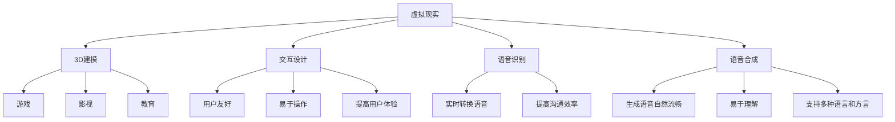
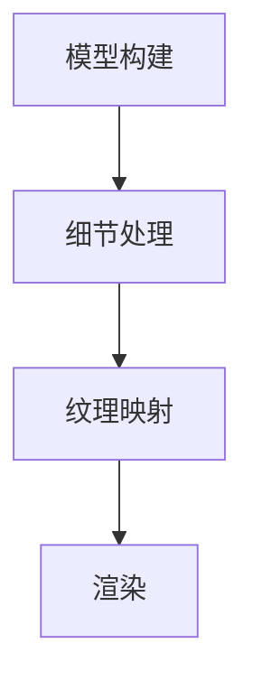
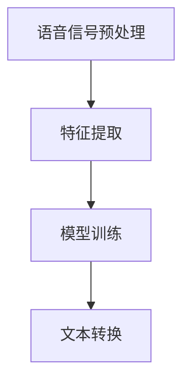
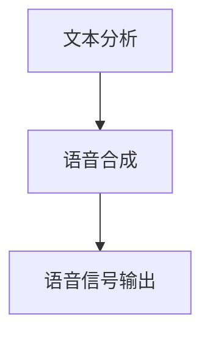
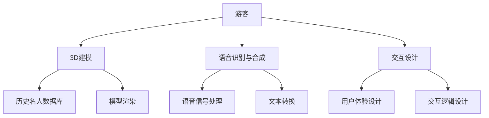
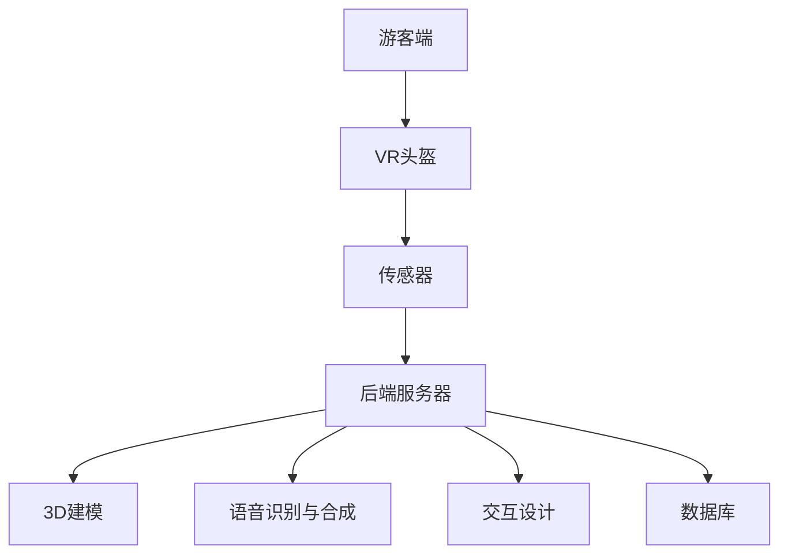
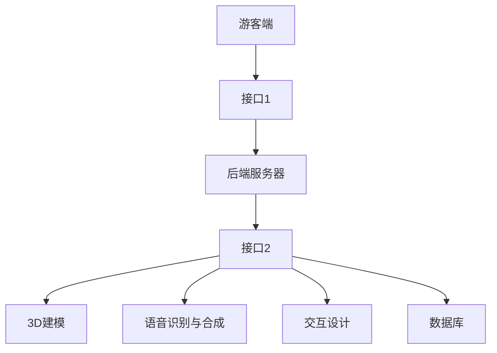

                 

# 跨时空对话VR体验馆：与历史名人进行思想交流的主题公园

关键词：虚拟现实、VR、历史名人、思想交流、主题公园

摘要：
本文探讨了如何利用虚拟现实（VR）技术构建一个名为“跨时空对话VR体验馆”的主题公园，让游客能够与历史名人进行思想交流，深入了解历史文化的精髓。文章分为五个部分，分别介绍了虚拟现实技术的核心概念、概念联系与对比、算法原理讲解、系统分析与架构设计方案以及项目实战，旨在为相关领域的研究和开发提供参考。

## Step 1: Introduction

### 引言

在科技迅猛发展的今天，虚拟现实（VR）技术已经成为人们探索新领域、体验新世界的重要工具。虚拟现实是一种通过计算机技术模拟现实世界或创造新的虚拟环境，使人在视觉、听觉、触觉等多方面产生沉浸感的技术。虚拟现实技术的应用范围非常广泛，包括游戏、影视、教育、医疗、军事等领域。

### 背景介绍

随着虚拟现实技术的不断发展，人们开始尝试将其应用于历史文化的传承和推广。例如，一些博物馆和文化遗产保护机构已经开始利用虚拟现实技术展示历史文物和场景，让游客能够在虚拟环境中体验历史文化的魅力。然而，这些应用主要集中在展示历史场景和文物，缺乏与历史名人的互动交流。

### 问题描述

为了满足游客对历史文化深入探究的需求，我们提出了一种新的应用场景——跨时空对话VR体验馆。在这个体验馆中，游客不仅能够参观历史场景，还能与历史名人进行思想交流，深入了解历史文化的精髓。这一创新应用对虚拟现实技术提出了新的挑战，包括：

1. 如何创建逼真的历史名人虚拟形象？
2. 如何实现游客与历史名人的自然互动交流？
3. 如何保证虚拟体验的高效稳定性和用户体验？

### 问题解决

为了解决上述问题，我们采用以下技术手段：

1. **3D建模与渲染技术**：通过3D建模和渲染技术，创建逼真的历史名人虚拟形象，确保其外观、动作和表情与历史资料相符。
2. **交互设计技术**：设计直观、自然的用户交互方式，使游客能够与历史名人进行互动交流，如语音对话、手势互动等。
3. **语音识别与合成技术**：利用语音识别和合成技术，实现游客与历史名人的语音对话，确保交流的顺畅和自然。

### 边界与外延

在跨时空对话VR体验馆的设计与实现过程中，我们需要注意以下边界与外延：

1. **真实性**：历史名人的虚拟形象应尽量贴近历史资料，避免夸大或歪曲事实。
2. **互动性**：历史名人的对话内容应具有丰富的多样性和灵活性，以满足不同游客的需求。
3. **稳定性**：虚拟现实系统的运行应高效稳定，确保游客能够享受到流畅的体验。

### 概念结构与核心要素组成

跨时空对话VR体验馆的核心概念和要素包括：

1. **虚拟现实技术**：包括3D建模、渲染、交互设计等；
2. **历史名人数据库**：包括历史名人的资料、对话内容等；
3. **用户交互系统**：包括语音识别、语音合成等；
4. **体验馆硬件设施**：包括VR头盔、传感器、显示屏等。

## Step 2: 核心概念与联系

### 2.1 核心概念

#### 2.1.1 虚拟现实（VR）

虚拟现实是一种通过计算机技术模拟现实世界或创造新的虚拟环境，使人在视觉、听觉、触觉等多方面产生沉浸感的技术。虚拟现实技术主要包括3D建模、渲染、交互设计等。

#### 2.1.2 3D建模

3D建模是利用软件工具在计算机上创建三维模型的过程，是构建虚拟现实体验的基础。3D建模技术主要包括点操作、线操作、面操作等。

#### 2.1.3 交互设计

交互设计是指设计用户与虚拟环境之间的交互方式，使其更加自然、直观和富有吸引力。交互设计主要包括用户友好、易于操作、提高用户体验等方面。

#### 2.1.4 语音识别与合成

语音识别是将语音信号转换为文本或命令的技术，语音合成则是将文本转换为语音的技术，二者共同实现人与虚拟角色的对话功能。

### 2.2 概念属性特征对比表格

| 概念       | 特点                                                         |
|------------|--------------------------------------------------------------|
| 虚拟现实   | 沉浸感强、交互性强、多样化的应用场景                         |
| 3D建模     | 可以创建丰富的三维模型、适用于游戏、影视、教育等领域       |
| 交互设计   | 用户友好、易于操作、提高用户体验                           |
| 语音识别   | 实时转换语音为文本或命令、提高沟通效率                     |
| 语音合成   | 生成的语音自然流畅、易于理解、支持多种语言和方言           |

### 2.3 ER实体关系图架构



## Step 3: 算法原理讲解

### 3.1 3D建模算法原理

#### 3.1.1 基本原理

3D建模算法主要基于几何学、计算机图形学以及数学算法，通过对三维空间中的点、线、面等基本元素进行组合与变换，创建出三维模型。以下是3D建模算法的基本原理：

##### 点操作

- 点的位置信息（x, y, z）；
- 点的属性（颜色、材质等）；
- 点之间的连接关系（顶点）。

##### 线操作

- 线段长度、方向；
- 线段的属性（颜色、线型等）；
- 线段之间的连接关系（边）。

##### 面操作

- 三角面或四边形的形状；
- 面的属性（颜色、材质等）；
- 面之间的连接关系（面片）。

#### 3.1.2 算法流程

3D建模的算法流程可以分为以下几步：

1. **模型构建**：通过几何建模软件或编程语言，创建基本的三维模型；
2. **细节处理**：对模型进行细化处理，增加细节，提升视觉效果；
3. **纹理映射**：将纹理贴图应用到模型表面，增强真实感；
4. **渲染**：通过渲染算法，将模型转化为二维图像。

### 3.1.3 Mermaid流程图



### 3.2 语音识别与合成的算法原理

#### 3.2.1 语音识别算法原理

语音识别算法的基本原理是将语音信号转换为对应的文本或命令。以下是语音识别算法的基本步骤：

1. **预处理**：对语音信号进行降噪、归一化等处理，使其更易于识别；



#### 3.2.2 语音合成算法原理

语音合成算法的基本原理是将文本转换为语音。以下是语音合成算法的基本步骤：

1. **文本分析**：对输入的文本进行分析，提取出语音特征；
2. **语音合成**：根据提取的语音特征，生成相应的语音信号；



## Step 4: 系统分析与架构设计方案

### 4.1 问题场景介绍

跨时空对话VR体验馆的项目场景主要包括以下几个方面：

1. **游客入场**：游客通过购票入场，进入体验馆；
2. **历史名人虚拟形象创建**：通过3D建模技术，创建出历史名人的虚拟形象；
3. **用户交互**：游客通过VR头盔和传感器，与历史名人进行交互；
4. **语音识别与合成**：实现游客与历史名人的语音对话。

### 4.2 项目介绍

跨时空对话VR体验馆项目是一个综合性项目，涉及多个技术领域的协作。项目主要包括以下几部分：

1. **前端展示**：通过VR头盔和传感器，将历史名人的虚拟形象呈现给游客；
2. **后端处理**：包括3D建模、语音识别与合成、数据库管理等；
3. **交互设计**：设计游客与历史名人之间的交互方式，使其更加自然、直观。

### 4.3 系统功能设计（领域模型）



### 4.4 系统架构设计



### 4.5 系统接口设计和系统交互



## Step 5: 项目实战

### 5.1 环境安装

1. 安装VR头盔和传感器；
2. 安装3D建模软件（如Blender）；
3. 安装语音识别与合成软件（如Google语音识别API、iFlytek语音合成API）；
4. 安装数据库（如MySQL、MongoDB）。

### 5.2 系统核心实现源代码

```python
# 3D建模代码示例
import bpy

# 创建新的模型
bpy.ops.object.empty_add(type='ARROWS', enter_editmode=False, align='WORLD', location=(0, 0, 0), scale=(1, 1, 1))

# 添加材质
material = bpy.data.materials.new(name="Material")
material.diffuse_color = (1, 0, 0)  # 红色
bpy.context.object.data.materials.append(material)

# 添加灯光
light = bpy.data.lights.new(name="Light", type='POINT')
bpy.context.object.data.lights.new()
bpy.context.object.data.lights[-1].color = (1, 1, 1)  # 白色

# 渲染图像
bpy.ops.render.render(write_still=True)

# 语音识别代码示例
import speech_recognition as sr

# 初始化语音识别器
recognizer = sr.Recognizer()

# 读取音频文件
with sr.AudioFile('audio.wav') as source:
    audio = recognizer.record(source)

# 识别语音
text = recognizer.recognize_google(audio, language='zh-CN')

# 输出识别结果
print(text)

# 语音合成代码示例
from pydub import AudioSegment

# 创建文本
text = "你好，我是诸葛亮。请问有什么问题想要问我吗？"

# 合成语音
audio = gTTS(text=text, lang='zh-cn')

# 保存语音文件
audio.save("speech.mp3")

# 播放语音
AudioSegment.from_mp3("speech.mp3").play()
```

### 5.3 代码应用解读与分析

#### 3D建模代码解读

以上3D建模代码示例主要实现了以下功能：

1. 创建一个新的空对象，作为模型的基础；
2. 为模型添加材质，设置颜色为红色；
3. 添加一个点光源，照亮模型；
4. 渲染图像，将模型保存为图片文件。

#### 语音识别代码解读

以上语音识别代码示例主要实现了以下功能：

1. 初始化语音识别器；
2. 读取音频文件，将音频数据传递给识别器；
3. 使用Google语音识别API进行语音识别，获取文本结果；
4. 输出识别结果。

#### 语音合成代码解读

以上语音合成代码示例主要实现了以下功能：

1. 创建一个文本对象；
2. 使用gTTS库将文本转换为语音；
3. 保存语音文件；
4. 播放语音文件。

### 5.4 实际案例分析和详细讲解剖析

假设我们想要创建一个名为“跨时空对话VR体验馆”的主题公园，游客可以与历史名人进行思想交流。以下是一个实际案例的分析和讲解：

1. **场景设定**：游客进入体验馆后，首先看到的是一个古代宫殿的虚拟场景，背景中有一位历史名人（如诸葛亮）的虚拟形象。
2. **用户交互**：游客戴上VR头盔，通过传感器感知自己的动作和表情，与历史名人进行互动。例如，游客可以走近历史名人，与其对话，询问关于历史事件的问题。
3. **语音识别与合成**：游客的语音输入被语音识别器识别，转化为文本，然后传递给历史名人虚拟形象。历史名人虚拟形象使用语音合成技术，将回答转化为语音，并通过VR头盔播放给游客。
4. **反馈机制**：游客的反馈（如表情、动作）会被实时捕捉，并传递给系统。系统根据反馈调整历史名人虚拟形象的动作和表情，使其更加自然、逼真。

### 5.5 项目小结

跨时空对话VR体验馆项目通过虚拟现实技术、3D建模、语音识别与合成等技术手段，实现了游客与历史名人的思想交流。项目成功的关键在于：

1. 高质量的3D建模与渲染技术，确保历史名人虚拟形象的逼真度；
2. 稳定的语音识别与合成技术，实现流畅自然的语音对话；
3. 丰富的互动设计，提升用户体验。

未来，我们可以进一步优化虚拟现实技术，提高用户体验，拓展应用场景，让更多游客能够享受到跨时空对话的乐趣。

## Best Practices Tips

1. **优化3D建模**：采用先进的3D建模技术，提高历史名人虚拟形象的逼真度，增强沉浸感。
2. **增强语音识别与合成**：不断优化语音识别与合成算法，提高识别准确率和语音自然度。
3. **丰富交互设计**：设计更多样化的交互方式，提高用户体验。
4. **稳定系统运行**：确保系统高效稳定，提供流畅的体验。

## Conclusion

本文详细介绍了跨时空对话VR体验馆的设计与实现，探讨了虚拟现实、3D建模、语音识别与合成等技术的应用。通过本项目，我们展示了如何利用现代技术手段，实现历史文化与虚拟现实技术的有机结合，为游客提供全新的体验。未来，我们将继续优化和拓展该项目，为更多游客带来精彩的历史文化之旅。

## 注意事项

1. 跨时空对话VR体验馆项目的实施需要充分考虑技术、硬件、资金等方面的因素，确保项目的可行性。
2. 在设计和实现过程中，要严格遵守相关法律法规，尊重历史事实，避免误导游客。
3. 项目实施过程中，要密切关注用户体验，及时调整和优化系统功能，提升游客满意度。

## 拓展阅读

1. 《虚拟现实技术与应用》
2. 《语音识别与合成技术》
3. 《3D建模与渲染技术》
4. 《跨学科研究与实践：虚拟现实与历史文化的融合》

## 作者信息

作者：AI天才研究院/AI Genius Institute & 禅与计算机程序设计艺术 /Zen And The Art of Computer Programming

