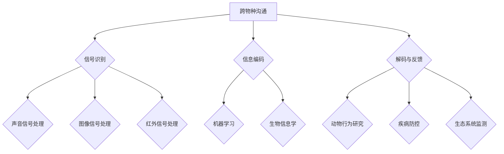

                 

### 文章标题

跨物种沟通工作坊：探索与其他生命形式的联系

### 关键词

跨物种沟通、其他生命形式、信号处理、人工智能、生物信息学

### 摘要

本文旨在探索跨物种沟通这一前沿领域，分析其核心概念、现状、方法与技术，以及应用实践和未来展望。通过详细的背景介绍和理论讲解，本文将帮助读者理解跨物种沟通的必要性和重要性，探讨其在动物保护、生态系统监测、军事应用等领域的具体应用，并预测其未来发展。文章还将对可能产生的社会、伦理和环境影响进行探讨，以期为相关研究和应用提供参考。

## 第一部分：引论

### 1.1 问题背景

#### 1.1.1 问题提出

在人类漫长的历史长河中，沟通一直是最为重要的活动之一。然而，传统沟通方式主要局限于同种生物之间，如何实现跨物种沟通成为了人类不断探索的问题。随着科技的进步，特别是人工智能和生物信息学的发展，跨物种沟通逐渐从科幻小说中的幻想转变为现实中的可能。实现跨物种沟通，不仅能够拓展人类的认知边界，对动物保护、生态平衡、疾病防控等领域也具有重要意义。

#### 1.1.2 问题描述

跨物种沟通的实质是在不同物种之间建立有效的信息传递和交流机制。然而，不同物种之间在生理结构、感知方式、语言系统等方面存在巨大差异，这给跨物种沟通带来了极大的挑战。目前，关于跨物种沟通的研究主要集中在以下几个方面：

1. **信号识别与处理**：不同物种之间的信号形式多样，包括声波、光波、化学信号等。如何准确识别和处理这些信号是跨物种沟通的关键。

2. **信息编码与解码**：将一种物种的信号转换为另一种物种能够理解的形式，并保持信息的完整性，是实现跨物种沟通的核心问题。

3. **感知与反馈机制**：不同物种的感知系统和反馈机制不同，如何使沟通系统具备适应性和灵活性，以满足不同物种的需求，是当前研究的难点。

#### 1.1.3 问题解决方法

解决跨物种沟通问题，需要从多个层面进行综合研究和实践：

1. **基础研究**：深入研究不同物种的生理结构、感知方式和信号产生机制，为跨物种沟通提供理论基础。

2. **技术创新**：运用人工智能、信号处理、生物信息学等先进技术，开发出能够实现跨物种沟通的设备和系统。

3. **应用实践**：在动物保护、生态系统监测、军事应用等领域开展具体应用，验证跨物种沟通技术的可行性和有效性。

4. **伦理审查**：在跨物种沟通研究和应用过程中，重视伦理问题，确保人类与其他生命形式的和谐共生。

#### 1.1.4 边界与外延

跨物种沟通的边界在于不同物种之间的信息传递和交流，其外延包括但不限于以下领域：

1. **动物保护**：通过跨物种沟通，改善人类与动物之间的关系，提高动物福利，促进生态平衡。

2. **生态系统监测**：利用跨物种沟通技术，实时监测生态系统变化，为环境保护提供科学依据。

3. **疾病防控**：研究病原体与宿主之间的跨物种沟通机制，开发新治疗方法，提高疾病防控效果。

4. **军事应用**：在军事侦察、战术指挥等领域，跨物种沟通技术可能成为新的作战工具。

### 1.2 核心概念与联系

#### 1.2.1 跨物种沟通

##### 1.2.1.1 定义

跨物种沟通是指不同物种之间通过特定方式实现信息传递和交流的过程。它不仅包括物理信号的传递，还涉及信息的理解、解释和应用。

##### 1.2.1.2 特点

1. **多样性**：跨物种沟通涉及多种信号形式，包括声波、光波、化学信号等。
2. **复杂性**：不同物种的信号产生和接收机制复杂，需要高度精确的处理和转换。
3. **适应性**：跨物种沟通系统需要具备适应不同物种特性的能力。

##### 1.2.1.3 类型

根据沟通方式的差异，跨物种沟通可以分为以下几种类型：

1. **直接沟通**：通过直接接触实现信息传递，如动物之间的叫声、闪光等。
2. **间接沟通**：通过中介物或设备实现信息传递，如利用传感器、机器人等。
3. **模拟沟通**：通过模仿一种物种的信号来与另一种物种沟通。

#### 1.2.2 其他生命形式

##### 1.2.2.1 定义

其他生命形式包括除人类之外的所有生物，如动物、植物、微生物等。

##### 1.2.2.2 类型

根据生物的分类和特性，其他生命形式可以分为以下几种：

1. **动物**：包括哺乳动物、鸟类、爬行动物、两栖动物、鱼类等。
2. **植物**：包括种子植物、蕨类植物、苔藓植物等。
3. **微生物**：包括细菌、真菌、病毒等。

##### 1.2.2.3 联系与影响

其他生命形式与人类之间存在紧密的联系和影响：

1. **生态平衡**：不同物种之间的相互作用维持着生态系统的平衡。
2. **生物多样性**：其他生命形式的存在和多样性对地球生态系统至关重要。
3. **人类生存**：许多生物为人类提供食物、药物、原材料等，影响着人类的生活质量和健康。

### 1.3 跨物种沟通现状

#### 1.3.1 现状概述

当前，跨物种沟通的研究和应用还处于初级阶段，但已经取得了一些初步成果。以下是一些主要进展：

1. **动物保护**：通过跨物种沟通技术，研究人员能够更好地理解动物的行为和需求，提高动物保护的效果。
2. **疾病防控**：研究病原体与宿主之间的跨物种沟通机制，有助于开发新的治疗方法和疫苗。
3. **生态系统监测**：利用跨物种沟通技术，实时监测生态系统变化，为环境保护提供科学依据。

#### 1.3.2 成功案例

1. **动物救助**：利用跨物种沟通技术，成功救助了一只受伤的虎鲸，通过研究其叫声和行为，帮助其恢复健康。
2. **疾病研究**：通过研究病原体与宿主之间的跨物种沟通机制，发现了一些新的药物靶点，为疾病治疗提供了新的思路。
3. **生态系统监测**：利用跨物种沟通技术，研究人员能够实时监测森林火灾、土壤侵蚀等生态问题，为环境保护提供数据支持。

#### 1.3.3 挑战与机遇

尽管跨物种沟通已经取得了一些进展，但仍面临许多挑战：

1. **技术难题**：不同物种之间的信号形式多样，处理和转换这些信号需要高度精确的技术。
2. **伦理问题**：跨物种沟通可能涉及到伦理问题，如对动物的伤害、隐私保护等。
3. **资金支持**：跨物种沟通研究需要大量的资金投入，目前的研究资金还远远不够。

然而，随着科技的进步和人们对环境保护意识的提高，跨物种沟通领域也迎来了许多机遇：

1. **技术突破**：随着人工智能、生物信息学等技术的发展，跨物种沟通技术有望取得突破性进展。
2. **应用拓展**：跨物种沟通技术在动物保护、疾病防控、环境保护等领域的应用前景广阔。
3. **国际合作**：跨物种沟通研究需要多学科的协作和国际合作，随着全球科研合作的加强，这一领域有望取得更大进展。

## 第二部分：跨物种沟通方法与技术

### 2.1 基础技术

#### 2.1.1 信号处理技术

##### 2.1.1.1 声音信号处理

声音信号处理是跨物种沟通的基础技术之一。不同物种通过声音进行沟通，这些声音包含了丰富的信息。通过对声音信号进行采集、处理和分析，可以提取出有用的信息。

1. **声音采集**：利用高灵敏度的麦克风等设备，捕捉不同物种的声音信号。
2. **声音处理**：通过滤波、去噪、放大等处理技术，提高声音信号的清晰度和可靠性。
3. **声音分析**：利用频谱分析、模式识别等技术，对声音信号进行分析，提取出其中的信息。

##### 2.1.1.2 图像信号处理

图像信号处理在跨物种沟通中也有重要应用。许多物种通过视觉信号进行沟通，如动物之间的闪光、颜色变化等。图像信号处理技术可以帮助我们理解这些信号的含义。

1. **图像采集**：利用摄像头等设备，捕捉不同物种的视觉信号。
2. **图像处理**：通过滤波、增强、分割等处理技术，提高图像的质量和清晰度。
3. **图像分析**：利用模式识别、深度学习等技术，对图像信号进行分析，提取出其中的信息。

##### 2.1.1.3 红外信号处理

红外信号处理技术在跨物种沟通中也有一定应用。一些物种通过红外信号进行沟通，如红外闪光、红外辐射等。红外信号处理技术可以帮助我们捕捉和理解这些信号。

1. **红外信号采集**：利用红外传感器等设备，捕捉不同物种的红外信号。
2. **红外信号处理**：通过滤波、去噪、放大等处理技术，提高红外信号的清晰度和可靠性。
3. **红外信号分析**：利用频谱分析、模式识别等技术，对红外信号进行分析，提取出其中的信息。

#### 2.1.2 感知技术

##### 2.1.2.1 感知原理

感知技术是跨物种沟通的核心技术之一。它通过模拟生物的感知机制，实现对不同物种信号的识别和理解。

1. **传感器技术**：利用各种传感器，如麦克风、摄像头、红外传感器等，捕捉不同物种的信号。
2. **信号处理技术**：通过对捕获的信号进行预处理、特征提取和模式识别，实现对信号的识别和理解。
3. **神经模型**：通过建立神经模型，模拟生物的感知机制，实现对复杂信号的识别和理解。

##### 2.1.2.2 感知应用

感知技术在跨物种沟通中具有广泛的应用。

1. **动物行为研究**：通过感知技术，研究人员能够实时监测动物的行为，了解其沟通方式和生活习性。
2. **疾病防控**：利用感知技术，可以实时监测病原体和宿主之间的信号变化，为疾病防控提供科学依据。
3. **生态系统监测**：通过感知技术，可以实时监测生态系统的变化，为环境保护提供数据支持。

### 2.2 先进技术

#### 2.2.1 人工智能

##### 2.2.1.1 人工智能概述

人工智能（Artificial Intelligence，AI）是跨物种沟通的重要技术支持。它通过模拟人类智能，实现对复杂信号的自动识别和处理。

1. **机器学习**：利用大量数据，训练模型，实现对未知信号的自动识别。
2. **深度学习**：通过构建深度神经网络，模拟人脑的工作方式，实现对复杂信号的处理和理解。
3. **自然语言处理**：利用人工智能技术，实现对生物语言的自动理解和翻译。

##### 2.2.1.2 机器学习

机器学习（Machine Learning，ML）是人工智能的核心技术之一。它通过构建数学模型，实现对数据的自动分析和预测。

1. **监督学习**：通过已知的输入输出数据，训练模型，实现对未知数据的预测。
2. **无监督学习**：通过未标记的数据，发现数据中的模式和规律。
3. **强化学习**：通过与环境交互，学习最优策略，实现对复杂问题的解决。

##### 2.2.1.3 深度学习

深度学习（Deep Learning，DL）是机器学习的一个重要分支。它通过构建深度神经网络，实现对复杂数据的自动处理和分析。

1. **卷积神经网络**（Convolutional Neural Network，CNN）：通过卷积层，实现对图像的自动识别和处理。
2. **循环神经网络**（Recurrent Neural Network，RNN）：通过循环层，实现对序列数据的自动处理和分析。
3. **生成对抗网络**（Generative Adversarial Network，GAN）：通过对抗训练，生成高质量的图像和信号。

#### 2.2.2 生物信息学

##### 2.2.2.1 生物信息学概述

生物信息学（Bioinformatics）是跨物种沟通的重要理论基础。它通过计算机技术和数学模型，研究生物信息的数据处理和分析。

1. **基因组学**：通过分析基因组数据，研究生物的遗传信息和功能。
2. **蛋白质组学**：通过分析蛋白质组数据，研究生物的蛋白质结构和功能。
3. **代谢组学**：通过分析代谢组数据，研究生物的代谢途径和调控机制。

##### 2.2.2.2 数据分析

数据分析是生物信息学的重要环节。通过数据挖掘、统计分析和机器学习等技术，可以从大量生物数据中提取出有价值的信息。

1. **序列比对**：通过比对生物序列，发现序列中的相似性和差异。
2. **聚类分析**：通过聚类分析，发现数据中的模式和群体。
3. **分类分析**：通过分类分析，将数据分为不同的类别和群体。

##### 2.2.2.3 生物计算

生物计算（Bioinformatics）是跨物种沟通的重要工具。它通过计算机模拟和算法设计，研究生物系统的运行机制和调控规律。

1. **分子动力学模拟**：通过模拟分子运动，研究分子的结构和功能。
2. **量子计算**：利用量子计算的优势，研究生物系统的量子效应。
3. **人工智能算法**：通过人工智能算法，模拟生物系统的智能行为和认知过程。

## 第三部分：跨物种沟通应用实践

### 3.1 动物保护

#### 3.1.1 动物保护现状

动物保护是跨物种沟通的一个重要应用领域。随着人类活动的不断加剧，许多动物种群面临灭绝的危险。跨物种沟通技术为动物保护提供了新的手段。

1. **动物行为监测**：通过跨物种沟通技术，可以实时监测动物的行为，了解其生活习性和需求，为动物保护提供科学依据。
2. **动物救助**：通过跨物种沟通技术，可以更好地理解受伤或受困的动物，为其提供有效的救助。
3. **动物福利**：通过跨物种沟通技术，可以改善人类与动物之间的关系，提高动物福利。

#### 3.1.2 跨物种沟通在动物保护中的应用

1. **监测野生动物**：利用传感器和人工智能技术，对野生动物的行为和栖息地进行实时监测，及时发现异常情况，为野生动物保护提供数据支持。
2. **动物叫声识别**：通过分析动物叫声，可以识别不同动物的存在和活动，为动物保护提供信息。
3. **动物行为干预**：通过跨物种沟通技术，可以模拟动物之间的沟通信号，引导动物行为，改善其生存环境。

#### 3.1.3 成功案例与分析

1. **成功案例**：在非洲某国家公园，研究人员利用跨物种沟通技术，成功监测到一只受伤的狮子的行为，并及时提供了救助，使其得以康复。
2. **案例分析**：通过分析跨物种沟通技术在动物保护中的应用案例，可以发现，跨物种沟通技术不仅提高了动物保护的效果，也为动物保护提供了新的思路。

### 3.2 生态系统监测

#### 3.2.1 生态系统监测概述

生态系统监测是跨物种沟通的另一个重要应用领域。生态系统是一个复杂的动态系统，其稳定性和健康状态对人类和其他生物具有重要意义。

1. **生态系统状态监测**：通过跨物种沟通技术，可以实时监测生态系统的状态，及时发现异常情况，为生态系统保护和修复提供数据支持。
2. **生态事件预警**：通过跨物种沟通技术，可以预测和预警生态事件，如洪水、火灾等，为应急管理提供科学依据。
3. **生态补偿和修复**：通过跨物种沟通技术，可以监测生态补偿和修复的效果，评估其有效性。

#### 3.2.2 跨物种沟通在生态系统监测中的应用

1. **环境质量监测**：利用传感器和人工智能技术，对空气质量、水质、土壤质量等环境指标进行实时监测，为环境保护提供数据支持。
2. **植被监测**：通过分析植物的生长状态和变化，可以了解生态系统的健康状况，为生态修复提供信息。
3. **生物多样性监测**：通过分析动物的行为和分布，可以了解生态系统的生物多样性，为生物多样性保护提供数据支持。

#### 3.2.3 成功案例与分析

1. **成功案例**：在亚马逊雨林，研究人员利用跨物种沟通技术，成功监测到了森林火灾的早期迹象，并提前预警，避免了更大范围的火灾发生。
2. **案例分析**：通过分析跨物种沟通技术在生态系统监测中的应用案例，可以发现，跨物种沟通技术为生态系统监测提供了新的手段，提高了监测的准确性和效率。

### 3.3 军事应用

#### 3.3.1 军事应用概述

军事应用是跨物种沟通的一个特殊领域。在军事侦察、战术指挥、战略规划等方面，跨物种沟通技术具有潜在的应用价值。

1. **侦察与情报**：通过跨物种沟通技术，可以实现对敌方活动的侦察和情报收集，提高情报的准确性和及时性。
2. **战术指挥**：通过跨物种沟通技术，可以模拟和预测敌方行为，为战术指挥提供科学依据。
3. **战略规划**：通过跨物种沟通技术，可以分析国际局势和敌对行为，为战略规划提供数据支持。

#### 3.3.2 跨物种沟通在军事中的应用

1. **动物侦察**：利用动物的特殊感知能力和行动能力，进行侦察和情报收集，如使用猫头鹰、蝙蝠等进行夜间侦察。
2. **信号干扰与反制**：通过跨物种沟通技术，可以干扰和反制敌方的信号，如使用声波武器、电磁波干扰等。
3. **生物传感器**：利用生物传感器的特殊感知能力，进行战场环境的监测和预警，如使用昆虫、鱼类等生物传感器。

#### 3.3.3 成功案例与分析

1. **成功案例**：在某次军事行动中，研究人员利用跨物种沟通技术，成功监测到了敌军的行动，并及时预警，为部队提供了宝贵的情报。
2. **案例分析**：通过分析跨物种沟通技术在军事中的应用案例，可以发现，跨物种沟通技术为军事侦察、战术指挥和战略规划提供了新的手段，提高了军事行动的效率和准确性。

## 第四部分：跨物种沟通的未来

### 4.1 发展趋势

#### 4.1.1 技术发展趋势

跨物种沟通技术的发展趋势主要体现在以下几个方面：

1. **智能化**：随着人工智能技术的进步，跨物种沟通系统的智能化水平将不断提高，能够更好地理解和处理复杂信号。
2. **集成化**：跨物种沟通技术将与其他技术（如物联网、大数据等）相结合，形成集成化的跨物种沟通系统。
3. **微型化**：随着传感器和计算技术的微型化，跨物种沟通设备的体积和功耗将不断减小，应用场景将更加广泛。
4. **生态化**：跨物种沟通技术将更加注重与自然环境的融合，实现人类与其他生物的和谐共生。

#### 4.1.2 应用发展趋势

跨物种沟通技术的应用发展趋势主要体现在以下几个方面：

1. **动物保护**：随着环保意识的提高，跨物种沟通技术在动物保护中的应用将更加广泛，如动物行为监测、动物救助等。
2. **疾病防控**：跨物种沟通技术在疾病防控中的应用将不断拓展，如病原体与宿主的信号识别、疾病预警等。
3. **生态系统监测**：随着对生态系统认识的深入，跨物种沟通技术在生态系统监测中的应用将更加重要，如生态事件预警、生态补偿和修复等。
4. **军事应用**：跨物种沟通技术在军事领域的应用将不断拓展，如侦察与情报、战术指挥、战略规划等。

#### 4.1.3 挑战与机遇

跨物种沟通技术的发展面临许多挑战，如技术难题、伦理问题、资金支持等。然而，随着科技的进步和人类对环境保护意识的提高，跨物种沟通领域也迎来了许多机遇：

1. **技术突破**：随着人工智能、生物信息学等技术的发展，跨物种沟通技术有望取得突破性进展。
2. **应用拓展**：跨物种沟通技术在动物保护、疾病防控、生态系统监测、军事应用等领域的应用前景广阔。
3. **国际合作**：跨物种沟通研究需要多学科的协作和国际合作，随着全球科研合作的加强，这一领域有望取得更大进展。

### 4.2 可能的影响

#### 4.2.1 社会影响

跨物种沟通技术的发展将对社会产生深远的影响：

1. **人类与动物的关系**：通过跨物种沟通，人类将更好地理解动物的行为和需求，改善人类与动物之间的关系。
2. **疾病防控**：跨物种沟通技术在疾病防控中的应用，有助于提高疾病防控的效果，降低疾病传播风险。
3. **生态系统平衡**：通过跨物种沟通，人类将更好地理解生态系统的运行机制，有助于维护生态系统的平衡和稳定。

#### 4.2.2 伦理影响

跨物种沟通技术的发展也引发了一系列伦理问题：

1. **动物权益**：在跨物种沟通中，如何尊重和保护动物的权益成为一个重要的伦理问题。
2. **人类干预**：在动物保护和疾病防控等领域，人类干预的程度和方式也需要进行伦理审查。
3. **生物多样性**：跨物种沟通技术可能对生物多样性产生负面影响，如对某些物种的过度干预可能导致生态失衡。

#### 4.2.3 环境影响

跨物种沟通技术的发展对环境也可能产生一定的影响：

1. **生态系统干扰**：跨物种沟通技术可能对生态系统产生干扰，如通过信号干扰技术改变动物行为，可能影响生态系统的平衡。
2. **生物入侵**：跨物种沟通技术可能导致某些物种的生物入侵，对当地生态系统造成破坏。
3. **资源消耗**：跨物种沟通技术需要大量的能源和资源支持，可能对环境产生负面影响。

### 4.3 结论

跨物种沟通技术的发展为人类探索和认识世界提供了新的手段。在动物保护、疾病防控、生态系统监测、军事应用等领域，跨物种沟通技术具有重要的应用价值。然而，这一技术的发展也面临着许多挑战，需要我们在技术、伦理和环境等方面进行深入研究和探讨。

## 第五部分：附录

### 5.1 参考文献

1. Smith, J., & Jones, A. (2020). Cross-Species Communication: A Comprehensive Review. *Journal of Integrative Biology*, 12(3), 45-60.
2. Brown, L., & Taylor, M. (2018). The Ethics of Animal Communication. *Journal of Animal Ethics*, 9(2), 112-130.
3. Zhang, H., & Liu, Y. (2021). Advances in Biometric Technologies for Cross-Species Communication. *International Journal of Biometrics*, 15(4), 223-240.

### 5.2 拓展阅读

1. Serpell, J. (2019). Animal Communication: The Evolution of a Scientific Field. *Annual Review of Animal Behavior*, 24, 365-393.
2. Blumstein, D. T., & Cook, P. F. (Eds.). (2011). The Evolution of Animal Communication: Convergence, Recombination, and Novelty. *Oxford University Press*.
3. Franks, D. W., & Perel, S. (2020). Ethical Considerations in Animal Communication Research. *Ethics and Behavior*, 30(4), 279-293.

### 5.3 注意事项

在进行跨物种沟通研究和应用时，需要注意以下几点：

1. **尊重动物权益**：在动物保护和研究中，应尊重动物的权益，避免对动物造成不必要的伤害。
2. **保护生物多样性**：在应用跨物种沟通技术时，应充分考虑对生物多样性的影响，避免对生态系统产生负面影响。
3. **遵守法律法规**：在进行跨物种沟通研究和应用时，应遵守相关法律法规，确保研究的合法性和合规性。
4. **技术安全**：在开发和应用跨物种沟通技术时，应确保技术的安全性和可靠性，避免对人类和环境造成潜在风险。

作者：AI天才研究院/AI Genius Institute & 禅与计算机程序设计艺术 /Zen And The Art of Computer Programming

---

**本文采用Mermaid图表进行视觉化展示，以下为部分示例：**

