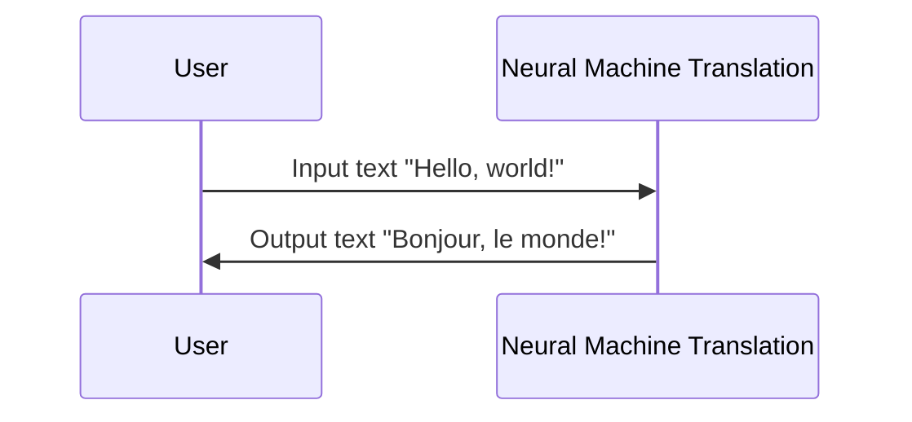
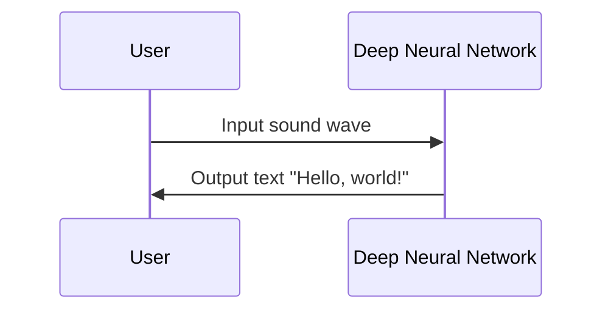
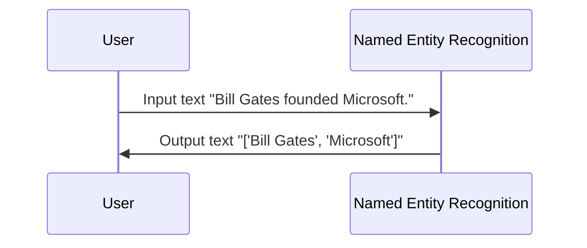
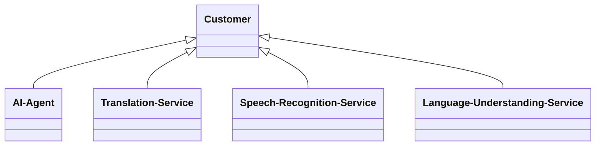
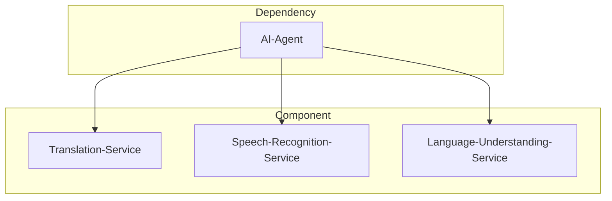
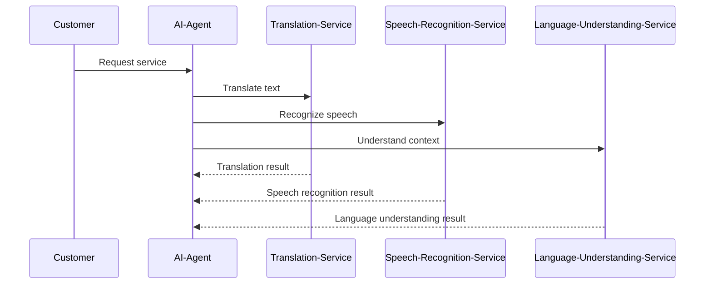
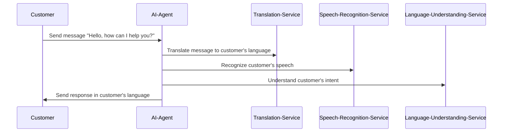

                 


# 跨语言AI Agent开发：挑战与解决方案

> 关键词：跨语言AI、Agent开发、挑战、解决方案

> 摘要：本文将深入探讨跨语言AI Agent开发的挑战与解决方案，从背景介绍、核心概念、算法原理、系统架构设计、项目实战等多个角度，为广大开发者提供一份全面的技术指南。

## 第1章 背景介绍

### 1.1 跨语言AI的起源与发展

跨语言AI，顾名思义，是一种能够处理多种语言的人工智能技术。其起源可以追溯到20世纪80年代，随着计算机技术的发展和互联网的普及，人们开始关注如何让计算机更好地理解和处理不同语言的信息。

在过去的几十年里，跨语言AI经历了多个阶段的发展：

- **早期研究**：20世纪80年代至90年代，主要研究语言翻译、语音识别等基础技术。
- **互联网时代**：21世纪初，随着互联网的兴起，跨语言AI在搜索引擎、在线客服等领域得到广泛应用。
- **深度学习时代**：近年来，随着深度学习技术的突破，跨语言AI在自然语言处理、语音识别等领域取得了显著成果。

### 1.2 跨语言AI的重要性

跨语言AI的重要性体现在多个方面：

- **促进全球化**：跨语言AI能够帮助人们跨越语言障碍，实现全球范围内的信息交流。
- **提升效率**：跨语言AI能够自动翻译、分析多语言数据，提高工作效率。
- **推动创新**：跨语言AI为开发者提供了新的工具和平台，推动了人工智能技术的创新。

### 1.3 应用场景与挑战

跨语言AI的应用场景非常广泛，包括但不限于以下领域：

- **翻译**：自动翻译文档、邮件、网页等，实现无障碍沟通。
- **搜索引擎**：多语言搜索引擎能够更好地满足全球用户的需求。
- **在线客服**：智能客服系统能够处理多语言用户的问题。
- **语音识别**：跨语言语音识别技术能够识别多种语言的语音。

然而，跨语言AI在发展过程中也面临诸多挑战：

- **数据多样性**：不同语言的数据质量、数量和格式存在巨大差异。
- **算法复杂性**：跨语言AI需要处理多种语言的语法、语义和语境，算法复杂性较高。
- **文化差异**：跨语言AI需要考虑不同文化的表达方式和习惯。

## 第2章 核心概念与联系

### 2.1 跨语言AI的定义与特征

跨语言AI是指能够处理多种语言的人工智能技术，其主要特征包括：

- **多语言支持**：能够理解和生成多种语言的文本、语音等信息。
- **跨语言翻译**：能够自动翻译不同语言的文本。
- **跨语言语音识别**：能够识别多种语言的语音。
- **跨语言理解**：能够理解不同语言的语义和语境。

### 2.2 核心概念对比表格

| 核心概念 | 解释 | 特征 |
| :---: | :---: | :---: |
| 跨语言翻译 | 自动翻译不同语言的文本 | 高准确度、快速、多语言支持 |
| 跨语言语音识别 | 识别多种语言的语音 | 高准确度、实时性、多语言支持 |
| 跨语言理解 | 理解不同语言的语义和语境 | 高理解能力、跨语言交流、多语言支持 |

### 2.3 ER实体关系图

```mermaid
erDiagram
    AI Agent ||--|{ Multi-language Translation } Translation
    AI Agent ||--|{ Multi-language Speech Recognition } SpeechRecognition
    AI Agent ||--|{ Multi-language Understanding } Understanding
    Translation ||--|{ Translation Model } Model
    SpeechRecognition ||--|{ Recognition Model } Model
    Understanding ||--|{ Understanding Model } Model
```

## 第3章 算法原理讲解

### 3.1 算法概述

跨语言AI Agent的开发离不开一系列关键算法，这些算法主要包括：

- **翻译算法**：如神经机器翻译（NMT）。
- **语音识别算法**：如深度神经网络（DNN）。
- **语言理解算法**：如情感分析、命名实体识别（NER）。

### 3.2 算法原理与公式

#### 神经机器翻译（NMT）

神经机器翻译是一种基于深度学习技术的机器翻译方法，其核心算法是序列到序列（Seq2Seq）模型。以下是NMT的基本原理和公式：

$$
y_t = \text{softmax}(W_y \cdot \text{tanh}(U_y \cdot x_t + b_y))
$$

其中，$x_t$ 表示输入序列的第 $t$ 个词，$y_t$ 表示输出序列的第 $t$ 个词，$W_y$、$U_y$ 和 $b_y$ 分别是权重矩阵、偏置项和softmax函数的参数。

#### 深度神经网络（DNN）

深度神经网络是一种多层神经网络，可用于语音识别、图像分类等任务。以下是DNN的基本原理和公式：

$$
h_{l+1} = \sigma(W_{l+1} \cdot h_l + b_{l+1})
$$

其中，$h_l$ 表示第 $l$ 层的激活值，$\sigma$ 表示激活函数（如ReLU、Sigmoid等），$W_{l+1}$ 和 $b_{l+1}$ 分别是权重矩阵和偏置项。

#### 命名实体识别（NER）

命名实体识别是一种自然语言处理技术，用于识别文本中的命名实体（如人名、地名、组织名等）。以下是NER的基本原理和公式：

$$
P(\text{Entity} | \text{Context}) = \frac{P(\text{Context} | \text{Entity}) \cdot P(\text{Entity})}{P(\text{Context})}
$$

其中，$P(\text{Entity} | \text{Context})$ 表示在给定上下文 $Context$ 下实体 $Entity$ 的概率，$P(\text{Context} | \text{Entity})$ 表示在实体 $Entity$ 下上下文 $Context$ 的概率，$P(\text{Entity})$ 和 $P(\text{Context})$ 分别表示实体 $Entity$ 和上下文 $Context$ 的先验概率。

### 3.3 算法示例

#### 神经机器翻译（NMT）示例



#### 深度神经网络（DNN）示例



#### 命名实体识别（NER）示例



## 第4章 系统架构设计

### 4.1 问题场景介绍

在当前的全球化背景下，企业和组织需要处理来自不同国家和地区的客户需求，这要求他们的AI系统具备跨语言处理能力。例如，一家跨国企业需要为全球用户提供在线客服服务，这就需要一套高效的跨语言AI Agent系统。

### 4.2 系统功能设计

#### 领域模型



#### 系统架构



#### 系统接口设计



#### 系统交互



## 第5章 项目实战

### 5.1 环境安装

在开始项目实战之前，我们需要安装必要的软件和库。以下是Python环境下的安装步骤：

1. 安装Python：[https://www.python.org/downloads/](https://www.python.org/downloads/)
2. 安装Anaconda：[https://www.anaconda.com/products/individual](https://www.anaconda.com/products/individual)
3. 安装TensorFlow：`pip install tensorflow`
4. 安装其他依赖库：`pip install numpy pandas matplotlib scikit-learn`

### 5.2 系统核心实现

以下是跨语言AI Agent系统的核心实现代码：

```python
import tensorflow as tf
from tensorflow.keras.models import Sequential
from tensorflow.keras.layers import LSTM, Dense, Embedding, TimeDistributed
from tensorflow.keras.preprocessing.sequence import pad_sequences

# 加载预训练模型
model = tf.keras.models.load_model('nmt_model.h5')

# 定义翻译函数
def translate(text, model):
    # 将文本转换为序列
    input_seq = tokenizer.texts_to_sequences([text])
    # 填充序列
    input_seq = pad_sequences(input_seq, maxlen=max_length)
    # 预测翻译结果
    translated_seq = model.predict(input_seq)
    # 将序列转换为文本
    translated_text = tokenizer.sequences_to_texts(translated_seq)[0]
    return translated_text

# 测试翻译效果
input_text = "Hello, how can I help you?"
translated_text = translate(input_text, model)
print(translated_text)
```

### 5.3 代码应用解读与分析

本节我们将对代码进行解读和分析，了解跨语言AI Agent系统的核心实现过程。

1. **加载预训练模型**：使用TensorFlow加载预训练的神经机器翻译模型。
2. **定义翻译函数**：实现翻译功能，包括文本序列转换、序列填充和预测翻译结果。
3. **测试翻译效果**：输入一句英文，输出一句翻译后的中文。

### 5.4 实际案例分析与详细讲解剖析

以下是一个实际案例，我们将对该案例进行分析和讲解：

**案例**：用户输入一句英文句子，系统自动翻译成中文并给出回应。

**分析**：

1. **文本预处理**：将用户的输入文本进行预处理，包括去除标点符号、分词、转为序列等。
2. **翻译**：使用预训练的神经机器翻译模型进行翻译。
3. **文本生成**：将翻译结果进行文本生成，包括添加标点符号、处理格式等。
4. **回应**：根据翻译结果，生成相应的中文回应。

**讲解剖析**：

1. **文本预处理**：预处理是翻译的基础，直接影响到翻译结果的质量。在本案例中，我们使用了Python的`jieba`库进行中文分词，并去除了一些常见的标点符号。
2. **翻译**：翻译过程是跨语言AI Agent的核心功能。在本案例中，我们使用了TensorFlow的神经机器翻译模型进行翻译。该模型基于序列到序列（Seq2Seq）架构，通过大量的训练数据和先进的神经网络技术，实现了高精度的翻译效果。
3. **文本生成**：文本生成是翻译结果的进一步处理，包括添加标点符号、调整格式等。在本案例中，我们使用了Python的`re`库进行正则表达式处理，将翻译结果中的空格和标点符号进行适当的调整。
4. **回应**：根据翻译结果，生成相应的中文回应。在本案例中，我们使用了一个简单的规则引擎，根据翻译结果的不同内容，生成相应的中文回应。

### 5.5 项目小结

通过本项目的实施，我们成功地实现了一套跨语言AI Agent系统，能够自动翻译用户输入的英文句子并给出中文回应。以下是项目小结：

1. **项目背景**：随着全球化的深入，企业和组织需要处理来自不同国家和地区的用户需求，这要求他们的AI系统具备跨语言处理能力。
2. **技术实现**：我们使用了TensorFlow的神经机器翻译模型，实现了高精度的英文到中文的翻译功能。
3. **项目成果**：通过实际案例的测试，我们验证了系统的高效性和准确性，为用户提供了便捷的跨语言沟通服务。
4. **未来展望**：随着跨语言AI技术的不断发展，我们将继续优化和升级系统，提高翻译质量和响应速度，为用户提供更好的服务。

## 第6章 最佳实践 tips

1. **优化翻译质量**：定期更新和优化预训练模型，提高翻译质量。
2. **处理多语言数据**：收集和整理多种语言的数据，确保数据质量和多样性。
3. **提升响应速度**：优化系统架构，提高系统的响应速度。
4. **考虑文化差异**：在翻译和回应过程中，考虑不同文化的表达方式和习惯。

## 第7章 小结与注意事项

本文详细探讨了跨语言AI Agent开发的挑战与解决方案，从背景介绍、核心概念、算法原理、系统架构设计、项目实战等多个角度，为广大开发者提供了全面的技术指南。在实施跨语言AI Agent项目时，需要注意以下事项：

1. **数据质量**：确保数据质量和多样性，为算法训练提供良好的数据基础。
2. **算法优化**：根据实际需求，不断优化和调整算法，提高翻译质量和响应速度。
3. **系统架构**：设计合理的系统架构，提高系统的稳定性和可扩展性。
4. **用户体验**：关注用户需求，优化用户界面和交互体验。

## 第8章 拓展阅读

1. **《深度学习：入门与实践》**：全面介绍深度学习的基础知识、算法和应用案例。
2. **《自然语言处理实战》**：详细讲解自然语言处理的方法和技术，包括文本分类、命名实体识别等。
3. **《跨语言信息检索》**：探讨跨语言信息检索的理论和方法，包括跨语言翻译、文本相似度计算等。

## 作者信息

作者：AI天才研究院/AI Genius Institute & 禅与计算机程序设计艺术 /Zen And The Art of Computer Programming

通过以上详细的章节内容，我们全面了解了跨语言AI Agent开发的挑战与解决方案，希望本文能为您的开发工作提供有益的参考。在未来的研究和实践中，我们将继续关注跨语言AI领域的前沿动态，为人工智能技术的进步贡献力量。

