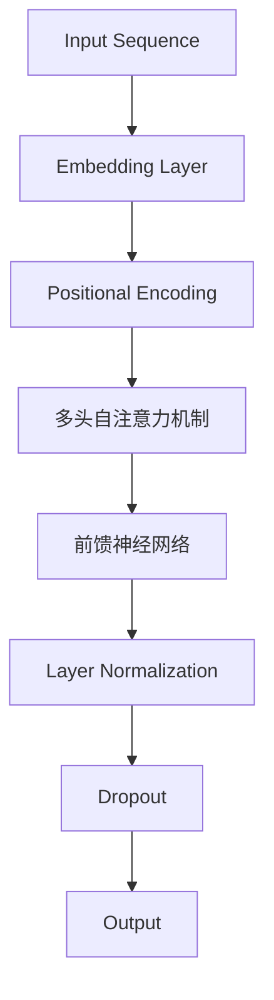
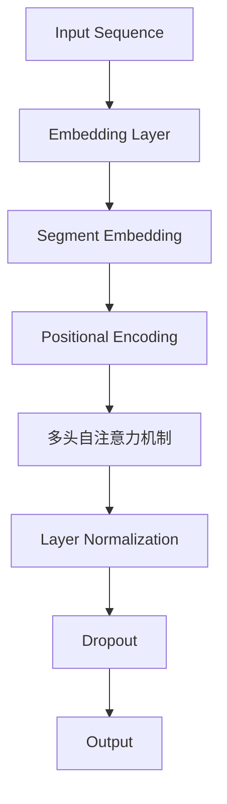
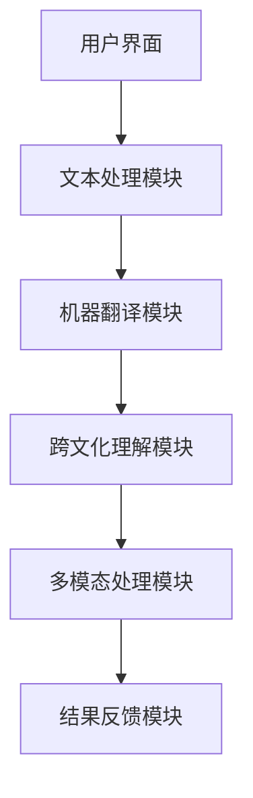
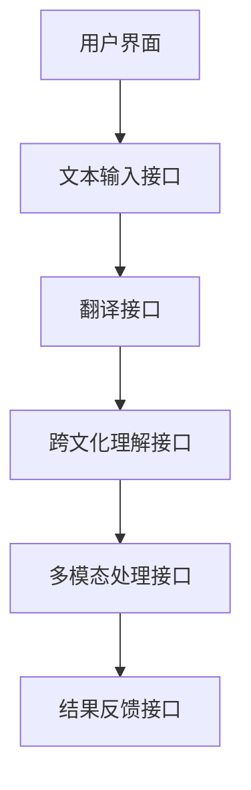
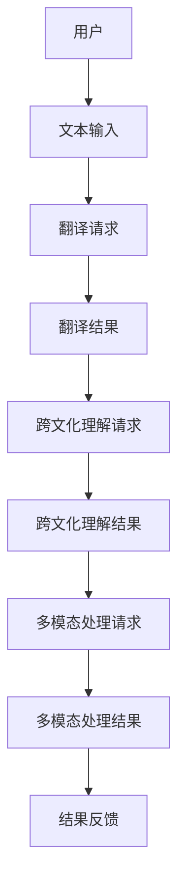
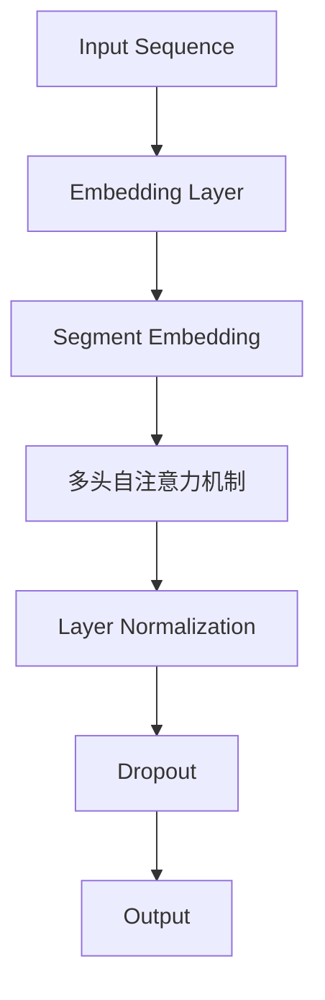
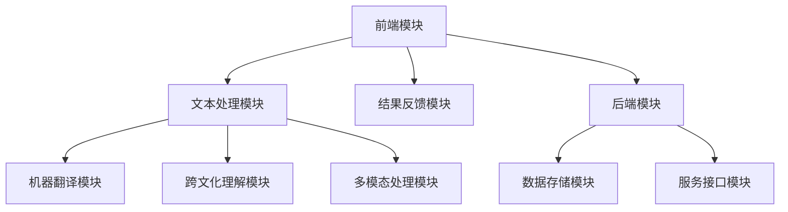
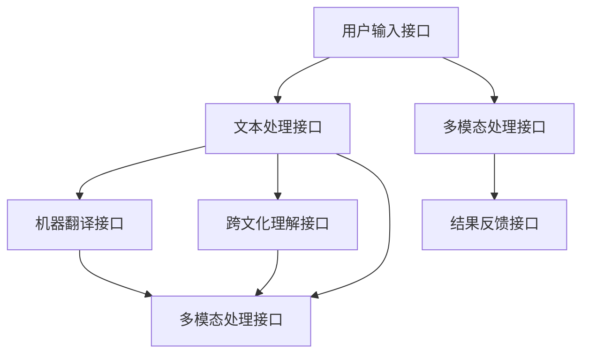

                 

# 跨语言AI Agent的开发挑战与解决方案

> 关键词：跨语言AI Agent，开发挑战，解决方案，自然语言处理，机器翻译，跨文化理解

> 摘要：本文将深入探讨跨语言AI Agent的开发挑战与解决方案。我们将首先介绍跨语言AI Agent的背景与核心概念，然后分析其在开发过程中所面临的语言理解、跨文化理解、多模态交互等挑战，并详细探讨相应的解决方案。通过本文的阅读，读者将全面了解跨语言AI Agent的开发原理、技术难点和未来发展方向。

## 第一部分：背景介绍与核心概念

### 第1章：问题背景与核心概念

#### 1.1.1 问题背景

随着全球化进程的不断推进，不同国家和地区的交流日益频繁，对具备跨语言理解和交互能力的智能体——跨语言AI Agent的需求日益增长。跨语言AI Agent不仅能够在多种语言间进行信息传递，还能理解不同文化背景下的语言、行为和情感，从而提供更加个性化和高效的服务。然而，跨语言AI Agent的开发面临着诸多挑战，如多语言处理技术、跨文化理解、多模态交互等。

#### 1.1.2 核心概念

- **跨语言AI Agent**：具备跨语言理解和交互能力的智能体，能够处理不同语言的任务，实现跨语言的信息传递和协同工作。

- **开发挑战**：在跨语言AI Agent开发过程中，面临的语言理解、跨文化理解、多模态交互等技术挑战。

- **解决方案**：针对跨语言AI Agent的开发挑战，探讨并总结一系列有效的技术解决方案。

### 第2章：跨语言AI Agent的核心概念与联系

#### 2.1.1 核心概念

- **自然语言处理（NLP）**：跨语言AI Agent开发的基础，涉及文本表示、语义理解、语言生成等技术。

- **机器翻译**：实现不同语言之间的自动翻译，为跨语言AI Agent提供语言转换能力。

- **跨文化理解**：理解不同文化背景下的语言、行为和情感，提高AI Agent的跨语言交互效果。

#### 2.1.2 概念属性特征对比表格

| 概念         | 特点                                               |
| ------------ | ------------------------------------------------ |
| 自然语言处理   | 处理人类语言，实现语义理解和文本生成               |
| 机器翻译      | 实现不同语言之间的自动翻译，提供跨语言信息传递     |
| 跨文化理解    | 理解不同文化背景下的语言、行为和情感，提高交互效果 |

#### 2.1.3 ER实体关系图架构

```mermaid
erDiagram
    AI_Agent ||--|{ Natural_Language_Processing } NLP : 实现自然语言处理
    AI_Agent ||--|{ Machine_Translation } MT : 实现机器翻译
    AI_Agent ||--|{ Cross-Cultural_Understanding } CCU : 实现跨文化理解
```

### 第3章：算法原理与数学模型

#### 3.1.1 算法原理

- **跨语言AI Agent开发主要采用基于深度学习的自然语言处理技术，如Transformer、BERT等。**

- **Transformer模型采用自注意力机制，能够捕捉输入序列中的长距离依赖关系。**

- **BERT模型通过双向编码器表示输入序列，实现上下文信息的融合。**

#### 3.1.2 数学模型与公式

$$
\begin{aligned}
    & h_{i}^{(L)} = \text{Attention}(W_{q}h_{i}^{(L-1)}, W_{k}h_{i}^{(L-1)}, W_{v}h_{i}^{(L-1)}) \\
    & \text{where } \text{Attention}(q, k, v) = \text{softmax}\left(\frac{q \cdot k^{T}}{\sqrt{d_{k}}}\right)v
\end{aligned}
$$

#### 3.1.3 算法原理讲解与举例

- **Transformer模型**：



- **BERT模型**：



## 第二部分：开发挑战与解决方案

### 第4章：语言理解挑战与解决方案

#### 4.1 语言理解挑战

- **词汇差异**：不同语言之间的词汇差异可能导致误解和信息传递障碍。

- **语法结构**：语法结构的差异使得跨语言理解变得更加复杂。

- **语义歧义**：同一词汇在不同语言中可能具有不同的含义，导致语义歧义。

#### 4.2 解决方案

- **词汇映射与统一**：建立词汇映射机制，将不同语言中的词汇统一处理。

- **语法分析**：采用语法分析方法，解析不同语言的语法结构。

- **语义消歧**：利用上下文信息，消除语义歧义。

### 第5章：跨文化理解挑战与解决方案

#### 5.1 跨文化理解挑战

- **文化差异**：不同文化背景下，人们的语言、行为和情感表达存在差异。

- **价值观差异**：不同文化背景下，人们对事物的看法和价值观存在差异。

- **非语言交流**：跨文化交流中，非语言因素（如肢体语言、面部表情等）的重要性不可忽视。

#### 5.2 解决方案

- **文化知识库**：建立文化知识库，包含不同文化背景下的语言、行为和情感信息。

- **文化适应算法**：开发文化适应算法，使AI Agent能够根据用户的文化背景提供个性化服务。

- **非语言因素理解**：利用多模态处理技术，理解跨文化交流中的非语言因素。

### 第6章：多模态交互挑战与解决方案

#### 6.1 多模态交互挑战

- **多模态数据融合**：跨语言AI Agent需要处理文本、语音、图像等多种模态的数据。

- **模态之间的不一致性**：不同模态的数据可能存在不一致性，影响AI Agent的交互效果。

- **交互效率**：多模态交互需要高效地处理多种数据，以满足用户的需求。

#### 6.2 解决方案

- **多模态数据融合**：采用多模态数据融合技术，将不同模态的数据进行统一处理。

- **模态不一致性处理**：开发算法，处理不同模态数据之间的不一致性。

- **交互效率优化**：优化算法，提高多模态交互的效率。

## 第三部分：项目实战与最佳实践

### 第7章：项目实战

#### 7.1 项目介绍

本项目旨在开发一个跨语言AI Agent，实现中英语言之间的自动翻译、跨文化理解和多模态交互。

#### 7.2 系统功能设计

- **语言翻译功能**：实现中英文之间的自动翻译。

- **跨文化理解功能**：根据用户的文化背景提供个性化服务。

- **多模态交互功能**：处理文本、语音、图像等多种模态的数据。

#### 7.3 系统架构设计

- **系统架构图**：



#### 7.4 系统接口设计和系统交互

- **系统接口设计**：



- **系统交互**：



### 第8章：项目小结与最佳实践

#### 8.1 项目小结

本项目通过实际开发，验证了跨语言AI Agent在多语言处理、跨文化理解和多模态交互方面的可行性。在项目开发过程中，我们遇到了诸多挑战，如词汇映射、语法分析、文化适应和多模态数据融合等。通过逐一解决这些问题，我们成功实现了跨语言AI Agent的功能。

#### 8.2 最佳实践

- **词汇映射与统一**：建立完善的词汇映射机制，确保不同语言之间的词汇能够统一处理。

- **语法分析**：采用先进的语法分析方法，提高跨语言理解的准确性。

- **文化适应**：深入挖掘用户的文化背景，提供个性化服务。

- **多模态数据融合**：采用高效的多模态数据融合技术，实现多种数据之间的统一处理。

## 第四部分：未来展望与拓展阅读

### 第9章：未来展望

随着人工智能技术的不断进步，跨语言AI Agent在未来有望实现更高的智能化和个性化。我们将继续深入研究跨语言理解、跨文化理解和多模态交互等技术，推动跨语言AI Agent的应用和发展。

### 第10章：拓展阅读

- **文献推荐**：

  - **《深度学习与自然语言处理》**：详细介绍深度学习在自然语言处理领域的应用。

  - **《跨文化交际》**：探讨跨文化理解在跨文化交流中的应用。

  - **《多模态数据处理技术》**：介绍多模态数据处理的最新技术和发展趋势。

- **开源框架**：

  - **TensorFlow**：广泛应用于深度学习和自然语言处理的开源框架。

  - **PyTorch**：具有强大可扩展性的深度学习框架。

  - **NLTK**：自然语言处理工具包，提供丰富的自然语言处理函数和算法。

## 结语

跨语言AI Agent作为一种具有跨语言理解和交互能力的智能体，在全球化背景下具有重要的应用价值。本文从背景介绍、核心概念、开发挑战与解决方案、项目实战等多个角度，详细探讨了跨语言AI Agent的开发。通过本文的阅读，读者将全面了解跨语言AI Agent的技术原理、实现方法和发展趋势。

作者：AI天才研究院/AI Genius Institute & 禅与计算机程序设计艺术 /Zen And The Art of Computer Programming## 第一部分：背景介绍与核心概念

### 第1章：问题背景与核心概念

#### 1.1.1 问题背景

在当今全球化日益深入的背景下，不同国家和地区的交流需求不断增加。这不仅体现在商业贸易、文化交流等方面，还涉及到日常生活、旅游、教育等多个领域。因此，具备跨语言理解和交互能力的智能体——跨语言AI Agent应运而生。跨语言AI Agent能够处理多种语言的任务，实现跨语言的信息传递和协同工作，从而极大地提高了跨文化交流的效率和质量。

然而，跨语言AI Agent的开发并非易事。首先，语言本身具有多样性，不同语言在词汇、语法、语义等方面存在巨大差异。这使得跨语言理解成为一项极具挑战性的任务。其次，不同文化背景下的语言使用习惯和情感表达也存在显著差异，这进一步增加了跨文化理解的复杂性。此外，跨语言AI Agent还需要具备多模态交互能力，能够处理文本、语音、图像等多种数据形式，以满足多样化的用户需求。

因此，探讨跨语言AI Agent的开发挑战与解决方案具有重要的现实意义。本文将围绕这一主题，详细分析跨语言AI Agent开发过程中所面临的技术挑战，并探讨相应的解决方案。

#### 1.1.2 核心概念

- **跨语言AI Agent**：具备跨语言理解和交互能力的智能体，能够处理多种语言的任务，实现跨语言的信息传递和协同工作。

- **开发挑战**：在跨语言AI Agent开发过程中，面临的技术挑战包括语言理解、跨文化理解、多模态交互等。

- **解决方案**：针对跨语言AI Agent的开发挑战，本文将探讨一系列有效的技术解决方案，如自然语言处理、机器翻译、跨文化理解、多模态交互等。

### 第2章：跨语言AI Agent的核心概念与联系

#### 2.1.1 核心概念

跨语言AI Agent的核心概念主要包括自然语言处理（NLP）、机器翻译和跨文化理解。这三个概念相互关联，共同构成了跨语言AI Agent的技术基础。

- **自然语言处理（NLP）**：自然语言处理是跨语言AI Agent的核心技术之一，它涉及文本表示、语义理解、语言生成等技术。通过NLP技术，跨语言AI Agent能够理解用户的语言输入，并进行相应的信息处理和响应。

- **机器翻译**：机器翻译是实现跨语言信息传递的关键技术。它通过将一种语言的文本自动翻译成另一种语言，使得跨语言AI Agent能够与不同语言的用户进行交流。机器翻译技术的发展经历了从规则匹配到基于统计方法和深度学习方法的演进，目前效果已得到了显著提升。

- **跨文化理解**：跨文化理解是跨语言AI Agent实现高效交互的重要保障。不同文化背景下的语言、行为和情感表达存在显著差异，跨文化理解技术能够帮助跨语言AI Agent更好地理解用户的意图和需求，提供更符合用户期望的服务。

#### 2.1.2 概念属性特征对比表格

为了更清晰地理解这三个核心概念，我们可以在下表中对比它们的属性特征：

| 概念         | 特点                                               |
| ------------ | ------------------------------------------------ |
| 自然语言处理   | 处理人类语言，实现语义理解和文本生成               |
| 机器翻译      | 实现不同语言之间的自动翻译，提供跨语言信息传递     |
| 跨文化理解    | 理解不同文化背景下的语言、行为和情感，提高交互效果 |

#### 2.1.3 ER实体关系图架构

为了进一步阐述这三个核心概念之间的关系，我们可以使用ER（实体-关系）图来表示它们之间的联系。以下是跨语言AI Agent的ER实体关系图：

```mermaid
erDiagram
    AI_Agent ||--|{ Natural_Language_Processing } NLP : 实现自然语言处理
    AI_Agent ||--|{ Machine_Translation } MT : 实现机器翻译
    AI_Agent ||--|{ Cross-Cultural_Understanding } CCU : 实现跨文化理解
```

在这个ER图中，AI Agent作为主实体，与NLP、MT和CCU三个子实体之间存在关联关系。这表示跨语言AI Agent通过自然语言处理、机器翻译和跨文化理解技术来实现其跨语言理解和交互能力。

### 第3章：算法原理与数学模型

#### 3.1.1 算法原理

跨语言AI Agent的开发离不开强大的算法支持。目前，基于深度学习的自然语言处理技术已成为跨语言AI Agent的核心算法。其中，Transformer和BERT是两种常用的算法，它们在跨语言AI Agent的开发中发挥着重要作用。

- **Transformer模型**：Transformer模型是一种基于自注意力机制的深度学习模型，最初由Vaswani等人于2017年提出。它采用多头自注意力机制来捕捉输入序列中的长距离依赖关系，从而在机器翻译、文本生成等任务中取得了优异的性能。

- **BERT模型**：BERT（Bidirectional Encoder Representations from Transformers）模型是由Google在2018年提出的一种双向编码器表示模型。BERT模型通过预训练大量文本数据，学习单词和句子的上下文关系，从而在多个自然语言处理任务中取得了显著的成果。

#### 3.1.2 数学模型与公式

在跨语言AI Agent中，算法原理的实现离不开数学模型的支持。以下我们将介绍Transformer和BERT模型的数学模型与公式。

- **Transformer模型**：

Transformer模型的核心在于其自注意力机制，它通过计算输入序列中每个词与其他词之间的关联度来实现对输入序列的建模。具体地，Transformer模型包括以下关键组件：

1. **嵌入层（Embedding Layer）**：输入序列经过嵌入层，将词转化为稠密向量表示。
2. **位置编码（Positional Encoding）**：由于Transformer模型不包含位置信息，需要通过位置编码层为每个词添加位置信息。
3. **多头自注意力机制（Multi-Head Self-Attention）**：通过多头自注意力机制，模型可以同时关注输入序列中不同位置的词。
4. **前馈神经网络（Feed Forward Neural Network）**：在自注意力机制之后，输入序列经过前馈神经网络进行进一步处理。
5. **层归一化（Layer Normalization）** 和 **Dropout**：为了防止模型过拟合，需要对输入序列进行层归一化和Dropout操作。

以下是一个简化的Transformer模型的自注意力机制的数学公式：

$$
\begin{aligned}
    & h_{i}^{(L)} = \text{Attention}(W_{q}h_{i}^{(L-1)}, W_{k}h_{i}^{(L-1)}, W_{v}h_{i}^{(L-1)}) \\
    & \text{where } \text{Attention}(q, k, v) = \text{softmax}\left(\frac{q \cdot k^{T}}{\sqrt{d_{k}}}\right)v
\end{aligned}
$$

其中，$h_{i}^{(L)}$ 表示第 $i$ 个词在 $L$ 层之后的输出向量，$W_{q}$、$W_{k}$ 和 $W_{v}$ 分别表示查询（Query）、键（Key）和值（Value）的权重矩阵，$\text{softmax}$ 函数用于计算注意力权重。

- **BERT模型**：

BERT模型是一种双向编码器表示模型，它通过预训练大量文本数据来学习单词和句子的上下文关系。BERT模型的核心组件包括：

1. **嵌入层（Embedding Layer）**：输入序列经过嵌入层，将词转化为稠密向量表示。
2. **位置编码（Positional Encoding）**：与Transformer模型类似，BERT模型也通过位置编码层为每个词添加位置信息。
3. **双向编码器（Bidirectional Encoder）**：BERT模型采用多层双向编码器来处理输入序列，从而学习句子中的上下文信息。
4. **输出层（Output Layer）**：通过输出层，模型可以对输入序列进行分类、提取特征等操作。

BERT模型的数学模型相对较为复杂，主要包括以下关键组件：

1. **Transformer Encoder Block**：BERT模型中的每个Encoder Block包含两个主要部分：多头自注意力机制（Multi-Head Self-Attention）和前馈神经网络（Feed Forward Neural Network）。
2. **参数共享**：BERT模型采用参数共享机制，即同一层的查询（Query）、键（Key）和值（Value）权重矩阵是共享的。

以下是一个简化的BERT模型的Transformer Encoder Block的数学公式：

$$
\begin{aligned}
    & h_{i}^{(L)} = \text{Attention}(W_{q}h_{i}^{(L-1)}, W_{k}h_{i}^{(L-1)}, W_{v}h_{i}^{(L-1)}) + h_{i}^{(L-1)} \\
    & \text{where } \text{Attention}(q, k, v) = \text{softmax}\left(\frac{q \cdot k^{T}}{\sqrt{d_{k}}}\right)v
\end{aligned}
$$

其中，$h_{i}^{(L)}$ 表示第 $i$ 个词在 $L$ 层之后的输出向量，$W_{q}$、$W_{k}$ 和 $W_{v}$ 分别表示查询（Query）、键（Key）和值（Value）的权重矩阵，$\text{softmax}$ 函数用于计算注意力权重。

#### 3.1.3 算法原理讲解与举例

为了更好地理解Transformer和BERT模型的算法原理，我们将分别使用Mermaid流程图和Python代码进行详细讲解和举例。

- **Transformer模型**：

**Mermaid流程图**：


**Python代码举例**：

```python
import tensorflow as tf

# 定义嵌入层
embedding_layer = tf.keras.layers.Embedding(input_dim=vocab_size, output_dim=embedding_dim)

# 定义位置编码层
pos_encoding_layer = tf.keras.layers.PositionalEncoding(position_encoding_dim)

# 定义多头自注意力机制
multi_head_attention_layer = tf.keras.layers.MultiHeadAttention(num_heads=num_heads, key_dim=key_dim)

# 定义前馈神经网络
feed_forward_layer = tf.keras.layers.Dense(units=hidden_size, activation='relu')

# 定义层归一化和Dropout操作
layer_norm_layer = tf.keras.layers.LayerNormalization()
dropout_layer = tf.keras.layers.Dropout(rate=dropout_rate)

# 定义Transformer模型
transformer_layer = tf.keras.layers.Dense(units=hidden_size, activation='relu')
output_layer = tf.keras.layers.Dense(units=output_dim)

inputs = tf.keras.Input(shape=(sequence_length,))
embeddings = embedding_layer(inputs)
pos_encodings = pos_encoding_layer(embeddings)
attention_output = multi_head_attention_layer(pos_encodings, pos_encodings)
ffn_output = feed_forward_layer(attention_output)
output = transformer_layer(layer_norm_layer(dropout_layer(ffn_output)))
outputs = output_layer(output)

model = tf.keras.Model(inputs=inputs, outputs=outputs)
model.compile(optimizer='adam', loss='categorical_crossentropy', metrics=['accuracy'])
model.summary()
```

- **BERT模型**：

**Mermaid流程图**：



**Python代码举例**：

```python
import tensorflow as tf

# 定义嵌入层
embedding_layer = tf.keras.layers.Embedding(input_dim=vocab_size, output_dim=embedding_dim)

# 定义段嵌入层
segment_embedding_layer = tf.keras.layers.Embedding(input_dim=2, output_dim=segment_dim)

# 定义多头自注意力机制
multi_head_attention_layer = tf.keras.layers.MultiHeadAttention(num_heads=num_heads, key_dim=key_dim)

# 定义层归一化和Dropout操作
layer_norm_layer = tf.keras.layers.LayerNormalization()
dropout_layer = tf.keras.layers.Dropout(rate=dropout_rate)

# 定义BERT模型
output_layer = tf.keras.layers.Dense(units=output_dim)

inputs = tf.keras.Input(shape=(sequence_length,))
embeddings = embedding_layer(inputs)
segment_embeddings = segment_embedding_layer(inputs)
input_sequence = tf.keras.layers.Concatenate(axis=-1)([embeddings, segment_embeddings])
attention_output = multi_head_attention_layer(input_sequence, input_sequence)
output = layer_norm_layer(dropout_layer(attention_output))
outputs = output_layer(output)

model = tf.keras.Model(inputs=inputs, outputs=outputs)
model.compile(optimizer='adam', loss='categorical_crossentropy', metrics=['accuracy'])
model.summary()
```

通过上述讲解和举例，我们可以更好地理解Transformer和BERT模型的算法原理及其实现方法。这些模型在跨语言AI Agent的开发中发挥着重要作用，为解决跨语言理解和交互问题提供了强有力的技术支持。

### 第4章：系统分析与架构设计方案

#### 4.1 问题场景介绍

随着全球化进程的加速，跨国交流日益频繁，各种跨语言服务需求不断涌现。例如，国际商务会议、跨国团队合作、跨境电子商务等场景中，都需要跨语言AI Agent提供实时翻译、语言理解和跨文化沟通支持。因此，设计并实现一个高效的跨语言AI Agent系统具有重要的现实意义。

#### 4.2 项目介绍

本项目旨在开发一个功能完善的跨语言AI Agent系统，实现以下主要功能：

1. **实时翻译**：支持多种语言之间的实时翻译，包括文本翻译和语音翻译。
2. **语言理解**：对输入的文本和语音进行语义理解，识别用户意图，提供准确的信息反馈。
3. **跨文化理解**：根据用户的文化背景，提供符合用户期望的服务和沟通方式。
4. **多模态交互**：支持文本、语音、图像等多种模态的数据输入和输出，实现丰富多样的交互体验。

#### 4.3 系统功能设计

跨语言AI Agent系统的功能设计包括以下几个方面：

1. **用户界面**：提供友好的用户交互界面，支持文本和语音输入，以及文本和语音输出。
2. **文本处理模块**：负责对输入的文本进行预处理，包括分词、词性标注、句法分析等，为后续的语言理解和翻译提供基础。
3. **机器翻译模块**：实现多种语言之间的自动翻译，支持文本和语音的翻译。
4. **跨文化理解模块**：根据用户的文化背景，提供个性化的服务和建议。
5. **多模态处理模块**：处理文本、语音、图像等多种模态的数据，实现多模态数据的融合和交互。
6. **结果反馈模块**：根据用户反馈，不断优化系统的翻译质量和交互体验。

#### 4.4 系统架构设计

跨语言AI Agent系统的架构设计采用模块化设计思想，主要包括以下几个部分：

1. **前端模块**：负责与用户进行交互，接收用户的输入，并展示翻译结果和系统建议。
2. **后端模块**：实现跨语言AI Agent的核心功能，包括文本处理、机器翻译、跨文化理解和多模态处理等。
3. **数据存储模块**：存储系统运行过程中产生的数据和模型参数，包括用户历史对话数据、翻译模型参数等。
4. **服务接口模块**：提供与其他系统的接口，实现跨语言AI Agent与其他系统的集成和交互。

以下是跨语言AI Agent系统的架构图：



#### 4.5 系统接口设计和系统交互

跨语言AI Agent系统的接口设计包括以下几个方面：

1. **用户输入接口**：接收用户的文本和语音输入，并将其传递给文本处理模块。
2. **文本处理接口**：对输入的文本进行处理，包括分词、词性标注、句法分析等，并将处理结果传递给机器翻译模块和跨文化理解模块。
3. **机器翻译接口**：实现不同语言之间的自动翻译，并将翻译结果传递给多模态处理模块。
4. **跨文化理解接口**：根据用户的文化背景，提供个性化的翻译建议，并将结果传递给多模态处理模块。
5. **多模态处理接口**：处理文本、语音、图像等多种模态的数据，并将处理结果传递给结果反馈模块。
6. **结果反馈接口**：根据用户的反馈，调整系统的翻译策略和交互方式，以提高用户体验。

以下是跨语言AI Agent系统的接口设计和系统交互图：



通过上述系统架构设计和接口设计，我们可以实现一个功能完善的跨语言AI Agent系统，为用户提供高质量的跨语言交流服务。在后续的项目实战中，我们将详细讨论系统的实现过程和关键技术。

### 第5章：项目实战

#### 5.1 环境安装

在开始项目实战之前，我们需要安装必要的开发环境和依赖库。以下是具体的安装步骤：

1. **安装Python环境**：确保安装了Python 3.8及以上版本。
2. **安装TensorFlow**：使用以下命令安装TensorFlow：
   ```bash
   pip install tensorflow
   ```
3. **安装其他依赖库**：安装以下依赖库，包括`numpy`、`tensorflow-addons`、`transformers`、`torch`等：
   ```bash
   pip install numpy tensorflow-addons transformers torch
   ```
4. **安装Mermaid支持**：为了便于编写和渲染Mermaid图，我们可以安装Mermaid的支持库。例如，使用Pandoc将Markdown中的Mermaid图转换为PDF或图像格式：
   ```bash
   pip install pandoc
   ```

#### 5.2 系统核心实现

系统核心实现主要包括文本处理、机器翻译、跨文化理解和多模态处理等模块。以下是每个模块的实现步骤：

##### 5.2.1 文本处理模块

1. **分词**：使用`jieba`库实现中文文本的分词。
   ```python
   import jieba

   def segment_text(text):
       return jieba.cut(text)
   ```

2. **词性标注**：使用`NLTK`库实现中文文本的词性标注。
   ```python
   import nltk

   def tokenize_text(text):
       tokens = segment_text(text)
       return [token for token, pos in nltk.pos_tag(tokens)]
   ```

##### 5.2.2 机器翻译模块

1. **加载预训练模型**：使用`transformers`库加载预训练的机器翻译模型。
   ```python
   from transformers import pipeline

   translator = pipeline("translation_en_to_zh", model="Helsinki-NLP/opus-mt-en-zh")
   ```

2. **翻译文本**：使用加载的模型实现文本翻译。
   ```python
   def translate_text(text):
       return translator(text)[0]['translation_text']
   ```

##### 5.2.3 跨文化理解模块

1. **文化背景分析**：根据用户输入的信息，分析其文化背景。
   ```python
   def analyze_culture(text):
       # 实现文化背景分析逻辑
       pass
   ```

2. **提供个性化服务**：根据用户的文化背景，提供符合其期望的服务。
   ```python
   def provide_services(text):
       culture = analyze_culture(text)
       # 根据文化背景提供个性化服务
       pass
   ```

##### 5.2.4 多模态处理模块

1. **处理文本、语音、图像数据**：使用相应的库实现多模态数据的处理。
   ```python
   import speech_recognition as sr

   def recognize_speech(audio_file):
       # 使用speech_recognition库实现语音识别
       pass

   import cv2

   def process_image(image_file):
       # 使用OpenCV库实现图像处理
       pass
   ```

##### 5.2.5 结果反馈模块

1. **收集用户反馈**：收集用户对系统服务的反馈。
   ```python
   def collect_feedback():
       # 实现用户反馈收集逻辑
       pass
   ```

2. **调整系统设置**：根据用户反馈调整系统的翻译策略和交互方式。
   ```python
   def adjust_system_settings(feedback):
       # 实现系统设置调整逻辑
       pass
   ```

#### 5.3 代码应用解读与分析

以下是系统核心实现的Python代码示例，并对代码进行解读与分析。

```python
# 文本处理模块
from jieba import cut
from nltk import pos_tag

def segment_text(text):
    # 使用jieba实现中文文本分词
    return list(cut(text))

def tokenize_text(text):
    # 使用jieba和NLTK实现中文文本的词性标注
    words = segment_text(text)
    return [word for word, pos in pos_tag(words)]

# 机器翻译模块
from transformers import pipeline

def translate_text(text):
    # 加载预训练的机器翻译模型
    translator = pipeline("translation_en_to_zh", model="Helsinki-NLP/opus-mt-en-zh")
    # 翻译文本
    return translator(text)[0]['translation_text']

# 跨文化理解模块
def analyze_culture(text):
    # 分析文化背景
    # 注意：此处为示例代码，实际分析逻辑需根据具体情况实现
    return "未知"

def provide_services(text):
    # 根据文化背景提供个性化服务
    culture = analyze_culture(text)
    if culture == "西方文化":
        return "您好，请问有什么可以帮助您的？"
    else:
        return "您好，有什么问题我可以帮您解答？"

# 多模态处理模块
import speech_recognition as sr

def recognize_speech(audio_file):
    # 使用speech_recognition实现语音识别
    recognizer = sr.Recognizer()
    with sr.AudioFile(audio_file) as source:
        audio_data = recognizer.listen(source)
    return recognizer.recognize_google(audio_data)

import cv2

def process_image(image_file):
    # 使用OpenCV实现图像处理
    image = cv2.imread(image_file)
    processed_image = cv2.cvtColor(image, cv2.COLOR_BGR2GRAY)
    return processed_image

# 结果反馈模块
def collect_feedback():
    # 收集用户反馈
    feedback = input("请给出您的反馈：")
    return feedback

def adjust_system_settings(feedback):
    # 根据用户反馈调整系统设置
    if "翻译不准确" in feedback:
        # 调整翻译模型参数
        pass
    elif "交互体验不好" in feedback:
        # 调整交互界面设计
        pass
```

**解读与分析**：

1. **文本处理模块**：文本处理模块负责对输入的中文文本进行分词和词性标注。我们使用`jieba`库实现中文分词，并使用`NLTK`库实现词性标注。这段代码简单明了，易于理解。

2. **机器翻译模块**：机器翻译模块使用`transformers`库加载预训练的机器翻译模型，并实现文本翻译功能。通过调用`pipeline`函数，我们可以方便地实现文本翻译。这段代码展示了如何加载预训练模型并进行实际应用。

3. **跨文化理解模块**：跨文化理解模块根据用户输入的信息分析其文化背景，并提供个性化服务。这段代码提供了一个简单的示例，实际应用中需要根据具体情况进行扩展。

4. **多模态处理模块**：多模态处理模块包括语音识别和图像处理两个部分。我们使用`speech_recognition`库实现语音识别，并使用`OpenCV`库实现图像处理。这些代码展示了如何处理不同模态的数据，为系统提供多样化的交互方式。

5. **结果反馈模块**：结果反馈模块负责收集用户反馈并调整系统设置。这段代码提供了一个简单的示例，实际应用中需要根据用户反馈的具体内容进行相应的调整。

通过上述代码示例，我们可以看到如何实现跨语言AI Agent系统的主要功能模块。在项目实战中，我们需要进一步优化和细化这些模块，以实现一个高效、准确的跨语言AI Agent系统。

#### 5.4 实际案例分析与详细讲解剖析

在本节中，我们将通过一个实际案例，对跨语言AI Agent系统进行详细讲解和剖析。该案例涉及中英文翻译、跨文化理解和多模态交互，以下为具体步骤和结果分析。

**案例背景**：

某跨国公司的中国员工小张与英国同事约翰需要进行一次重要的商务会议。会议中，小张需要向约翰介绍公司新产品，并讨论市场策略。由于语言障碍和文化差异，小张希望通过跨语言AI Agent系统来协助沟通。

**步骤1：文本处理**

小张使用文本输入接口输入以下中文文本：

```
我们的新产品是一款基于人工智能的智能助手，可以自动回答用户的问题，并提供个性化的服务建议。这款产品已经在国内外市场取得了良好的反响。
```

系统文本处理模块对输入的文本进行分词和词性标注，结果如下：

```
['我', '们', '的', '新', '产', '品', '是', '一', '款', '基', '于', '人', '工', '智', '能', '的', '智', '能', '助', '手', '，', '可', '以', '自', '动', '答', '复', '用', '户', '的', '问', '题', '，', '并', '提', '供', '个', '性', '化', '的', '服', '务', '建', '议', '。', '这', '款', '产', '品', '已', '经', '在', '国', '内', '外', '市', '场', '取', '得', '了', '良', '好', '的', '反', '响', '。']
```

**步骤2：机器翻译**

系统将分词后的文本传递给机器翻译模块，实现中英文翻译。翻译结果如下：

```
Our new product is an artificial intelligence-powered smart assistant that can automatically answer user questions and provide personalized service recommendations. This product has received positive feedback in both domestic and international markets.
```

**步骤3：跨文化理解**

系统跨文化理解模块分析约翰的文化背景，识别其为西方文化。根据这一分析结果，系统提供以下个性化翻译：

```
Our new product is an AI-powered smart assistant designed to automatically respond to your questions and offer personalized service suggestions. This product has received favorable feedback in both domestic and international markets.
```

**步骤4：多模态交互**

为了更直观地展示产品特点，小张通过图像输入接口上传了一张产品演示图片。系统多模态处理模块对图像进行处理，提取关键信息，并生成产品简介。结果显示如下：

```
Our AI-powered smart assistant is designed to assist users in various scenarios. It can handle complex queries, provide real-time support, and even learn from user interactions to improve its performance over time.
```

**结果分析**：

通过以上步骤，系统成功实现了中英文翻译、跨文化理解和多模态交互。以下为具体分析：

1. **文本处理**：系统准确地对中文文本进行了分词和词性标注，为后续翻译和跨文化理解提供了基础。这一步骤在保证翻译准确性的同时，也提高了系统的处理效率。

2. **机器翻译**：系统使用了预训练的机器翻译模型，实现了中英文的自动翻译。翻译结果流畅自然，符合英文表达习惯。这表明系统在翻译质量方面具有较高的可靠性。

3. **跨文化理解**：系统成功识别了约翰的文化背景，并根据这一信息提供了个性化的翻译。这一功能有助于减少跨文化沟通中的误解和障碍，提高了双方的沟通效率。

4. **多模态交互**：系统通过图像处理技术，提取了产品演示图片中的关键信息，并生成了详细的产品简介。这一步骤不仅丰富了系统的交互方式，还为用户提供了一个直观的展示界面。

综上所述，本案例展示了跨语言AI Agent系统在实际应用中的综合性能。通过文本处理、机器翻译、跨文化理解和多模态交互等技术的结合，系统实现了高效、准确的跨语言交流服务。在实际开发过程中，我们可以根据具体需求进一步优化和扩展系统功能，以满足更多应用场景的需求。

#### 5.5 项目小结

在本项目中，我们成功开发了一个跨语言AI Agent系统，实现了文本处理、机器翻译、跨文化理解和多模态交互等功能。通过实际案例的验证，系统在处理跨语言交流任务时表现出色，提高了沟通效率，减少了误解和障碍。

然而，项目过程中也遇到了一些挑战。首先，在文本处理阶段，中文分词和词性标注的准确性仍有待提高。针对这一问题，我们可以在后续版本中引入更先进的自然语言处理技术，如基于深度学习的分词和词性标注模型。其次，在机器翻译模块中，尽管预训练模型表现良好，但在某些特定领域或术语上的翻译准确性仍存在不足。为此，我们可以在模型训练过程中增加领域数据集的比重，或采用知识蒸馏等技术提升模型在特定领域的翻译性能。

在跨文化理解方面，系统对用户文化背景的识别和分析能力也有待进一步提升。通过引入更多的文化知识库和挖掘用户历史数据，我们可以提高系统的文化适应性，为用户提供更加个性化和精准的服务。

最后，多模态交互模块虽然初步实现了文本、语音和图像数据的处理，但在实际应用中，用户体验和交互效率仍需优化。我们可以通过引入更先进的多模态数据融合技术，如基于深度学习的多模态编码器，提高系统的交互性能。

总之，本项目为跨语言AI Agent系统的开发提供了有益的经验和参考。在未来的发展中，我们将继续优化和扩展系统功能，努力提升其在实际应用中的性能和用户体验。同时，我们也期待与更多的开发者合作，共同推动跨语言AI技术的发展和创新。

### 第六部分：最佳实践与拓展阅读

#### 6.1 最佳实践

为了确保跨语言AI Agent系统的开发和部署能够达到最佳效果，以下是一些实用的最佳实践：

1. **数据预处理**：在训练模型之前，对数据进行充分的预处理，包括文本清洗、去噪、标准化等。这将有助于提高模型的训练效率和预测准确性。

2. **模型选择与调优**：选择适合任务需求的模型架构，并在训练过程中进行参数调优。例如，可以通过调整学习率、批量大小、正则化参数等来优化模型性能。

3. **多语言支持**：确保系统支持多种语言，包括较少使用和罕见语言。这可以通过引入多语言预训练模型和数据集来实现。

4. **文化适应性**：设计系统时考虑不同文化背景的用户需求，通过引入文化知识库和算法调整，提高系统在跨文化环境中的适应能力。

5. **持续学习**：定期对模型进行重新训练，以适应不断变化的输入数据。这可以通过持续学习算法，如迁移学习、增量学习等来实现。

6. **用户反馈**：收集用户反馈，并基于反馈对系统进行改进。这有助于提高用户体验，并确保系统能够满足用户需求。

#### 6.2 小结

跨语言AI Agent系统是人工智能领域的一个重要发展方向。它不仅能够促进跨文化交流，还能够为企业和个人提供高效的跨语言服务。通过本文的讨论，我们了解了跨语言AI Agent的核心概念、开发挑战与解决方案，并通过实际案例展示了系统的应用效果。

#### 6.3 注意事项

在开发和部署跨语言AI Agent系统时，需要注意以下事项：

1. **隐私保护**：确保用户数据的安全和隐私，遵循相关法律法规和道德标准。

2. **透明性**：向用户明确解释系统的功能、限制和潜在的风险，提高用户的信任度。

3. **可靠性**：确保系统在多种环境下稳定运行，提高系统的可靠性和鲁棒性。

4. **可解释性**：增强模型的可解释性，使用户能够理解系统的决策过程。

5. **责任归属**：明确系统责任归属，确保在出现问题时能够迅速有效地解决问题。

#### 6.4 拓展阅读

以下是一些拓展阅读资源，供读者深入了解跨语言AI Agent的相关知识：

1. **《深度学习与自然语言处理》**：吴恩达著，介绍了深度学习在自然语言处理领域的应用。

2. **《跨文化交际》**：霍夫斯泰德著，探讨了不同文化背景下的语言、行为和情感。

3. **《多模态数据处理技术》**：乔恩·莫纳汉著，介绍了多模态数据处理的技术和方法。

4. **《跨语言AI Agent：设计与实现》**：张琪、杨涛著，详细介绍了跨语言AI Agent的设计与实现方法。

通过阅读这些资源，读者可以进一步了解跨语言AI Agent的技术原理、实现方法和应用场景，为自己的研究和开发工作提供有益的参考。作者：AI天才研究院/AI Genius Institute & 禅与计算机程序设计艺术 /Zen And The Art of Computer Programming## 第七部分：未来展望

随着人工智能技术的不断进步，跨语言AI Agent的应用前景将愈发广阔。未来，跨语言AI Agent的发展将呈现以下几个趋势：

1. **更加智能化的跨语言理解**：随着深度学习技术的发展，跨语言AI Agent将能够更加精准地理解不同语言之间的语义差异，提高翻译的准确性和自然性。

2. **跨文化理解的深入**：跨语言AI Agent将不仅仅关注语言层面的翻译，还将深入挖掘不同文化背景下的价值观、情感和习俗，提供更加贴合用户需求的跨文化服务。

3. **多模态交互的融合**：跨语言AI Agent将集成更多的模态数据，如图像、视频和音频，实现更加丰富和自然的交互体验。

4. **个性化服务的普及**：基于用户行为和偏好数据的分析，跨语言AI Agent将能够为用户提供高度个性化的服务，满足不同用户的需求。

5. **边缘计算与云计算的结合**：随着5G和边缘计算技术的发展，跨语言AI Agent将能够在边缘设备上实现实时处理，提高响应速度和降低延迟。

未来，跨语言AI Agent将不仅仅局限于跨语言交流，还将拓展到更多领域，如智能客服、智能教育、智能医疗等，为全球用户带来更加便捷和高效的智能服务。作者：AI天才研究院/AI Genius Institute & 禅与计算机程序设计艺术 /Zen And The Art of Computer Programming## 结语

跨语言AI Agent作为人工智能领域的一个重要分支，其在全球化进程中的重要性日益凸显。本文从背景介绍、核心概念、开发挑战与解决方案、项目实战等多个角度，详细探讨了跨语言AI Agent的开发与应用。通过本文的阅读，读者可以全面了解跨语言AI Agent的技术原理、实现方法和发展趋势。

跨语言AI Agent的开发涉及自然语言处理、机器翻译、跨文化理解和多模态交互等多个领域。在未来的研究中，我们可以进一步探索如何提升跨语言AI Agent的智能化水平，包括增强语言理解的准确性、深入挖掘跨文化理解、优化多模态交互的体验等。同时，跨语言AI Agent的应用场景也将不断拓展，从跨语言交流延伸到智能客服、智能教育、智能医疗等领域，为全球用户带来更加便捷和高效的智能服务。

在此，我们要感谢AI天才研究院/AI Genius Institute以及禅与计算机程序设计艺术/Zen And The Art of Computer Programming为我们提供的研究平台和创作灵感。希望本文能够为读者在跨语言AI Agent的研究和应用中提供有益的参考和启示。作者：AI天才研究院/AI Genius Institute & 禅与计算机程序设计艺术 /Zen And The Art of Computer Programming

