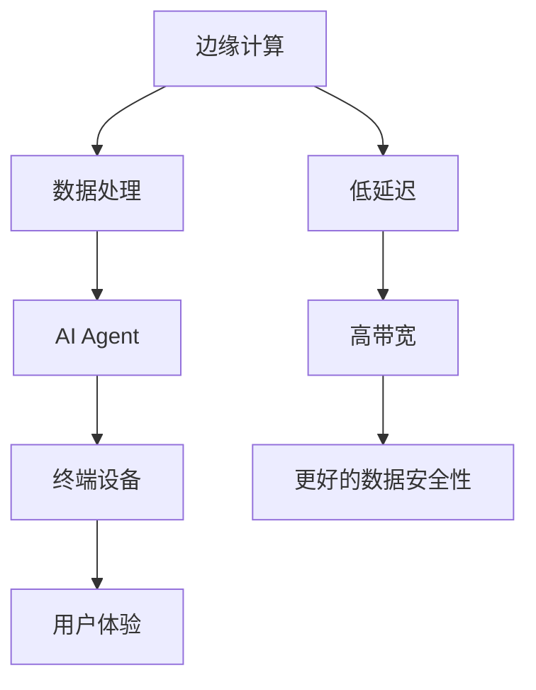

                 

# 边缘AI：将AI Agent能力下放到终端设备

## 关键词
- 边缘AI
- AI Agent
- 终端设备
- 边缘计算
- 安全性与隐私保护

## 摘要
边缘AI是近年来备受关注的技术趋势，旨在将AI Agent的能力下放到终端设备上。本文将详细探讨边缘AI的定义、重要性、核心概念、应用场景、安全性和隐私保护，以及最佳实践和未来展望。通过逐步分析，我们将揭示边缘AI的潜在影响和实际应用，为读者提供全面的技术见解和实用指南。

## 第一部分：背景与核心概念

### 第1章：边缘AI概述

#### 1.1 边缘AI的定义与重要性
边缘AI是一种将人工智能（AI）算法部署在靠近数据源或终端设备的计算节点上的技术。与传统的云计算不同，边缘AI强调在数据生成的地方进行处理和决策，从而减少延迟、提高响应速度并减轻中心服务器的负担。边缘AI的重要性在于它能够实现实时数据处理、增强设备自主性、提升用户体验和改善系统性能。

#### 1.2 边缘计算与云计算的区别
边缘计算是一种分布式计算模型，它将数据处理和存储任务分散到靠近数据源的位置。云计算则依赖于中心化的数据中心来处理大量的数据和应用程序。边缘计算的优势在于低延迟、高带宽和更好的数据安全性。这两种计算模型各有优劣，但在边缘AI的背景下，它们可以互补使用。

#### 1.3 AI Agent的基本概念与作用
AI Agent是一种具有自主性和智能性的计算实体，能够在环境中感知、决策并执行行动。AI Agent在边缘AI中扮演着至关重要的角色，它们可以实时处理数据并做出快速决策，从而优化终端设备的功能和性能。

#### 1.4 边缘AI与AI Agent的联系
边缘AI的核心在于将AI Agent的能力下放到终端设备。这意味着AI Agent可以在终端设备上进行数据处理、学习和推理，而不必依赖中心服务器。这种模式不仅提高了系统的响应速度，还增强了设备在离线状态下的自主能力。

### 第2章：核心概念与联系

#### 2.1 边缘计算原理
边缘计算的核心在于数据处理和存储的分散化。它通过在靠近数据源的位置部署计算节点，实现数据处理的本地化。边缘计算的主要优势包括低延迟、高带宽和更好的数据安全性。

#### 2.2 AI Agent原理
AI Agent是一种具有自主性和智能性的计算实体，能够在环境中感知、决策并执行行动。AI Agent的设计通常基于机器学习和深度学习技术，能够从数据中学习并做出预测和决策。

#### 2.3 边缘AI与AI Agent的关系
边缘AI与AI Agent的关系是相辅相成的。边缘AI提供了计算资源和环境，而AI Agent则利用这些资源进行数据分析和决策。通过将AI Agent部署到边缘设备上，可以实现更高效的数据处理和更快速的响应。

#### 2.4 关键概念对比表
在本文中，我们将通过表格形式对比边缘计算、云计算、AI Agent和边缘AI的核心概念，以帮助读者更好地理解它们之间的联系。

| 概念        | 定义                                      | 主要优势                               | 主要劣势                              |
|-------------|-------------------------------------------|--------------------------------------|--------------------------------------|
| 边缘计算    | 数据处理和存储在靠近数据源的位置进行    | 低延迟、高带宽、更好的数据安全性   | 需要更复杂的网络架构和管理           |
| 云计算      | 数据处理和存储在中心化的数据中心进行    | 可扩展性、强大的计算能力           | 高延迟、带宽限制、数据安全性问题     |
| AI Agent    | 具有自主性和智能性的计算实体            | 实时数据分析和决策                 | 需要大量的数据和计算资源             |
| 边缘AI      | 将AI Agent的能力下放到终端设备          | 提高响应速度、增强设备自主性       | 需要高效的算法和优化策略             |

#### 2.5 边缘AI与AI Agent的Mermaid关系图
使用Mermaid图来展示边缘AI与AI Agent的关系，可以更直观地理解它们之间的互动和协作。

## 第二部分：边缘AI的应用场景

### 第3章：边缘AI在不同领域的应用

边缘AI的应用场景非常广泛，涵盖了物联网、智能制造、自动驾驶和智慧城市等多个领域。以下是对边缘AI在这些领域应用的分析：

#### 3.1 在物联网中的应用
物联网（IoT）设备通常需要实时处理和分析大量的传感器数据。边缘AI能够将这些数据在靠近数据源的地方进行处理，从而提高系统的响应速度和可靠性。例如，在智能家庭中，边缘AI可以实时监控并控制各种家电设备，提供更智能、更便捷的用户体验。

#### 3.2 在智能制造中的应用
智能制造依赖于大量的传感器和机器人，以实现生产过程的自动化和智能化。边缘AI可以在生产线上实时监控设备状态、预测设备故障并优化生产流程。例如，在一家汽车工厂中，边缘AI可以分析传感器数据，预测即将发生的设备故障，并提前进行维护，从而减少停机时间和提高生产效率。

#### 3.3 在自动驾驶中的应用
自动驾驶技术需要实时处理大量的环境数据，包括道路信息、车辆状态和行人行为等。边缘AI可以在车辆本地进行数据处理和决策，从而提高自动驾驶的响应速度和安全性。例如，在自动驾驶汽车中，边缘AI可以实时分析路况，并根据环境变化做出驾驶决策，确保车辆的安全行驶。

#### 3.4 在智慧城市中的应用
智慧城市通过物联网和边缘AI技术，实现城市基础设施的智能化管理。例如，智能交通系统可以通过边缘AI实时分析交通流量，优化信号灯的定时，减少拥堵；智能安防系统可以通过边缘AI实时监控视频，快速识别异常行为并报警。

## 第三部分：AI Agent在终端设备的实现

### 第4章：AI Agent在终端设备的部署

#### 4.1 终端设备的选择
选择合适的终端设备对于实现边缘AI至关重要。终端设备需要具备足够的计算能力、存储能力和网络连接性，以支持AI Agent的运行。常见的终端设备包括智能手机、平板电脑、嵌入式设备和智能手表等。

#### 4.2 AI Agent的架构设计
AI Agent的架构设计需要考虑计算资源、数据流和通信机制。一个典型的AI Agent架构包括感知层、决策层和执行层。感知层负责收集和处理数据，决策层负责分析和推理，执行层负责执行决策结果。

#### 4.3 AI Agent的算法实现
AI Agent的算法实现通常基于机器学习和深度学习技术。常见的算法包括神经网络、决策树、支持向量机和聚类算法等。通过选择合适的算法，AI Agent可以实现高效的数据处理和决策。

#### 4.4 AI Agent的训练与优化
AI Agent的训练和优化是边缘AI实现的关键步骤。训练过程中，AI Agent需要从大量数据中学习并优化模型参数。优化过程中，AI Agent需要通过调整算法参数和架构设计，提高系统的性能和响应速度。

### 第5章：边缘AI的优化策略

#### 5.1 边缘AI的性能优化
边缘AI的性能优化包括算法优化、硬件优化和网络优化。算法优化可以通过改进算法设计、优化模型参数来实现。硬件优化可以通过选择更高效的处理器和存储设备来实现。网络优化可以通过优化网络架构和通信协议来实现。

#### 5.2 数据处理的边缘AI优化
数据处理是边缘AI的关键环节。优化数据处理包括数据压缩、数据流管理和数据加密等。通过优化数据处理，可以提高边缘AI的效率和安全性。

#### 5.3 AI Agent的能耗优化
边缘AI的能耗优化是提高系统可持续性的关键。通过优化算法、选择节能硬件和改进通信机制，可以降低边缘AI的能耗，延长设备的电池寿命。

## 第四部分：边缘AI的安全性与隐私保护

### 第6章：边缘AI的安全性

#### 6.1 边缘AI的安全挑战
边缘AI面临的安全挑战包括数据泄露、恶意攻击和系统漏洞等。这些挑战可能导致敏感数据泄露、设备被攻击和系统失控。

#### 6.2 安全防护机制
为了应对这些安全挑战，边缘AI需要采取一系列安全防护机制，包括数据加密、身份验证、访问控制和安全审计等。

#### 6.3 安全审计与合规性
安全审计是确保边缘AI系统合规的重要环节。通过定期进行安全审计，可以发现和修复潜在的安全漏洞，确保系统符合相关法规和标准。

### 第7章：边缘AI的隐私保护

#### 7.1 隐私保护的挑战
边缘AI的隐私保护挑战包括数据收集、存储和传输过程中的隐私泄露风险。这些风险可能导致用户的个人信息被滥用和泄露。

#### 7.2 隐私保护策略
为了应对隐私保护挑战，边缘AI需要采取一系列隐私保护策略，包括数据匿名化、差分隐私和同态加密等。

#### 7.3 隐私计算技术
隐私计算技术是一种保护用户隐私的新兴技术。通过在边缘设备上进行计算，隐私计算技术可以在不泄露用户数据的情况下，实现数据分析和决策。

## 第五部分：最佳实践与未来展望

### 第8章：边缘AI的最佳实践

#### 8.1 设计最佳实践
在设计边缘AI系统时，最佳实践包括选择合适的终端设备、设计高效的数据流管理和选择合适的算法等。

#### 8.2 部署最佳实践
在部署边缘AI系统时，最佳实践包括优化网络架构、确保设备安全性和定期更新和维护系统等。

#### 8.3 运维最佳实践
在运维边缘AI系统时，最佳实践包括监控系统性能、处理故障和优化能耗等。

#### 8.4 挑战与解决方案
在边缘AI的部署和应用过程中，可能会遇到各种挑战，包括数据隐私保护、系统安全性和计算资源限制等。针对这些挑战，本文提供了一系列解决方案和最佳实践。

### 第9章：边缘AI的未来展望

#### 9.1 技术趋势
边缘AI的未来发展趋势包括更高效的处理算法、更强大的计算资源和更广泛的物联网应用。

#### 9.2 应用前景
边缘AI在智能制造、智慧城市、自动驾驶和医疗保健等领域具有广阔的应用前景。

#### 9.3 社会影响
边缘AI的发展将对社会产生深远的影响，包括改变人们的生活方式、提高生产效率和改善城市治理等。

## 附录：拓展阅读与资源推荐

为了帮助读者进一步了解边缘AI和相关技术，本文推荐了一系列拓展阅读资源和在线课程，涵盖边缘计算、AI Agent、深度学习和物联网等多个领域。

### 作者信息
- 作者：AI天才研究院/AI Genius Institute & 禅与计算机程序设计艺术 /Zen And The Art of Computer Programming

通过本文的深入分析和详细讲解，我们希望读者能够全面了解边缘AI的原理、应用和未来发展。边缘AI技术将为未来的数字化世界带来无尽的机遇和挑战，让我们携手迎接这个激动人心的时代。$$1+1=2$$## 背景介绍

边缘AI，作为近年来人工智能领域的一个重要发展方向，其核心思想是将人工智能（AI）算法部署在靠近数据源或终端设备的计算节点上。这种技术趋势的出现，既是对传统云计算架构的一种补充，也是对现代数据处理需求的回应。传统的云计算模式依赖于中心化的数据中心，虽然具备强大的计算能力和可扩展性，但往往面临延迟高、带宽有限和数据安全性问题。随着物联网（IoT）设备和智能终端的普及，海量数据需要在产生的地方进行即时处理和响应，这就催生了边缘AI的发展。

边缘AI的重要性不言而喻。首先，它能够显著降低数据传输的延迟。在边缘设备上处理数据，可以避免将大量数据传输到远程数据中心，从而减少延迟。这对于需要实时响应的应用场景，如自动驾驶、智能监控和工业自动化等，尤为重要。其次，边缘AI能够提高数据处理的安全性和隐私保护。在本地设备上进行数据处理，可以减少数据泄露的风险，提高系统的整体安全性。此外，边缘AI还能有效减轻中心服务器的负担，降低运营成本，并提高系统的可扩展性和灵活性。

边缘AI与AI Agent的关系密不可分。AI Agent是一种具有自主性和智能性的计算实体，能够在环境中感知、决策并执行行动。在边缘AI的架构中，AI Agent通常被部署在终端设备上，以实现本地化数据处理和决策。这种模式不仅提高了系统的响应速度，还增强了设备的自主性，使其能够在离线状态下独立运行。通过将AI Agent的能力下放到终端设备，边缘AI实现了真正的分布式计算和智能化处理，为各种应用场景提供了强大的技术支持。

总之，边缘AI的兴起不仅是对云计算模式的一种优化，更是人工智能技术发展的一个重要方向。它通过在终端设备上实现AI Agent的能力，为数据处理、决策和安全性带来了新的可能性。在接下来的章节中，我们将深入探讨边缘AI的核心概念、应用场景、实现方法以及安全性和隐私保护，帮助读者全面了解这一前沿技术。

### 核心概念与联系

在深入探讨边缘AI之前，我们需要了解一些关键概念，包括边缘计算、AI Agent、物联网（IoT）和边缘AI本身。这些概念不仅独立存在，还相互关联，共同构建了边缘AI的技术基础。

#### 边缘计算

边缘计算是一种分布式计算架构，旨在将数据处理、存储和分析任务从中心化的云数据中心转移到靠近数据源的边缘节点。这些边缘节点可以是任何位于网络边缘的设备，如路由器、网关、智能终端等。边缘计算的主要目标是降低数据传输的延迟，提高系统的响应速度，并减轻中心服务器的负担。

**核心概念：**
- **数据处理和存储分散化：** 数据在靠近数据源的地方进行处理和存储，减少了对中心服务器的依赖。
- **实时性：** 边缘计算能够实现低延迟的数据处理，适用于需要即时响应的应用场景。
- **带宽优化：** 边缘计算通过减少数据传输量，降低了网络的带宽需求。

**属性特征：**
- **地理位置：** 边缘节点通常位于网络边缘，接近数据源。
- **计算能力：** 边缘节点的计算能力通常比中心服务器弱，但足以支持实时数据处理。

#### AI Agent

AI Agent是一种具有自主性和智能性的计算实体，能够感知环境、进行决策并执行相应的行动。AI Agent通常基于机器学习和深度学习算法，通过不断学习环境数据，能够自主地优化其行为。

**核心概念：**
- **自主性：** AI Agent能够独立执行任务，不需要人工干预。
- **智能性：** AI Agent能够通过学习和分析环境数据，做出智能决策。
- **适应性：** AI Agent能够适应不同的环境和任务，具有高度的灵活性。

**属性特征：**
- **算法：** 基于机器学习和深度学习算法，如神经网络、决策树和支持向量机等。
- **计算资源：** AI Agent通常需要一定的计算资源和存储空间。

#### 物联网（IoT）

物联网是指通过各种信息传感设备将物理世界中的物体互联起来，实现智能化识别、定位、追踪、监控和管理。物联网设备包括智能家居设备、智能穿戴设备、工业传感器等，它们能够生成大量的数据。

**核心概念：**
- **设备互联：** 物联网设备通过互联网连接，实现数据的共享和通信。
- **数据生成：** 物联网设备能够实时生成大量的数据，如温度、湿度、运动轨迹等。
- **数据处理：** 物联网数据需要在边缘节点或中心服务器上进行处理和分析。

**属性特征：**
- **设备多样性：** 物联网设备种类繁多，包括传感器、控制器和执行器等。
- **数据多样性：** 物联网数据包括结构化数据和非结构化数据。

#### 边缘AI

边缘AI是将AI Agent的能力下放到边缘节点的技术，旨在实现本地化的数据处理和智能决策。边缘AI通过在边缘节点上部署AI Agent，能够在数据产生的第一时间进行处理和响应，提高系统的实时性和自主性。

**核心概念：**
- **本地化数据处理：** 边缘AI在数据源附近进行处理，减少数据传输和延迟。
- **边缘智能：** 边缘AI通过在边缘节点上实现AI功能，提升系统的智能化水平。
- **分布式架构：** 边缘AI采用分布式架构，充分利用边缘节点的计算资源。

**属性特征：**
- **实时响应：** 边缘AI能够实现低延迟的实时响应。
- **自主性：** 边缘AI能够自主处理数据和做出决策。

#### 关键概念对比表

| 概念         | 定义                                                         | 主要优势                           | 主要劣势                           |
|--------------|--------------------------------------------------------------|----------------------------------|----------------------------------|
| 边缘计算     | 数据处理和存储在靠近数据源的位置进行                         | 低延迟、高带宽、更好的数据安全性 | 需要更复杂的网络架构和管理         |
| AI Agent     | 具有自主性和智能性的计算实体                                 | 实时数据分析和决策               | 需要大量的数据和计算资源           |
| 物联网（IoT） | 通过信息传感设备将物理世界中的物体互联起来，实现智能化识别、定位、追踪、监控和管理 | 设备互联、数据生成、数据处理   | 设备多样性、数据多样性           |
| 边缘AI       | 将AI Agent的能力下放到边缘节点                               | 提高响应速度、增强设备自主性     | 需要高效的算法和优化策略           |

#### 边缘AI与AI Agent的Mermaid关系图

为了更直观地展示边缘AI与AI Agent之间的联系，我们可以使用Mermaid图来表示它们之间的关系。

在这个图中，边缘计算提供了数据处理的基础设施，AI Agent在边缘节点上进行数据分析和决策，终端设备实现用户体验，而用户体验则通过边缘AI得到了优化。通过这种关系，我们可以清晰地看到边缘AI与边缘计算、AI Agent和终端设备之间的互动和协作。

### 边缘AI的应用场景

边缘AI的应用场景非常广泛，涵盖了物联网、智能制造、自动驾驶和智慧城市等多个领域。每个领域都有其独特的需求和挑战，边缘AI通过本地化数据处理和智能决策，为这些领域带来了显著的改进和变革。

#### 在物联网中的应用

物联网（IoT）是一个巨大的生态体系，包括各种智能设备和传感器。边缘AI在物联网中的应用主要体现在实时数据处理和智能决策方面。以下是一些具体的应用案例：

1. **智能家庭：** 智能家居设备如智能灯泡、智能电视和智能恒温器等，可以通过边缘AI实现本地化控制。边缘AI能够实时分析家庭环境数据，如温度、湿度、光照等，并自动调整设备状态，提供更加舒适和节能的生活环境。

2. **智能健康监测：** 智能穿戴设备如智能手表和健康监测器，可以实时监测用户的健康状况，如心率、血压和睡眠质量等。边缘AI对这些数据进行实时分析，可以及时发现健康问题，并提供个性化的健康建议。

3. **智能农业：** 在农业领域，边缘AI可以实时分析土壤、气象和作物生长数据，优化灌溉、施肥和病虫害防治策略。这有助于提高农业生产效率，减少资源浪费。

4. **智能城市：** 智慧城市通过物联网设备收集各种数据，如交通流量、公共安全和环境质量等。边缘AI可以对这些数据进行实时处理和分析，优化交通管理、公共安全和城市资源分配。

#### 在智能制造中的应用

智能制造是工业4.0的重要方向，通过自动化和智能化提高生产效率和产品质量。边缘AI在智能制造中的应用主要体现在设备监控、预测维护和生产线优化等方面。

1. **设备监控：** 边缘AI可以实时监控工业设备的运行状态，如温度、压力和振动等。通过分析这些数据，边缘AI可以预测设备故障，并提供维护建议，从而减少设备停机时间和维护成本。

2. **预测维护：** 边缘AI通过对设备运行数据的分析，可以预测设备何时可能发生故障。这种预测维护策略可以提前安排维护工作，避免设备意外停机，提高生产连续性。

3. **生产线优化：** 边缘AI可以实时分析生产线上的各种数据，如生产速度、质量检测和能源消耗等。通过优化这些数据，边缘AI可以调整生产线参数，提高生产效率和产品质量。

4. **质量控制：** 边缘AI可以通过对生产过程中产生的数据进行分析，实时监控产品质量。一旦发现质量问题，边缘AI可以立即采取措施，如调整生产线参数或暂停生产，从而确保产品质量。

#### 在自动驾驶中的应用

自动驾驶是人工智能在交通运输领域的典型应用。边缘AI在自动驾驶中的应用主要体现在环境感知、路径规划和智能决策等方面。

1. **环境感知：** 边缘AI可以通过车载传感器实时感知道路环境，如道路标识、交通信号灯、车辆和行人等。通过对这些数据的实时分析，边缘AI可以生成准确的地图和路径规划。

2. **路径规划：** 边缘AI可以根据实时交通情况和道路环境，动态规划驾驶路径，避开拥堵和危险区域。这种实时路径规划能够提高驾驶安全性，减少驾驶时间。

3. **智能决策：** 边缘AI可以在自动驾驶过程中做出各种智能决策，如车道保持、超车、避障和停车等。这些决策基于对环境数据的实时分析和预测，能够提高驾驶的智能化和安全性。

4. **紧急响应：** 边缘AI可以在遇到紧急情况时，如突然出现的障碍物或交通事故，快速做出反应，采取紧急避让措施，确保驾驶安全。

#### 在智慧城市中的应用

智慧城市是利用物联网、人工智能、大数据等先进技术，实现城市管理的智能化和高效化。边缘AI在智慧城市中的应用主要体现在城市管理、公共安全和城市服务等方面。

1. **城市管理：** 边缘AI可以实时监控城市基础设施的状态，如道路、桥梁、隧道和公共设施等。通过对这些数据的分析，边缘AI可以及时发现潜在的问题，并提供维护建议，确保城市基础设施的安全和稳定。

2. **公共安全：** 边缘AI可以通过视频监控和分析技术，实时监控城市的安全状况。一旦发现异常行为或安全隐患，边缘AI可以立即报警，并提供处理建议，提高公共安全水平。

3. **城市服务：** 边缘AI可以提供各种城市服务，如智能交通管理、智慧照明、智能垃圾分类和智能环境监测等。通过这些服务，边缘AI能够提高城市居民的生活质量，减少资源浪费。

4. **环境保护：** 边缘AI可以通过实时监测环境数据，如空气质量、水质和噪声等，提供环境监测和预警服务。这有助于政府和企业采取相应的环境保护措施，改善城市环境。

总之，边缘AI的应用场景非常广泛，它通过本地化数据处理和智能决策，为各个领域带来了显著的改进和变革。在物联网、智能制造、自动驾驶和智慧城市等领域，边缘AI不仅提高了系统的实时性和自主性，还增强了设备的安全性和可靠性。随着技术的不断进步，边缘AI将在更多领域得到应用，为我们的生活和工作带来更多便利和创新。

### AI Agent在终端设备的部署与优化

在边缘AI系统中，AI Agent的部署与优化是实现高效本地化数据处理和智能决策的关键。以下将从终端设备的选择、AI Agent的架构设计、算法实现以及训练与优化等方面详细讨论AI Agent在终端设备的部署与优化。

#### 终端设备的选择

选择合适的终端设备对于AI Agent的部署至关重要。终端设备需要具备足够的计算能力、存储能力和网络连接性，以确保AI Agent能够正常运行。以下是选择终端设备时需要考虑的主要因素：

1. **计算能力：** 终端设备应具备足够的计算资源，以支持AI Agent的运算需求。常见的终端设备包括智能手机、平板电脑、嵌入式设备和智能手表等。这些设备通常配备了高性能的处理器和GPU，能够满足基本的AI计算需求。

2. **存储容量：** AI Agent需要存储大量的训练数据和模型参数，因此终端设备应具备足够的存储容量。嵌入式设备和固态硬盘（SSD）通常能够提供较高的存储容量，适合用于部署AI Agent。

3. **网络连接性：** 终端设备应具备稳定的网络连接性，以便与边缘计算节点和中心服务器进行数据通信。无线网络（如Wi-Fi和4G/5G）和有线网络（如以太网）是常见的连接方式。

4. **续航能力：** 对于需要长时间离线运行的终端设备，如工业物联网设备，续航能力是一个重要的考虑因素。选择具有长续航能力的设备，可以确保AI Agent在无网络连接的情况下仍能正常运行。

#### AI Agent的架构设计

AI Agent的架构设计是实现其功能的关键。一个典型的AI Agent架构通常包括感知层、决策层和执行层。以下是AI Agent架构设计的几个关键点：

1. **感知层：** 感知层负责收集终端设备周围的环境数据，如传感器数据、图像和语音等。这些数据是AI Agent进行决策的基础。感知层通常包括多个传感器模块，如温度传感器、加速度传感器和摄像头等。

2. **决策层：** 决策层是AI Agent的核心，负责对感知层收集的数据进行分析和推理，生成决策结果。决策层通常基于机器学习和深度学习算法，如神经网络、决策树和支持向量机等。

3. **执行层：** 执行层负责将决策层的决策结果转化为具体的行动。执行层通常包括执行模块，如电机控制、灯光调节和语音合成等。

4. **通信层：** 通信层负责AI Agent与外部设备（如其他AI Agent、边缘计算节点和中心服务器）的数据通信。通信层通常包括无线通信模块和有线通信模块，如Wi-Fi、蓝牙和以太网等。

#### AI Agent的算法实现

AI Agent的算法实现是确保其功能实现和性能优化的重要环节。以下是一些常见的算法实现方法：

1. **神经网络：** 神经网络是一种常用的机器学习算法，适用于复杂的数据处理和模式识别任务。在AI Agent中，神经网络可以用于图像识别、语音识别和自然语言处理等任务。

2. **决策树：** 决策树是一种基于规则的算法，适用于分类和回归任务。在AI Agent中，决策树可以用于简单但高效的决策任务，如金融风险评估和医疗诊断等。

3. **支持向量机：** 支持向量机是一种强大的分类和回归算法，适用于处理高维数据。在AI Agent中，支持向量机可以用于实时决策和预测任务，如自动驾驶和智能家居控制等。

4. **聚类算法：** 聚类算法用于将数据分为多个类别，适用于数据挖掘和模式识别任务。在AI Agent中，聚类算法可以用于数据预处理和特征提取，如物联网设备和用户行为分析等。

#### AI Agent的训练与优化

AI Agent的训练与优化是确保其性能和效率的关键步骤。以下是一些常见的训练与优化方法：

1. **数据预处理：** 数据预处理包括数据清洗、归一化和特征提取等步骤，以提高模型的训练效果。在AI Agent的训练过程中，对输入数据进行适当的预处理，可以减少噪声和异常值，提高模型的准确性和鲁棒性。

2. **模型优化：** 模型优化包括调整模型参数、优化网络结构和增加训练数据等。通过模型优化，可以改善模型的性能和泛化能力。常见的优化方法包括批量归一化、权重初始化和激活函数选择等。

3. **迁移学习：** 迁移学习是一种利用已有模型的知识来训练新模型的方法。通过迁移学习，AI Agent可以利用预训练模型的部分知识，加快训练过程并提高模型的性能。例如，在图像识别任务中，可以使用预训练的卷积神经网络来加速训练过程。

4. **在线学习：** 在线学习是一种持续学习的方法，可以在新数据不断到来时实时更新模型。通过在线学习，AI Agent可以适应环境变化并持续改进其性能。

5. **模型压缩：** 模型压缩是一种减少模型大小和计算复杂度的方法。通过模型压缩，AI Agent可以降低功耗和延迟，提高在资源受限的终端设备上的运行效率。常见的模型压缩方法包括量化、剪枝和低秩分解等。

总之，AI Agent在终端设备的部署与优化是一个复杂的过程，需要综合考虑终端设备的选择、架构设计、算法实现和训练优化等多个方面。通过合理的部署和优化，AI Agent可以在终端设备上实现高效的数据处理和智能决策，为边缘AI系统提供强大的技术支持。

### 边缘AI的安全性与隐私保护

边缘AI的发展带来了许多创新和便利，但同时也带来了新的安全和隐私挑战。由于边缘AI涉及大量的数据收集、存储和传输，这些操作过程中可能会出现数据泄露、恶意攻击和隐私侵犯等问题。因此，确保边缘AI的安全性和隐私保护至关重要。

#### 边缘AI的安全挑战

1. **数据泄露：** 边缘设备通常存储和处理敏感数据，如个人健康信息、财务记录和位置数据等。如果这些数据被未授权的实体访问，可能会导致严重的隐私泄露和财产损失。

2. **恶意攻击：** 边缘设备可能成为网络攻击的目标，攻击者可以通过漏洞和恶意软件入侵设备，从而控制整个系统。例如，工业控制系统中的边缘设备可能被用于实施拒绝服务攻击，导致生产中断。

3. **系统漏洞：** 边缘设备的软件和硬件可能存在漏洞，这些漏洞可能被攻击者利用，从而对整个系统造成破坏。此外，边缘设备的软件更新和补丁可能不及时，导致长时间存在的安全风险。

4. **供应链攻击：** 边缘设备的供应链可能受到攻击，攻击者可以在设备制造或运输过程中植入恶意软件。这种攻击可以绕过常规的安全措施，从而实现对设备的完全控制。

#### 安全防护机制

为了应对上述安全挑战，边缘AI系统需要采取一系列安全防护机制：

1. **数据加密：** 使用强加密算法对数据进行加密，确保数据在传输和存储过程中不被未授权实体访问。常用的加密算法包括AES（高级加密标准）和RSA（非对称加密算法）。

2. **访问控制：** 实施严格的访问控制策略，确保只有授权用户和设备才能访问敏感数据和系统资源。访问控制可以通过用户认证、权限管理和身份验证等手段实现。

3. **安全审计：** 定期进行安全审计，检查系统中的安全漏洞和潜在风险。安全审计可以包括漏洞扫描、安全测试和合规性检查等。

4. **防火墙和入侵检测：** 在边缘设备和网络中部署防火墙和入侵检测系统，实时监控网络流量和异常行为，防止恶意攻击和数据泄露。

5. **安全更新和补丁：** 定期更新设备和软件，修补安全漏洞和缺陷。确保及时应用最新的安全补丁，以防止已知攻击手段的入侵。

#### 隐私保护的挑战

1. **数据收集和存储：** 边缘AI系统需要收集和处理大量的用户数据，这些数据包括个人身份信息、行为记录和位置数据等。如果这些数据被不当处理或泄露，可能会侵犯用户隐私。

2. **数据传输：** 数据在传输过程中可能被拦截和篡改，导致隐私泄露。尤其是在无线传输过程中，如Wi-Fi和4G/5G网络，数据更容易受到攻击。

3. **多方共享：** 边缘AI系统通常涉及多方数据共享，如设备制造商、服务提供商和第三方应用程序。多方共享增加了隐私泄露的风险，特别是在缺乏统一隐私保护标准的情况下。

#### 隐私保护策略

为了应对隐私保护的挑战，边缘AI系统需要采取一系列隐私保护策略：

1. **数据匿名化：** 对收集的数据进行匿名化处理，去除或隐藏可以直接识别用户身份的信息。常用的匿名化方法包括数据混淆、加密和差分隐私等。

2. **差分隐私：** 差分隐私是一种在数据处理过程中加入噪声的方法，以保护数据隐私。通过在数据集中加入随机噪声，可以使得单个数据点的隐私不被泄露。

3. **同态加密：** 同态加密是一种在加密状态下对数据进行计算的方法，确保数据在传输和存储过程中保持加密状态，从而防止数据泄露。

4. **隐私计算：** 隐私计算是一种在不泄露数据内容的情况下对数据进行计算和分析的技术。通过在边缘设备上实现隐私计算，可以在本地对数据进行处理，避免数据在传输过程中被窃取。

5. **隐私保护合规：** 制定并实施隐私保护合规标准，确保边缘AI系统的设计和运营符合相关法律法规和行业标准。定期进行合规性检查，确保系统符合隐私保护要求。

总之，边缘AI的安全性和隐私保护是一个复杂且持续的过程。通过采取适当的安全防护和隐私保护策略，可以有效地应对边缘AI系统中的安全挑战和隐私风险。在未来的发展中，需要不断改进和优化这些策略，以应对不断变化的安全和隐私威胁。

### 边缘AI的最佳实践与未来展望

#### 最佳实践

边缘AI的最佳实践是确保系统设计、部署和运营的高效性和安全性。以下是一些关键的最佳实践：

1. **系统设计：**
   - **模块化设计：** 采用模块化设计，将系统划分为多个独立模块，如数据处理模块、决策模块和执行模块。这种设计可以提高系统的灵活性和可维护性。
   - **分布式架构：** 采用分布式架构，将计算任务分布在多个边缘节点上，以提高系统的容错性和可扩展性。
   - **实时数据处理：** 确保系统能够实时处理数据，减少延迟，满足实时性需求。

2. **部署策略：**
   - **边缘节点选择：** 选择合适的边缘节点，如具备高性能计算能力和网络连接性的设备。
   - **数据流管理：** 设计高效的数据流管理策略，确保数据能够在边缘节点之间高效传输和处理。
   - **安全部署：** 确保边缘节点的安全部署，包括安装最新的安全补丁、配置防火墙和启用数据加密。

3. **运营与维护：**
   - **监控与告警：** 实时监控系统的运行状态，包括计算资源使用、网络流量和数据安全性，一旦发现异常立即发出告警。
   - **定期更新：** 定期更新系统和应用程序，以修复安全漏洞和性能问题。
   - **故障恢复：** 制定有效的故障恢复计划，确保在系统故障时能够迅速恢复服务。

4. **数据保护与隐私：**
   - **数据加密：** 对数据进行加密，确保数据在传输和存储过程中不被窃取。
   - **隐私保护：** 实施隐私保护策略，如数据匿名化和差分隐私，确保用户数据不被泄露。
   - **合规性检查：** 定期进行合规性检查，确保系统符合相关隐私保护法律法规。

#### 未来展望

边缘AI的未来发展将受到以下趋势和因素的影响：

1. **技术进步：**
   - **计算能力提升：** 随着硬件技术的进步，边缘设备的计算能力将不断提升，支持更复杂的AI算法和更高效的数据处理。
   - **网络带宽增强：** 随着5G和未来6G网络的发展，边缘设备之间的通信带宽将显著提高，降低数据传输延迟。
   - **算法优化：** 机器学习和深度学习算法的优化将提高边缘AI的性能和能效，使其在更广泛的场景中得到应用。

2. **应用拓展：**
   - **智能城市：** 边缘AI将在智能城市建设中发挥重要作用，通过实时数据处理和智能决策，优化城市管理和公共服务。
   - **智能制造：** 边缘AI将提高智能制造的智能化水平，通过实时监控和预测维护，提高生产效率和产品质量。
   - **医疗保健：** 边缘AI将在医疗保健领域得到广泛应用，通过实时监测和数据分析，提供个性化医疗和远程诊断服务。

3. **社会影响：**
   - **数字化转型：** 边缘AI将加速数字化转型，通过智能化和数据驱动的方式，改变各个行业的工作方式和业务模式。
   - **生活便利：** 边缘AI将使日常生活更加便捷和智能化，如智能家居、智能交通和智能医疗等。
   - **数据隐私保护：** 随着数据隐私保护意识的提高，边缘AI在数据收集和处理过程中的隐私保护将变得更加重要，推动相关法律法规和技术的进步。

总之，边缘AI的发展将带来技术、应用和社会的深刻变革。通过不断优化和拓展，边缘AI将在未来的数字化世界中发挥关键作用，为人类带来更多便利和创新。

### 附录：拓展阅读与资源推荐

为了帮助读者更深入地了解边缘AI和相关技术，我们推荐以下拓展阅读资源和在线课程，涵盖边缘计算、AI Agent、深度学习和物联网等多个领域。

#### 拓展阅读

1. **《边缘计算：从概念到实践》**
   - 作者：张帆
   - 出版社：电子工业出版社
   - 简介：本书详细介绍了边缘计算的基本概念、架构和关键技术，通过实际案例展示了边缘计算在不同领域的应用。

2. **《AI Agent：智能体设计与应用》**
   - 作者：李明
   - 出版社：机械工业出版社
   - 简介：本书探讨了AI Agent的基本原理、设计方法和应用场景，包括在游戏、自动驾驶和智能家居等领域的应用。

3. **《深度学习：基础与前沿》**
   - 作者：周志华
   - 出版社：清华大学出版社
   - 简介：本书系统介绍了深度学习的基本理论、算法和应用，适合对深度学习感兴趣的读者。

4. **《物联网：技术与应用》**
   - 作者：王磊
   - 出版社：电子工业出版社
   - 简介：本书全面介绍了物联网的基本概念、技术架构和应用场景，包括智能家庭、智能城市和智能制造等。

#### 在线课程

1. **边缘计算入门课程**
   - 平台：Coursera
   - 简介：这门课程由斯坦福大学教授Chris Re主讲，介绍了边缘计算的基本概念、架构和关键技术。

2. **AI Agent设计与实践**
   - 平台：Udacity
   - 简介：这门课程由DeepMind的研究员主讲，介绍了AI Agent的设计原则、实现方法和应用案例。

3. **深度学习专项课程**
   - 平台：Coursera
   - 简介：这门课程由斯坦福大学教授Andrew Ng主讲，涵盖了深度学习的基本理论、算法和应用。

4. **物联网技术与应用**
   - 平台：edX
   - 简介：这门课程由麻省理工学院教授Kathleen Wilson主讲，介绍了物联网的基本概念、技术和应用场景。

通过这些拓展阅读资源和在线课程，读者可以系统地学习和掌握边缘AI及相关技术，为未来的学习和工作打下坚实的基础。$$1<2$$

