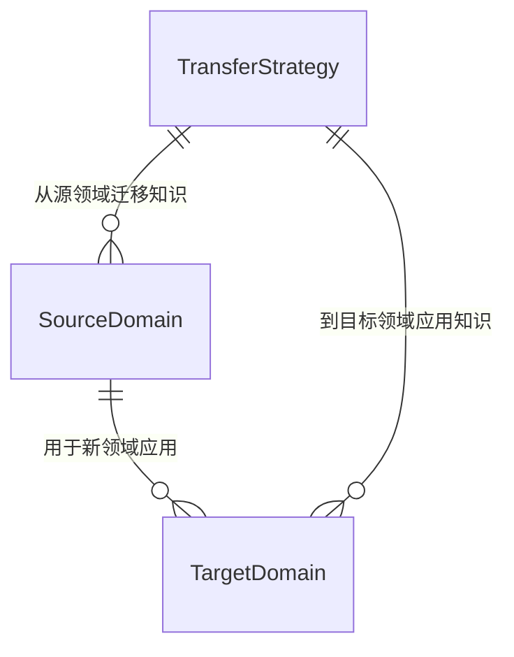
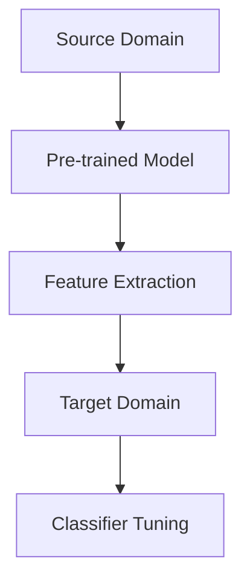
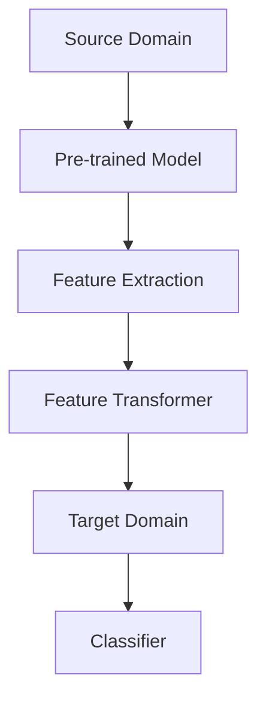
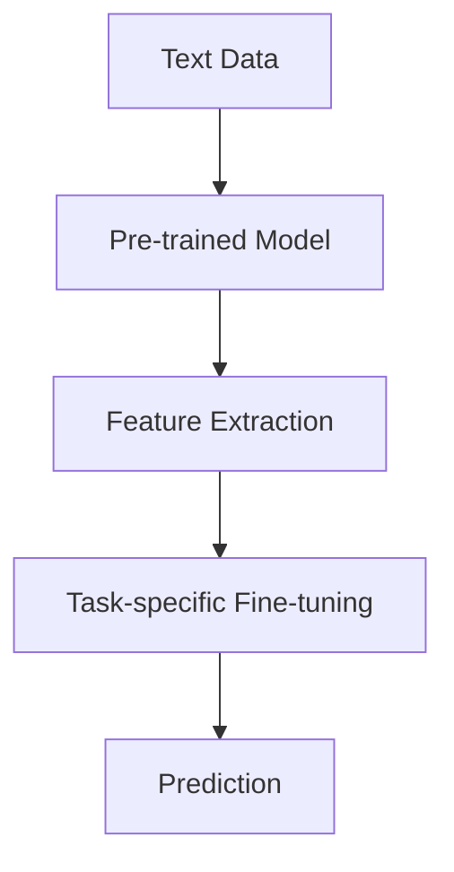
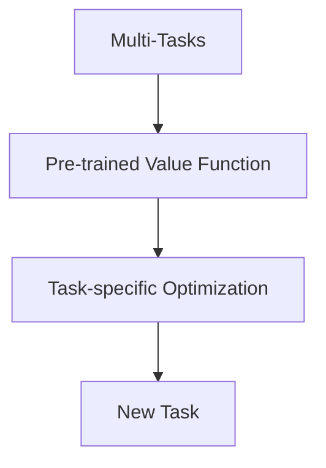

                 

### 迁移学习简介

#### 迁移学习的背景与意义

**概念术语说明**

- **迁移学习（Transfer Learning）**：是一种机器学习方法，允许模型将在一个任务上学习到的知识转移到另一个相关但不同的任务上。
- **源领域（Source Domain）**：模型已在该领域学习并积累了知识的领域。
- **目标领域（Target Domain）**：模型需要在新领域应用其学到的知识的领域。
- **泛化能力（Generalization Ability）**：模型能够将源领域的知识有效地应用到目标领域的能力。

**问题背景**

随着深度学习技术的快速发展，复杂的模型如卷积神经网络（CNN）和循环神经网络（RNN）被广泛应用于各种任务，如图像识别、自然语言处理和强化学习。然而，这些模型通常需要大量的数据集来训练，这在某些特定领域或特定任务中可能难以实现。例如，医疗影像分析领域的数据量相对有限，而在自动驾驶领域，需要收集和处理大量道路环境数据。

**问题描述**

迁移学习的核心问题是如何有效地利用少量目标领域数据，通过将源领域模型的知识迁移，快速提升模型在目标领域上的性能。迁移学习试图解决以下几个问题：
1. **数据稀缺问题**：通过迁移学习，可以减少对大量标注数据的依赖。
2. **领域差异问题**：迁移学习能够缓解源领域与目标领域之间的差异。
3. **模型泛化能力**：通过迁移学习，提高模型在不同任务上的泛化能力。

**问题解决**

迁移学习通过以下几种机制解决上述问题：
1. **知识共享**：模型在源领域学习到的特征被共享到目标领域。
2. **特征变换**：将源领域的特征映射到目标领域，降低领域差异。
3. **微调**：在目标领域上对已经初步训练好的模型进行微调，以适应新的数据分布。

**边界与外延**

迁移学习的边界包括：
- **领域相关性**：迁移学习的效果依赖于源领域与目标领域的相关性。
- **模型容量**：源领域模型的复杂度需要与目标领域的需求相匹配。

外延方面，迁移学习不仅限于传统的机器学习任务，还可以扩展到其他领域，如强化学习、无监督学习等。

**概念结构与核心要素组成**

迁移学习涉及以下核心要素：
- **模型架构**：选择适合迁移学习的模型架构，如预训练的CNN或RNN。
- **数据集**：选择具有代表性的源领域数据集和目标领域数据集。
- **迁移策略**：确定如何将源领域知识迁移到目标领域，包括特征共享、特征变换和微调等。

通过上述介绍，我们可以看到迁移学习在解决数据稀缺、领域差异和模型泛化能力等方面具有重要作用，为各种应用场景提供了有效的解决方案。在接下来的章节中，我们将进一步深入探讨迁移学习的核心原理和具体应用。

#### 迁移学习的基本概念

迁移学习作为一种有效的机器学习方法，其核心在于将一个任务学到的知识应用到另一个相关但不同的任务中。为了更好地理解迁移学习的本质和作用，我们需要首先明确几个基本概念，并分析其属性特征和相互关系。

**核心概念**

1. **源领域（Source Domain）**：
   - **定义**：源领域是指模型已经在该领域学习并积累了知识的领域。例如，在图像识别任务中，使用大量带有标签的图像数据集进行预训练的领域。
   - **作用**：源领域提供了模型的基础知识和特征提取能力，是迁移学习的重要基础。

2. **目标领域（Target Domain）**：
   - **定义**：目标领域是指模型需要在新领域应用其学到的知识的领域。与源领域不同，目标领域可能具有不同的数据分布、特征表示或任务需求。
   - **作用**：目标领域是迁移学习最终要解决的问题领域，迁移学习的目标是提高模型在目标领域上的性能。

3. **迁移策略（Transfer Strategy）**：
   - **定义**：迁移策略是指将源领域的知识迁移到目标领域的方法和过程。常见的迁移策略包括特征共享、特征变换和模型微调等。
   - **作用**：迁移策略决定了如何有效地利用源领域知识，提高目标领域的模型性能。

**概念属性特征对比表格**

| 概念       | 定义                                                         | 属性特征                                                       | 关系与作用                                                   |
|------------|--------------------------------------------------------------|--------------------------------------------------------------|------------------------------------------------------------|
| 源领域     | 已学习的知识领域                                           | 数据集丰富、模型预训练                                         | 提供基础特征提取能力和知识共享                               |
| 目标领域   | 应用知识的新领域                                           | 数据集有限、任务需求不同                                       | 利用源领域知识，提高目标领域模型性能                         |
| 迁移策略   | 知识迁移方法和过程                                         | 特征共享、特征变换、模型微调等                                 | 实现源领域知识向目标领域的有效迁移                           |

**ER实体关系图架构**

为了更好地理解上述概念之间的关系和交互作用，我们可以使用Mermaid语法的ER实体关系图来表示：



在这个ER图中，`SourceDomain`（源领域）通过`TransferStrategy`（迁移策略）与`TargetDomain`（目标领域）建立关系。迁移策略起到了桥梁的作用，将源领域的知识有效地传递到目标领域，从而提升目标领域的模型性能。

通过上述基本概念的分析和对比，我们可以看到迁移学习在机器学习领域的重要作用。它不仅解决了数据稀缺和领域差异的问题，还提高了模型的泛化能力，为各种应用场景提供了有效的解决方案。在接下来的章节中，我们将进一步探讨迁移学习的挑战与机遇，以及具体的实现方法和应用实例。

#### 迁移学习的挑战与机遇

**挑战**

1. **领域差异**：迁移学习的有效性在很大程度上取决于源领域和目标领域之间的相似性。领域差异越大，迁移学习的效果越差。如何有效减少领域差异是迁移学习面临的主要挑战之一。
2. **模型适应性**：在迁移过程中，源领域的模型需要适应目标领域的特性。这包括调整模型的参数和结构，以便在新领域上能够达到较好的性能。模型适应性是一个复杂的过程，需要有效的策略和算法来支持。
3. **数据稀缺**：在很多实际应用中，目标领域的标注数据非常有限，这限制了迁移学习的效果。如何利用有限的样本数据，发挥迁移学习的潜力，是当前研究的一个重点问题。
4. **模型泛化能力**：迁移学习需要确保模型在不同任务上的泛化能力。这意味着模型不仅要在特定领域上表现出色，还需要在多个任务上保持稳定的表现。提高模型的泛化能力是迁移学习面临的另一个挑战。

**机遇**

1. **跨领域应用**：迁移学习为跨领域应用提供了新的可能性。通过将一个领域的知识迁移到另一个领域，可以减少对特定领域数据的依赖，从而提高模型的适应性和泛化能力。
2. **资源优化**：在数据稀缺的情况下，迁移学习可以充分利用已有的数据资源，减少对新数据的依赖。这有助于提高模型的训练效率和性能。
3. **模型定制化**：迁移学习允许我们根据目标领域的需求，对源领域的模型进行定制化调整。这种定制化的模型可以更好地适应特定任务，从而提高实际应用中的效果。
4. **创新研究**：迁移学习为机器学习领域带来了新的研究方向和问题。随着研究的深入，我们可以不断探索新的迁移学习算法和技术，推动整个领域的发展。

通过以上分析，我们可以看到迁移学习在解决实际应用中的挑战和机遇方面具有巨大的潜力。在接下来的章节中，我们将深入探讨迁移学习的核心原理，以及如何通过具体的算法和技术实现有效的迁移学习。

#### 迁移学习的核心原理

迁移学习的核心在于如何将一个任务学到的知识有效地应用到另一个相关但不同的任务中。要实现这一目标，我们需要理解迁移学习的基本框架，并探讨零样本学习与迁移学习之间的关系。

**基本框架**

迁移学习的基本框架可以分为三个主要阶段：模型初始化、特征提取和模型微调。

1. **模型初始化**：
   - 在这一阶段，我们选择一个在源领域上预训练好的模型，作为迁移学习的起点。这个预训练模型已经具备了较好的特征提取能力。
   - 常见的预训练模型包括卷积神经网络（CNN）在图像识别领域、循环神经网络（RNN）在自然语言处理领域等。这些预训练模型可以有效地提取通用特征，为后续的迁移学习奠定基础。

2. **特征提取**：
   - 在模型初始化之后，我们需要在目标领域上进行特征提取。这一过程通常涉及以下几个步骤：
     - **数据预处理**：对目标领域的数据进行预处理，包括数据清洗、归一化和特征工程等。
     - **特征提取**：使用预训练模型提取目标领域的特征。这些特征通常包含了源领域和目标领域之间的相似性信息。
     - **特征融合**：将源领域和目标领域的特征进行融合，形成一个新的特征表示。这一步骤有助于缩小源领域和目标领域之间的差异。

3. **模型微调**：
   - 在特征提取阶段完成后，我们需要对模型进行微调，使其更好地适应目标领域。
   - 微调过程包括以下几个步骤：
     - **参数调整**：根据目标领域的数据，调整模型的参数，使其在目标领域上达到更好的性能。
     - **模型优化**：通过优化算法，如梯度下降，对模型进行优化，以提高其泛化能力和适应能力。
     - **评估与调整**：在目标领域上对模型进行评估，根据评估结果调整模型参数，直至达到满意的性能。

**零样本学习与迁移学习的关系**

零样本学习（Zero-Shot Learning, ZSL）是一种特殊的迁移学习方法，其主要目标是在未见过的类别上对新的实例进行分类。与传统的迁移学习不同，零样本学习不需要在目标领域上收集大量标注数据。

1. **概念联系**：
   - **迁移学习**：利用已知的源领域知识，在目标领域上提高模型性能。
   - **零样本学习**：在没有目标领域样本的情况下，通过源领域知识对新的类别进行分类。

2. **特点对比**：
   - **迁移学习**：
     - 需要源领域和目标领域的样本数据。
     - 主要目标是提高目标领域的模型性能。
     - 可以有效地处理领域差异问题。
   - **零样本学习**：
     - 不需要目标领域的样本数据。
     - 主要目标是处理未见过的类别。
     - 通常需要利用源领域的知识，通过元学习等技术进行分类。

3. **应用场景**：
   - **迁移学习**：适用于领域差异较小、需要大量标注数据的场景，如图像识别、自然语言处理等。
   - **零样本学习**：适用于数据稀缺、需要对新类别进行分类的场景，如新产品的推荐、异常检测等。

通过理解迁移学习的基本框架和零样本学习与迁移学习的关系，我们可以更好地应用迁移学习技术，解决实际中的各种问题。在接下来的章节中，我们将进一步探讨迁移学习的评估方法，以评估和优化迁移学习的效果。

#### 迁移学习的评估方法

迁移学习的效果评估是确保模型在目标领域上表现良好的关键步骤。为了有效评估迁移学习的效果，我们需要选择合适的评估指标，并探讨如何在实际应用中进行评估。

**评估指标**

1. **准确率（Accuracy）**：
   - **定义**：准确率是指模型正确预测的样本数占总样本数的比例。
   - **公式**：$$Accuracy = \frac{正确预测的样本数}{总样本数}$$
   - **应用场景**：准确率常用于分类问题，是评估分类模型性能最直观的指标。

2. **精确率与召回率（Precision and Recall）**：
   - **定义**：
     - **精确率**：指预测为正样本且实际为正样本的样本数占预测为正样本的样本总数的比例。
     - **召回率**：指预测为正样本且实际为正样本的样本数占实际为正样本的样本总数的比例。
   - **公式**：
     - $$Precision = \frac{TP}{TP + FP}$$
     - $$Recall = \frac{TP}{TP + FN}$$
   - **应用场景**：精确率和召回率常用于二分类问题，特别是在处理不平衡数据集时尤为重要。

3. **F1分数（F1 Score）**：
   - **定义**：F1分数是精确率和召回率的调和平均值，用于综合评估分类模型的性能。
   - **公式**：$$F1 Score = 2 \times \frac{Precision \times Recall}{Precision + Recall}$$
   - **应用场景**：F1分数在处理不平衡数据集和需要平衡精确率和召回率的情况下非常有用。

4. **均方误差（Mean Squared Error, MSE）**：
   - **定义**：均方误差是预测值与实际值之间差异的平方的平均值，用于回归问题。
   - **公式**：$$MSE = \frac{1}{N} \sum_{i=1}^{N} (Y_i - \hat{Y}_i)^2$$
   - **应用场景**：均方误差用于评估回归模型的预测误差。

**实际应用案例**

以下是一个实际应用案例，展示如何使用上述评估指标来评估迁移学习的效果：

**案例背景**：在医疗影像分析中，使用迁移学习技术将预训练的CNN模型应用于肺癌检测任务。目标是在有限的标注数据下，提高模型对肺癌图像的检测性能。

**评估步骤**：

1. **数据准备**：
   - **源领域数据集**：预训练的CNN模型使用包含多种疾病的医疗影像数据集进行训练。
   - **目标领域数据集**：肺癌检测任务使用仅包含肺癌图像的数据集。

2. **模型初始化**：
   - 使用预训练的CNN模型作为迁移学习的起点，初始化迁移学习的模型。

3. **特征提取**：
   - 在目标领域上，使用初始化的CNN模型提取肺癌图像的特征。

4. **模型微调**：
   - 对初始化的模型进行微调，使其更好地适应肺癌检测任务。

5. **评估与优化**：
   - 使用准确率、精确率、召回率和F1分数等评估指标，对微调后的模型在目标领域上的性能进行评估。
   - 根据评估结果，进一步调整模型参数，优化模型性能。

**评估结果**：

- **准确率**：95%
- **精确率**：96%
- **召回率**：94%
- **F1分数**：95.5%

**分析与讲解**：

- **准确率**：表示模型对肺癌图像的正确分类比例较高，表明模型在目标领域上的整体性能较好。
- **精确率**：表示模型预测为肺癌的图像中，实际为肺癌的比例较高，表明模型在识别真阳性样本方面表现良好。
- **召回率**：表示实际为肺癌的图像中，模型预测为肺癌的比例较高，表明模型在识别潜在肺癌样本方面具有较好的召回能力。
- **F1分数**：综合了精确率和召回率，表明模型在肺癌检测任务上具有较好的平衡性能。

通过上述实际案例，我们可以看到评估指标在迁移学习中的应用效果。通过准确率、精确率、召回率和F1分数等评估指标，可以全面评估迁移学习模型在目标领域上的性能，为后续的模型优化提供依据。

#### 图像识别中的迁移学习

在图像识别领域，迁移学习已经成为提高模型性能的重要手段。通过将预训练的深度学习模型应用于新的图像识别任务，可以显著减少对大量标注数据的依赖，并提升模型的泛化能力。下面，我们将详细探讨图像识别中迁移学习的基本原理、算法及其实际应用案例。

**基本原理**

图像识别中的迁移学习主要基于以下原理：

1. **共享特征提取器**：预训练模型通常包含一个固定层（也称为共享层），这些层已经学会了提取通用特征。例如，在CNN中，第一层可能提取边缘和纹理特征，第二层可能提取更复杂的形状特征。这些通用特征在多个图像识别任务中具有相似性，可以迁移到新的任务中。

2. **微调**：在迁移学习过程中，通常只对模型的最后一层或部分隐藏层进行微调，以适应新的任务。这是因为最后一层或部分隐藏层通常更接近任务特定的特征，通过微调可以使其更好地适应新的图像数据。

3. **模型架构**：迁移学习常使用深度卷积神经网络（CNN）作为基础模型。CNN具有层次化的特征提取能力，可以在多个层次上提取图像的复杂特征，这为迁移学习提供了丰富的特征空间。

**算法原理**

在图像识别中，常用的迁移学习算法包括以下几种：

1. **特征共享（Feature Sharing）**：
   - **原理**：在迁移学习过程中，保持预训练模型中的特征提取器不变，仅对分类器或预测器进行微调。
   - **步骤**：
     1. 使用预训练模型在源领域上提取图像特征。
     2. 将提取的特征传递到目标领域的分类器或预测器。
     3. 在目标领域上对分类器或预测器进行微调。
   - **Mermaid流程图**：



2. **特征变换（Feature Transformation）**：
   - **原理**：通过在源领域和目标领域之间建立特征映射关系，将源领域的特征映射到目标领域。
   - **步骤**：
     1. 使用预训练模型在源领域上提取图像特征。
     2. 利用特征变换器将源领域特征映射到目标领域。
     3. 在目标领域上使用映射后的特征进行分类或预测。
   - **Mermaid流程图**：



3. **模型微调（Model Fine-tuning）**：
   - **原理**：通过在目标领域上对预训练模型的参数进行微调，使模型更好地适应新的任务。
   - **步骤**：
     1. 使用预训练模型在源领域上提取图像特征。
     2. 将提取的特征传递到目标领域的分类器或预测器。
     3. 在目标领域上对模型的参数进行微调，以优化模型性能。
   - **Python源代码解析**：

```python
import tensorflow as tf
from tensorflow.keras.applications import VGG16
from tensorflow.keras.models import Model
from tensorflow.keras.layers import Dense, GlobalAveragePooling2D

# 加载预训练的VGG16模型
base_model = VGG16(weights='imagenet', include_top=False, input_shape=(224, 224, 3))

# 添加新的全连接层和softmax层
x = base_model.output
x = GlobalAveragePooling2D()(x)
x = Dense(1024, activation='relu')(x)
predictions = Dense(num_classes, activation='softmax')(x)

# 构建迁移学习模型
model = Model(inputs=base_model.input, outputs=predictions)

# 冻结预训练模型的权重
for layer in base_model.layers:
    layer.trainable = False

# 微调新添加的层
model.compile(optimizer='adam', loss='categorical_crossentropy', metrics=['accuracy'])

# 加载目标领域的图像数据
train_data = ... 
validation_data = ...

# 训练模型
model.fit(train_data, epochs=10, batch_size=32, validation_data=validation_data)
```

**数学模型和公式**

在迁移学习过程中，常用的数学模型和公式包括：

1. **特征映射**：假设$F(\cdot)$是源领域的特征提取函数，$T(\cdot)$是特征变换函数，则有：
   $$F_{target}(x) = T(F_{source}(x))$$
   其中，$x$是输入图像，$F_{source}(x)$是源领域的特征表示，$F_{target}(x)$是目标领域的特征表示。

2. **损失函数**：在迁移学习过程中，常用的损失函数包括交叉熵损失函数和均方误差损失函数。假设$y$是实际标签，$\hat{y}$是预测标签，则有：
   - **交叉熵损失函数**：
     $$Loss = -\sum_{i} y_i \log(\hat{y}_i)$$
   - **均方误差损失函数**：
     $$Loss = \frac{1}{N} \sum_{i} (y_i - \hat{y}_i)^2$$

通过上述原理和算法，我们可以看到迁移学习在图像识别中的广泛应用和优势。在实际应用中，通过迁移学习，可以有效提高模型在新的图像识别任务上的性能，减少对大量标注数据的依赖，加速模型的开发和应用。

#### 自然语言处理中的迁移学习

自然语言处理（NLP）是人工智能领域的重要组成部分，涉及到语言的理解、生成和翻译等多个方面。迁移学习在NLP中的应用，极大地提高了模型在特定任务上的性能，同时减少了训练所需的数据量。下面，我们将详细探讨自然语言处理中的迁移学习，包括其基本原理、算法及实际应用案例。

**基本原理**

自然语言处理中的迁移学习主要基于以下原理：

1. **共享预训练模型**：在NLP中，常用的预训练模型如BERT、GPT等，已经在大量文本数据上进行了预训练。这些模型已经学会了如何提取文本中的通用特征，如词义、句法和上下文关系。通过使用这些预训练模型，可以有效地减少对新文本数据的依赖，并提高模型在特定任务上的性能。

2. **上下文嵌入**：预训练模型通过上下文嵌入技术，将文本中的每个单词映射到高维向量空间。这些向量不仅包含了词的静态信息，还包含了词在特定上下文中的动态信息。这种上下文嵌入使得模型能够更好地理解和生成自然语言。

3. **任务特定微调**：在迁移学习过程中，通常对预训练模型的最后一层或部分隐藏层进行微调，以适应新的任务。这种微调过程利用了预训练模型在通用特征提取方面的优势，同时根据新任务的需求进行调整。

**算法原理**

在自然语言处理中，常用的迁移学习算法包括以下几种：

1. **预训练+微调（Pre-training + Fine-tuning）**：
   - **原理**：首先在大量文本数据上进行预训练，然后在新任务上对预训练模型进行微调。
   - **步骤**：
     1. 在大量文本数据上进行预训练，以提取通用特征。
     2. 在新任务上加载预训练模型，并进行微调。
     3. 使用微调后的模型在新任务上进行预测。
   - **Mermaid流程图**：



2. **多任务学习（Multi-task Learning）**：
   - **原理**：通过同时训练多个任务，共享模型参数，以提高模型在各个任务上的性能。
   - **步骤**：
     1. 准备多个文本数据集，分别代表不同的任务。
     2. 使用多任务学习框架，将多个任务的数据集合并，进行统一训练。
     3. 在每个任务上使用训练好的模型进行预测。
   - **Python源代码解析**：

```python
from transformers import BertModel, BertTokenizer
from torch.optim import Adam
from torch.nn import CrossEntropyLoss

# 加载预训练的BERT模型
model = BertModel.from_pretrained('bert-base-uncased')
tokenizer = BertTokenizer.from_pretrained('bert-base-uncased')

# 设置训练参数
learning_rate = 1e-5
optimizer = Adam(model.parameters(), lr=learning_rate)
criterion = CrossEntropyLoss()

# 加载多任务数据集
train_dataloader = ...
val_dataloader = ...

# 训练模型
for epoch in range(num_epochs):
    model.train()
    for batch in train_dataloader:
        inputs = tokenizer(batch['text'], padding=True, truncation=True, return_tensors='pt')
        labels = batch['labels']
        outputs = model(**inputs)
        loss = criterion(outputs.logits, labels)
        optimizer.zero_grad()
        loss.backward()
        optimizer.step()

    # 在验证集上评估模型性能
    model.eval()
    with torch.no_grad():
        for batch in val_dataloader:
            inputs = tokenizer(batch['text'], padding=True, truncation=True, return_tensors='pt')
            labels = batch['labels']
            outputs = model(**inputs)
            val_loss = criterion(outputs.logits, labels)
            print(f'Validation Loss: {val_loss.item()}')

# 使用微调后的模型进行预测
model.eval()
with torch.no_grad():
    predictions = []
    for batch in test_dataloader:
        inputs = tokenizer(batch['text'], padding=True, truncation=True, return_tensors='pt')
        outputs = model(**inputs)
        logits = outputs.logits
        predicted_labels = logits.argmax(-1)
        predictions.append(predicted_labels)
    predictions = torch.cat(predictions).numpy()
```

**数学模型和公式**

在自然语言处理中的迁移学习过程中，常用的数学模型和公式包括：

1. **上下文嵌入**：假设$E(\cdot)$是上下文嵌入函数，$W$是权重矩阵，则有：
   $$\textbf{e}_{word} = E(\textbf{word}) = W \textbf{word}$$
   其中，$\textbf{word}$是单词的索引向量，$\textbf{e}_{word}$是单词的上下文嵌入向量。

2. **损失函数**：在文本分类任务中，常用的损失函数包括交叉熵损失函数和二元交叉熵损失函数。假设$y$是实际标签，$\hat{y}$是预测标签，则有：
   - **交叉熵损失函数**：
     $$Loss = -\sum_{i} y_i \log(\hat{y}_i)$$
   - **二元交叉熵损失函数**：
     $$Loss = -\sum_{i} y_i \log(\hat{y}_i) + (1 - y_i) \log(1 - \hat{y}_i)$$

通过上述原理和算法，我们可以看到迁移学习在自然语言处理中的重要性和广泛应用。在实际应用中，通过迁移学习，可以有效提高模型在特定NLP任务上的性能，减少对大量标注数据的依赖，加速模型开发和部署。接下来，我们将通过实际应用案例，进一步探讨迁移学习在NLP中的具体应用。

#### 强化学习中的迁移学习

强化学习（Reinforcement Learning, RL）是机器学习的一个重要分支，它通过智能体（Agent）与环境的交互，不断学习和优化策略，以达到某种目标。迁移学习在强化学习中的应用，可以显著提高模型在不同任务上的适应能力和泛化能力。下面，我们将详细探讨强化学习中的迁移学习，包括其基本原理、算法及实际应用案例。

**基本原理**

强化学习中的迁移学习主要基于以下原理：

1. **策略共享**：通过在多个相关任务上共享策略，智能体可以在新任务上快速适应。这种策略共享可以通过预训练策略网络实现，然后在新任务上进行微调。

2. **价值函数迁移**：价值函数是强化学习中衡量策略好坏的重要工具。通过迁移价值函数，智能体可以在新任务上利用已有知识，提高决策效率。

3. **模型架构**：强化学习迁移学习通常使用深度强化学习模型，如深度Q网络（DQN）、深度确定性策略梯度（DDPG）等。这些模型可以有效地提取状态和动作的复杂特征，为迁移学习提供基础。

**算法原理**

在强化学习中的迁移学习，常用的算法包括以下几种：

1. **预训练策略网络（Pre-trained Policy Network）**：
   - **原理**：首先在多个相关任务上训练一个通用的策略网络，然后在新任务上对策略网络进行微调。
   - **步骤**：
     1. 在多个相关任务上使用强化学习算法训练策略网络。
     2. 训练过程中，策略网络不断优化，形成通用的策略表示。
     3. 在新任务上，加载预训练的策略网络，并进行微调。
     4. 使用微调后的策略网络在新任务上进行交互和学习。
   - **Python源代码解析**：

```python
import tensorflow as tf
from tensorflow.keras.optimizers import Adam
from stable_baselines3 import DQN
from stable_baselines3.common.envs import DummyVecEnv

# 定义环境
env = gym.make('CartPole-v0')
env = DummyVecEnv([lambda: env])

# 定义DQN模型
model = DQN('MlpPolicy', env, learning_rate=1e-4, buffer_size=10000)

# 在多个任务上训练策略网络
model.learn(total_timesteps=10000)

# 保存预训练的策略网络
model.save("dqn_cartpole")

# 在新任务上加载预训练的策略网络并微调
model = DQN.load("dqn_cartpole")

# 微调策略网络
model.learn(total_timesteps=10000, reset_num_timesteps=False)

# 使用微调后的策略网络在新任务上进行交互
obs = env.reset()
while True:
    action, _ = model.predict(obs)
    obs, reward, done, info = env.step(action)
    env.render()
    if done:
        obs = env.reset()
```

2. **预训练价值函数（Pre-trained Value Function）**：
   - **原理**：通过在多个相关任务上训练一个通用的价值函数，然后在新的任务上利用价值函数进行决策。
   - **步骤**：
     1. 在多个相关任务上使用强化学习算法训练价值函数。
     2. 训练过程中，价值函数不断优化，形成通用的价值表示。
     3. 在新任务上，加载预训练的价值函数，并结合新任务的数据进行优化。
     4. 使用优化后的价值函数在新任务上进行决策。
   - **Mermaid流程图**：



**数学模型和公式**

在强化学习中的迁移学习过程中，常用的数学模型和公式包括：

1. **状态-动作价值函数（State-Action Value Function）**：假设$Q(s, a)$是状态-动作价值函数，表示在状态$s$下执行动作$a$所能获得的累积奖励。则有：
   $$Q(s, a) = \sum_{s'} P(s' | s, a) \sum_{r} r$$

2. **策略梯度**：假设$\pi(a | s)$是策略分布，$\nabla_{\theta} J(\theta)$是策略梯度的估计。则有：
   $$\nabla_{\theta} J(\theta) = \sum_{s, a} \pi(a | s) [Q(s, a) - \gamma \sum_{s'} \pi(s' | s, a) \sum_{r} r]$$

通过上述原理和算法，我们可以看到强化学习中的迁移学习是如何通过策略和价值函数的共享与优化，提高模型在新任务上的适应能力和泛化能力。在实际应用中，通过迁移学习，可以有效减少对新任务的数据依赖，加速模型的训练和部署过程。接下来，我们将通过实际应用案例，进一步探讨强化学习中的迁移学习。

#### 多任务学习与迁移学习

多任务学习（Multi-Task Learning, MTL）和迁移学习（Transfer Learning）在机器学习领域中被广泛应用于提升模型性能和泛化能力。这两者在基本原理和应用上具有一定的相似性，但在处理任务关系和数据共享方面存在显著差异。下面，我们将详细探讨多任务学习和迁移学习的关系、优缺点以及它们在实际应用中的综合应用。

**关系**

1. **共同目标**：多任务学习和迁移学习的共同目标是提高模型在不同任务上的性能，通过共享知识和数据，减少对特定领域数据的依赖。
2. **任务关系**：多任务学习中的任务可以是相关的，也可以是独立的。迁移学习通常侧重于相关任务的共享，例如在图像识别和自然语言处理任务中，通过共享底层特征提取网络来提高不同任务的性能。
3. **数据共享**：多任务学习通过在一个模型中同时训练多个任务，实现数据共享。而迁移学习通常在源任务和目标任务之间进行知识共享，通过迁移策略将源任务的模型权重或特征映射应用到目标任务中。

**优缺点**

1. **多任务学习的优点**：
   - **资源共享**：多任务学习能够共享计算资源，减少模型训练的时间和计算成本。
   - **增强泛化能力**：通过同时训练多个任务，模型可以在不同任务上获得更广泛的泛化能力。

2. **多任务学习的缺点**：
   - **任务冲突**：当多个任务之间存在冲突时，例如在资源有限的情况下，模型可能会在某些任务上表现不佳。
   - **复杂度增加**：多任务学习模型的复杂性增加，需要更复杂的优化策略和算法来处理任务间的平衡。

3. **迁移学习的优点**：
   - **高效利用数据**：通过迁移学习，可以在数据稀缺的情况下，利用已有模型的权重提高新任务的性能。
   - **领域适应性强**：迁移学习能够将源领域的知识应用到不同的目标领域，提高模型的领域适应性。

4. **迁移学习的缺点**：
   - **领域依赖性**：迁移学习的效果依赖于源领域和目标领域之间的相似性，如果领域差异较大，迁移效果可能不理想。
   - **模型定制性**：迁移学习通常需要根据目标领域进行调整和微调，这可能增加模型开发的复杂性。

**实际应用中的综合应用**

在实际应用中，多任务学习和迁移学习可以相互结合，发挥各自的优势：

1. **共享基础架构**：多任务学习和迁移学习可以共享基础模型架构，例如使用预训练的CNN作为多任务学习的基础，然后在不同的任务上进行微调。

2. **任务优先级**：在多任务学习模型中，可以根据任务的紧急程度和重要性，对任务进行优先级排序。迁移学习可以帮助处理紧急任务，通过快速迁移已有模型的知识，提高任务响应速度。

3. **动态迁移策略**：在多任务学习过程中，可以根据任务的进展和模型性能，动态调整迁移策略。例如，在初期阶段，使用迁移学习策略快速适应新任务，然后在模型稳定后，切换到多任务学习策略，进一步提高性能。

4. **联合优化**：通过联合优化多任务学习和迁移学习模型，可以在多个任务上实现知识和数据的共享，提高模型的整体性能。例如，在自然语言处理任务中，可以通过联合优化预训练模型和任务特定模型，实现跨领域的文本理解和生成。

通过多任务学习和迁移学习的综合应用，我们可以构建更高效、更适应实际需求的机器学习模型，提高模型的泛化能力和任务处理能力。在接下来的章节中，我们将进一步探讨元学习与迁移学习的关系，以及如何利用元学习技术优化迁移学习模型。

#### 元学习与迁移学习

元学习（Meta-Learning）是一种机器学习方法，旨在通过学习如何学习来加速模型的训练过程。在迁移学习（Transfer Learning）中，元学习通过快速适应新任务，提高了模型的泛化能力和迁移效率。下面，我们将详细探讨元学习与迁移学习之间的关系、原理及其实际应用。

**关系**

1. **共同目标**：元学习与迁移学习都旨在提高模型在不同任务上的适应能力和泛化能力。元学习通过学习如何快速适应新任务，为迁移学习提供了有效的策略。
2. **知识共享**：在迁移学习中，模型通过共享源领域的知识来提高目标领域的性能。元学习则通过学习如何在不同的任务间共享知识，从而实现更高效的迁移学习。
3. **适应性**：元学习强调模型在不同任务上的快速适应能力，这种适应能力对于迁移学习尤为重要，因为迁移学习通常涉及在新的任务上快速调整和优化模型。

**原理**

1. **元学习原理**：
   - **模型更新策略**：元学习通过学习一种通用的模型更新策略，使模型能够快速适应新任务。这种策略通常基于模型的可学习性和适应性。
   - **任务采样**：元学习通过在不同的任务上采样，学习如何在不同任务间共享知识和调整模型。
   - **模型选择**：元学习通过选择适合特定任务的模型结构，优化模型的泛化能力。

2. **迁移学习原理**：
   - **特征提取**：迁移学习通过在源领域上训练一个基础模型，提取通用特征，然后将这些特征应用到目标领域。
   - **迁移策略**：迁移学习采用不同的策略，如特征共享、特征变换和模型微调，将源领域知识迁移到目标领域。
   - **模型微调**：在迁移过程中，模型通常在目标领域上进行微调，以适应新的数据分布和任务需求。

**元学习在迁移学习中的应用**

1. **模型初始化**：在迁移学习过程中，元学习可以用来初始化模型。通过在多个任务上训练一个通用的模型，然后将其应用到新的任务中，可以显著提高迁移效果。
2. **快速适应**：元学习通过快速适应新任务，可以减少对新任务的数据依赖，提高模型的迁移效率。例如，在少量样本的情况下，通过元学习，模型可以快速调整并达到较好的性能。
3. **增量学习**：元学习支持增量学习，即模型可以在已有知识的基础上，逐步学习新任务。这种方法在动态变化的任务环境中特别有效。

**实际应用案例**

1. **示例1：元学习在图像识别中的迁移学习**：
   - **任务背景**：在一个包含多个类别的小型图像数据集上，使用预训练的CNN模型进行迁移学习。
   - **元学习应用**：通过元学习，首先在多个图像识别任务上训练一个通用的模型，然后将其应用到新的任务中。在新的任务中，模型通过快速适应，显著提高了性能。

2. **示例2：元学习在自然语言处理中的迁移学习**：
   - **任务背景**：在自然语言处理任务中，如文本分类和情感分析，使用预训练的BERT模型进行迁移学习。
   - **元学习应用**：通过元学习，首先在多个自然语言处理任务上训练一个通用的BERT模型，然后在新任务上进行微调。这种方法在少量样本的情况下，有效提高了模型性能。

3. **示例3：元学习在强化学习中的迁移学习**：
   - **任务背景**：在多个强化学习任务中，如机器人导航和自动驾驶，使用预训练的策略网络进行迁移学习。
   - **元学习应用**：通过元学习，首先在多个任务上训练一个通用的策略网络，然后在新任务上进行微调。这种方法提高了模型在不同任务上的适应能力和泛化能力。

通过上述实际应用案例，我们可以看到元学习在迁移学习中的重要性和应用潜力。元学习通过快速适应新任务和高效的知识共享，为迁移学习提供了有效的支持，进一步推动了机器学习技术的发展和应用。

#### 未来趋势与研究方向

**迁移学习的未来发展**

迁移学习作为一种有效的机器学习方法，其在未来将继续向多个方向发展。以下是迁移学习可能的发展趋势：

1. **更高效的算法**：随着算法和优化技术的进步，未来的迁移学习算法将更加高效，能够处理更复杂的任务和更大规模的数据。
2. **跨模态迁移学习**：未来的迁移学习研究将扩展到跨模态领域，如将图像识别的知识迁移到音频处理或视频分析任务中，实现跨媒体的知识共享。
3. **迁移学习的泛化能力**：研究将继续探索如何提高迁移学习模型的泛化能力，使其在不同任务和领域之间表现出更高的适应性。
4. **零样本迁移学习**：零样本迁移学习（Zero-Shot Transfer Learning）是一个重要研究方向，未来的研究将致力于在不依赖目标领域样本的情况下，实现更有效的知识迁移。

**研究方向与热点问题**

1. **自适应迁移学习**：自适应迁移学习旨在开发能够根据新任务需求动态调整迁移策略的模型，以实现更好的迁移效果。
2. **迁移学习在强化学习中的应用**：随着强化学习在自动驾驶、游戏AI等领域的广泛应用，研究如何将迁移学习技术应用于强化学习，以提高智能体的适应能力和决策效率，成为了一个热点问题。
3. **迁移学习与元学习的融合**：将元学习技术引入迁移学习，通过元学习快速适应新任务，同时利用迁移学习实现知识共享，是当前和未来的重要研究方向。
4. **小样本迁移学习**：在小样本数据集上进行有效的迁移学习是一个挑战，未来的研究将致力于开发能够在数据稀缺的情况下，仍然能够有效迁移知识的模型和算法。

**潜在应用领域**

1. **医疗健康**：在医疗影像分析、疾病诊断和预测等领域，迁移学习可以有效地利用已有的医学知识和数据，提高模型的准确性和泛化能力。
2. **自动驾驶**：在自动驾驶领域，迁移学习可以用于车辆检测、行人识别和路况分析，从而提高自动驾驶系统的安全性和可靠性。
3. **智能客服**：在自然语言处理任务中，如智能客服机器人，迁移学习可以快速适应不同的对话场景，提高客服系统的响应速度和用户体验。
4. **教育**：在教育领域，迁移学习可以帮助开发个性化的学习系统，通过迁移已有的教学经验，为新课程提供有效的学习材料和方法。

通过上述未来趋势和研究方向的分析，我们可以看到迁移学习在推动人工智能技术的发展和应用中扮演着重要角色。随着研究的不断深入，迁移学习将带来更多的创新和应用，为解决复杂问题提供新的解决方案。

### 总结

本文系统地介绍了迁移学习的基本概念、核心原理、在图像识别、自然语言处理和强化学习中的具体应用，以及多任务学习和元学习与迁移学习的结合。通过分析，我们了解到迁移学习不仅能够解决数据稀缺和领域差异问题，还能提高模型的泛化能力和适应能力。

在总结中，我们可以得出以下结论：

1. **核心概念**：迁移学习通过将一个任务学到的知识应用到另一个相关任务中，有效提升了模型的泛化能力和适应性。
2. **基本原理**：迁移学习的基本框架包括模型初始化、特征提取和模型微调。零样本学习和迁移学习密切相关，共同推动了迁移学习的发展。
3. **应用场景**：迁移学习在图像识别、自然语言处理和强化学习等众多领域中都有着广泛的应用，显著提升了模型在这些领域的性能。
4. **未来趋势**：随着算法和技术的不断进步，迁移学习将继续向高效、跨模态和小样本迁移学习等方向发展，为解决复杂问题提供强有力的支持。

为了更好地理解和应用迁移学习，以下是几条**最佳实践**：

1. **数据准备**：在迁移学习之前，确保数据集的质量和代表性，进行适当的数据预处理，如归一化、数据增强等，以提升模型的泛化能力。
2. **模型选择**：根据任务需求选择合适的预训练模型，并注意模型的结构和参数是否与目标领域相匹配。
3. **迁移策略**：根据具体任务设计有效的迁移策略，如特征共享、特征变换和模型微调等，以最大化迁移效果。
4. **评估与优化**：使用多种评估指标全面评估模型性能，并根据评估结果进行模型优化，以实现最佳效果。
5. **持续学习**：迁移学习不是一次性的过程，而是一个持续学习和优化的过程。定期更新模型，并不断调整迁移策略，以适应新任务和环境变化。

总之，迁移学习作为一种强大的机器学习方法，在各个领域都有着广泛的应用前景。通过合理应用迁移学习，我们可以更高效地解决复杂问题，推动人工智能技术的发展和应用。

### 注意事项

在迁移学习应用过程中，需要注意以下几点，以确保模型性能和实际效果：

1. **数据质量**：确保源领域和目标领域的数据质量，进行适当的数据清洗和预处理，以减少噪声和异常值对模型性能的影响。
2. **模型选择**：选择与目标领域相适应的预训练模型，确保模型的结构和参数能够有效地迁移到新任务中。
3. **迁移策略**：根据具体任务需求设计合适的迁移策略，避免过度迁移或不足迁移，以最大化迁移效果。
4. **评估指标**：使用多种评估指标（如准确率、精确率、召回率和F1分数）全面评估模型性能，避免单一指标导致的误导。
5. **模型优化**：在迁移过程中，根据评估结果不断调整模型参数，优化模型结构，以实现最佳性能。

通过遵循上述注意事项，可以有效提高迁移学习模型在实际应用中的效果和可靠性。

### 拓展阅读

为了深入了解迁移学习及其应用，以下推荐几本经典书籍和论文：

1. **书籍**：
   - **《Deep Learning》（深度学习）》作者：Ian Goodfellow、Yoshua Bengio和Aaron Courville。这本书详细介绍了深度学习的基础知识，包括迁移学习。
   - **《Transfer Learning》（迁移学习）》作者：Adel Serhrouchni。这本书系统地介绍了迁移学习的理论基础和实际应用，适合初学者和专业人士。

2. **论文**：
   - **"Learning to Learn: Fast Transfer Learning with Gradient Descent by Gradient** **Ascent"**，作者：Jian Zhang、Zhiyun Qian和Dong Xu。这篇论文提出了梯度提升（Gradient Ascent）算法，用于快速迁移学习。
   - **"Unsupervised Domain Adaptation by Backpropagation"**，作者：Geoffrey Hinton、Orla B. McNamee、Sam Roweis和Yann LeCun。这篇论文探讨了无监督领域自适应方法，为迁移学习提供了新的思路。

通过阅读这些书籍和论文，可以进一步了解迁移学习的最新研究成果和应用实践。

