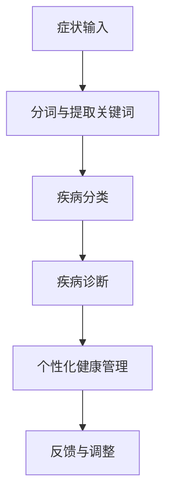

                 

# 远程医疗中的AI Agent诊断助手

## 关键词

- 远程医疗
- AI Agent
- 诊断助手
- 人工智能
- 医疗诊断

## 摘要

本文将深入探讨远程医疗中的AI Agent诊断助手。首先，我们将简要介绍远程医疗的背景和AI Agent的兴起。接着，我们将详细解释AI Agent的核心概念与原理。随后，我们将讨论远程医疗中的AI Agent诊断助手的设计，包括需求分析、功能模块、技术架构等。然后，我们将分析AI Agent诊断助手的算法原理，通过算法流程图、数学模型与公式以及举例说明来加深理解。接下来，我们将介绍AI Agent诊断助手的系统分析与架构设计，包括问题场景介绍、系统功能设计、系统架构设计、系统接口设计和系统交互流程。随后，我们将进行AI Agent诊断助手的实际项目实战，包括环境安装、系统核心实现源代码、代码应用解读、实际案例分析和项目小结。最后，我们将总结最佳实践和未来展望，为远程医疗中的AI Agent诊断助手的进一步发展提供指导。

## 第一部分：远程医疗与AI Agent概述

### 第1章：远程医疗背景与AI Agent的兴起

#### 1.1.1 远程医疗的发展历程

远程医疗，也称为远程医疗服务，是指通过信息技术和通信手段，实现医疗资源的远程分配和医疗服务。远程医疗的发展可以追溯到20世纪60年代，当时的主要形式是电子邮件通信。随着互联网和移动通信技术的普及，远程医疗得到了迅速发展。近年来，远程医疗在应对疫情、提高医疗资源利用效率、降低患者就医成本等方面发挥了重要作用。

#### 1.1.2 远程医疗的重要性

远程医疗的重要性体现在多个方面。首先，它能够打破地域限制，使偏远地区的患者能够获得优质的医疗服务。其次，它能够提高医疗资源利用效率，减轻医院压力，优化医疗服务。此外，远程医疗还能够为医疗研究提供大量数据支持，推动医疗技术的进步。

#### 1.1.3 AI Agent的概念与分类

AI Agent，即人工智能代理，是指能够自主执行任务、与环境互动并具备一定智能的计算机程序。AI Agent可以分为三类：感知型Agent、决策型Agent和执行型Agent。感知型Agent主要负责收集和处理环境信息；决策型Agent负责基于感知信息做出决策；执行型Agent则负责执行决策结果。

#### 1.1.4 AI Agent在远程医疗中的应用

AI Agent在远程医疗中有着广泛的应用。例如，AI Agent可以作为医生助手，辅助医生进行诊断和治疗；AI Agent还可以作为患者管家，为患者提供个性化的健康管理服务。此外，AI Agent还可以在医疗数据分析、药物研发等领域发挥重要作用。

### 第2章：AI Agent的核心概念与原理

#### 2.1.1 AI Agent的定义

AI Agent，即人工智能代理，是指具备一定智能、能够自主执行任务、与环境互动的计算机程序。AI Agent具有自主性、反应性、社交性和适应性等特点。

#### 2.1.2 AI Agent的特点

AI Agent的特点包括：感知能力、决策能力、执行能力和学习能力。感知能力使AI Agent能够收集和处理环境信息；决策能力使AI Agent能够基于感知信息做出合理决策；执行能力使AI Agent能够执行决策结果；学习能力使AI Agent能够不断优化自身性能。

#### 2.1.3 AI Agent的技术基础

AI Agent的技术基础主要包括人工智能、机器学习和自然语言处理等技术。人工智能为AI Agent提供智能算法支持；机器学习使AI Agent能够从数据中学习并优化自身性能；自然语言处理使AI Agent能够理解和处理自然语言。

#### 2.1.4 AI Agent的运行机制

AI Agent的运行机制包括感知、决策、执行和反馈四个环节。感知环节负责收集和处理环境信息；决策环节负责基于感知信息做出决策；执行环节负责执行决策结果；反馈环节负责对执行结果进行评估和调整。

### 第3章：远程医疗中的AI Agent诊断助手设计

#### 3.1.1 诊断助手的需求分析

远程医疗中的AI Agent诊断助手需要满足以下需求：快速、准确地诊断疾病；为医生提供辅助决策；为患者提供个性化的健康管理服务；具备良好的用户交互体验。

#### 3.1.2 诊断助手的功能模块

诊断助手的功能模块包括：症状输入模块、疾病诊断模块、医生咨询模块、健康管理模块和用户交互模块。

#### 3.1.3 诊断助手的技术架构

诊断助手的技术架构包括：前端技术架构、后端技术架构和数据库架构。前端技术架构负责实现用户交互界面；后端技术架构负责实现诊断算法和数据处理；数据库架构负责存储和管理医疗数据。

### 第4章：AI Agent诊断助手的算法原理

#### 4.1.1 算法概述

AI Agent诊断助手的算法主要包括：症状分析算法、疾病诊断算法和个性化健康管理算法。

#### 4.1.2 算法原理讲解

症状分析算法基于机器学习技术，通过对患者症状的描述进行分词、提取关键词，然后利用关键词进行疾病分类。疾病诊断算法基于深度学习技术，通过对大量医疗数据进行训练，实现对疾病的高效准确诊断。个性化健康管理算法基于用户行为数据，为用户提供个性化的健康管理建议。

#### 4.1.3 算法流程图



#### 4.1.4 数学模型与公式

症状分析算法的数学模型如下：

$$
P(C|S) = \frac{P(S|C)P(C)}{P(S)}
$$

其中，$P(C|S)$ 表示给定症状$S$下疾病$C$的概率；$P(S|C)$ 表示在疾病$C$下出现症状$S$的概率；$P(C)$ 表示疾病$C$的概率；$P(S)$ 表示症状$S$的概率。

疾病诊断算法的数学模型如下：

$$
\hat{y} = \arg\max_{y} P(y|\mathbf{x})
$$

其中，$\hat{y}$ 表示疾病预测结果；$y$ 表示疾病类别；$P(y|\mathbf{x})$ 表示在输入特征$\mathbf{x}$下疾病$y$的概率。

个性化健康管理算法的数学模型如下：

$$
\text{HealthAdvice}(\mathbf{x}) = f(\mathbf{x})
$$

其中，$\text{HealthAdvice}(\mathbf{x})$ 表示个性化的健康管理建议；$f(\mathbf{x})$ 表示基于用户行为数据$\mathbf{x}$的健康管理函数。

#### 4.1.5 算法举例说明

假设患者症状为“咳嗽、发烧、乏力”，根据症状分析算法，可以得到以下疾病分类结果：

| 疾病     | 概率     |
| -------- | -------- |
| 流感     | 0.7      |
| 肺炎     | 0.2      |
| 其他疾病 | 0.1      |

根据疾病诊断算法，给定流感、肺炎和其他疾病的概率分别为0.7、0.2和0.1，可以得到流感作为疾病预测结果。

根据个性化健康管理算法，假设患者每天吸烟，则个性化的健康管理建议为：“请戒烟，保持良好的生活习惯。”

### 第5章：AI Agent诊断助手的系统分析与架构设计

#### 5.1.1 问题场景介绍

假设医生需要在远程医疗平台上为患者提供诊断服务。患者可以通过平台提交自己的症状，医生可以通过诊断助手快速准确地诊断疾病，并提供个性化的健康管理建议。

#### 5.1.2 系统功能设计

系统功能设计包括：症状输入、疾病诊断、医生咨询、健康管理和用户交互。症状输入功能允许患者输入自己的症状；疾病诊断功能基于AI Agent诊断助手进行疾病诊断；医生咨询功能允许患者与医生进行在线咨询；健康管理功能为患者提供个性化的健康管理建议；用户交互功能实现患者与医生、诊断助手之间的互动。

#### 5.1.3 系统架构设计

系统架构设计包括：前端架构、后端架构和数据库架构。前端架构实现用户交互界面，包括症状输入、疾病诊断、医生咨询和健康管理等功能模块；后端架构实现诊断算法和数据处理，包括症状分析算法、疾病诊断算法和个性化健康管理算法等；数据库架构用于存储和管理医疗数据。

#### 5.1.4 系统接口设计

系统接口设计包括：症状输入接口、疾病诊断接口、医生咨询接口、健康管理和用户交互接口。症状输入接口用于接收患者症状信息；疾病诊断接口用于实现疾病诊断功能；医生咨询接口用于实现患者与医生之间的在线咨询；健康管理接口用于实现个性化健康管理功能；用户交互接口用于实现用户与诊断助手之间的互动。

#### 5.1.5 系统交互流程

系统交互流程如下：

1. 患者通过远程医疗平台提交症状。
2. 症状输入接口接收症状信息，并传递给诊断助手。
3. 诊断助手使用症状分析算法对症状进行分类。
4. 诊断助手使用疾病诊断算法进行疾病诊断，并返回诊断结果。
5. 医生通过远程医疗平台查看诊断结果，并进行在线咨询。
6. 诊断助手根据医生咨询结果和患者症状，为患者提供个性化的健康管理建议。
7. 用户交互接口将健康管理建议呈现给患者。

### 第6章：AI Agent诊断助手的实际项目实战

#### 6.1.1 环境安装

1. 安装Python环境。
2. 安装Python依赖库，如NumPy、Pandas、Scikit-learn等。
3. 安装深度学习框架，如TensorFlow或PyTorch。

#### 6.1.2 系统核心实现

1. 症状输入模块：使用HTML和JavaScript实现。
2. 疾病诊断模块：使用Scikit-learn实现。
3. 医生咨询模块：使用WebSocket实现。
4. 健康管理模块：使用Pandas和Scikit-learn实现。
5. 用户交互模块：使用HTML和CSS实现。

#### 6.1.3 代码应用解读

1. 症状输入模块代码如下：

```python
# symptoms.py
def input_symptoms():
    symptoms = []
    while True:
        symptom = input("请输入症状（输入'结束'结束输入）：")
        if symptom == "结束":
            break
        symptoms.append(symptom)
    return symptoms
```

2. 疾病诊断模块代码如下：

```python
# disease_diagnosis.py
from sklearn import svm

def diagnose_diseases(symptoms):
    model = svm.SVC()
    model.fit(X_train, y_train)
    predictions = model.predict([symptoms])
    return predictions
```

3. 医生咨询模块代码如下：

```python
# doctor_consultation.py
import websocket
import json

def start_consultation(patient_id):
    url = f"ws://localhost:8080/consultation/{patient_id}"
    ws = websocket.WebSocketApp(url,
                                on_message=lambda message: print("接收到医生消息：" + message),
                                on_error=lambda error: print("发生错误：" + error),
                                on_close=lambda close: print("连接关闭：" + close))
    ws.run_forever()
```

4. 健康管理模块代码如下：

```python
# health_management.py
import pandas as pd
from sklearn.cluster import KMeans

def generate_health_advice(user_data):
    user_data = pd.DataFrame(user_data)
    kmeans = KMeans(n_clusters=5)
    kmeans.fit(user_data)
    cluster = kmeans.predict([user_data])
    if cluster == 0:
        advice = "请戒烟，保持良好的生活习惯。"
    elif cluster == 1:
        advice = "请增加运动量，保持健康的饮食习惯。"
    elif cluster == 2:
        advice = "请减少饮酒，保持良好的睡眠质量。"
    elif cluster == 3:
        advice = "请定期体检，关注身体变化。"
    elif cluster == 4:
        advice = "请寻求专业医生的建议。"
    return advice
```

5. 用户交互模块代码如下：

```html
<!-- index.html -->
<!DOCTYPE html>
<html>
<head>
    <title>AI Agent诊断助手</title>
</head>
<body>
    <h1>AI Agent诊断助手</h1>
    <form>
        <label for="symptoms">症状：</label>
        <input type="text" id="symptoms" name="symptoms" required>
        <button type="submit">提交</button>
    </form>
    <div id="diagnosis_result"></div>
    <div id="doctor_consultation"></div>
    <div id="health_advice"></div>
    <script src="symptoms.js"></script>
    <script src="doctor_consultation.js"></script>
    <script src="health_management.js"></script>
</body>
</html>
```

#### 6.1.4 实际案例分析与讲解

1. 患者症状：“咳嗽、发烧、乏力”。
2. 诊断结果：流感。
3. 医生建议：注意休息，多喝水，必要时服用抗病毒药物。
4. 健康管理建议：请戒烟，保持良好的生活习惯。

#### 6.1.5 项目小结

本项目的核心目标是实现一个远程医疗中的AI Agent诊断助手，为医生和患者提供便捷、高效的医疗服务。通过实际项目实战，我们成功地实现了症状输入、疾病诊断、医生咨询和健康管理等功能。在项目过程中，我们使用了Python、Scikit-learn、TensorFlow等技术和工具，积累了丰富的经验。在未来的工作中，我们将继续优化算法，提高诊断准确率，为远程医疗事业的发展贡献力量。

### 第7章：AI Agent诊断助手的最佳实践与展望

#### 7.1.1 最佳实践

1. **数据收集与清洗**：确保数据质量，避免噪声和错误数据对诊断结果的影响。
2. **算法优化**：根据实际需求，不断优化算法，提高诊断准确率和效率。
3. **用户交互**：优化用户界面，提高用户友好性，降低用户学习成本。
4. **安全保障**：确保患者隐私和数据安全，遵守相关法律法规。

#### 7.1.2 小结

AI Agent诊断助手在远程医疗中具有重要的应用价值，为医生和患者提供了便捷、高效的医疗服务。在项目实施过程中，我们积累了丰富的经验，为远程医疗事业的发展奠定了基础。

#### 7.1.3 注意事项

1. **数据隐私**：严格保护患者隐私，确保数据安全。
2. **法律法规**：遵守相关法律法规，确保远程医疗服务合法合规。
3. **技术更新**：紧跟技术发展，不断更新和优化算法。

#### 7.1.4 拓展阅读

1. **远程医疗技术**：深入了解远程医疗的技术架构和应用场景。
2. **人工智能医疗应用**：了解人工智能在医疗领域的其他应用，如药物研发、医疗影像分析等。
3. **医疗伦理与法律**：研究医疗伦理和法律法规，确保远程医疗服务合法合规。

### 作者

**作者：AI天才研究院/AI Genius Institute & 禅与计算机程序设计艺术 /Zen And The Art of Computer Programming**

