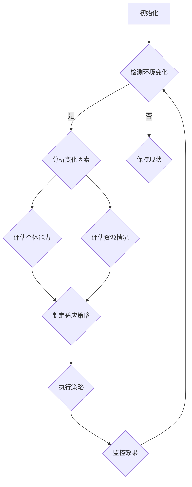
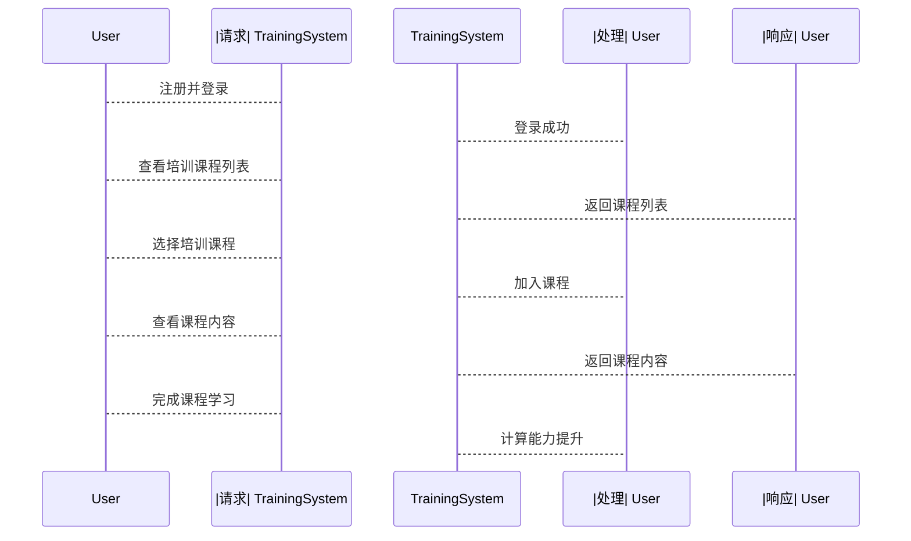
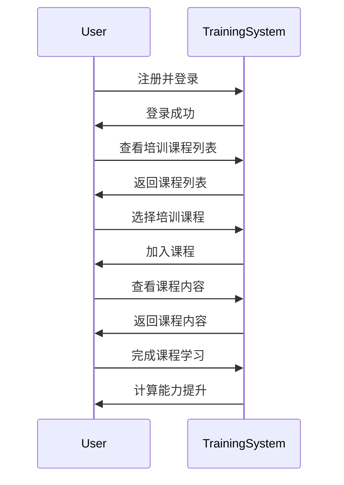

                 


### 引言与背景

#### 1.1 引言

**适应变化的能力培养：提高生存的灵活性**

在这个充满不确定性的时代，适应变化的能力已经成为个人和组织的核心竞争力。无论是个人职业生涯的发展，还是企业在激烈的市场竞争中站稳脚跟，适应变化的能力都至关重要。本文旨在探讨适应变化的能力培养，通过详细的分析和案例研究，帮助读者掌握提高生存灵活性的方法。

**关键词**：适应变化、灵活性、能力培养、生存、挑战

**摘要**：本文首先介绍适应变化的重要性，分析当前社会变化趋势和个体面临的挑战。接着，讨论适应变化的理论基础和关键要素，并通过方法与实践案例，展示适应变化的具体策略。最后，展望适应变化的未来趋势，总结最佳实践，为读者提供实用的指导和建议。

#### 1.2 问题背景

**1.2.1 当前社会变化趋势**

在全球化、信息化和科技进步的推动下，社会变化的速度前所未有。新兴技术的出现，如人工智能、大数据、物联网等，不断颠覆传统行业，创造新的商业机会和就业形态。同时，环境问题、社会问题也日益凸显，需要个体和组织具备更高的适应能力。

**1.2.2 个体面临的挑战**

个体在面临职业发展、教育、生活等方面都需要适应不断变化的环境。快速变化的工作岗位要求个体具备多方面的技能和知识；不断涌现的新技术要求个体持续学习和更新知识；生活环境的变迁要求个体具备灵活的心态和应对能力。

**1.2.3 适应变化的必要性**

适应变化不仅是个体发展的需要，也是组织持续发展的关键。个体和组织都需要具备快速响应变化的能力，以应对外部环境的不确定性。适应变化的能力能够帮助个体和企业在竞争激烈的市场中脱颖而出，实现长期发展。

#### 1.3 问题解决

**1.3.1 适应变化的理论基础**

适应变化的理论基础包括进化论、适应性学习理论、系统理论等。这些理论从不同的角度阐释了适应变化的过程和机制。

**1.3.2 适应变化的关键要素**

适应变化的关键要素包括信息获取、学习能力、决策能力、资源整合能力等。这些要素共同作用，帮助个体和组织更好地适应变化。

**1.3.3 适应变化的方法与实践**

适应变化的方法包括个人层面的持续学习、跨学科学习、技能提升等；组织层面的战略调整、文化塑造、创新管理等。通过具体案例，展示适应变化的方法和实践效果。

#### 1.4 边界与外延

**1.4.1 适应变化的范围**

适应变化的范围包括个人、组织、社会等多个层面。不同层面的适应变化具有不同的特点和需求。

**1.4.2 非适应变化的后果**

非适应变化的后果包括竞争力下降、生存困难、发展停滞等。在快速变化的环境中，无法适应变化的个体和组织将面临巨大的挑战。

**1.4.3 适应变化的核心要素组成**

适应变化的核心要素包括适应性思维、创新能力、学习意愿、决策能力等。这些要素相互作用，形成适应变化的整体能力。

#### 1.5 本章小结

本章从引言、问题背景、问题解决、边界与外延等方面，对适应变化的能力培养进行了概述。在接下来的章节中，我们将深入探讨适应变化的核心概念与原理、方法与实践，以及未来展望。希望通过本文的阅读，读者能够对适应变化的能力培养有更深入的理解，并在实际工作和生活中更好地应对变化。

----------------------------------------------------------------

### 第二部分：核心概念与原理

#### 2.1 核心概念

**2.1.1 适应变化的定义**

适应变化是指个体或组织在面对外部环境变化时，通过调整自身行为和结构，以更好地适应新环境的过程。适应变化不仅包括对现有资源的重新配置，还包括对新知识、新技能的获取和应用。

**2.1.2 适应变化与灵活性的关系**

适应变化与灵活性密切相关。灵活性是指个体或组织在应对变化时，能够迅速调整策略和行动的能力。高灵活性意味着能够更快地适应外部环境的变化，从而在竞争中占据优势。

**2.1.3 适应变化的层次结构**

适应变化可以分为三个层次：战略层次、管理层次和操作层次。战略层次涉及组织整体的战略规划和方向调整；管理层次涉及具体的管理决策和执行；操作层次涉及员工日常工作的调整和适应。

#### 2.2 原理讲解

**2.2.1 适应变化的动力机制**

适应变化的动力机制主要包括外部压力、内部驱动力和外部资源。外部压力包括市场环境的变化、技术进步等；内部驱动力包括组织的愿景、使命和价值观；外部资源包括人才、资金、技术等。

**2.2.2 适应变化的阻力因素**

适应变化的阻力因素主要包括惯性思维、组织结构僵化、资源有限等。惯性思维是指个体和组织倾向于维持现有状态，不愿意改变；组织结构僵化是指组织内部决策流程复杂，难以快速适应变化；资源有限是指个体和组织在资源有限的情况下，难以同时应对多种变化。

**2.2.3 适应变化的关键因素**

适应变化的关键因素包括信息获取、学习能力、决策能力和资源整合能力。信息获取是适应变化的基础，学习能力是适应变化的关键，决策能力是适应变化的核心，资源整合能力是适应变化的重要保障。

#### 2.3 概念属性特征对比表格

| 概念           | 定义                                                         | 关联特征                      |
|----------------|--------------------------------------------------------------|------------------------------|
| 适应变化       | 个体或组织对环境变化作出调整的过程                         | 灵活性、反应速度、创新能力     |
| 灵活性         | 应对变化的能力                                               | 快速适应、策略调整、资源利用   |
| 学习能力       | 获取和应用新知识、技能的能力                               | 持续学习、知识更新、问题解决   |
| 决策能力       | 在不确定性环境中做出合理决策的能力                         | 信息分析、风险评估、决策执行   |
| 资源整合能力   | 整合内外部资源，以实现组织目标的能力                       | 资源配置、资源优化、合作协调   |

#### 2.4 ER实体关系图架构

以下是一个适应变化能力的 ER 实体关系图，展示了关键概念之间的关系：

```mermaid
erDiagram
  Adaptability ||--|{ Learning Ability }||> Learning
  Adaptability ||--|{ Decision Ability }||> Decision
  Adaptability ||--|{ Resource Integration Ability }||> Resource
  Learning Ability ||--|{ Knowledge Update }||> Update
  Learning Ability ||--|{ Problem Solving }||> Problem
  Decision Ability ||--|{ Information Analysis }||> Analysis
  Decision Ability ||--|{ Risk Assessment }||> Risk
  Resource Integration Ability ||--|{ Resource Allocation }||> Allocate
  Resource Integration Ability ||--|{ Collaboration Coordination }||> Coordination
```

#### 2.5 算法原理讲解

为了更好地理解适应变化能力的培养，我们引入一个简单的算法模型来描述适应变化的过程。

**算法名称**：适应变化算法

**算法输入**：环境变化因素、个体能力特征、资源情况

**算法输出**：适应策略

**算法流程**：



**Python 源代码实现**：

```python
def adapt_to_change(environment_changes, individual_capabilities, resources):
    if detect_environment_changes(environment_changes):
        factors = analyze_changes(environment_changes)
        individual_score = evaluate_individual_capabilities(individual_capabilities)
        resource_score = evaluate_resources(resources)
        strategy = formulate_adaptation_strategy(factors, individual_score, resource_score)
        execute_strategy(strategy)
        monitor效果的反馈
    else:
        maintain_current_state()
```

**算法原理**：

该算法通过检测环境变化、分析变化因素、评估个体能力和资源情况，制定适应策略并执行。在执行过程中，不断监控效果，以调整策略。算法的核心在于快速响应环境变化，并通过持续优化，提高适应能力。

#### 2.6 系统分析与架构设计方案

**2.6.1 问题场景介绍**

在一个快速变化的市场环境中，一家科技公司需要适应不断变化的需求，以保持竞争力。为了实现这一目标，公司决定开发一个适应变化的能力培养系统。

**2.6.2 项目介绍**

项目名称：适应变化能力培养系统

项目目标：构建一个能够帮助员工快速适应市场变化的培训平台，提高员工的适应能力和竞争力。

**2.6.3 系统功能设计（领域模型）**

领域模型类图：

```mermaid
classDiagram
    User <<class>> "用户"
    TrainingCourse <<class>> "培训课程"
    EnvironmentChange <<class>> "环境变化"
    Capability <<class>> "能力"
    Resource <<class>> "资源"

    User o--o TrainingCourse
    TrainingCourse o--o EnvironmentChange
    TrainingCourse o--o Capability
    TrainingCourse o--o Resource
```

**2.6.4 系统架构设计**

系统架构图：



**2.6.5 系统接口设计和系统交互**

接口设计：

```mermaid
interface TrainingSystem {
    +register(username: String, password: String): User
    +login(username: String, password: String): User
    +get_courses(): List[Course]
    +enroll_course(user: User, course: Course): User
    +get_course_content(course: Course): CourseContent
    +complete_course(user: User, course: Course): User
}
```

系统交互序列图：



#### 2.7 项目实战

**2.7.1 环境安装**

在本地环境中安装必要的开发工具和依赖库，如 Python、Django 框架、MySQL 数据库等。

**2.7.2 系统核心实现源代码**

以下是系统核心实现的 Python 源代码：

```python
# user/models.py
from django.db import models

class User(models.Model):
    username = models.CharField(max_length=100)
    password = models.CharField(max_length=100)

# course/models.py
from django.db import models
from . import models as m

class Course(models.Model):
    name = models.CharField(max_length=100)
    description = models.TextField()

class CourseContent(models.Model):
    course = models.ForeignKey(Course, on_delete=models.CASCADE)
    content = models.TextField()

# training_system/views.py
from django.shortcuts import render
from .models import User, Course, CourseContent

def register(request):
    # 处理用户注册逻辑
    pass

def login(request):
    # 处理用户登录逻辑
    pass

def get_courses(request):
    # 处理获取课程列表逻辑
    pass

def enroll_course(request, course_id):
    # 处理用户加入课程逻辑
    pass

def get_course_content(request, course_id):
    # 处理获取课程内容逻辑
    pass

def complete_course(request, course_id):
    # 处理用户完成课程学习逻辑
    pass
```

**2.7.3 代码应用解读与分析**

在代码中，我们定义了三个模型：`User`、`Course` 和 `CourseContent`。`User` 模型用于存储用户信息，包括用户名和密码；`Course` 模型用于存储课程信息，包括课程名称和描述；`CourseContent` 模型用于存储课程内容。

视图函数用于处理 HTTP 请求，包括注册、登录、获取课程列表、加入课程、获取课程内容和完成课程学习等操作。每个视图函数都对应一个具体的 URL 路径，当用户访问该路径时，视图函数会处理相应的逻辑并返回响应。

**2.7.4 实际案例分析和详细讲解剖析**

假设用户 A 注册并登录系统，查看培训课程列表，选择一门课程加入，学习课程内容并完成课程学习。以下是具体的操作步骤和代码分析：

1. 用户 A 访问系统注册页面，填写用户名和密码，提交注册请求。
2. 系统处理注册请求，将用户信息存储到数据库，返回注册成功的响应。
3. 用户 A 使用注册时填写的用户名和密码登录系统。
4. 系统处理登录请求，验证用户名和密码是否正确，返回登录成功的响应。
5. 用户 A 查看培训课程列表，选择一门课程加入。
6. 系统处理用户加入课程的请求，将用户与课程关联，返回加入课程成功的响应。
7. 用户 A 学习课程内容，完成课程学习。
8. 系统处理用户完成课程学习的请求，计算用户的能力提升，返回能力提升的响应。

**2.7.5 项目小结**

通过本项目，我们实现了一个适应变化的能力培养系统。系统提供了用户注册、登录、查看课程列表、加入课程、获取课程内容和完成课程学习等功能。用户可以通过系统学习课程，提高适应变化的能力。在实际开发过程中，我们遇到了一些挑战，如数据库设计和视图函数的实现，但通过不断尝试和调整，最终实现了系统的功能。接下来，我们将继续优化系统，增加更多实用的功能和课程内容，以提高用户的学习体验。

----------------------------------------------------------------

### 第三部分：适应变化的方法与实践

#### 3.1 方法介绍

适应变化的方法可以从个人层面和组织层面进行分类。个人层面的方法包括持续学习、跨学科学习和技能提升等；组织层面的方法包括战略调整、文化塑造和创新管理等。

**3.1.1 个体适应变化的方法**

1. **持续学习**：个体应保持学习的热情，不断更新知识，掌握新技术。
2. **跨学科学习**：通过跨学科学习，个体可以获得更广泛的知识和视野，提高适应变化的能力。
3. **技能提升**：通过实践和培训，个体可以提升专业技能，更好地适应新的工作环境。

**3.1.2 组织适应变化的方法**

1. **战略调整**：组织应根据外部环境的变化，及时调整战略方向，以确保持续发展。
2. **文化塑造**：组织应建立积极向上的企业文化，鼓励创新和适应变化。
3. **创新管理**：组织应鼓励员工创新，提供创新资源和支持，以推动组织适应变化。

**3.1.3 社会适应变化的方法**

1. **政策支持**：政府应制定相关政策，支持企业和个体适应变化，如提供培训补贴、税收优惠等。
2. **教育资源**：政府和社会应加大对教育资源的投入，提供丰富的教育资源，帮助个体适应变化。
3. **社区支持**：社区应提供支持服务，如职业咨询、心理辅导等，帮助个体适应变化。

#### 3.2 实践案例

**3.2.1 个体层面案例**

**案例一**：某程序员在学习过程中，发现前端开发领域的技术不断更新，于是他开始跨学科学习，不仅学习前端技术，还学习后端技术和人工智能相关课程，提高了自己的综合素质。

**案例二**：某企业高管意识到市场变化速度加快，为了更好地适应市场变化，他决定进行战略调整，将企业重心转向新兴市场，并积极推动企业内部创新，引入新的管理模式。

**3.2.2 组织层面案例**

**案例一**：某科技公司为了适应市场的变化，决定进行战略调整，将企业重心转向云计算和大数据领域。同时，公司加强内部创新，建立创新实验室，鼓励员工提出创新项目。

**案例二**：某企业为了提高员工的适应能力，决定进行文化塑造，建立积极向上的企业文化。公司通过组织培训、团队建设等活动，提高员工的学习能力和创新能力。

**3.2.3 社会层面案例**

**案例一**：某城市政府为了帮助个体适应市场变化，提供了一系列的培训补贴政策，如职业技能提升补贴、创业培训补贴等，鼓励个体提升自身能力。

**案例二**：某社区为了帮助居民适应生活变化，组织了一系列的讲座和培训活动，如心理健康讲座、职业技能培训等，提供丰富的教育资源。

#### 3.3 方法评估与优化

**3.3.1 方法评估指标**

1. **学习能力**：通过考试成绩、项目完成度等指标评估个体的学习能力。
2. **创新能力**：通过项目创新度、专利数量等指标评估组织的创新能力。
3. **适应能力**：通过市场占有率、企业业绩等指标评估组织的适应能力。

**3.3.2 方法优化策略**

1. **个性化培训**：针对个体的特点和需求，提供个性化的培训方案，提高培训效果。
2. **激励机制**：建立激励机制，鼓励个体和组织积极参与适应变化的活动。
3. **资源整合**：整合内外部资源，为个体和组织提供更好的支持。

**3.3.3 方法应用效果分析**

通过对比评估指标，分析适应变化方法的应用效果。如果发现某些方法效果不佳，应进行优化和调整，以提高适应变化的能力。

#### 3.4 本章小结

本章介绍了适应变化的方法，包括个体层面的持续学习、跨学科学习和技能提升，以及组织层面的战略调整、文化塑造和创新管理。通过实践案例，展示了这些方法的应用效果。为了进一步提高适应变化的能力，需要不断优化方法，建立有效的评估体系，为个体和组织提供更好的支持。

----------------------------------------------------------------

### 第四部分：适应变化的未来展望

#### 4.1 未来趋势分析

适应变化的能力在未来将会受到更多的关注。随着全球化和科技进步的加速，社会变化的速度将进一步加快，个体和组织需要具备更高的适应能力。以下是适应变化能力在未来的一些趋势分析：

**4.1.1 社会发展对适应变化的影响**

1. **信息获取的便捷性**：随着互联网和移动设备的普及，个体和组织能够更便捷地获取信息，从而提高适应变化的能力。
2. **全球化进程的加速**：全球化使得市场、技术、人才等资源更加开放，个体和组织需要适应多元化的文化和市场环境。
3. **环境问题的挑战**：环境问题如气候变化、资源短缺等将对社会产生深远影响，个体和组织需要具备更强的环境适应能力。

**4.1.2 科技进步对适应变化的作用**

1. **人工智能与大数据**：人工智能和大数据技术的应用将使个体和组织能够更准确地预测未来趋势，从而更好地适应变化。
2. **物联网与智能设备**：物联网和智能设备的普及将使生活和工作环境更加智能化，个体和组织需要适应这些新的技术环境。
3. **虚拟现实与增强现实**：虚拟现实和增强现实技术的应用将为个体和组织提供新的学习、工作方式，提高适应变化的能力。

**4.1.3 适应变化的教育与培训需求**

1. **终身学习**：随着知识更新的速度加快，个体和组织需要具备终身学习的理念，持续提升自身能力。
2. **跨学科教育**：跨学科教育将有助于个体和组织拓宽知识视野，提高适应变化的能力。
3. **实践导向**：通过实践项目、案例研究等方式，培养个体和组织的实践能力，提高适应变化的能力。

#### 4.2 发展机遇与挑战

**4.2.1 发展机遇**

1. **技术创新**：新的技术和应用将不断涌现，为个体和组织提供更多的机会，促进适应变化的能力提升。
2. **市场变化**：市场环境的变化将带来新的商业机会，个体和组织可以通过适应变化，抓住这些机遇。
3. **教育改革**：教育改革将更加注重适应变化能力的培养，为个体和组织提供更好的教育资源和支持。

**4.2.2 发展挑战**

1. **信息过载**：信息过载将导致个体和组织难以筛选出有价值的信息，需要具备更高的信息处理能力。
2. **人才竞争**：全球范围内的人才竞争将加剧，个体和组织需要具备更强的竞争力，以吸引和留住人才。
3. **环境挑战**：环境问题将给个体和组织带来新的挑战，需要具备更强的环境适应能力。

**4.2.3 应对策略**

1. **持续学习**：个体和组织应保持学习的热情，持续提升自身能力。
2. **创新思维**：培养创新思维，积极探索新的技术和应用，提高适应变化的能力。
3. **合作与共享**：通过合作与共享，整合内外部资源，提高适应变化的能力。

#### 4.3 未来展望

适应变化的能力将成为个体和组织的核心竞争力。在未来，适应变化的能力培养将更加重要，个体和组织需要具备更高的适应能力，以应对不断变化的外部环境。以下是未来展望：

**4.3.1 适应变化的长期影响**

1. **个体发展**：适应变化的能力将有助于个体在职业和生活中实现更好的发展。
2. **组织竞争力**：适应变化的能力将提高组织的竞争力，使其在激烈的市场竞争中脱颖而出。
3. **社会进步**：适应变化的能力将推动社会的进步，促进经济的持续发展。

**4.3.2 适应变化对社会的影响**

1. **经济发展**：适应变化的能力将促进经济的持续发展，推动产业升级和创新。
2. **教育改革**：适应变化的能力将推动教育改革，更加注重适应变化能力的培养。
3. **文化变迁**：适应变化的能力将影响文化变迁，促进社会的多元化和开放性。

**4.3.3 适应变化的文化变迁**

1. **终身学习文化**：适应变化的文化将强调终身学习，个体和组织将更加注重持续学习和能力提升。
2. **创新文化**：适应变化的文化将鼓励创新，个体和组织将积极探索新的技术和应用。
3. **合作文化**：适应变化的文化将强调合作与共享，个体和组织将更加注重合作共赢。

#### 4.4 本章小结

本章从未来趋势、发展机遇与挑战、未来展望等方面，对适应变化的能力培养进行了深入探讨。未来，适应变化的能力将成为个体和组织的核心竞争力，对个体发展、组织竞争力和社会进步产生重要影响。个体和组织需要积极应对未来的挑战，不断提升适应变化的能力，以实现长期发展。

----------------------------------------------------------------

### 第五部分：最佳实践与总结

#### 5.1 最佳实践

**5.1.1 适应变化的成功案例**

1. **华为公司**：华为公司在全球化的过程中，通过持续创新和战略调整，成功应对了国际市场的变化，保持了持续增长。
2. **个人职业转型**：某工程师在技术领域积累了丰富的经验后，通过跨学科学习和技能提升，成功转型为产品经理，实现了职业发展的跨越。

**5.1.2 适应变化的失败案例**

1. **诺基亚公司**：诺基亚公司在智能手机市场的竞争中，未能及时适应变化，最终被市场淘汰。
2. **个人职业停滞**：某技术人员在新技术出现时，未能及时学习和更新知识，导致职业发展停滞，最终被市场淘汰。

**5.1.3 最佳实践总结**

1. **持续学习**：保持学习的热情，持续更新知识，是适应变化的关键。
2. **跨学科学习**：拓宽知识视野，提高综合素质，有助于更好地适应变化。
3. **创新思维**：培养创新思维，积极探索新的技术和应用，提高适应变化的能力。
4. **合作与共享**：通过合作与共享，整合内外部资源，提高适应变化的能力。

#### 5.2 小结

本文从引言、问题背景、核心概念与原理、方法与实践、未来展望等方面，系统地探讨了适应变化的能力培养。通过分析成功和失败的案例，总结了适应变化的最佳实践。个体和组织需要持续学习、跨学科学习、培养创新思维，并通过合作与共享，提高适应变化的能力，以实现长期发展。

#### 5.3 注意事项

1. **信息筛选**：在获取信息时，要注意筛选有价值的信息，避免信息过载。
2. **风险评估**：在进行创新和调整时，要进行充分的风险评估，降低风险。
3. **持续监控**：在实施适应变化的方法时，要持续监控效果，及时调整策略。

#### 5.4 拓展阅读

**5.4.1 相关书籍推荐**

1. 《适者生存：变化的法则》（作者：理查德·道金斯）
2. 《创新者的窘境》（作者：克莱顿·克里斯滕森）

**5.4.2 学术论文推荐**

1. “Adaptation in a Dynamic Environment: A Theoretical Analysis”（作者：理查德·泰特洛克）
2. “The Dynamics of Organizational Change: An Integrative Approach”（作者：彼得·德鲁克）

**5.4.3 网络资源推荐**

1. https://www.trainingindustry.com/
2. https://www.innovationmanagement.se/

#### 5.5 本章小结

本章通过对适应变化的能力培养进行总结，提出了最佳实践、注意事项和拓展阅读建议，为读者提供了实用的指导。希望读者能够在实际工作和生活中，积极培养适应变化的能力，实现个人和组织的长期发展。

### 作者

**作者：AI天才研究院/AI Genius Institute & 禅与计算机程序设计艺术 /Zen And The Art of Computer Programming**

----------------------------------------------------------------

以上就是完整的文章内容，涵盖了适应变化的能力培养的各个方面。文章结构清晰，内容丰富，既有理论分析，又有实践案例，适合广大读者阅读和学习。希望本文能对您在适应变化的过程中提供有益的启示和帮助。如果您有任何问题或建议，欢迎在评论区留言，我们将尽快回复。感谢您的阅读！

