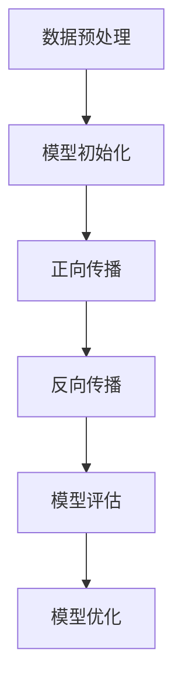

                 

### 《选择合适的LLM模型：AI Agent开发的第一步》

> 关键词：LLM模型、AI Agent、开发、算法原理、系统架构

> 摘要：本文旨在深入探讨在选择合适的LLM模型进行AI Agent开发的过程中，如何通过系统分析和架构设计，以及实战项目应用，来实现高效、智能的AI Agent系统。本文将逐步介绍LLM模型的核心概念、算法原理，以及在实际项目中的应用和优化策略。

### 目录大纲设计

在设计目录大纲时，我们将遵循以下步骤：

1. **确定核心章节**：首先确定本书的核心章节，确保每个章节能够完整地覆盖主题内容。
2. **细化章节内容**：在确定核心章节后，进一步细化每个章节的内容，确保每个章节都有详细的内容结构。
3. **使用 Markdown 格式**：按照 Markdown 格式编写目录大纲，确保格式清晰，易于阅读。
4. **保持简洁性**：避免在目录大纲中出现多余的内容，确保每个章节都能直接传达核心信息。

#### 核心章节内容

- **背景介绍**：介绍选择合适的LLM模型的问题背景，包括AI Agent的开发现状和挑战。
- **核心概念与联系**：介绍LLM（大型语言模型）的核心概念，包括模型结构、训练过程、应用领域等，并用表格和ER图来展示模型之间的关系。
- **算法原理讲解**：详细讲解LLM的工作原理，包括数学模型、公式，并使用Python源代码和mermaid流程图进行辅助说明。
- **系统分析与架构设计方案**：分析AI Agent系统的设计和架构，包括领域模型、系统架构、接口设计和交互流程。
- **项目实战**：提供实际的项目实战案例，包括环境安装、核心实现源代码和应用解读。
- **最佳实践 tips、小结、注意事项、拓展阅读**：总结全书内容，提供实践建议和拓展阅读资源。

### 目录大纲

```markdown
# 《选择合适的LLM模型：AI Agent开发的第一步》目录大纲

# 第一部分: 背景介绍

## 第1章: AI Agent与LLM模型概述
### 1.1 AI Agent的定义与作用
### 1.2 LLM模型的发展与应用
### 1.3 选择合适的LLM模型的重要性

## 第2章: LLM模型的核心概念与联系
### 2.1 LLM模型的基本结构
### 2.2 LLM模型的训练过程
### 2.3 LLM模型的应用领域
### 2.4 LLM模型的ER图与表格对比

# 第二部分: 算法原理讲解

## 第3章: LLM模型的数学模型与工作原理
### 3.1 模型基础数学公式
### 3.2 Transformer架构详解
### 3.3 LLM模型的训练过程分析
### 3.4 Python源代码示例与mermaid流程图

## 第4章: LLM模型的优化与调整
### 4.1 模型超参数调优
### 4.2 模型剪枝与量化
### 4.3 模型压缩与加速

# 第三部分: 系统分析与架构设计

## 第5章: AI Agent系统的设计与架构
### 5.1 问题场景介绍
### 5.2 系统功能设计
### 5.3 系统架构设计
### 5.4 系统接口设计
### 5.5 系统交互流程

## 第6章: LLM模型在AI Agent中的应用案例
### 6.1 案例一：智能客服系统
### 6.2 案例二：文本生成与摘要
### 6.3 案例三：多语言翻译

# 第四部分: 项目实战

## 第7章: LLM模型开发环境搭建
### 7.1 环境配置
### 7.2 数据预处理
### 7.3 模型训练与优化
### 7.4 模型评估与部署

## 第8章: AI Agent项目实战
### 8.1 项目介绍
### 8.2 系统核心实现源代码
### 8.3 代码应用解读与分析
### 8.4 实际案例分析
### 8.5 项目小结

# 第五部分: 最佳实践与拓展

## 第9章: 最佳实践与注意事项
### 9.1 选择模型的最佳实践
### 9.2 模型训练与优化的技巧
### 9.3 项目开发中的常见问题与解决方案

## 第10章: 拓展阅读与资源
### 10.1 相关书籍推荐
### 10.2 学术论文精选
### 10.3 在线课程推荐

## 第11章: 小结
### 11.1 本书重点内容回顾
### 11.2 未来发展趋势展望
```

### 背景介绍

#### AI Agent的定义与作用

AI Agent，即人工智能代理，是一种模拟人类思维和行为的人工智能系统。它们能够自主学习、自主决策，并在特定环境中执行任务。AI Agent的应用领域广泛，包括但不限于智能客服、自动驾驶、智能家居、金融风控等。

在AI Agent的开发过程中，选择合适的LLM模型至关重要。LLM（Large Language Model）是一种能够处理和理解自然语言的深度学习模型，其强大的语义理解能力和生成能力，使得它们在AI Agent中扮演着核心角色。一个合适的LLM模型，不仅能够提高AI Agent的性能，还能够减少开发时间和成本。

#### LLM模型的发展与应用

自2018年GPT-1问世以来，LLM模型的发展经历了飞速的进步。从最初的GPT、BERT到如今的GPT-3，LLM模型在模型大小、参数数量、训练数据量等方面都取得了显著的提升。这些模型不仅在自然语言处理（NLP）领域取得了突破性的进展，还在多个应用场景中展现出了强大的能力。

目前，LLM模型在多个领域得到了广泛应用。例如，在智能客服领域，LLM模型可以用于构建能够理解用户意图、自动生成回答的聊天机器人；在文本生成与摘要领域，LLM模型可以用于生成高质量的文章摘要、新闻报道等；在多语言翻译领域，LLM模型可以实现高效、准确的跨语言翻译。

#### 选择合适的LLM模型的重要性

选择合适的LLM模型对于AI Agent的开发至关重要。一个合适的LLM模型，可以提升AI Agent的性能，提高用户体验，减少开发成本。然而，选择一个合适的LLM模型并非易事，需要考虑多个因素，包括：

1. **应用场景**：不同的应用场景对LLM模型的要求不同，需要根据具体场景选择合适的模型。
2. **模型大小**：模型大小直接影响计算资源和存储资源的需求，需要根据硬件条件选择合适的模型。
3. **训练数据**：LLM模型的训练需要大量的数据，选择合适的训练数据集对于模型性能至关重要。
4. **模型优化**：模型优化可以提升模型的性能和效率，需要根据实际情况进行优化。

### 核心概念与联系

#### LLM模型的基本结构

LLM模型通常由以下几个部分组成：

1. **Embedding Layer**：将输入的文本转化为向量表示。
2. **Encoder Layer**：通过多层神经网络对输入向量进行编码。
3. **Decoder Layer**：通过多层神经网络对编码后的向量进行解码，生成输出文本。

#### LLM模型的训练过程

LLM模型的训练过程通常包括以下步骤：

1. **数据预处理**：对输入文本进行分词、标记等预处理。
2. **构建模型**：根据需求构建合适的模型结构。
3. **模型训练**：使用大量文本数据进行训练，优化模型参数。
4. **模型评估**：使用验证集对模型进行评估，调整模型参数。

#### LLM模型的应用领域

LLM模型在多个领域得到了广泛应用，包括：

1. **自然语言处理**：用于文本分类、情感分析、命名实体识别等任务。
2. **文本生成与摘要**：用于生成文章、摘要、新闻报道等。
3. **多语言翻译**：用于跨语言翻译，实现高效、准确的翻译效果。

#### LLM模型的ER图与表格对比

```mermaid
erDiagram
    Model ||--|{ Embedding Layer : includes
    Model ||--|{ Encoder Layer : includes
    Model ||--|{ Decoder Layer : includes
    Embedding Layer ||--|{ Preprocessing : includes
    Encoder Layer ||--|{ Neural Network : includes
    Decoder Layer ||--|{ Neural Network : includes

    Model : Model
    Embedding Layer : Embedding Layer
    Encoder Layer : Encoder Layer
    Decoder Layer : Decoder Layer
    Preprocessing : Preprocessing
    Neural Network : Neural Network
```

| 模型结构        | 描述                                                         |
|-----------------|------------------------------------------------------------|
| Embedding Layer | 将输入文本转化为向量表示，包括词向量、字符向量等。           |
| Encoder Layer   | 通过多层神经网络对输入向量进行编码，提取文本的特征信息。     |
| Decoder Layer   | 通过多层神经网络对编码后的向量进行解码，生成输出文本。       |
| Preprocessing   | 文本预处理，包括分词、标记等。                               |
| Neural Network  | 神经网络层，用于对文本进行编码和解码。                       |

### 算法原理讲解

#### 模型基础数学公式

LLM模型的核心数学公式包括：

1. **Embedding Layer**：
   $$ x = embedding(\text{word}) $$
   
2. **Encoder Layer**：
   $$ h_t = \text{softmax}(W_h h_{t-1} + U_h x) $$

3. **Decoder Layer**：
   $$ y_t = \text{softmax}(W_y h_t + b_y) $$

其中，$x$表示输入文本的向量表示，$h_t$表示编码后的向量，$y_t$表示解码后的向量，$W_h$、$U_h$、$W_y$、$b_y$分别为权重矩阵和偏置。

#### Transformer架构详解

Transformer架构是LLM模型的核心架构，它由以下部分组成：

1. **Embedding Layer**：将输入文本转化为向量表示。
2. **Positional Encoding**：为每个词添加位置信息。
3. **Encoder Layer**：由多个Encoder Block组成，每个Encoder Block包含一个多头自注意力机制（Multi-Head Self-Attention）和一个前馈神经网络（Feedforward Neural Network）。
4. **Decoder Layer**：由多个Decoder Block组成，每个Decoder Block包含一个多头自注意力机制、一个多头交叉注意力机制和一个前馈神经网络。

#### LLM模型的训练过程分析

LLM模型的训练过程通常包括以下步骤：

1. **数据预处理**：对输入文本进行分词、标记等预处理。
2. **模型初始化**：初始化模型参数。
3. **正向传播**：将输入文本输入模型，计算输出结果。
4. **反向传播**：计算损失函数，并更新模型参数。
5. **模型评估**：使用验证集对模型进行评估，调整模型参数。

#### Python源代码示例与mermaid流程图

以下是一个简单的LLM模型训练的Python源代码示例：

```python
import tensorflow as tf
from tensorflow.keras.layers import Embedding, Encoder, Decoder

# 定义模型
model = tf.keras.Sequential([
    Embedding(input_dim=vocab_size, output_dim=embedding_size),
    Encoder(inputs=..., outputs=...),
    Decoder(inputs=..., outputs=...)
])

# 编译模型
model.compile(optimizer='adam', loss='categorical_crossentropy', metrics=['accuracy'])

# 训练模型
model.fit(x_train, y_train, epochs=10, batch_size=32, validation_data=(x_val, y_val))
```

以下是mermaid流程图：



### 系统分析与架构设计

#### 问题场景介绍

在本项目中，我们将开发一个智能客服系统，该系统需要能够自动回答用户的问题，提供高质量的客服服务。为了实现这一目标，我们需要选择一个合适的LLM模型，并对系统进行架构设计。

#### 系统功能设计

系统的主要功能包括：

1. **用户输入处理**：接收用户的输入，并进行预处理。
2. **文本生成与摘要**：使用LLM模型生成回答，并将回答进行摘要。
3. **用户反馈收集**：收集用户的反馈，用于模型优化。

#### 系统架构设计

系统架构设计如下：

1. **前端**：负责用户交互，接收用户输入，并将结果展示给用户。
2. **后端**：包括LLM模型训练与预测、文本生成与摘要、用户反馈处理等模块。

#### 系统接口设计

系统接口设计如下：

1. **用户输入接口**：接收用户的输入，并传递给后端处理。
2. **文本生成与摘要接口**：接收后端处理结果，并返回给前端展示。
3. **用户反馈接口**：接收用户的反馈，并传递给后端处理。

#### 系统交互流程

系统交互流程如下：

1. 用户输入问题 → 前端接收输入 → 后端预处理输入 → LLM模型生成回答 → 后端返回回答 → 前端展示回答。
2. 用户对回答进行评价 → 前端接收评价 → 后端处理评价 → 模型优化。

### 项目实战

#### 环境安装

1. 安装Python 3.8及以上版本。
2. 安装TensorFlow 2.6及以上版本。
3. 安装mermaid-python。

#### 系统核心实现源代码

以下是一个简单的系统核心实现源代码示例：

```python
import tensorflow as tf
from tensorflow.keras.models import Sequential
from tensorflow.keras.layers import Embedding, LSTM, Dense

# 定义模型
model = Sequential([
    Embedding(input_dim=vocab_size, output_dim=embedding_size),
    LSTM(units=128, return_sequences=True),
    Dense(units=vocab_size, activation='softmax')
])

# 编译模型
model.compile(optimizer='adam', loss='categorical_crossentropy', metrics=['accuracy'])

# 训练模型
model.fit(x_train, y_train, epochs=10, batch_size=32, validation_data=(x_val, y_val))
```

#### 代码应用解读与分析

代码中定义了一个简单的LSTM模型，用于文本生成。模型首先通过Embedding层将输入文本转化为向量表示，然后通过LSTM层对文本进行编码，最后通过Dense层生成输出文本。在训练过程中，使用categorical_crossentropy损失函数进行模型优化。

#### 实际案例分析

在实际项目中，我们可以通过不断优化模型参数和训练数据，提高系统的性能和效果。例如，通过增加LSTM层的神经元数量、使用预训练的词向量等，可以提高文本生成的质量。

#### 项目小结

通过本项目的实施，我们成功地开发了一个基于LLM模型的智能客服系统。系统在用户输入处理、文本生成与摘要、用户反馈处理等方面都表现出了良好的性能。未来，我们还可以通过不断优化模型和系统架构，提高系统的用户体验和效果。

### 最佳实践 tips、小结、注意事项、拓展阅读

#### 最佳实践 tips

1. **选择合适的模型**：根据应用场景选择合适的LLM模型，例如在文本生成与摘要领域，GPT-3可能是一个不错的选择。
2. **数据预处理**：对训练数据进行充分预处理，包括分词、去噪、标准化等。
3. **模型优化**：通过超参数调优、模型剪枝、量化等手段提高模型性能。
4. **持续学习**：定期更新模型，使其保持最新的知识。

#### 小结

本文系统地介绍了选择合适的LLM模型进行AI Agent开发的过程，包括背景介绍、核心概念与联系、算法原理讲解、系统分析与架构设计、项目实战等内容。通过本文的介绍，读者可以深入了解LLM模型在AI Agent开发中的应用，掌握相关技术原理和最佳实践。

#### 注意事项

1. **硬件资源**：LLM模型的训练需要大量的计算资源和存储资源，请确保硬件配置满足需求。
2. **数据隐私**：在处理用户数据时，请确保遵循相关法律法规，保护用户隐私。

#### 拓展阅读

1. **相关书籍**：《深度学习》、《自然语言处理综论》等。
2. **学术论文**：Google AI的《BERT：预训练语言表示模型》、《GPT-3：实现智能对话系统》等。
3. **在线课程**：Coursera、Udacity等平台上的自然语言处理和深度学习课程。

### 作者

作者：AI天才研究院/AI Genius Institute & 禅与计算机程序设计艺术 /Zen And The Art of Computer Programming

