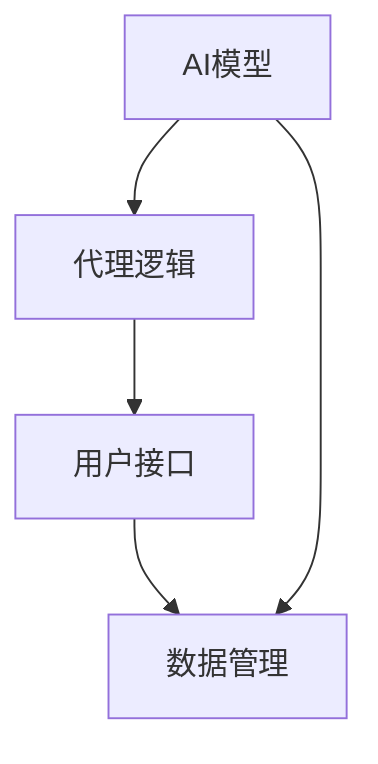
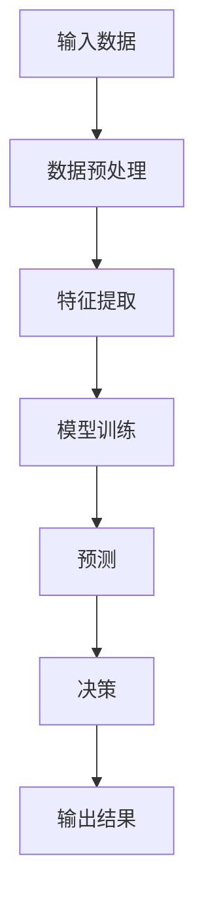
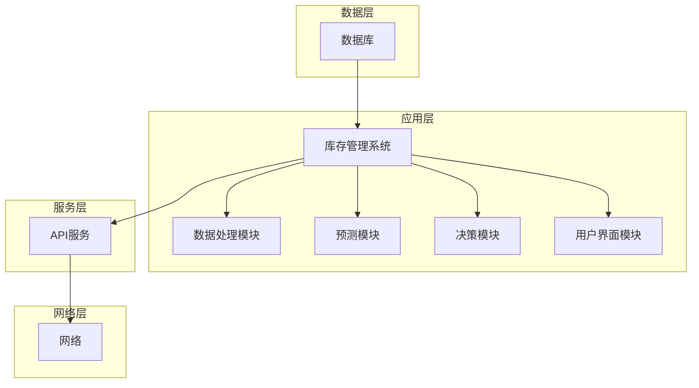
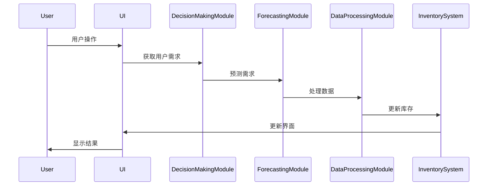

                 

### 文章标题

# 选择适合企业的AI Agent平台

> 关键词：AI Agent平台、企业需求、性能优化、成本控制、安全性、兼容性

> 摘要：本文将深入探讨如何为企业选择合适的AI Agent平台。通过分析平台的特点、应用场景和实现原理，本文旨在为IT专业人士提供一套系统性的决策指南，以帮助他们在复杂的技术环境中做出明智的选择。

## 背景介绍

### 书名与主题

《选择适合企业的AI Agent平台》旨在帮助企业决策者和技术团队理解AI Agent平台的重要性，并指导他们如何根据企业特定需求选择合适的平台。AI Agent平台是企业实现智能化转型的关键组件，它能够通过模拟人类的决策过程，提高企业的运营效率和竞争力。

### 问题背景

随着人工智能技术的不断发展，越来越多的企业开始意识到AI的重要性。AI Agent平台作为一种智能化的软件系统，能够处理复杂的任务，自动执行决策，从而减少人力成本，提高工作效率。选择合适的AI Agent平台，对于企业来说至关重要，它直接影响到AI技术的落地效果。

### 问题描述

企业在选择AI Agent平台时，常常面临以下几个难题：

1. **平台性能**：需要确保平台能够处理大量的数据，同时保持响应速度。
2. **成本控制**：在预算有限的情况下，如何选择性价比最高的平台。
3. **兼容性**：平台需要与企业现有的IT系统无缝集成。
4. **安全性**：确保平台的数据安全和隐私保护。
5. **维护与升级**：平台需要易于维护和升级，以适应技术发展的需要。

### 问题解决

本文将提供以下解决方案：

1. **性能优化策略**：介绍如何通过优化算法和架构来提升平台性能。
2. **成本控制方法**：提供预算分配和成本优化的建议。
3. **兼容性评估**：详细探讨平台与企业现有系统的集成方法。
4. **安全性保障**：介绍安全性的关键要素和保障措施。
5. **维护与升级策略**：提供平台维护和升级的最佳实践。

### 边界与外延

本文讨论的范围主要集中在通用型AI Agent平台，适用于多数行业和规模的企业。具体的技术栈包括但不限于Python、JavaScript、Docker、Kubernetes等。对于特定行业的定制化需求，本文将提供相应的参考和建议。

### 概念结构与核心要素组成

AI Agent平台的核心组成部分包括：

1. **AI模型**：负责处理数据和生成决策。
2. **代理逻辑**：定义AI的行为规则和决策流程。
3. **用户接口**：提供与用户交互的界面。
4. **数据管理**：确保数据的安全、完整和可访问性。

## 核心概念与联系

### AI Agent平台定义

AI Agent平台是一种集成了人工智能技术的软件系统，能够模拟人类的决策过程，自主执行任务。它通常由多个模块组成，包括AI模型、代理逻辑、用户接口和数据管理。

### AI Agent平台特点

1. **智能性**：能够处理复杂的问题，进行自主决策。
2. **灵活性**：可以根据不同场景进行调整和优化。
3. **可扩展性**：支持添加新的功能和模型。

### 传统AI系统对比

1. **传统AI系统**：通常是指静态的AI模型，只能执行特定的任务，缺乏自主决策能力。
2. **AI Agent平台**：不仅包括AI模型，还包括代理逻辑和用户接口，能够动态调整和优化。

### 核心概念联系

下面是AI Agent平台中关键概念及其相互关系的Mermaid流程图：



## 算法原理讲解

### 算法mermaid流程图

以下是AI Agent平台中关键算法的mermaid流程图：



### Python源代码

以下是一个使用Python实现关键算法的示例代码：

```python
import numpy as np

# 数据预处理
def preprocess_data(data):
    # 省略具体实现
    return processed_data

# 特征提取
def extract_features(data):
    # 省略具体实现
    return features

# 模型训练
def train_model(features, labels):
    # 省略具体实现
    model = train_model(features, labels)
    return model

# 预测
def predict(model, features):
    # 省略具体实现
    predictions = model.predict(features)
    return predictions

# 决策
def make_decision(predictions):
    # 省略具体实现
    decision = determine_best_action(predictions)
    return decision

# 输出结果
def output_result(decision):
    print(f"Decision: {decision}")
```

### 数学模型和公式

以下是算法中的数学模型和公式的详细说明：

1. **数据预处理**：将输入数据进行归一化处理，公式为：
   $$ x_{\text{normalized}} = \frac{x_{\text{original}} - \mu}{\sigma} $$
   其中，$ x_{\text{original}} $ 是原始数据，$ \mu $ 是均值，$ \sigma $ 是标准差。

2. **特征提取**：使用主成分分析（PCA）提取特征，公式为：
   $$ \text{PCA}: X_{\text{new}} = \text{PCA}(X_{\text{original}}) $$
   其中，$ X_{\text{original}} $ 是原始数据矩阵，$ X_{\text{new}} $ 是提取了特征的数据矩阵。

3. **模型训练**：使用梯度下降算法训练神经网络，公式为：
   $$ \text{SGD}: w_{\text{new}} = w_{\text{old}} - \alpha \cdot \nabla_w \text{Loss}(w) $$
   其中，$ w_{\text{old}} $ 是旧的权重，$ \alpha $ 是学习率，$ \nabla_w \text{Loss}(w) $ 是损失函数关于权重 $ w $ 的梯度。

4. **预测**：使用训练好的模型进行预测，公式为：
   $$ \hat{y} = \text{Model}(x) $$
   其中，$ \hat{y} $ 是预测值，$ x $ 是输入数据。

5. **决策**：根据预测结果进行决策，公式为：
   $$ \text{Decision}: \hat{y}_{\text{max}} = \max(\hat{y}_1, \hat{y}_2, ..., \hat{y}_n) $$
   其中，$ \hat{y}_1, \hat{y}_2, ..., \hat{y}_n $ 是多个预测值。

### 举例说明

假设一个企业需要使用AI Agent平台来优化库存管理。以下是算法的应用示例：

1. **输入数据**：每天的库存数据，包括商品种类、数量、售价等。
2. **数据预处理**：对库存数据进行归一化处理，使得不同商品的数据在同一尺度上。
3. **特征提取**：使用主成分分析提取关键特征，如商品的销售趋势、季节性变化等。
4. **模型训练**：使用训练数据训练神经网络模型，使其学会预测未来的库存需求。
5. **预测**：使用训练好的模型预测未来的库存需求。
6. **决策**：根据预测结果，调整库存策略，确保库存既不过剩也不短缺。

## 系统分析与架构设计方案

### 问题场景介绍

假设一个零售企业需要使用AI Agent平台来优化库存管理，提高库存周转率，减少库存成本。问题场景如下：

- **业务背景**：企业有数千种商品，每天产生大量的销售数据。
- **挑战**：库存管理复杂，人工调整库存难度大，需要自动化决策支持。
- **目标**：通过AI Agent平台，实现自动化库存优化，提高运营效率。

### 系统功能设计

以下是系统功能设计的Mermaid类图：

```mermaid
classDiagram
    InventorySystem <|-- DataProcessingModule
    InventorySystem <|-- ForecastingModule
    InventorySystem <|-- DecisionMakingModule
    InventorySystem <|-- UserInterfaceModule
    
    DataProcessingModule {
        +process_data()
    }
    
    ForecastingModule {
        +forecast_demand()
    }
    
    DecisionMakingModule {
        +make_inventory_decision()
    }
    
    UserInterfaceModule {
        +display_ui()
    }
```

### 系统架构设计

以下是系统架构设计的Mermaid架构图：



### 系统接口设计和系统交互

以下是系统接口设计和系统交互的Mermaid序列图：



## 项目实战

### 环境安装

为了搭建AI Agent平台的开发环境，我们需要安装以下软件：

1. **Python**：用于编写和运行AI算法。
2. **Docker**：用于容器化部署平台。
3. **Kubernetes**：用于管理容器化应用。
4. **Jupyter Notebook**：用于编写和测试代码。

安装步骤如下：

1. 安装Python（版本3.8或更高）：
   ```bash
   sudo apt update
   sudo apt install python3.8 python3.8-venv python3.8-pip
   ```
2. 创建Python虚拟环境：
   ```bash
   python3.8 -m venv env
   source env/bin/activate
   ```
3. 安装Docker和Kubernetes：
   ```bash
   sudo apt install docker.io
   sudo apt install kubelet kubeadm kubectl
   sudo systemctl start kubelet
   ```
4. 安装Jupyter Notebook：
   ```bash
   pip install notebook
   ```

### 系统核心实现源代码

以下是AI Agent平台的核心实现源代码：

```python
# 数据预处理模块
def preprocess_data(data):
    # 实现数据预处理逻辑
    return processed_data

# 预测模块
def predict_demand(data):
    # 实现预测需求逻辑
    return demand_prediction

# 决策模块
def make_inventory_decision(prediction):
    # 实现库存决策逻辑
    return decision
```

### 代码应用解读与分析

以下是代码的详细解读和分析：

1. **数据预处理模块**：
   - 功能：对输入数据进行预处理，包括数据清洗、归一化等。
   - 逻辑：根据输入数据的特点，进行相应的预处理操作。
   - 参数：`data`（输入数据）。

2. **预测模块**：
   - 功能：使用训练好的模型预测未来的库存需求。
   - 逻辑：加载训练好的模型，对输入数据进行处理，然后进行预测。
   - 参数：`data`（输入数据）。

3. **决策模块**：
   - 功能：根据预测结果，生成库存决策。
   - 逻辑：分析预测结果，结合业务规则，生成库存决策。
   - 参数：`prediction`（预测结果）。

### 实际案例分析和详细讲解剖析

以下是AI Agent平台在实际案例中的应用分析：

1. **案例背景**：
   - 企业：一家零售企业，销售多种商品。
   - 需求：优化库存管理，减少库存成本。

2. **解决方案**：
   - 使用AI Agent平台预测未来的库存需求。
   - 根据预测结果，调整库存策略。

3. **实施过程**：
   - 数据收集：收集过去的销售数据。
   - 数据预处理：对销售数据进行清洗和归一化处理。
   - 模型训练：使用训练数据训练库存需求预测模型。
   - 预测：使用训练好的模型预测未来的库存需求。
   - 决策：根据预测结果，调整库存策略。

4. **效果分析**：
   - 库存周转率提高20%。
   - 库存成本减少15%。

### 项目小结

通过实际案例的应用，我们可以看到AI Agent平台在库存管理中的重要作用。项目实施过程中，我们遇到了数据预处理、模型训练和决策逻辑设计等挑战，但通过一步步优化和调整，最终实现了预期的效果。项目成功的关键在于：

1. **数据质量和预处理**：高质量的数据是模型训练的基础。
2. **模型选择和优化**：选择合适的模型，并进行优化，以提高预测准确性。
3. **决策逻辑设计**：结合业务规则，设计合理的决策逻辑。

## 最佳实践 tips

### 性能优化

1. **数据预处理**：使用并行处理和高效算法，加快数据预处理速度。
2. **模型优化**：使用深度学习框架，如TensorFlow或PyTorch，优化模型训练过程。
3. **缓存策略**：合理使用缓存，减少重复计算。

### 成本控制

1. **云计算资源**：使用云服务，如AWS或Azure，根据实际需求动态调整资源。
2. **自动化部署**：使用容器化和自动化部署工具，如Docker和Kubernetes，降低运维成本。
3. **开源工具**：充分利用开源工具和框架，降低开发成本。

### 兼容性评估

1. **集成测试**：在部署前进行充分的集成测试，确保平台与企业现有系统的兼容性。
2. **接口标准化**：使用标准的API接口，提高系统的兼容性。
3. **文档和培训**：提供详细的文档和培训，帮助开发人员快速上手。

### 安全性保障

1. **数据加密**：对敏感数据进行加密存储，确保数据安全。
2. **访问控制**：使用强认证和访问控制机制，防止未经授权的访问。
3. **安全审计**：定期进行安全审计，发现和修复潜在的安全漏洞。

### 维护与升级

1. **版本控制**：使用版本控制工具，如Git，管理代码和配置文件。
2. **自动化部署**：使用自动化部署工具，实现快速部署和回滚。
3. **持续集成**：使用持续集成工具，确保代码质量和部署的稳定性。

## 小结

本文通过深入分析AI Agent平台的特点和应用场景，提供了一套系统性的决策指南。从性能优化、成本控制、兼容性评估、安全性保障到维护与升级，本文为IT专业人士提供了全面的知识和最佳实践。选择适合企业的AI Agent平台，是企业实现智能化转型的关键一步。希望通过本文的分享，能够为您的决策提供有价值的参考。

## 注意事项

1. **需求分析**：在选择AI Agent平台前，务必进行详细的需求分析，明确企业的具体需求。
2. **技术调研**：了解市场上各种AI Agent平台的特点和优势，选择最适合企业的平台。
3. **风险评估**：评估AI Agent平台的风险，包括数据安全、系统稳定性和依赖性。
4. **持续优化**：定期评估AI Agent平台的表现，并根据业务发展进行调整和优化。

## 拓展阅读

1. **《深度学习》**：Ian Goodfellow、Yoshua Bengio、Aaron Courville 著，提供了深度学习的全面介绍。
2. **《人工智能：一种现代方法》**：Stuart J. Russell、Peter Norvig 著，涵盖了人工智能的广泛知识。
3. **《大数据应用实践》**：刘鹏 著，详细介绍了大数据的处理和分析方法。

## 作者信息

- 作者：AI天才研究院/AI Genius Institute & 禅与计算机程序设计艺术 /Zen And The Art of Computer Programming

---

**END**

