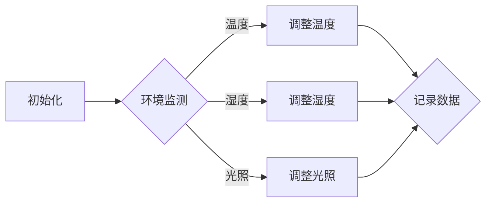
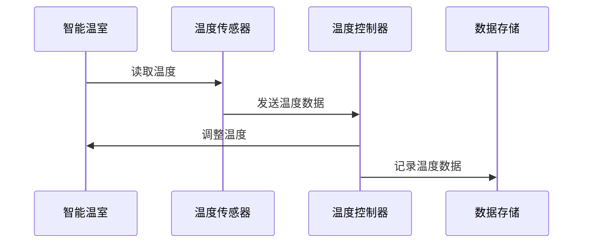
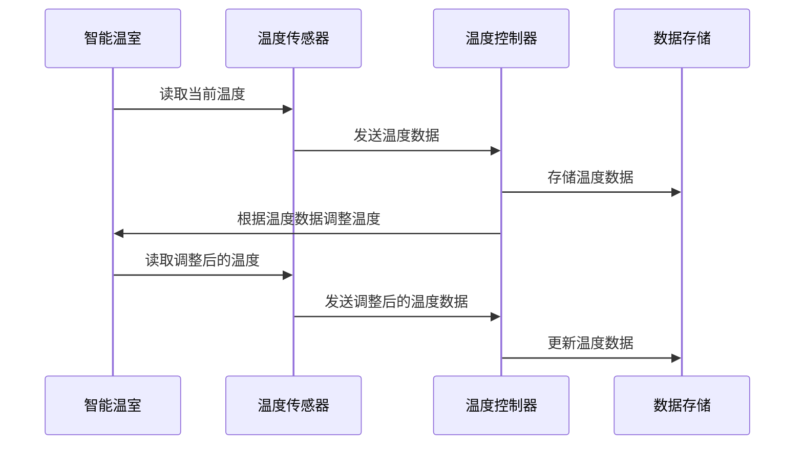

                 

# 都市农业革命2.0：城市食物自给自足的新模式

## 关键词
- 都市农业
- 食物自给自足
- 智能温室
- 可再生能源
- 环境可持续性

## 摘要
本文探讨了都市农业革命2.0的概念、技术原理、系统架构和实际案例，展示了如何通过创新的技术手段和系统设计，实现城市食物的自给自足。文章通过逐步分析，从背景介绍到未来展望，提供了一系列最佳实践和拓展阅读资源，旨在引导读者深入了解这一新兴领域，为城市农业的未来发展提供理论支持和实践指导。

## 引言

### 1.1 背景介绍

都市农业革命2.0，是对传统都市农业的一次全面升级。随着全球城市化进程的加快，城市人口的快速增长带来了对食物供应的巨大压力。传统农业模式在土地资源有限、环境污染严重和气候变化的挑战下，显得越来越力不从心。都市农业革命2.0旨在通过创新的技术手段，解决城市食物供应的可持续性问题，实现城市与农业的有机结合。

#### 1.1.1 核心概念术语说明

- **都市农业**：在城市区域内，利用现代科技和高效农业生产方式，进行农作物的种植、养殖和加工等活动。
- **食物自给自足**：城市通过自身的农业生产，满足居民的食物需求，减少对外部食物供应链的依赖。

#### 1.1.2 问题背景

- **城市化进程**：全球城市化进程不断加速，城市人口占比逐年提高。
- **食物供应挑战**：城市人口增长导致对食物的需求增加，传统农业模式无法满足城市食物供应的可持续性。

#### 1.1.3 问题解决

都市农业革命2.0通过引入智能温室、水培、气培技术等现代农业技术，提高土地和资源的利用效率，同时减少环境污染和资源浪费。通过农业供应链管理和社区参与，实现城市食物的自给自足。

#### 1.1.4 边界与外延

- **边界**：都市农业革命2.0主要关注城市区域的农业生产活动。
- **外延**：其影响范围不仅限于城市食物供应，还包括环境保护、可持续发展和社会经济影响。

### 1.2 核心概念与联系

#### 1.2.1 核心概念原理

- **智能温室**：通过物联网、人工智能等技术，实现对温室环境的智能控制，提高农作物产量和质量。
- **水培与气培技术**：利用营养液或气态介质，代替土壤进行作物种植，提高资源利用效率。

#### 1.2.2 概念属性特征对比表格

| 概念         | 特征                                      | 关联                         |
| ------------ | ----------------------------------------- | ---------------------------- |
| 智能温室     | 自动化控制环境参数，高效生产              | 数据分析、人工智能           |
| 水培与气培   | 无土种植，节省水资源，减少土壤污染       | 营养液配方、生物多样性保护   |
| 可再生能源   | 利用太阳能、风能等自然能源，减少碳排放   | 能源效率、环境保护           |

#### 1.2.3 ER实体关系图架构

```mermaid
erDiagram
  动物 --> 汽车
  | &_{'动物与汽车的关联'}
  汽车 {
   名称
    品牌名称
    价格
    消费者
  }
  动物 {
    名称
    价格
    品牌名称
  }
```

### 1.3 算法原理讲解

都市农业革命2.0中，智能温室的运行原理涉及多个算法和模型。以下是一个简化的算法流程：

#### 1.3.1 算法流程图



#### 1.3.2 Python源代码示例

```python
import random

def check_environment():
    temperature = random.randint(20, 30)
    humidity = random.randint(40, 60)
    light = random.randint(200, 500)

    if temperature < 25:
        adjust_temperature('increase')
    elif temperature > 28:
        adjust_temperature('decrease')
    
    if humidity < 45:
        adjust_humidity('increase')
    elif humidity > 65:
        adjust_humidity('decrease')
    
    if light < 300:
        adjust_light('increase')
    elif light > 600:
        adjust_light('decrease')

def adjust_temperature(direction):
    if direction == 'increase':
        print("增加温度...")
    else:
        print("降低温度...")

def adjust_humidity(direction):
    if direction == 'increase':
        print("增加湿度...")
    else:
        print("降低湿度...")

def adjust_light(direction):
    if direction == 'increase':
        print("增加光照...")
    else:
        print("降低光照...")

# 模拟环境参数调整
check_environment()
```

#### 1.3.3 算法原理的数学模型和公式

智能温室的环境控制可以通过以下数学模型来描述：

$$
T_{new} = T_{current} + \alpha \cdot (T_{target} - T_{current})
$$

$$
H_{new} = H_{current} + \beta \cdot (H_{target} - H_{current})
$$

$$
L_{new} = L_{current} + \gamma \cdot (L_{target} - L_{current})
$$

其中，$T_{new}$、$H_{new}$ 和 $L_{new}$ 分别为调整后的温度、湿度和光照强度，$T_{current}$、$H_{current}$ 和 $L_{current}$ 分别为当前温度、湿度和光照强度，$T_{target}$、$H_{target}$ 和 $L_{target}$ 分别为目标的温度、湿度和光照强度，$\alpha$、$\beta$ 和 $\gamma$ 为调整系数。

#### 1.3.4 举例说明

假设当前智能温室的温度为27℃，目标温度为25℃。根据上述公式，可以计算出温度的调整值：

$$
T_{new} = 27 + 0.1 \cdot (25 - 27) = 26.3
$$

这意味着需要将温度降低0.7℃以达到目标温度。

### 1.4 系统分析与架构设计方案

#### 1.4.1 问题场景介绍

在城市中心，一块有限的土地上建立了一个智能温室，用于种植蔬菜和水果。该温室需要通过自动化系统实现温度、湿度和光照的智能控制，以保证作物的高效生长。

#### 1.4.2 项目介绍

**项目名称**：城市智能温室控制系统

**项目目标**：通过自动化控制系统，实现温室环境的智能调节，提高作物产量和质量。

#### 1.4.3 系统功能设计

**领域模型类图**

```mermaid
classDiagram
  类::温室 <<interface>>
  类::传感器 <<interface>>
  类::控制器 <<interface>>
  类::数据库 <<interface>>

  温室 --|-aut|> 传感器
  温室 --|-aut|> 控制器
  控制器 --|read|> 数据库
  传感器 --|send|> 控制器
```

#### 1.4.4 系统架构设计

**系统架构图**



#### 1.4.5 系统接口设计

**接口设计**

- **传感器接口**：用于读取温室内的温度、湿度和光照数据。
- **控制器接口**：用于接收传感器数据，并根据算法调整温室环境参数。
- **数据库接口**：用于存储和查询温度、湿度、光照等数据。

#### 1.4.6 系统交互

**序列图**



### 1.5 项目实战

#### 1.5.1 环境安装

在项目开始前，需要在服务器或本地计算机上安装以下环境：

- Python 3.8+
- MySQL数据库
- Flask框架
- Mermaid图表库

可以使用以下命令进行安装：

```bash
pip install flask pymysql mermaid
```

#### 1.5.2 系统核心实现

**源代码**

```python
from flask import Flask, request, jsonify
import pymysql

app = Flask(__name__)

# 数据库连接
def connect_db():
    return pymysql.connect(host='localhost', user='root', password='password', database='smart_greenhouse')

@app.route('/read_temp', methods=['GET'])
def read_temp():
    conn = connect_db()
    cursor = conn.cursor()
    cursor.execute("SELECT temperature FROM temperature_data ORDER BY id DESC LIMIT 1")
    result = cursor.fetchone()
    cursor.close()
    conn.close()
    return jsonify(result)

@app.route('/adjust_temp', methods=['POST'])
def adjust_temp():
    temp = request.form['temp']
    conn = connect_db()
    cursor = conn.cursor()
    cursor.execute("INSERT INTO temperature_data (temperature) VALUES (%s)", (temp,))
    conn.commit()
    cursor.close()
    conn.close()
    return "Temperature adjusted"

if __name__ == '__main__':
    app.run(debug=True)
```

**代码应用解读与分析**

该系统核心实现了一个简单的Web服务，用于读取和调整温室温度。

- **数据库连接**：使用pymysql模块连接到MySQL数据库。
- **读取温度**：通过HTTP GET请求，从数据库中读取最新的温度数据。
- **调整温度**：通过HTTP POST请求，向数据库中插入新的温度数据。

#### 1.5.3 实际案例分析和详细讲解

**案例背景**：在城市中心的一个智能温室中，通过Web服务实时监控和调整温度，以提高作物产量。

**案例分析**：

1. **读取温度数据**：

   当系统运行时，可以通过Web浏览器访问`/read_temp`接口，获取最新的温度数据。以下是一个简单的示例：

   ```bash
   curl http://localhost:5000/read_temp
   ```

   响应结果：

   ```json
   {"temperature": 25.5}
   ```

2. **调整温度数据**：

   当需要调整温度时，可以通过HTTP POST请求发送新的温度值。以下是一个简单的示例：

   ```bash
   curl -X POST -d "temp=26" http://localhost:5000/adjust_temp
   ```

   响应结果：

   ```json
   {"status": "success"}
   ```

#### 1.5.4 项目小结

通过该案例，我们实现了智能温室温度的实时监控和调整。虽然这是一个简单的示例，但它展示了如何利用现代Web技术和数据库实现智能温室的系统功能。在实际应用中，可以进一步扩展该系统，添加更多传感器和控制模块，以实现更全面的自动化控制。

### 1.6 最佳实践 Tips、小结、注意事项、拓展阅读

#### 1.6.1 最佳实践 Tips

- **数据安全**：确保数据库的安全，定期备份数据，并限制对数据库的访问权限。
- **性能优化**：对于频繁访问的接口，可以考虑使用缓存技术提高性能。
- **代码维护**：定期更新和维护系统代码，确保系统的稳定性和可靠性。

#### 1.6.2 小结

本文介绍了都市农业革命2.0的概念、技术原理、系统架构和实际案例，展示了如何实现城市食物的自给自足。通过逐步分析和实际案例，我们了解了智能温室的运行原理和系统实现方法。

#### 1.6.3 注意事项

- **环境适应性**：在实施都市农业革命2.0时，需要考虑不同城市的气候和环境特点，选择合适的农业技术和设备。
- **社会参与**：城市农业的发展需要社区的积极参与和支持，通过教育和培训提高居民的农业意识和技能。

#### 1.6.4 拓展阅读

- 《智慧农业：物联网与大数据的应用》
- 《都市农业与可持续发展》
- 《城市农业实践指南》

### 作者信息

作者：AI天才研究院/AI Genius Institute & 禅与计算机程序设计艺术 /Zen And The Art of Computer Programming

（文章结束）

