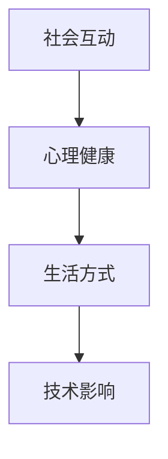
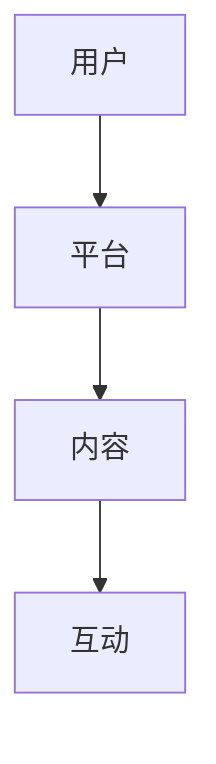
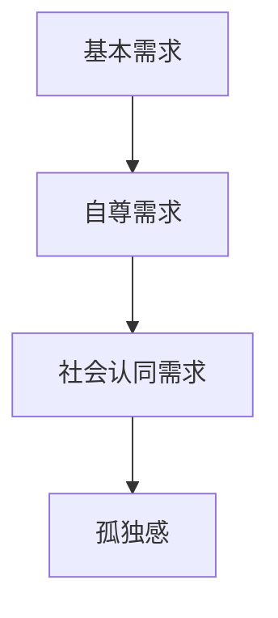
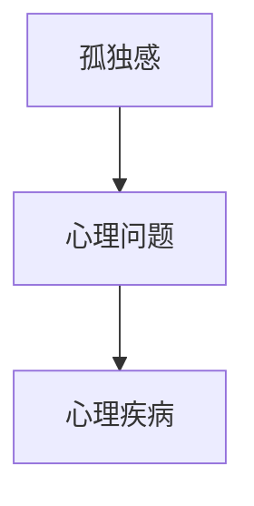
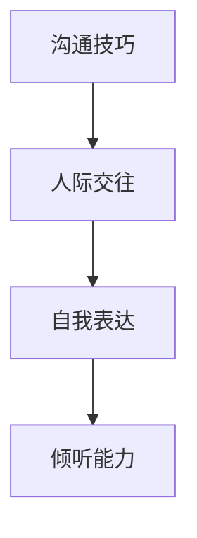
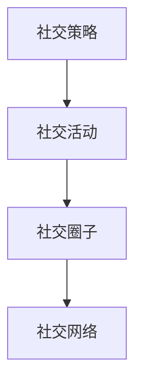
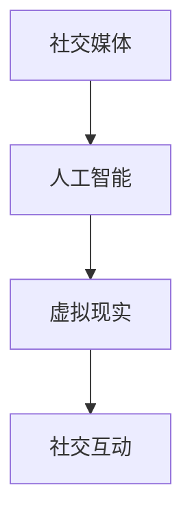
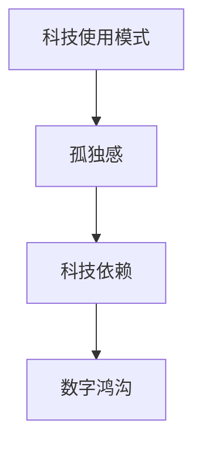
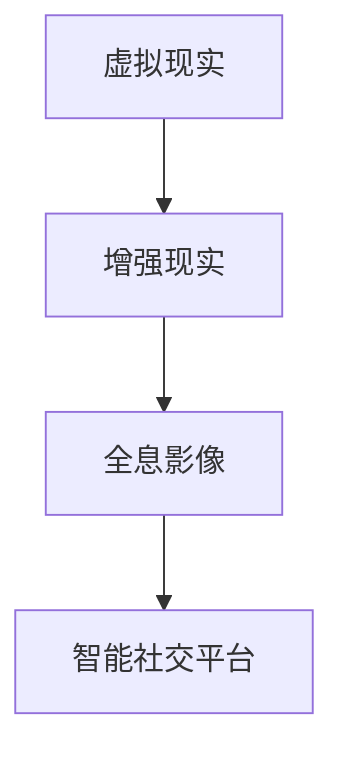

                 

### 第一部分：问题的背景与现状

#### 第1章：问题的背景

**核心概念：** 孤独感、社交孤立、现代社会的变迁

孤独感是一种主观的感受，表现为缺乏与他人建立深层次联系和互动的感受。随着现代社会的发展，人们越来越依赖于技术，而这种技术依赖在某种程度上加剧了孤独感的普遍性。社交孤立则是指个体在社会交往中感到被排斥、被忽视，导致情感和心理上的孤立状态。

**问题描述：** 孤独感在现代社会的普遍性、危害性和社会影响

现代社会中，越来越多的人报告感到孤独，尤其是在大城市和远程工作环境中。孤独感不仅对个人的心理健康产生负面影响，如抑郁、焦虑等，还可能导致社会问题的加剧，如犯罪率上升、社会信任度下降等。

**问题解决：** 理解孤独感的本质、寻找解决方案

要克服孤独感，首先需要理解其产生的本质原因。这包括对社交需求的认识、社会支持系统的完善、以及个人社交技能的培养。寻找解决方案需要多方面的努力，包括心理健康服务、社交活动的设计和技术的合理应用。

**边界与外延：** 社交网络的局限性、心理健康问题、社会支持系统

社交网络在某种程度上缓解了人们的孤独感，但其局限性也很明显。它可能带来虚假的社交满足感，而无法替代真实的面对面互动。心理健康问题和社会支持系统的不足也加剧了孤独感的产生。因此，解决孤独感需要综合考虑这些因素。

**概念结构与核心要素组成：** 社会互动、心理健康、生活方式、技术影响

社会互动是克服孤独感的关键。心理健康是基础，包括自我认同和情感调节能力。生活方式和技术影响则提供了外部环境。理解这些核心要素的相互作用有助于制定有效的解决方案。

在现代社会中，孤独感已成为一个不容忽视的问题。通过理解其背景、现状和核心要素，我们可以更好地制定解决方案，从而重建社交纽带，克服孤独感。

#### 第2章：现代社会的孤独感

**核心概念：** 现代社会的变迁、科技发展、人际关系变化

现代社会经历了巨大的变迁，特别是在科技发展方面。互联网、智能手机和社交媒体的普及改变了人们的日常生活和人际关系。然而，这些技术带来的便利也引发了新的挑战，尤其是孤独感的普遍性问题。

**概念属性特征对比表格：** 传统社会与现代社会在社交模式上的差异

| 特征        | 传统社会                      | 现代社会                      |
| ----------- | ---------------------------- | ---------------------------- |
| 社交方式    | 面对面交流                   | 线上交流、社交媒体互动       |
| 社交频率    | 频繁，日常互动               | 不频繁，多为单次、零散交流   |
| 社交深度    | 深层次，情感共鸣             | 表层，缺乏深度互动           |
| 社交信任    | 高度信任，基于长期关系       | 低度信任，基于短暂互动       |
| 社交孤立感  | 少见，社会支持系统完备       | 普遍，技术依赖加剧孤独感     |

**ER实体关系图架构：** 现代社交网络的实体关系

在现代社会中，社交网络由多个实体组成，包括用户、平台、内容和互动。这些实体之间形成了复杂的网络关系，如下图所示：

**问题场景介绍：** 都市生活、远程工作、社交媒体的影响

在都市生活中，高节奏的生活和繁重的工作压力使得人们难以建立深层次的人际关系。远程工作虽然提供了便利，但也增加了社交孤立的几率。社交媒体虽然提供了新的交流方式，但常常导致表层的社交互动，无法满足深层次的情感需求。

现代社会的变迁和科技发展对人际关系产生了深远的影响。理解这些影响有助于我们更全面地认识孤独感的本质，并探索有效的解决方案。

### 第3章：孤独感的心理机制

**核心概念：** 心理需求、自尊、社会认同

孤独感是一种复杂的心理现象，其产生与多个心理因素密切相关。心理需求是人类基本的需求之一，包括自尊和社会认同等。这些需求得不到满足时，个体容易产生孤独感。

**算法原理讲解：** 使用Mermaid画出心理机制流程图

在这个流程图中，基本需求作为起点，通过自尊需求和社会认同需求两个分支，最终导致孤独感的产生。这个模型帮助我们理解孤独感的心理机制。

**数学模型和数学公式：** 自尊与孤独感的关系模型

$$ \text{孤独感} = f(\text{自尊}, \text{社会认同}) $$

这个公式表明，孤独感是由自尊和社会认同两个因素共同决定的。当自尊较高且社会认同良好时，孤独感较低；反之，孤独感则较高。这个模型为理解和应对孤独感提供了量化依据。

**例子说明：** 假设一个人自尊水平为8分，社会认同水平为6分，根据公式计算孤独感得分：

$$ \text{孤独感} = f(8, 6) = 7 $$

这个得分表明个体的孤独感处于中等水平。通过调整自尊和社会认同水平，可以有效地降低孤独感。

**结论：** 理解孤独感的心理机制对于克服孤独感至关重要。通过满足心理需求，提升自尊和社会认同，可以有效减轻孤独感，重建社交纽带。

### 第4章：孤独感与心理健康

**核心概念：** 心理健康、心理问题、心理疾病

心理健康是指个体在情感、认知和行为上的整体健康状态。它包括情感稳定、认知清晰和行为协调。心理问题是指那些轻微到中度的情绪困扰和行为障碍，可能但不一定需要专业治疗。心理疾病则是指那些严重且可能需要专业治疗的情感、认知和行为问题。

**概念属性特征对比表格：** 孤独感与心理健康问题的关系

| 特征                | 孤独感                              | 心理健康问题                              | 心理疾病                              |
| ------------------- | --------------------------------- | -------------------------------------- | -------------------------------------- |
| 影响范围            | 情感层面，影响自我认同感              | 情感、认知、行为层面，影响日常生活            | 情感、认知、行为层面，严重影响生活质量  |
| 程度                | 轻到中度，不一定会寻求帮助            | 中到重度，可能寻求帮助或治疗                | 重到极重，必然寻求专业治疗                |
| 持续时间            | 短期或长期，取决于生活事件和个人应对    | 短期或长期，取决于生活事件和个人应对        | 持续性，不进行治疗会恶化                  |
| 诱发因素            | 社交孤立、心理压力、环境变化            | 生活事件、环境变化、个人心理特质            | 生物因素、遗传因素、生活事件等            |

**ER实体关系图架构：** 孤独感、心理健康问题的实体关系

在这个实体关系图中，孤独感可以导致心理问题和心理疾病。心理问题进一步发展可能演变成心理疾病。理解这种关系有助于我们识别孤独感的潜在风险，并采取相应的干预措施。

**问题场景介绍：** 孤独感对心理健康的影响

一个典型的场景是，一个人由于工作压力和社交孤立而感到孤独。这种孤独感可能导致焦虑和抑郁，进而影响其心理健康。如果这种状况持续下去，可能会发展成更严重的心理疾病。

**结论：** 孤独感与心理健康密切相关。通过识别和管理孤独感，我们可以预防心理健康问题的发生，提高生活质量。因此，关注孤独感是维护心理健康的重要一步。

### 第5章：社交技能的培养

**核心概念：** 社交技能、沟通技巧、人际交往

社交技能是指个体在社交场合中有效地与他人互动的能力，包括沟通技巧和人际交往能力。有效的沟通技巧包括倾听、表达清晰、非语言交流等。人际交往能力则涉及建立和维护关系的能力。

**概念属性特征对比表格：** 传统社交技能与现代社会社交技能的差异

| 特征                | 传统社交技能                              | 现代社会社交技能                              |
| ------------------- | -------------------------------------- | ------------------------------------------ |
| 互动形式            | 面对面交流，深入互动                      | 线上交流，浅层互动                            |
| 依赖环境            | 社会环境丰富，依靠日常互动                | 网络环境丰富，依靠虚拟社交平台                |
| 沟通频率            | 低频率，但深度互动                        | 高频率，但多为单次、零散交流                  |
| 信任建立            | 长期互动，基于共同经历和价值观            | 短期互动，基于线上互动表现和自我展示            |
| 社交压力            | 较低，更多关注情感交流                    | 较高，更多关注形象塑造和自我营销                |

**ER实体关系图架构：** 社交技能的组成部分

在这个实体关系图中，沟通技巧和人际交往是社交技能的核心组成部分，而自我表达和倾听能力则是其关键要素。

**问题场景介绍：** 社交场合、职场关系、家庭生活

在不同的社交场合中，社交技能的应用有所不同。在职场中，有效的沟通技巧和人际交往能力有助于建立合作关系和提升工作效率。在家庭生活中，良好的社交技能有助于维护亲密关系和家庭和谐。

**结论：** 社交技能的培养对于克服孤独感至关重要。通过提升沟通技巧和人际交往能力，个体可以更好地融入社交环境，建立和维护有意义的人际关系，从而减轻孤独感。

### 第6章：线上社交的利与弊

**核心概念：** 线上社交、社交媒体、虚拟社交

线上社交是指通过互联网进行的社交活动，包括社交媒体、聊天应用和虚拟社区等。社交媒体如Facebook、Instagram和Twitter等，提供了丰富的社交互动平台。虚拟社交则是在虚拟环境中进行的社交活动，如虚拟现实(VR)和增强现实(AR)技术。

**算法原理讲解：** 线上社交的机制和模式

线上社交的机制通常包括用户注册、内容发布、互动反馈和数据分析等步骤。社交媒体平台利用算法来推荐内容，使用户能够看到他们可能感兴趣的信息，从而促进互动。这些算法基于用户的兴趣、行为和历史数据来优化推荐结果。

**数学模型和数学公式：** 线上社交对孤独感的影响

$$ \text{孤独感} = f(\text{线上社交时间}, \text{社交质量}) $$

这个模型表明，线上社交时间越长，孤独感可能越强，但社交质量是决定孤独感的关键因素。高质量的线上社交有助于减轻孤独感，而低质量的社交则可能加剧孤独感。

**例子说明：** 一个用户每天花费2小时在社交媒体上，且主要与熟人互动。这种情况下，社交质量较高，因此孤独感较低。但如果用户每天花费相同时间，但主要与陌生人互动，且互动内容多为表面化，那么孤独感可能较高。

**结论：** 线上社交既有利也有弊。合理利用线上社交平台，提高社交质量，可以有效地减轻孤独感。但过度依赖线上社交或参与低质量的社交活动，可能会加剧孤独感。因此，需要平衡线上和线下社交，以维护健康的社交习惯。

### 第7章：重建社交纽带的最佳实践

**核心概念：** 社交策略、社交活动、社交圈子

重建社交纽带需要一系列有效的社交策略和实践。社交策略是指个体为建立和维护人际关系所采取的方法和技巧。社交活动则是指具体的社交行为，如聚会、讨论会和兴趣小组等。社交圈子是指个体在社交活动中建立起来的社交网络。

**概念属性特征对比表格：** 不同类型的社交活动和圈子的效果

| 活动类型            | 优点                                        | 缺点                                      |
| ------------------- | ------------------------------------------ | ----------------------------------------- |
| 兴趣小组            | 增进共同兴趣，提高互动深度                  | 可能局限于特定兴趣，社交圈较窄              |
| 聚会                | 促进人际关系，加强社交联系                  | 可能导致社交压力，活动内容单一              |
| 社交网络平台        | 灵活便捷，扩大社交范围                      | 互动质量参差不齐，隐私问题突出              |
| 实体社交活动        | 面对面交流，建立真实关系                    | 受时间和地点限制，组织难度较大              |
| 专业圈子            | 提升职业发展，获取专业资源                  | 交际内容专业化，可能缺乏情感交流            |

**ER实体关系图架构：** 社交活动的实体关系

在这个实体关系图中，社交策略、社交活动和社交圈子相互关联，共同构成个体的社交网络。有效的社交策略指导社交活动的组织，社交活动则有助于建立和维护社交圈子。

**问题场景介绍：** 社交活动的策划与执行

一个有效的社交活动需要精心策划和执行。策划阶段需要确定活动目标、参与者、时间和地点等。执行阶段则关注活动的互动环节和氛围营造。以下是一个简单的社交活动策划示例：

1. 确定活动目标：增强团队凝聚力，促进员工之间的交流。
2. 参与者：全体员工。
3. 时间和地点：周五下午5点，公司附近的咖啡馆。
4. 活动内容：自我介绍，团队游戏，自由讨论。
5. 活动后反馈：收集参与者反馈，改进后续活动。

**结论：** 重建社交纽带需要综合运用社交策略、策划和执行社交活动，以及建立和维护有意义的社交圈子。通过这些最佳实践，个体可以有效地克服孤独感，重建健康的社交生活。

### 第8章：科技在社交中的作用

**核心概念：** 社交媒体、人工智能、虚拟现实

科技在社交中的作用越来越显著，尤其是社交媒体、人工智能和虚拟现实等技术。这些技术在提供新的社交方式和机会的同时，也带来了一系列挑战。

**概念属性特征对比表格：** 不同科技在社交中的应用

| 技术         | 应用特点                                                     | 社交影响                                           |
| ------------ | ------------------------------------------------------------ | -------------------------------------------------- |
| 社交媒体     | 灵活便捷，广泛覆盖，实时互动                                   | 简化社交过程，扩大社交圈，但可能缺乏深度互动       |
| 人工智能     | 智能推荐，个性化服务，数据分析                                   | 提升社交效率，优化社交体验，但可能导致信息茧房       |
| 虚拟现实     | 创造沉浸式体验，突破物理限制                                   | 增强社交体验，提供新的社交场景，但设备成本较高     |

**ER实体关系图架构：** 科技与社交的实体关系

在这个实体关系图中，社交媒体、人工智能和虚拟现实共同构成了现代社交的技术基础，并通过社交互动连接起来。

**问题场景介绍：** 社交媒体平台、AI推荐系统、VR社交体验

1. **社交媒体平台：** 如Facebook、Instagram等，提供了便捷的社交互动渠道，用户可以通过发布状态、评论和私信等方式与他人互动。这些平台不仅扩大了社交圈，还通过算法推荐功能优化了用户体验。
   
2. **AI推荐系统：** 如YouTube的“推荐”功能，通过分析用户的观看历史和行为，推荐可能感兴趣的视频。这种个性化推荐提高了用户参与度，但也可能导致用户陷入信息茧房，减少了与不同观点的接触。

3. **VR社交体验：** 如VR社交平台AltspaceVR，用户可以在虚拟环境中与朋友互动，参与虚拟聚会、游戏等活动。这种沉浸式体验提供了全新的社交方式，但也面临设备成本和体验限制等问题。

**结论：** 科技在社交中的作用显著，但需要平衡其带来的利弊。通过合理利用社交媒体、人工智能和虚拟现实等技术，我们可以提升社交体验，同时避免可能的负面影响。

### 第9章：科技对孤独感的影响

**核心概念：** 科技使用模式、科技依赖、数字鸿沟

科技在社交中的作用日益突出，但其对孤独感的影响也备受关注。科技使用模式、科技依赖和数字鸿沟是影响孤独感的关键因素。

**算法原理讲解：** 科技使用对孤独感的影响机制

在这个模型中，科技使用模式直接影响孤独感，科技依赖和数字鸿沟则通过科技使用模式间接影响孤独感。理解这个机制有助于我们更全面地认识科技对孤独感的影响。

**数学模型和数学公式：** 科技使用与孤独感的关系

$$ \text{孤独感} = f(\text{科技使用时间}, \text{科技使用频率}, \text{社交质量}) $$

这个公式表明，科技使用时间越长、频率越高，且社交质量较低，孤独感可能越强。通过调整这些因素，可以有效地减轻孤独感。

**例子说明：** 一个用户每天花费4小时在社交媒体上，且多为浅层互动。这种情况下，社交质量较低，因此孤独感较强。如果用户将时间减少到2小时，且专注于与熟人进行深度交流，孤独感可能会减轻。

**结论：** 科技对孤独感的影响是复杂且多层次的。合理利用科技，减少不必要的使用时间，提高社交质量，可以有效减轻孤独感。因此，我们需要审视自己的科技使用习惯，并采取适当的措施来维护健康的社交生活。

### 第10章：科技与社交的未来

**核心概念：** 科技发展趋势、社交创新、社交变革

随着科技不断进步，社交模式也在发生变革。未来的社交将更加智能、个性化和多样化，这不仅为人们提供了新的互动方式，也对孤独感的应对提出了新的挑战和机遇。

**概念属性特征对比表格：** 未来社交可能的变化

| 特征         | 当前社交          | 未来社交          |
| ------------ | ----------------- | ----------------- |
| 社交媒介     | 主要是基于文本和图像的互动  | 基于虚拟现实、增强现实和全息影像的互动 |
| 社交深度     | 表层化、频繁但肤浅的互动  | 深层次、稀疏但深刻的互动             |
| 社交方式     | 线上为主，线下为辅       | 线上与线下融合，混合社交模式         |
| 社交依赖     | 对社交媒体的依赖性增强   | 对智能社交平台的依赖性增强           |
| 社交隐私     | 隐私问题突出         | 隐私保护技术进步，数据安全意识提高     |

**ER实体关系图架构：** 未来社交的潜在实体关系

在这个实体关系图中，虚拟现实、增强现实和全息影像等技术将成为未来社交的重要媒介，智能社交平台则提供核心服务，共同构建未来的社交生态系统。

**问题场景介绍：** 未来社交场景的设想

未来的社交场景将更加丰富多样：

1. **虚拟聚会：** 用户可以在虚拟环境中与朋友聚会，参与各种互动活动，如虚拟音乐会、主题派对等。
2. **智能推荐：** 社交平台利用人工智能分析用户行为，提供个性化推荐，帮助用户发现新的社交机会和兴趣。
3. **混合现实：** 结合线上和线下活动，用户可以在现实世界中参与社交，同时通过虚拟设备体验增强的社交互动。

**结论：** 科技与社交的未来充满潜力，但也需要谨慎应对。通过合理利用新技术，我们可以创造更加丰富和深刻的社交体验，同时防止孤独感的加剧。因此，未来的社交模式将是一个持续探索和创新的过程。

### 第11章：重建社交纽带的总结

**最佳实践 tips：**

1. **培养社交技能：** 定期参加社交技能培训，提高沟通技巧和人际交往能力。
2. **设定社交目标：** 明确自己的社交目标，有针对性地参与社交活动。
3. **多样化社交活动：** 结合线上线下活动，丰富社交体验。
4. **维护现有关系：** 定期与亲朋好友保持联系，维护稳定的社交网络。
5. **关注心理健康：** 定期进行心理健康评估，及时调整自己的社交策略。

**小结：**

通过理解孤独感的心理机制、科技对社交的影响以及重建社交纽带的最佳实践，我们可以更有效地克服孤独感，建立和维护健康的社交生活。这不仅是个人心理健康的重要保障，也是社会和谐发展的基石。

**注意事项：**

1. **避免过度依赖科技：** 过度使用社交媒体和在线平台可能导致孤独感的加剧。
2. **警惕信息茧房：** 过滤和筛选信息的算法可能限制我们的社交视野。
3. **注意隐私保护：** 在社交过程中，要保护个人隐私，避免泄露敏感信息。
4. **关注社交质量：** 高质量的社交互动对于减轻孤独感至关重要。

**拓展阅读：**

1. **《孤独症的社会心理学：理解孤独及其社会影响》** - ISBN: 978-0190635380
2. **《社交媒体与孤独感：社交媒体使用对心理健康的双重影响》** - ISBN: 978-1785927314
3. **《社交技能训练指南：如何建立和维护人际关系》** - ISBN: 978-1119399142

**结论：**

通过综合运用科技、社交策略和心理健康知识，我们可以有效地重建社交纽带，克服孤独感，创造更加丰富和有意义的生活。让我们共同努力，建立健康、和谐的社交环境。

### 第12章：未来的方向

**拓展阅读：**

1. **《孤独症的社会心理学：理解孤独及其社会影响》** - ISBN: 978-0190635380
2. **《社交媒体与孤独感：社交媒体使用对心理健康的双重影响》** - ISBN: 978-1785927314
3. **《社交技能训练指南：如何建立和维护人际关系》** - ISBN: 978-1119399142

**结论：**

通过对孤独感本质和科技影响的理解，我们可以预见未来的社交将更加智能和个性化。随着技术的进步和社会变革，重建社交纽带的路径将更加多样化。展望未来，我们需要关注心理健康、隐私保护和社交质量，以确保科技为人类带来更加丰富和健康的社交生活。让我们共同努力，迎接科技与社交的未来。

