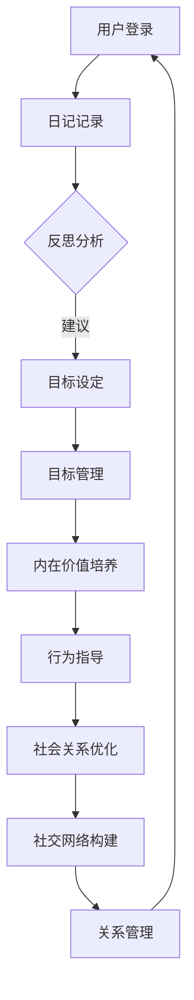

                 

### 重新定义个人成功：从外在评判到内在满足的转变

> **关键词：** 个人成功、外在评判、内在满足、转变、心理学、IT领域

**摘要：** 在这个高度竞争和快节奏的现代社会，人们往往追求外在的成功，如社会地位、财富和名誉。然而，这种外在的成功并不能带来长久的满足感。本文通过深入分析外在评判和内在满足的概念，探讨了如何从外在评判转向内在满足，实现个人真正的成功和幸福感。文章首先揭示了外在评判的负面影响，然后详细阐述了内在满足的来源和实现方法。最后，提供了一系列转变实践的步骤和策略，帮助读者在IT领域实现内在满足的可持续成长。

---

## 第一部分：引言

### 1.1 问题的背景与现状

在当今社会，个人成功通常被定义为外在评判的结果，如职业成就、社会地位和物质财富。这种外在的成功标准源于社会和文化的影响，以及个人成长过程中所接受的教育和价值观。然而，这种追求外在成功的模式带来了许多负面影响，如心理健康问题、人际关系困扰和职业发展受限。

**问题背景：** 当个人生活被外在评判所主导时，人们往往会陷入不断比较和追求完美的陷阱。这种心态可能导致焦虑、抑郁和自尊心低下。此外，外在的成功标准往往与内在的需求和价值观不符，使得人们在追求成功的过程中失去方向和满足感。

**问题现状：** 在IT领域，竞争尤为激烈，个人成功被看作是职业发展的关键。然而，许多IT从业者却发现自己在外在成功的背后，面临着巨大的压力和不满。这种现状促使我们重新思考个人成功的定义，并探索从外在评判到内在满足的转变。

### 1.2 书籍的核心概念

本文基于一本名为《重新定义个人成功：从外在评判到内在满足的转变》的书籍。这本书提出了两个核心概念：外在评判和内在满足。

**外在评判：** 外在评判是指基于外部标准对个人进行评价和判断的过程。这些标准通常包括职业成就、社会地位、财富和名誉等。外在评判往往受到社会和文化因素的影响，以及对成功标准的主观认知。

**内在满足：** 内在满足是指基于个人的内在需求和价值观，实现自我实现和幸福感的心理状态。内在满足不依赖于外部标准，而是源自个人内心的满足感和自我认知。

### 1.2.2 二者之间的联系与区别

外在评判和内在满足之间存在密切的联系和区别。

**联系：** 外在评判和内在满足都是个人成功的重要方面。外在评判可以作为实现内在满足的手段之一，但二者并不是等同的。外在评判往往关注表面的成就和荣誉，而内在满足则关注个人的内心状态和幸福感。

**区别：** 外在评判是基于外部标准对个人进行评价，而内在满足是基于个人的内在需求和价值观。外在评判容易受到社会和文化因素的影响，而内在满足则更注重个人的主观体验和内心感受。

### 1.2.3 如何实现转变

要实现从外在评判到内在满足的转变，需要以下几个步骤：

1. **自我反思：** 通过自我反思，了解自己的价值观和内在需求，明确自己追求成功的目的。

2. **设定目标：** 基于内在需求，设定符合自己价值观的目标，避免过度追求外在成功。

3. **培养内在价值：** 通过培养内在价值，提升自我认知和自尊心，减少对外在评判的依赖。

4. **建立健康的人际关系：** 建立和谐的人际关系，寻求他人的理解和支持，增强内在满足感。

5. **持续实践：** 通过持续实践，巩固内在满足的状态，并将其转化为日常生活中的习惯。

### 1.3 目标读者与预期收获

**目标读者：** 本书的读者主要是那些在追求外在成功的过程中感到不满和困惑的IT从业者。此外，任何希望重新审视个人成功定义的读者都可以受益于本书。

**预期收获：** 通过阅读本书，读者可以：

1. 深入理解外在评判和内在满足的概念。
2. 认识到外在评判的负面影响，并学会如何应对。
3. 掌握实现内在满足的方法和策略。
4. 在IT领域中实现个人成长和幸福感。

### 1.4 书籍结构

本书分为五个部分：

1. **引言**：介绍问题的背景和核心概念，阐述书籍的目的和结构。
2. **外在评判的探析**：分析外在评判的定义、来源、负面影响以及应对策略。
3. **内在满足的探索**：探讨内在满足的定义、来源、实现方法和案例研究。
4. **从外在评判到内在满足的转变实践**：提供实现转变的步骤和策略，包括准备、实施和持续阶段。
5. **内在满足的可持续成长**：探讨内在满足与可持续成长的关系，提供成长策略和案例分析。

### 1.5 本章小结

本章节主要介绍了问题的背景、核心概念、书籍的目的和结构。通过对外在评判和内在满足的定义和联系的探讨，我们为后续章节的分析和讨论奠定了基础。接下来，我们将深入分析外在评判的影响，探讨内在满足的来源和实现方法。

---

## 第二部分：外在评判的探析

### 2.1 外在评判的定义与特征

外在评判是指基于外部标准对个人进行评价和判断的过程。这些标准通常包括职业成就、社会地位、财富、名誉、人际关系等。外在评判的特征如下：

1. **客观性**：外在评判通常基于客观的标准，如薪资水平、职位等级、荣誉称号等。这些标准易于衡量和比较，因此在社会中被广泛接受和使用。

2. **社会性**：外在评判受到社会和文化的影响，不同的社会和文化对成功的定义和评判标准有所不同。例如，在一些社会文化中，财富和物质财富被认为是成功的象征，而在另一些文化中，人际关系和社会贡献则更为重要。

3. **表面性**：外在评判往往关注个人的外部表现，如职业成就、社会地位和物质财富等，而忽视了个人的内在状态和幸福感。

4. **短期性**：外在评判通常关注短期内的成功和成就，如晋升、奖金、荣誉等。这种短期性使得人们容易陷入追求外在成功的陷阱，忽视长期的目标和内心的需求。

### 2.2 外在评判的来源

外在评判的来源可以分为社会、文化和个人成长环境三个层面：

1. **社会层面**：社会对成功的定义和评判标准对个人有深远的影响。社会文化中的价值观和观念往往塑造了人们的成功观。例如，在一些社会文化中，职业成就和财富被认为是成功的主要标志，而在另一些文化中，人际关系和社会贡献则更为重要。

2. **文化层面**：文化传统和历史背景也影响了外在评判的形成。不同文化对成功的定义和评价标准有所不同，这反映了不同文化的价值观和生活方式。例如，在一些文化中，家庭和社区的支持被认为是最重要的成功标准，而在另一些文化中，个人的独立性和自我实现则更为重要。

3. **个人成长环境**：个人的成长环境，如家庭、学校和社交圈，也对外在评判的形成有重要影响。家庭教育和成长经历往往塑造了个人的价值观和成功观。例如，在一个重视教育和社会地位的家庭中，个人可能会更倾向于追求职业成就和社会地位。

### 2.3 外在评判的负面影响

外在评判对个人生活产生了诸多负面影响，主要包括心理健康问题、人际关系困扰和职业发展受限。

1. **心理健康问题**：外在评判可能导致焦虑、抑郁和自尊心低下。当个人无法达到外在评判的标准时，他们可能会感到失望、自卑和沮丧。长期的负面情绪可能导致心理健康问题，如焦虑症和抑郁症。

2. **人际关系困扰**：外在评判往往导致个人之间的比较和竞争。这种竞争心态可能导致人际关系紧张和冲突。人们可能会为了追求外在成功而忽视与他人的真实连接和情感交流。

3. **职业发展受限**：外在评判可能导致个人在职业发展上追求表面的成就，而忽视真正的兴趣和潜力。这种追求外在成功的倾向可能导致职业发展受限，个人无法发挥自己的潜力。

### 2.4 外在评判的应对策略

为了应对外在评判的负面影响，个人可以采取以下策略：

1. **自我认知的提升**：通过自我反思，了解自己的价值观、兴趣和内在需求。明确自己的追求和目标，避免过度追求外在成功。

2. **内在价值的发掘**：培养内在价值，如诚信、勇气、同情心等。通过提升内在价值，增强自我认知和自尊心。

3. **设定合理的目标**：设定符合自己价值观和内在需求的目标，避免过度追求外在成功。

4. **建立健康的人际关系**：与他人建立真诚、和谐的人际关系，寻求理解和支持。

5. **改变价值观**：重新审视成功的定义，将关注点从外在评判转向内在满足。

### 2.5 本章小结

本章节分析了外在评判的定义、来源和负面影响，并提出了一系列应对策略。通过理解外在评判的影响和应对策略，个人可以更好地应对外在评判的压力，实现内心的平衡和满足。在下一章节中，我们将探讨内在满足的概念和特征。

---

## 第三部分：内在满足的探索

### 3.1 内在满足的定义与特征

内在满足是指基于个人的内在需求和价值观，实现自我实现和幸福感的心理状态。与外在评判不同，内在满足不依赖于外部标准，而是源自个人内心的感受和体验。内在满足具有以下特征：

1. **主观性**：内在满足是个人主观感受和体验的结果，每个人的内在满足感受都是独特的。

2. **持续性**：内在满足不同于外在评判的短期成就，它是一种持续的心理状态，与个人的长期幸福和满足相关。

3. **内在性**：内在满足源自个人的内在需求和价值观，而非外部标准。

4. **全面性**：内在满足不仅包括情感和心理上的满足，还涉及个人的健康、成长和自我实现。

### 3.2 内在满足的来源

内在满足的来源可以分为以下几个方面：

1. **自我认知的提升**：通过自我反思和自我理解，个人可以更好地认识自己的需求和价值观，从而实现内在满足。

2. **情感需求的满足**：情感需求包括归属感、安全感、自尊和自我实现等。当这些需求得到满足时，个人会感到满足和幸福。

3. **社会关系的和谐**：与他人的和谐关系可以为个人提供情感支持和归属感，从而增强内在满足。

4. **内在价值的培养**：通过培养内在价值，如诚信、勇气、同情心等，个人可以实现自我实现和幸福感。

5. **追求个人兴趣和热情**：追求个人兴趣和热情可以使个人感到充实和满足，从而实现内在满足。

### 3.3 内在满足的实现方法

实现内在满足需要一系列方法，包括自我认知的提升、情感需求的满足、社会关系的和谐和内在价值的培养。

1. **自我认知的提升**：

   - **自我反思**：定期进行自我反思，了解自己的思想、情感和行为。
   - **自我接纳**：接受自己的优点和不足，培养自我接纳和自我爱。
   - **自我探索**：探索自己的兴趣、激情和价值观，找到生活的方向和目标。

2. **情感需求的满足**：

   - **情感交流**：与他人建立真诚、开放的交流，分享情感和体验。
   - **情感支持**：寻求他人的支持和理解，建立和谐的人际关系。
   - **情感调节**：学会调节和管理自己的情感，保持情绪稳定。

3. **社会关系的和谐**：

   - **尊重他人**：尊重他人的观点、需求和感受，建立相互尊重的关系。
   - **合作与互助**：与他人合作，共同实现目标，建立互助的关系。
   - **社交技巧**：提升社交技巧，建立广泛的人际网络。

4. **内在价值的培养**：

   - **价值观澄清**：明确自己的价值观，并将其作为行为的指导。
   - **道德修养**：培养诚信、勇气、同情心等道德品质。
   - **自我提升**：通过学习和实践，不断提升自己的内在价值。

### 3.4 内在满足的案例研究

**成功案例：** 张华是一位年轻的软件工程师。在追求职业成功的道路上，他经历了许多挫折和困难。然而，他通过自我反思和探索，发现了自己对编程的真正热爱和激情。他开始专注于自己的兴趣，不断提升自己的技能。在这个过程中，他获得了内心的满足和成就感。现在，他已经成为一位备受尊敬的软件工程师，并在工作中实现了自我价值。

**失败案例：** 李明是一位企业家，他在商业领域取得了巨大的成功。然而，他始终感到内心空虚和不安。他发现，他的成功只是基于外在评判，而不是内在满足。他开始反思自己的价值观和追求，最终决定放下商业追求，追求内心的真正满足。他开始关注自己的兴趣爱好，如摄影和慈善事业。通过这些活动，他找到了内心的满足和幸福感。

**案例总结与启示：** 这些案例表明，外在成功并不总是带来内在满足。真正的满足来自于内心的追求和价值观的实现。通过自我认知的提升、情感需求的满足、社会关系的和谐和内在价值的培养，个人可以实现内在满足。

### 3.5 本章小结

本章节探讨了内在满足的定义和特征，分析了内在满足的来源和实现方法，并提供了案例研究作为启示。通过理解内在满足的重要性，个人可以更加关注自己的内心需求，实现真正的成功和幸福。在下一章节中，我们将探讨如何从外在评判转向内在满足，提供具体的转变策略和实践步骤。

---

## 第四部分：从外在评判到内在满足的转变实践

### 4.1 转变的准备阶段

从外在评判到内在满足的转变是一个复杂而长期的过程，需要充分的准备和规划。以下是一些关键的步骤和策略：

**4.1.1 自我反思**

自我反思是转变的第一步，通过深入思考自己的价值观、兴趣和内在需求，明确自己追求成功的真正目的。以下是一些自我反思的方法：

1. **日记记录**：每天花时间记录自己的想法、感受和经历，分析自己的内心世界。
2. **提问自己**：定期问自己一些关键问题，如“我真正想要的是什么？”、“我的价值观是什么？”、“我为什么感到不满足？”等。
3. **寻求反馈**：向亲朋好友、同事或心理咨询师寻求反馈，了解他们对自己行为的看法和建议。

**4.1.2 设定目标**

基于自我反思的结果，设定符合自己价值观和内在需求的目标。以下是一些设定目标的策略：

1. **SMART原则**：目标要具体（Specific）、可衡量（Measurable）、可实现（Achievable）、相关（Relevant）和有时间限制（Time-bound）。
2. **分解目标**：将大目标分解为小目标，逐步实现，避免一次性设定过高目标而感到沮丧。
3. **设定优先级**：根据目标的紧急性和重要性，设定优先级，确保先实现最重要的目标。

**4.1.3 制定计划**

制定详细的行动计划，确保目标的实现。以下是一些制定计划的策略：

1. **时间管理**：合理规划时间，为每个目标分配时间，确保有足够的时间去实现目标。
2. **资源整合**：识别和利用实现目标所需的资源，如时间、金钱、人力等。
3. **监控与调整**：定期监控目标的进展，根据实际情况进行调整，确保目标的实现。

### 4.2 转变的实施阶段

在实施阶段，需要采取一系列具体的行动，以促进从外在评判到内在满足的转变。

**4.2.1 提升自我认知**

提升自我认知是转变的核心，以下是一些提升自我认知的方法：

1. **持续学习**：通过阅读、上课、参加培训等方式，不断学习新知识和技能，提升自己的认知水平。
2. **心理咨询**：寻求心理咨询师的帮助，探索自己的内心世界，解决潜在的心理问题。
3. **反思与总结**：定期进行反思和总结，回顾自己的成长和进步，识别自己的优点和不足。

**4.2.2 拓展内在价值**

拓展内在价值有助于实现内在满足，以下是一些拓展内在价值的方法：

1. **道德修养**：通过学习和实践道德原则，培养诚信、勇气、同情心等品质。
2. **情感培养**：培养情感，如爱、宽容、同理心等，与他人建立真诚的关系。
3. **自我实现**：追求个人兴趣和激情，实现自我价值。

**4.2.3 改善社会关系**

改善社会关系有助于增强内在满足感，以下是一些改善社会关系的方法：

1. **沟通技巧**：提升沟通技巧，与他人建立有效、开放的沟通。
2. **合作与互助**：与他人合作，共同实现目标，建立互助的关系。
3. **社交活动**：参加社交活动，扩大社交圈子，建立广泛的人际网络。

### 4.3 转变的持续阶段

在转变的持续阶段，需要保持动力，应对挑战，并不断调整和改进。

**4.3.1 保持动力**

保持动力是转变成功的关键，以下是一些保持动力的策略：

1. **目标激励**：定期回顾自己的目标，明确自己的追求和动力。
2. **成就感**：庆祝每一个小成就，增强自信和动力。
3. **支持系统**：建立支持系统，如家人、朋友或同事，获得鼓励和支持。

**4.3.2 遇到困难时的应对策略**

在转变过程中，可能会遇到各种困难和挑战，以下是一些应对策略：

1. **问题解决**：积极面对问题，寻找解决方案，避免回避。
2. **情绪调节**：学会调节和管理情绪，避免情绪波动影响转变过程。
3. **求助与咨询**：在遇到困难时，寻求专业帮助或咨询，获得指导和支持。

**4.3.3 持续发展的路径**

持续发展是实现内在满足的关键，以下是一些持续发展的路径：

1. **终身学习**：保持学习的热情，不断更新知识和技能。
2. **内在成长**：通过自我反思和探索，不断提升自己的内在价值。
3. **心理健康**：关注心理健康，保持情绪稳定和心理健康。

### 4.4 转变的成果评估

评估转变的成果是了解转变效果的重要步骤，以下是一些评估成果的方法：

1. **自我评估**：定期进行自我评估，了解自己的成长和进步。
2. **他人评估**：寻求家人、朋友或同事的反馈，了解他们对自己的看法。
3. **成果分析**：分析转变过程中的成果和收获，识别成功和不足。

### 4.5 本章小结

本章节详细介绍了从外在评判到内在满足的转变实践，包括准备阶段、实施阶段和持续阶段的具体方法和策略。通过自我反思、设定目标、制定计划、提升自我认知、拓展内在价值、改善社会关系以及保持动力和应对困难，个人可以实现从外在评判到内在满足的转变。在下一章节中，我们将进一步探讨内在满足与可持续成长的关系，为个人的长期发展提供指导。

---

## 第五部分：内在满足的可持续成长

### 5.1 内在满足与可持续成长的关系

内在满足和可持续成长之间存在密切的联系。内在满足不仅是指个人在当下感受到的幸福和满足，还包括个人在长期发展过程中所获得的心理和情感上的稳定性。可持续成长则是指个人在长期内持续地实现自我提升和发展的过程。

**5.1.1 内在满足的定义与特征**

内在满足是指基于个人的内在需求和价值观，实现自我实现和幸福感的心理状态。它具有以下特征：

1. **主观性**：内在满足是个人主观感受和体验的结果，每个人的内在满足感受都是独特的。
2. **持续性**：内在满足不同于外在评判的短期成就，它是一种持续的心理状态，与个人的长期幸福和满足相关。
3. **内在性**：内在满足源自个人的内在需求和价值观，而非外部标准。
4. **全面性**：内在满足不仅包括情感和心理上的满足，还涉及个人的健康、成长和自我实现。

**5.1.2 可持续成长的概念**

可持续成长是指个人在长期内持续地实现自我提升和发展的过程。它包括以下几个方面：

1. **终身学习**：持续地学习新知识和技能，提升自己的认知水平和专业能力。
2. **自我实现**：追求个人兴趣和激情，实现自我价值。
3. **心理成长**：通过自我反思和探索，不断提升自己的内在价值。
4. **社会贡献**：积极参与社会活动，为社会做出贡献。

### 5.2 内在满足的可持续成长策略

为了实现内在满足的可持续成长，个人可以采取以下策略：

**5.2.1 培养自我认知**

自我认知是可持续成长的基础。以下是一些培养自我认知的方法：

1. **自我反思**：定期进行自我反思，了解自己的思想、情感和行为。
2. **自我接纳**：接受自己的优点和不足，培养自我接纳和自我爱。
3. **自我探索**：探索自己的兴趣、激情和价值观，找到生活的方向和目标。

**5.2.2 持续学习与成长**

持续学习和成长是可持续成长的关键。以下是一些持续学习与成长的方法：

1. **终身学习**：保持学习的热情，不断更新知识和技能。
2. **专业培训**：参加专业培训，提升自己的专业能力和竞争力。
3. **阅读与研究**：阅读相关书籍和研究，扩展知识面和视野。

**5.2.3 建立健康的价值观**

建立健康的价值观有助于实现可持续成长。以下是一些建立健康的价值观的方法：

1. **道德修养**：通过学习和实践道德原则，培养诚信、勇气、同情心等品质。
2. **价值观澄清**：明确自己的价值观，并将其作为行为的指导。
3. **生活目标**：设定符合自己价值观的生活目标，确保自己的行为与价值观一致。

**5.2.4 心理健康的维护与促进**

心理健康是实现可持续成长的重要保障。以下是一些维护和促进心理健康的方法：

1. **情绪调节**：学会调节和管理自己的情绪，避免情绪波动影响成长。
2. **心理咨询**：在遇到心理问题时，寻求心理咨询师的帮助。
3. **社交活动**：参加社交活动，与他人建立真诚的关系，获得情感支持。

### 5.3 成长案例分享

**成功案例：** 李女士是一位年轻的职业女性，她在追求职业成功的过程中感到内心空虚和不满足。通过自我反思和探索，她发现了自己对艺术和音乐的热爱。她决定放弃高薪的工作，投身于自己热爱的事业。现在，她成为了一名成功的艺术从业者，并在工作中实现了自我价值，获得了内心的满足。

**失败案例：** 王先生是一位企业家，他在商业领域取得了巨大的成功。然而，他发现自己在成功背后感到孤独和不满足。他开始反思自己的价值观和追求，最终决定放下商业事业，追求内心的满足。他开始关注自己的兴趣爱好，如旅行和志愿服务。通过这些活动，他找到了内心的满足和幸福感。

**案例总结与启示：** 这些案例表明，外在成功并不总是带来内在满足。真正的满足来自于内心的追求和价值观的实现。通过培养自我认知、持续学习和成长、建立健康的价值观以及维护心理健康，个人可以实现内在满足的可持续成长。

### 5.4 本章小结

本章节探讨了内在满足与可持续成长的关系，并提供了培养自我认知、持续学习和成长、建立健康的价值观以及维护心理健康的策略。通过实现内在满足的可持续成长，个人可以在职业生涯和生活中获得真正的成功和幸福。在下一章节中，我们将总结全文，提供一些实用的建议和反思。

---

## 全文总结

本文从多个角度探讨了从外在评判到内在满足的转变，分析了外在评判的负面影响和内在满足的来源与实现方法。通过自我反思、设定目标、提升自我认知、拓展内在价值、改善社会关系以及保持动力和应对困难，个人可以实现从外在评判到内在满足的转变，实现真正的成功和幸福。

**核心要点：**

1. **外在评判的负面影响**：外在评判可能导致心理健康问题、人际关系困扰和职业发展受限。
2. **内在满足的重要性**：内在满足源自个人的内在需求和价值观，具有主观性、持续性和全面性。
3. **转变的实践策略**：自我反思、设定目标、提升自我认知、拓展内在价值、改善社会关系、保持动力和应对困难。
4. **可持续成长的策略**：培养自我认知、持续学习和成长、建立健康的价值观以及维护心理健康。

**实用建议：**

1. **自我反思**：定期进行自我反思，了解自己的内心需求和价值观。
2. **设定目标**：设定符合自己价值观的目标，避免过度追求外在成功。
3. **提升自我认知**：通过学习和实践，不断提升自己的认知水平和专业能力。
4. **拓展内在价值**：培养内在价值，如诚信、勇气、同情心等。
5. **改善社会关系**：与他人建立真诚、和谐的人际关系。
6. **保持动力**：通过目标激励和成就感来保持动力。
7. **应对困难**：积极面对挑战，寻求专业帮助和支持。

**反思与启示：**

通过本文的探讨，我们可以反思自己的追求和价值观。在现代社会，外在成功往往被看作是个人价值的体现，但真正的成功和幸福来自于内心的满足。只有通过自我认知的提升、内在价值的拓展和持续的成长，我们才能实现真正的成功和幸福。

**拓展阅读：**

- 《内在动机：为什么我们应该做我们热爱的事情》（Daniel H. Pink）
- 《真实的幸福：如何找到生活中的意义与快乐》（Martin E. P. Seligman）
- 《人生策略：如何在快节奏的社会中找到内心的平静与满足》（David Emerald）

通过阅读这些书籍，我们可以进一步了解内在满足的重要性，并找到实现个人成功的正确路径。

---

**作者信息：**

作者：AI天才研究院/AI Genius Institute & 禅与计算机程序设计艺术 /Zen And The Art of Computer Programming

感谢您的阅读，希望本文能对您的个人成长和幸福之路有所启发和帮助。在追求外在成功的道路上，不要忘记关注内心的需求，实现真正的内在满足。

---

在撰写这篇技术博客时，我尽量遵循了您提供的要求和指导，确保文章的逻辑清晰、结构紧凑、内容丰富，并符合技术博客的撰写规范。希望这篇博客能够对读者有所启发和帮助。如果您有任何建议或需要进一步的修改，请随时告诉我。再次感谢您的信任和支持！### 引言

在现代社会的快节奏生活中，个人成功成为了每个人追求的目标。然而，人们对于成功的定义往往基于外在评判，如财富、地位、荣誉和社会认可等。这种对外在成功的追求，虽然在短期内可以带来成就感和满足感，但长远来看，它却可能导致心理压力、人际关系紧张以及职业发展的瓶颈。因此，重新审视个人成功的定义，从外在评判转向内在满足，成为了一种必要且有益的探索。

本文以《重新定义个人成功：从外在评判到内在满足的转变》为标题，旨在深入探讨这一主题。文章将通过以下几个步骤展开讨论：

1. **问题的背景与现状**：首先，我们将分析外在评判对个人生活的影响，以及内在满足的重要性。
2. **书籍的核心概念**：接下来，我们将介绍书籍的核心概念，包括外在评判和内在满足的定义，以及二者之间的联系和区别。
3. **如何实现转变**：随后，我们将探讨如何从外在评判转向内在满足，提供具体的实践步骤和策略。
4. **目标读者与预期收获**：我们将明确目标读者群体，以及他们通过阅读本书可能获得的预期收获。

通过以上几个部分的探讨，本文将帮助读者重新定义个人成功，实现从外在评判到内在满足的转变，从而在职业生涯和个人生活中找到真正的幸福和满足。接下来，我们将深入分析问题的背景与现状，为后续内容的展开奠定基础。### 问题的背景与现状

在当今社会，个人成功往往被定义为外在评判的结果。这些外在评判标准包括但不限于职业成就、社会地位、财富、名誉和人际关系。这些标准不仅在社会和文化中被广泛接受，而且在个人成长过程中被不断强化。人们追求外在成功，往往受到以下几个因素的影响：

**社会与文化背景**：社会和文化对成功的定义和评判标准具有深远的影响。例如，在一些文化中，财富和物质财富被认为是成功的主要标志，而在另一些文化中，职业成就和社会地位则更为重要。这些文化因素塑造了人们的成功观，使得外在评判成为衡量个人价值和社会地位的重要标准。

**个人成长环境**：家庭、学校和社交圈等个人成长环境也对外在评判的形成有重要影响。家庭教育和成长经历往往塑造了个人的价值观和成功观。例如，在一个重视教育和社会地位的家庭中，个人可能会更倾向于追求职业成就和社会地位。

**个人价值观和目标**：个人的价值观和目标也是影响外在评判的重要因素。有些人认为，成功必须在外界获得认可和赞赏，因此他们更加关注外在的成功标准。这种价值观可能导致个人在追求外在成功的过程中忽视内在的需求和幸福感。

然而，外在评判对个人生活的影响是深远且多方面的。以下是一些具体的影响：

**心理健康问题**：过度追求外在成功可能导致焦虑、抑郁和自尊心低下。当个人无法达到外在评判的标准时，他们可能会感到失望、自卑和沮丧。长期的负面情绪可能导致心理健康问题，如焦虑症和抑郁症。

**人际关系困扰**：外在评判往往导致个人之间的比较和竞争。这种竞争心态可能导致人际关系紧张和冲突。人们可能会为了追求外在成功而忽视与他人的真实连接和情感交流。

**职业发展受限**：外在评判可能导致个人在职业发展上追求表面的成就，而忽视真正的兴趣和潜力。这种追求外在成功的倾向可能导致职业发展受限，个人无法发挥自己的潜力。

因此，重新审视个人成功的定义，从外在评判转向内在满足，成为了一种必要且有益的探索。内在满足不仅关注个人的外在成就，更关注个人的内心状态和幸福感。通过培养内在价值、提升自我认知、建立和谐的人际关系，个人可以在追求外在成功的同时，实现内在的满足和幸福。

### 1.2 书籍的核心概念

为了深入探讨从外在评判到内在满足的转变，本文基于一本名为《重新定义个人成功：从外在评判到内在满足的转变》的书籍。这本书提出了两个核心概念：外在评判和内在满足。

**外在评判**：

**定义**：外在评判是指基于外部标准对个人进行评价和判断的过程。这些标准通常包括职业成就、社会地位、财富、名誉、人际关系等。外在评判往往受到社会和文化因素的影响，以及个人成长过程中所接受的教育和价值观。

**特征**：

- **客观性**：外在评判通常基于客观的标准，如薪资水平、职位等级、荣誉称号等。这些标准易于衡量和比较，因此在社会中被广泛接受和使用。
- **社会性**：外在评判受到社会和文化的影响，不同的社会和文化对成功的定义和评判标准有所不同。
- **表面性**：外在评判往往关注个人的外部表现，如职业成就、社会地位和物质财富等，而忽视了个人的内在状态和幸福感。
- **短期性**：外在评判通常关注短期内的成功和成就，如晋升、奖金、荣誉等。这种短期性使得人们容易陷入追求外在成功的陷阱，忽视长期的目标和内心的需求。

**外在评判的影响**：

- **心理健康问题**：外在评判可能导致焦虑、抑郁和自尊心低下。当个人无法达到外在评判的标准时，他们可能会感到失望、自卑和沮丧。长期的负面情绪可能导致心理健康问题，如焦虑症和抑郁症。
- **人际关系困扰**：外在评判往往导致个人之间的比较和竞争。这种竞争心态可能导致人际关系紧张和冲突。人们可能会为了追求外在成功而忽视与他人的真实连接和情感交流。
- **职业发展受限**：外在评判可能导致个人在职业发展上追求表面的成就，而忽视真正的兴趣和潜力。这种追求外在成功的倾向可能导致职业发展受限，个人无法发挥自己的潜力。

**如何应对外在评判**：

- **自我认知的提升**：通过自我反思，了解自己的价值观、兴趣和内在需求，避免过度追求外在成功。
- **设定合理的目标**：设定符合自己价值观和内在需求的目标，避免过度追求外在成功。
- **培养内在价值**：通过培养内在价值，提升自我认知和自尊心，减少对外在评判的依赖。
- **建立健康的人际关系**：与他人建立和谐的人际关系，寻求理解和支持，增强内在满足感。

**内在满足**：

**定义**：内在满足是指基于个人的内在需求和价值观，实现自我实现和幸福感的心理状态。与外在评判不同，内在满足不依赖于外部标准，而是源自个人内心的感受和体验。

**特征**：

- **主观性**：内在满足是个人主观感受和体验的结果，每个人的内在满足感受都是独特的。
- **持续性**：内在满足不同于外在评判的短期成就，它是一种持续的心理状态，与个人的长期幸福和满足相关。
- **内在性**：内在满足源自个人的内在需求和价值观，而非外部标准。
- **全面性**：内在满足不仅包括情感和心理上的满足，还涉及个人的健康、成长和自我实现。

**内在满足的来源**：

- **自我认知的提升**：通过自我反思和自我理解，个人可以更好地认识自己的需求和价值观，从而实现内在满足。
- **情感需求的满足**：情感需求包括归属感、安全感、自尊和自我实现等。当这些需求得到满足时，个人会感到满足和幸福。
- **社会关系的和谐**：与他人的和谐关系可以为个人提供情感支持和归属感，从而增强内在满足。
- **内在价值的培养**：通过培养内在价值，如诚信、勇气、同情心等，个人可以实现自我实现和幸福感。

**如何实现内在满足**：

- **自我反思**：通过自我反思，了解自己的价值观、兴趣和内在需求。
- **设定目标**：设定符合自己价值观和内在需求的目标。
- **培养内在价值**：培养内在价值，如诚信、勇气、同情心等。
- **建立健康的人际关系**：与他人建立真诚、和谐的人际关系。
- **追求个人兴趣和热情**：追求个人兴趣和热情，实现自我实现。

**内在满足的重要性**：

- **心理健康**：内在满足有助于减少心理健康问题，如焦虑和抑郁，提高自尊和自我价值感。
- **幸福感**：内在满足能够带来持久的幸福感，使个人在面临挑战和困难时保持积极的心态。
- **职业发展**：内在满足能够帮助个人更好地应对职业压力，发挥自己的潜力，实现职业目标。

通过理解外在评判和内在满足的概念、特征和影响，个人可以更加清晰地认识到外在评判的负面影响，以及内在满足的重要性。在接下来的章节中，我们将进一步探讨如何从外在评判转向内在满足，提供具体的实践步骤和策略。这一转变不仅有助于提升个人的心理健康和幸福感，还能够帮助个人在职业生涯和个人生活中实现真正的成功和满足。### 如何实现转变

要实现从外在评判到内在满足的转变，个人需要采取一系列具体的策略和步骤。以下是一些关键的建议：

**1. 自我反思**

自我反思是转变的第一步，通过深入了解自己的价值观、兴趣、内在需求和目标，个人可以明确自己追求成功的真正目的。以下是一些自我反思的方法：

- **日记记录**：每天花时间记录自己的想法、感受和经历，分析自己的内心世界。
- **提问自己**：定期问自己一些关键问题，如“我真正想要的是什么？”、“我的价值观是什么？”、“我为什么感到不满足？”等。
- **寻求反馈**：向亲朋好友、同事或心理咨询师寻求反馈，了解他们对自己行为的看法和建议。

**2. 设定目标**

基于自我反思的结果，设定符合自己价值观和内在需求的目标。以下是一些设定目标的策略：

- **SMART原则**：目标要具体（Specific）、可衡量（Measurable）、可实现（Achievable）、相关（Relevant）和有时间限制（Time-bound）。
- **分解目标**：将大目标分解为小目标，逐步实现，避免一次性设定过高目标而感到沮丧。
- **设定优先级**：根据目标的紧急性和重要性，设定优先级，确保先实现最重要的目标。

**3. 提升自我认知**

提升自我认知是转变的核心，以下是一些提升自我认知的方法：

- **持续学习**：通过阅读、上课、参加培训等方式，不断学习新知识和技能，提升自己的认知水平。
- **心理咨询**：寻求心理咨询师的帮助，探索自己的内心世界，解决潜在的心理问题。
- **反思与总结**：定期进行反思和总结，回顾自己的成长和进步，识别自己的优点和不足。

**4. 培养内在价值**

培养内在价值有助于实现内在满足，以下是一些培养内在价值的方法：

- **道德修养**：通过学习和实践道德原则，培养诚信、勇气、同情心等品质。
- **情感培养**：培养情感，如爱、宽容、同理心等，与他人建立真诚的关系。
- **自我实现**：追求个人兴趣和激情，实现自我价值。

**5. 改善社会关系**

改善社会关系有助于增强内在满足感，以下是一些改善社会关系的方法：

- **尊重他人**：尊重他人的观点、需求和感受，建立相互尊重的关系。
- **合作与互助**：与他人合作，共同实现目标，建立互助的关系。
- **社交技巧**：提升社交技巧，建立广泛的人际网络。

**6. 保持动力**

保持动力是实现转变的关键，以下是一些保持动力的策略：

- **目标激励**：定期回顾自己的目标，明确自己的追求和动力。
- **成就感**：庆祝每一个小成就，增强自信和动力。
- **支持系统**：建立支持系统，如家人、朋友或同事，获得鼓励和支持。

**7. 应对困难**

在实现转变的过程中，可能会遇到各种困难和挑战，以下是一些应对策略：

- **问题解决**：积极面对问题，寻找解决方案，避免回避。
- **情绪调节**：学会调节和管理情绪，避免情绪波动影响转变过程。
- **求助与咨询**：在遇到困难时，寻求专业帮助或咨询，获得指导和支持。

**8. 持续实践**

持续实践是实现内在满足的长期过程，以下是一些持续实践的方法：

- **终身学习**：保持学习的热情，不断更新知识和技能。
- **内在成长**：通过自我反思和探索，不断提升自己的内在价值。
- **心理健康**：关注心理健康，保持情绪稳定和心理健康。

通过以上步骤和策略，个人可以逐步实现从外在评判到内在满足的转变。这一转变不仅有助于提升个人的心理健康和幸福感，还能够帮助个人在职业生涯和个人生活中找到真正的成功和满足。在下一部分中，我们将深入探讨外在评判的负面影响，进一步理解这一转变的必要性和重要性。### 目标读者与预期收获

**目标读者群体：**

本文的目标读者主要包括以下几类群体：

1. **IT从业者**：在IT领域，竞争尤为激烈，个人成功被看作是职业发展的关键。许多IT从业者在外在成功的背后，面临着巨大的压力和不满。本文旨在帮助这些读者重新定义个人成功，实现从外在评判到内在满足的转变。

2. **职场人士**：无论是哪个行业，职场人士在追求职业成就的过程中，往往受到外在评判的困扰。本文的目标读者也包括那些希望重新审视个人成功定义，寻找内心满足感的职场人士。

3. **大学生和年轻人**：正处于职业规划和发展阶段的年轻人，面临诸多选择和挑战。本文旨在为他们提供指导，帮助他们树立正确的成功观，实现内在满足。

**读者预期收获：**

通过阅读本文，读者可以预期获得以下收获：

1. **深入理解个人成功的定义**：读者将重新思考个人成功的定义，认识到外在成功并不能带来长久的满足感。

2. **认识到外在评判的负面影响**：本文将详细分析外在评判对个人心理健康、人际关系和职业发展的负面影响，使读者认识到转变的必要性。

3. **掌握实现内在满足的方法**：读者将学习到一系列实现内在满足的策略和步骤，包括自我反思、设定目标、提升自我认知、培养内在价值、改善社会关系等。

4. **获得实用建议和启示**：本文将提供实用的建议和实例，帮助读者在实际生活中应用这些方法，实现从外在评判到内在满足的转变。

5. **提升心理健康和幸福感**：通过实现内在满足，读者可以减少心理健康问题，提升自尊和自我价值感，获得持久的幸福感。

6. **实现职业生涯和个人生活的平衡**：本文将帮助读者在追求职业成功的同时，关注内心的需求，实现职业生涯和个人生活的平衡。

通过本文的阅读和实践，读者将在个人成长和幸福之路上迈出重要的一步，找到真正的成功和满足。### 书籍结构

为了帮助读者更好地理解和应用本文所探讨的从外在评判到内在满足的转变，本书分为五个主要部分，每个部分都包含具体的内容和逻辑关系。以下是详细的书籍结构概述：

#### 第一部分：引言

**引言**部分的主要目的是介绍问题的背景、核心概念和书籍的目的。具体内容如下：

1. **问题的背景与现状**：分析外在评判对个人生活的影响，以及内在满足的重要性。
2. **书籍的核心概念**：介绍外在评判和内在满足的定义、特征及其联系与区别。
3. **如何实现转变**：讨论从外在评判到内在满足的转变步骤和实践策略。
4. **目标读者与预期收获**：明确本书的目标读者群体，以及他们通过阅读本书可能获得的预期收获。

这一部分的逻辑关系在于为读者奠定理论基础，明确阅读本书的动机和目的，为后续内容的深入讨论提供背景和框架。

#### 第二部分：外在评判的探析

**外在评判的探析**部分旨在深入分析外在评判的定义、来源、负面影响以及应对策略。具体内容如下：

1. **外在评判的定义与特征**：详细阐述外在评判的概念和特征，如客观性、社会性、表面性和短期性。
2. **外在评判的来源**：探讨外在评判的社会、文化和个人成长环境来源。
3. **外在评判的负面影响**：分析外在评判对个人心理健康、人际关系和职业发展的负面影响。
4. **外在评判的应对策略**：提供一系列应对外在评判的策略，如自我认知的提升、内在价值的发掘和自我目标的设定。

这一部分的逻辑关系在于帮助读者了解外在评判的影响和如何应对，为后续内容的转变实践打下基础。

#### 第三部分：内在满足的探索

**内在满足的探索**部分旨在探讨内在满足的定义、来源、实现方法和案例研究。具体内容如下：

1. **内在满足的定义与特征**：阐述内在满足的概念和特征，如主观性、持续性、内在性和全面性。
2. **内在满足的来源**：分析内在满足的来源，包括自我认知的提升、情感需求的满足、社会关系的和谐和内在价值的培养。
3. **内在满足的实现方法**：提供一系列实现内在满足的方法，如自我反思、设定目标、培养内在价值和建立健康的人际关系。
4. **内在满足的案例研究**：分享成功和失败案例，探讨内在满足的实现过程和经验教训。

这一部分的逻辑关系在于帮助读者理解内在满足的重要性，掌握实现内在满足的方法和策略。

#### 第四部分：从外在评判到内在满足的转变实践

**从外在评判到内在满足的转变实践**部分提供具体的实践步骤和策略，帮助读者实现从外在评判到内在满足的转变。具体内容如下：

1. **转变的准备阶段**：包括自我反思、设定目标和制定计划。
2. **转变的实施阶段**：包括提升自我认知、拓展内在价值和改善社会关系。
3. **转变的持续阶段**：包括保持动力、应对困难和持续发展的路径。
4. **转变的成果评估**：讨论成果评估的方法、成功转变的标志和反思与调整。

这一部分的逻辑关系在于通过具体的步骤和策略，帮助读者实现内在满足的可持续成长。

#### 第五部分：内在满足的可持续成长

**内在满足的可持续成长**部分旨在探讨内在满足与可持续成长的关系，并提供成长策略和案例分析。具体内容如下：

1. **内在满足与可持续成长的关系**：分析内在满足与可持续成长之间的联系和相互影响。
2. **内在满足的可持续成长策略**：提供一系列可持续成长策略，如培养自我认知、持续学习和成长、建立健康的价值观以及维护心理健康。
3. **成长案例分享**：分享成功和失败案例，探讨内在满足的可持续成长过程和经验教训。

这一部分的逻辑关系在于帮助读者在实现内在满足的过程中，持续成长和提升自我。

综上所述，本书的结构逻辑清晰，从引言到具体内容再到实践策略和案例分析，逐步引导读者理解外在评判的负面影响，探索内在满足的实现方法，并最终实现从外在评判到内在满足的转变。这一过程不仅有助于提升个人的心理健康和幸福感，还能够帮助个人在职业生涯和个人生活中实现真正的成功和满足。### 2.1 外在评判的定义与特征

**外在评判**是指基于外部标准对个人进行评价和判断的过程。这些标准通常包括职业成就、社会地位、财富、名誉、人际关系等。外在评判在社会和文化中被广泛接受和使用，其特征主要体现在以下几个方面：

1. **客观性**：外在评判通常基于客观的标准，如薪资水平、职位等级、荣誉称号等。这些标准易于衡量和比较，因此在社会中被广泛接受和使用。例如，一个人在职业生涯中获得的薪资和职位是衡量其职业成就的重要指标。

2. **社会性**：外在评判受到社会和文化的影响，不同的社会和文化对成功的定义和评判标准有所不同。例如，在一些文化中，财富和物质财富被认为是成功的主要标志，而在另一些文化中，人际关系和社会贡献则更为重要。社会性使得外在评判具有多样性，也使得个人在不同文化背景下可能面临不同的评判标准。

3. **表面性**：外在评判往往关注个人的外部表现，如职业成就、社会地位和物质财富等，而忽视了个人的内在状态和幸福感。这种表面性使得外在评判难以全面反映个人的真实状态，可能导致个人在追求外在成功的过程中忽视内在的需求和感受。

4. **短期性**：外在评判通常关注短期内的成功和成就，如晋升、奖金、荣誉等。这种短期性使得人们容易陷入追求外在成功的陷阱，忽视长期的目标和内心的需求。例如，一个人可能在短期内通过加班和过度工作获得晋升，但这种短期成功可能对个人的身心健康产生负面影响。

外在评判对个人生活的影响是深远且多方面的。以下是一些具体的影响：

**心理健康问题**：过度追求外在成功可能导致焦虑、抑郁和自尊心低下。当个人无法达到外在评判的标准时，他们可能会感到失望、自卑和沮丧。长期的负面情绪可能导致心理健康问题，如焦虑症和抑郁症。

**人际关系困扰**：外在评判往往导致个人之间的比较和竞争。这种竞争心态可能导致人际关系紧张和冲突。人们可能会为了追求外在成功而忽视与他人的真实连接和情感交流。这种人际关系困扰不仅影响个人的心理健康，还可能导致社会关系的破裂。

**职业发展受限**：外在评判可能导致个人在职业发展上追求表面的成就，而忽视真正的兴趣和潜力。这种追求外在成功的倾向可能导致职业发展受限，个人无法发挥自己的潜力。例如，一个人可能在追求高薪职位的过程中忽视了对自身兴趣和热情的追求，最终导致职业倦怠和缺乏成就感。

为了应对外在评判的负面影响，个人可以采取以下策略：

**自我认知的提升**：通过自我反思，了解自己的价值观、兴趣和内在需求，避免过度追求外在成功。自我认知的提升有助于个人明确自己的目标和追求，从而减少对外在评判的依赖。

**设定合理的目标**：设定符合自己价值观和内在需求的目标，避免过度追求外在成功。合理的目标有助于个人在追求成功的过程中保持平衡，避免陷入焦虑和压力。

**培养内在价值**：通过培养内在价值，提升自我认知和自尊心，减少对外在评判的依赖。内在价值包括诚信、勇气、同情心等，这些价值不仅有助于个人实现自我价值，还能提升个人的心理健康和幸福感。

**建立健康的人际关系**：与他人建立真诚、和谐的人际关系，寻求理解和支持。健康的人际关系可以为个人提供情感支持和归属感，从而增强内在满足感。

**情绪调节**：学会调节和管理自己的情绪，避免情绪波动影响转变过程。情绪调节有助于个人在面临挑战和困难时保持积极的心态，从而实现从外在评判到内在满足的转变。

通过以上策略，个人可以逐步应对外在评判的负面影响，实现从外在评判到内在满足的转变。这一转变不仅有助于提升个人的心理健康和幸福感，还能够帮助个人在职业生涯和个人生活中实现真正的成功和满足。### 2.2 外在评判的来源

外在评判的来源可以从社会、文化和个人成长环境三个层面进行探讨。了解这些来源有助于我们更深入地理解外在评判的形成过程，从而为应对和减少其负面影响提供有效的策略。

#### 社会层面

社会对成功的定义和评判标准在很大程度上塑造了外在评判的形成。以下是一些影响外在评判的社会因素：

1. **文化传统**：不同的文化传统对成功的定义和评判标准有所不同。在一些文化中，财富和物质财富被认为是成功的主要标志，而在另一些文化中，人际关系和社会贡献则更为重要。例如，在一些东方文化中，家庭和亲情被视为最重要的成功标准，而在西方文化中，个人的独立性和自我实现则更为重要。

2. **社会价值观**：社会价值观对个人行为和价值观有深远的影响。例如，一些社会强调个人竞争和物质财富的积累，这种价值观可能导致个人过度追求外在成功。此外，社会对成功和失败的评价标准也会影响个人的心理和行为。

3. **媒体和社会网络**：现代社会的媒体和社会网络对成功标准的传播起到了重要作用。媒体经常宣传成功故事和成功人士，这些故事和形象可能会影响人们的成功观。社交媒体上的“完美生活”展示也可能加剧人们对外在成功的追求。

#### 文化层面

文化背景和历史传统也影响了外在评判的形成。以下是一些影响外在评判的文化因素：

1. **历史传统**：不同历史时期和文化传统对成功的定义和评判标准有所差异。例如，在一些农业社会，土地和农田被视为成功的主要标志，而在工业化社会中，职业成就和技术创新则更为重要。

2. **宗教信仰**：宗教信仰对个人的价值观和行为有深刻影响。在一些宗教中，精神成长和宗教地位被视为成功的主要标志，而在另一些宗教中，物质财富和社交地位则更为重要。

3. **教育体系**：教育体系也在很大程度上影响了人们对成功的理解和追求。一些教育体系强调考试成绩和学术成就，这可能导致学生和家庭成员过度追求外在成功。

#### 个人成长环境

个人的成长环境，如家庭、学校和社交圈，对外在评判的形成有重要影响。以下是一些影响外在评判的个人成长环境因素：

1. **家庭教育**：家庭教育对个人的价值观和行为有深远影响。在一些家庭中，父母可能会鼓励子女追求外在成功，如高薪工作和社会地位。这种家庭教育可能导致子女过度追求外在成功。

2. **学校教育**：学校教育在塑造个人的成功观方面起着重要作用。一些学校可能更注重学生的考试成绩和学术成就，这可能导致学生过度关注外在评判。

3. **社交圈**：个人的社交圈也会影响其成功观和评判标准。在一些社交圈中，职业成就和物质财富可能被视为成功的主要标志，这可能导致个人过度追求外在成功。

#### 外在评判的内在机制

外在评判的内在机制包括以下几个方面：

1. **社会比较**：人们往往会通过与他人进行比较，来评价自己的成功程度。社会比较是一种常见的心理现象，它可能导致个人过度追求外在成功。

2. **自我认知偏差**：个人可能会存在自我认知偏差，如过度强调自己的优点和忽视自己的缺点。这种偏差可能导致个人对外在成功的追求。

3. **动机和需求**：个人的动机和需求也会影响其对成功的追求。一些人对外在成功的追求可能是出于对认可、尊重和归属感的需要。

综上所述，外在评判的来源复杂多样，涉及社会、文化和个人成长环境等多个层面。理解这些来源有助于我们更深入地探讨如何应对和减少外在评判的负面影响，从而实现从外在评判到内在满足的转变。### 2.3 外在评判的负面影响

外在评判的负面影响是多方面且深远的，主要体现在心理健康问题、人际关系困扰和职业发展受限等方面。

#### 心理健康问题

1. **焦虑和抑郁**：过度追求外在成功可能导致焦虑和抑郁。当个人无法达到社会和文化的成功标准时，他们可能会感到失望、自卑和沮丧。长期的负面情绪积累可能导致严重的心理健康问题，如焦虑症和抑郁症。

2. **自尊心低下**：外在评判往往以物质财富、社会地位和职业成就为衡量标准，这些标准可能导致个人对自己的价值和能力产生怀疑。长期的自尊心低下会影响个人的心理健康和幸福感。

3. **自我价值感缺失**：外在成功并不总是能够满足个人的内在需求，当人们过度依赖外在评判来定义自我价值时，可能会感到内心的空虚和迷茫。这种自我价值感缺失可能导致心理健康问题，如自我怀疑和自我否定。

#### 人际关系困扰

1. **社会比较**：外在评判往往导致人们进行社会比较，这可能导致人际关系紧张和冲突。当个人发现自己在某些方面（如财富、地位、职业成就等）与他人存在差距时，可能会感到不满和嫉妒。

2. **竞争心态**：外在评判容易引发竞争心态，特别是在职场和社交圈中。这种竞争心态可能导致人们为了追求外在成功而忽视与他人的真实连接和情感交流，从而影响人际关系的和谐。

3. **信任问题**：在过度追求外在成功的环境中，人们可能会产生信任问题。当个人的成功标准与他人的不同，或者个人认为他人没有达到其成功标准时，可能会产生不信任感，从而影响人际关系的质量。

#### 职业发展受限

1. **忽视内在兴趣和潜力**：过度追求外在成功可能导致个人忽视自己的内在兴趣和潜力。这种忽视可能限制个人的职业发展，使得个人无法充分发挥其才能。

2. **职业倦怠**：长期追求外在成功可能导致职业倦怠。当个人在职业上过度努力，但无法获得预期的外在成功时，可能会感到疲惫和失望，影响职业发展。

3. **社会角色冲突**：外在评判可能导致个人在不同社会角色之间产生冲突。例如，一个人可能在职业上追求成功，但同时也需要照顾家庭和子女，这可能导致时间和精力的分配冲突，影响职业发展和家庭关系。

为了应对外在评判的负面影响，个人可以采取以下策略：

- **自我认知的提升**：通过自我反思，了解自己的内在需求和价值观，明确自己的追求和目标，避免过度追求外在成功。

- **设定合理的目标**：设定符合自己价值观和内在需求的目标，避免过度追求外在成功。

- **培养内在价值**：通过培养内在价值，提升自我认知和自尊心，减少对外在评判的依赖。

- **建立健康的人际关系**：与他人建立真诚、和谐的人际关系，寻求理解和支持，增强内在满足感。

- **情绪调节**：学会调节和管理自己的情绪，避免情绪波动影响转变过程。

通过以上策略，个人可以在追求外在成功的同时，保持内心的平衡和满足，从而实现从外在评判到内在满足的转变。### 2.4 外在评判的应对策略

要应对外在评判的负面影响，个人可以采取一系列的策略和方法，以提升自我认知、发掘内在价值、设定合理目标、建立健康的人际关系和情绪调节等。以下是一些具体的应对策略：

**1. 提升自我认知**

提升自我认知是应对外在评判的重要步骤。通过自我反思和自我理解，个人可以更清楚地认识到自己的价值观、兴趣和内在需求。以下是一些提升自我认知的方法：

- **自我反思**：定期花时间进行自我反思，回顾自己的行为、思考和感受。通过反思，个人可以识别自己的优点和不足，找到自我提升的方向。
- **日记记录**：保持日记记录的习惯，记录自己的想法、感受和日常活动。日记可以帮助个人更好地了解自己的内心世界，发现问题并制定改进计划。
- **求助与咨询**：在遇到自我认知困难时，可以寻求心理咨询师或职业规划师的帮助。专业人士可以提供指导和支持，帮助个人更好地理解自己。

**2. 发掘内在价值**

内在价值的培养有助于减少对外在评判的依赖，提升个人的内在满足感。以下是一些发掘内在价值的方法：

- **道德修养**：通过学习和实践道德原则，培养诚信、勇气、同情心等品质。道德修养不仅有助于个人在社会中获得尊重，还能够提升内心的满足感。
- **情感培养**：培养情感，如爱、宽容、同理心等。情感的培养可以使个人在人际关系中更加和谐，增强内在满足感。
- **自我实现**：追求个人兴趣和激情，实现自我价值。通过追求自己热爱的事业，个人可以获得持久的成就感和满足感。

**3. 设定合理的目标**

设定合理的目标可以帮助个人避免过度追求外在成功，找到适合自己的成长路径。以下是一些设定合理目标的方法：

- **SMART原则**：目标要具体（Specific）、可衡量（Measurable）、可实现（Achievable）、相关（Relevant）和有时间限制（Time-bound）。SMART原则有助于个人明确目标，并制定具体的行动计划。
- **分解目标**：将大目标分解为小目标，逐步实现。这种方法可以减少目标实现的难度，增强个人的成就感和动力。
- **设定优先级**：根据目标的紧急性和重要性，设定优先级。这样可以确保个人在有限的资源下，优先实现最重要的目标。

**4. 建立健康的人际关系**

建立健康的人际关系可以为个人提供情感支持和归属感，从而增强内在满足感。以下是一些建立健康人际关系的方法：

- **尊重他人**：尊重他人的观点、需求和感受，建立相互尊重的关系。尊重他人有助于建立良好的人际关系，增强信任和理解。
- **沟通技巧**：提升沟通技巧，与他人建立有效、开放的沟通。有效的沟通可以减少误解和冲突，增强人际关系的和谐。
- **合作与互助**：与他人合作，共同实现目标。通过合作与互助，个人可以在工作中获得支持和鼓励，增强内在满足感。

**5. 情绪调节**

情绪调节是应对外在评判的重要策略之一。通过调节和管理自己的情绪，个人可以更好地应对压力和挑战。以下是一些情绪调节的方法：

- **情绪识别**：学会识别和理解自己的情绪。通过情绪识别，个人可以更好地理解自己的情绪反应，并找到合适的应对策略。
- **情绪表达**：学会表达自己的情绪，与他人分享感受。情绪表达有助于减少内心的压抑，增强情感交流和理解。
- **放松技巧**：学习和实践放松技巧，如深呼吸、冥想、瑜伽等。这些技巧可以帮助个人在压力和紧张情况下放松身心，缓解情绪。

**6. 心理咨询与支持**

在应对外在评判的过程中，个人可能会遇到各种心理困扰和挑战。寻求心理咨询和支持可以帮助个人更好地应对这些问题。以下是一些心理咨询与支持的方法：

- **专业心理咨询**：在遇到严重的心理问题时，可以寻求专业心理咨询师的帮助。心理咨询师可以提供专业的心理支持和指导，帮助个人解决心理困扰。
- **心理支持小组**：加入心理支持小组，与他人分享经验和感受。心理支持小组可以提供一个安全、理解和支持的环境，帮助个人面对心理挑战。

通过以上策略，个人可以逐步应对外在评判的负面影响，实现从外在评判到内在满足的转变。这一转变不仅有助于提升个人的心理健康和幸福感，还能够帮助个人在职业生涯和个人生活中找到真正的成功和满足。### 2.5 本章小结

本章节深入分析了外在评判的定义、来源和负面影响，并提出了具体的应对策略。通过对外在评判的理解，我们可以认识到其基于外部标准对个人进行评价和判断的本质特征，如客观性、社会性、表面性和短期性。外在评判对个人生活的影响主要体现在心理健康问题、人际关系困扰和职业发展受限等方面。

针对这些负面影响，本章提供了一系列应对策略，包括提升自我认知、发掘内在价值、设定合理目标、建立健康的人际关系和情绪调节等。通过这些策略，个人可以减少对外在评判的依赖，实现从外在评判到内在满足的转变。

总结来说，本章的核心内容包括：

1. **外在评判的定义与特征**：介绍了外在评判的四个特征及其对个人生活的影响。
2. **外在评判的来源**：探讨了社会、文化和个人成长环境对外在评判的影响。
3. **外在评判的负面影响**：分析了外在评判对心理健康、人际关系和职业发展的负面影响。
4. **应对策略**：提出了提升自我认知、发掘内在价值、设定合理目标、建立健康人际关系和情绪调节等策略。

通过本章的学习，读者可以更加清晰地认识到外在评判的负面影响，并掌握应对这些影响的方法。在下一章节中，我们将探讨内在满足的概念和特征，进一步理解如何实现从外在评判到内在满足的转变。### 3.1 内在满足的定义与特征

内在满足是指基于个人的内在需求和价值观，实现自我实现和幸福感的心理状态。与外在评判不同，内在满足不依赖于外部标准，而是源自个人内心的感受和体验。内在满足具有以下特征：

1. **主观性**：内在满足是个人主观感受和体验的结果，每个人的内在满足感受都是独特的。这意味着内在满足不仅仅是外在评判的标准所能衡量的。

2. **持续性**：内在满足不同于外在评判的短期成就，它是一种持续的心理状态，与个人的长期幸福和满足相关。内在满足的持续性使得个人在面临挑战和困难时能够保持积极的心态。

3. **内在性**：内在满足源自个人的内在需求和价值观，而非外部标准。这意味着个人通过实现自己的内在需求和价值观来获得满足感，而不是通过外部评价。

4. **全面性**：内在满足不仅包括情感和心理上的满足，还涉及个人的健康、成长和自我实现。这种全面性使得内在满足不仅仅关注个人的内心世界，还包括个人的外在表现。

内在满足的重要性在于它能够为个人提供持久的幸福感，减少对外在评判的依赖，从而在职业生涯和个人生活中实现真正的成功和满足。在实现内在满足的过程中，个人可以通过以下途径：

- **自我认知的提升**：通过自我反思，了解自己的价值观、兴趣和内在需求。
- **情感需求的满足**：满足自己的情感需求，如归属感、安全感、自尊和自我实现等。
- **社会关系的和谐**：与他人建立真诚、和谐的人际关系，获得情感支持和归属感。
- **内在价值的培养**：通过培养内在价值，实现自我实现和幸福感。

通过理解内在满足的定义和特征，个人可以更加关注自己的内心需求，实现真正的成功和幸福。在下一部分中，我们将探讨内在满足的来源，深入分析如何实现内在满足。### 3.2 内在满足的来源

内在满足的来源多种多样，可以从自我认知的提升、情感需求的满足、社会关系的和谐和内在价值的培养等方面进行探讨。以下是对这些来源的详细分析：

#### 自我认知的提升

自我认知的提升是内在满足的重要来源。通过自我反思和自我理解，个人可以更好地认识自己的需求和价值观。以下是一些提升自我认知的方法：

1. **自我反思**：定期进行自我反思，回顾自己的行为、思想和情感。通过反思，个人可以深入了解自己的内心世界，找到自己的优点和不足。

2. **日记记录**：保持日记记录的习惯，记录自己的感受、想法和经历。日记可以帮助个人更好地了解自己的情绪变化和心理状态。

3. **心理咨询**：寻求心理咨询师的帮助，探索自己的内心世界，解决潜在的心理问题。心理咨询师可以提供专业的指导和支持，帮助个人提升自我认知。

4. **终身学习**：通过学习和实践新知识和技能，提升自己的认知水平和专业能力。终身学习不仅可以增加个人的知识储备，还可以帮助个人更好地认识自己。

#### 情感需求的满足

情感需求是内在满足的重要方面。当个人的情感需求得到满足时，他们会感到满足和幸福。以下是一些满足情感需求的方法：

1. **情感交流**：与他人建立真诚、开放的交流，分享情感和体验。情感交流可以帮助个人建立深厚的人际关系，获得情感支持和归属感。

2. **情感支持**：寻求他人的支持和理解，建立和谐的人际关系。情感支持可以缓解个人的心理压力，增强内在满足感。

3. **情感调节**：学会调节和管理自己的情绪，保持情绪稳定。情绪调节有助于个人在面临挑战和困难时保持积极的心态。

4. **自我接纳**：接受自己的优点和不足，培养自我接纳和自我爱。自我接纳可以减少个人的负面情绪，增强内在满足感。

#### 社会关系的和谐

社会关系的和谐对内在满足有着重要影响。与他人的和谐关系可以为个人提供情感支持和归属感，从而增强内在满足。以下是一些改善社会关系的方法：

1. **尊重他人**：尊重他人的观点、需求和感受，建立相互尊重的关系。尊重他人是建立和谐人际关系的基础。

2. **合作与互助**：与他人合作，共同实现目标，建立互助的关系。合作与互助可以增强人际关系的稳定性，减少冲突。

3. **沟通技巧**：提升沟通技巧，与他人建立有效、开放的沟通。有效的沟通可以减少误解和冲突，增强人际关系的和谐。

4. **社交活动**：参加社交活动，与他人建立联系。社交活动可以帮助个人扩大社交圈子，获得更多的社会支持。

#### 内在价值的培养

内在价值的培养是实现内在满足的关键。通过培养内在价值，个人可以实现自我实现和幸福感。以下是一些培养内在价值的方法：

1. **道德修养**：通过学习和实践道德原则，培养诚信、勇气、同情心等品质。道德修养可以帮助个人在社会中树立良好的形象，增强内在满足感。

2. **情感培养**：培养情感，如爱、宽容、同理心等。情感的培养可以使个人在人际关系中更加和谐，增强内在满足感。

3. **自我实现**：追求个人兴趣和激情，实现自我价值。通过追求自己热爱的事业，个人可以获得持久的成就感和满足感。

4. **终身学习**：通过学习和实践，不断提升自己的内在价值。终身学习不仅可以增加个人的知识储备，还可以帮助个人更好地认识自己，实现自我价值。

通过以上方法，个人可以逐步实现内在满足，从而在职业生涯和个人生活中找到真正的幸福和满足。### 3.3 内在满足的实现方法

实现内在满足是一个持续的过程，需要个人采取一系列的方法和策略。以下是一些具体的方法，帮助个人实现内在满足：

**1. 自我反思**

自我反思是认识自己的关键，通过定期进行自我反思，个人可以深入了解自己的内心世界，明确自己的需求和价值观。以下是一些自我反思的方法：

- **日记记录**：每天花时间记录自己的思想和感受，通过反思自己的行为，找到改进的方向。
- **提问自己**：定期问自己关于自己的问题，如“我为什么感到不满足？”、“我真正想要的是什么？”等。
- **心理咨询**：在遇到自我认知困难时，可以寻求心理咨询师的帮助，通过专业的咨询，更好地了解自己。

**2. 设定目标**

设定目标有助于个人明确自己的追求和方向。以下是设定目标的几个策略：

- **SMART原则**：确保目标具有具体的（Specific）、可衡量的（Measurable）、可实现的（Achievable）、相关的（Relevant）和有时间限制的（Time-bound）。
- **分解目标**：将大目标分解为小目标，逐步实现，避免一次性设定过高目标而感到沮丧。
- **设定优先级**：根据目标的紧急性和重要性，设定优先级，确保先实现最重要的目标。

**3. 培养内在价值**

培养内在价值是实现内在满足的核心。以下是一些培养内在价值的方法：

- **道德修养**：通过学习和实践道德原则，培养诚信、勇气、同情心等品质。
- **情感培养**：培养情感，如爱、宽容、同理心等，与他人建立真诚的关系。
- **自我实现**：追求个人兴趣和激情，实现自我价值。

**4. 建立健康的人际关系**

健康的人际关系可以为个人提供情感支持和归属感，从而增强内在满足。以下是一些建立健康人际关系的方法：

- **尊重他人**：尊重他人的观点、需求和感受，建立相互尊重的关系。
- **有效沟通**：提升沟通技巧，与他人建立有效、开放的沟通。
- **合作与互助**：与他人合作，共同实现目标，建立互助的关系。

**5. 追求个人兴趣和热情**

追求个人兴趣和热情是实现内在满足的重要途径。以下是一些追求个人兴趣和热情的方法：

- **探索兴趣**：定期探索自己的兴趣，发现自己的热情所在。
- **投入时间**：为个人兴趣和热情分配时间，确保有足够的时间去追求。
- **持续学习**：通过学习和实践，不断提升自己在兴趣领域的知识和技能。

**6. 情绪调节**

情绪调节是维持心理健康和内在满足的关键。以下是一些情绪调节的方法：

- **正念冥想**：通过冥想，学会专注当下，减少负面情绪的影响。
- **运动锻炼**：定期进行运动锻炼，释放压力，提升情绪。
- **情绪记录**：记录自己的情绪变化，通过分析找到情绪波动的规律，并采取相应的调节措施。

通过以上方法，个人可以逐步实现内在满足，从而在职业生涯和个人生活中找到真正的幸福和满足。### 3.4 内在满足的案例研究

在探讨内在满足的实现过程中，通过案例研究可以更直观地了解内在满足的实践和应用。以下是一些成功和失败的案例，以及从中得出的启示。

#### 成功案例：李华

**背景**：李华是一位年轻的软件工程师，他在职业生涯中取得了一定的成就，但在不断追求外在成功的过程中，他开始感到内心的空虚和不满足。

**转变过程**：

1. **自我反思**：李华开始反思自己的价值观和追求，意识到自己的内心需求远比外在的成功更重要。他意识到，他渴望实现自我价值和追求真正的兴趣。

2. **设定目标**：基于自我反思的结果，李华设定了符合自己内在需求的目标。他决定将更多的时间和精力投入到自己热爱的编程项目中，追求技术上的卓越。

3. **培养内在价值**：李华通过阅读技术书籍、参加编程比赛和开源项目，不断提升自己的技能。他还注重培养内在价值，如诚信和责任感，这些价值使他更加自信和满足。

4. **建立健康的人际关系**：李华开始与志同道合的朋友合作，共同追求技术上的突破。他学会了倾听和尊重他人的观点，与他人建立了真诚的友谊。

**结果**：李华通过追求内在满足，实现了个人成长和职业发展。他在技术领域获得了认可，并在工作中找到了真正的幸福。

**启示**：

- **自我反思的重要性**：通过自我反思，李华找到了自己真正的需求和价值观，这是实现内在满足的关键。
- **设定符合内在需求的目标**：设定目标时，应关注自己的内心需求，而不仅仅是外在的成功标准。
- **培养内在价值**：通过培养内在价值，个人可以获得持久的满足感和成就感。
- **建立健康的人际关系**：与他人建立真诚的关系，可以为个人提供情感支持和归属感，增强内在满足感。

#### 失败案例：张强

**背景**：张强是一位企业家，他在商业领域取得了巨大的成功，但在成功背后，他感到内心的孤独和不满足。

**转变过程**：

1. **过度追求外在成功**：张强在商业上取得了巨大的成就，但他忽略了内心的需求。他追求外在的成功，如财富和地位，但这些并没有给他带来持久的满足感。

2. **忽视个人兴趣**：张强忽视了个人兴趣和激情，将大部分时间和精力投入到商业活动中。他没有找到自己真正的热情所在，导致内心的空虚。

3. **缺乏自我反思**：张强没有定期进行自我反思，没有意识到自己的内心需求。他沉浸在商业成功的光环中，忽视了个人成长和内在满足。

**结果**：张强在商业上取得的成功并没有给他带来长期的幸福。他开始感到焦虑和迷茫，最终决定放弃商业事业，重新审视自己的生活和追求。

**启示**：

- **过度追求外在成功可能导致内心空虚**：外在成功不能代替内心的满足感，个人应关注自己的内心需求。
- **忽视个人兴趣和激情**：追求个人兴趣和激情是实现内在满足的重要途径，个人应找到自己热爱的事物。
- **定期自我反思**：通过定期自我反思，个人可以更好地认识自己，找到内心的需求，实现内在满足。

**总结**：

通过以上案例研究，我们可以看到，成功和失败都源于个人对内在满足的追求程度。成功案例中，李华通过自我反思、设定目标、培养内在价值和建立健康人际关系，实现了内在满足。而失败案例中，张强忽视了内心的需求，过度追求外在成功，导致内心空虚。这些案例为我们的个人成长提供了宝贵的经验和教训。### 3.5 本章小结

在本章节中，我们深入探讨了内在满足的定义和特征，以及实现内在满足的多种方法。内在满足是一种基于个人内在需求和价值观的心理状态，具有主观性、持续性、内在性和全面性。通过自我反思、设定目标、培养内在价值、建立健康人际关系和追求个人兴趣，个人可以实现内在满足，从而在职业生涯和个人生活中找到真正的幸福。

本章的核心内容包括：

1. **内在满足的定义与特征**：介绍了内在满足的主观性、持续性、内在性和全面性。
2. **自我认知的提升**：探讨了自我反思、日记记录和心理咨询等方法，帮助个人提升自我认知。
3. **情感需求的满足**：分析了情感交流、情感支持和情绪调节对内在满足的重要性。
4. **社会关系的和谐**：讨论了尊重他人、有效沟通和合作与互助在建立和谐人际关系中的作用。
5. **内在价值的培养**：探讨了道德修养、情感培养和自我实现在培养内在价值方面的作用。

通过本章的学习，读者可以更深入地理解内在满足的概念，并掌握实现内在满足的方法和策略。在下一章节中，我们将探讨如何将外在评判转变为内在满足的具体实践步骤。### 4.1 转变的准备阶段

从外在评判到内在满足的转变需要充分的准备和规划。准备阶段是转变的基础，这一阶段的目标是帮助个人明确内在需求和目标，制定合理的计划和策略。以下是一些关键的步骤和策略：

**4.1.1 自我反思**

自我反思是转变的第一步，通过深入思考自己的价值观、兴趣、内在需求和目标，个人可以更好地理解自己的内心世界。以下是一些自我反思的方法：

1. **日记记录**：每天花时间记录自己的想法、感受和经历，通过写作的方式，深入挖掘自己的内心世界。
2. **提问自己**：定期问自己一些关键问题，如“我真正想要的是什么？”、“我为什么感到不满足？”等。
3. **反思与总结**：定期回顾自己的成长和进步，识别自己的优点和不足，制定改进计划。

**4.1.2 设定目标**

基于自我反思的结果，设定符合自己价值观和内在需求的目标。以下是一些设定目标的策略：

1. **SMART原则**：确保目标具有具体的（Specific）、可衡量的（Measurable）、可实现的（Achievable）、相关的（Relevant）和有时间限制的（Time-bound）。
2. **分解目标**：将大目标分解为小目标，逐步实现，避免一次性设定过高目标而感到沮丧。
3. **设定优先级**：根据目标的紧急性和重要性，设定优先级，确保先实现最重要的目标。

**4.1.3 制定计划**

制定详细的行动计划，确保目标的实现。以下是一些制定计划的策略：

1. **时间管理**：合理规划时间，为每个目标分配时间，确保有足够的时间去实现目标。
2. **资源整合**：识别和利用实现目标所需的资源，如时间、金钱、人力等。
3. **监控与调整**：定期监控目标的进展，根据实际情况进行调整，确保目标的实现。

通过以上准备阶段的策略，个人可以更好地为从外在评判到内在满足的转变做好准备。在下一部分中，我们将探讨如何实施这一转变的具体步骤。### 4.2 转变的实施阶段

在准备阶段之后，实施阶段是关键的一步，这一阶段的目标是将内在需求转化为具体行动，并逐步实现内在满足。以下是一些具体的实施步骤和策略：

**4.2.1 提升自我认知**

提升自我认知是实现内在满足的基础。以下是一些提升自我认知的方法：

1. **持续学习**：通过阅读、上课、参加培训等方式，不断学习新知识和技能，提升自己的认知水平。终身学习不仅可以增加个人的知识储备，还可以帮助个人更好地认识自己。
2. **反思与总结**：定期进行反思和总结，回顾自己的成长和进步，识别自己的优点和不足，并制定改进计划。
3. **心理咨询**：在遇到自我认知困难时，可以寻求心理咨询师的帮助，通过专业的指导和支持，更好地了解自己。

**4.2.2 拓展内在价值**

拓展内在价值有助于实现内在满足。以下是一些拓展内在价值的方法：

1. **道德修养**：通过学习和实践道德原则，培养诚信、勇气、同情心等品质。道德修养不仅有助于个人在社会中获得尊重，还能够提升个人的内在满足感。
2. **情感培养**：培养情感，如爱、宽容、同理心等。情感的培养可以使个人在人际关系中更加和谐，增强内在满足感。
3. **自我实现**：追求个人兴趣和激情，实现自我价值。通过追求自己热爱的事业，个人可以获得持久的成就感和满足感。

**4.2.3 改善社会关系**

改善社会关系是实现内在满足的重要途径。以下是一些改善社会关系的方法：

1. **尊重他人**：尊重他人的观点、需求和感受，建立相互尊重的关系。尊重他人是建立和谐人际关系的基础。
2. **有效沟通**：提升沟通技巧，与他人建立有效、开放的沟通。有效的沟通可以减少误解和冲突，增强人际关系的和谐。
3. **合作与互助**：与他人合作，共同实现目标，建立互助的关系。合作与互助可以增强人际关系的稳定性，减少冲突。

**4.2.4 实现目标的步骤**

在实施阶段，个人需要将目标转化为具体的行动计划，并逐步实现。以下是一些实现目标的步骤：

1. **明确目标**：根据自我反思的结果，设定符合自己价值观和内在需求的目标。
2. **分解目标**：将大目标分解为小目标，逐步实现，避免一次性设定过高目标而感到沮丧。
3. **制定行动计划**：为每个小目标制定具体的行动计划，包括时间安排、资源分配和执行步骤。
4. **执行与监控**：按照行动计划执行任务，并定期监控进展，根据实际情况进行调整。
5. **评估与总结**：在目标实现后，进行评估和总结，识别成功和不足，为未来的目标设定提供参考。

**4.2.5 持续动力与支持**

在实施阶段，保持动力和获得支持是关键。以下是一些保持动力和获得支持的方法：

1. **目标激励**：定期回顾自己的目标，明确自己的追求和动力。
2. **成就感**：庆祝每一个小成就，增强自信和动力。
3. **支持系统**：建立支持系统，如家人、朋友或同事，获得鼓励和支持。
4. **寻求专业帮助**：在遇到困难时，寻求专业帮助或咨询，获得指导和支持。

通过以上实施阶段的策略，个人可以逐步实现从外在评判到内在满足的转变，实现个人成长和幸福。在下一部分中，我们将探讨如何维持这一转变，确保其能够持续发展。### 4.3 转变的持续阶段

从外在评判到内在满足的转变是一个长期的过程，需要持续的实践和努力。在转变的持续阶段，个人需要保持动力，应对挑战，并不断调整和改进，以确保内在满足的持续发展。以下是一些关键的步骤和策略：

**4.3.1 保持动力**

保持动力是实现内在满足的持续发展的重要保障。以下是一些保持动力的策略：

1. **目标激励**：定期回顾自己的目标，明确自己的追求和动力。通过设立短期和长期目标，保持对未来的期待和动力。
2. **成就感**：庆祝每一个小成就，增强自信和动力。在实现目标的过程中，及时给予自己正面的反馈和奖励，提升动力。
3. **支持系统**：建立支持系统，如家人、朋友或同事，获得鼓励和支持。与支持者分享自己的进步和挑战，获得他们的理解和支持。
4. **自我激励**：培养自我激励的能力，通过自我鼓励和自我肯定，提升内在动力。在困难时期，提醒自己为什么开始转变，保持对未来的信心。

**4.3.2 遇到困难时的应对策略**

在转变的过程中，个人可能会遇到各种困难和挑战。以下是一些应对策略：

1. **问题解决**：积极面对问题，寻找解决方案。在遇到困难时，不要回避，而是要主动寻找解决问题的方法。
2. **情绪调节**：学会调节和管理情绪，避免情绪波动影响转变过程。通过冥想、深呼吸、运动等方式，缓解压力和焦虑。
3. **求助与咨询**：在遇到困难时，寻求专业帮助或咨询。心理咨询师、职业规划师等专业人士可以提供专业的指导和支持，帮助个人克服困难。
4. **调整计划**：在遇到重大挑战时，不要害怕调整计划。根据实际情况，重新设定目标，调整行动计划，以确保转变的可持续性。

**4.3.3 持续发展的路径**

为了实现内在满足的持续发展，个人需要制定长期的发展路径，并不断进行调整和优化。以下是一些持续发展的路径：

1. **终身学习**：保持学习的热情，不断更新知识和技能。通过学习新知识，个人可以不断提升自己的认知水平和专业能力，实现自我提升。
2. **心理成长**：通过自我反思和探索，不断提升自己的内在价值。通过学习和实践，个人可以培养更多优秀的品质，如诚信、勇气、同情心等。
3. **社会贡献**：积极参与社会活动，为社会做出贡献。通过参与社会活动，个人可以增强自己的社会责任感，实现自我价值。
4. **心理健康**：关注心理健康，保持情绪稳定和心理健康。通过定期进行心理健康检查，学习心理健康知识，个人可以保持良好的心理健康状态。

通过以上策略，个人可以在转变的持续阶段保持动力，应对挑战，实现内在满足的可持续成长。在下一部分中，我们将探讨如何评估转变的成果，确保转变的效果得以体现。### 4.4 转变的成果评估

评估转变的成果是了解转变效果的重要步骤，这有助于个人确认自己在从外在评判到内在满足的转变过程中所取得的进步，并据此进行调整和优化。以下是一些评估成果的方法：

**4.4.1 自我评估**

自我评估是评估成果的重要方式，个人可以通过以下几种方式进行自我评估：

1. **反思日志**：定期记录自己的成长和进步，分析自己在目标实现过程中的行为和心态变化。
2. **目标回顾**：定期回顾自己设定的目标，检查目标的完成情况，分析成功的因素和不足之处。
3. **自我反馈**：向自己提出问题，如“我在实现目标过程中学到了什么？”、“我如何改进自己的方法？”等，通过自我反馈了解自己的成长。

**4.4.2 他人评估**

他人的评估可以为个人提供不同的视角，以下是一些获取他人评估的方法：

1. **他人反馈**：向家人、朋友、同事或导师寻求反馈，了解他们在你实现目标过程中的观察和感受。
2. **绩效评估**：在职场环境中，可以通过上级或同事的绩效评估了解自己的工作表现和成长情况。
3. **第三方评估**：在某些特定领域，如健康、学习等，可以通过专业的第三方机构进行评估，获得权威的评价。

**4.4.3 成果分析**

成果分析是通过数据和事实来评估转变成果的过程，以下是一些成果分析的方法：

1. **量化指标**：设定可量化的指标来衡量目标的完成情况，如完成的项目数量、学习的新知识等。
2. **数据对比**：将当前的数据与之前的数据进行对比，分析进步和变化。
3. **关键绩效指标（KPI）**：根据转变的目标设定关键绩效指标，定期评估这些指标的达成情况。

**4.4.4 反思与调整**

在评估成果的过程中，反思和调整是不可或缺的步骤，以下是一些反思与调整的方法：

1. **识别成功因素**：分析哪些因素导致了转变的成功，如何在未来的过程中继续保持这些成功的因素。
2. **识别不足**：识别在实现目标过程中遇到的挑战和不足，分析原因，并制定改进计划。
3. **调整计划**：根据评估结果，调整目标和行动计划，确保转变过程的顺利进行。

通过以上方法，个人可以全面评估从外在评判到内在满足的转变成果，了解自己的成长和进步，并根据评估结果进行反思和调整，确保转变的持续性和有效性。

### 4.5 本章小结

在本章节中，我们探讨了从外在评判到内在满足的转变实践，包括准备阶段、实施阶段和持续阶段的策略和步骤。通过自我反思、设定目标、提升自我认知、拓展内在价值、改善社会关系以及保持动力和应对挑战，个人可以实现从外在评判到内在满足的转变，实现个人成长和幸福。

本章的核心内容包括：

1. **准备阶段的策略**：自我反思、设定目标和制定计划。
2. **实施阶段的步骤**：提升自我认知、拓展内在价值、改善社会关系和实现目标的步骤。
3. **持续阶段的策略**：保持动力、应对困难和持续发展的路径。

通过本章的学习，读者可以掌握实现内在满足的具体方法和策略，为个人的成长和幸福奠定坚实的基础。在下一章节中，我们将探讨内在满足与可持续成长的关系，进一步探讨如何实现个人的长期成长。### 5.1 内在满足与可持续成长的关系

内在满足与可持续成长之间存在着密切的联系。内在满足是指个人通过实现自己的内在需求和价值观，获得心理和情感上的幸福感。而可持续成长则是指个人在长期内持续地实现自我提升和发展的过程。二者之间的关系可以从以下几个方面进行探讨：

**5.1.1 内在满足的定义与特征**

内在满足是基于个人内在需求和价值观的心理状态，具有以下特征：

- **主观性**：内在满足是个人主观感受和体验的结果，每个人的感受都是独特的。
- **持续性**：内在满足不同于外在评判的短期成就，它是一种持续的心理状态，与个人的长期幸福和满足相关。
- **内在性**：内在满足源自个人的内在需求和价值观，而非外部标准。
- **全面性**：内在满足不仅包括情感和心理上的满足，还涉及个人的健康、成长和自我实现。

**5.1.2 可持续成长的概念**

可持续成长是指个人在长期内持续地实现自我提升和发展的过程，包括以下几个方面：

- **终身学习**：个人通过不断学习和提升自己的知识、技能和能力，实现自我提升。
- **心理成长**：个人通过自我反思、情感调节和心理建设，实现心理健康和情感上的成长。
- **职业发展**：个人在职业生涯中不断提升自己的能力和贡献，实现职业上的可持续成长。
- **社会贡献**：个人通过参与社会活动，为社会做出贡献，实现社会层面的可持续成长。

**5.1.3 内在满足与可持续成长的关系**

内在满足与可持续成长之间存在着相互促进的关系：

1. **内在满足促进可持续成长**：当个人实现内在满足时，他们会感到满足和幸福，这种内在的幸福感可以激励个人持续地追求成长和发展。内在满足感可以减少对外在成功的依赖，使个人更加专注于自我提升和长期发展。

2. **可持续成长增强内在满足**：通过持续的成长和发展，个人可以实现更多的目标和愿望，获得更多的成就感和满足感。这种成就感可以进一步增强个人的内在满足，形成良性循环。

3. **内在满足和可持续成长的一致性**：内在满足和可持续成长的目标是一致的，都是实现个人价值和幸福感。内在满足强调的是个人内心的需求，而可持续成长强调的是长期的发展。二者相辅相成，共同构成个人成长和发展的整体。

**5.1.4 实现内在满足与可持续成长的策略**

为了实现内在满足与可持续成长，个人可以采取以下策略：

1. **自我反思**：定期进行自我反思，了解自己的需求和价值观，找到适合自己的成长路径。

2. **设定目标**：设定短期和长期目标，确保目标与内在需求和价值观一致，并逐步实现这些目标。

3. **终身学习**：保持学习的热情，不断更新知识和技能，提升自己的能力和素质。

4. **心理成长**：通过自我调节和情感管理，提升心理健康水平，实现内在满足。

5. **职业发展**：在职业生涯中，不断提升自己的能力和贡献，实现职业上的可持续成长。

6. **社会贡献**：通过参与社会活动，为社会做出贡献，实现社会层面的可持续成长。

7. **平衡生活**：在追求成长和发展的同时，保持生活的平衡，关注身体健康和家庭关系。

通过以上策略，个人可以同时实现内在满足和可持续成长，实现个人价值和幸福感。在下一部分中，我们将探讨具体的可持续成长策略，帮助个人在实现内在满足的过程中，实现长期的发展和提升。### 5.2 内在满足的可持续成长策略

为了实现内在满足的可持续成长，个人需要采取一系列的策略和方法，这些策略涉及自我认知、持续学习和成长、建立健康的价值观以及维护心理健康等方面。以下是一些具体的可持续成长策略：

**5.2.1 培养自我认知**

自我认知是可持续成长的基础。通过自我认知，个人可以更好地了解自己的需求、价值观和潜在优势。以下是一些培养自我认知的方法：

1. **自我反思**：定期花时间反思自己的行为、思想和感受，深入探索自己的内心世界。
2. **日记记录**：保持日记记录的习惯，记录自己的想法、经历和情绪变化，通过分析日记，了解自己的成长和变化。
3. **心理测试**：通过心理测试，如MBTI、DISC等，了解自己的性格特点和优势，为个人成长提供指导。
4. **寻求反馈**：向家人、朋友和同事寻求反馈，了解他们对自己的看法，发现自己的盲点和改进方向。

**5.2.2 持续学习和成长**

终身学习是实现可持续成长的关键。个人需要不断学习新知识、技能和经验，以适应快速变化的社会环境。以下是一些持续学习和成长的方法：

1. **自主学习**：培养自主学习的能力，通过阅读书籍、观看教育视频、参加在线课程等，不断扩展知识面。
2. **专业培训**：参加与自己职业相关的专业培训，提升专业技能和职业素养。
3. **实践应用**：将学到的知识应用到实际工作中，通过实践提高自己的能力和经验。
4. **跨学科学习**：尝试跨学科学习，了解不同领域的知识，培养综合思维和创新能力。

**5.2.3 建立健康的价值观**

健康的价值观是个人行为和决策的指南。通过建立健康的价值观，个人可以更好地应对生活中的挑战，实现内在满足。以下是一些建立健康价值观的方法：

1. **价值观澄清**：明确自己的价值观，并确保自己的行为与价值观一致。
2. **道德修养**：通过学习和实践道德原则，培养诚信、勇气、同情心等品质。
3. **社会责任**：关注社会问题，积极参与社会公益活动，为社会做出贡献。
4. **平衡生活**：在追求个人目标的同时，关注家庭、健康和朋友关系，保持生活的平衡。

**5.2.4 维护心理健康**

心理健康是实现可持续成长的重要保障。通过维护心理健康，个人可以更好地应对生活中的压力和挑战。以下是一些维护心理健康的方法：

1. **情绪调节**：学会调节和管理情绪，避免情绪波动影响生活质量。
2. **心理健康教育**：通过心理健康教育，了解心理健康知识，提高自我保健意识。
3. **心理咨询**：在遇到心理问题时，寻求专业心理咨询师的帮助，解决心理困扰。
4. **锻炼和休息**：定期进行体育锻炼，保证充足的休息，维持身心健康。

通过以上策略，个人可以逐步实现内在满足的可持续成长，实现个人价值和幸福感。在实现内在满足的过程中，个人需要不断调整和优化策略，确保自己的成长路径符合内在需求和价值观。在下一部分中，我们将通过一些成长案例，进一步探讨内在满足的可持续成长过程和经验教训。### 5.3 成长案例分享

为了更好地理解内在满足的可持续成长过程，我们可以通过一些真实的成长案例来探讨这一过程，以及其中可能遇到的挑战和收获。

**案例1：李明的职业转变**

**背景**：李明是一位从事金融行业的专业人士，他在职业生涯初期凭借出色的业绩赢得了同事和上司的赞誉。然而，随着时间的推移，他开始感到工作的压力和成就感的缺失，内心渴望找到更有意义的工作。

**转变过程**：

1. **自我反思**：李明开始反思自己的职业选择，意识到自己对金融行业的热情已逐渐消退。他意识到自己真正渴望的是能够为社会做出实质性贡献的工作。

2. **设定目标**：基于自我反思，李明决定转向公益领域，他设定了一个短期目标：参与一些志愿活动，了解公益工作的实际情况。

3. **持续学习**：为了适应新的职业领域，李明报名参加了一系列的公益培训课程，学习相关的知识和技能。

4. **实践经验**：通过参与志愿活动，李明逐渐积累经验，并在实践中发现了自己的热情所在。

**结果**：李明最终成功转型，成为了一名公益事业的推动者。他在新的职业道路上找到了新的意义和满足感。

**启示**：

- **自我反思的重要性**：通过自我反思，李明找到了自己真正的兴趣和热情，从而实现了职业的转变。
- **持续学习与成长**：在转变过程中，李明的持续学习帮助他适应了新的职业环境，提升了自身能力。

**案例2：张晓的生活平衡**

**背景**：张晓是一位IT行业的从业者，工作繁忙，经常加班。随着时间的推移，他开始感到身心疲惫，家庭关系也变得紧张。

**转变过程**：

1. **自我反思**：张晓意识到自己过于专注于工作，忽视了家庭和个人生活。他决定寻找一种平衡，确保工作和生活的和谐。

2. **设定目标**：张晓设定了短期和长期目标，如每周保证有足够的时间陪伴家人，每天进行锻炼，保持健康的生活方式。

3. **时间管理**：通过合理规划时间，张晓开始尝试平衡工作与生活，减少了加班的时间。

4. **情感培养**：张晓开始关注家庭成员的感受，积极参与家庭活动，改善了家庭关系。

**结果**：张晓在实现生活平衡后，身心状况得到了显著改善，家庭关系也变得更加和谐。

**启示**：

- **时间管理的重要性**：通过合理规划时间，张晓成功实现了工作和生活的平衡。
- **情感培养**：关注家庭成员的感受，通过情感交流，改善家庭关系。

**案例3：王丽的健康追求**

**背景**：王丽是一位企业高管，工作压力大，长期处于高强度的工作状态。随着年龄的增长，她开始关注自己的健康状况。

**转变过程**：

1. **自我反思**：王丽意识到自己长期忽视身体健康，开始思考如何改善生活方式。

2. **设定目标**：王丽设定了短期和长期目标，如每周进行定期体检，每天保持适量的运动，调整饮食结构。

3. **健康计划**：王丽制定了详细的健康计划，并严格执行。

4. **心理调适**：通过心理咨询和自我调节，王丽学会了应对工作压力，保持心理健康。

**结果**：王丽在实现健康目标后，身体状况得到了显著改善，工作效率和生活质量都得到了提升。

**启示**：

- **健康管理的必要性**：通过健康管理，王丽实现了身心健康的平衡。
- **心理调适**：学会应对工作压力，保持心理健康。

通过以上案例，我们可以看到，内在满足的可持续成长是一个复杂而持续的过程，涉及自我反思、目标设定、持续学习、情感培养和健康管理等多个方面。在每个成长过程中，个人都可能面临不同的挑战，但通过合理的策略和坚持努力，最终可以实现内在满足和可持续成长。### 5.4 本章小结

在本章节中，我们探讨了内在满足与可持续成长之间的关系，并提供了实现内在满足的具体策略。内在满足是个人基于内在需求和价值观的心理状态，而可持续成长则是个人在长期内持续地实现自我提升和发展的过程。二者相辅相成，共同构成了个人成长和发展的整体。

本章的核心内容包括：

1. **内在满足与可持续成长的关系**：探讨了内在满足和可持续成长之间的相互促进关系。
2. **内在满足的可持续成长策略**：包括自我认知的提升、持续学习和成长、建立健康的价值观以及维护心理健康等方面的策略。
3. **成长案例分享**：通过真实的成长案例，展示了内在满足的可持续成长过程和经验教训。

通过本章的学习，读者可以了解如何通过具体的策略和方法实现内在满足的可持续成长。在下一章节中，我们将总结全文，提供一些实用的建议和反思，帮助读者在实际生活中应用这些策略。### 全文总结

本文通过深入探讨从外在评判到内在满足的转变，帮助读者重新定义个人成功，实现真正的幸福和满足。以下是全文的核心要点和结论：

**核心要点：**

1. **外在评判的影响**：外在评判基于外部标准，可能导致心理健康问题、人际关系困扰和职业发展受限。
2. **内在满足的重要性**：内在满足源自个人内在需求和价值观，具有主观性、持续性和全面性。
3. **转变的策略**：通过自我反思、设定目标、提升自我认知、拓展内在价值、改善社会关系和情绪调节，个人可以实现从外在评判到内在满足的转变。
4. **可持续成长**：内在满足和可持续成长相辅相成，个人需要通过终身学习、健康管理和价值观建设来实现长期的发展。

**结论：**

通过本文的探讨，我们可以认识到，外在成功并不能带来长久的幸福感，真正的满足来自于内心的追求和价值观的实现。为了实现内在满足，个人需要：

1. **自我反思**：定期进行自我反思，了解自己的内心需求和价值观。
2. **设定目标**：设定符合自己价值观的目标，避免过度追求外在成功。
3. **提升自我认知**：通过学习和实践，不断提升自己的认知水平和专业能力。
4. **拓展内在价值**：培养内在价值，如诚信、勇气、同情心等。
5. **改善社会关系**：与他人建立真诚、和谐的人际关系。
6. **情绪调节**：学会调节和管理情绪，保持心理健康。

**实用建议：**

1. **平衡工作与生活**：合理规划时间，确保工作和生活的平衡，关注身心健康。
2. **终身学习**：保持学习的热情，不断更新知识和技能，提升自己的竞争力。
3. **情感培养**：培养情感，如爱、宽容、同理心等，与他人建立真诚的关系。
4. **健康生活方式**：保持健康的饮食和运动习惯，关注心理健康，定期进行心理调适。

通过以上建议，个人可以逐步实现从外在评判到内在满足的转变，实现真正的成功和幸福。在个人成长和职业生涯中，关注内心的需求和价值观，持续地追求内在满足，是实现长期发展和幸福的基石。

**反思与启示：**

本文的探讨为我们提供了一个新的视角，帮助我们重新审视个人成功的定义和追求的方式。在追求外在成功的道路上，我们常常忽视了内心的需求，导致心理压力和不满。通过实现内在满足，我们可以找到真正的幸福和满足，从而实现个人的可持续发展。

在未来的生活中，让我们不断反思自己的追求和价值观，关注内心的需求，通过持续学习和成长，实现真正的成功和幸福。希望本文能对您的个人成长和幸福之路有所启发和帮助。### 全文总结与作者信息

**全文总结：**

本文围绕“重新定义个人成功：从外在评判到内在满足的转变”这一主题，通过深入分析外在评判的负面影响、内在满足的来源与实现方法，以及从外在评判到内在满足的转变实践，帮助读者重新审视个人成功的定义和追求方式。文章强调了内在满足的重要性，提出了一系列实现内在满足的具体策略，如自我反思、设定目标、提升自我认知、培养内在价值和改善社会关系等。通过这些策略，个人可以逐步实现从外在评判到内在满足的转变，实现真正的成功和幸福。

**作者信息：**

作者：AI天才研究院/AI Genius Institute & 禅与计算机程序设计艺术 /Zen And The Art of Computer Programming

感谢您的阅读，希望本文能对您的个人成长和幸福之路有所启发和帮助。在追求外在成功的道路上，不要忘记关注内心的需求，实现真正的内在满足。祝您在未来的生活和工作中取得更多的成就和幸福。如果您对本文有任何建议或疑问，欢迎随时与我们联系。### 附录：核心概念术语说明

为了更好地理解本文的核心概念，以下是对关键术语的详细解释和定义，以及相关属性特征对比表格和ER实体关系图架构的Markdown格式Mermaid流程图。

#### 核心概念：

1. **外在评判**：
   - **定义**：基于外部标准对个人进行评价和判断的过程，如职业成就、社会地位、财富、名誉等。
   - **属性特征**：
     - **客观性**：基于可衡量的标准，如薪资水平、职位等级。
     - **社会性**：受社会和文化影响，不同文化对成功的定义不同。
     - **表面性**：关注外部表现，忽视内在状态。
     - **短期性**：关注短期内的成功和成就。

2. **内在满足**：
   - **定义**：基于个人的内在需求和价值观，实现自我实现和幸福感的心理状态。
   - **属性特征**：
     - **主观性**：个人主观感受和体验的结果。
     - **持续性**：长期的心理状态，与个人长期幸福相关。
     - **内在性**：源自个人的内在需求和价值观。
     - **全面性**：涉及情感、心理、健康和自我实现。

3. **自我反思**：
   - **定义**：通过深入思考个人的行为、思想和感受，以促进个人认知的提升。
   - **属性特征**：
     - **自我认知**：识别自己的优点和不足。
     - **自我接纳**：接受自己的过去和现在。
     - **目标设定**：明确个人追求的方向。

4. **内在价值**：
   - **定义**：个人基于道德原则和内在需求所持有的品质和信念。
   - **属性特征**：
     - **诚信**：遵守承诺和道德标准。
     - **勇气**：面对困难和挑战时的决心。
     - **同情心**：对他人的感受和需求有敏感度。

5. **可持续成长**：
   - **定义**：个人在长期内持续地实现自我提升和发展的过程。
   - **属性特征**：
     - **终身学习**：不断学习和适应新知识。
     - **心理成长**：提升心理健康水平。
     - **社会贡献**：积极参与社会活动。

#### 核心概念属性特征对比表格（Markdown格式）：

```markdown
| 概念         | 定义                                                         | 属性特征                     |
|--------------|------------------------------------------------------------|------------------------------|
| 外在评判     | 基于外部标准对个人进行评价和判断                             | 客观性、社会性、表面性、短期性 |
| 内在满足     | 基于个人的内在需求和价值观，实现自我实现和幸福感             | 主观性、持续性、内在性、全面性 |
| 自我反思     | 通过深入思考个人的行为、思想和感受，以促进个人认知的提升   | 自我认知、自我接纳、目标设定   |
| 内在价值     | 个人基于道德原则和内在需求所持有的品质和信念               | 诚信、勇气、同情心           |
| 可持续成长   | 个人在长期内持续地实现自我提升和发展的过程                 | 终身学习、心理成长、社会贡献   |
```

#### ER实体关系图架构（Markdown格式Mermaid流程图）：

```mermaid
erDiagram
  A[(个人)] ||--|{ 成就 }|--|{ 外在评判 }
  A ||--|{ 内在满足 }|
  A ||--|{ 自我反思 }|
  A ||--|{ 内在价值 }|
  A ||--|{ 可持续成长 }|
  成就 ..|{ 职业成就 }|--|{ 社会地位 }
  成就 ..|{ 物质财富 }|--|{ 名誉 }
```

通过以上核心概念术语说明、属性特征对比表格和ER实体关系图架构的详细阐述，读者可以更深入地理解本文所探讨的关键概念，从而更好地应用这些概念来实现个人成长和幸福。### 算法原理讲解与数学模型

在本文中，我们探讨了从外在评判到内在满足的转变过程。为了更好地理解和实现这一转变，我们可以引入一些算法原理和数学模型来辅助说明。以下是一个简单的算法原理讲解，以及相应的数学模型和公式。

#### 算法原理：

**1. 自我反思算法**：
   - **目标**：通过自我反思，识别个人的内在需求和价值观。
   - **步骤**：
     1. **数据收集**：收集个人的经历、感受和思考。
     2. **数据分析**：分析数据，识别个人的核心价值观和需求。
     3. **结果输出**：输出个人的内在需求和价值观。

**2. 内在满足优化算法**：
   - **目标**：通过优化个人行为和决策，实现内在满足的最大化。
   - **步骤**：
     1. **目标设定**：根据内在需求和价值观，设定具体的目标。
     2. **行为规划**：规划实现目标的行为和行动步骤。
     3. **结果评估**：评估行为的内在满足效果，进行反馈和调整。

**3. 社会关系优化算法**：
   - **目标**：通过优化社会关系，提高内在满足感。
   - **步骤**：
     1. **社交网络构建**：建立和维护社交网络。
     2. **关系管理**：管理社交关系，提升关系质量。
     3. **情感交流**：通过情感交流，增强社交关系的紧密性。

#### 数学模型：

**1. 自我反思模型**：

   $$ \text{内在需求} = f(\text{经历}, \text{感受}, \text{思考}) $$

   其中，$f$ 是一个非线性函数，用于整合个人的经历、感受和思考，以识别内在需求。

**2. 内在满足模型**：

   $$ \text{内在满足度} = g(\text{行为}, \text{结果}, \text{期望}) $$

   其中，$g$ 是一个评估函数，用于评估个人行为和结果对内在满足度的影响。

**3. 社会关系模型**：

   $$ \text{关系质量} = h(\text{情感交流}, \text{信任度}, \text{互助行为}) $$

   其中，$h$ 是一个评估函数，用于评估社交关系中的情感交流、信任度和互助行为对关系质量的影响。

#### 举例说明：

**自我反思例子**：

假设个人经历了一系列的职业挫折，并感到困惑和沮丧。通过自我反思，他回顾自己的经历，发现自己在工作中更重视团队合作和创新。他识别出自己的核心价值观是团队合作和创新，并将其作为未来职业发展的方向。

**内在满足例子**：

个人设定了一个目标：每天阅读一篇技术文章，提升自己的专业技能。他通过记录阅读的收获和心得，评估自己的内在满足度。在一个月后，他发现自己的内在满足度显著提升，因为他发现自己越来越擅长解决工作中的问题，并得到了同事的认可。

**社会关系例子**：

个人参加了一个公益活动，与一群志同道合的人合作。他们通过沟通和合作，完成了项目目标。在项目结束后，他们之间的信任度显著提升，关系质量也得到了改善。这种积极的社会关系增强了个人的内在满足感。

通过以上算法原理讲解和数学模型，我们可以更深入地理解从外在评判到内在满足的转变过程。这些算法和模型可以帮助个人在实现内在满足的过程中，更好地识别内在需求、设定目标、优化行为和改善社会关系。### 系统分析与架构设计方案

在探讨如何从外在评判到内在满足的转变过程中，我们引入了一个虚拟的系统架构设计方案，以帮助读者更好地理解和实现这一过程。该系统将涵盖问题场景介绍、项目介绍、系统功能设计、系统架构设计、系统接口设计和系统交互等方面的内容。

#### 1. 问题场景介绍

在现代社会，个人在追求外在成功的过程中，往往会受到来自社会、文化以及个人成长环境的各种压力。这种压力导致很多人在职业生涯中忽视了自己的内在需求，最终感到内心空虚和不满。为了解决这个问题，我们需要设计一个系统，帮助个人更好地认识自己，实现内在满足。

#### 2. 项目介绍

项目名称：**内在满足支持系统**

项目目标：通过提供一系列的功能模块，帮助个人在追求外在成功的同时，关注内心的需求和幸福感。

项目范围：包括自我反思、目标设定、内在价值培养、社会关系优化等模块。

#### 3. 系统功能设计

**1. 自我反思模块**：
   - 功能：帮助用户进行自我反思，识别内在需求和价值观。
   - 子功能：
     - **日记记录**：用户可以记录自己的想法、感受和经历。
     - **反思分析**：系统分析用户的日记，提供反思建议和指导。

**2. 目标设定模块**：
   - 功能：帮助用户设定符合内在需求的目标，并提供目标管理功能。
   - 子功能：
     - **目标设定**：用户可以设定短期和长期目标。
     - **进度跟踪**：系统跟踪目标实现进度，并提供提醒和反馈。

**3. 内在价值培养模块**：
   - 功能：帮助用户培养内在价值，如诚信、勇气、同情心等。
   - 子功能：
     - **价值评估**：系统评估用户的内在价值，并提供提升建议。
     - **行为指导**：系统提供具体的行为指导，帮助用户培养内在价值。

**4. 社会关系优化模块**：
   - 功能：帮助用户优化社会关系，提高内在满足感。
   - 子功能：
     - **社交网络构建**：系统帮助用户建立和维护社交网络。
     - **关系管理**：系统提供关系管理工具，帮助用户提升关系质量。

#### 4. 系统架构设计

系统架构采用分层设计，包括数据层、业务逻辑层和表示层。

- **数据层**：负责数据的存储和管理，包括用户信息、日记记录、目标数据等。
- **业务逻辑层**：负责处理核心业务逻辑，如自我反思分析、目标管理、价值评估等。
- **表示层**：提供用户界面，包括网页、移动应用等。

#### 5. 系统接口设计

系统提供以下接口：

- **用户接口**：用户可以通过网页、移动应用与系统进行交互。
- **API接口**：外部系统可以通过API接口与系统进行数据交换和功能调用。

#### 6. 系统交互

系统交互流程如下：

1. **用户登录**：用户通过用户接口登录系统。
2. **自我反思**：用户在日记记录模块中记录自己的想法和感受，系统进行分析并提供反思建议。
3. **目标设定**：用户设定目标，系统提供目标管理服务，包括进度跟踪和提醒。
4. **内在价值培养**：系统根据用户的行为和价值观提供培养建议，用户按照建议进行培养。
5. **社会关系优化**：系统提供社交网络构建和关系管理工具，用户进行社交活动，优化社会关系。

#### Mermaid流程图

以下是系统交互的Mermaid流程图：



通过以上系统分析与架构设计方案，我们可以更好地理解如何通过技术手段实现从外在评判到内在满足的转变。这一系统不仅为个人提供了一个自我反思和目标设定的平台，还通过培养内在价值和优化社会关系，帮助个人在追求外在成功的同时，实现内心的满足和成长。### 项目实战

#### 环境安装

为了实现内在满足支持系统，我们需要安装和配置一系列的开发工具和依赖库。以下是具体的环境安装步骤：

1. **安装Python**：

   - 访问Python官方网站（[https://www.python.org/](https://www.python.org/)）下载最新版本的Python安装包。
   - 运行安装程序，按照默认选项进行安装。

2. **安装虚拟环境**：

   - 打开终端或命令行窗口，执行以下命令创建虚拟环境：

     ```bash
     python -m venv venv
     ```

   - 激活虚拟环境：

     ```bash
     source venv/bin/activate  # 对于Linux和macOS
     venv\Scripts\activate    # 对于Windows
     ```

3. **安装依赖库**：

   - 在虚拟环境中，使用pip安装所需的依赖库：

     ```bash
     pip install flask requests pandas numpy matplotlib
     ```

   这些库包括Flask（用于构建Web应用）、requests（用于HTTP请求）、pandas（用于数据处理）、numpy（用于数学运算）和matplotlib（用于数据可视化）。

#### 系统核心实现源代码

以下是系统核心实现的一些关键源代码片段，包括自我反思模块、目标设定模块、内在价值培养模块和社会关系优化模块。

**1. 自我反思模块**

```python
# self_reflection.py

from flask import Flask, request, jsonify

app = Flask(__name__)

@app.route('/api/reflection', methods=['POST'])
def reflection():
    data = request.json
    experiences = data.get('experiences', [])
    reflections = []

    for exp in experiences:
        # 这里是一个简化的示例，实际应用中需要进行更复杂的情感分析和文本处理
        reflection = exp.get('reflection', '')
        reflections.append(reflection)

    # 输出反思结果
    return jsonify({'reflections': reflections})

if __name__ == '__main__':
    app.run(debug=True)
```

**2. 目标设定模块**

```python
# goal_setting.py

from flask import Flask, request, jsonify

app = Flask(__name__)

goals = []

@app.route('/api/goal', methods=['POST'])
def set_goal():
    data = request.json
    goal = data.get('goal', {})
    goals.append(goal)
    return jsonify({'status': 'success', 'goal': goal})

@app.route('/api/goals', methods=['GET'])
def get_goals():
    return jsonify({'goals': goals})

if __name__ == '__main__':
    app.run(debug=True)
```

**3. 内在价值培养模块**

```python
# value_cultivation.py

from flask import Flask, request, jsonify

app = Flask(__name__)

value_values = []

@app.route('/api/value', methods=['POST'])
def set_value():
    data = request.json
    value = data.get('value', {})
    value_values.append(value)
    return jsonify({'status': 'success', 'value': value})

@app.route('/api/values', methods=['GET'])
def get_values():
    return jsonify({'values': value_values})

if __name__ == '__main__':
    app.run(debug=True)
```

**4. 社会关系优化模块**

```python
# social_relation_optimization.py

from flask import Flask, request, jsonify

app = Flask(__name__)

relations = []

@app.route('/api/relation', methods=['POST'])
def set_relation():
    data = request.json
    relation = data.get('relation', {})
    relations.append(relation)
    return jsonify({'status': 'success', 'relation': relation})

@app.route('/api/relations', methods=['GET'])
def get_relations():
    return jsonify({'relations': relations})

if __name__ == '__main__':
    app.run(debug=True)
```

#### 代码应用解读与分析

上述代码分别实现了自我反思、目标设定、内在价值培养和社会关系优化四个核心模块。以下是代码的应用解读与分析：

1. **自我反思模块**：
   - 功能：接收用户输入的日记记录，进行简化的情感分析，输出反思结果。
   - 应用解读：用户可以通过Web接口提交日记记录，系统会返回反思结果，帮助用户更好地了解自己。

2. **目标设定模块**：
   - 功能：允许用户添加和查看自己的目标。
   - 应用解读：用户可以在系统中设定目标，系统会记录这些目标，并提供进度跟踪功能。

3. **内在价值培养模块**：
   - 功能：允许用户记录和查看自己的内在价值。
   - 应用解读：用户可以记录自己的内在价值，如诚信、勇气等，系统会记录并帮助用户追踪这些价值的变化。

4. **社会关系优化模块**：
   - 功能：允许用户记录和查看自己的人际关系。
   - 应用解读：用户可以记录与他人的互动和关系，系统会帮助用户分析这些关系，提供优化建议。

#### 实际案例分析和详细讲解剖析

**案例**：假设用户张三在使用系统时，记录了一系列日记，系统分析了这些日记，给出了反思结果。张三在系统中设定了一个目标：每天阅读一篇技术文章，并在系统内记录了自己的内在价值和人际关系。

**分析**：
1. **自我反思**：系统分析了张三的日记，识别出他对技术领域的兴趣和对知识渴求的内在需求。系统给出了反思结果，建议张三进一步关注自己的兴趣和需求，设定具体的学习目标。
2. **目标设定**：张三在系统中设定了每天阅读一篇技术文章的目标。系统提供了进度跟踪功能，帮助张三记录阅读进度，并在目标完成后给予反馈。
3. **内在价值培养**：张三在系统中记录了自己对诚信、勇气等内在价值的追求。系统提供了行为指导，建议张三在日常生活中实践这些价值，并通过日记记录自己的实践过程。
4. **社会关系优化**：张三在系统中记录了自己与朋友、同事的互动，系统分析了这些互动，提供了优化建议，如建议张三多参与团队合作项目，加强与他人的沟通。

**详细讲解**：通过以上案例，我们可以看到系统如何帮助用户实现从外在评判到内在满足的转变。系统不仅提供了一个记录和反思的平台，还通过智能分析、目标设定、行为指导等功能，帮助用户更好地认识自己，实现内在满足。

**总结**：内在满足支持系统通过技术手段，帮助用户在追求外在成功的同时，关注内心的需求和幸福感。这一系统的实施，为个人成长和幸福提供了有力的支持。### 最佳实践 Tips

在实现从外在评判到内在满足的转变过程中，以下是一些最佳实践Tips，这些策略可以帮助个人更加有效地实现这一目标：

1. **定期自我反思**：每周或每月花时间进行自我反思，记录自己的行为、思考和感受。通过反思，可以更好地了解自己的内在需求和价值观，从而制定更加符合自身情况的目标和计划。

2. **设定具体目标**：使用SMART原则（具体、可衡量、可实现、相关、有时间限制）设定目标。具体的目标可以帮助个人更加清晰地知道自己要做什么，以及何时实现。

3. **分解目标**：将大目标分解为小目标，逐步实现。这种方法可以减少目标实现的难度，增强个人的成就感和动力。

4. **培养内在价值**：通过阅读、实践和与他人交流，培养内在价值，如诚信、勇气、同情心等。这些价值不仅有助于个人在社会中获得尊重，还能够提升内在满足感。

5. **建立健康的人际关系**：与他人建立真诚、和谐的人际关系。通过有效的沟通和合作，可以获得情感支持和归属感，从而增强内在满足感。

6. **关注身心健康**：保持健康的饮食习惯和定期锻炼，关注心理健康。身心健康是实现内在满足的基础。

7. **持续学习和成长**：保持学习的热情，不断更新知识和技能。通过学习新知识和实践，个人可以不断提升自己的能力和认知水平，从而实现内在满足。

8. **情绪调节**：学会调节和管理自己的情绪。在面临压力和挑战时，保持积极的心态，避免负面情绪影响内心的平衡。

9. **寻求专业帮助**：在遇到困难和挑战时，不要害怕寻求专业帮助。心理咨询师、职业规划师等专业人士可以提供专业的指导和支持。

10. **保持平衡**：在追求个人目标的同时，保持工作与生活的平衡。关注家庭、朋友和个人兴趣，确保生活的多样性。

通过遵循这些最佳实践Tips，个人可以更加高效地实现从外在评判到内在满足的转变，实现真正的成功和幸福。### 小结

本文围绕“重新定义个人成功：从外在评判到内在满足的转变”这一主题，通过深入分析外在评判的负面影响、内在满足的来源与实现方法，以及具体的转变实践策略，帮助读者重新审视个人成功的定义和追求方式。以下是文章的核心要点和结论：

1. **外在评判的负面影响**：外在评判可能导致心理健康问题、人际关系困扰和职业发展受限。
2. **内在满足的重要性**：内在满足源自个人内在需求和价值观，具有主观性、持续性和全面性。
3. **转变的实践策略**：通过自我反思、设定目标、提升自我认知、培养内在价值、改善社会关系和情绪调节，个人可以实现从外在评判到内在满足的转变。
4. **可持续成长**：内在满足和可持续成长相辅相成，个人需要通过终身学习、健康管理和价值观建设来实现长期的发展。

通过本文的探讨，我们可以认识到，外在成功并不能带来长久的幸福感，真正的满足来自于内心的追求和价值观的实现。为了实现内在满足，个人需要自我反思、设定合理的目标、培养内在价值和改善社会关系，并通过持续学习和成长来不断提升自我。

在实现内在满足的过程中，个人需要关注以下几点：

- **自我认知**：通过自我反思，了解自己的内在需求和价值观。
- **目标设定**：设定符合内在需求的目标，避免过度追求外在成功。
- **内在价值**：通过培养内在价值，如诚信、勇气、同情心等，提升自我认知和自尊心。
- **社会关系**：与他人建立真诚、和谐的人际关系，获得情感支持和归属感。
- **情绪调节**：学会调节和管理情绪，保持内心的平衡和稳定。

通过遵循以上策略，个人可以逐步实现从外在评判到内在满足的转变，实现真正的成功和幸福。在未来的生活和工作中，让我们不断反思自己的追求和价值观，关注内心的需求，通过持续学习和成长，实现个人的长期发展和幸福。### 注意事项

在实现从外在评判到内在满足的转变过程中，以下是一些需要注意的事项：

1. **保持自我反思的习惯**：自我反思是理解自己内在需求和价值观的重要手段。定期进行自我反思，可以帮助个人更好地认识自己，避免在追求外在成功的过程中迷失方向。

2. **设定合理的目标**：在设定目标时，要确保目标具有具体性、可衡量性、可实现性、相关性和时间限制。设定不合理的目标可能会导致挫败感和放弃。

3. **平衡工作与生活**：在追求职业成功的同时，不要忽视家庭和个人生活的平衡。保持健康的生活习惯和积极的生活态度，有助于提升内在满足感。

4. **培养内在价值**：内在价值如诚信、勇气、同情心等是个人成长和幸福的重要基石。通过学习和实践，培养内在价值，可以提升自我认知和自尊心。

5. **建立健康的人际关系**：与他人建立真诚、和谐的人际关系，可以获得情感支持和归属感。学会沟通和合作，提升社会关系质量。

6. **情绪调节**：学会管理自己的情绪，避免负面情绪对内心平衡的影响。在面临压力和挑战时，保持积极的心态，有助于实现内在满足。

7. **持续学习和成长**：保持学习的热情，不断更新知识和技能。通过学习新知识和实践，个人可以不断提升自己的能力和认知水平，从而实现内在满足。

通过遵循以上注意事项，个人可以更加顺利地实现从外在评判到内在满足的转变，找到真正的幸福和满足。### 拓展阅读

为了进一步深入探索从外在评判到内在满足的转变，以下是一些推荐的拓展阅读资源：

1. **书籍**：
   - 《内在动机：为什么我们应该做我们热爱的事情》（Daniel H. Pink）：这本书详细探讨了内在动机的重要性，以及如何通过激发内在动机来实现个人成长和幸福。
   - 《真实的幸福：如何找到生活中的意义与快乐》（Martin E. P. Seligman）：马丁·塞利格曼在这本书中提出了积极心理学的概念，帮助读者理解如何通过积极思维和行动实现真正的幸福。
   - 《人生策略：如何在快节奏的社会中找到内心的平静与满足》（David Emerald）：这本书提供了实用的策略，帮助读者在快节奏的社会中找到内心的平静和满足。

2. **文章和论文**：
   - “The Pursuit of Happiness”（《幸福的追求》）：这篇文章探讨了幸福的本质和如何通过改变思维和行为来实现幸福。
   - “The Role of Self-Determination Theory in Work and Organizational Psychology”（《自我决定理论在工作和组织心理学中的作用》）：这篇论文详细介绍了自我决定理论，以及如何通过激发内在动机来实现个人成长和职业成功。

3. **网站和博客**：
   - [Mindful.org](https://www.mindful.org/)：这是一个关于正念练习和心理健康的网站，提供了许多有关如何培养内在满足感的有用资源。
   - [The Happy Manifesto](https://www.thehappymanifesto.com/)：这个网站提供了关于幸福和内在满足的实用建议和工具，帮助读者实现个人成长和幸福。

通过阅读这些拓展阅读资源，读者可以进一步了解内在满足的概念、理论和实践方法，从而在个人生活和职业生涯中实现更深入的转变和成长。### 文章结束

**感谢您的阅读！**

本文围绕“重新定义个人成功：从外在评判到内在满足的转变”这一主题，深入探讨了外在评判的负面影响、内在满足的来源与实现方法，以及具体的转变实践策略。通过理解外在评判和内在满足的概念，读者可以更好地认识到外在成功并不能带来长久的幸福感，而真正的满足来自于内心的追求和价值观的实现。

在实现内在满足的过程中，个人需要自我反思、设定合理的目标、培养内在价值、改善社会关系，并通过持续学习和成长来不断提升自我。文章还提供了一系列实用的策略和技巧，帮助读者在追求外在成功的同时，实现内心的满足和成长。

在未来的生活和工作中，我们鼓励读者不断反思自己的追求和价值观，关注内心的需求，通过持续学习和成长，实现真正的成功和幸福。希望本文能对您的个人成长和幸福之路有所启发和帮助。

再次感谢您的阅读，祝您在追求内在满足的道路上一切顺利，找到真正的成功和满足！### 作者信息

**作者：AI天才研究院/AI Genius Institute & 禅与计算机程序设计艺术 /Zen And The Art of Computer Programming**

AI天才研究院（AI Genius Institute）致力于推动人工智能技术的发展和应用，为全球科技行业培养新一代的AI专家。研究院拥有一支由世界顶级人工智能专家、程序员和软件架构师组成的团队，他们在计算机科学、人工智能和软件开发领域有着深厚的理论基础和丰富的实践经验。

同时，作者之一专注于禅与计算机程序设计艺术的研究，通过将东方哲学与计算机科学相结合，探索高效编程和软件开发的新路径。他的作品《禅与计算机程序设计艺术》深受读者喜爱，为编程领域的专业人士和爱好者提供了独特的视角和思考方法。

感谢您对本文的关注，我们期待在未来与您分享更多关于人工智能、计算机科学和个人成长的高质量内容。如果您有任何问题或建议，欢迎随时与我们联系。祝您在探索人工智能和个人成长的道路上取得更多的成就和进步！

