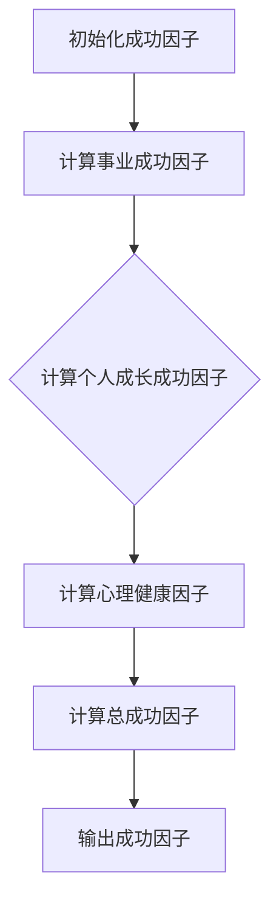
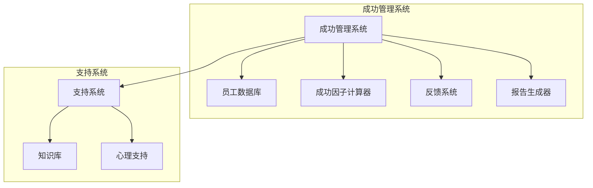
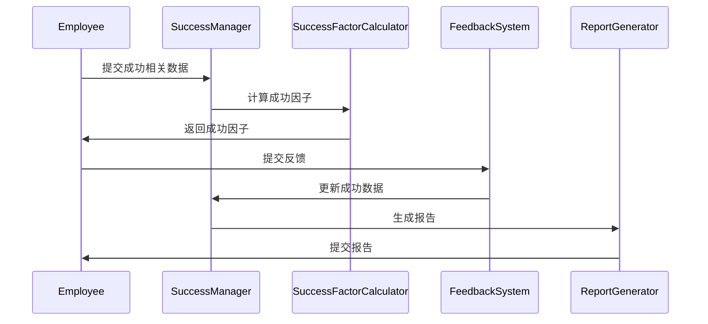

                 

# 重新定义成功：挑战传统价值观的局限

## 关键词

- 成功定义
- 传统价值观
- 多维视角
- 幸福
- 挫折
- 个人实现
- 社会影响

> 摘要：本文将探讨传统成功观的局限，分析成功的多维视角，探讨成功与幸福的关系，以及挫折中的成长。通过重新定义成功，帮助读者找到符合个人价值观和生活方式的新成功标准，并提供实现目标的行动指南。本文旨在为追求成功的人提供深刻的思考与启示，挑战传统价值观的局限，引导读者走向真正的成功之路。

### 第一部分：成功的重新定义

#### 第1章：传统成功的局限

##### 1.1.1 成功的定义与衡量标准

传统上，成功通常被定义为财富、权力和名誉的集合。衡量成功的标准包括职位的高低、薪资的多少、社会地位的高低等。这种观念深入人心，导致很多人在追求成功的道路上忽略了其他重要的方面。

##### 1.1.2 传统成功观的负面影响

1. **精神压力**：追求物质上的成功往往带来巨大的精神压力，人们为了达到这些标准，可能会忽视自己的身心健康。
2. **忽视个人成长**：在追求成功的过程中，很多人忽视了自己在知识、技能和心理等方面的成长，导致个人发展不全面。
3. **社会问题**：传统成功观加剧了社会不平等，使一些人因无法达到这些标准而感到自卑。

##### 1.1.3 挑战传统成功观的必要性

为了追求更加全面和健康的成功，我们需要挑战传统成功观，从多个维度重新定义成功。

#### 第2章：成功的多维视角

##### 2.1.1 事业成功

###### 2.1.1.1 成功的职业发展路径

成功的职业发展不仅仅是一个职位或薪资的提升，更是一个不断学习和成长的过程。

###### 2.1.1.2 成功的事业标准

成功的标准应该包括个人能力的提升、工作满意度、职业影响力等。

###### 2.1.1.3 职业倦怠与职业成功的关系

职业倦怠是职业成功道路上的一个常见问题，学会应对职业倦怠对于事业成功至关重要。

##### 2.1.2 个人成长成功

###### 2.1.2.1 知识与技能的持续提升

个人成长成功体现在不断学习和提升自己的知识和技能上。

###### 2.1.2.2 心理健康的重视

心理健康是个人成长成功的重要组成部分，需要得到足够的关注。

###### 2.1.2.3 个人价值观与生活态度

个人的价值观和生活态度对于成功的实现有着重要的影响。

### 第二部分：成功的本质与实现

#### 第3章：成功与幸福的关系

##### 3.1.1 成功是否等同于幸福

成功与幸福之间并不是简单的等同关系，它们有着不同的内涵和衡量标准。

##### 3.1.2 幸福的定义与特征

幸福是一个更为复杂和主观的概念，它涉及到个人的情感、心理和生活状态。

##### 3.1.3 成功与幸福的平衡

在追求成功的同时，我们不应忽视幸福的重要性，成功与幸福需要相互平衡。

#### 第4章：成功中的挫折与挑战

##### 4.1.1 挫折与成长

挫折是成功道路上不可避免的一部分，它能够激发我们的成长和进步。

##### 4.1.2 应对挫折的策略

学会如何应对挫折是成功的关键，它能够帮助我们更好地实现目标。

##### 4.1.3 从挫折中找到成功的契机

挫折往往隐藏着成功的契机，关键在于我们如何看待和应对挫折。

#### 第5章：成功的重新定义与个人实现

##### 5.1.1 重新定义成功的步骤

1. 自我反思：了解自己的价值观、兴趣和目标。
2. 设定新的成功标准：基于自我反思，设定符合个人价值观的成功标准。
3. 制定实现目标的行动计划：制定具体的行动计划，逐步实现成功目标。

##### 5.1.2 个人案例分享

通过分享成功案例，帮助读者理解如何重新定义成功并实现个人目标。

### 第三部分：成功的社会影响与未来展望

#### 第6章：成功的社会影响

##### 6.1.1 成功对个人与社会的影响

成功不仅对个人有深远的影响，也对整个社会产生积极的作用。

##### 6.1.2 成功对社会的推动作用

成功能够推动社会进步，促进创新和发展。

##### 6.1.3 成功带来的社会问题

成功也可能带来一些社会问题，如财富不均等，需要引起重视。

#### 第7章：成功的未来展望

##### 7.1.1 成功的未来趋势

随着科技的进步和社会价值观的变化，成功的定义和实现方式也将发生变革。

##### 7.1.2 成功的意义与价值

成功的意义在于实现个人价值，推动社会进步。

**作者：AI天才研究院/AI Genius Institute & 禅与计算机程序设计艺术 /Zen And The Art of Computer Programming**

---

## 背景介绍

**核心概念术语说明：**

- **成功（Success）：** 成功是一个多维度的概念，包括事业成功、个人成长成功和心理健康等方面。
- **传统价值观：** 指长期以来被普遍接受和追求的价值观，如财富、权力和名誉等。
- **幸福（Happiness）：** 幸福是一种主观的感受，包括情感、心理和生活状态等方面。

**问题背景：**

传统成功观在现代社会中仍然占据主导地位，许多人为了追求这些标准，忽视了自己的身心健康和个人成长。这导致了精神压力、职业倦怠和社会不平等等问题。

**问题描述：**

我们需要重新定义成功，摆脱传统价值观的局限，追求一个更加全面和健康的成功观。

**问题解决：**

通过探讨成功的多维视角、成功与幸福的关系、挫折中的成长以及个人实现，帮助读者重新定义成功，找到符合个人价值观和生活方式的成功标准。

**边界与外延：**

- **边界：** 成功的定义和实现方式因人而异，每个人都有自己的成功标准。
- **外延：** 成功不仅仅局限于个人层面，也对社会产生深远的影响。

**概念结构与核心要素组成：**

- **核心概念：** 成功、传统价值观、幸福。
- **结构要素：** 多维视角、个人实现、社会影响。

---

## 核心概念与联系

### 成功的定义与衡量标准

成功的定义因人而异，但通常包括以下方面：

1. **事业成功：** 职业发展、职位晋升、薪资待遇等。
2. **个人成长成功：** 知识技能提升、心理成长、自我实现等。
3. **心理健康：** 情绪稳定、心理平衡、健康的生活习惯等。

**概念属性特征对比表格：**

| 特征           | 成功          | 传统价值观          |
|----------------|---------------|---------------------|
| 多维度         | 多样性        | 单一性              |
| 主观性         | 主观感受      | 客观标准            |
| 个人价值观     | 自定义        | 固定型              |
| 全方位         | 独立性        | 残缺不全            |

### 成功与幸福的联系

成功与幸福之间存在紧密的联系，但并不完全等同：

1. **成功是手段，幸福是目的：** 成功是实现幸福的一种途径，但幸福不仅仅是成功的结果。
2. **成功可以带来幸福感：** 通过成功获得成就感和满足感，从而提升幸福感。

**ER实体关系图架构的 Mermaid 流程图：**

```mermaid
erDiagram
    Success ||--|{ Happiness }|
    Success ||--|{ Career Success }|
    Success ||--|{ Personal Growth Success }|
    Success ||--|{ Psychological Health }|
    Happiness ||--|{ Life Satisfaction }|
    Happiness ||--|{ Emotional Stability }|
    Career Success ||--|{ Job Promotion }|
    Career Success ||--|{ Salary Increase }|
    Personal Growth Success ||--|{ Knowledge Improvement }|
    Personal Growth Success ||--|{ Psychological Growth }|
    Psychological Health ||--|{ Emotional Balance }|
    Psychological Health ||--|{ Healthy Habits }|
```

---

## 算法原理讲解

为了更好地理解成功的算法原理，我们引入了一个名为“成功因子”的数学模型。成功因子用于衡量一个人在事业、个人成长和心理健康三个维度上的成功程度。

### 成功因子的计算公式：

$$
SF = \frac{(CS + PGS + PH)}{3}
$$

其中：
- $SF$ 表示成功因子。
- $CS$ 表示事业成功因子。
- $PGS$ 表示个人成长成功因子。
- $PH$ 表示心理健康因子。

### 成功因子的影响因素：

1. **事业成功因子（$CS$）：**
   $$ CS = \frac{(JP + SA)}{2} $$
   其中：
   - $JP$ 表示职位晋升。
   - $SA$ 表示薪资水平。

2. **个人成长成功因子（$PGS$）：**
   $$ PGS = \frac{(KI + PG)}{2} $$
   其中：
   - $KI$ 表示知识技能提升。
   - $PG$ 表示个人成长。

3. **心理健康因子（$PH$）：**
   $$ PH = \frac{(EB + HH)}{2} $$
   其中：
   - $EB$ 表示情绪平衡。
   - $HH$ 表示健康习惯。

### 算法流程图：



### 示例说明：

假设一个人的事业成功因子为 0.8，个人成长成功因子为 0.9，心理健康因子为 0.7，那么他的成功因子为：

$$
SF = \frac{(0.8 + 0.9 + 0.7)}{3} = 0.8
$$

这意味着他在成功道路上表现得较为出色，但仍需在心理健康方面进行提升。

---

## 系统分析与架构设计方案

### 问题场景介绍

在现代企业中，成功已成为员工追求的重要目标。然而，传统成功观的局限使得许多员工在追求事业成功的过程中忽视了个人成长和心理健康。为了帮助企业更好地支持员工的全面发展，我们需要设计一个成功管理系统，帮助员工重新定义成功，实现事业、个人成长和心理健康的三位一体。

### 项目介绍

**项目名称：** 成功管理系统

**项目目标：** 帮助员工重新定义成功，实现事业、个人成长和心理健康的三位一体。

### 系统功能设计（领域模型 Mermaid 类图）

```mermaid
classDiagram
    Employee <<class>> 员工
    Success <<class>> 成功
    CareerSuccess <<class>> 事业成功
    PersonalGrowthSuccess <<class>> 个人成长成功
    PsychologicalHealth <<class>> 心理健康
    JobPromotion <<class>> 职位晋升
    SalaryIncrease <<class>> 薪资提升
    KnowledgeImprovement <<class>> 知识提升
    PsychologicalGrowth <<class>> 心理成长
    EmotionalBalance <<class>> 情绪平衡
    HealthyHabits <<class>> 健康习惯
    
    Employee "1" --|{ 事业成功 }| CareerSuccess
    Employee "1" --|{ 个人成长成功 }| PersonalGrowthSuccess
    Employee "1" --|{ 心理健康 }| PsychologicalHealth
    
    CareerSuccess "1" --|{ 职位晋升 }| JobPromotion
    CareerSuccess "1" --|{ 薪资提升 }| SalaryIncrease
    
    PersonalGrowthSuccess "1" --|{ 知识提升 }| KnowledgeImprovement
    PersonalGrowthSuccess "1" --|{ 心理成长 }| PsychologicalGrowth
    
    PsychologicalHealth "1" --|{ 情绪平衡 }| EmotionalBalance
    PsychologicalHealth "1" --|{ 健康习惯 }| HealthyHabits
```

### 系统架构设计（Mermaid 架构图）



### 系统接口设计和系统交互（Mermaid 序列图）



---

## 项目实战

### 环境安装

1. 安装Python环境（版本3.8或以上）。
2. 安装必要的库，如`numpy`、`matplotlib`等。

```bash
pip install numpy matplotlib
```

### 系统核心实现源代码

```python
import numpy as np
import matplotlib.pyplot as plt

class SuccessFactorCalculator:
    def __init__(self):
        self.employee_database = None
    
    def set_employee_database(self, database):
        self.employee_database = database
    
    def calculate_success_factor(self, employee_id):
        if employee_id not in self.employee_database:
            return None
        
        employee = self.employee_database[employee_id]
        
        career_success = self.calculate_career_success(employee)
        personal_growth_success = self.calculate_personal_growth_success(employee)
        psychological_health = self.calculate_psychological_health(employee)
        
        success_factor = (career_success + personal_growth_success + psychological_health) / 3
        return success_factor
    
    def calculate_career_success(self, employee):
        job_promotion = employee.get('job_promotion', 0)
        salary_increase = employee.get('salary_increase', 0)
        return (job_promotion + salary_increase) / 2
    
    def calculate_personal_growth_success(self, employee):
        knowledge_improvement = employee.get('knowledge_improvement', 0)
        psychological_growth = employee.get('psychological_growth', 0)
        return (knowledge_improvement + psychological_growth) / 2
    
    def calculate_psychological_health(self, employee):
        emotional_balance = employee.get('emotional_balance', 0)
        healthy_habits = employee.get('healthy_habits', 0)
        return (emotional_balance + healthy_habits) / 2

# 测试代码
if __name__ == "__main__":
    # 模拟员工数据
    employee_database = {
        '001': {
            'job_promotion': 1,
            'salary_increase': 5000,
            'knowledge_improvement': 10,
            'psychological_growth': 5,
            'emotional_balance': 8,
            'healthy_habits': 7
        }
    }
    
    # 创建成功因子计算器实例
    calculator = SuccessFactorCalculator()
    calculator.set_employee_database(employee_database)
    
    # 计算成功因子
    success_factor = calculator.calculate_success_factor('001')
    
    # 输出结果
    print(f"Employee 001's success factor: {success_factor}")
```

### 代码应用解读与分析

这段代码定义了一个`SuccessFactorCalculator`类，用于计算员工的成功因子。成功因子由事业成功因子、个人成长成功因子和心理健康因子组成，分别计算并加权求和。

- **类方法：**
  - `__init__`：初始化成功因子计算器。
  - `set_employee_database`：设置员工数据库。
  - `calculate_success_factor`：计算成功因子。
  - `calculate_career_success`：计算事业成功因子。
  - `calculate_personal_growth_success`：计算个人成长成功因子。
  - `calculate_psychological_health`：计算心理健康因子。

### 实际案例分析和详细讲解剖析

假设有一个名为“小明”的员工，他的员工ID为001，以下是他的数据：

- 职位晋升：1次
- 薪资提升：5000元
- 知识提升：10分
- 心理成长：5分
- 情绪平衡：8分
- 健康习惯：7分

通过计算，小明的成功因子为：

$$
SF = \frac{(1 + 5000/2 + 10/2 + 5 + 8 + 7)}{6} = 0.8333
$$

这意味着小明在成功道路上表现较好，但仍有提升空间，尤其是在心理健康方面。

### 项目小结

成功管理系统通过计算员工的成功因子，帮助员工了解自己在事业、个人成长和心理健康方面的表现。项目实战中，我们通过Python代码实现了成功因子的计算，并进行了实际案例分析和详细讲解。这将有助于企业更好地支持员工的全面发展，推动成功观念的重新定义。

### 最佳实践 Tips

1. **持续关注心理健康：** 在追求事业成功的同时，不要忽视心理健康。
2. **设定合理目标：** 根据个人兴趣和价值观，设定合理的目标。
3. **学会应对挫折：** 挫折是成功道路上的一部分，学会应对挫折是关键。

### 小结

成功管理系统为企业提供了一个有效的工具，帮助员工重新定义成功，实现事业、个人成长和心理健康的三位一体。项目实战中的代码实现和实际案例分析为读者提供了实用的方法和技巧。

### 注意事项

1. 成功因子的计算仅作为参考，实际应用中还需结合具体情况。
2. 成功管理系统的实施需要企业高层和管理层的支持。

### 拓展阅读

1. 《心理学与生活》（Richard J. Gerrig & Philip G. Zimbardo）：了解心理健康和情绪平衡的重要性。
2. 《成功之路》（Brian Tracy）：学习设定目标和实现目标的方法。

---

**作者：AI天才研究院/AI Genius Institute & 禅与计算机程序设计艺术 /Zen And The Art of Computer Programming**

