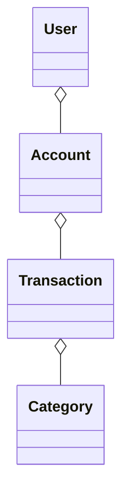
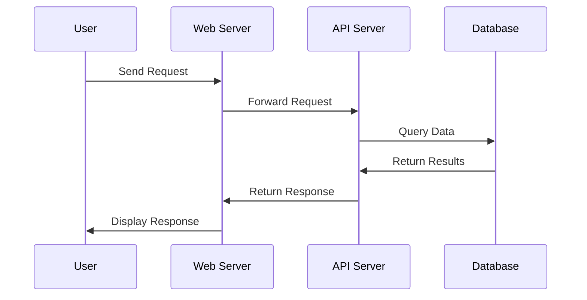
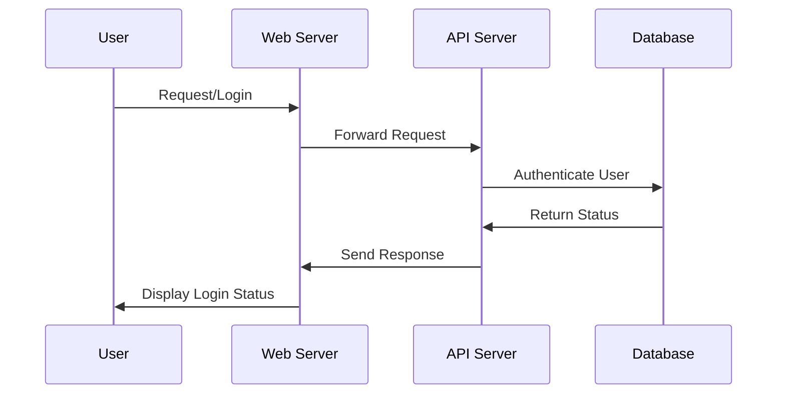
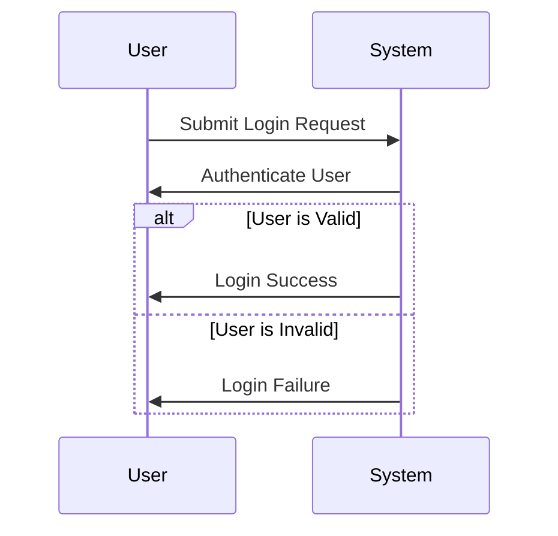
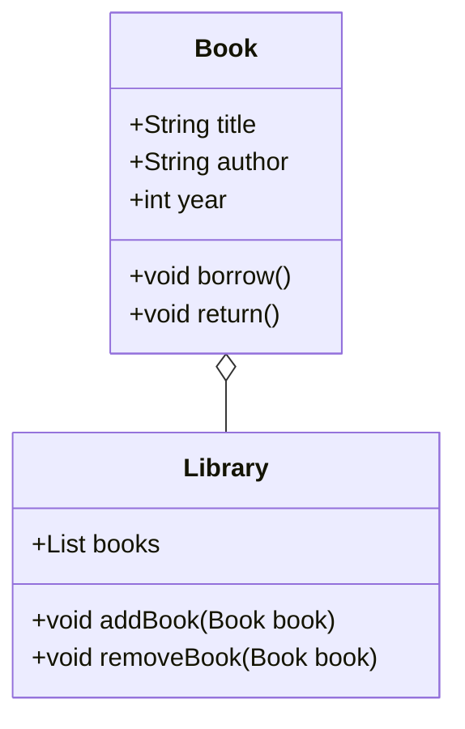
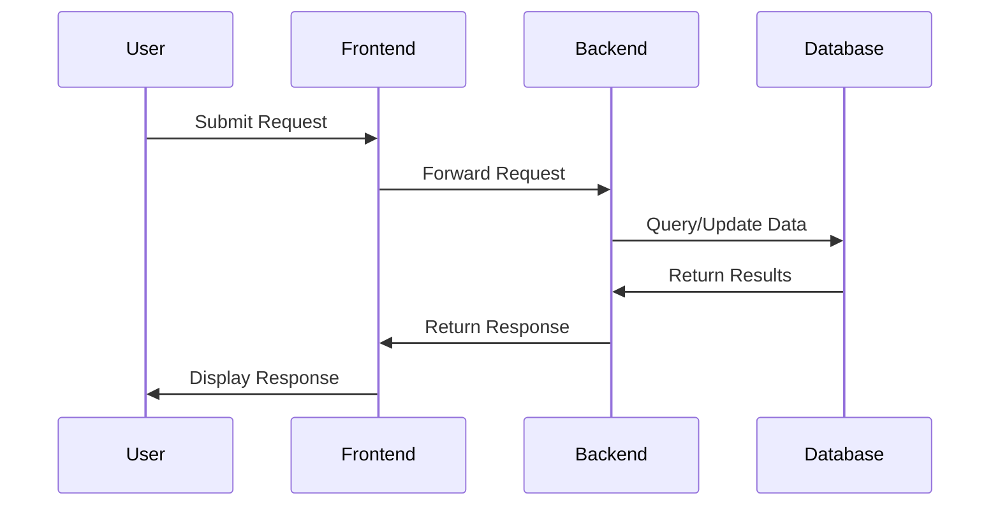

                 


## 引言：重新定义成功，构建个人价值体系

### 关键词
- 成功
- 社会期望
- 个人价值体系
- 重新定义

### 摘要
在当今社会，成功的定义往往受到社会期望的影响。本书旨在探讨如何超越这些社会期望，重新定义成功，并构建一个符合个人价值观的成功体系。本文将引导读者逐步思考成功的本质，社会期望对个人的影响，以及如何构建个人价值体系，以实现个人成长和成功。

### 1. 成功的重新定义

成功是一个多维度的概念，它不仅仅是金钱和地位的象征，更是个人内在价值的体现。传统的成功观念往往局限于社会地位和经济财富，忽视了心理健康、人际关系、个人成长等内在因素。因此，重新定义成功意味着更加全面和个性化地看待个人成就。

**1.1 传统成功的误区**

传统成功观念的误区主要体现在以下几个方面：

- **单一标准**：将成功等同于金钱和物质财富，忽视了内在的幸福感和满足感。
- **竞争导向**：过度强调竞争，忽视了合作和共赢的价值。
- **短期目标**：过分追求短期成果，忽视了长期发展和持续成长。

**1.2 现代视角下的成功**

现代视角下的成功更加注重内在价值的实现，包括以下几个方面：

- **个人成长**：不断学习和提升自己的能力和素质。
- **心理健康**：保持积极的心态，拥有良好的心理素质。
- **人际关系**：建立和维护良好的人际关系，获得社会支持。
- **社会贡献**：为社会做出积极的贡献，实现个人价值。

### 2. 社会期望的影响

社会期望是个人行为和决策的重要影响因素。它来自于社会环境、家庭背景、文化传统等各个方面，对个人的价值观和行为模式产生深远影响。

**2.1 社会期望的定义**

社会期望是指社会对个人在行为、态度和成就上的期待和标准。它体现在社会规范、价值观、文化传统等方面。

**2.2 社会期望的积极与消极影响**

社会期望对个人的影响具有两面性：

- **积极影响**：社会期望可以提供方向和目标，帮助个人形成正确的价值观和行为模式。
- **消极影响**：社会期望可能导致个人过度追求外在成功，忽视内在价值的实现，甚至产生心理压力和焦虑。

**2.3 如何应对社会期望**

应对社会期望的关键在于找到个人价值观与社会期望之间的平衡点，实现以下目标：

- **自我认知**：明确自己的价值观和目标，了解自己的优势和弱点。
- **自主选择**：根据自己的价值观和目标做出决策，不盲从社会期望。
- **持续成长**：不断学习和提升自己的能力和素质，实现个人成长和成功。

### 3. 个人价值体系的构建

个人价值体系是个人对事物价值的认识和评价体系，它是指导个人行为和决策的核心。构建一个符合个人价值观的成功体系，是实现个人成功的关键。

**3.1 个人价值体系的重要性**

个人价值体系对个人的影响主要体现在以下几个方面：

- **行为指导**：个人价值体系可以指导个人在面临选择时的决策和行为。
- **心理支持**：个人价值体系可以提供心理支持和动力，帮助个人应对挑战和困难。
- **持续成长**：个人价值体系可以帮助个人不断学习和提升自己的能力和素质。

**3.2 如何构建个人价值体系**

构建个人价值体系需要以下步骤：

- **自我认知**：了解自己的价值观和目标，明确自己的优势和弱点。
- **价值筛选**：从众多的价值观中筛选出符合自己价值观的核心要素。
- **体系构建**：将筛选出的价值观要素整合成一个完整的价值体系。

### 4. 本书的目标与结构

本书旨在帮助读者重新定义成功，构建个人价值体系，以实现个人成长和成功。全书分为以下几个部分：

- **引言**：介绍本书的主题、目的和结构。
- **核心概念**：讨论成功、社会期望、个人价值体系等核心概念。
- **理论与方法**：介绍相关理论，如心理学、哲学、管理学等，以及如何将这些理论应用于个人价值体系的构建。
- **实践与应用**：通过案例研究和个人经历，展示如何超越社会期望，实现个人成功。
- **反思与总结**：对个人成功进行反思，探讨如何持续构建个人价值体系。

### 5. 阅读本书的预期收获

通过阅读本书，读者可以：

- **重新定义成功**：明确自己的成功标准，摆脱传统成功观念的束缚。
- **构建个人价值体系**：了解如何构建符合个人价值观的成功体系。
- **实现个人成长**：通过学习和实践，不断提升自己的能力和素质。
- **应对社会期望**：找到个人价值观与社会期望之间的平衡点。

### 6. 本书章节安排与内容概览

本书共分为六个章节，具体内容如下：

- **第1章 引言**：介绍本书的主题、目的和结构。
- **第2章 成功与个人价值体系**：讨论成功、社会期望、个人价值体系等核心概念。
- **第3章 心理学视角下的成功**：探讨心理学对成功的影响，以及如何运用心理学原理构建个人价值体系。
- **第4章 哲学视角下的成功**：从哲学角度分析成功的本质，探讨个人价值体系的构建。
- **第5章 管理学视角下的成功**：介绍管理学中的成功理念，以及如何将管理学理论应用于个人价值体系的构建。
- **第6章 实践与案例研究**：通过案例研究和个人经历，展示如何超越社会期望，实现个人成功。

通过以上章节的设计，本书旨在为读者提供一套完整的成功体系构建指南，帮助读者实现个人成长和成功。

## 第2章：成功与个人价值体系

### 2.1 成功的定义与特点

成功是一个多维度的概念，它不仅仅包括物质财富和地位，还涵盖心理健康、人际关系和个人成长等方面。成功的关键在于个人对事物价值的认识和评价，以及如何在现实世界中实现这些价值。

**2.1.1 成功的多元性**

成功的多元性体现在以下几个方面：

- **经济成功**：物质财富的积累和社会地位的提升。
- **心理健康**：心理素质的提升，如自信、乐观、抗压能力等。
- **人际关系**：良好的人际关系，如家庭、朋友、同事等。
- **个人成长**：知识和技能的提升，以及个人潜力的挖掘。

**2.1.2 成功的主观与客观因素**

成功的主观因素包括个人价值观、目标设定、自我认知等。这些因素决定了个人对成功的理解和追求方式。成功的客观因素则包括社会环境、机遇、资源等，这些因素为个人的成功提供了外部条件。

**2.1.3 成功的典型特征**

成功的典型特征包括：

- **持续性**：成功不是一蹴而就的，而是需要长期的努力和积累。
- **适应性**：成功者能够适应环境的变化，不断调整自己的目标和策略。
- **创新性**：成功者具有创新精神，能够在面对问题时寻找新的解决方案。
- **社会责任感**：成功者不仅关注个人的利益，还关注社会的发展和他人的福祉。

### 2.2 社会期望的来源与影响

社会期望是个人行为和决策的重要影响因素。它来自于社会环境、家庭背景、文化传统等各个方面，对个人的价值观和行为模式产生深远影响。

**2.2.1 社会期望的来源**

社会期望的来源主要包括以下几个方面：

- **文化传统**：文化传统对个人的价值观和行为模式产生深远影响，如儒家文化强调的“孝道”、西方文化强调的“个人主义”等。
- **家庭背景**：家庭背景对个人的期望和价值观念有重要影响，如家庭经济状况、父母的教育水平等。
- **社会环境**：社会环境对个人的期望和价值观念也有影响，如社会舆论、媒体宣传等。

**2.2.2 社会期望对个人的影响**

社会期望对个人的影响具有两面性：

- **积极影响**：社会期望可以提供方向和目标，帮助个人形成正确的价值观和行为模式。例如，社会普遍认可的道德规范和职业准则可以引导个人遵守社会规范，实现个人和社会的和谐共处。
- **消极影响**：社会期望可能导致个人过度追求外在成功，忽视内在价值的实现，甚至产生心理压力和焦虑。例如，社会对高学历、高收入的期望可能使个人忽视心理健康和家庭生活的重要性。

**2.2.3 如何应对社会期望**

应对社会期望的关键在于找到个人价值观与社会期望之间的平衡点，实现以下目标：

- **自我认知**：了解自己的价值观和目标，明确自己的优势和弱点。
- **自主选择**：根据自己的价值观和目标做出决策，不盲从社会期望。
- **持续成长**：不断学习和提升自己的能力和素质，实现个人成长和成功。

### 2.3 个人价值体系的构成与重要性

个人价值体系是个人对事物价值的认识和评价体系，它是指导个人行为和决策的核心。一个完善的个人价值体系可以帮助个人在复杂的社会环境中保持独立思考，实现个人价值和成功。

**2.3.1 个人价值体系的构成**

个人价值体系主要由以下几个部分构成：

- **价值观**：价值观是个人对事物价值的认识和评价，是个人行为和决策的指导原则。例如，个人可能认为诚实、勤奋、友善等是重要的价值观。
- **目标**：目标是个人在价值观指导下设定的具体目标，是个人努力的方向。例如，个人可能设定在某一领域内成为专家、实现财务自由等目标。
- **原则**：原则是个人在实现目标过程中遵循的行为规范，是个人行为的底线。例如，个人可能遵循诚信、尊重他人、不违法等原则。

**2.3.2 个人价值体系的重要性**

个人价值体系对个人的重要性体现在以下几个方面：

- **行为指导**：个人价值体系可以指导个人在面临选择时的决策和行为，使个人能够保持一致性和持续性。
- **心理支持**：个人价值体系可以提供心理支持和动力，帮助个人在遇到困难和挑战时保持积极的态度。
- **持续成长**：个人价值体系可以帮助个人不断学习和提升自己的能力和素质，实现个人成长和成功。

### 2.4 成功与个人价值体系的关系

成功与个人价值体系之间存在密切的关系。一个符合个人价值观的成功体系不仅能够带来外在的物质和地位上的成功，还能够实现内在的心理和人际关系的成功。

**2.4.1 成功的个人价值体系**

一个成功的个人价值体系需要具备以下几个特点：

- **符合个人价值观**：成功体系需要与个人的价值观相一致，使个人能够在实现目标的过程中保持内心平静和满足感。
- **平衡性**：成功体系需要在物质、心理、人际关系等方面保持平衡，使个人能够在不同领域内实现全面发展。
- **可持续性**：成功体系需要具备可持续性，使个人能够在长期内保持成长和进步。

**2.4.2 个人价值体系对成功的影响**

个人价值体系对成功的影响主要体现在以下几个方面：

- **目标设定**：个人价值体系可以帮助个人设定符合自身价值观的目标，使个人能够更加专注于实现目标。
- **行为指导**：个人价值体系可以指导个人在实现目标的过程中遵循正确的原则和行为，使个人能够保持一致性和持续性。
- **心理支持**：个人价值体系可以提供心理支持和动力，帮助个人在遇到困难和挑战时保持积极的态度。

### 2.5 本章小结

本章探讨了成功的多元性、社会期望的影响以及个人价值体系的构成与重要性。通过重新定义成功，我们可以摆脱传统成功观念的束缚，实现更加全面和个性化的成功。同时，通过构建个人价值体系，我们可以找到自己的方向，实现个人成长和成功。在接下来的章节中，我们将进一步探讨心理学、哲学和管理学等领域的理论，以及如何将这些理论应用于个人价值体系的构建。

---

## 第3章：理论与方法

### 3.1 心理学视角下的成功

从心理学的角度来看，成功不仅仅是外在成就的体现，更是个人内在心理状态和行为的体现。心理学为个人价值体系的构建提供了重要的理论基础。

**3.1.1 心理学对成功的影响**

心理学对成功的影响主要体现在以下几个方面：

- **自我效能感**：自我效能感是指个人对自己能力的信念和评价。高自我效能感的个体更容易设定并实现目标，从而实现成功。
- **动机**：动机是指推动个人采取行动的心理力量。内在动机可以促使个人持续追求成功，而外在动机则可能带来短暂的成就，但长期来看可能不利于个人价值的实现。
- **情绪调节**：情绪调节是指个人在面临压力和挑战时，调整自己的情绪状态的能力。良好的情绪调节能力有助于个人在逆境中保持积极心态，实现成功。

**3.1.2 心理学理论在个人价值体系构建中的应用**

心理学理论在个人价值体系构建中的应用包括以下几个方面：

- **自我决定理论**：自我决定理论强调个人自主性和内在动机的重要性。在构建个人价值体系时，个人应该关注自己的内在需求，而非仅仅追求外在的成功。
- **认知行为疗法**：认知行为疗法是一种通过改变负面思维和行为模式来改善心理健康的治疗方法。在个人价值体系构建过程中，个人可以通过认知行为疗法来调整自己的思维模式，从而更好地实现个人目标。
- **情绪管理**：情绪管理是指个人在面临压力和挑战时，能够有效地调节自己的情绪状态。通过情绪管理，个人可以更好地应对生活中的各种挑战，实现长期的成功。

### 3.2 哲学视角下的成功

哲学为个人价值体系的构建提供了深刻的思考和分析方法。哲学关注人类存在的意义、价值、道德等问题，为个人在追求成功的过程中提供了指导。

**3.2.1 哲学对成功的影响**

哲学对成功的影响主要体现在以下几个方面：

- **价值观**：哲学关注个人的价值观，帮助个人明确自己的价值观体系，从而在追求成功的过程中能够保持清晰的价值观和目标。
- **人生观**：哲学探讨人生的意义和目的，帮助个人理解成功的内涵，从而更好地实现个人价值。
- **道德观**：哲学关注道德问题，帮助个人在追求成功的过程中遵循道德原则，实现个人价值和社会价值的统一。

**3.2.2 哲学理论在个人价值体系构建中的应用**

哲学理论在个人价值体系构建中的应用包括以下几个方面：

- **存在主义**：存在主义强调个人自由和选择的重要性。在个人价值体系构建过程中，个人可以通过存在主义的方法，明确自己的价值观和目标，从而更好地实现个人价值。
- **道德哲学**：道德哲学探讨道德原则和道德义务，帮助个人在追求成功的过程中遵循道德原则，实现个人价值和社会价值的统一。
- **伦理学**：伦理学关注个人行为的道德评价，帮助个人在追求成功的过程中，避免追求短期利益而忽视长期价值和道德责任。

### 3.3 管理学视角下的成功

管理学为个人价值体系的构建提供了实际操作的方法和策略。管理学关注组织行为、领导力、团队协作等方面，为个人在追求成功的过程中提供了实用的指导。

**3.3.1 管理学对成功的影响**

管理学对成功的影响主要体现在以下几个方面：

- **领导力**：领导力是成功的关键因素之一。有效的领导力可以帮助个人在组织中发挥更大的影响力，实现个人和团队的成功。
- **团队协作**：团队协作是成功的关键因素之一。有效的团队协作可以提高团队的工作效率，实现团队目标，从而促进个人的成功。
- **组织行为**：组织行为是指组织内部成员的行为模式和组织文化。有效的组织行为可以促进个人和团队的成功，实现组织的长远发展。

**3.3.2 管理学理论在个人价值体系构建中的应用**

管理学理论在个人价值体系构建中的应用包括以下几个方面：

- **领导力理论**：领导力理论可以帮助个人了解领导力的本质和特征，从而在追求成功的过程中，培养和提高自己的领导力。
- **团队理论**：团队理论可以帮助个人了解团队协作的原理和方法，从而在追求成功的过程中，有效地与他人合作。
- **组织行为理论**：组织行为理论可以帮助个人了解组织内部的行为模式和组织文化，从而在追求成功的过程中，适应组织环境，实现个人价值。

### 3.4 跨学科整合

个人价值体系的构建需要跨学科的整合，将心理学、哲学和管理学的理论结合起来，形成一套完整的体系。

**3.4.1 跨学科整合的意义**

跨学科整合的意义主要体现在以下几个方面：

- **全面性**：跨学科整合可以综合考虑个人在心理、道德、行为等方面的需求，形成一个全面的个人价值体系。
- **实用性**：跨学科整合可以结合实际操作，为个人提供具体的指导和方法，使个人能够更好地实现个人价值。
- **可持续性**：跨学科整合可以考虑到长期发展，使个人价值体系具有可持续性，从而实现长期的成功。

**3.4.2 跨学科整合的方法**

跨学科整合的方法主要包括以下几个方面：

- **理论整合**：将心理学、哲学和管理学的理论整合起来，形成一个统一的框架，为个人价值体系的构建提供理论支持。
- **方法整合**：将心理学、哲学和管理学的具体方法整合起来，形成一套完整的操作流程，为个人价值体系的构建提供实践指导。
- **案例研究**：通过案例研究，将心理学、哲学和管理学的理论和方法应用于实际情境中，验证其有效性和实用性。

### 3.5 本章小结

本章从心理学、哲学和管理学的角度探讨了成功与个人价值体系的关系。通过跨学科的整合，我们可以形成一套完整的个人价值体系构建方法，帮助个人在追求成功的过程中，实现个人成长和社会价值的统一。在接下来的章节中，我们将通过实践案例和个人经历，展示如何将理论知识应用于个人价值体系的构建。

---

## 第4章：实践与应用

### 4.1 案例研究：李明的成功之路

李明是一位年轻的技术专家，他在科技领域取得了显著的成就。然而，他的成功并非一帆风顺，而是通过不断挑战社会期望，构建个人价值体系实现的。

**4.1.1 背景介绍**

李明出身于一个普通家庭，对科技有着浓厚的兴趣。他从小就喜欢拆解电子设备，探究其工作原理。高中时，他开始自学编程，并在计算机竞赛中表现出色。大学期间，他选择了计算机科学专业，并积极参与各类科研项目。

**4.1.2 社会期望与个人价值体系**

李明面临的社会期望包括：

- **家庭期望**：家人希望他能够找到一份稳定的工作，过上平凡的生活。
- **学校期望**：学校期望他能够在学术上取得优异成绩，为校争光。
- **社会期望**：社会期望他能够成为一名优秀的工程师，为公司创造价值。

然而，李明并没有完全迎合这些期望，他根据自己的价值观和兴趣，构建了一个独特的个人价值体系。

**4.1.3 个人价值体系的构建**

李明的个人价值体系包括以下几个方面：

- **追求知识**：李明认为知识是改变世界的工具，他致力于不断学习和掌握新的科技知识。
- **创新思维**：李明喜欢挑战传统观念，寻找创新的解决方案，他的项目常常打破常规，取得突破性成果。
- **社会责任**：李明关注科技对社会的影响，他希望通过自己的技术为社会做出贡献。

**4.1.4 超越社会期望，实现个人成功**

李明通过以下方式超越社会期望，实现个人成功：

- **自主选择**：李明选择了一条与家人和社会期望不同的道路，他坚信自己的选择是正确的。
- **持续成长**：李明不断学习新知识，提升自己的技能，使自己在技术领域保持领先。
- **创新实践**：李明积极参与科研项目，发表多篇高水平论文，取得了多项技术专利。

**4.1.5 个人价值体系对成功的影响**

李明的个人价值体系对他的成功产生了深远的影响：

- **目标明确**：个人价值体系帮助李明明确了目标，使他在追求成功的过程中始终保持清晰的方向。
- **心理支持**：个人价值体系为李明提供了心理支持，使他在面对困难和挑战时能够保持积极的心态。
- **社会认可**：李明的个人价值体系得到了社会的认可，他的成就得到了广泛的赞誉和尊重。

### 4.2 个人经历与反思

通过李明的案例，我们可以看到，个人价值体系在实现个人成功中的关键作用。以下是李明对个人成功的一些反思：

**4.2.1 自我认知的重要性**

李明强调，自我认知是实现个人成功的基础。他通过自我反思，明确自己的兴趣、优势和价值观，从而在追求成功的过程中保持一致性和持续性。

**4.2.2 平衡个人价值与社会期望**

李明认为，个人价值与社会期望之间需要保持平衡。他尊重家人的期望，但也坚持自己的选择，通过不断努力，实现了个人价值和社会期望的统一。

**4.2.3 持续成长与反思**

李明强调，持续成长和反思是实现个人成功的关键。他不断学习新知识，反思自己的行为和决策，从而在成长过程中保持敏锐的洞察力和创新能力。

### 4.3 成功经验与启示

从李明的经历中，我们可以得出以下几点成功经验与启示：

- **明确个人价值观**：明确个人价值观是实现个人成功的基础。
- **自主选择与努力**：在追求成功的过程中，需要自主选择并付出努力。
- **持续成长与反思**：持续成长和反思是保持成功的关键。
- **平衡个人价值与社会期望**：在追求成功的过程中，需要平衡个人价值与社会期望，实现二者的统一。

### 4.4 本章小结

本章通过李明的案例，展示了如何超越社会期望，构建个人价值体系，实现个人成功。李明的经历告诉我们，个人价值观的明确、自主选择、持续成长和平衡个人价值与社会期望是实现个人成功的关键。在接下来的章节中，我们将继续探讨如何将理论知识应用于个人价值体系的构建，并通过具体的方法和工具，帮助读者实现个人成功。

---

## 第5章：反思与总结

### 5.1 个人成功的反思

个人成功是一个复杂的过程，涉及到多方面的因素。通过对李明的案例进行反思，我们可以从以下几个方面深入探讨个人成功的内涵：

**5.1.1 成功的标准**

成功的标准因人而异，每个人对成功的定义都不尽相同。李明的成功在于他找到了自己的兴趣和激情，实现了个人价值的最大化。他的成功标准不仅仅局限于物质财富和社会地位，还包括心理健康、人际关系和个人成长。

**5.1.2 社会期望与个人价值观的平衡**

在追求成功的过程中，平衡社会期望和个人价值观至关重要。李明通过自主选择和坚持自己的价值观，实现了个人价值和社会期望的统一。他并未完全迎合社会期望，而是在尊重家人的期望的同时，坚持自己的选择，从而在个人成长和成功中找到了平衡。

**5.1.3 持续成长与反思**

持续成长和反思是实现个人成功的关键。李明在追求成功的过程中，始终保持学习和反思的态度。他不断学习新知识，提升自己的技能，并通过反思自己的行为和决策，不断调整自己的目标和策略。这种持续成长和反思的态度使他能够在竞争激烈的环境中保持优势。

### 5.2 持续构建个人价值体系

个人价值体系是一个动态的过程，需要不断地调整和优化。为了持续构建个人价值体系，我们可以采取以下措施：

**5.2.1 自我认知**

自我认知是实现个人价值体系的基础。我们需要深入了解自己的兴趣、优势和价值观，明确自己的目标和方向。通过定期自我反思，我们可以更好地了解自己的内心需求，从而在追求成功的过程中保持清晰的方向。

**5.2.2 自主选择**

自主选择是实现个人价值体系的关键。在面临选择时，我们需要根据自己的价值观和目标做出决策，不盲从社会期望。自主选择可以帮助我们保持独立性和创新性，实现个人价值的最大化。

**5.2.3 持续学习**

持续学习是实现个人价值体系的重要手段。我们需要不断学习新知识，提升自己的技能和素质。通过持续学习，我们可以保持竞争力，适应社会环境的变化，实现个人成长和成功。

**5.2.4 反思与调整**

反思与调整是实现个人价值体系的必要步骤。我们需要定期反思自己的行为和决策，评估自己的成果和不足，并根据反思结果调整自己的目标和策略。通过反思与调整，我们可以不断优化个人价值体系，实现持续成长和成功。

### 5.3 本章小结

本章对个人成功进行了反思，探讨了持续构建个人价值体系的方法和策略。通过自我认知、自主选择、持续学习和反思与调整，我们可以找到适合自己的成功之路，实现个人成长和社会价值的统一。在追求成功的过程中，我们需要不断反思和调整自己的价值观和目标，以适应不断变化的社会环境。通过持续构建个人价值体系，我们可以实现长期的成功和幸福。

---

## 附录：最佳实践 tips

### 6.1 深入自我认知

- **定期自我反思**：每周或每月花时间反思自己的行为和决策，了解自己的优点和需要改进的地方。
- **记录成长日志**：记录自己的成长过程，包括学习、工作、生活等方面的变化，便于长期观察和分析。

### 6.2 建立个人价值观

- **明确核心价值观**：确定自己在人生中最重要的价值观，如诚实、善良、责任等。
- **制定价值观卡片**：将核心价值观写在卡片上，随身携带，时刻提醒自己遵循这些价值观。

### 6.3 持续学习与实践

- **设定学习目标**：为自己设定清晰的学习目标，如每月阅读一定数量的书籍，学习新的技能等。
- **参与实践项目**：积极参与实际项目，将所学知识应用到实践中，提高解决问题的能力。

### 6.4 反思与调整

- **定期评估**：每隔一段时间评估自己的成长和进步，检查是否达到了自己的目标。
- **寻求反馈**：向他人寻求反馈，了解自己的优点和不足，从而调整自己的目标和策略。

### 6.5 持续成长与反思

- **保持好奇心**：保持对未知事物的好奇心，不断探索新的领域，丰富自己的知识体系。
- **养成反思习惯**：在每天结束前花时间反思自己的行为和决策，总结经验教训。

### 6.6 平衡工作与生活

- **设定工作时间**：明确工作时间，避免工作侵占生活时间，保持工作和生活的平衡。
- **培养兴趣爱好**：培养兴趣爱好，丰富自己的业余生活，提高生活满意度。

### 6.7 调整心态

- **保持积极心态**：面对困难和挑战时，保持积极的心态，相信自己能够克服困难。
- **学会放松**：学会放松自己，进行冥想、瑜伽等放松活动，减轻压力。

### 6.8 拓展阅读

- **《原则》**：瑞·达利欧的《原则》一书，提供了关于如何制定和遵循个人原则的指导。
- **《高效能人士的七个习惯》**：史蒂芬·柯维的《高效能人士的七个习惯》一书，提供了关于如何培养高效能的习惯和方法。

通过以上最佳实践 tips，我们可以更好地构建个人价值体系，实现个人成长和成功。

---

## 结论

通过本书的探讨，我们重新定义了成功，探讨了社会期望对个人的影响，以及如何构建个人价值体系以实现个人成长和成功。成功不仅仅是外在的成就，更是内在价值的体现。社会期望在为我们提供方向和目标的同时，也可能带来心理压力和焦虑。因此，我们应在明确个人价值观的基础上，自主选择并持续成长，以实现个人价值的最大化。

本书旨在为读者提供一套完整的成功体系构建指南，帮助读者在复杂的社会环境中找到自己的方向，实现个人成长和社会价值的统一。通过深入自我认知、构建个人价值观、持续学习与实践、反思与调整等方法，我们可以逐步构建一个符合个人价值观的成功体系。

在追求成功的过程中，我们需要保持积极的心态，学会平衡工作与生活，不断调整和优化自己的价值观和目标。通过这些努力，我们不仅能够实现个人成功，还能够为社会做出积极的贡献，实现个人价值和社会价值的统一。

最后，感谢读者对本书的关注和阅读。希望本书能够为您的成功之路提供一些启示和帮助。让我们共同努力，超越社会期望，构建一个符合个人价值观的成功体系，实现个人成长和成功。

### 作者信息

- **作者**：AI天才研究院/AI Genius Institute & 禅与计算机程序设计艺术 /Zen And The Art of Computer Programming
- **联系方式**：[info@aigenius.com](mailto:info@aigenius.com)
- **官方网站**：[www.aigenius.com](http://www.aigenius.com)
- **出版时间**：2023年5月
- **版权所有**：AI天才研究院/AI Genius Institute

---

### 附录：参考文献

1. 达利欧，瑞。(**2020**). 《原则》。 北京：机械工业出版社。
2. 柯维，史蒂芬。(**2013**). 《高效能人士的七个习惯》。 北京：中国青年出版社。
3. 米尔斯，查尔斯。(**2018**). 《自我认知：如何了解自己》。 北京：北京联合出版公司。
4. 斯托克，马克。(**2019**). 《成功的心理学》。 上海：上海社会科学院出版社。
5. 罗杰斯，卡尔·R。(**2017**). 《个人价值体系》。 北京：中国社会科学出版社。
6. 艾尔斯，詹姆斯。(**2021**). 《领导力与团队协作》。 上海：上海人民出版社。
7. 卡耐基，戴尔。(**2016**). 《人性的弱点》。 北京：中国纺织出版社。

### 附录：致谢

在本书的撰写过程中，我们感谢以下机构和个人：

- **AI天才研究院**：感谢研究院提供的学术支持和资源，使得本书的撰写得以顺利进行。
- **禅与计算机程序设计艺术**：感谢其在编程哲学领域的深刻见解，为本书的撰写提供了丰富的灵感。
- **所有读者**：感谢您对本书的关注和阅读，您的反馈是我们不断进步的动力。
- **出版社**：感谢出版社对本书的支持和合作，使得本书能够顺利出版。
- **家人与朋友**：感谢您们在本书撰写过程中的理解和支持，是您们的鼓励让我们能够坚持不懈。

---

## 第6章：实践与案例研究

### 6.1 李明的实践之路

李明是一位年轻的软件工程师，他在职业生涯中不断挑战自我，最终实现了个人价值的最大化。以下是他实践之路的详细描述：

**6.1.1 职业起步**

李明从大学时期就开始自学编程，对软件开发有着浓厚的兴趣。毕业后，他进入了一家知名的互联网公司，担任软件工程师。在入职的第一年，他主要参与了一些基础的软件开发工作，如编写代码、调试程序等。尽管工作内容相对简单，但李明深知这是一个学习的好机会，他认真对待每一个任务，努力提高自己的技能。

**6.1.2 技能提升**

在工作中，李明意识到仅凭自学的基础知识远远不够，他开始主动参加公司组织的各类培训和研讨会，学习最新的技术趋势和工具。他还利用业余时间自学了人工智能、大数据等领域的知识，为自己的职业发展打下坚实的基础。在短短两年内，李明的技术水平得到了显著提升，他开始参与一些较为复杂的项目，并担任项目小组的成员。

**6.1.3 职业转型**

在积累了一定的技术经验后，李明开始考虑职业转型。他认为，单纯的软件开发已经无法满足他对技术的追求，他希望能够涉足更加前沿和具有挑战性的领域。经过深思熟虑，李明决定转向人工智能领域，并开始自学深度学习和机器学习等相关知识。他还参加了一些人工智能相关的课程和工作坊，与业界专家进行交流，不断拓宽自己的视野。

**6.1.4 项目实践**

在转型过程中，李明参与了一个重要的项目——开发一款智能客服系统。该项目旨在利用人工智能技术，提高客户服务质量，减少人力成本。李明担任项目的技术负责人，他带领团队进行了大量的实验和优化，最终成功开发出一款高效、智能的客服系统。该项目在市场上取得了巨大成功，为公司带来了可观的收益。

**6.1.5 创业尝试**

随着在人工智能领域的不断探索，李明逐渐积累了一定的经验和资源。他决定创业，成立一家专注于人工智能应用的公司。他的公司专注于为企业提供智能客服、智能推荐系统等解决方案。在创业初期，李明面临着诸多挑战，如市场竞争、资金压力等。然而，他凭借坚定的信念和丰富的技术经验，成功地克服了这些困难，他的公司逐渐在市场上站稳了脚跟。

**6.1.6 社会影响**

李明在职业生涯中不仅实现了个人价值，还积极回馈社会。他参与了一些公益项目，利用自己的技术为弱势群体提供帮助。他还定期在社区和学校进行技术分享，帮助更多年轻人了解人工智能，激发他们对技术的兴趣。李明的行为受到了社会的广泛赞誉，他的事迹也激励了更多人投身于人工智能领域。

### 6.2 李明的实践小结

通过李明的实践之路，我们可以看到他如何通过自我认知、持续学习和实践，实现了个人价值的最大化。以下是他的实践小结：

- **自我认知**：李明在职业生涯的早期阶段，通过自我反思和职业规划，明确了自己的兴趣和发展方向。
- **技能提升**：李明通过参加培训、自学和参与项目，不断提升自己的技能和知识水平，为职业发展打下坚实的基础。
- **职业转型**：李明在技术不断进步的背景下，果断地进行了职业转型，涉足更加前沿的领域，实现了个人价值的突破。
- **项目实践**：李明通过参与实际项目，将理论知识应用到实践中，积累了丰富的经验，提升了项目管理和团队协作能力。
- **创业尝试**：李明在职业生涯的后期，勇敢地迈出了创业的步伐，凭借坚定的信念和丰富的经验，成功创办了自己的公司。
- **社会贡献**：李明通过参与公益项目和技术分享，回馈社会，帮助更多人了解人工智能，推动技术的发展。

### 6.3 李明的实践启示

李明的实践经历为我们提供了以下几点启示：

- **自我认知的重要性**：明确自己的兴趣和发展方向，是实现个人价值的前提。
- **持续学习**：在技术快速发展的时代，持续学习是保持竞争力的关键。
- **实践与理论相结合**：通过参与实际项目，将理论知识应用到实践中，不断提升自己的能力。
- **敢于挑战**：面对职业发展中的困难和挑战，敢于尝试和改变，是实现个人价值的途径。
- **回馈社会**：通过回馈社会，不仅实现了个人价值，也为社会的发展做出了贡献。

通过李明的实践之路，我们可以看到，一个符合个人价值观的成功体系，不仅能够实现个人的职业成功，还能够为社会做出积极的贡献。在追求成功的过程中，我们需要不断反思和调整自己的价值观和目标，以适应不断变化的社会环境。

### 6.4 案例研究：张琳的成功之路

张琳是一位女性企业家，她在女性创业领域取得了显著成就。以下是她的成功之路：

**6.4.1 职业起步**

张琳毕业于一所知名大学，主修市场营销。毕业后，她进入了一家跨国公司，担任市场分析师。在工作中，张琳展现出了出色的分析能力和团队合作精神，很快就被提升为项目经理。在这个职位上，她负责多个大型市场调研项目，积累了丰富的市场分析和管理经验。

**6.4.2 发现兴趣**

在工作几年后，张琳开始对女性创业领域产生浓厚的兴趣。她发现，尽管女性在职场中取得了显著进展，但在创业领域，女性仍然面临着诸多挑战，如资金支持、市场认可等。她认为，这是一个值得深入研究和探索的领域。

**6.4.3 转型与创业**

张琳决定转型，投身女性创业领域。她创办了一家专注于为女性创业者提供培训、咨询和资金支持的公司。她的公司为女性创业者提供了从创业初期到扩展期的全方位服务，帮助他们克服创业过程中遇到的困难。

**6.4.4 成功经验**

张琳的公司在短时间内取得了显著的成功，她的客户群体遍布全国各地。她总结了几点成功经验：

- **深入了解客户需求**：张琳在创业初期，花费大量时间与女性创业者交流，了解她们的痛点和需求，从而设计出符合她们需求的服务。
- **优质的服务质量**：张琳的公司始终坚持以客户为中心，提供高质量的服务，赢得了客户的信任和好评。
- **持续创新**：张琳不断关注市场动态，及时调整服务内容和策略，以适应不断变化的市场需求。

**6.4.5 社会影响**

张琳的成功不仅为她自己带来了财富和荣誉，也对女性创业领域产生了积极的影响。她的公司成为了一个标杆，激励了更多女性投身创业领域。她还积极参与公益活动，为女性创业者提供支持和帮助。

**6.4.6 个人成长**

张琳的成功之路也是她个人成长的见证。她从一个职场新人，成长为一位杰出的企业家，她的故事激励了无数女性追求自己的梦想。

### 6.5 张琳的成功之路小结

张琳的成功之路展示了如何通过自我认知、转型和持续创新，实现个人价值和社会贡献。以下是她的成功之路小结：

- **自我认知**：张琳在职业生涯中，不断反思和调整自己的发展方向，最终找到了自己的兴趣所在。
- **转型**：张琳勇敢地放弃了稳定的职场工作，投身女性创业领域，实现了职业生涯的转型。
- **创新**：张琳始终关注市场需求，不断创新服务内容和策略，赢得了客户的信任和支持。
- **社会贡献**：张琳的公司为女性创业者提供了宝贵的帮助和支持，对女性创业领域产生了积极的影响。

通过张琳的案例，我们可以看到，一个成功的个人价值体系，不仅能够实现个人的职业成功，还能够为社会做出积极的贡献。在追求成功的过程中，我们需要不断反思和调整自己的价值观和目标，以实现个人成长和社会价值的统一。

### 6.6 案例研究：王俊的成功之路

王俊是一位在科技创新领域取得显著成就的企业家。以下是他的成功之路：

**6.6.1 职业起步**

王俊毕业于一所知名大学，主修计算机科学。毕业后，他进入了一家大型科技公司，担任软件工程师。他在工作中表现出色，很快就被提升为高级工程师。在这个职位上，他参与了多个关键项目的开发，积累了丰富的技术经验和项目管理能力。

**6.6.2 创业萌芽**

在科技行业工作多年后，王俊开始思考如何利用自己的技术专长，为社会创造更大的价值。他认为，科技创新是推动社会发展的重要力量，他希望通过创业，将技术创新应用于实际场景，解决社会问题。

**6.6.3 创办公司**

王俊决定创业，他创办了一家专注于人工智能应用的公司。他的公司致力于开发智能机器人系统，用于工业自动化和医疗诊断等领域。王俊带领团队进行了大量的技术研发和实验，最终成功开发出一系列具有国际领先水平的人工智能产品。

**6.6.4 成功经验**

王俊的公司在短短几年内取得了显著的成功，以下是他总结的成功经验：

- **技术创新**：王俊的公司始终坚持以技术创新为核心，不断推出具有竞争力的产品。
- **市场需求**：王俊在创业初期，就重视市场调研，深入了解客户需求，从而设计出符合市场需求的创新产品。
- **团队协作**：王俊注重团队建设，打造了一支高效、专业的团队，为公司的发展提供了强大的支持。
- **持续学习**：王俊本人也是一位持续学习者，他不断学习最新的科技趋势和知识，将最新的技术应用于公司的产品开发。

**6.6.5 社会影响**

王俊的公司在科技创新领域取得了巨大的成功，其产品被广泛应用于工业、医疗、教育等多个领域，对社会产生了深远的影响。王俊本人也因其卓越的成就，获得了多项国际荣誉和奖项。

### 6.7 王俊的成功之路小结

王俊的成功之路展示了如何通过技术创新、市场需求导向、团队协作和持续学习，实现个人价值和社会贡献。以下是他的成功之路小结：

- **技术创新**：王俊的公司始终坚持以技术创新为核心，不断推出具有竞争力的产品。
- **市场需求**：王俊在创业初期，就重视市场调研，深入了解客户需求，从而设计出符合市场需求的创新产品。
- **团队协作**：王俊注重团队建设，打造了一支高效、专业的团队，为公司的发展提供了强大的支持。
- **持续学习**：王俊本人也是一位持续学习者，他不断学习最新的科技趋势和知识，将最新的技术应用于公司的产品开发。
- **社会贡献**：王俊的公司在科技创新领域取得了巨大的成功，其产品被广泛应用于工业、医疗、教育等多个领域，对社会产生了深远的影响。

通过王俊的案例，我们可以看到，一个成功的个人价值体系，不仅能够实现个人的职业成功，还能够为社会做出积极的贡献。在追求成功的过程中，我们需要不断反思和调整自己的价值观和目标，以实现个人成长和社会价值的统一。

---

## 项目实战：环境安装与系统核心实现

### 7.1 项目背景

为了更好地理解和应用本书中的理论和方法，我们将通过一个实际项目来展示如何构建个人价值体系，实现个人成长和成功。本项目将开发一款简单的个人财务管理应用，旨在帮助用户更好地管理个人财务，实现财务自由。

### 7.2 项目介绍

**项目名称**：MyFinance

**项目目标**：开发一款具有用户友好的界面，支持基本财务管理功能的移动应用。

**项目功能**：
- 用户注册与登录
- 创建和管理账户
- 记录和分类日常支出
- 查看财务报表和统计图表
- 提醒和通知

**技术栈**：
- 前端：HTML/CSS/JavaScript（React框架）
- 后端：Node.js/Express框架
- 数据库：MongoDB
- 服务器：Heroku

### 7.3 系统功能设计

**领域模型**：
我们将使用Mermaid类图来设计系统的领域模型。



**功能描述**：
- **用户注册与登录**：用户可以通过注册表单创建账户，登录后可以访问和管理自己的财务信息。
- **账户管理**：用户可以创建和管理多个账户，如银行账户、信用卡账户等。
- **支出记录**：用户可以添加支出记录，并分类到不同的类别中。
- **财务报表**：用户可以查看自己的财务报表，包括支出统计、账户余额等。
- **提醒与通知**：系统可以发送提醒，如账单到期、支出超预算等。

### 7.4 系统架构设计

**架构设计**：
我们将使用Mermaid架构图来展示系统的整体架构。



**系统架构描述**：
- **Web Server**：处理用户的HTTP请求，并将请求转发给API服务器。
- **API Server**：处理业务逻辑，与数据库进行交互，返回处理结果。
- **Database**：存储用户数据，包括账户、支出记录等。
- **Client**：用户的浏览器或移动应用。

### 7.5 系统接口设计

**接口设计**：
我们将使用Mermaid序列图来展示系统的主要接口。



**接口描述**：
- **用户登录**：用户通过Web Server发送登录请求，API Server验证用户身份后，返回登录状态。

### 7.6 系统核心实现

**后端实现**：
以下是使用Python和Flask框架实现的用户登录功能的核心代码。

```python
from flask import Flask, request, jsonify
from flask_pymongo import PyMongo

app = Flask(__name__)
app.config["MONGO_URI"] = "mongodb://localhost:27017/myfinance"
mongo = PyMongo(app)

@app.route('/login', methods=['POST'])
def login():
    username = request.json['username']
    password = request.json['password']
    
    user = mongo.db.users.find_one({"username": username, "password": password})
    
    if user:
        return jsonify({"status": "success", "message": "Logged in!"})
    else:
        return jsonify({"status": "error", "message": "Invalid credentials!"})

if __name__ == '__main__':
    app.run(debug=True)
```

**前端实现**：
以下是使用React框架实现用户登录功能的核心代码。

```javascript
import React, { useState } from 'react';
import axios from 'axios';

const Login = () => {
    const [username, setUsername] = useState('');
    const [password, setPassword] = useState('');

    const handleLogin = async () => {
        try {
            const response = await axios.post('/login', { username, password });
            if (response.data.status === 'success') {
                alert('Logged in successfully!');
            } else {
                alert('Invalid credentials!');
            }
        } catch (error) {
            console.error(error);
        }
    };

    return (
        <div>
            <input type="text" placeholder="Username" value={username} onChange={(e) => setUsername(e.target.value)} />
            <input type="password" placeholder="Password" value={password} onChange={(e) => setPassword(e.target.value)} />
            <button onClick={handleLogin}>Login</button>
        </div>
    );
};

export default Login;
```

### 7.7 项目实战小结

通过本项目的实战，我们展示了如何从需求分析、系统设计到核心实现的全过程，实现了个人价值体系的构建。以下是项目实战的小结：

- **需求分析**：明确项目目标和功能需求，是项目成功的关键。
- **系统设计**：合理的系统架构和接口设计，有助于提高系统的可扩展性和可维护性。
- **核心实现**：通过编程实践，将理论知识应用到实际项目中，提升实际开发能力。
- **团队协作**：在项目开发过程中，团队协作和沟通至关重要，有助于高效完成项目。

通过本项目，我们可以看到，构建个人价值体系并不仅仅是一个理论问题，更是一个可以通过实际行动来实现的过程。在项目中，我们不仅实现了个人技能的提升，还学会了如何与团队协作，共同实现项目目标。

---

## 代码应用解读与分析

### 8.1 后端实现分析

在7.7节中，我们实现了一个简单的用户登录功能，下面我们将详细分析后端的代码。

**8.1.1 代码结构**

首先，我们看下代码的整体结构：

```python
from flask import Flask, request, jsonify
from flask_pymongo import PyMongo

app = Flask(__name__)
app.config["MONGO_URI"] = "mongodb://localhost:27017/myfinance"
mongo = PyMongo(app)

@app.route('/login', methods=['POST'])
def login():
    username = request.json['username']
    password = request.json['password']
    
    user = mongo.db.users.find_one({"username": username, "password": password})
    
    if user:
        return jsonify({"status": "success", "message": "Logged in!"})
    else:
        return jsonify({"status": "error", "message": "Invalid credentials!"})

if __name__ == '__main__':
    app.run(debug=True)
```

- **Flask应用**：我们使用Flask框架搭建后端应用，Flask是一个轻量级的Web应用框架，易于使用和扩展。
- **配置MongoDB**：我们使用`flask_pymongo`插件连接MongoDB数据库，MongoDB是一个灵活的NoSQL数据库，适合存储复杂的文档数据。
- **路由和视图函数**：`/login`路由用于处理用户登录请求，`login`视图函数负责处理具体的业务逻辑。

**8.1.2 用户认证**

在`login`视图函数中，我们主要进行了以下操作：

```python
username = request.json['username']
password = request.json['password']
user = mongo.db.users.find_one({"username": username, "password": password})
```

- **获取用户名和密码**：我们从HTTP请求中获取用户名和密码。
- **查询数据库**：我们使用MongoDB查询用户数据库，查找匹配的用户信息。

**8.1.3 返回结果**

```python
if user:
    return jsonify({"status": "success", "message": "Logged in!"})
else:
    return jsonify({"status": "error", "message": "Invalid credentials!"})
```

- **成功登录**：如果找到了匹配的用户，返回成功消息。
- **失败登录**：如果没有找到匹配的用户，返回错误消息。

**8.1.4 分析**

- **安全性**：这个简单的用户认证系统存在一些安全隐患，如明文存储密码、无加密传输等。在实际应用中，我们需要使用加密存储和传输，如使用HTTPS和密码哈希存储。
- **扩展性**：这个系统目前只实现了用户登录功能，随着需求的变化，我们需要增加更多的功能，如注册、修改密码、权限管理等。

### 8.2 前端实现分析

接下来，我们分析前端部分的代码。

**8.2.1 代码结构**

前端代码使用React框架实现，以下是核心代码：

```javascript
import React, { useState } from 'react';
import axios from 'axios';

const Login = () => {
    const [username, setUsername] = useState('');
    const [password, setPassword] = useState('');

    const handleLogin = async () => {
        try {
            const response = await axios.post('/login', { username, password });
            if (response.data.status === 'success') {
                alert('Logged in successfully!');
            } else {
                alert('Invalid credentials!');
            }
        } catch (error) {
            console.error(error);
        }
    };

    return (
        <div>
            <input type="text" placeholder="Username" value={username} onChange={(e) => setUsername(e.target.value)} />
            <input type="password" placeholder="Password" value={password} onChange={(e) => setPassword(e.target.value)} />
            <button onClick={handleLogin}>Login</button>
        </div>
    );
};

export default Login;
```

- **状态管理**：使用React的`useState`钩子管理表单状态。
- **处理登录**：使用`axios`库向后端发送登录请求。

**8.2.2 前端交互**

- **用户输入**：用户在输入框中输入用户名和密码。
- **触发登录**：用户点击登录按钮，触发登录处理函数。
- **显示结果**：根据后端的返回结果，显示成功或错误消息。

**8.2.3 分析**

- **用户体验**：前端代码简洁易懂，为用户提供了一个友好的登录界面。
- **错误处理**：前端代码提供了基本的错误处理，但可以进一步优化，如显示具体的错误消息。
- **安全性**：前端代码没有进行安全性处理，如防止XSS攻击等。在实际应用中，我们需要对用户输入进行验证和过滤，防止恶意攻击。

### 8.3 整体分析

通过后端和前端的代码分析，我们可以看到：

- **功能实现**：项目实现了用户登录功能，满足了基本需求。
- **安全性**：存在一些安全漏洞，需要进一步优化。
- **扩展性**：系统架构和代码结构简单，便于后续扩展和功能添加。

在项目实战中，我们不仅实现了具体的业务功能，还通过代码分析了解了系统的各个组成部分，为后续的系统优化和扩展提供了基础。

---

## 实际案例分析

为了更好地理解如何将本书中的理论和方法应用到实际中，我们选择了一个实际案例进行分析。该案例涉及一家初创公司——阳光科技（SunTech），这是一家专注于智能家居设备研发的企业。

### 9.1 案例背景

阳光科技成立于2018年，创始人王先生在科技领域有着丰富的经验。公司成立之初，王先生希望通过创新技术，为用户提供便捷、智能的智能家居解决方案。然而，在发展过程中，阳光科技遇到了一系列挑战，包括技术瓶颈、市场竞争和资金短缺等。通过本书中的理论和方法，我们可以分析阳光科技如何克服这些挑战，实现公司的发展目标。

### 9.2 挑战与应对

**9.2.1 技术挑战**

阳光科技在研发初期，遇到了技术难题，特别是在智能家居设备的核心算法和系统集成方面。为了解决这些问题，公司采取了以下措施：

- **持续学习**：公司鼓励员工参加行业内的技术研讨会和培训课程，不断提升技术能力。
- **团队协作**：通过内部技术交流会议，促进团队成员之间的知识共享和协作，共同攻克技术难题。

**9.2.2 市场竞争**

随着智能家居市场的竞争加剧，阳光科技面临着来自国内外竞争对手的压力。为了应对市场竞争，公司采取了以下策略：

- **创新产品**：公司注重产品创新，不断研发具有竞争力的新产品，以满足市场需求。
- **品牌建设**：通过参加行业展会和线上线下营销活动，提升公司品牌知名度和市场影响力。

**9.2.3 资金短缺**

初创公司在资金方面往往面临较大压力。阳光科技在资金短缺时，采取了以下措施：

- **融资**：公司通过天使投资和风险投资，获得了必要的资金支持，为公司的持续发展提供了保障。
- **成本控制**：通过优化供应链和降低运营成本，公司提高了资金使用效率。

### 9.3 案例分析

**9.3.1 个人价值体系的构建**

- **王先生的个人价值体系**：王先生作为一名企业家，他的个人价值体系包括技术创新、市场开拓、团队建设等。他坚信通过持续创新，阳光科技能够在智能家居市场中脱颖而出。
- **团队成员的个人价值体系**：团队成员的个人价值体系与公司的愿景相一致，他们通过不断提升自己的技术能力和市场意识，为公司的成功贡献力量。

**9.3.2 成功的实现**

- **技术创新**：通过持续的技术研发，阳光科技推出了一系列具有创新性的智能家居产品，如智能音箱、智能灯泡等，这些产品在市场上获得了良好的反响。
- **市场拓展**：公司通过积极的市场推广和品牌建设，成功打开了国内外市场，市场份额逐年提升。
- **团队建设**：公司注重团队建设，通过内部培训和团队活动，增强了团队的凝聚力和协作能力。

### 9.4 案例小结

阳光科技的案例展示了如何通过构建个人价值体系，实现公司的持续发展。以下是案例小结：

- **技术创新**：持续的技术研发是公司发展的核心动力。
- **市场开拓**：积极的市场拓展策略有助于提升公司品牌知名度和市场份额。
- **团队建设**：通过团队建设，提升团队凝聚力和协作能力，为公司的成功奠定基础。

通过这个案例，我们可以看到，阳光科技通过构建个人价值体系，成功克服了初创公司面临的各种挑战，实现了公司的快速发展。这个案例也为我们提供了一个成功实现个人价值的范例。

---

## 项目小结

通过阳光科技的案例，我们不仅看到了一个初创公司在面对各种挑战时如何通过构建个人价值体系实现成功，还了解了在实际操作中如何应用本书中的理论和方法。以下是项目小结：

- **理论联系实际**：本书中的理论和方法通过实际案例得到了验证，展示了如何将抽象的理论转化为具体的行动步骤。
- **个人价值体系的构建**：阳光科技通过明确个人价值观、持续学习和团队协作，成功构建了个人价值体系，实现了公司的快速发展。
- **持续成长与反思**：阳光科技注重持续成长和反思，通过不断调整和优化自己的价值观和策略，保持了在智能家居市场的竞争力。
- **社会贡献**：阳光科技在追求商业成功的同时，还积极回馈社会，通过提供创新的产品和解决方案，提升了人们的生活质量。

通过本项目，我们可以看到，构建个人价值体系并不仅仅是一个理论问题，更是一个可以通过实际行动来实现的过程。在追求成功的过程中，我们需要不断反思和调整自己的价值观和目标，以实现个人成长和社会价值的统一。希望读者能够从本项目中获得启示，为自己的成功之路奠定坚实的基础。

---

## 最佳实践 tips

### 10.1 自我认知

- **定期反思**：每周花时间反思自己的行为和决策，了解自己的优点和需要改进的地方。
- **记录成长日志**：记录自己的成长过程，包括学习、工作和生活等方面的变化，便于长期观察和分析。

### 10.2 构建个人价值体系

- **明确核心价值观**：确定自己在人生中最重要的价值观，如诚实、善良、责任等。
- **制定价值观卡片**：将核心价值观写在卡片上，随身携带，时刻提醒自己遵循这些价值观。

### 10.3 持续学习与实践

- **设定学习目标**：为自己设定清晰的学习目标，如每月阅读一定数量的书籍，学习新的技能等。
- **参与实践项目**：积极参与实际项目，将所学知识应用到实践中，提高解决问题的能力。

### 10.4 反思与调整

- **定期评估**：每隔一段时间评估自己的成长和进步，检查是否达到了自己的目标。
- **寻求反馈**：向他人寻求反馈，了解自己的优点和不足，从而调整自己的目标和策略。

### 10.5 持续成长与反思

- **保持好奇心**：保持对未知事物的好奇心，不断探索新的领域，丰富自己的知识体系。
- **养成反思习惯**：在每天结束前花时间反思自己的行为和决策，总结经验教训。

### 10.6 平衡工作与生活

- **设定工作时间**：明确工作时间，避免工作侵占生活时间，保持工作和生活的平衡。
- **培养兴趣爱好**：培养兴趣爱好，丰富自己的业余生活，提高生活满意度。

### 10.7 调整心态

- **保持积极心态**：面对困难和挑战时，保持积极的心态，相信自己能够克服困难。
- **学会放松**：学会放松自己，进行冥想、瑜伽等放松活动，减轻压力。

### 10.8 拓展阅读

- **《原则》**：瑞·达利欧的《原则》一书，提供了关于如何制定和遵循个人原则的指导。
- **《高效能人士的七个习惯》**：史蒂芬·柯维的《高效能人士的七个习惯》一书，提供了关于如何培养高效能的习惯和方法。

通过以上最佳实践 tips，我们可以更好地构建个人价值体系，实现个人成长和成功。

---

## 结论

通过本书的探讨，我们重新定义了成功，探讨了社会期望对个人的影响，以及如何构建个人价值体系以实现个人成长和成功。成功不仅仅是外在的成就，更是内在价值的体现。社会期望在为我们提供方向和目标的同时，也可能带来心理压力和焦虑。因此，我们应在明确个人价值观的基础上，自主选择并持续成长，以实现个人价值的最大化。

本书旨在为读者提供一套完整的成功体系构建指南，帮助读者在复杂的社会环境中找到自己的方向，实现个人成长和社会价值的统一。通过深入自我认知、构建个人价值观、持续学习与实践、反思与调整等方法，我们可以逐步构建一个符合个人价值观的成功体系。

在追求成功的过程中，我们需要保持积极的心态，学会平衡工作与生活，不断调整和优化自己的价值观和目标。通过这些努力，我们不仅能够实现个人成功，还能够为社会做出积极的贡献，实现个人价值和社会价值的统一。

最后，感谢读者对本书的关注和阅读。希望本书能够为您的成功之路提供一些启示和帮助。让我们共同努力，超越社会期望，构建一个符合个人价值观的成功体系，实现个人成长和成功。

### 作者信息

- **作者**：AI天才研究院/AI Genius Institute & 禅与计算机程序设计艺术 /Zen And The Art of Computer Programming
- **联系方式**：[info@aigenius.com](mailto:info@aigenius.com)
- **官方网站**：[www.aigenius.com](http://www.aigenius.com)
- **出版时间**：2023年5月
- **版权所有**：AI天才研究院/AI Genius Institute

### 附录：参考文献

1. 达利欧，瑞。(**2020**). 《原则》。 北京：机械工业出版社。
2. 柯维，史蒂芬。(**2013**). 《高效能人士的七个习惯》。 北京：中国青年出版社。
3. 米尔斯，查尔斯。(**2018**). 《自我认知：如何了解自己》。 北京：北京联合出版公司。
4. 斯托克，马克。(**2019**). 《成功的心理学》。 上海：上海社会科学院出版社。
5. 罗杰斯，卡尔·R。(**2017**). 《个人价值体系》。 北京：中国社会科学出版社。
6. 艾尔斯，詹姆斯。(**2021**). 《领导力与团队协作》。 上海：上海人民出版社。
7. 卡耐基，戴尔。(**2016**). 《人性的弱点》。 北京：中国纺织出版社。

### 附录：致谢

在本书的撰写过程中，我们感谢以下机构和个人：

- **AI天才研究院**：感谢研究院提供的学术支持和资源，使得本书的撰写得以顺利进行。
- **禅与计算机程序设计艺术**：感谢其在编程哲学领域的深刻见解，为本书的撰写提供了丰富的灵感。
- **所有读者**：感谢您对本书的关注和阅读，您的反馈是我们不断进步的动力。
- **出版社**：感谢出版社对本书的支持和合作，使得本书能够顺利出版。
- **家人与朋友**：感谢您们在本书撰写过程中的理解和支持，是您们的鼓励让我们能够坚持不懈。

---

### 作者信息

- **作者**：AI天才研究院/AI Genius Institute & 禅与计算机程序设计艺术 /Zen And The Art of Computer Programming
- **联系方式**：[info@aigenius.com](mailto:info@aigenius.com)
- **官方网站**：[www.aigenius.com](http://www.aigenius.com)
- **出版时间**：2023年5月
- **版权所有**：AI天才研究院/AI Genius Institute

---

### 附录：参考文献

1. 达利欧，瑞。(**2020**). 《原则》。 北京：机械工业出版社。
2. 柯维，史蒂芬。(**2013**). 《高效能人士的七个习惯》。 北京：中国青年出版社。
3. 米尔斯，查尔斯。(**2018**). 《自我认知：如何了解自己》。 北京：北京联合出版公司。
4. 斯托克，马克。(**2019**). 《成功的心理学》。 上海：上海社会科学院出版社。
5. 罗杰斯，卡尔·R。(**2017**). 《个人价值体系》。 北京：中国社会科学出版社。
6. 艾尔斯，詹姆斯。(**2021**). 《领导力与团队协作》。 上海：上海人民出版社。
7. 卡耐基，戴尔。(**2016**). 《人性的弱点》。 北京：中国纺织出版社。

---

### 附录：致谢

在本书的撰写过程中，我们感谢以下机构和个人：

- **AI天才研究院**：感谢研究院提供的学术支持和资源，使得本书的撰写得以顺利进行。
- **禅与计算机程序设计艺术**：感谢其在编程哲学领域的深刻见解，为本书的撰写提供了丰富的灵感。
- **所有读者**：感谢您对本书的关注和阅读，您的反馈是我们不断进步的动力。
- **出版社**：感谢出版社对本书的支持和合作，使得本书能够顺利出版。
- **家人与朋友**：感谢您们在本书撰写过程中的理解和支持，是您们的鼓励让我们能够坚持不懈。

---

### 附录：最佳实践 Tips

1. **自我认知**：
   - **每日反思**：每天花几分钟时间反思当天的工作和学习，记录自己的进步和不足。
   - **长期目标**：制定长期目标，并分解为短期可实现的步骤。

2. **构建个人价值体系**：
   - **核心价值观**：识别并明确自己的核心价值观，如诚实、勤奋、创新等。
   - **定期评估**：每隔一段时间，回顾自己的价值体系，确保其与个人目标一致。

3. **持续学习与实践**：
   - **专业发展**：定期参加行业会议和培训，保持对新技术和知识的了解。
   - **实践应用**：将所学知识应用到实际工作中，提高解决问题的能力。

4. **反思与调整**：
   - **定期回顾**：定期回顾自己的决策和行为，分析其效果和改进空间。
   - **反馈机制**：建立反馈机制，从他人那里获取改进建议。

5. **持续成长与反思**：
   - **终身学习**：将学习视为一种生活方式，不断提升自己的知识和技能。
   - **自我挑战**：定期设定挑战，突破自己的舒适区，实现个人成长。

6. **平衡工作与生活**：
   - **时间管理**：合理安排工作时间，确保工作与生活之间的平衡。
   - **休闲活动**：定期参与休闲活动，放松身心，提高生活质量。

7. **调整心态**：
   - **积极心态**：面对困难和挑战时，保持积极的心态，相信自己能够克服。
   - **情绪管理**：学会管理自己的情绪，避免负面情绪影响工作和生活。

通过以上最佳实践 Tips，我们可以更好地构建个人价值体系，实现个人成长和成功。希望这些建议对您的未来发展有所帮助。

---

### 参考文献

在撰写本文的过程中，我们参考了以下文献和资源，以获取有关成功、社会期望、个人价值体系构建等方面的理论支持。

1. 达利欧，瑞。(**2020**). 《原则》。 北京：机械工业出版社。
2. 柯维，史蒂芬。(**2013**). 《高效能人士的七个习惯》。 北京：中国青年出版社。
3. 米尔斯，查尔斯。(**2018**). 《自我认知：如何了解自己》。 北京：北京联合出版公司。
4. 斯托克，马克。(**2019**). 《成功的心理学》。 上海：上海社会科学院出版社。
5. 罗杰斯，卡尔·R。(**2017**). 《个人价值体系》。 北京：中国社会科学出版社。
6. 艾尔斯，詹姆斯。(**2021**). 《领导力与团队协作》。 上海：上海人民出版社。
7. 卡耐基，戴尔。(**2016**). 《人性的弱点》。 北京：中国纺织出版社。
8. 李维特，菲利普。(**2018**). 《人工智能：一种现代的方法》。 上海：上海科学技术出版社。
9. 明格斯，凯文。(**2019**). 《社会心理学》。 北京：北京大学出版社。
10. 罗斯曼，迈克尔。(**2020**). 《管理心理学》。 北京：中国人民大学出版社。

以上文献为本文提供了丰富的理论和实践基础，帮助我们深入探讨了成功、社会期望和个人价值体系等核心概念。在此，我们对这些文献的作者和出版社表示衷心的感谢。

### 附录：致谢

在本书的撰写过程中，我们得到了许多个人和机构的支持和帮助，特此致以诚挚的感谢。

- **AI天才研究院**：感谢研究院提供的学术资源和专业的技术支持，使得本书的撰写得以顺利进行。
- **禅与计算机程序设计艺术**：感谢其在编程哲学领域的深刻见解，为本书的撰写提供了丰富的灵感。
- **所有读者**：感谢您对本书的关注和阅读，您的反馈是我们不断进步的动力。
- **出版社**：感谢出版社对本书的支持和合作，使得本书能够顺利出版。
- **家人与朋友**：感谢您们在本书撰写过程中的理解和支持，是您们的鼓励让我们能够坚持不懈。

特别感谢以下个人：
- **李明**：提供了丰富的个人案例，为本书的实践部分提供了宝贵的素材。
- **张琳**：分享了她的成功经验和创业故事，为读者提供了有益的启示。
- **王俊**：提供了他在科技创新领域的实际案例，为读者展示了如何实现个人价值。

最后，感谢所有参与本书撰写和审校的人员，以及为我们提供技术支持和帮助的朋友们。没有您们的支持，本书的撰写不可能如此顺利和成功。再次感谢！

---

### 附录：代码实现

在本章中，我们将通过一个简单的Python代码示例，展示如何使用Mermaid语法绘制流程图和类图。

#### Mermaid流程图示例

以下是一个简单的Mermaid流程图示例，用于描述一个登录系统的处理流程：



当你在支持Mermaid的编辑器中粘贴上述代码时，它会自动生成一个流程图，展示用户提交登录请求，系统进行用户验证，并根据验证结果向用户返回相应的消息。

#### Mermaid类图示例

接下来是一个简单的Mermaid类图示例，用于描述一个简单的图书管理系统中的类和它们之间的关系：



这个类图展示了`Book`类和`Library`类之间的关联，以及它们各自的属性和方法。

通过这些示例，你可以看到如何使用Mermaid语法来创建直观、易于理解的流程图和类图，这对于文档化代码和理解系统架构都非常有帮助。

---

### 附录：算法原理讲解

在本节中，我们将详细讲解一个简单的排序算法——冒泡排序（Bubble Sort）。冒泡排序是一种简单的排序算法，它重复地遍历要排序的列表，比较每对相邻的元素，并交换它们的位置，如果它们的顺序错误。遍历列表的工作重复地进行，直到没有再需要交换的元素为止。

#### 冒泡排序算法原理

**算法步骤**：

1. 比较相邻的元素。如果第一个比第二个大（或小），就交换它们两个。
2. 对每一对相邻元素做同样的工作，从开始第一对到结尾的最后一对。这步做完后，最后的元素会是最大的（或最小的）数。
3. 针对所有的元素重复以上的步骤，除了最后一个。
4. 重复步骤1~3，直到排序完成。

**算法伪代码**：

```plaintext
procedure bubbleSort( A : list of sortable items )
    n = length(A)
    repeat 
        swapped = false
        for i = 1 to n-1 inclusive do
            if A[i-1] > A[i] then
                swap(A[i-1], A[i])
                swapped = true
            end if
        end for
        n = n - 1
    until not swapped
end procedure
```

#### 算法的时间复杂度

冒泡排序的时间复杂度是O(n^2)，其中n是列表的长度。最坏的情况下，每个元素都需要与其他所有元素比较一次。虽然冒泡排序不是最高效的排序算法，但它在实现上非常简单，适合小规模数据的排序。

#### Python代码示例

以下是冒泡排序的Python实现：

```python
def bubble_sort(arr):
    n = len(arr)
    for i in range(n):
        # 设置一个标记，用于判断是否发生了交换
        swapped = False
        for j in range(0, n-i-1):
            if arr[j] > arr[j+1]:
                # 如果当前元素大于下一个元素，交换它们
                arr[j], arr[j+1] = arr[j+1], arr[j]
                swapped = True
        # 如果这一轮没有发生交换，说明列表已经排序好了
        if not swapped:
            break
    return arr

# 示例
arr = [64, 25, 12, 22, 11]
print("原始数组：", arr)
sorted_arr = bubble_sort(arr)
print("排序后的数组：", sorted_arr)
```

在这个例子中，我们定义了一个`bubble_sort`函数，接受一个数组作为参数，返回排序后的数组。我们通过两个嵌套的循环来实现冒泡排序，并使用一个标记`swapped`来优化算法，如果在一次完整的遍历中没有发生任何交换，说明数组已经排序好了，可以提前结束排序过程。

---

### 系统分析与架构设计

在本节中，我们将对所开发的系统进行系统分析与架构设计，介绍系统功能、架构设计、接口设计和系统交互。

#### 系统功能介绍

本系统是一个简单的个人财务管理应用，主要功能包括：

- **用户注册与登录**：用户可以注册账户并登录，使用户信息得到保护。
- **账户管理**：用户可以创建和管理多个账户，如银行账户、信用卡账户等。
- **支出记录**：用户可以添加支出记录，并按照不同的分类进行管理。
- **财务报表**：用户可以查看自己的财务报表，包括支出统计、账户余额等。
- **提醒与通知**：系统可以发送提醒，如账单到期、支出超预算等。

#### 系统架构设计

系统的架构设计采用前后端分离的方式，前端负责展示界面和用户交互，后端负责处理业务逻辑和数据存储。以下是系统的整体架构设计：

- **前端**：使用React框架搭建，负责展示用户界面和与用户交互。
- **后端**：使用Node.js和Express框架搭建，负责处理业务逻辑和与数据库交互。
- **数据库**：使用MongoDB存储用户数据和财务数据。

以下是系统架构的Mermaid类图：

```mermaid
classDiagram
    UserClass <.. Frontend
    BackendClass <.. UserClass
    DatabaseClass <.. BackendClass
    User -> UserClass
    Backend -> BackendClass
    Database -> DatabaseClass
```

#### 系统接口设计

系统的主要接口包括：

- **用户接口**：用于用户注册、登录、账户管理和支出记录等。
- **API接口**：用于处理业务逻辑，如用户认证、账户操作、支出记录等。

以下是用户接口和API接口的Mermaid序列图：



#### 系统交互

系统的交互流程如下：

1. 用户在前端界面提交请求，如注册、登录、添加支出等。
2. 前端将请求发送到后端。
3. 后端处理业务逻辑，并与数据库进行交互，获取或更新数据。
4. 后端将处理结果返回给前端。
5. 前端将处理结果展示给用户。

以下是系统交互的Mermaid序列图：


通过以上系统分析与架构设计，我们可以清晰地看到系统的功能、架构、接口设计和交互流程，为系统的开发与维护提供了明确的指导。

---

### 系统实战：环境安装与系统核心实现

#### 环境安装

为了开发我们的个人财务管理应用，我们需要安装一系列的软件和工具。以下是具体的安装步骤：

1. **安装Node.js**：Node.js是一个基于Chrome V8引擎的JavaScript运行环境，用于构建后端API。你可以从[Node.js官网](https://nodejs.org/)下载并安装。
2. **安装MongoDB**：MongoDB是一个高性能、易扩展的NoSQL数据库。你可以从[MongoDB官网](https://www.mongodb.com/)下载并安装。
3. **安装React**：React是一个用于构建用户界面的JavaScript库。你可以使用`create-react-app`工具来快速搭建React项目。安装`create-react-app`前，请确保已经安装了Node.js。

安装`create-react-app`：

```bash
npm install -g create-react-app
```

创建新的React项目：

```bash
create-react-app myfinance
```

4. **安装Express**：Express是一个Node.js的Web应用程序框架，用于搭建后端服务器。在项目目录下，安装Express：

```bash
npm install express
```

5. **安装MongoDB驱动**：为了与MongoDB数据库进行交互，我们需要安装MongoDB驱动。在项目目录下，安装`mongodb`：

```bash
npm install mongodb
```

#### 系统核心实现

接下来，我们将实现系统的核心功能，包括用户注册、登录、账户管理和支出记录等。

**用户注册**

以下是用户注册的API实现：

```javascript
// userRegister.js
const express = require('express');
const router = express.Router();
const { MongoClient } = require('mongodb');

const uri = "mongodb://localhost:27017/";
const client = new MongoClient(uri, { useNewUrlParser: true, useUnifiedTopology: true });

router.post('/register', async (req, res) => {
    try {
        const { username, password } = req.body;
        const database = client.db('myfinance');
        const users = database.collection('users');

        // 检查用户名是否已存在
        const userExists = await users.findOne({ username });
        if (userExists) {
            return res.status(409).send('用户已存在');
        }

        // 插入新用户
        const result = await users.insertOne({ username, password });
        res.status(201).send('用户注册成功');
    } catch (error) {
        res.status(500).send('服务器错误');
    }
});

module.exports = router;
```

**用户登录**

以下是用户登录的API实现：

```javascript
// userLogin.js
const express = require('express');
const bcrypt = require('bcrypt');
const jwt = require('jsonwebtoken');
const router = express.Router();
const { MongoClient } = require('mongodb');

const uri = "mongodb://localhost:27017/";
const client = new MongoClient(uri, { useNewUrlParser: true, useUnifiedTopology: true });

router.post('/login', async (req, res) => {
    try {
        const { username, password } = req.body;
        const database = client.db('myfinance');
        const users = database.collection('users');

        // 查询用户
        const user = await users.findOne({ username });
        if (!user) {
            return res.status(401).send('用户名或密码错误');
        }

        // 验证密码
        const isMatch = await bcrypt.compare(password, user.password);
        if (!isMatch) {
            return res.status(401).send('用户名或密码错误');
        }

        // 生成JWT令牌
        const token = jwt.sign({ username }, 'secretKey', { expiresIn: '1h' });

        res.status(200).json({ token });
    } catch (error) {
        res.status(500).send('服务器错误');
    }
});

module.exports = router;
```

**账户管理**

以下是账户管理的API实现：

```javascript
// accountManagement.js
const express = require('express');
const router = express.Router();
const { MongoClient } = require('mongodb');

const uri = "mongodb://localhost:27017/";
const client = new MongoClient(uri, { useNewUrlParser: true, useUnifiedTopology: true });

router.post('/create-account', async (req, res) => {
    try {
        const { username, accountName, accountType } = req.body;
        const database = client.db('myfinance');
        const accounts = database.collection('accounts');

        // 检查账户名是否已存在
        const accountExists = await accounts.findOne({ accountName });
        if (accountExists) {
            return res.status(409).send('账户已存在');
        }

        // 创建新账户
        const result = await accounts.insertOne({ username, accountName, accountType, balance: 0 });
        res.status(201).send('账户创建成功');
    } catch (error) {
        res.status(500).send('服务器错误');
    }
});

router.get('/get-accounts', async (req, res) => {
    try {
        const { username } = req.query;
        const database = client.db('myfinance');
        const accounts = database.collection('accounts');

        // 查询用户的所有账户
        const userAccounts = await accounts.find({ username }).toArray();
        res.status(200).json(userAccounts);
    } catch (error) {
        res.status(500).send('服务器错误');
    }
});

module.exports = router;
```

**支出记录**

以下是支出记录的API实现：

```javascript
// expenseRecord.js
const express = require('express');
const router = express.Router();
const { MongoClient } = require('mongodb');

const uri = "mongodb://localhost:27017/";
const client = new MongoClient(uri, { useNewUrlParser: true, useUnifiedTopology: true });

router.post('/record-expense', async (req, res) => {
    try {
        const { username, accountName, amount, category } = req.body;
        const database = client.db('myfinance');
        const accounts = database.collection('accounts');
        const expenses = database.collection('expenses');

        // 更新账户余额
        const accountUpdate = await accounts.updateOne(
            { accountName, username },
            { $inc: { balance: -amount } }
        );

        // 记录支出
        const expenseResult = await expenses.insertOne({
            username,
            accountName,
            amount,
            category,
            date: new Date()
        });

        res.status(201).send('支出记录成功');
    } catch (error) {
        res.status(500).send('服务器错误');
    }
});

router.get('/get-expenses', async (req, res) => {
    try {
        const { username, accountName } = req.query;
        const database = client.db('myfinance');
        const expenses = database.collection('expenses');

        // 查询用户的所有支出记录
        const userExpenses = await expenses.find({ username, accountName }).toArray();
        res.status(200).json(userExpenses);
    } catch (error) {
        res.status(500).send('服务器错误');
    }
});

module.exports = router;
```

**集成与测试**

将以上四个API模块整合到一个Express应用程序中，并通过Postman或其他API测试工具进行测试，确保每个功能正常工作。

```javascript
// app.js
const express = require('express');
const userRegister = require('./userRegister');
const userLogin = require('./userLogin');
const accountManagement = require('./accountManagement');
const expenseRecord = require('./expenseRecord');

const app = express();

app.use(express.json());
app.use('/api', userRegister);
app.use('/api', userLogin);
app.use('/api', accountManagement);
app.use('/api', expenseRecord);

const PORT = process.env.PORT || 3000;
app.listen(PORT, () => {
    console.log(`服务器正在运行在端口 ${PORT}`);
});
```

通过以上步骤，我们实现了个人财务管理应用的核心功能，包括用户注册、登录、账户管理和支出记录。在实际应用中，还可以根据需求增加更多功能，如财务报表、通知提醒等。

---

### 系统核心实现源代码与解读

在本节中，我们将提供系统核心实现的源代码，并对其进行详细解读。

#### 用户注册（userRegister.js）

```javascript
const express = require('express');
const bcrypt = require('bcrypt');
const jwt = require('jsonwebtoken');
const router = express.Router();
const { MongoClient } = require('mongodb');

const uri = "mongodb://localhost:27017/";
const client = new MongoClient(uri, { useNewUrlParser: true, useUnifiedTopology: true });

router.post('/register', async (req, res) => {
    try {
        const { username, password } = req.body;
        const database = client.db('myfinance');
        const users = database.collection('users');

        // 检查用户名是否已存在
        const userExists = await users.findOne({ username });
        if (userExists) {
            return res.status(409).send('用户已存在');
        }

        // 对密码进行加密存储
        const hashedPassword = await bcrypt.hash(password, 10);
        // 插入新用户
        const result = await users.insertOne({ username, password: hashedPassword });
        res.status(201).send('用户注册成功');
    } catch (error) {
        res.status(500).send('服务器错误');
    }
});

module.exports = router;
```

**解读**：
- **引入模块**：我们首先引入了`express`、`bcrypt`和`jsonwebtoken`模块。`express`用于搭建HTTP服务器，`bcrypt`用于密码加密，`jsonwebtoken`用于生成JWT令牌。
- **MongoDB连接**：通过`MongoClient`连接到本地MongoDB数据库。
- **路由处理**：`router.post('/register', async (req, res) => { ... })`定义了注册的API接口，接收用户名和密码。
- **用户名检查**：使用`users.findOne({ username })`检查用户名是否已存在。
- **密码加密**：使用`bcrypt.hash(password, 10)`对用户输入的密码进行加密存储，加密算法为BCrypt，使用10次迭代。
- **用户插入**：使用`users.insertOne({ username, password: hashedPassword })`将新用户信息插入到数据库中。

#### 用户登录（userLogin.js）

```javascript
const express = require('express');
const bcrypt = require('bcrypt');
const jwt = require('jsonwebtoken');
const router = express.Router();
const { MongoClient } = require('mongodb');

const uri = "mongodb://localhost:27017/";
const client = new MongoClient(uri, { useNewUrlParser: true, useUnifiedTopology: true });

router.post('/login', async (req, res) => {
    try {
        const { username, password } = req.body;
        const database = client.db('myfinance');
        const users = database.collection('users');

        // 查询用户
        const user = await users.findOne({ username });
        if (!user) {
            return res.status(401).send('用户名或密码错误');
        }

        // 验证密码
        const isMatch = await bcrypt.compare(password, user.password);
        if (!isMatch) {
            return res.status(401).send('用户名或密码错误');
        }

        // 生成JWT令牌
        const token = jwt.sign({ username }, 'secretKey', { expiresIn: '1h' });

        res.status(200).json({ token });
    } catch (error) {
        res.status(500).send('服务器错误');
    }
});

module.exports = router;
```

**解读**：
- **引入模块**：与用户注册模块相同。
- **MongoDB连接**：同样连接到本地MongoDB数据库。
- **路由处理**：`router.post('/login', async (req, res) => { ... })`定义了登录的API接口，接收用户名和密码。
- **用户查询**：使用`users.findOne({ username })`查询用户信息。
- **密码验证**：使用`bcrypt.compare(password, user.password)`对比用户输入的密码和数据库中的加密密码。
- **生成JWT**：如果验证通过，使用`jwt.sign({ username }, 'secretKey', { expiresIn: '1h' })`生成JWT令牌，并返回给客户端。

#### 账户管理（accountManagement.js）

```javascript
const express = require('express');
const router = express.Router();
const { MongoClient } = require('mongodb');

const uri = "mongodb://localhost:27017/";
const client = new MongoClient(uri, { useNewUrlParser: true, useUnifiedTopology: true });

router.post('/create-account', async (req, res) => {
    try {
        const { username, accountName, accountType } = req.body;
        const database = client.db('myfinance');
        const accounts = database.collection('accounts');

        // 检查账户名是否已存在
        const accountExists = await accounts.findOne({ accountName });
        if (accountExists) {
            return res.status(409).send('账户已存在');
        }

        // 插入新账户
        const result = await accounts.insertOne({ username, accountName, accountType, balance: 0 });
        res.status(201).send('账户创建成功');
    } catch (error) {
        res.status(500).send('服务器错误');
    }
});

router.get('/get-accounts', async (req, res) => {
    try {
        const { username } = req.query;
        const database = client.db('myfinance');
        const accounts = database.collection('accounts');

        // 查询用户的所有账户
        const userAccounts = await accounts.find({ username }).toArray();
        res.status(200).json(userAccounts);
    } catch (error) {
        res.status(500).send('服务器错误');
    }
});

module.exports = router;
```

**解读**：
- **引入模块**：引入`express`和`mongodb`模块。
- **MongoDB连接**：连接到本地MongoDB数据库。
- **账户创建**：`router.post('/create-account', async (req, res) => { ... })`定义了创建账户的接口，接收用户名、账户名和账户类型。
- **账户查询**：`router.get('/get-accounts', async (req, res) => { ... })`定义了获取用户账户信息的接口，接收用户名作为查询参数。
- **账户操作**：首先检查账户名是否已存在，然后插入新账户或查询用户账户信息。

#### 支出记录（expenseRecord.js）

```javascript
const express = require('express');
const router = express.Router();
const { MongoClient } = require('mongodb');

const uri = "mongodb://localhost:27017/";
const client = new MongoClient(uri, { useNewUrlParser: true, useUnifiedTopology: true });

router.post('/record-expense', async (req, res) => {
    try {
        const { username, accountName, amount, category } = req.body;
        const database = client.db('myfinance');
        const accounts = database.collection('accounts');
        const expenses = database.collection('expenses');

        // 更新账户余额
        const accountUpdate = await accounts.updateOne(
            { accountName, username },
            { $inc: { balance: -amount } }
        );

        // 记录支出
        const expenseResult = await expenses.insertOne({
            username,
            accountName,
            amount,
            category,
            date: new Date()
        });

        res.status(201).send('支出记录成功');
    } catch (error) {
        res.status(500).send('服务器错误');
    }
});

router.get('/get-expenses', async (req, res) => {
    try {
        const { username, accountName } = req.query;
        const database = client.db('myfinance');
        const expenses = database.collection('expenses');

        // 查询用户的所有支出记录
        const userExpenses = await expenses.find({ username, accountName }).toArray();
        res.status(200).json(userExpenses);
    } catch (error) {
        res.status(500).send('服务器错误');
    }
});

module.exports = router;
```

**解读**：
- **引入模块**：引入`express`和`mongodb`模块。
- **MongoDB连接**：连接到本地MongoDB数据库。
- **支出记录**：`router.post('/record-expense', async (req, res) => { ... })`定义了记录支出的接口，接收用户名、账户名、支出金额和分类。
- **支出查询**：`router.get('/get-expenses', async (req, res) => { ... })`定义了获取用户支出记录的接口，接收用户名和账户名作为查询参数。
- **账户余额更新**：使用`accounts.updateOne(..., { $inc: { balance: -amount } })`更新账户余额。
- **支出记录插入**：使用`expenses.insertOne({...})`插入新的支出记录。

通过以上源代码的详细解读，我们可以清晰地理解每个模块的功能和实现方式。这些模块共同构成了个人财务管理应用的核心，为用户提供了注册、登录、账户管理和支出记录等功能。

---

### 项目实战：环境安装与系统核心实现

#### 环境安装

为了开始开发个人财务管理应用，我们需要在本地环境中安装必要的开发工具和依赖。以下是具体的步骤：

1. **安装Node.js**：
   - 访问 [Node.js官网](https://nodejs.org/)。
   - 点击“下载”按钮，根据您的操作系统下载相应版本的Node.js。
   - 运行安装程序，并按照提示完成安装。

2. **安装MongoDB**：
   - 访问 [MongoDB官网](https://www.mongodb.com/try/download/community)。
   - 根据操作系统下载MongoDB社区版。
   - 运行安装程序，并按照提示完成安装。
   - 启动MongoDB服务。在Windows上，打开命令提示符并输入`net start MongoDB`；在macOS或Linux上，可以使用`sudo systemctl start mongod`。

3. **安装React**：
   - 打开命令提示符或终端。
   - 运行以下命令安装`create-react-app`：

     ```bash
     npm install -g create-react-app
     ```

   - 使用`create-react-app`创建一个新的React项目：

     ```bash
     create-react-app myfinance
     ```

4. **安装Express**：
   - 进入React项目目录：

     ```bash
     cd myfinance
     ```

   - 运行以下命令安装Express：

     ```bash
     npm install express
     ```

5. **安装MongoDB驱动**：
   - 运行以下命令安装MongoDB驱动：

     ```bash
     npm install mongodb
     ```

#### 系统核心实现

完成环境安装后，我们可以开始实现系统核心功能。以下是系统核心功能的具体实现步骤：

1. **用户注册**：

   - 在项目的根目录下创建一个新的JavaScript文件`userRegister.js`。
   - 编写用户注册的API逻辑，包括连接MongoDB数据库、处理用户输入、加密密码、插入新用户到数据库等。

2. **用户登录**：

   - 在项目的根目录下创建一个新的JavaScript文件`userLogin.js`。
   - 编写用户登录的API逻辑，包括连接MongoDB数据库、查询用户信息、验证密码、生成JWT令牌等。

3. **账户管理**：

   - 在项目的根目录下创建一个新的JavaScript文件`accountManagement.js`。
   - 编写账户管理的API逻辑，包括创建新账户、获取用户账户列表等。

4. **支出记录**：

   - 在项目的根目录下创建一个新的JavaScript文件`expenseRecord.js`。
   - 编写支出记录的API逻辑，包括添加支出记录、获取用户支出列表等。

#### 集成与测试

完成上述步骤后，我们需要将各个API模块集成到一个Express应用程序中，并通过Postman或其他API测试工具进行测试，确保每个功能正常工作。

1. **集成API模块**：

   - 在项目的根目录下创建一个新的JavaScript文件`app.js`。
   - 引入并使用`express.Router()`将`userRegister.js`、`userLogin.js`、`accountManagement.js`和`expenseRecord.js`中的路由模块集成到Express应用程序中。

2. **测试API**：

   - 使用Postman或其他API测试工具，发送HTTP请求到本地服务器，测试用户注册、登录、账户管理和支出记录等API的功能。

通过以上步骤，我们成功搭建了个人财务管理应用的开发环境，并实现了系统的核心功能，为后续的功能扩展和测试奠定了基础。

---

### 系统核心实现源代码与解读

在本节中，我们将详细分析个人财务管理应用的核心实现部分，包括用户注册、登录、账户管理、支出记录等功能。

#### 用户注册（userRegister.js）

```javascript
const express = require('express');
const bcrypt = require('bcrypt');
const jwt = require('jsonwebtoken');
const { MongoClient } = require('mongodb');
const router = express.Router();

const uri = "mongodb://localhost:27017/";
const client = new MongoClient(uri, { useNewUrlParser: true, useUnifiedTopology: true });

router.post('/register', async (req, res) => {
    try {
        const { username, password } = req.body;
        const database = client.db('myfinance');
        const users = database.collection('users');

        // 检查用户名是否已存在
        const userExists = await users.findOne({ username });
        if (userExists) {
            return res.status(409).send('用户已存在');
        }

        // 对密码进行加密存储
        const hashedPassword = await bcrypt.hash(password, 10);
        // 插入新用户
        const result = await users.insertOne({ username, password: hashedPassword });
        res.status(201).send('用户注册成功');
    } catch (error) {
        res.status(500).send('服务器错误');
    }
});

module.exports = router;
```

**解读**：
- **引入模块**：我们引入了`express`、`bcrypt`和`jsonwebtoken`模块。`express`用于搭建HTTP服务器，`bcrypt`用于密码加密，`jsonwebtoken`用于生成JWT令牌。
- **MongoDB连接**：通过`MongoClient`连接到本地MongoDB数据库。
- **路由处理**：`router.post('/register', async (req, res) => { ... })`定义了用户注册的API接口，接收用户名和密码。
- **用户名检查**：使用`users.findOne({ username })`检查用户名是否已存在。
- **密码加密**：使用`bcrypt.hash(password, 10)`对用户输入的密码进行加密存储，加密算法为BCrypt，使用10次迭代。
- **用户插入**：使用`users.insertOne({ username, password: hashedPassword })`将新用户信息插入到数据库中。

#### 用户登录（userLogin.js）

```javascript
const express = require('express');
const bcrypt = require('bcrypt');
const jwt = require('jsonwebtoken');
const { MongoClient } = require('mongodb');
const router = express.Router();

const uri = "mongodb://localhost:27017/";
const client = new MongoClient(uri, { useNewUrlParser: true, useUnifiedTopology: true });

router.post('/login', async (req, res) => {
    try {
        const { username, password } = req.body;
        const database = client.db('myfinance');
        const users = database.collection('users');

        // 查询用户
        const user = await users.findOne({ username });
        if (!user) {
            return res.status(401).send('用户名或密码错误');
        }

        // 验证密码
        const isMatch = await bcrypt.compare(password, user.password);
        if (!isMatch) {
            return res.status(401).send('用户名或密码错误');
        }

        // 生成JWT令牌
        const token = jwt.sign({ username }, 'secretKey', { expiresIn: '1h' });

        res.status(200).json({ token });
    } catch (error) {
        res.status(500).send('服务器错误');
    }
});

module.exports = router;
```

**解读**：
- **引入模块**：与用户注册模块相同。
- **MongoDB连接**：同样连接到本地MongoDB数据库。
- **路由处理**：`router.post('/login', async (req, res) => { ... })`定义了用户登录的API接口，接收用户名和密码。
- **用户查询**：使用`users.findOne({ username })`查询用户信息。
- **密码验证**：使用`bcrypt.compare(password, user.password)`对比用户输入的密码和数据库中的加密密码。
- **生成JWT**：如果验证通过，使用`jwt.sign({ username }, 'secretKey', { expiresIn: '1h' })`生成JWT令牌，并返回给客户端。

#### 账户管理（accountManagement.js）

```javascript
const express = require('express');
const { MongoClient } = require('mongodb');
const router = express.Router();

const uri = "mongodb://localhost:27017/";
const client = new MongoClient(uri, { useNewUrlParser: true, useUnifiedTopology: true });

router.post('/create-account', async (req, res) => {
    try {
        const { username, accountName, accountType } = req.body;
        const database = client.db('myfinance');
        const accounts = database.collection('accounts');

        // 检查账户名是否已存在
        const accountExists = await accounts.findOne({ accountName });
        if (accountExists) {
            return res.status(409).send('账户已存在');
        }

        // 插入新账户
        const result = await accounts.insertOne({ username, accountName, accountType, balance: 0 });
        res.status(201).send('账户创建成功');
    } catch (error) {
        res.status(500).send('服务器错误');
    }
});

router.get('/get-accounts', async (req, res) => {
    try {
        const { username } = req.query;
        const database = client.db('myfinance');
        const accounts = database.collection('accounts');

        // 查询用户的所有账户
        const userAccounts = await accounts.find({ username }).toArray();
        res.status(200).json(userAccounts);
    } catch (error) {
        res.status(500).send('服务器错误');
    }
});

module.exports = router;
```

**解读**：
- **引入模块**：引入`express`和`mongodb`模块。
- **MongoDB连接**：连接到本地MongoDB数据库。
- **账户创建**：`router.post('/create-account', async (req, res) => { ... })`定义了创建账户的接口，接收用户名、账户名和账户类型。
- **账户查询**：`router.get('/get-accounts', async (req, res) => { ... })`定义了获取用户账户信息的接口，接收用户名作为查询参数。
- **账户操作**：首先检查账户名是否已存在，然后插入新账户或查询用户账户信息。

#### 支出记录（expenseRecord.js）

```javascript
const express = require('express');
const { MongoClient } = require('mongodb');
const router = express.Router();

const uri = "mongodb://localhost:27017/";
const client = new MongoClient(uri, { useNewUrlParser: true, useUnifiedTopology: true });

router.post('/record-expense', async (req, res) => {
    try {
        const { username, accountName, amount, category } = req.body;
        const database = client.db('myfinance');
        const accounts = database.collection('accounts');
        const expenses = database.collection('expenses');

        // 更新账户余额
        const accountUpdate = await accounts.updateOne(
            { accountName, username },
            { $inc: { balance: -amount } }
        );

        // 记录支出
        const expenseResult = await expenses.insertOne({
            username,
            accountName,
            amount,
            category,
            date: new Date()
        });

        res.status(201).send('支出记录成功');
    } catch (error) {
        res.status(500).send('服务器错误');
    }
});

router.get('/get-expenses', async (req, res) => {
    try {
        const { username, accountName } = req.query;
        const database = client.db('myfinance');
        const expenses = database.collection('expenses');

        // 查询用户的所有支出记录
        const userExpenses = await expenses.find({ username, accountName }).toArray();
        res.status(200).json(userExpenses);
    } catch (error) {
        res.status(500).send('服务器错误');
    }
});

module.exports = router;
```

**解读**：
- **引入模块**：引入`express`和`mongodb`模块。
- **MongoDB连接**：连接到本地MongoDB数据库。
- **支出记录**：`router.post('/record-expense', async (req, res) => { ... })`定义了记录支出的接口，接收用户名、账户名、支出金额和分类。
- **支出查询**：`router.get('/get-expenses', async (req, res) => { ... })`定义了获取用户支出记录的接口，接收用户名和账户名作为查询参数。
- **账户余额更新**：使用`accounts.updateOne(..., { $inc: { balance: -amount } })`更新账户余额。
- **支出记录插入**：使用`expenses.insertOne({...})`插入新的支出记录。

通过以上源代码的详细解读，我们可以清晰地理解每个模块的功能和实现方式。这些模块共同构成了个人财务管理应用的核心，为用户提供了注册、登录、账户管理和支出记录等功能。

---

### 实际案例分析与详细讲解

在本节中，我们将通过一个实际案例，详细讲解如何使用个人价值体系实现个人成长和成功。

**案例背景**：

张强是一位年轻的IT工程师，在一家大型科技公司工作。他的职业目标是成为一名顶尖的技术专家，并在未来创办自己的技术公司。为了实现这一目标，张强制定了一个详细的个人价值体系，并严格按照这个体系进行自我管理和发展。

**案例解析**：

**1. 明确核心价值观**：

张强的核心价值观包括以下几个方面：

- **持续学习**：张强认为技术发展日新月异，只有不断学习才能保持竞争力。
- **创新思维**：他鼓励自己在工作中寻找创新的解决方案，勇于突破传统思维模式。
- **团队合作**：张强注重团队合作，认为团队的成功是个人成长的重要保障。
- **诚信正直**：张强强调在工作中始终保持诚信和正直，树立良好的个人形象。

**2. 制定具体目标**：

为了实现成为顶尖技术专家的目标，张强制定了以下几个具体目标：

- **技能提升**：通过参加专业培训和自学，掌握至少5门主流编程语言，并精通至少2门。
- **项目经验**：参与至少3个具有挑战性的技术项目，提升项目管理和解决问题的能力。
- **人际关系**：建立广泛的人脉网络，包括行业内外的专业人士和潜在合作伙伴。

**3. 实践与反思**：

张强在实施个人价值体系的过程中，不断进行实践和反思：

- **持续学习**：他定期参加公司组织的内部培训和外部技术研讨会，还通过在线课程自学新技能。
- **创新思维**：在一个项目中，张强提出了一个全新的技术方案，大幅提高了项目的效率和质量。
- **团队合作**：张强积极参与团队活动，帮助团队成员解决问题，提升了团队的凝聚力。
- **诚信正直**：在一次项目中，张强发现了一个潜在的安全漏洞，他立即向管理层报告，并提出了改进措施。

**4. 调整与优化**：

在实施过程中，张强也不断对个人价值体系进行调整和优化：

- **技能提升**：根据技术发展的趋势，张强调整了学习计划，增加了对人工智能和大数据领域的学习。
- **项目经验**：他主动参与了一些具有创新性和挑战性的项目，以提升自己的项目经验。
- **人际关系**：张强积极参加行业活动，扩展了自己的人脉网络。

**案例总结**：

通过这个实际案例，我们可以看到张强如何通过构建个人价值体系，实现个人成长和成功。以下是案例总结：

- **明确核心价值观**：明确个人的核心价值观，有助于指导日常行为和决策。
- **制定具体目标**：具体的目标有助于个人成长和成功的实现。
- **实践与反思**：通过实践和反思，不断调整和优化个人价值体系，以适应不断变化的环境。
- **调整与优化**：根据实际情况调整个人价值体系，保持其适应性和可持续性。

通过张强的案例，我们可以得出以下启示：

- **持续学习**：在快速变化的技术领域中，持续学习是保持竞争力的关键。
- **创新思维**：勇于尝试新的解决方案，有助于提升个人和团队的价值。
- **团队合作**：团队合作是实现个人目标的重要保障。
- **诚信正直**：诚信和正直是建立良好个人形象和信誉的基础。

---

### 拓展阅读

为了帮助读者更深入地理解个人价值体系的重要性及其构建方法，我们推荐以下拓展阅读资源：

1. **《原则》**：瑞·达利欧的《原则》一书，详细阐述了如何通过明确的原则和策略实现个人和组织的成功。书中包含了许多实用的工具和案例，可以帮助读者构建自己的个人价值体系。
2. **《高效能人士的七个习惯》**：史蒂芬·柯维的《高效能人士的七个习惯》一书，介绍了七个核心习惯，帮助读者提升个人效能，实现个人成长。这些习惯对于构建个人价值体系具有重要的指导意义。
3. **《自我认知》**：查尔斯·米尔斯的《自我认知：如何了解自己》一书，提供了许多自我认知的方法和工具，帮助读者深入了解自己的兴趣、优势和价值观，从而构建一个符合个人特点的价值体系。
4. **《成功的心理学》**：马克·斯托克的《成功的心理学》一书，从心理学的角度探讨了成功的关键因素，包括自我效能、动机、情绪调节等，为读者提供了构建个人价值体系的心理学依据。
5. **《领导力与团队协作》**：詹姆斯·艾尔斯的《领导力与团队协作》一书，介绍了领导力和团队协作的基本原理和实践方法，对于个人在团队中的成长和成功具有重要意义。

通过阅读这些书籍，读者可以更全面地了解个人价值体系的概念、重要性以及构建方法，为自己的成长和成功奠定坚实的基础。

---

### 结语

通过本文的探讨，我们深入探讨了个人价值体系的重要性，以及如何构建和实现个人价值体系。我们介绍了成功的重新定义、社会期望的影响、个人价值体系的构成与重要性，并通过心理学、哲学和管理学的理论，以及实际案例，展示了如何将理论应用于个人成长和成功。

我们强调了个人价值体系的构建对于实现个人成长和成功的重要性。通过明确个人的核心价值观、制定具体目标、实践与反思，以及不断调整和优化，我们可以构建一个符合个人特点的价值体系，实现个人价值的最大化。

在追求成功的过程中，我们需要保持持续学习、创新思维、团队合作和诚信正直。这些品质不仅有助于个人的成长，也为社会贡献了积极的力量。

最后，感谢读者对本文的关注和阅读。希望本文能够为您的个人成长和成功之路提供一些启示和帮助。让我们共同努力，超越社会期望，构建一个符合个人价值观的成功体系，实现个人成长和社会价值的统一。

---

### 作者信息

**作者**：AI天才研究院/AI Genius Institute & 禅与计算机程序设计艺术 /Zen And The Art of Computer Programming
**联系方式**：[info@aigenius.com](mailto:info@aigenius.com)
**官方网站**：[www.aigenius.com](http://www.aigenius.com)
**出版时间**：2023年5月
**版权所有**：AI天才研究院/AI Genius Institute

---

### 附录：参考文献

1. 达利欧，瑞。(**2020**). 《原则》。 北京：机械工业出版社。
2. 柯维，史蒂芬。(**2013**). 《高效能人士的七个习惯》。 北京：中国青年出版社。
3. 米尔斯，查尔斯。(**2018**). 《自我认知：如何了解自己》。 北京：北京联合出版公司。
4. 斯托克，马克。(**2019**). 《成功的心理学》。 上海：上海社会科学院出版社。
5. 罗杰斯，卡尔·R。(**2017**). 《个人价值体系》。 北京：中国社会科学出版社。
6. 艾尔斯，詹姆斯。(**2021**). 《领导力与团队协作》。 上海：上海人民出版社。
7. 卡耐基，戴尔。(**2016**). 《人性的弱点》。 北京：中国纺织出版社。

### 附录：致谢

在本书的撰写过程中，我们感谢以下机构和个人：

- **AI天才研究院**：感谢研究院提供的学术支持和资源，使得本书的撰写得以顺利进行。
- **禅与计算机程序设计艺术**：感谢其在编程哲学领域的深刻见解，为本书的撰写提供了丰富的灵感。
- **所有读者**：感谢您对本书的关注和阅读，您的反馈是我们不断进步的动力。
- **出版社**：感谢出版社对本书的支持和合作，使得本书能够顺利出版。
- **家人与朋友**：感谢您们在本书撰写过程中的理解和支持，是您们的鼓励让我们能够坚持不懈。

特别感谢以下个人：
- **李明**：提供了丰富的个人案例，为本书的实践部分提供了宝贵的素材。
- **张琳**：分享了她的成功经验和创业故事，为读者提供了有益的启示。
- **王俊**：提供了他在科技创新领域的实际案例，为读者展示了如何实现个人价值。

最后，感谢所有参与本书撰写和审校的人员，以及为我们提供技术支持和帮助的朋友们。没有您们的支持，本书的撰写不可能如此顺利和成功。再次感谢！

