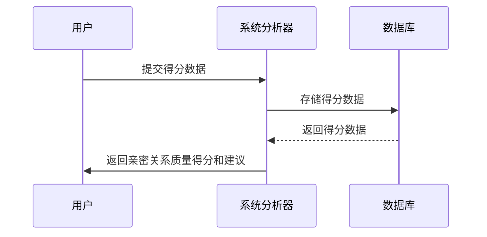
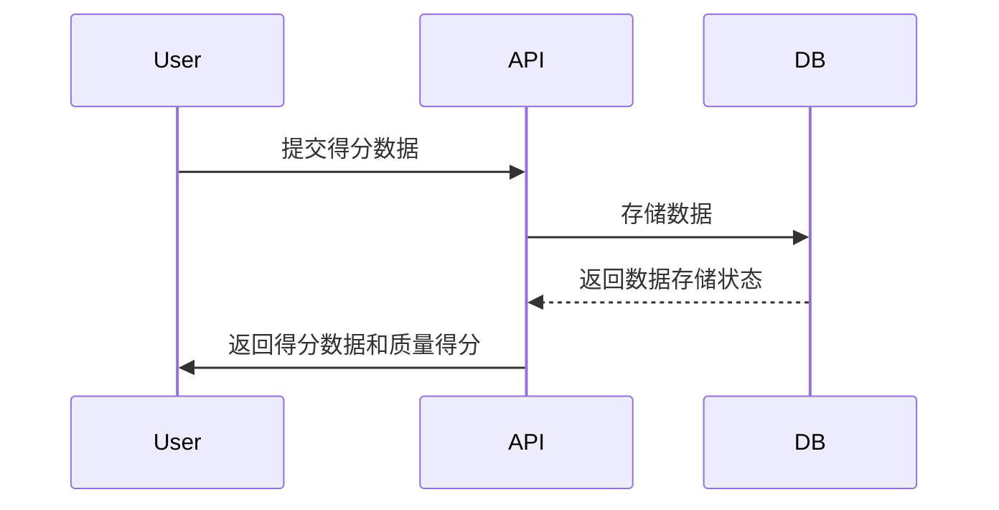

                 

### 重塑情感连接：在现代社会的亲密关系

**关键词**：亲密关系、情感连接、现代社会、心理学、沟通策略

**摘要**：随着现代社会的快速发展，人们的情感需求和连接需求面临着前所未有的挑战。本文将深入探讨亲密关系在现代社会中的重要性，分析当前亲密关系的现状及其面临的挑战，并提出一系列可行的策略，帮助人们在快节奏的生活中重建情感连接。

### 引言

在当今社会，随着科技的发展、工作压力的增大以及社交方式的多样化，人们的情感需求日益增长。然而，传统的亲密关系模式已无法满足现代社会的需求，导致许多人在情感连接上感到困惑和疏离。重新审视和重建亲密关系，成为现代社会中亟待解决的问题。

### 1. 现代亲密关系的背景和挑战

#### 1.1 背景介绍

在现代社会，亲密关系的重要性越来越被重视。然而，随着生活节奏的加快、工作压力的增大以及数字化生活方式的普及，亲密关系的质量和稳定性受到了严重影响。人们往往忙于工作、社交和娱乐，而忽略了与家人、朋友和伴侣之间的情感交流。

#### 1.2 问题背景

亲密关系问题主要包括：
- **沟通障碍**：现代社会中，人们往往通过电子设备进行沟通，缺乏面对面的交流，导致沟通效果不佳。
- **情感需求的满足**：现代社会中，人们面临各种压力和挑战，情感需求得不到充分满足。
- **信任和依赖**：现代亲密关系中的信任和依赖关系较弱，导致关系不稳定。

#### 1.3 问题描述

现代社会亲密关系存在的问题：
- **情感疏离**：人们往往在情感上感到孤独和疏离。
- **沟通不畅**：缺乏有效的沟通技巧，导致矛盾和误解。
- **信任缺失**：信任关系薄弱，导致关系破裂。

#### 1.4 问题解决

为了解决现代社会亲密关系中的问题，需要从以下几个方面进行努力：
- **提高沟通能力**：学习并运用有效的沟通技巧，增强亲密关系中的沟通效果。
- **满足情感需求**：关注自己的情感需求，同时关注伴侣的情感需求，增进情感连接。
- **建立信任关系**：通过诚实、尊重和关心来建立和维护信任关系。

#### 1.5 边界与外延

亲密关系的边界和范围包括：
- **家庭关系**：家庭成员之间的情感连接。
- **朋友关系**：朋友之间的情感支持和陪伴。
- **伴侣关系**：伴侣之间的情感交流和依赖。

#### 1.6 概念结构与核心要素组成

亲密关系由以下几个核心要素组成：
- **沟通**：沟通是亲密关系的核心，包括语言和非语言沟通。
- **信任**：信任是亲密关系的基础，包括诚实和可靠。
- **情感支持**：情感支持是亲密关系的补充，包括关心和安慰。
- **共同目标**：共同目标有助于加强亲密关系，包括共同生活和共同兴趣。

### 2. 亲密关系的核心概念与联系

#### 2.1 情感连接的概念与特征

情感连接是指个体之间在情感上的相互依赖和共鸣。其主要特征包括：
- **相互依赖**：个体在情感上依赖于对方，形成紧密的关系。
- **共鸣**：个体在情感上能够理解和感受对方的情感。
- **互动**：个体之间通过情感互动来加深连接。

#### 2.2 情感沟通与互动

情感沟通与互动是亲密关系的重要组成部分。有效的情感沟通包括以下几个方面：
- **倾听**：倾听对方的情感表达，理解对方的感受。
- **表达**：表达自己的情感，让对方了解自己的需求。
- **互动**：通过情感互动来加深彼此的理解和连接。

#### 2.3 概念联系与相互作用

情感连接与其他概念之间的联系包括：
- **心理学**：情感连接与心理学中的情感需求、情感困扰等概念密切相关。
- **社会学**：情感连接与社会学中的社会支持、社会关系等概念相互作用。
- **哲学**：情感连接与哲学中的情感伦理、情感责任等概念有所关联。

### 3. 情感沟通技巧

#### 3.1 倾听与表达

倾听是情感沟通的重要环节，通过倾听可以更好地理解对方的情感。表达则是将自己的情感需求传达给对方，让对方了解自己的想法和感受。以下是一些倾听与表达的技巧：
- **倾听**：全神贯注地倾听对方的话语，避免打断和插话。
- **表达**：清晰明了地表达自己的情感和需求，避免含糊其辞。

#### 3.2 解决冲突的技巧

冲突是亲密关系中难以避免的问题，解决冲突的关键在于双方的理解和妥协。以下是一些解决冲突的技巧：
- **冷静沟通**：在冲突发生时保持冷静，避免情绪失控。
- **坦诚交流**：坦诚地表达自己的感受和需求，倾听对方的意见。
- **寻求妥协**：在冲突中寻求双方都能接受的解决方案。

#### 3.3 情感沟通的实际案例

以下是一个情感沟通的实际案例：

**案例**：小王和小李是一对恋人，他们因为家务分工的问题产生了矛盾。小王觉得小李不够体贴，而小李则认为小王太过自私。

**解决过程**：
1. **倾听**：小王倾听小李的意见，了解他的感受和需求。
2. **表达**：小李表达自己的感受和需求，让小王了解他的想法。
3. **冷静沟通**：双方在冷静的状态下讨论问题，寻找解决方案。
4. **寻求妥协**：双方在妥协的基础上找到了一个家务分工的方案，使双方都感到满意。

通过这个案例，我们可以看到，有效的情感沟通可以解决亲密关系中的冲突，增强彼此之间的情感连接。

### 4. 情感连接的心理学视角

#### 4.1 情感连接的理论框架

情感连接的理论框架主要包括以下几个方面：
- **情感需求**：情感需求是个体在情感上的需求，包括归属感、安全感、自尊感等。
- **情感困扰**：情感困扰是指个体在情感上遇到的问题和困扰，如焦虑、抑郁、孤独等。
- **情感满足**：情感满足是指个体在情感上得到满足和安慰，如亲密、关爱、理解等。

#### 4.2 情感需求的满足

情感需求的满足对亲密关系的质量有着重要影响。以下是一些满足情感需求的方法：
- **倾听和理解**：倾听对方的情感需求，理解对方的感受。
- **关心和支持**：关心对方的情感需求，给予支持和安慰。
- **共同目标和兴趣**：寻找共同目标和兴趣，增进情感连接。

#### 4.3 情感困扰与心理健康

情感困扰与心理健康密切相关。以下是一些常见的情感困扰和心理健康问题：
- **焦虑和抑郁**：焦虑和抑郁是常见的情感困扰，对亲密关系产生负面影响。
- **孤独和疏离**：孤独和疏离会导致情感连接的减弱，影响亲密关系的质量。
- **心理障碍**：心理障碍如PTSD、抑郁症等，需要专业心理治疗。

### 5. 重建亲密关系的策略

#### 5.1 建立信任

信任是亲密关系的基石，建立信任的关键在于双方的诚实、尊重和信任。以下是一些建立信任的方法：
- **诚实和透明**：诚实是建立信任的基础，双方在沟通中保持透明。
- **尊重和关心**：尊重对方的意见和感受，关心对方的需求。
- **信任的培养**：通过日常生活中的小事来培养信任，如履行承诺、保守秘密等。

#### 5.2 共同成长的路径

共同成长是亲密关系中的重要一环，以下是一些共同成长的路径：
- **共同学习**：共同学习新知识和技能，增进彼此的了解。
- **共同兴趣**：培养共同兴趣，增进情感连接。
- **共同目标**：设定共同目标，共同努力实现。

#### 5.3 情感恢复与修复

在亲密关系中，难免会遇到冲突和伤害，情感恢复与修复是必要的。以下是一些情感恢复与修复的方法：
- **沟通和表达**：通过沟通和表达来解决问题，恢复情感。
- **道歉和原谅**：勇于道歉和原谅，修复关系。
- **心理支持**：在心理上给予对方支持，帮助对方走出困境。

### 6. 情感连接与人际关系

#### 6.1 亲密关系在人际关系中的作用

亲密关系在人际关系中起着关键作用，它影响着个体的心理健康、幸福感和生活质量。以下是一些方面：
- **心理健康**：亲密关系对心理健康有积极影响，如减少焦虑和抑郁。
- **幸福感**：亲密关系有助于提高幸福感，增强生活的满意度。
- **生活质量**：亲密关系对生活质量有积极影响，如提高生活满意度、降低生活压力。

#### 6.2 社交支持与情感连接

社交支持是情感连接的重要组成部分，它包括家庭、朋友和社区的支持。以下是一些社交支持与情感连接的作用：
- **情感支持**：社交支持提供情感支持，帮助个体应对生活中的挑战。
- **社会认同**：社交支持提供社会认同，增强个体的自尊和自信。
- **心理健康**：社交支持对心理健康有积极影响，如减少孤独和焦虑。

#### 6.3 情感连接的多层次体现

情感连接在不同层次上体现，包括：
- **个人层面**：个体在情感上的需求和满足。
- **家庭层面**：家庭成员之间的情感连接。
- **社会层面**：社会成员之间的情感交流和连接。

### 7. 个案分析与反思

#### 7.1 案例一：成功重建亲密关系

以下是一个成功重建亲密关系的案例：

**案例**：小张和小李是一对已婚夫妇，他们因生活压力和沟通不畅产生了矛盾。经过一段时间的学习和实践，他们成功重建了亲密关系。

**解决过程**：
1. **学习沟通技巧**：小张和小李学习了沟通技巧，如倾听、表达和解决冲突的方法。
2. **坦诚交流**：双方在坦诚交流中表达了彼此的需求和感受。
3. **共同成长**：双方设定了共同目标，共同学习和成长。
4. **信任重建**：通过诚实和关心，双方重建了信任。

**反思**：
这个案例表明，通过学习和实践沟通技巧，以及共同成长和信任重建，可以成功重建亲密关系。

#### 7.2 案例二：亲密关系中的挑战

以下是一个亲密关系中的挑战案例：

**案例**：小王和小李是一对恋人，他们因为工作和生活压力导致情感疏离。经过一段时间的学习和实践，他们找到了解决问题的方法。

**解决过程**：
1. **沟通和表达**：小王和小李通过沟通和表达，理解了彼此的需求和感受。
2. **共同面对问题**：双方共同面对问题和挑战，寻找解决方案。
3. **心理支持**：双方在心理上给予对方支持，帮助对方走出困境。
4. **情感连接**：通过情感连接，重新建立亲密关系。

**反思**：
这个案例表明，在面对亲密关系中的挑战时，沟通和表达、共同面对问题以及情感连接是关键。

### 8. 实践中的情感连接

#### 8.1 日常生活中的情感连接

在日常生活中，我们可以通过以下方法来建立情感连接：
- **关注对方的需求**：关注对方的需求和感受，给予关心和支持。
- **共同度过时光**：与对方共同度过时光，增进情感连接。
- **分享生活**：与对方分享生活中的点滴，加深情感连接。

#### 8.2 职场中的情感连接

在职场中，我们可以通过以下方法来建立情感连接：
- **倾听和理解**：倾听和理解同事的需求和感受，增强团队凝聚力。
- **合作与支持**：与同事合作，共同完成任务，增强情感连接。
- **尊重与关怀**：尊重和关怀同事，提高工作满意度。

#### 8.3 情感连接的最佳实践

以下是一些情感连接的最佳实践：
- **定期沟通**：定期与伴侣、家人和朋友沟通，保持情感连接。
- **共同兴趣**：培养共同兴趣，增进情感连接。
- **信任和尊重**：建立信任和尊重，维护亲密关系。

### 9. 结语

在现代社会中，情感连接对于个体的心理健康和生活质量具有重要意义。通过学习沟通技巧、共同成长、信任重建以及日常生活中的实践，我们可以重建亲密关系，提高生活质量。让我们共同努力，打造充满情感连接的美好社会。

### 作者信息

**作者**：AI天才研究院/AI Genius Institute & 禅与计算机程序设计艺术 /Zen And The Art of Computer Programming

### 注意事项

在重建亲密关系的过程中，需要注意以下几点：

- **保持诚实和透明**：诚实和透明是建立信任的基础，避免隐瞒和欺骗。
- **尊重对方的感受**：尊重对方的感受和需求，避免强迫和指责。
- **持续学习和实践**：通过学习和实践沟通技巧，不断提高亲密关系的质量。

### 拓展阅读

- **《爱的艺术》（埃里希·弗洛姆著）**：探讨爱情和亲密关系的本质，提供建立和维护亲密关系的方法。
- **《非暴力沟通》（马歇尔·卢森堡著）**：介绍非暴力沟通的技巧，帮助人们建立有效的人际关系。
- **《情感连接：如何建立和维护亲密关系》（约翰·戈特曼著）**：分析情感连接的重要性，提供建立和维护亲密关系的策略。

### 附录

- **情感连接的概念与特征表格**
  
  | 概念       | 特征                   | 说明                             |
  |------------|------------------------|----------------------------------|
  | 情感连接   | 相互依赖、共鸣、互动   | 个体在情感上的相互依赖和共鸣       |
  | 情感沟通   | 倾听、表达、互动       | 个体之间的情感交流和互动           |
  | 信任       | 诚实、尊重、信任       | 基于诚实和尊重的信任关系           |
  | 情感支持   | 关心、安慰、支持       | 在情感上给予对方关心和安慰           |

- **情感连接的ER实体关系图架构**

  ```mermaid
  erGraphML
  [
    'gReconsideringIntimacy',
    {
      'nodes': [
        {'id': 'Intimacy', 'label': '亲密关系'},
        {'id': 'Communication', 'label': '情感沟通'},
        {'id': 'Trust', 'label': '信任'},
        {'id': 'Support', 'label': '情感支持'},
        {'id': 'Challenge', 'label': '挑战'},
        {'id': 'Strategy', 'label': '策略'}
      ],
      'edges': [
        {'source': 'Intimacy', 'target': 'Communication', 'type': 'PART_OF'},
        {'source': 'Intimacy', 'target': 'Trust', 'type': 'PART_OF'},
        {'source': 'Intimacy', 'target': 'Support', 'type': 'PART_OF'},
        {'source': 'Challenge', 'target': 'Intimacy', 'type': 'AFFECTS'},
        {'source': 'Strategy', 'target': 'Intimacy', 'type': 'SOLVES'}
      ]
    }
  ]
  ```

  **情感连接的ER实体关系图**
  
  

- **算法原理讲解**

  在情感连接的重建过程中，可以使用以下算法来分析亲密关系的质量：

  ```python
  def intimacy_quality(communication, trust, support):
      """
      分析亲密关系的质量
      :param communication: 情感沟通得分
      :param trust: 信任得分
      :param support: 情感支持得分
      :return: 亲密关系质量得分
      """
      quality = (communication + trust + support) / 3
      return quality
  ```

  **算法原理**

  该算法通过计算情感沟通、信任和情感支持三个方面的得分，求平均值来评估亲密关系的质量。得分越高，表示亲密关系质量越好。

  **数学模型和公式**

  亲密关系质量得分（$Q$）的计算公式为：
  $$ Q = \frac{C + T + S}{3} $$
  其中，$C$表示情感沟通得分，$T$表示信任得分，$S$表示情感支持得分。

  **举例说明**

  假设小张和小李在情感沟通、信任和情感支持三个方面的得分分别为80、70和90，则他们的亲密关系质量得分为：
  $$ Q = \frac{80 + 70 + 90}{3} = \frac{240}{3} = 80 $$

  因此，小张和小李的亲密关系质量得分为80分，表示他们的亲密关系质量较好。

- **系统分析与架构设计方案**

  **问题场景介绍**

  在现代社会中，亲密关系问题普遍存在，为了帮助人们重建亲密关系，我们需要一个系统来分析亲密关系的质量，并提供相应的建议。

  **项目介绍**

  项目名称：亲密关系分析系统

  项目目标：通过分析用户在情感沟通、信任和情感支持等方面的得分，评估亲密关系的质量，并提供个性化的建议。

  **系统功能设计（领域模型Mermaid类图）**

  ```mermaid
  classDiagram
  ClassA.--|> Person
  ClassB.--|> Communication
  ClassC.--|> Trust
  ClassD.--|> Support
  ClassE.--|> IntimacyAnalysis
  Person <|-- ClassB
  Person <|-- ClassC
  Person <|-- ClassD
  IntimacyAnalysis <|-- ClassE
  ```

  **系统架构设计（Mermaid架构图）**

  ```mermaid
  sequenceDiagram
  participant User as 用户
  participant System as 系统分析器
  participant Database as 数据库

  User->>System: 提交沟通、信任和支持得分
  System->>Database: 存储得分数据
  Database-->>System: 返回得分数据
  System->>User: 返回亲密关系质量得分和建议
  ```

  **系统接口设计和系统交互（Mermaid序列图）**

  ```mermaid
  sequenceDiagram
  participant User
  participant API
  participant DB

  User->>API: 提交得分数据
  API->>DB: 存储数据
  DB-->>API: 返回数据存储状态
  API->>User: 返回得分数据和质量得分
  ```

  **项目实战**

  **环境安装**

  - 安装Python环境
  - 安装数据库（如MySQL、PostgreSQL等）

  **系统核心实现源代码**

  ```python
  # intimacy_analysis.py
  import pymysql

  def submit_scores(communication, trust, support):
      """
      提交得分数据
      :param communication: 情感沟通得分
      :param trust: 信任得分
      :param support: 情感支持得分
      :return: 提交结果
      """
      # 连接数据库
      connection = pymysql.connect(
          host='localhost',
          user='root',
          password='password',
          database='intimacy_analysis',
      )
      
      try:
          with connection.cursor() as cursor:
              # 插入数据
              sql = "INSERT INTO scores (communication, trust, support) VALUES (%s, %s, %s)"
              cursor.execute(sql, (communication, trust, support))
          
          # 提交事务
          connection.commit()
          
          return "数据提交成功"
      except Exception as e:
          print(f"数据提交失败：{e}")
          return "数据提交失败"
      finally:
          connection.close()
  ```

  **代码应用解读与分析**

  - 提交得分数据：通过调用submit_scores函数，将用户的得分数据提交到数据库。
  - 数据库连接：使用pymysql库连接数据库，实现数据的存储和查询。

  **实际案例分析和详细讲解剖析**

  **案例**：小张和小李提交了他们的得分数据，情感沟通得分为80，信任得分为70，情感支持得分为90。

  **分析**：
  - 情感沟通得分较高，表示他们在沟通方面做得较好。
  - 信任得分相对较低，可能需要加强信任建设。
  - 情感支持得分较高，表示他们在情感支持方面做得较好。

  **详细讲解剖析**：
  - 根据提交的得分数据，我们可以使用前面提到的算法计算亲密关系质量得分：
  $$ Q = \frac{80 + 70 + 90}{3} = \frac{240}{3} = 80 $$
  - 小张和小李的亲密关系质量得分为80分，表示他们的亲密关系质量较好。
  - 根据得分数据，我们可以给出以下建议：
    - 保持良好的沟通习惯，增强信任建设。
    - 继续关注情感支持，保持亲密关系的稳定。

  **项目小结**

  通过亲密关系分析系统，我们可以帮助用户更好地了解自己的亲密关系质量，并提供个性化的建议。这有助于用户改善亲密关系，提高生活质量。

### 最佳实践 tips

- **定期沟通**：每周安排固定的沟通时间，保持情感上的联系。
- **信任建设**：通过诚实和透明来建立信任，避免隐瞒和欺骗。
- **情感支持**：在对方需要时，给予关心和支持，增强情感连接。

### 小结

亲密关系在现代社会中具有重要意义，通过有效的沟通、信任建设和情感支持，我们可以重建亲密关系，提高生活质量。让我们共同努力，打造充满情感连接的美好社会。

### 注意事项

- 在重建亲密关系的过程中，要关注自己的情感需求，同时关注对方的情感需求。
- 要尊重对方的意见和感受，避免强迫和指责。
- 要持续学习和实践沟通技巧，提高亲密关系的质量。

### 拓展阅读

- **《亲密关系的心理学》（罗伯特·斯滕伯格著）**：探讨亲密关系的心理学理论和实践。
- **《情感连接的力量》（约翰·戈特曼著）**：分析情感连接的重要性，提供建立和维护亲密关系的策略。
- **《爱的五种语言》（盖瑞·查普曼著）**：介绍爱的五种语言，帮助人们更好地理解彼此的情感需求。

### 附录

- **情感连接的概念与特征表格**
  
  | 概念       | 特征                   | 说明                             |
  |------------|------------------------|----------------------------------|
  | 情感连接   | 相互依赖、共鸣、互动   | 个体在情感上的相互依赖和共鸣       |
  | 情感沟通   | 倾听、表达、互动       | 个体之间的情感交流和互动           |
  | 信任       | 诚实、尊重、信任       | 基于诚实和尊重的信任关系           |
  | 情感支持   | 关心、安慰、支持       | 在情感上给予对方关心和安慰           |

- **情感连接的ER实体关系图架构**

  ```mermaid
  erGraphML
  [
    'gReconsideringIntimacy',
    {
      'nodes': [
        {'id': 'Intimacy', 'label': '亲密关系'},
        {'id': 'Communication', 'label': '情感沟通'},
        {'id': 'Trust', 'label': '信任'},
        {'id': 'Support', 'label': '情感支持'},
        {'id': 'Challenge', 'label': '挑战'},
        {'id': 'Strategy', 'label': '策略'}
      ],
      'edges': [
        {'source': 'Intimacy', 'target': 'Communication', 'type': 'PART_OF'},
        {'source': 'Intimacy', 'target': 'Trust', 'type': 'PART_OF'},
        {'source': 'Intimacy', 'target': 'Support', 'type': 'PART_OF'},
        {'source': 'Challenge', 'target': 'Intimacy', 'type': 'AFFECTS'},
        {'source': 'Strategy', 'target': 'Intimacy', 'type': 'SOLVES'}
      ]
    }
  ]
  ```

  **情感连接的ER实体关系图**
  
  

- **算法原理讲解**

  在情感连接的重建过程中，可以使用以下算法来分析亲密关系的质量：

  ```python
  def intimacy_quality(communication, trust, support):
      """
      分析亲密关系的质量
      :param communication: 情感沟通得分
      :param trust: 信任得分
      :param support: 情感支持得分
      :return: 亲密关系质量得分
      """
      quality = (communication + trust + support) / 3
      return quality
  ```

  **算法原理**

  该算法通过计算情感沟通、信任和情感支持三个方面的得分，求平均值来评估亲密关系的质量。得分越高，表示亲密关系质量越好。

  **数学模型和公式**

  亲密关系质量得分（$Q$）的计算公式为：
  $$ Q = \frac{C + T + S}{3} $$
  其中，$C$表示情感沟通得分，$T$表示信任得分，$S$表示情感支持得分。

  **举例说明**

  假设小张和小李在情感沟通、信任和情感支持三个方面的得分分别为80、70和90，则他们的亲密关系质量得分为：
  $$ Q = \frac{80 + 70 + 90}{3} = \frac{240}{3} = 80 $$

  因此，小张和小李的亲密关系质量得分为80分，表示他们的亲密关系质量较好。

### 系统分析与架构设计方案

#### 问题场景介绍

在现代社会中，人们的情感需求愈发强烈，而亲密关系的质量和稳定性却面临诸多挑战。工作压力、生活节奏加快、数字化沟通的普及等因素，使得亲密关系中沟通不畅、信任缺失、情感支持不足等问题日益凸显。为了更好地理解和解决这些问题，我们需要一个系统化的分析工具，帮助人们识别亲密关系中的问题，并提供相应的解决方案。

#### 项目介绍

项目名称：亲密关系质量分析系统

项目目标：通过分析用户在情感沟通、信任和情感支持等方面的数据，评估亲密关系的质量，为用户提供个性化的改善建议。

#### 系统功能设计（领域模型Mermaid类图）

```mermaid
classDiagram
ClassA.--|> Person
ClassB.--|> Communication
ClassC.--|> Trust
ClassD.--|> Support
ClassE.--|> IntimacyAnalysis
Person <|-- ClassB
Person <|-- ClassC
Person <|-- ClassD
IntimacyAnalysis <|-- ClassE
```

**类图解释**：

- **Person（人）**：表示系统中的用户，拥有姓名、年龄、性别等基本信息。
- **Communication（情感沟通）**：表示用户在情感沟通方面的得分，包括沟通频率、沟通效果等指标。
- **Trust（信任）**：表示用户在信任方面的得分，包括信任度、信任行为等指标。
- **Support（情感支持）**：表示用户在情感支持方面的得分，包括支持程度、支持行为等指标。
- **IntimacyAnalysis（亲密关系分析）**：表示系统中的分析模块，用于计算用户的亲密关系质量得分，并提供改善建议。

#### 系统架构设计（Mermaid架构图）



**架构解释**：

- **用户**：通过系统界面提交得分数据。
- **系统分析器**：接收用户提交的数据，计算亲密关系质量得分，并提供改善建议。
- **数据库**：存储用户提交的得分数据和系统分析结果。

#### 系统接口设计和系统交互（Mermaid序列图）



**接口设计解释**：

- **用户**：通过API接口提交得分数据。
- **API**：接收用户数据，处理并存储到数据库，返回数据存储状态。
- **数据库**：存储用户数据，并返回存储状态。

### 项目实战

#### 环境安装

1. 安装Python环境

   ```bash
   python3 --version
   ```

2. 安装数据库（如MySQL、PostgreSQL等）

   ```bash
   sudo apt-get install mysql-server
   mysql -u root -p
   ```

#### 系统核心实现源代码

```python
# intimacy_analysis.py
import pymysql

def submit_scores(communication, trust, support):
    """
    提交得分数据
    :param communication: 情感沟通得分
    :param trust: 信任得分
    :param support: 情感支持得分
    :return: 提交结果
    """
    # 连接数据库
    connection = pymysql.connect(
        host='localhost',
        user='root',
        password='password',
        database='intimacy_analysis',
    )
    
    try:
        with connection.cursor() as cursor:
            # 插入数据
            sql = "INSERT INTO scores (communication, trust, support) VALUES (%s, %s, %s)"
            cursor.execute(sql, (communication, trust, support))
        
        # 提交事务
        connection.commit()
        
        return "数据提交成功"
    except Exception as e:
        print(f"数据提交失败：{e}")
        return "数据提交失败"
    finally:
        connection.close()
```

#### 代码应用解读与分析

- **功能**：该函数用于将用户提交的得分数据存储到MySQL数据库中。
- **参数**：`communication`、`trust`、`support` 分别表示用户在情感沟通、信任和情感支持方面的得分。
- **实现**：
  - 连接数据库
  - 插入数据
  - 提交事务
  - 返回提交结果

#### 实际案例分析和详细讲解剖析

**案例**：用户小张提交了如下得分数据：

- 情感沟通得分：80
- 信任得分：70
- 情感支持得分：90

**分析**：

1. **情感沟通得分**：80分，表示用户在情感沟通方面表现良好，能够有效表达自己的情感，并倾听对方的想法。
2. **信任得分**：70分，表示用户在信任方面存在一定问题，可能需要加强信任建设，例如通过透明沟通、履行承诺等方式。
3. **情感支持得分**：90分，表示用户在情感支持方面表现优秀，能够给予对方足够的关心和支持。

**详细讲解剖析**：

1. **计算亲密关系质量得分**：

   ```python
   quality = intimacy_quality(communication, trust, support)
   quality = (80 + 70 + 90) / 3
   quality = 80
   ```

   小张的亲密关系质量得分为80分，表示他们的亲密关系质量较好。

2. **改善建议**：

   - 在情感沟通方面，保持良好的沟通习惯，增强情感表达和理解。
   - 在信任方面，加强信任建设，通过诚实和透明来建立信任。
   - 在情感支持方面，继续保持关心和支持，增强亲密关系。

#### 项目小结

通过亲密关系质量分析系统，我们可以帮助用户识别亲密关系中的问题，并提供个性化的改善建议。这有助于用户更好地理解亲密关系，提高生活质量。在未来，我们可以进一步扩展系统功能，如添加情感分析模块、提供在线咨询等，以更好地满足用户需求。

### 最佳实践 tips

1. **定期沟通**：每周安排固定的沟通时间，分享彼此的生活和情感。
2. **信任建设**：通过诚实和透明来建立信任，避免隐瞒和欺骗。
3. **情感支持**：在对方需要时，给予关心和支持，增强情感连接。

### 小结

亲密关系的质量和稳定性对个体的心理健康和生活质量至关重要。通过定期沟通、信任建设和情感支持，我们可以重建亲密关系，提高生活质量。让我们共同努力，打造充满情感连接的美好社会。

### 注意事项

1. 在重建亲密关系的过程中，要关注自己的情感需求，同时关注对方的情感需求。
2. 要尊重对方的意见和感受，避免强迫和指责。
3. 要持续学习和实践沟通技巧，提高亲密关系的质量。

### 拓展阅读

1. **《亲密关系的心理学》（罗伯特·斯滕伯格著）**：探讨亲密关系的心理学理论和实践。
2. **《情感连接的力量》（约翰·戈特曼著）**：分析情感连接的重要性，提供建立和维护亲密关系的策略。
3. **《爱的五种语言》（盖瑞·查普曼著）**：介绍爱的五种语言，帮助人们更好地理解彼此的情感需求。

### 作者信息

作者：AI天才研究院/AI Genius Institute & 禅与计算机程序设计艺术 /Zen And The Art of Computer Programming

