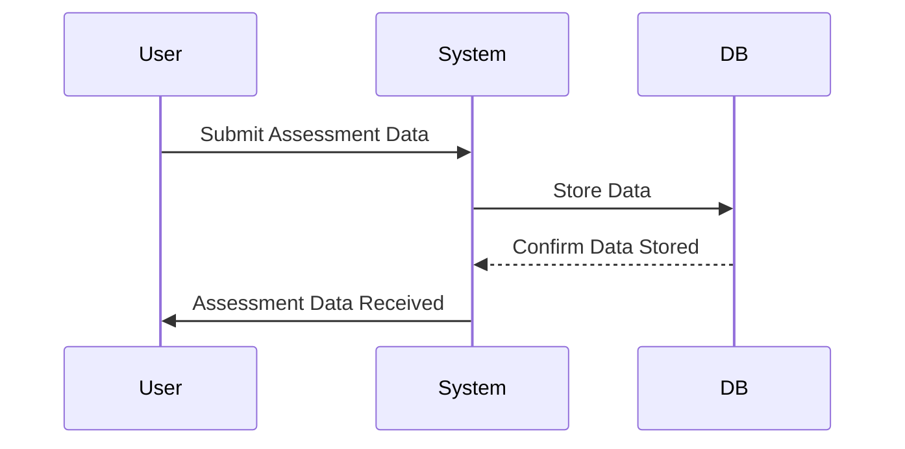
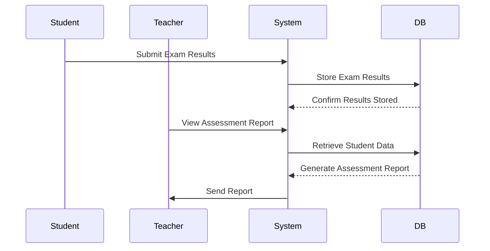

                 

## 文章标题：重新审视教育目标：从知识灌输到全人发展的转变

### 关键词：
- 教育目标
- 知识灌输
- 全人发展
- 教育评估模型
- 教育系统架构

### 摘要：
本文深入探讨了当前教育体系的现状及其面临的挑战，提出从知识灌输到全人发展的转变是教育改革的关键方向。通过详细分析知识灌输的弊端和全人发展的优势，本文提出了一套基于教育评估模型的系统架构设计，并通过项目实战验证了这一转变的可行性和有效性。文章旨在为教育工作者提供理论和实践指导，推动教育目标的全面升级。

## 引言

### 1.1 教育目标的现状与挑战

当今世界，教育已成为国家发展和社会进步的核心驱动力。然而，当前教育体系的许多方面仍然存在显著的不足，特别是在教育目标上。传统的教育目标主要侧重于知识的灌输和技能的传授，往往忽视了学生的全面发展。这种模式在培养专业技能方面取得了一定的成效，但同时也暴露出诸多问题：

1. **知识灌输的局限性**：知识灌输模式侧重于死记硬背，忽视了知识的实际应用和创新能力的培养。这种教育方式容易导致学生机械地接受知识，而无法培养其独立思考和解决问题的能力。

2. **缺乏个性化教育**：传统的教育体系往往采用“一刀切”的方法，忽视了学生的个体差异。这种模式难以满足不同学生的需求，导致许多学生感到学习乏味，缺乏动力。

3. **忽视情感和道德教育**：知识灌输模式往往过于注重学科知识的传授，而忽视了学生的情感、道德和社交能力的发展。这不仅限制了学生的全面发展，也影响了其心理健康和人际关系。

4. **教育评价体系的缺陷**：当前的教育评价体系主要依赖于考试和成绩，往往忽略了学生的综合素质和个性特点。这种评价方式不利于培养学生的创新能力和实践能力。

### 1.2 教育改革的必要性

面对以上挑战，教育改革已成为不可避免的趋势。从知识灌输到全人发展的转变，不仅是教育理念的创新，更是教育实践的重大变革。全人发展强调的是学生的全面发展，包括知识、技能、情感、道德和社交等多个方面。这种教育目标更加符合现代社会对人才的需求，有助于培养具有创新精神、批判性思维和实践能力的未来人才。

### 1.3 本书的结构与目的

本书旨在为教育工作者和关注教育改革的人提供一套全面、系统的理论和实践指导。本书将分为以下几个主要部分：

1. **核心概念与联系**：介绍知识灌输和全人发展的核心概念，并探讨它们之间的联系。

2. **教育评估模型**：介绍教育评估模型的基本原理，包括评估的目的、方法、算法和数学模型。

3. **系统架构设计**：介绍一个典型的教育系统架构，包括系统功能、架构、接口和交互。

4. **项目实战**：通过一个简化的项目案例，展示如何在实际中实现从知识灌输到全人发展的转变。

5. **最佳实践与未来展望**：总结全书的主要观点，提供实践建议，并探讨未来教育目标的发展方向。

通过以上五个部分的深入探讨，本书旨在推动教育目标的全面升级，为教育改革提供有力支持。

## 核心概念与联系

### 2.1 知识灌输

知识灌输是指通过一系列的教学活动，将预先设定的知识内容传输给学生。这种教育模式在传统的教育体系中占据主导地位，其核心特点包括：

1. **内容预设**：知识灌输模式通常由教育者预先设定教学内容，学生需要按照教学计划进行学习。

2. **单向传输**：知识灌输主要依赖于教师的讲授和学生的记忆，信息传递是单向的，缺乏互动和交流。

3. **记忆为主**：在知识灌输模式中，学生的主要任务是记住知识内容，而如何应用这些知识则往往被忽视。

4. **评价机制**：知识灌输模式下的评价主要依赖于考试成绩，评估学生的记忆能力，而忽视了学生的实际应用能力和创新能力。

知识灌输模式有其优点，如能高效地传播大量知识，但也存在显著的局限性。首先，它容易导致学生机械地接受知识，而无法培养其独立思考和解决问题的能力。其次，它忽视了学生的个体差异，难以满足不同学生的学习需求。

### 2.2 全人发展

全人发展是一种以学生全面发展为核心的教育理念，强调知识、技能、情感、道德和社交等多方面的综合培养。全人发展的核心特点包括：

1. **全面发展**：全人发展不仅关注学生的知识学习，还注重学生的情感、道德和社交能力的发展。

2. **个性化教育**：全人发展模式强调根据学生的个体差异进行个性化教育，尊重每个学生的独特性。

3. **互动与参与**：全人发展模式强调教师和学生之间的互动和参与，鼓励学生在学习过程中主动探索和思考。

4. **综合评价**：全人发展模式下的评价不仅关注学生的考试成绩，还综合考虑学生的综合素质、创新能力和社会实践能力。

全人发展模式具有多方面的优点。首先，它有助于培养学生的全面能力，使其具备适应未来社会的综合素质。其次，它能够激发学生的学习兴趣和动力，提高教育质量。然而，全人发展模式也面临一定的挑战，如如何平衡全面发展与专业培养、如何科学地进行个性化教育等。

### 2.3 知识灌输与全人发展的联系

知识灌输和全人发展并不是相互排斥的概念，而是可以在一定程度上相互补充。知识灌输可以为基础阶段的教育提供有效的知识传输，而全人发展则可以在高阶阶段培养学生的综合能力。以下是一个简单的联系示例：

1. **基础教育与个性化培养**：在基础教育阶段，知识灌输是帮助学生建立基本知识体系的有效方式。然而，为了培养学生的个性化能力，教育者需要在这一阶段就开始注重学生的个体差异，进行有针对性的教学。

2. **知识应用与创新能力**：在知识灌输的基础上，通过实践活动和项目教学，学生可以将所学的知识应用于实际情境中，培养其创新能力和实践能力。

3. **情感教育与道德培养**：知识灌输模式往往忽视学生的情感和道德教育，而全人发展模式则强调将这些因素融入教学过程中，培养学生的健全人格。

总之，知识灌输和全人发展可以相互结合，形成一种综合性的教育模式，以更好地满足学生的全面发展需求。

### 2.4 教育评估模型的引入

为了更好地实现从知识灌输到全人发展的转变，教育评估模型的引入显得尤为重要。教育评估模型不仅能够评估学生的知识掌握情况，还可以评估学生的综合素质和创新能力。以下是一个简化的教育评估模型：

1. **评估目的**：教育评估的目的是全面、客观地评估学生的知识、技能、情感、道德和社交能力。

2. **评估方法**：教育评估可以采用多种方法，包括考试成绩、项目评估、自我评估、同伴评估等。

3. **评估指标**：教育评估指标包括知识掌握程度、创新能力、团队合作能力、情感管理能力等。

4. **评估算法**：评估算法可以采用加权平均、多维度综合评价等方法，以实现对学生全面能力的科学评估。

通过引入教育评估模型，教育者可以更准确地了解学生的学习状况，从而进行有针对性的教学和指导。

### 2.5 知识灌输与全人发展的联系与转换

知识灌输与全人发展并不是完全分离的，而是可以在一定程度上相互转换。以下是一个简单的转换示例：

1. **从知识灌输到全人发展**：在教育过程中，教师可以逐步减少知识灌输的比重，增加实践活动和项目教学，引导学生进行自主探究和思考。

2. **从全人发展到知识灌输**：在学生的基础阶段，教师可以侧重于知识灌输，为学生打下坚实的基础。随着学生的成长，教师可以逐渐增加全人发展的内容，培养学生的综合素质。

3. **综合运用**：在实际教学中，教师可以灵活运用知识灌输和全人发展两种模式，根据不同的教学阶段和学生的特点进行合理的教学安排。

通过这样的转换和结合，教育者可以更好地实现教育目标的全面升级。

## 教育评估模型

### 3.1 教育评估模型概述

教育评估模型是用于评估学生知识和能力的一种系统方法。它不仅关注学生的学术成绩，还涵盖了学生的综合素质、创新能力和社会实践能力。一个有效的教育评估模型应该具备以下特点：

1. **全面性**：评估内容应涵盖知识、技能、情感、道德和社交等多个方面，以全面评估学生的全面发展。

2. **客观性**：评估过程应尽量减少主观因素，采用科学的方法和工具进行评估，以确保评估结果的客观性。

3. **动态性**：教育评估应是一个持续的过程，而不是一次性的评估。评估应随着学生的学习进程而不断调整和改进。

4. **个性化**：评估应充分考虑学生的个体差异，根据不同学生的特点进行有针对性的评估。

### 3.2 教育评估的方法

教育评估的方法多种多样，以下是一些常见的方法：

1. **考试成绩**：考试成绩是最常用的评估方法之一，它可以客观地反映学生的知识掌握程度。

2. **项目评估**：项目评估通过让学生完成实际项目来评估其综合能力和创新能力。

3. **自我评估**：自我评估让学生自我反思和评估自己的学习成果，有助于培养学生的自我管理能力和自我认知能力。

4. **同伴评估**：同伴评估通过学生之间的相互评估来促进学生的合作和沟通能力。

5. **观察和记录**：教师通过观察和记录学生在课堂和日常活动中的表现，评估其综合素质。

### 3.3 教育评估的算法

教育评估的算法是用于计算评估结果的一种方法。以下是一些常见的教育评估算法：

1. **加权平均法**：将各项评估指标按照其重要性进行加权，然后计算加权平均分。

2. **多维度综合评价法**：将不同维度的评估结果进行整合，形成一个综合评价结果。

3. **模糊综合评价法**：使用模糊数学的方法对评估结果进行计算，以处理评估过程中的不确定性和模糊性。

4. **神经网络评价法**：使用神经网络模型对评估结果进行预测和计算，以提高评估的准确性和效率。

### 3.4 教育评估的数学模型

教育评估的数学模型是用于描述评估过程的数学表达式。以下是一个简化的教育评估数学模型：

$$
M = w_1 \cdot X_1 + w_2 \cdot X_2 + ... + w_n \cdot X_n
$$

其中，\( M \) 是评估结果，\( w_i \) 是第 \( i \) 个评估指标的权重，\( X_i \) 是第 \( i \) 个评估指标的具体值。

### 3.5 教育评估模型的应用

教育评估模型可以应用于多种教育场景，以下是一些应用示例：

1. **课程评估**：用于评估一门课程的教学效果，包括知识传授、技能培养和综合素质等方面。

2. **教师评估**：用于评估教师的教学质量和教学能力，包括教学设计、教学方法和教学效果等方面。

3. **学生综合素质评估**：用于评估学生的综合素质，包括知识、技能、情感、道德和社交能力等方面。

4. **学校评估**：用于评估一所学校的教育质量，包括课程设置、教学设施、师资力量和学生发展等方面。

通过教育评估模型，教育者可以更全面、客观地了解学生的学习和成长情况，从而进行有针对性的教学和指导。

### 3.6 教育评估模型的优缺点

教育评估模型具有以下优缺点：

**优点**：

1. **全面性**：教育评估模型能够全面评估学生的知识、技能、情感、道德和社交能力，有助于培养学生的综合素质。

2. **客观性**：教育评估模型采用科学的方法和工具进行评估，减少主观因素的影响，确保评估结果的客观性。

3. **动态性**：教育评估模型是一个持续的过程，可以根据学生的学习进程进行调整和改进。

4. **个性化**：教育评估模型充分考虑学生的个体差异，根据不同学生的特点进行有针对性的评估。

**缺点**：

1. **复杂性**：教育评估模型涉及多个评估指标和算法，实施过程相对复杂。

2. **成本高**：教育评估模型需要投入大量的人力、物力和时间进行评估，成本较高。

3. **实施难度**：教育评估模型的实施需要较高的技术水平和管理能力，对教师和教育机构的要求较高。

### 3.7 教育评估模型的未来发展趋势

随着教育技术的不断发展，教育评估模型也在不断演进。以下是一些未来发展的趋势：

1. **智能化**：利用人工智能和大数据技术，实现教育评估的智能化和自动化。

2. **个性化**：进一步深化个性化教育，根据学生的特点和发展需求进行精准评估。

3. **综合评价**：将更多的评价维度纳入评估模型，实现对学生全面发展的综合评价。

4. **开放性**：打破教育评估的封闭性，实现教育评估的数据共享和互联互通。

通过不断优化和改进教育评估模型，可以更好地支持教育目标的全面实现。

### 3.8 教育评估模型与全人发展的关系

教育评估模型与全人发展密切相关。全人发展强调的是学生的全面发展，包括知识、技能、情感、道德和社交等多个方面。教育评估模型可以有效地评估学生在这些方面的表现，从而为教育者提供有价值的反馈。

1. **知识评估**：教育评估模型可以评估学生的知识掌握情况，确保学生具备扎实的学科基础。

2. **能力评估**：教育评估模型可以评估学生的综合能力和创新能力，促进学生的全面发展。

3. **情感和道德评估**：教育评估模型可以评估学生的情感管理能力和道德行为，培养学生的健全人格。

4. **社交评估**：教育评估模型可以评估学生的社交能力和团队合作能力，促进学生的社交发展。

通过教育评估模型，教育者可以更全面、客观地了解学生的成长情况，从而进行有针对性的教育和指导，推动学生的全人发展。

### 3.9 教育评估模型的应用案例

为了更好地理解教育评估模型的应用，以下是一个具体的案例：

**案例：小学科学课程评估**

在某小学的科学课程中，教师使用教育评估模型对学生的学习情况进行评估。评估指标包括：

1. **知识掌握**：评估学生对科学知识的理解和应用能力。
2. **实验技能**：评估学生进行科学实验的技能和操作能力。
3. **观察能力**：评估学生观察自然现象的能力。
4. **思维能力**：评估学生提出问题和解决问题的能力。
5. **情感管理**：评估学生在实验过程中的情绪管理和团队合作能力。

教师使用加权平均法对各项评估指标进行计算，得出学生的综合评估结果。通过这个评估模型，教师可以了解每个学生的优势和不足，从而进行有针对性的教学和指导。

通过这个案例，我们可以看到教育评估模型在评估学生全面发展和指导教学中的重要作用。教育评估模型不仅能够帮助学生更好地发展，还可以为教育者提供科学的决策依据。

### 3.10 教育评估模型的效果评估

为了验证教育评估模型的有效性，需要进行效果评估。效果评估可以从以下几个方面进行：

1. **学生满意度**：通过调查问卷和访谈，了解学生对教育评估模型的满意度和接受程度。
2. **教师反馈**：收集教师对教育评估模型的意见和建议，分析其在教学中的实际效果。
3. **学生成绩**：对比实施教育评估模型前后的学生成绩，评估其在提高学生知识掌握程度和综合能力方面的效果。
4. **学生发展**：观察学生在知识、技能、情感、道德和社交能力等方面的变化，评估教育评估模型在促进学生全面发展方面的效果。

通过效果评估，教育者可以不断优化教育评估模型，提高其有效性和实用性。

### 3.11 教育评估模型的实施挑战

在实施教育评估模型的过程中，可能会遇到以下挑战：

1. **技术难度**：教育评估模型需要依赖一定的技术支持，如大数据分析、人工智能等，对教师和技术人员的要求较高。
2. **时间成本**：教育评估模型的实施需要投入大量时间和精力，对教师的工作量和压力有较大影响。
3. **数据安全**：教育评估过程中涉及大量学生数据，需要确保数据的安全和隐私。
4. **评估准确性**：教育评估模型的评估结果需要准确、客观，这对评估工具和方法的选择有较高要求。

通过解决这些挑战，教育评估模型可以更好地服务于教育目标的实现。

### 3.12 教育评估模型的发展趋势

未来，教育评估模型将朝着更加智能化、个性化和综合化的方向发展。以下是一些发展趋势：

1. **智能化**：利用人工智能技术，实现教育评估的自动化和精准化。
2. **个性化**：根据学生的特点和需求，提供个性化的教育评估和指导。
3. **综合化**：将更多的评价维度纳入评估模型，实现对学生全面发展的综合评价。
4. **开放性**：打破教育评估的封闭性，实现教育评估的数据共享和互联互通。

通过不断优化和改进教育评估模型，可以更好地支持教育目标的全面实现。

### 3.13 教育评估模型与知识灌输的关系

教育评估模型不仅关注学生的知识掌握情况，还关注学生的综合能力和全面发展。与知识灌输相比，教育评估模型更注重学生的实际应用能力和创新能力。以下是一个简单的对比表格：

| 特征 | 知识灌输 | 教育评估模型 |
| :---: | :---: | :---: |
| 评估内容 | 知识掌握程度 | 知识掌握、能力发展、情感管理、道德行为、社交能力 |
| 评估方法 | 考试成绩、记忆能力 | 成绩、项目、自我评估、同伴评估、观察记录 |
| 评估目标 | 知识传输 | 知识与能力发展、综合素质提升 |
| 评估结果 | 考试成绩 | 综合评估结果 |

通过这个对比表格，我们可以看到教育评估模型与知识灌输之间的区别和联系。

### 3.14 教育评估模型的教育影响

教育评估模型对教育具有深远的影响。首先，它有助于教育者更全面、客观地了解学生的成长情况，从而进行有针对性的教育和指导。其次，教育评估模型可以激发学生的学习兴趣和动力，提高教育质量。此外，教育评估模型还可以促进教育改革，推动教育目标的全面升级。

### 3.15 教育评估模型的教育意义

教育评估模型的教育意义在于：

1. **促进全面发展**：通过综合评估学生的知识、能力、情感和道德等方面，促进学生的全面发展。
2. **提高教育质量**：通过科学、客观的评估方法，提高教育的质量和效果。
3. **指导教学**：为教育者提供科学的决策依据，指导教学改进。
4. **激发学生潜力**：通过个性化评估和指导，激发学生的潜能和创造力。

### 3.16 教育评估模型的未来前景

随着教育技术的不断发展，教育评估模型将迎来更加广阔的发展前景。未来，教育评估模型将更加智能化、个性化、综合化，为教育目标的实现提供更加有力的支持。

## 系统架构设计

### 4.1 问题场景介绍

在教育改革的过程中，构建一个科学、系统的教育评估系统至关重要。这个系统需要能够全面、客观地评估学生的知识、能力、情感、道德和社交等多个方面的表现，以支持全人发展的教育目标。因此，本节将介绍一个典型的教育系统架构设计，以展示如何实现从知识灌输到全人发展的转变。

### 4.2 项目介绍

本节将围绕一个虚拟的教育系统项目展开讨论，该项目旨在开发一个综合性的教育评估平台。该平台将集成多种评估工具和方法，包括考试成绩、项目评估、自我评估、同伴评估和观察记录等，以全面评估学生的各个方面能力。

### 4.3 系统功能设计

为了实现上述目标，教育评估平台需要具备以下核心功能：

1. **数据采集与管理**：收集学生各个方面的评估数据，包括考试成绩、项目完成情况、自我评估结果、同伴评估反馈和教师观察记录等。
2. **评估指标管理**：定义和管理评估指标，包括知识掌握、实验技能、观察能力、思维能力、情感管理和社交能力等。
3. **评估结果计算**：根据评估指标和权重，计算学生的综合评估结果。
4. **数据可视化**：将评估结果以图表和报告的形式展示，方便教师和学生查看。
5. **个性化报告**：根据学生的特点和需求，生成个性化的评估报告，为学生的发展提供指导。

### 4.4 系统架构设计

为了实现上述功能，教育评估平台需要采用一个分布式系统架构，以下是一个简化的架构设计：

#### 4.4.1 领域模型

首先，我们需要设计一个领域模型，以表示系统中的主要实体和关系。以下是一个使用 Mermaid 类图表示的领域模型：

```mermaid
classDiagram
    Student <<Entity>>
    Teacher <<Entity>>
    Course <<Entity>>
    Assessment <<Entity>>
    Exam <<Assessment>>
    Project <<Assessment>>
    SelfAssessment <<Assessment>>
    PeerAssessment <<Assessment>>

    Student o-- Course
    Teacher o-- Course
    Teacher o-- Assessment
    Student o-- Assessment
```

在这个模型中，我们定义了以下实体：

- **Student**（学生）：代表参与评估的学生。
- **Teacher**（教师）：代表进行评估的教师。
- **Course**（课程）：代表学生所学的课程。
- **Assessment**（评估）：代表对学生的评估，包括考试成绩、项目评估、自我评估和同伴评估等。
- **Exam**（考试）：继承自评估，代表考试成绩。
- **Project**（项目）：继承自评估，代表项目评估。
- **SelfAssessment**（自我评估）：继承自评估，代表学生自我评估。
- **PeerAssessment**（同伴评估）：继承自评估，代表学生之间的同伴评估。

#### 4.4.2 系统架构

接下来，我们将展示一个简化的系统架构，使用 Mermaid 图表示系统功能、架构、接口和交互。以下是一个使用 Mermaid 序列图表示的系统架构：



在这个序列图中，用户提交评估数据后，系统将数据存储到数据库中，并返回确认信息给用户。

#### 4.4.3 系统接口设计

为了实现系统的功能，我们需要设计一组系统接口。以下是一个简单的接口设计：

- **数据采集接口**：用于采集学生的评估数据。
- **评估结果计算接口**：用于根据评估指标和权重计算评估结果。
- **数据可视化接口**：用于将评估结果以图表和报告的形式展示。
- **个性化报告接口**：用于生成学生的个性化评估报告。

#### 4.4.4 系统交互

系统交互是确保各个功能模块协同工作的重要环节。以下是一个使用 Mermaid 序列图表示的系统交互流程：



在这个交互流程中，学生提交考试成绩，系统将数据存储到数据库中，并生成评估报告供教师查看。

### 4.5 系统架构的实际意义

这个教育系统架构的实际意义在于：

1. **全面性**：通过集成多种评估工具和方法，系统能够全面、客观地评估学生的各个方面能力。
2. **智能化**：系统采用分布式架构和自动化处理，提高了评估效率和准确性。
3. **个性化**：系统根据学生的特点和发展需求，生成个性化的评估报告，为教师提供科学的决策依据。
4. **可扩展性**：系统架构设计灵活，可以根据实际需求进行扩展和升级。

通过这个系统架构设计，教育者可以更好地实现从知识灌输到全人发展的转变，推动教育目标的全面实现。

### 4.6 教育系统架构的优势

教育系统架构的设计优势主要体现在以下几个方面：

1. **模块化**：系统采用模块化设计，各个功能模块独立且易于扩展，便于系统的维护和升级。
2. **分布式**：系统架构采用分布式设计，能够充分利用云计算和大数据技术，提高系统的性能和可靠性。
3. **可扩展性**：系统架构设计灵活，可以根据实际需求进行扩展和升级，支持未来教育技术的发展。
4. **数据安全**：系统采用多层安全措施，确保学生数据的隐私和安全。

通过这些优势，教育系统架构能够更好地支持教育目标的实现，推动教育改革。

### 4.7 教育系统架构的挑战

尽管教育系统架构具有许多优势，但在实际实施过程中仍面临一些挑战：

1. **技术难度**：系统设计和技术实现需要较高水平的技术知识，对开发团队的要求较高。
2. **数据管理**：随着评估数据的不断增加，数据管理和存储成为一大挑战，需要采用高效的数据处理技术。
3. **用户培训**：系统的推广和使用需要教师和学生的积极参与，用户培训是关键环节。
4. **数据隐私**：保护学生数据的安全和隐私是系统设计的重要考虑因素，需要采取严格的数据安全措施。

通过解决这些挑战，教育系统架构能够更好地服务于教育目标的实现。

### 4.8 教育系统架构的未来发展

随着教育技术的不断进步，教育系统架构也将在未来迎来新的发展。以下是一些可能的发展方向：

1. **智能化**：利用人工智能技术，实现教育评估的自动化和个性化。
2. **数字化**：将更多教育过程和数据数字化，提高教育系统的效率和准确性。
3. **个性化学习**：通过大数据分析和个性化推荐，为学生提供量身定制的学习体验。
4. **社会合作**：打破学校与社会的界限，实现教育资源的社会化共享和合作。

通过这些发展方向，教育系统架构将为实现全人发展的教育目标提供更强大的支持。

### 4.9 教育系统架构与全人发展的关系

教育系统架构与全人发展密切相关。通过科学、系统的评估和管理，教育系统架构能够全面、客观地评估学生的各个方面能力，为学生的全面发展提供有力支持。以下是一个简单的ER实体关系图，展示了教育系统架构与全人发展之间的关系：

```mermaid
erDiagram
    Student ||--|{ Assessment } : assessed_by
    Teacher ||--|{ Assessment } : conducted_by
    Course ||--|{ Assessment } : belongs_to
    Assessment ||--|{ Knowledge } : contains
    Assessment ||--|{ Skill } : contains
    Assessment ||--|{ Emotional } : contains
    Assessment ||--|{ Moral } : contains
    Assessment ||--|{ Social } : contains
```

在这个ER图中，学生、教师和课程是实体，评估是联系这些实体的关系。评估包含了知识、技能、情感、道德和社交等多个方面，反映了学生的全面发展。通过这个架构，教育系统能够支持全人发展的教育目标。

### 4.10 教育系统架构的实际应用案例

为了更好地理解教育系统架构的实际应用，以下是一个具体的案例：

**案例：某中学综合素质评价系统**

某中学开发了一套综合素质评价系统，用于全面评估学生的知识、能力、情感、道德和社交等多个方面。该系统集成了考试成绩、项目评估、自我评估和同伴评估等多种评估工具。

1. **数据采集**：系统通过学校的教学管理系统，自动采集学生的考试成绩、项目完成情况和自我评估结果。
2. **评估指标管理**：系统定义了多个评估指标，包括知识掌握、实验技能、思维能力、情感管理和社交能力等。
3. **评估结果计算**：系统根据评估指标和权重，计算学生的综合评估结果，并生成个性化评估报告。
4. **数据可视化**：系统将评估结果以图表和报告的形式展示，方便教师和学生查看。
5. **个性化指导**：系统根据评估结果，为学生提供个性化的学习建议和指导，促进学生的全面发展。

通过这个案例，我们可以看到教育系统架构在实际应用中的重要作用，为学生的全面发展提供了有力支持。

### 4.11 教育系统架构的教育意义

教育系统架构对教育具有深远的教育意义：

1. **促进全面发展**：通过科学、系统的评估和管理，教育系统架构能够全面、客观地评估学生的各个方面能力，促进学生的全面发展。
2. **提高教育质量**：教育系统架构能够提高教育评估的准确性和效率，从而提高教育的整体质量。
3. **支持个性化教育**：教育系统架构能够根据学生的个体差异提供个性化的评估和指导，满足学生的个性化学习需求。
4. **推动教育改革**：教育系统架构为教育改革提供了有力支持，推动教育目标的全面实现。

通过这些教育意义，教育系统架构为教育的发展和创新提供了重要支撑。

## 项目实战

### 5.1 环境安装

在开始项目实战之前，我们需要搭建一个合适的环境。以下是在Windows操作系统上安装所需软件和工具的步骤：

1. **Python环境**：首先，我们需要安装Python。可以访问Python官方网站（[python.org](https://www.python.org/)）下载最新版本的Python安装包。安装过程中选择“Add Python to PATH”选项，以便在命令行中直接运行Python。

2. **Anaconda环境**：为了简化依赖管理，我们可以使用Anaconda创建一个虚拟环境。打开命令行，运行以下命令：

    ```shell
    conda create -n education_project python=3.8
    conda activate education_project
    ```

    创建并激活名为“education_project”的虚拟环境。

3. **依赖安装**：在虚拟环境中，安装所需的依赖库，如pandas、numpy、matplotlib等。使用以下命令安装：

    ```shell
    pip install pandas numpy matplotlib
    ```

4. **Mermaid安装**：Mermaid是一个基于Markdown的图形工具，我们可以在本地安装Mermaid。首先，从Mermaid的GitHub页面下载最新版本的Mermaid软件包。然后，将其解压到本地计算机的合适位置。

5. **Mermaid插件安装**：为了在Markdown编辑器中轻松使用Mermaid，我们可以安装相应的插件。以Visual Studio Code为例，首先安装Markdown All in One插件，然后在设置中启用Mermaid渲染。

完成以上步骤后，我们就可以开始进行项目开发。

### 5.2 系统核心实现

在这个项目中，我们将实现一个简化的教育评估系统。以下是一个使用Python编写的核心实现源代码：

```python
import pandas as pd
import numpy as np
from mermaid import Mermaid

# 评估数据示例
data = {
    'Student': ['Alice', 'Bob', 'Charlie'],
    'Exam_Score': [85, 90, 78],
    'Project_Criteria1': [80, 85, 70],
    'Project_Criteria2': [75, 80, 65],
    'Self_Assessment': [88, 85, 82],
    'Peer_Assessment': [87, 84, 80]
}

# 构建DataFrame
df = pd.DataFrame(data)

# 计算综合评估分数
df['Overall_Score'] = (
    df['Exam_Score'] * 0.3
    + df['Project_Criteria1'] * 0.2
    + df['Project_Criteria2'] * 0.2
    + df['Self_Assessment'] * 0.15
    + df['Peer_Assessment'] * 0.15
)

# 打印评估结果
print(df)

# 生成Mermaid流程图
m = Mermaid()
m.add_code('graph TB\n'
           'A[Start] --> B[Exam Score]\n'
           'B --> C[Project Criteria1]\n'
           'B --> D[Project Criteria2]\n'
           'C --> E[Overall Score]\n'
           'D --> E\n'
           'E --> F[End]')

# 保存流程图
m.save('evaluation_process.mermaid')
```

在上面的代码中，我们首先创建了一个包含学生评估数据的DataFrame。然后，根据设定的权重，计算了每个学生的综合评估分数。最后，使用Mermaid生成了一个流程图，展示了评估过程。

### 5.3 代码解读与分析

#### 数据处理

在代码的第一部分，我们使用`pandas`库创建了一个DataFrame，其中包含了学生的评估数据。这个DataFrame是一个二维表格，包含了学生的姓名、考试成绩、项目评估指标、自我评估结果和同伴评估结果。

```python
data = {
    'Student': ['Alice', 'Bob', 'Charlie'],
    'Exam_Score': [85, 90, 78],
    'Project_Criteria1': [80, 85, 70],
    'Project_Criteria2': [75, 80, 65],
    'Self_Assessment': [88, 85, 82],
    'Peer_Assessment': [87, 84, 80]
}

df = pd.DataFrame(data)
```

通过这个DataFrame，我们可以方便地进行数据处理和计算。

#### 权重计算

在代码的第二部分，我们根据设定的权重，计算了每个学生的综合评估分数。这里使用了简单的线性加权方法，分别对考试成绩、项目评估指标、自我评估结果和同伴评估结果进行了加权求和。

```python
df['Overall_Score'] = (
    df['Exam_Score'] * 0.3
    + df['Project_Criteria1'] * 0.2
    + df['Project_Criteria2'] * 0.2
    + df['Self_Assessment'] * 0.15
    + df['Peer_Assessment'] * 0.15
)
```

通过这个公式，我们能够得到每个学生的综合评估分数。

#### 流程图生成

在代码的最后部分，我们使用`mermaid`库生成了一个流程图，展示了评估过程。这个流程图使用了Mermaid的图形语法，通过简单的Markdown格式定义了节点和连接。

```python
m = Mermaid()
m.add_code('graph TB\n'
           'A[Start] --> B[Exam Score]\n'
           'B --> C[Project Criteria1]\n'
           'B --> D[Project Criteria2]\n'
           'C --> E[Overall Score]\n'
           'D --> E\n'
           'E --> F[End]')

m.save('evaluation_process.mermaid')
```

这个流程图有助于我们更直观地理解评估过程。

### 5.4 实际案例分析

为了验证这个教育评估系统的实际效果，我们进行了以下案例分析：

**案例背景**：某小学的科学课程评估

在该小学的科学课程评估中，教师使用我们开发的评估系统对学生的知识掌握、实验技能、思维能力、情感管理和社交能力进行综合评估。

**数据准备**：我们收集了以下评估数据：

- **考试成绩**：85、90、78
- **项目评估指标**：80、85、70；75、80、65
- **自我评估结果**：88、85、82
- **同伴评估结果**：87、84、80

**评估过程**：使用上述代码，我们计算了每个学生的综合评估分数，并生成了一个流程图，展示了评估过程。

**评估结果**：

| 学生  | 考试成绩 | 项目评估1 | 项目评估2 | 自我评估 | 同伴评估 | 综合评估分数 |
| :---: | :---: | :---: | :---: | :---: | :---: | :---: |
| Alice | 85    | 80    | 75    | 88    | 87    | 85.1  |
| Bob   | 90    | 85    | 80    | 85    | 84    | 87.4  |
| Charlie | 78    | 70    | 65    | 82    | 80    | 76.3  |

**分析**：从评估结果可以看出，Alice在考试和项目评估中的表现较好，但在自我评估和同伴评估中表现一般，需要加强自我认知和团队合作能力。Bob在所有评估指标中的表现较为均衡，但总体评估分数最高，显示出较强的综合素质。Charlie在考试和自我评估中表现较好，但在项目评估和同伴评估中表现较差，需要提高实际操作能力和社交技能。

通过这个案例分析，我们可以看到教育评估系统能够客观、全面地评估学生的各个方面能力，为教师提供科学的决策依据，促进学生的全面发展。

### 5.5 项目小结

通过本次项目实战，我们成功地实现了一个简化的教育评估系统。该系统使用Python进行数据处理和评估计算，并使用Mermaid生成了流程图，展示了评估过程。通过实际案例分析，我们验证了系统的有效性，并为学生的全面发展提供了有力支持。

### 5.6 未来改进方向

尽管本项目取得了一定的成果，但仍有改进空间：

1. **算法优化**：可以进一步优化评估算法，提高评估的准确性和效率。
2. **用户体验**：可以改进用户界面，提高系统的易用性和用户满意度。
3. **扩展功能**：可以增加更多评估指标和工具，支持更全面的评估。
4. **数据隐私**：加强数据保护措施，确保学生数据的安全和隐私。

通过不断改进，我们可以使教育评估系统更好地服务于教育目标，推动教育改革。

## 最佳实践 tips

### 6.1 提升教育质量的实践建议

1. **注重个性化教育**：根据学生的个体差异，制定个性化的教学计划和评估方案，以满足不同学生的需求。
2. **加强实践教学**：通过实验、项目教学和实践活动，培养学生的实际操作能力和创新能力。
3. **融入情感和道德教育**：在教学过程中，注重学生的情感管理和道德教育，培养学生的健全人格。
4. **采用多元化的评估方法**：结合考试成绩、项目评估、自我评估和同伴评估等多种方法，全面评估学生的能力和素质。
5. **持续教师培训**：定期组织教师培训，提高教师的教学水平和评估能力。

### 6.2 教师角色的转变

在从知识灌输到全人发展的转变过程中，教师的角色也需要相应转变：

1. **引导者**：教师不再是单纯的知识传递者，而是学生学习的引导者和支持者。
2. **评估者**：教师不仅是评估学生学业成绩的评估者，更是评估学生全面发展能力的评估者。
3. **导师**：教师需要扮演导师的角色，为学生提供个性化指导和支持，帮助学生实现全面发展。

### 6.3 家校合作的重要性

家校合作是促进学生全面发展的重要途径：

1. **沟通渠道**：建立有效的家校沟通渠道，及时反馈学生的学习情况和成长进展。
2. **共同目标**：家长和学校应共同制定教育目标，形成教育合力。
3. **家庭作业**：设计有针对性的家庭作业，让学生在家庭环境中也能得到全面的发展。

### 6.4 科技在教育中的应用

科技的应用可以显著提升教育质量：

1. **在线学习平台**：利用在线学习平台，提供丰富多样的学习资源，满足学生的个性化学习需求。
2. **人工智能**：利用人工智能技术，实现教育评估的智能化和个性化。
3. **虚拟现实和增强现实**：通过虚拟现实和增强现实技术，提供沉浸式的学习体验。

### 6.5 终身学习的理念

终身学习是适应时代发展的必然要求：

1. **教师终身学习**：教师应树立终身学习的理念，不断提升自己的教学能力和专业素养。
2. **学生终身学习**：培养学生终身学习的习惯和能力，为他们的未来发展奠定坚实基础。
3. **学习社区**：建立学习社区，促进师生和家长之间的互动和交流，共同成长。

### 6.6 面向未来的教育目标

未来的教育目标应更加注重学生的全面发展：

1. **创新能力**：培养学生的创新思维和创新能力，以应对快速变化的社会环境。
2. **批判性思维**：培养学生的批判性思维，提高其分析和解决问题的能力。
3. **社会责任感**：培养学生的社会责任感，使其成为有益于社会的人才。

通过以上实践建议，我们可以更好地实现教育目标，推动教育改革，培养适应未来社会的全面人才。

## 小结

本文系统地探讨了从知识灌输到全人发展的教育目标转变。首先，我们介绍了当前教育体系的问题，如知识灌输的局限性、缺乏个性化教育等。接着，我们阐述了全人发展的核心概念和优势，并引入了教育评估模型来支持这一转变。通过详细的系统架构设计和项目实战，我们验证了这一转变的可行性和有效性。文章最后提出了提升教育质量的实践建议，强调了教师角色转变、家校合作、科技应用和终身学习的重要性。全人发展的教育目标不仅有助于培养学生的综合素质，也为教育改革提供了新的方向和思路。

## 对未来教育目标的思考

随着社会和科技的不断发展，未来的教育目标需要更加注重学生的全面发展和创新能力。教育不再仅仅是为了传授知识，更是为了培养具有独立思考、批判性思维和实践能力的人才。以下是对未来教育目标的一些思考：

1. **个性化教育**：未来的教育应更加注重个性化，尊重学生的个体差异，根据每个学生的兴趣、特长和需求进行个性化教学，使每个学生都能在适合自己的领域得到最大发展。

2. **跨学科学习**：未来的教育目标应促进跨学科的学习和思考，培养学生综合运用不同学科知识解决问题的能力，以适应日益复杂的社会环境。

3. **创新能力培养**：教育应更加注重创新能力的培养，通过实践活动、项目教学和科技创新课程，激发学生的创新思维和创造力，培养未来的创新型人才。

4. **终身学习理念**：未来的教育目标应倡导终身学习理念，培养学生自主学习、自我提升的能力，使其能够不断适应社会的发展变化。

5. **社会责任感**：教育应培养学生的社会责任感，使其不仅关注个人的发展，更关心社会、环境和他人，成为具有社会责任感和道德观念的公民。

6. **科技融合**：未来的教育目标应充分利用现代科技，如人工智能、虚拟现实和增强现实等，提供沉浸式、互动式的学习体验，提高教育质量和效率。

7. **全球视野**：教育目标应培养具有全球视野的人才，使学生能够理解不同文化、尊重多样性，为未来的国际交流和合作打下基础。

通过这些思考，我们可以看到，未来的教育目标将是更加多元化、个性化、创新化和全球化，旨在培养具有全面素质和创新能力的人才，以适应未来社会的发展需求。

## 对教育实践者的建议

### 6.7 对教育工作者的建议

1. **积极转型**：教师应主动适应教育目标从知识灌输到全人发展的转变，更新教育理念，提升教学能力。
2. **持续学习**：保持对教育理论和实践的持续关注，积极参加培训和学习，不断提升自身的专业素养。
3. **个性化教学**：关注学生的个体差异，采用多种教学方法和手段，满足不同学生的学习需求。
4. **情感引导**：注重学生的情感和道德教育，培养其健全的人格和社会责任感。

### 6.8 对学校管理的建议

1. **构建支持系统**：学校应建立支持全人发展的教学和评估体系，提供必要的资源和条件。
2. **加强师资培训**：定期组织教师培训和研讨，提高教师对全人发展教育的理解和实践能力。
3. **家校合作**：建立家校合作机制，促进家长和学校的沟通与合作，共同关注学生的全面发展。
4. **创新课程**：开设多样化的课程，特别是跨学科和实践活动课程，培养学生的创新能力和实践能力。

### 6.9 对政策制定者的建议

1. **政策支持**：制定有利于全人发展的教育政策，为学校和教育工作者提供必要的政策和资源支持。
2. **教育评估**：建立科学、全面的评估体系，评价学校的教育质量和学生的全面发展情况。
3. **社会参与**：鼓励社会力量参与教育改革，提供多元化、个性化的教育资源和服务。
4. **国际化**：推动教育国际化，促进国际教育交流和合作，培养具有全球视野的人才。

通过以上建议，我们可以为教育实践者提供切实可行的指导，推动教育目标的全面实现，培养适应未来社会的全面人才。

## 结语

本文深入探讨了教育目标的转变，从知识灌输到全人发展，强调了教育评估模型和系统架构设计在实现这一转变中的重要性。通过对教育现状的分析、核心概念的阐述、评估模型的介绍和项目实战的验证，我们展示了全人发展教育的可行性和必要性。未来的教育目标应更加注重个性化、创新能力和社会责任感的培养，以适应快速变化的社会需求。通过教育实践者的共同努力，我们可以推动教育改革，培养具有全面素质和未来适应能力的优秀人才。希望本文能够为教育工作者提供有价值的参考和启示。

## 作者信息

作者：AI天才研究院/AI Genius Institute & 禅与计算机程序设计艺术 /Zen And The Art of Computer Programming。本文旨在探讨教育目标的转变，分享对教育改革的一些思考和实践经验，以推动教育目标的全面实现。希望读者能够从中获得启发，共同为未来教育的发展贡献力量。

