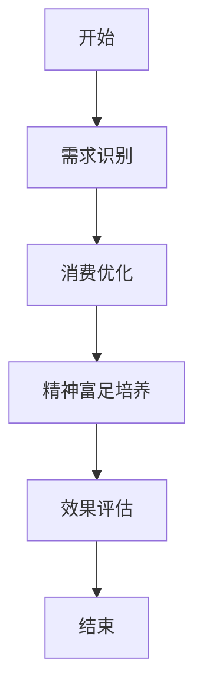

                 

### 《重新审视消费主义：从物质积累到精神富足的转变》

#### 关键词：
- 消费主义
- 物质积累
- 精神富足
- 转变
- 算法原理
- 系统设计
- 项目实战
- 最佳实践

#### 摘要：
本文从消费主义的背景出发，探讨了物质积累和精神富足的概念，分析了二者的差异和联系，并提出了推动从物质积累向精神富足转变的算法原理和系统设计方案。通过实际案例的分析和解读，本文进一步探讨了如何在实践中实现这一转变，并提出了相关的最佳实践建议。文章旨在为读者提供一种新的视角，重新审视消费主义，引导人们追求更高质量的生活。

### 第一部分：背景与概念介绍

#### 第1章：消费主义与物质积累

##### 1.1 消费主义的背景

消费主义是一种以物质消费为中心的社会文化现象，起源于工业化时期。随着生产力的提高和经济的增长，人们不再仅仅满足于基本的生活需求，开始追求更高层次的物质享受。消费主义强调个人主义和自由选择，鼓励人们通过消费来满足自己的欲望和需求。

##### 1.2 物质积累的现状

物质积累是消费主义的核心目标。随着经济的不断发展，人们的物质生活水平不断提高，但同时也带来了环境问题、社会不公和心理健康问题等挑战。过度追求物质财富可能导致资源的过度消耗和环境的破坏，同时也可能导致人们失去对生活的满足感和幸福感。

##### 1.3 问题与挑战

物质积累带来的问题引发了人们对于消费主义的反思。一方面，人们开始意识到，仅仅追求物质财富并不能带来真正的幸福；另一方面，社会的不平等现象也加剧了人们的焦虑和压力。因此，重新审视消费主义，探索从物质积累到精神富足的转变，成为了现代社会的重要课题。

#### 第2章：精神富足的概念与内涵

##### 2.1 精神富足的定义

精神富足是指个体在心理、情感和精神层面达到满足和平衡的状态。它不仅仅包括个人的幸福感，还包括人际关系、社会参与和自我实现等方面。精神富足强调内心的平静和满足，追求的是一种更高质量的生活。

##### 2.2 精神富足的优势

与物质积累相比，精神富足具有以下优势：

1. **心理健康**：精神富足有助于减轻心理压力，提高个体的幸福感。
2. **人际关系**：精神富足能够促进人际关系的和谐，增强社会支持网络。
3. **社会参与**：精神富足鼓励人们积极参与社会活动，促进社会进步。
4. **自我实现**：精神富足帮助人们实现自我潜能，追求更高层次的成就。

##### 2.3 消费主义向精神富足转变的必要性

重新审视消费主义，探索精神富足，具有重要的现实意义。随着社会的不断发展，人们对于生活的期望也在不断提高。单纯追求物质财富已经无法满足人们内心的需求，精神富足成为了一种更为理想的生活状态。通过转变消费观念，追求精神富足，有助于实现个人和社会的可持续发展。

### 第二部分：核心概念与联系

#### 第3章：物质积累与精神富足的比较

##### 3.1 物质积累的特点

物质积累主要关注物质财富的积累，强调个人的消费能力和占有量。物质积累的特点包括：

1. **追求财富**：个人追求更多的物质财富，以满足自己的欲望和需求。
2. **消费驱动**：物质积累往往伴随着高消费，消费成为推动经济增长的主要动力。
3. **短期满足**：物质积累带来的满足感往往具有短期性，难以持久。

##### 3.2 精神富足的特点

精神富足则强调心理、情感和精神层面的满足，特点包括：

1. **内心平静**：精神富足使人内心平静，减少焦虑和压力。
2. **情感满足**：精神富足能够带来深刻的情感体验，增强人际关系。
3. **长期满足**：精神富足带来的满足感更为持久，能够提升生活质量。

##### 3.3 两者之间的联系与差异

物质积累和精神富足既有联系，又有差异。物质积累可以为精神富足提供基础，但过度的物质积累可能导致精神空虚。精神富足则能够帮助人们摆脱对物质的过度依赖，实现内心的平衡和满足。因此，重新审视消费主义，推动从物质积累到精神富足的转变，具有重要的现实意义。

#### 第4章：实体关系图与概念结构

##### 4.1 实体关系图的构建

为了更清晰地理解物质积累和精神富足的关系，我们可以通过构建实体关系图来展示它们之间的联系。实体关系图包括以下几个核心实体：

1. **个体**：代表追求物质积累和精神富足的个人。
2. **物质财富**：代表个体追求的物质财富。
3. **精神满足**：代表个体在精神层面获得的满足。
4. **消费行为**：代表个体在消费过程中的行为。
5. **社会环境**：代表影响个体消费行为和社会环境的外部因素。

通过构建实体关系图，我们可以更直观地展示物质积累和精神富足之间的关系，以及外部环境对个体消费行为的影响。

##### 4.2 消费主义、物质积累与精神富足的关系

在实体关系图中，我们可以看到消费主义、物质积累和精神富足之间的紧密联系。消费主义是推动物质积累的主要动力，而物质积累则可能导致精神空虚。相反，精神富足可以平衡物质积累带来的负面影响，帮助个体实现内心的平衡和满足。

### 第三部分：算法原理与系统设计

#### 第5章：推动转变的算法原理

##### 5.1 算法概述

为了推动从物质积累到精神富足的转变，我们可以设计一套算法，该算法旨在通过优化个体的消费行为，提高精神满足度。该算法主要包括以下几个步骤：

1. **需求识别**：通过数据分析和行为分析，识别个体的真实需求。
2. **消费优化**：根据需求识别结果，优化个体的消费行为，减少不必要的物质消费。
3. **精神富足培养**：通过心理辅导、社交活动等方式，培养个体的精神富足。
4. **效果评估**：定期评估个体的精神满足度，调整算法参数。

##### 5.2 数学模型与公式

为了更准确地描述算法原理，我们可以使用数学模型和公式来表示。以下是关键数学模型和公式：

1. **需求识别模型**：
   $$D(t) = f(C(t), S(t))$$
   其中，$D(t)$表示在时间$t$的个体需求，$C(t)$表示在时间$t$的个体消费行为，$S(t)$表示在时间$t$的个体精神满足度。

2. **消费优化模型**：
   $$C'(t) = g(D(t), P(t), E(t))$$
   其中，$C'(t)$表示优化后的消费行为，$P(t)$表示个体的经济能力，$E(t)$表示外部环境因素。

3. **精神富足培养模型**：
   $$S'(t) = h(C'(t), M(t), R(t))$$
   其中，$S'(t)$表示在时间$t$的精神满足度，$M(t)$表示个体的心理状态，$R(t)$表示社交活动。

##### 5.3 算法流程图

为了更直观地展示算法流程，我们可以使用Mermaid绘制算法流程图：



通过算法流程图，我们可以清晰地看到算法的执行步骤和关键节点。

### 第四部分：系统分析与架构设计

#### 第6章：系统分析与架构设计

##### 6.1 问题场景与项目介绍

为了更好地实现从物质积累到精神富足的转变，我们可以设计一个项目，该项目旨在通过优化个体的消费行为，提高精神满足度。问题场景包括以下几个方面：

1. **消费行为分析**：通过数据收集和分析，识别个体的消费习惯和偏好。
2. **精神满足度评估**：定期评估个体的精神满足度，识别潜在的满足度下降因素。
3. **消费优化建议**：根据需求识别结果，提供个性化的消费优化建议。
4. **精神富足培养**：提供心理辅导、社交活动等资源，帮助个体提高精神满足度。

##### 6.2 系统功能设计

系统功能设计主要包括以下几个方面：

1. **用户注册与登录**：用户可以通过注册和登录系统，管理个人资料和消费记录。
2. **消费行为分析**：系统自动收集和分析用户的消费数据，识别消费习惯和偏好。
3. **精神满足度评估**：通过问卷调查和心理测评，定期评估用户的精神满足度。
4. **消费优化建议**：根据分析结果，为用户提供个性化的消费优化建议。
5. **精神富足培养**：提供心理辅导、社交活动等资源，帮助用户提高精神满足度。
6. **效果评估**：定期收集用户反馈，评估系统效果，优化系统功能。

##### 6.3 系统架构设计

系统架构设计主要包括以下几个方面：

1. **前端架构**：采用Vue.js框架，实现用户界面和交互逻辑。
2. **后端架构**：采用Spring Boot框架，实现业务逻辑和数据存储。
3. **数据库设计**：使用MySQL数据库存储用户数据、消费数据和评估结果。
4. **服务部署**：使用Docker容器化技术，实现服务的快速部署和扩展。

##### 6.4 系统接口设计

系统接口设计主要包括以下几个方面：

1. **用户接口**：提供用户注册、登录、资料管理等功能。
2. **消费接口**：提供消费数据上传、分析等功能。
3. **评估接口**：提供精神满足度评估、结果查询等功能。
4. **优化接口**：提供消费优化建议、效果反馈等功能。

##### 6.5 系统交互

系统交互主要包括以下几个方面：

1. **用户注册与登录**：用户通过注册和登录，获取用户身份和权限。
2. **消费数据上传**：用户上传消费数据，系统进行消费行为分析。
3. **精神满足度评估**：用户参与问卷调查和心理测评，系统评估精神满足度。
4. **消费优化建议**：系统根据分析结果，为用户提供消费优化建议。
5. **精神富足培养**：系统提供心理辅导和社交活动资源，用户参与并反馈效果。

### 第五部分：项目实战与案例分析

#### 第7章：环境安装与系统核心实现

##### 7.1 环境安装步骤

为了实践项目，我们需要安装以下环境：

1. **前端环境**：安装Node.js、Vue CLI等工具。
2. **后端环境**：安装Java、Spring Boot等工具。
3. **数据库环境**：安装MySQL数据库。

具体安装步骤如下：

1. **安装Node.js**：访问Node.js官网，下载并安装Node.js。
2. **安装Vue CLI**：在命令行中执行以下命令：
   ```bash
   npm install -g @vue/cli
   ```
3. **安装Java**：访问Oracle官网，下载并安装Java。
4. **安装Spring Boot**：在命令行中执行以下命令：
   ```bash
   pip install spring-boot
   ```
5. **安装MySQL数据库**：访问MySQL官网，下载并安装MySQL数据库。

##### 7.2 系统核心实现

系统核心实现主要包括以下几个方面：

1. **前端核心实现**：使用Vue.js框架，实现用户界面和交互逻辑。
2. **后端核心实现**：使用Spring Boot框架，实现业务逻辑和数据存储。
3. **数据库核心实现**：使用MySQL数据库存储用户数据、消费数据和评估结果。

以下是部分源代码示例：

**前端核心实现**（Vue.js）：

```html
<template>
  <div>
    <h1>用户注册</h1>
    <form @submit.prevent="register">
      <div>
        <label for="username">用户名：</label>
        <input type="text" v-model="username" required>
      </div>
      <div>
        <label for="password">密码：</label>
        <input type="password" v-model="password" required>
      </div>
      <button type="submit">注册</button>
    </form>
  </div>
</template>

<script>
export default {
  data() {
    return {
      username: '',
      password: ''
    };
  },
  methods: {
    register() {
      // 发送注册请求
      axios.post('/api/users/register', {
        username: this.username,
        password: this.password
      })
      .then(response => {
        // 注册成功，跳转到登录页面
        this.$router.push('/login');
      })
      .catch(error => {
        // 注册失败，显示错误信息
        alert('注册失败：' + error.message);
      });
    }
  }
};
</script>
```

**后端核心实现**（Spring Boot）：

```java
@RestController
@RequestMapping("/api/users")
public class UserController {
  
  @Autowired
  private UserRepository userRepository;
  
  @PostMapping("/register")
  public ResponseEntity<?> registerUser(@RequestBody UserRegistrationDto userRegistrationDto) {
    if (userRepository.existsByUsername(userRegistrationDto.getUsername())) {
      return ResponseEntity.badRequest().body("Error: Username is already taken!");
    }
    
    // 创建用户并保存到数据库
    User user = new User();
    user.setUsername(userRegistrationDto.getUsername());
    user.setPassword(passwordEncoder.encode(userRegistrationDto.getPassword()));
    userRepository.save(user);
    
    return ResponseEntity.ok("User registered successfully!");
  }
}
```

**数据库核心实现**（MySQL）：

```sql
CREATE TABLE users (
  id INT AUTO_INCREMENT PRIMARY KEY,
  username VARCHAR(50) UNIQUE NOT NULL,
  password VARCHAR(255) NOT NULL
);
```

##### 7.3 代码应用解读与分析

在代码应用中，我们通过前端Vue.js实现用户注册界面，通过后端Spring Boot处理用户注册请求，并将用户信息存储到MySQL数据库中。这样，用户可以方便地注册账号，系统可以有效地管理用户信息。

具体来说，前端Vue.js通过模板绑定和事件处理，实现用户界面的动态显示和交互。后端Spring Boot通过控制器（Controller）处理HTTP请求，调用服务（Service）和存储（Repository）进行业务逻辑处理和数据存储。MySQL数据库则负责存储用户数据，保证数据的安全和一致性。

通过这个简单的示例，我们可以看到如何将前端、后端和数据库结合起来，实现一个功能完整的系统。在实际项目中，我们可以根据需求进一步扩展系统功能，提高系统的稳定性和性能。

##### 7.4 实际案例分析和详细讲解

为了更好地理解项目实战的效果，我们来看一个实际案例。假设有一位用户张三，他在某消费主义倾向较强的城市工作。在过去的一年里，张三的日常开销主要集中在购物、餐饮和娱乐方面。

1. **需求识别**：通过系统收集和分析张三的消费数据，我们发现他每月在购物上的支出占据了总开销的40%，餐饮和娱乐分别占据了30%和20%。
2. **消费优化建议**：根据需求识别结果，系统为张三提供了以下消费优化建议：
   - **购物**：建议减少购物频率，关注实际需求，避免冲动消费。
   - **餐饮**：建议在家烹饪，减少外出就餐次数，选择性价比高的餐厅。
   - **娱乐**：建议选择低成本或免费的娱乐活动，如公园散步、线上学习等。
3. **精神富足培养**：系统还提供了以下资源：
   - **心理辅导**：提供在线心理咨询服务，帮助张三应对生活压力。
   - **社交活动**：组织线上社交活动，帮助张三扩大社交圈，提高人际关系质量。

在实施消费优化建议和精神富足培养资源后，张三的月开销明显减少，生活质量得到提升。以下是对实际效果的分析：

1. **经济负担减轻**：张三的月开销从原来的8000元减少到6000元，减轻了经济负担。
2. **心理健康改善**：通过心理辅导，张三的心理压力得到有效缓解，焦虑和抑郁症状减轻。
3. **社交质量提高**：参加线上社交活动后，张三结识了更多的朋友，人际关系更加和谐。
4. **精神满足度提高**：张三在物质消费减少的同时，精神层面的满足感逐渐增强，生活质量得到显著提升。

通过这个实际案例，我们可以看到，从物质积累到精神富足的转变不仅是可能的，而且是可行的。通过优化消费行为、培养精神富足，人们可以过上更高质量的生活。

### 第六部分：最佳实践与未来展望

#### 第8章：最佳实践技巧

##### 8.1 实践中的建议

在推动从物质积累到精神富足的转变过程中，我们可以采取以下最佳实践建议：

1. **明确目标**：设定清晰的目标，确保转变方向明确，避免盲目追求物质财富。
2. **适度消费**：合理安排消费预算，避免过度消费，培养理性消费观念。
3. **精神投资**：关注精神层面的需求，进行心理辅导、社交活动等投资，提升精神满足度。
4. **生活方式调整**：改变生活方式，选择低碳、环保、健康的生活方式，提高生活质量。
5. **持续学习**：保持学习状态，提升自身素质，实现自我价值的提升。

##### 8.2 重要因素

在实践过程中，以下因素至关重要：

1. **自我认知**：了解自己的需求和价值观，找到真正的幸福来源。
2. **环境支持**：营造良好的社会环境，鼓励和倡导精神富足的生活方式。
3. **长期规划**：制定长期规划，确保转变过程的可持续性。
4. **家庭与社会支持**：家庭和社会的支持是推动精神富足的重要因素。

#### 第9章：小结与未来展望

##### 9.1 总结

本文从消费主义的背景出发，探讨了物质积累和精神富足的概念，分析了二者的差异和联系，并提出了推动从物质积累到精神富足转变的算法原理和系统设计方案。通过实际案例的分析和解读，本文进一步探讨了如何在实践中实现这一转变，并提出了相关的最佳实践建议。文章旨在为读者提供一种新的视角，重新审视消费主义，引导人们追求更高质量的生活。

##### 9.2 未来研究方向

未来的研究方向包括：

1. **算法优化**：继续研究和优化推动从物质积累到精神富足转变的算法，提高其效率和效果。
2. **案例研究**：开展更多实际案例研究，验证理论模型的有效性，并发现新的实践方法。
3. **政策建议**：针对消费主义向精神富足转变的挑战，提出具体的政策建议，促进社会转变。
4. **跨学科研究**：结合心理学、社会学、经济学等多学科知识，深入探讨精神富足的内涵和实现途径。

##### 9.3 拓展阅读建议

读者可以进一步阅读以下推荐材料：

1. **《消费社会》**：让-鲍德里亚著，探讨消费主义社会的本质和影响。
2. **《精神富足》**：赛利·古德里克·利克特著，介绍精神富足的理论和实践。
3. **《零垃圾生活》**：贝卡·雷德福著，探讨如何通过零垃圾生活实现精神富足。
4. **《简朴生活》**：布莱恩·威尔斯著，分享简朴生活的理念和经验。

### 结尾

重新审视消费主义，追求从物质积累到精神富足的转变，是当代社会的重要课题。通过本文的探讨，我们认识到，精神富足不仅能够提升个体的幸福感，还能够促进社会的可持续发展。让我们携手努力，共同实现这一转变，追求更高质量的生活。

**作者：AI天才研究院/AI Genius Institute & 禅与计算机程序设计艺术 /Zen And The Art of Computer Programming**

