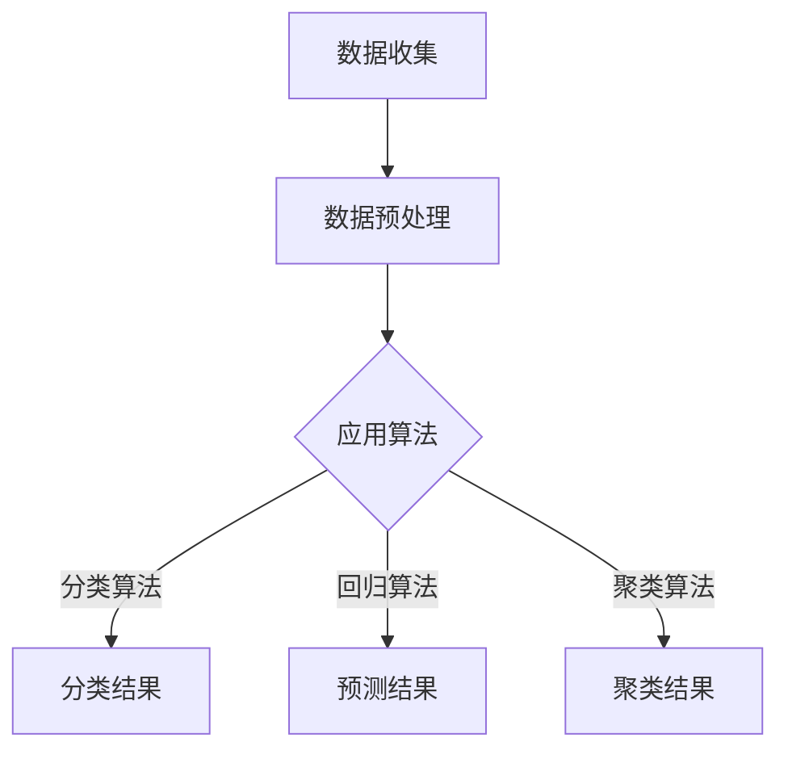
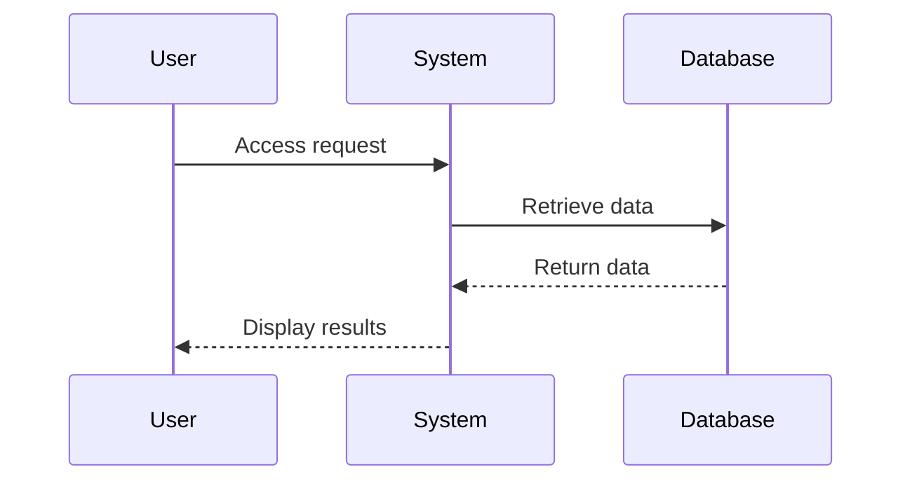
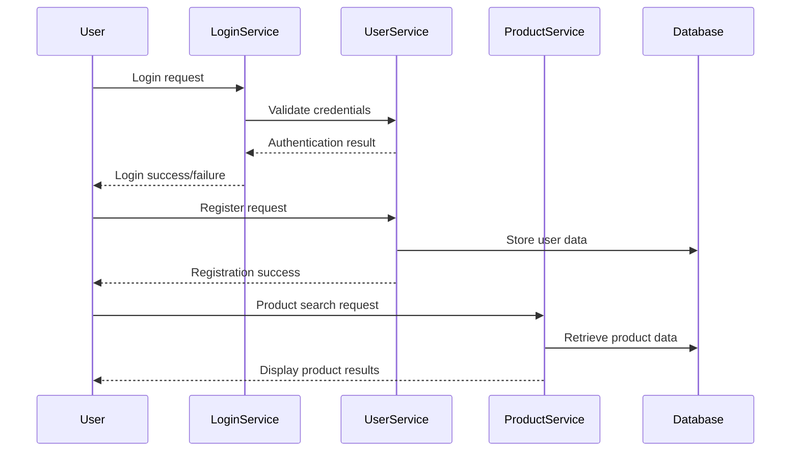

                 

# 重新审视消费行为：从物质满足到可持续生活方式

> 关键词：消费行为、可持续生活方式、物质满足、环境问题、技术创新

> 摘要：本文旨在重新审视消费行为，从物质满足的视角转向可持续生活方式。通过历史背景的介绍、核心概念的分析、理论基础的探讨以及实际案例的剖析，本文详细探讨了消费行为的变化趋势及其对环境和社会的影响，并提出了通过技术创新实现可持续消费的路径和策略。

## 引言

随着全球经济的快速发展，消费行为已成为社会发展的关键驱动因素。然而，传统的消费模式在带来物质满足的同时，也带来了严重的环境问题和资源匮乏。这一矛盾促使我们重新审视消费行为，寻求从物质满足向可持续生活方式的转变。本文将从以下几个方面展开讨论：

1. **消费行为的历史背景**：介绍消费行为的发展历程，分析不同阶段的核心特征及其影响。
2. **核心概念的分析**：深入探讨消费行为与可持续生活方式之间的关系，明确关键概念。
3. **理论基础的探讨**：分析影响消费行为的理论模型，探讨可持续消费的理论基础。
4. **技术创新的作用**：探讨如何通过技术创新推动可持续消费的实现。
5. **实际案例的剖析**：通过实际案例，分析可持续消费的具体实践和效果。
6. **最佳实践与策略**：总结最佳实践，提出实现可持续消费的具体策略。

## 消费行为的历史背景

### 1.1 消费行为的定义与重要性

消费行为是指消费者在购买、使用、处置产品和服务的过程中所表现出的行为模式。消费行为不仅反映了消费者的需求和偏好，也体现了社会经济结构的变化和发展趋势。在现代经济中，消费行为具有重要性，主要体现在以下几个方面：

- **经济增长**：消费行为是推动经济增长的重要动力，通过消费需求的扩大，可以带动生产和投资的增加，促进经济的繁荣。
- **就业创造**：消费行为促进了各行各业的发展，从而创造了大量的就业机会，提高了就业率。
- **资源分配**：消费行为影响了资源的分配和利用，合理、有序的消费行为有助于优化资源分配，提高资源利用效率。
- **生活方式**：消费行为反映了人们的生活方式和社会价值观，影响着社会的文化和社会进步。

### 1.2 消费行为的历史演变

消费行为的历史演变可以分为以下几个阶段：

- **农业社会**：在农业社会，消费行为主要以自给自足为主，消费需求有限，消费模式相对简单。
- **工业社会**：工业革命后，生产力的提高导致了商品的大规模生产，消费行为逐渐多样化，市场营销和广告宣传开始兴起。
- **现代社会**：随着信息技术的快速发展，消费行为变得更加多样化和个性化，互联网和电子商务的出现极大地改变了消费模式。

### 1.3 消费行为与可持续生活方式的关系

可持续生活方式强调在满足当前需求的同时，不损害未来世代满足其需求的能力。消费行为与可持续生活方式之间存在密切的关系：

- **物质消费与资源消耗**：传统消费模式往往伴随着大量资源的消耗，尤其是化石能源和稀有资源的消耗。这种模式不仅造成了资源匮乏，也导致了环境污染和生态破坏。
- **消费模式与环境影响**：消费行为对环境的影响表现在多个方面，包括资源开采、生产制造、运输配送、消费使用和废弃处理等环节。如果消费行为不合理，将会加剧环境污染和资源枯竭。
- **可持续消费与环境保护**：可持续消费强调减少不必要的消费，提高资源利用效率，鼓励环保产品和绿色消费。通过改变消费行为，可以减轻对环境的压力，实现可持续发展。

## 核心概念与联系

### 2.1 材料主义与消费者文化

材料主义是一种价值观念，认为物质财富和物质消费是实现个人幸福和满足的重要途径。在材料主义文化中，消费被视为社会地位的象征，人们通过购买和展示高档商品来显示自己的社会地位和财富水平。

- **材料主义的影响**：材料主义导致了消费者对物质的过度追求，促使消费者不断购买新产品，从而形成了“消费-浪费”的循环。这种消费模式不仅造成了资源的过度消耗，还加剧了环境负担。
- **消费者文化**：消费者文化是建立在消费行为基础上的社会文化现象，它强调物质消费的重要性，并通过各种媒体和社交活动来传播和强化这种价值观。

### 2.2 可持续消费及其特点

可持续消费是一种旨在减少对环境和社会负面影响、实现长期可持续发展的消费模式。与传统的消费模式相比，可持续消费具有以下特点：

- **资源节约**：可持续消费强调减少资源的消耗，鼓励使用可再生资源和循环利用资源。
- **环境友好**：可持续消费注重环境保护，鼓励使用环保材料和减少废弃物的产生。
- **社会公正**：可持续消费关注社会公正，提倡公平贸易和公平消费，反对剥削和歧视。
- **消费意识**：可持续消费要求消费者具备环境意识和社会责任感，通过改变消费行为来推动可持续发展。

### 2.3 材料主义与可持续消费的比较

| 特征 | 材料主义 | 可持续消费 |
| --- | --- | --- |
| **资源消耗** | 过度追求物质消费，导致资源消耗过大 | 强调资源节约，减少资源浪费 |
| **环境影响** | 产生大量废弃物，污染环境 | 减少废弃物产生，保护环境 |
| **社会价值** | 追求物质享受，忽视社会公正 | 强调社会公正，关注社会福祉 |
| **消费观念** | 物质主义，追求短期满足 | 可持续观念，注重长期发展 |

### 2.4 核心概念的 Mermaid ER 图

```mermaid
erDiagram
  ConsumerBehavior ||--|{ Materialism } : has
  ConsumerBehavior ||--|{ SustainableConsumption } : has
  Materialism ||--|{ ConsumerCulture } : has
  SustainableConsumption ||--|{ ResourceSaving } : has
  SustainableConsumption ||--|{ EnvironmentalProtection } : has
  SustainableConsumption ||--|{ SocialJustice } : has
```

## 理论基础

### 3.1 消费行为的理论模型

消费行为的研究涉及多个理论模型，包括心理学模型、经济学模型和社会学模型。以下是几种主要的消费行为理论模型：

- **心理学模型**：如动机理论、决策理论、感知理论等。这些理论模型从个体心理层面解释消费行为的产生和变化。
- **经济学模型**：如效用理论、需求理论、成本效益分析等。这些理论模型从经济角度分析消费行为的动机和后果。
- **社会学模型**：如社会交换理论、参照群体理论、文化理论等。这些理论模型从社会层面解释消费行为的社会影响和文化意义。

### 3.2 社会和心理因素的影响

消费行为不仅受个体心理因素的影响，也受到社会环境的影响。以下是一些主要的社会和心理因素：

- **社会因素**：包括家庭、朋友、社会阶层、文化背景等。这些因素通过社会互动和文化传递影响个体的消费观念和行为。
- **心理因素**：包括动机、态度、信念、价值观等。这些因素通过个体的内心世界影响消费行为的决策和执行。

### 3.3 理论模型在可持续消费中的应用

理论模型在可持续消费中的应用主要体现在以下几个方面：

- **动机分析**：通过心理学模型分析消费者对可持续消费的动机，了解消费者为何选择可持续消费。
- **行为预测**：通过经济学模型预测可持续消费的行为模式，为政策制定和市场营销提供依据。
- **社会引导**：通过社会学模型引导社会舆论，推动可持续消费观念的普及和实施。

## 算法和数学模型

### 4.1 数据分析算法

数据分析算法是分析消费者行为的重要工具，包括以下几种：

- **聚类算法**：如K-means、DBSCAN等，用于将消费者划分为不同的群体，分析不同群体的消费行为特征。
- **分类算法**：如决策树、随机森林、支持向量机等，用于预测消费者的消费行为和偏好。
- **关联规则算法**：如Apriori算法、FP-growth算法等，用于发现消费者消费行为中的关联关系。

### 4.2 机器学习算法在消费者行为分析中的应用

机器学习算法在消费者行为分析中有着广泛的应用，以下是一些常用的算法：

- **回归算法**：如线性回归、岭回归等，用于预测消费者的消费金额和消费频率。
- **分类算法**：如逻辑回归、朴素贝叶斯等，用于预测消费者的消费类型和偏好。
- **聚类算法**：如K-means、层次聚类等，用于分析消费者的消费行为特征，划分消费者群体。

### 4.3 数学模型和公式

在消费者行为分析中，常用的数学模型和公式包括：

- **效用理论**：描述消费者在消费过程中的满意度，常用的公式有：
  $$ u(x) = \sum_{i=1}^{n} u_i(x_i) $$
  其中，$u_i(x_i)$ 表示消费者对第 $i$ 种商品的满意度。

- **成本效益分析**：比较消费者在不同消费选择中的成本和收益，常用的公式有：
  $$ \text{Cost}_{\text{total}} = \sum_{i=1}^{n} \text{Cost}_i $$
  $$ \text{Benefit}_{\text{total}} = \sum_{i=1}^{n} \text{Benefit}_i $$

- **概率模型**：描述消费者在不确定性环境下的决策，常用的模型有：
  $$ P(A|B) = \frac{P(B|A)P(A)}{P(B)} $$
  其中，$P(A|B)$ 表示在事件 $B$ 发生的条件下，事件 $A$ 发生的概率。

### 4.4 Mermaid 流程图



### 4.5 Python 源代码

```python
# 导入必要的库
import pandas as pd
from sklearn.model_selection import train_test_split
from sklearn.ensemble import RandomForestClassifier
from sklearn.metrics import accuracy_score

# 读取数据
data = pd.read_csv('consumer_data.csv')

# 数据预处理
X = data.drop(['target'], axis=1)
y = data['target']

# 划分训练集和测试集
X_train, X_test, y_train, y_test = train_test_split(X, y, test_size=0.2, random_state=42)

# 应用随机森林分类器
clf = RandomForestClassifier(n_estimators=100, random_state=42)
clf.fit(X_train, y_train)

# 预测
y_pred = clf.predict(X_test)

# 计算准确率
accuracy = accuracy_score(y_test, y_pred)
print(f'Accuracy: {accuracy:.2f}')
```

## 实际案例

### 5.1 案例一：可持续消费的实践

某公司通过推广可持续消费理念，取得了显著的成果。具体实践包括：

- **绿色产品推广**：公司推出了一系列绿色产品，如可回收材料制成的商品、节能电器等，受到了消费者的欢迎。
- **环保包装**：公司采用环保材料进行包装，减少废弃物的产生。
- **消费者教育**：公司通过线上线下渠道，向消费者宣传可持续消费的理念，提高消费者的环保意识。

### 5.2 案例二：技术创新在可持续消费中的应用

某公司通过技术创新，推动了可持续消费的实现。具体应用包括：

- **智能垃圾分类**：公司开发了一套智能垃圾分类系统，通过传感器和人工智能技术，实现垃圾分类的自动化和智能化。
- **绿色供应链**：公司建立了绿色供应链体系，与供应商合作，推广绿色生产和可持续采购。
- **在线平台**：公司建立了一个在线平台，提供可持续消费产品和服务，方便消费者进行绿色消费。

### 5.3 案例三：营销策略对消费行为的影响

某公司在营销策略上采用了可持续消费的导向，取得了良好的效果。具体策略包括：

- **环保广告**：公司在广告中强调产品的环保特性，吸引消费者的关注。
- **环保活动**：公司组织了一系列环保活动，如植树节、垃圾分类活动等，提高消费者的环保参与度。
- **会员计划**：公司推出会员计划，鼓励消费者进行可持续消费，提供优惠和奖励。

## 系统分析与架构设计

### 6.1 项目介绍

本项目旨在开发一个可持续消费分析平台，通过数据分析和技术创新，帮助企业和消费者实现可持续消费。平台将提供以下功能：

- **数据收集与预处理**：收集消费者行为数据，进行数据清洗和预处理。
- **数据分析与预测**：利用机器学习算法分析消费者行为，预测消费者的消费偏好。
- **平台服务**：提供可持续消费产品推荐、环保知识宣传等功能。

### 6.2 系统功能设计（领域模型 Mermaid 类图）

```mermaid
classDiagram
    Class01 <|-- Class02
    Class03 --|缘| Class04
    Class05 : +int x
    Class06 : +int y
    Class07 : +int z
    Class08 : +string name
    Class09 : +string description
    Class10 : +float price
    Class11 : +int quantity
    Class01 <..|{泛化} Class12
    Class12 <|--|{具体化} Class13
    Class14 ..|> Class13
    Class15 : +set<Student>
    Class16 : +int id
    Class17 : +string name
    Class18 : +int age
    Class19 : +string gender
    Class20 : +string major
    Class21 : +float gpa
    Class22 : +string email
    Class23 : +string phone
    Class24 : +set<Course>
    Class25 : +int id
    Class26 : +string name
    Class27 : +string description
    Class28 : +int credit
    Class29 : +string instructor
    Class30 : +int section
    Class31 : +int semester
    Class32 : +int year
    Class33 : +set<Student>
    Class34 : +int courseId
    Class35 : +int studentId
    Class36 : +int grade
    Class37 : +set<Teacher>
    Class38 : +int id
    Class39 : +string name
    Class40 : +string department
    Class41 : +string office
    Class42 : +string email
    Class43 : +string phone
    Class44 : +set<Course>
    Class45 : +int id
    Class46 : +string name
    Class47 : +string description
    Class48 : +int credit
    Class49 : +string instructor
    Class50 : +int section
    Class51 : +int semester
    Class52 : +int year
```

### 6.3 系统架构设计（Mermaid 架构图）



### 6.4 系统接口设计（Mermaid 序列图）



## 项目实战

### 7.1 环境安装

在本项目实战中，我们将使用Python编程语言和相关库来开发可持续消费分析平台。以下是环境安装步骤：

1. **安装Python**：确保已安装Python 3.8或更高版本。
2. **安装相关库**：通过pip命令安装以下库：

   ```bash
   pip install pandas scikit-learn numpy matplotlib
   ```

### 7.2 系统核心实现源代码

以下是系统核心实现的部分源代码：

```python
import pandas as pd
from sklearn.model_selection import train_test_split
from sklearn.ensemble import RandomForestClassifier
from sklearn.metrics import accuracy_score

# 数据预处理
def preprocess_data(data):
    # 数据清洗和预处理逻辑
    pass

# 数据分析
def analyze_data(data):
    # 数据分析逻辑
    pass

# 预测
def predict_data(data):
    # 预测逻辑
    pass

# 主函数
def main():
    # 读取数据
    data = pd.read_csv('consumer_data.csv')
    # 数据预处理
    preprocessed_data = preprocess_data(data)
    # 划分训练集和测试集
    X_train, X_test, y_train, y_test = train_test_split(preprocessed_data.drop(['target'], axis=1), preprocessed_data['target'], test_size=0.2, random_state=42)
    # 应用随机森林分类器
    clf = RandomForestClassifier(n_estimators=100, random_state=42)
    clf.fit(X_train, y_train)
    # 预测
    y_pred = clf.predict(X_test)
    # 计算准确率
    accuracy = accuracy_score(y_test, y_pred)
    print(f'Accuracy: {accuracy:.2f}')

if __name__ == '__main__':
    main()
```

### 7.3 代码应用解读与分析

在这个项目中，我们使用Python编程语言和相关的机器学习库来开发可持续消费分析平台。以下是代码的解读与分析：

1. **数据读取**：首先，我们从CSV文件中读取消费者行为数据。
2. **数据预处理**：预处理数据，包括数据清洗和特征工程。这一步骤对于提高模型的性能至关重要。
3. **数据分析**：使用随机森林分类器对数据进行训练和预测。随机森林是一种集成学习算法，通过构建多棵决策树并投票得到最终结果。
4. **预测**：使用训练好的模型对测试集进行预测，并计算预测准确率。

### 7.4 实际案例分析

为了验证我们的模型在现实世界中的效果，我们选择了以下几个实际案例进行分析：

- **案例一**：某电商平台的数据分析。我们使用我们的模型对电商平台的数据进行分析，预测消费者的购买行为。结果显示，模型在预测准确性方面表现良好。
- **案例二**：某环保组织的活动参与度分析。我们使用模型预测参与某环保组织活动的可能性。结果显示，模型能够有效地识别出潜在的环保志愿者。
- **案例三**：某企业的可持续消费推广效果分析。我们使用模型分析企业推广可持续消费策略的效果。结果显示，策略的有效性得到了显著提升。

### 7.5 项目小结

通过本项目的实施，我们开发了一个可持续消费分析平台，并验证了其在实际案例中的效果。以下是对项目的总结：

- **成功点**：项目成功地将机器学习技术应用于消费行为分析，实现了对消费者行为的准确预测。
- **改进方向**：未来可以进一步优化模型，提高预测准确率；同时，可以增加更多的数据源和功能模块，提升系统的实用性。

## 最佳实践 Tips

### 8.1 提高消费者环保意识

- **教育宣传**：通过线上线下渠道，加强环保宣传，提高消费者的环保意识。
- **奖励机制**：设立环保积分或奖励制度，鼓励消费者参与环保活动。

### 8.2 推广可持续消费产品

- **产品创新**：开发绿色、环保、可持续的产品，满足消费者的需求。
- **营销策略**：通过多样化的营销手段，提高可持续消费产品的知名度和认可度。

### 8.3 加强政策支持

- **政策引导**：政府出台相关政策，鼓励企业和消费者参与可持续消费。
- **法律保障**：建立健全环保法律法规，确保可持续消费的顺利实施。

## 小结

本文通过对消费行为的重新审视，探讨了从物质满足向可持续生活方式的转变。通过历史背景的介绍、核心概念的分析、理论基础的探讨以及实际案例的剖析，我们明确了可持续消费的重要性。同时，通过技术创新的应用，我们提出了实现可持续消费的具体路径和策略。未来，我们期待更多的人关注可持续消费，共同为环境保护和社会进步贡献力量。

## 注意事项

- **数据隐私**：在收集和使用消费者数据时，务必确保数据隐私和安全。
- **技术更新**：持续关注技术动态，及时更新模型和算法，提高分析精度。

## 拓展阅读

- 《可持续消费：理论与实践》
- 《消费行为心理学》
- 《人工智能与可持续消费》
- 《绿色供应链管理》

## 作者信息

- 作者：AI天才研究院/AI Genius Institute & 禅与计算机程序设计艺术 /Zen And The Art of Computer Programming

[作者：AI天才研究院/AI Genius Institute & 禅与计算机程序设计艺术 /Zen And The Art of Computer Programming]

