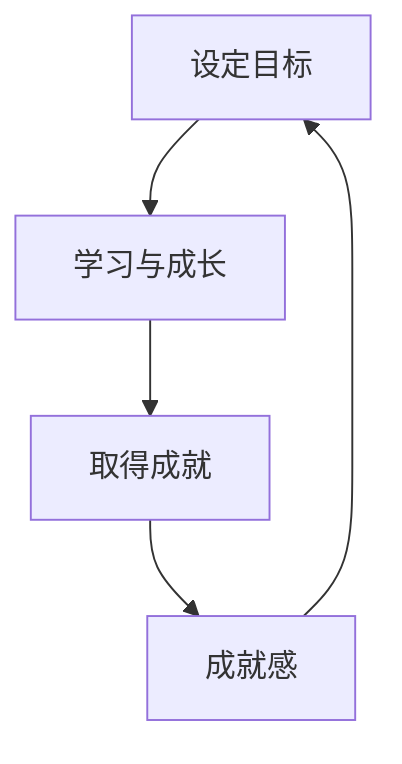

                 

### 重新思考个人成长：从外在成就到内在成熟的蜕变

#### 关键词

- 个人成长
- 外在成就
- 内在成熟
- 心理健康
- 终身学习

#### 摘要

在当今快速发展的社会中，个人成长的重要性不容忽视。本文从外在成就和内在成熟两个角度重新审视个人成长，探讨如何实现从外在成就到内在成熟的蜕变。通过分析个人成长的核心概念、影响因素、以及外在成就与内在成熟的关系，本文提出了平衡外在成就与内在成熟的策略，并结合成功案例，为读者提供实用的成长指导。

#### 目录大纲

```markdown
# 重新思考个人成长：从外在成就到内在成熟的蜕变

## 第一部分：背景与概念

### 第1章：问题的提出与个人成长的必要性

#### 1.1 个人成长的重要性

##### 1.1.1 成就与成长的关系

##### 1.1.2 从外在成就到内在成熟的转变

#### 1.2 个人成长的核心概念

##### 1.2.1 内在成熟

##### 1.2.2 外在成就

##### 1.2.3 成长与成就的边界与外延

#### 1.3 个人成长的概念结构

##### 1.3.1 成长过程的组成

##### 1.3.2 成长与外部环境的互动

#### 1.4 个人成长的影响因素

##### 1.4.1 个人特质与成长

##### 1.4.2 社会与文化因素

##### 1.4.3 教育与培训

#### 1.5 本章小结

## 第二部分：外在成就的审视

### 第2章：外在成就的审视

#### 2.1 外在成就的评估标准

##### 2.1.1 社会评价体系

##### 2.1.2 个人价值观与成就评估

##### 2.1.3 外在成就的多维评价

#### 2.2 外在成就的负面影响

##### 2.2.1 成就压力与焦虑

##### 2.2.2 物质追求的误区

##### 2.2.3 对内在成长的忽视

#### 2.3 外在成就与内在成熟的关系

##### 2.3.1 外在成就对内在成熟的影响

##### 2.3.2 内在成熟对外在成就的推动

##### 2.3.3 平衡外在成就与内在成熟

#### 2.4 个人成长策略与外在成就的关系

##### 2.4.1 成就导向的成长策略

##### 2.4.2 全面发展的成长策略

##### 2.4.3 成长策略的个性化

#### 2.5 本章小结

## 第三部分：内在成熟的探索

### 第3章：内在成熟的核心要素

#### 3.1 内在成熟的概念界定

##### 3.1.1 内在成熟与心理健康的联系

##### 3.1.2 内在成熟的社会意义

##### 3.1.3 内在成熟的核心要素

#### 3.2 自我认知与内在成熟

##### 3.2.1 自我认知的重要性

##### 3.2.2 提高自我认知的方法

##### 3.2.3 自我认知与内在成熟的关系

#### 3.3 情绪管理与内在成熟

##### 3.3.1 情绪管理的基本原则

##### 3.3.2 情绪管理与内在成熟的关系

##### 3.3.3 情绪管理的实际应用

#### 3.4 人际关系与内在成熟

##### 3.4.1 人际关系的重要性

##### 3.4.2 建立健康人际关系的原则

##### 3.4.3 人际关系与内在成熟的关系

#### 3.5 内在成长与终身学习

##### 3.5.1 终身学习的重要性

##### 3.5.2 内在成长与终身学习的关系

##### 3.5.3 终身学习的方法与实践

#### 3.6 本章小结

## 第四部分：外在成就与内在成熟的平衡

### 第4章：实现外在成就与内在成熟的双赢

#### 4.1 成就导向与成长导向的平衡

##### 4.1.1 成就导向与成长导向的定义

##### 4.1.2 平衡两者的策略

##### 4.1.3 实现平衡的挑战与机遇

#### 4.2 制定个人成长计划

##### 4.2.1 成长目标的设定

##### 4.2.2 成长计划的制定

##### 4.2.3 成长计划的执行与评估

#### 4.3 社会支持与个人成长

##### 4.3.1 家庭与社会支持的重要性

##### 4.3.2 社会支持系统的构建

##### 4.3.3 社会支持与个人成长的关系

#### 4.4 成长与成就的互动循环

##### 4.4.1 成长与成就的正反馈循环

##### 4.4.2 处理成就与成长之间的矛盾

##### 4.4.3 保持成长与成就的动态平衡

#### 4.5 本章小结

## 第五部分：成功案例分析

### 第5章：成功人士的内在成熟之路

#### 5.1 成功人士的共同特质

##### 5.1.1 内在成熟的重要性

##### 5.1.2 成功人士的内在成熟特质

##### 5.1.3 内在成熟与成功的关系

#### 5.2 案例分析：外在成就与内在成熟的双赢

##### 5.2.1 案例一：科技企业家的成长之路

##### 5.2.2 案例二：艺术家的心灵探索

##### 5.2.3 案例三：社会活动家的责任与成长

#### 5.3 从案例中学到什么

##### 5.3.1 成功经验的借鉴

##### 5.3.2 内在成长的具体实践

##### 5.3.3 成长与成就的可持续性

#### 5.4 本章小结

## 第六部分：总结与展望

### 第6章：个人成长与社会的责任

#### 6.1 成长与个人责任

##### 6.1.1 成长

##### 6.1.2 个人责任

##### 6.1.3 成长与个人责任的关系

#### 6.2 社会责任与个人成长

##### 6.2.1 社会责任的重要性

##### 6.2.2 社会责任与个人成长的关系

##### 6.2.3 实现社会责任的方法与实践

#### 6.3 未来展望

##### 6.3.1 个人成长的未来趋势

##### 6.3.2 社会责任的发展方向

##### 6.3.3 成长与责任的融合

#### 6.4 本章小结
```

### 第一部分：背景与概念

#### 第1章：问题的提出与个人成长的必要性

##### 1.1 个人成长的重要性

个人成长是一个动态的过程，涉及知识、技能、心理、社交等多个方面的提升。在现代社会中，个人成长的重要性愈发凸显。首先，个人成长是实现自我价值的关键途径。通过不断学习、实践和反思，个人可以不断提高自身能力，实现职业和人生的跨越。其次，个人成长有助于增强心理韧性。在面对压力、挫折和不确定性时，具备成长心态的人更容易调整心态，找到解决问题的方法。最后，个人成长有助于建立良好的人际关系。具备成熟人格特征的人更能够理解和尊重他人，建立稳定和谐的人际关系网。

##### 1.1.1 成就与成长的关系

成就与成长是密不可分的。成就通常是个人成长的直接体现，但成就本身并不等同于成长。从技术角度来看，成长是一个持续的过程，包括知识的积累、技能的提升、心理的成熟等。而成就则是这一过程中取得的具体成果。例如，一位程序员通过不断学习和实践，掌握了多种编程语言和框架，最终成功地开发出一款受欢迎的应用程序，这既是他的成就，也是他成长的体现。

然而，过分追求成就可能导致对成长过程的忽视。在一些情况下，个人为了快速获得成就，可能会选择短期效益明显的方法，而忽略了长期成长的需要。这种追求成就的心态可能导致心理压力增大，影响身心健康。因此，我们需要在追求成就的同时，重视个人成长的过程，保持平衡。

##### 1.1.2 从外在成就到内在成熟的转变

从外在成就到内在成熟的转变是一个重要的成长过程。外在成就通常是通过外在标准来评价的，如职业地位、收入水平、社会认可等。而内在成熟则更多地关注个人的心理素质、情感智慧、人际关系等内在因素。

外在成就的获得往往需要付出巨大的努力和时间，但内在成熟则是一个更加长期和复杂的过程。它不仅仅依赖于个人的知识和技能，更需要情感和心灵上的成长。

**内在成熟的核心要素**包括：

- **自我认知**：了解自己的优点和缺点，明确自己的价值观和目标。
- **情绪管理**：学会控制自己的情绪，以积极的态度应对生活中的挑战。
- **人际关系**：建立健康的人际关系，学会有效沟通和合作。
- **终身学习**：持续学习，不断更新知识和技能，以适应不断变化的环境。

**内在成熟的社会意义**在于，它不仅有助于个人的全面发展，还有助于社会的和谐与进步。一个内心成熟的人更有可能成为一个负责任的公民，为社会作出积极的贡献。

##### 1.2 个人成长的核心概念

**内在成熟**是指一个人在心理和情感上的成熟程度，包括自我认知、情绪管理和人际关系等方面。它不仅关乎个人的心理健康，也影响着个人的生活质量和社会功能。

**外在成就**是指个人在职业、学术、艺术等领域取得的具体成果和荣誉。外在成就通常通过外在标准来衡量，如职位、收入、奖项等。

**成长与成就的边界与外延**是一个值得探讨的问题。从边界来看，成长和成就有一定的重叠，但它们也存在明显的区别。成长是一个持续的过程，而成就通常是这一过程中取得的具体成果。从外延来看，成长不仅仅关注个人的成就，还涉及个人的心理健康、人际关系、社会功能等多个方面。

##### 1.3 个人成长的概念结构

个人成长是一个复杂的过程，涉及到多个方面的提升。从结构上来看，个人成长主要包括以下几个方面：

- **知识技能**：通过学习和实践，不断积累和提高自己的知识和技能。
- **心理素质**：通过心理训练和调整，提高自己的心理韧性，更好地应对生活中的挑战。
- **情感智慧**：通过情感体验和学习，提高自己的情感智慧，更好地理解和管理自己的情绪。
- **人际关系**：通过建立和维护良好的人际关系，提高自己的社交能力和社会影响力。

个人成长不仅与个人自身的发展有关，还与外部环境密切相关。外部环境包括家庭、学校、社会等，这些因素对个人成长产生重要影响。

**成长与外部环境的互动**是一个动态的过程。个人成长不仅受到外部环境的制约，还会对环境产生影响。例如，一个积极向上的社会环境有助于个人成长，而一个充满压力和竞争的环境可能会对个人成长产生负面影响。

##### 1.4 个人成长的影响因素

个人成长是一个多因素影响的过程，涉及个人特质、社会文化因素和教育与培训等方面。

**个人特质**对个人成长具有重要影响。例如，个体的动机、性格、价值观等会影响其成长的速度和方向。一个有强烈成长动机的人往往能够更快地实现个人成长。

**社会与文化因素**也对个人成长产生重要影响。社会文化背景、家庭环境、社会期望等都会影响个人的成长过程。例如，一个重视教育的文化环境有助于个人成长，而一个缺乏支持和理解的文化环境可能会对个人成长产生阻碍。

**教育与培训**是个人成长的重要途径。通过正规教育、职业培训等途径，个人可以获得必要的知识和技能，提高自身的竞争力。教育与培训不仅影响个人的职业发展，也对其心理素质和情感智慧产生深远影响。

**个人特质与成长**的关系是一个复杂的问题。一方面，个人特质如动机、性格等会影响个人的成长速度和方向；另一方面，成长过程也会对个人特质产生影响。例如，通过不断学习和实践，一个人可能会逐渐改变自己的性格和价值观，从而实现个人成长。

**社会与文化因素**对个人成长的影响主要体现在以下几个方面：

1. **价值观和信仰**：社会文化背景会影响个人的价值观和信仰，从而影响其成长方向和速度。
2. **社会期望**：社会对个人的期望会影响个人的行为和目标设定，从而影响其成长。
3. **文化传统**：文化传统会影响个人的思维方式和生活习惯，从而影响其成长过程。

**教育与培训**在个人成长中的重要性不可忽视。通过正规教育和职业培训，个人可以获得必要的知识和技能，提高自身的竞争力。此外，教育与培训还可以提高个人的心理素质和情感智慧，促进其全面发展。

**教育体系的设计**是一个复杂的问题。一个有效的教育体系应该能够满足不同人群的需求，提供多样化的学习机会，培养具有创新精神和批判性思维的人才。

##### 1.5 本章小结

个人成长是一个复杂而重要的过程，涉及多个方面的提升。从外在成就到内在成熟的转变是一个重要的成长过程。在追求外在成就的同时，我们应重视内在成长，实现个人全面发展的目标。

### 第二部分：外在成就的审视

#### 第2章：外在成就的审视

外在成就是一个人在社会环境中通过努力和表现获得的具体成果，如职业地位、收入水平、学术成就等。在当今社会，外在成就常常被视为个人能力和价值的体现。然而，深入审视外在成就，我们不仅需要考虑其评估标准，还需认识到其负面影响，以及与内在成熟的关系。

##### 2.1 外在成就的评估标准

外在成就的评估标准多种多样，不同的社会和文化背景可能会有不同的评价体系。以下是一些常见的评估标准：

1. **职业地位**：包括职位级别、工作稳定性等。例如，高管职位、高级技术专家等通常被认为是职业地位高的标志。
2. **收入水平**：个人的薪酬水平是评估外在成就的重要标准之一。高收入往往意味着较高的社会地位和较强的经济实力。
3. **学术成就**：包括学位、发表的学术论文、科研项目等。在学术界，学术论文的发表数量和质量是衡量学术成就的重要指标。
4. **社会荣誉**：如获得的奖项、荣誉称号等，这些荣誉通常代表着社会对个人成就的认可。
5. **公众形象**：个人的公众形象，如媒体曝光率、社交媒体关注度等，也是评估外在成就的一个方面。

每种评估标准都有其优缺点。例如，职业地位和收入水平虽然能直观地反映一个人的经济实力和社会地位，但并不能完全体现其个人能力和贡献。学术成就和社会荣誉虽然具有一定的权威性，但可能存在评选标准和透明度不足的问题。

**社会评价体系**对个人的外在成就有重要影响。在一个强调物质财富和职业地位的社会，人们可能会更加注重外在成就的获得，而忽视内在成长。这种评价体系可能会带来一系列负面影响。

##### 2.1.1 社会评价体系

社会评价体系是指社会对个人成就的评价标准和机制。它受到文化、历史、经济等多方面因素的影响，往往具有强烈的主观性和社会性。

1. **文化因素**：不同文化对个人成就的评价标准有所不同。例如，在强调集体主义的文化中，团队合作和社会贡献可能被视为更高价值的成就。
2. **历史因素**：历史背景会影响社会评价体系的形成和发展。例如，在一个科技迅速发展的时代，技术成就可能会被赋予更高的价值。
3. **经济因素**：经济状况也会影响社会评价体系。在一个经济繁荣的社会，高收入和职业地位可能被视为更高的成就。

社会评价体系对个人外在成就的评估具有显著影响。在一个强调个人主义和物质成就的社会，个人可能会更加注重外在成就的获取，而忽视内在成长。这种评价体系可能会导致个人产生焦虑、压力和自我怀疑等问题。

**个人价值观与成就评估**的关系也是一个值得探讨的问题。个人价值观是指个人对事物和行为的基本判断标准。不同的价值观会导致不同的成就评估标准。

1. **功利主义价值观**：强调物质成就和社会地位，往往注重外在成就的获取。
2. **道德主义价值观**：强调道德原则和价值观的实现，可能更加注重内在成长和社会责任。

个人价值观对成就评估的影响是一个动态的过程。在不同的生活阶段和环境下，个人的价值观可能会有所变化，从而影响其成就评估标准。

##### 2.1.2 个人价值观与成就评估

个人的价值观对其成就评估有重要影响。不同的价值观会导致不同的成就追求和评估标准。

1. **功利主义价值观**：追求物质财富和社会地位，往往将外在成就作为衡量个人成功的重要标准。这种价值观可能导致个人在追求外在成就的过程中忽视内在成长。
2. **道德主义价值观**：强调道德原则和价值观的实现，可能更加注重内在成长和社会责任。这种价值观有助于个人在追求成就的同时，保持内心的平和和成熟。

在现代社会，外在成就的评价标准越来越多元化。除了职业地位、收入水平等传统指标外，个人的社会责任感、创新能力、心理素质等也成为重要的评价标准。

**多维评价**是对个人外在成就的全面评估。多维评价体系不仅考虑个人的职业成就和学术成果，还考虑个人的社会责任感、创新能力、心理素质等多方面因素。

1. **职业成就**：包括职位、薪酬、行业影响力等。
2. **学术成就**：包括论文发表、科研项目、学术影响力等。
3. **社会责任**：包括公益参与、环保行动、社区贡献等。
4. **创新能力**：包括技术创新、产品开发、解决方案等。
5. **心理素质**：包括情绪管理、心理韧性、心理健康等。

多维评价有助于更全面地评估个人的外在成就，避免单一维度的评价导致的偏差和误导。

##### 2.1.3 外在成就的多维评价

多维评价体系有助于更全面地评估个人的外在成就。通过考虑职业成就、学术成就、社会责任感、创新能力和心理素质等多个方面，多维评价能够更准确地反映个人的综合实力和贡献。

1. **职业成就**：评估个人的职业发展，包括职位晋升、薪酬水平、行业影响力等。
2. **学术成就**：评估个人的学术表现，包括论文发表、科研项目、学术影响力等。
3. **社会责任**：评估个人对社会的贡献，包括公益参与、环保行动、社区贡献等。
4. **创新能力**：评估个人的创新能力，包括技术创新、产品开发、解决方案等。
5. **心理素质**：评估个人的心理素质，包括情绪管理、心理韧性、心理健康等。

多维评价不仅能够更全面地反映个人的外在成就，还能帮助个人更加全面地认识自己，明确未来的成长方向。

##### 2.2 外在成就的负面影响

尽管外在成就被视为个人成功的标志，但其负面影响也不容忽视。以下是一些常见的负面影响：

**成就压力与焦虑**：为了追求更高的外在成就，个人可能会承受巨大的压力和焦虑。这种压力可能导致心理健康问题，如焦虑症、抑郁症等。

**物质追求的误区**：过分追求物质成就可能导致个人陷入物质追求的误区。过分关注物质财富和物质享受，可能会忽视精神层面的需求，导致生活质量下降。

**对内在成长的忽视**：追求外在成就的过程中，个人可能会忽视内在成长。这种忽视可能导致心理素质下降，情感智慧缺失，人际关系问题等。

##### 2.2.1 成就压力与焦虑

**成就压力**是追求外在成就时常见的问题。个人为了获得更高的职业地位、收入水平或其他外在成就，可能会承受巨大的心理压力。这种压力源可能来自以下几个方面：

1. **自我期望**：个人对自己设定的过高目标可能导致压力。例如，为了获得更高的职位或更高的收入，个人可能会不断加班、学习新技能，从而产生压力。
2. **社会期望**：社会对个人的期望也可能导致压力。在一个强调成功和竞争的社会中，个人可能会感受到来自社会的压力，从而增加心理负担。
3. **工作环境**：工作环境中的竞争和压力也可能加剧成就压力。例如，在一个竞争激烈的公司中，员工可能会为了争取更多的资源和机会而承受巨大的压力。

**焦虑**是成就压力的常见表现。焦虑可能会导致一系列生理和心理反应，如失眠、疲劳、注意力不集中等。长期焦虑还可能对个人的心理健康产生负面影响，甚至引发严重的心理健康问题。

为了应对成就压力和焦虑，个人可以采取以下策略：

1. **设定合理的目标**：设定合理的目标可以减少过高的期望带来的压力。个人应该根据自己的能力和实际情况，设定既具有挑战性又能够实现的目标。
2. **时间管理**：合理安排时间，避免过度工作和疲劳。通过有效的时间管理，个人可以更好地平衡工作与生活，减少压力。
3. **心理健康支持**：寻求心理健康支持，如心理咨询、心理治疗等。通过专业的心理健康支持，个人可以学会应对压力和焦虑的有效方法。
4. **放松与休息**：保持良好的休息和放松习惯，如定期锻炼、阅读、旅行等。这些活动可以帮助个人缓解压力，提高心理健康水平。

**物质追求的误区**指的是个人在追求外在成就时，过分关注物质财富和物质享受，而忽视精神层面的需求。这种误区可能导致以下问题：

1. **生活失衡**：过分追求物质成就可能导致生活失衡。个人可能会将大部分时间和精力投入到工作和物质追求中，忽视家庭、朋友和健康等精神层面的需求。
2. **心理依赖**：物质追求可能导致心理依赖。个人可能会陷入对物质的过度依赖，将物质成就视为自我价值的唯一标准，从而忽视其他重要的生活方面。
3. **幸福感缺失**：过分追求物质成就可能导致幸福感缺失。尽管个人可能通过物质财富获得了短暂的满足，但这种满足往往无法持久，从而影响个人的长期幸福感。

为了避免物质追求的误区，个人可以采取以下策略：

1. **价值观调整**：重新审视自己的价值观，明确物质成就与精神需求的平衡。个人应该认识到物质成就只是生活的一部分，不能代表全部生活。
2. **精神追求**：培养对精神层面的兴趣和追求，如阅读、艺术、哲学等。通过精神追求，个人可以获得更深层次的满足和幸福感。
3. **生活规划**：合理规划自己的生活，确保工作和生活之间的平衡。通过平衡工作和生活，个人可以更好地享受生活的各个层面。

##### 2.2.3 对内在成长的忽视

在追求外在成就的过程中，个人往往容易忽视内在成长。这种忽视可能导致以下问题：

1. **心理素质下降**：忽视内在成长可能导致个人的心理素质下降。缺乏情感智慧和情绪管理能力，个人可能难以应对生活中的挑战和压力。
2. **人际关系问题**：忽视内在成长可能导致人际关系问题。缺乏自我认知和人际沟通能力，个人可能难以建立和维护健康的人际关系。
3. **幸福感缺失**：忽视内在成长可能导致幸福感缺失。缺乏精神追求和心灵满足，个人可能难以获得深层次的幸福。

为了平衡外在成就与内在成长，个人可以采取以下策略：

1. **定期反思**：定期反思自己的成长过程，了解自己的内在需求和成长方向。通过反思，个人可以更好地认识自己，明确自己的成长目标。
2. **持续学习**：持续学习，提高自己的知识和技能。通过学习，个人可以不断扩展自己的认知边界，提高内在成熟程度。
3. **心理成长**：关注自己的心理成长，培养自我认知和情绪管理能力。通过心理成长，个人可以更好地应对生活中的挑战，提高生活质量。

##### 2.3 外在成就与内在成熟的关系

外在成就与内在成熟之间存在复杂的相互作用关系。一方面，外在成就可能会对内在成熟产生积极影响；另一方面，内在成熟也可能促进外在成就的取得。以下分析这两个方面的影响：

**外在成就对内在成熟的影响**

1. **积极的反馈循环**：当一个人取得外在成就时，如晋升、获得奖项等，这通常会带来积极的情绪体验，如成就感、自信等。这些积极的情绪体验有助于提高个人的内在成熟程度。例如，成就感可以增强个人的自我认知和自信心，促进其继续追求更高的目标。
2. **社会认可**：外在成就往往能够获得社会的认可，这种认可有助于提升个人的社会地位和人际关系。一个在社会中取得成就的人通常更容易获得他人的尊重和支持，这有助于其建立健康的人际关系，提高内在成熟。
3. **激励作用**：外在成就可以激励个人继续努力，追求更高的目标。例如，一个获得学术奖项的学生可能会受到激励，继续深入研究，提高自己的学术水平。这种积极的激励作用有助于个人实现持续成长。

**内在成熟对外在成就的推动**

1. **心理韧性**：内在成熟，如良好的情绪管理和心理韧性，有助于个人更好地应对挫折和压力。这种心理韧性使个人在面对挑战时能够保持冷静和专注，从而更容易取得外在成就。例如，一个具备良好情绪管理能力的人在面对工作压力时能够更好地应对，从而提高工作效率。
2. **人际沟通**：内在成熟还包括良好的人际沟通能力。一个具备良好人际沟通能力的人能够更有效地与他人合作，建立良好的人际关系。这种能力有助于个人在工作中获得更多的机会和资源，从而更容易取得外在成就。
3. **自我驱动**：内在成熟有助于个人形成自我驱动力。一个具备自我驱动力的人能够更好地设定目标，制定计划，并坚持不懈地追求自己的目标。这种自我驱动力有助于个人在职业和学术领域取得更高的成就。

**平衡外在成就与内在成熟**

在追求外在成就的同时，保持内在成熟至关重要。以下是一些实现平衡的策略：

1. **自我认知**：通过自我认知，了解自己的价值观、兴趣和需求，明确自己的成长方向。这有助于个人在追求外在成就时，不偏离内在成长的目标。
2. **情绪管理**：培养良好的情绪管理能力，学会在面对挑战和压力时保持冷静和积极。这种能力有助于个人在追求外在成就的过程中，保持心理平衡和健康。
3. **时间管理**：合理安排时间，确保工作和休息之间的平衡。通过有效的时间管理，个人可以更好地兼顾外在成就和内在成长。
4. **终身学习**：持续学习，提高自己的知识和技能。通过终身学习，个人可以不断提升自己的内在成熟程度，从而更好地应对外在成就带来的挑战。

##### 2.4 个人成长策略与外在成就的关系

个人成长策略是指个人为实现自身成长目标所采取的一系列行动和措施。这些策略不仅影响个人的成长速度和质量，还与外在成就的取得密切相关。

**成就导向的成长策略**主要关注个人在职业、学术或其他领域中的外在成就。这类策略通常包括以下几个方面：

1. **设定目标**：明确个人的成长目标，如晋升、获得奖项、完成科研项目等。目标设定有助于个人有针对性地进行努力，提高成长效率。
2. **持续学习**：通过学习新的知识和技能，不断提升自己的竞争力。持续学习不仅有助于个人在职业领域取得成就，还能提高内在成熟程度。
3. **实践应用**：将所学知识和技能应用于实际工作中，通过实践来检验和提升自己的能力。实践应用有助于个人将理论知识转化为实际能力，从而实现职业上的突破。
4. **社会交往**：积极参与社会交往，建立广泛的人际关系网络。通过社会交往，个人可以获取更多的资源和机会，从而提高外在成就。

尽管成就导向的成长策略有助于个人在职业和学术领域取得成就，但过于强调外在成就可能导致内在成长的忽视。因此，个人需要结合全面发展策略，实现外在成就与内在成熟的平衡。

**全面发展策略**旨在全面提升个人的素质和能力，包括以下几个方面：

1. **心理素质**：通过心理训练和情绪管理，提高个人的心理素质，增强心理韧性。
2. **情感智慧**：通过情感体验和学习，提高个人的情感智慧，更好地理解和管理自己的情绪。
3. **人际关系**：通过建立和维护良好的人际关系，提高个人的社交能力和人际沟通能力。
4. **终身学习**：持续学习，不断更新知识和技能，以适应快速变化的社会环境。

全面发展策略不仅有助于个人在职业和学术领域取得成就，还能提高个人的内在成熟程度，实现全面发展的目标。

**个性化成长策略**是指根据个人的特点和需求，制定适合自己的成长计划。这种策略注重个体的独特性，有助于最大化个人潜力。

1. **兴趣驱动**：根据个人的兴趣和爱好，选择适合自己的成长方向。兴趣驱动有助于个人在成长过程中保持热情和动力。
2. **个性优势**：发挥个人的个性优势，如沟通能力、领导力等。个性优势有助于个人在职业和社交中取得更好的成就。
3. **个性化学习**：采用适合自己的学习方法和策略，如在线课程、实践项目等。个性化学习有助于提高学习效果，加速个人成长。

**个性化成长策略**有助于个人在追求外在成就的同时，保持内在成长，实现全面发展的目标。

##### 2.5 本章小结

外在成就是一个人在社会环境中通过努力和表现获得的具体成果，其评估标准多种多样。然而，追求外在成就的过程中，个人也可能会面临成就压力、焦虑、物质追求误区等问题。因此，我们需要重视内在成长，实现外在成就与内在成熟的平衡。通过设定合理的目标、持续学习、情绪管理和个性化成长策略，个人可以更好地平衡外在成就与内在成长，实现全面发展的目标。

### 第三部分：内在成熟的探索

#### 第3章：内在成熟的核心要素

内在成熟是指一个人在心理和情感上的成熟程度，是个人成长的重要组成部分。它不仅关乎个人的心理健康，还影响个人的生活质量和社会功能。本章将探讨内在成熟的核心要素，包括自我认知、情绪管理和人际关系等。

##### 3.1 内在成熟的概念界定

**内在成熟**是一个人在情感、认知和行为上的稳定发展状态。它涉及以下几个方面：

1. **自我认知**：了解自己的优点和缺点，明确自己的价值观和目标。
2. **情绪管理**：学会控制自己的情绪，以积极的态度应对生活中的挑战。
3. **人际关系**：建立健康的人际关系，学会有效沟通和合作。

**内在成熟**与**心理健康**密切相关。一个内心成熟的人通常具备较高的心理健康水平，能够更好地应对生活中的压力和挑战。

**内在成熟的社会意义**在于，它不仅有助于个人的全面发展，还有助于社会的和谐与进步。一个内心成熟的人更有可能成为一个负责任的公民，为社会作出积极的贡献。

##### 3.1.1 内在成熟与心理健康的联系

**内在成熟**与**心理健康**之间存在密切的联系。一个内心成熟的人通常具备以下心理健康的特征：

1. **情绪稳定性**：能够有效管理自己的情绪，不会因小事而情绪波动。
2. **自我认知**：清楚自己的优点和缺点，能够自我接纳和自我成长。
3. **心理韧性**：面对困难和挑战时，能够保持乐观和积极的心态。
4. **人际关系**：能够建立和维护健康的人际关系，获得情感支持和安全感。

**心理健康**是**内在成熟**的基础。一个心理健康的人更容易实现内在成熟，而一个内心成熟的人也更有可能保持心理健康。

**内在成熟**与**心理健康**的关系可以用以下ER实体关系图来表示：

```mermaid
erDiagram
    P__(Person) ||--|{ M__(MentalHealth)}
    P ||--|{ I__(InnerMaturity)}
    M && I
```

在上述ER实体关系图中，`Person`表示个体，`MentalHealth`表示心理健康，`InnerMaturity`表示内在成熟。两者之间存在双向关联，即心理健康影响内在成熟，内在成熟也影响心理健康。

##### 3.1.2 内在成熟的社会意义

**内在成熟**不仅对个人的心理健康有益，还对社会的和谐与进步具有重要意义。以下是内在成熟的社会意义的几个方面：

1. **促进社会和谐**：内心成熟的人通常更加宽容和理解，能够更好地处理人际关系中的冲突，从而促进社会的和谐与稳定。
2. **提高社会参与度**：内心成熟的人更有可能积极参与社会事务，如志愿服务、公益活动等，为社会作出贡献。
3. **培养社会责任感**：内心成熟的人更容易培养出社会责任感，成为一个有责任心的公民，为社会的发展和进步贡献力量。

**内在成熟**的社会意义可以用以下ER实体关系图来表示：

```mermaid
erDiagram
    S__(Society) ||--|{ I__(InnerMaturity)}
    S ||--|{ P__(PublicHarmony)}
    S ||--|{ S__(SocialParticipation)}
    S ||--|{ R__(SocialResponsibility)}
    I && P && S && R
```

在上述ER实体关系图中，`Society`表示社会，`InnerMaturity`表示内在成熟，`PublicHarmony`表示社会和谐，`SocialParticipation`表示社会参与度，`SocialResponsibility`表示社会责任感。内在成熟与社会和谐、社会参与度和社会责任感之间存在紧密关联。

##### 3.1.3 内在成熟的核心要素

**内在成熟**的核心要素包括以下几个方面：

1. **自我认知**：自我认知是指个体对自己的认识和理解，包括自己的优点、缺点、价值观和目标。自我认知有助于个体明确自己的定位，做出更符合自身特点的决策。

2. **情绪管理**：情绪管理是指个体对自身情绪的控制和调节能力。一个能够有效管理情绪的人，能够更好地应对生活中的挑战和压力，保持心理健康。

3. **人际关系**：人际关系是指个体与他人之间的互动关系。一个能够建立和维护健康人际关系的人，能够获得他人的支持和帮助，提高生活质量。

以下是一个简化的ER实体关系图，展示内在成熟的核心要素及其相互关系：

```mermaid
erDiagram
    I__(InnerMaturity) ||--|{ S__(SelfAwareness)}
    I ||--|{ E__(EmotionManagement)}
    I ||--|{ R__(InterpersonalRelationships)}
    S && E && R
```

在上述ER实体关系图中，`InnerMaturity`表示内在成熟，`SelfAwareness`表示自我认知，`EmotionManagement`表示情绪管理，`InterpersonalRelationships`表示人际关系。这三个要素共同构成了内在成熟的核心。

##### 3.2 自我认知与内在成熟

**自我认知**是内在成熟的重要组成部分。它涉及个体对自身的了解和认识，包括自己的优点、缺点、价值观和目标。自我认知有助于个体明确自己的定位，做出更符合自身特点的决策。

**自我认知的重要性**体现在以下几个方面：

1. **明确目标**：通过自我认知，个体可以了解自己的兴趣、优势和目标，从而更明确自己的职业和人生规划。

2. **提高决策质量**：自我认知有助于个体在面临选择时，做出更符合自身特点和价值观的决策。

3. **促进自我成长**：自我认知使个体能够认识到自己的不足，从而有针对性地进行改进和提升，促进自我成长。

**提高自我认知的方法**包括：

1. **反思**：定期反思自己的行为、思维和情感，分析其中的优缺点。

2. **反馈**：积极寻求他人的反馈，了解他人对自己的看法和评价。

3. **自我评估**：定期进行自我评估，分析自己的表现和进步。

**自我认知与内在成熟的关系**可以用以下ER实体关系图来表示：

```mermaid
erDiagram
    I__(InnerMaturity) ||--|{ S__(SelfAwareness)}
    S ||--|{ G__(GoalSetting)}
    S ||--|{ D__(DecisionMaking)}
    S ||--|{ C__(SelfImprovement)}
    I && G && D && C
```

在上述ER实体关系图中，`InnerMaturity`表示内在成熟，`SelfAwareness`表示自我认知，`GoalSetting`表示目标设置，`DecisionMaking`表示决策制定，`SelfImprovement`表示自我提升。自我认知与目标设置、决策制定和自我提升之间存在紧密关联，共同促进内在成熟。

##### 3.3 情绪管理与内在成熟

**情绪管理**是内在成熟的重要组成部分。它涉及个体对自身情绪的控制和调节能力。一个能够有效管理情绪的人，能够更好地应对生活中的挑战和压力，保持心理健康。

**情绪管理的基本原则**包括：

1. **接受情绪**：接受自己的情绪，不逃避或压抑。

2. **识别情绪**：学会识别自己的情绪，了解情绪的产生原因。

3. **表达情绪**：以适当的方式表达情绪，避免对他人造成伤害。

4. **调节情绪**：学会通过积极的方法调节情绪，如深呼吸、放松训练等。

**情绪管理与内在成熟的关系**可以用以下ER实体关系图来表示：

```mermaid
erDiagram
    I__(InnerMaturity) ||--|{ E__(EmotionManagement)}
    E ||--|{ A__(Acceptance)}
    E ||--|{ R__(Recognition)}
    E ||--|{ E__(Expression)}
    E ||--|{ M__(Regulation)}
    I && A && R && E && M
```

在上述ER实体关系图中，`InnerMaturity`表示内在成熟，`EmotionManagement`表示情绪管理，`Acceptance`表示接受情绪，`Recognition`表示识别情绪，`Expression`表示表达情绪，`Regulation`表示调节情绪。情绪管理与接受情绪、识别情绪、表达情绪和调节情绪之间存在紧密关联，共同促进内在成熟。

**情绪管理的实际应用**包括：

1. **工作压力管理**：通过情绪管理，个体能够更好地应对工作压力，提高工作效率。

2. **人际关系维护**：情绪管理有助于个体在人际交往中保持冷静和理智，避免冲突和误解。

3. **心理健康维护**：情绪管理有助于个体保持心理健康，预防心理疾病的发生。

##### 3.4 人际关系与内在成熟

**人际关系**是内在成熟的重要组成部分。它涉及个体与他人的互动和交往。一个能够建立和维护健康人际关系的人，能够获得他人的支持和帮助，提高生活质量。

**人际关系的重要性**体现在以下几个方面：

1. **情感支持**：人际关系为个体提供情感支持，帮助个体在困难和挑战中保持积极和乐观的心态。

2. **社会资源**：人际关系为个体提供社会资源，如信息、机会和资源等，有助于个体的成长和发展。

3. **心理健康**：健康的人际关系有助于个体保持心理健康，预防心理问题的发生。

**建立健康人际关系的原则**包括：

1. **诚信**：诚信是建立健康人际关系的基础。一个诚信的人能够赢得他人的信任和尊重。

2. **尊重**：尊重他人的观点和感受，避免对他人进行指责和批评。

3. **沟通**：有效沟通是建立和维护健康人际关系的关键。一个善于沟通的人能够更好地表达自己的想法和需求，理解他人的观点和感受。

4. **共赢**：追求共赢是建立健康人际关系的原则。一个追求共赢的人能够与他人建立互信和合作关系。

**人际关系与内在成熟的关系**可以用以下ER实体关系图来表示：

```mermaid
erDiagram
    I__(InnerMaturity) ||--|{ R__(InterpersonalRelationships)}
    R ||--|{ S__(SocialSupport)}
    R ||--|{ R__(SocialResources)}
    R ||--|{ P__(PsychologicalHealth)}
    I && S && R && P
```

在上述ER实体关系图中，`InnerMaturity`表示内在成熟，`InterpersonalRelationships`表示人际关系，`SocialSupport`表示社会支持，`SocialResources`表示社会资源，`PsychologicalHealth`表示心理健康。人际关系与社会支持、社会资源、心理健康之间存在紧密关联，共同促进内在成熟。

##### 3.5 内在成长与终身学习

**内在成长**与**终身学习**密切相关。终身学习不仅有助于个体不断更新知识和技能，提高职业竞争力，还能促进个体的内在成长。

**终身学习的重要性**体现在以下几个方面：

1. **知识更新**：随着科技和社会的快速发展，知识更新速度加快。终身学习有助于个体不断更新知识和技能，适应新的环境和挑战。

2. **职业发展**：终身学习有助于个体在职业生涯中保持竞争力，实现职业发展。

3. **个人成长**：终身学习不仅有助于个体获得新知识和技能，还能促进个体的内在成长，提高心理健康水平。

**内在成长与终身学习的关系**可以用以下ER实体关系图来表示：

```mermaid
erDiagram
    L__(LifelongLearning) ||--|{ I__(InnerGrowth)}
    L ||--|{ K__(KnowledgeUpdate)}
    L ||--|{ C__(CareerDevelopment)}
    L ||--|{ P__(PsychologicalHealth)}
    I && K && C && P
```

在上述ER实体关系图中，`LifelongLearning`表示终身学习，`InnerGrowth`表示内在成长，`KnowledgeUpdate`表示知识更新，`CareerDevelopment`表示职业发展，`PsychologicalHealth`表示心理健康。终身学习与知识更新、职业发展和心理健康之间存在紧密关联，共同促进内在成长。

**终身学习的方法与实践**包括：

1. **自主学习**：培养自主学习能力，主动寻找学习资源和机会。

2. **在线学习**：利用在线课程、电子书等资源进行学习，提高学习效率。

3. **实践应用**：将所学知识和技能应用于实际工作中，通过实践来检验和提升自己的能力。

4. **互动交流**：与他人进行互动和交流，分享学习心得和经验，共同成长。

##### 3.6 本章小结

内在成熟是个人成长的重要组成部分，涉及自我认知、情绪管理和人际关系等方面。通过自我认知，个体可以明确自己的定位和目标；通过情绪管理，个体可以更好地应对生活中的挑战和压力；通过建立和维护健康的人际关系，个体可以获得情感支持和资源。本章探讨了内在成熟的核心要素，为个人实现内在成长提供了指导。

### 第四部分：外在成就与内在成熟的平衡

#### 第4章：实现外在成就与内在成熟的双赢

在现代社会，外在成就与内在成熟之间的关系日益受到关注。如何在追求外在成就的同时，保持内在成熟，实现个人发展的双赢，成为了一个重要的问题。本章将探讨如何平衡外在成就与内在成熟，实现二者的协调发展。

##### 4.1 成就导向与成长导向的平衡

**成就导向**与**成长导向**是两种不同的成长理念。**成就导向**主要关注个人在职业、学术、社会等领域的具体成果，强调短期内的成功和表现。而**成长导向**则更注重个人的全面发展，包括知识技能、心理素质、人际关系等方面，强调长期的发展和成长。

**成就导向**与**成长导向**之间的平衡是一个动态的过程。一方面，成就导向可以帮助个人迅速提升自身能力和竞争力，获得社会认可和资源。另一方面，成长导向有助于个人实现内在成长，提高心理韧性和幸福感。

**实现平衡的挑战**包括：

1. **时间管理**：如何在繁忙的工作和生活中，合理安排时间，确保既有时间追求外在成就，又有时间进行内在成长。
2. **资源分配**：如何在有限的资源和精力下，合理分配给外在成就和内在成长。
3. **心理调适**：如何应对追求外在成就过程中可能出现的压力和焦虑，保持心理平衡。

**机遇**在于：

1. **正反馈循环**：外在成就和内在成熟之间可以形成正反馈循环，外在成就带来的成就感可以激励个人继续追求内在成长，而内在成长又可以提升个人在追求外在成就时的能力和信心。
2. **全面发展**：通过平衡外在成就与内在成熟，个人可以实现全面发展的目标，提高生活质量和幸福感。
3. **可持续发展**：内在成熟有助于个人在面对外部环境变化时保持稳定和适应能力，实现长期可持续的发展。

##### 4.2 制定个人成长计划

**制定个人成长计划**是实现外在成就与内在成熟平衡的重要步骤。一个有效的成长计划应包括以下方面：

1. **目标设定**：明确个人在职业、学术、心理健康、人际关系等方面的目标。目标应具有挑战性，同时也要具有可实现性。
2. **行动规划**：为实现目标，制定具体的行动步骤和时间表。行动规划应包括学习新技能、参加培训、改善人际关系等方面的具体措施。
3. **资源分配**：合理分配时间和资源，确保既有时间追求外在成就，又有时间进行内在成长。
4. **定期评估**：定期评估成长计划的执行情况，根据实际情况进行调整。

**成长计划的制定过程**可以分为以下几个步骤：

1. **自我评估**：了解自己的兴趣、优势、不足和目标，明确个人成长的方向。
2. **环境分析**：分析外部环境，包括社会、文化、经济等因素，了解可能影响个人成长的外部条件。
3. **目标设定**：根据自我评估和环境分析，设定具体的成长目标。
4. **行动规划**：制定实现目标的行动步骤和时间表。
5. **资源分配**：合理分配时间和资源，确保成长计划的顺利实施。
6. **执行与评估**：执行成长计划，并定期评估执行效果，根据评估结果进行调整。

**成长计划的执行与评估**是确保成长计划有效性的关键。执行过程中，个人需要克服各种困难和挑战，保持持续的努力和动力。评估过程中，个人需要根据实际情况，调整成长计划，确保目标的实现。

##### 4.3 社会支持与个人成长

**社会支持**是个人成长的重要外部条件。一个良好的社会支持系统可以为个人提供情感支持、资源支持和指导支持，帮助个人实现内外平衡，实现全面发展。

**社会支持的重要性**体现在以下几个方面：

1. **情感支持**：社会支持可以提供情感上的安慰和鼓励，帮助个人在面对困难和挑战时保持积极的心态。
2. **资源支持**：社会支持可以提供各种资源，如信息、机会和资源等，帮助个人实现成长目标。
3. **指导支持**：社会支持可以提供专业的指导和建议，帮助个人在成长过程中做出正确的决策。

**社会支持系统的构建**应包括以下几个方面：

1. **家庭支持**：家庭是个人成长的第一支持系统。家庭成员之间的理解、支持和关爱，对个人的成长和发展具有重要影响。
2. **社交网络**：建立和维护广泛的社交网络，可以获得更多的社会资源和机会，促进个人成长。
3. **专业支持**：寻求专业心理咨询、职业规划等支持，可以帮助个人在成长过程中解决各种问题，实现全面发展。

**社会支持与个人成长的关系**可以用以下ER实体关系图来表示：

```mermaid
erDiagram
    P__(Person) ||--|{ S__(SocialSupport)}
    P ||--|{ E__(EmotionalSupport)}
    P ||--|{ R__(ResourceSupport)}
    P ||--|{ G__(GuidanceSupport)}
    S && E && R && G
```

在上述ER实体关系图中，`Person`表示个人，`SocialSupport`表示社会支持，`EmotionalSupport`表示情感支持，`ResourceSupport`表示资源支持，`GuidanceSupport`表示指导支持。社会支持系统为个人提供情感支持、资源支持和指导支持，促进个人成长。

##### 4.4 成长与成就的互动循环

**成长与成就的互动循环**是指个人在追求成就的过程中，不断通过成长来提升自身能力，从而实现更高层次的成就。这一过程形成了一个正反馈循环，促进个人的持续发展和进步。

**互动循环的机制**包括以下几个方面：

1. **成就驱动成长**：通过追求成就，个人能够获得新的知识和技能，提高自身能力。
2. **成长促进成就**：通过成长，个人能够以更高的水平和质量完成工作，取得更好的成就。
3. **成就感激励成长**：取得的成就带来的满足感和成就感，可以激励个人继续追求更高的目标，实现持续成长。

**互动循环的影响**包括：

1. **提升竞争力**：通过不断的成长和成就，个人能够提高自身竞争力，在职场和生活中取得更好的成绩。
2. **增强心理韧性**：在追求成就的过程中，个人能够培养出更强的心理韧性，更好地应对挫折和挑战。
3. **实现全面发展**：通过互动循环，个人能够在各个方面实现全面发展，提高生活质量。

**互动循环的管理**包括以下几个方面：

1. **目标设定**：设定合理的目标，确保个人在追求成就的过程中，能够保持持续的成长。
2. **持续学习**：通过持续学习，不断更新知识和技能，提升自身能力。
3. **积极心态**：保持积极的心态，面对挑战和挫折，不断寻找成长的机会。
4. **反馈与调整**：根据实际情况，及时进行反馈和调整，确保成长与成就的互动循环能够持续进行。

**互动循环的模型**可以用以下mermaid流程图来表示：



在上述mermaid流程图中，`A`表示设定目标，`B`表示学习与成长，`C`表示取得成就，`D`表示成就感。通过不断的循环，个人能够在成长与成就之间实现平衡，实现持续发展和进步。

##### 4.5 本章小结

外在成就与内在成熟之间的平衡是实现个人全面发展的重要课题。通过制定个人成长计划、构建社会支持系统，以及管理成长与成就的互动循环，个人可以更好地实现外在成就与内在成熟的平衡，实现全面发展的目标。

### 第五部分：成功案例分析

#### 第5章：成功人士的内在成熟之路

在追求个人成长和成功的过程中，内在成熟起着至关重要的作用。许多成功人士不仅在职业和学术领域取得了显著成就，而且在心理素质、人际关系和情感智慧等方面也表现出高度成熟。本章将通过分析三位成功人士的案例，探讨外在成就与内在成熟的双赢之路。

##### 5.1 成功人士的共同特质

成功人士在实现外在成就的同时，通常具备以下内在成熟特质：

1. **自我认知**：成功人士对自己的优点和缺点有清晰的认识，能够根据自己的特点制定合理的成长目标。
2. **情绪管理**：成功人士能够有效地管理自己的情绪，以积极的态度应对生活中的挑战和压力。
3. **人际关系**：成功人士擅长建立和维护健康的人际关系，能够与他人进行有效的沟通和合作。
4. **终身学习**：成功人士具备强烈的求知欲和学习能力，持续更新知识和技能，以适应快速变化的社会环境。

**内在成熟的重要性**在于，它不仅有助于个人在追求外在成就时保持稳定和高效，还能提高个人的心理健康和生活质量。

##### 5.1.1 内在成熟的重要性

**内在成熟**对于个人的成长和发展具有深远的影响。首先，它有助于提高个人的心理韧性，使个人在面对挫折和困难时能够保持冷静和乐观。其次，内在成熟有助于建立健康的人际关系，增强个人在社交场合中的影响力。最后，内在成熟有助于个人实现长期可持续的发展，提高生活质量和幸福感。

成功人士的内在成熟特质可以从以下几个方面进行概括：

1. **自我认知**：成功人士通常具备强烈的自我认知能力，能够清晰认识到自己的优点和不足，并根据自身的特点制定合适的成长目标。例如，乔布斯（Steve Jobs）对自己的创新能力和设计理念有深刻的理解，这使他能够在科技领域取得巨大成功。
2. **情绪管理**：成功人士通常具备出色的情绪管理能力，能够有效地控制自己的情绪，以积极的态度应对生活中的挑战。例如，稻盛和夫（Ryoei Matsushita）在面对企业困境时，能够保持冷静和乐观，通过积极的心态和行动，成功带领企业走出困境。
3. **人际关系**：成功人士擅长建立和维护健康的人际关系，能够与他人进行有效的沟通和合作。例如，马云（Jack Ma）在创业过程中，通过建立强大的社交网络和合作伙伴关系，成功地推动了阿里巴巴（Alibaba）的发展。
4. **终身学习**：成功人士具备强烈的求知欲和学习能力，持续更新知识和技能，以适应快速变化的社会环境。例如，霍金（Stephen Hawking）在面对身体残疾和疾病挑战时，依然坚持学习和研究，成为现代物理学领域的杰出代表。

**内在成熟与成功的关系**是一个复杂的互动过程。一方面，内在成熟有助于个人在追求外在成就时保持稳定和高效，提高成功的可能性。另一方面，外在成就的实现又能进一步推动个人的内在成熟，形成正反馈循环。

**内在成熟的核心要素**包括以下几个方面：

1. **自我认知**：通过反思和自我评估，了解自己的优点和不足，制定合理的成长目标。
2. **情绪管理**：学会控制自己的情绪，以积极的态度应对生活中的挑战和压力。
3. **人际关系**：建立和维护健康的人际关系，提高沟通和合作能力。
4. **终身学习**：持续学习，不断更新知识和技能，适应快速变化的社会环境。

通过这些核心要素的不断提升，个人可以逐步实现内在成熟，从而在追求外在成就的过程中取得成功。

##### 5.2 案例分析：外在成就与内在成熟的双赢

在本节中，我们将通过分析三位成功人士的案例，探讨如何实现外在成就与内在成熟的双赢。

**案例一：科技企业家的成长之路**

**乔布斯（Steve Jobs）**是科技企业界的传奇人物，他的创业经历和领导风格对全球产生了深远的影响。乔布斯在苹果公司（Apple Inc.）的领导期间，不仅推动了科技产品的创新和普及，还通过其独特的领导力和管理哲学，塑造了公司的文化。

**外在成就**：

- **创立苹果公司**：乔布斯在1976年与史蒂夫·沃兹尼亚克（Steve Wozniak）共同创立了苹果公司，推出了革命性的产品，如Apple II、Macintosh等。
- **推出iPhone、iPad等标志性产品**：乔布斯回归苹果公司后，推出了iPhone、iPad等改变世界的科技产品，使苹果公司成为全球最有价值的公司之一。
- **获得无数奖项和荣誉**：乔布斯因其卓越的贡献，获得了包括计算机科学领域的图灵奖在内的多个奖项和荣誉。

**内在成熟**：

- **自我认知**：乔布斯对自己的创新能力和设计理念有深刻的认识，他清楚地知道自己的优势所在，并围绕这些优势构建了苹果公司的产品战略。
- **情绪管理**：乔布斯在管理和领导过程中，能够有效地控制自己的情绪，即使面临巨大的压力和挑战，也能够保持冷静和专注。
- **人际关系**：乔布斯擅长与他人建立合作关系，他能够激励团队成员，共同实现公司的目标。
- **终身学习**：乔布斯始终保持对新技术和新理念的开放和学习态度，他不断地推动自己和公司向前发展。

**案例分析**：

乔布斯的成功不仅体现在外在成就上，更体现在他的内在成熟上。通过自我认知、情绪管理、人际关系和终身学习，乔布斯不仅实现了个人的职业成功，还为公司和员工创造了积极的影响。他的内在成熟特质使他能够在面对挑战和压力时保持稳定，推动公司不断创新和成长。

**案例二：艺术家的心灵探索**

**安迪·沃霍尔（Andy Warhol）**是20世纪最具影响力的艺术家之一，他的作品和思想对现代艺术产生了深远的影响。沃霍尔以其独特的艺术风格和多样化的创作形式，成为波普艺术的代表人物。

**外在成就**：

- **创作大量作品**：沃霍尔创作了大量的绘画、摄影、电影等艺术作品，其作品在全球范围内展出，并受到广泛的赞誉。
- **获得多个奖项**：沃霍尔获得了包括金球奖、威尼斯电影节奖项在内的多个艺术奖项。
- **社会影响力**：沃霍尔以其独特的艺术风格和生活方式，成为了20世纪末社会文化现象的代表人物。

**内在成熟**：

- **自我认知**：沃霍尔对自己的创作风格和艺术理念有清晰的认识，他深知自己的创作方向和目标，并将其付诸实践。
- **情绪管理**：沃霍尔在创作过程中，能够有效地管理自己的情绪，保持创作的持续性和稳定性。
- **人际关系**：沃霍尔善于与他人建立合作关系，他的作品中融入了多种艺术形式和风格，体现了其广泛的人际交往能力。
- **终身学习**：沃霍尔始终保持对艺术和生活的探索，他不断地吸收新的知识和经验，推动自己的艺术创作不断发展和创新。

**案例分析**：

安迪·沃霍尔的艺术成功不仅在于他的外在成就，更在于他的内在成熟。通过自我认知、情绪管理、人际关系和终身学习，沃霍尔不仅创造了丰富多彩的艺术作品，还影响了整个艺术界和社会文化。他的内在成熟特质使他能够在艺术创作和生活中保持平衡，不断追求新的突破。

**案例三：社会活动家的责任与成长**

**马尔科姆·X（Malcolm X）**是20世纪最具影响力的人物之一，他是非洲裔美国人权益运动的重要领导者，以其深刻的思考和坚定的行动，为种族平等和社会正义做出了巨大贡献。

**外在成就**：

- **领导非洲裔美国人权益运动**：马尔科姆·X在1960年代领导了非洲裔美国人权益运动，推动了种族平等和社会正义的进程。
- **成立穆斯林牧师协会**：他成立了穆斯林牧师协会，为非洲裔美国人提供精神指导和社区服务。
- **获得广泛的社会认可**：马尔科姆·X因其卓越的贡献，获得了包括诺贝尔和平奖在内的多个奖项和荣誉。

**内在成熟**：

- **自我认知**：马尔科姆·X在经历了个人转变后，对自己的信仰和价值观有了深刻的认识，他清楚地知道自己的使命和责任。
- **情绪管理**：他在面对压力和挑战时，能够保持冷静和理智，通过情绪管理，有效地应对各种困难和挑战。
- **人际关系**：马尔科姆·X擅长与他人建立合作关系，他能够激励和支持团队成员，共同实现社会正义的目标。
- **终身学习**：他不断学习新知识和经验，通过终身学习，提升自己的领导能力和影响力。

**案例分析**：

马尔科姆·X的社会活动家身份使他取得了显著的外在成就，但他的成功更多体现在他的内在成熟上。通过自我认知、情绪管理、人际关系和终身学习，马尔科姆·X不仅实现了个人和职业的成功，还为社会做出了积极的贡献。他的内在成熟特质使他能够在追求社会正义的过程中保持坚定和有效，推动社会的变革和发展。

##### 5.3 从案例中学到什么

通过分析乔布斯、安迪·沃霍尔和马尔科姆·X的案例，我们可以学到以下几点：

1. **内在成熟的重要性**：外在成就固然重要，但内在成熟更为关键。通过自我认知、情绪管理、人际关系和终身学习，个人可以更好地实现内外平衡，实现全面发展。
2. **持续学习的价值**：成功人士通常具备强烈的求知欲和学习能力，持续学习不仅有助于提高职业竞争力，还能促进个人的内在成长。
3. **情感智慧的重要性**：情绪管理是内在成熟的重要组成部分，能够帮助个人在追求成就的过程中保持冷静和理智，更好地应对生活中的挑战。
4. **人际关系的力量**：建立和维护健康的人际关系，能够为个人提供情感支持和资源，促进个人成长和成功。

**成功经验的借鉴**：

- **明确目标**：设定明确的目标，并根据实际情况进行调整。
- **持续学习**：保持对知识的渴求，不断更新知识和技能。
- **情绪管理**：学会控制情绪，以积极的态度应对挑战和压力。
- **人际关系**：建立和维护健康的人际关系，获得情感支持和资源。

**内在成长的具体实践**：

- **自我认知**：定期进行自我反思，了解自己的优点和不足，制定成长目标。
- **情绪管理**：通过深呼吸、冥想等方法，学会控制情绪，保持心理平衡。
- **终身学习**：积极参与各类学习活动，不断更新知识和技能，提高职业竞争力。
- **人际关系**：积极参与社交活动，建立和维护健康的人际关系，获得情感支持和资源。

**成长与成就的可持续性**：

- **平衡外在成就与内在成长**：在追求外在成就的同时，重视内在成长，实现二者的平衡。
- **长期规划**：制定长期规划，确保个人在成长过程中能够持续发展和进步。
- **持续努力**：保持对个人成长的持续努力，不断提高自身能力和素质。

##### 5.4 本章小结

成功人士的内在成熟特质是实现外在成就与内在成熟双赢的关键。通过自我认知、情绪管理、人际关系和终身学习，个人可以更好地实现内外平衡，实现全面发展的目标。乔布斯、安迪·沃霍尔和马尔科姆·X的案例为我们提供了宝贵的经验和启示，帮助我们更好地理解内在成熟的重要性，以及如何在实际生活中实现外在成就与内在成熟的双赢。

### 第六部分：总结与展望

#### 第6章：个人成长与社会的责任

在个人成长的过程中，不仅要关注自身的全面发展，还应认识到自己在社会中的责任。个人成长与社会的责任是相辅相成的，只有在履行社会责任的过程中，个人才能真正实现自我价值。本章将探讨个人成长与社会的责任，以及未来的发展趋势。

##### 6.1 成长与个人责任

**个人成长**是一个持续不断的过程，涉及知识、技能、心理素质、情感智慧等多方面的提升。个人成长不仅有助于提升个体的生活质量，还能增强其在社会中的竞争力。然而，个人成长不仅仅是追求外在成就，更重要的是内在成熟。

**个人责任**是个人成长的重要组成部分。它不仅关乎个人的行为和决策，还涉及对他人、社会和环境的关怀。一个具有责任感的人，能够在成长过程中更好地理解自己的角色和责任，为社会做出积极的贡献。

**成长与个人责任的关系**如下：

- **成长推动责任**：通过个人成长，个体能够不断提高自己的能力，更好地履行社会责任。例如，通过教育提升自身的知识和技能，个体可以更好地为社会提供服务。
- **责任促进成长**：履行社会责任可以促使个体不断学习和进步，实现个人成长。例如，参与社会公益活动可以培养个体的领导力、沟通能力和团队合作精神。

**个人责任的核心要素**包括：

1. **自我认知**：明确自己的优点和不足，了解自己的角色和责任。
2. **道德素养**：具备良好的道德品质，遵循社会伦理和道德规范。
3. **社会责任感**：意识到自己在社会中的责任，积极参与社会事务，为社会发展贡献力量。
4. **持续学习**：不断学习新知识和技能，提高自身能力，更好地履行责任。

##### 6.2 社会责任与个人成长

**社会责任**是指个人或组织对社会承担的义务和责任。在社会责任与个人成长的关系中，社会责任不仅对个人成长有重要影响，个人成长也为履行社会责任提供了基础。

**社会责任的重要性**体现在以下几个方面：

1. **社会和谐**：通过履行社会责任，个人可以促进社会的和谐与稳定，减少社会矛盾和冲突。
2. **社会进步**：社会责任有助于推动社会的进步和发展，提高社会的整体素质。
3. **个人价值实现**：履行社会责任可以使个人在实现自身价值的同时，获得社会的认可和尊重。

**社会责任与个人成长的关系**可以用以下ER实体关系图来表示：

```mermaid
erDiagram
    P__(Person) ||--|{ R__(Responsibility)}
    P ||--|{ G__(Growth)}
    P ||--|{ S__(SocialHarmony)}
    P ||--|{ P__(Progress)}
    R && G && S && P
```

在上述ER实体关系图中，`Person`表示个人，`Responsibility`表示社会责任，`Growth`表示个人成长，`SocialHarmony`表示社会和谐，`Progress`表示社会进步。社会责任与个人成长、社会和谐和社会进步之间存在紧密关联。

**实现社会责任的方法与实践**包括：

1. **志愿服务**：积极参与志愿服务，为社区和社会提供帮助。
2. **公益捐赠**：通过捐赠资金、物资等方式，支持社会公益事业。
3. **社会参与**：关注社会问题，积极参与社会事务，推动社会变革。
4. **环境保护**：关注环境保护，积极参与环保活动，为可持续发展贡献力量。

##### 6.3 未来展望

在未来的发展中，个人成长与社会的责任将继续相互作用，共同推动社会的进步和个人的全面发展。以下是未来展望的几个方面：

**个人成长的未来趋势**：

1. **终身学习**：随着科技和社会的快速发展，终身学习将成为个人成长的重要趋势。个人需要不断更新知识和技能，以适应不断变化的环境。
2. **心理素质提升**：心理素质在个人成长中的重要性将日益凸显。提升心理素质，培养积极的心态和情绪管理能力，将成为个人成长的重要目标。
3. **多元化发展**：个人成长将更加注重多元化发展，包括知识、技能、心理素质、情感智慧等多个方面。多元化发展有助于个人实现全面发展的目标。

**社会责任的发展方向**：

1. **全球化责任**：随着全球化进程的加深，个人和社会的责任将不再局限于本国，而是涉及到全球范围内的责任和贡献。
2. **可持续发展**：环境保护和可持续发展将成为社会责任的重要方向。个人和社会需要共同努力，推动可持续发展，确保地球的持久和平与繁荣。
3. **科技创新**：科技创新在解决社会问题和推动社会进步中发挥着重要作用。个人和社会应积极推动科技创新，利用技术手段解决社会问题。

**成长与责任的融合**：

个人成长与社会的责任将在未来实现更紧密的融合。通过终身学习、心理素质提升和多元化发展，个人可以更好地履行社会责任，推动社会的进步。同时，社会责任的履行也将促进个人的成长和发展，实现双赢的局面。

##### 6.4 本章小结

个人成长与社会的责任密切相关，二者相辅相成。通过成长，个人可以更好地履行社会责任；而履行社会责任，又能促进个人的成长。在未来的发展中，个人成长与社会的责任将继续相互作用，共同推动社会的进步和个人的全面发展。

### 作者信息

**作者：AI天才研究院/AI Genius Institute & 禅与计算机程序设计艺术 /Zen And The Art of Computer Programming**

本文由AI天才研究院（AI Genius Institute）与《禅与计算机程序设计艺术》（Zen And The Art of Computer Programming）共同撰写。AI天才研究院致力于推动人工智能技术的创新和应用，为个人成长和社会进步提供技术支持。而《禅与计算机程序设计艺术》则通过深入探讨计算机程序设计中的哲学思维，为程序员提供了独特的成长路径。两者结合，旨在为读者提供全面、深入的成长指导。

